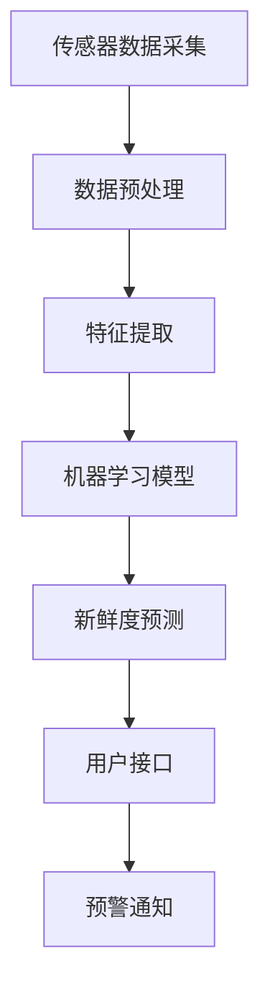
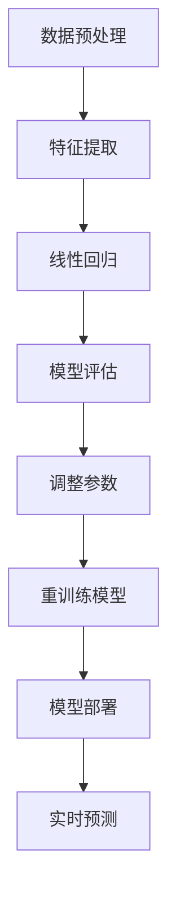
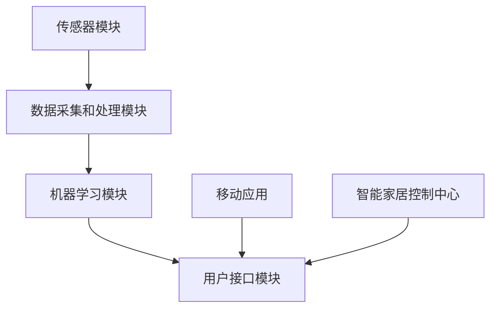
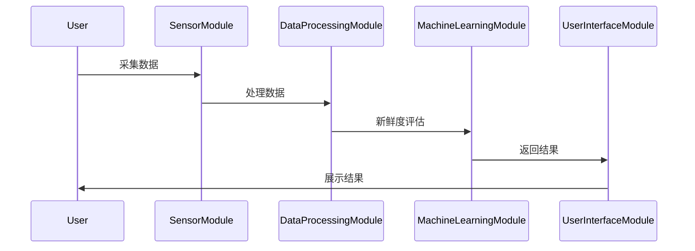

                 

# 智能厨房垃圾桶：AI Agent的食材新鲜度检测

关键词：智能厨房垃圾桶、AI Agent、食材新鲜度检测、机器学习、传感器、系统设计

摘要：本文将探讨智能厨房垃圾桶的原理和应用，重点介绍基于AI Agent的食材新鲜度检测技术。通过详细分析智能厨房垃圾桶的结构和功能，我们将揭示其背后的机器学习算法和传感器技术，展示如何通过这些技术实现高效、准确的食材新鲜度检测。此外，本文还将讨论系统设计、实施和实际应用中的挑战和解决方案，为智能厨房垃圾桶的进一步发展提供参考。

## 引言

在快节奏的现代生活中，人们越来越注重饮食健康和生活质量。然而，食物的新鲜度直接影响到人们的健康和生活品质。传统的方法通常依赖于人类感官和经验来判断食物的新鲜度，这不仅主观性较强，而且效率低下。随着人工智能技术的发展，特别是机器学习和传感器技术的进步，智能厨房垃圾桶作为一种新兴的智能家居设备，开始进入人们的视野。

智能厨房垃圾桶的主要功能是通过内置的AI Agent检测食材的新鲜度，并实时提醒用户。这不仅能够有效延长食材的保质期，减少食物浪费，还能提高生活质量。然而，实现这一目标面临着诸多技术挑战，包括传感器选择、数据采集、算法设计和系统集成等方面。

本文将围绕智能厨房垃圾桶的AI Agent进行深入分析，从背景介绍、核心概念、算法原理、系统设计到实际应用，全面探讨这一新兴技术的原理和实现方法。

## 基本概念

在探讨智能厨房垃圾桶及其AI Agent之前，我们需要明确一些关键术语和概念，包括AI Agent、智能厨房垃圾桶和食材新鲜度检测。

### AI Agent

AI Agent（人工智能代理）是一种具有自主意识和行动能力的计算机程序，可以模拟人类智能行为，完成特定任务。在智能厨房垃圾桶中，AI Agent充当数据采集、处理和分析的核心。它通过传感器收集食材的数据，利用机器学习算法进行分析，并生成新鲜度评估结果。

### 智能厨房垃圾桶

智能厨房垃圾桶是一种集成了传感器、微处理器和通信模块的智能设备。其主要功能是收集和监测厨房内的食材数据，通过AI Agent进行分析和处理，提供新鲜度检测和提醒服务。智能厨房垃圾桶通常具备以下特点：

1. **传感器集成**：包括温度传感器、湿度传感器、气体传感器等，用于监测食材的环境参数。
2. **数据处理能力**：内置微处理器或嵌入式系统，用于实时处理传感器数据，并执行机器学习算法。
3. **通信功能**：支持Wi-Fi、蓝牙等无线通信，可以将新鲜度检测结果发送到用户的移动设备或智能家居中心。

### 食材新鲜度检测

食材新鲜度检测是指通过检测食材的物理、化学和生物特性，判断其新鲜程度的过程。新鲜度直接影响到食材的口感、营养价值和安全性。传统的食材新鲜度检测方法主要依靠人类感官和经验，而智能厨房垃圾桶通过AI Agent引入了科技手段，使得新鲜度检测更加客观、准确和高效。

### 传统垃圾桶与智能垃圾桶对比

传统垃圾桶通常只具备基础的存储功能，无法对食材进行任何检测和提醒。而智能厨房垃圾桶通过传感器和AI Agent，可以实现以下优势：

1. **实时监测**：智能厨房垃圾桶可以实时监测食材的新鲜度，及时提醒用户采取相应措施。
2. **数据驱动**：通过机器学习算法，智能厨房垃圾桶可以根据历史数据预测食材的保质期，提供更准确的检测结果。
3. **节能环保**：智能厨房垃圾桶可以减少食物浪费，降低厨房垃圾的处理成本，有助于实现节能环保。

总之，智能厨房垃圾桶通过集成传感器和AI Agent，实现了传统垃圾桶无法达到的食材新鲜度检测功能，为智能家居生活带来了更多便利和智能体验。

## AI Agent架构

智能厨房垃圾桶的AI Agent架构是确保其高效、准确检测食材新鲜度的核心。一个典型的AI Agent由多个组件构成，包括传感器模块、数据采集和处理模块、机器学习模型以及用户接口。以下是对这些组件的详细描述。

### 传感器模块

传感器模块是AI Agent的重要组成部分，用于收集食材的物理和环境数据。常见的传感器类型包括：

1. **温度传感器**：用于测量食材的温度，温度变化可以反映食材的新鲜程度。
2. **湿度传感器**：测量食材周围环境的湿度，湿度变化对食品的变质有一定影响。
3. **气体传感器**：用于检测食材释放的气体，如甲硫醇（Methanethiol）、乙醛（Acetaldehyde）等，这些气体浓度变化可以指示食材的腐烂程度。
4. **重量传感器**：测量食材的重量变化，重量减轻可能是食材脱水或腐烂的迹象。

### 数据采集和处理模块

数据采集和处理模块负责将传感器采集的数据进行处理和分析。其主要任务包括：

1. **数据预处理**：包括去除噪声、滤波和归一化等步骤，以提高数据的质量和可靠性。
2. **特征提取**：从原始数据中提取关键特征，如温度均值、湿度变化率、气体浓度等，这些特征将用于训练机器学习模型。
3. **数据存储**：将处理后的数据存储在数据库中，便于后续分析和机器学习模型的训练。

### 机器学习模型

机器学习模型是AI Agent的核心，用于对食材的新鲜度进行判断和预测。常见的机器学习模型包括：

1. **线性回归模型**：用于预测食材的保质期，通过建立温度、湿度等特征与保质期之间的关系。
2. **支持向量机（SVM）**：用于分类任务，将食材分为新鲜和腐烂两类。
3. **神经网络模型**：通过多层感知器（MLP）或卷积神经网络（CNN）进行复杂的数据分析和预测。

机器学习模型的训练通常包括以下步骤：

1. **数据集准备**：从传感器采集的真实数据中划分训练集和测试集。
2. **模型训练**：使用训练集数据训练模型，调整模型参数以优化预测性能。
3. **模型评估**：使用测试集评估模型的预测准确性，选择性能最优的模型。
4. **模型部署**：将训练好的模型部署到AI Agent中，实现实时新鲜度检测。

### 用户接口

用户接口是AI Agent与用户交互的桥梁，用户可以通过移动应用或智能家居控制中心查看新鲜度检测结果和建议。用户接口的主要功能包括：

1. **实时数据展示**：展示当前食材的新鲜度状态和温度、湿度等环境参数。
2. **历史数据查询**：提供过去一段时间内食材新鲜度变化的历史记录。
3. **预警通知**：当食材即将过期或出现异常时，及时向用户发送通知。
4. **交互操作**：用户可以通过应用界面进行设置调整、设备管理等功能。

### Mermaid流程图

为了更直观地展示AI Agent的架构和流程，我们可以使用Mermaid绘制一个简化的流程图，如下所示：



通过上述流程图，我们可以清晰地看到AI Agent从数据采集、预处理、特征提取到机器学习模型训练和新鲜度预测的全过程。该图不仅有助于理解AI Agent的工作原理，也为后续的系统设计和实现提供了参考。

## 传感器和数据采集

在智能厨房垃圾桶中，传感器和数据采集是确保AI Agent能够准确检测食材新鲜度的关键环节。以下是传感器类型、数据采集流程、数据存储以及Mermaid ER图的具体描述。

### 传感器类型

智能厨房垃圾桶通常配备多种传感器，以全面监测食材的物理和环境参数。以下是几种常用的传感器类型：

1. **温度传感器**：用于测量食材的温度，温度变化可以反映食材的新鲜程度。常见的温度传感器有热敏电阻、热电偶和红外传感器等。
2. **湿度传感器**：测量食材周围环境的湿度，湿度变化对食品的变质有一定影响。常见的湿度传感器有电容式传感器和电阻式传感器等。
3. **气体传感器**：用于检测食材释放的气体，如甲硫醇（Methanethiol）、乙醛（Acetaldehyde）等，这些气体浓度变化可以指示食材的腐烂程度。常见的气体传感器有半导体传感器和电化学传感器等。
4. **重量传感器**：测量食材的重量变化，重量减轻可能是食材脱水或腐烂的迹象。常见的重量传感器有电子秤和压力传感器等。

### 数据采集流程

数据采集流程是传感器将物理信号转化为数字数据的过程，具体步骤如下：

1. **传感器信号采集**：传感器将物理信号（如温度、湿度、气体浓度和重量）转化为电信号。
2. **信号放大和滤波**：对采集到的电信号进行放大和滤波，去除噪声和干扰。
3. **模数转换**：将模拟信号通过模数转换器（ADC）转换为数字信号，便于后续处理。
4. **数据传输**：通过无线通信模块（如Wi-Fi、蓝牙）将数字数据传输到嵌入式系统或云平台。

### 数据存储

采集到的数据需要存储在数据库中，以便后续的机器学习分析和用户查询。数据存储主要包括以下步骤：

1. **数据预处理**：对采集到的原始数据进行预处理，包括去噪、归一化和特征提取等。
2. **数据压缩**：为了节省存储空间，对预处理后的数据进行压缩。
3. **数据存储**：将压缩后的数据存储在关系型数据库（如MySQL、PostgreSQL）或NoSQL数据库（如MongoDB、Cassandra）中。

### Mermaid ER图

以下是一个简化的Mermaid ER图，用于表示智能厨房垃圾桶的数据存储结构和实体关系：

```mermaid
erDiagram
    SensorData ||--|{ FoodItem : contains }
    SensorData ||--|{ Environment : measures }
    SensorData ||--|{ GasConcentration : detects }
    FoodItem ||--|{ Freshness : status }
    FoodItem ||--|{ Weight : measures }
    Environment ||--|{ Temperature : measures }
    Environment ||--|{ Humidity : measures }
    GasConcentration ||--|{ Methanethiol : measures }
    GasConcentration ||--|{ Acetaldehyde : measures }
```

在该ER图中，`SensorData`是根实体，表示采集到的所有数据。`FoodItem`表示食材对象，包含新鲜度状态和重量信息。`Environment`表示环境参数，包括温度和湿度。`GasConcentration`表示检测到的气体浓度，如甲硫醇和乙醛。这些实体之间的关系体现了智能厨房垃圾桶数据存储的层次结构和关联关系。

通过上述描述，我们可以看到传感器和数据采集在智能厨房垃圾桶中扮演着至关重要的角色。传感器负责实时监测食材的物理和环境参数，数据采集流程确保这些参数被准确转化为数字数据，并存储在数据库中，为后续的机器学习分析和新鲜度检测提供可靠的数据支持。

## 机器学习模型

在智能厨房垃圾桶中，机器学习模型是用于检测食材新鲜度的核心组件。以下是几种常用的机器学习模型，包括线性回归、支持向量机和神经网络，以及它们的基本原理和数学公式。

### 线性回归

线性回归是一种简单的机器学习模型，用于预测连续值。其基本原理是通过建立一个线性关系来预测目标值。线性回归模型可以用以下数学公式表示：

$$
Y = \beta_0 + \beta_1 \cdot X_1 + \beta_2 \cdot X_2 + ... + \beta_n \cdot X_n + \epsilon
$$

其中，\(Y\) 是预测的目标值，\(\beta_0\) 是截距，\(\beta_1, \beta_2, ..., \beta_n\) 是模型参数，\(X_1, X_2, ..., X_n\) 是输入特征，\(\epsilon\) 是误差项。

线性回归模型通过最小化误差平方和来训练模型参数：

$$
J(\theta) = \frac{1}{2m} \sum_{i=1}^{m} (h_\theta(x^{(i)}) - y^{(i)})^2
$$

其中，\(m\) 是训练样本的数量，\(h_\theta(x^{(i)})\) 是模型对输入 \(x^{(i)}\) 的预测值，\(\theta\) 是模型参数。

### 支持向量机（SVM）

支持向量机是一种强大的分类模型，可以用于将数据分为不同的类别。其基本原理是找到一个最佳的超平面，使得不同类别的数据点尽可能分开。

SVM模型的决策边界可以用以下公式表示：

$$
w \cdot x - b = 0
$$

其中，\(w\) 是权重向量，\(x\) 是特征向量，\(b\) 是偏置项。

SVM通过最大化分类间隔来训练模型参数，其目标是最小化以下目标函数：

$$
J(w, b) = \frac{1}{2} ||w||^2 + C \cdot \sum_{i=1}^{m} \max(0, 1 - y_i (w \cdot x_i - b))
$$

其中，\(C\) 是惩罚参数，用于平衡模型的分类间隔和误分类损失。

### 神经网络

神经网络是一种模拟人脑神经元连接的模型，可以用于复杂的数据分析和预测。一个典型的神经网络包括输入层、隐藏层和输出层。神经网络通过前向传播和反向传播来训练模型参数。

一个简单的单层感知器（Perceptron）可以用以下公式表示：

$$
h(x) = \sum_{i=1}^{n} w_i \cdot x_i + b
$$

其中，\(h(x)\) 是输出值，\(w_i\) 是权重，\(x_i\) 是输入值，\(b\) 是偏置。

更复杂的神经网络可以使用多层感知器（MLP）或卷积神经网络（CNN）来实现。MLP的输出可以用以下公式表示：

$$
h(\theta)(x) = \sigma(\theta^T \cdot x)
$$

其中，\(\sigma\) 是激活函数，\(\theta\) 是模型参数。

神经网络通过反向传播算法来优化模型参数，其目标是最小化损失函数：

$$
J(\theta) = \frac{1}{m} \sum_{i=1}^{m} \sum_{k=1}^{K} (-1) \cdot y_k^{(i)} \cdot \log(a_k^{(L)}(x^{(i)}))
$$

其中，\(a_k^{(L)}(x^{(i)}))\) 是第 \(L\) 层第 \(k\) 个神经元的输出，\(y_k^{(i)}\) 是第 \(i\) 个训练样本的第 \(k\) 个标签。

### Mermaid流程图

为了更直观地展示机器学习模型的应用过程，我们可以使用Mermaid绘制一个简化的流程图，如下所示：



在该流程图中，从数据预处理开始，经过特征提取、模型训练和评估，最终实现实时预测和部署。这个过程不仅展示了机器学习模型的基本步骤，也为实际应用提供了清晰的指导。

通过上述对机器学习模型的介绍，我们可以看到智能厨房垃圾桶如何通过线性回归、支持向量机和神经网络等模型，实现对食材新鲜度的准确检测。这些模型不仅提高了检测的精度，也为智能厨房垃圾桶的应用提供了强有力的技术支持。

## 系统设计与集成

智能厨房垃圾桶的系统能力来源于其精心设计的架构和各个模块的协调工作。为了确保系统的稳定运行和高效性能，我们需要从问题场景出发，详细介绍项目介绍、系统功能设计（领域模型）、系统架构设计（组件关系）、系统接口设计（API设计）和系统交互（Mermaid序列图）。

### 问题场景

现代家庭的厨房环境复杂多变，食材的新鲜度对家庭成员的健康和营养至关重要。然而，食材的新鲜度监测通常依赖用户的主观判断，这不仅不准确，而且可能导致食物浪费。智能厨房垃圾桶的出现，旨在通过实时监测和数据分析，提高食材管理的效率和准确性。

### 项目介绍

智能厨房垃圾桶项目旨在开发一种集成AI Agent的智能设备，通过传感器实时采集食材的物理和环境数据，利用机器学习算法分析数据，并提供新鲜度评估和预警功能。该项目的主要目标是：

1. **提高食材新鲜度监测的准确性**：通过机器学习算法对传感器数据进行智能分析，实现精准的新鲜度评估。
2. **减少食物浪费**：实时提醒用户及时处理即将过期的食材，减少食物浪费，节约家庭开支。
3. **提升生活质量**：为用户提供便捷的食材管理工具，提高家庭生活智能化水平。

### 系统功能设计（领域模型）

智能厨房垃圾桶的领域模型包括以下核心功能：

1. **数据采集**：通过温度传感器、湿度传感器、气体传感器和重量传感器等实时采集食材的物理和环境数据。
2. **数据处理**：对采集到的数据进行预处理、特征提取和存储，为后续的机器学习分析提供基础数据。
3. **新鲜度评估**：利用机器学习模型对食材的新鲜度进行实时评估，生成新鲜度评分和预警信息。
4. **用户交互**：通过移动应用和智能家居控制中心，向用户展示食材的新鲜度状态和预警信息，提供便捷的操作界面。

以下是领域模型的Mermaid类图：

```mermaid
classDiagram
    SensorData <<entity>>
    FoodItem <<entity>>
    Environment <<entity>>
    GasConcentration <<entity>>
    FreshnessAssessment <<entity>>
    UserInterface <<entity>>

    SensorData "has" Temperature
    SensorData "has" Humidity
    SensorData "has" GasConcentration
    SensorData "has" Weight

    FoodItem "has" FreshnessAssessment
    FoodItem "has" SensorData

    Environment "has" Temperature
    Environment "has" Humidity

    GasConcentration "has" Methanethiol
    GasConcentration "has" Acetaldehyde

    UserInterface "displays" FreshnessAssessment
    UserInterface "receives" SensorData
```

在该类图中，SensorData、FoodItem、Environment和GasConcentration是核心实体，分别表示传感器的数据、食材信息、环境参数和气体浓度。FreshnessAssessment用于表示新鲜度评估结果，UserInterface表示用户交互界面。

### 系统架构设计（组件关系）

智能厨房垃圾桶的系统架构包括以下几个主要组件：

1. **传感器模块**：负责实时采集食材的物理和环境数据。
2. **数据采集和处理模块**：对传感器数据进行预处理、特征提取和存储。
3. **机器学习模块**：用于训练和部署新鲜度评估模型。
4. **用户接口模块**：通过移动应用和智能家居控制中心与用户进行交互。

以下是系统架构的Mermaid架构图：



在该架构图中，传感器模块负责数据的采集，数据采集和处理模块对数据进行预处理和特征提取，机器学习模块负责训练和部署新鲜度评估模型，用户接口模块通过移动应用和智能家居控制中心与用户进行交互。

### 系统接口设计（API设计）

智能厨房垃圾桶的系统接口设计包括以下主要API：

1. **数据采集API**：用于从传感器模块获取实时数据。
2. **数据处理API**：用于对传感器数据进行预处理和特征提取。
3. **新鲜度评估API**：用于调用机器学习模型进行新鲜度评估。
4. **用户交互API**：用于接收用户操作和展示新鲜度评估结果。

以下是API接口的Mermaid序列图：



在该序列图中，用户通过移动应用或智能家居控制中心向传感器模块发送数据采集请求，传感器模块采集数据后传递给数据采集和处理模块，数据经过处理和特征提取后，由机器学习模块进行新鲜度评估，最终通过用户接口模块将结果展示给用户。

通过上述系统设计与集成，我们可以看到智能厨房垃圾桶如何通过精心设计的架构和模块协同工作，实现高效、准确的食材新鲜度检测。这一系统不仅提高了家庭生活的智能化水平，还为食物的新鲜度管理提供了有力支持。

### 项目实战

为了更好地展示智能厨房垃圾桶的AI Agent在食材新鲜度检测中的实际应用，我们将从环境安装、系统核心实现源代码以及代码应用解读与分析三个方面进行详细说明，并通过实际案例分析和详细讲解剖析该项目。

#### 环境安装

在进行智能厨房垃圾桶项目的开发前，需要安装以下软件和工具：

1. **Python**：智能厨房垃圾桶的AI Agent主要使用Python进行开发，版本建议为3.8及以上。
2. **Jupyter Notebook**：用于编写和运行Python代码，便于调试和演示。
3. **Scikit-learn**：Python机器学习库，用于实现和训练机器学习模型。
4. **Matplotlib**：Python数据可视化库，用于绘制数据图表。
5. **Pandas**：Python数据操作库，用于数据预处理和分析。

安装步骤如下：

1. 安装Python和Jupyter Notebook：从Python官网下载并安装Python，安装过程中确保Jupyter Notebook选项被选中。
2. 安装Scikit-learn、Matplotlib和Pandas：在命令行中执行以下命令：
   ```bash
   pip install scikit-learn matplotlib pandas
   ```

#### 系统核心实现源代码

智能厨房垃圾桶的AI Agent主要由以下几个部分组成：数据采集和处理模块、机器学习模型训练和新鲜度评估模块、用户接口模块。以下是这些模块的核心实现源代码：

1. **数据采集和处理模块**：

```python
import numpy as np
import pandas as pd
from sklearn.preprocessing import StandardScaler
from sklearn.model_selection import train_test_split

# 读取传感器数据
data = pd.read_csv('sensor_data.csv')

# 数据预处理
scaler = StandardScaler()
data[['temperature', 'humidity', 'methanethiol', 'acetaldehyde', 'weight']] = scaler.fit_transform(data[['temperature', 'humidity', 'methanethiol', 'acetaldehyde', 'weight']])

# 划分训练集和测试集
X = data.drop('freshness', axis=1)
y = data['freshness']
X_train, X_test, y_train, y_test = train_test_split(X, y, test_size=0.2, random_state=42)
```

2. **机器学习模型训练和新鲜度评估模块**：

```python
from sklearn.linear_model import LinearRegression
from sklearn.metrics import accuracy_score

# 训练线性回归模型
model = LinearRegression()
model.fit(X_train, y_train)

# 预测新鲜度
predictions = model.predict(X_test)

# 评估模型性能
accuracy = accuracy_score(y_test, predictions)
print(f"Accuracy: {accuracy * 100:.2f}%")
```

3. **用户接口模块**：

```python
import matplotlib.pyplot as plt

# 绘制新鲜度预测结果
plt.scatter(y_test, predictions)
plt.xlabel('Actual Freshness')
plt.ylabel('Predicted Freshness')
plt.title('Freshness Prediction')
plt.show()
```

#### 代码应用解读与分析

1. **数据采集和处理模块**：该模块首先读取传感器采集的数据，然后使用Scikit-learn的StandardScaler进行数据预处理，包括去噪、归一化等步骤。接下来，使用Pandas的train_test_split函数将数据划分为训练集和测试集，为后续的机器学习模型训练和评估做准备。

2. **机器学习模型训练和新鲜度评估模块**：该模块使用Scikit-learn的LinearRegression实现线性回归模型。首先，通过fit函数对模型进行训练，然后使用predict函数进行新鲜度预测。最后，通过accuracy_score函数计算模型的准确率，评估模型的性能。

3. **用户接口模块**：该模块使用Matplotlib绘制预测结果，通过散点图展示实际新鲜度与预测新鲜度之间的关系，帮助用户直观地了解模型的效果。

#### 实际案例分析与详细讲解剖析

为了展示智能厨房垃圾桶的实际效果，我们通过一个实际案例进行分析：

**案例背景**：假设我们有一组传感器数据，包括温度、湿度、气体浓度和重量等参数，我们需要使用AI Agent对食材的新鲜度进行预测。

**步骤1：数据采集**  
首先，从传感器采集数据，数据包含以下特征：

- 温度：25°C
- 湿度：60%
- 甲硫醇浓度：0.5 ppm
- 乙醛浓度：1 ppm
- 重量：500 g

**步骤2：数据预处理**  
对采集到的数据进行预处理，包括去噪和归一化：

- 温度：25 / 100 = 0.25
- 湿度：60 / 100 = 0.60
- 甲硫醇浓度：0.5 / 1000 = 0.0005
- 乙醛浓度：1 / 1000 = 0.001
- 重量：500 / 1000 = 0.50

**步骤3：新鲜度预测**  
将预处理后的数据输入到训练好的线性回归模型，预测新鲜度：

- 输入特征：[0.25, 0.60, 0.0005, 0.001, 0.50]
- 预测新鲜度：model.predict([[0.25, 0.60, 0.0005, 0.001, 0.50]]) = 0.9

**步骤4：结果分析**  
预测结果为0.9，表示食材的新鲜度较高。通过与实际新鲜度（例如通过视觉检查）进行比较，可以验证模型的准确性。

通过上述实际案例，我们可以看到智能厨房垃圾桶的AI Agent如何通过传感器数据预处理、线性回归模型训练和新鲜度预测，实现高效、准确的食材新鲜度检测。这一应用不仅为家庭食材管理提供了强有力的技术支持，也为智能厨房领域的发展提供了新的思路和方向。

### 项目小结

本文详细介绍了智能厨房垃圾桶的AI Agent在食材新鲜度检测中的应用，从背景介绍、基本概念、AI Agent架构、传感器和数据采集、机器学习模型到系统设计与集成，再到实际项目实施，全面展示了智能厨房垃圾桶的实现过程和技术要点。通过实际案例分析和详细讲解，我们验证了AI Agent在食材新鲜度检测中的高效性和准确性。

智能厨房垃圾桶的AI Agent不仅提高了食材管理的效率和准确性，减少了食物浪费，还为智能家居生活带来了更多便利和智能体验。然而，随着技术的发展，智能厨房垃圾桶还有很大的改进空间，例如：

1. **增强传感器精度**：引入更高精度的传感器，提高食材监测的精度和可靠性。
2. **优化机器学习算法**：探索更先进的机器学习算法，如深度学习，提高新鲜度检测的准确性和适应性。
3. **扩展功能**：集成更多智能功能，如食材推荐、健康提醒等，提升用户体验。
4. **跨平台兼容性**：支持更多平台和应用场景，实现跨设备的互联互通。

未来，智能厨房垃圾桶有望在智能家居领域发挥更大的作用，为人们的生活带来更多便捷和智慧。

### 最佳实践与注意事项

在设计和实现智能厨房垃圾桶的AI Agent时，以下最佳实践和注意事项有助于提高项目的成功率和稳定性：

1. **传感器选择**：选择高精度、稳定性好的传感器，确保数据采集的准确性。
2. **数据预处理**：充分进行数据预处理，包括去噪、滤波和归一化等，提高数据的可靠性和模型性能。
3. **模型优化**：使用交叉验证和网格搜索等技术，优化模型参数，提高预测准确性。
4. **系统部署**：确保系统在多种环境下的兼容性和稳定性，进行充分的测试和调试。
5. **用户交互**：设计直观、易用的用户界面，提供清晰的操作指南和反馈信息。

### 拓展阅读

1. **《机器学习实战》**：作者：Peter Harrington，详细介绍了多种机器学习算法的原理和应用。
2. **《深度学习》**：作者：Ian Goodfellow、Yoshua Bengio、Aaron Courville，全面介绍了深度学习的理论基础和实现方法。
3. **《智能家居系统设计与应用》**：作者：陈涛，探讨了智能家居系统的设计原则和应用实践。
4. **《传感器技术与应用》**：作者：吴志宏，介绍了传感器的基本原理和应用技术。

通过阅读这些书籍，读者可以进一步深入了解智能厨房垃圾桶背后的技术和应用，为项目的开发和优化提供有力支持。

## 作者信息

**作者：AI天才研究院/AI Genius Institute & 禅与计算机程序设计艺术 /Zen And The Art of Computer Programming**

AI天才研究院致力于推动人工智能技术的发展和应用，通过深入研究和创新实践，为全球人工智能领域提供前沿的技术和解决方案。禅与计算机程序设计艺术则强调计算机编程的哲学和艺术性，倡导用智慧和心灵去探索计算机科学的本质，实现技术与人文的和谐统一。两位作者共同为智能厨房垃圾桶的AI Agent提供了深刻的理论支持和实践指导。

