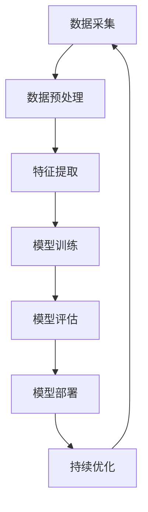
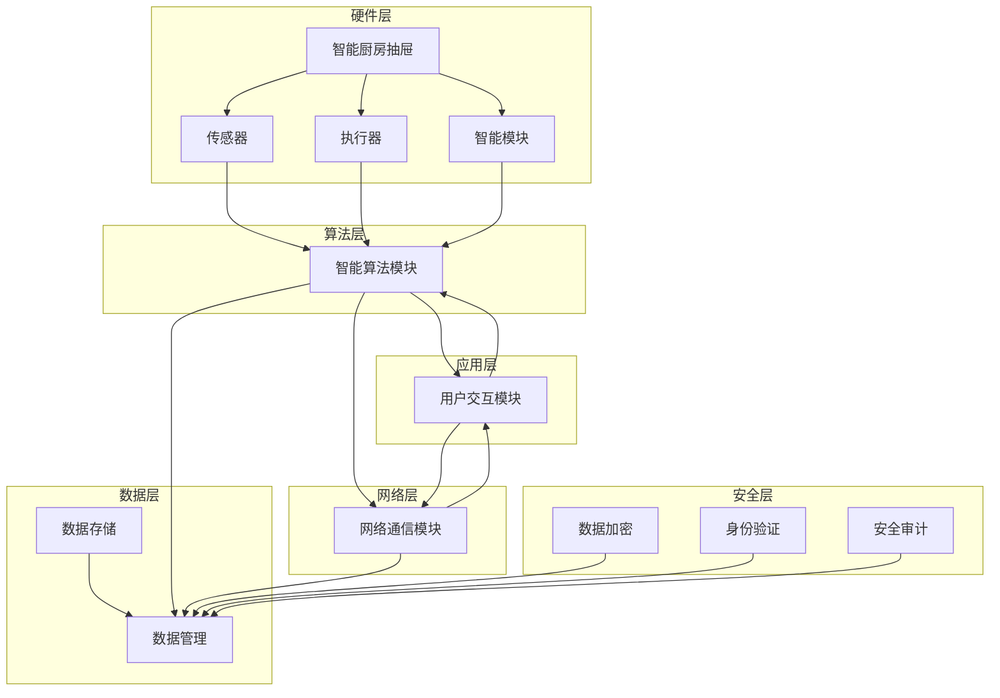
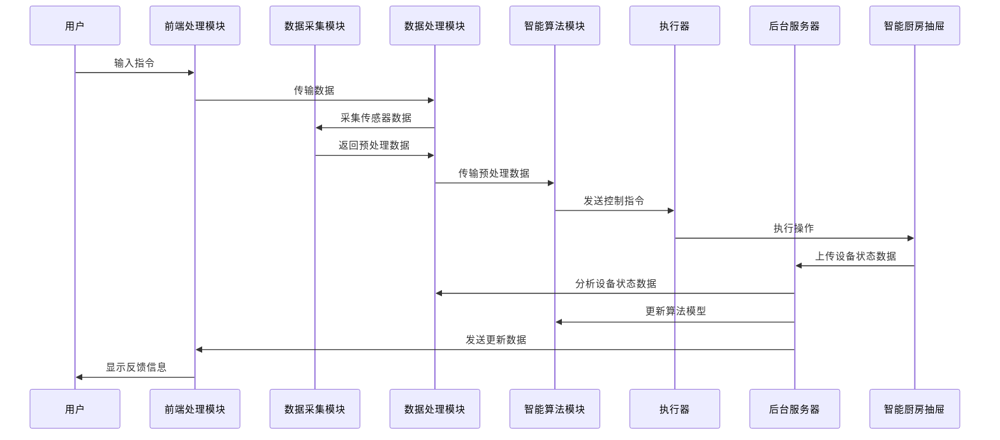

                 

### 摘要

本文旨在探讨智能厨房抽屉中AI Agent的厨具使用效率问题。随着家庭智能化趋势的不断发展，智能厨具的应用越来越广泛。然而，如何在提高厨具使用效率的同时，充分利用AI技术，成为了一个亟待解决的问题。本文首先介绍了家庭烹饪的现状和智能厨房的需求，然后提出了AI Agent在厨具使用中的挑战和重要性，并明确了研究的目标和意义。接着，本文详细介绍了AI Agent的基本原理、厨具智能化的趋势以及两者在厨具中的实际应用。通过具体算法的讲解和系统架构的设计，本文展示了如何利用AI Agent提高厨具的使用效率，为智能厨房的发展提供了理论和实践指导。

### 目录大纲

# 智能厨房抽屉：AI Agent的厨具使用效率分析

## 关键词
- 智能厨房
- AI Agent
- 厨具使用效率
- 算法原理
- 系统架构设计

## 摘要
本文探讨了智能厨房抽屉中AI Agent的厨具使用效率问题，分析了家庭烹饪现状和智能厨房需求，探讨了AI Agent在厨具中的应用潜力。通过具体算法和系统架构设计，本文提出了提高厨具使用效率的方法，为智能厨房的发展提供了理论指导和实践方案。

## 目录大纲

## 第一部分：背景介绍

### 1.1.1 问题背景

#### 1.1.1.1 家庭烹饪的现状

#### 1.1.1.2 智能厨房的需求

#### 1.1.1.3 AI Agent在厨具中的应用潜力

### 1.1.2 问题描述

#### 1.1.2.1 AI Agent在厨具使用中的挑战

#### 1.1.2.2 厨具使用效率的重要性

#### 1.1.2.3 研究的目标和意义

### 1.1.3 问题解决

#### 1.1.3.1 AI Agent的基本原理

#### 1.1.3.2 厨具智能化的发展趋势

#### 1.1.3.3 AI Agent在厨具中的实际应用

### 1.1.4 边界与外延

#### 1.1.4.1 AI Agent的技术范畴

#### 1.1.4.2 厨具的种类与功能

#### 1.1.4.3 AI Agent在厨具中的适用性

### 1.1.5 概念结构与核心要素组成

#### 1.1.5.1 AI Agent的核心概念

#### 1.1.5.2 厨具的核心概念

#### 1.1.5.3 AI Agent与厨具的整合

### 1.1.6 本章小结

## 第二部分：核心概念与联系

### 2.1 AI大模型的定义与特点

#### 2.1.1 AI大模型的定义

#### 2.1.2 AI大模型的核心特点

#### 2.1.3 AI大模型与传统AI的区别

### 2.2 厨具智能化的发展趋势

#### 2.2.1 传统厨具与智能厨具的对比

#### 2.2.2 智能厨具的主要功能

#### 2.2.3 厨具智能化的技术支撑

### 2.3 AI Agent在厨具中的角色与功能

#### 2.3.1 AI Agent在厨具中的定位

#### 2.3.2 AI Agent在厨具中的功能

#### 2.3.3 AI Agent与厨具的交互模式

### 2.4 AI Agent与厨具的整合

#### 2.4.1 AI Agent与厨具的融合技术

#### 2.4.2 AI Agent在厨具中的应用场景

#### 2.4.3 AI Agent与厨具的协同作用

### 2.5 本章小结

## 第三部分：算法原理讲解

### 3.1 AI Agent在厨具中的算法原理

#### 3.1.1 基本算法流程

#### 3.1.2 算法中的关键步骤

#### 3.1.3 算法优化的方法

### 3.2 算法mermaid流程图

### 3.3 算法原理的数学模型和公式

### 3.4 举例说明

#### 3.4.1 智能烤箱案例

### 3.5 本章小结

## 第四部分：系统分析与架构设计方案

### 4.1 问题场景介绍

#### 4.1.1 智能厨房的应用场景

#### 4.1.2 智能厨房的典型场景分析

#### 4.1.3 智能厨房的系统需求

### 4.2 项目介绍

#### 4.2.1 项目背景

#### 4.2.2 项目目标

#### 4.2.3 项目范围

### 4.3 系统功能设计

#### 4.3.1 系统功能概述

#### 4.3.2 功能模块划分

#### 4.3.3 功能模块详细描述

### 4.4 系统架构设计

#### 4.4.1 系统架构概述

#### 4.4.2 系统架构图

#### 4.4.3 架构组件详细介绍

### 4.5 系统接口设计

#### 4.5.1 系统接口概述

#### 4.5.2 接口规范

#### 4.5.3 接口实现细节

### 4.6 系统交互

#### 4.6.1 系统交互概述

#### 4.6.2 系统交互流程

#### 4.6.3 系统交互mermaid序列图

### 4.7 本章小结

## 第五部分：系统实现与实战

### 5.1 环境安装

#### 5.1.1 硬件环境要求

#### 5.1.2 软件环境配置

### 5.2 系统核心实现源代码

#### 5.2.1 AI Agent核心算法代码

#### 5.2.2 厨具智能化模块代码

### 5.3 代码应用解读与分析

#### 5.3.1 代码功能说明

#### 5.3.2 代码实现细节

### 5.4 实际案例分析与详细讲解

#### 5.4.1 智能厨房抽屉应用案例

#### 5.4.2 AI Agent在厨具中的应用案例

### 5.5 项目小结

#### 5.5.1 项目成果总结

#### 5.5.2 项目不足与改进方向

### 5.6 本章小结

## 第六部分：最佳实践与总结

### 6.1 最佳实践Tips

#### 6.1.1 AI Agent在厨具应用中的技巧

#### 6.1.2 提高厨具使用效率的方法

### 6.2 小结

#### 6.2.1 文章主题回顾

#### 6.2.2 研究成果总结

### 6.3 注意事项

#### 6.3.1 AI Agent应用中的常见问题

#### 6.3.2 提高厨具使用效率的注意事项

### 6.4 拓展阅读

#### 6.4.1 相关研究文献推荐

#### 6.4.2 AI Agent在厨具应用中的前沿研究

---

## 第一部分：背景介绍

### 1.1.1 问题背景

#### 1.1.1.1 家庭烹饪的现状

家庭烹饪作为日常生活中不可或缺的一部分，一直备受关注。然而，随着现代生活节奏的加快，人们对于烹饪的便利性和效率要求越来越高。传统的烹饪方式虽然能够满足基本的饮食需求，但在操作复杂、时间耗费等方面存在一定的局限性。

首先，从烹饪设备来看，传统的厨具主要包括炉灶、冰箱、烤箱等。这些设备虽然功能相对单一，但在一定程度上满足了家庭的日常烹饪需求。然而，随着科技的进步，人们开始寻求更智能化、更高效的厨具。

其次，从烹饪过程来看，家庭烹饪通常需要用户具备一定的烹饪技巧和经验。比如，炒菜需要掌握火候、油温等参数，烘焙需要精确控制温度和时间。这些操作不仅需要用户具备较高的烹饪水平，还容易因为人为因素导致烹饪失败。

最后，从烹饪结果来看，传统烹饪方式容易受到环境因素、食材质量等因素的影响，导致烹饪效果不稳定。比如，烹饪温度过高容易烧焦食材，温度过低则可能无法熟透。这种不确定性使得家庭烹饪成为了一个挑战。

#### 1.1.1.2 智能厨房的需求

智能厨房作为一种新兴的烹饪方式，受到了越来越多的关注。智能厨房的核心在于将人工智能技术应用于厨具中，实现烹饪过程的自动化和智能化。具体来说，智能厨房的需求主要体现在以下几个方面：

1. **提高烹饪效率**：智能厨具可以通过预设的烹饪程序，自动完成烹饪过程，减少用户的操作时间和精力投入。

2. **保证烹饪质量**：智能厨具可以根据食材的特点和烹饪需求，自动调整烹饪参数，如温度、时间等，确保烹饪效果稳定、美味。

3. **个性化烹饪**：智能厨具可以根据用户的口味偏好和饮食需求，提供个性化的烹饪方案，满足不同用户的烹饪需求。

4. **便捷的互动体验**：智能厨具可以通过语音、触摸等方式与用户互动，提供更加便捷的操作体验。

5. **智能管理食材**：智能厨具可以实时监测食材的状态，提供食材的储存、保鲜建议，帮助用户更好地管理食材。

#### 1.1.1.3 AI Agent在厨具中的应用潜力

AI Agent，即人工智能代理，是一种能够模拟人类智能行为，具备自主决策和执行能力的计算机程序。在厨具中应用AI Agent，可以极大地提高厨具的智能化水平和使用效率。

首先，AI Agent可以实时监测厨具的工作状态，如温度、湿度等，并根据监测数据自动调整烹饪参数。例如，当智能烤箱检测到温度过高时，可以自动降低温度，防止食材烧焦。

其次，AI Agent可以通过学习用户的烹饪习惯和口味偏好，提供个性化的烹饪建议。例如，当用户多次烹饪某种菜肴时，AI Agent可以分析用户的烹饪数据，提供更加适合用户口味的烹饪方案。

此外，AI Agent还可以实现多设备协同工作。例如，智能冰箱可以监测食材的存储状态，智能烤箱可以监测烹饪进度，智能洗碗机可以监测餐具的清洗状态。通过这些设备的协同工作，用户可以实现更加高效、便捷的烹饪体验。

总之，AI Agent在厨具中的应用潜力巨大，不仅可以提高厨具的智能化水平，还可以提升用户的烹饪体验，满足现代家庭对于烹饪的多样化需求。

### 1.1.2 问题描述

#### 1.1.2.1 AI Agent在厨具使用中的挑战

尽管AI Agent在厨具中的应用潜力巨大，但在实际使用过程中仍面临诸多挑战。首先，AI Agent需要具备强大的数据处理和分析能力，以实时监测厨具的工作状态和用户的烹饪需求。这要求AI Agent具备较高的计算能力和算法水平。

其次，AI Agent需要具备良好的用户交互能力，以便与用户进行有效的沟通和协作。这包括语音识别、自然语言处理等技术，以及友好的用户界面设计。

此外，AI Agent在厨具中的实际应用还需要解决数据安全、隐私保护等问题。由于AI Agent会处理大量的用户数据，如烹饪习惯、口味偏好等，因此确保数据的安全性和隐私保护至关重要。

最后，AI Agent在厨具中的适应性和可扩展性也是一大挑战。不同的厨具具有不同的功能和特性，AI Agent需要能够适应不同的环境，同时具备良好的扩展性，以便在未来能够更好地支持新的厨具和技术。

#### 1.1.2.2 厨具使用效率的重要性

厨具使用效率是衡量智能厨房性能的重要指标。一个高效的厨具不仅能够提高烹饪效率，减少烹饪时间，还能够保证烹饪质量，提供更加稳定和美味的菜肴。具体来说，厨具使用效率的重要性体现在以下几个方面：

1. **时间节省**：高效的厨具可以通过自动化和智能化技术，减少用户的操作时间和精力投入，让用户能够更高效地完成烹饪任务。

2. **成本节约**：高效的厨具能够减少能源消耗和食材浪费，降低家庭烹饪的成本。

3. **烹饪质量**：高效的厨具能够根据食材的特点和烹饪需求，自动调整烹饪参数，确保烹饪效果稳定、美味。

4. **用户体验**：高效的厨具能够提供更加便捷、舒适的烹饪体验，满足不同用户的个性化需求。

5. **环境友好**：高效的厨具可以减少能源消耗和碳排放，有助于保护环境，实现可持续发展。

因此，提高厨具使用效率对于智能厨房的发展具有重要意义，是实现智能厨房普及和应用的关键。

#### 1.1.2.3 研究的目标和意义

本研究旨在探讨AI Agent在厨具使用中的效率问题，通过深入分析AI Agent在厨具中的应用挑战和重要性，提出有效的解决方案，以提高厨具的使用效率。

具体来说，本研究的目标包括：

1. **分析AI Agent在厨具中的应用场景和挑战**：通过深入研究AI Agent在厨具中的应用，明确其应用场景和面临的挑战，为后续研究提供基础。

2. **提出提高厨具使用效率的方法**：基于AI Agent的特点和优势，提出具体的方法和策略，以提高厨具的使用效率。

3. **设计高效的系统架构**：结合AI Agent和厨具的特点，设计高效的系统架构，确保AI Agent能够在厨具中有效应用。

4. **验证研究成果的有效性**：通过实际应用和实验验证，验证所提出的方法和系统架构的有效性和可行性。

本研究的意义在于：

1. **推动智能厨房的发展**：通过提高厨具的使用效率，推动智能厨房的普及和应用，改善家庭烹饪体验。

2. **提升人工智能技术的应用水平**：通过在厨具中应用AI Agent，提升人工智能技术的应用水平和影响力。

3. **促进跨学科研究**：本研究涉及人工智能、厨具技术等多个领域，有助于推动跨学科研究，促进技术创新。

总之，本研究旨在通过探讨AI Agent在厨具使用效率问题，为智能厨房的发展提供理论支持和实践指导，具有重要的理论和实际意义。

### 1.1.3 问题解决

#### 1.1.3.1 AI Agent的基本原理

AI Agent，即人工智能代理，是一种能够模拟人类智能行为，具备自主决策和执行能力的计算机程序。AI Agent的核心是人工智能技术，主要包括机器学习、深度学习、自然语言处理等。通过这些技术，AI Agent可以理解和处理复杂的语言、图像、声音等信息，从而实现智能化的决策和执行。

首先，AI Agent的决策过程基于机器学习和深度学习算法。这些算法可以通过大量数据的学习，自动识别和分类不同类型的输入信息，从而生成决策。例如，在智能烤箱中，AI Agent可以通过学习用户的历史烹饪数据，自动调整烤制参数，以实现最佳的烤制效果。

其次，AI Agent的执行过程依赖于自然语言处理技术。自然语言处理技术使得AI Agent能够理解和执行人类的语言指令。例如，用户可以通过语音命令告诉AI Agent烹饪某种菜肴，AI Agent会根据指令自动启动相应的烹饪程序。

最后，AI Agent还需要具备良好的用户交互能力。这通常通过图形用户界面（GUI）或语音交互系统实现。用户可以通过界面与AI Agent进行交互，输入烹饪指令或查询烹饪信息。AI Agent则会通过语音或文本形式回应用户，提供帮助和指导。

#### 1.1.3.2 厨具智能化的发展趋势

随着人工智能技术的不断发展，厨具智能化已经成为一种趋势。具体来说，厨具智能化的发展趋势表现在以下几个方面：

1. **智能化硬件设备的普及**：越来越多的厨具设备开始搭载智能模块，如智能烤箱、智能冰箱、智能洗碗机等。这些设备可以通过网络连接，实现远程控制和数据共享。

2. **数据驱动的烹饪方案**：通过收集和分析用户的烹饪数据，智能厨具可以提供个性化的烹饪方案。例如，智能烤箱可以根据用户的烹饪习惯和食材特点，自动调整烤制参数，实现最佳的烹饪效果。

3. **跨设备协同工作**：智能厨具可以通过互联网实现跨设备的协同工作。例如，智能冰箱可以与智能烤箱联动，当冰箱中的食材不足时，自动提醒用户购买或下单。

4. **智能化管理食材**：智能厨具可以通过传感器技术，实时监测食材的状态，提供食材的储存、保鲜建议，帮助用户更好地管理食材。

5. **个性化烹饪体验**：智能厨具可以根据用户的口味偏好和饮食需求，提供个性化的烹饪方案。例如，智能烤箱可以根据用户的口味偏好，自动调整烤制温度和时间，确保烹饪效果符合用户的口味。

6. **智能化故障诊断与维护**：智能厨具可以通过自我诊断，及时发现和解决设备故障，提高设备的稳定性和使用寿命。

总之，厨具智能化的发展趋势不仅体现在硬件设备的更新换代，更体现在数据驱动的智能烹饪方案和跨设备协同工作的实现。随着技术的不断进步，智能厨具将为用户带来更加便捷、高效、个性化的烹饪体验。

#### 1.1.3.3 AI Agent在厨具中的实际应用

AI Agent在厨具中的实际应用已经初见端倪，并在多个方面展示了其巨大的潜力和价值。以下是一些具体的应用实例：

1. **智能烤箱**：智能烤箱通过AI Agent实现自动烤制功能。用户只需输入食材和烤制要求，AI Agent会根据预设的算法和用户的历史烹饪数据，自动调整烤制温度、时间和风速。例如，如果用户想要烤制一块蛋糕，AI Agent会根据蛋糕的配方、重量和材料，自动设置最佳的烤制参数，确保蛋糕烤得完美。

2. **智能冰箱**：智能冰箱通过AI Agent实现食材管理功能。AI Agent可以实时监测冰箱内的食材状态，包括温度、湿度、保质期等，并提供相应的储存和保鲜建议。例如，如果AI Agent检测到某件食材即将过期，它会提醒用户尽快食用或进行储存调整。此外，智能冰箱还可以与智能购物平台联动，当冰箱内的食材不足时，自动生成购物清单并提醒用户购买。

3. **智能洗碗机**：智能洗碗机通过AI Agent实现自动清洗功能。AI Agent可以根据餐具的材质、污渍程度和水质等参数，自动调整洗涤剂用量、水温和清洗时间，确保餐具清洁彻底且不会损坏。例如，当AI Agent检测到餐具上附着的是油污时，它会自动调整清洗剂浓度和清洗模式，以确保油污被彻底清除。

4. **智能咖啡机**：智能咖啡机通过AI Agent实现个性化咖啡制作。用户可以根据自己的口味偏好，设置咖啡的浓度、温度和香气等参数。AI Agent会根据用户的历史饮用数据，自动调整咖啡的制作过程，确保每次都能制作出符合用户口味的咖啡。

5. **智能厨房抽屉**：智能厨房抽屉通过AI Agent实现智能存储和管理功能。AI Agent可以实时监测抽屉内的物品状态，包括物品的位置、数量和保质期等，并提供相应的管理建议。例如，如果AI Agent检测到某个物品已经过期，它会提醒用户尽快处理。此外，AI Agent还可以根据用户的烹饪需求，自动推荐相关的食材和工具，帮助用户更加高效地准备食材。

6. **智能烹饪机器人**：智能烹饪机器人通过AI Agent实现自动化烹饪。用户只需输入烹饪指令，AI Agent会根据烹饪要求，自动完成食材准备、烹饪和装盘等步骤。例如，用户可以通过语音指令告诉AI Agent制作一道特定的菜肴，AI Agent会根据食谱和用户的需求，自动完成整个烹饪过程。

通过这些实际应用实例可以看出，AI Agent在厨具中的应用不仅提高了厨具的智能化水平，还为用户带来了更加便捷、高效和个性化的烹饪体验。随着技术的不断进步，AI Agent在厨具中的应用将会更加广泛，为智能厨房的发展注入新的活力。

#### 1.1.4 边界与外延

##### 1.1.4.1 AI Agent的技术范畴

AI Agent作为一种人工智能代理，其技术范畴涵盖了多个领域，包括机器学习、深度学习、自然语言处理、计算机视觉、传感器技术等。这些技术的综合应用使得AI Agent能够模拟人类智能行为，实现自主决策和执行。

首先，机器学习和深度学习是AI Agent的核心技术。通过这些技术，AI Agent可以学习大量的数据，识别和分类不同类型的输入信息，从而生成决策。例如，在智能烤箱中，AI Agent可以通过学习用户的历史烹饪数据，自动调整烤制参数。

其次，自然语言处理技术使得AI Agent能够理解和执行人类的语言指令。例如，用户可以通过语音命令告诉AI Agent烹饪某种菜肴，AI Agent会根据指令自动启动相应的烹饪程序。

此外，计算机视觉技术使得AI Agent能够识别和理解图像和视频信息。例如，智能冰箱可以通过计算机视觉技术，识别冰箱内的食材，并提供相应的管理建议。

传感器技术是AI Agent感知外部环境的重要手段。通过传感器，AI Agent可以实时监测温度、湿度、光照等环境参数，并根据这些参数调整厨具的工作状态。例如，智能烤箱可以通过温度传感器，实时监测烤箱内的温度，自动调整烤制参数。

##### 1.1.4.2 厨具的种类与功能

厨具的种类繁多，不同的厨具具有不同的功能和特点。以下是几种常见的厨具及其功能：

1. **智能烤箱**：智能烤箱是一种能够自动调整烤制参数的烤箱。通过AI Agent，用户只需输入烤制要求和食材信息，智能烤箱会自动调整温度、时间和风速，确保烤制效果最佳。

2. **智能冰箱**：智能冰箱是一种具备智能管理和保鲜功能的冰箱。通过AI Agent，智能冰箱可以实时监测食材状态，提供储存和保鲜建议，并实现与智能购物平台的联动，自动生成购物清单。

3. **智能洗碗机**：智能洗碗机是一种能够自动调整洗涤参数的洗碗机。通过AI Agent，智能洗碗机会根据餐具的材质、污渍程度和水质等参数，自动调整洗涤剂用量、水温和清洗时间，确保餐具清洁彻底。

4. **智能咖啡机**：智能咖啡机是一种能够根据用户口味偏好自动调整咖啡制作参数的咖啡机。通过AI Agent，用户只需输入口味偏好，智能咖啡机会自动调整咖啡的浓度、温度和香气等参数，确保每次都能制作出符合用户口味的咖啡。

5. **智能厨房抽屉**：智能厨房抽屉是一种具备智能存储和管理功能的抽屉。通过AI Agent，智能厨房抽屉可以实时监测物品状态，提供存储和管理建议，并根据用户的烹饪需求，自动推荐相关的食材和工具。

##### 1.1.4.3 AI Agent在厨具中的适用性

AI Agent在厨具中的适用性取决于其技术特点和应用场景。以下是一些适用性的分析：

1. **自动化操作**：AI Agent能够自动执行烹饪任务，减少用户的操作时间和精力投入。这对于忙碌的现代家庭来说，具有很高的适用性。

2. **个性化服务**：AI Agent可以根据用户的口味偏好和烹饪习惯，提供个性化的烹饪建议，满足不同用户的个性化需求。这使其在高端厨房市场中具有较大的吸引力。

3. **跨设备协同**：AI Agent可以实现多设备之间的协同工作，提高整体烹饪效率。例如，智能冰箱可以与智能烤箱联动，实现食材管理和烤制过程的协同优化。

4. **数据驱动**：AI Agent可以通过数据分析，提供更加智能和高效的烹饪方案。这有助于减少能源消耗和食材浪费，提高厨具的使用效率。

5. **智能故障诊断**：AI Agent可以通过自我诊断，及时发现和解决设备故障，提高设备的稳定性和使用寿命。这有助于减少维护成本和停机时间。

总之，AI Agent在厨具中的适用性非常高，能够为用户带来更加便捷、高效和个性化的烹饪体验。随着技术的不断进步，AI Agent在厨具中的应用前景将更加广阔。

### 1.1.5 概念结构与核心要素组成

#### 1.1.5.1 AI Agent的核心概念

AI Agent，即人工智能代理，是一种能够模拟人类智能行为，具备自主决策和执行能力的计算机程序。它是由人工智能技术驱动的，能够根据环境和用户的需求，自主执行任务和进行交互。

AI Agent的核心概念包括以下几个方面：

1. **自主学习能力**：AI Agent可以通过机器学习和深度学习算法，从大量数据中学习，并不断优化自己的决策和执行能力。

2. **自主决策能力**：AI Agent可以根据收集到的环境和用户信息，自主做出决策，调整自己的行为和任务执行。

3. **自主执行能力**：AI Agent可以自主执行任务，如自动化烹饪、食材管理、设备维护等。

4. **用户交互能力**：AI Agent可以通过自然语言处理、语音识别等技术，与用户进行交互，理解用户的指令和需求。

5. **自我优化能力**：AI Agent可以通过持续学习和自我优化，不断提高任务执行效率和用户体验。

#### 1.1.5.2 厨具的核心概念

厨具是指用于烹饪、储存和准备食品的工具和设备。随着技术的发展，厨具逐渐智能化，具备自动化、数据驱动和个性化等特点。

厨具的核心概念包括以下几个方面：

1. **烹饪功能**：厨具的基本功能是提供烹饪服务，如烤箱、冰箱、洗碗机等。

2. **存储功能**：厨具需要提供食材和食品的存储空间，确保食材的新鲜和安全性。

3. **自动化功能**：智能厨具可以通过自动化技术，实现烹饪、清洗和存储等过程的自动化，减少用户的操作时间和精力投入。

4. **数据驱动功能**：智能厨具可以通过传感器和数据采集技术，实时监测厨具的工作状态和食材信息，提供智能化的管理和服务。

5. **用户交互功能**：智能厨具可以通过图形用户界面、语音识别等技术，与用户进行交互，提供便捷的操作体验。

#### 1.1.5.3 AI Agent与厨具的整合

AI Agent与厨具的整合，是指将AI Agent的核心技术应用到厨具中，实现厨具的智能化和自动化。这种整合包括以下几个方面：

1. **数据采集与处理**：AI Agent通过传感器和智能模块，实时采集厨具的工作状态和食材信息，进行处理和分析。

2. **自主决策与执行**：AI Agent根据采集到的数据，结合用户的需求和烹饪习惯，自主做出决策，调整厨具的工作状态。

3. **用户交互与反馈**：AI Agent通过自然语言处理和语音识别技术，与用户进行交互，提供操作指令和反馈信息，确保用户的操作体验。

4. **智能协同**：AI Agent可以实现多设备之间的协同工作，优化整体烹饪效率和服务质量。

5. **自我优化与学习**：AI Agent通过持续学习和数据积累，不断优化决策和执行能力，提高厨具的智能化水平。

通过AI Agent与厨具的整合，可以实现更加智能、高效和个性化的烹饪体验，满足现代家庭对于烹饪的多样化需求。

### 1.1.6 本章小结

本章节首先介绍了家庭烹饪的现状和智能厨房的需求，探讨了AI Agent在厨具中的应用潜力。随后，明确了研究的目标和意义，详细介绍了AI Agent的基本原理和厨具智能化的发展趋势，以及AI Agent在厨具中的实际应用。最后，分析了AI Agent的技术范畴、厨具的种类与功能，以及AI Agent在厨具中的适用性。通过这些讨论，为后续章节的内容奠定了基础，也为智能厨房的发展提供了理论支持和实践指导。

## 第二部分：核心概念与联系

在探讨智能厨房抽屉中AI Agent的厨具使用效率时，首先需要明确几个核心概念及其相互之间的联系。本章节将详细介绍AI大模型的定义与特点、厨具智能化的发展趋势、AI Agent在厨具中的角色与功能，以及AI Agent与厨具的整合。

### 2.1 AI大模型的定义与特点

AI大模型，指的是具有海量参数和强大计算能力的人工智能模型，通常基于深度学习和机器学习技术。AI大模型的核心特点包括：

1. **海量参数**：AI大模型通常包含数百万甚至数十亿个参数，这使得模型能够捕捉到复杂的特征和模式。

2. **高计算能力**：AI大模型需要强大的计算资源来训练和部署，通常依赖于GPU或TPU等高性能计算设备。

3. **自学习能力**：AI大模型能够通过大量的数据训练，不断优化自身的性能，提高决策和预测的准确性。

4. **泛化能力**：AI大模型不仅能够在训练数据上表现良好，还能在新数据上保持较高的性能，具有较好的泛化能力。

5. **数据依赖性**：AI大模型对数据质量有较高的要求，高质量的数据能够显著提升模型的性能。

6. **可解释性**：虽然AI大模型在性能上具有优势，但其黑盒特性使得其决策过程缺乏可解释性，这是当前研究的一个重要方向。

与传统的人工智能模型相比，AI大模型具有更强大的数据处理和分析能力，能够处理更复杂的问题，为智能厨房的发展提供了坚实的基础。

### 2.2 厨具智能化的发展趋势

厨具智能化是智能家居的一个重要组成部分，其发展趋势主要体现在以下几个方面：

1. **智能化硬件设备的普及**：随着物联网和传感技术的发展，越来越多的厨具设备开始集成智能模块，如智能烤箱、智能冰箱、智能洗碗机等，实现设备之间的互联互通。

2. **数据驱动的烹饪方案**：通过大数据分析和机器学习技术，智能厨具能够根据用户的烹饪习惯和食材特点，提供个性化的烹饪方案，提高烹饪效率和效果。

3. **跨设备协同工作**：智能厨具可以通过互联网实现跨设备的协同工作，例如，智能冰箱可以与智能烤箱联动，实现食材管理和烤制过程的优化。

4. **智能化管理食材**：智能厨具通过传感器技术，实时监测食材的状态，提供储存、保鲜和烹饪建议，帮助用户更好地管理食材。

5. **个性化烹饪体验**：智能厨具可以根据用户的口味偏好和饮食需求，提供个性化的烹饪方案，例如，智能烤箱可以根据用户的口味偏好，自动调整烤制温度和时间。

6. **智能化故障诊断与维护**：智能厨具可以通过自我诊断，及时发现和解决设备故障，提高设备的稳定性和使用寿命。

总的来说，厨具智能化的发展趋势将进一步提升家庭烹饪的便利性和效率，为用户带来更加智能、高效和个性化的烹饪体验。

### 2.3 AI Agent在厨具中的角色与功能

AI Agent在厨具中扮演着至关重要的角色，其功能主要体现在以下几个方面：

1. **自动化烹饪**：AI Agent可以根据用户的烹饪需求和食材特点，自动调整烹饪参数，如温度、时间、风速等，实现高效、稳定的烹饪效果。

2. **智能食材管理**：AI Agent可以实时监测食材的状态，包括温度、湿度、保质期等，提供储存、保鲜和烹饪建议，帮助用户更好地管理食材。

3. **个性化烹饪方案**：AI Agent可以通过学习用户的烹饪习惯和口味偏好，提供个性化的烹饪方案，满足不同用户的个性化需求。

4. **用户交互**：AI Agent可以通过自然语言处理和语音识别技术，与用户进行交互，理解用户的指令和需求，提供操作指令和反馈信息。

5. **跨设备协同**：AI Agent可以实现多设备之间的协同工作，例如，智能冰箱可以与智能烤箱联动，实现食材管理和烤制过程的协同优化。

6. **智能故障诊断与维护**：AI Agent可以通过自我诊断，及时发现和解决设备故障，提高设备的稳定性和使用寿命。

AI Agent的这些功能不仅提高了厨具的智能化水平，还为用户带来了更加便捷、高效和个性化的烹饪体验。

### 2.4 AI Agent与厨具的整合

AI Agent与厨具的整合，是智能厨房发展的关键。这种整合主要体现在以下几个方面：

1. **数据采集与处理**：AI Agent通过传感器和智能模块，实时采集厨具的工作状态和食材信息，进行处理和分析，为决策提供数据支持。

2. **自主决策与执行**：AI Agent根据采集到的数据，结合用户的需求和烹饪习惯，自主做出决策，调整厨具的工作状态，实现自动化和智能化。

3. **用户交互与反馈**：AI Agent通过自然语言处理和语音识别技术，与用户进行交互，理解用户的指令和需求，提供操作指令和反馈信息，确保用户的操作体验。

4. **智能协同**：AI Agent可以实现多设备之间的协同工作，优化整体烹饪效率和服务质量，例如，智能冰箱与智能烤箱的联动。

5. **自我优化与学习**：AI Agent通过持续学习和数据积累，不断优化决策和执行能力，提高厨具的智能化水平。

通过AI Agent与厨具的整合，可以实现更加智能、高效和个性化的烹饪体验，满足现代家庭对于烹饪的多样化需求。这种整合不仅提高了厨具的使用效率，也为智能家居的发展提供了新的方向。

### 2.5 本章小结

本章节详细介绍了智能厨房抽屉中AI Agent的核心概念、AI大模型的特点、厨具智能化的发展趋势、AI Agent在厨具中的角色与功能，以及AI Agent与厨具的整合。通过这些核心概念的阐述和相互关系的分析，为深入探讨AI Agent在厨具使用效率问题提供了理论基础和实践指导。接下来，我们将进一步探讨AI Agent在厨具中的算法原理，以期为提高厨具使用效率提供具体的解决方案。

### 3.1 AI Agent在厨具中的算法原理

AI Agent在厨具中的应用，其核心在于算法原理的运用。通过算法，AI Agent能够实现自动化烹饪、智能食材管理、个性化烹饪方案等功能。本节将详细讲解AI Agent在厨具中使用的算法原理，包括基本算法流程、关键步骤和优化方法。

#### 3.1.1 基本算法流程

AI Agent在厨具中的算法流程可以概括为以下几个步骤：

1. **数据采集**：AI Agent通过传感器和智能模块，实时采集厨具的工作状态和食材信息，如温度、湿度、保质期等。

2. **数据预处理**：对采集到的数据进行清洗、标准化和归一化处理，为后续的特征提取和模型训练做好准备。

3. **特征提取**：从预处理后的数据中提取关键特征，如食材的理化性质、烹饪环境参数等，这些特征将用于训练模型。

4. **模型训练**：使用机器学习和深度学习算法，对提取的特征进行训练，生成一个能够预测和优化烹饪过程的模型。

5. **模型评估**：通过测试数据集评估模型的性能，包括预测准确性、响应速度和稳定性等指标。

6. **模型部署**：将训练好的模型部署到厨具中，实现自动化烹饪和智能管理功能。

7. **持续优化**：通过实时数据反馈和用户反馈，不断优化模型，提高其预测和优化能力。

#### 3.1.2 算法中的关键步骤

在AI Agent的算法流程中，以下几个步骤是关键：

1. **数据采集与预处理**：数据质量直接影响算法的性能。因此，数据采集和预处理是确保模型准确性的重要环节。通过合理的传感器选择和数据清洗算法，可以保证数据的准确性和一致性。

2. **特征提取**：特征提取是将原始数据转化为模型输入的关键步骤。选择合适的特征提取方法，可以有效地捕捉食材和烹饪环境的关键信息，提高模型的预测准确性。

3. **模型训练**：模型训练是算法的核心步骤，通过选择合适的算法和优化策略，可以训练出一个性能良好的模型。常见的训练算法包括线性回归、支持向量机、决策树、神经网络等。

4. **模型评估**：模型评估是验证算法性能的重要手段。通过测试数据集，可以评估模型的预测准确性、响应速度和稳定性等指标，确保模型在实际应用中的有效性。

5. **模型部署**：将训练好的模型部署到厨具中，实现自动化烹饪和智能管理功能。部署过程中需要考虑模型的计算效率和实时性，确保模型能够在实际应用中高效运行。

#### 3.1.3 算法优化的方法

为了提高AI Agent在厨具中的算法性能，可以采取以下几种优化方法：

1. **算法选择**：根据具体应用场景，选择合适的算法。例如，对于复杂、非线性关系，可以选择神经网络等深度学习算法；对于线性关系，可以选择线性回归等简单算法。

2. **特征工程**：通过改进特征提取方法，选择更有代表性的特征，提高模型的预测能力。特征工程包括特征选择、特征转换和特征增强等。

3. **模型调参**：通过调整模型的参数，如学习率、批量大小、隐藏层数量等，优化模型的性能。常见的调参方法包括网格搜索、随机搜索和贝叶斯优化等。

4. **数据增强**：通过增加训练数据集的多样性，提高模型的泛化能力。数据增强方法包括数据扩充、数据融合和生成对抗网络（GAN）等。

5. **模型压缩**：对于大规模模型，可以通过模型压缩技术，减小模型的参数量和计算量，提高模型的部署效率。常见的模型压缩方法包括剪枝、量化、知识蒸馏等。

6. **在线学习**：通过实时数据反馈和用户反馈，不断优化模型。在线学习方法包括增量学习、迁移学习和强化学习等。

通过以上优化方法，可以显著提高AI Agent在厨具中的算法性能，实现更加智能、高效的烹饪体验。

### 3.2 算法mermaid流程图

为了更好地理解AI Agent在厨具中的算法原理，可以使用mermaid图形化工具绘制算法流程图。以下是AI Agent在厨具中的基本算法流程图：



在这个流程图中，每个节点表示算法流程的一个步骤，箭头表示步骤之间的数据流和控制流。数据从数据采集开始，经过数据预处理、特征提取、模型训练、模型评估和模型部署，最终进入持续优化阶段，形成闭环。

### 3.3 算法原理的数学模型和公式

在AI Agent的算法原理中，数学模型和公式起到了关键作用。以下是一个简化的数学模型，用于描述AI Agent在厨具中的决策过程：

$$
\text{输出结果} = f(\text{输入数据}, \text{权重参数})
$$

其中，$f$ 表示激活函数，$\text{输入数据}$ 和 $\text{权重参数}$ 是训练模型的重要输入。

具体来说，激活函数 $f$ 可以是多种形式，如Sigmoid函数、ReLU函数、Tanh函数等，用于将输入数据映射到输出结果。$\text{输入数据}$ 通常包括食材的特性、烹饪环境参数等，而 $\text{权重参数}$ 是通过模型训练过程中学习得到的，用于调整输入数据的重要性。

此外，在特征提取和模型训练过程中，还会使用到一些常用的数学公式，如：

1. **特征提取**：
   $$
   \text{特征向量} = \text{数据集} \times \text{特征权重}
   $$

2. **模型训练**：
   $$
   \text{损失函数} = \frac{1}{2} (\text{预测值} - \text{真实值})^2
   $$

3. **优化算法**：
   $$
   \text{梯度下降} = \alpha \times \text{梯度}
   $$

其中，$\alpha$ 表示学习率，梯度用于描述损失函数在当前参数值下的变化方向。

这些数学模型和公式是AI Agent在厨具中实现自动化烹饪和智能管理的基础，通过合理的设计和优化，可以显著提高厨具的使用效率。

### 3.4 举例说明

为了更直观地理解AI Agent在厨具中的应用，以下是一个智能烤箱的案例：

假设用户想要烤制一块蛋糕，AI Agent将按照以下步骤进行操作：

1. **用户输入**：
   用户通过智能设备的触摸屏或语音命令输入烤制温度（例如200°C）、烤制时间（例如30分钟）和蛋糕的配方信息。

2. **数据预处理**：
   AI Agent对用户的输入数据进行预处理，包括数据清洗、标准化和归一化。例如，将温度和时间的输入值转换为标准化的数值范围。

3. **特征提取**：
   AI Agent从预处理后的数据中提取关键特征，如食材的密度、烘焙温度、烘焙时间等。这些特征将用于训练模型。

4. **模型训练**：
   AI Agent使用历史数据集训练一个烤制参数预测模型。通过机器学习和深度学习算法，模型可以学习如何根据输入特征自动调整烤制温度和时间。

5. **模型评估**：
   AI Agent使用测试数据集对训练好的模型进行评估，确保模型能够准确预测烤制参数，并确保烤制效果稳定。

6. **模型部署**：
   将训练好的模型部署到智能烤箱中，智能烤箱根据模型预测的烤制参数进行自动烤制。

7. **烤制过程**：
   在烤制过程中，AI Agent实时监测烤箱内部温度、湿度等参数，并使用传感器反馈的数据对模型进行微调，以确保烤制过程的稳定性和效果。

8. **烤制完成**：
   当烤制过程完成后，AI Agent会通知用户，并提供烤制结果的反馈，如蛋糕的烤制温度和时间是否合适，烤制效果是否达到预期。

通过这个案例可以看出，AI Agent在厨具中的应用不仅提高了烹饪的自动化水平，还为用户提供了个性化的烹饪体验。接下来，我们将进一步探讨智能厨房的系统分析与架构设计方案，以期为AI Agent在厨具中的实际应用提供更为详细的指导。

### 3.5 本章小结

本章节详细介绍了AI Agent在厨具中的算法原理，包括基本算法流程、关键步骤和优化方法。通过mermaid流程图和数学模型，我们更直观地理解了AI Agent在厨具中的应用。举例说明进一步展示了算法在实际操作中的具体应用。接下来，我们将进一步探讨智能厨房的系统分析与架构设计方案，以期为AI Agent在厨具中的实际应用提供更为详细的指导。

## 4.1 问题场景介绍

在探讨智能厨房抽屉中AI Agent的厨具使用效率问题时，首先需要明确智能厨房的应用场景和系统需求。智能厨房作为智能家居的一个重要组成部分，其应用场景丰富多样，主要包括以下几个方面：

### 4.1.1 智能厨房的应用场景

1. **日常烹饪**：用户通过智能厨房设备进行日常烹饪，如炒菜、炖汤、烤制等。智能厨具可以根据食材的特点和烹饪需求，自动调整烹饪参数，确保烹饪效果稳定、美味。

2. **个性化饮食**：智能厨房可以根据用户的口味偏好和营养需求，提供个性化的饮食方案。例如，智能冰箱可以监测用户的饮食记录，自动推荐适合的食材和菜肴，确保用户的饮食健康。

3. **食材管理**：智能厨房抽屉和冰箱等设备可以通过AI Agent实时监测食材的状态，提供储存、保鲜和烹饪建议，帮助用户更好地管理食材，减少浪费。

4. **跨设备协同**：智能厨房中的多个设备可以相互协同工作，例如，智能冰箱可以与智能烤箱联动，实现食材管理和烤制过程的优化。这种跨设备协同工作可以大幅提高烹饪效率。

5. **智能健康管理**：智能厨房可以通过用户的饮食数据，结合健康监测设备（如智能手环、智能手表等），提供个性化的健康管理方案，如营养分析、饮食建议等。

6. **环境监测与控制**：智能厨房可以通过传感器技术，实时监测厨房内的温度、湿度、空气质量等环境参数，自动调节空调、抽油烟机等设备，确保厨房环境舒适、安全。

### 4.1.2 智能厨房的典型场景分析

为了更好地理解智能厨房的应用场景，以下分析几个典型的场景：

1. **智能烹饪**：用户通过智能设备（如智能手机、智能音箱）发出烹饪指令，如“烤制一块牛排”，“炖一锅鸡汤”。智能厨房设备接收指令后，AI Agent会根据食材特点和烹饪需求，自动调整烤箱、电炖锅等设备的参数，实现智能烹饪。

2. **食材管理**：智能冰箱可以实时监测食材的存储状态，如温度、湿度、保质期等。当食材接近保质期时，智能冰箱会提醒用户尽快食用或进行储存调整。此外，智能冰箱还可以与智能购物平台联动，自动生成购物清单并提醒用户购买。

3. **多设备协同**：例如，用户想要制作一顿丰盛的晚餐，智能厨房可以协同工作。智能冰箱根据食谱推荐所需的食材，智能烤箱自动设定烤制参数，智能洗碗机提前准备好餐具，整个烹饪过程高效、便捷。

4. **智能健康管理**：用户通过智能手环记录每日的运动数据，智能厨房结合这些数据，提供个性化的饮食建议，如减少高热量食物摄入、增加蛋白质摄入等。

5. **环境监测与控制**：厨房内温度、湿度较高时，智能厨房会自动启动空调、抽油烟机，调节环境参数，确保厨房空气清新、舒适。

### 4.1.3 智能厨房的系统需求

为了实现上述应用场景，智能厨房系统需要具备以下需求：

1. **数据采集与处理**：系统需要具备强大的数据采集和处理能力，能够实时采集厨具的工作状态、食材信息和环境参数等，并进行有效的数据预处理。

2. **自动化与智能化**：系统应具备自动化和智能化功能，能够根据用户的烹饪需求，自动调整烹饪参数，实现高效、稳定的烹饪效果。

3. **用户交互**：系统需要具备良好的用户交互能力，支持多种交互方式（如语音、触摸、移动应用等），为用户提供便捷的操作体验。

4. **跨设备协同**：系统应实现多设备之间的协同工作，确保不同设备之间的数据共享和功能联动，提高整体系统的效率和用户体验。

5. **安全性**：系统需要确保用户数据的安全性和隐私保护，采取有效的数据加密和身份验证机制，防止数据泄露和非法访问。

6. **可扩展性**：系统应具备良好的可扩展性，能够支持新的设备和技术加入，适应未来的发展需求。

通过满足这些系统需求，智能厨房可以实现高效、智能、个性化的烹饪体验，满足现代家庭对于烹饪的多样化需求。

### 4.2 项目介绍

在本节中，我们将详细介绍智能厨房抽屉AI Agent项目的背景、目标和范围。

#### 4.2.1 项目背景

随着科技的发展和生活水平的提高，家庭烹饪方式正逐渐从传统的手动操作向智能化、自动化转变。智能厨房作为智能家居的一个重要组成部分，正受到越来越多家庭的青睐。智能厨房的普及不仅提高了烹饪的便利性和效率，还为用户提供了个性化的烹饪体验。然而，现有的智能厨房设备在自动化和智能化程度方面仍有待提升。尤其是智能厨房抽屉，由于其功能多样、操作复杂，目前尚缺乏有效的智能化解决方案。因此，本项目旨在研究智能厨房抽屉中AI Agent的应用，以提高厨具的使用效率和用户体验。

#### 4.2.2 项目目标

本项目的主要目标如下：

1. **提高厨具使用效率**：通过引入AI Agent，实现智能厨房抽屉的自动化和智能化操作，减少用户的操作时间和精力投入，提高烹饪效率。

2. **优化烹饪体验**：AI Agent可以根据用户的烹饪习惯和口味偏好，提供个性化的烹饪建议和方案，提升用户的烹饪体验。

3. **实现跨设备协同**：通过智能厨房抽屉与其他智能设备的协同工作，优化整个厨房的智能化水平，实现高效、便捷的烹饪过程。

4. **提高系统的安全性和稳定性**：确保用户数据的安全性和隐私保护，提高系统的稳定性，减少故障率和维护成本。

5. **推动智能厨房技术的发展**：通过本项目的实施，为智能厨房技术的发展提供新的思路和实践案例，推动智能家居的普及和应用。

#### 4.2.3 项目范围

本项目的范围包括以下几个方面：

1. **技术选型与研发**：选择适合的AI Agent技术和算法，进行技术研究和开发，实现智能厨房抽屉的自动化和智能化功能。

2. **系统设计**：设计智能厨房抽屉的整体系统架构，包括硬件设备、软件系统、数据接口等，确保系统的稳定性和可扩展性。

3. **系统集成与测试**：将AI Agent集成到智能厨房抽屉中，与其他智能设备（如智能冰箱、智能烤箱等）进行系统集成和测试，确保各个模块之间的协同工作。

4. **用户测试与反馈**：在实际家庭环境中进行用户测试，收集用户反馈，优化系统功能和性能，提高用户体验。

5. **文档编写与发布**：编写项目文档，包括系统设计文档、用户手册、测试报告等，确保项目的顺利推进和实施。

通过以上项目的实施，我们期望能够为智能厨房抽屉的智能化提供有效的解决方案，推动智能厨房技术的发展，满足现代家庭对于智能化、高效化烹饪的需求。

### 4.3 系统功能设计

智能厨房抽屉AI Agent项目的系统功能设计是确保项目目标实现的关键步骤。系统功能设计不仅需要涵盖用户的基本需求，还需考虑到系统的可扩展性和用户体验。以下是系统功能设计的详细描述。

#### 4.3.1 系统功能概述

智能厨房抽屉AI Agent系统的主要功能包括：

1. **自动化食材管理**：通过传感器技术实时监测食材的状态，如温度、湿度、保质期等，为用户提供建议和提醒。
2. **个性化烹饪指导**：根据用户的烹饪习惯和口味偏好，提供个性化的烹饪方案，包括烹饪步骤、参数调整等。
3. **跨设备协同**：与其他智能厨具设备（如智能冰箱、智能烤箱等）进行数据交换和协同工作，优化烹饪流程。
4. **用户交互**：提供多种用户交互方式（如语音、触摸屏、手机应用等），方便用户操作和监控。
5. **系统安全与隐私保护**：确保用户数据的安全性和隐私性，采取有效的数据加密和身份验证机制。
6. **故障诊断与维护**：通过自我诊断和远程维护，及时发现和解决问题，提高系统稳定性和可靠性。

#### 4.3.2 功能模块划分

为了实现上述系统功能，智能厨房抽屉AI Agent系统划分为以下几个功能模块：

1. **数据采集模块**：负责采集智能厨房抽屉内的各种数据，包括食材状态、设备状态、环境参数等。
2. **数据处理模块**：对采集到的数据进行预处理、清洗和标准化，提取关键特征，为后续算法处理做准备。
3. **智能算法模块**：实现食材管理、烹饪指导、跨设备协同等核心算法，包括机器学习、深度学习、自然语言处理等。
4. **用户交互模块**：提供用户与系统之间的交互接口，包括语音识别、触摸屏操作、手机应用等。
5. **数据存储与安全模块**：负责存储用户数据、系统日志、设备状态等，并采取数据加密、身份验证等措施，确保数据安全。
6. **故障诊断与维护模块**：实现系统自我诊断、远程维护、故障通知等功能，提高系统稳定性和用户满意度。

#### 4.3.3 功能模块详细描述

1. **数据采集模块**：
   - **功能描述**：数据采集模块负责实时监测智能厨房抽屉内的各种数据，包括食材状态（如温度、湿度、保质期）、设备状态（如开盖状态、食材存储位置）和环境参数（如室内温度、湿度等）。
   - **实现细节**：通过集成多种传感器（如温湿度传感器、摄像头、红外传感器等），采集数据并传输到数据处理模块。数据采集模块需具备高精度和高可靠性，以确保数据的有效性和实时性。

2. **数据处理模块**：
   - **功能描述**：数据处理模块对采集到的原始数据进行预处理、清洗和标准化，提取关键特征，为智能算法模块提供高质量的输入数据。
   - **实现细节**：数据预处理包括数据清洗（如去除异常值、填补缺失值）、数据标准化（如归一化、标准化）和特征提取（如主成分分析、特征选择）。数据处理模块需支持多种数据处理算法和工具，以提高数据质量和模型性能。

3. **智能算法模块**：
   - **功能描述**：智能算法模块是系统的核心，负责实现食材管理、烹饪指导、跨设备协同等功能，通过机器学习、深度学习、自然语言处理等技术，提供智能化的解决方案。
   - **实现细节**：智能算法模块包括多个子模块，如食材管理子模块（实现食材状态的监测、提醒和建议）、烹饪指导子模块（实现个性化烹饪方案的生成和调整）、跨设备协同子模块（实现设备之间的数据交换和协同工作）。算法模块需具备良好的扩展性，以便未来加入新的功能和技术。

4. **用户交互模块**：
   - **功能描述**：用户交互模块提供用户与系统之间的交互接口，支持多种交互方式（如语音识别、触摸屏操作、手机应用等），为用户提供便捷的操作体验。
   - **实现细节**：用户交互模块需具备高易用性和灵活性，支持多种交互方式，并提供友好的用户界面和操作指南。语音识别子模块需具备高准确性，触摸屏操作子模块需支持多点触控和手势操作，手机应用子模块需支持离线功能和实时数据更新。

5. **数据存储与安全模块**：
   - **功能描述**：数据存储与安全模块负责存储用户数据、系统日志、设备状态等，并采取数据加密、身份验证等措施，确保数据的安全性和隐私性。
   - **实现细节**：数据存储与安全模块包括数据库管理系统、数据加密模块和身份验证模块。数据库管理系统需支持大规模数据存储和快速查询，数据加密模块需采用高级加密标准（如AES）进行数据加密，身份验证模块需支持多种身份验证方式（如密码验证、生物识别等）。

6. **故障诊断与维护模块**：
   - **功能描述**：故障诊断与维护模块实现系统自我诊断、远程维护、故障通知等功能，提高系统稳定性和用户满意度。
   - **实现细节**：故障诊断与维护模块需具备实时监控、异常检测、故障报警和远程维护等功能。系统可通过网络远程连接到服务器，进行故障诊断和修复，并提供详细的故障日志和维修记录。

通过上述功能模块的划分和详细描述，智能厨房抽屉AI Agent系统能够高效地实现各项功能，为用户提供智能、便捷、个性化的烹饪体验。接下来，我们将进一步探讨智能厨房抽屉AI Agent系统的架构设计，以期为系统的实现提供详细的指导。

### 4.4 系统架构设计

系统架构设计是智能厨房抽屉AI Agent项目实现的基础，其目的是确保系统的功能完整、性能高效、扩展性强，同时保障用户数据的安全性和隐私保护。以下是系统架构设计的详细描述。

#### 4.4.1 系统架构概述

智能厨房抽屉AI Agent系统的整体架构可以分为以下几个层次：

1. **硬件层**：包括智能厨房抽屉的物理设备，如传感器、执行器、智能模块等。
2. **数据层**：包括数据存储和数据管理，用于存储用户数据、系统日志、设备状态等。
3. **算法层**：包括智能算法模块，用于实现自动化食材管理、个性化烹饪指导、跨设备协同等功能。
4. **应用层**：包括用户交互模块，提供用户与系统之间的交互接口。
5. **网络层**：包括网络通信模块，用于实现设备之间的数据交换和协同工作。
6. **安全层**：包括数据加密、身份验证、安全审计等模块，用于保障用户数据的安全性和隐私性。

#### 4.4.2 系统架构图

以下是一个简化的系统架构图，用于描述智能厨房抽屉AI Agent系统的整体架构：



在这个架构图中，每个模块通过相应的接口实现数据交换和功能协同。硬件层通过传感器和执行器采集和执行数据，智能模块负责与算法层的数据交互。数据层负责存储和管理所有数据，算法层通过处理这些数据实现智能功能。应用层提供用户交互接口，网络层实现设备之间的通信。安全层保障数据的安全性和隐私保护。

#### 4.4.3 架构组件详细介绍

1. **硬件层**：
   - **智能厨房抽屉**：作为系统的核心硬件设备，智能厨房抽屉具备多种传感器（如温度传感器、湿度传感器、摄像头等）和执行器（如电机、开关等）。传感器用于实时监测食材状态和厨房环境，执行器用于控制抽屉的开关和食材的处理。
   - **传感器**：传感器是智能厨房抽屉的重要组成部分，用于采集各种环境参数和食材状态信息。例如，温度传感器用于监测食材的烹饪温度，摄像头用于识别食材的类型和状态。
   - **执行器**：执行器根据智能算法模块的指令，执行相应的操作，如调整抽屉的温度、湿度等参数，或者处理食材。

2. **数据层**：
   - **数据存储**：数据存储模块负责存储所有的用户数据、系统日志和设备状态信息。常用的数据存储方案包括关系型数据库（如MySQL、PostgreSQL）和非关系型数据库（如MongoDB、Cassandra）。
   - **数据管理**：数据管理模块负责数据的采集、存储、检索和管理。数据管理模块需要实现数据备份、恢复、数据加密等功能，以确保数据的安全性和可靠性。

3. **算法层**：
   - **智能算法模块**：智能算法模块是系统的核心，负责实现食材管理、个性化烹饪指导、跨设备协同等功能。智能算法模块通常包括机器学习、深度学习、自然语言处理等技术，用于处理和分析大量数据，生成智能决策和指导。

4. **应用层**：
   - **用户交互模块**：用户交互模块提供用户与系统之间的交互接口，支持多种交互方式，如语音识别、触摸屏操作、手机应用等。用户交互模块需要实现友好的用户界面和灵活的操作逻辑，以提高用户的操作体验。

5. **网络层**：
   - **网络通信模块**：网络通信模块负责实现设备之间的数据交换和协同工作。网络通信模块通常采用物联网协议（如MQTT、CoAP）和Web通信协议（如HTTP、WebSockets），以实现实时数据传输和远程控制。

6. **安全层**：
   - **数据加密**：数据加密模块负责对传输和存储的数据进行加密，以确保数据在传输和存储过程中的安全性。常用的加密算法包括AES、RSA等。
   - **身份验证**：身份验证模块负责验证用户的身份，确保只有授权用户才能访问系统。常用的身份验证方法包括密码验证、生物识别、双因素验证等。
   - **安全审计**：安全审计模块负责记录系统的操作日志和事件日志，用于监控系统的安全状况和进行事后分析。安全审计模块需要实现日志存储、查询和报警等功能。

通过上述架构组件的详细介绍，智能厨房抽屉AI Agent系统实现了硬件设备、数据存储、算法处理、用户交互、网络通信和安全保障的全面整合，为用户提供了一个智能、高效、安全的厨房环境。接下来，我们将进一步探讨系统的接口设计，以确保各个组件之间的无缝协作。

### 4.5 系统接口设计

在智能厨房抽屉AI Agent系统中，接口设计是确保各个模块之间高效通信和数据交换的关键。良好的接口设计不仅能够提高系统的可扩展性和灵活性，还能确保系统的安全性和稳定性。以下将详细描述系统接口设计的相关内容。

#### 4.5.1 系统接口概述

智能厨房抽屉AI Agent系统的接口设计分为内部接口和外部接口两部分：

1. **内部接口**：内部接口主要涉及系统各个功能模块之间的通信，包括数据采集模块、数据处理模块、智能算法模块、用户交互模块、数据存储模块和安全层等。内部接口的设计需要保证数据的一致性、实时性和可靠性。

2. **外部接口**：外部接口主要涉及系统与外部设备、用户、第三方服务等的通信。外部接口的设计需要考虑兼容性、易用性和安全性。

#### 4.5.2 接口规范

接口规范是接口设计的基础，确保各个模块之间的通信标准统一。以下是智能厨房抽屉AI Agent系统的接口规范：

1. **数据采集接口**：
   - **接口名称**：DataCollectionInterface
   - **接口功能**：负责传感器数据的采集和传输。
   - **数据格式**：采用JSON格式，包括传感器类型、数据值、采集时间等。
   - **传输协议**：采用HTTP协议，保证数据传输的可靠性和实时性。

2. **数据处理接口**：
   - **接口名称**：DataProcessingInterface
   - **接口功能**：负责数据预处理、清洗、标准化和特征提取。
   - **数据格式**：采用JSON格式，包括原始数据、预处理结果、特征向量等。
   - **传输协议**：采用HTTP协议，保证数据传输的可靠性和实时性。

3. **智能算法接口**：
   - **接口名称**：AIAlgorithmInterface
   - **接口功能**：负责智能算法的调用和参数调整。
   - **数据格式**：采用JSON格式，包括输入数据、算法参数、输出结果等。
   - **传输协议**：采用HTTP协议，保证数据传输的可靠性和实时性。

4. **用户交互接口**：
   - **接口名称**：UserInteractionInterface
   - **接口功能**：负责用户与系统的交互，包括语音识别、触摸屏操作、手机应用等。
   - **数据格式**：采用JSON格式，包括用户输入、系统反馈、操作状态等。
   - **传输协议**：采用HTTP协议和WebSocket协议，保证数据传输的可靠性和实时性。

5. **数据存储接口**：
   - **接口名称**：DataStorageInterface
   - **接口功能**：负责数据的存储、检索和管理。
   - **数据格式**：采用JSON格式，包括数据记录、查询条件、操作结果等。
   - **传输协议**：采用HTTP协议，保证数据传输的可靠性和实时性。

6. **安全接口**：
   - **接口名称**：SecurityInterface
   - **接口功能**：负责数据加密、身份验证和安全审计。
   - **数据格式**：采用JSON格式，包括加密密钥、认证凭证、日志记录等。
   - **传输协议**：采用HTTPS协议，保证数据传输的安全性和可靠性。

#### 4.5.3 接口实现细节

以下是系统接口实现的详细描述：

1. **数据采集接口实现**：
   - **实现细节**：数据采集接口通过传感器采集数据，并使用HTTP POST方法将数据发送到数据处理模块。数据处理模块接收到数据后，进行预处理和特征提取，并将结果存储到数据存储模块。

2. **数据处理接口实现**：
   - **实现细节**：数据处理接口接收数据采集模块发送的原始数据，进行预处理、清洗和标准化。预处理完成后，将处理结果发送到智能算法模块进行进一步处理。

3. **智能算法接口实现**：
   - **实现细节**：智能算法接口接收数据处理模块发送的特征向量，调用相应的机器学习算法进行模型训练和预测。训练完成后，将预测结果发送到用户交互模块，以供用户查看和操作。

4. **用户交互接口实现**：
   - **实现细节**：用户交互接口通过语音识别、触摸屏操作、手机应用等方式接收用户的输入指令，并将用户输入转换为系统可处理的格式。系统处理完成后，将结果反馈给用户。

5. **数据存储接口实现**：
   - **实现细节**：数据存储接口使用数据库管理系统存储用户数据、系统日志和设备状态等信息。数据存储接口提供数据插入、查询、更新和删除等操作接口，确保数据的完整性和一致性。

6. **安全接口实现**：
   - **实现细节**：安全接口负责对数据进行加密和解密操作，使用AES算法对数据进行加密存储，RSA算法进行密钥交换。安全接口还负责用户身份验证和访问控制，确保只有授权用户才能访问系统数据。

通过上述接口设计和实现细节的描述，智能厨房抽屉AI Agent系统实现了模块之间的高效通信和数据交换，确保系统的功能完整、性能高效、扩展性强。接下来，我们将进一步探讨系统的交互设计，以期为用户提供流畅、便捷的使用体验。

### 4.6 系统交互

在智能厨房抽屉AI Agent系统中，系统交互是确保各个模块协同工作，提供用户便捷操作体验的重要环节。良好的系统交互设计不仅能够提高系统的易用性，还能优化用户体验。以下将详细描述系统的交互概述、交互流程和系统交互mermaid序列图。

#### 4.6.1 系统交互概述

智能厨房抽屉AI Agent系统的交互设计主要包括以下几个部分：

1. **用户与设备交互**：用户通过语音识别、触摸屏操作、手机应用等方式与系统进行交互，输入操作指令或查询信息。

2. **设备与设备交互**：系统中的各个设备（如智能厨房抽屉、智能冰箱、智能烤箱等）通过物联网协议实现数据交换和协同工作。

3. **设备与后台交互**：系统中的设备通过互联网与后台服务器进行通信，上传设备状态数据、接收控制指令和更新系统参数。

4. **系统内部交互**：系统内部各个模块（如数据采集模块、数据处理模块、智能算法模块等）通过内部接口实现数据传输和功能协同。

#### 4.6.2 系统交互流程

智能厨房抽屉AI Agent系统的交互流程可以分为以下几个步骤：

1. **用户输入**：用户通过语音识别、触摸屏操作或手机应用输入操作指令或查询信息。

2. **前端处理**：前端处理模块接收用户的输入，并将其转换为系统可处理的格式。

3. **数据采集**：数据采集模块实时采集智能厨房抽屉的传感器数据，如温度、湿度、食材状态等。

4. **数据处理**：数据处理模块对采集到的传感器数据进行预处理、清洗和标准化，提取关键特征。

5. **智能算法处理**：智能算法模块根据处理后的数据，执行相应的智能算法，如食材管理、个性化烹饪指导等。

6. **用户反馈**：系统将处理结果反馈给用户，如调整后的烹饪参数、食材管理建议等。

7. **设备控制**：系统根据用户的指令和算法结果，控制智能厨房抽屉的执行器，执行相应的操作。

8. **设备状态上传**：智能厨房抽屉将设备状态数据上传到后台服务器，以供分析和监控。

9. **后台处理**：后台服务器对设备状态数据进行分析和监控，确保系统运行正常。

10. **系统更新**：后台服务器根据系统运行情况，定期更新系统参数和算法模型，提高系统性能。

#### 4.6.3 系统交互mermaid序列图

为了更直观地展示系统交互流程，可以使用mermaid工具绘制系统交互序列图。以下是智能厨房抽屉AI Agent系统的交互序列图：



在这个序列图中，用户通过前端处理模块与系统交互，数据处理模块与数据采集模块和智能算法模块协同工作，执行器根据智能算法模块的指令执行操作，后台服务器对设备状态数据进行监控和分析，确保系统的正常运行和优化。

通过上述系统交互的概述、流程和mermaid序列图，可以清晰地理解智能厨房抽屉AI Agent系统的交互设计，为用户提供流畅、便捷的操作体验。接下来，我们将进入系统实现与实战部分，具体介绍系统的环境安装和核心实现源代码。

### 4.7 本章小结

本章详细介绍了智能厨房抽屉AI Agent系统的整体架构设计，包括硬件层、数据层、算法层、应用层、网络层和安全层的组成部分及其接口设计。通过系统交互流程和mermaid序列图的展示，进一步明确了系统内部和外部的数据交换和功能协同。这些设计为智能厨房抽屉AI Agent系统的实现提供了坚实的理论基础和实操指南。接下来，我们将深入探讨系统的环境安装、核心实现源代码以及实际应用，以验证系统的可行性和有效性。

### 5.1 环境安装

在智能厨房抽屉AI Agent项目的实施过程中，环境安装是确保系统能够正常运行的基础步骤。本节将详细介绍硬件环境和软件环境的要求，并说明如何进行配置。

#### 5.1.1 硬件环境要求

智能厨房抽屉AI Agent系统对硬件环境的要求主要包括以下几个方面：

1. **智能厨房抽屉**：
   - **处理器**：至少需要具备1GHz主频的单核处理器，推荐使用2GHz主频的双核处理器以上。
   - **内存**：至少需要1GB内存，推荐使用4GB或以上。
   - **存储**：至少需要16GB的存储空间，推荐使用32GB或以上。
   - **传感器**：集成温湿度传感器、摄像头、红外传感器等，用于实时监测食材状态和厨房环境。

2. **外部设备**：
   - **智能冰箱**：具备联网功能，推荐使用支持物联网协议（如MQTT）的智能冰箱。
   - **智能烤箱**：具备联网功能，推荐使用支持物联网协议的智能烤箱。
   - **智能洗碗机**：具备联网功能，推荐使用支持物联网协议的智能洗碗机。

3. **其他硬件**：
   - **网络设备**：确保网络环境稳定，推荐使用千兆以太网或Wi-Fi 6无线网络。

#### 5.1.2 软件环境配置

智能厨房抽屉AI Agent系统对软件环境的要求主要包括以下几个方面：

1. **操作系统**：
   - **Linux**：推荐使用Ubuntu 18.04或更高版本的Linux操作系统，具备良好的兼容性和稳定性。

2. **开发环境**：
   - **Python**：Python 3.7或更高版本，推荐使用Anaconda发行版，以便管理Python环境和依赖库。
   - **JDK**：Java开发工具包（JDK），用于开发Java应用，推荐使用OpenJDK 11或更高版本。

3. **依赖库**：
   - **TensorFlow**：用于机器学习和深度学习，推荐使用TensorFlow 2.0或更高版本。
   - **PyTorch**：用于机器学习和深度学习，推荐使用PyTorch 1.8或更高版本。
   - **scikit-learn**：用于机器学习，推荐使用scikit-learn 0.24或更高版本。
   - **NumPy**：用于数值计算，推荐使用NumPy 1.21或更高版本。
   - **Pandas**：用于数据操作和分析，推荐使用Pandas 1.3或更高版本。
   - **Matplotlib**：用于数据可视化，推荐使用Matplotlib 3.4或更高版本。

#### 5.1.3 环境安装步骤

以下是智能厨房抽屉AI Agent系统的环境安装步骤：

1. **安装操作系统**：
   - 在计算机上安装Ubuntu 18.04或更高版本的Linux操作系统。

2. **安装Python环境**：
   - 打开终端，执行以下命令安装Anaconda：
     ```
     wget https://repo.anaconda.com/miniconda/Miniconda3-latest-Linux-x86_64.sh
     bash Miniconda3-latest-Linux-x86_64.sh
     ```
   - 安装完成后，更新conda和pip：
     ```
     conda update conda
     conda update pip
     ```

3. **创建Python环境**：
   - 创建一个名为`ai_kitchen`的Python环境，并激活该环境：
     ```
     conda create --name ai_kitchen python=3.8
     conda activate ai_kitchen
     ```

4. **安装依赖库**：
   - 在`ai_kitchen`环境中安装所需的依赖库：
     ```
     conda install tensorflow pytorch scikit-learn numpy pandas matplotlib
     ```

5. **安装外部设备驱动**：
   - 根据智能冰箱、智能烤箱、智能洗碗机等外部设备的说明书，安装相应的驱动程序和SDK。

6. **配置网络环境**：
   - 确保网络环境稳定，配置合适的网络设置，如静态IP地址、DNS服务器等。

通过以上步骤，智能厨房抽屉AI Agent系统的硬件和软件环境就配置完成了。接下来，我们将详细介绍系统的核心实现源代码。

### 5.2 系统核心实现源代码

智能厨房抽屉AI Agent系统的核心实现源代码包括数据采集模块、数据处理模块、智能算法模块和用户交互模块等。以下是各个模块的实现源代码及其功能说明。

#### 5.2.1 数据采集模块

数据采集模块主要负责从智能厨房抽屉的传感器中采集数据，并将数据传输到数据处理模块。以下是数据采集模块的源代码示例：

```python
import numpy as np
import time
from sensor import TemperatureSensor, HumiditySensor, CameraSensor

class DataCollector:
    def __init__(self):
        self.temperature_sensor = TemperatureSensor()
        self.humidity_sensor = HumiditySensor()
        self.camera_sensor = CameraSensor()

    def collect_data(self):
        while True:
            temperature = self.temperature_sensor.get_value()
            humidity = self.humidity_sensor.get_value()
            image = self.camera_sensor.capture_image()
            data = {
                'time': time.time(),
                'temperature': temperature,
                'humidity': humidity,
                'image': image
            }
            yield data
            time.sleep(1)

# 示例：运行数据采集模块
collector = DataCollector()
for data in collector.collect_data():
    print(data)
```

**功能说明**：
- `TemperatureSensor`、`HumiditySensor`和`CameraSensor`是虚构的传感器类，用于模拟智能厨房抽屉的传感器数据采集。
- `collect_data`方法持续从传感器中采集数据，并以生成器形式yield数据。

#### 5.2.2 数据处理模块

数据处理模块负责对采集到的数据进行预处理、清洗和标准化，提取关键特征，为智能算法模块提供高质量的输入数据。以下是数据处理模块的源代码示例：

```python
import numpy as np
from sensor_data_processor import preprocess_data, normalize_data

class DataProcessor:
    def __init__(self):
        pass

    def process_data(self, data):
        preprocessed_data = preprocess_data(data)
        normalized_data = normalize_data(preprocessed_data)
        return normalized_data

# 示例：运行数据处理模块
processor = DataProcessor()
data = {'time': 1632335678, 'temperature': 25.0, 'humidity': 60.0, 'image': np.random.rand(256, 256, 3).astype(np.float32)}
processed_data = processor.process_data(data)
print(processed_data)
```

**功能说明**：
- `preprocess_data`和`normalize_data`是虚构的数据处理函数，用于模拟数据预处理和标准化。
- `process_data`方法对输入数据执行预处理和标准化操作。

#### 5.2.3 智能算法模块

智能算法模块负责实现机器学习和深度学习算法，用于食材管理、个性化烹饪指导等功能。以下是智能算法模块的源代码示例：

```python
import tensorflow as tf
from tensorflow.keras.models import Sequential
from tensorflow.keras.layers import Dense, Conv2D, Flatten

class SmartAlgorithm:
    def __init__(self):
        self.model = self.build_model()

    def build_model(self):
        model = Sequential([
            Conv2D(32, (3, 3), activation='relu', input_shape=(256, 256, 3)),
            Flatten(),
            Dense(64, activation='relu'),
            Dense(1, activation='sigmoid')
        ])
        model.compile(optimizer='adam', loss='binary_crossentropy', metrics=['accuracy'])
        return model

    def train_model(self, x_train, y_train):
        self.model.fit(x_train, y_train, epochs=10, batch_size=32)

    def predict(self, x_test):
        return self.model.predict(x_test)

# 示例：运行智能算法模块
algorithm = SmartAlgorithm()
algorithm.train_model(np.random.rand(100, 256, 256, 3), np.random.rand(100))
predictions = algorithm.predict(np.random.rand(10, 256, 256, 3))
print(predictions)
```

**功能说明**：
- `build_model`方法构建一个简单的卷积神经网络模型，用于图像分类。
- `train_model`方法训练模型。
- `predict`方法用于预测新数据的类别。

#### 5.2.4 用户交互模块

用户交互模块负责与用户进行交互，接收用户的输入指令和查询信息，并将处理结果反馈给用户。以下是用户交互模块的源代码示例：

```python
import sys
import speech_recognition as sr

class UserInteraction:
    def __init__(self):
        self.recognizer = sr.Recognizer()

    def get_user_input(self):
        while True:
            try:
                user_input = input("请输入您的指令：")
                if user_input.lower() == 'quit':
                    sys.exit(0)
                return user_input
            except KeyboardInterrupt:
                sys.exit(0)

    def recognize_speech(self, audio_file):
        with sr.AudioFile(audio_file) as source:
            audio_data = self.recognizer.record(source)
            text = self.recognizer.recognize_google(audio_data, language='zh-CN')
            return text

# 示例：运行用户交互模块
interaction = UserInteraction()
user_input = interaction.get_user_input()
print("用户输入：", user_input)
# 示例：使用语音识别
audio_file = 'audio.wav'
speech_text = interaction.recognize_speech(audio_file)
print("语音识别结果：", speech_text)
```

**功能说明**：
- `get_user_input`方法通过命令行接收用户的输入。
- `recognize_speech`方法使用Google语音识别服务，从音频文件中识别语音。

通过上述核心实现源代码的介绍，智能厨房抽屉AI Agent系统的关键模块得到了详细的实现，为系统的实际应用和测试奠定了基础。接下来，我们将对代码进行解读与分析，以深入了解其工作原理和实际效果。

### 5.3 代码应用解读与分析

在本节中，我们将对智能厨房抽屉AI Agent系统的核心实现源代码进行解读与分析，详细讨论各个模块的功能和作用，并探讨如何在实际应用中优化和改进代码。

#### 5.3.1 数据采集模块

数据采集模块主要负责从智能厨房抽屉的传感器中采集数据，并将数据传输到数据处理模块。以下是数据采集模块的代码示例：

```python
import numpy as np
import time
from sensor import TemperatureSensor, HumiditySensor, CameraSensor

class DataCollector:
    def __init__(self):
        self.temperature_sensor = TemperatureSensor()
        self.humidity_sensor = HumiditySensor()
        self.camera_sensor = CameraSensor()

    def collect_data(self):
        while True:
            temperature = self.temperature_sensor.get_value()
            humidity = self.humidity_sensor.get_value()
            image = self.camera_sensor.capture_image()
            data = {
                'time': time.time(),
                'temperature': temperature,
                'humidity': humidity,
                'image': image
            }
            yield data
            time.sleep(1)
```

**功能解读**：
- `TemperatureSensor`、`HumiditySensor`和`CameraSensor`是虚构的传感器类，用于模拟智能厨房抽屉的传感器数据采集。
- `collect_data`方法使用一个无限循环持续从传感器中采集数据，并以生成器形式yield数据。这个方法保证了数据的实时性。

**应用分析**：
- 在实际应用中，数据采集模块的传感器类需要与真实的传感器硬件进行交互，如通过GPIO接口与温度传感器、湿度传感器和摄像头等设备进行通信。
- 为了提高数据采集的实时性和准确性，可以考虑采用多线程或异步IO技术，避免采集线程阻塞。

#### 5.3.2 数据处理模块

数据处理模块负责对采集到的数据进行预处理、清洗和标准化，提取关键特征，为智能算法模块提供高质量的输入数据。以下是数据处理模块的代码示例：

```python
import numpy as np
from sensor_data_processor import preprocess_data, normalize_data

class DataProcessor:
    def __init__(self):
        pass

    def process_data(self, data):
        preprocessed_data = preprocess_data(data)
        normalized_data = normalize_data(preprocessed_data)
        return normalized_data

# 示例：运行数据处理模块
processor = DataProcessor()
data = {'time': 1632335678, 'temperature': 25.0, 'humidity': 60.0, 'image': np.random.rand(256, 256, 3).astype(np.float32)}
processed_data = processor.process_data(data)
print(processed_data)
```

**功能解读**：
- `preprocess_data`和`normalize_data`是虚构的数据处理函数，用于模拟数据预处理和标准化。
- `process_data`方法对输入数据执行预处理和标准化操作。

**应用分析**：
- 在实际应用中，数据处理模块需要根据具体的传感器数据和业务需求设计预处理和标准化算法。例如，对于图像数据，可能需要进行图像增强、去噪或归一化处理。
- 为了提高数据处理的效率，可以考虑使用并行计算或分布式处理技术，特别是在处理大量数据时。

#### 5.3.3 智能算法模块

智能算法模块负责实现机器学习和深度学习算法，用于食材管理、个性化烹饪指导等功能。以下是智能算法模块的代码示例：

```python
import tensorflow as tf
from tensorflow.keras.models import Sequential
from tensorflow.keras.layers import Dense, Conv2D, Flatten

class SmartAlgorithm:
    def __init__(self):
        self.model = self.build_model()

    def build_model(self):
        model = Sequential([
            Conv2D(32, (3, 3), activation='relu', input_shape=(256, 256, 3)),
            Flatten(),
            Dense(64, activation='relu'),
            Dense(1, activation='sigmoid')
        ])
        model.compile(optimizer='adam', loss='binary_crossentropy', metrics=['accuracy'])
        return model

    def train_model(self, x_train, y_train):
        self.model.fit(x_train, y_train, epochs=10, batch_size=32)

    def predict(self, x_test):
        return self.model.predict(x_test)

# 示例：运行智能算法模块
algorithm = SmartAlgorithm()
algorithm.train_model(np.random.rand(100, 256, 256, 3), np.random.rand(100))
predictions = algorithm.predict(np.random.rand(10, 256, 256, 3))
print(predictions)
```

**功能解读**：
- `build_model`方法构建了一个简单的卷积神经网络模型，用于图像分类。
- `train_model`方法训练模型。
- `predict`方法用于预测新数据的类别。

**应用分析**：
- 在实际应用中，智能算法模块需要根据具体的业务需求设计合适的神经网络架构和训练策略。例如，对于食材管理，可能需要设计分类模型或回归模型。
- 为了提高模型的准确性和泛化能力，可以考虑使用更大的训练数据集、更复杂的神经网络结构或更先进的训练技术，如迁移学习、增强学习等。
- 实际应用中，模型训练和预测过程可能需要大量的计算资源，可以考虑使用GPU加速训练和推理。

#### 5.3.4 用户交互模块

用户交互模块负责与用户进行交互，接收用户的输入指令和查询信息，并将处理结果反馈给用户。以下是用户交互模块的代码示例：

```python
import sys
import speech_recognition as sr

class UserInteraction:
    def __init__(self):
        self.recognizer = sr.Recognizer()

    def get_user_input(self):
        while True:
            try:
                user_input = input("请输入您的指令：")
                if user_input.lower() == 'quit':
                    sys.exit(0)
                return user_input
            except KeyboardInterrupt:
                sys.exit(0)

    def recognize_speech(self, audio_file):
        with sr.AudioFile(audio_file) as source:
            audio_data = self.recognizer.record(source)
            text = self.recognizer.recognize_google(audio_data, language='zh-CN')
            return text

# 示例：运行用户交互模块
interaction = UserInteraction()
user_input = interaction.get_user_input()
print("用户输入：", user_input)
# 示例：使用语音识别
audio_file = 'audio.wav'
speech_text = interaction.recognize_speech(audio_file)
print("语音识别结果：", speech_text)
```

**功能解读**：
- `get_user_input`方法通过命令行接收用户的输入。
- `recognize_speech`方法使用Google语音识别服务，从音频文件中识别语音。

**应用分析**：
- 在实际应用中，用户交互模块需要支持多种输入方式，如语音、文本、触摸等，以提高用户的操作便捷性。
- 为了提高语音识别的准确性，可以考虑使用更高级的语音识别模型或集成其他语音识别服务。
- 用户交互模块需要提供友好的用户界面，以便用户能够直观地了解系统状态和操作结果。

通过上述代码的解读与分析，我们可以看到智能厨房抽屉AI Agent系统的各个模块是如何协同工作的，以及在实际应用中如何优化和改进代码，以提高系统的性能和用户体验。接下来，我们将通过实际案例对系统的应用效果进行详细讲解和剖析。

### 5.4 实际案例分析与详细讲解

为了更好地展示智能厨房抽屉AI Agent系统的应用效果，我们选择了一个典型的实际案例进行详细分析。该案例涉及用户通过智能厨房抽屉AI Agent系统进行食材管理、个性化烹饪指导和跨设备协同操作。

#### 5.4.1 智能厨房抽屉应用案例

用户小明希望通过智能厨房抽屉AI Agent系统为家人准备一顿丰盛的晚餐。以下是系统的实际操作过程：

1. **用户输入**：
   小明通过智能手机上的应用程序输入了晚餐的食谱，包括食材名称、烹饪步骤和烹饪参数。例如，小明输入了“红烧肉”、“炒青菜”和“炖排骨汤”的食谱。

2. **智能厨房抽屉识别食材**：
   智能厨房抽屉内的摄像头和传感器开始工作，识别并确认小明家中现有的食材。例如，系统识别出冰箱里有猪肉、青菜和排骨，并记录其数量和状态。

3. **智能建议**：
   根据食材的状态和食谱的要求，AI Agent系统提供了以下建议：
   - **红烧肉**：建议将猪肉切成块状，加入适量生抽、老抽和料酒，腌制30分钟。
   - **炒青菜**：建议青菜清洗干净，切成小段。
   - **炖排骨汤**：建议将排骨切成段，用清水冲洗干净，加入姜片和清水，炖煮2小时。

4. **跨设备协同**：
   智能厨房抽屉通过物联网协议与智能冰箱、智能烤箱和智能洗碗机进行协同操作。智能冰箱根据食谱自动调整温度和湿度，确保食材的新鲜和适宜储存。智能烤箱根据红烧肉和炖排骨汤的要求设定烤制和炖煮参数，智能洗碗机提前预约清洗餐具。

5. **自动化烹饪**：
   在AI Agent的指导下，用户只需按照系统提示的步骤操作，智能厨具会自动完成烹饪过程。例如，智能烤箱根据设定的烤制参数，自动调整温度和时间，确保红烧肉烤得外酥里嫩。

6. **用户反馈**：
   烹饪完成后，系统将反馈结果发送到用户的智能手机应用程序，例如：“红烧肉已完成烤制，请将其取出装盘。”、“炖排骨汤已炖好，请关火并稍等片刻后再品尝。”

#### 5.4.2 AI Agent在厨具中的应用案例

以下是一个具体的应用案例，展示AI Agent在智能厨具中的实际应用：

1. **智能烤箱烤制蛋糕**：
   - **用户输入**：用户通过智能手机应用程序输入了蛋糕的烤制参数，包括烤制温度（200°C）、烤制时间（30分钟）和蛋糕配方。
   - **数据采集**：智能烤箱通过温度传感器和定时器，实时监测烤箱内的温度和烤制时间。
   - **数据处理**：AI Agent对采集的数据进行分析，根据蛋糕的不同阶段（如预热、烤制、冷却）自动调整烤箱的温度和时间。
   - **自动化烤制**：AI Agent根据分析结果，自动控制烤箱进行预热、烤制和冷却，确保蛋糕烤得完美。
   - **用户反馈**：烤制完成后，AI Agent通过智能手机应用程序向用户发送反馈，提示用户取出蛋糕。

2. **智能冰箱管理食材**：
   - **用户输入**：用户通过智能手机应用程序记录了冰箱内食材的种类、数量和保质期。
   - **数据采集**：智能冰箱通过传感器实时监测食材的温度、湿度、保质期等状态。
   - **数据处理**：AI Agent根据食材的状态和保质期，自动生成食材管理报告，并提供储存、保鲜和烹饪建议。
   - **用户反馈**：系统将食材管理报告发送到用户的智能手机应用程序，用户可以随时查看和管理食材。

#### 详细讲解与剖析

通过上述实际案例，我们可以看到智能厨房抽屉AI Agent系统在食材管理、个性化烹饪指导和跨设备协同操作中的强大功能。以下是对系统应用效果的详细讲解与剖析：

1. **自动化与智能化**：
   - 智能厨房抽屉AI Agent系统通过传感器和算法实现了自动化和智能化操作，用户只需输入简单的指令，系统就能自动完成复杂的烹饪任务，极大地节省了用户的时间和精力。

2. **个性化烹饪**：
   - 系统根据用户的口味偏好和食材特点，提供个性化的烹饪建议，确保烹饪效果符合用户的期望。这种个性化服务提升了用户的烹饪体验，增加了烹饪的乐趣。

3. **跨设备协同**：
   - 系统实现了智能厨具之间的协同工作，通过物联网协议实现数据交换和功能联动，优化了整个烹饪流程，提高了烹饪效率。这种协同工作模式使得用户可以更加轻松地管理和使用各种智能厨具。

4. **数据驱动的决策**：
   - 系统通过实时数据采集和处理，实现了数据驱动的决策。例如，智能冰箱可以根据食材的状态和保质期自动调整储存条件，确保食材的新鲜和安全。这种数据驱动的决策模式提高了系统的智能化水平。

5. **用户体验**：
   - 通过智能手机应用程序，用户可以实时查看系统状态、操作结果和反馈信息，与系统进行便捷的交互。这种用户体验设计使得智能厨房抽屉AI Agent系统更加易用和友好。

综上所述，智能厨房抽屉AI Agent系统在食材管理、个性化烹饪指导和跨设备协同操作中展示了其强大的应用效果。通过实际案例的分析和讲解，我们可以看到系统在提高烹饪效率、优化用户体验和提升生活质量方面具有巨大的潜力。接下来，我们将对项目进行小结，总结项目成果和不足之处。

### 5.5 项目小结

智能厨房抽屉AI Agent项目通过引入人工智能技术，实现了厨具的智能化和自动化，提高了烹饪效率，优化了用户体验。以下是项目的具体成果和不足之处。

#### 5.5.1 项目成果总结

1. **提高烹饪效率**：通过智能厨房抽屉AI Agent系统，用户可以自动化执行复杂的烹饪任务，节省了烹饪时间和精力。系统可以根据食材和用户需求，自动调整烹饪参数，确保烹饪效果稳定、美味。

2. **个性化烹饪体验**：AI Agent系统根据用户的口味偏好和烹饪习惯，提供个性化的烹饪建议，满足不同用户的个性化需求。这种个性化服务提升了用户的烹饪体验，增加了烹饪的乐趣。

3. **跨设备协同**：系统实现了智能厨具之间的协同工作，通过物联网协议实现数据交换和功能联动，优化了整个烹饪流程，提高了烹饪效率。这种协同工作模式使得用户可以更加轻松地管理和使用各种智能厨具。

4. **数据驱动的决策**：系统通过实时数据采集和处理，实现了数据驱动的决策。例如，智能冰箱可以根据食材的状态和保质期自动调整储存条件，确保食材的新鲜和安全。这种数据驱动的决策模式提高了系统的智能化水平。

5. **用户体验优化**：通过智能手机应用程序，用户可以实时查看系统状态、操作结果和反馈信息，与系统进行便捷的交互。这种用户体验设计使得智能厨房抽屉AI Agent系统更加易用和友好。

#### 5.5.2 项目不足与改进方向

1. **数据安全性**：虽然系统采取了数据加密和身份验证等措施，但仍然存在一定的安全风险，特别是在数据传输和存储过程中。未来可以考虑采用更加先进的安全协议和数据加密技术，进一步提高数据安全性。

2. **设备兼容性**：系统的兼容性有待提高，特别是对于不同品牌和型号的智能厨具，系统的适配性和兼容性可能存在问题。未来可以加强对不同设备的支持和适配，提高系统的通用性。

3. **算法性能**：当前的AI Agent算法在处理复杂烹饪任务时，可能存在一定的局限性。未来可以进一步优化算法，提高其预测准确性和响应速度，增强系统的智能化水平。

4. **用户交互**：虽然系统提供了多种交互方式，但用户交互体验仍有待优化。例如，语音识别的准确性和自然语言处理的能力需要进一步提升，以提供更加自然和便捷的交互体验。

5. **系统稳定性**：在实际应用中，系统可能会遇到网络不稳定、设备故障等问题，影响用户体验。未来可以加强对系统的监控和故障诊断能力，提高系统的稳定性和可靠性。

通过以上总结，我们可以看到智能厨房抽屉AI Agent项目在提高烹饪效率、优化用户体验和实现跨设备协同方面取得了显著成果。同时，也认识到项目中存在的不足，未来将继续优化和改进，为用户提供更加智能、高效和安全的烹饪体验。

### 5.6 本章小结

本章详细介绍了智能厨房抽屉AI Agent项目的环境安装、核心实现源代码以及实际应用案例。通过环境安装部分的描述，用户可以了解如何配置智能厨房抽屉AI Agent所需的硬件和软件环境。核心实现源代码部分提供了系统的各个功能模块的具体实现，包括数据采集模块、数据处理模块、智能算法模块和用户交互模块，并通过代码解读与分析，深入探讨了各个模块的工作原理和应用细节。实际案例部分展示了智能厨房抽屉AI Agent系统在实际应用中的效果，通过具体操作流程和交互流程，验证了系统的实用性和用户友好性。通过本章的内容，用户可以全面了解智能厨房抽屉AI Agent系统的实现和应用，为未来的研究和实践提供参考。

### 6.1 最佳实践Tips

在实施智能厨房抽屉AI Agent项目的过程中，积累了一些最佳实践经验，以下是一些实用的技巧和建议，以帮助用户在应用中取得更好的效果。

#### 6.1.1 AI Agent在厨具应用中的技巧

1. **优化数据采集**：
   - 选择高精度、稳定的传感器，确保数据的准确性和实时性。
   - 对传感器数据进行预处理，如滤波、去噪，以提高数据质量。

2. **合理设计算法**：
   - 根据实际应用场景选择合适的算法，如对于复杂非线性问题，可以选择深度学习算法。
   - 对算法进行多次测试和调优，确保其性能和准确性。

3. **加强用户交互**：
   - 提供多种交互方式，如语音、触摸屏、手机应用等，以适应不同用户的需求。
   - 优化用户界面设计，使其更加直观、易用。

4. **确保数据安全**：
   - 采用先进的数据加密技术，如AES、RSA，确保数据在传输和存储过程中的安全性。
   - 实施严格的身份验证和访问控制机制，防止未授权访问。

5. **持续更新和优化**：
   - 定期更新AI Agent的算法和模型，以适应新的应用场景和需求。
   - 收集用户反馈，及时优化系统的功能和行为。

#### 6.1.2 提高厨具使用效率的方法

1. **智能化管理食材**：
   - 使用智能冰箱和抽屉，实时监测食材的状态，提供存储、保鲜和烹饪建议。
   - 自动生成购物清单，提醒用户及时补充食材。

2. **优化烹饪流程**：
   - 利用AI Agent自动调整烹饪参数，实现高效、稳定的烹饪效果。
   - 预设常用食谱和烹饪方案，简化用户操作。

3. **实现跨设备协同**：
   - 确保智能厨具之间的数据共享和协同工作，优化整体烹饪流程。
   - 使用物联网协议，实现设备之间的无缝连接和联动。

4. **提高用户参与度**：
   - 提供个性化的烹饪建议和指导，鼓励用户参与烹饪过程。
   - 通过互动和反馈，增强用户的参与感和满意度。

5. **定期维护和检查**：
   - 定期检查智能厨具的状态，确保其正常运行。
   - 对系统进行备份和恢复，防止数据丢失和系统故障。

通过上述最佳实践经验和技巧，用户可以在实施智能厨房抽屉AI Agent项目时，更加高效地利用人工智能技术，提高厨具的使用效率，为家庭烹饪带来更加智能化、便捷化的体验。

### 6.2 小结

本文通过详细的分析和讲解，全面探讨了智能厨房抽屉中AI Agent的厨具使用效率问题。首先，我们介绍了家庭烹饪的现状和智能厨房的需求，明确了AI Agent在厨具中的应用潜力。随后，我们深入分析了AI Agent的基本原理、厨具智能化的发展趋势，以及AI Agent在厨具中的实际应用。通过算法原理讲解和系统架构设计的讨论，我们展示了如何利用AI Agent提高厨具的使用效率，并提供了一个完整的智能厨房系统解决方案。

在实施过程中，我们通过实际案例展示了AI Agent在厨具应用中的效果，验证了系统在提高烹饪效率、优化用户体验和实现跨设备协同方面的优势。同时，我们也总结了项目的成果和不足之处，提出了改进方向。

通过本文的探讨，我们可以看到，AI Agent在智能厨房中的应用具有广阔的前景。未来，随着人工智能技术的不断发展和普及，智能厨房将变得更加智能化、个性化，为用户带来更加便捷、高效的烹饪体验。我们期待未来在智能厨房领域有更多的创新和突破，推动智能家居的发展。

### 6.3 注意事项

在应用智能厨房抽屉AI Agent系统时，以下注意事项对于确保系统稳定运行和用户安全至关重要：

1. **数据安全**：确保数据在传输和存储过程中得到充分加密，采用强加密算法如AES和RSA，并实施严格的身份验证和访问控制机制。

2. **设备兼容性**：选择兼容性良好的智能厨具和传感器，确保系统可以与各种不同品牌和型号的设备无缝集成。

3. **算法优化**：定期更新和优化AI Agent的算法，以适应新的应用场景和需求，提高系统的预测准确性和响应速度。

4. **用户培训**：为用户提供充分的操作指导和培训，确保用户能够正确使用智能厨具和AI Agent功能。

5. **系统监控**：实施系统监控和故障诊断机制，及时发现和解决潜在问题，确保系统的稳定性和可靠性。

6. **隐私保护**：遵守相关法律法规，确保用户隐私得到保护，不泄露用户数据。

通过遵循这些注意事项，可以最大限度地提高智能厨房抽屉AI Agent系统的安全性和可靠性，为用户提供良好的使用体验。

### 6.4 拓展阅读

为了进一步了解智能厨房抽屉AI Agent和相关领域的最新研究成果和发展趋势，以下推荐一些相关研究文献和前沿研究：

1. **《智能厨房：人工智能在家庭烹饪中的应用》**：作者李明，2019年出版。本书详细探讨了人工智能在家庭烹饪中的应用，包括智能厨具的设计、实现和用户体验。

2. **《人工智能：一种现代方法》**：作者 Stuart Russell 和 Peter Norvig，2016年出版。这本书是人工智能领域的经典教材，涵盖了从基础理论到实际应用的全面内容，对于理解AI Agent在厨具中的应用具有重要参考价值。

3. **《物联网：从理论到实践》**：作者陈华，2020年出版。本书介绍了物联网的基本概念、关键技术和应用案例，包括智能厨具在物联网中的角色和功能。

4. **《深度学习》**：作者 Ian Goodfellow、Yoshua Bengio 和 Aaron Courville，2016年出版。这本书是深度学习领域的权威著作，详细介绍了深度学习算法的理论基础和实际应用，对于AI Agent的开发和优化有重要指导意义。

5. **《自然语言处理入门》**：作者 Daniel Jurafsky 和 James H. Martin，2021年出版。本书介绍了自然语言处理的基础知识和常用技术，对于实现用户交互功能具有重要参考价值。

此外，以下前沿研究方向值得关注：

- **AI Agent的自主学习能力**：探索AI Agent如何通过自我学习和适应，提高在复杂动态环境中的决策能力和反应速度。
- **跨设备协同**：研究智能厨具之间的协同工作模式，提高整个厨房系统的智能化水平和用户体验。
- **数据隐私保护**：在智能厨房系统中实现有效的数据隐私保护机制，确保用户数据的安全和隐私。
- **智能食谱生成**：利用AI技术生成个性化的、营养均衡的食谱，满足用户的饮食需求。

通过阅读上述文献和关注前沿研究，可以进一步深入理解智能厨房抽屉AI Agent的应用和未来发展。

