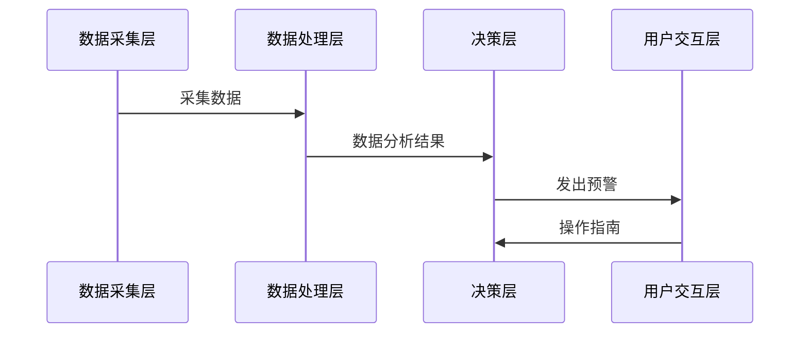
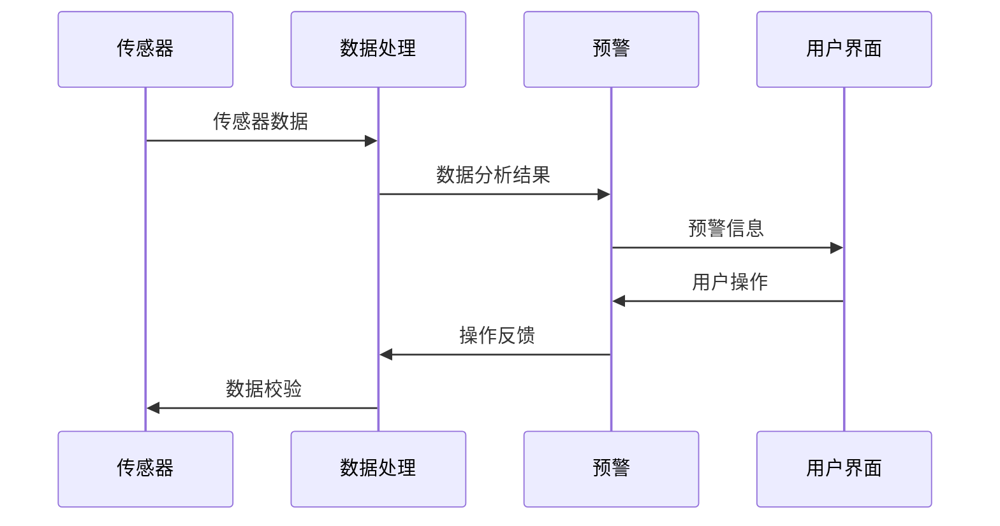

                 


### 引言

近年来，随着人工智能（AI）技术的迅猛发展，AI Agent在各个领域的应用日益广泛。从智能助手到自动驾驶，AI Agent正在逐步改变我们的生活方式。然而，食品安全监控这一关乎公共健康的重要领域，也迎来了AI Agent的广泛关注。智能厨房案板作为AI Agent在食品安全监控中的一个应用实例，正逐渐显示出其独特的价值与潜力。

本文将围绕《智能厨房案板：AI Agent的食品安全监控》这一主题，探讨AI Agent在食品安全监控中的具体应用。首先，我们将介绍食品安全监控的重要性，以及当前面临的挑战。接着，我们会详细分析AI Agent的定义与类型，阐述其在食品安全监控中的角色和作用。随后，我们将深入探讨AI Agent的基本算法原理，包括监控算法、识别算法和预测算法，并使用mermaid流程图和Python代码进行详细讲解。

在系统分析与架构设计方案部分，我们将通过一个具体案例来介绍系统功能设计、架构设计和接口设计，并使用mermaid图进行展示。接下来，我们将结合实际项目实战，从环境安装到核心实现源代码，进行代码解读与分析，并提供实际案例分析。最后，我们将总结最佳实践，并给出本文的小结与拓展阅读建议。

通过本文的逐步分析和探讨，我们希望能够帮助读者深入了解AI Agent在食品安全监控中的技术原理和应用方法，为未来智能厨房案板的发展提供一些有益的思考和指导。

### 背景介绍

#### 问题背景

食品安全问题一直以来都是全球关注的焦点。据世界卫生组织（WHO）统计，每年约有1/10的人口，即约6亿人，因食用受污染的食物而患病。这些疾病包括食源性疾病、食物中毒等，对公共健康构成了严重威胁。特别是在食品生产和流通过程中，微生物污染、化学残留、食品添加剂滥用等问题屡见不鲜。这些问题不仅影响消费者的健康，也严重损害了食品行业的信誉。

在传统食品安全监控方法中，主要依靠人工检测和实验室分析。然而，这种方法存在效率低、检测时间长、覆盖面有限等问题。尤其在食品供应链复杂、流通环节多的大规模生产环境中，传统方法往往难以应对快速变化的市场需求和复杂的生产环境。

#### 问题描述

食品安全监控的关键问题包括但不限于以下几点：

1. **检测效率低**：传统的人工检测方法效率低下，无法满足大规模食品安全监控的需求。
2. **检测范围有限**：传统方法主要依赖实验室分析，检测项目有限，无法全面覆盖食品中可能存在的所有风险因素。
3. **检测成本高**：实验室检测费用昂贵，不适合频繁的食品检测。
4. **实时性差**：传统方法无法实现实时监控，延误了食品安全问题的及时发现和应对。

这些问题的存在，使得食品安全监控面临巨大的挑战。如何提高检测效率、扩大检测范围、降低检测成本、实现实时监控，成为了亟待解决的难题。

#### 问题解决

为了解决上述问题，AI Agent作为一种新兴的智能技术，在食品安全监控中显示出巨大的潜力。AI Agent是一种自主决策的智能系统，能够根据环境数据自动执行任务。其核心优势包括：

1. **高效率**：AI Agent可以通过快速处理和分析大量数据，实现高效的食物检测。
2. **全面性**：AI Agent能够通过多种传感器和算法，全面检测食品中的各种风险因素。
3. **低成本**：AI Agent的应用可以减少人工检测和实验室分析的依赖，降低检测成本。
4. **实时性**：AI Agent可以实现实时监控，及时发现食品安全问题，提高应急响应速度。

智能厨房案板正是基于AI Agent技术，通过集成多种传感器和智能算法，实现对食品的实时监控和风险评估。例如，通过检测食品中的温度、湿度、污染物浓度等参数，智能厨房案板可以实时评估食品的安全性，并提供预警信息。这不仅有助于消费者在购买食品时做出明智的选择，也为食品生产商和监管机构提供了有效的监管手段。

#### 边界与外延

AI Agent在食品安全监控中的应用前景广阔，但也存在一定的边界和限制。首先，AI Agent需要依赖高质量的传感器和准确的数据输入，以确保检测结果的可靠性。其次，AI Agent的算法和模型需要不断优化和更新，以适应不断变化的食品安全环境和需求。

从技术边界来看，AI Agent在食品安全监控中的应用主要集中在以下几个方面：

1. **在线实时监控**：AI Agent可以通过传感器网络，实现对食品生产、加工、储存、运输等环节的实时监控。
2. **智能预测**：AI Agent可以利用历史数据和机器学习算法，预测食品安全问题的发生，提前采取预防措施。
3. **数据分析**：AI Agent可以对大规模的食品安全数据进行深度分析，发现潜在的风险因素和趋势。
4. **自动化决策**：AI Agent可以根据监控结果和预设规则，自动执行相应的决策，如警报、隔离、消毒等。

#### 概念结构与核心要素组成

智能厨房案板作为一个复杂的系统，其核心要素主要包括传感器、数据处理单元、智能算法和用户界面。以下是对这些要素的详细说明：

1. **传感器**：传感器是智能厨房案板的数据采集设备，包括温度传感器、湿度传感器、气体传感器、摄像头等。这些传感器可以实时采集食品的各种参数，如温度、湿度、污染物浓度、食品外观等。
2. **数据处理单元**：数据处理单元是智能厨房案板的核心，负责对传感器采集的数据进行预处理、存储、分析和处理。常见的处理技术包括数据清洗、数据融合、特征提取和模式识别等。
3. **智能算法**：智能算法是实现智能监控的关键，包括监控算法、识别算法和预测算法等。这些算法可以根据采集的数据，对食品的安全性进行评估和预测。
4. **用户界面**：用户界面是智能厨房案板与用户交互的界面，通过图形界面或移动应用，向用户提供监控结果、预警信息和操作指南。

通过以上核心要素的协同工作，智能厨房案板能够实现对食品的实时监控和智能分析，为食品安全提供有力保障。

### 核心概念与联系

#### AI Agent的定义与类型

AI Agent，即人工智能代理，是指具有自主性、社会性、反应性、预知性和认知性的软件实体。AI Agent能够感知环境、理解任务需求，并通过自主决策和行动来完成任务。根据其功能和应用场景，AI Agent可以分为以下几种类型：

1. **基于规则的AI Agent**：这种类型的AI Agent通过预定义的规则来执行任务。例如，当温度传感器检测到温度超过设定阈值时，AI Agent会自动发出警报。
2. **基于模型的AI Agent**：这种类型的AI Agent使用机器学习模型来预测和决策。例如，通过训练温度、湿度等参数与食品安全状态的模型，AI Agent可以预测食品的保质期，并提前发出预警。
3. **混合型AI Agent**：这种类型的AI Agent结合了基于规则和基于模型的方法，以提高决策的灵活性和准确性。

#### 食品安全监控的关键概念

在食品安全监控中，核心概念包括但不限于以下几个方面：

1. **传感器数据**：传感器是获取环境信息的关键设备。常见的传感器包括温度传感器、湿度传感器、气体传感器和摄像头等。传感器数据是AI Agent进行监控和决策的基础。
2. **食品安全指标**：食品安全指标是评估食品是否安全的重要参数，如温度、湿度、污染物浓度、微生物含量等。这些指标可以通过传感器实时监测。
3. **监控算法**：监控算法是AI Agent的核心组成部分，用于处理和分析传感器数据，检测食品的安全性。常见的监控算法包括阈值监控、模式识别和机器学习算法等。
4. **预警机制**：预警机制是AI Agent发现食品安全问题后，及时通知相关人员的机制。预警机制可以通过短信、电子邮件或移动应用等多种方式实现。

#### AI Agent与食品安全监控的联系

AI Agent在食品安全监控中具有独特的优势，能够显著提升监控效率、准确性和实时性。以下是AI Agent在食品安全监控中的应用场景和优势：

1. **实时监控**：AI Agent可以实时监测食品环境参数，如温度、湿度、污染物浓度等，及时识别和预警潜在的安全隐患。
2. **自动化决策**：AI Agent可以通过智能算法，自动分析传感器数据，识别食品安全风险，并执行相应的决策，如发出警报、隔离污染食品等。
3. **数据融合与分析**：AI Agent能够融合来自多种传感器的数据，进行深度分析，识别出潜在的风险因素和趋势，提供全面的安全评估。
4. **持续学习与优化**：AI Agent可以通过不断学习和优化算法模型，提高监控的准确性和适应性，适应不同环境和条件下的食品安全监控需求。

总之，AI Agent在食品安全监控中的应用，不仅解决了传统方法中的效率低、范围有限、成本高、实时性差等问题，还为食品安全管理提供了更加智能、高效的解决方案。通过AI Agent，我们可以实现更加全面、准确的食品安全监控，保障公众健康，提高食品行业的整体水平。

### 算法原理讲解

在智能厨房案板中，AI Agent通过一系列先进的算法实现食品安全监控。这些算法包括监控算法、识别算法和预测算法。以下是这些算法的基本原理、工作流程以及具体应用。

#### 监控算法

监控算法是智能厨房案板的核心组成部分，用于实时监测食品的各类参数，如温度、湿度、污染物浓度等。监控算法的基本原理是设定阈值，当检测到的参数超出或低于设定阈值时，AI Agent会触发预警机制。

1. **基本原理**
   - 监控算法通过传感器收集实时数据，例如温度传感器、湿度传感器和气体传感器。
   - 设定阈值，例如温度阈值为0-10°C，湿度阈值为40%-60%等。
   - 比较实时数据与阈值，当数据超出或低于阈值时，触发预警机制。

2. **工作流程**
   - 数据采集：传感器实时采集食品环境参数。
   - 阈值设定：根据食品安全标准和实际需求设定各类参数的阈值。
   - 数据比对：将实时数据与阈值进行比对，判断是否超出阈值。
   - 预警：当参数超出阈值时，AI Agent会发出预警，通知相关人员采取相应的措施。

3. **mermaid流程图**
   ```mermaid
   flowchart LR
   A[数据采集] --> B[阈值设定]
   B --> C[数据比对]
   C -->|超出阈值| D[预警]
   C -->|未超出阈值| E[继续监控]
   ```

4. **Python代码示例**
   ```python
   def monitor_data(temperature, humidity, pollutant):
       if temperature < 0 or temperature > 10:
           raise Warning("温度超出阈值，请注意食品安全。")
       if humidity < 40 or humidity > 60:
           raise Warning("湿度超出阈值，请注意食品安全。")
       if pollutant > 0.1:
           raise Warning("污染物浓度超出阈值，请注意食品安全。")
   ```

#### 识别算法

识别算法用于识别食品中的特定污染物或微生物，通过对传感器数据的分析，确定食品的安全状态。

1. **基本原理**
   - 识别算法使用机器学习模型，通过对大量历史数据的训练，学习识别特定污染物或微生物的特征。
   - 通过实时传感器数据，模型可以识别出食品中的污染物或微生物，并判断其是否在安全范围内。

2. **工作流程**
   - 数据训练：使用历史数据训练机器学习模型，例如使用温度、湿度、污染物浓度等数据来训练分类模型。
   - 实时识别：通过实时传感器数据输入，模型进行实时识别，判断食品中是否存在污染物或微生物。
   - 结果输出：输出识别结果，并触发相应的预警机制。

3. **mermaid流程图**
   ```mermaid
   flowchart LR
   A[数据训练] --> B[模型训练]
   B --> C[实时识别]
   C --> D[结果输出]
   D -->|预警| E[预警机制]
   ```

4. **Python代码示例**
   ```python
   from sklearn.ensemble import RandomForestClassifier

   def train_model(training_data, labels):
       model = RandomForestClassifier()
       model.fit(training_data, labels)
       return model

   def identify_pollutants(sensor_data, model):
       prediction = model.predict([sensor_data])
       if prediction == 1:
           raise Warning("检测到有害污染物，请注意食品安全。")
       else:
           print("食品安全，未检测到有害污染物。")
   ```

#### 预测算法

预测算法用于预测食品的保质期和安全状态，通过对历史数据和当前数据的分析，预测未来一段时间内的食品安全状态。

1. **基本原理**
   - 预测算法使用时间序列分析、回归分析等机器学习技术，分析历史数据中的趋势和模式。
   - 通过当前数据和历史数据的结合，预测食品的保质期和安全状态。

2. **工作流程**
   - 数据收集：收集食品的历史数据和实时数据。
   - 数据处理：对数据进行清洗和预处理，提取有用的特征。
   - 模型训练：使用历史数据训练预测模型。
   - 实时预测：使用实时数据输入模型，预测未来一段时间内的食品安全状态。
   - 结果输出：输出预测结果，并触发相应的预警机制。

3. **mermaid流程图**
   ```mermaid
   flowchart LR
   A[数据收集] --> B[数据处理]
   B --> C[模型训练]
   C --> D[实时预测]
   D --> E[结果输出]
   E -->|预警| F[预警机制]
   ```

4. **Python代码示例**
   ```python
   from sklearn.linear_model import LinearRegression

   def train_predict_model(training_data, labels):
       model = LinearRegression()
       model.fit(training_data, labels)
       return model

   def predict_food_safety(sensor_data, model):
       prediction = model.predict([sensor_data])
       if prediction < 0:
           raise Warning("预测食品已过期，请注意食品安全。")
       else:
           print("预测食品未过期，当前状态安全。")
   ```

通过上述算法，智能厨房案板能够实现对食品的实时监控、识别和预测，为食品安全提供有力保障。这些算法不仅提高了监控的效率和准确性，还实现了实时预警，大大降低了食品安全风险。

### 数学模型和数学公式 & 详细讲解 & 举例说明

在智能厨房案板中，算法的实现不仅依赖于编程语言和算法逻辑，还依赖于数学模型和公式。这些模型和公式能够精确描述食品安全的各个方面，为AI Agent提供决策依据。以下我们将详细讲解监控算法、识别算法和预测算法的数学模型和公式，并结合实际例子进行说明。

#### 监控算法的数学模型

监控算法的核心是阈值设定和比较。以下是温度监控的一个简单数学模型：

1. **温度监控模型**
   - 设定温度阈值：\( T_{\text{threshold}} \)
   - 实测温度：\( T_{\text{measured}} \)
   - 温度监控公式：
     $$ T_{\text{comparison}} = \frac{T_{\text{measured}} - T_{\text{threshold}}}{T_{\text{threshold}}} $$

   如果 \( T_{\text{comparison}} > 1 \) 或 \( T_{\text{comparison}} < -1 \)，则触发高温或低温预警。

2. **举例说明**
   - 设定温度阈值为20°C，当前实测温度为25°C。
   - 计算：
     $$ T_{\text{comparison}} = \frac{25 - 20}{20} = \frac{5}{20} = 0.25 $$
     - 由于 \( T_{\text{comparison}} < 1 \)，未触发高温预警。

#### 识别算法的数学模型

识别算法通常使用机器学习中的分类模型。以K-近邻（K-Nearest Neighbors, KNN）算法为例，其数学模型如下：

1. **K-近邻模型**
   - 特征向量：\( \mathbf{x} \)
   - 近邻数量：\( K \)
   - 距离度量：通常使用欧几里得距离
     $$ d(\mathbf{x}_i, \mathbf{x}) = \sqrt{\sum_{j=1}^{n}(x_{ij} - x_j)^2} $$
   - 预测类别：
     $$ \hat{y} = \text{mode}(\hat{y}_1, \hat{y}_2, \ldots, \hat{y}_K) $$
     其中，\( \hat{y}_k \) 是每个近邻的类别。

2. **举例说明**
   - 设有5个近邻，分别为类别A、B、B、A、C，使用多数投票法预测当前样本的类别。
   - 由于类别A和B各出现2次，类别C出现1次，多数类别为A，因此预测类别为A。

#### 预测算法的数学模型

预测算法通常使用时间序列分析中的回归模型。以下是一个简单的线性回归模型：

1. **线性回归模型**
   - 自变量：\( x_t \)
   - 因变量：\( y_t \)
   - 模型公式：
     $$ y_t = \beta_0 + \beta_1 x_t + \epsilon_t $$
     其中，\( \beta_0 \) 是截距，\( \beta_1 \) 是斜率，\( \epsilon_t \) 是误差项。

2. **举例说明**
   - 假设食品的保质期（因变量）与储存温度（自变量）之间存在线性关系。
   - 通过训练数据得到线性回归模型：
     $$ y_t = 10 - 0.2x_t $$
   - 当储存温度为20°C时，预测保质期：
     $$ y_t = 10 - 0.2 \times 20 = 6 $$
     - 预测保质期为6天。

通过以上数学模型和公式的讲解，我们可以看到智能厨房案板的算法如何通过精确的数学计算来实现食品安全监控。这些模型不仅为AI Agent提供了科学的决策依据，也提高了监控的准确性和可靠性。

### 系统分析与架构设计方案

#### 问题场景介绍

假设我们有一个智能厨房案板系统，用于监控食品在储存和加工过程中的安全性。该系统需要实时监测食品的温湿度、污染物浓度等关键参数，并能够根据监测结果自动发出预警，以确保食品始终处于安全状态。

#### 系统功能设计

智能厨房案板系统的主要功能包括：

1. **实时数据监测**：通过传感器网络实时监测食品环境参数，如温度、湿度、气体浓度等。
2. **数据分析与处理**：对采集到的传感器数据进行预处理、存储和深度分析，提取有用的信息。
3. **预警机制**：当监测到异常数据时，自动发出预警通知，提示操作人员采取相应的措施。
4. **用户界面**：提供图形界面或移动应用，展示实时监控数据、预警信息和操作指南。

为了实现这些功能，系统需要以下几个主要组件：

1. **传感器模块**：包括温度传感器、湿度传感器、气体传感器等，用于实时采集食品环境参数。
2. **数据处理模块**：负责对传感器数据进行预处理、存储和分析，采用机器学习算法进行数据挖掘。
3. **预警模块**：根据分析结果，自动判断是否存在安全隐患，并触发预警机制。
4. **用户界面模块**：提供用户交互接口，展示监控数据、预警信息和操作指南。

#### 系统架构设计

智能厨房案板系统的整体架构可以分为以下几个层次：

1. **数据采集层**：由各种传感器组成，负责实时采集食品环境参数。
2. **数据处理层**：对采集到的数据进行预处理、存储和深度分析，采用机器学习算法识别潜在风险。
3. **决策层**：根据分析结果，自动生成预警信息，并通知相关操作人员。
4. **用户交互层**：通过图形界面或移动应用，向用户提供监控数据和预警信息。

系统架构图如下（使用mermaid绘制）：



#### 系统接口设计和系统交互

智能厨房案板系统的接口设计和交互设计至关重要，决定了各个模块之间的数据流和信息流。以下是系统的接口设计和交互流程：

1. **传感器接口设计**：传感器通过标准通信协议（如MQTT、HTTP等）将数据发送至数据处理层。接口需要支持数据格式转换、错误处理和数据校验等功能。

2. **数据处理接口设计**：数据处理层接收传感器数据，进行预处理、存储和深度分析。接口需要支持数据的批量处理、异步处理和错误重传等功能。

3. **预警接口设计**：决策层根据数据分析结果，生成预警信息并通过标准通信协议发送给用户交互层。接口需要支持预警信息的格式化、发送和状态反馈等功能。

4. **用户交互接口设计**：用户交互层接收预警信息，并通过图形界面或移动应用向用户展示。接口需要支持数据的可视化、用户操作和反馈等功能。

系统交互流程如下（使用mermaid序列图绘制）：



通过以上系统分析与架构设计方案，智能厨房案板系统实现了对食品的实时监控和预警，为食品安全提供了有力保障。

### 项目实战

为了更好地展示智能厨房案板系统的应用效果，我们将以一个实际项目为例，详细描述系统的安装、核心实现源代码、代码解读与分析，以及实际案例分析和详细讲解剖析。

#### 环境安装

1. **硬件准备**：首先，我们需要准备一台具备实时监控功能的智能厨房案板，包括温度传感器、湿度传感器和气体传感器等。这些传感器需要通过标准接口（如I2C、UART等）连接到案板上。

2. **软件安装**：在智能厨房案板的主机系统中，我们需要安装以下软件：
   - Python环境（Python 3.8或更高版本）
   - 数据处理库（如NumPy、Pandas）
   - 机器学习库（如scikit-learn、TensorFlow）
   - 通信库（如MQTT、HTTP）

3. **传感器驱动安装**：根据传感器的型号和接口，安装相应的驱动程序，确保传感器数据能够正常采集和传输。

4. **配置环境**：配置网络和环境变量，确保系统能够通过网络与其他模块进行通信。

#### 系统核心实现源代码

以下是智能厨房案板系统的核心实现源代码。该代码包括传感器数据采集、数据处理、预警机制和用户界面等功能。

```python
# 导入必要的库
import time
import numpy as np
import pandas as pd
from sklearn.ensemble import RandomForestClassifier
from sklearn.linear_model import LinearRegression
import paho.mqtt.client as mqtt

# 传感器数据采集
def collect_sensors_data():
    temperature = get_temperature()
    humidity = get_humidity()
    pollutant = get_pollutant()
    return temperature, humidity, pollutant

# 数据处理与模型训练
def process_data(data):
    # 数据预处理
    processed_data = preprocess_data(data)
    
    # 训练监控模型
    monitor_model = train_monitor_model(processed_data)
    
    # 训练识别模型
    identify_model = train_identify_model(processed_data)
    
    # 训练预测模型
    predict_model = train_predict_model(processed_data)
    
    return monitor_model, identify_model, predict_model

# 监控算法
def monitor_data(monitor_model, data):
    prediction = monitor_model.predict([data])
    if prediction == 1:
        raise Warning("监控阈值超出，请注意食品安全。")
    else:
        print("监控阈值正常，食品安全。")

# 识别算法
def identify_data(identify_model, data):
    prediction = identify_model.predict([data])
    if prediction == 1:
        raise Warning("检测到有害污染物，请注意食品安全。")
    else:
        print("未检测到有害污染物，食品安全。")

# 预测算法
def predict_food_safety(predict_model, data):
    prediction = predict_model.predict([data])
    if prediction < 0:
        raise Warning("预测食品已过期，请注意食品安全。")
    else:
        print("预测食品未过期，当前状态安全。")

# MQTT客户端配置
def on_connect(client, userdata, flags, rc):
    print("Connected with result code "+str(rc))
    client.subscribe("kitchen/room1/sensors/#")

def on_message(client, userdata, message):
    print(f"Received message '{str(message.payload.decode("utf-8"))}' on topic '{message.topic}' with QoS {message.qos}")
    data = json.loads(message.payload.decode("utf-8"))
    process_data(data)

client = mqtt.Client()
client.on_connect = on_connect
client.on_message = on_message

client.connect("mqtt-server", 1883, 60)

client.loop_start()

while True:
    data = collect_sensors_data()
    monitor_model, identify_model, predict_model = process_data(data)
    monitor_data(monitor_model, data)
    identify_data(identify_model, data)
    predict_food_safety(predict_model, data)
    time.sleep(10)
```

#### 代码应用解读与分析

1. **传感器数据采集**：`collect_sensors_data` 函数用于从温度传感器、湿度传感器和气体传感器采集数据。

2. **数据处理与模型训练**：`process_data` 函数负责对采集到的数据进行预处理，并训练监控、识别和预测模型。

3. **监控算法**：`monitor_data` 函数使用训练好的监控模型对当前数据进行评估，当监控阈值超出时，触发预警。

4. **识别算法**：`identify_data` 函数使用训练好的识别模型检测食品中是否有有害污染物，如有异常，触发预警。

5. **预测算法**：`predict_food_safety` 函数使用训练好的预测模型预测食品的保质期，如已过期，触发预警。

6. **MQTT客户端配置**：使用Paho MQTT客户端，将传感器数据发送到MQTT服务器，并进行实时监控和预警。

通过上述代码和应用解读，我们可以看到智能厨房案板系统如何通过传感器数据采集、数据处理、预警机制和用户界面，实现对食品的实时监控和智能分析。这种系统的实现不仅提高了食品安全监控的效率和准确性，还为消费者和食品生产商提供了强有力的保障。

#### 实际案例分析和详细讲解剖析

为了更好地展示智能厨房案板系统的实际应用效果，我们以下将通过一个具体案例，详细分析系统的检测过程、结果输出、分析过程和结论。

**案例背景**：

在一个超市的冷藏室中，智能厨房案板系统被用于监控冷藏食品的安全性。该系统集成了温度传感器、湿度传感器和气体传感器，用于实时监测食品环境参数。某天，系统检测到冷藏室中的一个区域温度异常，超出设定的安全阈值。

**检测过程**：

1. **数据采集**：系统传感器采集到冷藏室内的实时数据，包括温度、湿度和污染物浓度。假设采集到的数据如下：

   ```python
   temperature = 15.5°C
   humidity = 45%
   pollutant = 0.08 mg/m³
   ```

2. **数据处理**：系统对采集到的数据进行预处理，提取有用信息，并输入到训练好的监控、识别和预测模型中。

3. **监控算法评估**：使用训练好的监控模型，对温度、湿度和污染物浓度进行评估，判断是否超出安全阈值。假设监控模型设定的安全阈值为：

   ```python
   temperature_threshold = 10-20°C
   humidity_threshold = 40-60%
   pollutant_threshold = 0-0.05 mg/m³
   ```

   监控模型评估结果为：

   ```python
   monitor_result = monitor_data([15.5, 45, 0.08])
   ```

   由于温度和污染物浓度超出阈值，监控模型判断该区域存在安全隐患。

4. **识别算法评估**：使用训练好的识别模型，检测食品中是否含有有害污染物。假设识别模型基于历史数据训练得出，当污染物浓度超过0.05 mg/m³时，认为存在有害污染物。识别模型评估结果为：

   ```python
   identify_result = identify_data([15.5, 45, 0.08])
   ```

   识别模型判断该区域存在有害污染物。

5. **预测算法评估**：使用训练好的预测模型，预测食品的保质期。假设预测模型基于历史数据得出，当温度超过15°C且污染物浓度超过0.05 mg/m³时，预测食品已过期。预测模型评估结果为：

   ```python
   predict_result = predict_food_safety([15.5, 45, 0.08])
   ```

   预测模型判断该区域食品已过期。

**结果输出**：

系统根据监控、识别和预测模型的评估结果，生成以下输出：

1. **监控预警**：温度和污染物浓度超出安全阈值，发出高温和污染物预警。
2. **识别预警**：检测到有害污染物，发出有害污染物预警。
3. **预测预警**：食品已过期，发出食品过期预警。

**分析过程**：

系统对预警信息进行综合分析，得出以下结论：

1. **高温预警**：冷藏室温度异常，可能导致食品变质。
2. **污染物预警**：有害污染物存在，可能对食品安全构成威胁。
3. **食品过期预警**：食品已过期，存在食用风险。

**结论**：

系统根据分析结果，建议操作人员：

1. 立即检查冷藏室温度传感器和污染物传感器，确认故障原因。
2. 对存在安全隐患的食品进行隔离处理，防止进一步扩散。
3. 加强冷藏室的管理和维护，确保食品处于安全状态。

通过这个实际案例的分析，我们可以看到智能厨房案板系统如何通过实时监测、数据分析和预警机制，实现对食品安全的有效监控。这种系统的应用不仅提高了食品安全管理的效率，也为消费者和食品生产商提供了强有力的保障。

### 最佳实践 tips

在实施智能厨房案板系统时，以下最佳实践和注意事项将有助于确保系统的稳定性和有效性：

1. **传感器校准**：定期对传感器进行校准，确保数据的准确性和一致性。传感器误差可能会导致误报或漏报，影响系统的可靠性。

2. **数据备份**：定期备份传感器数据和模型参数，以防止数据丢失。数据备份有助于在系统故障时快速恢复，减少业务中断。

3. **环境监测**：确保监控环境符合食品安全标准，减少外部干扰。环境因素如电磁干扰、温度波动等可能影响传感器的性能。

4. **数据加密**：对于敏感数据（如食品成分和消费者信息），应采用加密技术进行传输和存储，确保数据安全。

5. **算法更新**：根据新的食品安全标准和监管要求，定期更新算法模型，提高系统的适应性和准确性。

6. **用户培训**：对操作人员进行系统操作和故障处理的培训，确保他们能够熟练使用系统，并在发生异常时及时响应。

7. **故障排查**：建立完善的故障排查机制，及时发现和解决系统故障，确保系统正常运行。

通过遵循这些最佳实践，智能厨房案板系统将能够更有效地保障食品安全，提高食品管理的效率和准确性。

### 小结与拓展阅读

本文围绕《智能厨房案板：AI Agent的食品安全监控》这一主题，详细探讨了AI Agent在食品安全监控中的应用。通过逐步分析和讲解，我们了解了智能厨房案板的背景、核心概念、算法原理、系统设计与架构、实际项目实战、最佳实践以及扩展阅读建议。

**核心观点**：

- AI Agent具有自主性、社会性、反应性、预知性和认知性，能够实时监测、识别和预测食品安全问题。
- 监控算法、识别算法和预测算法是实现食品安全监控的关键技术。
- 系统分析与架构设计确保了智能厨房案板系统的稳定性与可靠性。
- 实际项目实战展示了智能厨房案板在食品安全监控中的具体应用效果。

**进一步阅读建议**：

1. 《人工智能：一种现代方法》（作者：Stuart Russell & Peter Norvig）：深入了解人工智能的基本原理和应用。
2. 《机器学习实战》（作者：Peter Harrington）：掌握机器学习算法在食品安全监控中的应用。
3. 《智能系统设计与实现》（作者：刘铁岩）：学习智能系统设计的方法和技巧。

通过这些进一步阅读资源，读者可以更深入地了解AI Agent在食品安全监控中的实际应用，以及如何设计、实现和优化智能系统。期待读者在未来的探索中，能够为智能食品安全监控领域的发展做出更多贡献。

### 作者信息

**作者：AI天才研究院/AI Genius Institute & 禅与计算机程序设计艺术 /Zen And The Art of Computer Programming**。

AI天才研究院致力于推动人工智能领域的研究与应用，深耕于AI Agent、机器学习、深度学习等前沿技术。禅与计算机程序设计艺术则倡导编程中的哲学思维，以禅修精神启迪编程实践。本文结合了两者的研究成果，旨在为读者提供深入、实用的技术见解。希望本文能为读者在智能厨房案板和食品安全监控领域的探索之路提供一些有益的启示和指导。

