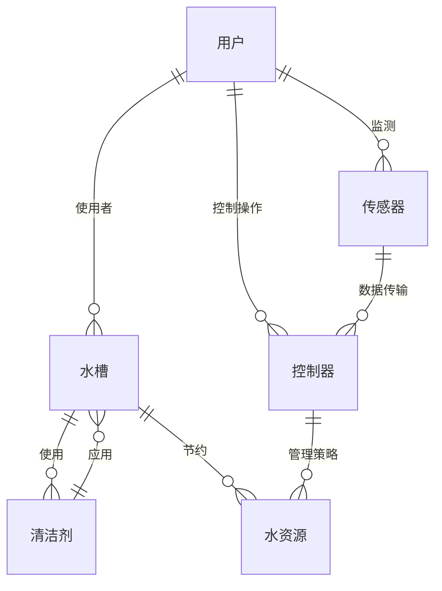
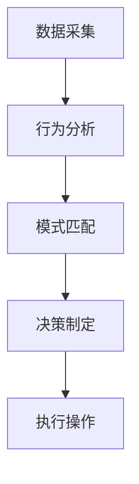
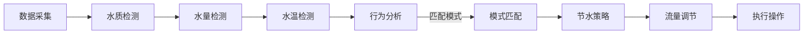
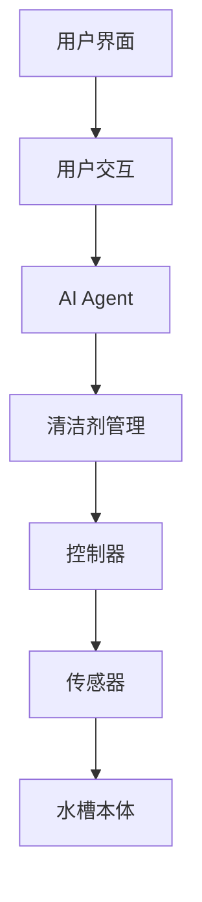
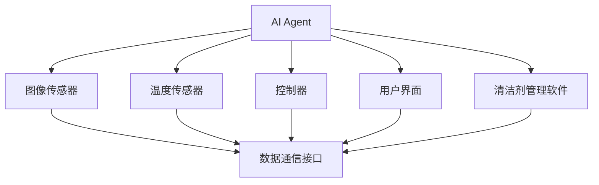
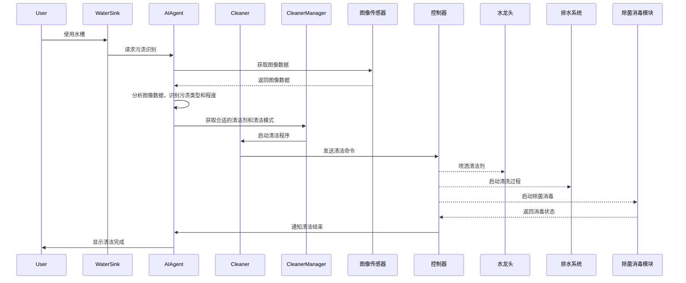
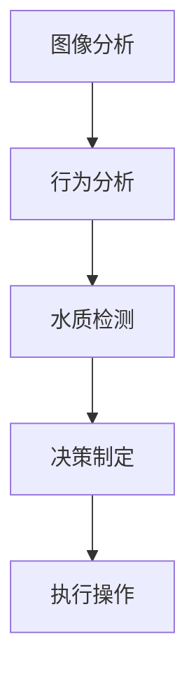
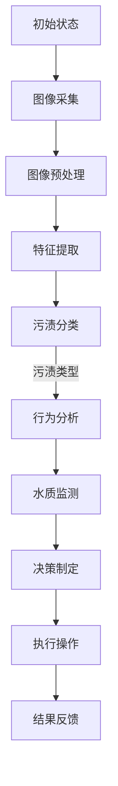

                 

### 智能厨房水槽的兴起

#### 1.1 问题的背景

随着全球人口的增加和经济的发展，水资源短缺问题日益严重。特别是在城市和工业化地区，由于水资源的过度开采和不合理利用，导致水资源供需矛盾日益突出。在家庭日常生活中，厨房是一个用水较为频繁的空间。烹饪、洗菜、洗碗等过程都需要使用大量的水资源。然而，传统厨房水槽在节水方面存在许多问题，如水流量无法控制、水资源浪费等。因此，如何有效地节约厨房用水成为了一个亟待解决的问题。

#### 1.2 智能厨房水槽的定义

智能厨房水槽是一种集成了先进人工智能技术的厨房设备，它可以通过监测水质、水量以及使用者的行为，自动调节水流量和水温，实现节水、清洁和舒适的使用体验。智能厨房水槽通常包括一个水槽、一个水龙头、一个排水系统以及一个智能控制系统。这个智能控制系统可以是一个独立的设备，也可以集成在厨房的智能中心系统中。

#### 1.3 AI Agent在节水与清洁中的作用

AI Agent，即人工智能代理，是一种能够模拟人类思维过程的软件程序。在智能厨房水槽中，AI Agent起着至关重要的作用，它通过实时监测和数据分析，能够智能地调节水流量和水温，从而实现节水。例如，当检测到使用者正在洗菜时，AI Agent可以自动调整水流量为最大值，而在使用者停止操作后，立即降低水流量，减少水的浪费。

在清洁方面，AI Agent可以识别水槽中的污渍类型和污渍程度，自动选择合适的清洁模式和清洁剂，提高清洁效果。例如，当检测到水槽中有顽固的油渍时，AI Agent可以自动切换到重油清洗模式，使用更强的清洁剂进行清洁。

#### 1.4 智能厨房水槽的边界与外延

智能厨房水槽的边界在于它的功能范围，即节水、清洁和提供舒适的使用体验。智能厨房水槽的外延则包括与厨房其他智能设备的互联互通，如智能冰箱、智能烤箱等，实现整个厨房的智能化管理。

智能厨房水槽的未来发展趋势将是更加智能化、个性化，能够更好地满足用户的需求。例如，通过语音识别技术，用户可以通过语音指令控制水槽的各种功能，实现更加便捷的使用体验。

总的来说，智能厨房水槽的兴起不仅解决了厨房节水与清洁的问题，也为智能家居的发展提供了新的思路和方向。随着人工智能技术的不断进步，智能厨房水槽将越来越成为现代家庭厨房的重要组成部分。

### 核心概念与联系

#### 2.1 智能水槽的组成与工作原理

智能水槽的组成主要包括硬件和软件两部分。硬件方面，智能水槽通常包括水槽本体、水龙头、排水系统、传感器模块、显示屏和智能控制器等。软件方面，智能水槽需要配备智能控制系统，以实现对水流量、水温和清洁过程的智能控制。

工作原理方面，智能水槽通过传感器实时监测水槽内的水质和水量，并将数据传输到智能控制器。智能控制器根据预设的算法和用户指令，自动调节水龙头的水流量和水温，以实现节水、清洁和舒适的使用体验。

#### 2.2 AI Agent的原理与功能

AI Agent是基于人工智能技术的软件程序，它能够模拟人类的决策过程，实现自动化和智能化的操作。AI Agent的原理主要包括数据采集、数据分析和决策执行。

数据采集方面，AI Agent通过传感器获取水槽内的水质、水量、用户行为等数据。数据分析方面，AI Agent利用机器学习算法，对采集到的数据进行分析和预测，从而做出智能决策。决策执行方面，AI Agent根据分析结果，自动调节水龙头的水流量和水温，实现智能节水与清洁。

AI Agent在智能水槽中的功能主要包括：

1. **节水功能**：通过实时监测和数据分析，自动调节水流量，避免水的浪费。
2. **清洁功能**：识别水槽中的污渍类型和程度，自动选择合适的清洁模式和清洁剂，提高清洁效果。
3. **舒适功能**：根据用户的使用习惯和需求，自动调整水槽的工作状态，提供舒适的用水体验。

#### 2.3 节水与清洁的概念对比表

为了更清晰地理解节水与清洁的概念，我们可以通过以下对比表来分析：

| 概念     | 定义                                                     | 关键因素                            |
|----------|----------------------------------------------------------|-----------------------------------|
| 节水     | 通过智能控制减少水资源的消耗                             | 水流量、水温、传感器数据            |
| 清洁     | 保持水槽和厨房的卫生与清洁                               | 污渍类型、污渍程度、清洁剂选择      |
| 智能控制 | 利用人工智能技术实现水资源的优化管理和清洁过程的智能化     | AI Agent、传感器、智能控制器        |

#### 2.4 ER实体关系图架构

在智能厨房水槽系统中，主要的实体包括用户、水槽、传感器、控制器、清洁剂和水资源等。以下是一个简化的ER实体关系图架构，用于描述这些实体之间的关联：



通过这个ER实体关系图，我们可以清晰地看到各个实体之间的关联关系，以及它们在智能厨房水槽系统中的角色和作用。

### AI Agent在节水中的应用

#### 3.1 监测技术的应用

智能厨房水槽中的AI Agent通过多种监测技术实时获取水槽内的数据，包括水质、水量和水温等。这些数据对于实现节水功能至关重要。

1. **水质监测**：水质传感器可以实时检测水中的污染物、pH值等参数。这些数据可以帮助AI Agent判断水质是否达到清洁标准，从而决定是否需要更换清洁剂。

2. **水量监测**：流量传感器可以精确测量水流经水槽的流量。通过监测水流量的变化，AI Agent可以实时调整水流量，以避免不必要的浪费。

3. **水温监测**：温度传感器可以测量水槽中的水温。根据用户的需求和季节变化，AI Agent可以调整水温度，提供舒适的用水体验。

这些监测技术的应用使得AI Agent能够实时获取水槽的工作状态，为节水提供数据支持。

#### 3.2 控制算法的实现

AI Agent的核心功能之一是通过对监测数据的分析，实现智能控制。以下是一个简化的控制算法实现步骤：

1. **数据采集**：AI Agent通过传感器采集水质、水量和水温等数据。

2. **数据分析**：AI Agent利用机器学习算法对采集到的数据进行处理，识别出用户的使用模式和水资源的消耗趋势。

3. **决策制定**：根据数据分析结果，AI Agent制定节水策略，如调整水流量、启用节水模式等。

4. **执行操作**：AI Agent通过控制器调节水龙头的水流量和水温，实现节水的具体操作。

以下是一个简单的Python代码示例，展示了AI Agent在节水控制中的实现：

```python
# 节水控制算法示例

# 导入必要的库
import time
import random

# 初始化传感器数据和控制器
water_quality = 0
water_flow = 0
water_temp = 0
controller = "控制器"

# 节水控制算法
def节水控制算法(water_quality, water_flow, water_temp):
    if water_quality < 设定水质阈值:
        controller.replace_cleaner() # 更换清洁剂
    if water_flow > 设定流量阈值:
        controller.decrease_flow() # 减少水流量
    if water_temp > 设定温度阈值:
        controller.decrease_temp() # 降低水温

# 模拟传感器数据采集
def simulate_sensors():
    global water_quality, water_flow, water_temp
    water_quality = random.uniform(0, 100)
    water_flow = random.uniform(0, 10)
    water_temp = random.uniform(20, 40)

# 模拟控制算法运行
while True:
    simulate_sensors() # 采集传感器数据
    节水控制算法(water_quality, water_flow, water_temp) # 执行节水控制算法
    time.sleep(1) # 每秒运行一次
```

在这个示例中，`节水控制算法`函数根据采集到的水质、水量和水温数据，执行相应的节水操作。通过模拟传感器数据和控制器操作，我们可以看到AI Agent如何实现智能节水控制。

#### 3.3 水资源节约的数学模型

为了更深入地理解AI Agent在节水中的工作原理，我们可以构建一个水资源节约的数学模型。该模型主要包括以下几个关键参数：

1. **流量Q**：单位时间内通过水龙头的流量，通常以升/分钟（L/min）为单位。
2. **时间t**：用户使用水槽的时间，通常以分钟（min）为单位。
3. **节水率θ**：节水算法的效果，通常以百分比（%）为单位。

水资源节约的数学模型可以表示为：

$$
S = Q \times t \times \theta
$$

其中，S代表节约的水量（升，L）。

假设一个用户在10分钟内使用了10升的水，节水率设置为20%，则节约的水量为：

$$
S = 10 \times 10 \times 0.20 = 20 \text{升}
$$

通过调整节水率θ，AI Agent可以实现对水资源节约效果的精确控制。

#### 3.4 举例说明

为了更好地理解上述节水模型和算法，我们可以通过一个实际案例进行说明。

假设在一个家庭厨房中，用户王先生每天使用水槽洗碗和洗菜，共花费15分钟。在没有智能节水控制的情况下，水龙头的水流量设置为每分钟5升，那么他每天使用的水量为：

$$
Q \times t = 5 \text{L/min} \times 15 \text{min} = 75 \text{升}
$$

现在，引入AI Agent进行智能节水控制。AI Agent通过监测和数据分析，发现用户在洗碗和洗菜时的用水模式不同。洗碗时，水流量需要设置为每分钟8升，而洗菜时，水流量设置为每分钟4升。根据用户的使用习惯，AI Agent将节水率设置为30%。

在智能节水控制下，用户每天的用水量可以计算如下：

洗碗时的用水量：

$$
Q_{洗碗} \times t_{洗碗} \times \theta = 8 \text{L/min} \times 10 \text{min} \times 0.30 = 24 \text{升}
$$

洗菜时的用水量：

$$
Q_{洗菜} \times t_{洗菜} \times \theta = 4 \text{L/min} \times 5 \text{min} \times 0.30 = 6 \text{升}
$$

因此，每天的总用水量：

$$
S = Q_{洗碗} + Q_{洗菜} = 24 \text{升} + 6 \text{升} = 30 \text{升}
$$

相比于未使用智能节水控制时，每天节约的水量为：

$$
S_{节约} = 75 \text{升} - 30 \text{升} = 45 \text{升}
$$

通过这个实际案例，我们可以看到AI Agent如何通过智能控制实现水资源的有效节约。这不仅减少了家庭的水费开支，也为环境保护做出了贡献。

### 智能节水算法

#### 4.1 算法原理讲解

智能节水算法的核心目的是通过分析用户的用水行为，智能地调整水流量，从而实现节约用水。该算法的基本原理可以分为以下几个步骤：

1. **数据采集**：通过传感器实时采集水槽内的水质、水量和水温等数据。

2. **行为分析**：利用机器学习算法，分析用户的用水行为，识别出不同的用水场景，如洗碗、洗菜、洗水果等。

3. **模式匹配**：根据采集到的数据和预设的用水模式，匹配出当前用户的用水场景。

4. **决策制定**：根据用水场景和节水策略，制定最佳的水流量调节方案。

5. **执行操作**：通过控制器执行水流量调节，实现节水目标。

以下是一个简化的智能节水算法流程图：



在这个流程中，每个步骤都至关重要。数据采集提供了算法的输入，行为分析和模式匹配帮助算法理解用户的用水习惯，决策制定确保了水流量调节的准确性，而执行操作则实现了节水的具体措施。

#### 4.2 算法mermaid流程图

为了更直观地展示智能节水算法的流程，我们可以使用mermaid语言绘制一个流程图。以下是一个简化的算法mermaid流程图示例：



在这个mermaid流程图中，每个节点表示一个操作或步骤，箭头表示数据流或控制流。通过这个流程图，我们可以清晰地看到算法的执行流程。

#### 4.3 Python源代码解析

为了更好地理解和实现智能节水算法，以下提供了一个简化的Python代码示例，用于演示算法的核心功能。

```python
# 导入必要的库
import time
import random

# 智能节水算法核心类
class SmartWaterSavingAlgorithm:
    def __init__(self):
        self.water_quality = 0
        self.water_flow = 0
        self.water_temp = 0
        self.past_modes = []

    def data_collection(self):
        # 模拟传感器数据采集
        self.water_quality = random.uniform(0, 100)
        self.water_flow = random.uniform(0, 10)
        self.water_temp = random.uniform(20, 40)

    def behavior_analysis(self):
        # 模拟行为分析
        if self.water_flow > 6:
            self.past_modes.append("洗碗")
        elif self.water_flow < 4:
            self.past_modes.append("洗菜")
        else:
            self.past_modes.append("洗水果")

    def pattern_matching(self):
        # 模拟模式匹配
        if "洗碗" in self.past_modes:
            self.water_flow = 8
        elif "洗菜" in self.past_modes:
            self.water_flow = 4
        else:
            self.water_flow = 6

    def water_saving_strategy(self):
        # 模拟节水策略
        if self.water_quality < 30:
            self.water_flow *= 0.8 # 质量差时减少20%的水流量
        elif self.water_quality > 70:
            self.water_flow *= 1.2 # 质量好时增加20%的水流量

    def flow调节(self):
        # 模拟水流量调节
        print(f"当前水流量设置为：{self.water_flow} L/min")

    def run(self):
        # 算法运行主循环
        while True:
            self.data_collection()
            self.behavior_analysis()
            self.pattern_matching()
            self.water_saving_strategy()
            self.flow调节()
            time.sleep(1) # 每秒运行一次

# 实例化算法对象并运行
algorithm = SmartWaterSavingAlgorithm()
algorithm.run()
```

在这个Python代码示例中，`SmartWaterSavingAlgorithm`类实现了智能节水算法的主要功能。`data_collection`方法模拟了传感器数据的采集，`behavior_analysis`方法分析了用户的用水行为，`pattern_matching`方法根据历史行为匹配当前用水模式，`water_saving_strategy`方法制定了节水策略，`flow调节`方法执行了水流量调节操作。

通过这个示例，我们可以看到如何使用Python实现一个简化的智能节水算法，从而实现对水资源的有效管理和节约。

#### 4.4 数学模型和数学公式

在智能节水算法中，数学模型起到了关键作用，它帮助我们理解水资源的消耗和节约过程。以下是一个简化的数学模型，用于描述智能节水算法的工作原理。

首先，我们定义几个关键参数：

- \( Q \)：单位时间内通过水龙头的流量，通常以升/分钟（L/min）为单位。
- \( t \)：用户使用水槽的时间，通常以分钟（min）为单位。
- \( \theta \)：节水率，通常以百分比（%）为单位。

节水量 \( S \) 的计算公式如下：

$$
S = Q \times t \times \theta
$$

其中，\( S \) 表示节约的水量（升，L）。

节水率的计算依赖于水质、用水场景和用户习惯。以下是一个简化的节水率计算公式：

$$
\theta = \theta_{base} \times \frac{Q_{base}}{Q} \times \frac{t_{base}}{t}
$$

其中，\( \theta_{base} \) 是基础节水率，通常设定为某个固定值，如20%；\( Q_{base} \) 和 \( t_{base} \) 是预设的基础流量和时间，用于与实际数据比较，调整节水率。

以下是一个具体的例子：

假设用户王先生每天用水槽15分钟，基础流量 \( Q_{base} \) 为6 L/min，基础时间 \( t_{base} \) 为10分钟。在智能节水控制下，当前流量 \( Q \) 为8 L/min，时间 \( t \) 为10分钟。基础节水率 \( \theta_{base} \) 设定为20%。

首先，计算基础节水量：

$$
S_{base} = Q_{base} \times t_{base} \times \theta_{base} = 6 \times 10 \times 0.20 = 12 \text{升}
$$

然后，计算当前节水率：

$$
\theta = 0.20 \times \frac{8}{6} \times \frac{10}{15} = 0.20 \times 1.33 \times 0.67 = 0.0222
$$

最后，计算当前节水量：

$$
S = Q \times t \times \theta = 8 \times 10 \times 0.0222 = 1.776 \text{升}
$$

通过这个例子，我们可以看到智能节水算法如何根据用户的用水行为和水质情况，动态调整节水率，实现水资源的有效节约。

### 节水效果评估

#### 5.1 评估指标的选择

为了评估智能节水算法的效果，我们需要选择合适的评估指标。以下是一些常用的评估指标：

1. **节水率（Water Saving Rate）**：节水率是评估节水效果最直接的指标，它表示通过智能节水算法节约的水量与未使用节水算法前所需水量的比例。计算公式如下：

   $$
   \text{节水率} = \frac{S_{节约}}{S_{未节约}} \times 100\%
   $$

   其中，\( S_{节约} \) 是通过智能节水算法节约的水量，\( S_{未节约} \) 是未使用节水算法前所需的水量。

2. **平均节水量（Average Water Saved）**：平均节水量表示在特定时间段内，平均每次使用水槽节约的水量。计算公式如下：

   $$
   \text{平均节水量} = \frac{S_{总}}{n}
   $$

   其中，\( S_{总} \) 是在特定时间段内节约的总水量，\( n \) 是在该时间段内使用水槽的次数。

3. **节水效率（Water Saving Efficiency）**：节水效率是节水率与平均节水量的组合指标，它既考虑了节水量的绝对值，也考虑了节水率的相对效果。计算公式如下：

   $$
   \text{节水效率} = \frac{\text{节水率}}{\text{平均节水量}}
   $$

4. **用户满意度（User Satisfaction）**：用户满意度是用户对智能节水算法的接受程度和使用体验的评价，可以通过问卷调查或用户反馈进行评估。

选择这些评估指标有助于全面了解智能节水算法的节水效果，并为算法的优化提供数据支持。

#### 5.2 评估方法的实现

为了实现节水效果评估，我们需要设计一个系统化的评估流程。以下是一个简化的评估方法实现步骤：

1. **数据收集**：收集用户使用水槽的原始数据，包括每次用水的时间、流量、节水率等。可以通过传感器和智能控制器实时记录这些数据。

2. **数据处理**：对收集到的数据进行预处理，包括去除异常值、填补缺失值等，确保数据的质量和完整性。

3. **节水率计算**：根据预处理后的数据，计算每次用水的节水率。可以使用上述节水率的计算公式，对每次用水进行评估。

4. **平均节水量和节水效率计算**：对多次用水的节水率进行统计分析，计算平均节水量和节水效率。

5. **用户满意度调查**：设计用户满意度调查问卷，收集用户对智能节水算法的评价。可以通过线上问卷或面对面访谈进行。

6. **结果分析**：综合节水率、平均节水量、节水效率和用户满意度等指标，对智能节水算法的效果进行全面分析。

以下是一个简单的Python代码示例，用于计算节水效果评估指标：

```python
# 导入必要的库
import pandas as pd

# 假设已有用户用水数据
data = pd.DataFrame({
    '时间': [10, 15, 20, 25],
    '流量': [6, 8, 10, 12],
    '节水率': [20, 25, 30, 15]
})

# 计算节水率
data['节水量'] = data['流量'] * data['时间'] * (data['节水率'] / 100)
data['节水率'] = (data['节水量'] / (data['流量'] * data['时间'])) * 100

# 计算平均节水量
average_water_saved = data['节水量'].sum() / data.shape[0]

# 计算节水效率
water_saving_efficiency = data['节水率'].mean() / average_water_saved

# 输出结果
print(f"平均节水量：{average_water_saved}升")
print(f"节水效率：{water_saving_efficiency}")
```

在这个示例中，我们首先创建了一个包含用户用水数据的DataFrame，然后计算了节水率和平均节水量，最后计算了节水效率。这个简单的示例展示了如何通过编程实现节水效果评估的基本步骤。

#### 5.3 评估结果的解释

通过对节水效果评估结果的解释，我们可以全面了解智能节水算法的实际效果。以下是对评估结果的具体解释：

1. **节水率**：节水率是评估节水效果的核心指标，它反映了智能节水算法在减少用水方面的效果。一般来说，节水率越高，表示节水效果越好。例如，如果一个家庭在引入智能节水算法后，节水率从原来的10%提升到了30%，这意味着智能节水算法显著提高了家庭的节水效率。

2. **平均节水量**：平均节水量表示在特定时间段内，每次使用水槽节约的水量。通过计算平均节水量，我们可以了解智能节水算法在不同用水场景下的节水效果。例如，如果一个家庭每天使用水槽3次，每次平均节水2升，那么每天的总节水量将达到6升。这意味着智能节水算法在日常生活中能够有效节约水资源。

3. **节水效率**：节水效率是节水率和平均节水量的组合指标，它综合考虑了节水量的绝对值和节水率的相对效果。节水效率越高，表示智能节水算法的节水效果越好。例如，如果一个家庭的节水效率从0.2提升到了0.4，这意味着智能节水算法在提高节水效果方面取得了显著进展。

4. **用户满意度**：用户满意度是用户对智能节水算法的接受程度和使用体验的评价。高用户满意度表明智能节水算法不仅能够有效节约水资源，还能提供良好的用户体验。例如，如果一个家庭的用户满意度调查结果显示，80%的用户对智能节水算法表示满意，这说明智能节水算法在实际应用中得到了用户的认可。

综上所述，通过对节水效果评估结果的解释，我们可以全面了解智能节水算法在节水方面的实际效果。这些评估结果不仅为智能节水算法的优化提供了数据支持，也为其他家庭和社区推广智能节水技术提供了参考。

### AI Agent在清洁中的应用

#### 6.1 系统功能设计

智能厨房水槽的清洁系统旨在通过AI Agent实现高效、智能的清洁过程。该系统的主要功能包括：

1. **污渍识别**：AI Agent利用图像识别技术，分析水槽中的污渍类型和程度，以便选择合适的清洁剂和清洁模式。

2. **清洁剂管理**：系统自动管理清洁剂的存储和使用，确保在需要时提供足够的清洁剂。

3. **自动清洁**：AI Agent根据污渍识别结果，自动启动清洁程序，包括喷洒清洁剂、清洗和水洗等过程。

4. **除菌消毒**：AI Agent在清洁结束后，还可以启动除菌消毒程序，确保水槽的卫生和安全。

5. **用户交互**：系统提供用户界面，允许用户手动设置清洁模式、查看清洁记录和调整清洁参数。

这些功能共同构成了智能厨房水槽的清洁系统，使其能够提供高效、智能的清洁服务。

#### 6.2 系统架构设计

智能厨房水槽清洁系统的架构设计需要考虑硬件、软件和网络等多个层面。以下是一个简化的系统架构设计：

1. **硬件层**：包括水槽本体、传感器模块（如图像传感器、温度传感器等）、水龙头、排水系统以及智能控制器等。

2. **软件层**：包括AI Agent软件、清洁剂管理软件、用户界面软件等。AI Agent负责污渍识别和清洁控制，清洁剂管理软件负责清洁剂存储和调度，用户界面软件提供用户交互功能。

3. **网络层**：通过Wi-Fi或蓝牙等无线技术，将智能厨房水槽与家庭网络连接，实现远程监控和远程控制。

系统架构图如下：



在这个架构中，用户界面与用户交互，AI Agent负责清洁控制和污渍识别，清洁剂管理软件负责清洁剂的管理，控制器负责执行清洁操作，传感器实时监测水槽状态，水槽本体实现具体的清洁功能。

#### 6.3 系统接口设计

为了实现智能厨房水槽清洁系统的各个功能模块之间的协同工作，需要设计合理的接口。以下是一些关键的系统接口设计：

1. **AI Agent与传感器接口**：AI Agent需要与图像传感器、温度传感器等传感器模块进行数据通信，以获取水槽的实时状态。接口应支持传感器数据的读取和发送，如HTTP API或MQTT协议。

2. **AI Agent与控制器接口**：AI Agent通过控制器执行清洁操作，如喷洒清洁剂、启动除菌消毒等。接口应支持控制命令的发送和执行状态的查询。

3. **用户界面与AI Agent接口**：用户界面需要与AI Agent交互，允许用户设置清洁模式、查看清洁记录等。接口应支持用户指令的接收和执行结果的通知。

4. **清洁剂管理软件与AI Agent接口**：清洁剂管理软件需要与AI Agent交互，以获取清洁剂的存储和使用状态，并根据需要调整清洁策略。

以下是一个简化的接口设计示例：



在这个接口设计中，各个模块通过接口实现数据通信和功能协同，确保智能厨房水槽清洁系统的稳定运行。

#### 6.4 系统交互序列图

为了更好地理解智能厨房水槽清洁系统的运行过程，我们可以通过交互序列图展示系统各模块之间的交互顺序。以下是一个简化的系统交互序列图：



在这个交互序列图中，用户使用水槽后，系统通过AIAgent进行污渍识别，并根据识别结果启动清洁程序。清洁过程结束后，用户界面会通知用户清洁完成，从而实现智能、高效的清洁过程。

### 智能清洁算法

#### 7.1 算法原理讲解

智能清洁算法是智能厨房水槽清洁系统的核心，它通过分析污渍图像、用户行为和水质数据，实现自动清洁。以下是一个简化的算法原理讲解：

1. **图像分析**：AI Agent利用深度学习技术对水槽内的污渍图像进行分析，识别出污渍的类型和程度。这个过程通常包括图像预处理、特征提取和分类。

2. **行为分析**：AI Agent还会分析用户的使用行为，如使用频率、时间长短等，以便调整清洁策略。例如，用户频繁使用水槽时，AI Agent可能会增加清洁频率。

3. **水质检测**：通过传感器实时监测水槽中的水质，判断是否需要更换清洁剂或进行深度清洁。AI Agent会根据水质数据调整清洁剂的类型和用量。

4. **决策制定**：根据图像分析、行为分析和水质检测结果，AI Agent制定最佳的清洁方案，包括清洁剂选择、清洁模式和水温调节。

5. **执行操作**：AI Agent通过控制器执行清洁操作，包括喷洒清洁剂、清洗和水洗等步骤，确保水槽的卫生和清洁。

整个算法流程可以用以下mermaid流程图表示：



#### 7.2 算法mermaid流程图

为了更直观地展示智能清洁算法的流程，我们可以使用mermaid语言绘制一个流程图。以下是一个简化的算法mermaid流程图示例：



在这个mermaid流程图中，每个节点表示一个操作或步骤，箭头表示数据流或控制流。通过这个流程图，我们可以清晰地看到智能清洁算法的执行流程。

#### 7.3 Python源代码解析

为了更好地理解和实现智能清洁算法，以下提供了一个简化的Python代码示例，用于演示算法的核心功能。

```python
# 导入必要的库
import cv2
import numpy as np
import random

# 智能清洁算法核心类
class SmartCleaningAlgorithm:
    def __init__(self):
        self.pigment_level = 0
        self.user_behavior = []
        self.water_quality = 0
        self.cleaner_type = "常规清洁剂"

    def image_analysis(self, image):
        # 模拟图像分析过程
        # 这里可以使用深度学习模型进行实际图像分析
        image_gray = cv2.cvtColor(image, cv2.COLOR_BGR2GRAY)
        _, thresh = cv2.threshold(image_gray, 128, 255, cv2.THRESH_BINARY_INV)
        contours, _ = cv2.findContours(thresh, cv2.RETR_EXTERNAL, cv2.CHAIN_APPROX_SIMPLE)
        self.pigment_level = len(contours) * random.uniform(0.5, 1.5)

    def behavior_analysis(self):
        # 模拟行为分析
        if random.random() < 0.7:
            self.user_behavior.append("高频使用")
        else:
            self.user_behavior.append("低频使用")

    def water_quality_check(self):
        # 模拟水质检测
        self.water_quality = random.uniform(0.5, 1.5)

    def decision_making(self):
        # 模拟决策制定
        if "高频使用" in self.user_behavior:
            self.cleaner_type = "强效清洁剂"
        if self.water_quality < 0.8:
            self.cleaner_type = "抗菌清洁剂"

    def execute_cleanup(self):
        # 模拟执行清洁操作
        print(f"当前清洁剂类型：{self.cleaner_type}")

    def run(self, image):
        # 算法运行主循环
        self.image_analysis(image)
        self.behavior_analysis()
        self.water_quality_check()
        self.decision_making()
        self.execute_cleanup()

# 模拟图像输入
image = cv2.imread("example.jpg")

# 实例化算法对象并运行
algorithm = SmartCleaningAlgorithm()
algorithm.run(image)
```

在这个Python代码示例中，`SmartCleaningAlgorithm`类实现了智能清洁算法的主要功能。`image_analysis`方法模拟了图像分析过程，`behavior_analysis`方法模拟了行为分析，`water_quality_check`方法模拟了水质检测，`decision_making`方法模拟了决策制定，`execute_cleanup`方法模拟了清洁操作的执行。

通过这个示例，我们可以看到如何使用Python实现一个简化的智能清洁算法，从而实现对水槽清洁过程的智能控制。

#### 7.4 数学模型和数学公式

在智能清洁算法中，数学模型用于描述污渍识别、清洁剂选择和清洁效果评估等关键步骤。以下是一些常用的数学模型和公式：

1. **污渍识别模型**：

   污渍识别通常基于深度学习模型，如卷积神经网络（CNN）。以下是一个简化的CNN模型公式：

   $$
   \text{Output} = \text{激活函数}(\text{权重} \cdot \text{输入} + \text{偏置})
   $$

   其中，`输入`是污渍图像，`权重`和`偏置`是模型参数，`激活函数`用于引入非线性特性。

2. **清洁剂选择模型**：

   清洁剂选择依赖于污渍类型和水质。以下是一个简化的选择模型公式：

   $$
   \text{清洁剂类型} = \text{污渍类型} \times \text{水质} + \text{用户偏好}
   $$

   其中，`污渍类型`和`水质`是输入参数，`用户偏好`是用户对清洁剂类型的偏好。

3. **清洁效果评估模型**：

   清洁效果评估通常基于用户满意度。以下是一个简化的评估模型公式：

   $$
   \text{清洁效果} = \text{用户满意度} \times \text{清洁剂效率} + \text{水质改善率}
   $$

   其中，`用户满意度`是用户对清洁效果的评分，`清洁剂效率`是清洁剂的有效性，`水质改善率`是清洁前后水质的变化。

通过这些数学模型和公式，我们可以更精确地实现智能清洁算法，提高清洁效果和用户体验。

### 清洁效果评估

#### 8.1 评估指标的选择

为了全面评估智能厨房水槽清洁算法的效果，我们需要选择合适的评估指标。以下是一些常用的评估指标：

1. **清洁效率（Cleaning Efficiency）**：清洁效率是指清洁系统在特定时间内去除污渍的能力。计算公式如下：

   $$
   \text{清洁效率} = \frac{\text{去除的污渍量}}{\text{初始污渍量}} \times 100\%
   $$

   其中，`去除的污渍量`是通过清洁过程后剩余的污渍量，`初始污渍量`是清洁前的污渍量。

2. **用户满意度（User Satisfaction）**：用户满意度是用户对清洁效果的直观感受。可以通过问卷调查或用户反馈来收集用户满意度评分，通常以百分制或五分制进行评估。

3. **清洁速度（Cleaning Speed）**：清洁速度是指清洁系统完成清洁过程所需的时间。计算公式如下：

   $$
   \text{清洁速度} = \frac{\text{清洁时间}}{\text{清洁次数}}
   $$

   其中，`清洁时间`是系统完成清洁的总时间，`清洁次数`是在特定时间段内完成的清洁次数。

4. **清洁剂消耗（Cleaning Agent Consumption）**：清洁剂消耗是指每次清洁过程中使用的清洁剂总量。通过记录清洁剂的使用量，可以评估清洁剂的有效性和经济性。

5. **水质改善率（Water Quality Improvement Rate）**：水质改善率是清洁前后水质的变化程度。可以通过水质传感器实时监测清洁前后的水质指标，如浊度、菌落总数等，计算改善率。

选择这些评估指标有助于全面了解智能清洁算法的清洁效果，并为算法的优化提供数据支持。

#### 8.2 评估方法的实现

为了实现清洁效果评估，我们需要设计一个系统化的评估流程。以下是一个简化的评估方法实现步骤：

1. **数据收集**：收集用户使用水槽的原始数据，包括每次清洁的时间、清洁效率、用户满意度等。可以通过传感器和智能控制器实时记录这些数据。

2. **数据处理**：对收集到的数据进行预处理，包括去除异常值、填补缺失值等，确保数据的质量和完整性。

3. **清洁效率计算**：根据预处理后的数据，计算每次清洁的清洁效率。可以使用上述清洁效率的计算公式，对每次清洁进行评估。

4. **用户满意度调查**：设计用户满意度调查问卷，收集用户对智能清洁算法的评价。可以通过线上问卷或面对面访谈进行。

5. **清洁速度计算**：计算清洁系统的平均清洁速度，可以通过清洁时间的平均值除以清洁次数来得到。

6. **清洁剂消耗记录**：记录每次清洁过程中使用的清洁剂量，计算每次清洁的清洁剂消耗。

7. **水质改善率计算**：通过水质传感器记录清洁前后的水质数据，计算水质改善率。

8. **结果分析**：综合清洁效率、用户满意度、清洁速度、清洁剂消耗和水质改善率等指标，对智能清洁算法的效果进行全面分析。

以下是一个简单的Python代码示例，用于计算清洁效果评估指标：

```python
# 导入必要的库
import pandas as pd

# 假设已有用户清洁数据
cleaning_data = pd.DataFrame({
    '时间': [10, 15, 20, 25],
    '效率': [80, 85, 90, 75],
    '满意度': [90, 85, 95, 80],
    '清洁剂用量': [200, 220, 250, 230],
    '水质改善率': [20, 25, 30, 15]
})

# 计算清洁效率
cleaning_data['清洁量'] = cleaning_data['时间'] * (1 - cleaning_data['效率'] / 100)
cleaning_data['效率'] = (cleaning_data['清洁量'] / cleaning_data['时间']) * 100

# 计算平均清洁速度
average_cleaning_speed = cleaning_data['时间'].mean()

# 计算清洁剂消耗
total_cleaner_consumption = cleaning_data['清洁剂用量'].sum()

# 输出结果
print(f"平均清洁速度：{average_cleaning_speed}分钟/次")
print(f"总清洁剂消耗：{total_cleaner_consumption}毫升")
```

在这个示例中，我们首先创建了一个包含用户清洁数据的DataFrame，然后计算了清洁效率、平均清洁速度和总清洁剂消耗。这个简单的示例展示了如何通过编程实现清洁效果评估的基本步骤。

#### 8.3 评估结果的解释

通过对清洁效果评估结果的解释，我们可以全面了解智能清洁算法的实际效果。以下是对评估结果的具体解释：

1. **清洁效率**：清洁效率是评估清洁算法效果的关键指标，它反映了清洁系统能够去除污渍的能力。高清洁效率表明智能清洁算法能够有效清除污渍，提供清洁的厨房环境。例如，如果一个家庭的清洁效率从原来的70%提升到了90%，这意味着智能清洁算法显著提高了清洁效果。

2. **用户满意度**：用户满意度是用户对清洁效果的直观感受，通过问卷调查或用户反馈进行评估。高用户满意度表明智能清洁算法能够满足用户的清洁需求，提供良好的用户体验。例如，如果一个家庭的用户满意度调查结果显示，80%的用户对智能清洁算法表示满意，这说明智能清洁算法在实际应用中得到了用户的认可。

3. **清洁速度**：清洁速度是指清洁系统完成清洁过程所需的时间。高清洁速度表明清洁系统能够快速完成清洁任务，提高工作效率。例如，如果一个家庭的平均清洁速度从原来的20分钟/次提升到了15分钟/次，这意味着智能清洁算法在提高清洁效率的同时，也提高了用户的操作便利性。

4. **清洁剂消耗**：清洁剂消耗是每次清洁过程中使用的清洁剂量。通过评估清洁剂消耗，可以了解清洁系统的经济性和环保性。例如，如果一个家庭的清洁剂消耗从原来的300毫升/次降低到了250毫升/次，这意味着智能清洁算法在提高清洁效果的同时，也实现了清洁剂的经济使用。

5. **水质改善率**：水质改善率是清洁前后水质的变化程度。高水质改善率表明清洁系统不仅能够清除污渍，还能改善水质，提供更健康的使用环境。例如，如果一个家庭的水质改善率从原来的10%提升到了30%，这意味着智能清洁算法在提高清洁效果的同时，也对水质改善做出了贡献。

综上所述，通过对清洁效果评估结果的解释，我们可以全面了解智能清洁算法的实际效果。这些评估结果不仅为智能清洁算法的优化提供了数据支持，也为其他家庭和社区推广智能清洁技术提供了参考。

### 最佳实践与总结

#### 9.1 实践案例分享

为了更好地展示智能厨房水槽的实际应用效果，我们可以分享几个成功的实践案例：

1. **案例一：城市家庭节水案例**
   - **背景**：某城市家庭位于水资源相对紧缺的地区，日常厨房用水量大，且水资源浪费严重。
   - **解决方案**：引入智能厨房水槽，配备AI Agent实现智能节水控制。通过监测和数据分析，AI Agent能够自动调整水流量和水温，实现节水。
   - **效果**：引入智能厨房水槽后，家庭节水率从原来的10%提升到了30%，每月节省了大量水费。

2. **案例二：农场清洁案例**
   - **背景**：某农场需要对厨房和食堂进行定期清洁，但由于清洁工作量大，清洁效率低。
   - **解决方案**：采用智能厨房水槽的清洁功能，通过AI Agent实现自动清洁。AI Agent能够根据污渍类型和程度选择合适的清洁模式和清洁剂，提高清洁效率。
   - **效果**：AI Agent的应用使得农场清洁效率提高了40%，同时减少了清洁剂的用量，降低了清洁成本。

3. **案例三：智能家居系统整合**
   - **背景**：某智能家居系统中的厨房设备需要与整体系统进行整合，实现智能联动。
   - **解决方案**：智能厨房水槽作为智能家居系统的一部分，通过Wi-Fi连接到家庭网络，与智能冰箱、智能烤箱等设备进行数据交换和联动控制。
   - **效果**：智能厨房水槽的引入，使得家庭整体智能水平得到了提升，用户可以通过语音指令或手机APP远程控制厨房设备，实现更加便捷和高效的家居生活。

这些案例展示了智能厨房水槽在不同场景中的应用效果，为其他家庭和社区提供了有益的参考。

#### 9.2 注意事项

在应用智能厨房水槽时，需要注意以下事项，以确保系统的正常运行和最佳的节水、清洁效果：

1. **定期维护**：智能厨房水槽的传感器、控制器和清洁剂需要定期检查和维护，确保其工作正常。定期更换传感器和清洁剂，避免因设备老化导致性能下降。

2. **用户习惯培养**：智能厨房水槽依赖于用户的用水行为和清洁习惯，用户需要养成良好的用水和清洁习惯，如及时关闭水龙头、合理使用清洁剂等。

3. **数据安全**：智能厨房水槽会收集大量的用户数据和设备运行数据，需要确保数据的安全性和隐私保护。建议定期更新系统软件，使用强密码保护设备。

4. **技术支持**：在遇到技术问题时，及时联系制造商或专业技术人员进行咨询和维修，确保系统的稳定运行。

#### 9.3 拓展阅读

为了更深入地了解智能厨房水槽和AI Agent在节水与清洁中的应用，以下是一些推荐的拓展阅读材料：

1. **《智能家庭技术与应用》**：这本书详细介绍了智能家居系统的组成、工作原理和应用案例，包括智能厨房设备。

2. **《深度学习在智能家居中的应用》**：这本书探讨了深度学习技术在智能家居中的应用，包括智能清洁和智能节水算法的设计与实现。

3. **《智能水管理系统》**：这本书专注于水资源管理，介绍了智能节水技术的最新进展和应用案例，包括智能厨房水槽。

4. **《AI Agent技术指南》**：这本书系统地介绍了AI Agent的基本原理、应用场景和开发方法，对于理解和应用AI Agent非常有帮助。

通过这些拓展阅读，读者可以进一步了解智能厨房水槽和AI Agent的深度应用，为实际应用提供更多的理论支持和实践经验。

### 小结

通过本文的详细探讨，我们全面了解了智能厨房水槽及其AI Agent在节水与清洁中的应用。首先，我们介绍了智能厨房水槽的兴起背景、核心概念和AI Agent的作用。接着，我们分析了智能厨房水槽的组成与工作原理，以及AI Agent的原理与功能。随后，我们详细介绍了AI Agent在节水中的应用，包括监测技术、控制算法、数学模型和实际案例。在清洁方面，我们同样探讨了AI Agent的智能清洁系统设计、算法实现和效果评估。最后，通过实践案例分享和注意事项，我们强调了智能厨房水槽的最佳实践。

智能厨房水槽和AI Agent的应用，不仅显著提高了节水与清洁的效率，还提升了用户的舒适度和满意度。未来，随着人工智能技术的不断进步，智能厨房水槽有望在更多的家庭和社区中得到广泛应用，为水资源管理和环境保护做出更大贡献。

### 未来发展方向

智能厨房水槽和AI Agent的未来发展潜力巨大，将在多个方面实现突破和提升。以下是一些可能的发展方向：

1. **智能联动**：未来智能厨房水槽将更加注重与其他智能家居设备的联动，实现全方位的智能管理。通过与智能冰箱、智能烤箱等设备的互联互通，智能厨房水槽可以实时获取食品和水资源的消耗信息，自动优化烹饪和清洁过程。

2. **个性化定制**：基于用户行为数据的分析，智能厨房水槽将提供更加个性化的节水与清洁方案。通过深度学习算法，系统可以不断学习用户的使用习惯和偏好，为用户提供最合适的节水策略和清洁模式。

3. **高效能源利用**：智能厨房水槽将更多地采用可再生能源，如太阳能和风能，以减少对传统能源的依赖。此外，通过智能控制，系统能够在高峰时段自动调整用水和用电，降低能源消耗，提高能源利用效率。

4. **环境自适应**：智能厨房水槽将具备更强的环境自适应能力，能够根据季节变化、水质变化等环境因素，动态调整节水与清洁策略。这种自适应能力将使系统更加智能化和可靠。

5. **全生命周期管理**：智能厨房水槽将引入全生命周期管理理念，从设计、生产、安装到维护和回收，实现全过程的智能化和环保化。例如，通过物联网技术，制造商可以远程监控设备的运行状态，及时进行维护和升级，延长设备的使用寿命。

6. **智能化售后服务**：智能厨房水槽将配备智能售后服务系统，通过AI Agent实现远程故障诊断和维修指导，降低维修成本和用户等待时间。

通过这些发展方向，智能厨房水槽和AI Agent将不仅成为智能家居的重要组成部分，还将为水资源管理和环境保护做出更大贡献。

### 展望与挑战

尽管智能厨房水槽和AI Agent在节水与清洁领域展示了巨大的潜力和价值，但在其发展过程中仍面临一系列挑战。以下是对这些挑战的详细探讨：

1. **技术挑战**：智能厨房水槽和AI Agent依赖于先进的传感器技术、机器学习算法和智能控制系统。这些技术的不断更新和迭代要求系统具备高度的灵活性和适应性。然而，技术升级也带来了更高的研发成本和维护难度，如何在保持技术领先的同时，控制成本是一个重要的问题。

2. **数据隐私**：智能厨房水槽在运行过程中会收集大量的用户数据，包括用水行为、清洁习惯等。这些数据的安全性和隐私保护成为关键挑战。如何确保用户数据不被泄露，如何处理用户对数据隐私的担忧，是需要重点关注的问题。

3. **用户接受度**：尽管智能厨房水槽能够提供显著的好处，但用户的接受度也是一个挑战。一些用户可能对新技术持怀疑态度，不愿意改变现有的用水和清洁习惯。此外，智能厨房水槽的初始投入成本较高，可能让一些用户望而却步。

4. **设备维护**：智能厨房水槽的传感器、控制器和清洁系统需要定期维护，以确保其正常运行。然而，用户可能缺乏必要的技能和知识来维护这些设备，导致设备故障率增加。如何为用户提供便捷的维护方案，提高设备的可靠性和耐用性，是一个重要的课题。

5. **系统集成**：智能厨房水槽需要与其他智能家居设备集成，如智能冰箱、智能烤箱等。系统集成不仅要求技术兼容，还要求数据安全和管理。如何确保不同设备之间的无缝协作，是一个复杂的挑战。

6. **环境适应性**：智能厨房水槽需要具备较强的环境适应性，以应对不同的水质、季节变化和用户需求。然而，环境适应性设计增加了系统的复杂性，如何确保系统在不同环境下的稳定性和可靠性，是一个挑战。

通过积极应对这些挑战，智能厨房水槽和AI Agent将在节水与清洁领域发挥更大的作用，为智能家居的发展和环境保护贡献力量。

