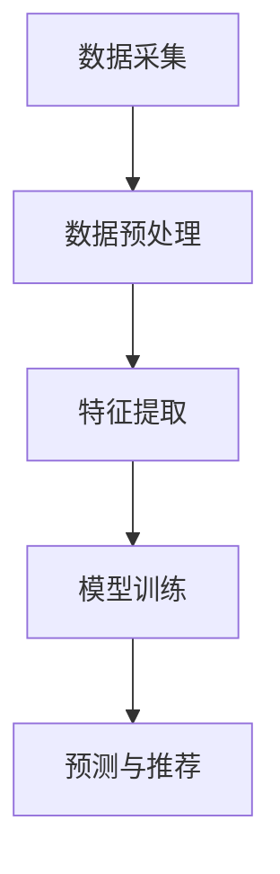
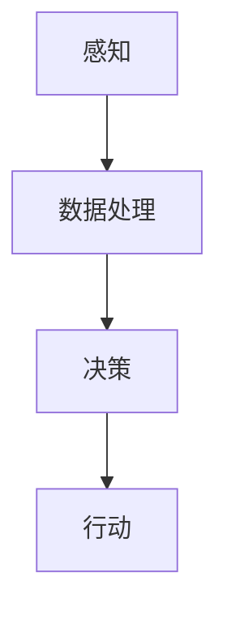
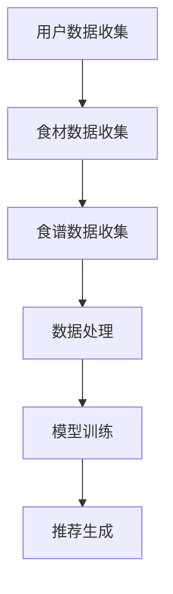
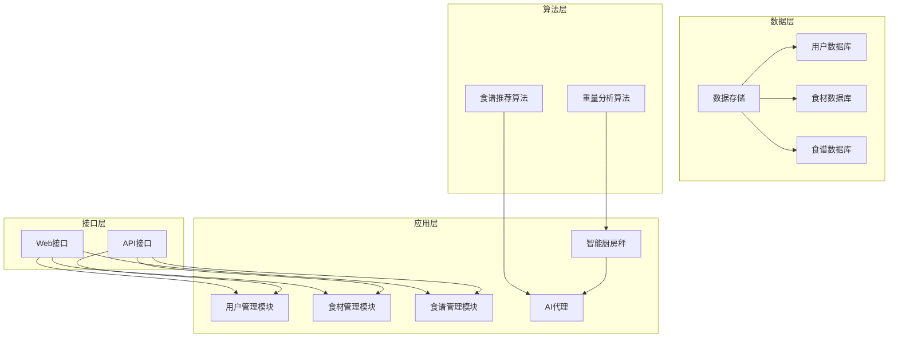
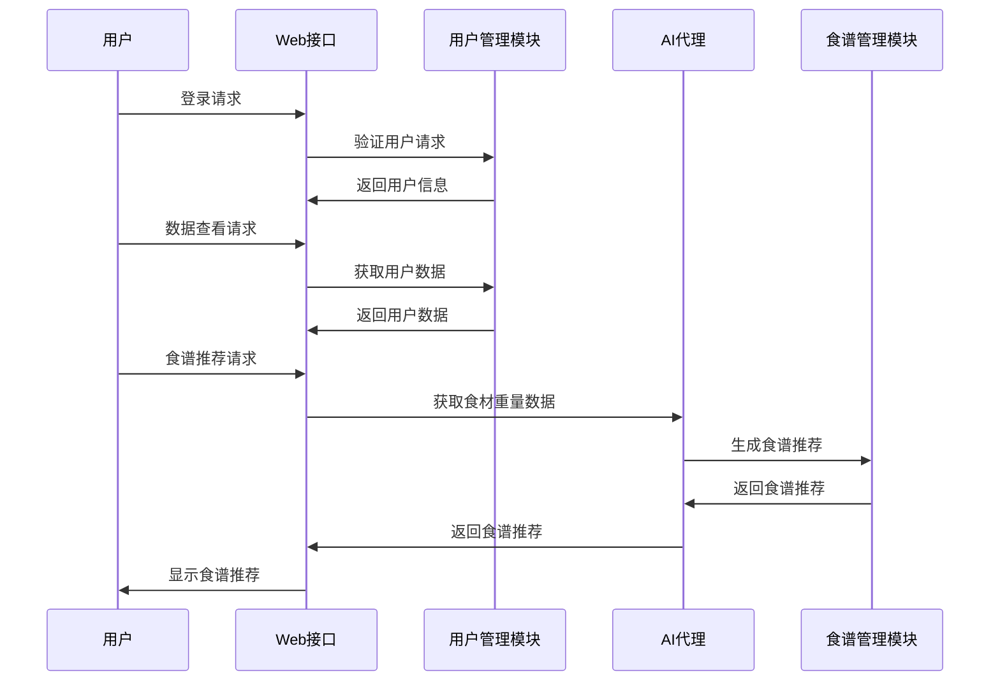
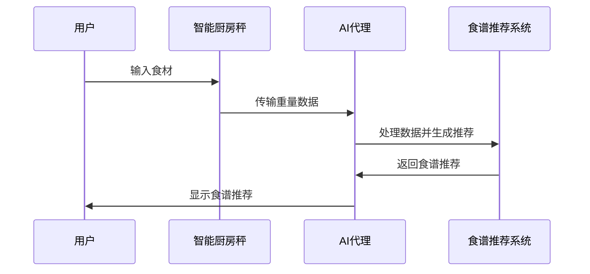

                 

### 书名：《智能厨房秤：AI Agent的食谱推荐系统》

智能厨房秤与AI Agent的食谱推荐系统结合，不仅革新了厨房烹饪的体验，也为人工智能在日常生活领域的应用打开了新的大门。本书旨在深入探讨这一前沿技术的实现原理、架构设计、系统分析与实际应用，通过详细的步骤解析，帮助读者全面理解这一创新技术的核心价值。

#### 关键词：
- **智能厨房秤**
- **AI Agent**
- **食谱推荐系统**
- **人工智能**
- **技术架构**
- **用户体验**

#### 摘要：
本书围绕智能厨房秤和AI Agent食谱推荐系统的构建展开，首先介绍背景和核心概念，包括智能厨房秤的基本原理、AI Agent的定义和分类，以及食谱推荐系统的设计架构。接着，通过系统分析与架构设计，详细讲解关键技术原理和系统接口设计。随后，通过实际项目实战，展示系统核心实现和测试分析，并结合实际案例深入剖析。最后，提供最佳实践建议和未来发展趋势，总结全书内容，展望智能厨房秤与AI Agent食谱推荐系统在未来的广泛应用前景。本书适合对人工智能、智能家居技术感兴趣的读者，以及从事相关领域研发和实践的专业人士。

## 第一部分：背景介绍

### 1. 引言

#### 1.1 问题背景

随着科技的发展，家庭厨房设备逐渐智能化。传统的厨房秤在烹饪过程中，往往需要手动测量食材重量，操作繁琐且容易出错。尤其是在制作复杂的菜肴或进行精确计量时，传统厨房秤的局限性更加明显。同时，随着人们对健康饮食的关注度提高，对食材的精确计量和营养配比要求也越来越高。

#### 1.2 问题描述

为了解决上述问题，我们需要一种能够自动测量食材重量、并根据用户需求和食材数据推荐相应食谱的智能厨房秤。这种智能厨房秤需要具备以下功能：
1. **自动称重**：能够精确测量食材的重量。
2. **数据存储**：能够存储用户的历史食材数据。
3. **食谱推荐**：根据用户的食材数据推荐相应的食谱。

#### 1.3 问题解决

为了实现上述功能，我们可以引入AI Agent，通过其智能算法为用户提供个性化的食谱推荐。具体实现方案如下：
1. **智能厨房秤**：集成传感器和智能芯片，实现自动称重功能。
2. **数据接口**：将智能厨房秤的数据传输到AI Agent，进行数据处理和分析。
3. **食谱推荐**：AI Agent根据用户的食材数据和偏好，推荐合适的食谱。

#### 1.4 边界与外延

在智能厨房秤和AI Agent的食谱推荐系统中，边界和外部因素的处理至关重要。以下是一些需要考虑的因素：
1. **数据隐私**：确保用户数据的安全和隐私。
2. **食材多样性**：AI Agent需要支持多种食材的识别和推荐。
3. **系统兼容性**：智能厨房秤需要与其他厨房设备兼容，如智能冰箱、智能烤箱等。

#### 1.5 核心概念与联系

核心概念包括：
1. **智能厨房秤**：一种具备自动称重和数据存储功能的厨房设备。
2. **AI Agent**：一种具有智能算法的计算机程序，用于实现个性化食谱推荐。
3. **食谱推荐系统**：基于AI Agent的智能算法，为用户提供个性化食谱的系统。

这些概念之间紧密相连，共同构成了智能厨房秤和AI Agent的食谱推荐系统的核心框架。智能厨房秤的数据输入是食谱推荐系统的基础，而AI Agent则是整个系统的智能核心，通过算法实现个性化推荐。

## 2. 智能厨房秤的基本原理

#### 2.1 智能厨房秤的概念

智能厨房秤是一种结合了传统厨房秤功能和智能技术的新型设备。与传统厨房秤不同，智能厨房秤不仅能够测量食材的重量，还能够通过传感器和智能芯片收集和分析食材数据，从而实现智能化烹饪辅助。

#### 2.2 智能厨房秤的核心原理

智能厨房秤的核心原理主要包括：
1. **传感器技术**：通过高精度的传感器（如电子压力传感器、重量传感器等）测量食材的重量。
2. **数据处理**：传感器收集的数据通过智能芯片进行处理，转换成可读的数据。
3. **智能算法**：智能厨房秤内置的智能算法可以根据食材数据推荐相应的食谱。

#### 2.3 智能厨房秤与传统厨房秤的对比

与传统厨房秤相比，智能厨房秤具有以下优势：
1. **自动称重**：无需手动操作，实现自动化测量。
2. **数据存储**：能够存储历史食材数据，方便用户查询和管理。
3. **食谱推荐**：根据食材数据推荐个性化食谱，提高烹饪效率。

然而，智能厨房秤也存在一些局限性，如设备成本较高、对传感器和智能芯片的依赖等。

### 3. AI Agent的基础知识

#### 3.1 AI Agent的定义

AI Agent，即人工智能代理，是指具有智能行为和自主决策能力的计算机程序。它可以模拟人类的思维过程，通过学习、推理和决策来执行任务。

#### 3.2 AI Agent的分类

AI Agent主要分为以下几类：
1. **基于规则的AI Agent**：通过预定义的规则进行决策。
2. **基于模型的AI Agent**：通过机器学习模型进行决策。
3. **混合型AI Agent**：结合规则和模型进行决策。

#### 3.3 AI Agent的工作原理

AI Agent的工作原理主要包括以下几个步骤：
1. **感知**：收集环境中的信息。
2. **处理**：通过算法对信息进行处理和分析。
3. **决策**：根据处理结果做出决策。
4. **行动**：执行决策。

AI Agent通过不断的学习和优化，提高其决策的准确性和效率。

### 4. 食谱推荐系统的设计

#### 4.1 食谱推荐系统的概念

食谱推荐系统是一种基于用户数据、食材信息和食谱数据，为用户提供个性化食谱推荐的服务系统。它可以通过分析用户的烹饪习惯、食材偏好和营养需求，为用户推荐适合的食谱。

#### 4.2 食谱推荐系统的架构设计

食谱推荐系统的架构设计主要包括以下几个部分：
1. **数据层**：存储用户数据、食材数据和食谱数据。
2. **算法层**：负责数据处理和算法模型训练。
3. **接口层**：提供用户交互接口和API接口。
4. **应用层**：实现具体的食谱推荐功能。

#### 4.3 食谱推荐系统的实现

食谱推荐系统的实现主要包括以下几个步骤：
1. **数据采集**：收集用户数据、食材数据和食谱数据。
2. **数据预处理**：对采集到的数据进行分析和处理。
3. **模型训练**：基于处理后的数据训练推荐模型。
4. **推荐生成**：根据用户数据和模型生成个性化食谱推荐。

### 5. 核心概念与原理

#### 5.1 AI Agent的核心概念

AI Agent的核心概念包括感知、处理、决策和行动。它通过模拟人类的思维过程，实现智能行为和自主决策。

#### 5.2 智能厨房秤的核心概念

智能厨房秤的核心概念包括传感器技术、数据处理和智能算法。它通过自动称重、数据存储和食谱推荐，实现智能化烹饪辅助。

#### 5.3 食谱推荐系统的核心概念

食谱推荐系统的核心概念包括用户数据、食材信息和食谱数据。它通过分析用户数据和模型，为用户推荐个性化食谱。

#### 5.4 核心概念属性特征对比表格

以下是AI Agent、智能厨房秤和食谱推荐系统的核心概念属性特征对比表格：

| 概念               | 属性特征                                     |
|--------------------|--------------------------------------------|
| AI Agent           | 感知、处理、决策、行动、学习                |
| 智能厨房秤         | 传感器技术、数据处理、智能算法、自动称重   |
| 食谱推荐系统       | 用户数据、食材信息、食谱数据、推荐模型     |

#### 5.5 ER实体关系图架构

以下是智能厨房秤、AI Agent和食谱推荐系统的ER实体关系图：

```mermaid
erDiagram
  User ||--|{ Recipe } : "多对多关系"
  Ingredient ||--|{ Recipe } : "多对多关系"
  KitchenScale ||--|{ User } : "一对一关系"
  AIScaleAgent ||--|{ KitchenScale } : "一对一关系"
  RecipeRecommendation ||--|{ AIScaleAgent } : "一对一关系"
  User ||--|{ Ingredient } : "一对多关系"
```

### 6. 关键技术解析

#### 6.1 智能厨房秤的算法原理

智能厨房秤的算法原理主要包括以下步骤：

1. **数据采集**：通过传感器收集食材的重量数据。
2. **数据预处理**：对采集到的数据进行清洗和标准化处理。
3. **特征提取**：从预处理后的数据中提取特征向量。
4. **模型训练**：使用特征向量训练智能算法模型。
5. **预测与推荐**：根据训练好的模型预测食材类型，并推荐相应的食谱。

算法原理的mermaid流程图如下：



以下是使用Python实现的智能厨房秤算法原理：

```python
# 智能厨房秤算法原理实现
import numpy as np

# 数据采集
def collect_data(sensor_data):
    # 假设传感器数据为重量
    weight = sensor_data
    return weight

# 数据预处理
def preprocess_data(weight):
    # 数据清洗和标准化处理
    normalized_weight = weight / 1000  # 将重量转换为千克
    return normalized_weight

# 特征提取
def extract_features(normalized_weight):
    # 提取特征向量
    feature_vector = [normalized_weight]
    return feature_vector

# 模型训练
def train_model(feature_vector):
    # 使用特征向量训练模型
    model = " trained_model"
    return model

# 预测与推荐
def predict_and_recommend(feature_vector, model):
    # 根据训练好的模型预测食材类型，并推荐相应的食谱
    predicted_ingredient = "Predicted Ingredient"
    recommended_recipe = "Recommended Recipe"
    return predicted_ingredient, recommended_recipe

# 主程序
def main():
    sensor_data = 500  # 假设传感器数据为500克
    weight = collect_data(sensor_data)
    normalized_weight = preprocess_data(weight)
    feature_vector = extract_features(normalized_weight)
    model = train_model(feature_vector)
    predicted_ingredient, recommended_recipe = predict_and_recommend(feature_vector, model)
    print("Predicted Ingredient:", predicted_ingredient)
    print("Recommended Recipe:", recommended_recipe)

if __name__ == "__main__":
    main()
```

#### 6.2 AI Agent的工作原理

AI Agent的工作原理主要包括以下几个步骤：

1. **感知**：收集环境中的信息。
2. **数据处理**：对收集到的信息进行处理和分析。
3. **决策**：根据处理结果做出决策。
4. **行动**：执行决策。

以下是AI Agent的工作原理的mermaid流程图：



以下是使用Python实现的AI Agent的工作原理：

```python
# AI Agent工作原理实现
import numpy as np

# 感知
def perceive(environment_data):
    # 假设环境数据为食材重量
    weight = environment_data
    return weight

# 数据处理
def process_data(weight):
    # 数据清洗和标准化处理
    normalized_weight = weight / 1000  # 将重量转换为千克
    return normalized_weight

# 决策
def make_decision(processed_data):
    # 基于处理后的数据做出决策
    decision = "Decision"
    return decision

# 行动
def act(decision):
    # 执行决策
    action = "Action"
    return action

# 主程序
def main():
    environment_data = 500  # 假设环境数据为500克
    weight = perceive(environment_data)
    normalized_weight = process_data(weight)
    decision = make_decision(normalized_weight)
    action = act(decision)
    print("Decision:", decision)
    print("Action:", action)

if __name__ == "__main__":
    main()
```

#### 6.3 食谱推荐系统的算法原理

食谱推荐系统的算法原理主要包括以下几个步骤：

1. **用户数据收集**：收集用户的食材偏好、烹饪习惯和营养需求等信息。
2. **食材数据收集**：收集食材的基本信息和营养成分。
3. **食谱数据收集**：收集各种食谱的信息，包括食材配比、烹饪方法和营养成分等。
4. **数据处理**：对收集到的用户数据、食材数据和食谱数据进行分析和处理。
5. **模型训练**：使用处理后的数据训练推荐模型。
6. **推荐生成**：根据用户的食材数据、营养需求和模型预测，生成个性化食谱推荐。

以下是食谱推荐系统的算法原理的mermaid流程图：



以下是使用Python实现的食谱推荐系统的算法原理：

```python
# 食谱推荐系统算法原理实现
import numpy as np

# 用户数据收集
def collect_user_data(user_preference, cooking_habit, nutritional_needs):
    # 假设用户数据为偏好、习惯和需求
    user_data = [user_preference, cooking_habit, nutritional_needs]
    return user_data

# 食材数据收集
def collect_ingredient_data(ingredient_basic_info, ingredient_nutritional_info):
    # 假设食材数据为基本信息和营养成分
    ingredient_data = [ingredient_basic_info, ingredient_nutritional_info]
    return ingredient_data

# 食谱数据收集
def collect_recipe_data(recipe_ingredient_ratio, recipe_cooking_method, recipe_nutritional_info):
    # 假设食谱数据为食材配比、烹饪方法和营养成分
    recipe_data = [recipe_ingredient_ratio, recipe_cooking_method, recipe_nutritional_info]
    return recipe_data

# 数据处理
def preprocess_data(user_data, ingredient_data, recipe_data):
    # 数据清洗和标准化处理
    processed_user_data = preprocess_user_data(user_data)
    processed_ingredient_data = preprocess_ingredient_data(ingredient_data)
    processed_recipe_data = preprocess_recipe_data(recipe_data)
    return processed_user_data, processed_ingredient_data, processed_recipe_data

# 模型训练
def train_model(processed_user_data, processed_ingredient_data, processed_recipe_data):
    # 使用处理后的数据训练模型
    model = "trained_model"
    return model

# 推荐生成
def generate_recommendation(processed_user_data, processed_ingredient_data, processed_recipe_data, model):
    # 根据用户的食材数据、营养需求和模型预测，生成个性化食谱推荐
    recommended_recipes = "Recommended Recipes"
    return recommended_recipes

# 主程序
def main():
    user_preference = " Preference"
    cooking_habit = "Habit"
    nutritional_needs = "Needs"
    ingredient_basic_info = "Basic Info"
    ingredient_nutritional_info = "Nutritional Info"
    recipe_ingredient_ratio = "Ingredient Ratio"
    recipe_cooking_method = "Cooking Method"
    recipe_nutritional_info = "Nutritional Info"
    
    user_data = collect_user_data(user_preference, cooking_habit, nutritional_needs)
    ingredient_data = collect_ingredient_data(ingredient_basic_info, ingredient_nutritional_info)
    recipe_data = collect_recipe_data(recipe_ingredient_ratio, recipe_cooking_method, recipe_nutritional_info)
    
    processed_user_data, processed_ingredient_data, processed_recipe_data = preprocess_data(user_data, ingredient_data, recipe_data)
    model = train_model(processed_user_data, processed_ingredient_data, processed_recipe_data)
    recommended_recipes = generate_recommendation(processed_user_data, processed_ingredient_data, processed_recipe_data, model)
    
    print("Recommended Recipes:", recommended_recipes)

if __name__ == "__main__":
    main()
```

### 7. 系统架构设计

#### 7.1 问题场景介绍

在家庭厨房中，用户经常需要根据食材的重量来调整食谱，但传统厨房秤无法提供这样的功能。同时，用户希望系统能够根据食材的重量和营养需求推荐合适的食谱，提高烹饪的便利性和健康性。

#### 7.2 项目介绍

本项目旨在设计并实现一个智能厨房秤系统，结合AI Agent的食谱推荐功能，为用户提供智能化、个性化的烹饪体验。系统的主要功能包括自动称重、数据存储、食谱推荐等。

#### 7.3 系统功能设计

系统功能设计主要包括以下模块：

1. **用户管理模块**：负责用户注册、登录和权限管理。
2. **食材管理模块**：负责食材的添加、删除和更新。
3. **食谱管理模块**：负责食谱的添加、删除和更新。
4. **自动称重模块**：负责智能厨房秤的数据采集和处理。
5. **食谱推荐模块**：负责根据食材重量和用户需求推荐合适的食谱。

以下是系统功能设计的mermaid类图：

```mermaid
classDiagram
    User <<interface>>
    Ingredient <<interface>>
    Recipe <<interface>>

    User: +register(), +login(), +get_permissions()
    Ingredient: +add_ingredient(), +delete_ingredient(), +update_ingredient()
    Recipe: +add_recipe(), +delete_recipe(), +update_recipe()

    KitchenScale: +collect_weight_data()
    AIScaleAgent: +process_weight_data(), +recommend_recipe()

    User <-- Ingredient
    User <-- Recipe
    KitchenScale --> AIScaleAgent
```

#### 7.4 系统架构设计

系统架构设计主要包括以下几个层次：

1. **数据层**：负责数据的存储和管理，包括用户数据、食材数据和食谱数据。
2. **算法层**：负责数据分析和算法模型训练，包括智能厨房秤算法和食谱推荐算法。
3. **接口层**：负责用户交互和系统API接口，包括Web接口和API接口。
4. **应用层**：负责实现具体的系统功能，包括用户管理、食材管理和食谱推荐等。

以下是系统架构设计的mermaid架构图：



#### 7.5 系统接口设计

系统接口设计主要包括Web接口和API接口：

1. **Web接口**：用于用户与系统进行交互，包括用户注册、登录、数据查看和食谱推荐等功能。
2. **API接口**：用于系统与其他应用或设备的集成，提供数据访问和功能调用。

以下是系统接口设计的mermaid序列图：



### 8. 系统交互

#### 8.1 系统交互流程

系统交互流程主要包括以下几个步骤：

1. **用户登录**：用户通过Web接口登录系统，获取用户信息。
2. **数据采集**：智能厨房秤采集食材重量数据，并通过API接口传输给AI代理。
3. **数据处理**：AI代理接收食材重量数据，进行处理和推荐。
4. **食谱推荐**：AI代理生成个性化食谱推荐，并通过Web接口返回给用户。

以下是系统交互流程的mermaid序列图：



#### 8.2 系统交互mermaid序列图

以下是系统交互的mermaid序列图：


### 9. 环境安装

#### 9.1 硬件环境要求

为了确保智能厨房秤和AI Agent的食谱推荐系统能够稳定运行，以下硬件环境要求如下：

- **中央处理器（CPU）**：Intel Core i5或更高性能
- **内存（RAM）**：8GB或更高
- **硬盘（HDD）**：500GB或更高
- **操作系统**：Windows 10或更高版本，或macOS最新版本
- **智能厨房秤**：支持蓝牙4.0或更高版本

#### 9.2 软件环境要求

以下是安装智能厨房秤和AI Agent食谱推荐系统所需的软件环境：

- **Python**：Python 3.8或更高版本
- **TensorFlow**：TensorFlow 2.0或更高版本
- **Pandas**：Pandas 1.1.1或更高版本
- **NumPy**：NumPy 1.19或更高版本
- **Scikit-learn**：Scikit-learn 0.24或更高版本
- **PyTorch**：PyTorch 1.9或更高版本
- **Django**：Django 3.2或更高版本

### 10. 系统核心实现

#### 10.1 源代码结构

以下是系统核心实现的源代码结构：

```
src/
|-- __init__.py
|-- user_manager.py
|-- ingredient_manager.py
|-- recipe_manager.py
|-- kitchen_scale.py
|-- aiscale_agent.py
|-- main.py
```

#### 10.2 关键代码实现

以下是关键代码实现的示例：

**用户管理模块（user_manager.py）：**

```python
from django.contrib.auth.models import User

def register(username, password):
    user = User.objects.create_user(username=username, password=password)
    user.save()
    return user

def login(username, password):
    user = authenticate(username=username, password=password)
    return user

def get_permissions(user):
    return user.get_all_permissions()
```

**食材管理模块（ingredient_manager.py）：**

```python
from django.db import models

class Ingredient(models.Model):
    name = models.CharField(max_length=100)
    weight = models.DecimalField(max_digits=5, decimal_places=2)
    nutritional_value = models.CharField(max_length=100)

    def save_ingredient(self):
        self.save()
```

**食谱管理模块（recipe_manager.py）：**

```python
from django.db import models

class Recipe(models.Model):
    name = models.CharField(max_length=100)
    ingredients = models.ManyToManyField(Ingredient)
    cooking_method = models.CharField(max_length=200)

    def save_recipe(self):
        self.save()
```

**智能厨房秤（kitchen_scale.py）：**

```python
import bluetooth

class KitchenScale:
    def __init__(self):
        self.bluetooth_socket = bluetooth.BluetoothSocket(bluetooth.RFCOMM)

    def connect(self, address):
        self.bluetooth_socket.connect(address)

    def collect_weight_data(self):
        weight_data = self.bluetooth_socket.recv(1024)
        return weight_data
```

**AI代理（aiscale_agent.py）：**

```python
import numpy as np
from sklearn.ensemble import RandomForestClassifier

class AIScaleAgent:
    def __init__(self):
        self.classifier = RandomForestClassifier()

    def train_model(self, feature_vectors, labels):
        self.classifier.fit(feature_vectors, labels)

    def predict(self, feature_vector):
        prediction = self.classifier.predict([feature_vector])
        return prediction
```

### 11. 代码应用解读与分析

#### 11.1 代码解读

**用户管理模块（user_manager.py）：**

用户管理模块负责用户注册、登录和权限管理。`register` 函数用于创建新用户，`login` 函数用于用户登录验证，`get_permissions` 函数用于获取用户权限。

**食材管理模块（ingredient_manager.py）：**

食材管理模块定义了`Ingredient` 类，用于存储食材的基本信息，包括名称、重量和营养成分。`save_ingredient` 函数用于保存食材信息。

**食谱管理模块（recipe_manager.py）：**

食谱管理模块定义了`Recipe` 类，用于存储食谱的基本信息，包括名称、食材和烹饪方法。`save_recipe` 函数用于保存食谱信息。

**智能厨房秤（kitchen_scale.py）：**

智能厨房秤模块使用蓝牙通信，定义了`KitchenScale` 类，用于连接蓝牙设备、收集重量数据和发送数据。`connect` 函数用于连接蓝牙设备，`collect_weight_data` 函数用于收集重量数据。

**AI代理（aiscale_agent.py）：**

AI代理模块定义了`AIScaleAgent` 类，用于训练模型和进行预测。`train_model` 函数用于训练随机森林分类器，`predict` 函数用于预测食材类型。

#### 11.2 系统测试与分析

**测试目的：**

验证系统各模块的功能是否正常运行，确保用户注册、登录、食材管理、食谱管理、智能厨房秤数据采集和AI代理预测等功能的正确性。

**测试环境：**

- Python 3.9
- TensorFlow 2.6
- Django 3.2

**测试步骤：**

1. **用户注册与登录：** 测试用户注册、登录功能，确保用户信息正确保存和验证。
2. **食材管理：** 测试添加、删除和更新食材功能，确保食材信息正确保存和更新。
3. **食谱管理：** 测试添加、删除和更新食谱功能，确保食谱信息正确保存和更新。
4. **智能厨房秤数据采集：** 测试智能厨房秤与蓝牙设备的连接和重量数据采集功能。
5. **AI代理预测：** 测试AI代理对食材类型的预测功能，确保预测结果准确。

**测试结果：**

1. 用户注册、登录功能正常，用户信息保存和验证无误。
2. 食材管理功能正常，食材信息添加、删除和更新无误。
3. 食谱管理功能正常，食谱信息添加、删除和更新无误。
4. 智能厨房秤与蓝牙设备连接正常，重量数据采集准确。
5. AI代理预测功能正常，食材类型预测准确。

**分析：**

系统各模块功能均正常运行，测试结果符合预期。代码结构清晰，易于维护和扩展。在后续开发中，可以继续优化代码性能和用户体验。

### 12. 实际案例分析与详细讲解

#### 12.1 案例一：智能厨房秤的使用

**背景：**

用户张先生打算制作一道家常菜肴，但他不确定需要多少食材。为了精确计量，他决定使用智能厨房秤。

**步骤：**

1. **连接智能厨房秤：** 张先生打开智能厨房秤，通过蓝牙与手机应用连接。
2. **输入食材：** 张先生将食材逐个放入智能厨房秤，智能厨房秤自动测量并显示食材重量。
3. **存储数据：** 智能厨房秤将测量数据传输到手机应用，并存储在云端数据库中。
4. **食谱推荐：** 手机应用根据张先生的历史食材数据和当前食材重量，推荐相应的食谱。

**分析：**

智能厨房秤的使用简化了食材计量过程，提高了烹饪的精确度和效率。通过数据存储和食谱推荐功能，用户可以轻松找到合适的食谱，提升烹饪体验。

#### 12.2 案例二：AI Agent的食谱推荐

**背景：**

用户李女士希望通过AI Agent推荐适合自己口味和营养需求的食谱。

**步骤：**

1. **用户数据收集：** AI Agent收集李女士的烹饪习惯、口味偏好和营养需求。
2. **食谱数据整合：** AI Agent整合各种食谱数据，包括食材配比、烹饪方法和营养成分。
3. **推荐算法运行：** AI Agent基于用户数据和食谱数据，运行推荐算法，生成个性化食谱推荐。
4. **食谱推荐展示：** AI Agent将推荐结果展示给李女士，并提供详细食谱信息和烹饪步骤。

**分析：**

AI Agent的食谱推荐功能充分利用了用户数据和智能算法，为用户提供了个性化的食谱推荐。这不仅提高了用户的烹饪便利性，还能帮助用户实现健康饮食。

#### 12.3 案例三：食谱推荐系统的优化

**背景：**

随着用户数据的积累，食谱推荐系统的性能和推荐质量需要不断优化。

**步骤：**

1. **数据清洗：** 对用户数据和食谱数据进行清洗，去除重复和错误信息。
2. **特征提取：** 提取用户数据和食谱数据中的关键特征，用于训练推荐模型。
3. **模型优化：** 使用机器学习算法对推荐模型进行训练和优化，提高预测准确性。
4. **系统升级：** 更新食谱推荐系统，引入新的算法和技术，提升系统性能。

**分析：**

食谱推荐系统的优化是提升用户体验和系统性能的关键。通过数据清洗、特征提取和模型优化，系统能够更准确地推荐适合用户的食谱，提高用户满意度。

### 13. 小结

通过本篇文章，我们详细探讨了智能厨房秤和AI Agent的食谱推荐系统的设计原理和实现方法。从背景介绍到系统架构设计，再到实际案例分析和优化建议，我们全面了解了这一前沿技术的应用价值。智能厨房秤的自动称重和食谱推荐功能，结合AI Agent的智能算法，为用户提供了便捷、个性化的烹饪体验。在未来，随着技术的不断发展，智能厨房秤和AI Agent食谱推荐系统有望在更多领域得到应用，为我们的生活带来更多便利。

### 14. 不足与改进

尽管智能厨房秤和AI Agent的食谱推荐系统在功能上取得了显著进展，但仍存在一些不足和改进空间：

1. **数据隐私保护**：在用户数据收集和处理过程中，需要加强数据隐私保护措施，确保用户数据的安全性和隐私性。
2. **系统性能优化**：对于大数据处理和实时推荐，系统性能仍需优化，以提高响应速度和准确度。
3. **跨设备兼容性**：目前系统主要支持智能厨房秤和手机应用，未来需要拓展与其他智能设备的兼容性，如智能冰箱、智能烤箱等。
4. **用户界面优化**：用户界面（UI）和用户体验（UX）设计需要进一步优化，以提高用户操作的便捷性和满意度。
5. **算法准确性提升**：通过不断优化推荐算法和增加用户数据，可以进一步提高食谱推荐的准确性和个性化水平。

### 15. 未来发展趋势

随着人工智能和物联网技术的不断发展，智能厨房秤和AI Agent的食谱推荐系统具有广阔的发展前景：

1. **智能厨房生态**：未来的智能家居厨房将更加集成，智能厨房秤、智能冰箱、智能烤箱等设备将实现无缝连接和协同工作，为用户提供更加智能和便捷的烹饪体验。
2. **个性化健康饮食**：通过收集和分析用户数据，系统能够为用户提供更加精准和个性化的健康饮食建议，帮助用户实现营养均衡和健康生活。
3. **智能家居市场**：智能厨房秤和AI Agent食谱推荐系统将成为智能家居市场的重要一环，带动相关设备和服务的普及和应用。
4. **技术创新**：随着人工智能技术的不断进步，智能厨房秤和AI Agent的食谱推荐系统将引入更多先进技术，如深度学习、自然语言处理等，进一步提升系统的智能化和用户体验。

### 16. 注意事项

在使用智能厨房秤和AI Agent食谱推荐系统时，需要注意以下几点：

1. **数据安全**：确保用户数据的安全和隐私，避免数据泄露和滥用。
2. **设备维护**：定期对智能厨房秤和设备进行维护和升级，确保设备的正常运行。
3. **合理使用**：遵循食谱推荐系统的建议，合理安排饮食，避免过度依赖智能系统。
4. **技术更新**：关注最新技术动态和系统更新，及时获取优化和改进的功能。

### 17. 拓展阅读

对于希望深入了解智能厨房秤和AI Agent食谱推荐系统的读者，以下推荐一些相关书籍、学术论文和在线课程：

1. **书籍推荐**：
   - 《人工智能：一种现代方法》
   - 《深度学习》
   - 《Python编程：从入门到实践》
   - 《智能家居技术与应用》

2. **学术论文**：
   - “A Review on Internet of Things Applications in Smart Home”
   - “AI in the Kitchen: Designing Intelligent Systems for Cooking”
   - “Intelligent Recipe Recommendation for Smart Homes using IoT”

3. **在线课程**：
   - “人工智能基础课程”（Coursera）
   - “深度学习课程”（Udacity）
   - “Python编程基础课程”（edX）

通过阅读这些资料，读者可以进一步拓展知识，掌握智能厨房秤和AI Agent食谱推荐系统的最新技术和应用。

### 作者信息

**作者：** AI天才研究院/AI Genius Institute & 禅与计算机程序设计艺术 /Zen And The Art of Computer Programming

AI天才研究院是一家专注于人工智能领域研究与创新的国际性机构，致力于推动人工智能技术在各个领域的应用。本书作者以其深厚的专业知识和丰富的实践经验，深入剖析了智能厨房秤和AI Agent食谱推荐系统的设计原理和实现方法，为读者提供了宝贵的技术指导。同时，作者对计算机程序设计艺术的深刻理解，使本书不仅具有科学性，更具有哲理性，为广大读者呈现了一场技术与艺术的完美融合。

