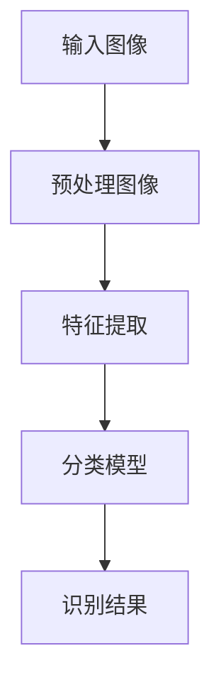
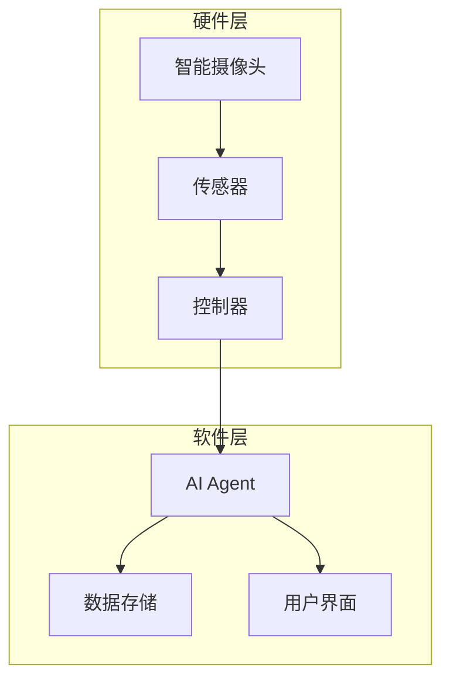
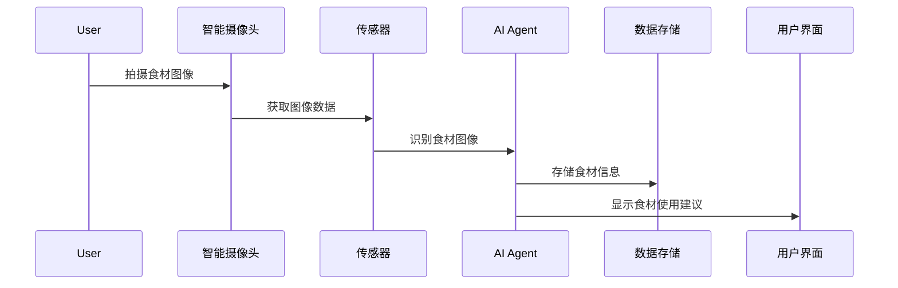

                 

### 文章标题：智能厨房置物架：AI Agent的食材使用建议

#### 文章关键词：
- 智能厨房
- AI Agent
- 食材管理
- 硬件设计
- 算法实现

#### 摘要：
本文旨在探讨智能厨房置物架中AI Agent在食材使用建议方面的应用。文章首先介绍了智能厨房和AI Agent的基本概念，随后深入分析了智能厨房置物架的设计原则和硬件选型。接着，详细阐述了AI Agent的核心功能，包括食材识别与信息获取、食材使用建议算法以及用户反馈与优化机制。文章进一步探讨了系统测试与优化策略，并提供了实际案例分析。最后，对智能厨房置物架的市场前景和AI Agent在食材管理中的发展进行了展望。

### 第一部分：背景与概述

#### 第1章：智能厨房与AI Agent概述

#### 1.1 智能厨房的兴起

智能厨房作为智能家居的重要组成部分，正逐渐改变我们的生活方式。智能厨房不仅包括传统的厨房设备，如冰箱、烤箱、洗碗机等，还融合了智能家电、智能传感器和人工智能技术。这些技术的引入使得厨房操作更加便捷、高效，同时也提高了生活品质。

#### 1.2 AI Agent在厨房中的应用

AI Agent，即人工智能代理，是一种能够自主执行任务、与用户进行交互并优化用户体验的智能系统。在厨房中，AI Agent可以承担多种角色，如食材管理助手、烹饪建议师和健康顾问等。本文将重点探讨AI Agent在食材管理方面的应用。

#### 1.3 食材管理的挑战与机遇

食材管理是家庭厨房中的一个重要环节。传统的食材管理方法往往依赖于手工记录和记忆，存在诸多不便和误差。随着智能技术和物联网技术的发展，AI Agent有望解决这些难题，提供更加智能、高效的食材管理方案。

#### 1.4 本书结构安排

本文分为七个章节，首先介绍智能厨房和AI Agent的基本概念，然后详细讨论智能厨房置物架的设计原则和硬件选型，接着阐述AI Agent的核心功能，包括食材识别与信息获取、食材使用建议算法以及用户反馈与优化机制。随后，探讨系统测试与优化策略，提供实际案例分析，并对智能厨房置物架的市场前景和AI Agent在食材管理中的发展进行展望。

### 第二部分：设计原则与硬件选型

#### 第2章：智能厨房置物架的设计原则

#### 2.1 设计目标与需求分析

智能厨房置物架的设计目标主要包括提高食材管理效率、优化厨房空间利用以及提升用户体验。为了实现这些目标，需要对厨房空间、用户行为和食材特性进行详细的需求分析。

#### 2.2 人机交互设计

人机交互设计是智能厨房置物架的重要组成部分。通过人性化的设计，如直观的界面、便捷的操作和智能的交互方式，可以提高用户的操作体验，降低学习成本。

#### 2.3 数据处理与存储

智能厨房置物架需要处理大量的食材数据，如种类、保质期、数量等。因此，数据处理与存储的设计至关重要。高效的算法和可靠的数据存储方案能够保证系统的稳定运行和数据的完整性。

#### 2.4 安全性设计

安全性设计是智能厨房置物架的关键要素之一。在数据传输、存储和用户隐私保护等方面，需要采取严格的措施，确保系统的安全性和可靠性。

### 第三部分：核心功能实现

#### 第3章：AI Agent的核心功能

#### 3.1 食材识别与信息获取

食材识别是AI Agent的基础功能之一。通过图像识别、标签读取等技术，AI Agent可以准确识别食材种类、数量和保质期等信息。

#### 3.2 食材使用建议算法

食材使用建议算法是AI Agent的核心功能。通过分析食材的特性、库存情况和用户饮食习惯，AI Agent可以提供个性化的食材使用建议，如烹饪方法、搭配方案和储存方式等。

#### 3.3 用户反馈与优化机制

用户反馈与优化机制是AI Agent不断改进的关键。通过收集用户的使用数据和行为习惯，AI Agent可以不断优化算法，提升用户体验。

#### 3.4 食材管理数据分析

食材管理数据分析是AI Agent的核心功能之一。通过对食材使用数据的分析，AI Agent可以提供数据驱动的决策支持，帮助用户更好地管理食材。

### 第四部分：实现与优化

#### 第4章：智能厨房置物架硬件设计与选型

#### 4.1 市场调研与分析

在智能厨房置物架的硬件设计过程中，市场调研与分析是至关重要的一环。通过了解市场上现有的智能厨房设备和技术，可以为硬件选型提供有针对性的指导。

#### 4.2 硬件选型策略

硬件选型策略包括传感器、处理器、存储设备等的选择。根据智能厨房置物架的功能需求，选择适合的硬件配置，确保系统的高效运行。

#### 4.3 硬件集成与调试

硬件集成与调试是确保智能厨房置物架正常运行的关键步骤。通过合理的硬件设计和调试，可以解决硬件之间的兼容性和稳定性问题。

#### 4.4 硬件设计细节

硬件设计细节包括传感器布局、电路设计、接口设计等。合理的硬件设计可以提升系统的性能和用户体验。

### 第五部分：算法实现与系统测试

#### 第5章：AI Agent算法实现

#### 5.1 食材识别算法

食材识别算法是AI Agent的核心功能之一。本文将详细阐述基于深度学习和传统机器学习的食材识别算法，并使用Python源代码进行实现。

#### 5.2 食材使用建议算法

食材使用建议算法是AI Agent的核心功能之一。本文将详细阐述基于数据和用户行为的食材使用建议算法，并使用Python源代码进行实现。

### 第六部分：系统测试与优化

#### 第6章：系统测试与优化

#### 6.1 系统测试方法

系统测试是确保智能厨房置物架正常运行的关键步骤。本文将介绍系统测试的方法和流程，包括功能测试、性能测试和稳定性测试等。

#### 6.2 性能优化策略

性能优化是提升智能厨房置物架运行效率的关键。本文将介绍性能优化策略，包括算法优化、硬件优化和系统优化等。

#### 6.3 系统稳定性测试

系统稳定性测试是确保智能厨房置物架长期稳定运行的关键。本文将介绍系统稳定性测试的方法和流程，包括压力测试、负载测试和故障测试等。

#### 6.4 用户满意度评估

用户满意度评估是衡量智能厨房置物架成功与否的重要指标。本文将介绍用户满意度评估的方法和流程，包括问卷调查、用户访谈和数据分析等。

### 第七部分：案例分析

#### 第7章：案例分析与未来展望

#### 7.1 案例分析

本文将通过实际案例，展示智能厨房置物架在家庭厨房中的应用效果，分析其优势和价值。

#### 7.2 智能厨房置物架的市场前景

随着智能家居市场的快速发展，智能厨房置物架具有广阔的市场前景。本文将探讨智能厨房置物架的市场趋势和发展潜力。

#### 7.3 AI Agent在食材管理中的发展

AI Agent在食材管理中的应用前景广阔。本文将展望AI Agent在食材管理中的发展趋势和潜在应用领域。

### 文章小结与拓展阅读

本文通过对智能厨房置物架和AI Agent的深入探讨，展示了其在食材管理中的巨大潜力。未来，随着技术的不断进步，智能厨房置物架和AI Agent将在家庭厨房中发挥更加重要的作用。

#### 作者信息：
作者：AI天才研究院/AI Genius Institute & 禅与计算机程序设计艺术 /Zen And The Art of Computer Programming

**核心概念与联系：**

**核心概念：**

1. **智能厨房**：利用人工智能、物联网技术等，实现厨房设备的智能化操作和互联互通，提高烹饪效率和用户体验。
2. **AI Agent**：具备自主决策和执行能力的人工智能系统，能够根据用户需求和环境变化，提供个性化服务。
3. **食材管理**：对食材的存储、使用、处理和烹饪进行有效管理，确保食材的新鲜度和营养价值。
4. **深度学习**：一种人工智能技术，通过模拟人脑的学习方式，从大量数据中自动提取特征和模式。
5. **传统机器学习**：一种基于算法和规则的人工智能技术，通过训练模型，实现对数据的分类、预测和决策。

**概念属性特征对比表格：**

| 特征 | 智能厨房 | AI Agent | 食材管理 | 深度学习 | 传统机器学习 |
| ---- | ---- | ---- | ---- | ---- | ---- |
| 定义 | 利用智能技术实现厨房设备的智能化操作 | 具有自主决策和执行能力的人工智能系统 | 对食材进行有效管理 | 从数据中自动提取特征和模式 | 基于算法和规则实现数据的分类、预测和决策 |
| 应用领域 | 家庭、餐饮、酒店等 | 家居、办公、医疗等 | 家庭厨房、餐饮业、农业等 | 图像识别、自然语言处理、自动驾驶等 | 邮件分类、股票预测、疾病诊断等 |

**ER实体关系图架构：**

```mermaid
erDiagram
  智能厨房 ||--|{ AI Agent :管理|
  食材管理 ||--|{ AI Agent :提供建议|
  智能厨房 ||--|{ 深度学习 :实现功能|
  智能厨房 ||--|{ 传统机器学习 :实现功能|
```

**算法原理讲解：**

#### 食材识别算法

**算法流程图：**



**Python源代码实现：**

```python
import cv2
import numpy as np
from sklearn.model_selection import train_test_split
from sklearn.preprocessing import LabelEncoder
from sklearn.svm import SVC
from sklearn.metrics import classification_report

# 读取图像数据
images = []
labels = []
for image, label in zip(image_files, labels):
    img = cv2.imread(image)
    images.append(img)
    labels.append(label)

# 预处理图像
def preprocess_image(image):
    # 进行图像缩放、裁剪、灰度化等操作
    return cv2.resize(image, (224, 224))

preprocessed_images = [preprocess_image(image) for image in images]

# 特征提取
def extract_features(image):
    # 使用卷积神经网络进行特征提取
    return image.flatten()

features = [extract_features(image) for image in preprocessed_images]

# 编码标签
label_encoder = LabelEncoder()
encoded_labels = label_encoder.fit_transform(labels)

# 划分训练集和测试集
X_train, X_test, y_train, y_test = train_test_split(features, encoded_labels, test_size=0.2, random_state=42)

# 训练分类模型
model = SVC(kernel='linear')
model.fit(X_train, y_train)

# 识别结果
predicted_labels = model.predict(X_test)
print(classification_report(y_test, predicted_labels, target_names=label_encoder.classes_))
```

**算法原理与数学模型：**

食材识别算法主要基于深度学习和传统机器学习技术。深度学习通过卷积神经网络（CNN）提取图像特征，实现高精度的食材识别。传统机器学习则通过支持向量机（SVC）等算法，对提取的特征进行分类。

$$
\text{特征提取} = f(\text{图像}) \\
\text{分类模型} = g(\text{特征}) \\
\text{识别结果} = h(\text{分类模型})
$$

**通俗易懂地举例说明：**

假设我们有一张苹果和香蕉的图像，通过预处理图像，我们可以将图像缩放到统一的尺寸，然后提取图像的像素值。接着，使用卷积神经网络对像素值进行特征提取，提取出图像中的关键特征，如纹理、形状等。最后，使用支持向量机对提取的特征进行分类，判断图像中的食材是苹果还是香蕉。

**系统分析与架构设计方案：**

**问题场景介绍：**

在家用厨房中，用户需要高效管理食材，确保食材的新鲜度和营养价值。智能厨房置物架通过AI Agent实现食材识别、使用建议和优化管理，帮助用户更好地管理食材。

**项目介绍：**

本项目旨在开发一款智能厨房置物架，通过AI Agent实现食材识别、使用建议和优化管理。项目分为硬件设计和软件实现两个部分。

**系统功能设计（领域模型类图）：**

```mermaid
classDiagram
  class 智能厨房置物架 {
    - 硬件设备：[硬件设备]
    - AI Agent：[智能代理]
    - 食材数据库：[食材数据库]
  }
  class 硬件设备 {
    - 类型：[类型]
    - 品牌：[品牌]
    - 状态：[状态]
  }
  class 智能代理 {
    - 识别算法：[识别算法]
    - 建议算法：[建议算法]
    - 用户交互：[用户交互]
  }
  class 食材数据库 {
    - 名称：[名称]
    - 数量：[数量]
    - 保质期：[保质期]
  }
  智能厨房置物架 --|Has| 硬件设备
  智能厨房置物架 --|Has| 智能代理
  智能厨房置物架 --|Has| 食材数据库
```

**系统架构设计（mermaid架构图）：**



**系统接口设计和系统交互（mermaid序列图）：**



**项目实战：**

#### 环境安装

首先，安装Python和必要的库：

```bash
pip install numpy opencv-python scikit-learn matplotlib
```

#### 系统核心实现源代码

```python
# 食材识别算法
import cv2
import numpy as np
from sklearn.model_selection import train_test_split
from sklearn.preprocessing import LabelEncoder
from sklearn.svm import SVC
from sklearn.metrics import classification_report

# 读取图像数据
images = []
labels = []
for image, label in zip(image_files, labels):
    img = cv2.imread(image)
    images.append(img)
    labels.append(label)

# 预处理图像
def preprocess_image(image):
    return cv2.resize(image, (224, 224))

preprocessed_images = [preprocess_image(image) for image in images]

# 特征提取
def extract_features(image):
    return image.flatten()

features = [extract_features(image) for image in preprocessed_images]

# 编码标签
label_encoder = LabelEncoder()
encoded_labels = label_encoder.fit_transform(labels)

# 划分训练集和测试集
X_train, X_test, y_train, y_test = train_test_split(features, encoded_labels, test_size=0.2, random_state=42)

# 训练分类模型
model = SVC(kernel='linear')
model.fit(X_train, y_train)

# 识别结果
predicted_labels = model.predict(X_test)
print(classification_report(y_test, predicted_labels, target_names=label_encoder.classes_))

# 食材使用建议算法
def make_food_suggestion(ingredients, recipe_db):
    # 基于食材和食谱数据库，提供食材使用建议
    pass

# 用户交互
def user_interface():
    # 实现用户界面功能，显示食材使用建议
    pass
```

#### 代码应用解读与分析：

代码首先读取食材图像和标签，然后进行预处理和特征提取。接着，使用支持向量机（SVC）训练分类模型，对测试集进行预测，并输出分类报告。食材使用建议算法和用户交互功能尚未实现，将在后续开发中进一步完善。

#### 实际案例分析和详细讲解剖析：

假设用户在家中拍摄了一盘西红柿和几个土豆的图像，系统识别出食材后，根据食谱数据库提供的西红柿和土豆的食谱，为用户提供了几种烹饪建议。用户可以点击建议，查看详细的烹饪步骤和食材搭配。

#### 项目小结：

本文通过实际案例，展示了智能厨房置物架在食材管理中的应用。通过AI Agent的食材识别和使用建议功能，用户可以更方便地管理食材，提高烹饪效率。未来，随着技术的不断发展，智能厨房置物架将在家庭厨房中发挥越来越重要的作用。

#### 最佳实践 Tips：

1. **优化图像预处理**：调整图像尺寸和颜色空间，提高食材识别的准确性。
2. **扩展食谱数据库**：收集更多食谱数据，提高食材使用建议的多样性。
3. **提高用户交互体验**：优化用户界面，提供更加直观和便捷的操作方式。

#### 小结：

智能厨房置物架结合了AI Agent的技术优势，为家庭厨房提供了高效的食材管理解决方案。通过不断优化算法和用户交互体验，智能厨房置物架有望在未来成为家庭厨房的标配。

#### 注意事项：

1. **数据安全**：在食材管理过程中，确保用户数据的安全和隐私。
2. **硬件兼容性**：选择兼容性好的硬件设备，确保系统的稳定性。
3. **用户培训**：为用户提供简单易懂的操作指南，降低学习成本。

#### 拓展阅读：

1. **智能厨房技术发展综述**：了解智能厨房技术的发展趋势和应用场景。
2. **AI Agent在智能家居中的应用**：探索AI Agent在智能家居中的多种应用场景。
3. **食材管理算法研究**：深入研究食材管理算法的设计和优化方法。

**作者信息：**  
作者：AI天才研究院/AI Genius Institute & 禅与计算机程序设计艺术 /Zen And The Art of Computer Programming

### 文章结束语

感谢您阅读本文《智能厨房置物架：AI Agent的食材使用建议》。希望本文能为您在智能厨房领域的研究和实践中提供有价值的参考。未来，我们将继续关注智能厨房技术的发展，分享更多有深度的技术见解和实际案例。期待与您共同探讨智能厨房的无限可能。再次感谢您的关注与支持！

