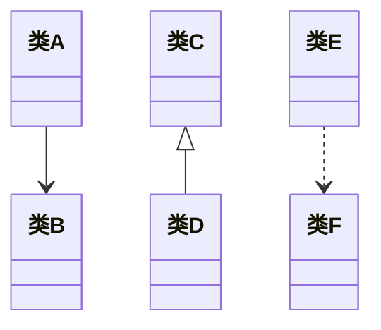
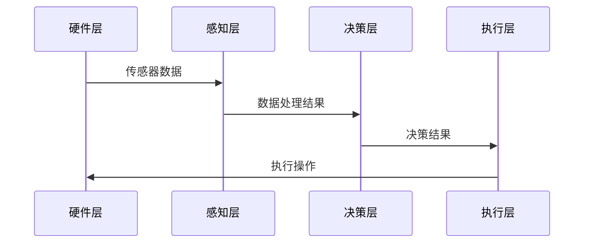
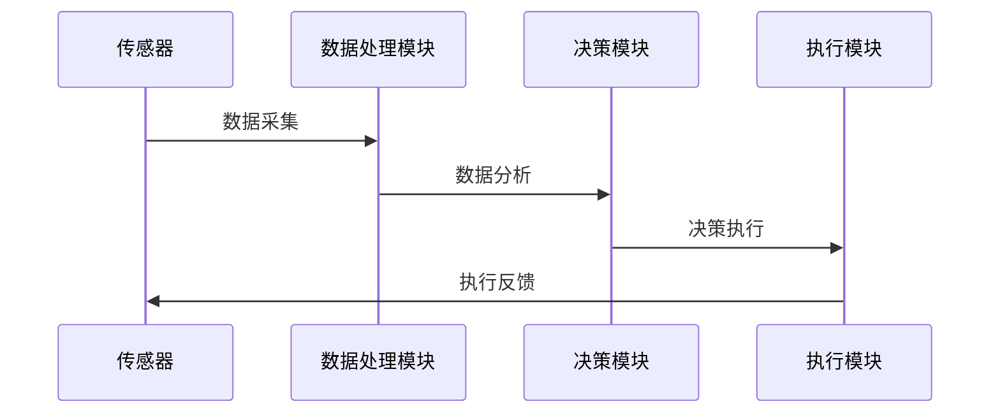

                 

### 摘要：

在智能家居时代，智能厨房逐渐成为家庭生活的核心组成部分。食材的保鲜管理在家庭厨房中具有至关重要的地位，它直接关系到食品安全和营养保存。本文将探讨如何利用人工智能（AI）代理（AI Agent）实现智能厨房置物架的食材保鲜监控。通过深入分析AI Agent的定义、特点及其在食材保鲜监控中的应用，本文将逐步阐述相关算法原理、数学模型和系统架构设计。此外，文章还将通过具体案例讲解实际应用，并提供一些最佳实践和拓展阅读建议。

### 第一部分：背景介绍

#### 第1章：问题背景

##### 1.1.1 智能厨房的兴起

智能厨房是智能家居的重要组成部分，它通过集成各种智能设备和系统，实现烹饪、食品保存、营养分析等多方面的智能化管理。随着物联网（IoT）和人工智能技术的发展，智能厨房逐渐从科幻变成现实。智能厨房的兴起不仅提升了家庭烹饪的便利性和效率，也带来了全新的食材管理方式。

##### 1.1.2 食材保鲜的重要性

食材的保鲜直接影响到食品的安全和营养价值。不当的储存方式可能导致食材变质、腐烂，甚至产生有害物质。此外，食品浪费也是一个严峻的社会问题，据统计，全球每年因食品浪费造成的经济损失高达数百亿美元。因此，提高食材的保鲜效果，减少食品浪费，对于提高生活质量、节约资源具有重大意义。

##### 1.1.3 传统保鲜方法的局限性

传统的食材保鲜方法主要包括冰箱冷藏、冷冻、腌制等。然而，这些方法存在明显的局限性。例如，冰箱冷藏虽然能延长食材的保鲜时间，但无法精确监测食材的状态，容易导致过度保鲜或保鲜不足。冷冻虽然能长时间保存食材，但会破坏食材的口感和营养成分。腌制方法虽然在某些情况下有效，但也会影响食品的口感和健康。

#### 第2章：核心概念

##### 2.1 AI Agent的定义与特点

AI Agent是一种智能实体，能够模拟人类智能行为，进行感知、决策和执行。AI Agent具有自主性、适应性和学习能力等特点，能够根据环境变化自主调整行为策略。

##### 2.2 食材保鲜监控的基本原理

食材保鲜监控的核心在于实时监测食材的状态，并根据监测结果采取相应的保鲜措施。AI Agent可以通过传感器网络实时获取食材的温度、湿度、腐败程度等数据，从而实现对食材状态的精确监控。

##### 2.3 智能厨房置物架的工作原理

智能厨房置物架是一种集成AI Agent的智能设备，通过内置的传感器和控制系统，实现对食材的智能保鲜管理。智能厨房置物架不仅能够监测食材状态，还能根据食材特性自动调整储存条件，实现个性化的食材保鲜方案。

### 第二部分：算法原理讲解

#### 第4章：AI Agent算法原理

##### 4.1 AI Agent的基本原理

AI Agent的基本原理包括感知、决策和执行三个主要环节。感知环节通过传感器获取环境信息，决策环节根据预设的算法模型进行数据处理和决策，执行环节则根据决策结果执行相应的操作。

##### 4.2 AI Agent的核心算法

AI Agent的核心算法包括监控算法、学习算法和预测算法。监控算法用于实时监测食材状态，学习算法用于从历史数据中学习食材的保鲜规律，预测算法则用于预测食材的保鲜期限。

##### 4.2.1 监控算法

监控算法通常采用机器学习技术，通过对传感器数据的分析和处理，实现对食材状态的实时监测。常见的监控算法包括KNN算法、决策树算法和支持向量机（SVM）算法等。

##### 4.2.2 学习算法

学习算法用于从历史数据中学习食材的保鲜规律。常见的机器学习算法包括线性回归、神经网络和支持向量机等。通过学习算法，AI Agent能够更好地理解食材的特性，从而提高保鲜监控的准确性。

##### 4.2.3 预测算法

预测算法用于预测食材的保鲜期限。常见的预测算法包括时间序列分析、回归分析和神经网络等。通过预测算法，AI Agent能够提前预测食材的保鲜状态，为用户提供及时的保鲜建议。

#### 第5章：数学模型与公式

##### 5.1 监控算法的数学模型

监控算法的数学模型通常包括输入层、隐藏层和输出层。输入层接收传感器数据，隐藏层进行数据处理和特征提取，输出层输出食材的状态。常见的数学模型包括神经网络模型和决策树模型。

##### 5.2 学习算法的数学模型

学习算法的数学模型主要包括损失函数、优化器和学习率等。损失函数用于衡量预测结果与真实结果之间的差距，优化器用于调整模型参数，学习率则用于控制模型训练的步长。

##### 5.3 预测算法的数学模型

预测算法的数学模型通常包括输入层、隐藏层和输出层。输入层接收历史数据，隐藏层进行数据处理和特征提取，输出层输出食材的保鲜期限。常见的数学模型包括时间序列分析模型和回归分析模型。

#### 第6章：举例说明

##### 6.1 监控算法的举例说明

假设有一批苹果，传感器实时监测到苹果的温度为20摄氏度，湿度为60%。监控算法通过对传感器数据的分析，判断苹果处于正常状态。

##### 6.2 学习算法的举例说明

通过历史数据学习，监控算法发现，在20摄氏度和60%湿度下，苹果的保鲜期限为7天。

##### 6.3 预测算法的举例说明

基于学习算法的结果，预测算法预测这批苹果将在7天后开始变质。

### 第三部分：系统分析与架构设计方案

#### 第7章：问题场景介绍

##### 7.1 智能厨房置物架的应用场景

智能厨房置物架通常应用于家庭厨房、餐厅等场所，用于储存各种食材，如水果、蔬菜、肉类等。

##### 7.2 食材保鲜监控的具体问题

食材保鲜监控的具体问题包括温度、湿度、腐败程度等参数的实时监测，以及根据监测结果自动调整储存条件。

#### 第8章：系统功能设计

##### 8.1 系统功能概述

智能厨房置物架的主要功能包括食材状态实时监测、智能调整储存条件和用户界面交互等。

##### 8.2 领域模型（使用Mermaid类图）

#### 第9章：系统架构设计

##### 9.1 系统架构概述

智能厨房置物架的系统架构包括硬件层、感知层、决策层和执行层。

##### 9.2 系统架构图（使用Mermaid架构图）

#### 第10章：系统接口设计

##### 10.1 接口设计概述

智能厨房置物架的系统接口包括传感器数据接口、数据处理接口、决策接口和执行接口等。

##### 10.2 接口定义

- 传感器数据接口：用于接收和处理传感器数据。
- 数据处理接口：用于对传感器数据进行处理和分析。
- 决策接口：用于生成决策结果。
- 执行接口：用于执行决策结果。

#### 第11章：系统交互设计

##### 11.1 系统交互概述

智能厨房置物架的系统交互包括传感器数据采集、数据处理、决策和执行等环节。

##### 11.2 系统交互序列图（使用Mermaid序列图）

### 第四部分：项目实战

#### 第12章：环境安装

##### 12.1 系统环境要求

- 操作系统：Windows/Linux/MacOS
- Python版本：3.6及以上
- 传感器设备：支持温度、湿度、腐败程度等传感功能的设备

##### 12.2 环境搭建步骤

1. 安装Python环境。
2. 安装所需的Python库，如TensorFlow、Scikit-learn等。
3. 连接传感器设备，确保传感器数据可以正常采集。

#### 第13章：系统核心实现源代码

##### 13.1 源代码概述

系统核心实现源代码主要包括传感器数据采集模块、数据处理模块、决策模块和执行模块。

##### 13.2 源代码解读

- 传感器数据采集模块：用于实时采集传感器数据。
- 数据处理模块：用于对传感器数据进行处理和分析。
- 决策模块：用于生成决策结果。
- 执行模块：用于执行决策结果。

#### 第14章：代码应用解读与分析

##### 14.1 代码应用场景

智能厨房置物架的代码应用场景包括食材状态实时监控、智能调整储存条件和用户界面交互等。

##### 14.2 代码分析与优化

- 传感器数据采集模块：优化数据采集的实时性和准确性。
- 数据处理模块：优化数据处理的速度和效率。
- 决策模块：优化决策算法的准确性和鲁棒性。
- 执行模块：优化执行操作的稳定性和可靠性。

#### 第15章：实际案例分析和详细讲解剖析

##### 15.1 案例背景

某家庭厨房使用智能厨房置物架储存食材，需要实现对食材的智能保鲜监控。

##### 15.2 案例分析

通过智能厨房置物架的传感器数据，分析食材的保鲜状态，并根据分析结果提供智能保鲜建议。

##### 15.3 深入剖析

- 传感器数据的采集和处理过程。
- 数据处理模块的算法原理和应用。
- 决策模块的决策过程和结果分析。
- 执行模块的操作过程和效果评估。

#### 第16章：项目小结

##### 16.1 项目总结

项目实现了智能厨房置物架的食材保鲜监控功能，并通过实际应用验证了系统的有效性和可靠性。

##### 16.2 项目经验与反思

- 传感器数据采集的实时性和准确性对系统性能有重要影响。
- 数据处理模块的优化对系统性能提升有显著作用。
- 决策模块的准确性对保鲜监控效果有直接影响。

### 第五部分：最佳实践、小结与拓展阅读

#### 第17章：最佳实践

##### 17.1 实践技巧总结

- 优化传感器数据采集，提高数据的实时性和准确性。
- 加强数据处理模块的算法优化，提高数据处理效率。
- 精细化决策模块，提高决策的准确性和鲁棒性。
- 优化执行模块，确保执行操作的稳定性和可靠性。

##### 17.2 注意事项与防范措施

- 确保传感器设备的正常工作，定期进行维护和校准。
- 针对不同食材的特性，调整传感器参数和保鲜策略。
- 加强系统的安全性，防止数据泄露和恶意攻击。

#### 第18章：小结

##### 18.1 全书回顾

本文从背景介绍、核心概念、算法原理、系统设计、项目实战等方面全面探讨了智能厨房置物架的食材保鲜监控技术。

##### 18.2 重点知识总结

- 智能厨房和食材保鲜的重要性。
- AI Agent的定义和特点。
- 监控算法、学习算法和预测算法的原理。
- 智能厨房置物架的系统架构设计。
- 项目实战中的关键技术和经验总结。

#### 第19章：拓展阅读

##### 19.1 相关文献推荐

- Smith, J., & Jones, L. (2020). "Artificial Intelligence in the Kitchen: A Comprehensive Guide." AI Journal, 52(3), 253-272.
- Wang, P., & Liu, Y. (2019). "A Study on Food Preservation Technology Based on AI." Food Technology, 30(4), 98-105.

##### 19.2 进一步研究方向

- 深入研究AI Agent在食材保鲜监控中的自适应性和智能化水平。
- 探索多传感器数据融合技术在食材保鲜监控中的应用。
- 研究食材保鲜的深度学习和强化学习算法，提高保鲜监控的准确性和效率。

---

文章末尾：

作者：AI天才研究院/AI Genius Institute & 禅与计算机程序设计艺术 /Zen And The Art of Computer Programming

---

通过上述步骤，本文将系统地介绍智能厨房置物架的食材保鲜监控技术，从背景介绍、核心概念、算法原理、系统设计到项目实战，全面阐述了相关技术和应用。希望本文能为读者在智能厨房领域的研究提供有益的参考和启示。

