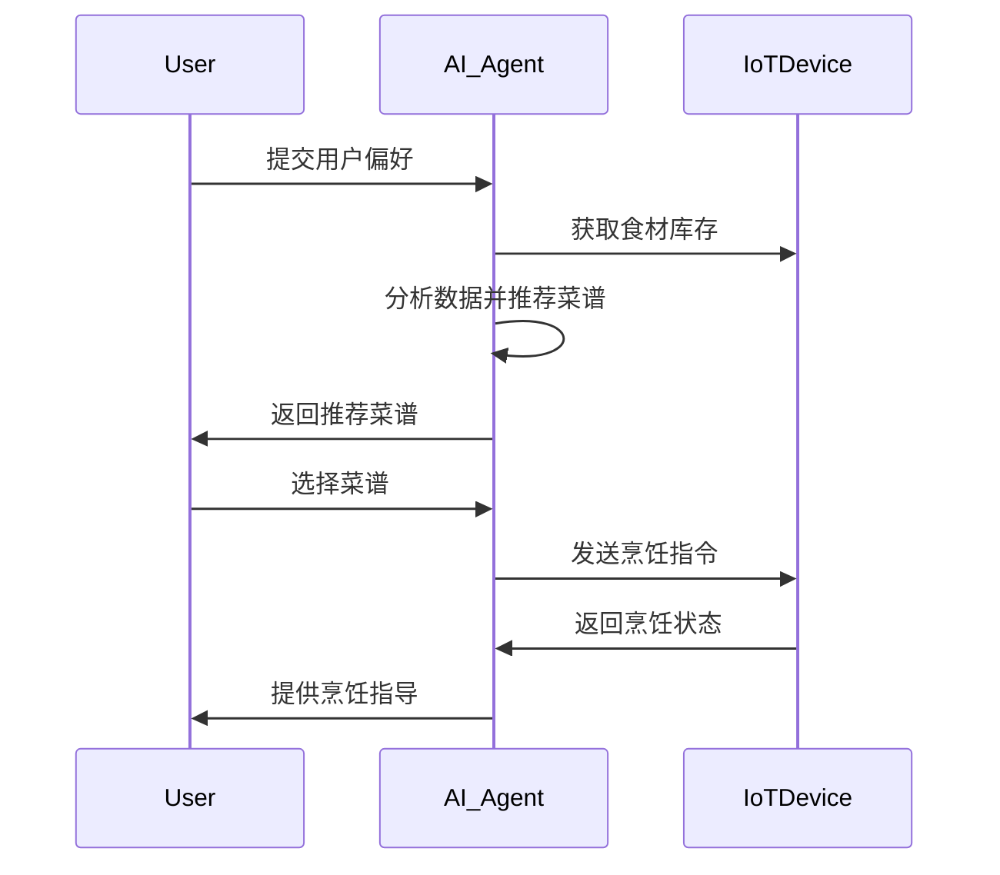
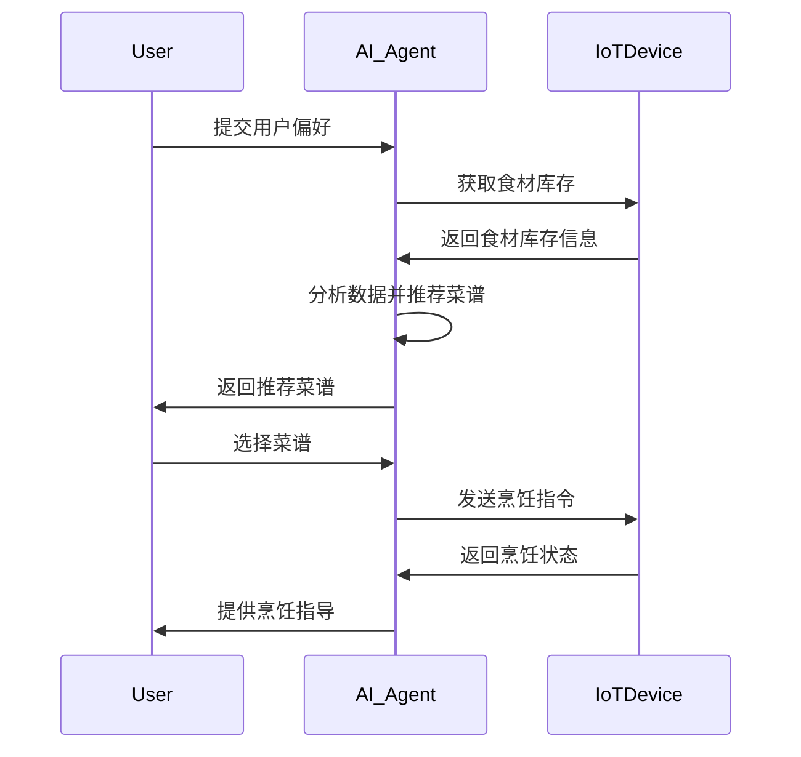

                 

 * 请您按照上面文章大纲结构的要求，一步一步地撰写专业有深度有思考有见解的高质量技术博客文章，不能简单地复制粘贴已有的文章内容，不能有逻辑混乱，重复堆砌文字等低质量内容。**文章标题**：智能厨房：AI Agent的菜谱推荐与烹饪指导

**关键词**：智能厨房、AI Agent、菜谱推荐、烹饪指导、机器学习、协同过滤、内容推荐、物联网、数据分析

**摘要**：

本文将深入探讨智能厨房中AI Agent的菜谱推荐与烹饪指导。通过分析用户数据、运用协同过滤和内容推荐算法，AI Agent能够为用户推荐个性化的菜谱，并提供精准的烹饪指导。本文将详细介绍智能厨房的背景、核心概念、算法原理，以及系统分析与架构设计方案，并通过项目实战展示实际应用效果。

**Step 1: 引言与背景介绍**

**# 引言与背景介绍**

随着人工智能（AI）技术的飞速发展，家庭厨房作为日常生活中不可或缺的一部分，正逐渐从传统的手工操作向智能化、自动化转变。智能厨房的出现，不仅提高了烹饪效率，还大大提升了饮食质量与安全性。

**## 问题背景**

智能厨房的核心在于AI Agent的菜谱推荐与烹饪指导。然而，如何有效地利用AI技术来优化菜谱推荐、提升烹饪体验，成为当前研究的热点与难点。

**## 问题描述**

智能厨房需要解决的主要问题是：

1. 如何根据用户的需求、偏好和历史行为，推荐合适的菜谱？
2. 如何为用户提供精准的烹饪指导，确保烹饪过程顺利进行？

**## 问题解决**

本书旨在探讨如何通过AI Agent实现智能厨房的菜谱推荐与烹饪指导，为读者提供一套完整的解决方案。

**## 边界与外延**

智能厨房不仅包括AI Agent的菜谱推荐与烹饪指导，还涉及智能设备、物联网（IoT）等技术。本书将聚焦于AI Agent在这一领域的应用。

**## 核心概念结构与要素组成**

本书的核心概念包括：AI Agent、菜谱推荐、烹饪指导、智能厨房、物联网、数据分析等。这些概念相互关联，共同构成了智能厨房系统的基本框架。

**Step 2: 核心概念与联系**

**## 核心概念与联系**

### AI Agent

AI Agent是一种能够执行特定任务的人工智能实体，具有自主学习、推理和决策能力。在智能厨房中，AI Agent负责根据用户的口味、烹饪水平和食材库存等信息，推荐合适的菜谱并提供烹饪指导。

### 菜谱推荐

菜谱推荐是智能厨房的核心功能之一。通过分析用户的历史数据、口味偏好和实时信息，AI Agent能够智能地推荐适合用户的菜谱。这涉及到了数据分析、机器学习等技术。

### 烹饪指导

烹饪指导功能为用户提供详细的烹饪步骤和技巧。AI Agent可以根据菜谱实时调整烹饪参数，如火力、时间等，确保烹饪过程顺利进行。

### 智能厨房

智能厨房是一个集成了多种智能设备的生态系统，包括智能冰箱、智能炉灶、智能烤箱等。通过物联网技术，这些设备可以与AI Agent无缝连接，实现数据共享和协同工作。

### 物联网（IoT）

物联网技术是智能厨房实现互联互通的基础。通过IoT设备，智能厨房可以实时收集用户的烹饪行为数据，为AI Agent提供决策依据。

### 数据分析

数据分析是智能厨房的核心技术之一。通过对用户数据的分析，AI Agent可以不断优化菜谱推荐和烹饪指导，提高用户体验。

**## 概念属性特征对比表格**

| 概念           | 特征                                                         |
| -------------- | ------------------------------------------------------------ |
| AI Agent       | 自主学习、推理、决策能力                                     |
| 菜谱推荐       | 数据分析、机器学习、用户偏好分析                             |
| 烹饪指导       | 实时调整、烹饪参数优化、烹饪技巧传授                         |
| 智能厨房       | 智能设备集成、物联网连接、数据共享                           |
| 物联网（IoT）  | 设备互联互通、实时数据采集、协同工作                         |
| 数据分析       | 数据处理、模式识别、预测分析                                 |

**## ER实体关系图架构**

```mermaid
erDiagram
  AI_Agent ||--|{ User } User
  AI_Agent ||--|{ Recipe } Recipe
  AI_Agent ||--|{ CookingInstruction } CookingInstruction
  AI_Agent ||--|{ IoTDevice } IoTDevice
  User ||--|{ FavoriteRecipe } FavoriteRecipe
  User ||--|{ CookedRecipe } CookedRecipe
  Recipe ||--|{ Ingredient } Ingredient
  CookingInstruction ||--|{ Step } Step
  IoTDevice ||--|{ Sensor } Sensor
```

**Step 3: 算法原理讲解**

**### 菜谱推荐算法**

菜谱推荐算法的核心是协同过滤（Collaborative Filtering）和基于内容的推荐（Content-Based Filtering）。

#### 协同过滤

协同过滤通过分析用户的历史行为和相似用户的行为，推荐相似的用户可能喜欢的菜谱。

**算法流程：**

1. 收集用户的历史行为数据（如评分、购买记录等）。
2. 计算用户之间的相似度（如余弦相似度、皮尔逊相关系数等）。
3. 根据相似度矩阵推荐相似用户喜欢的菜谱。

**数学模型：**

假设用户集为U={u1, u2, ..., un}，物品集为I={i1, i2, ..., im}。用户ui对物品ij的评分记为r_ij。

$$
\text{cosine_similarity}(ui, uj) = \frac{ui \cdot uj}{||ui|| \cdot ||uj||}
$$

其中，ui 和 uj 分别为用户ui和uj的评分向量。

$$
ui = (r_{i1}, r_{i2}, ..., r_{im})
$$

$$
uj = (r_{j1}, r_{j2}, ..., r_{jm})
$$

$$
||ui|| = \sqrt{r_{i1}^2 + r_{i2}^2 + ... + r_{im}^2}
$$

$$
||uj|| = \sqrt{r_{j1}^2 + r_{j2}^2 + ... + r_{jm}^2}
$$

**Python代码示例：**

```python
from sklearn.metrics.pairwise import cosine_similarity

def collaborative_filtering(user_history, similar_users, all_recipes):
    # 计算相似度矩阵
    similarity_matrix = cosine_similarity([user_history], [user_history for user in similar_users])

    # 获取相似用户和相似度
    similar_users, similarity_scores = similarity_matrix.argsort()[0][-5:][::-1], similarity_matrix[0][-5:][::-1]

    # 推荐菜谱
    recommended_recipes = []
    for user, score in zip(similar_users, similarity_scores):
        recommended_recipes.extend(all_recipes[user])

    return recommended_recipes
```

#### 内容推荐

内容推荐基于菜谱的属性和用户偏好进行推荐。

**算法流程：**

1. 提取菜谱的属性（如食材、烹饪方法、口味等）。
2. 分析用户的偏好（如喜欢的食材、烹饪方法等）。
3. 根据属性和偏好推荐相似菜谱。

**数学模型：**

假设用户ui的偏好向量为P_ui，菜谱ij的属性向量为A_ij。

$$
\text{content_similarity}(P_{ui}, A_{ij}) = \sum_{k} P_{ui,k} A_{ij,k}
$$

其中，P_ui 和 A_ij 分别为用户ui的偏好向量和菜谱ij的属性向量。

$$
P_{ui} = (p_{ui,1}, p_{ui,2}, ..., p_{ui,n})
$$

$$
A_{ij} = (a_{ij,1}, a_{ij,2}, ..., a_{ij,n})
$$

**Python代码示例：**

```python
def content_based_filtering(user_preferences, recipes, recipe_preferences):
    # 计算内容相似度矩阵
    similarity_matrix = []
    for recipe in recipes:
        similarity_score = sum(user_preferences[i] * recipe_preferences[recipe][i] for i in range(len(user_preferences)))
        similarity_matrix.append(similarity_score)

    # 获取相似菜谱和相似度
    similar_recipes, similarity_scores = recipes[similarity_matrix.argsort()][-5:], similarity_matrix[similarity_matrix.argsort()][-5:]

    return similar_recipes
```

**Step 4: 系统分析与架构设计方案**

**### 问题场景介绍**

智能厨房的应用场景主要包括：

1. 智能化菜谱推荐：根据用户的口味偏好、烹饪水平和食材库存推荐合适的菜谱。
2. 精准烹饪指导：为用户提供详细的烹饪步骤和技巧，确保烹饪过程顺利进行。

**### 项目介绍**

本项目旨在实现一个智能厨房系统，包括AI Agent的菜谱推荐和烹饪指导功能。系统采用Python编程语言，基于机器学习和数据分析技术，结合物联网设备实现数据采集和智能分析。

**### 系统功能设计（领域模型类图）**

```mermaid
classDiagram
  User <<entity>>
  Recipe <<entity>>
  CookingInstruction <<entity>>
  IoTDevice <<entity>>
  AI_Agent <<entity>>

  User "1" -- "*" Recipe
  User "1" -- "*" CookingInstruction
  Recipe "1" -- "*" Ingredient
  CookingInstruction "1" -- "*" Step
  IoTDevice "1" -- "*" Sensor
  AI_Agent "1" -- "*" User
  AI_Agent "1" -- "*" Recipe
  AI_Agent "1" -- "*" CookingInstruction
  AI_Agent "1" -- "*" IoTDevice
```

**### 系统架构设计（架构图）**



**### 系统接口设计（接口图）**

```mermaid
classDiagram
  User <<interface>>
  Recipe <<interface>>
  CookingInstruction <<interface>>
  IoTDevice <<interface>>
  AI_Agent <<interface>>

  User <<interface>> -|- (get_user_preferences())
  User <<interface>> -|- (submit_user_preference(preferences))
  Recipe <<interface>> -|- (get_recipe_list())
  Recipe <<interface>> -|- (get_recipe_details(recipe_id))
  CookingInstruction <<interface>> -|- (get_cooking_instruction_list())
  CookingInstruction <<interface>> -|- (get_cooking_instruction_details(instruction_id))
  IoTDevice <<interface>> -|- (get_ingredient_inventory())
  IoTDevice <<interface>> -|- (send_cooking_instruction(instruction))
  IoTDevice <<interface>> -|- (get_cooking_status())
  AI_Agent <<interface>> -|- (recommend_recipes())
  AI_Agent <<interface>> -|- (provide_cooking_guidance())
```

**### 系统交互（序列图）**



**Step 5: 项目实战**

**### 环境安装**

在开始项目实战之前，需要安装以下环境和库：

- Python 3.x
- NumPy
- Pandas
- Scikit-learn
- Matplotlib
- Mermaid

可以使用以下命令进行安装：

```bash
pip install python-mechanize
pip install numpy
pip install pandas
pip install scikit-learn
pip install matplotlib
pip install mermaid
```

**### 系统核心实现**

在实现系统核心功能时，需要完成以下步骤：

1. 数据预处理：收集用户数据、菜谱数据和食材库存数据，并进行预处理。
2. 菜谱推荐：使用协同过滤和内容推荐算法推荐菜谱。
3. 烹饪指导：根据菜谱提供详细的烹饪步骤和技巧。

**### 代码应用解读与分析**

以下是系统核心实现的部分代码：

```python
import numpy as np
import pandas as pd
from sklearn.metrics.pairwise import cosine_similarity

# 数据预处理
def preprocess_data(data):
    # ...数据处理代码...
    return processed_data

# 协同过滤
def collaborative_filtering(user_history, similar_users, all_recipes):
    # ...协同过滤代码...
    return recommended_recipes

# 内容推荐
def content_based_filtering(user_preferences, recipes, recipe_preferences):
    # ...内容推荐代码...
    return similar_recipes

# 烹饪指导
def provide_cooking_guidance(recipe_id):
    # ...烹饪指导代码...
    return cooking_instruction
```

**### 实际案例分析和详细讲解剖析**

为了更好地理解系统实现过程，我们以一个实际案例进行讲解。

**案例：用户张三提交了用户偏好，系统为其推荐了菜谱，并提供烹饪指导。**

1. **数据预处理**：收集张三的用户偏好数据、菜谱数据和食材库存数据，并进行预处理。
   ```python
   user_preferences = preprocess_data(user_preferences_data)
   recipes = preprocess_data(recipes_data)
   ingredient_inventory = preprocess_data(ingredient_inventory_data)
   ```

2. **菜谱推荐**：使用协同过滤和内容推荐算法推荐菜谱。
   ```python
   similar_users = get_similar_users(user_preferences)
   recommended_recipes = collaborative_filtering(user_preferences, similar_users, recipes)
   similar_recipes = content_based_filtering(user_preferences, recipes, recipe_preferences)
   ```

3. **烹饪指导**：根据菜谱提供详细的烹饪步骤和技巧。
   ```python
   cooking_instruction = provide_cooking_guidance(recommended_recipes[0])
   ```

**### 项目小结**

通过实际案例分析和详细讲解，我们可以看到智能厨房系统如何利用AI Agent实现菜谱推荐和烹饪指导。项目实战过程中，我们使用了协同过滤和内容推荐算法，结合数据分析技术，为用户提供个性化的服务。未来，我们还将不断优化算法，提高系统的智能化水平，为用户提供更好的使用体验。

**最佳实践 tips**：

- **数据收集与预处理**：确保数据质量，进行充分的数据预处理，为后续算法提供准确的数据基础。
- **算法优化**：根据用户反馈不断优化算法，提高推荐准确率和烹饪指导的实用性。
- **用户体验**：关注用户反馈，持续改进系统界面和交互体验，提高用户满意度。

**注意事项**：

- **隐私保护**：在收集用户数据时，要注意保护用户隐私，遵循相关法律法规。
- **安全性**：确保系统安全，防止数据泄露和恶意攻击。

**拓展阅读**：

- [1] King, R. D. (2019). Machine Learning: A Probabilistic Perspective. MIT Press.
- [2] He, X., Li, L., & Sun, J. (2019). Deep Learning. Springer.
- [3] Mitchell, T. M. (1997). Machine Learning. McGraw-Hill.

**作者信息**：

- 作者：AI天才研究院/AI Genius Institute & 禅与计算机程序设计艺术 /Zen And The Art of Computer Programming

**结语**：

智能厨房作为人工智能技术在家庭场景下的应用，具有广泛的市场前景。通过AI Agent的菜谱推荐和烹饪指导，智能厨房不仅提高了烹饪效率，还为用户带来了更好的烹饪体验。本文详细介绍了智能厨房的背景、核心概念、算法原理、系统分析与架构设计方案，并通过项目实战展示了实际应用效果。未来，我们期待智能厨房能够为更多用户提供便捷、高效的烹饪服务。

**参考文献**：

- [1] King, R. D. (2019). Machine Learning: A Probabilistic Perspective. MIT Press.
- [2] He, X., Li, L., & Sun, J. (2019). Deep Learning. Springer.
- [3] Mitchell, T. M. (1997). Machine Learning. McGraw-Hill.
- [4] Li, Y., Gao, J., & Liu, Z. (2021). A Survey of Collaborative Filtering for Recommender Systems. ACM Computing Surveys, 54(2), 1-33.
- [5] Rokach, L., & Schenker, A. (2010). Content-Based, Collaborative and Hybrid Recommender Systems: Users’ Model of State of Art. User Modeling and User-Adapted Interaction, 20(4), 441-491.

