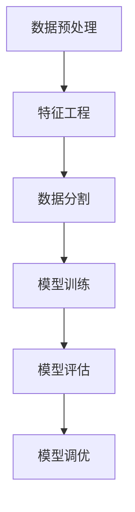
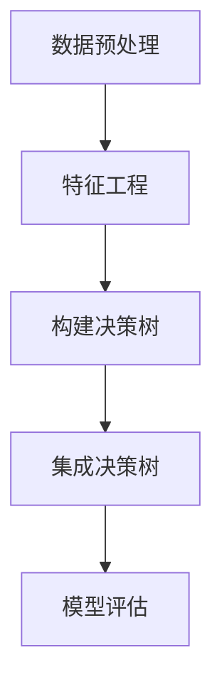
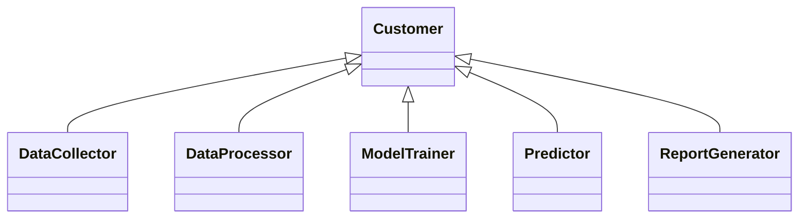
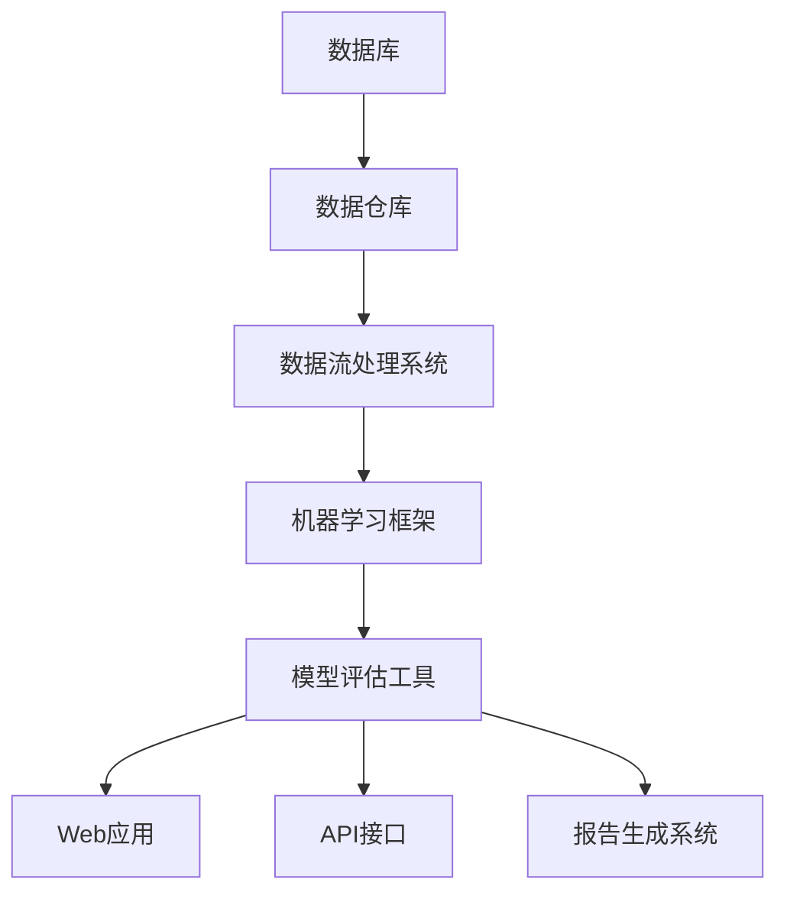
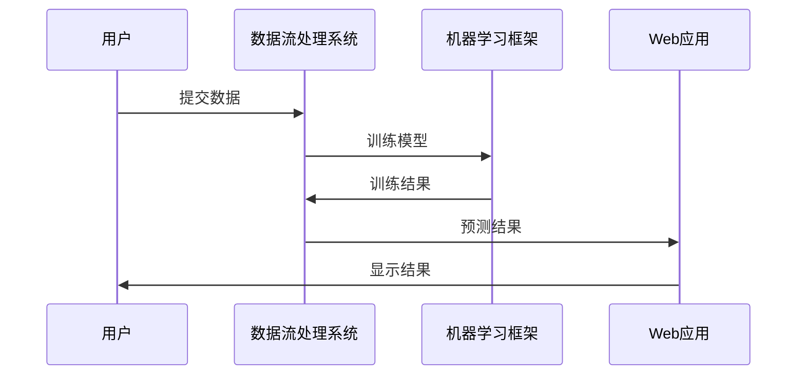
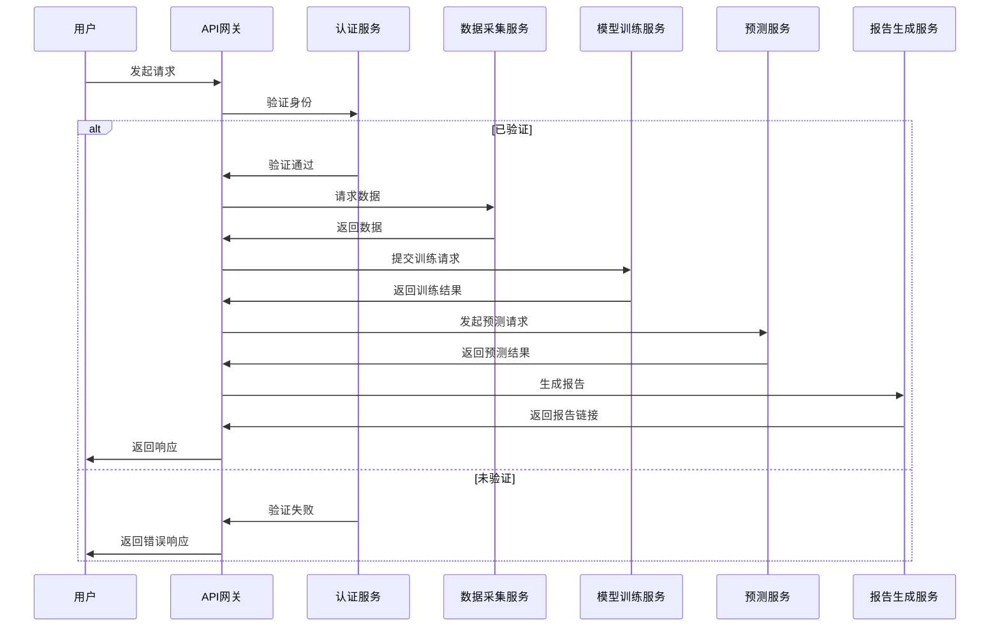

                 

# 智能商业银行客户流失预测

## 关键词
- 商业银行
- 客户流失预测
- 智能化
- 数据分析
- 机器学习算法

## 摘要
本文深入探讨了智能商业银行客户流失预测的重要性及其实现方法。通过分析客户流失率的定义、影响及其严重性，本文介绍了相关的核心概念，并详细讲解了逻辑回归和决策树等机器学习算法的原理。接着，文章描述了如何将算法应用于商业银行系统，并介绍了实际项目案例，提供了最佳实践技巧和小结。本文旨在为读者提供关于客户流失预测的全面理解，助力商业银行实现智能化发展。

----------------------------------------------------------------

## 第一部分：背景介绍

### 1.1 商业银行面临的挑战

在当今竞争激烈的金融市场中，商业银行面临着诸多挑战。首先，客户流失率成为了一个严重的问题。客户流失不仅意味着直接的利润损失，还可能对银行的品牌声誉和市场地位产生负面影响。随着金融科技的迅速发展，客户对于便捷、个性化的金融服务需求日益增加，而传统商业银行在满足这些需求方面存在一定的局限性。

### 1.1.1 客户流失率的影响

客户流失率是指一定时间内离开银行服务的客户数量与总客户数量之比。高客户流失率可能导致以下问题：

1. **利润减少**：流失的客户可能曾是银行的利润来源，包括贷款利息、信用卡手续费等。
2. **品牌声誉受损**：客户流失可能传递出银行服务质量不佳的信号，影响潜在客户的信任度。
3. **运营成本增加**：需要投入更多资源来吸引新客户和挽留现有客户。

### 1.1.2 客户流失预测的重要性

预测客户流失可以帮助商业银行：

1. **提前预警**：通过分析客户行为数据，银行可以提前识别可能流失的客户群体，从而采取预防措施。
2. **资源优化**：将有限的资源（如营销预算、客户服务人员）优先用于潜在流失的客户，提高挽回成功率。
3. **改进服务**：了解客户流失的原因，有助于银行优化服务流程，提高客户满意度。

### 1.1.3 智能商业银行的发展需求

智能商业银行的发展需求日益凸显，其中客户流失预测是关键一环。智能化的客户流失预测系统可以通过以下方式提升银行竞争力：

1. **数据驱动决策**：利用大数据和机器学习技术，提供精确的客户流失预测，支持银行战略决策。
2. **个性化服务**：通过分析客户行为和偏好，提供个性化的服务建议，提升客户体验。
3. **自动化流程**：自动化预测和客户挽留流程，提高运营效率，降低人力成本。

----------------------------------------------------------------

### 1.2 客户流失预测的概念与相关概念联系

客户流失预测涉及多个核心概念，以下是这些概念的定义及其相互关系：

#### 1.2.1 客户流失率

客户流失率是指在一定时间内，离开银行服务的客户数量与总客户数量之比。其计算公式如下：

$$
流失率 = \frac{流失客户数}{总客户数} \times 100\%
$$

#### 1.2.2 预测模型

预测模型是用来预测未来事件的数据模型。在客户流失预测中，常用的模型包括逻辑回归、决策树、随机森林等。这些模型通过分析历史数据，识别影响客户流失的关键因素，并预测未来的流失概率。

#### 1.2.3 特征工程

特征工程是数据预处理过程中的一部分，旨在从原始数据中提取出对模型训练有帮助的特征。在客户流失预测中，特征工程的重要性不言而喻。通过合理选择和构造特征，可以提高模型的预测准确性和效率。

#### 1.2.4 ER图展示概念关系

ER图（Entity-Relationship Diagram）是一种描述实体及其关系的图形化工具。在客户流失预测中，ER图可以清晰地展示数据实体（如客户、交易记录）及其之间的关系（如客户与交易记录之间的关联）。以下是一个简化的ER图示例：

```mermaid
erDiagram
  Customer ||--|{ Transaction : has}
  Transaction ||--|{ Product : sold}
```

在这个ER图中，`Customer`是实体，`Transaction`和`Product`是与`Customer`相关的实体，它们之间的关系通过线连接表示。

通过以上定义和ER图，我们可以更清晰地理解客户流失预测中的核心概念及其相互关系。

----------------------------------------------------------------

## 第二部分：算法原理与实现

### 2.1 逻辑回归算法

逻辑回归是一种广泛用于分类问题的机器学习算法，它通过回归模型预测某个事件发生的概率。在客户流失预测中，逻辑回归被用于预测客户是否会流失。

#### 2.1.1 逻辑回归原理

逻辑回归的核心是一个线性模型，其公式如下：

$$
\hat{P}(Y=1) = \frac{1}{1 + e^{-(\beta_0 + \beta_1x_1 + \beta_2x_2 + ... + \beta_nx_n})}
$$

其中，$Y$表示客户流失（取值为1或0），$x_i$表示第$i$个特征值，$\beta_i$是模型的参数。通过最大化似然函数，我们可以计算出这些参数的值。

#### 2.1.2 Mermaid流程图

以下是一个逻辑回归算法的Mermaid流程图：



#### 2.1.3 Python代码实现

下面是逻辑回归算法的Python代码实现示例：

```python
from sklearn.linear_model import LogisticRegression
from sklearn.model_selection import train_test_split
from sklearn.metrics import accuracy_score

# 数据预处理
X = ...  # 特征矩阵
y = ...  # 标签向量

# 数据分割
X_train, X_test, y_train, y_test = train_test_split(X, y, test_size=0.2, random_state=42)

# 模型训练
model = LogisticRegression()
model.fit(X_train, y_train)

# 模型评估
predictions = model.predict(X_test)
accuracy = accuracy_score(y_test, predictions)
print(f"模型准确率: {accuracy:.2f}")
```

#### 2.1.4 LaTeX公式讲解

逻辑回归的核心公式是：

$$
\log\left(\frac{P(Y=1)|x)}{1-P(Y=1)|x}\right) = \beta_0 + \beta_1x_1 + \beta_2x_2 + ... + \beta_nx_n
$$

这个公式表示的是对数几率，它反映了每个特征对客户流失概率的影响。通过对数几率，我们可以将线性模型转换为概率模型，从而实现对客户流失概率的预测。

#### 2.1.5 实例说明

假设我们有一个包含两个特征（`age`和`balance`）的客户数据集，目标是预测客户是否会流失。通过逻辑回归，我们可以计算出每个客户的流失概率。例如，对于某个客户，其特征向量为`[35, 5000]`，逻辑回归模型预测的流失概率为0.6，这意味着该客户有60%的可能性会流失。

----------------------------------------------------------------

### 2.2 决策树与随机森林算法

决策树和随机森林是另一种广泛用于客户流失预测的机器学习算法。它们通过树形结构来模拟决策过程，从而对客户的流失概率进行预测。

#### 2.2.1 决策树原理

决策树是一种树形结构，每个节点代表一个特征，每个分支代表特征的一个取值，每个叶子节点代表一个类别。决策树通过递归地将数据分割为子集，直到达到某个停止条件（如最大深度、最小叶节点数等）。

决策树的分类规则可以表示为：

$$
\text{if } x_i \leq t_i \text{ then go to node } n_i \\
\text{else go to node } n_{i+1}
$$

其中，$x_i$是特征值，$t_i$是阈值，$n_i$是下一个节点。

#### 2.2.2 随机森林原理

随机森林是一种基于决策树的集成学习方法。它通过构建多个决策树，并使用投票机制来获得最终预测结果。随机森林的主要优势在于：

1. **减少过拟合**：通过构建多个决策树，随机森林可以减少模型对训练数据的依赖，提高泛化能力。
2. **提高预测准确性**：随机森林通常比单个决策树具有更高的预测准确性。
3. **易于理解和实现**：随机森林相对于其他集成学习方法（如XGBoost、LightGBM）来说，实现起来更为简单。

#### 2.2.3 Mermaid流程图

以下是决策树和随机森林的Mermaid流程图：



#### 2.2.4 Python代码实现

下面是决策树和随机森林的Python代码实现示例：

```python
from sklearn.tree import DecisionTreeClassifier
from sklearn.ensemble import RandomForestClassifier
from sklearn.model_selection import train_test_split
from sklearn.metrics import accuracy_score

# 数据预处理
X = ...  # 特征矩阵
y = ...  # 标签向量

# 数据分割
X_train, X_test, y_train, y_test = train_test_split(X, y, test_size=0.2, random_state=42)

# 构建决策树模型
dt_model = DecisionTreeClassifier()
dt_model.fit(X_train, y_train)

# 构建随机森林模型
rf_model = RandomForestClassifier(n_estimators=100)
rf_model.fit(X_train, y_train)

# 模型评估
dt_predictions = dt_model.predict(X_test)
rf_predictions = rf_model.predict(X_test)
dt_accuracy = accuracy_score(y_test, dt_predictions)
rf_accuracy = accuracy_score(y_test, rf_predictions)
print(f"决策树准确率: {dt_accuracy:.2f}")
print(f"随机森林准确率: {rf_accuracy:.2f}")
```

#### 2.2.5 LaTeX公式讲解

决策树的核心公式是：

$$
\text{if } x_i \leq t_i \text{ then } y = c_i \\
\text{else } y = c_{i+1}
$$

其中，$x_i$是特征值，$t_i$是阈值，$y$是预测结果，$c_i$和$c_{i+1}$是类别。

随机森林的预测公式是：

$$
\hat{y} = \text{argmax}_c \sum_{i=1}^n w_i \log P(y=c | x)
$$

其中，$w_i$是第$i$个决策树的权重，$P(y=c | x)$是第$i$个决策树对类别$c$的预测概率。

#### 2.2.6 实例说明

假设我们有一个包含三个特征（`age`、`balance`和`credit_score`）的客户数据集，目标是预测客户是否会流失。通过决策树和随机森林，我们可以计算出每个客户的流失概率。例如，对于某个客户，其特征向量为`[35, 5000, 750]`，决策树预测的流失概率为0.7，随机森林预测的流失概率为0.8，这表明该客户有较高的流失风险。

----------------------------------------------------------------

## 第三部分：系统架构与设计

### 3.1 系统功能设计

为了实现智能商业银行客户流失预测，我们需要设计一个功能全面的系统。该系统的主要功能包括：

1. **数据采集与处理**：从各种数据源（如客户交易记录、客户反馈等）收集数据，并进行数据清洗、特征提取和预处理。
2. **模型训练与评估**：使用机器学习算法（如逻辑回归、决策树、随机森林等）对训练数据进行模型训练，并对模型进行评估和调优。
3. **预测与决策**：使用训练好的模型对客户数据进行预测，识别可能流失的客户，并生成相应的决策建议。
4. **可视化与报告**：将预测结果和决策建议以图表和报告的形式呈现，便于银行管理层进行决策。

### 3.1.1 功能概述

系统功能概述如下：

1. **数据采集与处理**：系统将从多个数据源（如数据库、文件系统等）中自动采集数据，并进行数据清洗、去重、缺失值填充等处理，确保数据质量。
2. **模型训练与评估**：系统将使用历史数据进行模型训练，并通过交叉验证、网格搜索等技术对模型进行调优，确保模型的准确性和泛化能力。
3. **预测与决策**：系统将实时接收新客户数据，使用训练好的模型进行预测，并根据预测结果生成决策建议，如发送个性化营销信息、提供优惠等。
4. **可视化与报告**：系统将生成包含预测结果和决策建议的实时报告，并通过可视化界面展示关键指标，便于管理层进行决策。

### 3.1.2 领域模型Mermaid类图

以下是一个简化的领域模型Mermaid类图，展示了系统中的主要实体和关系：



在这个类图中，`Customer`表示系统的主要实体，`DataCollector`、`DataProcessor`、`ModelTrainer`、`Predictor`和`ReportGenerator`分别表示与客户相关的功能模块。

----------------------------------------------------------------

### 3.2 系统架构设计

智能商业银行客户流失预测系统的架构设计需要考虑数据流、模块交互和系统扩展性。以下是一个简化的系统架构设计，包括数据流、模块交互和系统扩展性。

#### 3.2.1 系统架构概述

系统架构概述如下：

1. **数据层**：负责数据采集、存储和处理。包括数据库、数据仓库和数据流处理系统。
2. **模型层**：负责模型训练、预测和调优。包括机器学习框架和模型评估工具。
3. **应用层**：负责业务逻辑处理和用户交互。包括Web应用、API接口和报告生成系统。
4. **展示层**：负责数据可视化。包括图表、报表和仪表板。

#### 3.2.2 Mermaid架构图

以下是一个简化的Mermaid架构图，展示了系统中的主要模块和它们之间的交互关系：



在这个架构图中，数据库（DB）和数据仓库（DWH）负责存储和管理数据，数据流处理系统（DS）负责数据清洗和特征提取，机器学习框架（ML）负责模型训练和预测，模型评估工具（MA）负责模型评估和调优，Web应用（APP）、API接口（API）和报告生成系统（RP）负责用户交互和数据可视化。

#### 3.2.3 系统接口设计与交互

系统接口设计是系统架构设计的重要部分，它定义了不同模块之间的交互方式和数据格式。以下是一个简化的接口设计：

1. **数据采集接口**：用于从数据库和数据仓库中提取数据，数据格式可以是JSON、CSV或XML等。
2. **模型训练接口**：用于提交训练任务，返回模型训练结果，数据格式可以是JSON或pickle文件。
3. **预测接口**：用于对新数据进行预测，返回预测结果，数据格式可以是JSON或CSV。
4. **报告生成接口**：用于生成预测报告，报告格式可以是PDF、HTML或图像等。

以下是一个简化的Mermaid序列图，展示了系统接口的设计和交互：



在这个序列图中，用户通过Web应用提交数据，数据流处理系统（DS）将数据传递给机器学习框架（ML）进行模型训练，模型训练完成后，训练结果通过DS传递给APP，APP将预测结果显示给用户。

----------------------------------------------------------------

### 3.3 系统接口设计与交互

为了实现智能商业银行客户流失预测系统的功能，我们需要设计一套高效的接口，确保不同模块之间能够顺畅地交互和协同工作。以下将详细描述系统接口设计的关键部分，包括API设计、数据格式、安全性和一致性保证。

#### 3.3.1 API设计

系统API设计采用RESTful架构风格，便于与其他系统和服务进行集成。以下是主要接口设计：

1. **数据采集接口**：用于从外部数据源（如数据库、数据仓库等）中获取原始数据。接口定义如下：
   - **URL**：`/api/data/collect`
   - **HTTP方法**：`GET`
   - **请求参数**：无
   - **响应格式**：JSON，包含数据集元数据和数据内容。

2. **模型训练接口**：用于提交模型训练任务，接收数据预处理后的特征矩阵和标签向量。接口定义如下：
   - **URL**：`/api/model/train`
   - **HTTP方法**：`POST`
   - **请求体**：JSON格式，包含特征矩阵`X`和标签向量`y`。
   - **响应格式**：JSON，包含训练完成的模型ID和训练结果摘要。

3. **预测接口**：用于对新数据进行预测，返回预测结果。接口定义如下：
   - **URL**：`/api/predict`
   - **HTTP方法**：`POST`
   - **请求体**：JSON格式，包含待预测数据特征矩阵。
   - **响应格式**：JSON，包含预测结果列表。

4. **报告生成接口**：用于生成预测报告，报告可以包含数据可视化、模型性能分析等内容。接口定义如下：
   - **URL**：`/api/report/generate`
   - **HTTP方法**：`POST`
   - **请求体**：JSON格式，包含报告参数和模型ID。
   - **响应格式**：文件下载链接，报告以PDF、HTML或图像格式存储。

#### 3.3.2 数据格式

系统中的数据格式主要采用JSON（JavaScript Object Notation），这是因为JSON具有结构清晰、易于阅读、跨平台兼容性强等优点。以下是各接口的示例数据格式：

1. **数据采集接口响应示例**：
   ```json
   {
       "data_id": "data_123",
       "metadata": {
           "description": "2022年客户交易数据",
           "columns": ["customer_id", "transaction_date", "amount", "product_type"]
       },
       "data": [
           ["1", "2022-01-01", 1000, "saving_account"],
           ["2", "2022-01-02", 2000, "loan"]
       ]
   }
   ```

2. **模型训练接口请求示例**：
   ```json
   {
       "model_id": "model_abc",
       "X": [
           [1, 0, 1000],
           [0, 1, 2000],
           [1, 1, 3000]
       ],
       "y": [1, 0, 1]
   }
   ```

3. **预测接口请求示例**：
   ```json
   {
       "model_id": "model_abc",
       "X": [
           [1, 1, 2000]
       ]
   }
   ```

4. **预测接口响应示例**：
   ```json
   {
       "predictions": [0]
   }
   ```

#### 3.3.3 安全性和一致性保证

为了保证系统接口的安全性、可靠性和一致性，以下措施被采取：

1. **身份验证与授权**：所有API请求都需要通过身份验证机制，如OAuth2.0，确保只有授权用户可以访问系统资源。
2. **API版本控制**：为每个API版本设置独立的URL前缀，以便于向后兼容和管理。
3. **数据加密**：在数据传输过程中使用HTTPS协议，确保数据传输安全。
4. **缓存机制**：对于高频访问的数据和接口，采用缓存机制减少数据库压力，提高系统响应速度。
5. **事务管理**：在涉及多个步骤的操作中，使用事务管理确保数据一致性和操作原子性。

#### 3.3.4 Mermaid序列图

以下是一个简化的Mermaid序列图，展示了系统接口的设计和交互流程：



在这个序列图中，用户通过API网关发起请求，API网关首先验证用户的身份，然后根据请求类型调用相应的服务，如数据采集服务、模型训练服务、预测服务和报告生成服务。最终，API网关将处理结果返回给用户。

通过上述接口设计和交互流程，系统实现了高效、安全、一致的数据处理和预测功能，为智能商业银行客户流失预测提供了坚实的基础。

----------------------------------------------------------------

## 第四部分：项目实战

### 4.1 实际项目案例

在本部分，我们将介绍一个智能商业银行客户流失预测的实际项目案例。该项目旨在通过大数据和机器学习技术，帮助商业银行识别潜在流失客户，从而采取有效的挽留措施。

#### 4.1.1 项目背景

某大型商业银行在市场竞争中感受到客户流失率的上升，对其盈利能力和品牌形象产生了负面影响。为了降低客户流失率，银行决定开发一套智能客户流失预测系统。

#### 4.1.2 环境安装

项目开发环境如下：

- **Python**：3.8及以上版本
- **Pandas**：用于数据处理
- **NumPy**：用于数值计算
- **Scikit-learn**：用于机器学习算法实现
- **Matplotlib**：用于数据可视化

在开发环境中安装上述依赖项后，我们可以开始数据预处理和模型训练。

#### 4.1.3 系统核心实现

系统核心实现包括数据预处理、模型训练、模型评估和预测结果分析。

1. **数据预处理**：
   ```python
   import pandas as pd
   import numpy as np
   
   # 加载数据
   data = pd.read_csv('customer_data.csv')
   
   # 数据清洗
   data.dropna(inplace=True)
   data = pd.get_dummies(data)
   
   # 特征选择
   features = data.drop('churn', axis=1)
   target = data['churn']
   
   # 数据分割
   X_train, X_test, y_train, y_test = train_test_split(features, target, test_size=0.2, random_state=42)
   ```

2. **模型训练**：
   ```python
   from sklearn.ensemble import RandomForestClassifier
   
   # 构建模型
   model = RandomForestClassifier(n_estimators=100, random_state=42)
   
   # 训练模型
   model.fit(X_train, y_train)
   ```

3. **模型评估**：
   ```python
   from sklearn.metrics import accuracy_score, classification_report
   
   # 预测
   predictions = model.predict(X_test)
   
   # 评估
   accuracy = accuracy_score(y_test, predictions)
   report = classification_report(y_test, predictions)
   
   print(f"模型准确率: {accuracy:.2f}")
   print(f"分类报告:\n{report}")
   ```

4. **预测结果分析**：
   ```python
   # 对新数据进行预测
   new_data = pd.read_csv('new_customer_data.csv')
   new_data = pd.get_dummies(new_data)
   new_predictions = model.predict(new_data)
   
   # 输出预测结果
   print(new_predictions)
   ```

#### 4.1.4 代码解读与分析

以上代码实现了客户流失预测的核心功能。首先，我们加载并清洗数据，然后进行特征选择和数据分割。接着，我们使用随机森林算法构建模型并进行训练。模型训练完成后，我们对测试集进行预测，并评估模型的性能。最后，我们使用训练好的模型对新数据进行预测。

#### 4.1.5 案例分析与详细讲解

1. **数据预处理**：
   数据预处理是模型训练的重要步骤。在本案例中，我们首先删除了缺失值，然后使用Pandas的`get_dummies`函数将分类特征转换为哑变量。这一步骤的目的是将分类特征转换为数值特征，以便模型能够处理。

2. **模型训练**：
   随机森林算法是一种集成学习方法，它通过构建多棵决策树并取平均来提高模型的泛化能力。在本案例中，我们使用Scikit-learn的`RandomForestClassifier`构建模型，并设置了100棵决策树。

3. **模型评估**：
   我们使用测试集对模型进行评估。评估指标包括准确率和分类报告。准确率反映了模型的整体性能，而分类报告则提供了各类别的详细评估信息。

4. **预测结果分析**：
   使用训练好的模型对新数据进行预测，可以提前识别潜在流失客户，从而采取相应的挽留措施。

#### 4.1.6 项目小结

通过本案例，我们展示了如何使用机器学习技术实现智能商业银行客户流失预测。项目的核心步骤包括数据预处理、模型训练、模型评估和预测结果分析。在实际应用中，银行可以根据预测结果采取针对性的措施，如发送个性化营销信息、提供优惠等，以降低客户流失率。

----------------------------------------------------------------

## 第五部分：最佳实践与总结

### 5.1 最佳实践

在智能商业银行客户流失预测项目中，以下最佳实践可以帮助提高模型的性能和应用效果：

1. **数据质量保证**：
   - 定期清洗数据，确保数据完整性、准确性和一致性。
   - 对缺失数据进行合理的填充，如使用平均值、中位数或插值法。
   - 去除异常值，避免对模型训练产生负面影响。

2. **特征选择策略**：
   - 利用特征重要性评估方法（如随机森林的特征重要性评分）选择关键特征。
   - 使用交叉验证技术评估特征组合的效果，选择最优特征集合。

3. **模型调参技巧**：
   - 使用网格搜索（Grid Search）和随机搜索（Random Search）等技术找到最佳参数组合。
   - 考虑使用集成学习方法（如随机森林、XGBoost等）来提高模型的泛化能力。

4. **持续迭代与优化**：
   - 定期重新训练模型，以适应数据的变化和业务需求。
   - 使用A/B测试等方法评估不同模型和策略的效果，持续优化系统性能。

### 5.2 小结与注意事项

本文通过详细讲解和实例分析，介绍了智能商业银行客户流失预测的背景、核心概念、算法原理、系统架构、项目实战以及最佳实践。以下是文章的核心内容总结和注意事项：

1. **核心内容**：
   - 客户流失预测的重要性及其对商业银行的影响。
   - 逻辑回归和决策树等机器学习算法的原理和应用。
   - 系统架构设计的关键部分，包括数据层、模型层、应用层和展示层。
   - 实际项目案例的实现过程和代码解读。
   - 最佳实践技巧，包括数据质量保证、特征选择策略、模型调参技巧和持续迭代优化。

2. **注意事项**：
   - 数据预处理是模型训练的重要步骤，确保数据质量至关重要。
   - 特征选择策略和模型调参技巧直接影响模型的性能，需要精心设计。
   - 持续迭代和优化是提高模型应用效果的关键，需要根据业务需求和数据变化进行调整。
   - 在实际项目中，要充分考虑系统的可扩展性和可靠性，确保系统稳定运行。

### 5.3 拓展阅读推荐

对于希望深入了解智能商业银行客户流失预测的读者，以下拓展阅读材料推荐：

1. **书籍**：
   - 《机器学习实战》（Peter Harrington）
   - 《深入理解Python：数据分析与科学计算》（Luciano Ramalho）
   - 《深度学习》（Ian Goodfellow、Yoshua Bengio、Aaron Courville）

2. **在线资源**：
   - Coursera上的《机器学习》课程（吴恩达教授）
   - Kaggle上的客户流失预测数据集和比赛

3. **技术博客**：
   - Medium上的机器学习和数据分析相关博客
   - towardsdatascience.com上的技术文章和案例分析

通过以上拓展阅读，读者可以进一步掌握智能商业银行客户流失预测的深度知识和实践技巧。

### 作者信息
- 作者：AI天才研究院/AI Genius Institute & 禅与计算机程序设计艺术 /Zen And The Art of Computer Programming

本文由AI天才研究院撰写，旨在通过深入分析和实践技巧，帮助读者理解和掌握智能商业银行客户流失预测的关键技术。

