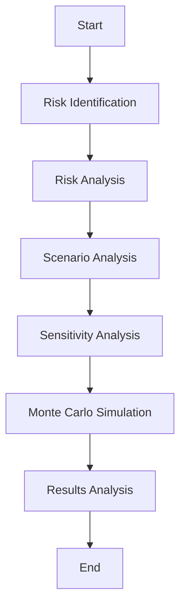
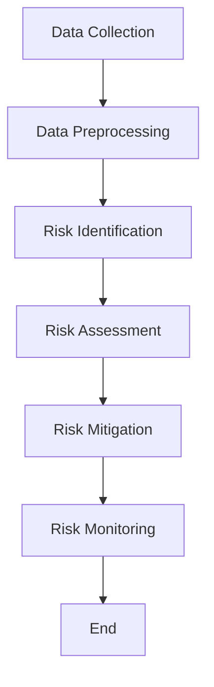

                 


## Introduction to the Background of Smart Commercial Banks and Risk Management

### Core Concepts

Smart commercial banks are at the forefront of financial innovation, leveraging advanced technologies to enhance their operations, customer service, and risk management. These banks utilize data analytics, machine learning, blockchain, and artificial intelligence to provide personalized financial services, real-time risk assessments, and streamlined transactions. The importance of risk management in the context of smart commercial banks cannot be overstated. As these institutions operate within an increasingly complex and volatile financial ecosystem, effective risk management is crucial for maintaining stability, ensuring compliance, and protecting assets.

Risk management in commercial banking encompasses a wide range of activities, including identifying, assessing, and mitigating various types of risks. These risks can be categorized into financial, operational, compliance, and strategic risks. Financial risks include credit risk, market risk, and liquidity risk. Operational risks relate to internal processes, systems, and human errors. Compliance risks involve adherence to legal and regulatory requirements, while strategic risks encompass potential disruptions in the business environment.

### The Role of Risk Management in Smart Commercial Banking Systems

In smart commercial banking systems, risk management plays a pivotal role in ensuring the bank's sustainability and competitive edge. Here are some key roles and functions of risk management:

1. **Enhancing Operational Efficiency**: Smart banking systems leverage real-time data analytics to automate routine tasks, reduce manual interventions, and streamline operations. This increases efficiency and reduces the risk of human error.
2. **Improving Decision-Making**: By employing advanced analytics and machine learning algorithms, smart risk management systems provide banks with actionable insights, enabling more informed and timely decision-making.
3. **Enhancing Customer Experience**: Personalized financial products and services based on customer data enhance customer satisfaction and loyalty. Smart risk management systems facilitate the customization of offerings to meet individual customer needs.
4. **Ensuring Regulatory Compliance**: Smart commercial banks must adhere to a complex web of regulations. Risk management systems help ensure compliance by monitoring regulatory changes, identifying potential compliance issues, and automating compliance checks.
5. **Protecting Against Financial Losses**: Through real-time monitoring and predictive analytics, risk management systems help identify and mitigate potential risks before they impact the bank's financial health.
6. **Strengthening Business Continuity**: Smart risk management systems enable banks to develop robust contingency plans and response strategies to mitigate the impact of disruptions, ensuring business continuity.

### The Evolution of Risk Management

The evolution of risk management has been closely tied to technological advancements. Traditional risk management practices relied heavily on manual processes and historical data. However, with the advent of advanced technologies, risk management has become more sophisticated and data-driven. Here's a brief overview of the key milestones in the evolution of risk management:

1. **Early Risk Management**: In the early days of banking, risk management was primarily focused on credit risk. Lending decisions were based on the borrower's credit history and collateral.
2. **Quantitative Methods**: The introduction of statistical methods and mathematical models in the mid-20th century enabled banks to quantify and manage risks more effectively.
3. **Risk Management Information Systems**: In the 1990s, the development of risk management information systems (RMIS) automated the collection, analysis, and reporting of risk data.
4. **Smart Risk Management**: The rise of big data, artificial intelligence, and machine learning has revolutionized risk management. Smart risk management systems leverage real-time data analytics and predictive modeling to identify and mitigate risks in real-time.

### The Impact of Technological Advancements

Technological advancements have had a profound impact on risk management in smart commercial banks. Here are some key areas where technology has transformed risk management:

1. **Data Analytics**: The ability to analyze large volumes of data in real-time enables banks to identify patterns and trends that were previously undetectable. This helps in making more accurate risk assessments and predictive models.
2. **Machine Learning**: Machine learning algorithms can identify complex risk patterns and make predictions based on historical data. This enables banks to anticipate and mitigate potential risks more effectively.
3. **Blockchain**: Blockchain technology provides a transparent and secure ledger for financial transactions. This helps in ensuring the integrity of financial data and reducing the risk of fraud.
4. **Artificial Intelligence**: AI-powered chatbots and virtual assistants can automate routine risk management tasks, such as monitoring transactions and identifying potential risks. This frees up human resources for more complex tasks.
5. **Cloud Computing**: Cloud-based risk management systems provide scalability, flexibility, and cost-efficiency. They enable banks to access real-time data and analytical tools from anywhere, at any time.

### Conclusion

The integration of advanced technologies into risk management systems has transformed the landscape of smart commercial banking. By leveraging data analytics, machine learning, blockchain, and artificial intelligence, smart commercial banks can enhance their risk management capabilities and ensure long-term stability and success. In the next section, we will delve deeper into the fundamental concepts and frameworks of risk management systems, exploring the key principles, methodologies, and tools that underpin effective risk management practices in the banking sector.

## Fundamental Concepts and Framework of Risk Management Systems

### Core Concepts

Risk management is a systematic process that involves identifying, assessing, and mitigating risks to ensure the stability and success of an organization. In the context of smart commercial banks, risk management systems play a crucial role in safeguarding the institution's assets, maintaining regulatory compliance, and fostering sustainable growth. Let's delve into the core concepts and terminology associated with risk management systems.

1. **Risk Identification**: The first step in risk management is identifying potential risks. This involves recognizing various types of risks that could impact the bank, such as financial, operational, compliance, and strategic risks.

2. **Risk Assessment**: Once risks are identified, they need to be assessed in terms of their likelihood and potential impact. This helps prioritize risks and allocate resources effectively for mitigation.

3. **Risk Mitigation**: After assessing risks, banks need to develop strategies to mitigate them. This can involve implementing controls, transferring risks through insurance, or avoiding certain activities altogether.

4. **Risk Monitoring**: Continuous monitoring is essential to ensure that risk mitigation measures are effective. This involves tracking changes in the risk environment and adjusting strategies as needed.

5. **Risk Reporting**: Regular reporting is necessary to communicate the status of risks to stakeholders. This includes summarizing risk assessments, mitigation strategies, and any significant changes in the risk landscape.

### Types of Risks in Commercial Banking

1. **Financial Risks**:
   - **Credit Risk**: The risk that borrowers will default on their loans.
   - **Market Risk**: The risk of losses due to fluctuations in market prices, such as interest rates, stock prices, and currency exchange rates.
   - **Liquidity Risk**: The risk that the bank may not have enough liquid assets to meet its obligations.

2. **Operational Risks**:
   - **Systemic Risk**: The risk of disruption to critical banking systems, such as core processing systems or payment networks.
   - **Human Error**: The risk associated with errors made by employees, such as miskeying data or failing to follow procedures.
   - **External Events**: Risks arising from external factors, such as cyber-attacks or natural disasters.

3. **Compliance Risks**:
   - **Regulatory Non-Compliance**: The risk of failing to meet legal and regulatory requirements, which can result in fines, penalties, or legal actions.
   - **Ethical Non-Compliance**: The risk of engaging in unethical practices, which can damage the bank's reputation and lead to loss of customer trust.

4. **Strategic Risks**:
   - **Market Disruption**: The risk of changes in market conditions that could impact the bank's competitive position.
   - **Innovation Risk**: The risk of failing to keep up with technological advancements and market trends.
   - **Reputation Risk**: The risk of damage to the bank's reputation due to negative events or actions.

### Risk Management Frameworks and Methodologies

1. **Enterprise Risk Management (ERM)**: ERM is a holistic approach that integrates risk management into the overall strategic objectives of the organization. It involves identifying, assessing, and managing risks across the entire enterprise to achieve organizational goals.

2. **COSO ERM Framework**: The Committee of Sponsoring Organizations of the Treadway Commission (COSO) developed a widely adopted ERM framework that provides a systematic approach to managing risks. It includes components such as internal control, risk assessment, and risk response.

3. **Basel Accords**: The Basel Accords are a series of international banking agreements that set standards for capital adequacy, risk management, and market discipline. They are designed to ensure the stability of the banking sector and mitigate systemic risks.

4. **Value-at-Risk (VaR)**: VaR is a statistical measure of the maximum potential loss of an investment over a specified period of time, at a given level of confidence. It is used to assess market risk and manage exposure to financial instruments.

### Concept Comparison Table

| Concept | Definition | Key Attributes | Example |
| --- | --- | --- | --- |
| Enterprise Risk Management (ERM) | A holistic approach to managing risks | Integrates risk management into strategic objectives | Aligns risk management with business goals |
| COSO ERM Framework | A comprehensive ERM framework | Provides a structured approach to risk management | Outlines processes for risk identification, assessment, and mitigation |
| Basel Accords | International banking agreements | Sets standards for capital adequacy and risk management | Ensures financial stability and mitigates systemic risks |
| Value-at-Risk (VaR) | A measure of potential loss | Quantifies market risk | Calculates the maximum loss at a given confidence level |

### Entity Relationship Diagram (ERD)

To illustrate the entities involved in risk management systems, we can create a Mermaid ERD. Here's an example:

```mermaid
erDiagram
B_RiskManagementSystem ||--|{ B_Enterprise | Enterprise }
B_Enterprise ||--|{ B_CreditRisk | Credit }
B_Enterprise ||--|{ B_MarketRisk | Market }
B_Enterprise ||--|{ B_LiquidityRisk | Liquidity }
B_Enterprise ||--|{ B_OperationalRisk | Operational }
B_Enterprise ||--|{ B_ComplianceRisk | Compliance }
B_Enterprise ||--|{ B_StrategicRisk | Strategic }
B_Enterprise ||--|{ B_RiskAssessment | Assessment }
B_Enterprise ||--|{ B_RiskMitigation | Mitigation }
B_Enterprise ||--|{ B_RiskMonitoring | Monitoring }
B_Enterprise ||--|{ B_RiskReporting | Reporting }
```

This ERD shows the relationship between the enterprise and various types of risks, as well as the key components of risk management processes.

In the next section, we will explore risk assessment and analysis techniques, including qualitative and quantitative methods, and their applications in smart commercial banking risk management systems.

## Risk Assessment and Analysis Techniques

### Risk Assessment Methods

Risk assessment is a critical step in the risk management process, involving the identification, evaluation, and prioritization of risks to determine their significance and potential impact. In the context of smart commercial banks, effective risk assessment techniques are essential for ensuring the bank's resilience and stability. There are two main types of risk assessment methods: qualitative and quantitative.

#### Qualitative Risk Assessment

Qualitative risk assessment involves assessing risks based on expert judgment, experience, and subjective evaluations. This method is useful for understanding the nature and severity of risks that may not have easily quantifiable impacts. Key components of qualitative risk assessment include:

- **Risk Identification**: Identifying potential risks through brainstorming sessions, expert opinions, and historical data analysis.
- **Risk Analysis**: Evaluating the likelihood and impact of each identified risk using techniques such as risk matrices.
- **Risk Prioritization**: Prioritizing risks based on their severity and the level of impact they could have on the bank's operations.

#### Quantitative Risk Assessment

Quantitative risk assessment involves measuring risks in numerical terms, using data analysis and statistical techniques. This method provides a more precise and objective measure of risk, allowing banks to make informed decisions based on data-driven insights. Key components of quantitative risk assessment include:

- **Risk Modeling**: Developing mathematical models to represent the relationships between different risk factors and their potential impacts.
- **Data Collection**: Collecting relevant data on historical events, market trends, and other variables that influence risk.
- **Simulation and Prediction**: Using statistical methods and computer models to simulate potential future scenarios and predict the likelihood and impact of risks.

### Risk Analysis Techniques

Once risks are assessed, the next step is to analyze them to understand their underlying causes and potential impacts. Several techniques can be used for risk analysis, including scenario analysis, sensitivity analysis, and Monte Carlo simulation. Each technique provides valuable insights into different aspects of risk.

#### Scenario Analysis

Scenario analysis involves creating and analyzing different hypothetical scenarios to understand how risks could play out in various situations. This method helps banks prepare for potential disruptions and plan appropriate mitigation strategies. Key steps in scenario analysis include:

- **Scenario Development**: Creating scenarios based on potential risk events, such as market crashes, cyber-attacks, or regulatory changes.
- **Scenario Evaluation**: Assessing the impact of each scenario on the bank's operations, financial health, and reputation.
- **Scenario Response Planning**: Developing strategies to respond to each scenario, including contingency plans and risk mitigation measures.

#### Sensitivity Analysis

Sensitivity analysis involves measuring the impact of changes in input variables on the output of a risk model. This technique helps banks understand how sensitive their risk measures are to changes in key factors. Key steps in sensitivity analysis include:

- **Identifying Input Variables**: Identifying the key variables that affect the risk model's output.
- **Change Scenarios**: Creating different scenarios by varying the input variables within acceptable ranges.
- **Impact Evaluation**: Evaluating the impact of each change scenario on the risk model's output and identifying critical variables.

#### Monte Carlo Simulation

Monte Carlo simulation is a statistical method that uses random sampling to model the behavior of complex systems and predict the likelihood of various outcomes. This technique is particularly useful for assessing the impact of uncertain variables on risk. Key steps in Monte Carlo simulation include:

- **Model Development**: Developing a mathematical model that represents the risk scenario and its underlying variables.
- **Random Sampling**: Generating random samples of the input variables based on their probability distributions.
- **Simulation Runs**: Performing multiple simulation runs to generate a range of possible outcomes and their probabilities.
- **Results Analysis**: Analyzing the results to understand the distribution of potential outcomes and identify critical risk factors.

### Algorithm Explanation

To illustrate the risk analysis techniques, we can use Mermaid to create a flowchart and Python code to perform the analysis. Here's an example of a risk analysis process using Mermaid:



And the corresponding Python code for Monte Carlo simulation:

```python
import numpy as np

# Define parameters for risk model
mean = 0.05
std_dev = 0.1
num_samples = 1000

# Generate random samples
samples = np.random.normal(mean, std_dev, num_samples)

# Calculate the distribution of outcomes
outcomes = np.cumsum(samples)

# Plot the distribution
import matplotlib.pyplot as plt
plt.hist(outcomes, bins=30)
plt.xlabel('Outcome')
plt.ylabel('Frequency')
plt.title('Monte Carlo Simulation Results')
plt.show()
```

This code generates random samples based on a normal distribution and calculates the cumulative sum to simulate the risk scenario. The resulting histogram shows the distribution of potential outcomes.

In conclusion, effective risk assessment and analysis techniques are essential for smart commercial banks to identify, evaluate, and prioritize risks. By using both qualitative and quantitative methods, banks can develop comprehensive risk management strategies and prepare for potential disruptions. In the next section, we will explore the development and implementation of a smart risk management system, including system design, algorithm explanation, and application of risk analysis techniques.

## Development and Implementation of a Smart Risk Management System

### System Design

The development of a smart risk management system requires a systematic approach that ensures the system meets the bank's specific needs and regulatory requirements. Here, we will outline the key steps in designing a robust risk management system, including requirements gathering, system architecture design, and database design.

#### Requirements Gathering

The first step in designing a smart risk management system is to gather comprehensive requirements from stakeholders, including bank management, regulatory bodies, and end-users. This involves understanding the bank's risk management objectives, the types of risks it faces, and the specific functionalities required from the system. Key requirements may include:

- **Risk Identification and Assessment**: The system should be able to identify and assess various types of risks, such as financial, operational, compliance, and strategic risks.
- **Real-Time Monitoring**: The system should provide real-time monitoring of risks and generate alerts when potential issues are detected.
- **Risk Reporting**: The system should generate detailed reports on risk assessments, mitigation strategies, and monitoring activities.
- **Compliance Management**: The system should ensure compliance with regulatory requirements and provide documentation for audit purposes.
- **Data Integration**: The system should integrate with the bank's existing IT infrastructure, including core banking systems, transaction processing systems, and external data sources.

#### System Architecture Design

The system architecture design defines the overall structure and components of the risk management system, ensuring scalability, flexibility, and high availability. A typical smart risk management system architecture may include the following components:

- **Data Layer**: This layer includes databases and data warehouses that store historical and real-time data related to risks, transactions, and regulatory information.
- **Application Layer**: This layer includes the core applications that perform risk identification, assessment, monitoring, and reporting. It may also include modules for compliance management and data integration.
- **Presentation Layer**: This layer includes the user interfaces that allow stakeholders to access and interact with the system, view reports, and perform risk management activities.

#### Database Design

The database design is critical for ensuring data integrity, accessibility, and performance. A well-designed database should store all relevant data in a structured and efficient manner. Key considerations in database design include:

- **Data Modeling**: Use Entity-Relationship (ER) modeling to define the structure of the database, including entities, attributes, and relationships.
- **Normalization**: Apply normalization techniques to minimize data redundancy and ensure data consistency.
- **Security**: Implement security measures to protect sensitive data from unauthorized access and ensure compliance with regulatory requirements.
- **Performance**: Design the database to handle high volumes of data and support real-time queries and transactions.

### Algorithm Explanation

The core of a smart risk management system is its risk analysis algorithms, which are designed to identify, assess, and mitigate risks. Here, we will explain a typical risk analysis algorithm and its implementation using Mermaid diagrams and Python code.

#### Risk Analysis Algorithm

The risk analysis algorithm can be broken down into several steps:

1. **Data Collection**: Gather relevant data from internal and external sources, such as transaction data, market data, and regulatory information.
2. **Data Preprocessing**: Clean and preprocess the data to ensure quality and consistency. This may include data normalization, missing value imputation, and outlier detection.
3. **Risk Identification**: Identify potential risks using pattern recognition techniques and domain-specific rules.
4. **Risk Assessment**: Assess the severity and likelihood of each identified risk using quantitative and qualitative methods.
5. **Risk Mitigation**: Develop and implement mitigation strategies based on the risk assessment results.
6. **Risk Monitoring**: Continuously monitor the identified risks and update the risk analysis as new data becomes available.

#### Mermaid Diagram

Here's a Mermaid diagram illustrating the risk analysis process:



#### Python Code

Below is a Python code example that demonstrates the risk analysis algorithm using a simple scenario:

```python
import pandas as pd
import numpy as np

# Example data
data = pd.DataFrame({
    'Transaction Amount': [1000, 2000, 3000, 4000, 5000],
    'Transaction Time': ['09:00', '12:00', '15:00', '18:00', '21:00'],
    'Transaction Type': ['Debit', 'Credit', 'Debit', 'Credit', 'Debit']
})

# Data preprocessing
data['Transaction Time'] = pd.to_datetime(data['Transaction Time'])
data['Hour'] = data['Transaction Time'].dt.hour

# Risk identification
# Rule: Transactions made between 18:00 and 21:00 have a higher risk of fraud
high_risk_hours = [18, 19, 20, 21]
data['Risk Level'] = np.where(data['Hour'].isin(high_risk_hours), 'High', 'Low')

# Risk assessment
# Calculate the average transaction amount for high-risk and low-risk transactions
high_risk_data = data[data['Risk Level'] == 'High']
low_risk_data = data[data['Risk Level'] == 'Low']
avg_high_risk_amount = high_risk_data['Transaction Amount'].mean()
avg_low_risk_amount = low_risk_data['Transaction Amount'].mean()

# Risk mitigation
# Implement controls to monitor transactions during high-risk hours
print(f"Average high-risk transaction amount: {avg_high_risk_amount}")
print(f"Average low-risk transaction amount: {avg_low_risk_amount}")

# Risk monitoring
# Continuously monitor transactions for potential fraud
print("Monitoring transactions for potential fraud...")
```

This code demonstrates a basic risk analysis algorithm that identifies high-risk transactions based on the time of day and assesses the average transaction amounts for high-risk and low-risk periods. It then implements controls to monitor transactions during high-risk hours.

In conclusion, the development and implementation of a smart risk management system involve careful system design, algorithm development, and real-time data analysis. By leveraging advanced technologies and analytics, banks can enhance their risk management capabilities and ensure the stability and security of their operations. In the next section, we will explore the application of these techniques in real-world scenarios and provide practical insights into implementing a smart risk management system.

## Project Implementation: Building a Smart Risk Management System

### Environment Setup

To implement a smart risk management system, we first need to set up the necessary development environment. This includes installing Python and the required libraries for data analysis, machine learning, and visualization. Below are the steps to set up the development environment:

1. **Install Python**: Download and install Python 3.x from the official website (<https://www.python.org/downloads/>).
2. **Install Jupyter Notebook**: Python comes with Jupyter Notebook, an interactive development environment. Ensure it is installed by running `jupyter notebook` in the terminal.
3. **Install Required Libraries**: Install the necessary libraries using `pip`. Some essential libraries include:
   - `pandas` for data manipulation
   - `numpy` for numerical computations
   - `matplotlib` and `seaborn` for data visualization
   - `scikit-learn` for machine learning algorithms
   - `tensorflow` for deep learning

```bash
pip install pandas numpy matplotlib seaborn scikit-learn tensorflow
```

### System Core Implementation

The core implementation of the smart risk management system involves several key components: data preprocessing, risk identification, risk assessment, and risk monitoring. Below, we will outline these components and provide sample code for each.

#### Data Preprocessing

Data preprocessing is crucial for ensuring the quality and consistency of the data used for risk analysis. This involves cleaning the data, handling missing values, and transforming the data into a suitable format for analysis.

```python
import pandas as pd
from sklearn.preprocessing import StandardScaler

# Load sample data
data = pd.read_csv('transaction_data.csv')

# Data cleaning
data.dropna(inplace=True)

# Data transformation
data['Transaction Time'] = pd.to_datetime(data['Transaction Time'])
data['Hour'] = data['Transaction Time'].dt.hour

# Feature scaling
scaler = StandardScaler()
data[['Transaction Amount', 'Hour']] = scaler.fit_transform(data[['Transaction Amount', 'Hour']])
```

#### Risk Identification

Risk identification involves using domain-specific rules and machine learning techniques to identify potential risks. For example, we can use a simple rule-based approach to identify high-risk transactions based on the time of day.

```python
high_risk_hours = [18, 19, 20, 21]
data['Risk Level'] = np.where(data['Hour'].isin(high_risk_hours), 'High', 'Low')
```

#### Risk Assessment

Risk assessment involves quantifying the severity and likelihood of identified risks. This can be done using various statistical and machine learning techniques. Here, we'll use a basic approach to calculate the average transaction amount for high-risk and low-risk transactions.

```python
high_risk_data = data[data['Risk Level'] == 'High']
low_risk_data = data[data['Risk Level'] == 'Low']
avg_high_risk_amount = high_risk_data['Transaction Amount'].mean()
avg_low_risk_amount = low_risk_data['Transaction Amount'].mean()

print(f"Average high-risk transaction amount: {avg_high_risk_amount}")
print(f"Average low-risk transaction amount: {avg_low_risk_amount}")
```

#### Risk Monitoring

Risk monitoring involves continuously analyzing new data and updating the risk assessment. This can be achieved by periodically updating the model and recalculating risk metrics.

```python
# Load new transaction data
new_data = pd.read_csv('new_transaction_data.csv')

# Preprocess new data
new_data['Transaction Time'] = pd.to_datetime(new_data['Transaction Time'])
new_data['Hour'] = new_data['Transaction Time'].dt.hour
new_data[['Transaction Amount', 'Hour']] = scaler.transform(new_data[['Transaction Amount', 'Hour']])

# Update risk levels
new_data['Risk Level'] = np.where(new_data['Hour'].isin(high_risk_hours), 'High', 'Low')

# Recalculate average transaction amounts
high_risk_data = pd.concat([high_risk_data, new_data[new_data['Risk Level'] == 'High']])
low_risk_data = pd.concat([low_risk_data, new_data[new_data['Risk Level'] == 'Low']])
avg_high_risk_amount = high_risk_data['Transaction Amount'].mean()
avg_low_risk_amount = low_risk_data['Transaction Amount'].mean()

print(f"Updated average high-risk transaction amount: {avg_high_risk_amount}")
print(f"Updated average low-risk transaction amount: {avg_low_risk_amount}")
```

### Code Application and Analysis

The sample code provided demonstrates the core components of a smart risk management system: data preprocessing, risk identification, risk assessment, and risk monitoring. By applying these techniques to transaction data, the system can identify high-risk transactions, assess their severity, and monitor new transactions for potential risks.

#### Real-World Application

To apply this system in a real-world scenario, the following steps can be taken:

1. **Data Collection**: Collect transaction data from the bank's core banking system and other relevant sources.
2. **Data Preprocessing**: Clean and preprocess the data to remove inconsistencies and missing values.
3. **Risk Identification**: Apply domain-specific rules and machine learning models to identify potential risks.
4. **Risk Assessment**: Quantify the severity and likelihood of identified risks using statistical techniques.
5. **Risk Monitoring**: Continuously monitor new transactions and update the risk assessment as new data becomes available.

#### Analysis and Insights

By implementing a smart risk management system, banks can gain several valuable insights:

- **Risk Prioritization**: The system can prioritize high-risk transactions, allowing banks to allocate resources more effectively.
- **Proactive Risk Mitigation**: The system can identify potential risks before they impact the bank's operations, enabling proactive risk mitigation strategies.
- **Regulatory Compliance**: The system can ensure compliance with regulatory requirements by monitoring and documenting risk management activities.
- **Improved Decision-Making**: The system provides data-driven insights, enabling banks to make more informed decisions about risk management strategies.

### Conclusion

The implementation of a smart risk management system involves several critical steps, from environment setup to system core implementation and real-world application. By leveraging advanced data analysis techniques, banks can enhance their risk management capabilities and ensure the stability and security of their operations. In the next section, we will provide best practices for implementing a smart risk management system and discuss potential challenges and solutions.

## Best Practices and Challenges in Implementing a Smart Risk Management System

### Best Practices

Implementing a smart risk management system requires careful planning and execution to ensure its effectiveness and alignment with the bank's strategic objectives. Here are some best practices to consider:

1. **Stakeholder Involvement**: Engage stakeholders, including management, IT, compliance, and regulatory teams, throughout the implementation process. Their input is crucial for understanding the bank's risk landscape and defining system requirements.

2. **Data Quality and Integration**: Ensure the quality and accuracy of the data used for risk analysis. Implement robust data integration processes to bring together data from various sources, including internal systems, external databases, and third-party providers.

3. **Scalability and Flexibility**: Design the system architecture to support scalability and adaptability to changing business needs. This includes the ability to handle increasing data volumes and integrating new technologies and analytics tools.

4. **Regulatory Compliance**: Ensure that the system complies with relevant regulations and industry standards. Regularly review and update compliance measures to address new regulatory requirements and emerging risks.

5. **Continuous Monitoring and Improvement**: Implement a continuous monitoring process to track the performance of the risk management system and identify areas for improvement. Regularly update risk models and algorithms to incorporate new data and insights.

6. **Security and Privacy**: Prioritize security and privacy to protect sensitive data and prevent unauthorized access. Implement strong encryption, access controls, and monitoring tools to ensure data integrity and compliance with data protection regulations.

### Challenges and Solutions

While implementing a smart risk management system offers numerous benefits, it also presents several challenges that need to be addressed:

1. **Data Privacy and Security**: One of the major concerns is the protection of sensitive customer data. Solution: Implement robust security measures, including data encryption, access controls, and regular security audits.

2. **Data Quality and Integration**: Ensuring data accuracy and consistency across various sources can be challenging. Solution: Establish data governance policies and implement data validation and cleansing processes.

3. **System Integration**: Integrating the risk management system with existing IT infrastructure and core banking systems can be complex. Solution: Develop a comprehensive integration plan and leverage API-based architectures to ensure seamless connectivity.

4. **Change Management**: Introducing a new system often requires changes in processes and workflows. Solution: Provide training and support to staff, and communicate the benefits of the new system to gain buy-in from all stakeholders.

5. **Regulatory Compliance**: Keeping up with regulatory changes and ensuring compliance can be challenging. Solution: Establish a dedicated compliance team to monitor regulatory developments and implement necessary changes promptly.

6. **Technical Debt**: Developing a smart risk management system may lead to technical debt if not managed properly. Solution: Adopt agile development methodologies and prioritize technical debt remediation to maintain system performance and scalability.

In conclusion, implementing a smart risk management system requires a comprehensive approach that addresses both best practices and potential challenges. By following these guidelines and addressing the key challenges, banks can enhance their risk management capabilities and ensure the stability and success of their operations.

## Conclusion

In conclusion, the development and implementation of a smart commercial bank risk management system are pivotal in navigating the complexities of the modern financial landscape. This article has explored the evolution of risk management, the fundamental concepts and frameworks that underpin risk management systems, and the advanced techniques for risk assessment and analysis. We have also discussed the system design, implementation, and best practices for ensuring the success of a smart risk management system.

As we move forward, the importance of integrating advanced technologies, such as artificial intelligence, machine learning, and blockchain, into risk management processes will only continue to grow. These technologies provide the analytical capabilities and real-time insights necessary to identify and mitigate risks effectively. Additionally, the ongoing challenges related to data privacy, security, and regulatory compliance will require continuous adaptation and innovation in risk management practices.

For further reading on this topic, consider exploring the following resources:

1. **"Enterprise Risk Management: Framework, Techniques, and Implementation"** by Gordon M. Matthews and Robert G. J. Isbister. This book provides a comprehensive guide to implementing an effective enterprise risk management framework.
2. **"Machine Learning for Risk Management"** by Mark Glickman and Jacob H. Youngs. This book discusses the application of machine learning techniques in risk management, including predictive modeling and anomaly detection.
3. **"Blockchain in Banking: Real-World Applications and Solutions"** by W. Scott Stornetta and Don Tapscott. This book examines the potential of blockchain technology to enhance the security and transparency of financial transactions.
4. **"The Future of Risk Management"** by John C. Moesel. This book offers insights into the future trends and innovations in risk management, including the role of technology and emerging risks.

By staying informed and embracing these technological advancements, commercial banks can enhance their risk management capabilities, ensure regulatory compliance, and drive sustainable growth in a rapidly evolving financial ecosystem. As always, the authors, AI天才研究院/AI Genius Institute & 禅与计算机程序设计艺术 /Zen And The Art of Computer Programming, are committed to advancing the field of computer science and risk management for the benefit of all.

