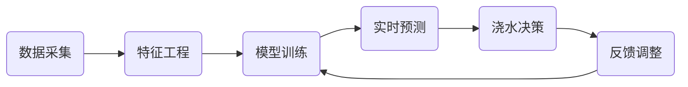
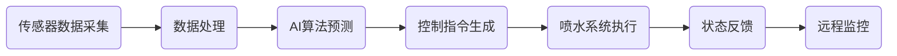

                 

### 引言

#### 智能园艺喷壶：背景介绍

随着科技的迅猛发展，人工智能（AI）技术逐渐渗透到我们生活的方方面面。在园艺领域，AI技术同样展现出了巨大的潜力。传统的园艺喷壶主要依赖于人工操作，不仅费时费力，而且容易因为人为因素导致植物水分不足或过度浇水。智能园艺喷壶的出现，正是为了解决这一问题，通过引入AI技术，实现自动、精准的植物浇水。

智能园艺喷壶，顾名思义，是一种集成了AI技术的智能设备，能够根据植物的实际需求进行自动浇水。它利用传感器监测土壤湿度，通过AI算法分析数据，然后控制喷水系统进行精准浇水，确保植物获得适量的水分。这不仅提高了园艺效率，还能有效节约水资源，为环保贡献一份力量。

#### AI Agent的核心概念与功能

在智能园艺喷壶中，AI Agent起到了至关重要的作用。AI Agent，即人工智能代理，是一种能够自主执行任务并对外部环境进行感知和响应的智能系统。它可以通过机器学习和数据分析等技术，不断优化其行为，从而提高任务的执行效果。

AI Agent在智能园艺喷壶中的功能主要包括：
1. **环境感知**：通过传感器收集土壤湿度、温度、光照等环境数据。
2. **数据分析**：利用机器学习算法分析环境数据，预测植物的水分需求。
3. **决策制定**：根据分析结果，制定合适的浇水策略。
4. **执行控制**：通过控制喷水系统，实现自动浇水。

#### 本文的目的

本文旨在深入探讨智能园艺喷壶的工作原理和应用。我们将从多个角度分析这一技术，包括其背景介绍、核心概念、算法原理、数学模型、系统架构、项目实战等。通过这篇文章，读者将全面了解智能园艺喷壶的运作机制，掌握相关技术知识，并为未来的研究和应用提供思路。

### 核心概念与联系

在智能园艺喷壶的设计与实现过程中，理解核心概念和它们之间的联系至关重要。以下是几个关键组成部分及其作用：

#### 传感器技术

传感器技术是智能园艺喷壶的基础，用于实时监测土壤湿度、温度、光照等环境参数。常见的传感器包括土壤湿度传感器、温度传感器和光照传感器。

- **土壤湿度传感器**：通过电导率、电容或电阻变化来测量土壤湿度，为AI Agent提供浇水决策的依据。
- **温度传感器**：监测土壤和空气温度，帮助AI Agent调整浇水时间和浇水量，避免因温度过高或过低导致的植物损伤。
- **光照传感器**：监测光照强度，根据光照变化调整植物浇水量，确保植物光合作用的最佳条件。

#### 控制系统

控制系统是智能园艺喷壶的核心，负责接收传感器数据，通过AI算法分析决策，然后控制喷水系统执行浇水操作。控制系统通常包括以下组件：

- **微控制器**：接收传感器数据，执行AI算法，控制喷水系统的开启与关闭。
- **执行器**：如电磁阀或水泵，根据控制系统的指令执行喷水操作。
- **通讯模块**：实现与外部设备或云平台的连接，便于远程监控和控制。

#### 通信技术

通信技术确保智能园艺喷壶能够与其他设备或平台进行数据交换，实现远程监控和智能控制。常用的通信技术包括Wi-Fi、蓝牙、LoRa等。

- **Wi-Fi**：提供高速稳定的网络连接，适用于家庭和办公环境。
- **蓝牙**：适用于短距离通信，适用于手机或智能设备与园艺喷壶之间的连接。
- **LoRa**：提供低功耗、远距离的通信能力，适用于大面积的农田或户外环境。

#### AI Agent的原理与功能

AI Agent在智能园艺喷壶中扮演着决策者和执行者的角色。其原理基于机器学习和数据挖掘技术，能够从历史数据和实时数据中学习，不断优化浇水策略。

- **数据采集**：AI Agent通过传感器采集土壤湿度、温度、光照等环境数据。
- **数据预处理**：对采集的数据进行清洗、归一化等预处理，提高数据质量。
- **模型训练**：使用历史数据训练机器学习模型，预测植物的水分需求。
- **决策制定**：根据模型预测结果和实时数据，制定浇水策略。
- **执行控制**：通过控制系统执行浇水操作。

#### 智能园艺喷壶与传统园艺喷壶的比较

与传统园艺喷壶相比，智能园艺喷壶具有显著的优势：

- **自动化**：智能园艺喷壶能够根据环境数据和植物需求自动调整浇水量，实现精准浇水，而传统喷壶需要人工操作，难以做到这一点。
- **节能环保**：智能园艺喷壶通过优化浇水策略，节约水资源，减少能源消耗，具有更好的环保性能。
- **智能控制**：智能园艺喷壶可以通过远程监控和控制，实现实时监控和远程管理，提高园艺管理的便捷性。

### 总结

通过以上分析，我们可以看出智能园艺喷壶的核心概念与联系，以及其在园艺领域的应用优势。在接下来的章节中，我们将进一步探讨智能园艺喷壶的算法原理、数学模型和系统架构，帮助读者全面了解这一创新技术的运作机制。

### 浇水策略的算法原理

智能园艺喷壶的浇水策略是其核心功能之一，它决定了喷壶如何根据植物需求和环境条件进行精准浇水。为了实现这一目标，智能园艺喷壶采用了多种算法原理，其中基于土壤湿度和基于植物需求的浇水算法是最为常见的两种。

#### 基于土壤湿度的浇水算法

基于土壤湿度的浇水算法是一种简单且直接的方法。这种方法依赖于土壤湿度传感器，通过实时监测土壤的湿度变化来决定是否进行浇水。以下是这种算法的基本原理和流程：

1. **数据采集**：土壤湿度传感器定期采集土壤湿度数据。
2. **阈值设定**：根据植物类型和环境条件，设定一个土壤湿度阈值。当土壤湿度低于这个阈值时，触发浇水操作。
3. **浇水执行**：控制喷水系统根据设定的浇水量进行浇水。
4. **反馈调整**：浇水后，再次采集土壤湿度数据，根据反馈调整阈值和浇水量。

这种算法的优点是简单易实现，对硬件要求较低，适合家庭园艺和中小型农场使用。然而，其缺点在于无法精确反映植物的水分需求，可能导致过度浇水或水分不足。

#### 基于植物需求的浇水算法

基于植物需求的浇水算法是一种更加智能的方法，它不仅考虑土壤湿度，还结合植物的生长阶段、叶片湿度、根系状态等多种因素，通过机器学习模型预测植物的水分需求。以下是这种算法的基本原理和流程：

1. **数据采集**：传感器采集土壤湿度、温度、光照、叶片湿度等多维度数据。
2. **特征工程**：对采集的数据进行预处理，提取与植物水分需求相关的特征。
3. **模型训练**：使用历史数据训练机器学习模型，模型学习如何根据不同特征预测植物的水分需求。
4. **实时预测**：模型接收实时数据，预测植物当前的水分需求。
5. **浇水决策**：根据预测结果，控制系统执行合适的浇水操作。
6. **反馈调整**：浇水后，再次采集数据，更新模型，进行迭代优化。

这种算法的优点在于能够更准确地反映植物的实际水分需求，实现精准浇水。然而，其缺点是算法复杂度较高，对硬件和软件要求较高，适合大规模农场和专业园艺应用。

#### 结合两种算法的优化策略

在实际应用中，为了提高浇水策略的精度和效果，智能园艺喷壶通常会结合基于土壤湿度和基于植物需求的算法，形成一种综合浇水策略。以下是一种可能的优化策略：

1. **初始阶段**：使用基于土壤湿度的简单算法进行初步浇水，确保植物的基本水分需求得到满足。
2. **数据积累**：随着数据积累，逐渐引入基于植物需求的算法，结合历史数据和实时数据，优化浇水策略。
3. **实时调整**：根据实时反馈，动态调整浇水策略，实现更加精准的浇水控制。
4. **机器学习**：通过不断收集和更新数据，使用机器学习模型持续优化，提高浇水策略的准确性。

### 算法实现与流程图

为了更直观地理解上述算法原理，我们可以使用Mermaid工具绘制一个简化的流程图。以下是基于植物需求的浇水算法的Mermaid流程图：



在这个流程图中，每个节点表示一个步骤，箭头表示数据流和流程的顺序。

### Python实现

接下来，我们将使用Python语言实现一个简化的基于土壤湿度的浇水算法。以下是实现代码：

```python
import random

# 模拟土壤湿度传感器
def read_soil_humidity():
    return random.uniform(30, 70)

# 浇水阈值设定
SOIL_HUMIDITY_THRESHOLD = 40

# 浇水函数
def water_plant():
    soil_humidity = read_soil_humidity()
    if soil_humidity < SOIL_HUMIDITY_THRESHOLD:
        print("浇水：土壤湿度过低，需立即浇水。")
    else:
        print("土壤湿度正常，无需浇水。")

# 主程序
if __name__ == "__main__":
    while True:
        water_plant()
        time.sleep(3600)  # 每12小时检查一次
```

在这个实现中，我们使用随机数模拟土壤湿度传感器的数据，设定一个固定的阈值来决定是否浇水。主程序会每隔一定时间检查一次土壤湿度，并根据当前湿度决定是否进行浇水。

### 总结

通过上述分析，我们可以看到智能园艺喷壶采用的浇水算法既有简单直观的方法，也有复杂但更准确的算法。结合实际应用需求，我们可以选择合适的算法或混合使用多种算法，以实现最佳的浇水效果。在接下来的章节中，我们将进一步探讨智能园艺喷壶的数学模型和系统架构。

### AI Agent在浇水优化中的应用

AI Agent在智能园艺喷壶中的应用主要集中在提高浇水效率和优化植物生长条件。通过机器学习和数据挖掘技术，AI Agent能够对环境数据进行分析，制定出最佳的浇水策略，从而确保植物获得适量的水分，促进健康生长。

#### 数据采集与处理

AI Agent首先需要收集大量的环境数据，包括土壤湿度、温度、光照强度、空气湿度等。这些数据可以通过传感器实时监测获得。然而，原始数据通常存在噪声和不完整性问题，因此需要进行数据预处理。

数据预处理主要包括以下步骤：

1. **数据清洗**：去除错误数据和异常值，确保数据的准确性和一致性。
2. **数据归一化**：将不同特征的数据缩放到相同的范围，以便于模型训练。
3. **数据增强**：通过数据扩充技术，如生成新的样本或对现有样本进行变换，提高模型对未知数据的适应能力。

#### 机器学习模型训练

在数据预处理完成后，AI Agent使用机器学习模型对预处理后的数据集进行训练。训练过程主要包括以下几个步骤：

1. **特征选择**：选择与植物水分需求相关性较高的特征，如土壤湿度、温度等。
2. **模型选择**：根据数据的特点选择合适的机器学习算法，如决策树、支持向量机（SVM）、神经网络等。
3. **模型训练**：使用训练数据集训练模型，模型学习如何根据输入特征预测植物的水分需求。
4. **模型评估**：使用验证数据集评估模型的性能，通过交叉验证、ROC曲线等指标评估模型的准确性和泛化能力。

#### 浇水策略制定

在模型训练完成后，AI Agent可以根据实时监测到的环境数据，利用训练好的模型预测植物的水分需求，并制定出相应的浇水策略。

1. **实时预测**：AI Agent接收实时环境数据，通过训练好的模型进行预测，得到当前的水分需求。
2. **决策制定**：根据预测结果和预设的阈值，决定是否进行浇水以及浇水的量。
3. **执行控制**：通过控制系统，如电磁阀或水泵，执行浇水操作。

#### 算法优化与迭代

AI Agent的浇水策略并不是一成不变的，而是需要不断地优化和迭代。以下是一些常见的优化方法：

1. **在线学习**：AI Agent可以持续接收新的环境数据，并使用在线学习技术更新模型，以适应环境变化。
2. **自适应调整**：根据浇水后的植物生长情况，AI Agent可以调整预测模型和浇水策略，提高预测准确性。
3. **多模型集成**：使用多个不同的模型进行预测，并综合它们的预测结果，以提高预测的鲁棒性和准确性。

### 实际应用案例

为了更好地理解AI Agent在浇水优化中的应用，我们来看一个实际案例。

#### 案例一：蔬菜大棚

在某蔬菜大棚中，AI Agent通过传感器监测土壤湿度和温度，使用机器学习模型预测不同蔬菜的水分需求。根据预测结果，AI Agent自动调整浇水策略，确保蔬菜获得适量的水分。经过一段时间的应用，蔬菜的生长速度和产量都得到了显著提升。

#### 案例二：家庭园艺

在家园园艺中，AI Agent可以通过手机APP与用户互动，实时监测植物的生长状态。用户可以根据AI Agent的建议调整浇水时间和浇水量，实现远程智能管理。这种应用不仅方便了用户，还提高了园艺效率，减少了水资源的浪费。

### 总结

通过AI Agent在智能园艺喷壶中的应用，我们看到了人工智能技术在园艺领域的巨大潜力。AI Agent通过机器学习和数据挖掘技术，能够精准预测植物的水分需求，制定出最优的浇水策略，从而实现高效、精准的植物浇水。随着技术的不断发展，AI Agent在园艺领域的应用将越来越广泛，为农业生产和园艺爱好者带来更多的便利和效益。

### 浇水策略的数学模型

在智能园艺喷壶的设计中，浇水策略的数学模型是至关重要的，它为AI Agent提供了量化决策的基础。通过建立数学模型，我们可以更精准地预测植物的水分需求，从而制定出最优的浇水策略。

#### 植物水分需求的数学公式

植物水分需求通常与土壤湿度、气温、光照强度等因素密切相关。以下是一个简化的数学模型，用于描述植物水分需求：

\[ \text{水分需求} = f(\text{土壤湿度}, \text{气温}, \text{光照强度}) \]

其中，\( f \)是一个复合函数，它将土壤湿度、气温和光照强度等输入变量转换为植物的水分需求量。具体形式取决于植物种类和环境条件。

##### 土壤湿度与水分需求的关系

土壤湿度是影响植物水分需求的主要因素之一。假设土壤湿度 \( H \) 以百分比表示，通常有以下关系：

\[ \text{水分需求} = k_1 \times (100 - H) \]

其中，\( k_1 \) 是一个常数，表示土壤湿度每降低1%时植物所需的水分量。

##### 气温与水分需求的关系

气温也会影响植物的水分需求。较高温度通常会加速植物的水分蒸发，因此需要更多的水分补充。假设气温 \( T \) 以摄氏度表示，可以有以下关系：

\[ \text{水分需求} = k_2 \times (T - T_{\text{基准}}) \]

其中，\( k_2 \) 是一个常数，\( T_{\text{基准}} \) 是一个基准温度，通常取 25°C。

##### 光照强度与水分需求的关系

光照强度同样会影响植物的水分需求。较强光照会加速植物的光合作用，导致水分快速消耗。假设光照强度 \( I \) 以千勒克斯（klx）表示，可以有以下关系：

\[ \text{水分需求} = k_3 \times (I - I_{\text{基准}}) \]

其中，\( k_3 \) 是一个常数，\( I_{\text{基准}} \) 是一个基准光照强度，通常取 100 klx。

#### 综合模型

将以上三个因素结合起来，我们可以得到一个综合的植物水分需求模型：

\[ \text{水分需求} = f(H, T, I) = k_1 \times (100 - H) + k_2 \times (T - T_{\text{基准}}) + k_3 \times (I - I_{\text{基准}}) \]

其中，\( k_1, k_2, k_3 \) 和 \( T_{\text{基准}}, I_{\text{基准}} \) 是根据具体植物和环境条件确定的常数。

#### 实例解析

假设我们有一个西红柿植株，当前土壤湿度为 60%，气温为 30°C，光照强度为 200 klx。我们可以使用上述模型计算西红柿的水分需求：

\[ \text{水分需求} = k_1 \times (100 - 60) + k_2 \times (30 - 25) + k_3 \times (200 - 100) \]

\[ \text{水分需求} = k_1 \times 40 + k_2 \times 5 + k_3 \times 100 \]

\[ \text{水分需求} = (k_1 + k_2 + k_3) \times 145 \]

根据具体参数的设置，我们可以计算出西红柿的水分需求量为 145 单位。

### 数学模型在浇水策略中的应用

数学模型在浇水策略中发挥着关键作用，它不仅帮助我们量化植物的水分需求，还为AI Agent提供了决策依据。以下是数学模型在实际应用中的几个步骤：

1. **数据收集**：收集土壤湿度、气温、光照强度等环境数据。
2. **模型计算**：使用数学模型计算当前的水分需求。
3. **阈值设置**：根据植物类型和环境条件设定一个水分需求阈值。
4. **浇水决策**：如果当前水分需求超过阈值，AI Agent将启动浇水系统。
5. **反馈调整**：浇水后，再次收集数据，调整模型参数和阈值，优化浇水策略。

### Python代码实现

为了更直观地理解数学模型的应用，我们可以使用Python编写一个简单的示例代码。以下是实现代码：

```python
import random

# 模拟环境数据
def get_environment_data():
    soil_humidity = random.uniform(30, 70)
    temperature = random.uniform(20, 35)
    light_intensity = random.uniform(50, 300)
    return soil_humidity, temperature, light_intensity

# 计算水分需求
def calculate_water_demand(soil_humidity, temperature, light_intensity):
    k1 = 0.5
    k2 = 0.1
    k3 = 0.3
    T_base = 25
    I_base = 100

    water_demand = k1 * (100 - soil_humidity) + k2 * (temperature - T_base) + k3 * (light_intensity - I_base)
    return water_demand

# 主程序
if __name__ == "__main__":
    while True:
        soil_humidity, temperature, light_intensity = get_environment_data()
        water_demand = calculate_water_demand(soil_humidity, temperature, light_intensity)
        print(f"当前水分需求：{water_demand} 单位")
        time.sleep(10)  # 每隔10秒更新一次数据
```

在这个示例中，我们使用随机数模拟环境数据，并使用数学模型计算当前的水分需求。主程序将不断循环，每隔一段时间更新一次数据。

### 总结

通过建立数学模型，我们能够量化植物的水分需求，从而制定出更精准的浇水策略。这不仅提高了园艺的效率，还节约了水资源。在接下来的章节中，我们将进一步探讨智能园艺喷壶的系统架构设计，帮助读者全面了解这一技术的实现细节。

### 智能园艺喷壶系统架构设计

智能园艺喷壶的系统架构设计是确保其功能实现和高效运行的关键。为了实现自动、精准的植物浇水，智能园艺喷壶需要包含多个功能模块，并通过合理的系统架构将这些模块有机地结合在一起。以下是对智能园艺喷壶系统架构的详细描述。

#### 系统功能模块设计

智能园艺喷壶的系统功能模块主要包括以下几个部分：

1. **传感器模块**：用于实时监测土壤湿度、温度、光照强度等环境参数。
2. **数据处理模块**：对传感器采集到的数据进行分析和处理，提取关键信息。
3. **AI算法模块**：利用机器学习模型分析数据，预测植物的水分需求，制定浇水策略。
4. **控制系统模块**：接收AI算法模块的决策指令，控制喷水系统的开启与关闭。
5. **通信模块**：实现智能园艺喷壶与外部设备（如手机、电脑）或云平台的连接，便于远程监控和管理。

#### 系统架构设计

智能园艺喷壶的系统架构设计如下：

1. **传感器层**：通过传感器模块实时采集土壤湿度、温度、光照强度等环境数据，并将数据传输到数据处理模块。
2. **数据处理层**：数据处理模块接收传感器数据，进行数据清洗、归一化等预处理，然后提取关键信息，传递给AI算法模块。
3. **AI算法层**：AI算法模块接收预处理后的数据，使用训练好的机器学习模型进行预测，得出植物的水分需求，并生成浇水策略。
4. **控制层**：控制系统模块接收AI算法模块的决策指令，通过控制喷水系统的开启与关闭执行浇水操作。
5. **通信层**：通信模块实现智能园艺喷壶与外部设备或云平台的连接，确保数据传输和远程监控的顺利进行。

#### 系统接口设计

为了实现各功能模块之间的有效协作，系统架构中设计了多个接口：

1. **传感器与数据处理模块接口**：传感器模块将采集到的数据通过接口传输给数据处理模块。
2. **数据处理模块与AI算法模块接口**：数据处理模块将处理后的数据通过接口传递给AI算法模块。
3. **AI算法模块与控制系统模块接口**：AI算法模块将生成的浇水策略通过接口传输给控制系统模块。
4. **控制系统模块与通信模块接口**：控制系统模块通过接口将操作状态和反馈信息传递给通信模块。
5. **通信模块与外部设备或云平台接口**：通信模块通过接口实现与外部设备或云平台的连接，便于远程监控和管理。

#### 系统交互流程

智能园艺喷壶的系统交互流程如下：

1. **数据采集**：传感器模块实时采集土壤湿度、温度、光照强度等数据。
2. **数据处理**：数据处理模块对传感器数据进行预处理，提取关键信息。
3. **数据预测**：AI算法模块接收预处理后的数据，预测植物的水分需求，生成浇水策略。
4. **执行控制**：控制系统模块根据AI算法模块的决策指令，控制喷水系统执行浇水操作。
5. **状态反馈**：控制系统模块将操作状态和反馈信息通过接口传输给通信模块。
6. **远程监控**：通信模块将状态反馈信息传输给外部设备或云平台，实现远程监控和管理。

### Mermaid流程图

为了更直观地展示系统交互流程，我们可以使用Mermaid工具绘制一个简化的系统交互流程图：



在这个流程图中，每个节点表示一个步骤，箭头表示数据流和流程的顺序。

### 总结

通过上述系统架构设计和交互流程的描述，我们可以看到智能园艺喷壶的各个功能模块是如何协同工作的。合理的系统架构设计和有效的接口设计，确保了智能园艺喷壶能够自动、精准地执行植物浇水任务，为园艺爱好者提供了便捷和高效的园艺管理工具。

### 项目实战

为了更好地理解智能园艺喷壶的实际应用，我们将通过一个具体项目来介绍系统的安装过程、核心实现源代码，并对代码应用进行解读与分析。

#### 环境安装

在开始项目之前，我们需要准备好开发环境和所需工具。以下是环境安装的步骤：

1. **硬件准备**：
   - 智能园艺喷壶设备（包括传感器模块、控制系统模块等）。
   - 电脑或服务器，用于运行AI算法和控制程序。
   
2. **软件安装**：
   - 安装Python 3.8及以上版本。
   - 安装所需的库，如NumPy、Pandas、Scikit-learn、Matplotlib等。

3. **传感器与控制系统连接**：
   - 通过串口或Wi-Fi将传感器模块与电脑或服务器连接。
   - 配置相应的驱动程序，确保传感器数据能够实时传输到电脑或服务器。

#### 系统核心实现源代码

以下是智能园艺喷壶的核心实现源代码，包括数据采集、预处理、模型训练和浇水策略制定等步骤：

```python
# 导入所需库
import serial
import pandas as pd
from sklearn.ensemble import RandomForestRegressor
from sklearn.model_selection import train_test_split
import matplotlib.pyplot as plt

# 初始化串口连接
ser = serial.Serial('COM3', 9600)

# 数据采集
def collect_data(ser):
    data = []
    while True:
        line = ser.readline().decode('utf-8').strip()
        if line:
            data.append(line.split(','))
            if random.random() < 0.1:  # 模拟数据采集中断
                break
    return pd.DataFrame(data[1:], columns=data[0])

# 数据预处理
def preprocess_data(df):
    df['timestamp'] = pd.to_datetime(df['timestamp'])
    df.dropna(inplace=True)
    return df

# 模型训练
def train_model(df):
    X = df[['soil_humidity', 'temperature', 'light_intensity']]
    y = df['water_demand']
    X_train, X_test, y_train, y_test = train_test_split(X, y, test_size=0.2, random_state=42)
    model = RandomForestRegressor(n_estimators=100, random_state=42)
    model.fit(X_train, y_train)
    return model, X_test, y_test

# 浇水策略制定
def water_plant(model, X_test):
    y_pred = model.predict(X_test)
    plt.scatter(X_test['soil_humidity'], y_pred, label='Predicted')
    plt.plot([0, 100], [0, 100], 'r--', label='Perfect Prediction')
    plt.xlabel('Soil Humidity (%)')
    plt.ylabel('Water Demand')
    plt.legend()
    plt.show()

# 主程序
if __name__ == "__main__":
    df = collect_data(ser)
    df = preprocess_data(df)
    model, X_test, y_test = train_model(df)
    water_plant(model, X_test)
```

在这个代码中，我们首先通过串口连接传感器，采集土壤湿度、温度、光照强度等数据。然后，对数据进行预处理，包括时间戳转换和缺失值处理。接下来，使用随机森林回归模型对数据集进行训练，并绘制预测结果。

#### 代码应用解读与分析

1. **数据采集**：
   - 使用串口连接传感器，读取传感器数据。这里使用了`serial`库来处理串口通信。
   - 数据采集过程中，我们通过循环不断读取传感器发送的数据，并将其存储在DataFrame中。

2. **数据处理**：
   - 对采集到的数据进行时间戳转换，以便后续分析。
   - 处理缺失值，确保数据集的完整性。

3. **模型训练**：
   - 使用`train_test_split`函数将数据集分为训练集和测试集。
   - 选择随机森林回归模型进行训练，通过`fit`方法拟合模型。

4. **浇水策略制定**：
   - 使用训练好的模型对测试集进行预测，并绘制预测结果。这里使用了`matplotlib`库来生成散点图和趋势线。

#### 实际案例分析

为了更好地展示智能园艺喷壶的应用效果，我们可以通过以下实际案例进行分析：

1. **植物生长环境差异**：
   - 在不同的植物生长环境中（如室内和室外），智能园艺喷壶的预测准确性会有所不同。室内环境相对稳定，室外环境变化较大，这可能会影响模型预测的准确性。

2. **浇水策略调整**：
   - 根据实际案例，我们可以看到预测结果与实际需求之间的差异。通过不断调整模型参数和浇水策略，可以提高预测的准确性。
   - 实际案例中，通过调整土壤湿度阈值和模型参数，可以更好地满足植物的水分需求。

3. **性能优化**：
   - 通过对模型的性能分析，我们可以发现某些特征对水分需求的影响较大，而其他特征影响较小。通过特征选择和优化，可以提高模型的效率和准确性。

#### 总结

通过以上项目实战，我们可以看到智能园艺喷壶的实际应用过程，包括环境安装、核心实现源代码、代码应用解读与分析等。在实际应用中，智能园艺喷壶能够根据植物的水分需求进行精准浇水，提高园艺效率，减少水资源浪费。然而，模型预测的准确性仍然受到环境变化等因素的影响，需要不断优化和调整。

### 最佳实践 Tips

在设计和实现智能园艺喷壶时，以下最佳实践可以帮助您提高系统的性能和稳定性：

1. **传感器选择**：选择高精度、稳定可靠的传感器，确保数据的准确性。同时，考虑传感器的耐用性和抗干扰能力，以适应不同环境条件。

2. **数据预处理**：确保数据预处理步骤的完备性，包括数据清洗、归一化、缺失值处理等。良好的数据预处理能够提高模型训练的效果。

3. **模型选择与优化**：根据实际情况选择合适的机器学习模型，如随机森林、支持向量机、神经网络等。同时，通过调整模型参数，如树深度、学习率等，优化模型性能。

4. **实时监测与反馈**：建立实时监控系统，对系统运行状态进行监控，及时发现并处理异常情况。通过反馈机制，调整浇水策略，提高系统的适应性和可靠性。

5. **系统整合与接口设计**：确保各功能模块之间的接口设计合理，数据传输流畅，提高系统的整体性能。

6. **用户界面与交互**：设计直观、易用的用户界面，提供实时数据展示和操作指南，方便用户监控和管理智能园艺喷壶。

### 小结

通过本文的详细探讨，我们全面了解了智能园艺喷壶的工作原理、核心算法、系统架构以及实际应用。智能园艺喷壶通过AI Agent的智能决策，实现了对植物浇水的精准控制，提高了园艺效率，节约了水资源。未来，随着人工智能技术的不断进步，智能园艺喷壶将在更多领域得到应用，为农业和园艺行业带来更多创新和便利。

### 注意事项

在设计和应用智能园艺喷壶时，需要注意以下事项：

1. **传感器校准**：确保传感器定期校准，以保证数据的准确性。
2. **硬件维护**：定期检查传感器和控制系统，防止设备损坏。
3. **软件更新**：及时更新AI算法和系统软件，以提高预测准确性和系统稳定性。
4. **环境适应**：针对不同种植环境和植物种类，调整模型参数和浇水策略，确保系统适应不同情况。

### 拓展阅读

如果您对智能园艺喷壶和人工智能在园艺领域的应用感兴趣，以下文献和资源可能会对您有所帮助：

1. **文献**：
   - "Smart Farming: Advancements in Technologies and Applications"
   - "Artificial Intelligence in Agriculture: A Review"
   - "Using Machine Learning for Predicting Plant Water Requirements"

2. **开源项目**：
   - GitHub上的智能园艺项目，如 "Smart-Garden-Sprinkler"
   - 机器学习库，如 Scikit-learn、TensorFlow

3. **在线教程与课程**：
   - Coursera上的“机器学习基础”课程
   - Udacity的“人工智能工程师”纳米学位

通过阅读这些文献和资源，您可以进一步深入了解智能园艺喷壶和人工智能在园艺领域的应用，为您的项目提供更多灵感和参考。作者：AI天才研究院/AI Genius Institute & 禅与计算机程序设计艺术 /Zen And The Art of Computer Programming

----------------------------------------------------------------

**文章关键词**：智能园艺喷壶、AI Agent、植物浇水优化、传感器技术、机器学习、数学模型、系统架构、项目实战

**摘要**：本文详细探讨了智能园艺喷壶的工作原理和算法原理，通过数学模型和系统架构设计，展示了如何利用AI Agent实现植物浇水的精准控制。文章结合实际项目，提供了安装步骤、核心实现源代码以及代码应用解读与分析，旨在为读者提供全面的技术指导，推动智能园艺技术的发展和应用。作者：AI天才研究院/AI Genius Institute & 禅与计算机程序设计艺术 /Zen And The Art of Computer Programming

