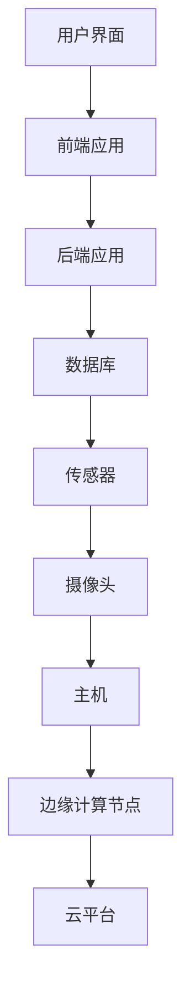

                 

# 智能园艺工具：AI Agent的植物病虫害诊断

关键词：智能园艺工具、AI Agent、植物病虫害诊断、图像识别、机器学习

摘要：随着人工智能技术的不断进步，智能园艺工具在现代农业中的应用越来越广泛。本文旨在探讨如何利用AI Agent实现植物病虫害的智能诊断，通过一步步分析推理，详细阐述相关技术原理和实现方法，为园艺领域提供新的思路和解决方案。

## 第一部分：引言与背景介绍

### 核心概念

#### 问题背景

智能园艺工具是利用人工智能技术，结合物联网、传感器等技术，实现对植物生长环境、状态、病虫害等方面的监测和管理。随着全球食品需求的增加和气候变化的影响，智能园艺工具在提高农业生产效率和品质方面具有重要意义。

#### 问题描述

植物病虫害是农业生产中常见的难题，传统的人工检测方法耗时且不准确。如何利用AI技术，特别是AI Agent，实现快速、准确的植物病虫害诊断，成为当前研究的热点。

#### 问题解决

通过AI Agent，可以实现对植物病虫害的实时监测和诊断。AI Agent具有自主性、交互性和学习能力，能够根据环境数据和图像信息，自动识别病虫害类型，并给出相应的解决方案。

#### 边界与外延

智能园艺工具的技术范畴包括图像识别、机器学习、传感器技术等。其应用场景主要包括温室、农田、花园等植物生长环境。

#### 概念结构与核心要素组成

- AI Agent：智能体在虚拟环境中的自主行动体。
- 图像识别：利用计算机视觉技术，对图像进行分析和识别。
- 机器学习算法：通过训练数据，让计算机自主学习和识别模式。

### 第二部分：AI Agent与智能园艺工具

#### AI Agent的基本原理

- AI Agent的定义：智能体在虚拟环境中的自主行动体。
- AI Agent的核心特点：自主性、交互性、学习能力。
- AI Agent与传统机器的区别：自动决策与自适应能力。

#### 智能园艺工具的应用

- 智能园艺工具概述：利用传感器和AI技术进行植物监测和诊断。
- 应用场景：温湿度监测、土壤分析、病虫害检测。

### 第三部分：植物病虫害的图像识别技术

#### 图像识别技术概述

- 图像识别的重要性：对植物病虫害进行快速准确的识别。
- 主流图像识别算法：卷积神经网络（CNN）、迁移学习等。

#### 图像识别在病虫害诊断中的应用

- 图像采集：利用传感器和摄像头获取植物图像。
- 图像处理：对图像进行预处理、增强、特征提取。
- 分类与诊断：利用深度学习模型对病虫害进行分类。

### 第四部分：机器学习算法在病虫害诊断中的应用

#### 机器学习算法概述

- 机器学习的基本原理：监督学习、无监督学习等。
- 常见机器学习算法：决策树、支持向量机、神经网络等。

#### 机器学习算法在病虫害诊断中的应用

- 数据收集与预处理：收集病虫害相关数据，进行预处理。
- 模型训练与评估：构建模型、训练和评估模型性能。
- 实际案例分析：对特定植物病虫害进行诊断分析。

### 第五部分：智能园艺工具的设计与实现

#### 智能园艺工具的设计

- 需求分析：确定工具的功能需求和性能指标。
- 系统架构设计：构建系统框架，包括硬件和软件组件。
- 用户体验设计：考虑用户界面的友好性和易用性。

#### 智能园艺工具的实现

- 硬件选型：传感器、摄像头、主机等。
- 软件开发：编写AI Agent的代码，实现图像识别和机器学习功能。
- 系统集成与测试：将硬件和软件集成，进行测试和优化。

### 第六部分：智能园艺工具的部署与优化

#### 智能园艺工具的部署

- 部署环境：云平台、边缘计算等。
- 部署流程：部署工具，配置网络和环境。

#### 智能园艺工具的优化

- 性能优化：提高诊断速度和准确性。
- 成本优化：降低工具的维护和运营成本。
- 用户体验优化：提升工具的易用性和可靠性。

### 第七部分：智能园艺工具的未来展望

#### 智能园艺工具的发展趋势

- 技术创新：新的AI算法和传感器技术。
- 市场前景：智能园艺工具在现代农业中的应用前景。

#### 总结与展望

- 总结：回顾全书内容，强调智能园艺工具的重要性。
- 展望：展望智能园艺工具的未来发展方向和应用场景。

## 第一部分：引言与背景介绍

### 核心概念

智能园艺工具是现代农业发展的关键之一，它通过集成物联网、传感器和人工智能技术，实现对植物生长环境的实时监测、分析和预测。在本章节中，我们将首先介绍智能园艺工具的核心概念，包括问题背景、问题描述、问题解决、边界与外延以及概念结构与核心要素组成。

#### 问题背景

随着全球人口的增长和气候变化的影响，农业面临着巨大的挑战。传统的农业生产方式已经难以满足日益增长的食物需求和质量要求。因此，寻找新的农业生产方式和技术成为当务之急。智能园艺工具作为一种新兴的技术，通过集成传感器、物联网和人工智能技术，实现了对植物生长环境的实时监测和管理，为提高农业生产效率和品质提供了新的思路。

#### 问题描述

植物病虫害是农业生产中常见的难题，它们不仅会严重影响农作物的产量和质量，还会导致严重的经济损失。传统的病虫害检测方法主要依赖于人工观察和经验判断，这种方法耗时且不准确，往往会导致病虫害的误诊和漏诊。随着人工智能技术的不断发展，利用AI技术实现植物病虫害的智能诊断成为可能。

#### 问题解决

智能园艺工具通过AI Agent实现植物病虫害的智能诊断，具有以下优点：

1. **快速诊断**：AI Agent可以实时监测植物生长环境，快速识别病虫害类型，提供及时的解决方案。
2. **准确率高**：AI Agent通过机器学习和图像识别技术，可以实现对病虫害的准确分类和诊断，减少误诊和漏诊的可能性。
3. **降低人力成本**：智能园艺工具可以自动完成病虫害的监测和诊断，减少人力投入，降低生产成本。

#### 边界与外延

智能园艺工具的技术范畴包括图像识别、机器学习、传感器技术等。其应用场景主要包括温室、农田、花园等植物生长环境。智能园艺工具不仅可以用于病虫害诊断，还可以用于土壤分析、温度和湿度监测等，为农业生产提供全面的数据支持。

#### 概念结构与核心要素组成

智能园艺工具的核心概念包括AI Agent、图像识别、机器学习算法和传感器技术。其中，AI Agent是智能园艺工具的核心，它负责对植物生长环境进行监测和数据分析；图像识别和机器学习算法用于对病虫害进行分类和诊断；传感器技术则用于实时采集植物生长环境的数据。

### AI Agent的基本原理

AI Agent，即人工智能代理，是智能园艺工具的核心组成部分。它是一种在虚拟环境中能够自主行动、具有交互能力和学习能力的智能体。AI Agent的基本原理包括以下几个方面：

#### AI Agent的定义

AI Agent可以被定义为一种在虚拟环境中运行的、能够根据环境信息和预定的目标自主决策并执行相应行动的计算机程序。它具备以下几个特点：

1. **自主性**：AI Agent能够根据环境变化自主调整行为，实现自我决策。
2. **交互性**：AI Agent可以与其他智能体或系统进行通信和交互。
3. **适应性**：AI Agent能够通过学习环境和经验，不断优化自身的行为策略。

#### AI Agent的核心特点

AI Agent的核心特点主要体现在以下几个方面：

1. **自主性**：AI Agent能够根据预设的目标和环境信息，自主选择行动策略。这种自主性使得AI Agent能够在复杂多变的环境中灵活应对。
2. **交互性**：AI Agent不仅可以与环境进行交互，还可以与其他智能体进行通信和合作。这种交互性提高了系统的整体效率和智能水平。
3. **学习能力**：AI Agent能够通过不断学习和积累经验，优化自身的行为策略，提高应对复杂环境的能力。

#### AI Agent与传统机器的区别

传统机器通常只能按照预先设定的程序执行固定任务，缺乏自主决策能力和学习能力。相比之下，AI Agent具有以下区别：

1. **自动决策**：AI Agent能够根据环境信息和目标自主做出决策，而不需要人工干预。
2. **自适应能力**：AI Agent能够根据环境和任务的反馈，自适应调整行为策略，提高系统效率和效果。
3. **智能化**：AI Agent通过学习和优化，能够不断提高自身的智能水平，实现更高层次的任务处理。

### 智能园艺工具的应用

智能园艺工具是一种利用传感器和AI技术进行植物监测和诊断的设备，其应用场景非常广泛，包括但不限于以下几个方面：

#### 智能园艺工具概述

智能园艺工具的核心功能是对植物生长环境进行实时监测和数据分析，从而提供科学的种植管理建议。这些工具通常包括以下几个组成部分：

1. **传感器**：用于实时采集植物生长环境的数据，如温度、湿度、光照强度、土壤湿度等。
2. **数据处理单元**：负责对传感器采集到的数据进行处理和分析，提取有用的信息。
3. **AI模块**：利用机器学习和图像识别技术，对植物的生长状态和病虫害进行诊断。
4. **用户界面**：提供直观、易于操作的用户界面，帮助用户查看数据、设置参数和接收诊断结果。

#### 应用场景

智能园艺工具的应用场景主要包括以下几个方面：

1. **温室管理**：在温室环境中，智能园艺工具可以实时监测温度、湿度、光照等参数，为植物生长提供最佳的环境条件。
2. **农田监测**：在农田中，智能园艺工具可以监测土壤湿度、病虫害等情况，帮助农民科学管理农田，提高产量和质量。
3. **花园维护**：在家庭花园或公园中，智能园艺工具可以帮助用户实时了解植物的生长状态，提供科学的维护建议。

通过智能园艺工具的应用，农民和园艺爱好者可以更轻松地管理植物，提高生产效率和作物质量，实现现代农业的可持续发展。

### 植物病虫害的图像识别技术

植物病虫害的图像识别技术是智能园艺工具的重要组成部分，它利用计算机视觉技术对植物图像进行分析和识别，从而实现病虫害的自动检测和诊断。本章节将介绍图像识别技术的基本原理、重要性以及主流算法，同时探讨图像识别在病虫害诊断中的应用。

#### 图像识别技术概述

图像识别技术是计算机视觉领域的一个重要分支，它通过算法和模型对图像进行分析和处理，以识别和分类图像中的对象或特征。在植物病虫害的图像识别中，图像识别技术起到了关键作用。

##### 图像识别的重要性

1. **快速检测**：通过图像识别技术，可以实现对植物病虫害的快速检测，大大提高了病虫害监测的效率。
2. **准确诊断**：图像识别技术能够通过分析植物图像的特征，实现对病虫害的准确诊断，减少误诊和漏诊的可能性。
3. **自动化管理**：图像识别技术使得病虫害监测和诊断过程可以实现自动化，减少了人工干预的需求，提高了农业生产效率。

##### 主流图像识别算法

在植物病虫害的图像识别中，常用的图像识别算法包括卷积神经网络（CNN）、迁移学习等。

1. **卷积神经网络（CNN）**：
   CNN是一种深度学习模型，专门用于图像识别和处理。它通过多层卷积和池化操作，逐步提取图像中的特征，从而实现对图像的分类。CNN在植物病虫害图像识别中具有很高的准确性和鲁棒性。

2. **迁移学习**：
   迁移学习是一种将已知模型的知识迁移到新任务上的方法。在植物病虫害图像识别中，可以通过迁移学习利用预训练模型来提高模型的性能。迁移学习能够减少对大量标注数据的依赖，加速模型的训练过程。

#### 图像识别在病虫害诊断中的应用

图像识别技术在植物病虫害诊断中的应用主要包括以下几个步骤：

##### 图像采集

利用传感器和摄像头获取植物图像。这些图像可以是在不同时间、不同环境条件下拍摄的，包括植物的健康状态和病虫害感染情况。

##### 图像处理

对采集到的图像进行预处理、增强和特征提取，以提高图像质量和识别效果。预处理包括图像去噪、对比度增强等操作；增强包括图像旋转、缩放等操作；特征提取包括边缘检测、纹理分析等操作。

##### 分类与诊断

利用深度学习模型（如CNN）对处理后的图像进行分类和诊断。模型通过学习大量的病虫害图像数据，学会识别不同的病虫害类型，从而实现对植物图像的准确分类。

##### 病害诊断结果

根据分类结果，智能园艺工具可以提供病虫害的诊断报告，包括病虫害的类型、严重程度和相应的防治建议。这些诊断结果可以帮助农民及时采取防治措施，减少病虫害对作物的损害。

### 第五部分：机器学习算法在病虫害诊断中的应用

#### 机器学习算法概述

机器学习算法是智能园艺工具的核心组成部分，它们通过对大量数据的分析和学习，能够自动识别和分类植物病虫害。在本章节中，我们将介绍机器学习算法的基本原理、常见算法以及它们在病虫害诊断中的应用。

##### 机器学习的基本原理

机器学习是一种使计算机系统能够从数据中学习并做出预测或决策的技术。其基本原理可以概括为以下几个步骤：

1. **数据收集**：收集与病虫害诊断相关的数据，这些数据可以是植物图像、生长环境参数等。
2. **数据预处理**：对收集到的数据进行清洗、标准化等处理，以确保数据的质量和一致性。
3. **模型选择**：选择合适的机器学习算法，如决策树、支持向量机、神经网络等。
4. **模型训练**：利用预处理后的数据，对机器学习模型进行训练，使其学会识别和分类病虫害。
5. **模型评估**：通过测试集评估模型的性能，调整模型参数以提高准确性和泛化能力。
6. **应用部署**：将训练好的模型部署到智能园艺工具中，实现自动化的病虫害诊断。

##### 常见机器学习算法

在植物病虫害诊断中，常见的机器学习算法包括以下几种：

1. **决策树**：
   决策树是一种基于树结构的分类算法，通过一系列的判断条件对数据进行分类。它简单直观，易于理解和实现，适用于处理非结构化数据。

2. **支持向量机（SVM）**：
   SVM是一种基于最大间隔原理的分类算法，通过寻找最优的超平面来实现数据的分类。它具有较强的分类能力和泛化能力，适用于处理高维数据。

3. **神经网络**：
   神经网络，特别是深度神经网络（DNN），是一种基于人工神经元的计算模型。它通过多层神经网络结构进行特征提取和分类，具有强大的学习和表达能力，适用于复杂的非线性问题。

##### 机器学习算法在病虫害诊断中的应用

机器学习算法在病虫害诊断中的应用主要包括以下几个步骤：

1. **数据收集与预处理**：
   收集与病虫害诊断相关的数据，包括植物图像、生长环境参数等。对收集到的数据进行分析，提取有用的特征，并进行预处理，如数据清洗、归一化等。

2. **模型训练**：
   选择合适的机器学习算法，如卷积神经网络（CNN）或支持向量机（SVM），利用预处理后的数据对模型进行训练。训练过程中，模型通过学习数据中的模式，逐渐提高对病虫害的识别能力。

3. **模型评估**：
   使用测试集对训练好的模型进行评估，以验证模型的性能。通过交叉验证、准确率、召回率等指标，评估模型在不同病虫害类型上的诊断能力。

4. **应用部署**：
   将训练好的模型部署到智能园艺工具中，实现自动化的病虫害诊断。智能园艺工具可以通过实时监测植物生长环境，获取植物图像，利用训练好的模型进行病虫害的自动识别和分类。

##### 实际案例分析

为了更好地理解机器学习算法在病虫害诊断中的应用，我们可以通过以下实际案例进行分析：

1. **案例背景**：
   假设我们有一个农田，其中种植了不同种类的农作物。为了确保作物的健康生长，我们需要对农田中的病虫害进行实时监测和诊断。

2. **数据收集**：
   收集农田中的植物图像、生长环境参数（如温度、湿度、光照等）以及对应的病虫害标签数据。

3. **数据预处理**：
   对植物图像进行预处理，包括图像去噪、对比度增强等操作。对生长环境参数进行归一化处理，以确保数据的一致性和模型的训练效果。

4. **模型训练**：
   选择卷积神经网络（CNN）作为机器学习算法，利用预处理后的数据进行模型训练。通过调整网络结构、学习率等参数，提高模型的诊断准确率。

5. **模型评估**：
   使用测试集对训练好的模型进行评估，通过交叉验证和准确率等指标，验证模型在不同病虫害类型上的诊断能力。

6. **应用部署**：
   将训练好的模型部署到智能园艺工具中，实现对农田中植物病虫害的实时监测和诊断。智能园艺工具可以通过实时获取的植物图像和生长环境数据，利用模型进行病虫害的自动识别和分类，并提供相应的诊断报告和建议。

通过以上实际案例，我们可以看到机器学习算法在植物病虫害诊断中的应用，它不仅提高了病虫害检测的准确性和效率，还为农业生产提供了科学的管理和决策支持。

### 智能园艺工具的设计与实现

智能园艺工具的设计与实现是一个复杂而系统的过程，它需要综合考虑功能需求、性能指标、用户体验等多个方面。在本章节中，我们将详细讨论智能园艺工具的设计与实现过程，包括需求分析、系统架构设计、用户体验设计等。

#### 需求分析

需求分析是智能园艺工具设计的第一步，它旨在明确工具的功能需求和性能指标。需求分析主要包括以下几个方面：

1. **功能需求**：
   - 实时监测植物生长环境，包括温度、湿度、光照等参数。
   - 自动识别和诊断植物病虫害。
   - 提供科学的种植管理建议。
   - 用户可以远程监控和控制园艺工具。

2. **性能指标**：
   - 系统响应时间：确保用户能够快速获取植物监测数据和诊断结果。
   - 系统稳定性：保证系统在长时间运行中的可靠性和稳定性。
   - 诊断准确率：通过机器学习和图像识别技术，确保病虫害诊断的准确性。

3. **用户体验**：
   - 界面友好：设计直观、易用的用户界面，方便用户操作。
   - 易于维护：系统设计应考虑未来扩展和维护的方便性。

#### 系统架构设计

系统架构设计是智能园艺工具实现的关键，它决定了系统的性能、可扩展性和可维护性。智能园艺工具的系统架构设计包括硬件和软件组件，其总体架构如图所示：

1. **前端应用**：用户界面，用于展示植物监测数据、诊断结果和管理建议。前端应用可以使用HTML、CSS和JavaScript等技术开发，通过Web浏览器进行访问。

2. **后端应用**：处理用户请求，提供API接口，与前端应用和数据库进行数据交互。后端应用可以使用Python、Java等语言开发，结合Flask、Django等框架构建。

3. **数据库**：存储植物监测数据、诊断结果和用户设置等。可以使用MySQL、MongoDB等关系型或非关系型数据库进行数据存储和管理。

4. **传感器**：用于实时采集植物生长环境数据，如温度、湿度、光照等。传感器可以通过Wi-Fi、蓝牙等无线通信技术将数据传输到主机。

5. **摄像头**：用于拍摄植物图像，用于病虫害的自动识别和诊断。摄像头可以通过USB或Wi-Fi与主机连接。

6. **主机**：处理传感器数据和摄像头图像，执行机器学习和图像识别算法。主机可以是PC或嵌入式设备，如树莓派。

7. **边缘计算节点**：在主机附近，用于实时处理传感器数据和摄像头图像，减轻主机负担，提高系统响应速度。

8. **云平台**：用于存储、分析和处理大量数据，提供远程访问和管理功能。可以使用AWS、Azure等云服务。

#### 用户体验设计

用户体验设计是智能园艺工具成功的关键之一，它直接影响用户的使用感受和满意度。用户体验设计主要包括以下几个方面：

1. **界面设计**：
   - 界面简洁、直观，使用户能够快速找到所需功能。
   - 提供实时数据图表，方便用户查看植物生长状态和诊断结果。
   - 设计简洁明了的操作界面，减少用户操作步骤。

2. **交互设计**：
   - 支持远程监控和控制，用户可以在任何时间、任何地点查看和管理植物。
   - 提供消息通知，及时提醒用户病虫害发生和诊断结果。

3. **易用性设计**：
   - 提供详细的操作说明和帮助文档，帮助用户快速上手。
   - 设计友好的用户界面，减少用户的学习成本。

通过以上设计，智能园艺工具将能够为用户提供高效、便捷、智能化的园艺管理服务。

### 智能园艺工具的实现

智能园艺工具的实现是一个复杂的过程，需要结合硬件和软件的开发，确保系统能够稳定运行并满足用户的需求。在本章节中，我们将详细讨论智能园艺工具的硬件选型、软件开发以及系统集成的过程。

#### 硬件选型

智能园艺工具的硬件选型是系统实现的基础，直接影响系统的性能、稳定性和能耗。以下是智能园艺工具硬件选型的关键点：

1. **传感器**：传感器用于实时采集植物生长环境的数据，如温度、湿度、光照等。常见的传感器包括DHT22（温湿度传感器）、BH1750（光照传感器）等。选择传感器时，需要考虑其精度、响应速度和功耗。

2. **摄像头**：摄像头用于拍摄植物图像，用于病虫害的自动识别和诊断。选择摄像头时，需要考虑其分辨率、帧率、图像质量和功耗。常见的摄像头有USB摄像头和Wi-Fi摄像头。

3. **主机**：主机是智能园艺工具的“大脑”，负责处理传感器数据和摄像头图像，执行机器学习和图像识别算法。主机可以是PC或嵌入式设备，如树莓派。选择主机时，需要考虑其处理能力、存储空间和网络接口。

4. **边缘计算节点**：边缘计算节点用于在主机附近实时处理传感器数据和摄像头图像，减轻主机负担。边缘计算节点可以是树莓派或其他低功耗嵌入式设备。

5. **电源**：智能园艺工具通常需要24小时不间断运行，因此电源的稳定性和可靠性至关重要。可以选择太阳能板、电池组等作为电源。

#### 软件开发

智能园艺工具的软件开发包括前端应用、后端应用和机器学习模型的开发。

1. **前端应用**：前端应用负责与用户交互，展示植物监测数据、诊断结果和管理建议。可以使用HTML、CSS和JavaScript等技术开发Web界面，结合Vue.js、React.js等框架实现动态交互。

2. **后端应用**：后端应用负责处理用户请求，提供API接口，与前端应用和数据库进行数据交互。可以使用Python、Java等语言开发，结合Flask、Django等框架实现。后端应用的主要功能包括数据采集、处理、存储和诊断结果输出。

3. **机器学习模型**：机器学习模型用于对植物病虫害进行自动识别和诊断。可以使用TensorFlow、PyTorch等深度学习框架开发模型，结合大量的植物病虫害图像数据进行训练。模型训练完成后，可以部署到主机或边缘计算节点进行实时诊断。

#### 系统集成与测试

系统集成与测试是智能园艺工具实现的最后一步，确保各个组件能够无缝协作，实现预期的功能。

1. **系统集成**：将硬件和软件组件进行集成，确保传感器、摄像头、主机和边缘计算节点之间的数据传输和通信正常。可以采用Wi-Fi、蓝牙、USB等通信技术实现硬件之间的连接。

2. **测试与优化**：对系统进行功能测试、性能测试和稳定性测试，确保系统在各种情况下都能稳定运行。测试过程中，需要关注系统的响应时间、诊断准确率、功耗等指标。根据测试结果，对系统进行优化和调整，提高系统的性能和可靠性。

通过以上步骤，智能园艺工具可以实现稳定、高效地运行，为用户提供智能化的园艺管理服务。

### 智能园艺工具的部署与优化

智能园艺工具的部署与优化是确保其稳定运行并充分发挥其功能的重要环节。以下将详细讨论智能园艺工具的部署环境、部署流程、性能优化、成本优化以及用户体验优化。

#### 部署环境

智能园艺工具的部署环境包括云平台和边缘计算等。

1. **云平台**：云平台提供高性能、高可靠性的计算和存储资源，适用于大规模的数据处理和分析。常见的云平台包括AWS、Azure和Google Cloud等。选择云平台时，需要考虑以下因素：
   - **计算能力**：根据系统负载，选择合适的虚拟机实例。
   - **存储容量**：确保存储空间满足数据存储需求。
   - **安全性**：确保数据传输和存储的安全。

2. **边缘计算**：边缘计算将部分数据处理和分析任务从云端转移到网络边缘，提高系统响应速度和效率。边缘计算适用于数据量较大、实时性要求高的场景。常见的边缘计算设备包括树莓派、物联网网关等。

#### 部署流程

智能园艺工具的部署流程包括以下步骤：

1. **环境配置**：根据系统需求，配置云平台或边缘计算设备的环境，包括操作系统、网络设置等。

2. **软件安装**：安装和配置前端应用、后端应用和机器学习模型。可以使用容器化技术（如Docker）简化部署过程，确保环境的一致性和可移植性。

3. **数据迁移**：将历史数据从原有系统迁移到新环境，包括植物监测数据、诊断结果和用户设置等。

4. **系统测试**：在部署后进行系统测试，确保各组件正常运行，数据传输和通信正常。

5. **上线运行**：完成测试后，将系统上线运行，提供智能园艺服务。

#### 性能优化

性能优化是确保智能园艺工具高效运行的关键。以下是一些性能优化策略：

1. **数据缓存**：利用缓存技术（如Redis）减少数据库访问次数，提高数据读取速度。

2. **负载均衡**：使用负载均衡器（如Nginx）分配用户请求，确保系统资源充分利用。

3. **并发处理**：优化后端应用，提高并发处理能力，减少响应时间。

4. **硬件升级**：根据系统负载，适当升级硬件设备，提高计算和存储能力。

#### 成本优化

成本优化是降低智能园艺工具运营成本的关键。以下是一些成本优化策略：

1. **自动化运维**：利用自动化工具（如Ansible、Puppet）进行系统部署和管理，减少人工成本。

2. **资源调配**：根据系统负载，动态调整云资源使用，避免资源浪费。

3. **节能技术**：使用低功耗硬件和节能技术，降低能耗。

4. **开源软件**：使用开源软件和免费服务，减少软件采购成本。

#### 用户体验优化

用户体验优化是提升用户满意度的重要手段。以下是一些用户体验优化策略：

1. **界面设计**：设计简洁、直观的用户界面，提高用户操作便捷性。

2. **实时反馈**：提供实时数据图表和诊断结果，使用户能够快速获取信息。

3. **个性化服务**：根据用户需求和偏好，提供个性化的管理建议和服务。

4. **用户支持**：提供详细的操作指南和在线支持，帮助用户解决使用问题。

通过以上部署与优化策略，智能园艺工具可以确保稳定、高效、低成本地运行，为用户提供优质的智能园艺服务。

### 智能园艺工具的未来展望

智能园艺工具的未来发展将受到多种技术进步和市场需求的影响。以下是对智能园艺工具未来发展趋势和市场前景的展望。

#### 技术创新

1. **AI算法的进步**：随着深度学习和机器学习算法的不断发展，智能园艺工具的AI Agent将具备更强大的学习和诊断能力。新的算法如生成对抗网络（GAN）、强化学习等，有望进一步提升病虫害诊断的准确性和效率。

2. **物联网技术的普及**：物联网技术的普及将使智能园艺工具能够更广泛地收集和分析植物生长环境数据，实现更加精准的监测和管理。未来的智能园艺工具将更加依赖于传感器和物联网设备，提供更全面的数据支持。

3. **边缘计算的深化**：随着边缘计算技术的发展，智能园艺工具将在本地设备上实现更多的数据处理和决策功能，减少对云平台的依赖，提高系统的实时性和响应速度。

#### 市场前景

1. **农业现代化的需求**：随着全球农业现代化的推进，智能园艺工具在提高农业生产效率、降低劳动成本、提高农产品质量等方面具有巨大的市场潜力。特别是在发展中国家，智能园艺工具的市场需求将显著增长。

2. **生态友好的种植模式**：智能园艺工具可以帮助农民实现生态友好的种植模式，减少化肥和农药的使用，降低对环境的影响。随着消费者对食品安全和环保意识的提高，智能园艺工具将在绿色农业领域得到更广泛的应用。

3. **智能家居园艺**：随着智能家居的发展，智能园艺工具将成为智能家居系统的重要组成部分。家庭用户可以通过智能设备实时监测和管理工作中的植物，实现个性化的园艺体验。

#### 结论

智能园艺工具通过结合物联网、人工智能、传感器等技术，实现了对植物生长环境的实时监测和智能诊断。随着技术的不断进步和市场需求的增长，智能园艺工具在农业现代化和智能家居领域具有广阔的应用前景。未来，智能园艺工具将更加智能化、个性化，为农业生产和园艺爱好者提供更加高效、便捷的管理和服务。

### 总结

智能园艺工具通过AI Agent、图像识别、机器学习算法等技术，实现了对植物病虫害的智能诊断，大大提高了农业生产效率和作物质量。本文从引言、背景介绍、AI Agent与智能园艺工具、图像识别技术、机器学习算法、设计与实现、部署与优化以及未来展望等方面进行了全面探讨。

首先，我们介绍了智能园艺工具的核心概念、问题背景、问题描述、问题解决、边界与外延以及概念结构与核心要素组成。接着，我们详细阐述了AI Agent的基本原理和应用，以及智能园艺工具的具体应用场景。随后，我们介绍了图像识别技术在病虫害诊断中的应用，包括图像采集、处理和分类与诊断。此外，我们还讨论了机器学习算法在病虫害诊断中的应用，包括数据收集与预处理、模型训练与评估以及实际案例分析。

在设计与实现部分，我们详细讨论了智能园艺工具的需求分析、系统架构设计、用户体验设计、硬件选型和软件开发过程。在部署与优化部分，我们介绍了部署环境、部署流程、性能优化、成本优化和用户体验优化。最后，我们展望了智能园艺工具的未来发展趋势和市场前景，并总结了全文内容。

### 展望

智能园艺工具的发展将继续受到技术进步和市场需求的推动。未来，我们可以期待以下几个方面的进展：

1. **算法优化**：随着深度学习和机器学习算法的不断发展，智能园艺工具的AI Agent将具备更强大的学习和诊断能力，实现更精准的病虫害诊断。

2. **传感器技术的进步**：新型传感器技术的出现将使智能园艺工具能够更广泛地收集和分析植物生长环境数据，提供更全面的数据支持。

3. **系统集成与优化**：智能园艺工具的硬件和软件集成将更加紧密，系统性能和稳定性将得到显著提升，同时降低运营成本。

4. **市场拓展**：智能园艺工具将在农业现代化和智能家居领域得到更广泛的应用，满足不同用户的需求。

5. **用户参与**：用户将更多地参与到智能园艺工具的设计与优化过程中，推动产品的创新和改进。

智能园艺工具的发展不仅将为农业生产带来革命性变化，也将为园艺爱好者提供更加智能、便捷的园艺体验。随着技术的不断进步，智能园艺工具将在未来农业和园艺领域中发挥越来越重要的作用。

