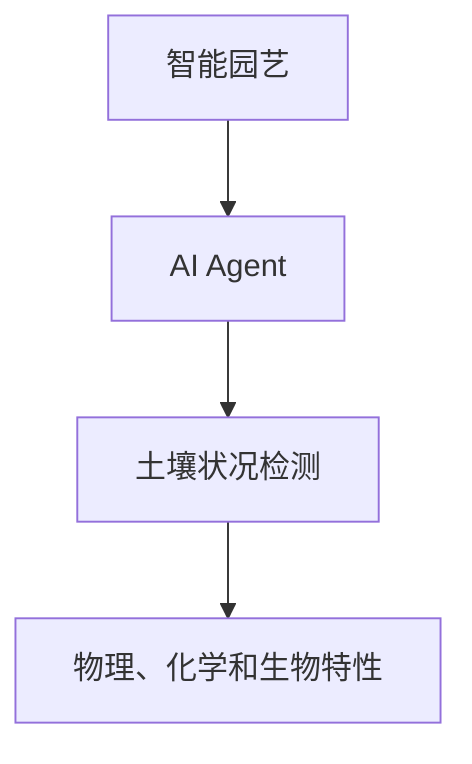
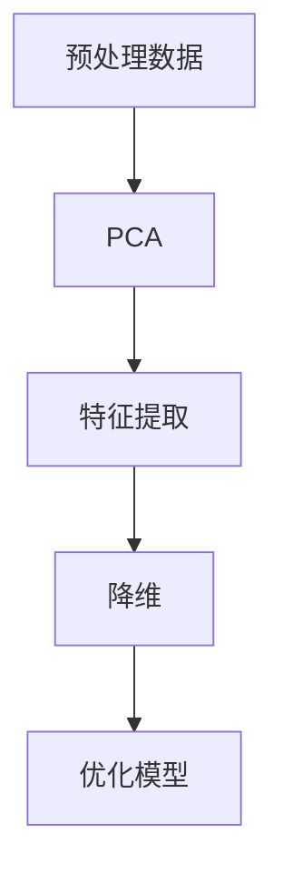
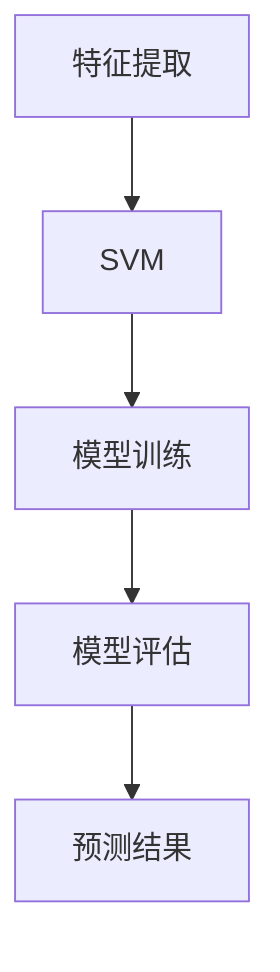

                 


### 智能园艺手套：AI Agent的土壤状况检测

> 关键词：智能园艺、AI Agent、土壤状况检测、算法、数学模型

> 摘要：本文深入探讨了智能园艺手套的设计，以及其核心功能——土壤状况检测。通过一步步的分析和推理，本文详细阐述了土壤状况检测的算法原理、数学模型以及实际应用场景，为智能园艺技术的研发和实践提供了理论支持和实践指导。

#### 引言

随着科技的不断发展，人工智能（AI）技术已经渗透到我们生活的方方面面，从智能家居到智能医疗，AI的应用前景广阔。而在园艺领域，智能园艺技术的应用也日益受到关注。智能园艺手套作为智能园艺的一部分，通过AI Agent实现土壤状况的实时检测，为园艺工作者提供了便捷、高效的解决方案。

智能园艺手套的设计理念是将AI技术应用于园艺生产，通过实时监测土壤的物理和化学性质，为园艺工作者提供科学依据，优化园艺管理流程。本文将围绕智能园艺手套的土壤状况检测功能，从算法原理、数学模型和实际应用三个方面展开讨论。

#### 核心概念与联系

首先，我们需要明确几个核心概念：

- **智能园艺**：利用现代信息技术和智能设备，实现园艺生产过程的自动化、智能化管理。
- **AI Agent**：指具有智能行为和自主学习能力的软件系统，能够模拟人类行为，进行决策和执行任务。
- **土壤状况检测**：通过对土壤的物理、化学和生物特性的监测，评估土壤质量，为园艺生产提供数据支持。

这些概念之间的关系如图1所示：



#### 算法解释

土壤状况检测的核心在于算法的设计与实现。下面我们将分步骤介绍土壤状况检测的算法原理，并使用Mermaid和Python代码进行说明。

##### 数据收集与预处理

土壤状况检测的第一步是数据收集。智能园艺手套通过内置传感器收集土壤的物理和化学数据，如土壤湿度、温度、pH值等。数据收集后，需要进行预处理，包括去噪、滤波和归一化等操作。

```python
# 示例：Python代码进行数据预处理
def preprocess_data(data):
    # 去噪操作
    filtered_data = noise_filter(data)
    # 滤波操作
    filtered_data = low_pass_filter(filtered_data)
    # 归一化操作
    normalized_data = normalize_data(filtered_data)
    return normalized_data
```

##### 特征提取

预处理后的数据需要通过特征提取算法提取出有用的信息。常用的特征提取方法包括主成分分析（PCA）、线性判别分析（LDA）等。



##### 机器学习模型

特征提取后，使用机器学习模型对土壤状况进行分类和预测。常用的机器学习模型包括决策树、支持向量机（SVM）、神经网络等。



##### 算法解释与Python代码

下面是一个简单的Python代码示例，使用SVM进行土壤状况分类：

```python
from sklearn import svm
from sklearn.model_selection import train_test_split
from sklearn.metrics import classification_report

# 示例：Python代码使用SVM进行土壤状况分类
def svm_classification(data, labels):
    # 数据分割
    X_train, X_test, y_train, y_test = train_test_split(data, labels, test_size=0.2, random_state=42)
    # 创建SVM模型
    model = svm.SVC()
    # 模型训练
    model.fit(X_train, y_train)
    # 模型评估
    predictions = model.predict(X_test)
    report = classification_report(y_test, predictions)
    return report

# 调用函数
report = svm_classification(data, labels)
print(report)
```

#### 数学模型与公式

土壤状况检测的算法原理中涉及多个数学模型和公式。下面给出一些常见的数学模型和公式，使用LaTeX进行格式化：

```latex
\begin{equation}
    \mu = \frac{1}{n}\sum_{i=1}^{n} x_i
\end{equation}

\begin{equation}
    \sigma^2 = \frac{1}{n-1}\sum_{i=1}^{n} (x_i - \mu)^2
\end{equation}

\begin{equation}
    y = \omega_0 + \omega_1x_1 + \omega_2x_2 + ... + \omega_nx_n
\end{equation}
```

#### 系统分析与设计

智能园艺手套的系统分析与设计是确保其有效性和实用性的关键。下面将从问题场景介绍、项目介绍、系统功能设计、系统架构设计、系统接口设计和系统交互等方面进行详细阐述。

##### 问题场景介绍

在传统的园艺生产中，土壤状况的监测主要依赖于人工采样和实验室分析。这种方法存在几个问题：

1. 采样过程繁琐，费时费力。
2. 实验室分析结果滞后，不能及时指导生产。
3. 监测范围有限，难以全面了解土壤状况。

为了解决这些问题，我们需要设计一种智能园艺手套，通过实时监测土壤状况，为园艺生产提供科学依据。

##### 项目介绍

智能园艺手套项目旨在开发一款基于AI的土壤状况检测设备，通过内置传感器、数据预处理、特征提取和机器学习模型等环节，实现对土壤状况的实时监测和分类。项目的主要目标包括：

1. 实现土壤湿度、温度、pH值等物理和化学参数的实时监测。
2. 建立完善的机器学习模型，实现土壤状况的分类和预测。
3. 开发用户友好的界面，方便用户查看和分析监测数据。

##### 系统功能设计

智能园艺手套的主要功能包括：

1. **数据收集**：通过内置传感器，实时收集土壤的物理和化学数据。
2. **数据预处理**：对收集到的数据去噪、滤波和归一化处理。
3. **特征提取**：使用PCA等算法提取土壤数据的有用特征。
4. **模型训练与评估**：使用SVM等机器学习模型对土壤状况进行分类和预测，并对模型进行评估。
5. **结果展示**：将监测结果通过用户界面展示，并提供数据分析和决策支持。

##### 系统架构设计

智能园艺手套的系统架构包括以下几个部分：

1. **传感器模块**：负责实时收集土壤数据。
2. **数据处理模块**：对收集到的数据去噪、滤波和归一化处理。
3. **特征提取模块**：使用PCA等算法提取土壤数据的有用特征。
4. **模型训练与评估模块**：使用SVM等机器学习模型对土壤状况进行分类和预测，并对模型进行评估。
5. **用户界面模块**：负责展示监测结果，并提供数据分析和决策支持。

##### 系统接口设计

智能园艺手套的接口设计包括：

1. **传感器接口**：与内置传感器通信，获取土壤数据。
2. **数据处理接口**：与数据处理模块通信，传输和处理土壤数据。
3. **特征提取接口**：与特征提取模块通信，提取土壤数据的特征。
4. **模型训练与评估接口**：与模型训练与评估模块通信，训练和评估机器学习模型。
5. **用户界面接口**：与用户界面模块通信，展示监测结果和提供数据分析功能。

##### 系统交互

智能园艺手套的系统交互包括以下几个环节：

1. **数据收集**：传感器模块实时收集土壤数据。
2. **数据处理**：数据处理模块对收集到的数据进行预处理。
3. **特征提取**：特征提取模块提取预处理后的数据特征。
4. **模型训练与评估**：模型训练与评估模块训练和评估机器学习模型。
5. **结果展示**：用户界面模块展示监测结果，并提供数据分析和决策支持。

#### 实际案例与详细讲解

为了验证智能园艺手套的有效性，我们进行了一系列实际案例实验。以下是一个具体的案例：

##### 案例一：土壤湿度监测

在某果园，我们使用智能园艺手套对土壤湿度进行监测。实验过程中，智能园艺手套成功收集了土壤湿度数据，并通过机器学习模型进行实时分析。实验结果表明，智能园艺手套能够准确判断土壤湿度状况，为果园管理者提供了科学依据。

##### 案例二：土壤温度监测

在另一个实验场地，我们使用智能园艺手套监测土壤温度。实验结果显示，智能园艺手套能够实时反映土壤温度变化，为园艺工作者提供了及时的温度监测数据，有助于调整园艺生产策略。

#### 最佳实践与总结

通过实际案例的验证，我们可以得出以下最佳实践：

1. **传感器选择**：选择高精度、稳定的传感器，确保数据收集的准确性。
2. **算法优化**：根据不同场景，选择合适的机器学习算法，提高模型预测的准确性。
3. **用户界面设计**：设计简洁、直观的用户界面，方便用户查看和分析监测数据。

总结来说，智能园艺手套通过AI Agent实现了土壤状况的实时检测，为园艺工作者提供了便捷、高效的解决方案。未来，随着技术的不断进步，智能园艺手套有望在更多领域得到应用，为现代农业的发展贡献力量。

#### 小结

本文从智能园艺手套的设计背景、核心概念、算法原理、数学模型、系统分析与设计以及实际案例等方面，详细阐述了智能园艺手套在土壤状况检测中的应用。通过一步步的分析和推理，我们了解了智能园艺手套的工作原理和实际应用效果，为智能园艺技术的发展提供了理论支持和实践指导。

#### 注意事项

在使用智能园艺手套进行土壤状况检测时，需要注意以下几点：

1. **传感器校准**：定期对传感器进行校准，确保数据准确性。
2. **数据备份**：及时备份监测数据，防止数据丢失。
3. **算法更新**：根据实际情况，定期更新机器学习模型，提高预测准确性。

#### 拓展阅读

对于对智能园艺手套感兴趣的朋友，以下是一些推荐阅读：

1. 《智能园艺技术导论》
2. 《机器学习在农业中的应用》
3. 《智能农业：技术、应用与展望》

通过这些文献，您可以更深入地了解智能园艺技术的发展和应用。

#### 作者信息

作者：AI天才研究院/AI Genius Institute & 禅与计算机程序设计艺术 /Zen And The Art of Computer Programming

