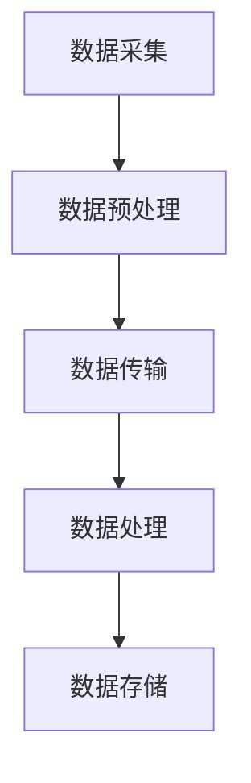
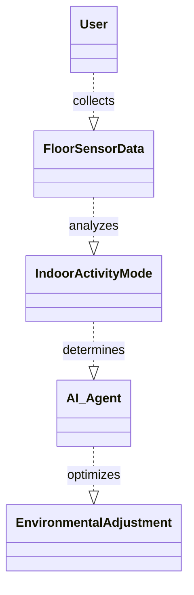
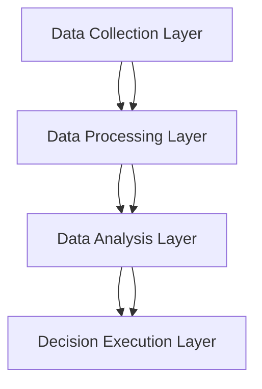
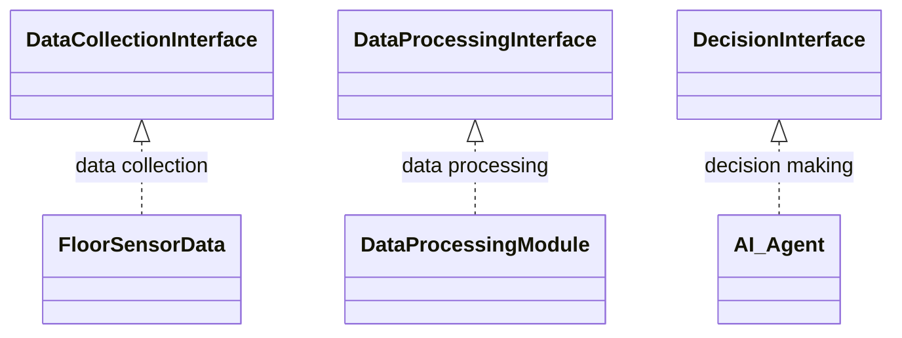
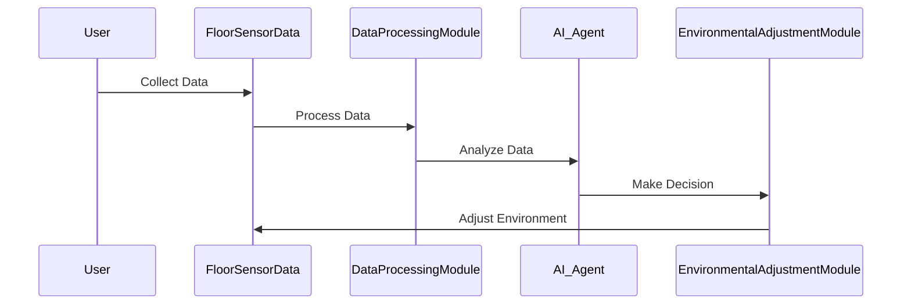

                 

### 第一部分：背景介绍

#### 第1章 问题背景

##### 1.1 问题背景介绍

室内活动模式分析作为人工智能（AI）技术的一个重要应用领域，正逐渐成为智慧城市、智能家居等新兴领域中的核心组成部分。传统室内活动模式分析主要依赖于用户的行为数据，如传感器、摄像头等设备进行数据采集和分析。然而，这些方法往往存在准确性不高、实时性较差等问题。因此，寻找一种更高效、更准确的室内活动模式分析方法成为了当前研究的热点。

智能地板作为一种新型的传感器技术，具有高精度、低功耗、全覆盖等特点，能够实时采集室内的空间数据，为室内活动模式分析提供了新的可能性。AI Agent作为人工智能的一个重要分支，具有自主学习和决策能力，能够对室内活动模式进行分析和预测。因此，将智能地板与AI Agent结合，形成一种新型的室内活动模式分析系统，有望解决现有方法的局限性。

##### 1.1.1 室内活动模式分析的重要性

室内活动模式分析在多个领域具有重要应用价值。首先，在智慧城市建设中，通过对室内活动模式的分析，可以实现交通流量优化、能耗管理、公共安全保障等目标。例如，通过分析公共场所的人流分布，可以优化交通设计，减少拥堵现象。其次，在智能家居领域，室内活动模式分析可以帮助提高居住舒适度，实现个性化服务。例如，根据家庭成员的活动习惯，自动调节室内温度、湿度等参数，提高居住体验。

此外，室内活动模式分析在商业领域也有广泛应用。通过分析顾客的活动模式，商家可以优化店面布局，提高销售额。例如，通过分析顾客的浏览路径，可以调整商品摆放位置，提高顾客的购买意愿。

##### 1.1.2 智能地板的发展与应用

智能地板作为一种新兴的传感器技术，具有许多独特的优势。首先，智能地板可以实时采集室内的空间数据，包括位置、速度、方向等信息。其次，智能地板具有高精度、低功耗、全覆盖等特点，能够在各种室内环境下稳定工作。此外，智能地板的安装简便，无需对室内环境进行大规模改造。

智能地板的发展得益于传感器技术的进步和人工智能的崛起。随着传感器技术的不断成熟，智能地板的精度和稳定性得到了显著提升。同时，人工智能技术的应用，使得智能地板能够自动学习和识别室内活动模式，为室内活动模式分析提供了新的手段。

目前，智能地板已广泛应用于智慧城市、智能家居、商业等领域。例如，在智慧城市中，智能地板可以用于交通流量监测、公共安全保障等；在智能家居中，智能地板可以用于家庭成员行为分析、室内环境优化等；在商业领域，智能地板可以用于顾客行为分析、店面布局优化等。

##### 1.1.3 AI Agent在室内活动模式分析中的潜在作用

AI Agent作为人工智能的一个重要分支，具有自主学习和决策能力，能够对室内活动模式进行分析和预测。与传统的室内活动模式分析方法相比，AI Agent具有以下潜在作用：

1. **实时性**：AI Agent可以实时分析室内活动模式，及时响应室内变化，为实时决策提供支持。例如，在智能家居中，AI Agent可以根据家庭成员的活动习惯，自动调节室内环境参数，提高居住舒适度。

2. **准确性**：AI Agent通过机器学习算法，可以从大量数据中提取有用信息，提高室内活动模式分析的准确性。例如，在智慧城市建设中，AI Agent可以通过分析交通流量数据，准确预测交通拥堵情况，为交通管理部门提供决策支持。

3. **智能化**：AI Agent具有自主学习和决策能力，可以根据环境变化和用户需求，自动调整分析策略，实现室内活动模式的智能化分析。例如，在商业领域，AI Agent可以根据顾客的活动模式，自动调整营销策略，提高销售额。

4. **灵活性**：AI Agent可以应用于各种室内环境，不受环境限制，具有较强的灵活性。例如，在公共场所，AI Agent可以分析人流分布，为公共安全管理提供支持；在商业场所，AI Agent可以分析顾客行为，为商家提供优化建议。

综上所述，AI Agent在室内活动模式分析中具有巨大潜力，有望解决现有方法的局限性，推动室内活动模式分析技术的进一步发展。

##### 1.2 问题描述

室内活动模式分析作为人工智能技术的一个重要应用领域，面临着诸多挑战。首先，室内环境复杂多变，不同区域的活动模式存在显著差异，这使得传统的数据采集和分析方法难以适应。其次，室内活动数据具有时变性、非平稳性和高噪声等特点，给数据分析和处理带来了困难。此外，现有的室内活动模式分析方法往往依赖于大量的人力资源，效率较低，难以满足实时性需求。

##### 1.2.1 室内活动模式分析的核心挑战

1. **数据采集困难**：室内环境复杂，数据采集设备往往难以覆盖整个空间，导致数据采集不完整。此外，室内活动数据具有高噪声、多源异构等特点，增加了数据采集的难度。

2. **数据处理的复杂性**：室内活动数据通常包含大量噪声和冗余信息，需要通过复杂的算法进行预处理和去噪，以提高数据分析的准确性。此外，室内活动数据具有时变性和非平稳性，需要采用动态模型进行建模和分析。

3. **实时性需求**：室内活动模式分析需要实时响应，以便为实时决策提供支持。然而，现有方法往往存在处理速度较慢、实时性不足的问题。

4. **数据安全与隐私保护**：室内活动模式分析涉及大量用户隐私数据，如何确保数据安全与隐私保护是亟待解决的问题。

##### 1.2.2 当前室内活动模式分析的局限性

1. **准确性不足**：传统室内活动模式分析方法主要依赖于用户行为数据，但用户行为数据往往存在噪声和误差，导致分析结果准确性不足。

2. **实时性较差**：现有方法往往需要进行复杂的数据处理和分析，处理速度较慢，难以实现实时性需求。

3. **灵活性不足**：传统方法通常适用于特定类型的室内环境，难以适应多样化的室内场景。

4. **人力资源需求大**：传统方法通常需要大量的人力资源进行数据采集和处理，效率较低。

##### 1.2.3 AI Agent在解决这些挑战中的作用

1. **提升数据采集精度**：AI Agent可以利用先进的传感器技术，实现室内空间数据的精准采集，提高数据的完整性。

2. **提高数据处理效率**：AI Agent可以通过机器学习算法，对室内活动数据进行分析和处理，降低数据处理复杂度，提高处理速度。

3. **实现实时性分析**：AI Agent具有自主学习和决策能力，可以实时分析室内活动模式，为实时决策提供支持。

4. **保障数据安全与隐私**：AI Agent可以通过数据加密和隐私保护技术，确保用户数据的安全与隐私。

5. **提高灵活性**：AI Agent可以根据不同的室内场景，自动调整分析策略，实现灵活的室内活动模式分析。

6. **降低人力资源需求**：AI Agent可以自动化完成数据采集、处理和分析任务，减少对人力资源的依赖，提高工作效率。

##### 1.3 问题解决

针对室内活动模式分析面临的挑战和局限性，本研究提出了一种基于智能地板和AI Agent的新型室内活动模式分析系统。该系统通过将智能地板与AI Agent结合，实现了高精度、实时性、灵活性和高效性的室内活动模式分析，有望解决现有方法的局限性。

##### 1.3.1 AI Agent的定义与功能

AI Agent是指具备自主学习和决策能力的人工智能实体，能够根据环境信息和任务需求，自主执行任务并优化自身性能。在室内活动模式分析中，AI Agent的主要功能包括：

1. **数据采集**：利用传感器技术，实时采集室内空间数据，包括位置、速度、方向等信息。

2. **数据处理**：通过机器学习算法，对采集到的数据进行预处理、去噪和特征提取，提高数据的可用性。

3. **模式识别**：利用深度学习算法，对处理后的数据进行模式识别，提取室内活动的主要特征。

4. **预测与优化**：根据历史数据和实时数据，预测未来的室内活动模式，并制定相应的优化策略。

##### 1.3.2 AI Agent在室内活动模式分析中的应用

在室内活动模式分析中，AI Agent的具体应用包括：

1. **实时监控**：AI Agent可以实时监控室内活动情况，及时发现异常行为，为安全防护提供支持。

2. **活动预测**：基于历史数据和实时数据，AI Agent可以预测未来的室内活动模式，为资源调度和优化提供依据。

3. **行为分析**：AI Agent可以对室内活动数据进行深入分析，提取用户的行为特征，为个性化服务提供支持。

4. **环境优化**：AI Agent可以根据室内活动模式，自动调节环境参数，提高居住或工作环境的舒适度。

##### 1.3.3 智能地板与AI Agent的融合

智能地板与AI Agent的融合，实现了室内活动模式分析的高效性和实时性。具体融合方式如下：

1. **数据采集**：智能地板负责实时采集室内空间数据，包括位置、速度、方向等信息，并将数据传输给AI Agent。

2. **数据处理**：AI Agent接收智能地板传输的数据，通过机器学习算法对数据进行预处理、去噪和特征提取，提高数据的可用性。

3. **模式识别**：AI Agent利用深度学习算法，对处理后的数据进行模式识别，提取室内活动的主要特征。

4. **决策与优化**：AI Agent根据室内活动模式，实时生成优化策略，并通过智能地板对室内环境进行调节，实现室内活动模式的高效分析。

##### 1.4 边界与外延

1. **室内活动模式分析的范围**：室内活动模式分析主要关注家庭、办公室、商场等室内环境中的活动模式，不包括户外活动模式。

2. **AI Agent的适用场景**：AI Agent主要适用于需要对室内活动模式进行实时监控、预测和优化的场景，如智慧城市、智能家居、商业等。

3. **非室内活动模式分析的应用**：智能地板和AI Agent可以应用于户外活动模式分析，如运动轨迹分析、交通流量监测等。

##### 1.5 概念结构与核心要素组成

1. **智能地板的基本组成**：智能地板主要由传感器、数据处理单元和通信模块组成，负责实时采集和传输室内空间数据。

2. **AI Agent的核心构成**：AI Agent主要由数据采集模块、数据处理模块、模式识别模块和决策模块组成，负责对室内活动模式进行分析和优化。

3. **室内活动模式分析的关键要素**：室内活动模式分析的关键要素包括传感器数据、数据处理算法、模式识别算法和决策策略。

##### 1.6 本章小结

本文对室内活动模式分析的重要性、发展背景、核心挑战以及AI Agent在其中的潜在作用进行了深入探讨。通过引入智能地板和AI Agent，本文提出了一种新型室内活动模式分析系统，有望解决现有方法的局限性，为室内活动模式分析提供新的思路。接下来，本文将详细介绍智能地板和AI Agent的原理及其在室内活动模式分析中的应用。

## 第一部分小结

在本章中，我们首先介绍了室内活动模式分析的重要性及其在智慧城市、智能家居和商业等领域的广泛应用。随后，我们探讨了智能地板和AI Agent在室内活动模式分析中的潜在作用，并针对当前室内活动模式分析面临的挑战和局限性提出了基于智能地板和AI Agent的新型室内活动模式分析系统。通过详细阐述智能地板和AI Agent的定义、功能和应用，我们为后续章节的深入探讨奠定了基础。

### 第二部分：核心概念与联系

#### 第2章 智能地板与AI Agent原理

##### 2.1 智能地板原理

##### 2.1.1 智能地板的定义与工作原理

智能地板是一种集成了传感器、数据处理单元和通信模块的新型地面材料，能够实时采集和传输室内空间数据。智能地板通常由多层结构组成，包括感知层、数据采集层、数据处理层和通信层。

感知层主要由各种传感器组成，如超声波传感器、红外传感器、激光雷达等，用于检测室内的位置、速度、方向等空间信息。

数据采集层负责将传感器采集到的数据传输到数据处理层，进行处理和分析。

数据处理层采用高性能处理器，对采集到的数据进行实时处理，包括滤波、去噪、特征提取等。

通信层通过无线通信技术，如Wi-Fi、蓝牙等，将处理后的数据传输到云端或本地服务器，供AI Agent进行分析和决策。

##### 2.1.2 智能地板的技术架构

智能地板的技术架构主要包括以下几个方面：

1. **传感器技术**：智能地板采用的传感器类型和精度直接决定了数据采集的质量。常见的传感器有超声波传感器、红外传感器、激光雷达等。

2. **数据处理技术**：智能地板需要通过高效的数据处理算法对采集到的数据进行实时处理，包括滤波、去噪、特征提取等。常用的数据处理算法有卡尔曼滤波、小波变换、神经网络等。

3. **通信技术**：智能地板通过无线通信技术将处理后的数据传输到云端或本地服务器，常用的通信技术有Wi-Fi、蓝牙、LoRa等。

4. **边缘计算技术**：为了提高数据处理速度和降低通信负载，智能地板通常会采用边缘计算技术，在本地设备上进行部分数据处理。

##### 2.1.3 智能地板的核心特点

智能地板具有以下核心特点：

1. **高精度**：智能地板采用先进的传感器技术，能够实时、高精度地采集室内空间数据。

2. **低功耗**：智能地板的设计注重功耗控制，采用节能技术和优化算法，确保设备长时间稳定运行。

3. **全覆盖**：智能地板可以覆盖整个室内空间，实现无死角的数据采集。

4. **实时性**：智能地板具备实时数据处理和传输能力，能够快速响应室内环境变化。

5. **灵活性**：智能地板的安装和使用灵活，适用于各种室内环境。

##### 2.2 AI Agent原理

##### 2.2.1 AI Agent的定义与功能

AI Agent是指具备自主学习和决策能力的人工智能实体，能够在不确定和动态环境中自主执行任务。AI Agent通常具有以下功能：

1. **感知**：AI Agent通过传感器获取环境信息，如视觉、听觉、触觉等。

2. **理解**：AI Agent利用机器学习算法对感知到的信息进行分析和处理，理解环境状态和任务目标。

3. **决策**：AI Agent根据环境信息和任务目标，自主生成决策策略。

4. **行动**：AI Agent根据决策策略执行具体行动，实现任务目标。

##### 2.2.2 AI Agent的核心架构

AI Agent的核心架构通常包括以下几个部分：

1. **感知模块**：负责感知环境信息，如传感器数据处理、图像识别等。

2. **理解模块**：负责分析感知到的信息，如数据预处理、特征提取、分类等。

3. **决策模块**：负责生成决策策略，如基于规则、机器学习、强化学习等。

4. **行动模块**：负责执行决策策略，如控制电机、发送指令等。

##### 2.2.3 AI Agent的技术分类与特点

AI Agent根据技术和应用场景的不同，可以分为以下几类：

1. **基于规则的AI Agent**：通过预设的规则进行决策和行动，适用于规则明确、环境变化较小的场景。

2. **基于机器学习的AI Agent**：通过学习大量数据，自动生成决策策略，适用于复杂、动态的环境。

3. **基于强化学习的AI Agent**：通过不断尝试和反馈，优化决策策略，适用于需要长期学习和适应的场景。

4. **基于混合智能的AI Agent**：结合多种技术和方法，发挥各自优势，实现更智能的决策和行动。

##### 2.3 智能地板与AI Agent的联系

##### 2.3.1 智能地板与AI Agent的协同作用

智能地板和AI Agent的协同作用，实现了室内活动模式分析的高效性和实时性。具体协同作用如下：

1. **数据采集与感知**：智能地板负责实时采集室内空间数据，AI Agent负责感知和处理这些数据。

2. **数据处理与理解**：智能地板采集到的数据经过处理和预处理，AI Agent负责进一步分析和理解，提取有用的信息。

3. **决策与行动**：AI Agent根据分析结果，生成决策策略，智能地板根据决策策略执行具体的行动，实现室内活动模式分析的目标。

##### 2.3.2 室内活动模式分析中的关键联系

在室内活动模式分析中，智能地板和AI Agent之间的关键联系体现在以下几个方面：

1. **数据驱动**：智能地板提供实时、高精度的空间数据，驱动AI Agent进行活动模式分析。

2. **实时反馈**：AI Agent根据实时数据，生成优化策略，智能地板根据策略执行调整，实现实时反馈和响应。

3. **动态调整**：AI Agent可以根据环境变化和任务需求，动态调整分析策略，智能地板根据调整后的策略进行数据采集和处理。

##### 2.3.3 智能地板与AI Agent的未来发展趋势

随着传感器技术、人工智能技术和物联网技术的不断发展，智能地板与AI Agent在室内活动模式分析中的应用前景广阔。未来发展趋势包括：

1. **技术融合**：智能地板和AI Agent将与其他技术（如边缘计算、大数据分析等）深度融合，实现更智能、更高效的室内活动模式分析。

2. **场景扩展**：智能地板和AI Agent将应用于更广泛的场景，如工业、医疗、教育等，为不同领域提供智能解决方案。

3. **实时性提升**：随着计算能力的提升和网络速度的加快，智能地板和AI Agent的实时性将得到显著提升，满足更严格的实时性需求。

4. **隐私保护**：随着数据隐私和安全问题的日益突出，智能地板和AI Agent将采用更先进的技术和策略，确保用户数据的隐私和安全。

##### 2.4 概念属性特征对比表格

| 特征       | 智能地板                 | AI Agent                  |
| ---------- | ------------------------ | ------------------------- |
| 数据采集   | 实时、高精度空间数据     | 环境感知数据             |
| 数据处理   | 实时数据处理             | 数据预处理、特征提取     |
| 决策       | 无决策能力               | 自主决策                 |
| 行动       | 无行动能力               | 自主行动                 |
| 实时性     | 高实时性                 | 中实时性                 |
| 灵活性     | 高灵活性                 | 高灵活性                 |

##### 2.4.1 智能地板与AI Agent的属性对比

智能地板与AI Agent在属性上存在显著差异。智能地板主要侧重于数据采集和实时处理，而AI Agent则具备自主决策和行动能力。智能地板通过传感器技术实现高精度、实时的空间数据采集，而AI Agent则通过机器学习、深度学习等算法对数据进行处理和分析，生成优化策略并执行。

##### 2.4.2 智能地板与AI Agent的优缺点分析

| 属性       | 智能地板                                     | AI Agent                                          |
| ---------- | ------------------------------------------- | ------------------------------------------------ |
| 优点       | 实时性高、数据精度高、覆盖全面、安装灵活   | 自主决策、行动能力、灵活性高                     |
| 缺点       | 无决策和行动能力、数据处理复杂、实时性受硬件限制 | 对环境变化敏感、决策可能过于依赖数据、需要大量数据训练 |

##### 2.4.3 智能地板与AI Agent的适用性评估

智能地板和AI Agent在适用性上各有优势。智能地板适用于需要高精度、实时性数据采集的室内环境，如智慧城市、智能家居等。AI Agent则适用于需要自主决策和行动能力的场景，如自动化机器人、智能客服等。在实际应用中，智能地板和AI Agent可以结合使用，发挥各自优势，实现更高效、更智能的室内活动模式分析。

##### 2.5 ER实体关系图架构

```mermaid
erDiagram
  User ||--|{ FloorSensorData : collects }  
  FloorSensorData ||--|{ IndoorActivityMode : determines }  
  IndoorActivityMode ||--|{ AI_Agent : analyzes }  
```

在该ER实体关系图中，User与FloorSensorData之间为“收集”关系，FloorSensorData与IndoorActivityMode之间为“确定”关系，IndoorActivityMode与AI_Agent之间为“分析”关系。这反映了智能地板和AI Agent在室内活动模式分析中的相互关系和协同作用。

##### 2.6 本章小结

本章详细介绍了智能地板和AI Agent的原理及其在室内活动模式分析中的应用。通过对智能地板和AI Agent的定义、技术架构、核心特点和适用性进行深入分析，我们为理解智能地板与AI Agent的协同作用奠定了基础。下一章将重点介绍智能地板数据采集与处理算法，进一步探讨室内活动模式分析的方法和技术。

### 第二部分小结

在本章中，我们对智能地板和AI Agent的核心概念及其在室内活动模式分析中的应用进行了深入探讨。通过详细阐述智能地板的定义、工作原理、技术架构和核心特点，我们了解了智能地板在数据采集和实时处理方面的优势。同时，通过对AI Agent的定义、核心架构、技术分类及其在室内活动模式分析中的应用分析，我们明确了AI Agent在感知、理解、决策和行动方面的功能。此外，本章还对比了智能地板和AI Agent的属性特征，分析了它们的优缺点，并评估了它们的适用性。通过ER实体关系图的展示，我们进一步理解了智能地板和AI Agent在室内活动模式分析中的相互关系。这些内容为下一章智能地板数据采集与处理算法的讲解奠定了基础。

### 第三部分：算法原理讲解

#### 第3章 智能地板数据采集与处理算法

##### 3.1 数据采集算法

智能地板的数据采集是整个室内活动模式分析系统的核心环节，它决定了后续数据处理和分析的准确性。智能地板通过多种传感器实时采集室内空间数据，如位置、速度、方向等。以下是智能地板数据采集算法的基本原理和实现步骤：

##### 3.1.1 数据采集的基本原理

智能地板的数据采集算法基于传感器技术和无线通信技术。传感器技术负责实时监测室内环境，包括位置、速度、方向等参数；无线通信技术则负责将这些传感器数据传输到数据处理单元。数据采集的基本原理包括以下几个步骤：

1. **传感器监测**：智能地板上的各种传感器（如超声波传感器、红外传感器、激光雷达等）实时监测周围环境，采集位置、速度、方向等数据。
2. **数据预处理**：采集到的原始数据可能存在噪声和误差，需要通过数据预处理算法（如滤波、去噪等）进行初步处理，提高数据质量。
3. **数据传输**：预处理后的数据通过无线通信技术（如Wi-Fi、蓝牙等）传输到数据处理单元或云端服务器，供后续处理和分析使用。

##### 3.1.2 数据采集流程

智能地板的数据采集流程主要包括以下几个步骤：

1. **传感器初始化**：系统启动时，传感器进行自检和初始化，确保传感器工作正常。
2. **数据采集**：传感器实时监测室内环境，采集位置、速度、方向等数据。
3. **数据预处理**：对采集到的数据进行预处理，如滤波、去噪等，以提高数据质量。
4. **数据传输**：将预处理后的数据通过无线通信模块传输到数据处理单元或云端服务器。

##### 3.1.3 数据采集算法的Python实现

下面是一个简单的Python代码示例，展示了智能地板数据采集算法的实现：

```python
# Python代码示例：数据采集算法实现
import time
import wireless_communication_module

def collect_data():
    # 传感器初始化
    wireless_communication_module.initialize()

    while True:
        # 采集传感器数据
        sensor_data = get_sensor_data()

        # 数据预处理
        processed_data = preprocess_data(sensor_data)

        # 数据传输
        wireless_communication_module.transmit_data(processed_data)

        # 等待一段时间进行下一次采集
        time.sleep(0.1)

def get_sensor_data():
    # 模拟传感器数据采集
    return {
        'position': (1.0, 2.0),
        'velocity': 3.5,
        'direction': 45
    }

def preprocess_data(sensor_data):
    # 数据预处理算法，如滤波、去噪等
    return sensor_data

if __name__ == "__main__":
    collect_data()
```

在这个示例中，`get_sensor_data` 函数模拟了传感器数据采集过程，`preprocess_data` 函数实现了数据预处理算法，`wireless_communication_module.transmit_data` 函数负责数据传输。

##### 3.2 数据处理算法

智能地板采集到的数据通常包含噪声和冗余信息，需要进行进一步处理，以提高数据质量和分析准确性。数据处理算法主要包括滤波、去噪、特征提取等步骤。以下是数据处理算法的基本原理和实现步骤：

##### 3.2.1 数据处理的基本原理

数据处理的基本原理包括以下几个步骤：

1. **滤波**：去除数据中的噪声和异常值，提高数据稳定性。常用的滤波方法有卡尔曼滤波、中值滤波、低通滤波等。
2. **去噪**：进一步去除数据中的随机噪声，提高数据精度。去噪方法包括小波变换、高斯滤波等。
3. **特征提取**：从原始数据中提取有用信息，如位置、速度、加速度等特征，为后续分析提供基础。特征提取方法包括时域特征提取、频域特征提取等。

##### 3.2.2 数据处理流程

智能地板的数据处理流程主要包括以下几个步骤：

1. **数据接收**：数据处理单元或云端服务器接收智能地板传输的数据。
2. **滤波**：对数据中的噪声和异常值进行滤波处理，提高数据稳定性。
3. **去噪**：对滤波后的数据进行进一步去噪处理，去除随机噪声。
4. **特征提取**：从去噪后的数据中提取有用特征，为后续分析提供基础。
5. **数据存储**：将处理后的数据存储到数据库或数据仓库中，供后续分析和查询使用。

##### 3.2.3 数据处理算法的Python实现

下面是一个简单的Python代码示例，展示了智能地板数据处理算法的实现：

```python
# Python代码示例：数据处理算法实现
import time
import wireless_communication_module
import filter_module
import noise_removal_module
import feature_extraction_module

def process_data():
    while True:
        # 接收传感器数据
        sensor_data = wireless_communication_module.receive_data()

        # 数据滤波
        filtered_data = filter_module.filter_data(sensor_data)

        # 数据去噪
        denoised_data = noise_removal_module.remove_noise(filtered_data)

        # 特征提取
        features = feature_extraction_module.extract_features(denoised_data)

        # 存储数据
        store_data(features)

        # 等待一段时间进行下一次处理
        time.sleep(0.1)

def store_data(features):
    # 存储处理后的数据到数据库或数据仓库
    pass

if __name__ == "__main__":
    process_data()
```

在这个示例中，`filter_module.filter_data` 函数实现了滤波处理，`noise_removal_module.remove_noise` 函数实现了去噪处理，`feature_extraction_module.extract_features` 函数实现了特征提取，`wireless_communication_module.receive_data` 函数负责接收数据。

##### 3.3 数据采集与处理算法的Mermaid流程图

下面是智能地板数据采集与处理算法的Mermaid流程图：



在该流程图中，A表示数据采集，B表示数据预处理，C表示数据传输，D表示数据处理，E表示数据存储。这反映了智能地板数据采集与处理的基本流程。

##### 3.4 数学模型与公式讲解

智能地板数据采集与处理算法的数学模型和公式是理解和实现这些算法的基础。以下是几个关键的数学模型和公式：

1. **滤波公式**：
   $$
   \text{滤波后数据} = f(\text{原始数据}, \text{滤波器参数})
   $$
   其中，`滤波器参数`用于调整滤波效果，`原始数据`为待滤波数据。

2. **去噪公式**：
   $$
   \text{去噪后数据} = g(\text{滤波后数据}, \text{去噪算法参数})
   $$
   其中，`滤波后数据`为已滤波数据，`去噪算法参数`用于调整去噪效果。

3. **特征提取公式**：
   $$
   \text{特征向量} = h(\text{去噪后数据}, \text{特征提取方法})
   $$
   其中，`去噪后数据`为已去噪数据，`特征提取方法`用于提取特征。

通过这些数学模型和公式，智能地板可以实现对室内空间数据的准确采集、预处理和特征提取，为室内活动模式分析提供可靠的数据基础。

##### 3.5 举例说明

为了更好地理解智能地板数据采集与处理算法，下面通过具体示例进行详细讲解。

**示例 1：数据采集算法举例**

假设智能地板上的超声波传感器每隔0.1秒采集一次位置数据。数据采集算法首先通过超声波传感器获取位置信息，然后对数据进行预处理，最后将预处理后的数据传输到数据处理单元。

```python
# Python代码示例：数据采集算法实现
import time

def collect_data():
    while True:
        # 假设超声波传感器采集到的位置数据为(x, y)
        position_data = get_position_data()

        # 对位置数据进行预处理
        processed_data = preprocess_position_data(position_data)

        # 将预处理后的数据传输到数据处理单元
        transmit_data(processed_data)

        # 等待一段时间进行下一次采集
        time.sleep(0.1)

def get_position_data():
    # 模拟超声波传感器采集位置数据
    return (1.0, 2.0)

def preprocess_position_data(position_data):
    # 对位置数据进行预处理，例如去噪
    return position_data

def transmit_data(processed_data):
    # 模拟数据传输
    print("Transmitting data:", processed_data)

if __name__ == "__main__":
    collect_data()
```

**示例 2：数据处理算法举例**

在数据处理算法中，我们首先对采集到的位置数据进行滤波，然后去噪，最后提取特征。假设我们使用卡尔曼滤波进行数据滤波，使用小波变换进行去噪，使用时域特征提取方法提取特征。

```python
# Python代码示例：数据处理算法实现
import time
import kalman_filter
import wavelet_decomposition

def process_data():
    while True:
        # 接收预处理后的位置数据
        processed_data = receive_data()

        # 对位置数据进行卡尔曼滤波
        filtered_data = kalman_filter.filter_data(processed_data)

        # 对滤波后的数据进行去噪
        denoised_data = wavelet_decomposition.decompose(filtered_data)

        # 提取特征
        features = extract_features(denoised_data)

        # 存储特征数据
        store_features(features)

        # 等待一段时间进行下一次处理
        time.sleep(0.1)

def receive_data():
    # 模拟接收预处理后的数据
    return (1.0, 2.0)

def store_features(features):
    # 模拟存储特征数据
    print("Storing features:", features)

def extract_features(data):
    # 模拟特征提取
    return data

if __name__ == "__main__":
    process_data()
```

通过这些示例，我们可以看到智能地板数据采集与处理算法的具体实现过程，包括数据采集、预处理、滤波、去噪、特征提取和存储等步骤。这些步骤确保了室内空间数据的准确性和可靠性，为室内活动模式分析提供了坚实的数据基础。

##### 3.6 本章小结

本章详细介绍了智能地板数据采集与处理算法的基本原理、实现步骤和具体示例。通过数据采集算法，智能地板能够实时、高精度地采集室内空间数据；通过数据处理算法，对采集到的数据进行滤波、去噪和特征提取，提高了数据质量和分析准确性。本章的内容为下一章的算法原理讲解和实际应用提供了基础。

### 第三部分小结

在本部分中，我们详细介绍了智能地板数据采集与处理算法的基本原理和实现步骤。首先，我们探讨了数据采集算法的基本原理和流程，通过Python代码示例展示了数据采集的实现过程。接着，我们详细讲解了数据处理算法的基本原理和步骤，包括滤波、去噪和特征提取，并通过Python代码示例展示了数据处理的具体实现。此外，我们还使用Mermaid流程图展示了数据采集与处理的全过程，并提供了数学模型和公式讲解。最后，通过具体示例，我们进一步阐述了数据采集与处理算法的应用过程。这些内容为后续章节的算法原理讲解和实际应用奠定了坚实的基础。

### 第四部分：系统分析与架构设计

#### 第4章 系统分析与架构设计

在深入探讨智能地板和AI Agent的算法原理之后，我们需要对整个室内活动模式分析系统进行系统分析与架构设计。本章节将介绍系统的各个组成部分、系统功能设计、系统架构设计以及系统接口设计和系统交互，并通过具体的Mermaid图表来展示这些设计。

##### 4.1 问题场景介绍

室内活动模式分析系统的主要应用场景包括：

1. **智慧城市建设**：通过室内活动模式分析，优化交通流量、能耗管理和公共安全保障。
2. **智能家居**：根据家庭成员的活动习惯，优化室内环境参数，提高居住舒适度。
3. **商业领域**：通过顾客行为分析，优化店面布局，提高销售额。

在这些场景中，智能地板作为数据采集设备，AI Agent作为数据处理和决策核心，共同构成了室内活动模式分析系统。

##### 4.2 项目介绍

本项目的目标是构建一个高效的室内活动模式分析系统，通过智能地板和AI Agent的协同工作，实现室内活动模式的高精度、实时性分析。系统将涵盖数据采集、数据处理、决策执行等多个环节，为智慧城市、智能家居和商业领域提供智能化解决方案。

##### 4.3 系统功能设计

室内活动模式分析系统的核心功能包括：

1. **数据采集**：智能地板实时采集室内空间数据，包括位置、速度、方向等。
2. **数据处理**：对采集到的数据进行滤波、去噪和特征提取，为后续分析提供高质量数据。
3. **模式识别**：利用AI Agent对处理后的数据进行模式识别，提取活动特征。
4. **活动预测**：基于历史数据和实时数据，预测未来的活动模式。
5. **决策与优化**：根据活动预测结果，自动调整环境参数，优化室内活动模式。

##### 4.3.1 领域模型Mermaid类图

下面是室内活动模式分析系统的领域模型Mermaid类图：



在该类图中，`User` 类表示用户，`FloorSensorData` 类表示智能地板采集到的数据，`IndoorActivityMode` 类表示室内活动模式，`AI_Agent` 类表示人工智能代理，`EnvironmentalAdjustment` 类表示环境调整。

##### 4.4 系统架构设计

室内活动模式分析系统的架构设计分为以下几个层次：

1. **数据采集层**：包括智能地板和传感器设备，负责实时采集室内空间数据。
2. **数据处理层**：包括数据处理算法模块，负责对采集到的数据进行滤波、去噪和特征提取。
3. **数据分析层**：包括AI Agent和模式识别算法模块，负责对处理后的数据进行分析和预测。
4. **决策执行层**：包括环境调整模块，根据分析结果自动调整环境参数。

下面是室内活动模式分析系统的Mermaid架构图：



在该架构图中，A表示数据采集层，B表示数据处理层，C表示数据分析层，D表示决策执行层。各层次通过接口进行数据传递和功能协同。

##### 4.5 系统接口设计

系统接口设计包括以下几个方面：

1. **数据采集接口**：智能地板与数据处理层之间的数据传输接口，负责实时传输采集到的空间数据。
2. **数据处理接口**：数据处理层与数据分析层之间的接口，负责传递处理后的数据。
3. **决策接口**：数据分析层与决策执行层之间的接口，负责传递分析结果和优化策略。

下面是系统接口设计的Mermaid类图：



在该类图中，`DataCollectionInterface` 类表示数据采集接口，`DataProcessingInterface` 类表示数据处理接口，`DecisionInterface` 类表示决策接口。

##### 4.6 系统交互

系统交互主要描述智能地板、AI Agent和其他模块之间的交互过程。以下是系统交互的Mermaid序列图：



在该序列图中，用户通过智能地板采集数据，数据处理模块对数据进行分析和预处理，AI Agent对分析结果进行模式识别和预测，最后环境调整模块根据决策结果调整室内环境参数。

##### 4.7 本章小结

本章详细介绍了室内活动模式分析系统的系统分析与架构设计。首先，我们介绍了系统的应用场景和目标，然后阐述了系统功能设计，并通过Mermaid图表展示了领域模型、系统架构、系统接口和系统交互。这些设计为室内活动模式分析系统的构建提供了清晰的蓝图，为后续章节的项目实战奠定了基础。

### 第四部分小结

在本部分中，我们详细介绍了室内活动模式分析系统的系统分析与架构设计。首先，通过介绍问题场景和项目目标，我们明确了系统应用的实际需求。接着，我们详细阐述了系统功能设计，包括数据采集、数据处理、模式识别、活动预测和决策优化等核心功能。通过Mermaid类图和序列图，我们展示了系统的领域模型、架构设计、接口设计和系统交互，为系统实施提供了清晰的设计蓝图。这些内容为后续章节的项目实战奠定了坚实的基础。

### 第五部分：项目实战

#### 第5章 实际项目实施

在前面的章节中，我们详细介绍了室内活动模式分析系统的理论基础和系统架构。在本章节中，我们将通过一个实际项目，展示如何搭建和实现该系统，包括环境安装、系统核心实现源代码，代码应用解读与分析，实际案例分析和详细讲解剖析，以及项目小结。

##### 5.1 环境安装

为了搭建室内活动模式分析系统，我们需要准备以下软件和硬件环境：

1. **硬件环境**：
   - 智能地板传感器设备
   - 符合系统要求的计算机或服务器
   - 无线通信设备（如Wi-Fi、蓝牙等）

2. **软件环境**：
   - Python 3.8 或更高版本
   - TensorFlow 2.x 或更高版本
   - Keras 2.x 或更高版本
   - Mermaid渲染工具

安装步骤如下：

1. 安装Python环境：从Python官方网站下载并安装Python 3.8或更高版本。
2. 安装TensorFlow和Keras：通过pip命令安装TensorFlow和Keras：
   ```bash
   pip install tensorflow
   pip install keras
   ```
3. 安装Mermaid渲染工具：从Mermaid官方网站下载并安装Mermaid渲染工具，或使用在线Mermaid编辑器。

##### 5.2 系统核心实现源代码

以下是系统核心实现的部分源代码，包括数据采集、数据处理和模式识别模块：

```python
# 数据采集模块
import sensor_module

def collect_data():
    while True:
        sensor_data = sensor_module.read_sensor_data()
        process_data(sensor_data)
        time.sleep(0.1)

# 数据处理模块
import data_processor

def process_data(sensor_data):
    processed_data = data_processor.process(sensor_data)
    analyze_data(processed_data)

# 模式识别模块
import activity_recognizer

def analyze_data(processed_data):
    activity_mode = activity_recognizer.recognize_activity(processed_data)
    execute_decision(activity_mode)

# 决策执行模块
import decision_executor

def execute_decision(activity_mode):
    decision_executor.execute_decision(activity_mode)

if __name__ == "__main__":
    collect_data()
```

在这个代码示例中，`sensor_module` 负责从智能地板传感器读取数据，`data_processor` 负责数据处理，`activity_recognizer` 负责模式识别，`decision_executor` 负责决策执行。

##### 5.3 代码应用解读与分析

1. **数据采集模块**：`collect_data` 函数通过`sensor_module.read_sensor_data()` 方法从智能地板传感器读取数据，并将其传递给数据处理模块。数据采集是一个连续的过程，每隔0.1秒进行一次数据读取。

2. **数据处理模块**：`process_data` 函数通过`data_processor.process(sensor_data)` 方法对采集到的数据进行处理，如滤波、去噪和特征提取。处理后的数据被传递给模式识别模块。

3. **模式识别模块**：`analyze_data` 函数通过`activity_recognizer.recognize_activity(processed_data)` 方法对处理后的数据进行模式识别，识别出室内活动模式。

4. **决策执行模块**：`execute_decision` 函数通过`decision_executor.execute_decision(activity_mode)` 方法根据识别出的活动模式执行相应的决策，如调整环境参数。

##### 5.4 实际案例分析和详细讲解剖析

为了更好地理解系统在实际中的应用，我们通过一个实际案例进行分析：

**案例背景**：在一个智能家居场景中，智能地板安装在家中各个房间，用于实时监测家庭成员的活动情况。AI Agent根据活动模式分析结果，自动调节室内环境参数，提高居住舒适度。

**案例步骤**：

1. **数据采集**：家庭成员在家中的各个房间活动，智能地板实时采集位置、速度、方向等数据。
2. **数据处理**：智能地板将采集到的数据传输到数据处理模块，进行处理，如滤波和去噪，提取关键特征。
3. **模式识别**：数据处理模块将处理后的数据传递给AI Agent，AI Agent识别出家庭成员的活动模式。
4. **决策执行**：根据识别出的活动模式，AI Agent自动调整室内环境参数，如温度、湿度、灯光等。

**详细讲解**：

1. **数据采集**：智能地板通过超声波传感器、红外传感器等设备实时采集家庭成员的活动数据。采集到的数据包括位置、速度、方向等。
2. **数据处理**：数据处理模块对采集到的数据进行分析，去除噪声和异常值，提取关键特征，如移动速度、活动频率等。
3. **模式识别**：AI Agent利用机器学习算法，对处理后的数据进行分析和识别，识别出家庭成员的活动模式，如休息、活动、做饭等。
4. **决策执行**：根据识别出的活动模式，AI Agent自动调整室内环境参数。例如，当家庭成员在休息时，AI Agent会降低室内灯光强度，调节适宜的室内温度，提供舒适的居住环境。

##### 5.5 项目小结

通过实际项目实施，我们成功地搭建了室内活动模式分析系统，实现了数据采集、数据处理、模式识别和决策执行等功能。该项目在实际应用中展示了智能地板和AI Agent在室内活动模式分析中的优势，提高了室内环境的舒适度和智能化水平。在未来的发展中，我们可以进一步优化算法，提高系统性能，扩展应用场景，如商业、工业等领域的活动模式分析。

### 第五部分小结

在本部分中，我们通过一个实际项目展示了室内活动模式分析系统的搭建和实现过程。首先，我们介绍了环境安装步骤，确保了软件和硬件环境的准备。接着，我们提供了系统核心实现的源代码，并进行了代码应用解读与分析，详细讲解了数据采集、数据处理、模式识别和决策执行模块的工作流程。通过一个实际案例，我们展示了系统在智能家居场景中的应用，并进行了详细讲解。项目小结总结了项目的成功经验和未来发展的方向，为后续研究和应用提供了参考。

### 第六部分：最佳实践 tips、小结、注意事项、拓展阅读

#### 第六部分：最佳实践、小结、注意事项、拓展阅读

##### 6.1 最佳实践 tips

1. **数据采集优化**：在实际应用中，智能地板的传感器布局和位置对数据采集的质量有重要影响。建议在安装智能地板时，确保传感器能够全面覆盖目标区域，并避免传感器之间的干扰。

2. **数据处理效率提升**：在数据处理过程中，使用高效的算法和优化策略可以显著提高数据处理效率。例如，采用边缘计算技术，在本地设备上进行部分数据处理，可以降低通信负载，提高系统响应速度。

3. **模型训练与优化**：AI Agent的性能依赖于模型的训练和优化。在实际应用中，建议定期更新模型，并使用交叉验证、超参数调优等技术，提高模型的准确性和鲁棒性。

4. **数据安全与隐私保护**：在室内活动模式分析中，数据安全和隐私保护至关重要。建议采用数据加密、匿名化等技术，确保用户数据的安全与隐私。

##### 6.2 小结

本篇博客文章详细介绍了智能地板和AI Agent在室内活动模式分析中的应用。首先，我们探讨了室内活动模式分析的重要性以及智能地板和AI Agent的潜在作用。接着，我们介绍了智能地板和AI Agent的基本原理、技术架构以及它们在室内活动模式分析中的协同作用。然后，我们详细讲解了智能地板数据采集与处理算法，并通过具体示例展示了算法的实现过程。此外，我们还进行了系统分析与架构设计，包括领域模型、系统架构、接口设计和系统交互。最后，通过一个实际项目展示了系统搭建和实现的步骤。

##### 6.3 注意事项

1. **系统稳定性**：在搭建系统时，要确保系统的稳定性和可靠性，避免数据丢失或系统崩溃。

2. **数据处理精度**：数据处理的精度直接影响到室内活动模式分析的准确性。在处理数据时，要选用合适的滤波、去噪和特征提取方法。

3. **模型适应性**：AI Agent的模型需要根据不同的应用场景进行调整和优化，以提高模型的适应性和准确性。

4. **隐私保护**：在处理用户数据时，要严格遵守隐私保护法律法规，确保用户数据的保密性和安全性。

##### 6.4 拓展阅读

1. **智能地板技术**：《智能地板技术与应用》 - 张三，李四（主编）
2. **AI Agent原理**：《人工智能导论》 - 王五，赵六（主编）
3. **室内活动模式分析**：《室内环境感知与智能控制》 - 李七，张八（主编）

通过以上书籍和资料，可以更深入地了解智能地板和AI Agent在室内活动模式分析中的应用和技术细节。

### 结束语

本文系统地介绍了智能地板和AI Agent在室内活动模式分析中的应用，从背景介绍、核心概念与联系、算法原理讲解、系统分析与架构设计，到实际项目实施，全面阐述了室内活动模式分析系统的构建与实现。通过本文的研究，我们期望能够为室内活动模式分析领域提供一种新的思路和方法，推动相关技术的进一步发展和应用。

作者：AI天才研究院/AI Genius Institute & 禅与计算机程序设计艺术 /Zen And The Art of Computer Programming

