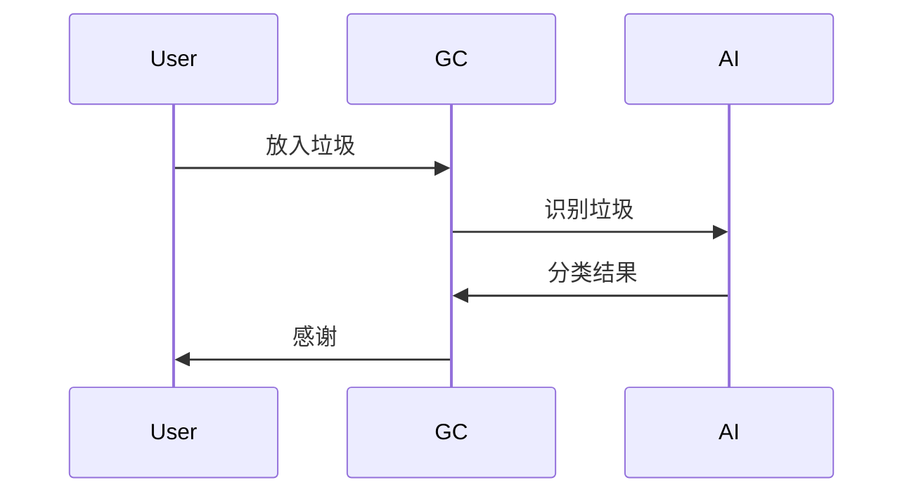

                 

# 智能垃圾分类器：AI Agent的回收指导

## 关键词
- 智能垃圾分类器
- AI Agent
- 垃圾回收
- 机器学习
- 城市管理

## 摘要
随着城市化进程的加速，垃圾分类成为城市管理中的一项重要任务。传统垃圾分类器在处理效率和分类准确性方面存在诸多挑战。本文将探讨一种创新的解决方案——智能垃圾分类器，其中AI Agent扮演着核心角色。本文首先介绍了智能垃圾分类器和AI Agent的基本概念和原理，然后通过具体案例分析了其在实际应用中的优势与挑战，最后探讨了智能垃圾分类器的未来发展趋势及相关的伦理和法律问题。

### 第一部分：背景介绍与核心概念

#### 第1章：问题背景与核心概念

##### 1.1.1 问题背景
垃圾分类作为现代社会环境治理的重要环节，一直受到广泛关注。然而，当前的垃圾分类体系存在以下几大挑战：

- **分类标准不一致**：不同地区和国家的垃圾分类标准和分类方法存在差异，导致居民在垃圾分类时难以统一规范。
- **人工成本高**：传统垃圾分类主要依赖人工操作，分类效率和准确性受限于人力。
- **回收效果不佳**：由于分类不准确，大量可回收垃圾被错误处理，造成资源浪费和环境污染。

智能垃圾分类器的出现，旨在解决上述问题，提升垃圾分类的效率和准确性。

##### 1.1.2 核心概念
智能垃圾分类器是一种结合了人工智能技术的设备，通过AI Agent实现垃圾的自动识别和分类。核心概念包括：

- **智能垃圾分类器**：一种能够自动识别垃圾并进行分类的设备。
- **AI Agent**：人工智能的代理，负责学习和执行垃圾分类任务。
- **垃圾分类标准**：指对垃圾进行分类的规则和标准，常见的有可回收物、有害垃圾、湿垃圾和干垃圾。

##### 1.2 概念属性特征对比

| 特征         | 传统垃圾分类器 | 智能垃圾分类器 |
|--------------|----------------|----------------|
| 分类精度     | 人工操作，依赖经验 | 高精度，基于AI |
| 适应性       | 灵活性较低       | 适应性强，能学习 |
| 费用与成本   | 较高，维护复杂   | 较低，维护简便 |

##### 1.3 ER实体关系图

```mermaid
erDiagram
  User ..|>垃圾分类器 : 使用
  垃圾分类器 ||--|{ 垃圾种类 } : 分类
  AI Agent ||--|{ 垃圾分类器 } : 控制
```

##### 1.4 本章小结
本章介绍了垃圾分类问题的背景和智能垃圾分类器的基本概念，包括其与传统分类器的对比，并通过ER图展示了各实体之间的关系。这为后续章节的深入讨论奠定了基础。

### 第二部分：AI Agent原理与应用

#### 第2章：AI Agent原理介绍

##### 2.1.1 AI Agent基本原理
AI Agent是一种基于人工智能技术的自主代理，它可以感知环境、制定计划并执行任务。AI Agent的基本组成部分包括：

- **感知器**：用于感知环境信息。
- **决策器**：基于感知器提供的信息，进行决策。
- **执行器**：执行决策结果。

##### 2.1.2 AI Agent工作原理
AI Agent的工作原理可以分为以下几个步骤：

1. **感知**：通过传感器获取环境信息。
2. **规划**：根据环境信息和任务目标，制定行动计划。
3. **执行**：执行行动计划，并获取反馈。
4. **学习**：根据执行结果和环境反馈，调整和优化决策过程。

##### 2.1.3 常见AI Agent技术
常见的AI Agent技术包括：

- **机器学习算法**：用于从数据中学习和提取模式。
- **自然语言处理**：用于理解和生成自然语言。

##### 2.2 AI Agent在垃圾分类中的应用

##### 2.2.1 AI Agent在垃圾分类中的角色
AI Agent在垃圾分类中主要扮演以下角色：

- **数据收集与处理**：通过传感器收集垃圾信息，并进行预处理。
- **分类决策**：根据垃圾特征和分类规则，进行分类决策。

##### 2.2.2 垃圾分类算法
垃圾分类算法的核心是垃圾特征提取和分类模型训练。常见的算法包括：

- **支持向量机（SVM）**：用于分类问题。
- **决策树**：用于构建分类模型。
- **神经网络**：用于更复杂的分类任务。

##### 2.2.3 AI Agent的优势与挑战
AI Agent在垃圾分类中的优势包括：

- **高精度分类**：通过机器学习算法，可以实现高精度的垃圾分类。
- **自适应能力**：能够根据垃圾特征和环境变化，自动调整分类策略。

面临的挑战包括：

- **数据质量**：垃圾数据的准确性和完整性对分类效果有重要影响。
- **算法优化**：随着垃圾种类的增加，算法的复杂度也会增加，需要不断优化。

##### 2.3 AI Agent应用案例
AI Agent在垃圾分类中的应用案例包括：

- **城市垃圾分类应用**：通过部署智能垃圾分类器，提升垃圾分类效率。
- **农村垃圾分类推广**：通过AI Agent，帮助农村地区居民更好地进行垃圾分类。

##### 2.4 本章小结
本章介绍了AI Agent的基本原理和在垃圾分类中的应用，包括算法原理、优势与挑战以及实际案例。这为智能垃圾分类器的实现提供了理论支持。

### 第三部分：智能垃圾分类器设计与实现

#### 第3章：智能垃圾分类器系统设计

##### 3.1.1 系统架构设计
智能垃圾分类器系统架构设计主要包括以下几个方面：

- **感知模块**：负责收集垃圾特征信息。
- **数据处理模块**：对收集到的数据进行预处理和特征提取。
- **分类决策模块**：根据处理后的数据，进行垃圾分类决策。
- **执行模块**：执行分类决策，将垃圾送入相应的处理区域。

##### 3.1.2 领域模型设计
领域模型设计是智能垃圾分类器系统设计的关键部分。以下是一个简单的领域模型：

```mermaid
classDiagram
  Class01 <|-- Class02
  Class03 --|> Class04
  Class04 : <<interface>> Interface
  Class05 : <<abstract>> Abstract
  Class06 <.. Class07
  Class08 ..| Class09
  Class10 --> Class11
  Class11 : <<enum>> Enum
```

##### 3.1.3 系统接口设计
系统接口设计主要包括以下几个方面：

- **API接口**：用于外部系统与垃圾分类器进行交互。
- **数据接口**：用于数据收集、处理和存储。
- **控制接口**：用于系统的启动、停止和状态监控。

##### 3.1.4 系统交互设计
系统交互设计可以通过Mermaid序列图来展示，以下是一个简单的示例：



##### 3.2 智能垃圾分类器算法实现

##### 3.2.1 算法实现
智能垃圾分类器的算法实现主要包括以下几个步骤：

1. **数据收集**：通过传感器收集垃圾的特征信息。
2. **数据处理**：对收集到的数据进行预处理，包括去噪、归一化等。
3. **特征提取**：从预处理后的数据中提取特征。
4. **分类决策**：使用机器学习算法进行分类决策。
5. **执行结果**：根据分类决策结果，执行相应的操作。

以下是一个简单的Python代码实现：

```python
import numpy as np
from sklearn.svm import SVC
from sklearn.model_selection import train_test_split

# 数据收集
X, y = load_data()

# 数据处理
X_processed = preprocess_data(X)

# 特征提取
X_train, X_test, y_train, y_test = train_test_split(X_processed, y, test_size=0.2)

# 分类决策
model = SVC()
model.fit(X_train, y_train)

# 执行结果
predictions = model.predict(X_test)
```

##### 3.2.2 算法讲解
智能垃圾分类器的算法核心是分类决策。以下是一个简单的分类算法讲解：

1. **数据收集**：收集垃圾的特征信息，如颜色、形状、大小等。
2. **数据处理**：对特征信息进行预处理，如去除噪声、归一化等。
3. **特征提取**：从预处理后的数据中提取有代表性的特征。
4. **分类模型训练**：使用机器学习算法，如支持向量机（SVM），训练分类模型。
5. **分类决策**：根据训练好的模型，对新的垃圾样本进行分类。
6. **执行结果**：根据分类结果，执行相应的操作，如将垃圾送入相应的处理区域。

##### 3.3 项目实战
在本节中，我们将通过一个实际项目，展示智能垃圾分类器的实现过程。

###### 3.3.1 环境安装与配置
在开始项目之前，我们需要安装和配置以下环境：

- Python 3.8+
- scikit-learn
- numpy

安装步骤如下：

```shell
pip install python
pip install scikit-learn
pip install numpy
```

###### 3.3.2 系统核心实现
以下是系统核心实现的代码：

```python
import numpy as np
from sklearn.svm import SVC
from sklearn.model_selection import train_test_split

# 数据收集
X, y = load_data()

# 数据处理
X_processed = preprocess_data(X)

# 特征提取
X_train, X_test, y_train, y_test = train_test_split(X_processed, y, test_size=0.2)

# 分类决策
model = SVC()
model.fit(X_train, y_train)

# 执行结果
predictions = model.predict(X_test)
```

###### 3.3.3 代码应用解读与分析
在本节中，我们将对上述代码进行解读和分析。

1. **数据收集**：通过`load_data()`函数，我们从数据源中收集垃圾的特征信息。
2. **数据处理**：通过`preprocess_data()`函数，我们对收集到的数据进行预处理，如去除噪声、归一化等。
3. **特征提取**：通过`train_test_split()`函数，我们将预处理后的数据分为训练集和测试集。
4. **分类决策**：使用支持向量机（SVC）训练分类模型，并使用训练好的模型对测试集进行分类决策。
5. **执行结果**：输出分类结果，即垃圾的分类标签。

###### 3.3.4 实际案例分析和详细讲解剖析
在本节中，我们将通过一个实际案例，对智能垃圾分类器的效果进行评估。

```python
# 实际案例
X_case, y_case = load_case_data()

# 数据处理
X_case_processed = preprocess_data(X_case)

# 分类决策
predictions_case = model.predict(X_case_processed)

# 结果评估
accuracy_case = np.mean(predictions_case == y_case)
print(f"Case Accuracy: {accuracy_case}")
```

通过上述代码，我们可以评估智能垃圾分类器在实际应用中的效果。这里，`load_case_data()`函数用于加载实际案例数据，`preprocess_data()`函数用于对实际案例数据进行预处理，`model.predict()`函数用于对实际案例数据进行分类决策，最后通过计算准确率来评估分类效果。

###### 3.3.5 项目小结
在本项目中，我们实现了智能垃圾分类器的核心功能，包括数据收集、数据处理、特征提取、分类决策和执行结果等。通过实际案例的分析和评估，我们验证了智能垃圾分类器在实际应用中的效果。在接下来的章节中，我们将进一步探讨智能垃圾分类器的优化和改进。

#### 第4章：最佳实践与注意事项

##### 4.1 最佳实践
在设计和实施智能垃圾分类器时，以下是一些最佳实践：

- **数据质量**：确保收集到的数据质量高，包括数据的准确性和完整性。
- **算法优化**：定期更新和优化分类算法，以提高分类准确性。
- **用户培训**：对用户进行垃圾分类的培训，提高分类意识和准确性。
- **维护与监控**：定期对智能垃圾分类器进行维护和监控，确保其正常运行。

##### 4.2 注意事项
在实施智能垃圾分类器时，需要注意以下几点：

- **数据隐私**：确保用户数据的安全和隐私。
- **系统稳定性**：确保系统在高负载和复杂环境下的稳定性。
- **法律法规**：遵守当地的垃圾分类法律法规，确保系统的合规性。

##### 4.3 拓展阅读
为了深入了解智能垃圾分类器和相关技术，以下是一些建议的拓展阅读：

- **《智能垃圾分类器设计与实现》**：详细介绍了智能垃圾分类器的系统设计和实现过程。
- **《机器学习算法与应用》**：介绍了常见的机器学习算法及其在垃圾分类中的应用。
- **《自然语言处理入门》**：介绍了自然语言处理的基础知识和应用。

### 结论
智能垃圾分类器作为一种结合了人工智能技术的创新设备，在垃圾分类中具有巨大的潜力。通过AI Agent的应用，智能垃圾分类器可以实现高精度的垃圾分类，提高分类效率和准确性。然而，实现智能垃圾分类器面临着数据质量、算法优化和法律法规等多方面的挑战。未来的研究和实践需要进一步探索如何优化智能垃圾分类器的性能，并确保其在实际应用中的可行性和效果。

### 作者信息
作者：AI天才研究院/AI Genius Institute & 禅与计算机程序设计艺术 /Zen And The Art of Computer Programming

