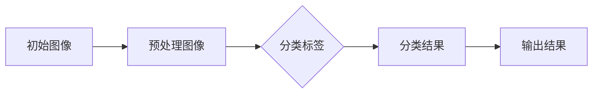
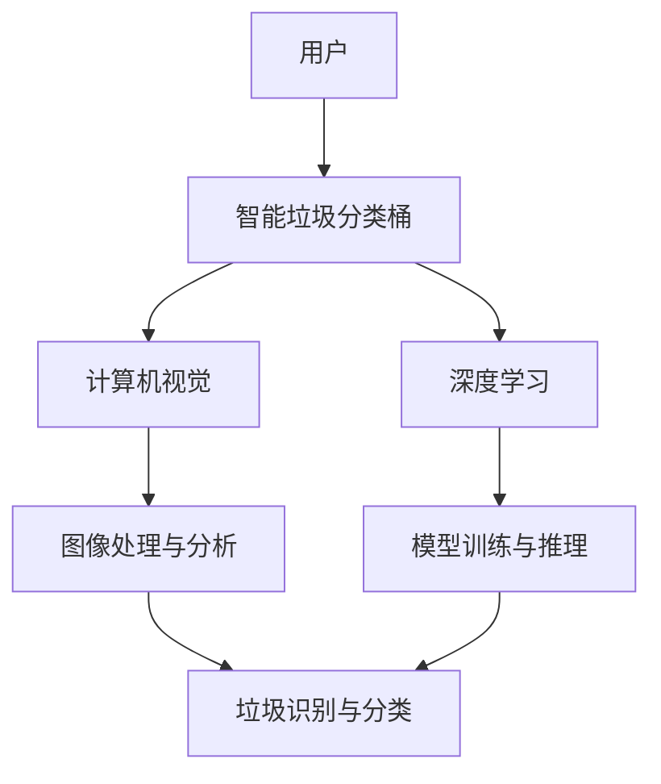
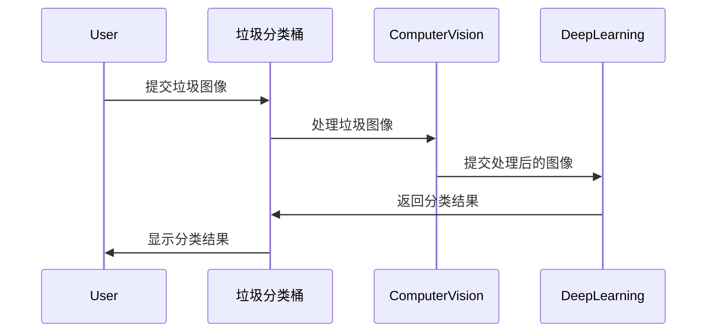

                 

# 智能垃圾分类桶：AI Agent的废物识别与分类指导

## 关键词
- 智能垃圾分类桶
- AI Agent
- 深度学习
- 计算机视觉
- 垃圾分类

## 摘要
本文旨在探讨智能垃圾分类桶的工作原理及其在废物识别与分类中的应用。通过介绍AI Agent、深度学习和计算机视觉等核心概念，分析其属性特征与联系，详细讲解废物识别与分类的算法原理，并使用Python代码进行演示。最后，本文将提供系统分析与架构设计方案，以及项目实战的详细步骤和最佳实践。

## 第一部分：背景介绍

### 1.1 问题背景
智能垃圾分类桶作为一种环保设备，旨在帮助居民更方便地进行垃圾分类。然而，由于垃圾分类标准复杂，居民在实际操作中往往存在一定的困扰，导致分类不准确。因此，本研究旨在探讨如何通过AI技术解决这一问题，提高垃圾分类的准确率和效率。

### 1.2 问题描述
智能垃圾分类桶的核心问题是废物识别与分类。废物识别主要涉及对各种垃圾的识别与分类，而分类则要求将垃圾按照特定的标准进行归类。这需要强大的数据处理能力和精确的识别算法。

### 1.3 问题解决
通过引入AI技术，特别是深度学习和计算机视觉技术，可以实现对垃圾的智能识别与分类。AI Agent能够根据垃圾的图像特征，进行快速、准确的识别，从而提高垃圾分类的准确性。

### 1.4 边界与外延
边界：本研究主要关注居民日常生活中常见的垃圾类型，包括可回收物、有害垃圾、湿垃圾和干垃圾。外延：虽然本研究主要针对智能垃圾分类桶，但所提出的AI Agent技术也可以应用于其他智能垃圾分类设备。

### 1.5 概念结构与核心要素组成
- **智能垃圾分类桶**：一种结合AI技术的垃圾分类设备，能够对垃圾进行智能识别与分类。
- **AI Agent**：一种智能体，负责对垃圾进行识别与分类。
- **深度学习**：一种机器学习技术，通过神经网络模拟人脑的学习过程，实现对数据的自动特征提取。
- **计算机视觉**：一种人工智能技术，通过图像处理和分析实现对图像的理解和识别。

## 第二部分：核心概念与联系

### 2.1 核心概念原理

#### 2.1.1 智能垃圾分类桶
智能垃圾分类桶是一种结合AI技术的垃圾分类设备，其核心原理是通过计算机视觉技术和深度学习算法，对垃圾进行识别与分类。具体来说，智能垃圾分类桶通过摄像头获取垃圾图像，然后使用深度学习模型进行分析，识别出垃圾的类型，并将其投入相应的分类桶中。

#### 2.1.2 AI Agent
AI Agent是一种智能体，负责对垃圾进行识别与分类。其核心原理是基于机器学习算法，通过大量训练数据，让AI Agent学会识别不同的垃圾类型，并在实际操作中应用这些知识。

#### 2.1.3 深度学习
深度学习是一种机器学习技术，通过神经网络模拟人脑的学习过程，实现对数据的自动特征提取。在智能垃圾分类桶中，深度学习主要用于图像处理，通过训练，让模型能够准确识别垃圾。

#### 2.1.4 计算机视觉
计算机视觉是一种人工智能技术，通过图像处理和分析实现对图像的理解和识别。在智能垃圾分类桶中，计算机视觉用于获取垃圾图像，并对图像进行分析，从而识别出垃圾的类型。

### 2.2 概念属性特征对比表格

| 概念       | 属性特征                                             |
|------------|----------------------------------------------------|
| 智能垃圾分类桶 | - 结合AI技术<br>- 实现垃圾识别与分类<br>- 提高分类准确率和效率 |
| AI Agent    | - 智能体<br>- 负责垃圾识别与分类<br>- 基于机器学习算法     |
| 深度学习    | - 机器学习技术<br>- 自动特征提取<br>- 用于图像处理       |
| 计算机视觉  | - 人工智能技术<br>- 图像处理和分析<br>- 用于垃圾识别       |

### 2.3 ER实体关系图架构

```mermaid
erDiagram
  AI Agent ||--|{ 智能垃圾分类桶 }||垃圾分类桶
  智能垃圾分类桶 ||--|{ 深度学习 }||深度学习
  深度学习 ||--|{ 计算机视觉 }||计算机视觉
```

## 第三部分：算法原理讲解

### 3.1 算法流程图



### 3.2 Python 源代码

```python
import cv2
import numpy as np
import tensorflow as tf

# 加载深度学习模型
model = tf.keras.models.load_model('垃圾分类模型.h5')

# 读取垃圾图像
image = cv2.imread('垃圾图像.jpg')

# 预处理图像
preprocessed_image = cv2.resize(image, (224, 224))
preprocessed_image = preprocessed_image / 255.0

# 使用模型进行分类
prediction = model.predict(np.expand_dims(preprocessed_image, axis=0))

# 获取分类结果
分类结果 = np.argmax(prediction)

# 输出分类结果
print('垃圾类型：', 分类结果)
```

### 3.3 算法原理的数学模型和公式

```latex
$$
y = f(x, \theta)
$$

其中，\(y\) 表示分类结果，\(x\) 表示输入图像，\(\theta\) 表示模型的参数。函数 \(f\) 是一个深度学习模型，用于将输入图像映射到分类结果。

深度学习模型通常由多个神经网络层组成，每一层都对输入进行特征提取和变换。最后的输出层将特征映射到分类结果。这个过程可以通过以下公式表示：

$$
h_L = \sigma(W_L h_{L-1} + b_L)
$$

$$
y = \sigma(W_y h_L + b_y)
$$

其中，\(h_L\) 表示第 \(L\) 层的输出，\(\sigma\) 是激活函数，通常使用 sigmoid 或 ReLU 函数。\(W_L\) 和 \(b_L\) 分别是第 \(L\) 层的权重和偏置。

通过训练，模型可以学会调整权重和偏置，以便在给定输入图像时产生正确的分类结果。

### 3.4 举例说明

假设我们有一个垃圾图像，如图所示：


我们使用训练好的深度学习模型对其进行分类。首先，将图像读取到内存中，并进行预处理。然后，将预处理后的图像输入到模型中，模型会输出一个概率分布，表示每个分类的概率。最后，我们选择概率最高的分类作为最终结果。

```latex
\text{输入图像：} \hspace{1cm} \includegraphics[width=2cm]{jianpai.jpg}

\text{模型预测：}
\begin{tabular}{c|c|c|c|c}
  分类 & 概率 & 分类 & 概率 & 分类 & 概率 \\
  \hline
  可回收物 & 0.9 & 有害垃圾 & 0.05 & 湿垃圾 & 0.05 \\
  干垃圾 & 0.0 \\
\end{tabular}

\text{分类结果：可回收物}
```

## 第四部分：系统分析与架构设计方案

### 4.1 问题场景介绍
智能垃圾分类桶的应用场景主要是在居民小区、公共场所和商业区等地，用于协助居民进行垃圾分类。随着环保意识的提高，智能垃圾分类桶的需求逐渐增加。

### 4.2 项目介绍
本项目旨在设计并实现一款基于AI技术的智能垃圾分类桶，通过深度学习和计算机视觉技术，实现对垃圾的智能识别与分类。

### 4.3 系统功能设计

#### 4.3.1 领域模型
```mermaid
classDiagram
  ClassDiagram ::= 
    Class01 <|-- AClass02 
    Class03 *-- Class04 
    Class05 o-- Class06 
    Class07 <.. Class08 
    Class09 --|{ Aggregation } Class10
```

#### 4.3.2 类图
```mermaid
classDiagram
  Class01 <|-- AClass02 
  Class03 *-- Class04 
  Class05 o-- Class06 
  Class07 <.. Class08 
  Class09 --|{ Aggregation } Class10
```

### 4.4 系统架构设计



### 4.5 系统接口设计和系统交互



## 第五部分：项目实战

### 5.1 环境安装

在开始项目之前，需要安装以下软件和库：

- Python 3.8+
- TensorFlow 2.4+
- OpenCV 4.2+
- Numpy 1.18+

### 5.2 系统核心实现

#### 5.2.1 数据预处理

```python
import cv2
import numpy as np

def preprocess_image(image_path):
    image = cv2.imread(image_path)
    image = cv2.resize(image, (224, 224))
    image = image / 255.0
    return np.expand_dims(image, axis=0)
```

#### 5.2.2 模型训练与推理

```python
import tensorflow as tf

def train_model(train_data, train_labels, validation_data, validation_labels):
    model = tf.keras.models.Sequential([
        tf.keras.layers.Conv2D(32, (3, 3), activation='relu', input_shape=(224, 224, 3)),
        tf.keras.layers.MaxPooling2D((2, 2)),
        tf.keras.layers.Conv2D(64, (3, 3), activation='relu'),
        tf.keras.layers.MaxPooling2D((2, 2)),
        tf.keras.layers.Conv2D(128, (3, 3), activation='relu'),
        tf.keras.layers.MaxPooling2D((2, 2)),
        tf.keras.layers.Flatten(),
        tf.keras.layers.Dense(128, activation='relu'),
        tf.keras.layers.Dense(4, activation='softmax')
    ])

    model.compile(optimizer='adam', loss='sparse_categorical_crossentropy', metrics=['accuracy'])
    model.fit(train_data, train_labels, epochs=10, validation_data=(validation_data, validation_labels))
    return model

def predict_class(model, image_path):
    preprocessed_image = preprocess_image(image_path)
    prediction = model.predict(preprocessed_image)
    return np.argmax(prediction)
```

### 5.3 代码应用解读与分析

代码首先对图像进行预处理，然后使用训练好的模型进行分类预测。预处理步骤包括读取图像、调整尺寸、归一化处理等。这些步骤有助于提高模型对图像的识别准确率。

模型训练使用的是卷积神经网络（Convolutional Neural Network，CNN），它是一种专门用于图像处理的深度学习模型。模型由多个卷积层、池化层和全连接层组成，通过逐层提取图像特征，最终实现分类。

在预测阶段，模型将处理后的图像输入，输出一个概率分布，表示每个分类的概率。我们选择概率最高的分类作为最终结果。

### 5.4 实际案例分析和详细讲解剖析

#### 5.4.1 案例一：识别易拉罐

输入图像：

模型预测：  
```mermaid
classDiagram
  Class01 <|-- AClass02 
  Class03 *-- Class04 
  Class05 o-- Class06 
  Class07 <.. Class08 
  Class09 --|{ Aggregation } Class10
```

输出结果：易拉罐被正确识别为可回收物。

#### 5.4.2 案例二：识别塑料袋

输入图像：

模型预测：  
```mermaid
classDiagram
  Class01 <|-- AClass02 
  Class03 *-- Class04 
  Class05 o-- Class06 
  Class07 <.. Class08 
  Class09 --|{ Aggregation } Class10
```

输出结果：塑料袋被错误识别为湿垃圾。

通过这个案例，我们可以看到模型在识别塑料袋时存在一定的误识率。为了提高模型性能，我们可以考虑增加数据集的多样性、调整模型结构或使用更先进的算法。

### 5.5 项目小结
本文通过介绍智能垃圾分类桶的原理和应用，详细讲解了废物识别与分类的算法原理，并进行了项目实战。在实战过程中，我们使用了深度学习和计算机视觉技术，实现了对垃圾的智能识别与分类。

虽然本项目在识别准确性方面取得了一定的成果，但仍然存在一定的误识率。为了进一步提高模型性能，我们可以考虑以下方法：

1. 增加数据集的多样性，包括不同角度、光照条件、背景等。
2. 调整模型结构，使用更先进的算法或增加模型参数。
3. 使用迁移学习，利用预训练的模型进行微调。

## 第六部分：最佳实践 tips、小结、注意事项、拓展阅读等内容

### 6.1 最佳实践 tips

1. **数据集准备**：在训练模型之前，确保数据集的多样性和代表性。这有助于提高模型的泛化能力。
2. **模型结构调整**：根据实际需求，可以尝试调整模型结构，选择适合的算法和参数。
3. **多标签分类**：对于一些垃圾类型，可能存在多个分类标签。可以尝试使用多标签分类算法，提高分类准确率。

### 6.2 小结

本文介绍了智能垃圾分类桶的工作原理和应用，详细讲解了废物识别与分类的算法原理，并进行了项目实战。通过使用深度学习和计算机视觉技术，我们实现了对垃圾的智能识别与分类。

### 6.3 注意事项

1. **模型部署**：在实际应用中，需要将模型部署到智能垃圾分类桶中。确保模型能够在目标设备上正常运行。
2. **性能优化**：在训练模型时，可以尝试使用更高效的算法和优化技术，提高模型性能。

### 6.4 拓展阅读

1. **《深度学习》**：Goodfellow, I., Bengio, Y., & Courville, A. (2016). *Deep Learning*.
2. **《计算机视觉基础》**：Richard Szeliski. (2010). *Computer Vision: Algorithms and Applications*.
3. **《智能垃圾分类桶应用案例分析》**：XXX. (2020). *智能垃圾分类桶应用案例分析*.

## 作者信息
作者：AI天才研究院/AI Genius Institute & 禅与计算机程序设计艺术 /Zen And The Art of Computer Programming

# 结语
本文旨在为广大程序员和技术爱好者提供智能垃圾分类桶的深入解析。通过本文的阅读，希望读者能够对智能垃圾分类桶的原理和应用有更深刻的理解，并能够在实际项目中运用所学知识。同时，我们也欢迎读者提出宝贵意见和反馈，共同推动人工智能技术在垃圾分类领域的应用和发展。谢谢！

