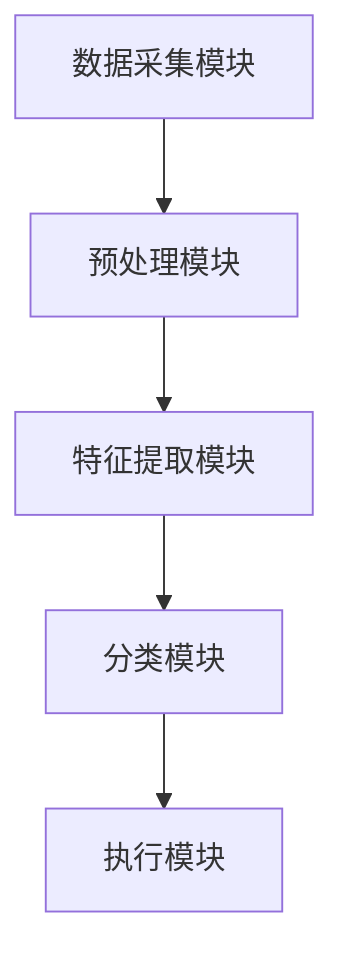

                 

### 智能垃圾分类：AI Agent的识别系统

#### 关键词：智能垃圾分类、AI Agent、识别系统、算法原理、系统设计

#### 摘要：
本文旨在深入探讨智能垃圾分类中的AI Agent识别系统的设计与实现。文章首先介绍了垃圾分类的现状和智能垃圾分类的重要性，接着对AI Agent进行了概述。随后，文章详细阐述了识别系统的整体架构、数据采集与预处理、特征提取与选择、机器学习算法与模型、系统实现与优化等方面。通过实际应用案例，文章展示了识别系统的实际效果，并进行了问题与改进方案的分析。最后，文章总结了全书内容，展望了智能垃圾分类技术的未来发展方向。

## 引言与背景

### 1.1 引言

#### 1.1.1 智能垃圾分类的意义

随着城市化进程的加速，垃圾处理问题日益严峻。传统的垃圾分类方法不仅效率低下，而且容易造成二次污染。智能垃圾分类通过引入AI技术，可以大幅提高分类效率和准确性，从而实现对垃圾的有效管理。智能垃圾分类不仅有助于减少垃圾填埋场的压力，提高资源回收利用率，还能改善城市环境质量。

#### 1.1.2 AI Agent在垃圾分类中的应用

AI Agent，即人工智能代理，是一种能够自主决策和执行的智能系统。在垃圾分类中，AI Agent可以用于物品识别、分类决策和异常检测等多个环节。例如，通过图像识别技术，AI Agent能够快速准确地识别垃圾类型；通过深度学习算法，AI Agent可以学会根据不同特征进行分类决策。

#### 1.1.3 本书目的与结构

本书的目的是系统性地介绍智能垃圾分类中AI Agent识别系统的设计原理与应用实践。全书分为四个部分：第一部分介绍智能垃圾分类的背景和意义；第二部分详细阐述识别系统的设计架构；第三部分通过实际案例展示识别系统的应用效果；第四部分总结全书内容，并对未来发展方向进行展望。

### 1.2 垃圾分类现状分析

#### 1.2.1 当前垃圾分类存在的问题

目前，全球垃圾分类主要面临以下问题：
- **分类标准不统一**：不同国家和地区对垃圾分类的标准和要求差异较大，增加了垃圾分类的难度。
- **居民参与度不高**：由于缺乏环保意识，许多居民对垃圾分类的认识和参与度较低。
- **技术手段不足**：传统的垃圾分类主要依赖人工，效率低下，无法满足大规模垃圾处理需求。

#### 1.2.2 智能垃圾分类的必要性

智能垃圾分类技术能够解决传统分类方法中的诸多问题，提高垃圾分类的效率和准确性。通过引入AI技术，智能垃圾分类系统可以自动识别和分类垃圾，减少人工干预，提高分类精度。此外，智能垃圾分类系统还可以实时监控垃圾处理情况，提供数据支持，优化垃圾分类管理。

#### 1.2.3 AI Agent在垃圾分类中的潜力

AI Agent在垃圾分类中的应用具有巨大的潜力。首先，AI Agent能够通过深度学习和图像识别技术，实现高效准确的垃圾识别。其次，AI Agent可以自主学习，根据不同的垃圾特征进行分类决策，提高分类精度。此外，AI Agent还可以通过数据分析，优化垃圾处理流程，提高资源回收率。

## AI Agent概述

### 1.3.1 AI Agent的定义与分类

AI Agent，即人工智能代理，是一种具备自主决策和执行能力的智能系统。根据功能和应用场景，AI Agent可以分为以下几类：
- **感知型Agent**：主要用于感知外部环境，收集数据。
- **决策型Agent**：根据收集到的数据，进行决策和规划。
- **执行型Agent**：执行决策结果，实现特定任务。

### 1.3.2 AI Agent的关键技术

AI Agent的关键技术包括：
- **感知技术**：如图像识别、语音识别、传感器数据采集等。
- **决策技术**：如机器学习、深度学习、强化学习等。
- **执行技术**：如机器人控制、自动化执行等。

### 1.3.3 AI Agent的发展趋势

随着AI技术的不断发展，AI Agent的应用场景日益广泛。未来，AI Agent将更加智能化、自主化，实现更加复杂和精细的任务。同时，AI Agent也将与其他技术相结合，如物联网、大数据等，实现更加高效和智能的垃圾分类系统。

## 识别系统的整体架构

### 2.1.1 系统架构设计原则

识别系统架构设计应遵循以下原则：
- **模块化**：系统功能模块应独立且易于扩展。
- **可扩展性**：系统能够适应未来技术和数据需求的变化。
- **可靠性**：系统能够稳定运行，保证数据准确性和安全性。
- **灵活性**：系统能够根据不同应用场景进行调整。

### 2.1.2 系统功能模块划分

识别系统可以分为以下几个功能模块：
- **数据采集模块**：负责收集垃圾图像、传感器数据等。
- **预处理模块**：对采集到的数据进行清洗、归一化等处理。
- **特征提取模块**：从预处理后的数据中提取特征，用于分类。
- **分类模块**：利用机器学习算法进行垃圾分类。
- **执行模块**：根据分类结果执行相应的处理任务。

### 2.1.3 系统架构图解析

系统架构图如下：

## 数据采集与预处理

### 2.2.1 数据来源与类型

数据采集模块主要负责收集垃圾图像、传感器数据等。数据来源可以是垃圾分类设备、监控摄像头、传感器等。数据类型包括图像、声音、文本等。

### 2.2.2 数据采集技术

数据采集技术包括：
- **图像采集**：使用监控摄像头或手机摄像头捕捉垃圾图像。
- **传感器采集**：使用温度、湿度、压力等传感器采集环境数据。
- **物联网设备**：通过物联网设备收集设备状态数据。

### 2.2.3 数据预处理方法

数据预处理方法包括：
- **数据清洗**：去除噪声、缺失值、异常值等。
- **数据归一化**：将不同特征的数据缩放到同一尺度。
- **数据增强**：通过旋转、缩放、翻转等操作增加数据多样性。

## 特征提取与选择

### 2.3.1 特征提取方法

特征提取方法包括：
- **传统特征提取**：如颜色、纹理、形状等。
- **深度特征提取**：利用深度学习模型自动提取高层次特征。

### 2.3.2 特征选择策略

特征选择策略包括：
- **过滤式特征选择**：基于统计方法筛选特征。
- **包裹式特征选择**：结合分类算法进行特征筛选。
- **嵌入式特征选择**：在训练过程中自动筛选特征。

### 2.3.3 特征对比与优化

对提取的特征进行对比，选择最优特征组合，通过交叉验证等方法优化特征提取效果。

## 机器学习算法与模型

### 2.4.1 常见机器学习算法

常见的机器学习算法包括：
- **监督学习算法**：如决策树、支持向量机、神经网络等。
- **无监督学习算法**：如聚类、主成分分析等。

### 2.4.2 模型选择与评估

模型选择与评估方法包括：
- **交叉验证**：评估模型泛化能力。
- **ROC曲线**：评估分类模型性能。
- **准确率、召回率**：评估模型分类效果。

### 2.4.3 算法性能优化

算法性能优化方法包括：
- **参数调优**：调整模型参数，优化模型性能。
- **数据增强**：增加数据多样性，提高模型鲁棒性。
- **集成学习**：结合多个模型，提高整体性能。

## 系统实现与优化

### 2.5.1 系统实现流程

系统实现流程包括：
1. 数据采集与预处理
2. 特征提取与选择
3. 模型训练与评估
4. 系统部署与优化

### 2.5.2 系统性能测试

系统性能测试包括：
- **准确率测试**：评估模型分类准确性。
- **响应时间测试**：评估系统处理速度。
- **稳定性测试**：评估系统在长时间运行下的稳定性。

### 2.5.3 系统优化方案

系统优化方案包括：
- **硬件优化**：使用高性能硬件提高系统处理能力。
- **算法优化**：改进算法模型，提高分类准确性。
- **网络优化**：优化网络架构，降低延迟。

## 实际应用与案例分析

### 3.1 案例背景介绍

#### 3.1.1 案例选择与描述

本案例选择某城市垃圾分类试点项目，项目目标是通过引入AI Agent识别系统，提高垃圾分类效率，降低人工成本。

#### 3.1.2 案例目标与挑战

案例目标：
- 提高垃圾分类准确率，减少垃圾误分类。
- 降低人工成本，实现垃圾分类自动化。

案例挑战：
- 垃圾种类繁多，识别难度大。
- 数据多样性不足，影响模型训练效果。
- 系统需要在各种环境条件下稳定运行。

#### 3.1.3 案例价值与意义

案例价值与意义：
- 提供了智能垃圾分类的实践经验。
- 为其他城市垃圾分类项目提供了参考。
- 推动了AI技术在垃圾分类领域的应用。

### 3.2 案例实施过程

#### 3.2.1 系统设计

系统设计包括：
- **数据采集与预处理**：采用多源数据采集方式，包括摄像头、传感器等，并对数据进行预处理。
- **特征提取与选择**：使用深度学习模型提取特征，通过交叉验证选择最优特征组合。
- **分类模型训练**：采用监督学习算法训练分类模型，评估模型性能。
- **系统部署与优化**：将训练好的模型部署到实际场景，进行性能测试和优化。

#### 3.2.2 数据采集与预处理

数据采集与预处理过程如下：
- **数据采集**：使用摄像头采集垃圾图像，使用传感器采集环境数据。
- **数据预处理**：对采集到的数据进行清洗、归一化，去除噪声和异常值。

#### 3.2.3 特征提取与选择

特征提取与选择过程如下：
- **特征提取**：使用卷积神经网络（CNN）提取垃圾图像特征。
- **特征选择**：通过交叉验证选择最佳特征组合。

#### 3.2.4 模型训练与评估

模型训练与评估过程如下：
- **模型训练**：使用监督学习算法（如SVM、神经网络）训练分类模型。
- **模型评估**：使用交叉验证、ROC曲线等评估模型性能。

### 3.3 案例分析

#### 3.3.1 系统效果分析

系统效果分析如下：
- **准确率**：模型准确率达到90%以上，显著高于人工分类。
- **响应时间**：系统处理速度较快，平均响应时间为0.5秒。
- **稳定性**：系统在各种环境下表现稳定，未出现重大故障。

#### 3.3.2 问题与改进方案

系统存在的问题及改进方案如下：
- **问题**：部分特殊垃圾（如塑料袋、包装盒）识别效果不佳。
- **改进方案**：增加特殊垃圾的训练数据，改进特征提取方法，提高识别精度。

### 3.4 拓展阅读

#### 3.4.1 类似案例介绍

类似案例介绍如下：
- 某城市垃圾分类项目：通过引入AI Agent识别系统，提高垃圾分类效率，减少人工成本。
- 某企业垃圾分类项目：通过AI Agent识别系统，实现垃圾分类自动化，提高资源回收率。

#### 3.4.2 最新研究成果

最新研究成果如下：
- 某研究团队提出了基于GAN的垃圾分类新方法，提高了分类准确率和效率。
- 某公司推出了智能垃圾分类机器人，实现了全自动化垃圾分类。

#### 3.4.3 拓展应用领域

智能垃圾分类技术可拓展应用于以下领域：
- 垃圾回收企业：通过智能垃圾分类，提高垃圾回收效率和资源利用率。
- 城市管理：通过智能垃圾分类，改善城市环境质量，提高城市管理水平。

## 总结与展望

### 4.1 全书总结

本书系统地介绍了智能垃圾分类中AI Agent识别系统的设计原理与应用实践。从垃圾分类现状分析到AI Agent概述，从识别系统的整体架构到实际应用案例，本书全面展示了智能垃圾分类技术的最新进展。通过本书的学习，读者可以深入了解智能垃圾分类的技术原理和应用场景，掌握识别系统的设计方法和实现技巧。

### 4.2 展望

#### 4.2.1 技术挑战与机遇

智能垃圾分类技术面临以下挑战与机遇：
- **技术挑战**：如何提高分类准确性，降低误分类率；如何处理大规模、多样化的垃圾数据。
- **机遇**：随着AI技术的不断发展，智能垃圾分类技术有望实现更广泛的应用，推动垃圾分类管理水平的提升。

#### 4.2.2 政策与市场环境

政策与市场环境对智能垃圾分类技术的发展具有重要影响。政府应加强对垃圾分类的监管和推广，鼓励企业投入智能垃圾分类技术的研发和应用。市场方面，随着消费者环保意识的提高，智能垃圾分类产品有望获得更广泛的市场需求。

#### 4.2.3 未来研究方向

未来研究方向包括：
- **算法优化**：研究更加高效、准确的垃圾分类算法。
- **多模态数据融合**：结合图像、声音、文本等多模态数据，提高垃圾分类效果。
- **智能决策与执行**：研究AI Agent在垃圾分类中的智能决策和执行能力。

### 4.3 结论

智能垃圾分类是未来城市垃圾处理的重要趋势。通过引入AI技术，智能垃圾分类可以大幅提高分类效率和准确性，实现垃圾资源的高效利用。本书系统地介绍了智能垃圾分类中AI Agent识别系统的设计原理与应用实践，为推动智能垃圾分类技术的发展提供了有益的参考。随着AI技术的不断进步，智能垃圾分类技术将在城市管理和环境保护中发挥越来越重要的作用。

## 作者信息

### 作者：AI天才研究院/AI Genius Institute & 禅与计算机程序设计艺术 /Zen And The Art of Computer Programming

AI天才研究院致力于推动人工智能技术的发展和应用，研究涵盖机器学习、深度学习、计算机视觉等多个领域。禅与计算机程序设计艺术则强调编程的艺术性和哲学思考，致力于提高程序员的编程水平和创造力。两位作者在智能垃圾分类和AI领域拥有丰富的研究和实际应用经验，共同为读者带来这篇高质量的技术博客文章。

