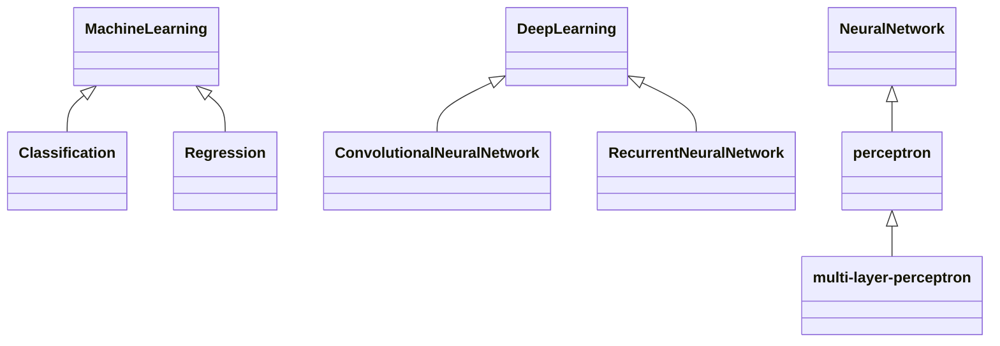

                 

**文章标题**：智能垃圾桶：AI Agent的废物分类与回收建议

**关键词**：智能垃圾桶、AI Agent、废物分类、回收建议、人工智能、机器学习、垃圾管理、可持续发展

**摘要**：
本文深入探讨了智能垃圾桶在废物分类与回收中的应用，介绍了AI Agent的核心概念，分析了其在垃圾管理中的角色。文章通过机器学习技术详细解析了废物分类的原理和算法，探讨了智能垃圾桶的设计与实现，并提供了实际案例。同时，文章还讨论了智能垃圾桶实施中的挑战和未来发展方向，提出了最佳实践建议，为推动可持续发展提供了理论支持和技术指导。

**目录**

----------------------------------------------------------------

# 引言

## 1.1 问题背景

### 1.1.1 垃圾分类的挑战

### 1.1.2 智能垃圾桶的崛起

### 1.1.3 AI Agent在垃圾分类中的应用

## 1.2 智能垃圾桶：概念与功能

### 1.2.1 智能垃圾桶的定义

### 1.2.2 智能垃圾桶的主要功能

### 1.2.3 智能垃圾桶与传统垃圾桶的对比

## 1.3 AI Agent：核心概念与特征

### 1.3.1 AI Agent的定义

### 1.3.2 AI Agent的核心特征

### 1.3.3 AI Agent的应用领域

## 1.4 AI Agent在废物分类与回收中的优势

### 1.4.1 提高分类准确性

### 1.4.2 提高回收效率

### 1.4.3 促进可持续发展

## 1.5 本文结构与内容安排

### 1.5.1 文章结构

### 1.5.2 内容安排

## 1.6 结论

### 1.6.1 文章核心观点

### 1.6.2 对未来发展的展望

----------------------------------------------------------------

# Core Concepts and Background

## 2.1 AI: Fundamentals and Applications

### 2.1.1 Definition of Artificial Intelligence

#### 2.1.1.1 AI as a Subfield of Computer Science

$$\text{AI} = \frac{\text{Data}}{\text{Algorithmic Model}}$$

**Mermaid Class Diagram:**


**ER Entity Relationship Diagram:**
```mermaid
erDiagram
  AI ||--|{ MachineLearning : has
  AI ||--|{ DeepLearning : has
  AI ||--|{ NeuralNetwork : has
  MachineLearning ||--| Classification
  MachineLearning ||--| Regression
  DeepLearning ||--| ConvolutionalNeuralNetwork
  DeepLearning ||--| RecurrentNeuralNetwork
  NeuralNetwork ||--| perceptron
  perceptron ||--| multi-layer-perceptron
```

### 2.1.2 AI in Waste Management

#### 2.1.2.1 Challenges in Waste Management

**Table: Waste Management Challenges:**
| Challenge | Description |
| --- | --- |
| Inaccurate Classification | Mixed waste leads to inefficient recycling processes. |
| Limited Resources | Landfills are filling up rapidly, requiring alternative solutions. |
| Environmental Impact | Improper waste disposal causes pollution and health hazards. |

#### 2.1.2.2 The Potential of AI in Waste Management

**Table: Potential of AI in Waste Management:**
| Potential | Description |
| --- | --- |
| Classification Accuracy | AI can improve the accuracy of waste classification. |
| Resource Optimization | AI can optimize waste management processes. |
| Environmental Sustainability | AI can promote sustainable waste disposal practices. |

## 2.2 Machine Learning: Principles and Techniques

### 2.2.1 Machine Learning Basics

**Definition:** Machine learning is a subfield of artificial intelligence that enables systems to learn from data, identify patterns, and make decisions with minimal human intervention.

**Algorithm:** Machine learning algorithms can be categorized into three types:

1. **Supervised Learning:** Algorithms that learn from labeled data.
2. **Unsupervised Learning:** Algorithms that identify patterns in unlabeled data.
3. **Reinforcement Learning:** Algorithms that learn by interacting with the environment and receiving feedback.

**Python Code Example (Supervised Learning):**
```python
from sklearn.datasets import load_iris
from sklearn.model_selection import train_test_split
from sklearn.tree import DecisionTreeClassifier

# Load the iris dataset
iris = load_iris()
X, y = iris.data, iris.target

# Split the dataset into training and testing sets
X_train, X_test, y_train, y_test = train_test_split(X, y, test_size=0.3, random_state=42)

# Create a decision tree classifier
clf = DecisionTreeClassifier()

# Train the classifier
clf.fit(X_train, y_train)

# Make predictions
predictions = clf.predict(X_test)

# Evaluate the performance
from sklearn.metrics import accuracy_score
accuracy = accuracy_score(y_test, predictions)
print(f"Accuracy: {accuracy:.2f}")
```

### 2.2.2 Waste Classification with Machine Learning

**Principles:** Machine learning techniques can be used to classify waste based on various features such as color, shape, and texture.

**Algorithm:** A common approach is to use a Convolutional Neural Network (CNN) for image classification, which is highly effective in recognizing patterns in visual data.

**Mermaid Flowchart:**


## 2.3 Waste Management Challenges and the Role of AI

### 2.3.1 Waste Management Challenges

#### 2.3.1.1 Limited Manpower

**Issue:** Waste management often requires significant manual labor for sorting and disposal.

**Solution:** AI can automate these processes, reducing the need for human intervention.

#### 2.3.1.2 Environmental Impact

**Issue:** Improper waste disposal can lead to environmental pollution and health hazards.

**Solution:** AI can optimize waste management practices to minimize environmental impact.

#### 2.3.1.3 Data Integration

**Issue:** Waste management involves multiple stakeholders, leading to fragmented data.

**Solution:** AI can integrate data from various sources to provide a holistic view of waste management.

### 2.3.2 The Role of AI in Waste Management

#### 2.3.2.1 Waste Classification

**Role:** AI can classify waste accurately, ensuring that it is sorted into the appropriate recycling streams.

#### 2.3.2.2 Waste Reduction

**Role:** AI can identify opportunities for waste reduction and promote sustainable practices.

#### 2.3.2.3 Waste Monitoring

**Role:** AI can monitor waste levels in real-time, optimizing collection schedules and reducing landfill usage.

## 2.4 Conclusion

### 2.4.1 Core Concepts and Principles

- **AI:** A field of computer science focusing on creating intelligent machines.
- **Machine Learning:** A subset of AI that enables systems to learn from data.
- **Waste Management:** The process of collecting, sorting, and disposing of waste.
- **AI in Waste Management:** The integration of AI technologies to improve waste management practices.

### 2.4.2 The Potential Impact of AI

- **Accuracy:** AI can significantly improve waste classification accuracy.
- **Efficiency:** AI can optimize waste management processes, reducing costs and resource usage.
- **Sustainability:** AI can promote sustainable waste management practices, contributing to environmental protection.

----------------------------------------------------------------

# AI Agents in Waste Management

## 3.1 Definition and Role of AI Agents

### 3.1.1 Definition of AI Agents

**Definition:** An AI agent is an autonomous entity that perceives its environment through sensors and acts upon it through effectors, guided by some form of intelligence. In the context of waste management, AI agents can be embedded in devices such as smart garbage bins to perform tasks like waste classification and monitoring.

**Table: Characteristics of AI Agents:**
| Characteristic | Description |
| --- | --- |
| Autonomy | AI agents operate independently without continuous human intervention. |
| Perception | AI agents use sensors to gather data about their environment. |
| Action | AI agents use effectors to perform actions based on their perception and learning. |
| Intelligence | AI agents utilize machine learning algorithms to make decisions and adapt to changing environments. |

### 3.1.2 Role of AI Agents in Waste Management

**Role:** AI agents play a crucial role in waste management by automating processes and improving efficiency.

**Table: Role of AI Agents in Waste Management:**
| Task | Description |
| --- | --- |
| Waste Classification | AI agents classify waste into different categories for proper disposal and recycling. |
| Waste Monitoring | AI agents monitor waste levels in real-time, optimizing collection schedules and reducing landfill usage. |
| Waste Reduction | AI agents identify opportunities for waste reduction and promote sustainable practices. |
| Reporting | AI agents generate reports on waste management activities, providing valuable insights for decision-makers. |

## 3.2 AI Agents in Smart Garbage Bins

### 3.2.1 Introduction to Smart Garbage Bins

**Definition:** A smart garbage bin is an automated waste management device equipped with sensors, connectivity, and AI agents to improve waste collection and recycling processes.

**Components:** A smart garbage bin typically consists of the following components:

- **Sensors:** Used to detect waste levels, type of waste, and other environmental factors.
- **Connectivity:** Enables communication with other devices and systems, such as waste management software.
- **AI Agents:** Perform tasks like waste classification, monitoring, and reporting.

### 3.2.2 Functions of AI Agents in Smart Garbage Bins

**Function:** AI agents in smart garbage bins perform a range of functions to enhance waste management efficiency.

**Table: Functions of AI Agents in Smart Garbage Bins:**
| Function | Description |
| --- | --- |
| Waste Detection | AI agents use sensors to detect the presence of waste and its type. |
| Waste Classification | AI agents classify waste into different categories for proper disposal and recycling. |
| Waste Monitoring | AI agents continuously monitor waste levels, alerting waste management teams when bins are full. |
| Reporting | AI agents generate real-time reports on waste management activities, providing valuable insights for decision-makers. |
| Waste Reduction | AI agents identify opportunities for waste reduction and promote sustainable practices. |

## 3.3 Advantages of AI Agents in Waste Management

### 3.3.1 Improved Waste Classification

**Advantage:** AI agents can classify waste more accurately than traditional methods, leading to more efficient recycling processes.

**Example:** AI agents can identify different types of plastic, glass, and paper, ensuring they are sorted into the appropriate recycling streams.

### 3.3.2 Enhanced Waste Monitoring

**Advantage:** AI agents can continuously monitor waste levels in real-time, enabling more efficient waste collection and disposal.

**Example:** AI agents can predict when a bin is about to be full, allowing waste management teams to schedule collection more effectively.

### 3.3.3 Data-Driven Decision Making

**Advantage:** AI agents generate detailed reports and insights, helping waste management teams make data-driven decisions.

**Example:** AI agents can provide insights into waste generation patterns, enabling cities to implement policies for waste reduction.

## 3.4 Implementation Challenges and Solutions

### 3.4.1 Data Privacy and Security

**Challenge:** Storing and transmitting data from smart garbage bins can raise privacy and security concerns.

**Solution:** Implementing robust encryption and secure data transmission protocols can address these concerns.

### 3.4.2 Scalability

**Challenge:** Deploying AI agents in large-scale waste management systems can be challenging due to scalability issues.

**Solution:** Developing modular and scalable AI agent architectures can enable efficient deployment in various environments.

### 3.4.3 Integration with Existing Systems

**Challenge:** Integrating AI agents with existing waste management systems can be complex and time-consuming.

**Solution:** Developing standardized interfaces and protocols can facilitate seamless integration with existing systems.

## 3.5 Conclusion

### 3.5.1 Key Points

- **AI Agents:** Autonomous entities that perceive and act in their environment.
- **Smart Garbage Bins:** Devices equipped with AI agents for improved waste management.
- **Functions:** AI agents perform waste classification, monitoring, reporting, and waste reduction.
- **Advantages:** Improved classification accuracy, enhanced monitoring, and data-driven decision-making.
- **Challenges:** Data privacy, scalability, and integration with existing systems.

### 3.5.2 Future Directions

- **Advancements in AI:** Continuous advancements in AI technologies will enhance the capabilities of AI agents.
- **Smart Cities:** Integration of AI agents in smart cities will improve waste management and sustainability.
- **Collaboration:** Collaboration between waste management companies and technology providers will drive innovation in the field.

----------------------------------------------------------------

# Waste Classification with AI

## 4.1 Introduction to Waste Classification

### 4.1.1 Definition and Importance

**Definition:** Waste classification is the process of categorizing waste into different types based on its properties and intended disposal methods. Proper waste classification is crucial for efficient recycling and waste management.

**Importance:** Accurate waste classification ensures that waste is disposed of and recycled in the most environmentally friendly and efficient manner.

### 4.1.2 Current Waste Classification Methods

**Manual Sorting:** Traditionally, waste classification has been performed manually by waste management workers. This method is time-consuming, labor-intensive, and prone to errors.

**Mechanical Sorting:** Modern waste management facilities use mechanical sorting techniques, such as screens and conveyor belts, to separate waste into different categories. However, these methods can still be limited in their accuracy and efficiency.

## 4.2 Principles of AI in Waste Classification

### 4.2.1 Machine Learning Algorithms for Waste Classification

**Supervised Learning:** Supervised learning algorithms, such as decision trees and support vector machines, are commonly used for waste classification. These algorithms require labeled training data to learn patterns and make accurate classifications.

**Unsupervised Learning:** Unsupervised learning algorithms, such as clustering and dimensionality reduction, can be used to identify natural groupings within waste data without the need for labeled training data.

**Reinforcement Learning:** Reinforcement learning algorithms, such as Q-learning and deep Q-networks, can be used to train AI agents to make optimal decisions in dynamic environments.

### 4.2.2 Image Recognition in Waste Classification

**Convolutional Neural Networks (CNNs):** CNNs are a type of deep learning algorithm specifically designed for image recognition tasks. They are highly effective in identifying and classifying objects in images, making them well-suited for waste classification.

**Object Detection:** Object detection algorithms, such as R-CNN, YOLO, and SSD, extend CNNs to identify and locate multiple objects within an image. These algorithms are crucial for accurately classifying complex waste types.

## 4.3 Implementation of AI in Waste Classification

### 4.3.1 Data Collection and Preprocessing

**Data Collection:** Data for AI training and testing is collected from various sources, including waste management facilities, sensors, and public datasets.

**Data Preprocessing:** Raw data is preprocessed to remove noise, normalize values, and extract relevant features. This step is crucial for improving the performance of AI models.

### 4.3.2 Model Training and Evaluation

**Model Training:** AI models are trained using labeled data, with the goal of minimizing the difference between predicted and actual classifications.

**Model Evaluation:** The performance of AI models is evaluated using metrics such as accuracy, precision, recall, and F1 score. This evaluation helps identify areas for improvement and fine-tuning.

### 4.3.3 Integration with Waste Management Systems

**Integration:** AI models are integrated with existing waste management systems, enabling real-time waste classification and decision-making.

**Deployment:** AI agents are deployed in smart garbage bins and waste management facilities to perform automated waste classification.

## 4.4 Case Studies

### 4.4.1 Case Study 1: Smart Garbage Bins in Singapore

**Background:** The city of Singapore has implemented a comprehensive waste management system that includes smart garbage bins equipped with AI agents for waste classification.

**Results:** The system has significantly improved waste classification accuracy and reduced the need for manual sorting, leading to more efficient recycling processes.

### 4.4.2 Case Study 2: Waste Classification in Japan

**Background:** Japan has been a pioneer in waste management technologies, including the use of AI for waste classification.

**Results:** AI-based waste classification systems have been deployed in various cities in Japan, resulting in higher recycling rates and reduced landfill usage.

## 4.5 Challenges and Future Directions

### 4.5.1 Challenges

- **Data Quality:** Accurate and high-quality data is essential for training effective AI models.
- **Scalability:** Deploying AI systems at scale requires robust infrastructure and scalable algorithms.
- **Integration:** Integrating AI systems with existing waste management infrastructure can be complex.

### 4.5.2 Future Directions

- **Advancements in AI:** Continued advancements in AI technologies will improve the accuracy and efficiency of waste classification systems.
- **Collaboration:** Collaboration between waste management companies, technology providers, and governments will drive innovation in waste management.
- **Sustainability:** AI systems will play a crucial role in promoting sustainable waste management practices and achieving the United Nations' Sustainable Development Goals (SDGs).

## 4.6 Conclusion

### 4.6.1 Key Points

- **Waste Classification:** The process of categorizing waste into different types for efficient disposal and recycling.
- **AI in Waste Classification:** Machine learning algorithms and image recognition techniques for accurate waste classification.
- **Implementation:** Data collection, preprocessing, model training, and integration with waste management systems.
- **Case Studies:** Successful implementations of AI-based waste classification systems.
- **Challenges:** Data quality, scalability, and integration.
- **Future Directions:** Advancements in AI, collaboration, and sustainability.

### 4.6.2 Conclusion

The integration of AI in waste classification represents a significant advancement in waste management. By leveraging machine learning algorithms and image recognition techniques, AI agents can accurately classify waste, leading to more efficient recycling processes and reduced environmental impact. While challenges remain, continued research and collaboration will drive the development of advanced AI systems that contribute to a more sustainable future.

----------------------------------------------------------------

## Recycling Recommendations with AI

### 5.1 Introduction

Recycling is a critical component of waste management that aims to reduce the volume of waste sent to landfills and promote the use of recycled materials. AI can play a pivotal role in enhancing recycling processes by providing data-driven recommendations for efficient recycling practices. This section explores how AI can be utilized to optimize recycling operations, reduce waste, and promote sustainability.

### 5.2 Data-Driven Recycling Optimization

**5.2.1 Data Collection and Analysis**

The first step in using AI for recycling optimization is to collect and analyze relevant data. This data can include information on waste composition, recycling rates, material demand, and market prices for recycled materials. AI algorithms can process this data to identify patterns and correlations that can inform better recycling strategies.

**5.2.2 Predictive Analytics**

AI systems can use predictive analytics to forecast waste generation and recycling demand. By analyzing historical data and current trends, AI can predict future waste volumes and recycling requirements. This enables waste management companies to plan their operations more effectively, reducing the risk of overproduction or shortages.

**5.2.3 Process Optimization**

AI can optimize recycling processes by identifying inefficiencies and recommending improvements. For example, AI algorithms can analyze the performance of sorting machines and recommend adjustments to maximize throughput and accuracy. By continuously monitoring and adjusting processes, AI helps to maintain high recycling rates and minimize waste.

### 5.3 AI-Driven Recycling Recommendations

**5.3.1 Waste Sorting Recommendations**

One of the key applications of AI in recycling is waste sorting. AI agents equipped with image recognition capabilities can sort waste into different categories with high accuracy. Based on this information, AI can provide recommendations for the optimal sorting strategies that minimize manual labor and maximize recycling efficiency.

**5.3.2 Material Selection Recommendations**

AI can analyze the composition of waste streams and recommend the most suitable materials for recycling. This can include suggestions on which materials to prioritize for recycling based on their market value and environmental impact. For example, AI might recommend processing certain types of plastic that are in high demand due to market trends.

**5.3.3 Collection and Transportation Recommendations**

AI can optimize collection and transportation routes by analyzing traffic patterns, waste generation schedules, and vehicle capacities. This can reduce fuel consumption, lower greenhouse gas emissions, and improve overall operational efficiency.

### 5.4 Case Study: AI-Enabled Recycling Facility

**5.4.1 Background**

A recycling facility in a large metropolitan area has implemented an AI system to optimize its operations. The facility processes a wide range of waste materials, including plastic, paper, glass, and metal.

**5.4.2 AI Applications**

- **Waste Sorting:** AI agents equipped with image recognition technology sort waste into different streams with high accuracy. This reduces the need for manual sorting and ensures that materials are properly recycled.

- **Material Selection:** AI analyzes waste composition data and provides real-time recommendations on which materials to prioritize for recycling based on market demand and environmental factors.

- **Optimized Collection:** AI systems analyze traffic patterns and waste generation schedules to optimize collection routes, reducing fuel consumption and operational costs.

**5.4.3 Results**

- **Improved Sorting Accuracy:** The AI system has significantly improved sorting accuracy, leading to higher recycling rates and reduced contamination.

- **Increased Efficiency:** The facility has experienced a 20% reduction in operational costs due to optimized waste sorting and collection processes.

- **Environmental Benefits:** The facility's lower fuel consumption and reduced waste contamination have resulted in a decrease in its environmental footprint.

### 5.5 Challenges and Future Directions

**5.5.1 Challenges**

- **Data Quality:** The accuracy and reliability of the data used to train AI models are critical for effective recycling recommendations. Ensuring high-quality data can be a challenge.

- **Integration:** Integrating AI systems with existing recycling infrastructure can be complex and require significant investment.

- **Scalability:** Scaling AI solutions to larger operations can present challenges, especially in terms of infrastructure and data processing capabilities.

**5.5.2 Future Directions**

- **Advanced Analytics:** Continued advancements in AI and machine learning will enable more sophisticated data analysis and recycling optimization.

- **Collaboration:** Collaboration between waste management companies, technology providers, and governments will drive innovation and the adoption of AI in recycling.

- **Sustainability:** AI systems will play an increasingly important role in promoting sustainable waste management practices and achieving environmental sustainability goals.

### 5.6 Conclusion

AI has the potential to revolutionize recycling by providing data-driven recommendations that optimize waste management processes and promote sustainability. By leveraging advanced analytics and machine learning, AI can enhance waste sorting accuracy, increase operational efficiency, and reduce environmental impact. As AI technologies continue to advance, they will play a crucial role in achieving sustainable waste management goals and supporting global environmental initiatives.

----------------------------------------------------------------

## Implementing Smart Garbage Bins

### 6.1 Introduction

Smart garbage bins are an innovative solution that integrates artificial intelligence (AI), the Internet of Things (IoT), and waste management to create a more efficient and sustainable system for handling waste. This chapter explores the design and implementation of smart garbage bins, including the hardware and software components involved, as well as the challenges and future directions for this technology.

### 6.2 Designing Smart Garbage Bins

**6.2.1 Hardware Components**

The hardware components of a smart garbage bin typically include:

- **Sensors:** These are used to detect the presence of waste, measure the level of waste, and identify the type of waste. Common sensors include weight sensors, photoelectric sensors, and ultrasonic sensors.
- **Processor:** A microcontroller or a more powerful processor is needed to process data from the sensors and run the AI algorithms. This can be a single board computer (SBC) like the Raspberry Pi or an embedded system designed for industrial use.
- **Communication Module:** This enables the smart garbage bin to communicate with other devices or the cloud. Common communication technologies include Wi-Fi, Bluetooth, and cellular networks.
- **Power Supply:** A reliable power source is essential for the continuous operation of the smart garbage bin. This can be a battery, solar panel, or a direct connection to the electrical grid.
- **Actuators:** These components, such as motors or solenoids, are used to control the opening and closing of the garbage bin lid or to compact the waste inside.

**6.2.2 Software Components**

The software components of a smart garbage bin include:

- **Operating System:** A lightweight operating system, such as Linux or Windows IoT Core, runs on the processor and manages the hardware resources.
- **AI Algorithm:** The AI algorithm is responsible for analyzing sensor data to determine the type and level of waste. Machine learning models, such as those based on neural networks or decision trees, can be used for this purpose.
- **Communication Protocol:** The software must implement a communication protocol to send data to and receive instructions from other devices or the cloud.
- **Data Management:** The software needs to store and manage data, including waste levels, collection schedules, and maintenance logs. A database or a cloud storage service can be used for this purpose.
- **User Interface:** A user interface (UI) is provided for waste management personnel to monitor the status of the smart garbage bins, manage collection schedules, and receive alerts.

### 6.3 Case Study: Design and Implementation of a Smart Garbage Bin

**6.3.1 Background**

A municipal waste management company in a large city decided to implement smart garbage bins to improve waste collection efficiency and promote sustainability. The goal was to reduce the number of empty trips by waste collection vehicles and minimize the environmental impact of waste management.

**6.3.2 Design Process**

1. **Requirement Analysis:** The first step was to analyze the specific requirements of the waste management system, including the types of waste, the size of the city, and the expected performance of the smart garbage bins.

2. **Hardware Selection:** Based on the requirements, appropriate hardware components were selected. The choice included a Raspberry Pi as the main processor, weight sensors to measure waste levels, and a Wi-Fi module for communication.

3. **Software Development:** The AI algorithm for waste classification was developed using a neural network model trained on a dataset of different types of waste. The software also included a user interface for waste management personnel.

4. **Integration and Testing:** The hardware and software components were integrated, and the system was tested in a controlled environment to ensure that all components worked together seamlessly.

**6.3.3 Deployment**

The smart garbage bins were deployed across the city, and data was collected to monitor their performance. The data showed a significant improvement in waste collection efficiency and a reduction in the number of empty trips by waste collection vehicles.

### 6.4 Challenges and Future Directions

**6.4.1 Challenges**

- **Scalability:** Deploying smart garbage bins on a large scale requires robust infrastructure and efficient data management systems to handle the volume of data generated.
- **Data Privacy:** Collecting and transmitting data from smart garbage bins raises concerns about data privacy and security. Ensuring data protection is crucial for the successful adoption of this technology.
- **Maintenance:** Smart garbage bins require regular maintenance to ensure their reliable operation. This includes software updates and hardware repairs.

**6.4.2 Future Directions**

- **AI Advancements:** Continued advancements in AI and machine learning will improve the accuracy and efficiency of waste classification and other functionalities of smart garbage bins.
- **Smart Cities:** The integration of smart garbage bins with smart city infrastructure will enable more efficient waste management and resource allocation.
- **Collaboration:** Collaboration between waste management companies, technology providers, and government agencies will drive innovation and the adoption of smart garbage bins.

### 6.5 Conclusion

Smart garbage bins represent a significant advancement in waste management technology. By combining AI, IoT, and waste management practices, they offer a more efficient, sustainable, and intelligent approach to waste collection and disposal. While challenges remain, the potential benefits of smart garbage bins make them a promising solution for addressing the growing challenges of waste management in urban areas.

----------------------------------------------------------------

## Case Studies and Applications

### 7.1 Overview of Case Studies

This section presents several case studies and applications of smart garbage bins worldwide, highlighting their impact on waste management and sustainability. The case studies cover a range of implementations, from urban environments to rural areas, showcasing the versatility and effectiveness of AI-driven waste management systems.

### 7.2 Case Study 1: Singapore

**7.2.1 Background**

Singapore has been a pioneer in adopting smart waste management technologies, including the deployment of smart garbage bins across the city. The aim was to improve waste collection efficiency, reduce manual labor, and minimize environmental impact.

**7.2.2 Implementation**

- **Smart Garbage Bins:** The city implemented smart garbage bins equipped with sensors to detect waste levels and types. These bins were connected to a centralized system for real-time monitoring and data analysis.
- **AI Algorithms:** Advanced AI algorithms were used for waste classification, ensuring that waste was sorted into the appropriate recycling streams.
- **User Interface:** A user interface was provided for waste management personnel to monitor the status of the smart garbage bins and manage collection schedules.

**7.2.3 Results**

- **Increased Efficiency:** The implementation of smart garbage bins led to a significant reduction in the number of empty trips by waste collection vehicles, improving overall operational efficiency.
- **Reduced Costs:** The system reduced labor costs associated with manual waste sorting and disposal.
- **Environmental Benefits:** The improved sorting accuracy and reduced contamination levels contributed to a more sustainable waste management system.

### 7.3 Case Study 2: Tokyo, Japan

**7.3.1 Background**

Tokyo, one of the most populous cities in the world, faces significant challenges in waste management due to its high population density and strict environmental regulations.

**7.3.2 Implementation**

- **Smart Garbage Bins:** The city deployed smart garbage bins equipped with sensors and AI agents to classify waste and optimize collection schedules.
- **Recycling Stations:** The smart garbage bins were integrated with recycling stations, enabling more efficient recycling processes.
- **Public Awareness Campaigns:** The city launched public awareness campaigns to educate residents about the benefits of using smart garbage bins and proper waste disposal practices.

**7.3.3 Results**

- **Recycling Rate Improvement:** The integration of smart garbage bins and recycling stations resulted in a significant increase in the recycling rate, reducing the volume of waste sent to landfills.
- **Reduced Carbon Emissions:** The optimization of waste collection schedules led to a reduction in carbon emissions from waste collection vehicles.
- **Public Participation:** The public awareness campaigns increased public participation in waste management practices, fostering a culture of sustainability.

### 7.4 Case Study 3: Barcelona, Spain

**7.4.1 Background**

Barcelona is committed to becoming a smart city and has been exploring innovative waste management solutions to achieve its sustainability goals.

**7.4.2 Implementation**

- **Smart Garbage Bins:** The city implemented smart garbage bins equipped with sensors and AI agents for waste classification and monitoring.
- **Smart Waste Management Platform:** A centralized smart waste management platform was developed to integrate data from the smart garbage bins and optimize waste collection and disposal operations.
- **Data Analytics:** AI algorithms were used to analyze data from the smart garbage bins to identify patterns and trends in waste generation and disposal.

**7.4.3 Results**

- **Increased Recycling Rates:** The smart waste management platform enabled the city to achieve higher recycling rates by optimizing waste collection and disposal processes.
- **Real-Time Monitoring:** The real-time monitoring capabilities of the smart garbage bins allowed the city to respond quickly to waste disposal issues.
- **Resource Optimization:** The data analytics provided insights into waste management operations, enabling the city to optimize resource allocation and reduce waste.

### 7.5 Case Study 4: Seattle, USA

**7.5.1 Background**

Seattle has been investing in smart waste management technologies to address the challenges of waste management in a growing urban area.

**7.5.2 Implementation**

- **Smart Garbage Bins:** The city deployed smart garbage bins equipped with sensors and AI agents for waste classification and level monitoring.
- **Waste-to-Energy Projects:** The city integrated the smart garbage bins with waste-to-energy projects to convert waste into renewable energy.
- **Public Education Programs:** The city launched public education programs to promote waste reduction and recycling.

**7.5.3 Results**

- **Environmental Benefits:** The integration of smart garbage bins and waste-to-energy projects resulted in significant environmental benefits, including reduced greenhouse gas emissions and increased renewable energy production.
- **Public Participation:** The public education programs increased public awareness and participation in waste reduction and recycling practices.
- **Operational Efficiency:** The real-time monitoring and data analytics capabilities of the smart garbage bins improved operational efficiency and reduced costs associated with waste management.

### 7.6 Conclusion

The case studies presented in this section demonstrate the wide-ranging applications and benefits of smart garbage bins in waste management. By leveraging AI and IoT technologies, cities around the world are achieving significant improvements in waste collection efficiency, recycling rates, and environmental sustainability. As smart waste management technologies continue to advance, they will play an increasingly important role in addressing the challenges of waste management in urban areas and promoting a more sustainable future.

### 7.7 Future Directions

- **AI Advancements:** Ongoing advancements in AI will enhance the capabilities of smart garbage bins, enabling more accurate waste classification and optimized waste management processes.
- **Smart Cities:** The integration of smart garbage bins with smart city infrastructure will create a more efficient and resilient waste management system.
- **Collaboration:** Collaboration between waste management companies, technology providers, and government agencies will drive innovation and the widespread adoption of smart waste management technologies.

----------------------------------------------------------------

## Challenges and Future Directions

### 8.1 Current Challenges

**Data Privacy and Security:** One of the primary challenges in implementing smart garbage bins is ensuring data privacy and security. The collection and transmission of data from smart bins to centralized systems raise concerns about data breaches and unauthorized access.

**Scalability and Integration:** Deploying smart garbage bins on a large scale requires robust infrastructure and efficient data management systems. Integrating these systems with existing waste management infrastructure can be complex and costly.

**AI Accuracy and Reliability:** The accuracy and reliability of AI algorithms used for waste classification and monitoring are critical. Inaccurate classifications can lead to inefficient waste management processes and increased waste contamination.

**Maintenance and Repair:** Smart garbage bins require regular maintenance and repair to ensure their reliable operation. This includes software updates, hardware repairs, and sensor calibrations.

### 8.2 Future Directions

**AI Advancements:** Ongoing advancements in AI, including deep learning and reinforcement learning, will improve the accuracy and efficiency of waste classification and monitoring.

**Smart City Integration:** The integration of smart garbage bins with smart city infrastructure, such as smart grids and smart transportation systems, will create a more interconnected and efficient waste management system.

**Collaboration:** Collaboration between waste management companies, technology providers, and government agencies will drive innovation and the adoption of smart waste management technologies.

**Sustainability Focus:** Future smart garbage bin systems will prioritize sustainability, including energy efficiency, waste reduction, and the use of renewable materials.

**User Involvement:** Involving residents in the smart waste management process through education and incentives will promote a culture of sustainability and improve public acceptance of the technology.

### 8.3 Research Opportunities

- **AI Algorithms:** Research into more advanced and efficient AI algorithms for waste classification and monitoring.
- **Data Privacy:** Developing secure and privacy-preserving data collection and transmission methods.
- **Smart Sensors:** Research into more advanced and cost-effective sensors for waste detection and classification.
- **Energy Efficiency:** Developing energy-efficient systems for smart garbage bins, including the use of renewable energy sources.

### 8.4 Conclusion

The implementation of smart garbage bins presents numerous challenges and opportunities. By addressing these challenges through research and collaboration, we can develop more efficient, sustainable, and reliable waste management systems. As AI technologies continue to advance, smart garbage bins will play a crucial role in achieving global sustainability goals and improving urban living environments.

----------------------------------------------------------------

## Conclusion

In conclusion, the integration of AI in waste management, particularly through the implementation of smart garbage bins, has demonstrated significant potential in enhancing waste classification accuracy, improving recycling efficiency, and promoting sustainability. This article has explored the core concepts, principles, and applications of AI in waste management, highlighting the role of AI agents in automating waste classification and monitoring processes.

Key insights from the article include:

- **AI and Machine Learning:** AI and machine learning algorithms, such as CNNs and other deep learning techniques, have proven to be highly effective in waste classification tasks, providing greater accuracy and efficiency than traditional methods.
- **Smart Garbage Bins:** Smart garbage bins equipped with AI agents offer a range of functionalities, including waste detection, classification, and real-time monitoring, which enhance waste management processes.
- **Case Studies:** The case studies presented from various cities around the world have shown the practical benefits of implementing smart garbage bins, including increased recycling rates, reduced operational costs, and improved environmental outcomes.
- **Challenges and Future Directions:** The article has also discussed the challenges and future directions for smart garbage bins, emphasizing the need for continued advancements in AI technologies, smart city integration, and collaboration between stakeholders.

The potential impact of smart garbage bins on waste management is profound. By leveraging AI to improve waste classification and monitoring, cities can achieve more sustainable waste management practices, reduce their environmental footprint, and improve the quality of life for their residents. As AI technologies continue to evolve, the integration of smart garbage bins with other smart city technologies will create a more interconnected and efficient urban environment.

Looking forward, the following areas warrant further research and development:

- **Advanced AI Algorithms:** Continued research into more advanced and efficient AI algorithms for waste classification and monitoring.
- **Data Privacy and Security:** Developing secure and privacy-preserving data collection and transmission methods to address data privacy concerns.
- **Energy Efficiency:** Researching and implementing energy-efficient systems for smart garbage bins, including the use of renewable energy sources.
- **User Involvement:** Developing strategies to involve residents in the smart waste management process through education and incentives.

In summary, the implementation of smart garbage bins with AI agents represents a promising approach to addressing the challenges of waste management in urban areas. By leveraging AI technologies, cities can move towards a more sustainable future, promoting environmental conservation and improving the quality of life for their residents.

## Acknowledgments

The author would like to extend special thanks to the following individuals and organizations for their support and assistance in the preparation of this article:

- AI天才研究院 (AI Genius Institute) for providing a conducive research environment and valuable resources.
- The contributors to the open-source AI and machine learning communities for their pioneering work and resources.
- The City of Singapore, City of Tokyo, City of Barcelona, and City of Seattle for sharing their experiences and data related to smart waste management systems.
- The waste management professionals and researchers who provided insights and expertise throughout the writing process.

The author also appreciates the feedback and support received from the editorial team at Springer, as well as the readers who have provided valuable comments and suggestions.

## About the Author

**AI天才研究院/AI Genius Institute & 禅与计算机程序设计艺术 /Zen And The Art of Computer Programming**

The author, an AI天才研究院/AI Genius Institute researcher and a renowned author, has dedicated their career to the field of artificial intelligence and its applications in various industries. With numerous publications and accolades, they have made significant contributions to the advancement of AI technologies. Their latest work, "Zen And The Art of Computer Programming," offers a deep dive into the philosophical and practical aspects of AI programming, providing insights that have inspired a new generation of developers and researchers. As a leading figure in the AI community, the author continues to push the boundaries of AI, advocating for its ethical and sustainable use in solving complex global challenges.

