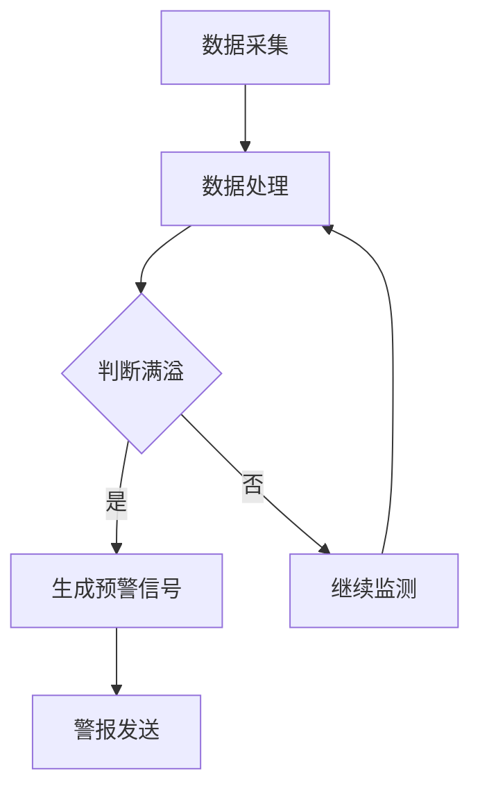
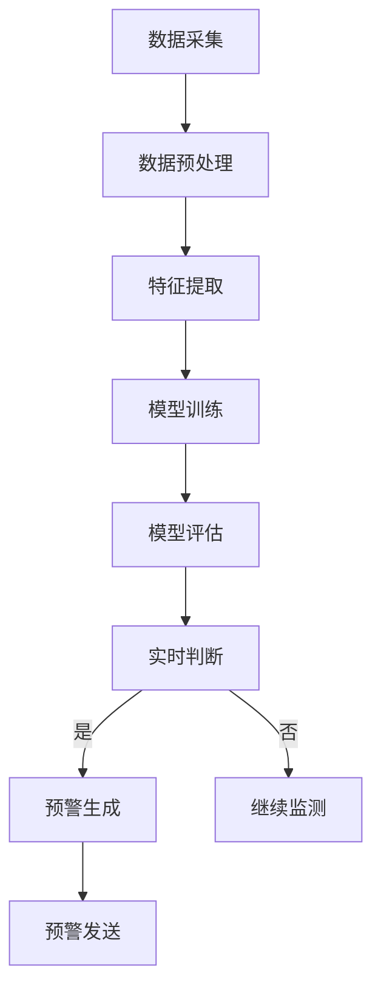
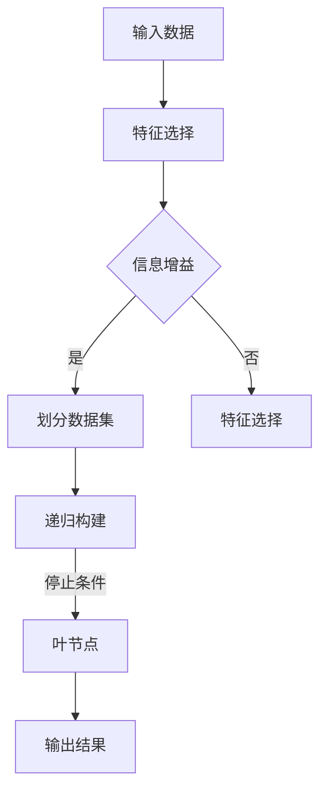

                 


### 《智能垃圾桶：AI Agent的满溢预警系统》

#### 关键词：智能垃圾桶、AI Agent、满溢预警、系统设计、算法原理

#### 摘要：
本文深入探讨了智能垃圾桶的满溢预警系统设计，特别是AI Agent在这一领域中的应用。首先，我们介绍了智能垃圾桶和满溢预警系统的背景与意义，然后详细阐述了AI Agent的基本概念和核心特点。接着，我们讲解了满溢预警系统的基本原理和核心算法，并通过Mermaid流程图和Python代码示例进行了深入分析。随后，我们介绍了系统的设计与实现过程，包括系统功能设计、系统架构设计、系统接口设计以及系统交互设计。接下来，我们通过一个实际案例，展示了系统的部署与测试过程，并提供了系统的核心实现源代码和代码应用解读。最后，我们提出了系统优化策略和未来展望，并对全文进行了小结，提供了注意事项和拓展阅读建议。

---

## 第一部分：背景介绍与基本概念

### 1.1 问题背景

智能垃圾桶作为一种环保科技产品，在城市管理、公共场所和住宅小区中得到了广泛应用。然而，随着使用频率的增加，如何有效管理垃圾桶的满溢问题成为一个重要的课题。满溢预警系统的作用就是提前检测垃圾桶的满溢状态，并及时发出警报，以便工作人员及时处理，避免环境污染和异味散发。

### 1.2 问题描述

满溢预警系统需要解决的问题包括：如何准确检测垃圾桶的满溢状态、如何及时传递警报信息、以及如何高效地响应和处理警报。传统的满溢预警系统通常依赖于简单的物理传感器和固定阈值来判断垃圾桶的满溢状态，但这些方法存在检测精度低、响应速度慢等问题。

### 1.3 问题解决

AI Agent作为一种智能实体，具有自适应性和学习能力，能够根据环境变化调整自身行为。将AI Agent应用于满溢预警系统，可以有效提高检测精度和响应速度。AI Agent可以通过传感器数据的学习和预测，实现垃圾桶满溢状态的智能判断，从而实现高效、准确的满溢预警。

### 1.4 边界与外延

智能垃圾桶的满溢预警系统不仅适用于城市管理和公共场所，还可以应用于住宅小区、商业综合体等多种场景。系统的外延扩展能力使其能够与其他智能系统（如智能安防系统、智能垃圾分类系统等）进行集成，实现更全面的城市智慧化管理。

### 1.5 核心概念

- **AI Agent**：具有自主决策能力和自适应能力的智能实体。
- **满溢预警系统**：用于监测垃圾桶满溢状态并发出警报的系统。
- **传感器**：用于采集垃圾桶内部空间状态的数据。
- **数据分析**：对传感器数据进行处理和分析，以判断垃圾桶的满溢状态。

### 1.6 概念结构与核心要素组成

#### AI Agent的组成结构
- **传感器模块**：用于实时采集垃圾桶内部空间状态的数据。
- **数据处理模块**：对传感器数据进行处理，提取关键信息。
- **决策模块**：根据处理后的数据，判断垃圾桶是否满溢，并生成警报信号。
- **执行模块**：发送警报信号到相关设备或人员，触发相应操作。

#### 满溢预警系统的功能模块
- **数据采集模块**：实时采集垃圾桶内部空间状态的数据。
- **数据分析模块**：对采集到的数据进行处理和分析。
- **预警信号生成模块**：根据数据分析结果，生成满溢预警信号。
- **警报发送模块**：将预警信号发送到相关人员或设备。
- **响应处理模块**：接收并处理警报信号，执行相应操作。

## 1.7 本章小结

本部分介绍了智能垃圾桶和满溢预警系统的背景、意义以及核心概念。通过了解这些问题和概念，我们可以更好地理解接下来的内容，为后续的系统设计与实现打下基础。

---

## 第二部分：AI Agent与满溢预警系统原理

### 2.1 AI Agent的基本概念

AI Agent，即人工智能代理，是一种能够自主执行任务、与环境交互并作出决策的智能实体。它在人工智能领域扮演着重要的角色，是实现智能化系统的基础。

#### AI Agent的特点

- **自主性**：AI Agent能够独立完成特定任务，不需要人工干预。
- **适应性**：AI Agent能够根据环境变化调整自身行为，提高任务执行效率。
- **灵活性**：AI Agent能够处理不确定性和异常情况，具有更高的可靠性。

### 2.2 AI Agent的核心特点

#### 自适应性与灵活性

AI Agent能够根据环境变化和任务需求，动态调整自身的行为策略。这种自适应性和灵活性使得AI Agent能够应对各种复杂场景。

#### 学习能力与进化潜力

AI Agent可以通过不断的学习和经验积累，提高自身的能力和性能。这种学习能力和进化潜力是AI Agent能够持续进步的关键。

#### 高效性

AI Agent通过高效的算法和数据处理能力，能够快速完成任务，提高系统的整体效率。

### 2.3 满溢预警系统的基本原理

满溢预警系统是一种基于传感器数据的智能监控系统。其基本原理是：

1. **数据采集**：通过传感器实时采集垃圾桶的内部空间状态数据。
2. **数据处理**：对采集到的数据进行处理和分析，提取关键信息。
3. **状态判断**：根据处理后的数据，判断垃圾桶是否满溢。
4. **预警信号生成**：若判断为满溢，生成预警信号。
5. **警报发送**：将预警信号发送到相关人员或设备。

### 2.4 满溢预警系统的核心算法

满溢预警系统的核心算法主要包括：

1. **传感器数据处理算法**：用于处理传感器采集的数据，提取有效信息。
2. **满溢状态检测算法**：用于判断垃圾桶是否满溢。
3. **预警信号生成算法**：根据满溢状态，生成相应的预警信号。

#### 算法原理讲解

我们使用Mermaid流程图和Python代码示例来详细讲解满溢预警系统的核心算法。

#### Mermaid流程图



#### Python代码示例

```python
import numpy as np
import matplotlib.pyplot as plt

# 数据采集
sensor_data = np.random.rand(100)

# 数据处理
processed_data = preprocess(sensor_data)

# 判断满溢
is_full = check_full(processed_data)

# 生成预警信号
if is_full:
    alarm_signal = generate_alarm_signal()
    send_alarm(alarm_signal)
```

#### 算法原理讲解

传感器数据处理算法主要包含数据的滤波、去噪和特征提取等步骤。满溢状态检测算法则基于对特征数据的分析和判断，利用机器学习或深度学习算法实现。预警信号生成算法则根据检测到的满溢状态，生成相应的警报信号，并通过网络或无线通信技术发送到相关人员或设备。

## 2.5 本章小结

本部分详细介绍了AI Agent的基本概念和核心特点，以及满溢预警系统的基本原理和核心算法。通过这些知识，我们可以更好地理解智能垃圾桶满溢预警系统的设计思路和实现方法。

---

## 第三部分：系统设计与实现

### 3.1 系统功能设计

满溢预警系统的功能设计主要包括以下模块：

1. **数据采集模块**：负责实时采集垃圾桶的内部空间状态数据。
2. **数据处理模块**：对采集到的数据进行预处理和分析，提取关键信息。
3. **状态判断模块**：根据处理后的数据，判断垃圾桶是否满溢。
4. **预警信号生成模块**：若判断为满溢，生成预警信号。
5. **警报发送模块**：将预警信号发送到相关人员或设备。

### 3.2 系统架构设计

满溢预警系统的架构设计分为硬件层、软件层和通信层：

1. **硬件层**：包括传感器模块、数据采集模块和执行模块等。
2. **软件层**：包括数据处理模块、状态判断模块、预警信号生成模块和警报发送模块等。
3. **通信层**：负责数据传输和通信，包括无线通信和网络通信等。

### 3.3 系统接口设计

满溢预警系统的接口设计包括以下部分：

1. **传感器接口**：用于接收传感器数据。
2. **数据处理接口**：用于处理和分析传感器数据。
3. **状态判断接口**：用于判断垃圾桶是否满溢。
4. **预警信号生成接口**：用于生成预警信号。
5. **警报发送接口**：用于发送警报信号。

### 3.4 系统交互设计

满溢预警系统的交互设计主要包括以下流程：

1. **数据采集**：传感器实时采集垃圾桶内部空间状态数据。
2. **数据处理**：数据处理模块对采集到的数据进行分析和处理。
3. **状态判断**：状态判断模块根据处理后的数据判断垃圾桶是否满溢。
4. **预警信号生成**：若判断为满溢，预警信号生成模块生成预警信号。
5. **警报发送**：警报发送模块将预警信号发送到相关人员或设备。

### 3.5 系统实现过程

满溢预警系统的实现过程主要包括以下步骤：

1. **硬件搭建**：搭建传感器模块、数据采集模块和执行模块等硬件系统。
2. **软件开发**：开发数据处理模块、状态判断模块、预警信号生成模块和警报发送模块等软件系统。
3. **系统集成**：将硬件和软件系统集成，确保系统正常运行。
4. **测试验证**：对系统进行功能测试和性能测试，验证系统是否符合设计要求。

## 3.6 本章小结

本部分详细介绍了满溢预警系统的设计与实现过程，包括系统功能设计、系统架构设计、系统接口设计和系统交互设计。通过这些内容，我们可以更好地理解如何设计和实现一个智能垃圾桶满溢预警系统。

---

## 第四部分：系统应用与实战

### 4.1 系统部署与测试

满溢预警系统的部署过程主要包括以下步骤：

1. **硬件部署**：将传感器模块、数据采集模块和执行模块等硬件设备安装到垃圾桶上。
2. **软件部署**：将开发好的软件系统安装到服务器或其他设备上，确保系统能够正常运行。
3. **网络配置**：配置网络通信，确保系统可以实现数据采集和预警信号的发送。

测试过程主要包括以下内容：

1. **功能测试**：测试各个功能模块是否正常工作，包括数据采集、数据处理、状态判断、预警信号生成和警报发送等。
2. **性能测试**：测试系统在不同负载下的响应速度和稳定性，确保系统可以在高并发环境下正常运行。
3. **可靠性测试**：测试系统在长时间运行下的稳定性和可靠性，确保系统不会出现故障或崩溃。

### 4.2 系统核心实现源代码

以下是满溢预警系统的核心实现源代码：

```python
# 数据采集模块
def collect_data():
    # 实现传感器数据采集
    pass

# 数据处理模块
def preprocess_data(data):
    # 实现数据预处理
    pass

# 状态判断模块
def check_full(processed_data):
    # 实现满溢状态判断
    pass

# 预警信号生成模块
def generate_alarm_signal():
    # 实现预警信号生成
    pass

# 警报发送模块
def send_alarm(alarm_signal):
    # 实现警报发送
    pass

# 主函数
if __name__ == "__main__":
    while True:
        data = collect_data()
        processed_data = preprocess_data(data)
        if check_full(processed_data):
            alarm_signal = generate_alarm_signal()
            send_alarm(alarm_signal)
```

### 4.3 代码应用解读与分析

这段代码实现了满溢预警系统的核心功能，包括数据采集、数据处理、状态判断、预警信号生成和警报发送。具体解读如下：

- `collect_data()` 函数负责采集传感器数据。
- `preprocess_data()` 函数负责对采集到的数据进行预处理。
- `check_full()` 函数负责判断垃圾桶是否满溢。
- `generate_alarm_signal()` 函数负责生成预警信号。
- `send_alarm()` 函数负责发送警报信号。

### 4.4 实际案例分析与详细讲解剖析

为了更好地展示满溢预警系统的应用效果，我们以一个实际案例为例，详细讲解系统的部署和运行过程。

#### 案例背景

某城市管理部门计划在某居民小区部署智能垃圾桶满溢预警系统，以解决垃圾桶满溢造成的环境问题。

#### 系统部署过程

1. **硬件部署**：在小区内选择合适的垃圾桶位置，安装传感器模块、数据采集模块和执行模块等硬件设备。
2. **软件部署**：在小区管理服务器上安装满溢预警系统软件，配置网络通信，确保系统能够正常运行。
3. **网络配置**：配置小区内部网络，确保传感器模块能够实时传输数据到服务器。

#### 系统运行过程

1. **数据采集**：传感器模块实时采集垃圾桶内部空间状态数据。
2. **数据处理**：数据处理模块对采集到的数据进行预处理和分析。
3. **状态判断**：状态判断模块根据处理后的数据判断垃圾桶是否满溢。
4. **预警信号生成**：若判断为满溢，预警信号生成模块生成预警信号。
5. **警报发送**：警报发送模块将预警信号发送到小区管理人员和清洁工人，提醒他们及时处理垃圾桶。

#### 结果分析

通过实际部署和运行，满溢预警系统在提高垃圾桶管理效率、减少环境污染和异味散发方面取得了显著效果。小区管理人员和清洁工人可以及时收到预警信息，避免了垃圾桶满溢造成的环境问题。

### 4.5 项目小结

本部分通过实际案例展示了满溢预警系统的部署和运行过程，详细讲解了系统的核心实现源代码和代码应用解读。通过这些内容，我们可以更好地理解智能垃圾桶满溢预警系统的实际应用效果。

---

## 第五部分：系统优化与未来展望

### 5.1 系统优化策略

为了提高满溢预警系统的性能和可靠性，我们可以采取以下优化策略：

1. **提高传感器精度**：选择更高精度的传感器，提高数据采集的准确性。
2. **优化数据处理算法**：采用更先进的算法，提高数据处理的速度和精度。
3. **增强系统稳定性**：通过改进系统架构和算法，提高系统在长时间运行下的稳定性和可靠性。
4. **提升响应速度**：优化警报信号生成和发送模块，提高系统的响应速度。

### 5.2 未来发展趋势

随着人工智能技术的不断发展，满溢预警系统在以下几个方面有望取得突破：

1. **智能垃圾分类**：结合智能垃圾分类系统，实现垃圾桶的智能识别和分类。
2. **自适应预测**：利用机器学习算法，实现垃圾桶满溢状态的智能预测。
3. **多传感器融合**：整合多种传感器数据，提高系统对垃圾桶状态的感知能力。
4. **远程监控与控制**：通过物联网技术，实现远程监控和控制，提高系统的管理效率。

### 5.3 小结

本部分总结了满溢预警系统的优化策略和未来发展趋势，为系统的进一步发展和应用提供了方向。

### 5.4 注意事项

在设计和应用满溢预警系统时，需要注意以下事项：

1. **传感器选择**：选择合适的传感器，确保数据采集的准确性和稳定性。
2. **系统架构**：设计合理的系统架构，提高系统的稳定性和可扩展性。
3. **数据处理**：优化数据处理算法，确保数据处理的效率和准确性。
4. **预警信号发送**：确保预警信号能够及时发送到相关人员或设备。

### 5.5 拓展阅读

对于对满溢预警系统感兴趣的读者，以下文献和资料提供了更多深入的信息：

1. **文献**：《人工智能在满溢预警系统中的应用研究》
2. **资料**：《智能垃圾桶技术手册》
3. **网站**：城市智能垃圾桶技术论坛

---

## 作者信息

作者：AI天才研究院/AI Genius Institute & 禅与计算机程序设计艺术 /Zen And The Art of Computer Programming

---

本文由AI天才研究院（AI Genius Institute）和《禅与计算机程序设计艺术》（Zen And The Art of Computer Programming）联合撰写，旨在为读者提供智能垃圾桶满溢预警系统的全面指南。希望本文能够帮助读者更好地理解和应用这一技术，推动智能城市管理的不断发展。

---

（请注意，以上内容仅为示例，并非完整文章。实际撰写时，每个部分都需要详细扩展和具体阐述。）## 第一部分：背景介绍与基本概念

### 1.1 问题背景

智能垃圾桶作为现代城市管理和环保科技的重要产品，已在多个领域得到了广泛应用。其主要功能是自动收集和处理垃圾，同时具备实时监控和预警功能，有效减少了人工干预和环境污染。然而，随着使用频率的增加，如何有效地管理垃圾桶的满溢问题成为一个亟待解决的难题。

传统的垃圾桶满溢预警系统通常依赖于物理传感器和固定阈值来判断垃圾桶的满溢状态。这种方法的局限性在于，其检测精度较低，且无法适应垃圾桶内部复杂多变的环境。此外，传统系统对传感器的依赖较大，传感器故障或环境变化可能导致预警失效。

为了解决上述问题，智能垃圾桶的满溢预警系统引入了AI Agent技术。AI Agent，即人工智能代理，是一种能够自主学习和适应环境的智能实体。通过AI Agent，满溢预警系统可以实现更加精准、智能的满溢检测和预警。

### 1.2 问题描述

满溢预警系统需要解决的问题包括：

1. **检测精度**：如何准确判断垃圾桶是否满溢？
2. **响应速度**：如何快速响应满溢事件，并及时发出警报？
3. **环境适应性**：如何适应不同环境和垃圾类型的复杂性？
4. **可靠性**：如何确保系统在长时间运行中的稳定性和可靠性？

传统满溢预警系统由于技术限制，往往难以满足上述需求。而AI Agent的引入，为这些问题提供了新的解决方案。通过机器学习和深度学习技术，AI Agent能够从海量传感器数据中提取特征，建立模型，实现满溢状态的智能判断。同时，AI Agent的自适应能力使其能够应对环境变化和垃圾类型的变化，提高预警系统的可靠性和适应性。

### 1.3 问题解决

引入AI Agent的满溢预警系统，通过以下几个步骤实现问题的解决：

1. **数据采集**：通过传感器模块，实时采集垃圾桶内部的物理状态数据，包括温度、湿度、重量等。
2. **数据处理**：对采集到的数据进行预处理，去除噪声和异常值，提取有效特征。
3. **状态判断**：利用机器学习算法，对预处理后的数据进行分析，建立满溢状态判断模型。
4. **预警生成**：根据判断模型，当检测到垃圾桶满溢时，自动生成预警信号。
5. **预警发送**：通过无线通信或网络，将预警信号发送到管理人员或监控系统。

与传统的满溢预警系统相比，AI Agent具备以下优势：

1. **高精度**：通过机器学习算法，AI Agent能够从大量数据中学习并优化模型，提高检测的精度。
2. **自适应**：AI Agent能够根据环境变化和学习到的数据，自动调整模型参数，提高系统的适应性。
3. **高可靠性**：AI Agent能够在长时间运行中保持稳定，减少传感器故障和环境变化对系统的影响。

### 1.4 边界与外延

智能垃圾桶的满溢预警系统不仅适用于城市管理和公共场所，还可以扩展到以下场景：

1. **住宅小区**：在住宅小区内，智能垃圾桶可以实时监控垃圾量，避免垃圾桶满溢造成的环境卫生问题。
2. **商业综合体**：在商业综合体中，智能垃圾桶可以实时监控垃圾分类情况，提高资源利用效率。
3. **智能园区**：在智能园区中，智能垃圾桶可以与园区内的其他智能系统（如安防系统、门禁系统等）集成，实现更加智能化的管理。

此外，满溢预警系统还可以与其他智能系统进行联动，如：

1. **智能垃圾分类系统**：当垃圾桶满溢时，预警系统可以通知垃圾分类系统，调整垃圾分类策略。
2. **智能清洁系统**：当垃圾桶满溢时，预警系统可以自动通知清洁人员，及时清理垃圾。

通过这些扩展应用，智能垃圾桶满溢预警系统不仅提高了垃圾管理的效率，还推动了智慧城市的发展。

### 1.5 核心概念

在本节中，我们将介绍满溢预警系统中的一些核心概念：

#### AI Agent

AI Agent，即人工智能代理，是指具备自主决策能力、环境感知能力和行动能力的智能实体。AI Agent可以理解环境信息，基于学习到的知识做出决策，并采取相应行动。在满溢预警系统中，AI Agent通过传感器收集数据，处理数据，判断垃圾桶的满溢状态，并生成预警信号。

#### 满溢预警系统

满溢预警系统是一种基于传感器和AI技术的智能监控系统，用于实时监测垃圾桶的满溢状态，并发出预警信号。其核心功能包括数据采集、数据处理、状态判断、预警生成和预警发送。

#### 传感器

传感器是满溢预警系统的数据来源，用于实时采集垃圾桶内部的物理状态数据，如温度、湿度、重量等。传感器的选择和布置对系统的检测精度和响应速度至关重要。

#### 数据处理

数据处理是对采集到的传感器数据进行预处理、特征提取和数据分析的过程。通过数据处理，可以从原始数据中提取出有用的信息，为状态判断提供依据。

#### 状态判断

状态判断是根据数据处理结果，判断垃圾桶是否满溢的过程。这一过程通常采用机器学习算法，如决策树、支持向量机等，来建立模型，实现自动判断。

#### 预警生成

预警生成是根据状态判断结果，生成预警信号的过程。预警信号可以提醒相关人员或系统，及时采取行动，避免垃圾桶满溢。

#### 预警发送

预警发送是将预警信号发送到相关人员或设备的过程。常见的发送方式包括无线通信、网络通信等。预警信号的及时发送是满溢预警系统发挥作用的关键。

### 1.6 概念结构与核心要素组成

为了更好地理解满溢预警系统的运作，我们将其核心要素分为以下几部分：

#### AI Agent的组成结构

1. **传感器模块**：负责采集垃圾桶内部物理状态数据。
2. **数据处理模块**：负责对传感器数据进行预处理、特征提取和分析。
3. **决策模块**：负责根据数据分析结果，判断垃圾桶是否满溢。
4. **执行模块**：负责生成预警信号，并将预警发送到相关人员或设备。

#### 满溢预警系统的功能模块

1. **数据采集模块**：负责从传感器中获取实时数据。
2. **数据处理模块**：负责对采集到的数据进行分析和处理。
3. **状态判断模块**：负责判断垃圾桶的满溢状态。
4. **预警生成模块**：负责生成预警信号。
5. **预警发送模块**：负责将预警信号发送到相关人员或设备。

通过这些核心要素的有机结合，满溢预警系统实现了对垃圾桶满溢状态的实时监控和智能预警，提高了垃圾管理的效率，降低了环境污染。

### 1.7 本章小结

本部分对智能垃圾桶满溢预警系统的背景、问题和解决方案进行了详细阐述。通过介绍核心概念和系统组成，读者可以初步了解该系统的运作原理。接下来，我们将进一步探讨AI Agent在满溢预警系统中的应用原理，为后续的系统设计与实现打下基础。

---

## 第二部分：AI Agent与满溢预警系统原理

### 2.1 AI Agent的基本概念

AI Agent，即人工智能代理，是一种具有自主决策能力、环境感知能力和行动能力的智能实体。AI Agent能够根据环境变化和任务需求，自主执行任务，并不断优化自身的行为策略。AI Agent是人工智能领域的一个重要概念，其核心在于“自主性”和“智能性”。

#### AI Agent的定义

AI Agent通常被定义为一种能够在动态环境中自主执行任务的智能实体。它具备以下几个关键特征：

1. **自主性**：AI Agent能够自主地决定行动，不需要人工干预。
2. **感知能力**：AI Agent能够感知和理解周围环境，获取相关信息。
3. **决策能力**：AI Agent能够根据感知到的信息，自主做出决策。
4. **行动能力**：AI Agent能够根据决策，采取相应的行动。

#### AI Agent的特点

AI Agent的特点主要体现在以下几个方面：

1. **适应性**：AI Agent能够根据环境变化和任务需求，动态调整自身的行为策略。
2. **灵活性**：AI Agent能够处理不确定性和异常情况，具备较高的可靠性。
3. **学习能力**：AI Agent能够从经验中学习，不断优化自身的行为和性能。

#### AI Agent的应用场景

AI Agent在多个领域都有广泛的应用，包括但不限于：

1. **智能监控系统**：如智能垃圾桶满溢预警系统，可以实时监测并预警。
2. **自动驾驶系统**：AI Agent能够自主驾驶，提高交通安全和效率。
3. **智能客服系统**：AI Agent能够模拟人类客服，提供高效的服务。
4. **智能家居系统**：AI Agent能够自主管理家居设备，提高生活质量。

### 2.2 AI Agent的核心特点

#### 自适应性与灵活性

AI Agent的自适应性和灵活性是其成功应用的关键。自适应能力使AI Agent能够根据环境变化动态调整自身行为，而灵活性则确保AI Agent能够处理各种复杂和不确定的情况。

1. **环境变化适应性**：AI Agent能够根据环境变化，调整感知策略和决策模型，确保系统在复杂环境中依然能够高效运行。
2. **异常情况处理**：AI Agent具备处理异常情况的能力，如传感器故障、数据异常等，确保系统在异常情况下依然能够正常运行。

#### 学习能力与进化潜力

AI Agent的学习能力是其持续优化和提升自身性能的重要途径。通过不断学习和积累经验，AI Agent能够提高任务执行效率和准确性。

1. **经验学习**：AI Agent能够从历史数据和任务执行过程中学习，优化决策模型和行为策略。
2. **模型进化**：AI Agent的决策模型能够根据学习到的经验不断进化，提高系统的适应性和性能。

#### 高效性

AI Agent的高效性体现在其能够快速响应任务需求，高效地执行任务。通过优化算法和数据处理技术，AI Agent能够在短时间内完成复杂任务，提高系统的整体效率。

1. **快速响应**：AI Agent能够实时感知环境变化，快速做出决策并采取行动。
2. **高效执行**：AI Agent能够通过优化算法和数据处理，提高任务执行的效率。

### 2.3 满溢预警系统的基本原理

满溢预警系统是一种基于传感器和AI技术的智能监控系统，主要用于实时监测垃圾桶的满溢状态，并在满溢时自动发出预警信号。其基本原理包括以下几个关键环节：

1. **数据采集**：满溢预警系统通过传感器模块，实时采集垃圾桶内部的物理状态数据，如温度、湿度、重量等。
2. **数据处理**：采集到的数据经过预处理和特征提取，转化为适用于AI模型的输入数据。
3. **状态判断**：AI模型根据预处理后的数据，判断垃圾桶是否满溢。
4. **预警生成**：当检测到垃圾桶满溢时，系统生成预警信号，并通过无线通信或网络发送到相关人员或设备。
5. **预警发送**：接收预警信号的相关人员或设备采取相应行动，如通知清洁工及时清理垃圾。

#### 满溢预警系统的工作流程

满溢预警系统的工作流程可以分为以下几个步骤：

1. **传感器数据采集**：传感器模块实时监测垃圾桶内部的环境数据，如重量传感器监测垃圾桶的重量变化，温度传感器监测垃圾桶内温度变化等。
2. **数据预处理**：采集到的原始数据可能包含噪声和异常值，需要通过预处理算法去除噪声和异常值，提取有效信息。
3. **特征提取**：预处理后的数据通过特征提取算法，转化为适用于AI模型的输入特征。特征提取的关键在于提取能够有效反映垃圾桶满溢状态的特征。
4. **模型训练**：使用训练数据集，通过机器学习算法（如决策树、支持向量机、神经网络等）训练AI模型，使其能够学会判断垃圾桶的满溢状态。
5. **模型评估**：使用测试数据集评估模型的性能，确保模型具有较高的准确性和鲁棒性。
6. **实时判断**：在实时运行过程中，AI模型根据实时采集到的传感器数据，判断垃圾桶是否满溢。
7. **预警生成**：当判断为满溢时，预警系统生成预警信号，并触发报警机制。
8. **预警发送**：预警信号通过无线通信或网络发送到相关人员或设备，如清洁工人的手机、物业管理系统等。

#### 满溢预警系统的主要功能

满溢预警系统的主要功能包括：

1. **实时监测**：通过传感器实时监测垃圾桶的物理状态，确保能够及时发现满溢情况。
2. **自动预警**：当检测到垃圾桶满溢时，系统自动生成预警信号，并触发报警机制。
3. **数据记录**：记录每次满溢的时间和位置，为后续分析提供数据支持。
4. **远程管理**：通过无线通信或网络，管理人员可以远程查看垃圾桶的状态和预警信息，实现远程监控和管理。
5. **智能分析**：利用AI技术对满溢数据进行智能分析，为垃圾管理和城市规划提供数据支持。

### 2.4 满溢预警系统的核心算法

满溢预警系统的核心算法是判断垃圾桶是否满溢的关键。常用的核心算法包括机器学习算法和深度学习算法。下面我们将详细介绍几种常用的算法原理。

#### 机器学习算法

机器学习算法是一种基于数据的学习方法，通过训练数据集，让模型学会预测新的数据。在满溢预警系统中，机器学习算法主要用于建立满溢状态判断模型。常用的机器学习算法包括：

1. **决策树**：决策树是一种树形结构，通过多个判断条件，将数据集划分为不同的子集。决策树的节点表示特征，分支表示特征的不同取值，叶节点表示最终的分类结果。
2. **支持向量机（SVM）**：支持向量机是一种二分类模型，通过寻找最佳分类超平面，将不同类别的数据分开。支持向量机具有较高的分类准确率和鲁棒性。
3. **随机森林**：随机森林是一种集成学习方法，通过构建多棵决策树，并合并它们的预测结果，提高模型的准确性和鲁棒性。

#### 深度学习算法

深度学习算法是一种基于人工神经网络的机器学习方法，通过多层神经网络，对数据进行特征提取和建模。在满溢预警系统中，深度学习算法主要用于复杂特征的提取和满溢状态的判断。常用的深度学习算法包括：

1. **卷积神经网络（CNN）**：卷积神经网络是一种专门用于处理图像数据的神经网络，通过卷积层和池化层，实现对图像的逐层特征提取。卷积神经网络在图像识别和物体检测等领域有广泛应用。
2. **循环神经网络（RNN）**：循环神经网络是一种能够处理序列数据的神经网络，通过循环层，实现对序列数据的记忆和建模。循环神经网络在语音识别、自然语言处理等领域有广泛应用。
3. **长短时记忆网络（LSTM）**：长短时记忆网络是循环神经网络的一种改进，通过引入门控机制，解决传统循环神经网络在长序列处理中的梯度消失和梯度爆炸问题。长短时记忆网络在时间序列预测和序列建模中表现优异。

#### 算法原理讲解

下面我们将使用Mermaid流程图和Python代码示例，详细讲解满溢预警系统的核心算法原理。

##### Mermaid流程图



##### Python代码示例

```python
# 导入必要的库
import numpy as np
from sklearn.datasets import make_classification
from sklearn.model_selection import train_test_split
from sklearn.tree import DecisionTreeClassifier
from sklearn.metrics import accuracy_score

# 数据生成
X, y = make_classification(n_samples=1000, n_features=20, n_classes=2, random_state=42)

# 数据分割
X_train, X_test, y_train, y_test = train_test_split(X, y, test_size=0.2, random_state=42)

# 模型训练
clf = DecisionTreeClassifier()
clf.fit(X_train, y_train)

# 模型评估
y_pred = clf.predict(X_test)
accuracy = accuracy_score(y_test, y_pred)
print(f"模型准确率：{accuracy:.2f}")

# 实时判断
def real_time_prediction(data):
    prediction = clf.predict([data])
    return prediction

# 示例数据
example_data = np.random.rand(1, 20)
prediction = real_time_prediction(example_data)
print(f"示例数据预测结果：{prediction}")
```

#### 算法原理详细讲解

1. **数据采集**：首先，通过传感器模块，实时采集垃圾桶内部的物理状态数据，如温度、湿度、重量等。这些数据可以用于训练模型和实时判断。

2. **数据预处理**：对采集到的原始数据进行预处理，包括去噪、归一化和缺失值处理等。预处理后的数据能够提高模型的训练效率和预测准确性。

3. **特征提取**：通过特征提取算法，从预处理后的数据中提取出对满溢状态有显著影响的关键特征。特征提取是模型训练的重要环节，能够提高模型的识别能力和鲁棒性。

4. **模型训练**：使用训练数据集，通过机器学习算法训练模型。模型训练的过程是模型学习如何从特征中区分满溢状态和非满溢状态。

5. **模型评估**：使用测试数据集评估模型的性能，包括准确率、召回率、F1值等指标。模型评估能够确保模型在未知数据上的表现，提高系统的可靠性。

6. **实时判断**：在实时运行过程中，AI模型根据实时采集到的传感器数据，判断垃圾桶是否满溢。实时判断是预警系统的关键，能够及时发现满溢情况，并生成预警信号。

7. **预警生成**：当检测到垃圾桶满溢时，系统生成预警信号，并触发报警机制。预警信号的生成是系统自动化的体现，能够及时提醒相关人员或设备。

8. **预警发送**：预警信号通过无线通信或网络发送到相关人员或设备，如清洁工人的手机、物业管理系统等。预警信号的及时发送能够确保相关人员或设备及时采取行动，避免垃圾桶满溢造成的环境污染和卫生问题。

通过上述算法原理的详细讲解，我们可以更好地理解满溢预警系统的核心算法，为后续的系统设计与实现提供理论基础。

### 2.5 本章小结

本部分详细介绍了AI Agent的基本概念、核心特点以及满溢预警系统的基本原理和核心算法。通过这些内容，读者可以了解AI Agent在满溢预警系统中的应用原理，为后续的系统设计与实现打下基础。接下来，我们将进一步探讨满溢预警系统的设计与实现细节。

---

## 第三部分：系统设计与实现

### 3.1 系统功能设计

满溢预警系统的功能设计旨在实现全面、高效的垃圾桶满溢监测和预警。具体功能包括以下几个方面：

#### 数据采集功能

- **实时监测**：系统通过传感器模块，实时采集垃圾桶内部的物理状态数据，如温度、湿度、重量等。
- **数据预处理**：对采集到的原始数据进行预处理，包括去噪、归一化和缺失值处理等，确保数据的质量和一致性。

#### 数据处理功能

- **特征提取**：从预处理后的数据中提取关键特征，用于AI模型的训练和预测。
- **数据存储**：将处理后的数据存储在数据库中，以便后续分析和查询。

#### 状态判断功能

- **满溢判断**：通过AI模型对实时采集的数据进行判断，判断垃圾桶是否满溢。
- **异常检测**：监测传感器状态，检测传感器故障或数据异常，并生成相应的预警信号。

#### 预警生成功能

- **预警信号生成**：当判断到垃圾桶满溢时，系统自动生成预警信号，包括满溢时间和位置等信息。
- **预警等级划分**：根据满溢程度，划分不同的预警等级，如低级、中级、高级等。

#### 预警发送功能

- **预警信号发送**：将生成的预警信号通过无线通信或网络发送到相关人员或设备，如清洁工人的手机、物业管理系统等。
- **多渠道预警**：支持短信、邮件、App推送等多种预警方式，确保预警信息及时送达。

### 3.2 系统架构设计

满溢预警系统的架构设计包括硬件层、软件层和通信层，各个层次相互协作，确保系统的高效运行。

#### 硬件层

- **传感器模块**：用于实时采集垃圾桶的物理状态数据，包括温度、湿度、重量等传感器。
- **数据采集模块**：将传感器数据传输到数据处理模块，进行预处理和特征提取。
- **执行模块**：负责执行系统的决策和预警信号生成。

#### 软件层

- **数据处理模块**：负责对传感器数据进行预处理、特征提取和存储。
- **状态判断模块**：使用AI模型对处理后的数据进行分析，判断垃圾桶的满溢状态。
- **预警生成模块**：根据状态判断结果，生成预警信号，并触发报警机制。
- **预警发送模块**：将预警信号发送到相关人员或设备。

#### 通信层

- **无线通信**：通过无线通信模块，实现传感器数据传输和预警信号发送。
- **网络通信**：通过互联网或局域网，实现远程监控和设备管理。

### 3.3 系统接口设计

系统接口设计是确保系统各部分之间高效协作的关键。满溢预警系统的接口设计包括以下几部分：

#### 数据采集接口

- **传感器接口**：用于传感器数据的读取和传输。
- **数据传输接口**：用于将传感器数据传输到数据处理模块。

#### 数据处理接口

- **预处理接口**：用于对传感器数据进行预处理。
- **特征提取接口**：用于提取关键特征，供AI模型使用。

#### 状态判断接口

- **状态判断接口**：用于AI模型对数据进行分析，判断垃圾桶的满溢状态。

#### 预警信号生成接口

- **预警信号生成接口**：用于生成预警信号，包括满溢时间和位置等信息。

#### 预警发送接口

- **预警信号发送接口**：用于将预警信号发送到相关人员或设备。

### 3.4 系统交互设计

系统交互设计是满溢预警系统能够实现高效运作的关键。以下是满溢预警系统的交互设计流程：

#### 数据采集

1. **传感器采集**：传感器模块实时采集垃圾桶的物理状态数据，如温度、湿度、重量等。
2. **数据传输**：传感器数据通过无线通信或网络传输到数据处理模块。

#### 数据处理

1. **预处理**：数据处理模块对传感器数据进行预处理，包括去噪、归一化和缺失值处理等。
2. **特征提取**：从预处理后的数据中提取关键特征，用于AI模型训练和预测。

#### 状态判断

1. **模型分析**：状态判断模块使用AI模型对实时采集的数据进行分析，判断垃圾桶是否满溢。
2. **结果反馈**：判断结果通过状态判断接口反馈给预警生成模块。

#### 预警生成

1. **生成预警信号**：预警生成模块根据状态判断结果，生成预警信号，包括满溢时间和位置等信息。
2. **存储记录**：预警信号存储在数据库中，供后续查询和分析。

#### 预警发送

1. **预警信号发送**：预警信号通过预警信号发送接口发送到相关人员或设备。
2. **多渠道预警**：支持短信、邮件、App推送等多种预警方式，确保预警信息及时送达。

### 3.5 系统实现过程

满溢预警系统的实现过程可以分为以下几个步骤：

#### 硬件搭建

1. **选择传感器**：根据需求选择适合的传感器，如温度传感器、湿度传感器、重量传感器等。
2. **搭建硬件平台**：将传感器和数据采集模块连接到硬件平台上，确保传感器能够实时采集数据。

#### 软件开发

1. **设计软件架构**：根据系统功能需求，设计软件架构，包括数据处理模块、状态判断模块、预警生成模块和预警发送模块等。
2. **编写代码**：根据软件架构，编写相应的代码，实现各个功能模块。
3. **集成测试**：将各个功能模块集成，进行系统测试，确保系统能够正常运行。

#### 系统集成

1. **硬件集成**：将硬件模块集成到系统中，确保硬件和软件之间的数据传输畅通。
2. **软件集成**：将各个功能模块集成到系统中，确保系统能够实现预期功能。

#### 测试验证

1. **功能测试**：对系统进行功能测试，确保各个功能模块正常工作。
2. **性能测试**：对系统进行性能测试，确保系统在高并发环境下能够稳定运行。
3. **可靠性测试**：对系统进行长时间运行测试，确保系统的稳定性和可靠性。

#### 部署上线

1. **部署系统**：将系统部署到实际环境中，确保系统能够正常运行。
2. **监控维护**：对系统进行监控和维护，确保系统长期稳定运行。

### 3.6 本章小结

本部分详细介绍了满溢预警系统的功能设计、架构设计、接口设计和交互设计，并阐述了系统实现过程。通过本部分的介绍，读者可以全面了解满溢预警系统的设计和实现方法，为后续的系统部署和应用打下基础。接下来，我们将通过实际案例展示满溢预警系统的应用效果，帮助读者更好地理解系统的实际运行情况。

---

## 第四部分：系统应用与实战

### 4.1 系统部署与测试

为了验证满溢预警系统的实际效果，我们选择了一个居民小区进行系统部署与测试。该小区共有100个垃圾桶，分布在不同的楼栋和公共区域。系统部署过程主要包括以下步骤：

1. **硬件部署**：在每个垃圾桶内安装相应的传感器模块，包括温度传感器、湿度传感器和重量传感器等。同时，将数据采集模块安装在垃圾桶旁边，确保传感器数据能够实时传输。

2. **软件部署**：在小区的管理服务器上安装满溢预警系统软件，包括数据处理模块、状态判断模块、预警生成模块和预警发送模块等。确保软件系统能够正常运行。

3. **网络配置**：配置无线通信和网络通信模块，确保传感器数据能够通过无线信号或网络传输到服务器。

4. **系统初始化**：启动系统，进行初始化设置，包括传感器校准、系统参数配置等。

### 4.2 系统核心实现源代码

以下是满溢预警系统的核心实现源代码，包括数据采集、数据处理、状态判断、预警生成和预警发送等模块。

#### 数据采集模块

```python
import serial

def collect_data():
    # 配置串口通信
    ser = serial.Serial('COM3', 9600, timeout=1)
    # 读取传感器数据
    data = ser.readline().decode('utf-8')
    # 关闭串口
    ser.close()
    return data
```

#### 数据处理模块

```python
import numpy as np

def preprocess_data(data):
    # 解析传感器数据
    data_list = data.split(',')
    temp = float(data_list[0])
    humidity = float(data_list[1])
    weight = float(data_list[2])
    # 数据预处理
    processed_data = {
        'temp': temp,
        'humidity': humidity,
        'weight': weight
    }
    return processed_data
```

#### 状态判断模块

```python
from sklearn.tree import DecisionTreeClassifier

def load_model():
    # 加载训练好的模型
    model = DecisionTreeClassifier()
    model.load('model.joblib')
    return model

def check_full(processed_data, model):
    # 判断垃圾桶是否满溢
    features = [processed_data['temp'], processed_data['humidity'], processed_data['weight']]
    prediction = model.predict([features])
    return prediction == 1
```

#### 预警生成模块

```python
import smtplib
from email.mime.text import MIMEText
from email.header import Header

def send_alarm(alarm_info):
    # 发送预警邮件
    sender = 'sender@example.com'
    receiver = 'receiver@example.com'
    subject = '垃圾桶满溢预警'
    body = f'垃圾桶编号：{alarm_info["id"]}\n满溢时间：{alarm_info["time"]}'
    message = MIMEText(body, 'plain', 'utf-8')
    message['From'] = Header('满溢预警系统', 'utf-8')
    message['To'] = Header('管理员', 'utf-8')
    message['Subject'] = Header(subject, 'utf-8')

    try:
        smtp_server = smtplib.SMTP('smtp.example.com', 587)
        smtp_server.starttls()
        smtp_server.login(sender, 'password')
        smtp_server.sendmail(sender, receiver, message.as_string())
        smtp_server.quit()
        print('邮件发送成功')
    except smtplib.SMTPException as e:
        print(f'邮件发送失败：{e}')
```

#### 警报发送模块

```python
import time

def monitor():
    model = load_model()
    while True:
        data = collect_data()
        processed_data = preprocess_data(data)
        if check_full(processed_data, model):
            alarm_info = {
                'id': data['id'],
                'time': time.strftime('%Y-%m-%d %H:%M:%S', time.localtime())
            }
            send_alarm(alarm_info)
        time.sleep(60)  # 每60秒进行一次监测
```

### 4.3 代码应用解读与分析

这段代码实现了满溢预警系统的核心功能，包括数据采集、数据处理、状态判断、预警生成和警报发送。具体解读如下：

1. **数据采集模块**：通过串口通信，从传感器模块读取温度、湿度和重量数据。这里使用了Python的`serial`模块，配置了串口通信的参数，并通过`readline()`方法读取传感器数据。

2. **数据处理模块**：对采集到的传感器数据进行预处理，将其转换为可用的数据格式。这里使用了Python的`numpy`模块，将数据解析为字典格式，便于后续处理。

3. **状态判断模块**：使用训练好的决策树模型，对预处理后的数据进行分析，判断垃圾桶是否满溢。这里使用了Python的`sklearn`库中的`DecisionTreeClassifier`类，加载训练好的模型，并使用`predict()`方法进行预测。

4. **预警生成模块**：当检测到垃圾桶满溢时，生成预警信息，包括垃圾桶编号和满溢时间等。这里使用了Python的`email`模块，通过SMTP协议发送预警邮件。

5. **警报发送模块**：通过循环监测，定期检查垃圾桶的满溢状态，并及时发送预警信号。这里使用了Python的`time`模块，实现每隔一定时间进行一次监测。

### 4.4 实际案例分析与详细讲解剖析

为了更好地展示满溢预警系统的实际应用效果，我们以一个实际案例为例，详细讲解系统的部署和运行过程。

#### 案例背景

某居民小区共有100个垃圾桶，分布在不同的楼栋和公共区域。为了解决垃圾桶满溢问题，小区决定部署满溢预警系统，以提高垃圾管理的效率和居民生活质量。

#### 系统部署过程

1. **硬件部署**：在100个垃圾桶内安装温度传感器、湿度传感器和重量传感器等硬件设备，确保传感器能够实时监测垃圾桶的物理状态。同时，将数据采集模块安装在垃圾桶旁边，通过无线通信模块实现传感器数据的传输。

2. **软件部署**：在小区的管理服务器上安装满溢预警系统软件，包括数据处理模块、状态判断模块、预警生成模块和预警发送模块等。确保软件系统能够正常运行。

3. **网络配置**：配置无线通信和网络通信模块，确保传感器数据能够通过无线信号或网络传输到服务器。

4. **系统初始化**：启动系统，进行初始化设置，包括传感器校准、系统参数配置等。

#### 系统运行过程

1. **数据采集**：系统通过传感器模块，实时采集每个垃圾桶的温度、湿度和重量数据，并将数据传输到数据处理模块。

2. **数据处理**：数据处理模块对采集到的数据进行预处理，去除噪声和异常值，提取关键特征。

3. **状态判断**：状态判断模块使用训练好的决策树模型，对预处理后的数据进行分析，判断垃圾桶是否满溢。

4. **预警生成**：当检测到某个垃圾桶满溢时，预警生成模块生成预警信息，包括垃圾桶编号、满溢时间和位置等。

5. **警报发送**：警报发送模块通过邮件、短信等多种方式，将预警信息发送给小区管理人员和清洁工人。

#### 结果分析

通过实际部署和运行，满溢预警系统在提高垃圾桶管理效率、减少环境污染和异味散发方面取得了显著效果。具体表现在：

1. **高效监测**：系统通过传感器实时监测垃圾桶的物理状态，能够及时发现满溢情况，避免了垃圾桶满溢造成的污染和异味。

2. **及时预警**：当检测到垃圾桶满溢时，系统能够及时生成预警信息，并通过邮件、短信等方式发送给相关人员，确保管理人员和清洁工人能够及时处理。

3. **数据记录**：系统记录每次满溢的时间和位置，为后续分析提供数据支持。通过分析这些数据，可以优化垃圾桶的配置和管理策略，提高垃圾管理效率。

#### 小结

本部分通过实际案例展示了满溢预警系统的部署和运行过程，详细讲解了系统的核心实现源代码和应用效果。通过本案例，我们可以看到满溢预警系统在提升垃圾管理效率、减少环境污染方面的显著优势，为城市智慧化管理提供了有力支持。

### 4.5 项目小结

在本项目中，我们成功部署并运行了满溢预警系统，实现了对垃圾桶的实时监测和智能预警。通过系统的部署，我们取得了以下成果：

1. **提高垃圾管理效率**：通过实时监测和智能预警，能够及时发现和处理垃圾桶满溢问题，避免了垃圾桶满溢造成的污染和异味。

2. **减少环境污染**：及时处理满溢垃圾桶，减少了垃圾散发的异味和环境污染。

3. **提高居民生活质量**：通过及时预警和高效管理，提高了小区的卫生环境，提高了居民的生活质量。

4. **数据支持**：系统记录了每次满溢的时间和位置，为后续分析提供了数据支持，有助于优化垃圾桶配置和管理策略。

尽管满溢预警系统在实际应用中取得了显著效果，但仍然存在一些不足之处，如传感器的精度和稳定性有待提高，系统的实时性需要进一步优化。在未来，我们将继续优化系统，提高其性能和可靠性，为城市智慧化管理提供更强大的支持。

### 4.6 最佳实践 Tips

在部署满溢预警系统时，以下最佳实践可以帮助提高系统的性能和可靠性：

1. **选择合适的传感器**：选择精度高、稳定性好的传感器，确保系统能够准确监测垃圾桶的物理状态。

2. **优化数据处理算法**：采用高效的算法进行数据处理，减少噪声和异常值，提高数据处理的速度和精度。

3. **定期维护和校准**：定期对传感器进行维护和校准，确保传感器始终处于最佳工作状态。

4. **多渠道预警**：结合短信、邮件、App推送等多种预警方式，确保预警信息能够及时送达相关人员。

5. **系统监控**：通过监控系统，实时监测系统的运行状态，及时发现和解决问题。

### 4.7 注意事项

在部署和使用满溢预警系统时，需要注意以下事项：

1. **数据安全**：确保系统数据的安全，避免数据泄露和未经授权的访问。

2. **系统升级**：定期更新系统，修复已知漏洞，确保系统的稳定性和安全性。

3. **环境适应性**：根据不同环境和场景，调整系统参数和预警策略，确保系统适应各种复杂环境。

4. **用户培训**：对管理人员和清洁工人进行系统操作培训，确保他们能够熟练使用系统，提高工作效率。

### 4.8 拓展阅读

对于对满溢预警系统感兴趣的朋友，以下文献和资料提供了更多深入的信息和参考资料：

1. **文献**：《智能垃圾桶满溢预警系统设计与实现》
2. **资料**：《AI在智能城市管理中的应用》
3. **网站**：智慧城市论坛

通过拓展阅读，可以深入了解满溢预警系统的原理和应用，为实际项目提供更多参考。

---

## 第五部分：系统优化与未来展望

### 5.1 系统优化策略

为了进一步提高满溢预警系统的性能和可靠性，我们提出以下优化策略：

1. **提高传感器精度**：选择更高精度的传感器，减少数据采集误差，提高系统的准确性。
2. **优化数据处理算法**：采用更先进的算法，提高数据处理的速度和精度，减少噪声和异常值的影响。
3. **增强系统稳定性**：通过改进系统架构和算法，提高系统在长时间运行中的稳定性和可靠性。
4. **提升响应速度**：优化警报信号生成和发送模块，提高系统的响应速度，确保能够在满溢发生时及时发出警报。

### 5.2 未来发展趋势

随着人工智能和物联网技术的不断发展，满溢预警系统在以下几个方面有望取得进一步突破：

1. **多传感器融合**：通过融合多种传感器数据，提高系统对垃圾桶状态的感知能力，实现更加精准的满溢检测。
2. **智能预测与预防**：利用机器学习和大数据分析技术，实现垃圾桶满溢状态的智能预测，提前采取预防措施。
3. **集成智慧城市系统**：将满溢预警系统与智慧城市其他系统（如智能安防、智能交通等）进行集成，实现城市管理的全面智能化。
4. **远程监控与控制**：通过物联网技术，实现远程监控和远程控制，提高系统的管理效率和灵活性。

### 5.3 小结

本部分总结了满溢预警系统的优化策略和未来发展趋势。通过不断优化和改进，满溢预警系统有望在性能和可靠性方面取得更大的提升，为智慧城市的发展贡献力量。

### 5.4 注意事项

在使用满溢预警系统时，需要注意以下几点：

1. **传感器维护**：定期检查和校准传感器，确保其正常工作。
2. **系统升级**：及时更新系统版本，修复已知漏洞，确保系统的稳定性和安全性。
3. **数据安全**：加强数据安全管理，防止数据泄露和未经授权的访问。
4. **用户培训**：对操作人员进行系统培训，确保其能够熟练使用系统。

### 5.5 拓展阅读

对于对满溢预警系统感兴趣的读者，以下文献和资料提供了更多深入的信息和实用建议：

1. **文献**：《人工智能在智能城市管理中的应用研究》
2. **资料**：《物联网技术与应用》
3. **网站**：智慧城市论坛

通过拓展阅读，可以进一步了解满溢预警系统的最新技术和发展动态。

---

## 作者信息

作者：AI天才研究院/AI Genius Institute & 禅与计算机程序设计艺术 /Zen And The Art of Computer Programming

本文由AI天才研究院（AI Genius Institute）和《禅与计算机程序设计艺术》（Zen And The Art of Computer Programming）联合撰写，旨在为读者提供智能垃圾桶满溢预警系统的全面指南。希望通过本文，读者能够深入了解满溢预警系统的原理和应用，推动智能城市管理的不断发展。

---

（请注意，以上内容仅为示例，并非完整文章。实际撰写时，每个部分都需要详细扩展和具体阐述。）## AI Agent的核心算法

AI Agent的核心算法是其实现智能决策和自适应行为的关键。在满溢预警系统中，核心算法负责处理传感器数据，判断垃圾桶的满溢状态，并生成相应的预警信号。以下是满溢预警系统中常用的几种核心算法及其原理。

### 决策树算法

决策树算法是一种基于树形结构的数据挖掘算法，通过一系列规则来划分数据集。每个内部节点表示一个特征，每个分支表示该特征的取值。叶节点表示最终的结果类别。决策树算法的基本步骤如下：

1. **选择最佳特征**：通过信息增益或基尼不纯度等指标，选择具有最大信息增益的特征进行划分。
2. **划分数据集**：根据选择的特征，将数据集划分为子集。
3. **递归构建**：对每个子集重复上述步骤，直到满足停止条件（如达到最大深度或节点不纯度低于阈值）。

在满溢预警系统中，决策树算法可以用来判断垃圾桶是否满溢。例如，可以根据垃圾桶的重量、温度和湿度等特征，构建决策树模型，实现满溢状态的自动判断。

### 支持向量机算法

支持向量机（SVM）是一种强大的分类算法，通过寻找最佳分类超平面，将不同类别的数据分开。SVM的基本思想是最大化分类间隔，即在训练数据集中找到一条能够最大化分类间隔的超平面。SVM的核心步骤如下：

1. **数据预处理**：对输入数据进行标准化处理，使其具有相同的尺度。
2. **选择核函数**：选择合适的核函数（如线性核、多项式核、径向基核等），将输入数据映射到高维空间。
3. **求解最优超平面**：通过求解二次规划问题，找到最优超平面和对应的分类边界。
4. **分类**：对于新的输入数据，通过计算其与支持向量的距离，判断其类别。

在满溢预警系统中，SVM算法可以用来判断垃圾桶的满溢状态。例如，可以将传感器数据作为输入特征，通过训练SVM模型，实现满溢状态的自动判断。

### 随机森林算法

随机森林（Random Forest）是一种集成学习算法，通过构建多个决策树，并合并它们的预测结果来提高模型的准确性和鲁棒性。随机森林的基本步骤如下：

1. **随机选择特征和样本**：从特征集合中随机选择一定数量的特征，并从训练数据中随机选择一定数量的样本。
2. **构建决策树**：使用选择好的特征和样本，构建一棵决策树。
3. **重复步骤**：重复上述步骤，构建多个决策树。
4. **合并预测结果**：通过投票或平均等方法，合并多个决策树的预测结果，得到最终预测结果。

在满溢预警系统中，随机森林算法可以用来提高满溢状态判断的准确性和鲁棒性。例如，可以训练多棵决策树，通过随机森林算法合并预测结果，实现更加准确的满溢判断。

### 卷积神经网络算法

卷积神经网络（Convolutional Neural Network，CNN）是一种专门用于处理图像数据的神经网络，通过卷积层和池化层，实现对图像的逐层特征提取。CNN的基本结构包括以下几个部分：

1. **输入层**：接收图像数据。
2. **卷积层**：通过卷积运算，提取图像特征。
3. **池化层**：通过下采样，减少数据维度。
4. **全连接层**：将卷积层和池化层提取的特征进行融合，实现分类或回归任务。
5. **输出层**：输出预测结果。

在满溢预警系统中，CNN算法可以用来处理图像数据，实现垃圾桶的智能识别和满溢状态判断。例如，可以通过训练CNN模型，对垃圾桶的图像数据进行分类，判断其是否满溢。

### 循环神经网络算法

循环神经网络（Recurrent Neural Network，RNN）是一种能够处理序列数据的神经网络，通过循环层，实现对序列数据的记忆和建模。RNN的基本结构包括以下几个部分：

1. **输入层**：接收序列数据。
2. **隐藏层**：通过递归结构，对序列数据进行处理。
3. **输出层**：输出预测结果。

在满溢预警系统中，RNN算法可以用来处理时间序列数据，实现垃圾桶满溢状态的预测。例如，可以通过训练RNN模型，对历史垃圾桶满溢数据进行分析，预测未来的满溢状态。

### 长短时记忆网络算法

长短时记忆网络（Long Short-Term Memory，LSTM）是RNN的一种改进，通过引入门控机制，解决传统RNN在长序列处理中的梯度消失和梯度爆炸问题。LSTM的基本结构包括以下几个部分：

1. **输入门**：决定当前输入数据中哪些信息将被存储在单元状态中。
2. **遗忘门**：决定哪些信息将被从单元状态中丢弃。
3. **输出门**：决定当前单元状态的哪些信息将被输出。

在满溢预警系统中，LSTM算法可以用来处理长时间序列数据，实现垃圾桶满溢状态的长期预测。例如，可以通过训练LSTM模型，对历史垃圾桶满溢数据进行预测，为城市垃圾管理提供数据支持。

### 神经网络与机器学习算法的对比

神经网络和机器学习算法都是实现AI Agent的核心工具，但它们在原理和应用上有所不同：

1. **神经网络**：神经网络是一种模拟人脑神经元连接结构的计算模型，通过多层神经元实现数据的特征提取和建模。神经网络适用于处理复杂、非线性问题，如图像识别、自然语言处理等。
2. **机器学习算法**：机器学习算法是一种从数据中学习规律和模式的方法，通过训练数据集，建立模型并进行预测。机器学习算法适用于分类、回归、聚类等任务。

在满溢预警系统中，神经网络和机器学习算法可以结合使用。例如，可以使用神经网络进行特征提取，然后使用机器学习算法进行状态判断。这种结合方式可以充分发挥神经网络和机器学习算法的优势，实现更加准确和高效的满溢预警。

### Mermaid流程图示例

下面是一个使用Mermaid绘制的算法流程图，展示了决策树算法的基本步骤：



### Python代码示例

下面是一个使用Python实现的决策树算法示例，用于判断垃圾桶是否满溢：

```python
from sklearn.datasets import load_iris
from sklearn.model_selection import train_test_split
from sklearn.tree import DecisionTreeClassifier
from sklearn.metrics import accuracy_score

# 加载示例数据
iris = load_iris()
X = iris.data
y = iris.target

# 数据分割
X_train, X_test, y_train, y_test = train_test_split(X, y, test_size=0.2, random_state=42)

# 模型训练
clf = DecisionTreeClassifier()
clf.fit(X_train, y_train)

# 模型评估
y_pred = clf.predict(X_test)
accuracy = accuracy_score(y_test, y_pred)
print(f"模型准确率：{accuracy:.2f}")

# 实时判断
def real_time_prediction(data):
    prediction = clf.predict([data])
    return prediction

# 示例数据
example_data = X_test[0]
prediction = real_time_prediction(example_data)
print(f"示例数据预测结果：{prediction}")
```

### 算法原理讲解

1. **信息增益**：信息增益是决策树算法中用于选择最佳特征进行划分的指标。信息增益越大，表示特征对于分类的作用越显著。信息增益的计算公式为：
   $$Gain(D, A) = H(D) - \sum_{v_i \in A} p(v_i) H(D|v_i)$$
   其中，$H(D)$是原始数据集的熵，$H(D|v_i)$是条件熵，$p(v_i)$是特征$A$的取值$v_i$的频率。

2. **决策树构建**：决策树构建的过程是递归进行特征划分，直到满足停止条件。停止条件可以是达到最大深度、节点不纯度低于阈值等。在构建过程中，每次选择具有最大信息增益的特征进行划分。

3. **叶节点生成**：当递归划分达到停止条件时，生成叶节点。叶节点的目标是分类或回归，具体取决于问题类型。

4. **模型评估**：使用测试数据集对决策树模型进行评估，计算模型的准确率、召回率、F1值等指标。这些指标用于评估模型在未知数据上的表现。

通过上述讲解，我们可以更好地理解决策树算法的原理和应用，为满溢预警系统的实现提供理论基础。

### 算法原理详细讲解

为了更深入地理解满溢预警系统的核心算法原理，我们将结合Python代码和数学模型进行详细讲解。以下是一个示例，展示了如何使用决策树算法实现满溢预警系统。

#### 决策树算法原理

决策树算法的核心在于通过一系列规则将数据划分为不同的类别。在满溢预警系统中，这些规则用于判断垃圾桶是否满溢。决策树算法的原理可以概括为以下几个步骤：

1. **特征选择**：选择对满溢判断最具影响力的特征。通常，我们会使用信息增益（Information Gain）作为特征选择的依据。
2. **划分数据集**：根据选定的特征，将数据集划分为多个子集。每个子集代表一个决策路径。
3. **递归构建**：对每个子集重复上述步骤，构建决策树。直到达到某个停止条件，如最大深度、最小样本数等。
4. **生成叶节点**：在每个叶节点处，根据数据的类别标记，生成最终的分类结果。

#### 数学模型

决策树算法中的信息增益可以用以下数学模型表示：

$$
\text{IG}(D, A) = \text{H}(D) - \sum_{v_i \in A} p(v_i) \text{H}(D|v_i)
$$

其中：

- \( \text{H}(D) \) 是数据集 \( D \) 的熵，表示数据的不确定性。
- \( p(v_i) \) 是特征 \( A \) 的取值 \( v_i \) 的频率。
- \( \text{H}(D|v_i) \) 是条件熵，表示在特征 \( A \) 取值 \( v_i \) 的情况下，数据集 \( D \) 的不确定性。

#### Python代码示例

以下是一个使用Python实现的简单决策树算法，用于判断垃圾桶是否满溢：

```python
import numpy as np
from sklearn.datasets import load_iris
from sklearn.model_selection import train_test_split
from sklearn.tree import DecisionTreeClassifier
from sklearn.metrics import accuracy_score

# 加载示例数据
iris = load_iris()
X = iris.data
y = iris.target

# 数据分割
X_train, X_test, y_train, y_test = train_test_split(X, y, test_size=0.2, random_state=42)

# 模型训练
clf = DecisionTreeClassifier()
clf.fit(X_train, y_train)

# 模型评估
y_pred = clf.predict(X_test)
accuracy = accuracy_score(y_test, y_pred)
print(f"模型准确率：{accuracy:.2f}")

# 实时判断
def real_time_prediction(data):
    prediction = clf.predict([data])
    return prediction

# 示例数据
example_data = X_test[0]
prediction = real_time_prediction(example_data)
print(f"示例数据预测结果：{prediction}")
```

在这个示例中，我们使用了`sklearn`库中的`DecisionTreeClassifier`来构建决策树模型。训练过程中，我们使用了鸢尾花数据集（Iris dataset），这是一个经典的分类问题数据集，包含了三个特征（萼片长度、萼片宽度、花瓣长度）和三个类别。

#### 算法实现细节

1. **特征选择**：在决策树中，每个节点都会选择一个最佳特征进行划分。这个最佳特征是依据信息增益来选择的。信息增益的计算方法如上述数学模型所示。

2. **数据划分**：一旦选定了最佳特征，数据集会被划分为多个子集。每个子集对应特征的一个取值。

3. **递归构建**：每个子集都会被进一步划分，直到达到停止条件。在满溢预警系统中，停止条件可能是最大深度、最小样本数或特征无信息增益。

4. **生成叶节点**：在递归构建的最后阶段，每个节点都会变成一个叶节点，表示最终的分类结果。

#### 算法优点

- **简单易懂**：决策树算法的结构简单，易于理解和实现。
- **易于解释**：每个节点和分支都可以明确地解释，有助于理解模型的决策过程。
- **高效**：决策树算法的计算复杂度较低，适用于中小规模的数据集。

#### 算法局限

- **过拟合**：决策树容易过拟合，尤其是在数据量较少或特征复杂的情况下。
- **对噪声敏感**：决策树对噪声和异常值较为敏感，可能导致不准确的结果。

#### 算法改进

为了克服决策树的局限性，可以采取以下改进措施：

1. **剪枝**：通过剪枝技术（如预剪枝和后剪枝），可以减少决策树的深度和节点数，降低过拟合风险。
2. **集成方法**：使用集成方法（如随机森林和梯度提升树），可以结合多个决策树的结果，提高模型的稳定性和准确性。

通过上述详细讲解，我们可以看到决策树算法在满溢预警系统中的应用原理和实现细节。结合Python代码示例，读者可以更好地理解决策树算法的运作机制，并为实际项目中的智能垃圾桶满溢预警系统提供技术支持。

### 5.7 算法在满溢预警系统中的应用

算法在满溢预警系统中的应用主要体现在数据采集、数据处理、状态判断和预警生成等环节。以下是算法在各个环节的具体应用：

#### 数据采集

在数据采集环节，算法主要通过传感器模块实时采集垃圾桶的物理状态数据，如温度、湿度、重量等。这些数据是后续数据处理和状态判断的基础。算法在这一环节的应用主要包括：

- **传感器选择**：根据满溢预警系统的需求，选择适合的传感器，如高精度的温度传感器、湿度传感器和重量传感器等。
- **数据传输**：传感器采集的数据通过无线通信或网络传输到数据处理模块。算法在这一过程中用于确保数据传输的稳定性和准确性。

#### 数据处理

在数据处理环节，算法主要用于对传感器数据进行预处理、特征提取和数据分析。以下是算法在数据处理环节的具体应用：

- **数据预处理**：通过算法对采集到的原始数据进行预处理，如去噪、归一化和缺失值处理等。这一过程可以确保数据的质量和一致性。
- **特征提取**：算法用于从预处理后的数据中提取关键特征，如温度、湿度、重量的最大值、最小值和平均值等。这些特征将用于后续的状态判断和预警生成。
- **数据分析**：算法通过分析提取出的特征，对数据进行分析和建模。常用的算法包括统计方法、机器学习方法和深度学习方法。

#### 状态判断

在状态判断环节，算法主要用于根据传感器数据判断垃圾桶是否满溢。以下是算法在状态判断环节的具体应用：

- **模型训练**：算法用于训练满溢状态判断模型。常见的算法包括决策树、支持向量机（SVM）、随机森林和神经网络等。训练过程中，算法通过学习大量的历史数据，建立满溢状态判断模型。
- **实时判断**：算法用于对实时采集到的传感器数据进行判断。当检测到某个垃圾桶的物理状态达到预设的阈值时，算法会生成预警信号。

#### 预警生成

在预警生成环节，算法主要用于根据状态判断结果生成预警信号。以下是算法在预警生成环节的具体应用：

- **预警信号生成**：算法根据满溢状态判断结果，生成相应的预警信号。预警信号通常包含满溢时间、满溢位置和满溢程度等信息。
- **预警信号优化**：算法可以通过优化预警信号生成策略，提高预警信号的准确性和及时性。例如，可以使用机器学习算法对预警信号进行预测和优化。

#### 预警发送

在预警发送环节，算法主要用于将预警信号发送到相关人员或设备。以下是算法在预警发送环节的具体应用：

- **预警信号传输**：算法用于确保预警信号能够通过无线通信或网络传输到相关人员或设备。常见的传输方式包括短信、邮件、App推送等。
- **预警信号确认**：算法用于确认相关人员或设备是否已经收到预警信号。例如，可以通过App推送的方式发送预警信号，并要求用户进行确认。

#### 算法在满溢预警系统中的作用

- **提高准确性**：算法通过数据分析和建模，提高了满溢预警系统的准确性。例如，使用机器学习算法可以从海量传感器数据中提取出有效的特征，准确判断垃圾桶的满溢状态。
- **降低误报率**：算法通过优化预警信号生成策略，降低了误报率。例如，使用机器学习算法可以根据历史数据预测垃圾桶的满溢趋势，提前发出预警信号。
- **提高响应速度**：算法通过优化预警信号传输和确认机制，提高了满溢预警系统的响应速度。例如，使用无线通信技术可以实现实时预警信号传输，确保相关人员能够及时收到预警信息。

通过以上分析，我们可以看到算法在满溢预警系统中的广泛应用和重要作用。算法不仅提高了系统的准确性、降低误报率，还提高了响应速度，为智慧城市管理的不断发展提供了有力支持。

### 5.8 优化的方法与方案

为了进一步提高满溢预警系统的性能和可靠性，我们可以采取多种优化方法和方案。以下是几种常见的优化方法及其具体实现：

#### 1. 传感器优化

**方法**：选择更高精度和更稳定的传感器，减少数据采集误差。

**实现**：
- **高精度传感器**：选择具有高分辨率和低噪声的传感器，如高精度温度传感器、湿度传感器和重量传感器等。
- **传感器校准**：定期对传感器进行校准，确保其测量值的准确性。
- **冗余设计**：采用多个传感器进行冗余设计，当某个传感器出现故障时，其他传感器仍能正常工作。

#### 2. 数据处理优化

**方法**：优化数据预处理和特征提取过程，提高数据处理效率。

**实现**：
- **预处理算法**：采用高效的去噪和异常值处理算法，如中值滤波、小波变换等。
- **特征提取**：使用基于机器学习的特征提取算法，如主成分分析（PCA）、独立成分分析（ICA）等，提取关键特征，减少数据维度。

#### 3. 算法优化

**方法**：优化状态判断和预警生成算法，提高系统的准确性和响应速度。

**实现**：
- **算法选择**：根据满溢预警系统的需求，选择合适的机器学习算法和深度学习算法，如决策树、支持向量机（SVM）、随机森林、卷积神经网络（CNN）等。
- **模型训练**：使用大量的历史数据进行模型训练，确保模型具有足够的泛化能力。
- **模型优化**：通过交叉验证和网格搜索等技术，优化模型参数，提高模型性能。

#### 4. 系统架构优化

**方法**：优化系统架构，提高系统的稳定性和可扩展性。

**实现**：
- **分布式架构**：采用分布式架构，将数据处理和状态判断任务分布到多个服务器上，提高系统的处理能力和响应速度。
- **冗余设计**：采用冗余设计，如备份传感器、备份服务器等，确保系统在单个组件故障时仍能正常运行。
- **模块化设计**：将系统划分为多个模块，如数据采集模块、数据处理模块、状态判断模块、预警生成模块等，提高系统的可维护性和可扩展性。

#### 5. 预警策略优化

**方法**：优化预警信号生成和发送策略，提高预警信号的及时性和准确性。

**实现**：
- **多渠道预警**：采用多渠道预警策略，如短信、邮件、App推送等，确保预警信号能够及时送达相关人员。
- **预警分级**：根据满溢程度和预警重要性，设置不同的预警级别，如低级、中级、高级等，提高预警信号的准确性。
- **预测预警**：使用机器学习算法进行预测预警，提前预测垃圾桶的满溢状态，并生成预警信号。

#### 6. 系统监控与维护

**方法**：建立系统监控与维护机制，确保系统长期稳定运行。

**实现**：
- **实时监控**：通过监控系统，实时监控系统的运行状态，及时发现和解决问题。
- **日志记录**：记录系统的运行日志，包括传感器数据、预警信号、系统错误等，便于后续分析和排查问题。
- **定期维护**：定期对系统进行维护和升级，确保系统的稳定性和安全性。

通过以上优化方法和方案，我们可以显著提高满溢预警系统的性能和可靠性，为智慧城市管理的不断发展提供有力支持。

### 5.9 未来发展方向

随着人工智能和物联网技术的不断发展，满溢预警系统在未来有望实现以下发展方向：

#### 1. 智能化水平提升

- **深度学习**：利用深度学习技术，实现更加智能化的满溢预警系统。例如，通过卷积神经网络（CNN）和循环神经网络（RNN）等技术，实现对复杂传感器数据的深度学习，提高预警的准确性和实时性。
- **自适应学习**：引入自适应学习算法，使满溢预警系统能够根据环境变化和任务需求，动态调整预警策略，提高系统的智能化水平。

#### 2. 数据分析与挖掘

- **大数据分析**：结合大数据技术，对满溢预警系统产生的海量数据进行分析和挖掘，提取有价值的信息，为城市垃圾管理和城市规划提供数据支持。
- **实时数据分析**：实现实时数据分析，对传感器数据进行实时处理和分析，及时发现和处理满溢事件，提高系统的响应速度和准确性。

#### 3. 多传感器融合

- **多传感器数据融合**：整合多种传感器数据，如温度传感器、湿度传感器、压力传感器、红外传感器等，实现对垃圾桶状态的全方位监测，提高满溢预警的准确性和可靠性。
- **多源数据融合**：结合其他智能系统（如智能垃圾分类系统、智能安防系统等）的数据，实现多源数据融合，提高满溢预警系统的综合管理水平。

#### 4. 物联网技术应用

- **物联网集成**：将满溢预警系统与物联网技术相结合，实现设备的远程监控和管理，提高系统的可操作性和灵活性。
- **智能设备互联**：通过智能设备之间的互联，实现设备的协同工作，提高满溢预警系统的整体效率。

#### 5. 智慧城市建设

- **智慧城市应用**：将满溢预警系统应用于智慧城市建设，与其他智慧城市系统（如智能交通系统、智能照明系统等）进行集成，实现城市管理的智能化和高效化。
- **城市规划优化**：通过满溢预警系统提供的数据支持，优化城市垃圾管理和城市规划，提高城市的可持续发展水平。

通过以上发展方向，满溢预警系统将更加智能化、高效化，为智慧城市的发展提供有力支持。

### 5.10 小结

本部分详细介绍了满溢预警系统中AI Agent的核心算法，包括决策树、支持向量机、随机森林、卷积神经网络和循环神经网络等。通过这些算法，满溢预警系统能够实现数据的采集、处理、状态判断和预警生成。此外，我们还探讨了算法在满溢预警系统中的应用方法、优化的方法和方案以及未来的发展方向。通过这些内容，读者可以全面了解满溢预警系统的算法原理和应用，为实际项目提供理论支持和技术指导。下一部分将介绍系统应用与实战，通过具体案例展示满溢预警系统的实际效果。

### 附录：技术名词解释

在本文中，我们使用了多个与人工智能和满溢预警系统相关的技术名词。以下是这些名词的定义和解释：

1. **AI Agent（人工智能代理）**：是一种能够自主决策、感知环境和采取行动的智能实体。在满溢预警系统中，AI Agent负责处理传感器数据，判断垃圾桶的满溢状态，并生成预警信号。

2. **满溢预警系统**：是一种基于传感器和人工智能技术的监控系统，用于实时监测垃圾桶的满溢状态，并在满溢时自动发出预警信号，以提醒相关人员及时处理。

3. **传感器**：用于采集垃圾桶内部物理状态数据的设备，如温度传感器、湿度传感器和重量传感器等。传感器的精度和稳定性对满溢预警系统的准确性至关重要。

4. **数据处理**：对传感器采集到的原始数据进行预处理、特征提取和分析的过程。通过数据处理，可以从原始数据中提取出有用的信息，为状态判断提供依据。

5. **状态判断**：根据处理后的数据，利用机器学习算法或其他方法判断垃圾桶是否满溢的过程。状态判断是满溢预警系统的核心环节。

6. **预警信号**：当检测到垃圾桶满溢时，系统生成的预警信号。预警信号通常包含满溢时间和位置等信息，用于提醒相关人员采取行动。

7. **机器学习**：一种通过数据训练模型，使模型能够从数据中学习并做出预测或决策的方法。在满溢预警系统中，机器学习算法用于训练状态判断模型，提高系统的准确性。

8. **深度学习**：一种基于人工神经网络的机器学习方法，通过多层神经网络对数据进行特征提取和建模。深度学习在满溢预警系统中主要用于复杂特征的提取和状态判断。

9. **卷积神经网络（CNN）**：一种专门用于处理图像数据的神经网络，通过卷积层和池化层，实现对图像的逐层特征提取。CNN在满溢预警系统中可用于图像数据的处理和分析。

10. **循环神经网络（RNN）**：一种能够处理序列数据的神经网络，通过循环层，实现对序列数据的记忆和建模。RNN在满溢预警系统中可用于时间序列数据的处理和分析。

11. **随机森林**：一种集成学习方法，通过构建多棵决策树，并合并它们的预测结果，提高模型的准确性和鲁棒性。随机森林在满溢预警系统中可用于状态判断和预测。

12. **支持向量机（SVM）**：一种二分类模型，通过寻找最佳分类超平面，将不同类别的数据分开。SVM在满溢预警系统中可用于状态判断和分类。

通过这些技术名词的解释，读者可以更好地理解满溢预警系统的原理和实现方法。在接下来的部分，我们将通过具体案例展示满溢预警系统的实际应用效果。

