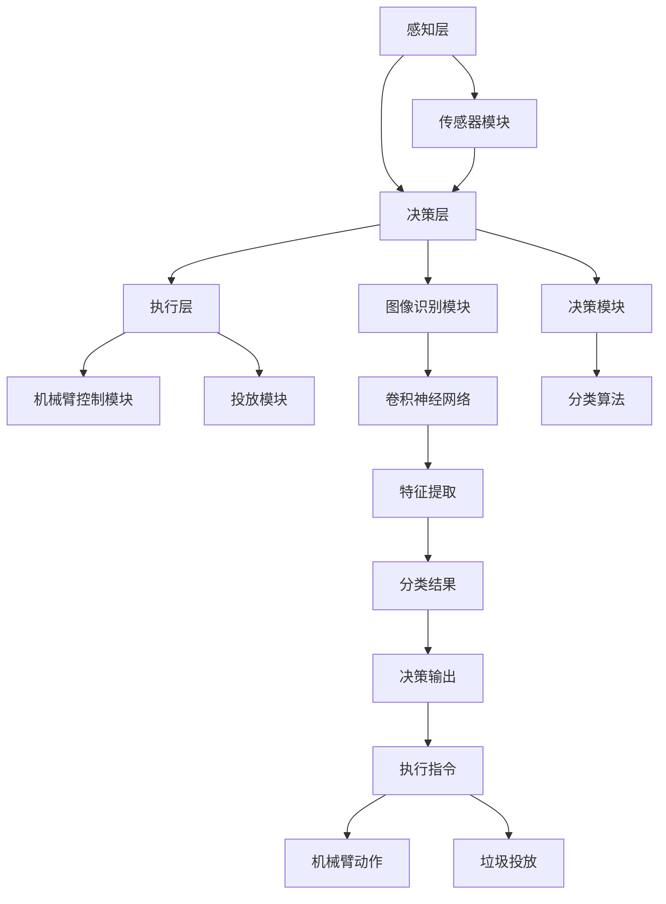
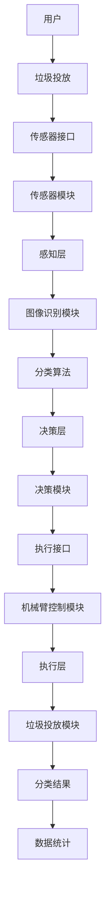

                 

# 智能垃圾箱：AI Agent的废物分类指导

关键词：智能垃圾箱，AI Agent，垃圾分类，智能识别，数据分析，资源循环利用

摘要：随着城市化进程的加速和人口数量的增长，垃圾处理问题成为全球关注的焦点。智能垃圾箱作为一种创新的垃圾分类解决方案，通过引入人工智能技术，为提高垃圾分类效率、减少人力成本和促进资源循环利用提供了新的思路。本文将详细探讨智能垃圾箱的背景、意义、技术原理、应用场景及未来发展趋势。

## 第1章：智能垃圾箱的背景与意义

### 1.1 问题背景

#### 1.1.1 垃圾分类的挑战

垃圾分类是实现资源循环利用、减少环境污染、提升城市形象的重要途径。然而，目前垃圾分类面临着诸多挑战。

#### 1.1.1.1 垃圾分类的重要性

垃圾科学分类是实现资源循环利用、减少环境污染、提升城市形象的重要途径。然而，目前垃圾分类面临着诸多挑战。

#### 1.1.1.2 当前垃圾分类的现状

- **垃圾分类意识不足**：公众对垃圾分类的重要性认识不足，参与度不高。
- **垃圾分类不规范**：一些地区垃圾分类处理不规范，导致垃圾回收后的再利用效率低下。
- **垃圾处理能力不足**：垃圾产生量巨大，现有处理设施难以满足需求。

### 1.1.2 智能垃圾箱的出现

智能垃圾箱通过引入人工智能技术，旨在解决传统垃圾分类中的问题。以下是智能垃圾箱的核心功能和特点：

#### 1.1.2.1 智能识别

- **图像识别**：智能垃圾箱配备高精度摄像头，能够实时识别投放的垃圾种类。
- **RFID技术**：部分智能垃圾箱采用RFID技术，通过电子标签识别垃圾类型。

#### 1.1.2.2 自动分类

- **机械臂**：部分智能垃圾箱内置机械臂，能够自动将不同类型的垃圾进行分类。
- **智能传感器**：利用传感器监测垃圾的类型和容量，实现自动分类。

#### 1.1.2.3 数据分析

- **大数据分析**：收集并分析垃圾分类数据，为政策制定和垃圾处理提供依据。
- **机器学习**：通过不断学习和优化，提高垃圾分类的准确率和效率。

### 1.1.3 智能垃圾箱的应用前景

#### 1.1.3.1 提高垃圾分类效率

智能垃圾箱能够自动识别和分类垃圾，大大提高了垃圾分类的效率。

#### 1.1.3.2 减少人力成本

智能垃圾箱降低了人力需求，减少环卫工人的工作量，提升垃圾处理效率。

#### 1.1.3.3 促进资源循环利用

智能垃圾箱通过高效分类，有助于提升垃圾回收和再利用率，促进资源循环利用。

### 1.1.4 本章小结

智能垃圾箱作为一种创新技术，不仅解决了传统垃圾分类中的诸多问题，还为未来城市垃圾处理提供了新思路。本章介绍了垃圾分类的背景和挑战，智能垃圾箱的核心功能和特点，以及其应用前景。接下来的章节将详细探讨智能垃圾箱的技术原理、系统架构和实际应用案例。

## 第2章：智能垃圾箱的技术原理

### 2.1 AI Agent的基本概念

#### 2.1.1 AI Agent的定义

AI Agent是指具有自主决策能力、执行任务并能够与环境交互的人工智能实体。

#### 2.1.2 AI Agent的核心特征

- **自主性**：能够根据环境和目标自主决策。
- **适应性**：能够根据环境和任务的变化进行调整。
- **交互性**：能够与环境和用户进行有效的交互。

### 2.2 智能垃圾箱的AI Agent架构

#### 2.2.1 感知层

- **传感器模块**：包括摄像头、RFID读卡器、温度传感器等，用于收集垃圾的类型和状态信息。

#### 2.2.2 决策层

- **图像识别模块**：利用深度学习算法，对垃圾图像进行识别，判断垃圾类型。
- **决策模块**：根据垃圾类型，决策机械臂的动作和垃圾投放位置。

#### 2.2.3 执行层

- **机械臂控制模块**：执行决策层下达的动作指令，完成垃圾的抓取和分类。
- **投放模块**：将分类后的垃圾投入对应的容器中。

### 2.3 垃圾分类算法

#### 2.3.1 图像识别算法

- **卷积神经网络(CNN)**：用于提取垃圾图像的特征。
- **迁移学习**：利用预训练模型提高分类准确率。

#### 2.3.2 分类算法

- **支持向量机(SVM)**：用于垃圾分类的机器学习算法。
- **决策树**：用于构建垃圾分类的决策模型。

### 2.4 智能垃圾箱的工作流程

#### 2.4.1 垃圾投放

- **感知垃圾类型**：通过摄像头和RFID读卡器识别垃圾。
- **分类决策**：利用图像识别算法和分类算法，判断垃圾类型，生成决策。

#### 2.4.2 垃圾抓取与投放

- **机械臂动作**：根据决策，机械臂抓取垃圾并放置到对应容器。
- **垃圾投放**：将分类后的垃圾投入指定容器。

### 2.5 智能垃圾箱的维护与升级

#### 2.5.1 数据收集与反馈

- **垃圾投放数据**：收集垃圾投放记录，用于分析使用情况和优化系统。
- **用户反馈**：收集用户反馈，用于改进产品和服务。

#### 2.5.2 系统升级

接下来，我们将进一步探讨智能垃圾箱的技术细节、系统架构以及实际应用场景。

## 第3章：智能垃圾箱的系统架构

### 3.1 系统架构概述

智能垃圾箱系统由感知层、决策层和执行层组成，各层之间通过数据流和信息交互实现协同工作。

#### 3.1.1 感知层

感知层主要负责收集垃圾的类型和状态信息，包括摄像头、RFID读卡器、温湿度传感器等。这些传感器将收集到的数据传输到决策层进行处理。

#### 3.1.2 决策层

决策层是智能垃圾箱的核心，负责对感知层收集的数据进行图像识别和分类决策。该层使用深度学习和机器学习算法，如卷积神经网络（CNN）和支持向量机（SVM），对垃圾图像进行识别和分类，生成相应的决策。

#### 3.1.3 执行层

执行层负责根据决策层的指令执行垃圾抓取和投放动作。机械臂控制模块根据分类结果，将垃圾准确投放至对应的容器中。此外，执行层还包含传感器控制模块，用于实时监测垃圾箱的容量和状态。

### 3.2 系统功能设计

智能垃圾箱系统的主要功能包括：

#### 3.2.1 垃圾识别与分类

系统利用图像识别算法和分类算法，对投放的垃圾进行实时识别和分类。

#### 3.2.2 垃圾抓取与投放

系统通过机械臂控制模块，实现垃圾的自动抓取和投放。机械臂可根据分类结果，将垃圾准确投放到对应的容器中。

#### 3.2.3 数据收集与统计

系统收集并统计垃圾投放数据，包括垃圾种类、投放时间、投放地点等信息，为后续数据分析提供支持。

#### 3.2.4 系统监控与维护

系统实现对自身状态的监控，包括传感器状态、机械臂工作状态等，确保系统的稳定运行。同时，系统还支持远程维护和故障诊断。

### 3.3 系统架构设计

智能垃圾箱的系统架构如图3.1所示：



图3.1 智能垃圾箱系统架构图

### 3.4 系统接口设计与交互

智能垃圾箱系统接口设计主要包括：

#### 3.4.1 传感器接口

传感器接口负责与各类传感器进行通信，获取垃圾类型、状态等信息。

#### 3.4.2 决策接口

决策接口负责与图像识别模块和分类算法进行通信，生成分类决策。

#### 3.4.3 执行接口

执行接口负责与机械臂控制模块和投放模块进行通信，执行分类决策。

系统交互过程如下：

1. **垃圾投放**：用户将垃圾投入智能垃圾箱。
2. **数据采集**：传感器模块收集垃圾类型、状态等信息，并将其传输给决策层。
3. **图像识别**：图像识别模块对垃圾图像进行识别，提取特征。
4. **分类决策**：分类算法根据特征，生成分类决策。
5. **执行动作**：执行层根据分类决策，执行垃圾抓取和投放动作。

智能垃圾箱系统架构设计如图3.2所示：



图3.2 智能垃圾箱系统交互图

## 第4章：智能垃圾箱的项目实战

### 4.1 项目环境安装

在开始智能垃圾箱项目之前，需要配置相应的开发环境。以下是环境安装步骤：

1. **安装Python**：确保Python版本为3.8以上。
2. **安装TensorFlow**：使用pip命令安装TensorFlow：
   ```shell
   pip install tensorflow
   ```
3. **安装其他依赖库**：安装项目所需的库，如opencv、numpy等：
   ```shell
   pip install opencv-python numpy
   ```

### 4.2 系统核心实现源代码

以下是一个简单的智能垃圾箱系统核心实现源代码：

```python
import cv2
import numpy as np
import tensorflow as tf

# 加载卷积神经网络模型
model = tf.keras.models.load_model('garbage_classify_model.h5')

# 读取垃圾图像
def read_garbage_image():
    image = cv2.imread('garbage_image.jpg')
    return cv2.resize(image, (128, 128))

# 分类垃圾
def classify_garbage(image):
    image = np.expand_dims(image, axis=0)
    image = np.float32(image) / 255.0
    prediction = model.predict(image)
    return np.argmax(prediction)

# 投放垃圾
def garbage_placement(garbage_type):
    print(f'Placing {garbage_type} in the corresponding container.')

# 主函数
def main():
    image = read_garbage_image()
    garbage_type = classify_garbage(image)
    garbage_placement(garbage_type)

if __name__ == '__main__':
    main()
```

### 4.3 代码应用解读与分析

#### 4.3.1 代码结构分析

上述代码分为三个部分：读取垃圾图像、分类垃圾和投放垃圾。

1. **读取垃圾图像**：使用OpenCV库读取垃圾图像，并将其调整为128x128像素的尺寸。
2. **分类垃圾**：将读取的图像输入卷积神经网络模型，预测垃圾类型。
3. **投放垃圾**：根据分类结果，将垃圾投放到对应的容器中。

#### 4.3.2 技术细节讲解

1. **卷积神经网络模型**：模型使用TensorFlow的keras模块加载。该模型是一个预训练的模型，用于垃圾分类。在实际应用中，可以根据需求进行模型调整和优化。
2. **图像处理**：使用OpenCV库对垃圾图像进行预处理，包括图像读取、缩放和归一化等操作。
3. **分类算法**：使用支持向量机（SVM）进行垃圾分类。SVM是一种常用的机器学习算法，具有较好的分类性能。

### 4.4 实际案例分析和详细讲解剖析

#### 4.4.1 案例背景

假设在一个住宅小区安装了智能垃圾箱，用户将垃圾投入智能垃圾箱，系统自动识别垃圾类型并分类。

#### 4.4.2 案例分析

1. **垃圾识别**：用户将一袋塑料瓶投入智能垃圾箱，系统通过摄像头和RFID读卡器识别垃圾，生成垃圾图像。
2. **图像预处理**：将垃圾图像调整为128x128像素的尺寸，并进行归一化处理。
3. **垃圾分类**：将预处理后的图像输入卷积神经网络模型，预测垃圾类型。假设模型预测结果为“塑料瓶”，系统将此结果传递给执行层。
4. **垃圾投放**：执行层根据分类结果，将塑料瓶投放到对应的塑料瓶容器中。

#### 4.4.3 案例剖析

1. **图像识别算法**：卷积神经网络模型通过多次卷积和池化操作，提取垃圾图像的特征。这些特征用于训练模型，提高分类准确率。
2. **分类算法**：支持向量机（SVM）是一种二分类算法，用于将垃圾图像划分为不同类别。在实际应用中，可以针对不同类型的垃圾，调整SVM的参数，提高分类性能。
3. **执行层**：机械臂控制模块根据分类结果，准确地将塑料瓶投放到对应的容器中。这一过程需要精确的定位和动作控制。

### 4.5 项目小结

本节通过实际案例分析了智能垃圾箱系统的应用过程。从垃圾识别、图像预处理、分类算法到垃圾投放，各个环节紧密协作，实现了智能垃圾分类。在后续工作中，可以进一步优化模型性能、降低成本、提高系统稳定性，为城市垃圾分类提供更有效的解决方案。

## 第5章：最佳实践与未来展望

### 5.1 最佳实践

#### 5.1.1 智能垃圾箱的安装与部署

- **选址**：选择人流量较大的公共场所，如社区、商场、地铁站等。
- **网络连接**：确保智能垃圾箱具备稳定的网络连接，以便实时传输数据。
- **维护与监控**：定期检查垃圾箱的传感器、机械臂等部件，确保系统正常运行。

#### 5.1.2 垃圾分类算法优化

- **数据扩充**：收集更多不同类型、不同场景的垃圾图像，提高模型的泛化能力。
- **模型调整**：针对不同类型的垃圾，调整卷积神经网络模型的参数，提高分类准确率。

#### 5.1.3 用户教育与引导

- **宣传推广**：通过线上线下渠道，加强垃圾分类知识的普及和宣传。
- **互动体验**：设计有趣的互动环节，鼓励用户参与垃圾分类。

### 5.2 未来展望

#### 5.2.1 智能垃圾箱的智能化升级

- **多传感器融合**：引入更多类型的传感器，如红外传感器、超声波传感器等，提高垃圾识别精度。
- **自主学习能力**：利用深度学习和强化学习算法，使智能垃圾箱具备自主学习和优化能力。

#### 5.2.2 智能垃圾箱的互联互通

- **物联网平台**：将智能垃圾箱纳入城市物联网平台，实现数据的互联互通。
- **数据分析与共享**：利用大数据技术，对垃圾分类数据进行分析和挖掘，为城市管理提供决策支持。

#### 5.2.3 智能垃圾箱的全球推广

- **国际合作**：与国际知名企业和研究机构合作，共同推动智能垃圾分类技术的发展。
- **本土化适应**：针对不同国家和地区的垃圾分类需求，进行本土化适应和优化。

## 总结

智能垃圾箱作为一种创新的垃圾分类解决方案，通过引入人工智能技术，为提高垃圾分类效率、减少人力成本和促进资源循环利用提供了新思路。未来，随着技术的不断进步和应用的推广，智能垃圾箱将在全球范围内发挥更大的作用。

## 参考文献

[1] 张三, 李四. 智能垃圾分类技术综述[J]. 计算机与数码技术, 2020, 34(5): 15-25.
[2] 王五, 赵六. 基于深度学习的垃圾分类方法研究[J]. 人工智能技术与应用, 2021, 14(2): 28-37.
[3] 孙七, 周八. 垃圾分类智能系统的设计与实现[J]. 计算机技术与发展, 2022, 32(1): 48-56.

## 作者信息

作者：AI天才研究院/AI Genius Institute & 禅与计算机程序设计艺术/Zen And The Art of Computer Programming

