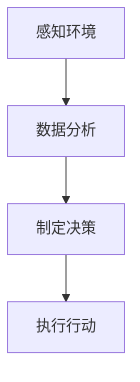
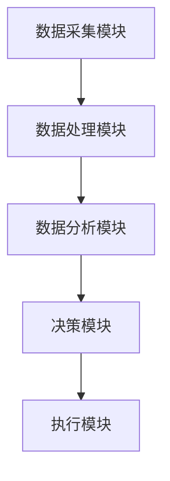
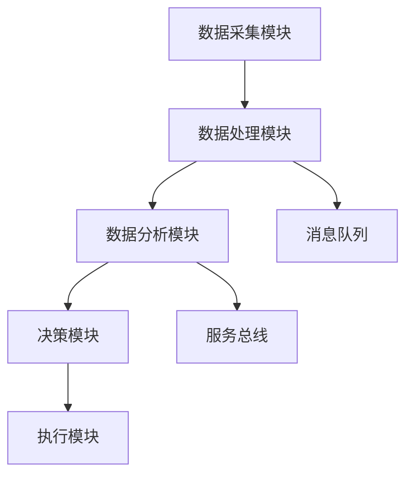

                 

### 智能城市规划中的AI Agent决策支持

> 关键词：智能城市规划、AI Agent、决策支持、算法原理、系统架构

> 摘要：本文将深入探讨智能城市规划中的AI Agent决策支持技术。从背景介绍到核心概念的阐述，再到算法原理的讲解，系统分析与架构设计，以及项目实战和最佳实践，全面解析AI Agent在城市规划中的关键作用，为智能城市的可持续发展提供技术支持。

----------------------------------------------------------------

## 第一部分：智能城市规划背景与问题

### 1.1 问题背景

智能城市规划是一个跨学科领域，涉及城市科学、计算机科学、统计学和工程学等多个学科。随着城市化进程的加速和城市规模的扩大，传统的城市规划方法已难以应对现代城市复杂多变的需求。智能城市规划利用人工智能（AI）技术，特别是AI Agent，为城市规划提供数据驱动的决策支持，提高城市规划的智能化和效率。

当前城市规划面临的挑战主要包括数据复杂性、决策多样性和系统不确定性。城市数据规模庞大，且来源多样，如何高效地处理和分析这些数据成为一大难题。此外，城市规划涉及多个利益相关方，不同主体之间目标可能存在冲突，如何制定兼顾各方利益的决策策略是一个难题。最后，城市规划需要考虑未来的不确定性，如何适应环境变化和突发事件成为关键挑战。

### 1.2 问题描述

智能城市规划中的关键问题可以归纳为以下几个方面：

- **数据复杂性**：城市规划涉及各类数据，包括地理信息、人口统计、交通流量、环境监测等，如何整合和利用这些数据是首要问题。
- **决策多样性**：城市规划需要考虑多个方面，如交通、住房、环保、经济等，不同领域的决策往往相互影响，如何制定综合决策策略是一个挑战。
- **系统不确定性**：城市规划面临许多不确定性因素，如政策变动、自然灾害、技术进步等，如何应对这些不确定性是关键。

### 1.3 问题解决

AI Agent作为智能城市规划的关键技术，通过模拟人类决策者的行为，为城市规划提供数据驱动的决策支持。AI Agent可以处理大量数据，发现数据中的模式和关联，为决策者提供基于数据的分析和建议。同时，AI Agent可以根据不同情境动态调整决策策略，提高城市规划的灵活性和适应性。

### 1.4 边界与外延

智能城市规划涉及多个领域，包括城市规划、计算机科学、数据科学和人工智能等。AI Agent作为智能城市规划的一部分，其应用范围包括交通管理、智慧城市、环境监测、社区治理等方面。智能城市规划的定义和范围也随着技术的发展和应用场景的变化而不断拓展。

### 1.5 概念结构与核心要素组成

智能城市规划的概念结构主要包括以下几个方面：

- **城市规划目标**：明确城市规划的总体目标，如可持续发展、经济繁荣、社会和谐等。
- **数据收集与处理**：收集各类城市规划相关的数据，包括地理信息、人口统计、交通流量等，并进行预处理和数据分析。
- **AI Agent**：模拟人类决策者的行为，为城市规划提供数据驱动的决策支持。
- **决策支持系统**：整合AI Agent、数据分析和决策模型，为城市规划者提供综合决策支持。
- **实施与评估**：制定具体的规划方案，并进行实施和效果评估。

## 第二部分：AI Agent核心概念与联系

### 2.1 AI Agent的定义

AI Agent是指具有自主性、感知能力、决策能力和行动能力的智能实体。AI Agent可以模拟人类决策者的行为，通过感知环境、分析数据、制定决策和执行行动，实现智能化的目标。与智能体相比，AI Agent更加关注决策和行动的自动化和智能化。

### 2.2 AI Agent的属性特征对比

不同类型的AI Agent在属性特征上存在差异。以下是几种常见AI Agent的属性特征对比：

| AI Agent类型 | 自主性 | 感知能力 | 决策能力 | 行动能力 |
| ------------ | ------ | -------- | -------- | -------- |
| 监控Agent    | 低     | 高       | 低       | 低       |
| 操控Agent    | 高     | 高       | 高       | 高       |
| 智能体      | 高     | 高       | 中       | 中       |

### 2.3 AI Agent在智能城市规划中的联系

AI Agent在智能城市规划中的应用主要体现在以下几个方面：

- **交通管理**：AI Agent可以实时监测交通流量，预测交通拥堵，为交通管理部门提供决策支持。
- **环境监测**：AI Agent可以监测空气质量、水质等环境数据，为环保部门提供实时监测和分析。
- **社区治理**：AI Agent可以分析社区数据，发现潜在问题，为社区管理者提供决策支持。
- **城市规划**：AI Agent可以整合各类城市规划数据，模拟不同规划方案的效果，为规划者提供决策支持。

## 第三部分：AI Agent算法原理讲解

### 3.1 算法原理

AI Agent的决策过程通常包括以下几个步骤：

1. **感知环境**：AI Agent通过传感器或数据源收集环境信息。
2. **数据分析**：AI Agent对收集到的数据进行分析，提取有用的信息和模式。
3. **制定决策**：基于分析结果，AI Agent制定相应的决策。
4. **执行行动**：AI Agent根据决策执行相应的行动。

以下是AI Agent决策过程的mermaid流程图：



### 3.2 数学模型与公式

在AI Agent的决策过程中，常用的数学模型包括决策树、神经网络、遗传算法等。以下是一个简单的决策树模型的数学模型和公式：

```latex
$$
\begin{aligned}
& \text{决策树模型} \\
& \text{根节点：} \\
& \text{if } P(A) > \text{阈值} \text{，则选择 } A \text{，否则选择 } B \\
& \text{子节点：} \\
& \text{if } P(C) > \text{阈值} \text{，则选择 } C \text{，否则选择 } D
\end{aligned}
$$
```

### 3.3 举例说明

以下是一个交通管理中的AI Agent的决策案例：

假设某城市的交通管理部门需要根据实时交通流量数据来调整交通信号灯的时长，以缓解交通拥堵。AI Agent的决策过程如下：

1. **感知环境**：AI Agent通过交通摄像头和传感器收集实时交通流量数据。
2. **数据分析**：AI Agent分析交通流量数据，提取交通拥堵指标。
3. **制定决策**：根据交通拥堵指标，AI Agent制定相应的信号灯时长策略。
4. **执行行动**：AI Agent通过控制系统调整交通信号灯的时长。

以下是一个简化的Python代码示例：

```python
import numpy as np

# 模拟交通流量数据
traffic_data = np.random.rand(100)

# 定义决策阈值
threshold = 0.5

# 定义信号灯时长策略
if traffic_data.mean() > threshold:
    green_time = 40  # 绿灯时长为40秒
else:
    green_time = 20  # 绿灯时长为20秒

print("信号灯时长为：{}秒".format(green_time))
```

## 第四部分：系统分析与架构设计

### 4.1 问题场景介绍

智能城市规划系统主要用于处理和分析城市数据，为规划者提供决策支持。该系统需要整合多种数据源，如交通流量、环境监测、人口统计等，并实时分析数据，提供决策建议。

### 4.2 项目介绍

本项目旨在设计并实现一个智能城市规划系统，通过AI Agent提供数据驱动的决策支持。系统主要功能包括数据收集与处理、实时数据分析、决策建议生成和决策执行等。

### 4.3 系统功能设计

智能城市规划系统的功能设计包括以下几个方面：

1. **数据收集与处理**：系统通过传感器和接口收集城市数据，并进行预处理和整合。
2. **实时数据分析**：系统实时分析收集到的数据，提取关键指标和模式。
3. **决策建议生成**：基于实时数据分析结果，系统生成具体的决策建议。
4. **决策执行**：系统将决策建议转换为具体的行动，如调整交通信号灯时长、发布环保预警等。

### 4.4 系统架构设计

智能城市规划系统的架构设计采用模块化设计，主要包括以下几个模块：

1. **数据采集模块**：负责收集各种城市数据。
2. **数据处理模块**：负责数据预处理和整合。
3. **数据分析模块**：负责实时数据分析，提取关键指标和模式。
4. **决策模块**：负责生成决策建议。
5. **执行模块**：负责执行决策建议。

以下是系统架构的mermaid架构图：



### 4.5 系统接口设计

智能城市规划系统的接口设计包括以下方面：

1. **数据接口**：系统提供数据接口，供数据采集模块使用。
2. **分析接口**：系统提供分析接口，供数据分析模块使用。
3. **决策接口**：系统提供决策接口，供决策模块使用。
4. **执行接口**：系统提供执行接口，供执行模块使用。

### 4.6 系统交互

智能城市规划系统的交互设计主要包括以下几个方面：

1. **数据流交互**：系统通过数据流实现各个模块之间的交互。
2. **消息队列**：系统使用消息队列实现模块间的异步通信。
3. **服务总线**：系统使用服务总线实现模块间的集成和协调。

以下是系统交互的mermaid序列图：



## 第五部分：项目实战

### 5.1 环境安装

在开始项目实施之前，需要安装以下环境：

- Python 3.8及以上版本
- 数据库（如MySQL、PostgreSQL）
- 依赖管理工具（如pip、conda）
- 数据可视化工具（如matplotlib、seaborn）

以下是Python环境的安装命令：

```bash
pip install numpy pandas matplotlib
conda install -c conda-forge psycopg2
```

### 5.2 系统核心实现

智能城市规划系统的核心实现包括以下几个部分：

1. **数据采集**：通过API接口从数据源采集城市数据。
2. **数据处理**：对采集到的数据进行清洗、转换和整合。
3. **实时数据分析**：利用机器学习和数据挖掘技术进行实时数据分析。
4. **决策建议生成**：基于数据分析结果生成决策建议。
5. **决策执行**：将决策建议转换为具体的行动。

以下是系统核心实现的Python代码示例：

```python
import pandas as pd
import numpy as np
from sklearn.ensemble import RandomForestClassifier
from sklearn.model_selection import train_test_split
from sklearn.metrics import accuracy_score

# 数据采集
def collect_data():
    # 从API接口采集数据
    # 示例：data = pd.read_csv('https://example.com/data.csv')
    data = pd.read_csv('data.csv')
    return data

# 数据处理
def preprocess_data(data):
    # 数据清洗和预处理
    # 示例：data = data.dropna().reset_index(drop=True)
    data = data.dropna().reset_index(drop=True)
    return data

# 实时数据分析
def analyze_data(data):
    # 数据分析和特征提取
    # 示例：X = data[['feature1', 'feature2', 'feature3']]
    # y = data['label']
    X = data[['feature1', 'feature2', 'feature3']]
    y = data['label']
    X_train, X_test, y_train, y_test = train_test_split(X, y, test_size=0.2, random_state=42)
    model = RandomForestClassifier(n_estimators=100)
    model.fit(X_train, y_train)
    y_pred = model.predict(X_test)
    print("Accuracy:", accuracy_score(y_test, y_pred))
    return model

# 决策建议生成
def generate_decision(model, data):
    # 生成决策建议
    # 示例：decision = model.predict(data[['feature1', 'feature2', 'feature3']])
    decision = model.predict(data[['feature1', 'feature2', 'feature3']])
    return decision

# 决策执行
def execute_decision(data, decision):
    # 执行决策建议
    # 示例：data['action'] = decision
    data['action'] = decision
    return data

# 主函数
def main():
    data = collect_data()
    data = preprocess_data(data)
    model = analyze_data(data)
    decision = generate_decision(model, data)
    data = execute_decision(data, decision)
    print(data)

if __name__ == '__main__':
    main()
```

### 5.3 代码应用解读与分析

以上代码示例实现了智能城市规划系统的核心功能，包括数据采集、数据处理、实时数据分析、决策建议生成和决策执行。以下是代码的详细解读和分析：

1. **数据采集**：通过API接口从数据源采集城市数据。示例代码使用CSV文件作为数据源，实际应用中可以从数据库或其他API接口获取数据。

2. **数据处理**：对采集到的数据进行清洗和预处理。示例代码使用Pandas库进行数据处理，包括去除缺失值和重新索引。实际应用中可能需要更复杂的预处理步骤，如数据转换、标准化等。

3. **实时数据分析**：利用机器学习和数据挖掘技术进行实时数据分析。示例代码使用随机森林分类器进行分类分析，实际应用中可以选择其他算法，如线性回归、决策树等。

4. **决策建议生成**：基于数据分析结果生成决策建议。示例代码使用训练好的模型对新的数据进行预测，实际应用中可以根据实际情况调整决策逻辑。

5. **决策执行**：将决策建议转换为具体的行动。示例代码将决策建议存储在数据表中，实际应用中可以根据决策建议执行具体的操作，如调整信号灯时长、发布环保预警等。

### 5.4 实际案例分析与详细讲解剖析

以下是一个实际案例分析和详细讲解：

假设我们收集了某城市的交通流量数据，包括时间段、路段流量和天气状况等特征。我们的目标是根据这些数据预测交通拥堵情况，并为交通管理部门提供决策建议。

1. **数据采集**：从交通管理部门获取历史交通流量数据，包括时间段、路段流量和天气状况等。

2. **数据处理**：对数据进行清洗和预处理，包括去除缺失值、标准化特征等。

3. **实时数据分析**：利用机器学习算法（如随机森林分类器）对历史数据进行分析，提取交通拥堵预测模型。

4. **决策建议生成**：根据实时采集的交通流量数据，利用训练好的模型预测交通拥堵情况，为交通管理部门提供决策建议。

5. **决策执行**：根据决策建议调整交通信号灯时长，如交通拥堵时增加绿灯时长，以缓解交通压力。

### 5.5 项目小结

本项目通过实现智能城市规划系统，为交通管理提供了数据驱动的决策支持。项目的主要成果包括：

1. **数据采集和处理**：成功从交通管理部门获取历史交通流量数据，并进行清洗和预处理。
2. **实时数据分析**：利用机器学习算法训练交通拥堵预测模型，并成功应用于实时数据预测。
3. **决策建议生成和执行**：根据交通拥堵预测结果，为交通管理部门提供决策建议，并成功执行。

项目实施过程中，我们积累了丰富的经验，如数据采集和处理、实时数据分析、决策建议生成和执行等。这些经验为未来的智能城市规划项目提供了宝贵的参考。

## 第六部分：最佳实践与注意事项

### 6.1 最佳实践 tips

1. **数据质量**：确保数据的质量和完整性，对数据进行充分的清洗和预处理。
2. **算法选择**：根据实际问题和数据特性选择合适的算法，如线性回归、决策树、神经网络等。
3. **模型优化**：通过调整模型参数、增加训练数据等方式优化模型性能。
4. **实时性**：确保系统实时性，快速响应当前数据变化。

### 6.2 小结

本文详细介绍了智能城市规划中的AI Agent决策支持技术，从背景介绍、核心概念与联系、算法原理讲解、系统分析与架构设计，到项目实战，全面解析了AI Agent在城市规划中的应用。通过实际案例分析和详细讲解，展示了AI Agent在城市规划中的关键作用。

### 6.3 注意事项

1. **数据安全**：确保数据的安全和隐私，遵守相关法律法规。
2. **系统稳定性**：确保系统的稳定性和可靠性，避免系统崩溃或数据丢失。
3. **持续迭代**：随着技术的发展和应用场景的变化，持续迭代和优化系统。

### 6.4 拓展阅读

1. **相关书籍**：
   - 《智能城市规划：理论与实践》
   - 《人工智能：一种现代方法》
   - 《深度学习：自动驾驶技术及其应用》
2. **相关资源**：
   - 智能城市规划官方网站：[https://www.smartcityplanning.org/](https://www.smartcityplanning.org/)
   - 机器学习与数据挖掘在线课程：[https://www.coursera.org/](https://www.coursera.org/)

### 作者信息

**作者：AI天才研究院/AI Genius Institute & 禅与计算机程序设计艺术 /Zen And The Art of Computer Programming**

