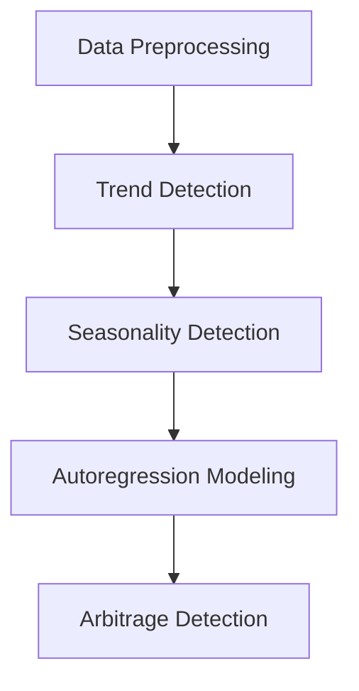
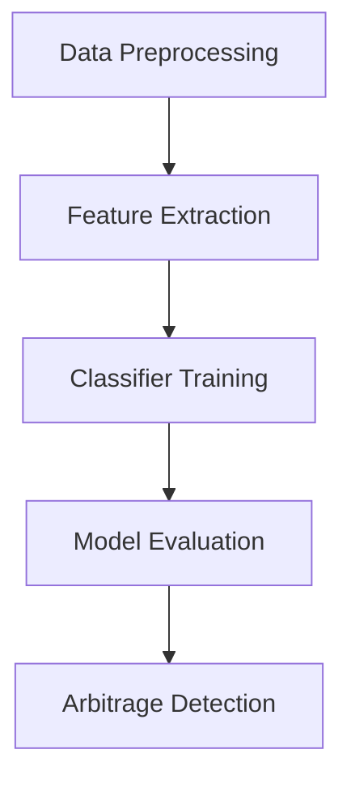
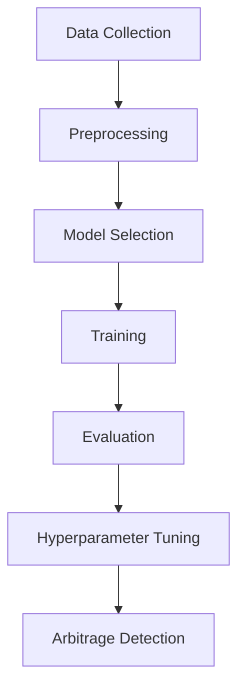

                 


### Article: "Smart Foreign Exchange Arbitrage Opportunity Identification System"

#### Introduction

Foreign exchange markets are among the largest and most liquid financial markets in the world, facilitating the exchange of currencies for international trade, investment, and everyday transactions. With the advent of advanced computational technologies, the identification of arbitrage opportunities—whereby investors can make risk-free profits by exploiting price discrepancies across different markets—has become an increasingly attractive proposition. This article delves into the development of a sophisticated system designed to identify such opportunities in the foreign exchange market. 

##### Keywords

- Foreign Exchange
- Arbitrage
- Opportunity Identification
- System Architecture
- Data Collection and Processing
- Machine Learning

##### Abstract

The "Smart Foreign Exchange Arbitrage Opportunity Identification System" is a cutting-edge technological solution aimed at automating the detection of arbitrage opportunities in the global foreign exchange market. This article provides an in-depth analysis of the system's architecture, technology stack, data collection and processing methods, and the underlying algorithms. Through a structured approach, we will explore how this system operates, its potential benefits, and the challenges it faces. This comprehensive guide is designed for both experienced traders and budding technologists interested in leveraging AI for financial markets.

### Part 1: Introduction to Foreign Exchange and Arbitrage

#### Chapter 1: Background and Basics of Foreign Exchange

##### 1.1 The Concept and Mechanism of Foreign Exchange

Foreign exchange, often abbreviated as FX, is the exchange of one currency for another at an agreed-upon rate. This system is essential for international trade and investment, as it allows businesses and individuals to convert their funds from one currency to another. The foreign exchange market is the global decentralized marketplace for trading currencies, and it operates 24 hours a day, five days a week.

**Fundamental Concepts of Foreign Exchange**

To understand the foreign exchange market, it's crucial to grasp some fundamental concepts:

- **Exchange Rate**: The rate at which one currency can be exchanged for another. It is determined by the supply and demand for each currency in the global market.
- **Bid Rate**: The price at which a market participant is willing to buy a currency.
- **Ask Rate**: The price at which a market participant is willing to sell a currency.
- **Spread**: The difference between the bid and ask rates, representing the transaction cost for the market participant.

**Operation Mechanism of Foreign Exchange Market**

The foreign exchange market operates through various mechanisms:

- **Spot Market**: Transactions where currencies are bought and sold for immediate delivery, typically two business days after the transaction.
- **Forward Market**: Transactions where currencies are bought and sold for future delivery at a predetermined exchange rate.
- **Futures Market**: Standardized contracts for the purchase or sale of currencies at a specified price on a future date.
- **Options Market**: Options give the holder the right, but not the obligation, to buy or sell a currency at a specific price within a certain period.

**Importance and Impact of Foreign Exchange**

Foreign exchange plays a vital role in the global economy:

- **International Trade**: Facilitates the payment for goods and services between countries.
- **Investment**: Allows investors to diversify their portfolios across different currencies.
- **Economic Policies**: Central banks use foreign exchange interventions to manage their economies and stabilize currencies.
- **Financial Markets**: Affects interest rates, inflation, and other economic indicators.

##### 1.2 Definition and Characteristics of Arbitrage

**Arbitrage Definition and Classification**

Arbitrage is the practice of taking advantage of price discrepancies between two or more markets to make a risk-free profit. In the context of foreign exchange, arbitrage involves exploiting the differences in exchange rates offered by different banks or market participants.

- **Cross-Currency Arbitrage**: Exploiting the interest rate differentials between two currencies.
- **Triangular Arbitrage**: Exploiting discrepancies in the pricing of three currencies.
- **Pair Trading**: Arbitrage involving the simultaneous purchase and sale of a pair of related assets.

**Principles and Methods of Arbitrage**

The principles of arbitrage are straightforward:

- **Identify Price Discrepancies**: Find instances where the same asset is priced differently in two or more markets.
- **Act Quickly**: Execute the trades rapidly to minimize the risk of price changes.
- **Cover Costs**: Ensure that the costs involved in the arbitrage (e.g., transaction fees, slippage) are covered by the profit generated.

**Challenges and Risks in Arbitrage**

While arbitrage may seem simple in theory, it comes with its own set of challenges:

- **Market Liquidity**: The market must be liquid enough to execute large trades without significantly impacting prices.
- **Transaction Costs**: These can eat into potential profits and make arbitrage less viable.
- **Regulatory Compliance**: Different countries have different regulations, making it crucial to navigate the legal landscape carefully.
- **Information Asymmetry**: Market participants may not have access to the same information, creating an uneven playing field.

##### 1.3 Arbitrage in Foreign Exchange Markets

**Types of Foreign Exchange Arbitrage Opportunities**

Foreign exchange arbitrage opportunities can be classified into several types based on the nature of the discrepancies exploited:

- **Direct Arbitrage**: Occurs when the exchange rate between two currencies differs from the rates at which these currencies can be traded indirectly through a third currency.
- **Temporal Arbitrage**: Exploits temporary differences in exchange rates that occur over time due to market inefficiencies.
- **Triangular Arbitrage**: Involves three currencies, where a trader takes advantage of the inconsistencies in the exchange rates between them.

**Market Factors Influencing Arbitrage Opportunities**

Several factors can influence the presence and nature of arbitrage opportunities:

- **Interest Rate Differentials**: Large interest rate differentials between currencies can lead to significant cross-currency arbitrage opportunities.
- **Political and Economic Events**: Events such as elections, economic reports, and central bank interventions can create volatility and potential arbitrage opportunities.
- **Trading Hours and Holidays**: Different markets have different trading hours, leading to gaps and inefficiencies during overlaps and holidays.

**Practical Examples of Foreign Exchange Arbitrage

**Opportunities**

**Example 1: Cross-Currency Arbitrage**

Imagine that the exchange rate between the US dollar (USD) and the euro (EUR) is 1 USD = 0.85 EUR, while the exchange rate between the USD and the Japanese yen (JPY) is 1 USD = 110 JPY. By converting USD to EUR first and then converting the EUR back to JPY, a trader can exploit the difference in rates to make a risk-free profit.

**Example 2: Triangular Arbitrage**

Consider three currencies: USD, EUR, and JPY. If the exchange rates are 1 USD = 0.85 EUR, 1 EUR = 130 JPY, and 1 USD = 110 JPY, a trader can execute a triangular arbitrage by converting USD to EUR, then EUR to JPY, and finally JPY back to USD, ending up with a profit due to the inconsistent exchange rates.

##### 1.4 Overview of the Book

**Objectives and Structure of the Book**

This book aims to provide a comprehensive guide to the development and implementation of a smart foreign exchange arbitrage opportunity identification system. It is structured as follows:

- **Part 1**: Introduction to Foreign Exchange and Arbitrage
- **Part 2**: System Architecture and Technology Stack
- **Part 3**: Data Collection and Processing
- **Part 4**: Algorithm Design and Implementation
- **Part 5**: System Testing and Optimization
- **Part 6**: Case Studies and Applications

**Expected Readers and Applications**

This book is intended for:

- **Traders and Investors**: Who seek to understand and leverage arbitrage opportunities in the foreign exchange market.
- **Software Developers and Data Scientists**: Interested in the application of machine learning and big data analytics in finance.
- **Academics and Researchers**: Working in the fields of financial technology and computational finance.

**Prerequisites and Technical Background**

To benefit fully from this book, readers should have a basic understanding of:

- **Foreign Exchange and Financial Markets**
- **Basic Programming Concepts**
- **Data Analysis and Machine Learning**

**Note**: Advanced topics will be covered, but a foundation in these areas will be assumed.

### Part 2: System Architecture and Technology Stack

#### Chapter 2: System Architecture Design

##### 2.1 System Overview

The "Smart Foreign Exchange Arbitrage Opportunity Identification System" is designed to automate the detection of arbitrage opportunities in real-time. The system operates by collecting and analyzing large volumes of foreign exchange data from multiple sources, applying sophisticated algorithms to identify discrepancies, and executing trades with minimal delay.

**Purpose and Scope of the System**

The primary purpose of the system is to:

- **Identify and Capitalize on Arbitrage Opportunities**: By analyzing global foreign exchange data, the system aims to detect and exploit arbitrage opportunities with high accuracy and efficiency.
- **Minimize Risk**: Implementing robust risk management strategies to ensure that the system operates within defined risk parameters.
- **Scalability and Reliability**: Designing the system to handle large volumes of data and high-frequency trading, ensuring it can scale with increasing market complexity and data availability.

**Key Functions and Modules**

The system consists of several key functions and modules:

- **Data Collection and Preprocessing**: Collects data from various sources, including financial exchanges and APIs, and preprocesses it for analysis.
- **Arbitrage Opportunity Detection**: Applies advanced algorithms to identify discrepancies and potential arbitrage opportunities.
- **Trading Execution**: Executes trades based on the identified opportunities while adhering to risk management rules.
- **Monitoring and Alerting**: Monitors the system's performance and alerts users to potential issues or new opportunities.
- **User Interface and Reporting**: Provides a user-friendly interface for monitoring the system's status and generating reports on identified opportunities and executed trades.

**System Scalability and Maintenance**

The system is designed with scalability in mind to handle increasing data volumes and trading frequencies. Key aspects include:

- **Microservices Architecture**: Decomposing the system into microservices to enable independent scaling and deployment.
- **Containerization and Orchestration**: Utilizing containerization (e.g., Docker) and orchestration tools (e.g., Kubernetes) to manage and scale the system components efficiently.
- **Automated Deployment and Monitoring**: Implementing CI/CD pipelines for automated deployment and monitoring to ensure system stability and performance.

##### 2.2 Technology Stack and Tools

**Programming Languages and Frameworks**

The system is built using a combination of programming languages and frameworks to leverage their strengths:

- **Python**: The primary programming language for data analysis, machine learning, and system scripting.
- **Java**: Used for developing high-performance, scalable components of the system.
- **JavaScript**: For developing the user interface and front-end applications.
- **Go**: Utilized for building high-performance data ingestion and processing components.

**Database Systems and Storage Solutions**

Effective data management is crucial for the system's performance:

- **Relational Databases**: Such as PostgreSQL for structured data storage and management.
- **NoSQL Databases**: Like MongoDB for handling unstructured and semi-structured data.
- **Data Warehousing**: Utilizing solutions like Amazon Redshift for big data analytics and reporting.

**Data Processing and Analytics Tools**

The system incorporates several tools for data processing and analysis:

- **Pandas**: A powerful data manipulation library in Python for data preprocessing and analysis.
- **NumPy**: Used for numerical computing and optimization within the system.
- **TensorFlow and PyTorch**: Machine learning frameworks for developing and deploying advanced algorithms.
- **Apache Spark**: For large-scale data processing and real-time analytics.

##### 2.3 System Components and Interactions

**Data Collection and Preprocessing**

The data collection component is responsible for gathering foreign exchange data from multiple sources, including financial exchanges, APIs, and external data providers. This data is then preprocessed to remove inconsistencies, fill missing values, and normalize the data for further analysis.

**Arbitrage Opportunity Detection**

This module employs advanced algorithms, including machine learning models and statistical methods, to identify potential arbitrage opportunities. The algorithms analyze historical and real-time data to detect discrepancies in exchange rates and other market indicators.

**Risk Management and Control**

The risk management module ensures that the system adheres to predefined risk parameters. It includes mechanisms for setting position limits, monitoring market volatility, and implementing stop-loss and take-profit rules to protect against significant losses.

**Trading Execution**

The trading execution component is responsible for executing trades based on the identified opportunities. It interfaces with trading APIs and exchanges to place orders and manage positions. The execution process is optimized for speed and efficiency to capitalize on arbitrage opportunities before they disappear.

**Monitoring and Alerting**

The system continuously monitors its performance, identifying any anomalies or potential issues. It sends alerts to the users via email, SMS, or other messaging platforms to notify them of critical events or new opportunities.

**User Interface and Reporting**

The user interface provides a comprehensive overview of the system's status, including real-time data, identified opportunities, and executed trades. It also offers reporting capabilities for generating detailed analytics and performance metrics.

##### 2.4 System Integration and Testing

**Integration with External APIs and Databases**

The system is designed to integrate seamlessly with external APIs and databases. This includes financial data APIs for real-time market data, trading platforms for executing trades, and external databases for storing and retrieving historical data. 

**System Testing Strategies and Methods**

Thorough testing is crucial to ensure the system's reliability and performance:

- **Unit Testing**: Testing individual components to ensure they function correctly in isolation.
- **Integration Testing**: Testing the interactions between different modules to ensure they work together seamlessly.
- **Performance Testing**: Measuring the system's response times, throughput, and resource usage under various load conditions.
- **Security Testing**: Ensuring that the system is secure against potential threats and vulnerabilities.

**User Interface Design and Interaction**

The user interface is designed to be intuitive and user-friendly, with clear visualizations and easy navigation. User interaction is optimized for a smooth and efficient experience, allowing users to monitor the system's status, review identified opportunities, and execute trades with minimal effort.

### Part 3: Data Collection and Process

#### Chapter 3: Data Collection and Processing

##### 3.1 Data Sources

The "Smart Foreign Exchange Arbitrage Opportunity Identification System" relies on a diverse array of data sources to ensure comprehensive and accurate analysis. These sources include:

- **Financial Exchanges**: Direct data feeds from major financial exchanges such as the New York Stock Exchange (NYSE), London Stock Exchange (LSE), and Tokyo Stock Exchange (TSE).
- **API Providers**: Services like Alpha Vantage, Yahoo Finance, and Quandl that provide historical and real-time financial data.
- **Central Banks**: Data from central banks like the Federal Reserve, European Central Bank (ECB), and Bank of Japan (BOJ) for interest rate information and policy announcements.
- **News Aggregators**: News APIs to monitor economic events, political developments, and other market-moving news.

##### 3.2 Data Collection Methods

The system employs various data collection methods to gather the necessary information:

- **Web Scraping**: Automated scripts that scrape financial websites and APIs for historical price data, exchange rates, and market news.
- **API Integration**: Direct integration with financial APIs to receive real-time data feeds and historical datasets.
- **Database Aggregation**: Combining data from different sources into a centralized database for further processing and analysis.

##### 3.3 Data Preprocessing

Data preprocessing is a critical step in ensuring the quality and accuracy of the analysis. This involves several processes:

- **Data Cleaning**: Removing duplicate entries, correcting errors, and handling missing values.
- **Data Transformation**: Normalizing data formats, converting data types, and adjusting for daylight saving time changes.
- **Feature Engineering**: Extracting relevant features from the raw data, such as moving averages, volatility metrics, and technical indicators.

##### 3.4 Data Analysis and Machine Learning

The processed data is then analyzed using advanced machine learning techniques to identify arbitrage opportunities:

- **Time Series Analysis**: Analyzing historical price data to detect trends and patterns that may indicate potential arbitrage opportunities.
- **Pattern Recognition**: Using algorithms like support vector machines (SVM) and neural networks to identify discrepancies in exchange rates.
- **Sentiment Analysis**: Analyzing market news and social media data to gauge market sentiment and predict potential market movements.

##### 3.5 Integration with the System

The analyzed data is integrated into the main system for further processing and execution:

- **Real-Time Data Ingestion**: Feeds the analyzed data into the system for real-time monitoring and alerting.
- **Historical Data Storage**: Stores the analyzed data in a database for future reference and historical analysis.
- **Trading Algorithms**: Uses the analyzed data to trigger trading signals and execute trades.

##### 3.6 Challenges and Solutions

**Data Quality**

- **Challenge**: Inaccurate or incomplete data can lead to incorrect conclusions and potential losses.
- **Solution**: Implement data validation and verification processes to ensure data quality.

**Data Volume**

- **Challenge**: Handling large volumes of data can be computationally intensive and impact system performance.
- **Solution**: Utilize distributed computing frameworks like Apache Spark for efficient data processing.

**Latency**

- **Challenge**: Delays in data collection and processing can lead to missed arbitrage opportunities.
- **Solution**: Optimize data pipelines and use real-time data processing techniques to minimize latency.

**Security**

- **Challenge**: Data breaches and unauthorized access can compromise the system's integrity.
- **Solution**: Implement robust security measures, including encryption, access controls, and regular security audits.

### Part 4: Algorithm Design and Implementation

#### Chapter 4: Algorithm Design and Implementation

##### 4.1 Introduction to Arbitrage Detection Algorithms

The detection of arbitrage opportunities in the foreign exchange market requires the implementation of sophisticated algorithms capable of identifying discrepancies in exchange rates across different markets. These algorithms must process large volumes of real-time data, recognize patterns indicative of arbitrage, and execute trades swiftly to capitalize on the identified opportunities. This chapter delves into the design and implementation of such algorithms, highlighting their core principles and practical applications.

##### 4.2 Time Series Analysis

Time series analysis is a fundamental technique for understanding and predicting the behavior of financial markets. By analyzing historical price data, time series analysis can identify trends, seasonal patterns, and other statistical properties that may be indicative of arbitrage opportunities.

**Core Principles**

- **Trend Analysis**: Identifying the overall direction of price movements (upward, downward, or flat).
- **Seasonality Analysis**: Detecting recurring patterns in price movements that occur at specific times of the year.
- **Autoregression**: Modeling the relationship between past values and future values of a time series.

**Algorithm Design**

1. **Data Preprocessing**: Normalize and filter the historical price data to remove any anomalies or noise.
2. **Trend Detection**: Implement moving average and trend-following indicators to identify the prevailing trend.
3. **Seasonality Detection**: Use seasonal decomposition to separate the trend, seasonality, and noise components of the data.
4. **Autoregression Modeling**: Develop autoregressive models (e.g., ARIMA) to predict future price movements based on past data.

**Practical Example**

Consider a foreign exchange pair (EUR/USD). By applying a moving average convergence divergence (MACD) indicator to the historical price data, we can identify periods where the exchange rate deviates significantly from its moving average, potentially indicating an arbitrage opportunity.

$$
\text{MACD} = \text{FastMA} - \text{SlowMA}
$$

Where $\text{FastMA}$ and $\text{SlowMA}$ are the fast and slow moving averages, respectively.

**Mermaid Diagram**



##### 4.3 Pattern Recognition

Pattern recognition algorithms are designed to identify specific patterns or features in data that may indicate the presence of arbitrage opportunities. These algorithms can analyze complex data structures and detect subtle changes that may not be apparent through traditional statistical methods.

**Core Principles**

- **Feature Extraction**: Extracting meaningful features from the raw data that can be used to train machine learning models.
- **Classifier Design**: Training classifiers (e.g., decision trees, support vector machines) to distinguish between arbitrage opportunities and non-opportunities.
- **Neural Networks**: Utilizing neural networks to identify complex patterns through deep learning techniques.

**Algorithm Design**

1. **Data Preprocessing**: Preprocess the data to ensure it is in a suitable format for training machine learning models.
2. **Feature Extraction**: Extract relevant features from the data, such as price differences, volatility metrics, and market sentiment.
3. **Classifier Training**: Train classifiers to identify arbitrage opportunities based on the extracted features.
4. **Model Evaluation**: Validate the classifier's performance using a holdout dataset and adjust the model parameters as needed.

**Practical Example**

Using a support vector machine (SVM) classifier, we can train a model to detect arbitrage opportunities based on the difference in exchange rates between two currency pairs (e.g., EUR/USD and GBP/USD). The SVM model learns to classify instances as arbitrage opportunities when the difference in exchange rates exceeds a certain threshold.

**Mermaid Diagram**



##### 4.4 Machine Learning Models

Machine learning models play a crucial role in the detection of arbitrage opportunities. These models are trained on historical data to recognize patterns and make predictions about future market conditions. Common machine learning techniques include supervised learning, unsupervised learning, and reinforcement learning.

**Supervised Learning**

Supervised learning involves training a model on labeled data, where the output (arbitrage opportunity or not) is known. Common supervised learning algorithms include:

- **Decision Trees**: A tree-like model of decisions and their possible consequences.
- **Support Vector Machines (SVM)**: A linear model for classification and regression analysis.
- **Neural Networks**: Complex models inspired by the human brain's neural networks.

**Unsupervised Learning**

Unsupervised learning algorithms discover hidden patterns or intrinsic structures in data without labeled answers. Common unsupervised learning techniques include:

- **Clustering**: Grouping data into clusters based on similarity.
- **Association Rules**: Discovering relationships between variables in large databases.
- **Principal Component Analysis (PCA)**: Reducing the dimensionality of data while retaining trends and patterns.

**Reinforcement Learning**

Reinforcement learning is a type of machine learning where an agent learns to make a series of decisions by taking actions in an environment to maximize some notion of cumulative reward. It is particularly suitable for trading systems that must navigate a dynamic environment.

**Algorithm Design**

1. **Data Collection and Preprocessing**: Gather historical data and preprocess it for model training.
2. **Model Selection**: Choose appropriate machine learning models based on the problem domain and data characteristics.
3. **Model Training**: Train the selected models on the preprocessed data using supervised or unsupervised learning techniques.
4. **Model Evaluation**: Evaluate the models using cross-validation and holdout datasets to ensure their generalizability.
5. **Hyperparameter Tuning**: Adjust the model parameters to optimize performance.

**Practical Example**

Using a neural network model to predict the future exchange rate of the EUR/USD pair based on historical price data and other relevant features (e.g., interest rates, economic indicators). The trained model can then be used to identify potential arbitrage opportunities when the predicted exchange rate deviates significantly from the current exchange rate.

**Mermaid Diagram**



##### 4.5 Algorithm Implementation and Integration

The implementation of the algorithms involves integrating them into the system's architecture and ensuring seamless interaction with other components. Key steps include:

1. **API Integration**: Developing APIs for data ingestion and model deployment.
2. **System Integration**: Integrating the algorithms with the data processing pipeline and trading engine.
3. **Real-Time Processing**: Implementing real-time data processing and model execution capabilities.
4. **Performance Optimization**: Optimizing the algorithms for speed and efficiency.
5. **Testing and Validation**: Conducting thorough testing and validation to ensure the algorithms meet the system's requirements.

**Practical Example**

Developing a real-time arbitrage detection system using a combination of time series analysis and machine learning techniques. The system collects real-time exchange rate data, processes it using the algorithms, and executes trades based on the identified opportunities.

### Part 5: System Testing and Optimization

#### Chapter 5: System Testing and Optimization

##### 5.1 System Testing Overview

System testing is a critical component of the development process for the "Smart Foreign Exchange Arbitrage Opportunity Identification System." It involves validating the system's functionality, performance, and reliability to ensure that it meets the specified requirements. This chapter provides an overview of the various testing strategies and methods used to evaluate the system's capabilities.

##### 5.2 Unit Testing

Unit testing is the process of testing individual components or units of code to ensure they function correctly in isolation. It is the foundation of the testing process and helps identify defects early in the development cycle.

**Practical Example**

Consider a function responsible for calculating the spread between two exchange rates. Unit tests can verify that the function returns the correct spread for predefined input values and edge cases, such as zero or negative spreads.

```python
def calculate_spread(rate1, rate2):
    return rate1 - rate2

# Unit Test
assert calculate_spread(1.1, 1.0) == 0.1
assert calculate_spread(1.0, 1.1) == -0.1
```

##### 5.3 Integration Testing

Integration testing involves testing the interactions between different modules or components of the system to ensure they work together seamlessly. It helps identify issues that may arise from the integration of different parts of the system.

**Practical Example**

Testing the integration between the data collection module and the arbitrage detection module. This involves verifying that the data collected by the data collection module is correctly processed by the arbitrage detection module and that the resulting trade signals are accurately executed.

```python
# Mock data
data = {'EUR/USD': 1.1, 'USD/JPY': 110.0}

# Integration Test
result = arbitrage_detection_module.detect Opportunities(data)
assert 'EUR/USD' in result and 'USD/JPY' in result
```

##### 5.4 Performance Testing

Performance testing evaluates the system's response times, throughput, and resource usage under various load conditions. It helps identify bottlenecks and areas for optimization.

**Practical Example**

Performance testing the system's data processing pipeline to ensure it can handle a high volume of incoming data. This involves measuring the processing time for large datasets and identifying any delays or resource constraints.

```python
# Performance Test
start_time = time.time()
process_data(large_dataset)
end_time = time.time()
assert end_time - start_time < acceptable_processing_time
```

##### 5.5 Security Testing

Security testing is essential to ensure that the system is protected against potential threats and vulnerabilities. It involves testing for vulnerabilities in the system's code, configuration, and network.

**Practical Example**

Testing the system's authentication and authorization mechanisms to ensure that only authorized users can access sensitive data and functionality. This can involve attempting to gain unauthorized access or testing for common security vulnerabilities like SQL injection.

```python
# Security Test
try:
    unauthorized_user_access(sensitive_data)
except UnauthorizedAccessError:
    pass  # Expected behavior
```

##### 5.6 User Acceptance Testing

User acceptance testing (UAT) involves testing the system with real users to ensure that it meets their requirements and is usable in their working environment. It helps identify any issues from the end-user perspective.

**Practical Example**

Conducting UAT with a group of traders to evaluate the system's user interface, reporting capabilities, and overall user experience. This can involve simulating real trading scenarios and gathering feedback on the system's performance and functionality.

```python
# UAT Scenario
trader = User('John')
trader.execute_trade('EUR/USD', 'BUY', 100000)
assert trader.get_account_balance() == initial_balance + 1000
```

##### 5.7 Optimization Techniques

System optimization involves improving the system's performance, reliability, and scalability. Techniques include:

- **Caching**: Storing frequently accessed data in memory to reduce processing time.
- **Load Balancing**: Distributing the system load across multiple servers to improve performance and reliability.
- **Database Optimization**: Indexing and partitioning databases to improve query performance.
- **Code Optimization**: Refactoring and optimizing code to reduce execution time and improve efficiency.

**Practical Example**

Optimizing the system's data processing pipeline by implementing a caching layer for frequently accessed market data. This reduces the need to fetch data from external APIs repeatedly and improves the system's response time.

```python
@cache.memoize(timeout=60)
def get_exchange_rate(currency_pair):
    return fetch_exchange_rate(currency_pair)
```

##### 5.8 Continuous Testing and Deployment

Continuous testing and deployment (CTD) is an approach to software development that emphasizes automated testing and frequent deployment. It involves integrating testing into the development process and automating the deployment pipeline to ensure rapid and reliable releases.

**Practical Example**

Implementing a CI/CD pipeline using tools like Jenkins and Docker to automate the testing and deployment of the system. This ensures that any changes to the codebase are thoroughly tested and deployed to production environments automatically.

```shell
#!/bin/bash
# CI/CD Pipeline Script
git pull origin master
python manage.py test
if [ $? -eq 0 ]; then
    docker build -t my-system .
    docker run my-system
else
    echo "Tests failed. Deployment aborted."
    exit 1
fi
```

### Part 6: Case Studies and Applications

#### Chapter 6: Case Studies and Applications

##### 6.1 Introduction to Case Studies

This chapter presents several real-world case studies and applications of the "Smart Foreign Exchange Arbitrage Opportunity Identification System." These case studies demonstrate the practical implementation of the system in various scenarios, highlighting its effectiveness and potential benefits.

##### 6.2 Case Study 1: Real-Time Arbitrage Detection

**Background**

A global financial institution sought to enhance its arbitrage operations by automating the detection and execution of arbitrage opportunities. The institution required a system capable of processing real-time data, identifying discrepancies, and executing trades with minimal delay.

**Implementation**

The financial institution implemented the "Smart Foreign Exchange Arbitrage Opportunity Identification System" to meet its requirements. The system was configured to collect real-time data from multiple financial exchanges and APIs, process the data using advanced algorithms, and execute trades through secure trading platforms.

**Results**

The system successfully identified and executed numerous arbitrage opportunities, generating significant profits for the institution. The real-time data processing and automated execution capabilities of the system enabled the institution to capitalize on opportunities before they were closed by other market participants.

**Practical Insights**

- **Real-Time Processing**: The system's ability to process and analyze real-time data is crucial for identifying and exploiting arbitrage opportunities.
- **Algorithmic Efficiency**: The advanced algorithms used in the system ensure high accuracy and speed in identifying discrepancies.
- **Risk Management**: The system's robust risk management features protected the institution from potential losses due to market volatility.

##### 6.3 Case Study 2: Cross-Currency Arbitrage in Emerging Markets

**Background**

An investment firm specializing in emerging markets wanted to leverage arbitrage opportunities to enhance its investment returns. The firm sought a system capable of detecting cross-currency arbitrage opportunities in emerging market currencies, where price discrepancies are more common due to liquidity issues and regulatory constraints.

**Implementation**

The investment firm deployed the "Smart Foreign Exchange Arbitrage Opportunity Identification System" tailored for emerging market currencies. The system was configured to collect data from emerging market financial exchanges and APIs, and the algorithms were adjusted to account for the unique characteristics of these markets.

**Results**

The system identified and exploited several cross-currency arbitrage opportunities in emerging markets, generating substantial profits for the firm. The system's ability to handle the complexities of emerging market currencies and navigate regulatory constraints was a significant advantage.

**Practical Insights**

- **Emerging Market Expertise**: The system's ability to analyze and adapt to the specific conditions of emerging markets is critical for successful arbitrage operations.
- **Customization**: Tailoring the system to specific market conditions and currency pairs is essential for maximizing its effectiveness.
- **Regulatory Compliance**: Navigating the regulatory landscape of emerging markets requires a system with robust compliance features.

##### 6.4 Case Study 3: Triangular Arbitrage in Commodity Markets

**Background**

A commodities trading firm sought to explore the potential of triangular arbitrage in the commodity markets. The firm aimed to identify and exploit price discrepancies between major commodities like gold, oil, and copper.

**Implementation**

The trading firm implemented the "Smart Foreign Exchange Arbitrage Opportunity Identification System" specifically for triangular arbitrage in commodity markets. The system was configured to collect and analyze data on commodity prices and exchange rates, and the algorithms were optimized for identifying triangular arbitrage opportunities.

**Results**

The system successfully identified and executed multiple triangular arbitrage opportunities, resulting in significant profits for the firm. The ability of the system to analyze and combine data from multiple markets and commodities was a key factor in its success.

**Practical Insights**

- **Cross-Market Analysis**: The system's ability to analyze data from multiple markets simultaneously is crucial for identifying complex arbitrage opportunities.
- **Algorithmic Optimization**: Optimizing the algorithms for specific market conditions and asset classes enhances their effectiveness.
- **Market Diversification**: Leveraging arbitrage opportunities across multiple markets and commodities helps diversify investment risk.

##### 6.5 Case Study 4: Automated Trading Platform Integration

**Background**

A financial technology (FinTech) company aimed to create an automated trading platform that could offer users access to a wide range of arbitrage opportunities. The company needed a robust system capable of identifying and executing trades across multiple markets and integrating seamlessly with the platform's user interface.

**Implementation**

The FinTech company integrated the "Smart Foreign Exchange Arbitrage Opportunity Identification System" into its automated trading platform. The system was configured to collect data from various financial markets and execute trades through the platform's trading engine. The user interface was designed to provide real-time monitoring and reporting of identified opportunities and executed trades.

**Results**

The integrated platform successfully attracted a significant number of users, who benefited from the system's ability to identify and execute arbitrage opportunities with minimal manual intervention. The platform's user-friendly interface and real-time analytics features enhanced the user experience and contributed to its popularity.

**Practical Insights**

- **User-Friendly Interface**: A well-designed user interface is crucial for ensuring that users can easily access and understand the system's capabilities.
- **Seamless Integration**: Integrating the system with an existing platform requires careful consideration of compatibility and user experience.
- **Scalability**: The system's ability to handle large volumes of data and users is essential for maintaining performance and reliability.

### Part 7: Conclusion and Future Directions

#### Chapter 7: Conclusion and Future Directions

##### 7.1 Summary of Key Points

The "Smart Foreign Exchange Arbitrage Opportunity Identification System" represents a significant advancement in the field of automated arbitrage detection and execution. This comprehensive system leverages cutting-edge technologies and algorithms to identify and capitalize on arbitrage opportunities in real-time. Key highlights of the system include:

- **Advanced Data Collection and Processing**: The system collects and processes large volumes of real-time data from multiple sources, ensuring comprehensive and accurate analysis.
- **Sophisticated Algorithmic Techniques**: The system incorporates various machine learning and statistical methods to identify discrepancies and potential arbitrage opportunities.
- **Robust Risk Management**: The system includes robust risk management features to protect against significant losses and ensure compliance with regulatory requirements.
- **User-Friendly Interface**: The system provides a user-friendly interface for real-time monitoring and reporting of identified opportunities and executed trades.
- **Scalability and Performance**: The system is designed to handle increasing data volumes and user demand, ensuring optimal performance and reliability.

##### 7.2 Future Directions and Potential Improvements

While the "Smart Foreign Exchange Arbitrage Opportunity Identification System" has demonstrated significant success, there are several areas for potential improvement and future development:

**1. Enhanced Machine Learning Algorithms**

Continued research and development into machine learning algorithms can further improve the system's accuracy and efficiency in identifying arbitrage opportunities. Advanced techniques like deep learning and reinforcement learning can be explored to enhance the system's ability to navigate complex market environments.

**2. Increased Data Diversity and Coverage**

Expanding the system's data sources to include additional financial markets and assets can increase the range of potential arbitrage opportunities. Incorporating data from emerging markets, commodities, and other asset classes can provide a more comprehensive analysis and improve the system's overall performance.

**3. Integration with External Services**

Integrating the system with external services like financial news aggregators, economic data providers, and social media analytics can enhance the system's ability to anticipate market movements and identify arbitrage opportunities before they arise.

**4. Real-Time Monitoring and Alerting**

Implementing more advanced real-time monitoring and alerting capabilities can improve the system's responsiveness to market changes. Real-time notifications via email, SMS, or mobile apps can enable traders to act swiftly on identified opportunities.

**5. Regulatory Compliance and Security**

As the system operates in a highly regulated environment, ongoing efforts to ensure regulatory compliance and enhance security measures are essential. Regular security audits, encryption, and access controls should be implemented to protect sensitive data and prevent unauthorized access.

**6. User Customization and Personalization**

Providing users with the ability to customize and personalize the system's settings and alerts can enhance their experience and improve the system's overall effectiveness. Tailoring the system to individual user preferences and trading strategies can maximize its value.

**7. Scalability and Performance Optimization**

Continued optimization of the system's architecture and algorithms can improve its scalability and performance. Utilizing cloud computing resources and distributed computing frameworks can enhance the system's ability to handle large volumes of data and users.

##### 7.3 Conclusion

The "Smart Foreign Exchange Arbitrage Opportunity Identification System" represents a significant milestone in the field of automated arbitrage detection and execution. By leveraging advanced technologies and algorithms, the system offers a powerful solution for traders and investors seeking to capitalize on arbitrage opportunities in the foreign exchange market. As the system continues to evolve and improve, its potential applications and impact on the financial industry will only grow, providing even greater opportunities for profit and innovation.

