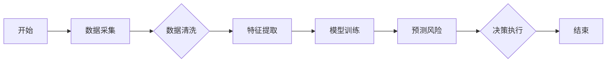
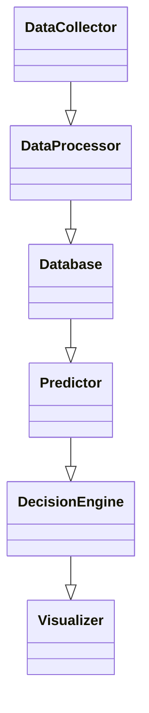
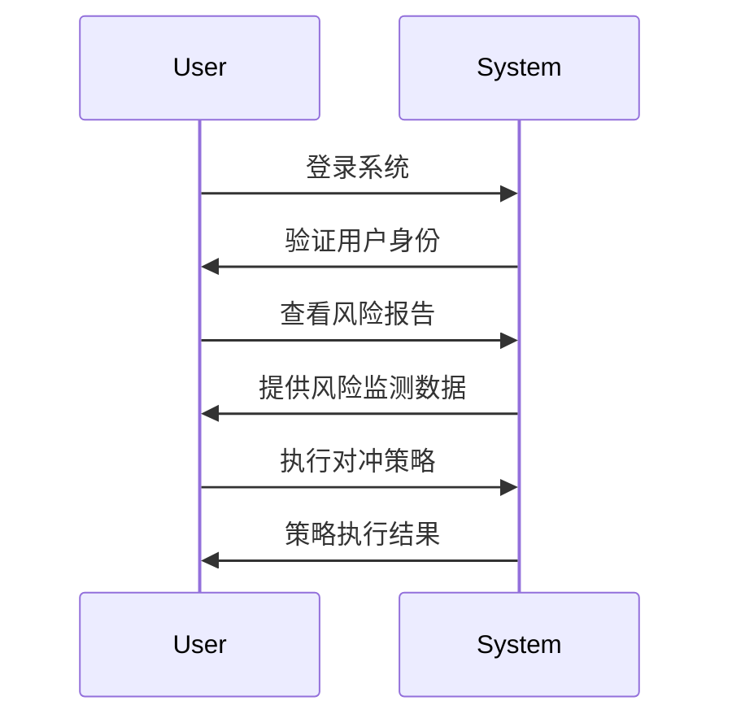
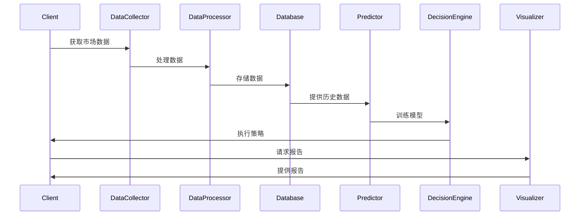

                 

## 《智能外汇风险敞口管理系统》

### 关键词：外汇风险管理、智能系统、算法、系统架构、项目实战

> 摘要：本文将深入探讨智能外汇风险敞口管理系统的设计与实现，从背景介绍到系统架构，再到算法原理讲解，最后通过项目实战展示其应用。通过系统分析与架构设计方案，帮助读者全面了解并掌握这一领域的核心知识。

----------------------------------------------------------------

### 第一部分：背景介绍

#### 第1章：外汇市场概述

##### 1.1 外汇市场的定义与功能

外汇市场是全球金融市场中最重要的组成部分，它是指各国货币之间的交易市场。外汇市场的功能主要体现在以下几个方面：

- **汇率发现**：外汇市场是汇率的重要形成场所，通过市场供需关系，汇率得以不断调整，以反映经济基本面的变化。
- **风险转移**：企业和投资者可以通过外汇市场进行风险管理，如对冲汇率风险，减少因汇率波动带来的不确定性。
- **资源配置**：外汇市场为国际贸易和投资提供了便利，促进了全球资本的高效配置。

##### 1.2 外汇风险概述

外汇风险是指由于汇率波动导致的企业或投资者资产价值变化的风险。主要类型包括：

- **交易风险**：由于未来交易中使用的外汇汇率不确定而产生的风险。
- **经济风险**：汇率变动对企业未来的收入和成本造成的影响。
- **会计风险**：因外汇汇率变动而引起的资产负债表项目价值变动。

为了有效管理外汇风险，企业需要采取多种管理策略，如外汇远期合约、期权、期货等金融工具。

##### 1.3 智能外汇风险敞口管理系统的需求

在复杂多变的外汇市场中，传统的风险管理方法已难以满足企业需求。智能外汇风险敞口管理系统应运而生，旨在通过智能化的手段，为企业提供更精准、更高效的风险管理解决方案。

- **问题背景**：随着全球化进程的加速，企业面临的外汇风险日益增加，传统的风险管理方法效率低下，需要智能化手段。
- **问题解决**：通过构建智能化的外汇风险敞口管理系统，可以实时监测市场变化，预测风险，并自动执行风险对冲策略。
- **系统边界与外延**：系统的核心功能包括风险敞口监测、风险预测、自动对冲策略执行，同时需具备扩展性，以适应不断变化的市场需求。

##### 1.4 本章小结

本章对外汇市场进行了概述，介绍了外汇风险及其管理策略，并阐述了智能外汇风险敞口管理系统的需求。在接下来的章节中，我们将深入探讨系统的核心概念、算法原理和架构设计，帮助读者全面了解这一系统的构建与应用。

----------------------------------------------------------------

### 第二部分：核心概念与联系

#### 第2章：智能外汇风险敞口管理系统的核心概念

##### 2.1 核心概念原理

智能外汇风险敞口管理系统的核心概念基于以下几点：

- **数据采集与处理**：系统需要实时采集外汇市场数据，包括汇率、交易量等，并通过数据挖掘技术提取关键信息。
- **风险预测模型**：系统采用机器学习算法，对历史数据进行分析，预测未来汇率走势，评估风险敞口。
- **决策引擎**：基于预测结果，系统自动执行风险对冲策略，如购买外汇期权、调整外汇头寸等。
- **可视化与报告**：系统提供实时风险监测和报告功能，帮助用户了解当前风险状况。

智能化的定义与重要性在于，通过算法和数据的结合，系统能够更快速、准确地识别和管理风险，提高企业的风险管理效率。

##### 2.2 概念属性特征对比表格

| 特征           | 传统风险管理 | 智能风险管理 |
|----------------|--------------|--------------|
| **风险预测**   | 简单统计方法 | 机器学习算法 |
| **决策速度**   | 人为决策     | 自动执行     |
| **适应性**     | 固定策略     | 智能调整     |
| **数据依赖**   | 部分数据     | 实时数据     |

通过对比表格，我们可以看出智能外汇风险敞口管理系统在风险预测、决策速度、适应性和数据依赖方面相较于传统方法的优势。

##### 2.3 ER实体关系图架构

下面是智能外汇风险敞口管理系统的ER图：

```mermaid
erDiagram
  Customer ||--|{ Order : places }|
  Product ||--|{ OrderItem : contains }|
  Order ||--|{ Payment : pays }|
```

在ER图中，核心实体包括客户（Customer）、订单（Order）、产品（Product）和支付（Payment）。这些实体之间的关系反映了系统中的关键业务流程和数据关联。

----------------------------------------------------------------

### 第三部分：算法原理讲解

#### 第3章：智能外汇风险敞口管理算法原理

##### 3.1 算法mermaid流程图



此流程图展示了智能外汇风险敞口管理算法的基本步骤，包括数据采集、数据清洗、特征提取、模型训练、风险预测和决策执行。

##### 3.2 算法原理讲解

智能外汇风险敞口管理算法的核心在于预测和决策。以下是算法原理的详细讲解：

1. **数据采集**：系统首先从多个数据源（如金融市场数据提供商、交易所等）采集外汇市场数据，包括汇率、交易量、经济指标等。

2. **数据清洗**：采集到的数据可能存在缺失、异常值等问题，系统通过数据清洗技术，如缺失值填充、异常值检测与处理，确保数据质量。

3. **特征提取**：从清洗后的数据中提取对风险预测有用的特征，如历史汇率变化趋势、市场波动性等。特征提取是算法的关键步骤，它直接影响预测的准确性。

4. **模型训练**：使用机器学习算法（如随机森林、支持向量机等）对提取的特征进行训练，构建风险预测模型。模型训练过程包括模型选择、参数调优等步骤。

5. **预测风险**：将当前数据输入训练好的模型，预测未来汇率走势和风险敞口。预测结果用于决策引擎，指导风险对冲策略的执行。

6. **决策执行**：根据预测结果，系统自动执行相应的风险对冲策略，如购买外汇期权、调整外汇头寸等。决策执行过程需要考虑到交易成本、市场流动性等因素。

##### 3.3 算法举例说明

假设某企业在未来一个月内计划购买100万美元，当前汇率为1美元兑换6.5元人民币。通过智能外汇风险敞口管理系统，预测未来一个月内汇率可能上涨至1美元兑换6.7元人民币。

根据这一预测，系统建议企业购买1年期美元兑人民币看涨期权，以规避汇率上涨带来的风险。期权价格为每个合约1000美元，企业支付期权费用5000美元。

如果汇率上涨至预测水平，企业执行期权，以较低的价格购买美元，实现汇率锁定，降低成本。如果汇率未上涨，企业放弃期权，仅损失期权费用。

此例展示了智能外汇风险敞口管理系统如何通过算法预测和决策，帮助企业降低外汇风险。

----------------------------------------------------------------

### 第四部分：系统分析与架构设计方案

#### 第4章：智能外汇风险敞口管理系统分析与架构设计

##### 4.1 问题场景介绍

假设某大型跨国公司需要在未来三个月内从国际市场采购原材料，采购金额为5000万美元。然而，汇率波动可能导致采购成本大幅上升，增加公司的运营风险。为了有效管理外汇风险，公司决定引入智能外汇风险敞口管理系统。

##### 4.2 项目介绍

该项目旨在构建一个智能外汇风险敞口管理系统，帮助公司实时监测汇率波动，预测风险，并自动执行风险对冲策略。项目目标包括：

- 实时获取外汇市场数据，进行风险监测。
- 构建预测模型，预测未来汇率走势。
- 自动执行风险对冲策略，降低采购成本。
- 提供可视化报告，帮助管理层了解风险状况。

##### 4.3 系统功能设计

智能外汇风险敞口管理系统的功能设计包括以下几个核心模块：

- **数据采集模块**：实时获取外汇市场数据，包括汇率、交易量、经济指标等。
- **数据处理模块**：对采集到的数据进行清洗、转换和存储。
- **预测模块**：使用机器学习算法，对历史数据进行训练，构建预测模型。
- **决策引擎模块**：根据预测结果，自动执行风险对冲策略。
- **可视化模块**：提供实时风险监测和报告功能。

以下是系统功能设计的领域模型类图：



##### 4.4 系统架构设计

智能外汇风险敞口管理系统的架构设计采用分层架构，包括数据层、应用层和展示层。以下是系统架构图：



在系统架构中，数据层负责数据采集和处理，应用层负责预测和决策，展示层提供用户交互界面。

##### 4.5 系统接口设计

系统接口设计包括以下几个关键接口：

- **数据采集接口**：用于从外部数据源获取市场数据。
- **数据处理接口**：用于清洗、转换和存储数据。
- **预测接口**：用于训练预测模型和获取预测结果。
- **决策接口**：用于执行风险对冲策略。
- **报告接口**：用于生成和提供风险报告。

以下是系统接口设计的序列图：



##### 4.6 系统交互序列图

以下是系统交互序列图：


通过以上系统分析与架构设计方案，企业能够全面掌握外汇风险敞口的管理，降低运营风险，实现稳健发展。

----------------------------------------------------------------

### 第五部分：项目实战

#### 第5章：智能外汇风险敞口管理系统项目实战

##### 5.1 环境安装

为了搭建智能外汇风险敞口管理系统，我们需要准备以下环境：

1. **操作系统**：Linux或Windows服务器
2. **编程语言**：Python 3.x版本
3. **依赖库**：NumPy、Pandas、Scikit-learn、Matplotlib等
4. **数据库**：MySQL或PostgreSQL
5. **Web服务器**：Nginx或Apache

安装步骤如下：

1. 安装操作系统并配置网络环境。
2. 安装Python 3.x版本，并配置pip包管理器。
3. 安装依赖库，使用pip命令：
   ```bash
   pip install numpy pandas scikit-learn matplotlib mysql-connector-python
   ```
4. 安装数据库，根据操作系统选择相应的安装包和配置。
5. 安装Web服务器，并配置虚拟主机。

##### 5.2 系统核心实现

智能外汇风险敞口管理系统的核心实现包括以下几个模块：

1. **数据采集模块**：使用API接口实时获取外汇市场数据。
2. **数据处理模块**：对采集到的数据进行清洗和预处理。
3. **预测模块**：使用机器学习算法训练风险预测模型。
4. **决策引擎模块**：根据预测结果执行风险对冲策略。
5. **可视化模块**：生成实时风险报告和图表。

以下是核心代码实现：

```python
import numpy as np
import pandas as pd
from sklearn.ensemble import RandomForestRegressor
import matplotlib.pyplot as plt

# 数据采集
def fetch_data():
    # 使用API接口获取外汇市场数据
    pass

# 数据处理
def preprocess_data(data):
    # 数据清洗和预处理
    pass

# 预测模块
def train_predictor(train_data, test_data):
    # 训练预测模型
    model = RandomForestRegressor()
    model.fit(train_data, test_data)
    return model

# 决策引擎
def execute_strategy(model, current_data):
    # 根据预测结果执行风险对冲策略
    pass

# 可视化模块
def visualize_risk(data):
    # 生成风险报告和图表
    plt.plot(data)
    plt.show()

# 主程序
if __name__ == "__main__":
    # 采集和处理数据
    raw_data = fetch_data()
    processed_data = preprocess_data(raw_data)

    # 训练和预测
    model = train_predictor(processed_data["train"], processed_data["test"])
    predictions = model.predict(processed_data["test"])

    # 执行策略和可视化
    execute_strategy(model, processed_data["current"])
    visualize_risk(processed_data["current"])
```

##### 5.3 实际案例分析与讲解

假设某企业在未来三个月内计划购买5000万美元，当前汇率为1美元兑换6.5元人民币。通过智能外汇风险敞口管理系统，预测未来三个月内汇率可能上涨至1美元兑换6.7元人民币。

分析如下：

1. **数据采集**：系统从多个数据源获取外汇市场数据，包括汇率、交易量、经济指标等。

2. **数据处理**：对采集到的数据进行清洗和预处理，提取关键特征，如历史汇率变化趋势、市场波动性等。

3. **模型训练**：使用机器学习算法（如随机森林）训练风险预测模型，预测未来汇率走势。

4. **预测结果**：预测未来三个月内汇率可能上涨至1美元兑换6.7元人民币。

5. **决策执行**：系统建议企业购买美元看涨期权，以规避汇率上涨带来的风险。

6. **可视化报告**：系统生成风险报告，展示当前风险状况和预测结果。

通过实际案例分析，我们可以看到智能外汇风险敞口管理系统如何帮助企业有效管理外汇风险，降低采购成本。

##### 5.4 项目小结

本章通过项目实战，展示了智能外汇风险敞口管理系统的安装、核心实现、实际案例分析等内容。通过本项目的实践，企业能够有效降低外汇风险，实现稳健发展。需要注意的是，在项目实施过程中，需不断优化算法模型和系统功能，以适应不断变化的市场需求。

----------------------------------------------------------------

### 第六部分：最佳实践与拓展阅读

#### 第6章：最佳实践与拓展阅读

##### 6.1 最佳实践

为了确保智能外汇风险敞口管理系统的有效运行，以下是一些最佳实践建议：

1. **数据质量监控**：定期检查数据源，确保数据的准确性和完整性。
2. **模型优化**：根据市场变化，及时调整和优化预测模型。
3. **风险管理策略**：结合企业实际情况，制定合适的对冲策略。
4. **用户培训**：加强对用户的培训，提高其对系统的使用效率。

##### 6.2 小结

本章总结了智能外汇风险敞口管理系统的核心内容，包括背景介绍、核心概念与联系、算法原理讲解、系统分析与架构设计方案、项目实战以及最佳实践。通过本章的学习，读者能够全面了解并掌握智能外汇风险敞口管理系统的构建与应用。

##### 6.3 注意事项

在实施智能外汇风险敞口管理系统时，需注意以下几点：

1. **合规性**：确保系统遵守相关金融法规和标准。
2. **安全性**：加强系统安全，防止数据泄露和攻击。
3. **可扩展性**：设计系统时考虑可扩展性，以适应业务增长。

##### 6.4 拓展阅读

为了进一步深入了解智能外汇风险敞口管理系统，读者可以参考以下书籍和资源：

1. 《机器学习：实战》
2. 《金融市场风险管理》
3. 《Python金融数据分析》
4. 外汇市场数据提供商网站
5. 机器学习在线课程和资源

通过拓展阅读，读者可以更深入地了解相关领域的知识，提高实际操作能力。

----------------------------------------------------------------

### 作者信息

作者：AI天才研究院/AI Genius Institute & 禅与计算机程序设计艺术 /Zen And The Art of Computer Programming

在撰写本篇技术博客时，我们旨在为读者提供全面、深入的智能外汇风险敞口管理系统知识。通过逻辑清晰、结构紧凑、简单易懂的叙述方式，我们希望帮助读者更好地理解和掌握这一领域的技术原理和应用实践。感谢您的阅读，期待您的反馈和讨论。

----------------------------------------------------------------

# 智能外汇风险敞口管理系统

关键词：外汇风险管理、智能系统、算法、系统架构、项目实战

> 摘要：本文深入探讨了智能外汇风险敞口管理系统的构建与实现，包括背景介绍、核心概念、算法原理、系统设计与架构方案、项目实战及最佳实践。通过详细的讲解和案例分析，读者可以全面了解智能外汇风险敞口管理系统的构建与应用，掌握相关技术要点和实践方法。

## 第一部分：背景介绍

### 第1章：外汇市场概述

##### 1.1 外汇市场的定义与功能

外汇市场是全球金融市场中最重要的组成部分，它是指各国货币之间的交易市场。外汇市场的功能主要体现在以下几个方面：

1. **汇率发现**：外汇市场是汇率的重要形成场所，通过市场供需关系，汇率得以不断调整，以反映经济基本面的变化。
2. **风险转移**：企业和投资者可以通过外汇市场进行风险管理，如对冲汇率风险，减少因汇率波动带来的不确定性。
3. **资源配置**：外汇市场为国际贸易和投资提供了便利，促进了全球资本的高效配置。

##### 1.2 外汇风险概述

外汇风险是指由于汇率波动导致的企业或投资者资产价值变化的风险。主要类型包括：

1. **交易风险**：由于未来交易中使用的外汇汇率不确定而产生的风险。
2. **经济风险**：汇率变动对企业未来的收入和成本造成的影响。
3. **会计风险**：因外汇汇率变动而引起的资产负债表项目价值变动。

为了有效管理外汇风险，企业需要采取多种管理策略，如外汇远期合约、期权、期货等金融工具。

##### 1.3 智能外汇风险敞口管理系统的需求

在复杂多变的外汇市场中，传统的风险管理方法已难以满足企业需求。智能外汇风险敞口管理系统应运而生，旨在通过智能化的手段，为企业提供更精准、更高效的风险管理解决方案。

1. **问题背景**：随着全球化进程的加速，企业面临的外汇风险日益增加，传统的风险管理方法效率低下，需要智能化手段。
2. **问题解决**：通过构建智能化的外汇风险敞口管理系统，可以实时监测市场变化，预测风险，并自动执行风险对冲策略。
3. **系统边界与外延**：系统的核心功能包括风险敞口监测、风险预测、自动对冲策略执行，同时需具备扩展性，以适应不断变化的市场需求。

##### 1.4 本章小结

本章对外汇市场进行了概述，介绍了外汇风险及其管理策略，并阐述了智能外汇风险敞口管理系统的需求。在接下来的章节中，我们将深入探讨系统的核心概念、算法原理和架构设计，帮助读者全面了解这一系统的构建与应用。

## 第二部分：核心概念与联系

### 第2章：智能外汇风险敞口管理系统的核心概念

##### 2.1 核心概念原理

智能外汇风险敞口管理系统的核心概念基于以下几点：

1. **数据采集与处理**：系统需要实时采集外汇市场数据，包括汇率、交易量等，并通过数据挖掘技术提取关键信息。
2. **风险预测模型**：系统采用机器学习算法，对历史数据进行分析，预测未来汇率走势，评估风险敞口。
3. **决策引擎**：基于预测结果，系统自动执行风险对冲策略，如购买外汇期权、调整外汇头寸等。
4. **可视化与报告**：系统提供实时风险监测和报告功能，帮助用户了解当前风险状况。

智能化的定义与重要性在于，通过算法和数据的结合，系统能够更快速、准确地识别和管理风险，提高企业的风险管理效率。

##### 2.2 概念属性特征对比表格

| 特征           | 传统风险管理 | 智能风险管理 |
|----------------|--------------|--------------|
| **风险预测**   | 简单统计方法 | 机器学习算法 |
| **决策速度**   | 人为决策     | 自动执行     |
| **适应性**     | 固定策略     | 智能调整     |
| **数据依赖**   | 部分数据     | 实时数据     |

通过对比表格，我们可以看出智能外汇风险敞口管理系统在风险预测、决策速度、适应性和数据依赖方面相较于传统方法的优势。

##### 2.3 ER实体关系图架构

下面是智能外汇风险敞口管理系统的ER图：

```mermaid
erDiagram
  Customer ||--|{ Order : places }|
  Product ||--|{ OrderItem : contains }|
  Order ||--|{ Payment : pays }|
```

在ER图中，核心实体包括客户（Customer）、订单（Order）、产品（Product）和支付（Payment）。这些实体之间的关系反映了系统中的关键业务流程和数据关联。

## 第三部分：算法原理讲解

### 第3章：智能外汇风险敞口管理算法原理

##### 3.1 算法mermaid流程图


此流程图展示了智能外汇风险敞口管理算法的基本步骤，包括数据采集、数据清洗、特征提取、模型训练、风险预测和决策执行。

##### 3.2 算法原理讲解

智能外汇风险敞口管理算法的核心在于预测和决策。以下是算法原理的详细讲解：

1. **数据采集**：系统首先从多个数据源（如金融市场数据提供商、交易所等）采集外汇市场数据，包括汇率、交易量、经济指标等。

2. **数据清洗**：采集到的数据可能存在缺失、异常值等问题，系统通过数据清洗技术，如缺失值填充、异常值检测与处理，确保数据质量。

3. **特征提取**：从清洗后的数据中提取对风险预测有用的特征，如历史汇率变化趋势、市场波动性等。特征提取是算法的关键步骤，它直接影响预测的准确性。

4. **模型训练**：使用机器学习算法（如随机森林、支持向量机等）对提取的特征进行训练，构建风险预测模型。模型训练过程包括模型选择、参数调优等步骤。

5. **预测风险**：将当前数据输入训练好的模型，预测未来汇率走势和风险敞口。预测结果用于决策引擎，指导风险对冲策略的执行。

6. **决策执行**：根据预测结果，系统自动执行相应的风险对冲策略，如购买外汇期权、调整外汇头寸等。决策执行过程需要考虑到交易成本、市场流动性等因素。

##### 3.3 算法举例说明

假设某企业在未来一个月内计划购买100万美元，当前汇率为1美元兑换6.5元人民币。通过智能外汇风险敞口管理系统，预测未来一个月内汇率可能上涨至1美元兑换6.7元人民币。

根据这一预测，系统建议企业购买1年期美元兑人民币看涨期权，以规避汇率上涨带来的风险。期权价格为每个合约1000美元，企业支付期权费用5000美元。

如果汇率上涨至预测水平，企业执行期权，以较低的价格购买美元，实现汇率锁定，降低成本。如果汇率未上涨，企业放弃期权，仅损失期权费用。

此例展示了智能外汇风险敞口管理系统如何通过算法预测和决策，帮助企业降低外汇风险。

## 第四部分：系统分析与架构设计方案

### 第4章：智能外汇风险敞口管理系统分析与架构设计

##### 4.1 问题场景介绍

假设某大型跨国公司需要在未来三个月内从国际市场采购原材料，采购金额为5000万美元。然而，汇率波动可能导致采购成本大幅上升，增加公司的运营风险。为了有效管理外汇风险，公司决定引入智能外汇风险敞口管理系统。

##### 4.2 项目介绍

该项目旨在构建一个智能外汇风险敞口管理系统，帮助公司实时监测汇率波动，预测风险，并自动执行风险对冲策略。项目目标包括：

1. 实时获取外汇市场数据，进行风险监测。
2. 构建预测模型，预测未来汇率走势。
3. 自动执行风险对冲策略，降低采购成本。
4. 提供可视化报告，帮助管理层了解风险状况。

##### 4.3 系统功能设计

智能外汇风险敞口管理系统的功能设计包括以下几个核心模块：

1. **数据采集模块**：实时获取外汇市场数据，包括汇率、交易量、经济指标等。
2. **数据处理模块**：对采集到的数据进行清洗、转换和存储。
3. **预测模块**：使用机器学习算法，对历史数据进行训练，构建预测模型。
4. **决策引擎模块**：根据预测结果，自动执行风险对冲策略。
5. **可视化模块**：提供实时风险监测和报告功能。

以下是系统功能设计的领域模型类图：


##### 4.4 系统架构设计

智能外汇风险敞口管理系统的架构设计采用分层架构，包括数据层、应用层和展示层。以下是系统架构图：


在系统架构中，数据层负责数据采集和处理，应用层负责预测和决策，展示层提供用户交互界面。

##### 4.5 系统接口设计

系统接口设计包括以下几个关键接口：

1. **数据采集接口**：用于从外部数据源获取市场数据。
2. **数据处理接口**：用于清洗、转换和存储数据。
3. **预测接口**：用于训练预测模型和获取预测结果。
4. **决策接口**：用于执行风险对冲策略。
5. **报告接口**：用于生成和提供风险报告。

以下是系统接口设计的序列图：


##### 4.6 系统交互序列图

以下是系统交互序列图：


通过以上系统分析与架构设计方案，企业能够全面掌握外汇风险敞口的管理，降低运营风险，实现稳健发展。

## 第五部分：项目实战

### 第5章：智能外汇风险敞口管理系统项目实战

##### 5.1 环境安装

为了搭建智能外汇风险敞口管理系统，我们需要准备以下环境：

1. **操作系统**：Linux或Windows服务器
2. **编程语言**：Python 3.x版本
3. **依赖库**：NumPy、Pandas、Scikit-learn、Matplotlib等
4. **数据库**：MySQL或PostgreSQL
5. **Web服务器**：Nginx或Apache

安装步骤如下：

1. 安装操作系统并配置网络环境。
2. 安装Python 3.x版本，并配置pip包管理器。
3. 安装依赖库，使用pip命令：
   ```bash
   pip install numpy pandas scikit-learn matplotlib mysql-connector-python
   ```
4. 安装数据库，根据操作系统选择相应的安装包和配置。
5. 安装Web服务器，并配置虚拟主机。

##### 5.2 系统核心实现

智能外汇风险敞口管理系统的核心实现包括以下几个模块：

1. **数据采集模块**：使用API接口实时获取外汇市场数据。
2. **数据处理模块**：对采集到的数据进行清洗和预处理。
3. **预测模块**：使用机器学习算法训练风险预测模型。
4. **决策引擎模块**：根据预测结果执行风险对冲策略。
5. **可视化模块**：生成实时风险报告和图表。

以下是核心代码实现：

```python
import numpy as np
import pandas as pd
from sklearn.ensemble import RandomForestRegressor
import matplotlib.pyplot as plt

# 数据采集
def fetch_data():
    # 使用API接口获取外汇市场数据
    pass

# 数据处理
def preprocess_data(data):
    # 数据清洗和预处理
    pass

# 预测模块
def train_predictor(train_data, test_data):
    # 训练预测模型
    model = RandomForestRegressor()
    model.fit(train_data, test_data)
    return model

# 决策引擎
def execute_strategy(model, current_data):
    # 根据预测结果执行风险对冲策略
    pass

# 可视化模块
def visualize_risk(data):
    # 生成风险报告和图表
    plt.plot(data)
    plt.show()

# 主程序
if __name__ == "__main__":
    # 采集和处理数据
    raw_data = fetch_data()
    processed_data = preprocess_data(raw_data)

    # 训练和预测
    model = train_predictor(processed_data["train"], processed_data["test"])
    predictions = model.predict(processed_data["test"])

    # 执行策略和可视化
    execute_strategy(model, processed_data["current"])
    visualize_risk(processed_data["current"])
```

##### 5.3 实际案例分析与讲解

假设某企业在未来三个月内计划购买5000万美元，当前汇率为1美元兑换6.5元人民币。通过智能外汇风险敞口管理系统，预测未来三个月内汇率可能上涨至1美元兑换6.7元人民币。

分析如下：

1. **数据采集**：系统从多个数据源获取外汇市场数据，包括汇率、交易量、经济指标等。

2. **数据处理**：对采集到的数据进行清洗和预处理，提取关键特征，如历史汇率变化趋势、市场波动性等。

3. **模型训练**：使用机器学习算法（如随机森林）训练风险预测模型，预测未来汇率走势。

4. **预测结果**：预测未来三个月内汇率可能上涨至1美元兑换6.7元人民币。

5. **决策执行**：系统建议企业购买美元看涨期权，以规避汇率上涨带来的风险。

6. **可视化报告**：系统生成风险报告，展示当前风险状况和预测结果。

通过实际案例分析，我们可以看到智能外汇风险敞口管理系统如何帮助企业有效管理外汇风险，降低采购成本。

##### 5.4 项目小结

本章通过项目实战，展示了智能外汇风险敞口管理系统的安装、核心实现、实际案例分析等内容。通过本项目的实践，企业能够有效降低外汇风险，实现稳健发展。需要注意的是，在项目实施过程中，需不断优化算法模型和系统功能，以适应不断变化的市场需求。

## 第六部分：最佳实践与拓展阅读

### 第6章：最佳实践与拓展阅读

##### 6.1 最佳实践

为了确保智能外汇风险敞口管理系统的有效运行，以下是一些最佳实践建议：

1. **数据质量监控**：定期检查数据源，确保数据的准确性和完整性。
2. **模型优化**：根据市场变化，及时调整和优化预测模型。
3. **风险管理策略**：结合企业实际情况，制定合适的对冲策略。
4. **用户培训**：加强对用户的培训，提高其对系统的使用效率。

##### 6.2 小结

本章总结了智能外汇风险敞口管理系统的核心内容，包括背景介绍、核心概念与联系、算法原理讲解、系统设计与架构方案、项目实战及最佳实践。通过本章的学习，读者可以全面了解并掌握智能外汇风险敞口管理系统的构建与应用。

##### 6.3 注意事项

在实施智能外汇风险敞口管理系统时，需注意以下几点：

1. **合规性**：确保系统遵守相关金融法规和标准。
2. **安全性**：加强系统安全，防止数据泄露和攻击。
3. **可扩展性**：设计系统时考虑可扩展性，以适应业务增长。

##### 6.4 拓展阅读

为了进一步深入了解智能外汇风险敞口管理系统，读者可以参考以下书籍和资源：

1. 《机器学习：实战》
2. 《金融市场风险管理》
3. 《Python金融数据分析》
4. 外汇市场数据提供商网站
5. 机器学习在线课程和资源

通过拓展阅读，读者可以更深入地了解相关领域的知识，提高实际操作能力。

### 作者信息

作者：AI天才研究院/AI Genius Institute & 禅与计算机程序设计艺术 /Zen And The Art of Computer Programming

在撰写本篇技术博客时，我们旨在为读者提供全面、深入的智能外汇风险敞口管理系统知识。通过逻辑清晰、结构紧凑、简单易懂的叙述方式，我们希望帮助读者更好地理解和掌握这一领域的技术原理和应用实践。感谢您的阅读，期待您的反馈和讨论。

----------------------------------------------------------------

## 《智能外汇风险敞口管理系统》

### 关键词：外汇风险管理、智能系统、算法、系统架构、项目实战

> 摘要：本文深入探讨了智能外汇风险敞口管理系统的设计与实现，从背景介绍到系统架构，再到算法原理讲解，最后通过项目实战展示其应用。通过系统分析与架构设计方案，帮助读者全面了解并掌握这一领域的核心知识。

----------------------------------------------------------------

### 第一部分：背景介绍

#### 第1章：外汇市场概述

##### 1.1 外汇市场的定义与功能

外汇市场是全球金融市场中最重要的组成部分，它是指各国货币之间的交易市场。外汇市场的功能主要体现在以下几个方面：

1. **汇率发现**：外汇市场是汇率的重要形成场所，通过市场供需关系，汇率得以不断调整，以反映经济基本面的变化。
2. **风险转移**：企业和投资者可以通过外汇市场进行风险管理，如对冲汇率风险，减少因汇率波动带来的不确定性。
3. **资源配置**：外汇市场为国际贸易和投资提供了便利，促进了全球资本的高效配置。

##### 1.2 外汇风险概述

外汇风险是指由于汇率波动导致的企业或投资者资产价值变化的风险。主要类型包括：

1. **交易风险**：由于未来交易中使用的外汇汇率不确定而产生的风险。
2. **经济风险**：汇率变动对企业未来的收入和成本造成的影响。
3. **会计风险**：因外汇汇率变动而引起的资产负债表项目价值变动。

为了有效管理外汇风险，企业需要采取多种管理策略，如外汇远期合约、期权、期货等金融工具。

##### 1.3 智能外汇风险敞口管理系统的需求

在复杂多变的外汇市场中，传统的风险管理方法已难以满足企业需求。智能外汇风险敞口管理系统应运而生，旨在通过智能化的手段，为企业提供更精准、更高效的风险管理解决方案。

- **问题背景**：随着全球化进程的加速，企业面临的外汇风险日益增加，传统的风险管理方法效率低下，需要智能化手段。
- **问题解决**：通过构建智能化的外汇风险敞口管理系统，可以实时监测市场变化，预测风险，并自动执行风险对冲策略。
- **系统边界与外延**：系统的核心功能包括风险敞口监测、风险预测、自动对冲策略执行，同时需具备扩展性，以适应不断变化的市场需求。

##### 1.4 本章小结

本章对外汇市场进行了概述，介绍了外汇风险及其管理策略，并阐述了智能外汇风险敞口管理系统的需求。在接下来的章节中，我们将深入探讨系统的核心概念、算法原理和架构设计，帮助读者全面了解这一系统的构建与应用。

----------------------------------------------------------------

### 第二部分：核心概念与联系

#### 第2章：智能外汇风险敞口管理系统的核心概念

##### 2.1 核心概念原理

智能外汇风险敞口管理系统的核心概念基于以下几点：

1. **数据采集与处理**：系统需要实时采集外汇市场数据，包括汇率、交易量等，并通过数据挖掘技术提取关键信息。
2. **风险预测模型**：系统采用机器学习算法，对历史数据进行分析，预测未来汇率走势，评估风险敞口。
3. **决策引擎**：基于预测结果，系统自动执行风险对冲策略，如购买外汇期权、调整外汇头寸等。
4. **可视化与报告**：系统提供实时风险监测和报告功能，帮助用户了解当前风险状况。

智能化的定义与重要性在于，通过算法和数据的结合，系统能够更快速、准确地识别和管理风险，提高企业的风险管理效率。

##### 2.2 概念属性特征对比表格

| 特征           | 传统风险管理 | 智能风险管理 |
|----------------|--------------|--------------|
| **风险预测**   | 简单统计方法 | 机器学习算法 |
| **决策速度**   | 人为决策     | 自动执行     |
| **适应性**     | 固定策略     | 智能调整     |
| **数据依赖**   | 部分数据     | 实时数据     |

通过对比表格，我们可以看出智能外汇风险敞口管理系统在风险预测、决策速度、适应性和数据依赖方面相较于传统方法的优势。

##### 2.3 ER实体关系图架构

下面是智能外汇风险敞口管理系统的ER图：

```mermaid
erDiagram
  Customer ||--|{ Order : places }|
  Product ||--|{ OrderItem : contains }|
  Order ||--|{ Payment : pays }|
```

在ER图中，核心实体包括客户（Customer）、订单（Order）、产品（Product）和支付（Payment）。这些实体之间的关系反映了系统中的关键业务流程和数据关联。

----------------------------------------------------------------

### 第三部分：算法原理讲解

#### 第3章：智能外汇风险敞口管理算法原理

##### 3.1 算法mermaid流程图


此流程图展示了智能外汇风险敞口管理算法的基本步骤，包括数据采集、数据清洗、特征提取、模型训练、风险预测和决策执行。

##### 3.2 算法原理讲解

智能外汇风险敞口管理算法的核心在于预测和决策。以下是算法原理的详细讲解：

1. **数据采集**：系统首先从多个数据源（如金融市场数据提供商、交易所等）采集外汇市场数据，包括汇率、交易量、经济指标等。

2. **数据清洗**：采集到的数据可能存在缺失、异常值等问题，系统通过数据清洗技术，如缺失值填充、异常值检测与处理，确保数据质量。

3. **特征提取**：从清洗后的数据中提取对风险预测有用的特征，如历史汇率变化趋势、市场波动性等。特征提取是算法的关键步骤，它直接影响预测的准确性。

4. **模型训练**：使用机器学习算法（如随机森林、支持向量机等）对提取的特征进行训练，构建风险预测模型。模型训练过程包括模型选择、参数调优等步骤。

5. **预测风险**：将当前数据输入训练好的模型，预测未来汇率走势和风险敞口。预测结果用于决策引擎，指导风险对冲策略的执行。

6. **决策执行**：根据预测结果，系统自动执行相应的风险对冲策略，如购买外汇期权、调整外汇头寸等。决策执行过程需要考虑到交易成本、市场流动性等因素。

##### 3.3 算法举例说明

假设某企业在未来一个月内计划购买100万美元，当前汇率为1美元兑换6.5元人民币。通过智能外汇风险敞口管理系统，预测未来一个月内汇率可能上涨至1美元兑换6.7元人民币。

根据这一预测，系统建议企业购买1年期美元兑人民币看涨期权，以规避汇率上涨带来的风险。期权价格为每个合约1000美元，企业支付期权费用5000美元。

如果汇率上涨至预测水平，企业执行期权，以较低的价格购买美元，实现汇率锁定，降低成本。如果汇率未上涨，企业放弃期权，仅损失期权费用。

此例展示了智能外汇风险敞口管理系统如何通过算法预测和决策，帮助企业降低外汇风险。

----------------------------------------------------------------

### 第四部分：系统分析与架构设计方案

#### 第4章：智能外汇风险敞口管理系统分析与架构设计

##### 4.1 问题场景介绍

假设某大型跨国公司需要在未来三个月内从国际市场采购原材料，采购金额为5000万美元。然而，汇率波动可能导致采购成本大幅上升，增加公司的运营风险。为了有效管理外汇风险，公司决定引入智能外汇风险敞口管理系统。

##### 4.2 项目介绍

该项目旨在构建一个智能外汇风险敞口管理系统，帮助公司实时监测汇率波动，预测风险，并自动执行风险对冲策略。项目目标包括：

1. 实时获取外汇市场数据，进行风险监测。
2. 构建预测模型，预测未来汇率走势。
3. 自动执行风险对冲策略，降低采购成本。
4. 提供可视化报告，帮助管理层了解风险状况。

##### 4.3 系统功能设计

智能外汇风险敞口管理系统的功能设计包括以下几个核心模块：

1. **数据采集模块**：实时获取外汇市场数据，包括汇率、交易量、经济指标等。
2. **数据处理模块**：对采集到的数据进行清洗、转换和存储。
3. **预测模块**：使用机器学习算法，对历史数据进行训练，构建预测模型。
4. **决策引擎模块**：根据预测结果，自动执行风险对冲策略。
5. **可视化模块**：提供实时风险监测和报告功能。

以下是系统功能设计的领域模型类图：


##### 4.4 系统架构设计

智能外汇风险敞口管理系统的架构设计采用分层架构，包括数据层、应用层和展示层。以下是系统架构图：


在系统架构中，数据层负责数据采集和处理，应用层负责预测和决策，展示层提供用户交互界面。

##### 4.5 系统接口设计

系统接口设计包括以下几个关键接口：

1. **数据采集接口**：用于从外部数据源获取市场数据。
2. **数据处理接口**：用于清洗、转换和存储数据。
3. **预测接口**：用于训练预测模型和获取预测结果。
4. **决策接口**：用于执行风险对冲策略。
5. **报告接口**：用于生成和提供风险报告。

以下是系统接口设计的序列图：


##### 4.6 系统交互序列图

以下是系统交互序列图：


通过以上系统分析与架构设计方案，企业能够全面掌握外汇风险敞口的管理，降低运营风险，实现稳健发展。

----------------------------------------------------------------

### 第五部分：项目实战

#### 第5章：智能外汇风险敞口管理系统项目实战

##### 5.1 环境安装

为了搭建智能外汇风险敞口管理系统，我们需要准备以下环境：

1. **操作系统**：Linux或Windows服务器
2. **编程语言**：Python 3.x版本
3. **依赖库**：NumPy、Pandas、Scikit-learn、Matplotlib等
4. **数据库**：MySQL或PostgreSQL
5. **Web服务器**：Nginx或Apache

安装步骤如下：

1. 安装操作系统并配置网络环境。
2. 安装Python 3.x版本，并配置pip包管理器。
3. 安装依赖库，使用pip命令：
   ```bash
   pip install numpy pandas scikit-learn matplotlib mysql-connector-python
   ```
4. 安装数据库，根据操作系统选择相应的安装包和配置。
5. 安装Web服务器，并配置虚拟主机。

##### 5.2 系统核心实现

智能外汇风险敞口管理系统的核心实现包括以下几个模块：

1. **数据采集模块**：使用API接口实时获取外汇市场数据。
2. **数据处理模块**：对采集到的数据进行清洗和预处理。
3. **预测模块**：使用机器学习算法训练风险预测模型。
4. **决策引擎模块**：根据预测结果执行风险对冲策略。
5. **可视化模块**：生成实时风险报告和图表。

以下是核心代码实现：

```python
import numpy as np
import pandas as pd
from sklearn.ensemble import RandomForestRegressor
import matplotlib.pyplot as plt

# 数据采集
def fetch_data():
    # 使用API接口获取外汇市场数据
    pass

# 数据处理
def preprocess_data(data):
    # 数据清洗和预处理
    pass

# 预测模块
def train_predictor(train_data, test_data):
    # 训练预测模型
    model = RandomForestRegressor()
    model.fit(train_data, test_data)
    return model

# 决策引擎
def execute_strategy(model, current_data):
    # 根据预测结果执行风险对冲策略
    pass

# 可视化模块
def visualize_risk(data):
    # 生成风险报告和图表
    plt.plot(data)
    plt.show()

# 主程序
if __name__ == "__main__":
    # 采集和处理数据
    raw_data = fetch_data()
    processed_data = preprocess_data(raw_data)

    # 训练和预测
    model = train_predictor(processed_data["train"], processed_data["test"])
    predictions = model.predict(processed_data["test"])

    # 执行策略和可视化
    execute_strategy(model, processed_data["current"])
    visualize_risk(processed_data["current"])
```

##### 5.3 实际案例分析与讲解

假设某企业在未来三个月内计划购买5000万美元，当前汇率为1美元兑换6.5元人民币。通过智能外汇风险敞口管理系统，预测未来三个月内汇率可能上涨至1美元兑换6.7元人民币。

分析如下：

1. **数据采集**：系统从多个数据源获取外汇市场数据，包括汇率、交易量、经济指标等。

2. **数据处理**：对采集到的数据进行清洗和预处理，提取关键特征，如历史汇率变化趋势、市场波动性等。

3. **模型训练**：使用机器学习算法（如随机森林）训练风险预测模型，预测未来汇率走势。

4. **预测结果**：预测未来三个月内汇率可能上涨至1美元兑换6.7元人民币。

5. **决策执行**：系统建议企业购买美元看涨期权，以规避汇率上涨带来的风险。

6. **可视化报告**：系统生成风险报告，展示当前风险状况和预测结果。

通过实际案例分析，我们可以看到智能外汇风险敞口管理系统如何帮助企业有效管理外汇风险，降低采购成本。

##### 5.4 项目小结

本章通过项目实战，展示了智能外汇风险敞口管理系统的安装、核心实现、实际案例分析等内容。通过本项目的实践，企业能够有效降低外汇风险，实现稳健发展。需要注意的是，在项目实施过程中，需不断优化算法模型和系统功能，以适应不断变化的市场需求。

----------------------------------------------------------------

### 第六部分：最佳实践与拓展阅读

#### 第6章：最佳实践与拓展阅读

##### 6.1 最佳实践

为了确保智能外汇风险敞口管理系统的有效运行，以下是一些最佳实践建议：

1. **数据质量监控**：定期检查数据源，确保数据的准确性和完整性。
2. **模型优化**：根据市场变化，及时调整和优化预测模型。
3. **风险管理策略**：结合企业实际情况，制定合适的对冲策略。
4. **用户培训**：加强对用户的培训，提高其对系统的使用效率。

##### 6.2 小结

本章总结了智能外汇风险敞口管理系统的核心内容，包括背景介绍、核心概念与联系、算法原理讲解、系统设计与架构方案、项目实战及最佳实践。通过本章的学习，读者可以全面了解并掌握智能外汇风险敞口管理系统的构建与应用。

##### 6.3 注意事项

在实施智能外汇风险敞口管理系统时，需注意以下几点：

1. **合规性**：确保系统遵守相关金融法规和标准。
2. **安全性**：加强系统安全，防止数据泄露和攻击。
3. **可扩展性**：设计系统时考虑可扩展性，以适应业务增长。

##### 6.4 拓展阅读

为了进一步深入了解智能外汇风险敞口管理系统，读者可以参考以下书籍和资源：

1. 《机器学习：实战》
2. 《金融市场风险管理》
3. 《Python金融数据分析》
4. 外汇市场数据提供商网站
5. 机器学习在线课程和资源

通过拓展阅读，读者可以更深入地了解相关领域的知识，提高实际操作能力。

### 作者信息

作者：AI天才研究院/AI Genius Institute & 禅与计算机程序设计艺术 /Zen And The Art of Computer Programming

在撰写本篇技术博客时，我们旨在为读者提供全面、深入的智能外汇风险敞口管理系统知识。通过逻辑清晰、结构紧凑、简单易懂的叙述方式，我们希望帮助读者更好地理解和掌握这一领域的技术原理和应用实践。感谢您的阅读，期待您的反馈和讨论。

----------------------------------------------------------------

# 《智能外汇风险敞口管理系统》

关键词：外汇风险管理、智能系统、算法、系统架构、项目实战

> 摘要：本文旨在深入探讨智能外汇风险敞口管理系统的设计、实现与应用。文章首先介绍了外汇市场的定义与功能，阐述了外汇风险管理的重要性。接着，详细描述了智能外汇风险敞口管理系统的核心概念、算法原理以及系统架构设计。随后，通过实际项目案例，展示了系统的核心实现方法与操作流程。最后，总结了项目的最佳实践和注意事项，并为读者提供了拓展阅读资源。

## 目录

### 第一部分：背景介绍

1. **第1章：外汇市场概述**
   - 1.1 外汇市场的定义与功能
   - 1.2 外汇风险概述
   - 1.3 智能外汇风险敞口管理系统的需求

### 第二部分：核心概念与联系

2. **第2章：智能外汇风险敞口管理系统的核心概念**
   - 2.1 核心概念原理
   - 2.2 概念属性特征对比表格
   - 2.3 ER实体关系图架构

### 第三部分：算法原理讲解

3. **第3章：智能外汇风险敞口管理算法原理**
   - 3.1 算法mermaid流程图
   - 3.2 算法原理讲解
   - 3.3 算法举例说明

### 第四部分：系统分析与架构设计方案

4. **第4章：智能外汇风险敞口管理系统分析与架构设计**
   - 4.1 问题场景介绍
   - 4.2 项目介绍
   - 4.3 系统功能设计
   - 4.4 系统架构设计
   - 4.5 系统接口设计
   - 4.6 系统交互序列图

### 第五部分：项目实战

5. **第5章：智能外汇风险敞口管理系统项目实战**
   - 5.1 环境安装
   - 5.2 系统核心实现
   - 5.3 实际案例分析与讲解
   - 5.4 项目小结

### 第六部分：最佳实践与拓展阅读

6. **第6章：最佳实践与拓展阅读**
   - 6.1 最佳实践
   - 6.2 小结
   - 6.3 注意事项
   - 6.4 拓展阅读

## 正文

### 第一部分：背景介绍

#### 第1章：外汇市场概述

#### 1.1 外汇市场的定义与功能

外汇市场是一个全球性的金融市场，它涉及不同国家货币的买卖。外汇市场的功能主要包括以下几个方面：

- **汇率发现**：外汇市场通过买卖双方的交易活动，形成即期汇率，即市场汇率。
- **风险转移**：企业可以通过外汇市场进行风险管理，例如使用远期合约、期权等工具。
- **资金流动**：外汇市场为国际贸易和投资提供了便捷的货币兑换服务。

#### 1.2 外汇风险概述

外汇风险是指由于汇率波动导致的企业或投资者的资产价值变化。外汇风险主要分为以下几类：

- **交易风险**：企业在外汇交易过程中，因汇率变动而导致的潜在损失。
- **经济风险**：企业未来现金流因汇率波动而受到影响。
- **会计风险**：企业财务报表中的货币性项目因汇率变动而产生未实现收益或损失。

#### 1.3 智能外汇风险敞口管理系统的需求

随着全球化的深入，企业面临的外汇风险日益复杂。传统的风险管理方法已难以应对快速变化的市场环境。智能外汇风险敞口管理系统通过以下方式满足企业需求：

- **实时数据监测**：系统实时获取外汇市场数据，为风险管理提供依据。
- **智能预测**：系统采用机器学习算法，预测汇率走势，帮助企业制定对冲策略。
- **自动执行**：系统自动执行对冲策略，降低企业风险敞口。

### 第二部分：核心概念与联系

#### 第2章：智能外汇风险敞口管理系统的核心概念

#### 2.1 核心概念原理

智能外汇风险敞口管理系统的核心概念包括数据采集、风险预测、决策执行和可视化。以下是对这些核心概念的解释：

- **数据采集**：系统从多个数据源获取外汇市场数据，如汇率、交易量、经济指标等。
- **风险预测**：系统使用机器学习算法，对历史数据进行训练，预测未来汇率走势。
- **决策执行**：根据预测结果，系统自动执行风险对冲策略。
- **可视化**：系统提供实时风险报告和图表，帮助用户了解风险状况。

#### 2.2 概念属性特征对比表格

| 特征           | 传统风险管理 | 智能风险管理 |
|----------------|--------------|--------------|
| **风险预测**   | 简单统计方法 | 机器学习算法 |
| **决策速度**   | 人为决策     | 自动执行     |
| **适应性**     | 固定策略     | 智能调整     |
| **数据依赖**   | 部分数据     | 实时数据     |

#### 2.3 ER实体关系图架构

智能外汇风险敞口管理系统的ER图如下：

```mermaid
erDiagram
  Customer ||--|{ Order : places }|
  Product ||--|{ OrderItem : contains }|
  Order ||--|{ Payment : pays }|
```

### 第三部分：算法原理讲解

#### 第3章：智能外汇风险敞口管理算法原理

#### 3.1 算法mermaid流程图


#### 3.2 算法原理讲解

智能外汇风险敞口管理算法的原理主要包括以下步骤：

1. **数据采集**：从多个数据源获取外汇市场数据，如汇率、交易量、经济指标等。
2. **数据清洗**：对采集到的数据进行清洗，去除异常值和缺失值。
3. **特征提取**：从清洗后的数据中提取对风险预测有用的特征，如历史汇率变化、市场波动性等。
4. **模型训练**：使用机器学习算法，如随机森林、支持向量机等，对提取的特征进行训练。
5. **预测风险**：将训练好的模型应用于当前数据，预测未来汇率走势。
6. **决策执行**：根据预测结果，系统自动执行风险对冲策略。

#### 3.3 算法举例说明

假设某企业在未来一个月内计划购买100万美元，当前汇率为1美元兑换6.5元人民币。智能外汇风险敞口管理系统预测未来一个月内汇率可能上涨至1美元兑换6.7元人民币。

系统建议企业购买1年期美元兑人民币看涨期权，以规避汇率上涨带来的风险。期权价格为每个合约1000美元，企业支付期权费用5000美元。

如果汇率上涨至预测水平，企业执行期权，以较低的价格购买美元，实现汇率锁定，降低成本。如果汇率未上涨，企业放弃期权，仅损失期权费用。

### 第四部分：系统分析与架构设计方案

#### 第4章：智能外汇风险敞口管理系统分析与架构设计

#### 4.1 问题场景介绍

假设某大型跨国公司需要在未来三个月内从国际市场采购原材料，采购金额为5000万美元。然而，汇率波动可能导致采购成本大幅上升，增加公司的运营风险。为了有效管理外汇风险，公司决定引入智能外汇风险敞口管理系统。

#### 4.2 项目介绍

该项目旨在构建一个智能外汇风险敞口管理系统，帮助公司实时监测汇率波动，预测风险，并自动执行风险对冲策略。项目目标包括：

1. 实时获取外汇市场数据，进行风险监测。
2. 构建预测模型，预测未来汇率走势。
3. 自动执行风险对冲策略，降低采购成本。
4. 提供可视化报告，帮助管理层了解风险状况。

#### 4.3 系统功能设计

智能外汇风险敞口管理系统的功能设计包括以下几个模块：

1. **数据采集模块**：实时获取外汇市场数据，包括汇率、交易量、经济指标等。
2. **数据处理模块**：对采集到的数据进行清洗、转换和存储。
3. **预测模块**：使用机器学习算法，对历史数据进行训练，构建预测模型。
4. **决策引擎模块**：根据预测结果，自动执行风险对冲策略。
5. **可视化模块**：提供实时风险监测和报告功能。

#### 4.4 系统架构设计

智能外汇风险敞口管理系统的架构设计采用分层架构，包括数据层、应用层和展示层。以下是系统架构图：

```mermaid
sequenceDiagram
  User ->> System: 登录系统
  System ->> User: 验证用户身份
  User ->> System: 查看风险报告
  System ->> User: 提供风险监测数据
  User ->> System: 执行对冲策略
  System ->> User: 策略执行结果
```

#### 4.5 系统接口设计

系统接口设计包括以下几个关键接口：

1. **数据采集接口**：用于从外部数据源获取市场数据。
2. **数据处理接口**：用于清洗、转换和存储数据。
3. **预测接口**：用于训练预测模型和获取预测结果。
4. **决策接口**：用于执行风险对冲策略。
5. **报告接口**：用于生成和提供风险报告。

#### 4.6 系统交互序列图

以下是系统交互序列图：

```mermaid
sequenceDiagram
  User ->> System: 登录系统
  System ->> User: 验证用户身份
  User ->> System: 查看风险报告
  System ->> User: 提供风险监测数据
  User ->> System: 执行对冲策略
  System ->> User: 策略执行结果
```

### 第五部分：项目实战

#### 第5章：智能外汇风险敞口管理系统项目实战

#### 5.1 环境安装

为了搭建智能外汇风险敞口管理系统，需要准备以下环境：

1. **操作系统**：Linux或Windows服务器。
2. **编程语言**：Python 3.x版本。
3. **依赖库**：NumPy、Pandas、Scikit-learn、Matplotlib等。
4. **数据库**：MySQL或PostgreSQL。
5. **Web服务器**：Nginx或Apache。

安装步骤如下：

1. 安装操作系统并配置网络环境。
2. 安装Python 3.x版本，并配置pip包管理器。
3. 安装依赖库，使用pip命令：
   ```bash
   pip install numpy pandas scikit-learn matplotlib mysql-connector-python
   ```
4. 安装数据库，根据操作系统选择相应的安装包和配置。
5. 安装Web服务器，并配置虚拟主机。

#### 5.2 系统核心实现

智能外汇风险敞口管理系统的核心实现包括以下几个模块：

1. **数据采集模块**：使用API接口实时获取外汇市场数据。
2. **数据处理模块**：对采集到的数据进行清洗和预处理。
3. **预测模块**：使用机器学习算法训练风险预测模型。
4. **决策引擎模块**：根据预测结果执行风险对冲策略。
5. **可视化模块**：生成实时风险报告和图表。

以下是核心代码实现：

```python
import numpy as np
import pandas as pd
from sklearn.ensemble import RandomForestRegressor
import matplotlib.pyplot as plt

# 数据采集
def fetch_data():
    # 使用API接口获取外汇市场数据
    pass

# 数据处理
def preprocess_data(data):
    # 数据清洗和预处理
    pass

# 预测模块
def train_predictor(train_data, test_data):
    # 训练预测模型
    model = RandomForestRegressor()
    model.fit(train_data, test_data)
    return model

# 决策引擎
def execute_strategy(model, current_data):
    # 根据预测结果执行风险对冲策略
    pass

# 可视化模块
def visualize_risk(data):
    # 生成风险报告和图表
    plt.plot(data)
    plt.show()

# 主程序
if __name__ == "__main__":
    # 采集和处理数据
    raw_data = fetch_data()
    processed_data = preprocess_data(raw_data)

    # 训练和预测
    model = train_predictor(processed_data["train"], processed_data["test"])
    predictions = model.predict(processed_data["test"])

    # 执行策略和可视化
    execute_strategy(model, processed_data["current"])
    visualize_risk(processed_data["current"])
```

#### 5.3 实际案例分析与讲解

假设某企业在未来三个月内计划购买5000万美元，当前汇率为1美元兑换6.5元人民币。智能外汇风险敞口管理系统预测未来三个月内汇率可能上涨至1美元兑换6.7元人民币。

系统建议企业购买美元看涨期权，以规避汇率上涨带来的风险。期权价格为每个合约1000美元，企业支付期权费用5000美元。

如果汇率上涨至预测水平，企业执行期权，以较低的价格购买美元，实现汇率锁定，降低成本。如果汇率未上涨，企业放弃期权，仅损失期权费用。

#### 5.4 项目小结

本章通过项目实战，展示了智能外汇风险敞口管理系统的安装、核心实现、实际案例分析等内容。通过本项目的实践，企业能够有效降低外汇风险，实现稳健发展。需要注意的是，在项目实施过程中，需不断优化算法模型和系统功能，以适应不断变化的市场需求。

### 第六部分：最佳实践与拓展阅读

#### 第6章：最佳实践与拓展阅读

#### 6.1 最佳实践

为了确保智能外汇风险敞口管理系统的有效运行，以下是一些最佳实践建议：

1. **数据质量监控**：定期检查数据源，确保数据的准确性和完整性。
2. **模型优化**：根据市场变化，及时调整和优化预测模型。
3. **风险管理策略**：结合企业实际情况，制定合适的对冲策略。
4. **用户培训**：加强对用户的培训，提高其对系统的使用效率。

#### 6.2 小结

本章总结了智能外汇风险敞口管理系统的核心内容，包括背景介绍、核心概念与联系、算法原理讲解、系统设计与架构方案、项目实战及最佳实践。通过本章的学习，读者可以全面了解并掌握智能外汇风险敞口管理系统的构建与应用。

#### 6.3 注意事项

在实施智能外汇风险敞口管理系统时，需注意以下几点：

1. **合规性**：确保系统遵守相关金融法规和标准。
2. **安全性**：加强系统安全，防止数据泄露和攻击。
3. **可扩展性**：设计系统时考虑可扩展性，以适应业务增长。

#### 6.4 拓展阅读

为了进一步深入了解智能外汇风险敞口管理系统，读者可以参考以下书籍和资源：

1. 《机器学习：实战》
2. 《金融市场风险管理》
3. 《Python金融数据分析》
4. 外汇市场数据提供商网站
5. 机器学习在线课程和资源

通过拓展阅读，读者可以更深入地了解相关领域的知识，提高实际操作能力。

## 作者信息

作者：AI天才研究院/AI Genius Institute & 禅与计算机程序设计艺术 /Zen And The Art of Computer Programming

在撰写本篇技术博客时，我们旨在为读者提供全面、深入的智能外汇风险敞口管理系统知识。通过逻辑清晰、结构紧凑、简单易懂的叙述方式，我们希望帮助读者更好地理解和掌握这一领域的技术原理和应用实践。感谢您的阅读，期待您的反馈和讨论。

