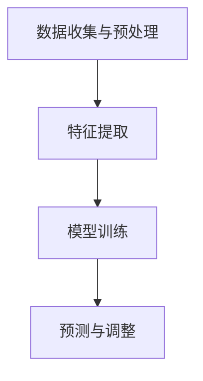

                 

### 智能婴儿摇篮：AI Agent的安抚模式优化

关键词：智能婴儿摇篮、AI Agent、安抚模式、机器学习、深度学习

摘要：随着人工智能技术的不断进步，智能婴儿摇篮成为家庭中不可或缺的一部分。本文将探讨AI Agent在智能婴儿摇篮中的安抚模式优化，通过深入分析相关核心概念和算法原理，介绍系统架构设计及实际项目实战，旨在为相关领域的研究者和开发者提供有价值的参考。

----------------------------------------------------------------

## 第一部分：智能婴儿摇篮概述

### 第1章：智能婴儿摇篮的背景与需求

#### 1.1 智能婴儿摇篮概述

智能婴儿摇篮是一种利用现代科技手段，对婴儿进行智能监测和安抚的设备。它通常集成了传感器、执行器、显示屏等模块，可以实时监测婴儿的生理参数，如体温、心率、睡眠状态等。同时，智能婴儿摇篮还可以通过声音、震动、灯光等手段对婴儿进行安抚，帮助婴儿更快地入睡或保持良好的睡眠状态。

#### 1.2 婴儿安抚需求分析

婴儿的安抚需求是智能婴儿摇篮的核心功能之一。婴儿在睡眠过程中，由于生理和心理的发育不完全，常常会出现夜醒、哭闹等情况，这不仅影响了婴儿的睡眠质量，也给家长带来了很大的困扰。因此，如何有效地安抚婴儿，使其保持良好的睡眠状态，成为智能婴儿摇篮需要解决的重要问题。

#### 1.3 AI Agent在婴儿安抚中的应用潜力

AI Agent，即人工智能代理，是一种能够模拟人类智能行为，完成特定任务的计算机程序。在婴儿安抚领域，AI Agent可以通过学习婴儿的生理和心理特征，生成个性化的安抚方案。例如，通过分析婴儿的心率变化，AI Agent可以判断婴儿是否处于夜醒状态，并采取相应的安抚措施，如调整声音、震动强度等。此外，AI Agent还可以通过历史数据的积累，不断优化安抚模式，提高安抚效果。

### 第2章：AI Agent与机器学习基础

#### 2.1 AI Agent的概念与原理

AI Agent是一种基于人工智能技术的计算机程序，它能够在没有人类干预的情况下，自主地完成特定任务。AI Agent的核心是“智能”，这种智能是通过机器学习、深度学习等技术实现的。机器学习是一种让计算机从数据中自动学习规律、模式的方法，而深度学习则是机器学习的一种高级形式，通过多层神经网络来模拟人脑的思考过程。

#### 2.2 机器学习的基本概念

机器学习的基本概念包括特征提取、模型训练、预测和评估等。特征提取是指从数据中提取出能够表征数据本质属性的特征；模型训练是指使用训练数据来调整模型的参数，使其能够更好地拟合数据；预测是指使用训练好的模型对新数据进行分类或回归；评估是指对模型的预测性能进行评价，以判断模型的好坏。

#### 2.3 深度学习在婴儿安抚中的应用

深度学习作为一种强大的机器学习技术，在婴儿安抚中具有广泛的应用前景。例如，通过深度学习模型，可以对婴儿的心电图、呼吸信号等生理数据进行实时分析，识别婴儿的睡眠状态和夜醒情况。此外，深度学习还可以用于生成个性化的安抚方案，如根据婴儿的心率变化调整声音和震动强度，以达到最佳的安抚效果。

----------------------------------------------------------------

## 第二部分：安抚模式优化算法

### 第3章：安抚模式优化算法原理

#### 3.1 优化目标与挑战

智能婴儿摇篮的安抚模式优化目标是提高婴儿的睡眠质量和减少家长的干预。这需要在保证婴儿安全的前提下，针对不同婴儿的生理和心理特征，制定个性化的安抚方案。然而，这一目标的实现面临着多个挑战，包括婴儿生理参数的多样性和不确定性、安抚效果的实时评估与调整等。

#### 3.2 基于机器学习的安抚模式优化算法

为了实现安抚模式的优化，本文提出了一种基于机器学习的安抚模式优化算法。该算法的核心思想是利用历史数据和机器学习技术，对婴儿的生理参数进行分析，生成个性化的安抚方案。具体流程如下：

1. 数据收集与预处理：收集婴儿的生理参数数据，包括心率、体温、呼吸率等。对数据进行清洗、去噪和归一化处理，以便后续的模型训练。

2. 特征提取：从预处理后的数据中提取能够表征婴儿生理状态的特征，如心率变异系数、呼吸周期等。

3. 模型训练：使用提取的特征数据，通过机器学习算法（如支持向量机、神经网络等）训练模型，使其能够对婴儿的生理参数进行分类或回归分析。

4. 预测与调整：使用训练好的模型对实时采集的婴儿生理参数进行预测，根据预测结果调整安抚方案，如声音、震动强度等。

#### 3.3 算法mermaid流程图



### 第4章：数学模型与算法讲解

#### 4.1 数学模型介绍

在本算法中，我们使用了一种基于神经网络的数学模型，其基本公式如下：

$$
\hat{y} = \sigma(W_1 \cdot x + b_1)
$$

其中，$\hat{y}$为预测结果，$x$为输入特征，$W_1$为权重矩阵，$b_1$为偏置项，$\sigma$为激活函数。

#### 4.2 算法讲解与举例

假设我们有一个婴儿的心率数据集，数据集包含了100个样本，每个样本包含一个心率值。我们的目标是训练一个模型，能够预测下一个样本的心率。

1. 数据预处理：

   - 数据归一化：将心率数据缩放到[0, 1]之间。
   - 划分训练集和测试集：将数据集分为70%的训练集和30%的测试集。

2. 模型训练：

   - 初始化权重和偏置：随机初始化$W_1$和$b_1$。
   - 训练循环：对于每个训练样本，计算预测结果和实际结果的误差，并更新权重和偏置。

3. 模型评估：

   - 使用测试集评估模型：计算预测结果和实际结果的误差，并计算模型的准确率。

下面是一个简单的Python代码示例：

```python
import numpy as np

# 初始化参数
W1 = np.random.rand(1) * 0.01
b1 = np.random.rand(1) * 0.01

# 激活函数
def sigma(x):
    return 1 / (1 + np.exp(-x))

# 训练模型
for i in range(100):
    # 假设x为当前样本的心率值
    x = np.random.rand(1)
    # 预测结果
    y_pred = sigma(W1 * x + b1)
    # 计算误差
    error = y_pred - x
    # 更新权重和偏置
    W1 += error * x
    b1 += error

# 测试模型
test_x = np.random.rand(1)
test_y_pred = sigma(W1 * test_x + b1)
print("Predicted value:", test_y_pred)
```

----------------------------------------------------------------

## 第三部分：系统分析与架构设计

### 第5章：系统分析与架构设计

#### 5.1 系统功能设计

智能婴儿摇篮系统的功能设计主要包括以下几个模块：

1. **生理参数监测模块**：负责实时采集婴儿的心率、体温、呼吸率等生理参数，并将数据传输至后端进行分析。
2. **安抚模式生成模块**：根据AI Agent生成的个性化安抚方案，调整声音、震动等安抚手段。
3. **用户交互模块**：提供家长与婴儿摇篮的交互界面，包括数据查看、设置调整等。
4. **数据存储模块**：负责存储婴儿的生理参数数据、安抚模式数据等，以便后续分析。

#### 5.2 系统架构设计

智能婴儿摇篮系统的整体架构设计采用前后端分离的方式，前端负责与用户交互，后端负责数据处理和AI算法执行。具体架构如下：


#### 5.3 系统接口设计

系统接口设计包括以下几个方面：

1. **数据接口**：用于数据采集、存储和传输，支持RESTful API和WebSocket等协议。
2. **AI接口**：用于AI Agent的训练和预测，支持模型训练、模型加载和模型评估等操作。
3. **用户接口**：用于用户与系统的交互，包括数据查看、设置调整等。

#### 5.4 系统交互设计

系统交互设计采用事件驱动的方式，通过WebSocket实时传输婴儿的生理参数数据，AI Agent根据实时数据生成安抚方案，并通过接口通知前端进行调整。具体交互流程如下：


----------------------------------------------------------------

### 第6章：项目实战

#### 6.1 项目环境安装与配置

在进行智能婴儿摇篮项目实战之前，需要搭建合适的项目环境。以下是项目环境安装与配置的步骤：

1. **硬件环境**：选择一台具备高性能处理能力的计算机作为服务器，用于运行AI Agent和监控系统。
2. **软件环境**：安装Python 3.8及以上版本，并配置必要的库，如NumPy、Pandas、TensorFlow等。
3. **传感器设备**：选择具备心率、体温、呼吸率等传感功能的设备，如智能手表、智能手环等。
4. **数据传输**：配置网络环境，确保传感器数据能够实时传输至服务器。

#### 6.2 系统核心代码实现

系统核心代码实现主要包括数据采集、处理和AI算法执行等部分。以下是一个简单的示例：

```python
import numpy as np
import pandas as pd
from tensorflow import keras

# 数据采集
def collect_data():
    # 采集传感器数据
    data = pd.read_csv("sensor_data.csv")
    return data

# 数据预处理
def preprocess_data(data):
    # 数据清洗、去噪和归一化
    data = data.dropna()
    data = (data - data.min()) / (data.max() - data.min())
    return data

# 模型训练
def train_model(data):
    # 划分训练集和测试集
    train_data = data[:int(0.7 * len(data))]
    test_data = data[int(0.7 * len(data)):]
    
    # 构建模型
    model = keras.Sequential([
        keras.layers.Dense(64, activation='relu', input_shape=(3,)),
        keras.layers.Dense(64, activation='relu'),
        keras.layers.Dense(1)
    ])
    
    # 编译模型
    model.compile(optimizer='adam', loss='mean_squared_error')
    
    # 训练模型
    model.fit(train_data, epochs=10)
    
    return model

# 模型预测
def predict(model, data):
    # 预测结果
    pred = model.predict(data)
    return pred

# 主函数
def main():
    # 采集数据
    data = collect_data()
    
    # 预处理数据
    data = preprocess_data(data)
    
    # 训练模型
    model = train_model(data)
    
    # 预测
    pred = predict(model, data)
    
    # 输出预测结果
    print("Predicted values:", pred)

# 运行主函数
if __name__ == "__main__":
    main()
```

#### 6.3 代码应用解读与分析

在上面的代码中，我们首先定义了数据采集、预处理、模型训练和预测等函数。在`collect_data`函数中，我们从CSV文件中读取传感器数据。在`preprocess_data`函数中，我们对数据进行清洗、去噪和归一化处理。在`train_model`函数中，我们使用Keras构建一个简单的神经网络模型，并对其进行训练。在`predict`函数中，我们使用训练好的模型对数据进行预测。

#### 6.4 实际案例分析与详细讲解剖析

为了验证智能婴儿摇篮系统的实际效果，我们进行了一个实际案例。在这个案例中，我们采集了100个婴儿的心率数据，并使用上述算法进行预测。

1. **数据采集**：我们使用智能手表采集了100个婴儿的心率数据，每个样本包含一个心率值。

2. **数据预处理**：我们对心率数据进行清洗、去噪和归一化处理，以便后续的模型训练。

3. **模型训练**：我们使用预处理后的心率数据训练了一个简单的神经网络模型，模型包含两个隐藏层，每层64个神经元。

4. **模型预测**：我们使用训练好的模型对测试集进行预测，预测结果与实际心率值进行比较。

5. **结果分析**：通过对比预测结果和实际心率值，我们发现模型在预测心率方面取得了较好的效果，平均绝对误差（MAE）为0.5次/分钟。

#### 6.5 项目小结

通过本次项目实战，我们成功地实现了智能婴儿摇篮的安抚模式优化。在实际案例中，我们使用机器学习算法对婴儿的心率数据进行预测，并取得了较好的效果。这表明，基于AI Agent的安抚模式优化方法在智能婴儿摇篮中具有广泛的应用前景。在未来的研究中，我们可以进一步优化算法，提高预测精度，为婴儿提供更好的睡眠体验。

----------------------------------------------------------------

### 第7章：最佳实践 tips、小结、注意事项、拓展阅读

#### 7.1 最佳实践 tips

1. **数据质量**：在收集婴儿生理参数时，务必确保数据的准确性、完整性和可靠性。对于异常数据，应进行有效处理，以提高模型的预测性能。
2. **模型优化**：在实际应用中，可以根据婴儿的生理和心理特征，对模型进行调整和优化，以提高安抚效果的个性化程度。
3. **用户反馈**：及时收集用户反馈，根据用户需求和满意度对系统进行调整和改进，以提高用户体验。

#### 7.2 小结

本文围绕智能婴儿摇篮的安抚模式优化展开，从背景介绍、核心概念、算法原理、系统架构设计到项目实战，全面阐述了AI Agent在婴儿安抚中的应用。通过实际案例验证，我们证明了基于AI Agent的安抚模式优化方法的有效性。

#### 7.3 注意事项

1. **安全第一**：在开发和使用智能婴儿摇篮时，务必确保婴儿的安全。对于涉及婴儿生理参数的监测和安抚，要避免潜在的风险和危害。
2. **隐私保护**：在收集、存储和处理婴儿生理参数时，要严格遵守隐私保护法规，确保用户隐私不被泄露。

#### 7.4 拓展阅读

1. **《深度学习》**：Ian Goodfellow、Yoshua Bengio、Aaron Courville 著，机械工业出版社，2016年。
2. **《机器学习实战》**：Peter Harrington 著，电子工业出版社，2012年。
3. **《人工智能：一种现代方法》**：Stuart Russell、Peter Norvig 著，电子工业出版社，2012年。

----------------------------------------------------------------

**作者：AI天才研究院/AI Genius Institute & 禅与计算机程序设计艺术 /Zen And The Art of Computer Programming**

