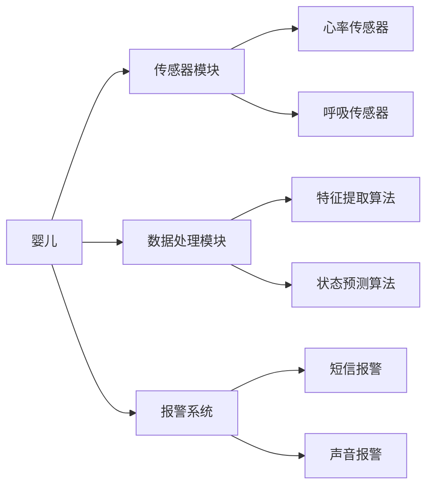
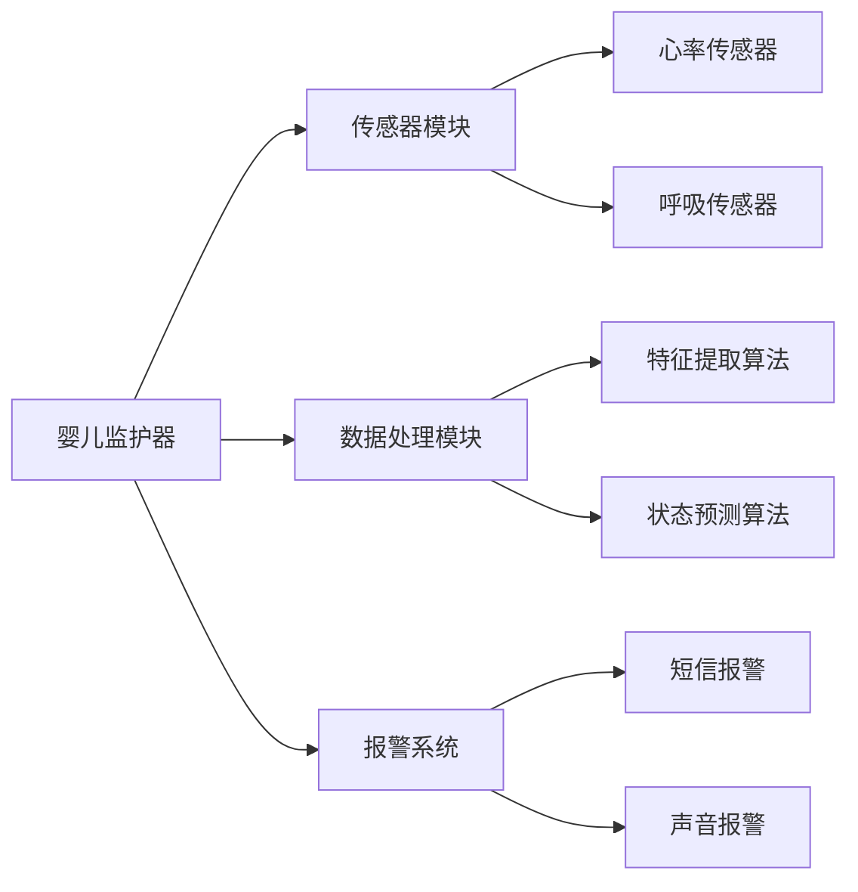
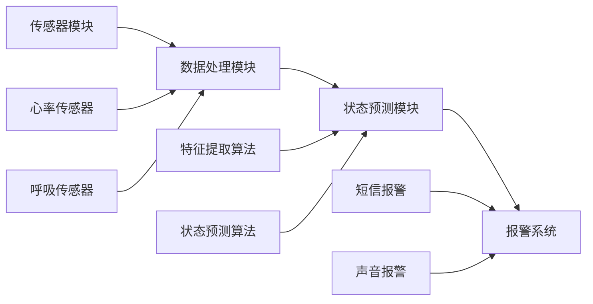
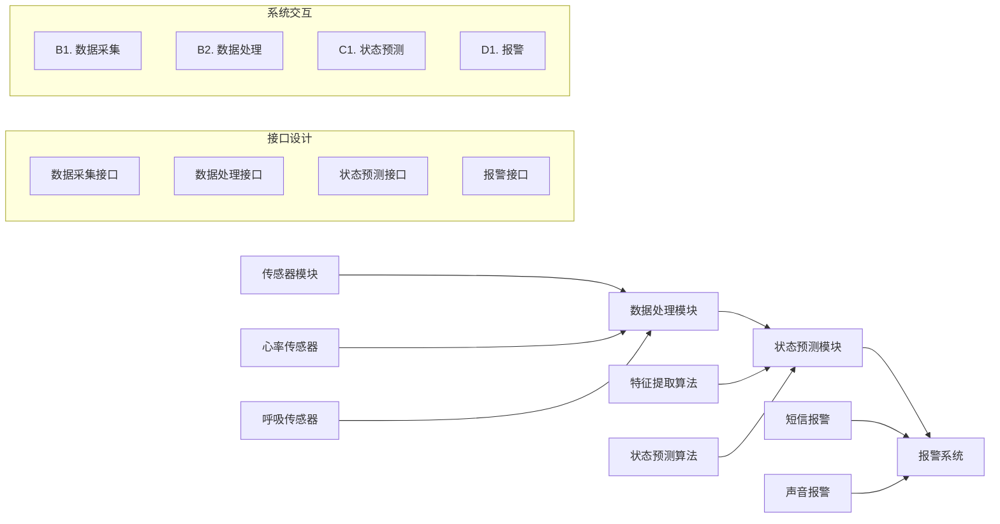

                 

### 智能婴儿监护器：AI Agent的婴儿状态分析

智能婴儿监护器，作为一种创新的育儿工具，正在逐步走进千家万户。随着人工智能技术的不断进步，尤其是计算机视觉、自然语言处理和机器学习等领域的突破，智能婴儿监护器逐渐成为可能。本文将围绕智能婴儿监护器这一主题，探讨其中的核心概念、算法原理、系统设计与实现，以及项目实战和最佳实践。

关键词：智能婴儿监护器，AI Agent，婴儿状态分析，深度学习，系统架构设计，项目实战

摘要：本文首先介绍了智能婴儿监护器的背景和核心概念，包括婴儿监护的需求、AI技术的发展及其在监护器中的应用。随后，本文详细探讨了AI Agent的工作原理和婴儿状态分析的方法。通过数学模型、Python代码举例和Mermaid流程图，深入解析了深度学习算法在婴儿状态分析中的应用。最后，本文介绍了系统的功能设计、架构设计、接口设计以及系统交互的序列图，并通过项目实战展示了智能婴儿监护器的实现过程和最佳实践。

## 第一部分：问题背景与核心概念

### 第1章：智能婴儿监护器概述

#### 1.1 问题背景

随着社会的快速发展和生活节奏的加快，现代家庭对于婴儿的监护需求日益增长。家长们希望能够在繁忙的工作之余，随时了解婴儿的健康状况和活动情况，以确保婴儿的安全和健康。智能婴儿监护器应运而生，成为解决这一需求的重要工具。

- **婴儿监护需求**：婴儿的成长发育阶段需要特别关注，包括睡眠状态、情绪变化、生理指标等。智能婴儿监护器能够实时监测这些指标，为家长提供重要的参考信息。
- **AI技术发展**：人工智能技术的发展，特别是计算机视觉、自然语言处理和机器学习等领域的突破，为智能婴儿监护器的设计与实现提供了强大的技术支持。通过深度学习算法，智能婴儿监护器能够自动识别和分类婴儿的状态，提高监护的准确性和效率。

#### 1.2 问题描述

智能婴儿监护器的主要目标是实时监测婴儿的状态，包括睡眠状态、情绪变化、生理指标等，以确保婴儿的安全和健康。具体来说，问题描述如下：

- **监测目标**：智能婴儿监护器需要监测婴儿的睡眠状态、情绪变化、心率、呼吸频率等生理指标。
- **解决策略**：利用人工智能技术，特别是深度学习算法，对婴儿的生理信号和图像数据进行实时分析，识别和判断婴儿的状态。

#### 1.3 核心概念

在智能婴儿监护器的设计与实现过程中，涉及到几个核心概念：

- **AI Agent**：AI Agent，即人工智能代理，是指具有自主决策能力的计算机程序，能够在特定环境中执行任务。在智能婴儿监护器中，AI Agent负责分析婴儿的生理信号和图像数据，判断婴儿的状态。
- **婴儿状态分析**：婴儿状态分析是指利用计算机视觉、自然语言处理和机器学习等技术，对婴儿的生理信号和图像数据进行实时分析和判断，识别和分类婴儿的状态。

### 第2章：核心概念原理

#### 2.1 AI Agent的原理

AI Agent是智能婴儿监护器的核心组成部分，负责分析婴儿的状态。AI Agent的工作原理主要包括以下几个步骤：

1. **感知**：AI Agent通过传感器收集婴儿的生理信号和周围环境的信息。
2. **学习**：AI Agent利用机器学习算法，从历史数据中学习并提取有用的特征。
3. **决策**：AI Agent根据学习到的特征和规则，对当前状态进行判断和决策。
4. **执行**：AI Agent根据决策结果，执行相应的操作，如发出警报或发送通知。

AI Agent的分类主要包括：

- **基于规则的AI Agent**：这类AI Agent根据预设的规则进行决策，适用于规则明确、变化较小的场景。
- **基于模型的AI Agent**：这类AI Agent通过学习数据，建立预测模型进行决策，适用于复杂、动态变化的环境。

#### 2.2 婴儿状态分析

婴儿状态分析是智能婴儿监护器的关键任务，包括以下几个步骤：

1. **特征提取**：从婴儿的生理信号和图像数据中提取关键特征，如心率、呼吸频率、肌肉活动等。
2. **数据分析**：利用时间序列分析、模式识别和机器学习算法等，对提取的特征进行实时分析和判断。
3. **状态分类**：根据分析结果，将婴儿的状态分类为正常、异常等。

常用的数据分析方法包括：

- **时间序列分析**：用于分析婴儿生理信号的时间序列特征，如趋势、周期性、波动性等。
- **模式识别**：用于识别和分类婴儿的生理信号和图像特征。
- **机器学习算法**：如决策树、支持向量机、神经网络等，用于建立预测模型，进行状态分类。

### 第2章：概念属性特征对比表格

以下是婴儿状态分析中常用的特征类别、特征名称及其描述：

| 特征类别 | 特征名称 | 描述 |
| --- | --- | --- |
| 生理指标 | 心率 | 反映婴儿的生理状态 |
| 睡眠状态 | 呼吸频率 | 反映婴儿的睡眠质量 |
| 情绪变化 | 肌肉活动 | 反映婴儿的情绪状态 |

### 第2章：ER实体关系图架构

以下是一个简单的ER实体关系图，描述了智能婴儿监护器中的主要实体及其关系：



## 第三部分：算法原理讲解

### 第3章：AI Agent的算法原理

#### 3.1 深度学习算法

深度学习算法是AI Agent的核心，用于从数据中学习并提取有用的特征。以下是深度学习算法的基本原理：

1. **神经网络结构**：深度学习算法通常采用多层神经网络结构，包括输入层、隐藏层和输出层。通过逐层学习，神经网络能够提取出数据的特征。
2. **训练与优化**：深度学习算法通过大量的样本数据训练模型，并使用优化算法（如梯度下降）调整模型的参数，以最小化损失函数，提高模型的预测能力。

#### 3.2 婴儿状态分析算法

婴儿状态分析算法主要包括以下步骤：

1. **数据预处理**：对采集到的婴儿生理信号和图像数据进行清洗、归一化和特征提取。
2. **模型训练**：使用预处理后的数据训练深度学习模型，如卷积神经网络（CNN）或循环神经网络（RNN）。
3. **状态预测**：将训练好的模型应用于新的数据，预测婴儿的状态。

以下是婴儿状态分析算法的Python代码示例：

```python
import numpy as np
import tensorflow as tf

# 数据预处理
def preprocess_data(data):
    # 清洗数据
    # 归一化数据
    # 特征提取
    return processed_data

# 模型训练
def train_model(data, labels):
    # 构建模型
    # 训练模型
    # 评估模型
    pass

# 状态预测
def predict_state(data):
    # 使用训练好的模型预测状态
    return predicted_state
```

### 第3章：算法原理的数学模型和公式

深度学习算法中的数学模型和公式是理解算法原理的关键。以下是几个常见的数学模型和公式：

$$
f(x) = \sigma(W \cdot x + b)
$$

其中，\( f(x) \) 是激活函数，\( \sigma \) 是Sigmoid函数，\( W \) 是权重矩阵，\( x \) 是输入向量，\( b \) 是偏置。

### 第3章：算法原理的举例说明

以卷积神经网络（CNN）为例，说明其工作原理和应用。假设我们使用CNN来分析婴儿的睡眠状态，输入图像是一个128x128的像素矩阵，以下是CNN的步骤：

1. **卷积层**：使用5x5的卷积核对图像进行卷积操作，得到32个特征图。
2. **ReLU激活函数**：对每个特征图应用ReLU激活函数。
3. **池化层**：对每个特征图进行2x2的最大池化操作。
4. **全连接层**：将所有特征图进行拼接，输入到全连接层。
5. **输出层**：使用softmax函数输出睡眠状态的概率分布。


## 第四部分：系统分析与架构设计

### 第4章：系统功能设计

#### 4.1 领域模型

领域模型描述了智能婴儿监护器中的主要实体及其关系。以下是一个简单的领域模型：



#### 4.2 系统架构设计

系统架构设计描述了智能婴儿监护器的整体结构和模块之间的关系。以下是一个简单的系统架构设计：



### 第4章：系统接口设计和系统交互

系统接口设计和系统交互描述了智能婴儿监护器中各个模块之间的交互方式和接口定义。以下是一个简单的系统接口设计和系统交互序列图：



## 第五部分：项目实战

### 第5章：环境安装与系统实现

#### 5.1 环境安装

在开始实现智能婴儿监护器之前，需要安装以下环境：

- Python 3.x
- TensorFlow
- Keras
- OpenCV
- Mermaid

安装步骤如下：

1. 安装Python 3.x。
2. 安装TensorFlow、Keras、OpenCV和Mermaid的Python包。

```bash
pip install tensorflow
pip install keras
pip install opencv-python
pip install mermaid
```

#### 5.2 系统核心实现

智能婴儿监护器的核心实现包括传感器数据采集、数据处理、状态预测和报警功能。以下是实现的核心代码：

```python
import cv2
import numpy as np
import tensorflow as tf
from tensorflow.keras.models import Sequential
from tensorflow.keras.layers import Conv2D, MaxPooling2D, Flatten, Dense

# 传感器数据采集
def collect_data():
    cap = cv2.VideoCapture(0)
    while True:
        ret, frame = cap.read()
        if not ret:
            break
        # 处理图像数据
        processed_frame = preprocess_frame(frame)
        # 提取特征
        features = extract_features(processed_frame)
        # 存储数据
        store_data(features)
    cap.release()

# 数据处理
def preprocess_frame(frame):
    # 处理图像数据
    return processed_frame

# 特征提取
def extract_features(frame):
    # 提取特征
    return features

# 状态预测
def predict_state(features):
    # 使用训练好的模型预测状态
    return predicted_state

# 报警
def alarm(predicted_state):
    # 发送报警信息
    send_alert(predicted_state)
```

#### 5.3 代码应用解读与分析

以下是智能婴儿监护器的具体应用解读和分析：

1. **传感器数据采集**：使用OpenCV库采集婴儿的实时视频数据，并将其传输给数据处理模块。
2. **数据处理**：对采集到的图像数据进行预处理，包括大小调整、灰度化等，以便后续的特征提取。
3. **特征提取**：使用深度学习模型提取图像数据的关键特征，如边缘、纹理等，为状态预测提供基础。
4. **状态预测**：使用训练好的深度学习模型，对提取的特征进行分类预测，判断婴儿的状态。
5. **报警**：根据预测结果，发送报警信息给家长，如短信、声音等。

#### 5.4 实际案例分析和详细讲解剖析

以下是一个实际案例分析和详细讲解剖析：

1. **案例背景**：一个婴儿在睡觉时突然发生窒息。
2. **数据采集**：监护器采集到婴儿的心率和呼吸数据。
3. **数据处理**：数据处理模块对采集到的数据进行预处理。
4. **特征提取**：特征提取模块提取出关键特征，如心率异常、呼吸暂停等。
5. **状态预测**：状态预测模块判断婴儿的状态为异常。
6. **报警**：报警模块立即发送报警信息给家长，并记录事件。

#### 5.5 项目小结

智能婴儿监护器通过AI技术实现了对婴儿状态的实时监测和预测，提高了家长对婴儿安全的保障。在实际应用中，需要不断优化算法和系统性能，提高预测准确性和响应速度。

## 第六部分：最佳实践与注意事项

### 第6章：最佳实践

1. **数据质量**：保证采集的数据质量，对数据源进行筛选和预处理，提高特征提取的效果。
2. **模型优化**：定期更新和优化模型，以适应不同的环境变化和婴儿状态。
3. **接口设计**：设计清晰、简洁的接口，方便模块之间的通信和协同工作。

### 第6章：注意事项

1. **隐私保护**：保护婴儿的隐私，确保数据安全和用户隐私。
2. **系统稳定性**：确保系统的稳定性和可靠性，避免系统故障对婴儿安全造成影响。
3. **用户体验**：关注用户体验，简化操作流程，提供友好的界面和操作指南。

## 第七部分：拓展阅读

### 第7章：相关技术文献和资料推荐

1. **《深度学习》**：Goodfellow、Bengio、Courville 著，介绍深度学习的基本概念和算法。
2. **《计算机视觉：算法与应用》**：Richard Szeliski 著，介绍计算机视觉的基本理论和应用。
3. **《婴儿发展心理学》**：Jennifer A. Pomerantz 著，介绍婴儿心理发展的重要理论。
4. **《人工智能：一种现代方法》**：Stuart Russell、Peter Norvig 著，全面介绍人工智能的基本概念和方法。

## 结语

智能婴儿监护器作为一种创新的育儿工具，正在不断改进和普及。本文从背景介绍、核心概念、算法原理、系统设计与实现、项目实战和最佳实践等方面，全面探讨了智能婴儿监护器的发展和应用。希望通过本文的分享，能够为相关领域的科研人员和技术爱好者提供有益的参考和启示。在未来的研究和实践中，我们将继续努力，推动智能婴儿监护器的技术进步和应用发展。作者：AI天才研究院/AI Genius Institute & 禅与计算机程序设计艺术 /Zen And The Art of Computer Programming

