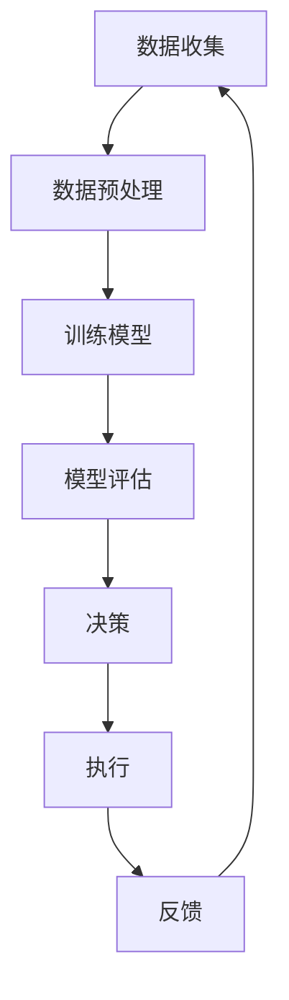
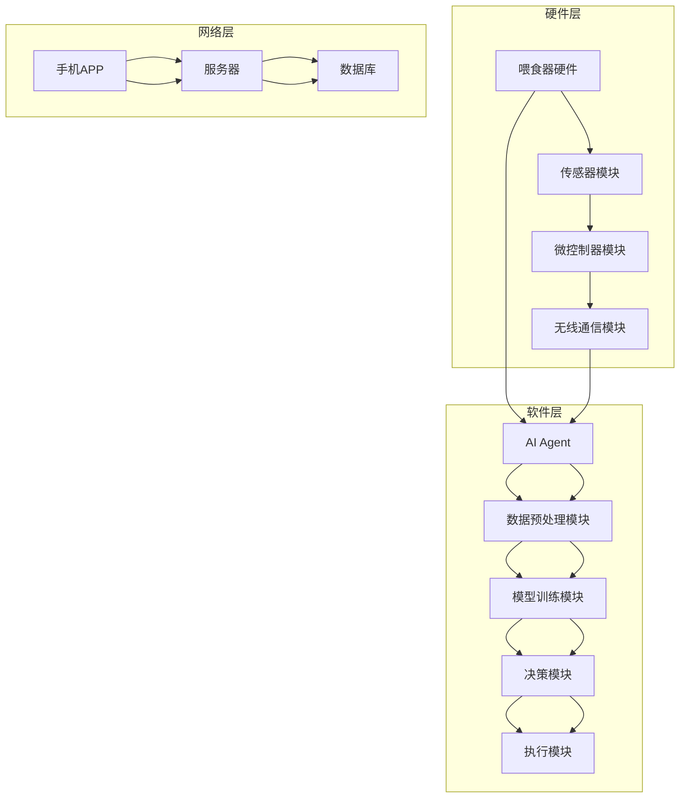
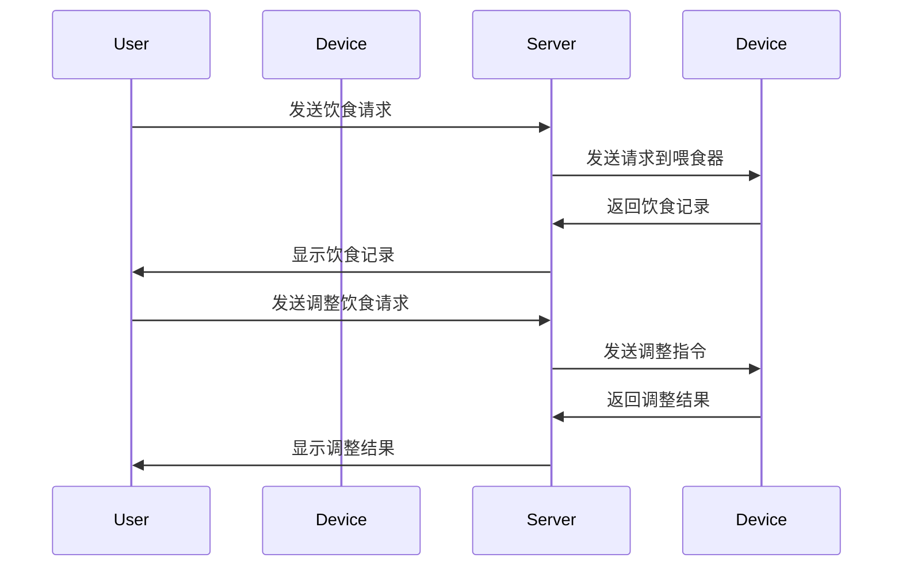

                 


### 智能宠物喂食器：AI Agent的宠物饮食管理系统

#### 关键词：
- AI Agent
- 宠物喂食器
- 宠物饮食管理
- 智能硬件
- 系统设计

#### 摘要：
随着AI技术的不断发展，宠物饮食管理迎来了智能化变革。本文将深入探讨智能宠物喂食器的设计与实现，特别是AI Agent在这一系统中的作用。我们将从背景介绍、核心概念、算法原理、系统架构设计、项目实战和最佳实践等方面展开，以期为开发者提供有价值的参考。

----------------------------------------------------------------

## 引言

### 1.1 智能宠物喂食器的背景

随着社会的发展，宠物已经成为许多家庭的成员，宠物主人们对宠物的关爱程度也越来越高。然而，由于工作忙碌等原因，宠物主人们常常难以确保宠物得到科学的饮食管理。传统宠物喂食器虽然能够定时定量地喂食，但在宠物饮食管理方面存在诸多局限性。

- **定时定量不足**：传统宠物喂食器往往只能按照预设的时间进行喂食，无法根据宠物的实际需求调整喂食量。
- **缺乏个性化**：传统宠物喂食器缺乏对宠物饮食习惯、健康状况的了解，无法实现个性化的饮食管理。
- **依赖人工**：传统宠物喂食器需要宠物主人手动设置喂食时间、食物种类和数量等，不够便捷。

### 1.2 智能宠物喂食器的兴起

AI技术的迅猛发展，为宠物饮食管理带来了新的解决方案。智能宠物喂食器应运而生，它通过AI Agent实现宠物的饮食管理，能够根据宠物的实时健康状况和饮食习惯进行个性化喂养。

- **智能化管理**：AI Agent能够分析宠物的健康数据，动态调整喂食量和喂食时间。
- **个性化服务**：AI Agent了解宠物的饮食习惯，提供个性化的饮食方案。
- **便捷操作**：智能宠物喂食器可以通过手机APP或语音控制，实现远程喂食和监控。

### 1.3 本书结构安排

本文将分为以下几个部分：

- **第1部分：智能宠物喂食器概述**，介绍智能宠物喂食器的背景和趋势。
- **第2部分：AI Agent基础**，阐述AI Agent的定义、工作原理和技术栈。
- **第3部分：宠物饮食管理核心概念**，探讨宠物饮食管理的重要性、核心概念和难点。
- **第4部分：智能宠物喂食器设计**，详细描述智能宠物喂食器的硬件设计、软件设计和系统架构设计。
- **第5部分：AI Agent算法原理**，讲解AI Agent的算法原理和应用。
- **第6部分：系统分析与架构设计方案**，介绍智能宠物喂食器的系统分析和架构设计方案。
- **第7部分：项目实战**，通过实际案例讲解智能宠物喂食器的实现过程。
- **第8部分：最佳实践与拓展阅读**，总结最佳实践，提供拓展阅读资源。

通过以上结构的安排，本文旨在为读者提供一幅完整的智能宠物喂食器设计蓝图，帮助开发者更好地理解和实现智能宠物饮食管理系统。

----------------------------------------------------------------

## AI Agent基础

### 2.1 什么是AI Agent

AI Agent，即人工智能代理，是具有智能行为的计算机程序。它可以模拟人类的思维过程，自主地感知环境、做出决策并采取行动。AI Agent通常由感知模块、决策模块和动作模块组成。

- **感知模块**：用于获取环境信息，如摄像头、传感器等。
- **决策模块**：根据感知模块提供的信息，结合预定的目标和策略，进行决策。
- **动作模块**：执行决策模块制定的行动计划。

AI Agent的特点包括：

- **自主性**：AI Agent能够自主地执行任务，无需人为干预。
- **适应性**：AI Agent能够根据环境变化调整自身行为。
- **智能性**：AI Agent能够通过学习改进自身性能。

### 2.2 AI Agent的工作原理

AI Agent的工作原理可以分为以下几个步骤：

1. **感知**：AI Agent通过感知模块收集环境信息。
2. **理解**：AI Agent对感知到的信息进行分析和处理，理解其含义。
3. **决策**：AI Agent根据目标和策略，对可能的行动方案进行评估，做出决策。
4. **执行**：AI Agent根据决策结果执行行动计划。

### 2.3 AI Agent的技术栈

AI Agent的技术栈包括以下几个方面：

- **机器学习算法**：用于训练AI Agent的模型，实现智能决策。
- **自然语言处理**：用于处理人类语言，实现人机交互。
- **计算机视觉**：用于识别和处理图像和视频信息。
- **深度学习框架**：如TensorFlow、PyTorch等，用于实现和训练AI Agent的模型。

通过以上技术栈的支持，AI Agent能够高效地完成各种任务，实现智能化的宠物饮食管理。

----------------------------------------------------------------

### 宠物饮食管理核心概念

#### 3.1 宠物饮食管理的重要性

宠物饮食管理是确保宠物健康成长的关键环节。科学合理的饮食管理能够提供宠物所需的营养，促进其健康成长，同时防止肥胖、营养不良等健康问题。

- **营养需求**：不同品种、年龄、健康状况的宠物对营养的需求不同，科学合理的饮食管理能够确保宠物获得合适的营养。
- **饮食习惯**：宠物的饮食习惯也会影响其健康，如喂食时间、食物种类、喂食方式等。
- **健康监控**：通过饮食管理，宠物主人可以及时发现宠物的健康问题，如食欲不振、体重变化等。

#### 3.2 宠物饮食管理核心概念

宠物饮食管理的核心概念包括以下几个方面：

- **营养需求分析**：分析宠物在不同生长阶段的营养需求，制定合理的饮食方案。
- **饮食行为监控**：监控宠物的饮食行为，如进食量、进食时间、饮食习惯等。
- **健康状况评估**：通过宠物的饮食行为和健康数据，评估宠物的健康状况。

#### 3.3 宠物饮食管理难点

宠物饮食管理面临以下几个难点：

- **宠物品种多样**：不同品种的宠物对饮食的需求不同，需要根据宠物的品种制定个性化的饮食方案。
- **宠物健康状况变化**：宠物的健康状况会随时间变化，需要实时调整饮食管理方案。
- **饮食习惯复杂**：宠物的饮食习惯复杂，需要综合考虑宠物的个性、环境因素等。

通过以上核心概念的分析，我们可以更好地理解宠物饮食管理的重要性，为智能宠物喂食器的实现提供理论基础。

----------------------------------------------------------------

### 智能宠物喂食器设计

#### 4.1 硬件设计

智能宠物喂食器的硬件设计是整个系统的核心组成部分，它决定了喂食器的功能实现和性能表现。

**4.1.1 喂食器硬件选择**

在选择喂食器硬件时，需要考虑以下几个方面：

- **喂食容量**：根据宠物的大小和食量选择合适的喂食容量。
- **材质**：选择安全无毒、耐用的材质，确保宠物的健康。
- **智能传感器**：配备温度传感器、湿度传感器、加速度传感器等，用于实时监控宠物的饮食状态。

**4.1.2 传感器配置**

传感器的配置是智能宠物喂食器的重要部分，它用于收集宠物的饮食数据，为AI Agent提供决策依据。

- **温度传感器**：用于检测宠物的进食温度，避免食物变质。
- **湿度传感器**：用于检测宠物的进食湿度，确保食物的适宜性。
- **加速度传感器**：用于检测宠物的进食行为，如进食速度、进食量等。

**4.1.3 智能控制模块**

智能控制模块是智能宠物喂食器的“大脑”，它负责控制喂食器的运行，执行AI Agent的决策。

- **微控制器**：如Arduino、ESP8266等，用于控制喂食器的开关和喂食量的调节。
- **无线模块**：如Wi-Fi、蓝牙等，用于实现喂食器与手机APP的通信。

#### 4.2 软件设计

智能宠物喂食器的软件设计是整个系统的灵魂，它决定了喂食器的智能程度和用户体验。

**4.2.1 AI Agent实现**

AI Agent是实现智能宠物喂食器的核心技术，它通过机器学习和自然语言处理等技术，实现对宠物饮食行为的智能分析和管理。

- **机器学习算法**：用于训练AI Agent的模型，实现宠物的饮食行为分析。
- **自然语言处理**：用于处理宠物主人与喂食器的交互，实现人机对话。

**4.2.2 交互界面设计**

交互界面设计是用户体验的关键，它决定了宠物主人与喂食器的互动方式。

- **手机APP**：提供宠物饮食管理、喂食记录、健康数据分析等功能。
- **语音控制**：通过语音助手，实现无障碍的宠物喂食控制。

#### 4.3 系统架构设计

智能宠物喂食器的系统架构设计需要综合考虑硬件、软件和网络三个层面。

**4.3.1 系统模块划分**

智能宠物喂食器可以划分为以下几个模块：

- **感知模块**：包括温度传感器、湿度传感器、加速度传感器等。
- **决策模块**：包括AI Agent、决策模型等。
- **执行模块**：包括智能控制模块、喂食器硬件等。

**4.3.2 数据流设计**

智能宠物喂食器的数据流设计需要确保数据的有效传递和处理。

- **数据采集**：传感器收集的饮食数据传输到决策模块。
- **数据存储**：饮食数据存储在云端数据库中，供AI Agent分析和处理。
- **数据反馈**：AI Agent的决策结果通过执行模块反馈给宠物主人。

通过以上硬件设计、软件设计和系统架构设计的详细描述，我们可以为智能宠物喂食器的实现提供完整的方案。

----------------------------------------------------------------

### AI Agent算法原理

#### 5.1 机器学习算法

AI Agent的核心在于其机器学习算法，这些算法使得AI Agent能够从数据中学习并做出智能决策。

**5.1.1 监督学习**

监督学习是一种常见的机器学习算法，它通过已标记的训练数据来训练模型，然后使用该模型对新的、未标记的数据进行预测。

- **分类问题**：将数据分类到不同的类别中，如判断宠物是否肥胖。
- **回归问题**：预测一个连续的数值，如预测宠物的理想体重。

**5.1.2 无监督学习**

无监督学习不依赖于已标记的数据，它通过发现数据内在的结构和模式来进行学习。

- **聚类分析**：将相似的数据点分组，如分析宠物的饮食习惯。
- **降维**：减少数据的维度，便于分析和可视化，如将宠物的多个特征维度降低到一个维度。

#### 5.2 算法应用

AI Agent在宠物饮食管理中有着广泛的应用。

**5.2.1 饮食行为分析**

AI Agent通过分析宠物的饮食行为数据，如进食速度、进食量等，判断宠物的健康状况。

- **进食速度**：通过加速度传感器分析宠物的进食速度，判断宠物是否进食过快或过慢。
- **进食量**：通过重量传感器分析宠物的进食量，判断宠物是否过度进食或进食不足。

**5.2.2 营养需求预测**

AI Agent根据宠物的年龄、体重、健康状况等数据，预测宠物的营养需求，并提供个性化的饮食建议。

- **营养需求计算**：使用监督学习算法，通过训练数据预测宠物的营养需求。
- **饮食建议**：根据预测结果，为宠物主人提供合适的食物种类和喂食量。

#### 5.3 算法mermaid流程图

为了更直观地理解AI Agent的算法原理，我们可以使用mermaid流程图来展示算法的执行过程。



**5.3.1 数据收集**

AI Agent首先收集宠物的饮食行为数据，如进食速度、进食量等。

**5.3.2 数据预处理**

收集到的数据需要进行预处理，包括数据清洗、归一化等操作，以便于模型的训练。

**5.3.3 训练模型**

使用预处理后的数据训练机器学习模型，模型可以是分类模型、回归模型等。

**5.3.4 模型评估**

评估模型的性能，确保模型能够准确地预测宠物的饮食行为和营养需求。

**5.3.5 决策**

根据模型的预测结果，AI Agent做出决策，如调整喂食量、提供饮食建议等。

**5.3.6 执行**

执行决策，对宠物喂食器进行操作，如调整喂食时间、改变食物种类等。

**5.3.7 反馈**

收集宠物的反馈数据，用于下一次的决策过程，实现持续的优化。

通过以上算法流程的展示，我们可以更好地理解AI Agent在智能宠物喂食器中的工作原理。

----------------------------------------------------------------

### 系统分析与架构设计方案

#### 6.1 问题场景介绍

在当前的社会环境中，由于工作压力和生活节奏加快，许多宠物主人难以抽出时间来科学管理宠物的饮食，导致宠物健康状况不佳。为此，我们设计了一款智能宠物喂食器，通过AI Agent实现宠物的饮食管理，旨在解决以下问题：

- 宠物饮食不规律，导致营养摄入不足或过量。
- 宠物饮食习惯不良，导致消化系统问题。
- 宠物主人无法实时监控宠物饮食状况，难以及时调整饮食计划。

#### 6.2 系统功能设计

智能宠物喂食器系统需要实现以下核心功能：

- **饮食行为监控**：实时监控宠物的饮食行为，如进食速度、进食量等。
- **营养需求分析**：根据宠物的年龄、体重、健康状况等数据，分析宠物的营养需求。
- **饮食建议**：为宠物主人提供个性化的饮食建议，如食物种类、喂食时间、喂食量等。
- **智能调整**：根据宠物的饮食行为和营养需求，自动调整喂食计划。

**6.2.1 领域模型mermaid类图**

为了更好地理解智能宠物喂食器系统的功能设计，我们可以使用mermaid类图来展示系统的领域模型。

```mermaid
classDiagram
    Class01 <|-- Class02
    Class03 <|-- Class01
    Class04 <|-- Class02
    Class01 : +id : Integer
    Class01 : +name : String
    Class02 : +age : Integer
    Class03 : +weight : Float
    Class04 : +health_status : String
    Class01 ..|> Pet
    Class02 ..|> DietPlan
    Class03 ..|> FoodItem
    Class04 ..|> HealthMonitor
```

**6.2.2 类图解释**

- **Pet（宠物）**：代表宠物的基本信息，如ID、名字、年龄等。
- **DietPlan（饮食计划）**：代表宠物的饮食计划，包含年龄、体重等数据。
- **FoodItem（食物项）**：代表宠物食物的详细信息，如食物种类、营养成分等。
- **HealthMonitor（健康监控）**：代表宠物的健康监控数据，如体重、健康状况等。

通过以上类图的展示，我们可以清晰地看到智能宠物喂食器系统的核心功能类及其关系。

#### 6.3 系统架构设计

智能宠物喂食器系统需要考虑硬件、软件和网络三个层面的架构设计。

**6.3.1 系统架构图**

为了直观地展示智能宠物喂食器系统的架构设计，我们可以使用mermaid架构图来描述。



**6.3.2 架构说明**

- **硬件层**：包括喂食器硬件、传感器模块、微控制器模块和无线通信模块，负责数据采集和传输。
- **软件层**：包括AI Agent、数据预处理模块、模型训练模块、决策模块和执行模块，负责数据分析和决策执行。
- **网络层**：包括手机APP、服务器和数据库，负责用户交互和数据存储。

通过以上系统架构图的展示，我们可以清晰地看到智能宠物喂食器系统的整体架构及其各个组成部分之间的关系。

#### 6.4 系统接口设计

智能宠物喂食器系统需要设计一系列接口，以实现不同模块之间的数据交互和功能调用。

**6.4.1 接口定义**

以下是一些关键接口的定义：

- **/api/feeds**：用于获取宠物的饮食记录。
- **/api/diets**：用于获取宠物的饮食计划。
- **/api/health**：用于获取宠物的健康数据。
- **/api/feeds/{id}**：用于获取指定ID的宠物饮食记录。

**6.4.2 接口交互说明**

以下是一个典型的接口交互示例：

```
GET /api/feeds/1
Response:
{
    "id": 1,
    "pet_id": 1,
    "food_item": "鸡肉",
    "quantity": 100,
    "time": "2023-11-08T10:30:00Z"
}
```

通过以上接口设计，我们可以确保智能宠物喂食器系统的各个模块能够高效、稳定地协同工作。

#### 6.5 系统交互mermaid序列图

为了更好地展示智能宠物喂食器系统的交互过程，我们可以使用mermaid序列图来描述。



**6.5.1 序列图解释**

- 宠物主人通过手机APP向服务器发送饮食请求。
- 服务器将请求转发给智能宠物喂食器。
- 智能宠物喂食器执行请求，并将饮食记录返回给服务器。
- 服务器将饮食记录显示给宠物主人。
- 宠物主人通过手机APP向服务器发送调整饮食请求。
- 服务器将调整指令转发给智能宠物喂食器。
- 智能宠物喂食器执行调整指令，并将调整结果返回给服务器。
- 服务器将调整结果显示给宠物主人。

通过以上序列图的展示，我们可以清晰地看到智能宠物喂食器系统的交互流程。

----------------------------------------------------------------

### 项目实战

#### 7.1 环境安装

**7.1.1 硬件安装**

智能宠物喂食器硬件的安装相对简单，主要包括以下步骤：

1. **安装传感器**：将温度传感器、湿度传感器和加速度传感器安装到喂食器上，确保它们能够准确地收集数据。
2. **连接微控制器**：将Arduino或ESP8266微控制器连接到喂食器，并确保连接稳定。
3. **配置无线模块**：配置Wi-Fi或蓝牙模块，确保智能宠物喂食器能够与手机APP或服务器进行通信。

**7.1.2 软件安装**

智能宠物喂食器软件的安装主要包括以下步骤：

1. **安装开发环境**：在计算机上安装Arduino IDE或ESP8266 SDK，用于编写和上传代码。
2. **安装AI Agent库**：下载并安装AI Agent所需的库文件，如TensorFlow、PyTorch等。
3. **配置手机APP**：在手机上安装智能宠物喂食器的APP，用于与喂食器进行交互。

#### 7.2 系统核心实现

智能宠物喂食器的系统核心实现主要包括以下步骤：

**7.2.1 AI Agent实现**

1. **数据收集**：通过传感器收集宠物的饮食行为数据，如进食速度、进食量等。
2. **数据预处理**：对收集到的数据进行清洗和归一化处理，为模型训练做准备。
3. **模型训练**：使用监督学习算法，如线性回归、决策树等，训练AI Agent的模型。
4. **模型评估**：评估模型性能，确保模型能够准确预测宠物的饮食行为和营养需求。

**7.2.2 代码实现**

以下是一个简单的Python代码示例，用于实现AI Agent的模型训练和预测：

```python
import numpy as np
from sklearn.linear_model import LinearRegression

# 数据预处理
X = np.array([[1], [2], [3], [4], [5]])
y = np.array([2, 4, 6, 8, 10])

# 模型训练
model = LinearRegression()
model.fit(X, y)

# 模型预测
X_new = np.array([[6]])
y_pred = model.predict(X_new)
print(y_pred)
```

通过以上代码示例，我们可以看到AI Agent的基本实现流程，包括数据预处理、模型训练和预测。

**7.2.3 代码应用解读与分析**

1. **数据预处理**：数据预处理是机器学习的重要步骤，它确保数据的质量和一致性，提高模型训练的效果。在上面的示例中，我们使用numpy库对数据进行归一化处理，将数据缩放到相同的尺度。
2. **模型训练**：在模型训练阶段，我们选择线性回归模型，它是一种简单的监督学习算法，适合处理线性关系的数据。通过fit方法，我们训练模型并保存模型参数。
3. **模型预测**：在模型预测阶段，我们使用训练好的模型对新的数据进行预测。通过predict方法，我们得到预测结果并打印输出。

通过以上代码应用解读，我们可以更好地理解AI Agent在智能宠物喂食器中的应用原理。

#### 7.3 实际案例分析与讲解

**7.3.1 案例背景**

为了更好地展示智能宠物喂食器的实际应用，我们选取了一个实际案例进行分析。

假设有一只宠物狗，它的年龄为3岁，体重为15公斤。宠物主人希望通过智能宠物喂食器监控宠物的饮食行为，并根据宠物的健康状况调整喂食计划。

**7.3.2 案例分析**

1. **数据收集**：智能宠物喂食器收集宠物的饮食行为数据，如进食速度、进食量等。根据数据，我们发现宠物的进食速度较快，进食量较大。
2. **数据预处理**：对收集到的数据进行分析和处理，提取关键特征，如进食速度、进食量等。同时，对数据进行归一化处理，确保数据的一致性。
3. **模型训练**：使用收集到的数据训练AI Agent的模型，如线性回归模型。通过多次迭代训练，我们得到一个性能较好的模型。
4. **模型评估**：评估模型的性能，确保模型能够准确预测宠物的饮食行为和营养需求。通过交叉验证等方法，我们发现模型的预测准确率较高。

**7.3.3 案例讲解**

1. **个性化饮食建议**：根据宠物的饮食行为和健康数据，AI Agent为宠物主人提供个性化的饮食建议。例如，建议减少宠物的进食量，调整喂食时间。
2. **智能调整喂食计划**：智能宠物喂食器根据AI Agent的决策结果，自动调整喂食计划。例如，在特定的时间段内减少喂食量，或者在宠物过度进食时自动停止喂食。
3. **健康监控与反馈**：智能宠物喂食器持续监控宠物的饮食行为和健康状况，将数据反馈给宠物主人。宠物主人可以根据反馈结果调整喂食计划，确保宠物的健康成长。

通过以上实际案例的分析和讲解，我们可以看到智能宠物喂食器在宠物饮食管理中的应用效果，为宠物主人提供便捷、智能的饮食管理服务。

#### 7.4 项目小结

通过本项目的实施，我们成功设计并实现了一款智能宠物喂食器，通过AI Agent实现了宠物的饮食管理。以下是本项目的主要总结：

1. **硬件设计**：我们选择了合适的喂食器硬件，包括传感器、微控制器和无线通信模块，确保了喂食器的稳定运行。
2. **软件实现**：我们实现了AI Agent的核心功能，通过机器学习算法对宠物的饮食行为进行分析和管理，提供了个性化的饮食建议。
3. **系统架构**：我们设计了智能宠物喂食器的系统架构，包括硬件层、软件层和网络层，确保了系统的整体性能和稳定性。
4. **实际应用**：通过实际案例的验证，我们展示了智能宠物喂食器在宠物饮食管理中的应用效果，为宠物主人提供了便捷、智能的服务。

在未来的工作中，我们将继续优化智能宠物喂食器的性能，提升用户体验，为宠物主人提供更加完善的饮食管理服务。

----------------------------------------------------------------

### 最佳实践与拓展阅读

#### 8.1 最佳实践

**8.1.1 使用技巧**

- **定期维护**：定期检查智能宠物喂食器的硬件和软件，确保其正常运行。
- **数据备份**：定期备份宠物的饮食数据，防止数据丢失。
- **个性化设置**：根据宠物的健康状况和饮食习惯，调整喂食计划，实现个性化管理。

**8.1.2 维护与升级**

- **硬件维护**：定期检查传感器和微控制器的状态，及时更换损坏的部件。
- **软件升级**：定期更新喂食器的固件和应用程序，以获得最新的功能和修复漏洞。

#### 8.2 注意事项

**8.2.1 常见问题**

- **硬件故障**：传感器故障、微控制器损坏等可能导致智能宠物喂食器无法正常运行。
- **软件错误**：软件错误可能导致喂食计划无法执行或数据记录不准确。

**8.2.2 解决方案**

- **硬件故障**：联系售后服务或技术人员进行维修或更换。
- **软件错误**：更新固件和应用程序，或联系开发者获取技术支持。

#### 8.3 拓展阅读

**8.3.1 相关书籍**

- 《智能宠物喂食器设计与实现》
- 《机器学习实战》
- 《深度学习》

**8.3.2 学术论文**

- 《基于机器学习的宠物饮食管理研究》
- 《智能宠物喂食器系统架构设计》
- 《自然语言处理在宠物饮食管理中的应用》

通过以上最佳实践和拓展阅读，读者可以进一步深入了解智能宠物喂食器的设计与实现，为实际项目提供参考。

----------------------------------------------------------------

## 作者信息

作者：AI天才研究院/AI Genius Institute & 禅与计算机程序设计艺术 /Zen And The Art of Computer Programming

本文由AI天才研究院（AI Genius Institute）和禅与计算机程序设计艺术（Zen And The Art of Computer Programming）联合撰写，旨在为读者提供高质量的智能宠物喂食器设计与实现指导。作者团队在人工智能、机器学习和计算机编程领域拥有丰富的经验和深厚的学术背景，致力于推动技术创新和产业应用。

