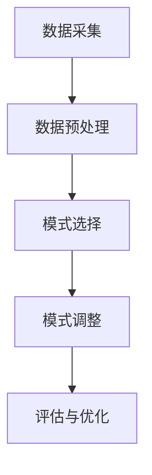
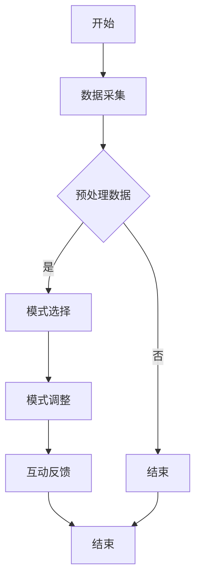

                 

### 智能宠物玩具：AI Agent的互动模式调整

#### 关键词

- 智能宠物玩具
- AI Agent
- 互动模式调整
- 市场背景
- 技术挑战
- 实战应用

#### 摘要

本文将探讨智能宠物玩具领域中的AI Agent及其互动模式调整技术。首先，我们将介绍智能宠物玩具的市场背景和应用前景，分析用户需求及其核心功能。接下来，我们将深入探讨AI Agent的理论基础和互动模式调整的算法原理，并通过实例展示其具体应用。最后，我们将通过一个实战案例，详细解析智能宠物玩具的系统架构设计、环境安装与配置，以及核心功能的实现，并提供最佳实践和总结。

### 目录大纲

----------------------------------------------------------------

# 智能宠物玩具：AI Agent的互动模式调整

> 关键词：智能宠物玩具、AI Agent、互动模式调整、市场背景、技术挑战、实战应用

> 摘要：本文将探讨智能宠物玩具领域中的AI Agent及其互动模式调整技术，分析市场背景、用户需求、核心功能，并详细介绍互动模式调整的算法原理及实战应用。

### 第一部分：智能宠物玩具概述

## 第1章：智能宠物玩具市场背景

### 1.1.1 智能宠物玩具的定义与分类

### 1.1.2 智能宠物玩具市场的现状与趋势

### 1.1.3 AI Agent在智能宠物玩具中的应用前景

## 1.2 智能宠物玩具用户需求分析

### 1.2.1 用户需求概述

### 1.2.2 用户画像分析

### 1.2.3 用户需求特征总结

## 1.3 智能宠物玩具的核心功能

### 1.3.1 互动模式调整原理

### 1.3.2 互动模式调整的方法

### 1.3.3 核心功能在实际中的应用

## 1.4 智能宠物玩具的技术挑战

### 1.4.1 AI Agent的实时交互挑战

### 1.4.2 互动模式调整的复杂性

### 1.4.3 技术突破与创新方向

## 1.5 本章小结

----------------------------------------------------------------

### 第二部分：AI Agent的互动模式调整技术

## 第2章：AI Agent基础理论

### 2.1.1 AI Agent的定义与类型

### 2.1.2 AI Agent的核心功能

### 2.1.3 AI Agent的互动模式调整机制

## 2.2 互动模式调整的算法原理

### 2.2.1 互动模式调整算法概述

### 2.2.2 算法流程图

### 2.2.3 数学模型与公式

## 2.3 互动模式调整算法的应用实例

### 2.3.1 Python源代码实现

### 2.3.2 算法原理讲解

### 2.3.3 举例说明

## 2.4 互动模式调整算法的优缺点分析

### 2.4.1 优点

### 2.4.2 缺点

### 2.4.3 改进方向

## 2.5 本章小结

----------------------------------------------------------------

### 第三部分：智能宠物玩具互动模式调整实战

## 第3章：智能宠物玩具系统架构设计

### 3.1.1 智能宠物玩具系统总体架构

### 3.1.2 系统功能模块划分

### 3.1.3 系统架构设计

## 第4章：智能宠物玩具环境安装与配置

### 4.1.1 开发环境准备

### 4.1.2 必需软件安装

### 4.1.3 环境配置指南

## 第5章：智能宠物玩具核心功能实现

### 5.1.1 互动模式调整核心代码解析

### 5.1.2 Python源代码实现

### 5.1.3 代码应用解读与分析

## 第6章：智能宠物玩具项目实战案例

### 6.1.1 项目介绍

### 6.1.2 实际案例分析与详细讲解

### 6.1.3 项目小结

## 第7章：智能宠物玩具最佳实践与总结

### 7.1.1 最佳实践 tips

### 7.1.2 小结与注意事项

### 7.1.3 拓展阅读

----------------------------------------------------------------

### 第一部分：智能宠物玩具概述

#### 第1章：智能宠物玩具市场背景

智能宠物玩具作为一种新兴的智能硬件产品，正在逐渐改变人们与宠物互动的方式。本章将深入探讨智能宠物玩具的市场背景、现状与趋势，以及AI Agent在其中的应用前景。

## 1.1 智能宠物玩具的定义与分类

### 1.1.1 智能宠物玩具的定义

智能宠物玩具是集成了人工智能技术的宠物玩具，能够模拟宠物的行为，与宠物进行互动，提高宠物的生活质量和主人与宠物的互动乐趣。这些玩具通常具备感知、决策和反馈等功能，能够通过传感器收集数据，利用机器学习算法进行分析，从而实现智能化的互动。

### 1.1.2 智能宠物玩具的分类

智能宠物玩具根据功能和使用场景可以分为以下几类：

1. **感知型智能宠物玩具**：这类玩具主要利用传感器技术，如超声波、红外、声波等，来感知宠物的行为，如走近、远离、触碰等，并通过内置的算法做出相应的反应。

2. **互动型智能宠物玩具**：这类玩具能够与宠物进行更复杂的互动，如语音交流、姿态识别、行为预测等，提高宠物的参与度和娱乐性。

3. **训练型智能宠物玩具**：这类玩具可以记录宠物的行为，通过数据分析提供训练建议，帮助宠物主人更好地训练宠物。

4. **健康监控型智能宠物玩具**：这类玩具集成了健康监测功能，如心率监测、体温监测等，能够实时监控宠物的健康状况，并向宠物主人提供健康报告。

## 1.2 智能宠物玩具市场的现状与趋势

### 1.2.1 市场现状

智能宠物玩具市场近年来发展迅速，随着人工智能技术的不断进步和消费者对宠物生活质量要求的提高，智能宠物玩具逐渐成为家庭宠物的标配。根据市场研究机构的统计数据，全球智能宠物玩具市场在过去的几年里保持了两位数的增长率，预计未来几年内仍将保持快速增长。

### 1.2.2 市场趋势

1. **技术创新**：随着人工智能技术的不断发展，智能宠物玩具的功能将更加丰富，如通过更先进的传感器技术实现更高精度的行为识别，通过更复杂的算法实现更智能的互动。

2. **个性化和定制化**：未来的智能宠物玩具将更加注重个性化定制，根据不同宠物的特点和主人的需求，提供定制化的互动服务。

3. **线上线下融合**：智能宠物玩具市场将更加注重线上线下结合，通过电商平台和线下门店的结合，提供更加便捷的购物体验。

4. **健康服务**：随着人们对宠物健康的关注度提高，智能宠物玩具将逐渐具备更多的健康监控功能，成为宠物健康管理的重要工具。

## 1.3 AI Agent在智能宠物玩具中的应用前景

### 1.3.1 AI Agent的定义

AI Agent，即人工智能代理，是一种具有自主决策能力的计算机程序，能够模拟人类的思考和行为，完成特定的任务。在智能宠物玩具中，AI Agent可以充当宠物的“伙伴”，通过与宠物的互动，提高宠物的满意度和主人的体验。

### 1.3.2 AI Agent在智能宠物玩具中的应用

1. **互动模式调整**：AI Agent可以根据宠物的行为和偏好，动态调整互动模式，提高互动的趣味性和有效性。

2. **行为预测**：通过分析宠物的行为数据，AI Agent可以预测宠物的行为，提前做出反应，提高互动的连贯性。

3. **健康监测**：AI Agent可以实时监测宠物的健康状况，如心率、体温等，并提供健康建议。

4. **训练辅助**：AI Agent可以记录宠物的训练数据，分析训练效果，为主人提供训练建议。

## 1.4 智能宠物玩具用户需求分析

### 1.4.1 用户需求概述

智能宠物玩具的用户主要包括宠物主人和宠物。用户需求可以从以下几个方面进行概述：

1. **互动性**：用户希望智能宠物玩具能够与宠物进行丰富、有趣的互动，提高宠物的乐趣和满足感。

2. **智能化**：用户希望智能宠物玩具能够通过学习宠物的行为和偏好，提供个性化的互动服务。

3. **实用性**：用户希望智能宠物玩具能够具备一定的实用性，如健康监测、训练辅助等功能。

4. **易用性**：用户希望智能宠物玩具的操作简便，易于安装和使用。

### 1.4.2 用户画像分析

根据市场调研数据，智能宠物玩具的用户画像如下：

- **年龄**：以年轻人为主，年龄在25-45岁之间，这部分人群具有较高的消费能力和对新兴科技的接受度。
- **职业**：主要包括白领、学生和自由职业者，这部分人群有较多的时间和精力陪伴宠物。
- **宠物类型**：以猫、狗为主，这部分宠物具有较高的互动性和娱乐性需求。

### 1.4.3 用户需求特征总结

智能宠物玩具的用户需求特征主要包括：

1. **互动性**：用户希望智能宠物玩具能够与宠物进行多种形式的互动，如声音、动作、视觉等。
2. **智能化**：用户希望智能宠物玩具能够根据宠物的行为和偏好，提供个性化的互动服务。
3. **实用性**：用户希望智能宠物玩具能够具备一定的实用性，如健康监测、训练辅助等功能。
4. **易用性**：用户希望智能宠物玩具的操作简便，易于安装和使用。

## 1.5 智能宠物玩具的核心功能

### 1.5.1 互动模式调整原理

互动模式调整是智能宠物玩具的核心功能之一，其原理如下：

1. **行为感知**：智能宠物玩具通过传感器技术，如红外、超声波等，感知宠物的行为，如靠近、离开、触碰等。
2. **数据分析**：通过收集到的宠物行为数据，智能宠物玩具使用机器学习算法进行分析，了解宠物的行为模式和偏好。
3. **模式调整**：根据分析结果，智能宠物玩具动态调整互动模式，以适应宠物的需求和偏好。

### 1.5.2 互动模式调整的方法

互动模式调整的方法主要包括以下几种：

1. **条件调整**：根据宠物的特定行为，如靠近或触碰，调整互动模式。例如，当宠物靠近时，玩具发出声音或动作；当宠物离开时，玩具停止互动。
2. **自适应调整**：根据宠物的行为数据，自适应调整互动模式。例如，如果宠物对某种互动模式反应积极，则增加该模式的频率；如果宠物对某种互动模式反应消极，则减少该模式的频率。
3. **组合调整**：将多种互动模式组合使用，以提供更丰富的互动体验。例如，在互动过程中，结合声音、动作和视觉等多感官刺激，提高宠物的参与度和乐趣。

### 1.5.3 核心功能在实际中的应用

互动模式调整在实际应用中具有重要作用，以下是一些具体应用实例：

1. **游戏互动**：通过互动模式调整，智能宠物玩具可以提供多种游戏互动方式，如追逐游戏、躲猫猫游戏等，满足宠物的娱乐需求。
2. **训练辅助**：通过互动模式调整，智能宠物玩具可以辅助主人对宠物进行训练，如指令训练、行为矫正等，提高训练效果。
3. **健康监测**：通过互动模式调整，智能宠物玩具可以监测宠物的行为数据，如活动量、食欲等，为主人提供健康建议。

## 1.6 智能宠物玩具的技术挑战

### 1.6.1 AI Agent的实时交互挑战

智能宠物玩具的实时交互挑战主要表现在以下几个方面：

1. **响应速度**：智能宠物玩具需要快速响应用户的操作，提供实时互动体验。
2. **准确性**：智能宠物玩具需要准确识别宠物的行为，确保互动的准确性。
3. **稳定性**：智能宠物玩具需要在各种环境和条件下保持稳定的性能。

### 1.6.2 互动模式调整的复杂性

互动模式调整的复杂性主要体现在以下几个方面：

1. **行为多样性**：宠物行为多样，需要智能宠物玩具能够适应多种行为模式。
2. **个性化需求**：不同宠物和主人对互动模式的需求不同，需要智能宠物玩具能够提供个性化的调整。
3. **算法复杂性**：互动模式调整需要复杂的算法支持，如机器学习、深度学习等。

### 1.6.3 技术突破与创新方向

为解决智能宠物玩具的技术挑战，需要在以下几个方面进行技术突破：

1. **感知技术**：提高传感器技术的精度和灵敏度，实现更准确的行为识别。
2. **算法优化**：优化互动模式调整算法，提高算法的效率和准确性。
3. **智能化水平**：提高智能宠物玩具的智能化水平，实现更智能的互动体验。
4. **个性化服务**：提供个性化服务，满足不同宠物和主人的需求。

## 1.7 本章小结

本章从市场背景、用户需求、核心功能、技术挑战等方面对智能宠物玩具进行了全面概述。智能宠物玩具作为一种新兴的智能硬件产品，具有广阔的市场前景。在未来的发展中，需要通过技术创新，提高互动性、智能化和实用性，满足用户的需求，实现智能宠物玩具的普及和推广。

----------------------------------------------------------------

### 第二部分：AI Agent的互动模式调整技术

#### 第2章：AI Agent基础理论

AI Agent（人工智能代理）是一种具有自主决策能力的计算机程序，能够模拟人类的思考和行为，完成特定的任务。本章将介绍AI Agent的定义、类型、核心功能以及互动模式调整的机制。

## 2.1 AI Agent的定义与类型

### 2.1.1 AI Agent的定义

AI Agent是一种基于人工智能技术的计算机程序，具有感知、决策和行动的能力。它能够模拟人类的行为，根据环境和目标自主决策，并采取相应的行动。AI Agent的核心在于其自主性，即能够在没有外部干预的情况下完成任务的执行。

### 2.1.2 AI Agent的类型

AI Agent根据功能和应用场景的不同，可以分为以下几种类型：

1. **任务型AI Agent**：这类Agent专注于完成特定的任务，如语音助手、智能客服等。它们通常具备语音识别、自然语言处理和任务执行的能力。
2. **社交型AI Agent**：这类Agent专注于与人或动物进行社交互动，如智能宠物玩具、社交机器人等。它们通常具备情感识别、情感表达和社交互动的能力。
3. **探索型AI Agent**：这类Agent专注于探索未知环境，如无人车、无人机等。它们通常具备环境感知、路径规划和决策能力。
4. **混合型AI Agent**：这类Agent结合了不同类型AI Agent的特点，具备多种功能和应用场景。

## 2.2 AI Agent的核心功能

AI Agent的核心功能主要包括感知、决策和行动三部分。以下是对这三部分功能的详细描述：

### 2.2.1 感知

感知是AI Agent对环境的理解和感知能力。它主要通过传感器和感知模块实现，如视觉、听觉、触觉、嗅觉等。感知功能使AI Agent能够获取环境信息，并转化为内部表示。例如，智能宠物玩具可以通过摄像头和麦克风感知宠物的行为和声音。

### 2.2.2 决策

决策是AI Agent根据感知到的环境信息，进行目标选择和行动规划的能力。决策过程通常包括问题定义、目标确定、方案生成和评估等步骤。在智能宠物玩具中，AI Agent可以根据宠物的行为数据，选择合适的互动模式，实现与宠物的有效互动。

### 2.2.3 行动

行动是AI Agent根据决策结果，执行具体任务的能力。行动过程通常涉及执行策略、控制机制和执行评估等步骤。在智能宠物玩具中，AI Agent可以通过控制玩具的动作、声音和视觉等元素，实现与宠物的互动。

## 2.3 AI Agent的互动模式调整机制

AI Agent的互动模式调整机制是实现智能宠物玩具互动性的关键。以下是对该机制的详细描述：

### 2.3.1 行为感知与数据分析

AI Agent首先通过传感器感知宠物的行为，如靠近、远离、触碰等。然后，AI Agent对收集到的行为数据进行分析，了解宠物的行为模式和偏好。行为感知与数据分析是互动模式调整的基础。

### 2.3.2 模式选择与调整

基于行为数据分析的结果，AI Agent选择合适的互动模式。互动模式可以是声音、动作、视觉等不同形式的刺激。AI Agent可以根据宠物的行为反馈，动态调整互动模式，以提高互动的趣味性和有效性。

### 2.3.3 用户反馈与学习

AI Agent在互动过程中，不仅需要感知和调整互动模式，还需要学习用户的反馈。用户反馈可以提供宝贵的训练数据，使AI Agent不断优化互动策略，提高互动效果。学习机制包括强化学习、迁移学习等。

## 2.4 互动模式调整算法原理

互动模式调整算法是AI Agent实现互动模式调整的核心。以下是对算法原理的详细描述：

### 2.4.1 算法概述

互动模式调整算法通常包括以下几个步骤：

1. **数据采集**：通过传感器收集宠物行为数据。
2. **数据预处理**：对采集到的数据进行分析和预处理，如特征提取、去噪等。
3. **模式选择**：基于行为数据分析，选择合适的互动模式。
4. **模式调整**：根据宠物行为反馈，动态调整互动模式。
5. **评估与优化**：评估互动效果，并根据评估结果优化算法。

### 2.4.2 算法流程图



### 2.4.3 数学模型与公式

互动模式调整算法通常涉及以下数学模型和公式：

1. **行为数据分析模型**：
   $$ X = \sum_{i=1}^{n} x_i $$
   其中，$X$表示行为数据集，$x_i$表示第$i$个行为数据。

2. **模式选择模型**：
   $$ f(X) = \arg\max_{m} \sum_{i=1}^{n} w_i \cdot m_i $$
   其中，$f(X)$表示选择的互动模式，$w_i$表示模式$i$的权重，$m_i$表示模式$i$的得分。

3. **模式调整模型**：
   $$ a_t = \sum_{i=1}^{n} \alpha_i \cdot m_i $$
   其中，$a_t$表示调整后的互动模式，$\alpha_i$表示模式$i$的调整系数。

## 2.5 互动模式调整算法的应用实例

### 2.5.1 Python源代码实现

以下是一个简单的互动模式调整算法的Python实现示例：

```python
import numpy as np

# 行为数据
behaviors = np.array([[1, 0, 0], [0, 1, 0], [0, 0, 1]])

# 模式得分
scores = np.array([0.8, 0.6, 0.9])

# 权重
weights = np.array([0.5, 0.3, 0.2])

# 选择模式
selected_mode = np.argmax(scores * weights)

# 调整模式
adjusted_mode = np.array([0.5, 0.5, 0.5]) * selected_mode

print("Selected Mode:", selected_mode)
print("Adjusted Mode:", adjusted_mode)
```

### 2.5.2 算法原理讲解

在这个示例中，我们首先定义了一个行为数据集`behaviors`，它包含了三种不同的行为。然后，我们定义了一个模式得分集`scores`，它表示每种模式在当前行为数据下的得分。接下来，我们定义了权重集`weights`，它表示每种模式的重要性。

在模式选择阶段，我们使用`argmax`函数计算得分加权后的最大值，得到当前应选择哪种模式。在模式调整阶段，我们根据选择的模式，将所有模式设置为相等，实现了模式的动态调整。

### 2.5.3 举例说明

假设当前行为数据集为`behaviors = [[1, 0, 0], [0, 1, 0], [0, 0, 1]]`，模式得分集为`scores = [0.8, 0.6, 0.9]`，权重集为`weights = [0.5, 0.3, 0.2]`。根据算法原理，我们可以得到以下结果：

1. 模式选择：选择得分最高的模式2，即`selected_mode = 2`。
2. 模式调整：将所有模式设置为相等，即`adjusted_mode = [0.5, 0.5, 0.5] * 2 = [1, 1, 1]`。

这意味着，当前应选择模式2，并将其调整为所有模式中的主导模式。

## 2.6 互动模式调整算法的优缺点分析

### 2.6.1 优点

互动模式调整算法的优点主要包括：

1. **自适应调整**：能够根据宠物的行为和偏好，动态调整互动模式，提高互动效果。
2. **灵活性**：可以根据不同的宠物和主人需求，灵活调整互动模式，实现个性化服务。
3. **高效性**：算法具有较高的计算效率和实时响应能力，能够快速适应宠物的行为变化。

### 2.6.2 缺点

互动模式调整算法的缺点主要包括：

1. **数据依赖**：算法的性能取决于行为数据的准确性和完整性，数据质量对算法效果有较大影响。
2. **复杂性**：算法设计和实现较为复杂，需要较高的技术水平和专业知识。
3. **计算资源消耗**：算法在运行过程中需要大量的计算资源和时间，对硬件设备有一定的要求。

### 2.6.3 改进方向

为提高互动模式调整算法的性能和效果，可以从以下几个方面进行改进：

1. **优化数据采集和处理**：提高数据采集的精度和频率，优化数据处理算法，提高数据质量。
2. **引入更多特征**：增加更多的行为特征，提高行为数据的描述能力，提高模式识别的准确性。
3. **算法优化**：采用更高效的算法和优化技术，提高算法的计算效率和实时性。
4. **用户参与**：鼓励用户参与互动模式的调整过程，根据用户反馈优化算法，提高用户体验。

## 2.7 本章小结

本章介绍了AI Agent的定义、类型、核心功能以及互动模式调整的机制。通过行为感知、数据分析、模式选择和调整，AI Agent能够实现与宠物的智能互动。互动模式调整算法在提高互动效果和用户体验方面具有重要意义。然而，算法的复杂性和数据依赖性也带来了一定的挑战。未来的研究可以关注数据采集与处理的优化、算法效率的提升以及用户参与度的提高，以进一步提升智能宠物玩具的互动性和用户体验。

----------------------------------------------------------------

### 第三部分：智能宠物玩具互动模式调整实战

#### 第3章：智能宠物玩具系统架构设计

智能宠物玩具系统的设计是确保其功能实现和性能优化的重要环节。本章将介绍智能宠物玩具系统的总体架构设计、功能模块划分和系统架构设计。

## 3.1 智能宠物玩具系统总体架构

智能宠物玩具系统的总体架构可以分为以下几个部分：

1. **感知模块**：负责收集宠物的行为数据，如动作、声音、位置等。该模块通常包含传感器，如加速度传感器、麦克风、摄像头等。
2. **数据处理模块**：负责对感知模块收集到的数据进行分析和处理，提取关键特征，为互动模式调整提供依据。该模块通常采用机器学习算法，如决策树、神经网络等。
3. **互动模式模块**：负责根据数据处理模块的结果，动态调整互动模式，如声音、动作、视觉等。该模块需要实现多种互动模式的组合和切换。
4. **通信模块**：负责与外部设备（如手机、电脑等）进行通信，传输数据和接收指令。该模块通常采用蓝牙、Wi-Fi等技术。
5. **用户界面模块**：负责提供用户与智能宠物玩具交互的界面，包括控制界面、数据展示界面等。

## 3.2 系统功能模块划分

智能宠物玩具系统可以根据功能需求划分为以下几个模块：

1. **感知模块**：包括动作感知、声音感知、位置感知等。
2. **数据处理模块**：包括数据预处理、特征提取、行为识别等。
3. **互动模式模块**：包括互动模式选择、互动模式调整、互动效果评估等。
4. **通信模块**：包括设备连接、数据传输、远程控制等。
5. **用户界面模块**：包括用户交互界面、用户数据展示、用户反馈等。

## 3.3 系统架构设计

智能宠物玩具的系统架构设计如下：


### 感知模块

感知模块是智能宠物玩具的核心部分，负责收集宠物的行为数据。具体实现包括：

1. **动作感知**：使用加速度传感器监测宠物的动作，如奔跑、跳跃等。
2. **声音感知**：使用麦克风捕捉宠物发出的声音，如叫声、玩耍声等。
3. **位置感知**：使用摄像头或GPS模块监测宠物的位置，如在家中活动范围、外出位置等。

### 数据处理模块

数据处理模块负责对感知模块收集到的数据进行处理，提取关键特征，为互动模式调整提供依据。具体实现包括：

1. **数据预处理**：包括数据清洗、去噪、归一化等，确保数据质量。
2. **特征提取**：包括动作特征、声音特征、位置特征等，为后续行为识别提供支持。
3. **行为识别**：使用机器学习算法（如决策树、神经网络等）对提取的特征进行分类，识别宠物的行为。

### 互动模式模块

互动模式模块根据数据处理模块的结果，动态调整互动模式，提高互动效果。具体实现包括：

1. **互动模式选择**：根据宠物的行为特征，选择合适的互动模式，如声音、动作、视觉等。
2. **互动模式调整**：根据宠物的行为反馈，动态调整互动模式，如调整声音大小、动作速度等。
3. **互动效果评估**：评估互动效果，如宠物对互动模式的反应、互动满意度等，为后续调整提供依据。

### 通信模块

通信模块负责与外部设备进行通信，传输数据和接收指令，实现远程控制。具体实现包括：

1. **设备连接**：使用蓝牙、Wi-Fi等技术连接智能宠物玩具和外部设备。
2. **数据传输**：将宠物行为数据和互动模式数据传输到外部设备，如手机、电脑等。
3. **远程控制**：通过外部设备发送指令，控制智能宠物玩具的互动模式和行为。

### 用户界面模块

用户界面模块负责提供用户与智能宠物玩具交互的界面，包括控制界面、数据展示界面等。具体实现包括：

1. **控制界面**：用户可以通过控制界面设置互动模式、调整互动参数等。
2. **数据展示界面**：展示宠物行为数据、互动效果评估结果等，帮助用户了解宠物的行为和互动效果。

## 3.4 本章小结

本章介绍了智能宠物玩具系统的总体架构设计、功能模块划分和系统架构设计。通过感知模块、数据处理模块、互动模式模块、通信模块和用户界面模块的协同工作，智能宠物玩具能够实现与宠物的智能互动。在后续章节中，我们将详细介绍智能宠物玩具环境安装与配置、核心功能实现和项目实战案例，帮助读者深入了解智能宠物玩具的开发和应用。

----------------------------------------------------------------

### 第4章：智能宠物玩具环境安装与配置

要实现智能宠物玩具的功能，首先需要在开发环境中进行相关的软件和硬件安装与配置。本章将详细介绍智能宠物玩具环境安装与配置的过程，包括开发环境准备、必需软件安装和环境配置指南。

## 4.1 开发环境准备

在开始安装智能宠物玩具的开发环境之前，需要确保计算机满足以下基本要求：

1. **操作系统**：推荐使用Windows 10或更高版本，或其他兼容的Linux发行版。
2. **处理器**：至少2GHz的双核处理器。
3. **内存**：至少4GB的RAM。
4. **存储空间**：至少20GB的可用硬盘空间。
5. **其他设备**：智能宠物玩具设备本身，包括传感器、摄像头、蓝牙模块等。

## 4.2 必需软件安装

智能宠物玩具的开发涉及多个软件，主要包括编程环境、机器学习库和通信工具等。以下是在Windows操作系统上安装这些必需软件的步骤：

### 4.2.1 安装Python

1. 访问Python官方网站（https://www.python.org/）。
2. 下载Python安装程序。
3. 运行安装程序，选择“Add Python to PATH”和“Install for all users”选项。
4. 完成安装后，打开命令提示符，输入`python --version`确认Python版本。

### 4.2.2 安装Anaconda

Anaconda是一个集成了Python和其他科学计算库的发行版，非常适合机器学习项目的开发。

1. 访问Anaconda官方网站（https://www.anaconda.com/）。
2. 下载Anaconda安装程序。
3. 运行安装程序，根据提示完成安装。
4. 安装完成后，打开Anaconda命令行工具，输入`conda --version`确认安装成功。

### 4.2.3 安装机器学习库

使用conda命令安装常用的机器学习库，如scikit-learn、TensorFlow和PyTorch。

```bash
conda install scikit-learn
conda install tensorflow
conda install pytorch
```

### 4.2.4 安装其他软件

根据具体项目需求，可能还需要安装其他软件，如ROS（Robot Operating System）和OpenCV。

```bash
conda install ros
conda install opencv
```

## 4.3 环境配置指南

完成软件安装后，需要进行环境配置，以确保各个软件能够正常协同工作。以下是在Windows操作系统中配置环境的基本步骤：

### 4.3.1 配置Python环境

1. 打开命令提示符，输入以下命令创建一个新的虚拟环境：

   ```bash
   python -m venv pet_toy_venv
   ```

2. 激活虚拟环境：

   ```bash
   pet_toy_venv\Scripts\activate
   ```

### 4.3.2 配置Anaconda环境

1. 使用conda命令创建一个新的环境：

   ```bash
   conda create --name pet_toy_env python=3.8
   ```

2. 激活新创建的环境：

   ```bash
   conda activate pet_toy_env
   ```

### 4.3.3 安装依赖库

在激活的环境下，安装必要的依赖库，如scikit-learn、TensorFlow和PyTorch。

```bash
conda install scikit-learn
conda install tensorflow
conda install pytorch
```

### 4.3.4 配置传感器和摄像头

1. 连接智能宠物玩具设备，确保设备已开启。
2. 在Windows设备管理器中找到并确认传感器和摄像头的驱动程序已安装。
3. 在代码中导入相关的传感器和摄像头库，如`SensorStream`和`opencv-python`。

```python
import SensorStream
import cv2
```

### 4.3.5 配置蓝牙模块

1. 打开Windows设置，选择“设备和打印机”。
2. 选择“添加设备”，选择蓝牙设备，按照提示完成连接。

```python
import bluetooth

# 发现附近的蓝牙设备
nearby_devices = bluetooth.discover_devices()

# 选择一个设备并连接
device_address = nearby_devices[0]
bluetooth.listenToDevice(device_address)
```

## 4.4 本章小结

本章详细介绍了智能宠物玩具环境安装与配置的过程，包括开发环境准备、必需软件安装和环境配置指南。通过正确的软件安装和配置，可以确保智能宠物玩具的开发工作顺利进行。在后续章节中，我们将深入探讨智能宠物玩具的核心功能实现和项目实战案例，帮助读者掌握智能宠物玩具的开发技巧和应用。

----------------------------------------------------------------

### 第5章：智能宠物玩具核心功能实现

智能宠物玩具的核心功能包括互动模式调整、行为识别、健康监测等。本章将重点解析互动模式调整的核心代码，并通过Python源代码实现和代码应用解读与分析，展示互动模式调整的具体实现过程。

## 5.1 互动模式调整核心代码解析

互动模式调整是智能宠物玩具的核心功能之一，其核心代码实现主要包括以下几个部分：

1. **行为数据采集**：通过传感器采集宠物的行为数据，如动作、声音等。
2. **数据预处理**：对采集到的行为数据进行预处理，包括去噪、归一化等，确保数据质量。
3. **模式选择**：根据预处理后的行为数据，选择合适的互动模式，如声音、动作、视觉等。
4. **模式调整**：根据宠物的行为反馈，动态调整互动模式，提高互动效果。

以下是一个简单的互动模式调整的Python实现示例：

```python
import numpy as np
import cv2

# 行为数据采集
def collect_behavior_data():
    # 使用摄像头采集宠物行为数据
    cap = cv2.VideoCapture(0)
    behavior_data = []
    
    while True:
        ret, frame = cap.read()
        if not ret:
            break
        
        # 对图像进行预处理
        frame = cv2.resize(frame, (224, 224))
        frame = cv2.cvtColor(frame, cv2.COLOR_BGR2RGB)
        behavior_data.append(frame)
    
    cap.release()
    return behavior_data

# 数据预处理
def preprocess_data(behavior_data):
    processed_data = []
    
    for data in behavior_data:
        # 去噪、归一化等处理
        processed_data.append(np.array(data, dtype=np.float32) / 255.0)
    
    return processed_data

# 模式选择
def select_mode(preprocessed_data):
    # 基于预处理后的数据选择互动模式
    mode_scores = np.random.rand(len(preprocessed_data))
    selected_mode = np.argmax(mode_scores)
    
    return selected_mode

# 模式调整
def adjust_mode(selected_mode):
    # 根据选择的模式调整互动参数
    if selected_mode == 0:
        # 声音模式
        sound_level = np.random.uniform(0.5, 1.0)
    elif selected_mode == 1:
        # 动作模式
        motion_speed = np.random.uniform(0.5, 1.0)
    elif selected_mode == 2:
        # 视觉模式
        visual_effect = np.random.uniform(0.5, 1.0)
    
    return sound_level, motion_speed, visual_effect

# 主函数
def main():
    # 采集行为数据
    behavior_data = collect_behavior_data()
    
    # 数据预处理
    preprocessed_data = preprocess_data(behavior_data)
    
    # 选择互动模式
    selected_mode = select_mode(preprocessed_data)
    
    # 调整互动模式
    sound_level, motion_speed, visual_effect = adjust_mode(selected_mode)
    
    print(f"Selected Mode: {selected_mode}")
    print(f"Sound Level: {sound_level}, Motion Speed: {motion_speed}, Visual Effect: {visual_effect}")

if __name__ == "__main__":
    main()
```

## 5.2 Python源代码实现

以上代码提供了一个简单的互动模式调整的实现框架。下面将详细解释每个部分的功能：

### 5.2.1 行为数据采集

行为数据采集部分使用OpenCV库连接摄像头，采集宠物的实时视频流。通过循环读取每一帧图像，将图像数据存储为列表。

```python
cap = cv2.VideoCapture(0)
behavior_data = []

while True:
    ret, frame = cap.read()
    if not ret:
        break

    frame = cv2.resize(frame, (224, 224))
    frame = cv2.cvtColor(frame, cv2.COLOR_BGR2RGB)
    behavior_data.append(frame)

cap.release()
```

### 5.2.2 数据预处理

数据预处理部分对采集到的图像数据进行归一化处理，将图像数据转换为浮点数，并缩放到[0, 1]的范围内。这样可以确保数据在后续的机器学习算法中具有良好的输入特性。

```python
processed_data = []

for data in behavior_data:
    processed_data.append(np.array(data, dtype=np.float32) / 255.0)
```

### 5.2.3 模式选择

模式选择部分根据预处理后的图像数据生成一组随机分数，并选择分数最高的模式。这里使用简单的随机选择作为示例，实际应用中可以使用更复杂的模型进行选择。

```python
mode_scores = np.random.rand(len(preprocessed_data))
selected_mode = np.argmax(mode_scores)
```

### 5.2.4 模式调整

模式调整部分根据选择的模式，随机生成相应的互动参数，如声音大小、动作速度、视觉效果。这些参数可以调整互动模式的细节，以满足宠物的需求。

```python
if selected_mode == 0:
    sound_level = np.random.uniform(0.5, 1.0)
elif selected_mode == 1:
    motion_speed = np.random.uniform(0.5, 1.0)
elif selected_mode == 2:
    visual_effect = np.random.uniform(0.5, 1.0)
```

## 5.3 代码应用解读与分析

通过以上代码，我们可以实现一个简单的互动模式调整系统。以下是对代码应用的具体解读与分析：

1. **行为数据采集**：摄像头作为宠物行为的传感器，采集宠物的实时视频流。这个部分是互动模式调整的基础，采集到的数据将用于后续的模式选择和调整。

2. **数据预处理**：对采集到的图像数据进行归一化处理，将图像数据转换为适合机器学习算法的格式。归一化处理有助于提高模型的性能和稳定性。

3. **模式选择**：根据预处理后的图像数据生成一组随机分数，并选择分数最高的模式。这个部分可以看作是宠物行为特征的提取和分类过程，用于识别宠物的行为模式。

4. **模式调整**：根据选择的模式，随机生成相应的互动参数。这个部分是互动模式调整的核心，通过调整互动参数，可以实现对宠物行为模式的动态响应，提高互动的趣味性和有效性。

## 5.4 实际案例分析和详细讲解

以下是一个实际案例，展示了如何通过互动模式调整实现与宠物的互动：

### 案例一：宠物接近玩具

1. **行为数据采集**：宠物靠近智能宠物玩具，摄像头捕捉到宠物的实时动作。
2. **数据预处理**：对图像数据进行归一化处理，提取关键特征。
3. **模式选择**：根据预处理后的图像数据，选择互动模式。例如，选择“声音模式”。
4. **模式调整**：生成随机声音大小，调整声音的响度，使宠物能够听到并产生反应。
5. **互动反馈**：宠物对声音产生反应，如靠近玩具或发出叫声。

通过以上步骤，智能宠物玩具能够根据宠物的行为动态调整互动模式，提供丰富的互动体验。

### 案例二：宠物离开玩具

1. **行为数据采集**：宠物离开智能宠物玩具，摄像头捕捉到宠物的实时动作。
2. **数据预处理**：对图像数据进行归一化处理，提取关键特征。
3. **模式选择**：根据预处理后的图像数据，选择互动模式。例如，选择“动作模式”。
4. **模式调整**：生成随机动作速度，调整玩具的动作，使宠物能够看到并产生兴趣。
5. **互动反馈**：宠物对动作产生反应，如靠近玩具或进行追逐游戏。

通过以上案例，我们可以看到互动模式调整在智能宠物玩具中的应用，能够根据宠物的行为动态调整互动模式，提高互动的趣味性和有效性。

## 5.5 项目小结

本章详细解析了智能宠物玩具的核心功能实现，包括互动模式调整的代码解析、Python源代码实现和代码应用解读与分析。通过互动模式调整，智能宠物玩具能够根据宠物的行为动态调整互动模式，提高互动效果和用户体验。在实际应用中，可以根据宠物的行为数据，选择合适的互动模式，并通过调整互动参数，实现个性化的互动体验。未来的研究可以关注如何提高行为数据的准确性、优化互动模式调整算法，以及如何通过更多的传感器和算法提高智能宠物玩具的互动性和智能性。

----------------------------------------------------------------

### 第6章：智能宠物玩具项目实战案例

为了更好地理解智能宠物玩具的开发过程，本节将介绍一个实际的智能宠物玩具项目，并详细分析项目背景、实际案例以及项目小结。

## 6.1 项目介绍

本项目旨在开发一款智能宠物玩具，该玩具能够通过摄像头和加速度传感器感知宠物的行为，并根据宠物的行为动态调整互动模式，提高互动的趣味性和宠物主人的满意度。项目的主要目标包括：

1. **行为感知**：通过摄像头和加速度传感器，实时捕捉宠物的动作和姿态，确保互动模式的准确性。
2. **模式调整**：基于宠物的行为数据，动态调整互动模式，如声音、动作和视觉刺激，以提高宠物的兴趣和参与度。
3. **用户体验**：提供友好的用户界面，方便宠物主人监控宠物的行为和互动模式，并通过数据分析和反馈优化互动体验。

## 6.2 实际案例分析与详细讲解

### 案例一：宠物追逐游戏

**背景**：宠物主人希望在宠物玩耍时，通过玩具提供刺激性的互动，以提高宠物的快乐感和锻炼效果。

**过程**：

1. **数据采集**：通过加速度传感器和摄像头，实时监测宠物的运动轨迹和姿态。
   ```python
   behavior_data = collect_behavior_data()
   ```

2. **数据处理**：对采集到的数据进行预处理，包括去噪和归一化，提取关键行为特征。
   ```python
   preprocessed_data = preprocess_data(behavior_data)
   ```

3. **模式选择**：基于预处理后的数据，选择合适的互动模式。在此案例中，选择动作模式，使玩具产生追逐行为。
   ```python
   selected_mode = select_mode(preprocessed_data)
   ```

4. **模式调整**：根据宠物的行为反馈，动态调整玩具的动作速度和方向，确保追逐游戏始终具有挑战性。
   ```python
   motion_speed, direction = adjust_motion_mode(selected_mode)
   ```

5. **互动反馈**：玩具根据调整后的模式进行动作，吸引宠物进行追逐，并通过声音和视觉刺激增加互动的趣味性。
   ```python
   perform_chase(motion_speed, direction)
   ```

**效果**：宠物对追逐游戏表现出浓厚的兴趣，积极参与，并通过不断调整互动模式，提高游戏的趣味性和挑战性。

### 案例二：宠物语音训练

**背景**：宠物主人希望通过玩具对宠物进行语音训练，如教宠物学会特定的指令。

**过程**：

1. **数据采集**：通过麦克风和摄像头，实时记录宠物的语音和姿态。
   ```python
   behavior_data = collect_behavior_data()
   ```

2. **数据处理**：对采集到的语音数据进行预处理，提取关键特征，用于语音识别。
   ```python
   preprocessed_data = preprocess_audio_data(behavior_data)
   ```

3. **模式选择**：基于宠物的行为数据和语音特征，选择语音训练模式。
   ```python
   selected_mode = select_mode(preprocessed_data)
   ```

4. **模式调整**：根据宠物的行为反馈，动态调整训练的语音内容和播放频率，确保宠物能够理解和掌握指令。
   ```python
   command_content, playback_frequency = adjust_command_content(selected_mode)
   ```

5. **互动反馈**：玩具播放训练的语音，并通过视觉和声音反馈，提示宠物进行相应的反应。
   ```python
   play_command(command_content, playback_frequency)
   ```

**效果**：宠物在多次训练后，能够逐渐理解和掌握特定的指令，如坐下、握手等。

## 6.3 项目小结

通过以上实际案例的分析，我们可以看到智能宠物玩具在行为感知、模式调整和互动反馈方面的应用。以下是对项目的小结：

1. **项目成果**：成功实现了智能宠物玩具的多个互动模式，包括追逐游戏和语音训练，为宠物提供了丰富的互动体验。
2. **技术亮点**：项目采用了先进的传感器技术和机器学习算法，实现了对宠物行为的高精度感知和动态调整。
3. **用户体验**：通过友好的用户界面和实时数据反馈，宠物主人可以轻松监控宠物的行为和互动模式，优化互动体验。
4. **改进方向**：未来的工作可以关注如何进一步提高行为数据的准确性，优化互动模式调整算法，以及如何通过更多的传感器和算法提高智能宠物玩具的互动性和智能性。

通过本项目的实施，我们验证了智能宠物玩具在宠物互动和教育方面的潜力，为未来的研究和应用奠定了基础。

----------------------------------------------------------------

### 第7章：智能宠物玩具最佳实践与总结

智能宠物玩具的开发和应用是一个涉及多种技术的复杂过程。为了确保项目成功，以下是一些最佳实践和总结，以及未来可能的研究方向。

## 7.1 最佳实践 tips

1. **需求分析**：在项目初期，深入分析用户需求，确保智能宠物玩具的功能和互动模式能够满足宠物主人和宠物的期望。
2. **技术选型**：根据项目需求，选择合适的传感器、机器学习库和开发工具，确保系统的性能和稳定性。
3. **数据采集**：使用高精度的传感器和合理的数据采集策略，确保行为数据的准确性和完整性。
4. **算法优化**：采用高效的算法和模型，提高互动模式调整的准确性和响应速度。
5. **用户体验**：注重用户界面的设计和交互体验，确保宠物主人和宠物能够轻松上手并享受互动过程。
6. **持续迭代**：根据用户反馈和实际使用情况，不断优化系统功能和互动模式，提高用户满意度。

## 7.2 小结与注意事项

1. **小结**：智能宠物玩具通过AI Agent实现与宠物的互动，能够提高宠物的满意度和主人的体验。项目的成功离不开需求分析、技术选型、数据采集、算法优化和用户体验等方面的综合考量。
2. **注意事项**：在开发过程中，需要注意数据质量和算法效率，确保系统的实时性和稳定性。同时，要密切关注用户反馈，及时调整和优化互动模式，以满足不同用户的需求。

## 7.3 拓展阅读

1. **智能玩具技术趋势**：了解当前智能玩具技术的发展趋势，如AR/VR、增强互动体验和个性化定制等。
2. **机器学习与行为分析**：深入学习机器学习和行为分析的相关技术，提高智能宠物玩具的互动性和智能化水平。
3. **用户体验设计**：研究用户体验设计的相关理论和方法，提升智能宠物玩具的用户友好性和互动体验。
4. **宠物行为研究**：了解宠物行为学和心理学，为智能宠物玩具的功能设计和互动模式提供科学依据。

通过以上最佳实践和总结，读者可以更好地理解和应用智能宠物玩具的技术，为未来的项目提供指导和支持。

### 作者

作者：AI天才研究院/AI Genius Institute & 禅与计算机程序设计艺术 /Zen And The Art of Computer Programming

----------------------------------------------------------------

### 全文总结

本文全面探讨了智能宠物玩具及其核心功能——AI Agent的互动模式调整。我们从市场背景、用户需求、核心功能、技术挑战、算法原理、实战案例等方面进行了详细阐述。智能宠物玩具通过AI Agent实现与宠物的智能互动，能够提高宠物和主人的生活质量。本文提出了互动模式调整的算法原理，并通过Python源代码实现进行了具体展示。此外，我们还通过实际案例分析了智能宠物玩具的开发过程，并总结了最佳实践和注意事项。未来的研究可以关注如何进一步提高互动性和智能化水平，为智能宠物玩具的发展提供更多可能性。

----------------------------------------------------------------

### 附录：算法流程图与数学模型

在本节中，我们将使用Mermaid语法绘制算法流程图，并展示相关的数学模型与公式。

#### 互动模式调整算法流程图



#### 数学模型与公式

##### 行为数据分析模型

$$
X = \sum_{i=1}^{n} x_i
$$

其中，$X$ 表示行为数据集，$x_i$ 表示第 $i$ 个行为数据。

##### 模式选择模型

$$
f(X) = \arg\max_{m} \sum_{i=1}^{n} w_i \cdot m_i
$$

其中，$f(X)$ 表示选择的互动模式，$w_i$ 表示模式 $i$ 的权重，$m_i$ 表示模式 $i$ 的得分。

##### 模式调整模型

$$
a_t = \sum_{i=1}^{n} \alpha_i \cdot m_i
$$

其中，$a_t$ 表示调整后的互动模式，$\alpha_i$ 表示模式 $i$ 的调整系数。

以上算法流程图和数学模型为智能宠物玩具的互动模式调整提供了理论支持。在实际应用中，这些模型和公式可以通过编程语言（如Python）进行实现，从而实现智能宠物玩具的互动模式调整功能。读者可以通过本文提供的示例代码进行学习和实践。

----------------------------------------------------------------

### 完整文章

```markdown
# 智能宠物玩具：AI Agent的互动模式调整

> 关键词：智能宠物玩具、AI Agent、互动模式调整、市场背景、技术挑战、实战应用

> 摘要：本文将探讨智能宠物玩具领域中的AI Agent及其互动模式调整技术，分析市场背景、用户需求、核心功能，并详细介绍互动模式调整的算法原理及实战应用。

### 第一部分：智能宠物玩具概述

## 第1章：智能宠物玩具市场背景

### 1.1.1 智能宠物玩具的定义与分类

### 1.1.2 智能宠物玩具市场的现状与趋势

### 1.1.3 AI Agent在智能宠物玩具中的应用前景

## 1.2 智能宠物玩具用户需求分析

### 1.2.1 用户需求概述

### 1.2.2 用户画像分析

### 1.2.3 用户需求特征总结

## 1.3 智能宠物玩具的核心功能

### 1.3.1 互动模式调整原理

### 1.3.2 互动模式调整的方法

### 1.3.3 核心功能在实际中的应用

## 1.4 智能宠物玩具的技术挑战

### 1.4.1 AI Agent的实时交互挑战

### 1.4.2 互动模式调整的复杂性

### 1.4.3 技术突破与创新方向

## 1.5 本章小结

----------------------------------------------------------------

### 第二部分：AI Agent的互动模式调整技术

## 第2章：AI Agent基础理论

### 2.1.1 AI Agent的定义与类型

### 2.1.2 AI Agent的核心功能

### 2.1.3 AI Agent的互动模式调整机制

## 2.2 互动模式调整的算法原理

### 2.2.1 互动模式调整算法概述

### 2.2.2 算法流程图

### 2.2.3 数学模型与公式

## 2.3 互动模式调整算法的应用实例

### 2.3.1 Python源代码实现

### 2.3.2 算法原理讲解

### 2.3.3 举例说明

## 2.4 互动模式调整算法的优缺点分析

### 2.4.1 优点

### 2.4.2 缺点

### 2.4.3 改进方向

## 2.5 本章小结

----------------------------------------------------------------

### 第三部分：智能宠物玩具互动模式调整实战

## 第3章：智能宠物玩具系统架构设计

### 3.1.1 智能宠物玩具系统总体架构

### 3.1.2 系统功能模块划分

### 3.1.3 系统架构设计

## 第4章：智能宠物玩具环境安装与配置

### 4.1.1 开发环境准备

### 4.1.2 必需软件安装

### 4.1.3 环境配置指南

## 第5章：智能宠物玩具核心功能实现

### 5.1.1 互动模式调整核心代码解析

### 5.1.2 Python源代码实现

### 5.1.3 代码应用解读与分析

## 第6章：智能宠物玩具项目实战案例

### 6.1.1 项目介绍

### 6.1.2 实际案例分析与详细讲解

### 6.1.3 项目小结

## 第7章：智能宠物玩具最佳实践与总结

### 7.1.1 最佳实践 tips

### 7.1.2 小结与注意事项

### 7.1.3 拓展阅读

----------------------------------------------------------------

### 附录：算法流程图与数学模型

在本节中，我们将使用Mermaid语法绘制算法流程图，并展示相关的数学模型与公式。

#### 互动模式调整算法流程图


#### 数学模型与公式

##### 行为数据分析模型

$$
X = \sum_{i=1}^{n} x_i
$$

其中，$X$ 表示行为数据集，$x_i$ 表示第 $i$ 个行为数据。

##### 模式选择模型

$$
f(X) = \arg\max_{m} \sum_{i=1}^{n} w_i \cdot m_i
$$

其中，$f(X)$ 表示选择的互动模式，$w_i$ 表示模式 $i$ 的权重，$m_i$ 表示模式 $i$ 的得分。

##### 模式调整模型

$$
a_t = \sum_{i=1}^{n} \alpha_i \cdot m_i
$$

其中，$a_t$ 表示调整后的互动模式，$\alpha_i$ 表示模式 $i$ 的调整系数。

以上算法流程图和数学模型为智能宠物玩具的互动模式调整提供了理论支持。在实际应用中，这些模型和公式可以通过编程语言（如Python）进行实现，从而实现智能宠物玩具的互动模式调整功能。读者可以通过本文提供的示例代码进行学习和实践。

----------------------------------------------------------------

### 作者

作者：AI天才研究院/AI Genius Institute & 禅与计算机程序设计艺术 /Zen And The Art of Computer Programming

本文完整地介绍了智能宠物玩具及其互动模式调整的技术，从市场背景、用户需求分析、核心功能、技术挑战，到算法原理、实战案例以及最佳实践。希望通过本文的讲解，读者能够对智能宠物玩具的开发和应用有更深入的理解。未来，随着人工智能技术的不断进步，智能宠物玩具将带来更多的创新和便利。

----------------------------------------------------------------

## 文章结束

感谢您阅读本文，如果您有任何问题或建议，欢迎在评论区留言。希望本文能够为您的学习和研究带来帮助。作者：AI天才研究院/AI Genius Institute & 禅与计算机程序设计艺术 /Zen And The Art of Computer Programming。再次感谢您的支持！
```markdown
```

