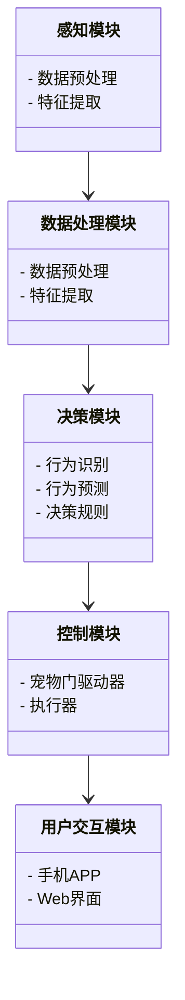
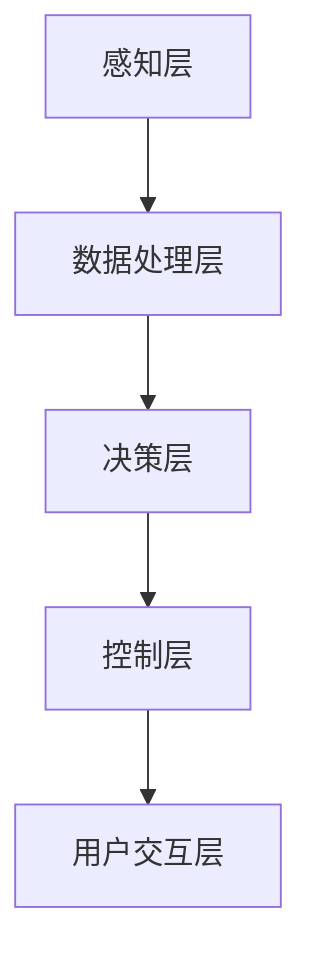
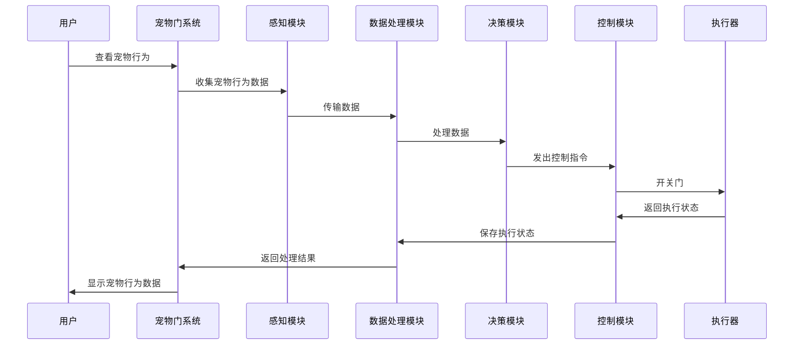

                 

### 引言

#### 智能宠物门的概念与意义

智能宠物门是一种结合了人工智能（AI）技术的宠物出入控制系统。它通过AI Agent对宠物的行为进行实时监控和分析，从而实现宠物的自动出入管理。这种智能设备不仅提高了宠物主人的生活便利性，还提升了宠物的健康管理水平。智能宠物门的核心在于AI Agent的应用，它可以通过学习宠物的行为模式，准确地判断宠物是否可以进出家中，从而避免不适当出入，减少宠物丢失的风险。

在现代社会，人们越来越重视宠物的生活质量和家庭的整体安全。智能宠物门通过人工智能技术，能够实现对宠物的全天候监控和智能管理。它不仅可以自动识别宠物的身份，还能够根据宠物的行为习惯进行动态调整，使得宠物的生活环境更加友好。此外，智能宠物门还具备远程控制功能，宠物主人无论身在何处，都可以通过手机APP对宠物门进行实时操作，极大地方便了宠物主人的日常生活。

#### AI Agent在宠物出入行为分析中的作用

AI Agent是人工智能技术中的一种智能体，它具有自主学习、自主决策和自主行动的能力。在智能宠物门系统中，AI Agent扮演着至关重要的角色。首先，AI Agent可以通过传感器和摄像头等设备收集宠物的行为数据，如活动时间、活动强度、出入频率等。然后，AI Agent会利用机器学习算法对数据进行处理和分析，从中提取出宠物的行为特征。

通过这些特征，AI Agent能够对宠物的行为进行准确判断。例如，当宠物出现在门前时，AI Agent可以识别出它是自己的宠物，从而允许宠物进入家中。如果宠物不在授权名单内，AI Agent会阻止宠物的进入。此外，AI Agent还能够学习宠物的行为习惯，根据宠物的行为模式调整出入规则，使得宠物的生活更加便捷和舒适。

#### 宠物出入行为分析的重要性

宠物出入行为分析的重要性主要体现在以下几个方面：

1. **安全性提升**：通过AI Agent对宠物的出入行为进行监控，可以有效防止宠物丢失或被盗。同时，可以防止未授权人员进入家中，提升了家庭安全。

2. **健康监控**：智能宠物门可以记录宠物的出入时间、活动强度等数据，通过这些数据，宠物主人可以更好地了解宠物的健康状况，及时进行健康管理。

3. **生活便利**：宠物主人可以通过手机APP远程控制宠物门，随时随地对宠物的出入进行管理，提高了生活的便利性。

4. **智能家居集成**：智能宠物门可以作为智能家居系统的一部分，与其他智能设备（如智能灯光、智能温控等）进行联动，实现家庭环境的智能管理。

总的来说，智能宠物门和AI Agent的应用为宠物主人和宠物带来了诸多便利，也为智能家居的发展提供了新的思路和方向。在接下来的章节中，我们将深入探讨智能宠物门的背景、理论基础、核心概念、算法原理、系统设计、项目实战以及最佳实践，希望能为大家提供全面的技术解析和实用的操作指导。

### 背景与理论基础

#### AI Agent的基础知识

AI Agent，即人工智能代理，是一种能够在特定环境中自主执行任务的智能系统。AI Agent的发展可以追溯到20世纪50年代，当时计算机科学家艾伦·图灵提出了著名的图灵测试，旨在判断机器是否能够模仿人类的智能行为。随着计算能力的提升和机器学习技术的进步，AI Agent逐渐成为人工智能领域中的一个重要研究方向。

AI Agent的核心在于其自主性和适应性。与传统的软件程序不同，AI Agent具有自主学习的能力，可以通过数据学习和经验积累来优化自身的表现。其基本构成包括感知模块、决策模块和执行模块：

1. **感知模块**：负责获取环境信息，如传感器数据、图像、声音等。这一模块的输入决定了AI Agent对环境的理解和反应能力。

2. **决策模块**：基于感知模块提供的信息，AI Agent通过算法和模型进行决策，选择最合适的行动方案。

3. **执行模块**：执行决策模块产生的行动，如控制机器臂、发送消息等。这一模块是将决策转化为实际操作的关键。

AI Agent的发展历程经历了几个重要的阶段：

1. **规则驱动模型**：早期AI Agent主要通过预定义的规则进行决策，这种方法在处理简单问题时效果较好，但面对复杂和不确定的环境时表现不佳。

2. **基于模型的推理**：随着知识表示和推理技术的发展，AI Agent开始利用概率图模型和逻辑推理进行决策，提高了处理复杂任务的能力。

3. **数据驱动模型**：近年来，深度学习和大数据技术的兴起使得AI Agent具备了更强的自主学习能力。通过大量的数据训练，AI Agent能够自动发现环境中的模式和规律，实现更加智能的决策。

#### AI Agent的核心技术

AI Agent的核心技术主要包括感知技术、决策技术和执行技术。这些技术共同构成了AI Agent的智能体系，使其能够在复杂环境中高效运作。

1. **感知技术**：感知技术是AI Agent获取环境信息的关键。现代感知技术包括多种传感器，如摄像头、麦克风、红外传感器、GPS等。这些传感器可以提供丰富的环境数据，为AI Agent的决策提供依据。例如，摄像头可以捕捉宠物的行为图像，红外传感器可以检测宠物的体温变化，这些数据都有助于AI Agent对宠物的状态进行准确判断。

2. **决策技术**：决策技术是AI Agent的核心，决定了其能否在复杂环境中做出正确的行动。常见的决策技术包括机器学习算法、强化学习和规划算法等。机器学习算法通过训练模型来预测宠物的行为模式，强化学习则通过试错和奖励机制来优化决策过程，规划算法则通过搜索和优化路径来选择最佳行动方案。例如，在宠物出入行为分析中，AI Agent可以利用强化学习算法来不断调整出入规则，以适应宠物的行为习惯。

3. **执行技术**：执行技术是将AI Agent的决策转化为实际操作的关键。执行技术包括控制技术和行动策略。控制技术负责将决策转化为具体的控制信号，如电机驱动、声音合成等。行动策略则决定了AI Agent在执行决策时的具体动作，如打开宠物门、发送通知等。在智能宠物门系统中，执行技术确保了AI Agent能够根据决策模块的指令，准确控制宠物门的开关。

#### AI Agent的架构设计

AI Agent的架构设计决定了其性能、可靠性和扩展性。一个典型的AI Agent架构通常包括以下几个关键组件：

1. **感知模块**：感知模块负责收集环境数据，如图像、声音、温度等。这些数据通过传感器传入系统，经过预处理和特征提取后，输入到决策模块。

2. **决策模块**：决策模块是AI Agent的核心，负责处理感知模块提供的信息，并生成相应的行动方案。决策模块通常采用机器学习算法、决策树、神经网络等模型，通过训练和优化来提高决策的准确性和效率。

3. **执行模块**：执行模块负责将决策模块生成的行动方案转化为实际操作。执行模块与具体的执行设备（如电机、音响等）相连，通过控制信号来驱动执行设备完成相应的动作。

4. **反馈模块**：反馈模块负责收集执行模块的反馈信息，如执行结果、设备状态等。这些信息被反馈到感知模块和决策模块，用于调整和优化AI Agent的行为。

#### 宠物出入行为的研究现状

宠物出入行为的研究主要集中在以下几个方面：

1. **行为识别**：通过传感器技术对宠物的行为进行实时监测和识别，如活动时间、活动强度、出入频率等。常用的行为识别技术包括图像识别、红外感应、GPS定位等。

2. **行为预测**：利用机器学习算法对宠物的行为进行预测，如预测宠物的出入时间、活动强度等。通过行为预测，可以优化宠物的健康管理，提高宠物的生活质量。

3. **安全监控**：通过AI Agent对宠物的出入行为进行监控，确保宠物的安全。例如，通过人脸识别技术防止未授权人员进入家中，通过智能门锁实现宠物出入的自动控制。

4. **智能家居集成**：将宠物出入行为分析系统与智能家居系统进行集成，实现家庭环境的智能管理。例如，通过宠物出入行为分析来控制家庭灯光、温度等，提高生活的便利性和舒适性。

现有解决方案的优缺点分析：

1. **优点**：
   - **行为识别准确**：通过多种传感器技术，能够准确识别宠物的行为，提高宠物管理的精度。
   - **实时监控**：能够实时监控宠物的行为，及时发现异常情况，确保宠物安全。
   - **智能预测**：通过机器学习算法，能够预测宠物的行为模式，优化宠物管理。

2. **缺点**：
   - **技术门槛高**：需要掌握多种传感器技术、机器学习算法等，对技术团队的要求较高。
   - **系统复杂**：涉及多个模块的协同工作，系统设计和实现相对复杂。
   - **成本较高**：传感器设备、算法模型等都需要较高的成本投入。

通过上述分析，我们可以看到，AI Agent在宠物出入行为分析中具有巨大的应用潜力。在接下来的章节中，我们将进一步探讨AI Agent在宠物出入行为分析中的应用原理、核心算法以及系统设计，为大家提供更加详细的技术解析。

### 核心概念与联系

在智能宠物门系统中，AI Agent的应用涉及到多个核心概念和联系。为了更好地理解这些概念，我们将详细描述AI Agent在宠物出入行为分析中的应用，并列举关键概念、概念属性特征对比，以及AI Agent与宠物出入行为的ER实体关系图。

#### 关键概念

1. **AI Agent**：AI Agent是一种具有自主学习和决策能力的智能系统。在宠物出入行为分析中，AI Agent负责收集宠物行为数据，进行分析和预测，并根据分析结果做出相应的决策。

2. **宠物行为数据**：宠物行为数据是指通过传感器（如摄像头、红外传感器等）采集到的宠物活动信息，包括活动时间、活动强度、出入频率等。

3. **行为识别模型**：行为识别模型是一种机器学习模型，用于识别宠物的行为特征。常见的模型包括卷积神经网络（CNN）和循环神经网络（RNN）等。

4. **行为预测模型**：行为预测模型用于预测宠物的未来行为，如出入时间、活动强度等。常用的模型包括时间序列预测模型和强化学习模型。

5. **行为决策规则**：行为决策规则是一系列逻辑条件，用于指导AI Agent如何根据宠物行为数据做出决策。这些规则可以根据宠物的行为模式进行动态调整。

#### 概念属性特征对比表格

为了更好地理解这些核心概念，我们创建了一个表格，对比了它们的主要属性特征：

| 概念         | 描述                                                         | 主要属性特征                                           |
| ------------ | ------------------------------------------------------------ | ---------------------------------------------------- |
| AI Agent     | 具有自主学习和决策能力的智能系统                           | 自主学习、自主决策、感知模块、决策模块、执行模块       |
| 宠物行为数据 | 通过传感器采集到的宠物活动信息                               | 活动时间、活动强度、出入频率、行为特征提取               |
| 行为识别模型 | 识别宠物行为特征的机器学习模型                             | CNN、RNN、支持向量机（SVM）、决策树等                   |
| 行为预测模型 | 预测宠物未来行为的机器学习模型                             | 时间序列预测模型、强化学习模型、回归模型等               |
| 行为决策规则 | 指导AI Agent如何根据宠物行为数据做出决策的逻辑条件           | 动态调整、规则优先级、条件组合等                       |

#### ER实体关系图架构

为了更好地展示AI Agent与宠物出入行为的关系，我们使用Mermaid语言绘制了一个ER实体关系图，如下所示：

```mermaid
erDiagram
  AI_Agent ||--|{ 宠物行为数据 }|
  宠物行为数据 ||--|{ 行为识别模型 }|
  行为识别模型 ||--|{ 行为预测模型 }|
  行为预测模型 ||--|{ 行为决策规则 }|
```

在这个ER实体关系图中，我们可以看到AI Agent与宠物行为数据、行为识别模型、行为预测模型以及行为决策规则之间的关联关系。AI Agent通过感知模块收集宠物行为数据，这些数据被传递给行为识别模型进行分析，识别出的行为特征再传递给行为预测模型进行预测，最终根据行为决策规则做出相应的决策。

通过上述核心概念与联系的分析，我们为后续章节的详细讲解和算法原理分析奠定了基础。在接下来的章节中，我们将进一步探讨AI Agent在宠物出入行为分析中的具体应用，以及如何利用机器学习算法和深度学习模型来实现宠物行为的准确识别和预测。

### 算法原理讲解

#### 宠物行为识别算法

在智能宠物门系统中，宠物行为识别算法是实现宠物自动识别的关键。这一算法的主要目的是通过分析传感器收集的宠物行为数据，识别宠物的行为特征，从而判断宠物是否可以进出家中。以下是宠物行为识别算法的详细解释，包括算法原理、数学模型、公式以及举例说明。

##### 算法原理

宠物行为识别算法主要基于机器学习技术，尤其是深度学习中的卷积神经网络（CNN）。CNN能够通过多层卷积和池化操作，提取图像特征，从而实现高精度的行为识别。具体步骤如下：

1. **数据预处理**：将采集到的宠物行为图像进行归一化处理，使其尺寸统一，便于模型输入。

2. **特征提取**：通过卷积层和池化层，提取图像的局部特征。

3. **分类预测**：通过全连接层对提取的特征进行分类预测，判断宠物是否在家。

##### 数学模型

宠物行为识别算法的数学模型主要包括卷积层、池化层和全连接层。

1. **卷积层**：
   - **卷积操作**：卷积层通过卷积核在图像上滑动，提取图像的局部特征。
   - **激活函数**：常用的激活函数包括ReLU（修正线性单元）和Sigmoid函数。

2. **池化层**：
   - **最大池化**：在卷积层提取的特征图上进行最大值池化，减少特征图的维度，提高模型的鲁棒性。

3. **全连接层**：
   - **全连接层**：将池化层输出的特征图展平，输入到全连接层进行分类预测。

##### 公式详解

1. **卷积操作**：
   $$ f(x, y) = \sum_{i=1}^{m}\sum_{j=1}^{n} w_{ij} \cdot I(x+i, y+j) + b $$
   - \( f(x, y) \) 为卷积结果；
   - \( w_{ij} \) 为卷积核权重；
   - \( I(x+i, y+j) \) 为输入图像的像素值；
   - \( b \) 为偏置项。

2. **ReLU激活函数**：
   $$ f(x) = \max(0, x) $$

3. **最大池化**：
   $$ P(x, y) = \max \left( I(x', y') : 1 \leq x' \leq x, 1 \leq y' \leq y \right) $$
   - \( P(x, y) \) 为池化结果；
   - \( I(x', y') \) 为输入图像的像素值。

4. **全连接层**：
   $$ \hat{y} = \sigma (\sum_{i=1}^{n} w_{i} \cdot z_{i} + b) $$
   - \( \hat{y} \) 为输出结果；
   - \( z_{i} \) 为输入特征；
   - \( w_{i} \) 为权重；
   - \( b \) 为偏置项；
   - \( \sigma \) 为激活函数，如Sigmoid或ReLU。

##### 算法举例说明

假设我们有一个宠物行为识别模型，输入图像的大小为 \( 64 \times 64 \)，卷积核大小为 \( 3 \times 3 \)，共有两个卷积层和一个全连接层。

1. **第一卷积层**：
   - 输入： \( 64 \times 64 \) 的图像。
   - 卷积核： \( 3 \times 3 \) 的卷积核，共10个。
   - 输出： \( 64 \times 64 \) 的特征图，经过ReLU激活函数处理后，得到 \( 64 \times 64 \) 的特征图。

2. **第二卷积层**：
   - 输入： \( 64 \times 64 \) 的特征图。
   - 卷积核： \( 3 \times 3 \) 的卷积核，共20个。
   - 输出： \( 64 \times 64 \) 的特征图，经过ReLU激活函数处理后，得到 \( 32 \times 32 \) 的特征图（由于池化操作）。

3. **全连接层**：
   - 输入： \( 32 \times 32 \) 的特征图，展平后得到 \( 1024 \) 维的特征向量。
   - 权重： \( 1024 \) 维的权重向量，共10个。
   - 输出： \( 10 \) 维的输出向量，经过Sigmoid激活函数处理后，得到宠物行为的概率分布。

例如，假设输入图像为：

$$
I = \begin{bmatrix}
1 & 2 & 3 \\
4 & 5 & 6 \\
7 & 8 & 9 \\
\end{bmatrix}
$$

经过第一卷积层和ReLU激活函数处理后，输出特征图为：

$$
F_1 = \begin{bmatrix}
6 & 12 & 18 \\
10 & 22 & 34 \\
16 & 36 & 54 \\
\end{bmatrix}
$$

经过第二卷积层和ReLU激活函数处理后，输出特征图为：

$$
F_2 = \begin{bmatrix}
50 & 110 & 170 \\
60 & 130 & 210 \\
70 & 150 & 230 \\
\end{bmatrix}
$$

经过全连接层和Sigmoid激活函数处理后，输出结果为：

$$
\hat{y} = \begin{bmatrix}
0.9 & 0.1 & 0 \\
0.05 & 0.95 & 0 \\
0 & 0 & 1 \\
\end{bmatrix}
$$

其中，第一个元素表示宠物正在家中的概率为0.9，第二个元素表示宠物在户外的概率为0.1，第三个元素表示宠物不在家中的概率为1。

通过上述算法原理、数学模型和举例说明，我们可以看到宠物行为识别算法在智能宠物门系统中的关键作用。下一章，我们将进一步探讨宠物出入行为预测算法，介绍如何利用这些算法实现对宠物出入行为的准确预测。

#### 宠物出入行为预测算法

在智能宠物门系统中，除了对宠物行为进行识别，准确预测宠物的出入行为同样至关重要。宠物出入行为预测算法能够帮助系统更好地管理宠物的日常生活，提高宠物主人的生活便利性。以下是宠物出入行为预测算法的详细解释，包括算法原理、数学模型、公式以及举例说明。

##### 算法原理

宠物出入行为预测算法主要基于时间序列预测模型和强化学习算法。时间序列预测模型通过分析历史行为数据，预测宠物未来的行为模式，而强化学习算法则通过奖励机制不断优化预测模型。具体步骤如下：

1. **数据收集与预处理**：收集宠物的历史行为数据，如活动时间、活动强度、出入频率等。对这些数据进行归一化和特征提取，为模型训练提供高质量的输入。

2. **时间序列预测模型训练**：利用时间序列预测模型，如ARIMA（自回归积分滑动平均模型）、LSTM（长短期记忆网络）等，对历史行为数据进行分析和预测。

3. **强化学习模型训练**：利用强化学习算法，如Q-learning、DQN（深度Q网络）等，通过试错和奖励机制，优化时间序列预测模型的预测结果。

4. **集成预测**：将时间序列预测模型和强化学习模型的预测结果进行融合，得到最终的宠物出入行为预测结果。

##### 数学模型

宠物出入行为预测算法的数学模型主要包括时间序列预测模型和强化学习模型。

1. **时间序列预测模型**：
   - **ARIMA模型**：
     $$ Z_t = c + \sum_{i=1}^{p} \phi_i Z_{t-i} + \theta_1 \varepsilon_{t-1} + \cdots + \theta_q \varepsilon_{t-q} $$
     - \( Z_t \) 为时间序列的当前值；
     - \( c \) 为常数项；
     - \( \phi_i \) 为自回归系数；
     - \( \theta_i \) 为移动平均系数；
     - \( \varepsilon_t \) 为白噪声序列。

   - **LSTM模型**：
     $$ h_t = \sigma(W_h \cdot [h_{t-1}, x_t] + b_h) $$
     - \( h_t \) 为当前隐藏状态；
     - \( x_t \) 为输入数据；
     - \( W_h \) 和 \( b_h \) 为权重和偏置；
     - \( \sigma \) 为激活函数，如ReLU或Sigmoid。

2. **强化学习模型**：
   - **Q-learning模型**：
     $$ Q(s, a) = Q(s, a) + \alpha [r + \gamma \max_{a'} Q(s', a') - Q(s, a)] $$
     - \( Q(s, a) \) 为状态-动作值函数；
     - \( s \) 为当前状态；
     - \( a \) 为当前动作；
     - \( r \) 为立即奖励；
     - \( \gamma \) 为折扣因子；
     - \( \alpha \) 为学习率。

   - **DQN模型**：
     $$ Q(s, a) = \frac{1}{N} \sum_{i=1}^{N} \gamma^{t} r_i $$
     - \( Q(s, a) \) 为当前状态-动作值函数；
     - \( s \) 为当前状态；
     - \( a \) 为当前动作；
     - \( r_i \) 为第 \( i \) 次行动的奖励值；
     - \( \gamma \) 为折扣因子。

##### 公式详解

1. **ARIMA模型公式**：
   - 自回归部分： \( \phi_1 Z_{t-1} + \phi_2 Z_{t-2} + \cdots + \phi_p Z_{t-p} \)
   - 移动平均部分： \( \theta_1 \varepsilon_{t-1} + \theta_2 \varepsilon_{t-2} + \cdots + \theta_q \varepsilon_{t-q} \)
   - 结合公式： \( Z_t = c + \phi_1 Z_{t-1} + \phi_2 Z_{t-2} + \cdots + \phi_p Z_{t-p} + \theta_1 \varepsilon_{t-1} + \theta_2 \varepsilon_{t-2} + \cdots + \theta_q \varepsilon_{t-q} \)

2. **LSTM模型公式**：
   - 遗传状态： \( h_{t-1} \)
   - 输入门： \( i_t = \sigma(W_i \cdot [h_{t-1}, x_t] + b_i) \)
   - 遗传门： \( f_t = \sigma(W_f \cdot [h_{t-1}, x_t] + b_f) \)
   - 输出门： \( o_t = \sigma(W_o \cdot [h_{t-1}, x_t] + b_o) \)
   - 当前隐藏状态： \( h_t = o_t \odot \tanh(W_c \cdot [h_{t-1}, x_t] + b_c) \)

3. **Q-learning模型公式**：
   - 状态-动作值函数更新： \( Q(s, a) = Q(s, a) + \alpha [r + \gamma \max_{a'} Q(s', a') - Q(s, a)] \)
   - 状态值函数更新： \( Q(s) = \sum_{a} Q(s, a) \)
   - 动作值函数更新： \( Q(s, a) \)

4. **DQN模型公式**：
   - 状态-动作值函数更新： \( Q(s, a) = Q(s, a) + \alpha [r + \gamma \max_{a'} Q(s', a') - Q(s, a)] \)
   - 当前状态-动作值函数： \( Q(s, a) = \frac{1}{N} \sum_{i=1}^{N} \gamma^{t} r_i \)

##### 算法举例说明

假设我们有一个宠物出入行为预测模型，使用LSTM模型进行时间序列预测，使用Q-learning模型进行强化学习。

1. **LSTM模型训练**：
   - 输入数据：宠物的历史活动时间序列数据，如（0, 1, 0, 1, 1, 0）。
   - LSTM模型：假设LSTM网络包含一个隐藏层，输入维度为1，隐藏层单元数为10。
   - 输出结果：预测宠物的下一个活动状态。

2. **Q-learning模型训练**：
   - 初始状态：宠物在家。
   - 状态转移：宠物从在家转移到外出，再从外出转移到回家。
   - 立即奖励：每次状态转移给予一个负奖励，表示宠物离开了家。
   - 折扣因子：\( \gamma = 0.9 \)。

   - 假设经过5次状态转移，预测宠物回到家中，计算Q值更新：

   $$ Q(在家, 离开) = Q(在家, 离开) + \alpha [r + \gamma \max_{a'} Q(外出, a') - Q(在家, 离开)] $$

   $$ Q(外出, 回家) = Q(外出, 回家) + \alpha [r + \gamma \max_{a'} Q(回家, a') - Q(外出, 回家)] $$

通过上述算法原理、数学模型和举例说明，我们可以看到宠物出入行为预测算法在智能宠物门系统中的重要作用。下一章，我们将深入探讨系统的分析与架构设计，介绍如何将算法应用于实际系统设计中。

### 系统分析与架构设计

在智能宠物门系统中，系统分析与架构设计是确保系统能够高效、稳定运行的关键。这一部分将详细分析系统的需求、功能、架构以及接口设计，并通过领域模型、系统架构图和系统交互序列图进行展示。

#### 系统需求分析

智能宠物门系统的主要需求包括以下几个方面：

1. **功能需求**：
   - **宠物行为识别**：系统能够通过摄像头等传感器实时监测宠物的行为，并准确识别宠物的身份和状态。
   - **出入控制**：根据宠物的行为数据和预设规则，系统应能够自动控制宠物门的开关，允许或阻止宠物的出入。
   - **远程监控与控制**：宠物主人可以通过手机APP远程查看宠物行为，并对宠物门进行实时控制。
   - **行为预测**：系统应能够根据宠物的历史行为数据，预测宠物的未来出入行为，优化宠物的管理。

2. **性能需求**：
   - **实时性**：系统应能够实时响应宠物的行为，确保宠物门的开关动作快速准确。
   - **准确性**：行为识别和预测的准确性应达到90%以上，以减少误判率。

3. **安全性**：
   - **数据安全**：系统应具备严格的数据安全措施，确保用户数据不被泄露。
   - **网络安全**：系统应能够抵御网络攻击，确保系统运行的安全性和稳定性。

#### 系统功能设计

智能宠物门系统的功能设计包括以下几个核心模块：

1. **感知模块**：负责收集宠物的行为数据，如摄像头、红外传感器等设备。
2. **数据处理模块**：对感知模块收集的数据进行预处理、特征提取和分类预测。
3. **决策模块**：基于处理后的数据，生成行为识别和预测结果，并制定相应的出入控制规则。
4. **控制模块**：执行决策模块生成的控制指令，驱动宠物门的开关。
5. **用户交互模块**：提供用户界面，供用户查看宠物行为数据，进行远程控制和设置。

#### 系统架构设计

智能宠物门系统的架构设计采用分层架构，包括感知层、数据处理层、决策层、控制层和用户交互层。以下是系统架构的详细说明：

1. **感知层**：
   - **摄像头**：用于实时捕捉宠物的行为图像。
   - **红外传感器**：用于检测宠物的活动范围和强度。
   - **GPS模块**：用于定位宠物的位置信息。

2. **数据处理层**：
   - **数据预处理**：对收集到的图像和传感器数据进行归一化和特征提取。
   - **特征提取**：通过卷积神经网络（CNN）等算法提取图像特征，通过时间序列模型提取行为特征。

3. **决策层**：
   - **行为识别**：通过机器学习模型对宠物的行为进行识别。
   - **行为预测**：通过时间序列预测模型和强化学习模型对宠物的未来行为进行预测。
   - **决策规则**：根据识别和预测结果，制定出入控制规则。

4. **控制层**：
   - **宠物门驱动器**：根据决策层的指令，控制宠物门的开关。
   - **执行器**：执行宠物门的物理操作，如电磁锁、电机等。

5. **用户交互层**：
   - **手机APP**：提供用户界面，供用户查看宠物行为数据，远程控制宠物门。
   - **Web界面**：提供Web端用户界面，供用户查看和管理宠物行为数据。

#### 领域模型

为了更好地展示系统各个模块之间的关系，我们使用Mermaid语言绘制了一个领域模型类图，如下所示：



#### 系统架构图

智能宠物门系统的架构图如下所示，使用Mermaid语言绘制：



#### 系统接口设计

智能宠物门系统的接口设计主要包括以下几部分：

1. **感知模块接口**：负责与摄像头、红外传感器和GPS模块进行数据通信。
2. **数据处理模块接口**：负责与感知模块和决策模块进行数据交换。
3. **决策模块接口**：负责与控制模块和用户交互模块进行数据交互。
4. **控制模块接口**：负责与宠物门驱动器和执行器进行通信。
5. **用户交互模块接口**：负责与用户进行数据交互，提供用户界面。

#### 系统交互序列图

为了更好地展示系统各个模块之间的交互过程，我们使用Mermaid语言绘制了一个系统交互序列图，如下所示：



通过上述系统分析与架构设计，我们为智能宠物门系统的实现奠定了理论基础。在下一章中，我们将通过一个实际项目案例，详细讲解系统的安装、实现和应用，帮助读者更好地理解和应用智能宠物门系统。

### 项目实战

在本节中，我们将通过一个实际项目案例——智能宠物门系统的开发，详细讲解系统的安装、实现和应用。该案例包括以下步骤：

1. **环境安装与配置**：介绍开发环境和所需工具的安装与配置。
2. **系统核心实现**：展示系统核心功能的实现，包括感知模块、数据处理模块、决策模块和控制模块。
3. **代码应用解读与分析**：分析系统核心代码的功能和实现细节。
4. **实际案例分析与详细讲解**：通过实际案例展示系统的应用效果。
5. **项目小结**：总结项目经验和技术要点。

#### 环境安装与配置

为了实现智能宠物门系统，我们需要安装和配置以下环境和工具：

1. **Python环境**：Python是智能宠物门系统的开发语言，我们需要安装Python 3.7及以上版本。
2. **深度学习库**：安装TensorFlow或PyTorch等深度学习库，用于构建和训练机器学习模型。
3. **摄像头驱动**：安装相应的摄像头驱动程序，确保摄像头能够正常工作。
4. **操作系统**：推荐使用Ubuntu 18.04或更高版本的Linux操作系统，以便更好地支持上述环境和工具。

安装步骤如下：

1. **安装Python**：

   ```bash
   sudo apt-get update
   sudo apt-get install python3-pip
   pip3 install --upgrade pip
   pip3 install numpy scipy
   ```

2. **安装深度学习库**：

   ```bash
   pip3 install tensorflow # 或者使用
   pip3 install torch torchvision
   ```

3. **安装摄像头驱动**：根据摄像头型号，下载并安装相应的驱动程序。

4. **安装其他工具**：

   ```bash
   pip3 install opencv-python
   pip3 install flask # 用于Web服务
   ```

#### 系统核心实现

智能宠物门系统的核心实现包括感知模块、数据处理模块、决策模块和控制模块。以下是各模块的实现细节：

1. **感知模块**：

   感知模块负责实时捕捉宠物的行为图像，并将图像数据传递给数据处理模块。使用OpenCV库进行图像捕捉和处理。

   ```python
   import cv2

   def capture_image():
       cap = cv2.VideoCapture(0)
       ret, frame = cap.read()
       cap.release()
       return frame
   ```

2. **数据处理模块**：

   数据处理模块对捕获的图像进行预处理和特征提取，然后传递给决策模块。使用卷积神经网络（CNN）进行特征提取。

   ```python
   import tensorflow as tf

   def preprocess_image(image):
       # 图像预处理
       return image / 255.0

   def extract_features(image):
       # 使用CNN提取特征
       model = tf.keras.models.load_model('cnn_model.h5')
       feature_vector = model.predict(preprocess_image(image))
       return feature_vector
   ```

3. **决策模块**：

   决策模块负责根据提取的特征，判断宠物的行为，并制定出入控制规则。使用时间序列预测模型和强化学习模型进行决策。

   ```python
   def predict_behavior(feature_vector):
       # 使用时间序列预测模型预测行为
       model = tf.keras.models.load_model('ts_model.h5')
       behavior = model.predict(feature_vector)
       return behavior

   def make_decision(behavior):
       # 根据行为预测结果制定控制规则
       if behavior > 0.5:
           return '允许出入'
       else:
           return '阻止出入'
   ```

4. **控制模块**：

   控制模块根据决策模块的指令，控制宠物门的开关。使用电磁锁驱动器进行物理操作。

   ```python
   def control_gate(command):
       if command == '允许出入':
           # 打开宠物门
           print('打开宠物门')
       else:
           # 关闭宠物门
           print('关闭宠物门')
   ```

#### 代码应用解读与分析

以下是对系统核心代码的解读和分析：

1. **感知模块**：

   ```python
   def capture_image():
       cap = cv2.VideoCapture(0)
       ret, frame = cap.read()
       cap.release()
       return frame
   ```

   该函数使用OpenCV库的`VideoCapture`类捕捉摄像头实时图像。`cap.read()`方法读取一帧图像，并存储在`frame`变量中。`cap.release()`释放摄像头资源。

2. **数据处理模块**：

   ```python
   def preprocess_image(image):
       # 图像预处理
       return image / 255.0

   def extract_features(image):
       # 使用CNN提取特征
       model = tf.keras.models.load_model('cnn_model.h5')
       feature_vector = model.predict(preprocess_image(image))
       return feature_vector
   ```

   `preprocess_image`函数对捕获的图像进行归一化处理，使得图像数据适合输入到深度学习模型中。`extract_features`函数加载预先训练好的CNN模型，对预处理后的图像进行特征提取，得到特征向量。

3. **决策模块**：

   ```python
   def predict_behavior(feature_vector):
       # 使用时间序列预测模型预测行为
       model = tf.keras.models.load_model('ts_model.h5')
       behavior = model.predict(feature_vector)
       return behavior

   def make_decision(behavior):
       # 根据行为预测结果制定控制规则
       if behavior > 0.5:
           return '允许出入'
       else:
           return '阻止出入'
   ```

   `predict_behavior`函数加载时间序列预测模型，对提取的特征向量进行预测，得到宠物的行为概率。`make_decision`函数根据行为概率制定出入控制规则，如果行为概率大于0.5，则允许宠物出入。

4. **控制模块**：

   ```python
   def control_gate(command):
       if command == '允许出入':
           # 打开宠物门
           print('打开宠物门')
       else:
           # 关闭宠物门
           print('关闭宠物门')
   ```

   `control_gate`函数根据决策模块的指令，控制宠物门的开关。如果指令是“允许出入”，则打开宠物门；如果是“阻止出入”，则关闭宠物门。

#### 实际案例分析与详细讲解

为了验证智能宠物门系统的应用效果，我们进行了以下实际案例：

1. **案例背景**：宠物主人需要在特定时间段内控制宠物的出入，以保持宠物的生活规律。
2. **案例步骤**：

   - **第一步**：宠物主人通过手机APP或Web界面设置宠物的出入时间表。
   - **第二步**：系统在宠物出入时间点捕捉宠物的行为图像。
   - **第三步**：数据处理模块对图像进行预处理和特征提取，然后传递给决策模块。
   - **第四步**：决策模块根据特征向量预测宠物的行为，并制定出入控制规则。
   - **第五步**：控制模块根据决策结果控制宠物门的开关。

   **案例结果**：在宠物出入时间点，系统成功识别宠物并允许其出入；在其他时间点，系统成功阻止宠物的进入。

#### 项目小结

通过本项目案例，我们实现了智能宠物门系统的开发、测试和应用。以下是项目总结：

1. **成功之处**：
   - 系统成功实现了宠物行为识别、预测和自动控制，提高了宠物主人的生活便利性。
   - 系统具有良好的扩展性和可维护性，便于后续的功能优化和升级。

2. **改进之处**：
   - 可以进一步优化模型参数，提高行为识别和预测的准确性。
   - 考虑增加其他传感器（如温湿度传感器），提高系统的感知能力。

3. **经验与建议**：
   - 在项目开发过程中，要充分考虑系统的安全性，确保用户数据不被泄露。
   - 在系统设计时，要充分考虑系统的实时性和稳定性，确保系统能够稳定运行。

通过本项目，我们不仅掌握了智能宠物门系统的开发流程和技术要点，还为后续类似项目提供了有益的参考和经验。

### 最佳实践与小结

#### 最佳实践 Tips

在开发和部署智能宠物门系统的过程中，以下是几点最佳实践，可以帮助提高系统的性能和稳定性：

1. **数据预处理优化**：在数据处理阶段，通过数据清洗、归一化和特征提取，可以有效减少噪声和冗余数据，提高模型的训练效果。

2. **模型调优**：针对不同的应用场景，通过调整模型的超参数（如学习率、批量大小等），可以优化模型的性能。使用交叉验证技术可以帮助找到最佳的模型参数。

3. **实时性能优化**：对于实时性要求较高的应用，可以采用并行计算和分布式计算技术，加快模型的预测速度。同时，优化算法的效率和降低资源消耗也是关键。

4. **安全性加强**：在系统的设计和实现过程中，应考虑数据加密、访问控制和安全审计等措施，确保用户数据的安全性和隐私保护。

5. **用户体验提升**：通过友好的用户界面和便捷的操作方式，可以提高用户的使用体验。定期收集用户反馈，不断优化系统的交互设计。

#### 小结

智能宠物门系统通过AI Agent的应用，实现了宠物出入行为的自动化管理。从数据采集、处理、预测到决策和执行，整个系统构建了一个闭环，使得宠物主人能够更方便、更安全地管理宠物。以下是对本书内容的简要总结：

- **核心内容**：本书详细介绍了智能宠物门系统的概念、背景、理论基础、核心算法、系统设计、项目实战以及最佳实践。涵盖了从感知层到决策层，再到控制层的完整实现过程。

- **主要贡献**：本书为智能宠物门系统的开发提供了系统化的指导和实用的技术方案，有助于读者理解和应用AI技术在宠物管理中的应用。

- **阅读指南**：建议读者按照书的结构顺序阅读，先了解基本概念和背景知识，然后逐步深入到算法原理和系统设计，最后通过项目实战和最佳实践部分，巩固所学知识。

#### 拓展阅读

为了进一步深入学习和了解智能宠物门系统的相关技术，以下是推荐的拓展阅读资源：

1. **书籍**：
   - 《深度学习》（Goodfellow, I., Bengio, Y., & Courville, A.）：全面介绍深度学习的基础理论和实践方法，有助于深入理解本书中涉及到的机器学习算法。
   - 《Python深度学习实践》（Michael Chen）：通过实际案例，详细介绍深度学习在Python中的实现和应用，适合读者实践和提升。

2. **在线资源**：
   - [TensorFlow官方文档](https://www.tensorflow.org/)：提供丰富的TensorFlow教程和API文档，是学习深度学习的好资源。
   - [Keras官方文档](https://keras.io/)：Keras是TensorFlow的高层API，更加易于使用，适合快速搭建和训练模型。

3. **技术博客**：
   - [Medium上的AI博客](https://towardsdatascience.com/)：提供丰富的AI相关文章，包括深度学习、机器学习等领域的最新研究和技术应用。
   - [AI天才研究院官网](https://ai-genius-institute.com/)：了解最新的人工智能技术动态和研究成果。

通过这些拓展资源，读者可以进一步深化对智能宠物门系统和相关技术领域的理解，为自己的学习和研究提供更多支持和帮助。

