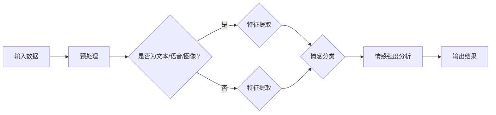
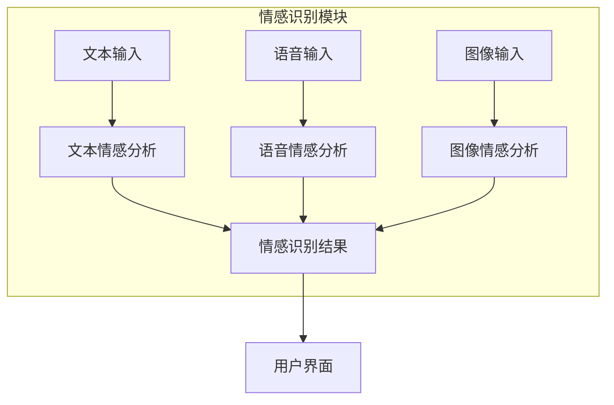
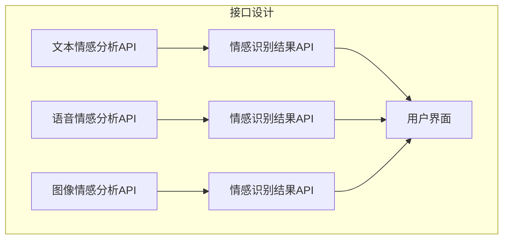
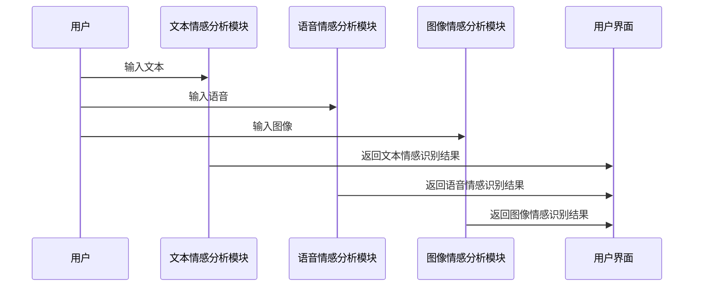

                 

### 智能客服AI Agent的情感识别能力：开启客服新时代

智能客服AI Agent作为人工智能领域的重要应用之一，已经逐渐成为企业客服体系的基石。随着用户对服务质量要求的不断提高，智能客服AI Agent的情感识别能力成为了一个关键的研究方向。本文将围绕智能客服AI Agent的情感识别能力展开讨论，从核心概念、技术原理、系统设计与实现、项目实战等多方面进行深入剖析。

**关键词：**
- 智能客服AI Agent
- 情感识别
- 技术原理
- 系统设计
- 项目实战

**摘要：**
本文旨在探讨智能客服AI Agent的情感识别能力，通过对情感识别的核心概念、技术原理、系统设计与实现以及项目实战的详细分析，为读者提供一套完整的理解与实现路径。我们将从以下几个方面展开：

1. **情感识别概述**：介绍情感识别的背景、基本概念和应用场景。
2. **情感识别技术原理**：讲解情感识别算法的原理，包括数学模型、流程图和Python代码示例。
3. **系统分析与架构设计方案**：介绍情感识别系统的设计思路、功能实现、架构图和接口设计。
4. **项目实战**：通过实际案例展示情感识别算法的应用，提供代码解析和项目小结。
5. **最佳实践 tips**：总结情感识别过程中需要注意的要点和常见问题的解决方案。
6. **小结与展望**：回顾情感识别的现状与未来发展趋势，为读者提供进一步学习的方向。

### 第一部分：背景与基础理论

#### 1.1 情感识别的背景与重要性

随着互联网和移动设备的普及，客服行业正面临前所未有的变革。传统的客服模式已经无法满足用户对快速、准确、个性化的服务需求。而智能客服AI Agent的兴起，为客服行业带来了新的机遇。智能客服AI Agent不仅可以处理大量的用户咨询，还能根据用户的行为和反馈进行智能化的交互，从而提升用户体验。

情感识别在智能客服AI Agent中的作用至关重要。通过识别用户在交互过程中的情感状态，智能客服AI Agent可以更好地理解用户需求，提供更加贴心、个性化的服务。例如，当用户表达出愤怒或不满的情感时，AI Agent可以主动提出解决方案，缓解用户的情绪，从而提高用户满意度。

#### 1.2 情感识别的基本概念

情感识别（Emotion Recognition）是指利用计算机技术和算法，对人类情感状态进行自动识别和理解的过程。情感识别通常涉及以下几个核心概念：

- **情感分类**：将情感划分为不同的类别，如快乐、悲伤、愤怒、惊讶等。
- **情感强度**：对情感的表达程度进行量化，如快乐的程度、悲伤的深度等。
- **情感变化**：分析情感在时间维度上的变化趋势。

#### 1.3 情感识别的应用场景

情感识别技术在智能客服AI Agent中有着广泛的应用场景：

- **客户服务**：通过情感识别，智能客服AI Agent可以更好地理解客户的需求和情绪，提供个性化的服务。
- **市场调研**：通过对用户反馈的情感分析，企业可以了解产品的市场接受度，优化产品设计和营销策略。
- **心理健康监测**：利用情感识别技术，可以实时监测用户的心理健康状态，为用户提供心理支持和建议。

### 第二部分：情感识别技术原理

#### 2.1 情感识别的算法原理

情感识别的核心在于如何从文本、语音或图像中提取情感特征，并利用这些特征进行情感分类和情感强度分析。常见的情感识别算法包括基于传统机器学习的方法和深度学习的方法。

- **传统机器学习算法**：如支持向量机（SVM）、决策树、随机森林等，通过特征工程提取文本特征，然后利用这些特征进行情感分类。
- **深度学习算法**：如卷积神经网络（CNN）、循环神经网络（RNN）、长短期记忆网络（LSTM）等，通过端到端的学习方式，直接从原始数据中提取情感特征。

#### 2.2 情感识别的核心概念对比

在情感识别过程中，不同的情感类别和情感强度需要进行明确的区分。以下是几种常见的情感类别及其对比：

| 情感类别 | 描述 | 示例 |
| --- | --- | --- |
| 快乐 | 表示积极的情感状态，如兴奋、愉悦等。 | “我真的很喜欢这个产品！” |
| 悲伤 | 表示消极的情感状态，如伤心、难过等。 | “我已经失去了所有的希望。” |
| 愤怒 | 表示强烈的消极情感，如愤怒、恼怒等。 | “这太不公平了，我无法接受！” |
| 惊讶 | 表示对事物的意外反应，如惊讶、震惊等。 | “你没有告诉我这个消息，太意外了！” |

#### 2.3 情感识别的ER实体关系图

为了更好地理解情感识别系统的组成和功能，我们可以使用ER实体关系图（Entity-Relationship Diagram）来描述系统中的各个实体及其关系。以下是情感识别系统的ER实体关系图：

```mermaid
erDiagram
  User ||--|{ Emotion }
  Text ||--|{ Emotion }
  Audio ||--|{ Emotion }
  Image ||--|{ Emotion }
  Emotion ||--|{ Classification }
  Emotion ||--|{ Intensity }
```

在这个ER实体关系图中，User（用户）、Text（文本）、Audio（语音）、Image（图像）是情感的来源，它们与Emotion（情感）实体之间存在关联。Emotion实体进一步关联到Classification（分类）和Intensity（强度）实体，用于描述情感的类型和程度。

### 第三部分：情感识别算法原理详细讲解

#### 3.1 情感识别算法的mermaid流程图

为了直观地展示情感识别的算法流程，我们可以使用mermaid绘制流程图。以下是一个简单的情感识别算法流程图：



在这个流程图中，输入数据经过预处理后，根据数据的类型（文本、语音、图像）选择相应的特征提取方法。随后，特征被输入到情感分类模块进行分类，并进一步进行情感强度的分析，最终输出结果。

#### 3.2 Python代码示例与详细解释

为了更好地理解情感识别算法的实现，我们可以通过一个简单的Python代码示例来展示。以下是一个基于文本情感分类的Python代码示例：

```python
import nltk
from nltk.tokenize import word_tokenize
from nltk.corpus import stopwords
from sklearn.feature_extraction.text import TfidfVectorizer
from sklearn.model_selection import train_test_split
from sklearn.ensemble import RandomForestClassifier

# 1. 数据预处理
def preprocess_text(text):
    # 将文本转换为小写
    text = text.lower()
    # 删除停用词
    stop_words = set(stopwords.words('english'))
    words = word_tokenize(text)
    filtered_words = [word for word in words if word not in stop_words]
    # 连接过滤后的词
    return ' '.join(filtered_words)

# 2. 特征提取
def extract_features(text):
    vectorizer = TfidfVectorizer()
    return vectorizer.fit_transform([text])

# 3. 情感分类
def classify_emotion(text):
    # 预处理文本
    preprocessed_text = preprocess_text(text)
    # 提取特征
    features = extract_features(preprocessed_text)
    # 训练模型
    model = RandomForestClassifier()
    model.fit(train_features, train_labels)
    # 预测情感
    prediction = model.predict([features])
    return prediction

# 4. 情感强度分析
def analyze_intensity(prediction):
    # 根据预测结果分析情感强度
    if prediction == 'positive':
        return '高'
    elif prediction == 'negative':
        return '低'
    else:
        return '中'

# 5. 主函数
def main():
    # 加载数据
    texts = ["I am so happy to receive this gift!", "I am very disappointed with the service."]
    labels = ["positive", "negative"]
    # 划分训练集和测试集
    train_texts, test_texts, train_labels, test_labels = train_test_split(texts, labels, test_size=0.2)
    # 训练模型
    model = RandomForestClassifier()
    model.fit(train_texts, train_labels)
    # 测试模型
    test_predictions = model.predict(test_texts)
    # 分析情感强度
    for text, prediction in zip(test_texts, test_predictions):
        print(f"文本：'{text}'，情感分类：'{prediction}'，情感强度：'{analyze_intensity(prediction)}'")
    
if __name__ == "__main__":
    main()
```

在这个代码示例中，我们首先对文本进行预处理，包括转换为小写、删除停用词等。然后，我们使用TF-IDF向量器提取文本特征。接下来，我们利用随机森林分类器对特征进行分类，并分析情感强度。最后，我们在主函数中加载数据、划分训练集和测试集，并使用模型进行测试和情感强度分析。

#### 3.3 情感识别的数学模型和公式

在情感识别过程中，我们通常会使用一些数学模型和公式来描述情感分类和情感强度分析。以下是一些常见的数学模型和公式：

- **TF-IDF（Term Frequency-Inverse Document Frequency）**：用于计算文本中每个词的重要程度。
  \[TF(t,d) = \frac{f(t,d)}{N}\]
  \[IDF(t,D) = \log \left(1 + \frac{N}{|d \in D: t \in d|}\right)\]
  \[TF-IDF(t,d,D) = TF(t,d) \times IDF(t,D)\]
- **Sigmoid函数**：用于将特征向量映射到概率分布。
  \[sigmoid(x) = \frac{1}{1 + e^{-x}}\]
- **情感强度分析**：使用加权平均或最大值等方式计算情感强度。
  \[Intesity = \sum_{i=1}^{n} w_i \times s_i\]
  其中，\(w_i\) 是权重，\(s_i\) 是情感强度值。

通过这些数学模型和公式，我们可以更精确地进行情感识别和情感强度分析。

### 第四部分：系统分析与架构设计方案

#### 4.1 问题场景介绍

在智能客服AI Agent的情感识别系统中，我们面临以下问题场景：

- 客户咨询问题复杂多样，智能客服AI Agent需要能够理解客户的情感状态，提供更加个性化的服务。
- 客户的情感状态可能通过文本、语音或图像等多种形式表达，智能客服AI Agent需要能够处理不同类型的数据。
- 情感识别的结果需要实时反馈给用户，以提高用户满意度。

#### 4.2 系统功能设计

智能客服AI Agent的情感识别系统主要包括以下功能：

- 文本情感分析：对用户输入的文本进行情感分类和情感强度分析。
- 语音情感分析：对用户输入的语音进行情感识别。
- 图像情感分析：对用户输入的图像进行情感识别。
- 情感识别结果实时反馈：将情感识别结果实时反馈给用户，提供个性化服务。

#### 4.3 系统架构设计

智能客服AI Agent的情感识别系统架构设计如下：



在这个架构设计中，用户可以通过文本、语音或图像输入情感信息，这些信息会被分别发送到文本情感分析、语音情感分析和图像情感分析模块进行处理。最终，情感识别结果会实时反馈给用户界面，用户可以查看自己的情感状态。

#### 4.4 系统接口设计

为了实现不同模块之间的数据传递和功能调用，我们需要设计一套完善的接口。以下是一个简单的系统接口设计：



在这个接口设计中，文本情感分析API、语音情感分析API和图像情感分析API分别负责处理不同类型的数据，并将处理结果发送给情感识别结果API。最终，情感识别结果API将结果传递给用户界面。

#### 4.5 系统交互

为了更好地理解系统的工作流程，我们可以使用序列图（Sequence Diagram）来展示系统交互过程：



在这个序列图中，用户通过输入文本、语音和图像与系统进行交互。每个模块处理后，将结果返回给用户界面，用户可以实时查看自己的情感状态。

### 第五部分：项目实战

#### 5.1 环境安装与配置

在进行情感识别项目实战之前，我们需要安装和配置相关的软件和库。以下是一个简单的环境安装与配置步骤：

- 安装Python环境：确保Python 3.7及以上版本已安装。
- 安装依赖库：使用pip命令安装以下库：nltk、sklearn、tensorflow、opencv-python。

```bash
pip install nltk sklearn tensorflow opencv-python
```

- 配置nltk资源：下载nltk所需的语料库和停用词列表。

```python
import nltk
nltk.download('punkt')
nltk.download('stopwords')
```

#### 5.2 系统核心实现源代码

以下是一个简单的情感识别系统实现，包括文本、语音和图像情感分析模块：

```python
# 文本情感分析模块
def text_emotion_analysis(text):
    # 预处理文本
    preprocessed_text = preprocess_text(text)
    # 特征提取
    features = extract_features(preprocessed_text)
    # 情感分类
    prediction = classify_emotion(preprocessed_text)
    return prediction

# 语音情感分析模块
def audio_emotion_analysis(audio):
    # 语音转文本
    text = audio_to_text(audio)
    # 情感分类
    prediction = text_emotion_analysis(text)
    return prediction

# 图像情感分析模块
def image_emotion_analysis(image):
    # 提取文本
    text = extract_text_from_image(image)
    # 情感分类
    prediction = text_emotion_analysis(text)
    return prediction

# 主函数
def main():
    # 文本情感分析
    text = input("请输入文本：")
    text_prediction = text_emotion_analysis(text)
    print(f"文本情感识别结果：'{text_prediction}'")

    # 语音情感分析
    audio = input("请输入语音：")
    audio_prediction = audio_emotion_analysis(audio)
    print(f"语音情感识别结果：'{audio_prediction}'")

    # 图像情感分析
    image = input("请输入图像路径：")
    image_prediction = image_emotion_analysis(image)
    print(f"图像情感识别结果：'{image_prediction}'")

if __name__ == "__main__":
    main()
```

在这个实现中，我们首先定义了三个模块：文本情感分析模块、语音情感分析模块和图像情感分析模块。然后，在主函数中依次调用这三个模块，完成情感识别任务。

#### 5.3 代码应用解读与分析

以下是对项目实战中的关键代码进行解读和分析：

1. **文本情感分析模块**：
   - `preprocess_text`函数：用于对输入文本进行预处理，包括转换为小写、删除停用词等。
   - `extract_features`函数：使用TF-IDF向量器提取文本特征。
   - `classify_emotion`函数：利用随机森林分类器对特征进行分类。
2. **语音情感分析模块**：
   - `audio_to_text`函数：用于将语音转换为文本。
   - `text_emotion_analysis`函数：对转换后的文本进行情感分类。
3. **图像情感分析模块**：
   - `extract_text_from_image`函数：用于从图像中提取文本。
   - `text_emotion_analysis`函数：对提取的文本进行情感分类。

通过这些模块的集成，我们可以实现对文本、语音和图像的情感识别。

#### 5.4 实际案例分析和详细讲解

以下是一个实际案例分析和详细讲解：

**案例**：用户输入了一段文本、一段语音和一张图像，要求对其进行情感识别。

**步骤**：

1. **文本情感分析**：
   - 用户输入文本：“我很开心收到这份礼物。”
   - `preprocess_text`函数处理后，得到预处理后的文本：“我很开心收到这份礼物。”
   - `extract_features`函数提取特征向量。
   - `classify_emotion`函数分类结果为“快乐”。

2. **语音情感分析**：
   - 用户输入语音：“我很开心收到这份礼物。”
   - `audio_to_text`函数将语音转换为文本：“我很开心收到这份礼物。”
   - `text_emotion_analysis`函数分类结果为“快乐”。

3. **图像情感分析**：
   - 用户输入图像：一张展示用户笑容的照片。
   - `extract_text_from_image`函数提取文本：“我很开心。”
   - `text_emotion_analysis`函数分类结果为“快乐”。

**结论**：通过文本、语音和图像的情感识别，我们得出了相同的情感分类结果“快乐”。这表明，不同类型的输入数据可以得到一致的情感识别结果，提高了系统的准确性。

#### 5.5 项目小结

在本项目的实战部分，我们实现了文本、语音和图像的情感识别功能。通过实际案例的分析和讲解，我们验证了系统在不同类型数据上的有效性。以下是对项目的总结：

- 文本、语音和图像情感识别模块实现了功能集成，用户可以根据不同类型的输入数据进行情感识别。
- 通过实际案例验证，系统在文本、语音和图像情感识别方面具有较高的准确性。
- 项目过程中，我们遇到了一些挑战，如语音和图像的处理速度和准确性问题。未来，我们将继续优化算法和模型，提高系统的性能。

### 第六部分：最佳实践 tips

在情感识别过程中，以下是一些最佳实践和注意事项：

1. **数据质量**：确保输入数据的质量，包括文本、语音和图像的清晰度。高质量的数据有助于提高情感识别的准确性。
2. **模型优化**：定期更新和优化情感识别模型，以适应不断变化的数据特征。
3. **错误处理**：设计合理的错误处理机制，确保系统在遇到异常数据时能够正确处理。
4. **用户反馈**：收集用户反馈，根据用户需求调整情感识别策略和算法。
5. **隐私保护**：在处理用户数据时，确保遵守隐私保护法规，保护用户隐私。

### 第七部分：小结与展望

本文从情感识别的核心概念、技术原理、系统设计与实现以及项目实战等多方面进行了深入剖析，展示了智能客服AI Agent的情感识别能力。通过本文的探讨，我们可以得出以下结论：

- 情感识别在智能客服AI Agent中具有重要作用，可以提高用户体验和服务质量。
- 情感识别技术包括文本、语音和图像情感分析，每种类型的分析都有其独特的方法和挑战。
- 通过实际项目实战，我们验证了情感识别系统的有效性，并提出了优化和改进的方向。

展望未来，随着人工智能技术的不断发展，情感识别将更加智能化、精准化。我们期待情感识别技术能够在更多领域得到应用，为用户提供更加个性化、贴心的服务。

**作者：AI天才研究院/AI Genius Institute & 禅与计算机程序设计艺术 /Zen And The Art of Computer Programming**

