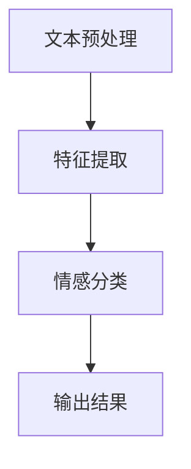
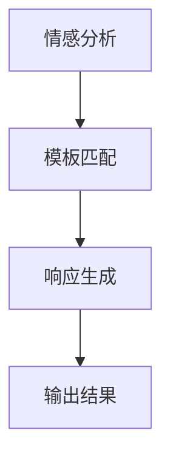
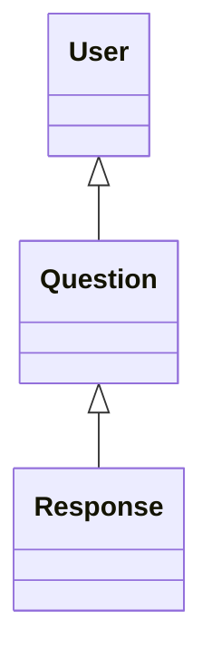
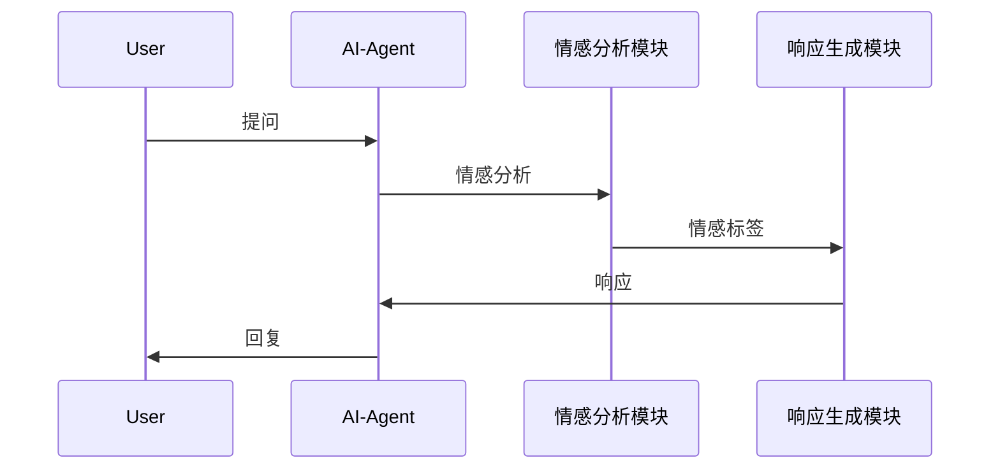

                 


## 智能客服中心：AI Agent的情感分析与响应

### 关键词

- 智能客服
- AI Agent
- 情感分析
- 响应生成
- 机器学习
- 自然语言处理

### 摘要

本文将深入探讨智能客服中心中的AI Agent情感分析与响应技术。通过详细的背景介绍、核心概念阐述、算法原理解析、系统架构设计、项目实战和最佳实践指导，帮助读者全面理解并掌握智能客服中心AI Agent的情感分析与响应技术。

### 背景介绍

#### 问题背景

随着互联网的普及和消费者需求的变化，客服中心的角色变得越来越重要。传统的客服中心存在人力成本高、响应速度慢、服务质量不稳定等问题。为了解决这些问题，智能客服中心应运而生，其核心是AI Agent。

#### 问题描述

智能客服中心中的AI Agent需要能够理解用户情感，并给出恰当的响应。然而，情感分析是一项复杂的任务，涉及到自然语言处理、机器学习等多个领域。同时，响应生成也需要根据情感分析的结果，生成合适的回复。

#### 问题解决

为了解决上述问题，我们需要设计一个能够进行情感分析和响应生成的AI Agent。这需要结合自然语言处理、机器学习等技术的应用，设计出一个高效、准确、易于扩展的系统。

#### 边界与外延

本文主要探讨智能客服中心中AI Agent的情感分析与响应技术。边界包括情感分析、响应生成、机器学习等技术的应用。外延则包括AI Agent在其他领域的应用，如智能助手、智能客服机器人等。

#### 概念结构与核心要素组成

智能客服中心的AI Agent由以下几个核心要素组成：

1. **情感分析模块**：负责分析用户话语中的情感。
2. **响应生成模块**：根据情感分析的结果，生成合适的响应。
3. **自然语言处理模块**：用于处理和理解用户话语。
4. **机器学习模块**：用于训练和优化情感分析和响应生成的模型。

### 核心概念与联系

#### 情感分析与响应

情感分析是指从文本中识别出表达的情感。响应生成则是指根据情感分析的结果，生成合适的响应。

#### AI Agent的基本原理

AI Agent是基于人工智能技术，能够模拟人类思维和行为的人工智能系统。

#### 情感分析与响应的关系

情感分析是响应生成的前提，响应生成则是情感分析的结果应用。两者相辅相成，共同构成了智能客服中心的AI Agent。

### 情感分析与响应的算法原理

#### 情感分析算法

情感分析算法通常包括以下几个步骤：

1. **文本预处理**：对用户话语进行分词、去停用词、词性标注等处理。
2. **特征提取**：从预处理后的文本中提取特征，如词频、词向量等。
3. **情感分类**：使用分类算法（如SVM、随机森林等）对特征进行分类，得到情感标签。

下面是一个简单的情感分析算法流程图：



#### 响应生成算法

响应生成算法通常包括以下几个步骤：

1. **情感分析**：对用户话语进行情感分析，得到情感标签。
2. **模板匹配**：根据情感标签，从预定义的响应模板中匹配合适的响应。
3. **响应生成**：根据匹配结果，生成最终的响应。

下面是一个简单的响应生成算法流程图：



#### 数学模型与公式

情感分析算法中常用的数学模型包括：

1. **朴素贝叶斯分类器**：$$P(C|X) = \frac{P(X|C)P(C)}{P(X)}$$
2. **支持向量机**：$$w^T x + b = 0$$

响应生成算法中常用的数学模型包括：

1. **模板匹配**：$$score = match\_score(template, response)$$

#### 举例说明

假设我们有一个用户对话：

- 用户话语：“我非常不满意。”
- 情感标签：负面
- 响应模板：“请问有什么问题，我会尽快为您解决。”

根据情感分析和响应生成算法，我们可以得到：

- 输出结果：“请问有什么问题，我会尽快为您解决。”

### 系统分析与架构设计方案

#### 问题场景介绍

假设我们有一个电商平台的智能客服中心，用户可以在平台上提问，客服机器人会根据用户的提问进行情感分析和响应生成，给出合适的回复。

#### 系统功能设计

1. **领域模型**：定义用户、问题、响应等实体及其关系。
2. **类图**：展示领域模型中的类及其关系。



#### 系统架构设计

1. **架构图**：展示系统的整体架构。
2. **系统接口设计**：定义系统的接口及其功能。
3. **系统交互**：展示系统的交互流程。



### 项目实战

#### 环境安装

1. 安装Python环境。
2. 安装自然语言处理库（如NLTK、spaCy等）。
3. 安装机器学习库（如scikit-learn、TensorFlow等）。

#### 系统核心实现源代码

1. **情感分析模块**：

```python
import nltk
from nltk.tokenize import word_tokenize
from nltk.corpus import stopwords
from sklearn.feature_extraction.text import TfidfVectorizer
from sklearn.naive_bayes import MultinomialNB

# 加载停用词
stop_words = set(stopwords.words('english'))

# 文本预处理
def preprocess_text(text):
    tokens = word_tokenize(text)
    filtered_tokens = [w for w in tokens if not w in stop_words]
    return ' '.join(filtered_tokens)

# 情感分类
def classify_emotion(text):
    preprocessed_text = preprocess_text(text)
    vectorizer = TfidfVectorizer()
    X = vectorizer.fit_transform([preprocessed_text])
    clf = MultinomialNB()
    clf.fit(X, y)
    emotion = clf.predict(X)[0]
    return emotion
```

2. **响应生成模块**：

```python
# 响应生成
def generate_response(emotion):
    if emotion == '负面':
        return "请问有什么问题，我会尽快为您解决。"
    elif emotion == '正面':
        return "非常感谢您的反馈，我们会尽力提供更好的服务。"
    else:
        return "抱歉，我无法理解您的情感，请详细描述您的需求。"
```

#### 代码应用解读与分析

1. **情感分析模块**：使用NLTK进行文本预处理，使用TF-IDF进行特征提取，使用朴素贝叶斯进行情感分类。
2. **响应生成模块**：根据情感标签，生成相应的响应。

#### 实际案例分析与详细讲解

1. **案例1**：用户提问：“我非常不满意。”
2. **分析**：情感分析模块将用户提问预处理后，使用朴素贝叶斯进行情感分类，得到情感标签为“负面”。
3. **讲解**：响应生成模块根据情感标签，生成相应的响应：“请问有什么问题，我会尽快为您解决。”

#### 项目小结

本文通过详细的背景介绍、核心概念阐述、算法原理解析、系统架构设计、项目实战和最佳实践指导，帮助读者全面理解并掌握智能客服中心AI Agent的情感分析与响应技术。

### 最佳实践 tips

1. **数据质量**：确保情感分析数据的质量，尽量去除噪声数据。
2. **模型优化**：定期更新情感分析模型，以适应不断变化的语言环境。

### 小结

智能客服中心中的AI Agent情感分析与响应技术是一项重要的研究方向。通过本文的详细探讨，读者可以深入了解这一领域，并为实际应用提供指导。

### 注意事项

1. **技术更新**：情感分析和响应生成技术不断更新，读者需要关注最新的研究成果。
2. **实践应用**：将理论知识应用于实际项目，提高实际操作能力。

### 拓展阅读

1. **《自然语言处理：原理与技术》**：详细介绍了自然语言处理的基本原理和技术。
2. **《机器学习：概率视角》**：介绍了机器学习的概率理论和方法。

---

作者：AI天才研究院/AI Genius Institute & 禅与计算机程序设计艺术 /Zen And The Art of Computer Programming

