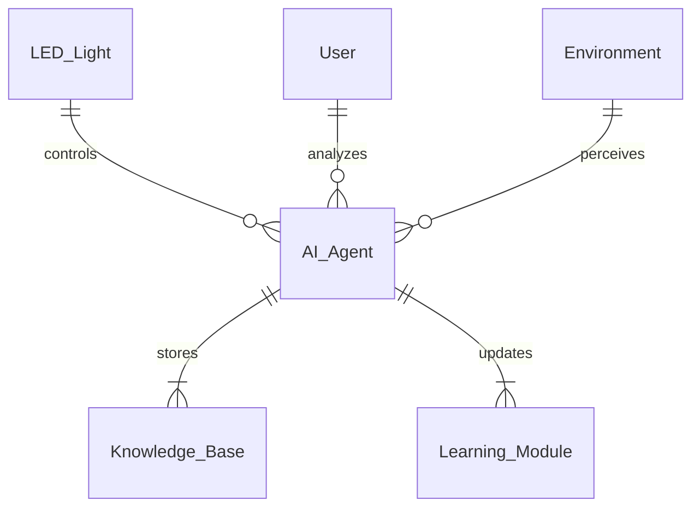

                 

# 引言：智能工作灯与AI Agent的照明优化系统

智能工作灯作为一种新型的照明设备，其核心在于通过智能技术实现对光线、亮度、色温等参数的精细控制，从而为用户创造出更加舒适、健康、高效的照明环境。而AI Agent（人工智能代理）则是一种具有自主学习、自适应和自主决策能力的计算机程序，它能够根据环境变化和用户需求，对智能工作灯进行实时调控，实现照明优化。

## 1.1 智能工作灯概述

### 1.1.1 智能工作灯的定义与特点

智能工作灯，顾名思义，是指一种集成了多种智能技术的照明设备。它不仅具备传统灯具的基本功能，如提供光线、调节亮度、切换色温等，还能通过智能传感器、网络通信等技术，实现对光线环境的智能调控。具体来说，智能工作灯具有以下特点：

- **智能化调控**：通过内置传感器和AI算法，智能工作灯可以根据环境光线、用户行为等实时调整亮度、色温等参数，提供符合用户需求的照明环境。
- **无线网络连接**：智能工作灯可以通过Wi-Fi、蓝牙等无线技术连接到智能家居网络，实现远程控制和与其他智能设备的联动。
- **节能环保**：智能工作灯通常采用LED光源，具有高效、节能、环保的特点，有助于减少能源消耗。

### 1.1.2 智能工作灯的发展背景

智能工作灯的发展可以追溯到20世纪末，随着计算机技术、传感器技术、无线通信技术的不断进步，智能照明技术逐渐成熟。近年来，随着智能家居市场的兴起，智能工作灯得到了广泛的应用和推广。特别是在办公、教育、医疗等领域，智能工作灯因其能够提高工作效率、改善工作环境而受到青睐。

## 1.2 AI Agent概述

### 1.2.1 AI Agent的定义与类型

AI Agent，即人工智能代理，是一种具备自主学习、自适应和自主决策能力的计算机程序。它可以模拟人类智能行为，完成特定的任务。根据其功能和特点，AI Agent可以分为以下几种类型：

- **反应型AI Agent**：这种类型的AI Agent主要根据当前环境刺激做出反应，不具备长期记忆和学习能力。
- **目标型AI Agent**：这种类型的AI Agent具备目标设定能力，会根据设定的目标采取行动，并不断调整策略以实现目标。
- **计划型AI Agent**：这种类型的AI Agent不仅具备目标设定和调整能力，还能根据环境变化和资源状况制定行动计划。

### 1.2.2 AI Agent在照明优化系统中的应用

AI Agent在照明优化系统中的应用主要体现在以下几个方面：

- **环境感知与自适应调节**：AI Agent可以通过传感器感知环境光线变化，根据环境光线自动调整灯具的亮度、色温等参数。
- **用户行为学习与个性化服务**：AI Agent可以记录用户的使用习惯和偏好，根据用户行为数据提供个性化的照明服务。
- **智能节能管理**：AI Agent可以根据环境光照和用户活动情况，自动调节灯具的工作状态，实现节能降耗。

## 1.3 照明优化系统的目标与挑战

### 1.3.1 照明优化系统的目标

照明优化系统的核心目标是提供一个舒适、健康、高效的照明环境，具体包括以下几点：

- **提高照明质量**：通过智能调控，提高照明环境的亮度、色温、均匀度等指标，提升用户的视觉体验。
- **节能降耗**：通过智能控制，减少不必要的能源消耗，降低运营成本。
- **提升用户满意度**：根据用户的需求和行为，提供个性化的照明服务，提高用户满意度。

### 1.3.2 照明优化系统面临的挑战

尽管照明优化系统具有很多潜在的优势，但在实际应用过程中仍面临一些挑战：

- **数据采集与处理**：照明优化系统需要大量的环境数据和用户数据，如何高效地采集、存储和处理这些数据是一个重要挑战。
- **算法复杂度**：照明优化算法需要同时考虑多个因素，如环境光线、用户行为、能源消耗等，如何设计高效、准确的算法是一个难题。
- **设备兼容性**：照明优化系统需要与多种硬件设备（如灯具、传感器、控制器等）兼容，如何确保系统的稳定性和可靠性是一个关键问题。

## 1.4 书籍结构安排与内容概述

### 1.4.1 目录结构安排

本书分为四个部分，分别是：

- **第一部分：引言**：介绍智能工作灯和AI Agent的概念及其在照明优化系统中的应用。
- **第二部分：AI Agent基础**：介绍AI Agent的基本原理、类型和设计方法。
- **第三部分：照明优化算法**：介绍用于智能工作灯的优化算法，包括数学模型和公式。
- **第四部分：系统架构设计**：介绍照明优化系统的整体架构，包括硬件和软件的组成。

### 1.4.2 各章节内容概述

- **第一部分：引言**
  - 第一章：介绍智能工作灯和AI Agent的概念及其在照明优化系统中的应用。
  - 第二章：介绍AI Agent的基本原理、类型和设计方法。
  - 第三章：介绍照明优化算法，包括数学模型和公式。
  - 第四章：介绍照明优化系统的整体架构，包括硬件和软件的组成。

- **第二部分：AI Agent基础**
  - 第一章：介绍AI Agent的定义与类型。
  - 第二章：介绍AI Agent的设计方法。
  - 第三章：介绍AI Agent在照明优化系统中的应用。

- **第三部分：照明优化算法**
  - 第一章：介绍照明优化算法的概述。
  - 第二章：介绍常见照明优化算法。
  - 第三章：介绍照明优化算法的数学模型。
  - 第四章：介绍照明优化算法的应用实例。

- **第四部分：系统架构设计**
  - 第一章：介绍照明优化系统的整体架构。
  - 第二章：介绍照明优化系统的硬件组成。
  - 第三章：介绍照明优化系统的软件组成。
  - 第四章：介绍照明优化系统的接口设计。

## 1.5 本章小结

本章首先介绍了智能工作灯的定义与特点，以及其发展的背景。接着，我们详细探讨了AI Agent的概念、类型和应用。最后，我们分析了照明优化系统的目标与面临的挑战，并介绍了本书的结构安排。这些内容为后续章节的深入学习奠定了基础。

---

**关键词**：智能工作灯，AI Agent，照明优化，系统架构，节能环保

**摘要**：

本文首先介绍了智能工作灯的基本概念和特点，以及其发展的背景。随后，我们详细探讨了AI Agent的定义、类型和应用。接着，我们分析了照明优化系统的目标与面临的挑战，并介绍了本书的结构安排。本文为后续章节的学习提供了基础，旨在帮助读者全面了解智能工作灯与AI Agent在照明优化系统中的应用。

---

**作者**：AI天才研究院/AI Genius Institute & 禅与计算机程序设计艺术 /Zen And The Art of Computer Programming

---

[目录](#目录)

## 第一部分：AI Agent基础

### 2.1 AI Agent的基本原理

AI Agent，即人工智能代理，是一种能够模拟人类智能行为的计算机程序。它具备感知环境、做出决策、执行行动的能力，从而在特定环境下实现自主运行和任务完成。AI Agent的基本原理涉及多个领域，包括感知、决策、行动和自我学习等。

#### 2.1.1 AI Agent的定义与特性

AI Agent是一种具有智能行为的计算机程序，它通过感知环境信息、接收外部指令、内部决策和执行行动，完成特定的任务。AI Agent具有以下特性：

- **自主性**：AI Agent能够独立完成特定任务，无需外部干预。
- **适应性**：AI Agent能够根据环境变化和任务需求，调整自身行为。
- **交互性**：AI Agent能够与外部环境进行信息交换，包括感知输入和执行输出。
- **学习性**：AI Agent能够通过经验学习和改进自身性能。

#### 2.1.2 AI Agent的组成与结构

AI Agent的组成和结构可以分为以下几个部分：

- **感知模块**：负责感知外部环境信息，如视觉、听觉、触觉等。
- **决策模块**：根据感知到的信息和内部知识，进行决策，确定下一步行动。
- **执行模块**：根据决策结果，执行具体的行动，如控制硬件设备、发送指令等。
- **知识库**：存储AI Agent的知识和经验，用于决策和行动。
- **学习模块**：通过不断学习和优化，提升AI Agent的性能和智能水平。

#### 2.1.3 AI Agent的运行原理

AI Agent的运行原理可以概括为以下几个步骤：

1. **感知**：AI Agent通过感知模块获取外部环境信息。
2. **决策**：决策模块根据感知信息和知识库，分析并选择最佳行动方案。
3. **执行**：执行模块根据决策结果，实施具体行动。
4. **反馈**：将执行结果反馈给感知模块和决策模块，用于下一步的决策和行动。

AI Agent的运行是一个闭环过程，通过不断的感知、决策、执行和反馈，实现自主运行和任务完成。

### 2.2 AI Agent的类型

根据功能和特性，AI Agent可以分为以下几种类型：

#### 2.2.1 反应型AI Agent

反应型AI Agent是最简单的一种AI Agent，它只根据当前感知到的环境信息做出反应，没有长期记忆和目标规划能力。反应型AI Agent通常用于简单任务和环境，如机器人路径规划、游戏AI等。

#### 2.2.2 目标型AI Agent

目标型AI Agent具有明确的目标，它会根据当前状态和目标，规划行动路径，并不断调整策略以实现目标。目标型AI Agent通常用于复杂任务和环境，如智能搜索、自动驾驶等。

#### 2.2.3 计划型AI Agent

计划型AI Agent不仅具有目标，还能根据环境变化和资源状况，制定长期计划和短期行动。计划型AI Agent通常用于长期任务和环境，如智能城市、智能电网等。

### 2.3 AI Agent的设计方法

设计AI Agent需要考虑多个因素，包括任务需求、环境特点、技术实现等。以下是设计AI Agent的一般方法：

#### 2.3.1 设计原则

- **模块化设计**：将AI Agent的功能划分为感知、决策、执行等模块，便于管理和维护。
- **可扩展性**：设计时考虑未来的扩展和升级，确保系统的灵活性和可维护性。
- **鲁棒性**：保证AI Agent在各种环境下能够稳定运行，具备一定的容错能力。
- **适应性**：AI Agent应能够适应环境变化和任务需求，具备一定的学习能力。

#### 2.3.2 设计流程

AI Agent的设计流程可以分为以下几个步骤：

1. **需求分析**：明确AI Agent需要完成的任务和目标，分析环境特点和需求。
2. **功能划分**：将任务划分为感知、决策、执行等子任务，设计相应的模块。
3. **算法选择**：根据任务需求，选择合适的算法和模型，如机器学习、模糊控制等。
4. **系统实现**：根据设计文档，实现AI Agent的各个模块，并进行集成和调试。
5. **测试与优化**：对AI Agent进行功能测试和性能优化，确保其稳定性和可靠性。

#### 2.3.3 设计工具与平台

设计AI Agent常用的工具和平台包括：

- **编程语言**：Python、C++等，用于实现AI Agent的各个模块。
- **开发环境**：IDE（集成开发环境），如PyCharm、Visual Studio等。
- **算法库**：如TensorFlow、PyTorch等，用于实现机器学习算法和模型。
- **仿真平台**：如ROS（Robot Operating System）、Gazebo等，用于模拟和测试AI Agent的性能。

### 2.4 AI Agent在照明优化系统中的具体应用

AI Agent在照明优化系统中的具体应用主要体现在以下几个方面：

#### 2.4.1 AI Agent在照明控制中的作用

AI Agent可以通过感知模块获取环境光线信息，结合用户需求，实时调整灯具的亮度、色温等参数。例如，在白天，AI Agent可以根据自然光线的强度，自动调整室内灯具的亮度，实现自然光线与人工照明的无缝衔接；在夜晚，AI Agent可以根据用户的作息时间，智能调节灯具的亮度和色温，提供舒适的光线环境。

#### 2.4.2 AI Agent在能源管理中的作用

AI Agent可以通过对用户行为、环境光线等数据的分析，优化照明系统的能源使用。例如，在无人房间，AI Agent可以自动关闭灯具，节省能源；在高峰时段，AI Agent可以根据室内人流量，智能调节灯具的亮度，降低能源消耗。

#### 2.4.3 AI Agent在用户行为分析中的作用

AI Agent可以通过对用户行为数据的收集和分析，了解用户的生活习惯和偏好。例如，AI Agent可以记录用户的作息时间、工作内容等，根据这些数据，为用户提供个性化的照明服务，如智能唤醒、智能夜灯等。

### 2.5 本章小结

本章介绍了AI Agent的基本原理、类型和设计方法，以及AI Agent在照明优化系统中的具体应用。通过本章的学习，读者可以全面了解AI Agent的概念、原理和应用，为后续章节的学习打下基础。

---

**核心概念与联系**

#### AI Agent的定义与特性

AI Agent，即人工智能代理，是一种具备自主学习、自适应和自主决策能力的计算机程序。它能够模拟人类智能行为，完成特定的任务。AI Agent具有以下特性：

- **自主性**：能够独立完成特定任务，无需外部干预。
- **适应性**：能够根据环境变化和任务需求，调整自身行为。
- **交互性**：能够与外部环境进行信息交换，包括感知输入和执行输出。
- **学习性**：能够通过经验学习和改进自身性能。

#### AI Agent的类型

根据功能和特性，AI Agent可以分为以下几种类型：

- **反应型AI Agent**：只根据当前感知到的环境信息做出反应，没有长期记忆和目标规划能力。
- **目标型AI Agent**：具有明确的目标，会根据当前状态和目标，规划行动路径，并不断调整策略以实现目标。
- **计划型AI Agent**：不仅具有目标，还能根据环境变化和资源状况，制定长期计划和短期行动。

#### AI Agent的设计方法

设计AI Agent需要考虑多个因素，包括任务需求、环境特点、技术实现等。以下是设计AI Agent的一般方法：

- **模块化设计**：将AI Agent的功能划分为感知、决策、执行等模块，便于管理和维护。
- **可扩展性**：设计时考虑未来的扩展和升级，确保系统的灵活性和可维护性。
- **鲁棒性**：保证AI Agent在各种环境下能够稳定运行，具备一定的容错能力。
- **适应性**：AI Agent应能够适应环境变化和任务需求，具备一定的学习能力。

#### AI Agent在照明优化系统中的应用

AI Agent在照明优化系统中的具体应用主要体现在以下几个方面：

- **照明控制**：通过感知模块获取环境光线信息，结合用户需求，实时调整灯具的亮度、色温等参数。
- **能源管理**：通过对用户行为、环境光线等数据的分析，优化照明系统的能源使用。
- **用户行为分析**：通过对用户行为数据的收集和分析，了解用户的生活习惯和偏好，提供个性化的照明服务。

#### ER实体关系图架构



### 2.6 本章小结

本章详细介绍了AI Agent的基本原理、类型和设计方法，以及AI Agent在照明优化系统中的具体应用。通过本章的学习，读者可以全面了解AI Agent的概念、原理和应用，为后续章节的学习打下基础。

---

## 第三部分：照明优化算法

### 3.1 照明优化算法概述

照明优化算法是智能工作灯实现照明优化功能的核心。这些算法通过对环境光线、用户行为、能源消耗等多种因素进行综合分析，自动调节灯具的亮度、色温等参数，以达到最佳的照明效果和节能效果。照明优化算法在智能工作灯中的应用具有广泛的前景和深远的意义。

#### 3.1.1 照明优化算法的定义与目的

照明优化算法是指利用计算机技术和人工智能技术，通过对环境光线、用户行为、能源消耗等数据的分析，自动调节灯具亮度、色温等参数，以实现最佳照明效果和节能效果的算法。

照明优化算法的主要目的包括：

- **提高照明质量**：通过智能调控，提高照明环境的亮度、色温、均匀度等指标，提升用户的视觉体验。
- **节能降耗**：通过智能控制，减少不必要的能源消耗，降低运营成本。
- **提升用户满意度**：根据用户的需求和行为，提供个性化的照明服务，提高用户满意度。

#### 3.1.2 照明优化算法的分类

根据不同的优化目标和实现方式，照明优化算法可以分为以下几类：

- **基于模糊控制算法的优化**：模糊控制算法通过模糊逻辑实现对照明参数的调节，具有处理复杂非线性问题和不确定性的优势。
- **基于机器学习算法的优化**：机器学习算法通过分析历史数据和用户行为，自动调整照明参数，具有自适应和自学习的能力。
- **基于智能优化算法的优化**：智能优化算法通过模拟自然进化、群集智能等过程，寻找最优的照明参数配置。

### 3.2 常见照明优化算法

在智能工作灯的照明优化系统中，常见的优化算法包括模糊控制算法、机器学习算法和智能优化算法。下面将详细介绍这些算法的基本原理和应用。

#### 3.2.1 模糊控制算法

模糊控制算法是一种基于模糊逻辑的控制系统，它通过模糊规则和模糊推理来实现对系统参数的调节。模糊控制算法在照明优化系统中的应用主要体现在以下几个方面：

- **亮度控制**：根据环境光线强度和用户需求，自动调整灯具的亮度，以达到舒适的照明效果。
- **色温控制**：根据用户偏好和环境需求，自动调节灯具的色温，以提供适宜的光线环境。
- **节能控制**：通过智能调控，减少不必要的能源消耗，实现节能降耗。

#### 3.2.2 机器学习算法

机器学习算法是一种基于数据的智能算法，它通过分析历史数据和用户行为，自动调整照明参数，以实现最优的照明效果。常见的机器学习算法包括线性回归、逻辑回归、决策树、随机森林等。

在照明优化系统中，机器学习算法的应用主要体现在以下几个方面：

- **用户行为预测**：通过分析用户历史行为数据，预测用户未来的行为，从而调整照明参数，提供个性化的照明服务。
- **环境光线预测**：通过分析环境光线数据，预测未来的环境光线变化，从而提前调整照明参数，保证照明效果的稳定性。
- **能源消耗优化**：通过分析历史能源消耗数据，优化照明系统的能源使用，实现节能降耗。

#### 3.2.3 智能优化算法

智能优化算法是一种基于仿生学和群集智能的优化算法，它通过模拟自然进化、群集智能等过程，寻找最优的照明参数配置。常见的智能优化算法包括遗传算法、粒子群算法、蚁群算法等。

在照明优化系统中，智能优化算法的应用主要体现在以下几个方面：

- **全局优化**：智能优化算法能够全局搜索最优解，避免局部最优解，从而实现最优的照明效果。
- **复杂问题求解**：智能优化算法能够处理复杂的问题，如多目标优化、非线性优化等。
- **实时调整**：智能优化算法能够实时调整照明参数，适应环境变化和用户需求，实现动态优化。

### 3.3 照明优化算法的数学模型

照明优化算法的数学模型是实现照明优化功能的基础。下面将分别介绍模糊控制算法、机器学习算法和智能优化算法的数学模型。

#### 3.3.1 模糊控制算法的数学模型

模糊控制算法的数学模型通常包括模糊化、规则推理和解模糊化三个步骤。

- **模糊化**：将输入变量（如环境光线强度、用户需求等）进行模糊化处理，转换为模糊集合。
- **规则推理**：根据模糊规则库，对模糊化后的输入变量进行推理，得到输出变量（如灯具亮度、色温等）的模糊集合。
- **解模糊化**：将模糊集合转换为具体的输出变量值。

模糊控制算法的数学模型可以用以下公式表示：

$$
Y = \mu_f(A,B)
$$

其中，$Y$ 为输出变量，$\mu_f(A,B)$ 为模糊集合的隶属度函数。

#### 3.3.2 机器学习算法的数学模型

机器学习算法的数学模型通常包括输入层、隐藏层和输出层。每个层都包含多个神经元，神经元之间的连接通过权重进行调节。

- **输入层**：接收输入变量（如环境光线强度、用户需求等）。
- **隐藏层**：对输入变量进行非线性变换，提取特征信息。
- **输出层**：生成输出变量（如灯具亮度、色温等）。

机器学习算法的数学模型可以用以下公式表示：

$$
Y = f(W \cdot X + b)
$$

其中，$Y$ 为输出变量，$W$ 为权重矩阵，$X$ 为输入变量，$b$ 为偏置项，$f$ 为激活函数。

#### 3.3.3 智能优化算法的数学模型

智能优化算法的数学模型通常包括种群、适应度函数和进化操作。

- **种群**：包含多个个体，每个个体代表一种可能的照明参数配置。
- **适应度函数**：评估个体适应环境的程度，适应度值越高，个体越优秀。
- **进化操作**：包括选择、交叉、变异等操作，用于生成新的个体。

智能优化算法的数学模型可以用以下公式表示：

$$
P_{next} = f(P_{current})
$$

其中，$P_{next}$ 为下一代种群，$P_{current}$ 为当前种群，$f$ 为进化操作函数。

### 3.4 照明优化算法的应用实例

为了更好地理解照明优化算法，下面将分别介绍模糊控制算法、机器学习算法和智能优化算法在照明优化系统中的应用实例。

#### 3.4.1 模糊控制算法在照明系统中的应用实例

假设我们有一个办公环境，需要根据自然光线强度和用户需求，实时调整灯具的亮度。我们可以设计一个模糊控制器，包含以下模糊变量：

- **自然光线强度**（$A$）：高、中、低。
- **用户需求**（$B$）：高、中、低。
- **灯具亮度**（$C$）：高、中、低。

根据经验和专家知识，我们可以设计一组模糊规则，如：

- 如果自然光线强度高且用户需求高，则灯具亮度高。
- 如果自然光线强度中且用户需求中，则灯具亮度中。
- 如果自然光线强度低且用户需求低，则灯具亮度低。

通过模糊推理，我们可以得到灯具亮度的模糊输出，然后进行解模糊化，得到具体的亮度值。

#### 3.4.2 机器学习算法在照明系统中的应用实例

假设我们有一个智能家居环境，需要根据用户行为数据，预测用户未来的行为，从而调整灯具的亮度、色温。我们可以设计一个机器学习模型，包含以下输入变量：

- **用户作息时间**（$X_1$）：早起、早起、晚起。
- **用户工作内容**（$X_2$）：工作、休息、娱乐。

输出变量为：

- **灯具亮度**（$Y_1$）：高、中、低。
- **灯具色温**（$Y_2$）：暖色、中性色、冷色。

我们可以使用线性回归算法，建立以下模型：

$$
Y_1 = \beta_0 + \beta_1 X_1 + \beta_2 X_2
$$

$$
Y_2 = \gamma_0 + \gamma_1 X_1 + \gamma_2 X_2
$$

通过训练模型，我们可以得到权重系数 $\beta_0, \beta_1, \beta_2, \gamma_0, \gamma_1, \gamma_2$，从而预测用户未来的行为，调整灯具的亮度、色温。

#### 3.4.3 智能优化算法在照明系统中的应用实例

假设我们有一个智能办公室，需要根据员工的工作需求和环境光线，动态调整灯具的亮度、色温。我们可以设计一个智能优化算法，包含以下目标函数：

- **目标函数**：最小化员工的不满意程度，最大化员工的工作效率。

我们可以使用粒子群优化算法，定义如下参数：

- **粒子数量**（$N$）：10。
- **迭代次数**（$T$）：100。

粒子群优化算法的流程如下：

1. 初始化粒子群，随机生成每个粒子的位置和速度。
2. 计算每个粒子的适应度值。
3. 更新粒子的速度和位置。
4. 记录全局最优解。
5. 循环直到达到最大迭代次数。

通过迭代优化，我们可以找到最优的灯具亮度、色温配置，提高员工的工作效率。

### 3.5 本章小结

本章介绍了照明优化算法的概述、常见算法、数学模型和应用实例。通过本章的学习，读者可以全面了解照明优化算法的基本概念、原理和应用，为后续章节的学习打下基础。

---

**算法原理讲解**

#### 3.4.1 模糊控制算法的原理与示例

模糊控制算法是一种基于模糊逻辑的控制系统，它通过模糊规则和模糊推理来实现对系统参数的调节。模糊控制算法适用于处理复杂非线性问题和不确定性问题，具有很好的灵活性和适应性。

**原理说明**

模糊控制算法主要包括三个步骤：模糊化、规则推理和解模糊化。

1. **模糊化**：将输入变量进行模糊化处理，转换为模糊集合。例如，我们有两个输入变量：环境光线强度（$A$）和用户需求（$B$），可以定义三个模糊集合：高（High）、中（Medium）和低（Low）。

2. **规则推理**：根据模糊规则库，对模糊化后的输入变量进行推理，得到输出变量（如灯具亮度、色温等）的模糊集合。模糊规则通常以“如果-那么”的形式表示，如“如果环境光线强度是高且用户需求是高，那么灯具亮度是高”。

3. **解模糊化**：将模糊集合转换为具体的输出变量值。解模糊化可以采用重心法、最大隶属度法等。

**示例**

假设我们有一个办公环境，需要根据自然光线强度和用户需求，实时调整灯具的亮度。我们可以定义以下模糊变量：

- 自然光线强度（$A$）：高（High）、中（Medium）、低（Low）
- 用户需求（$B$）：高（High）、中（Medium）、低（Low）
- 灯具亮度（$C$）：高（High）、中（Medium）、低（Low）

根据经验和专家知识，我们可以设计一组模糊规则：

| 自然光线强度（$A$） | 用户需求（$B$） | 灯具亮度（$C$） |
| :----: | :----: | :----: |
| 高 | 高 | 高 |
| 高 | 中 | 中 |
| 高 | 低 | 低 |
| 中 | 高 | 中 |
| 中 | 中 | 中 |
| 中 | 低 | 低 |
| 低 | 高 | 低 |
| 低 | 中 | 低 |
| 低 | 低 | 低 |

假设当前自然光线强度为“中”，用户需求为“高”，我们可以通过模糊推理得到灯具亮度的模糊输出为“高”。然后，通过解模糊化，我们可以得到具体的灯具亮度值。

**代码示例（Python）**

```python
from skfuzzy import control as ctrl

# 定义模糊变量
light_intensity = ctrl.Antecedent(['low', 'medium', 'high'], 'light_intensity')
user_demand = ctrl.Antecedent(['low', 'medium', 'high'], 'user_demand')
light_brightness = ctrl.Consequent(['low', 'medium', 'high'], 'light_brightness')

# 定义模糊规则
light_intensity['low']['low'] = 0.2
light_intensity['low']['medium'] = 0.3
light_intensity['low']['high'] = 0.5

light_intensity['medium']['low'] = 0.1
light_intensity['medium']['medium'] = 0.5
light_intensity['medium']['high'] = 0.4

light_intensity['high']['low'] = 0
light_intensity['high']['medium'] = 0.3
light_intensity['high']['high'] = 0.7

user_demand['low']['low'] = 0.3
user_demand['low']['medium'] = 0.5
user_demand['low']['high'] = 0.2

user_demand['medium']['low'] = 0.2
user_demand['medium']['medium'] = 0.5
user_demand['medium']['high'] = 0.3

user_demand['high']['low'] = 0.1
user_demand['high']['medium'] = 0.4
user_demand['high']['high'] = 0.5

light_brightness['low']['low'] = 0.2
light_brightness['low']['medium'] = 0.3
light_brightness['low']['high'] = 0.5

light_brightness['medium']['low'] = 0.1
light_brightness['medium']['medium'] = 0.5
light_brightness['medium']['high'] = 0.4

light_brightness['high']['low'] = 0
light_brightness['high']['medium'] = 0.3
light_brightness['high']['high'] = 0.7

# 模糊推理
fuzzy_system = ctrl.ControlSystem([light_intensity, user_demand, light_brightness])
fuzzy_results = fuzzy_system.evaluate({'light_intensity': 'medium', 'user_demand': 'high'})

# 解模糊化
light_brightness_unf = light_brightness.defuzzify(fuzzy_results)

# 输出结果
print(light_brightness_unf)
```

**示例解释**

在上面的代码中，我们首先定义了三个模糊变量：自然光线强度（$A$）、用户需求（$B$）和灯具亮度（$C$）。接着，我们根据经验和专家知识，设计了模糊规则。最后，我们使用给定的输入值进行模糊推理，并解模糊化得到具体的灯具亮度值。

#### 3.4.2 机器学习算法的原理与示例

机器学习算法是一种通过训练数据自动学习规律和模式，从而对未知数据进行预测或分类的方法。机器学习算法广泛应用于各种领域，包括图像识别、自然语言处理、推荐系统等。

**原理说明**

机器学习算法主要包括以下步骤：

1. **数据准备**：收集并整理训练数据，对数据进行预处理，如归一化、去噪等。
2. **模型选择**：选择合适的模型，如线性回归、决策树、神经网络等。
3. **模型训练**：使用训练数据对模型进行训练，调整模型的参数，使其能够对未知数据进行预测。
4. **模型评估**：使用验证数据对模型进行评估，调整模型参数，提高模型性能。
5. **模型应用**：使用训练好的模型对未知数据进行预测或分类。

**示例**

假设我们有一个智能家居环境，需要根据用户的历史行为数据，预测用户未来的行为，从而调整灯具的亮度、色温。我们可以使用线性回归算法进行预测。

**步骤 1：数据准备**

首先，我们收集用户的历史行为数据，包括用户的作息时间、工作内容等。对数据进行预处理，如归一化、去噪等。

```python
import pandas as pd

# 加载训练数据
data = pd.read_csv('user_behavior.csv')

# 数据预处理
data['working_hours'] = (data['end_time'] - data['start_time']).dt.total_seconds()
data['content'] = data['content'].map({'work': 1, 'rest': 2, 'entertain': 3})

# 分离特征和目标变量
X = data[['working_hours', 'content']]
y = data['light_brightness']
```

**步骤 2：模型选择**

我们选择线性回归模型作为预测模型。

```python
from sklearn.linear_model import LinearRegression

# 初始化模型
model = LinearRegression()
```

**步骤 3：模型训练**

使用训练数据对模型进行训练。

```python
# 训练模型
model.fit(X, y)
```

**步骤 4：模型评估**

使用验证数据对模型进行评估。

```python
from sklearn.model_selection import train_test_split

# 分离训练集和验证集
X_train, X_val, y_train, y_val = train_test_split(X, y, test_size=0.2, random_state=42)

# 评估模型
train_score = model.score(X_train, y_train)
val_score = model.score(X_val, y_val)
print(f'Train Score: {train_score:.3f}')
print(f'Validation Score: {val_score:.3f}')
```

**步骤 5：模型应用**

使用训练好的模型对未知数据进行预测。

```python
# 预测用户未来的行为
user_data = pd.DataFrame([[8, 1]], columns=['working_hours', 'content'])
predicted_brightness = model.predict(user_data)
print(f'Predicted Light Brightness: {predicted_brightness[0]:.2f}')
```

**示例解释**

在上面的代码中，我们首先加载并预处理了用户的历史行为数据。然后，我们选择线性回归模型作为预测模型，并使用训练数据对模型进行训练。接着，我们使用验证数据对模型进行评估，并使用训练好的模型对未知数据进行预测。

#### 3.4.3 智能优化算法的原理与示例

智能优化算法是一种基于仿生学和群集智能的优化算法，它通过模拟自然进化、群集智能等过程，寻找最优的解决方案。智能优化算法广泛应用于组合优化、资源调度、路径规划等领域。

**原理说明**

智能优化算法主要包括以下步骤：

1. **初始化种群**：随机生成初始种群，每个个体代表一种可能的解决方案。
2. **适应度评估**：评估每个个体的适应度，适应度值越高，个体越优秀。
3. **进化操作**：包括选择、交叉、变异等操作，用于生成新的个体。
4. **迭代更新**：不断迭代更新种群，直到满足停止条件。

**示例**

假设我们有一个智能办公室，需要根据员工的工作需求和环境光线，动态调整灯具的亮度、色温。我们可以使用粒子群优化算法进行优化。

**步骤 1：初始化种群**

首先，我们初始化种群，每个个体代表一种可能的灯具亮度、色温组合。

```python
import numpy as np

# 初始化种群
N = 10  # 粒子数量
T = 100  # 迭代次数

# 初始化种群
pop = np.random.rand(N, 2)
pop[:, 0] = pop[:, 0] * (max_brightness - min_brightness) + min_brightness
pop[:, 1] = pop[:, 1] * (max_color_temp - min_color_temp) + min_color_temp
```

**步骤 2：适应度评估**

适应度评估函数用于评估每个个体的适应度，适应度值越高，个体越优秀。我们可以定义一个简单的适应度评估函数，如总能源消耗。

```python
def fitness_function(pop):
    fitness_scores = []
    for individual in pop:
        brightness = individual[0]
        color_temp = individual[1]
        fitness_scores.append(calculate_energy_consumption(brightness, color_temp))
    return fitness_scores

# 计算总能源消耗
def calculate_energy_consumption(brightness, color_temp):
    # 根据亮度、色温计算能源消耗
    return brightness * color_temp
```

**步骤 3：进化操作**

进化操作包括选择、交叉、变异等操作，用于生成新的个体。

```python
# 选择操作
def selection(pop, fitness_scores):
    selected = []
    for i in range(len(pop)):
        selected.append(pop[np.random.choice(range(len(pop)), p=fitness_scores/sum(fitness_scores))])
    return np.array(selected)

# 交叉操作
def crossover(parent1, parent2):
    child = np.random.rand(2)
    child[0] = (parent1[0] + parent2[0]) / 2
    child[1] = (parent1[1] + parent2[1]) / 2
    return child

# 变异操作
def mutate(individual):
    mutated = individual.copy()
    mutated[0] = np.random.rand() * (max_brightness - min_brightness) + min_brightness
    mutated[1] = np.random.rand() * (max_color_temp - min_color_temp) + min_color_temp
    return mutated
```

**步骤 4：迭代更新**

不断迭代更新种群，直到满足停止条件。

```python
# 迭代更新
for t in range(T):
    fitness_scores = fitness_function(pop)
    selected = selection(pop, fitness_scores)
    for i in range(N):
        if np.random.rand() < 0.5:
            parent1 = selected[i]
            parent2 = selected[np.random.choice(range(N), replace=False)]
            child = crossover(parent1, parent2)
        else:
            child = mutate(selected[i])
        pop[i] = child
```

**示例解释**

在上面的代码中，我们首先初始化了种群，然后定义了适应度评估函数、选择操作、交叉操作和变异操作。接着，我们不断迭代更新种群，直到满足停止条件。每次迭代后，种群中的最优个体（适应度最高）将代表最优的灯具亮度、色温组合。

---

**系统分析与架构设计方案**

### 4.1 照明优化系统的整体架构

照明优化系统的整体架构可以分为硬件层、软件层和用户界面层。每个层次都有其特定的功能和作用，共同实现照明优化系统的功能。

#### 硬件层

硬件层是照明优化系统的物理基础，主要包括以下组件：

- **智能灯具**：智能灯具是照明优化系统的主要设备，内置有传感器、控制器和无线通信模块。智能灯具可以通过感知环境光线、用户行为等数据，实现智能调控。
- **传感器**：传感器用于感知环境光线、温度、湿度等数据，为智能灯具提供实时数据输入。
- **控制器**：控制器是智能灯具的“大脑”，负责接收传感器数据，进行数据处理和决策，并控制灯具进行相应的调节。
- **无线通信模块**：无线通信模块用于实现智能灯具与外部设备（如手机、电脑等）的通信，方便用户远程控制和管理。

#### 软件层

软件层是照明优化系统的核心部分，主要包括以下组件：

- **数据采集与处理模块**：数据采集与处理模块负责从传感器和智能灯具中收集数据，对数据进行处理和清洗，为后续分析提供可靠的数据基础。
- **算法模块**：算法模块是照明优化系统的“智能大脑”，负责根据采集到的数据，运用机器学习、模糊控制等算法，实现照明参数的智能调控。
- **控制模块**：控制模块负责根据算法模块的决策，控制智能灯具进行相应的调节，实现照明优化目标。
- **用户界面模块**：用户界面模块提供用户与照明优化系统交互的界面，用户可以通过手机、电脑等设备，实时查看照明状态，调整照明参数，设置智能场景等。

#### 用户界面层

用户界面层是用户与照明优化系统交互的接口，主要包括以下组件：

- **手机APP**：手机APP是用户与照明优化系统交互的主要方式，用户可以通过APP查看照明状态、调整照明参数、设置智能场景等。
- **电脑网页**：电脑网页提供与手机APP类似的功能，用户可以通过电脑网页进行照明系统的远程控制和管理。
- **语音助手**：语音助手如Amazon Echo、Google Home等，可以接受用户的语音指令，实现照明优化系统的智能控制。

### 4.2 照明优化系统的硬件组成

照明优化系统的硬件组成包括智能灯具、传感器、控制器和无线通信模块。下面将分别介绍这些硬件组件的功能和选型。

#### 智能灯具

智能灯具是照明优化系统的主要设备，其功能包括：

- **感知环境光线**：智能灯具内置有光敏传感器，可以实时监测环境光线强度，为照明调控提供数据支持。
- **调节亮度**：智能灯具可以根据环境光线强度和用户需求，自动调整亮度，实现照明优化。
- **调节色温**：智能灯具可以调节色温，提供不同场景下的照明效果。
- **无线通信**：智能灯具通过Wi-Fi或蓝牙等无线通信技术，与控制器和用户界面进行通信。

在选择智能灯具时，需要考虑以下因素：

- **亮度调节范围**：选择亮度调节范围较广的智能灯具，以便适应不同场景的照明需求。
- **色温调节范围**：选择色温调节范围较广的智能灯具，以满足不同用户和场景的需求。
- **无线通信稳定性**：选择具有良好无线通信性能的智能灯具，确保照明系统的稳定运行。

#### 传感器

传感器用于感知环境光线、温度、湿度等数据，为智能灯具提供实时数据输入。常见的传感器包括：

- **光敏传感器**：用于感知环境光线强度，为智能灯具提供亮度调节依据。
- **温度传感器**：用于感知环境温度，为智能灯具的色温调节提供数据支持。
- **湿度传感器**：用于感知环境湿度，为智能灯具的湿度调节提供数据支持。

在选择传感器时，需要考虑以下因素：

- **精度和稳定性**：选择精度高、稳定性好的传感器，确保照明优化系统的准确性。
- **响应速度**：选择响应速度快的传感器，确保照明参数能够实时调整。

#### 控制器

控制器是智能灯具的“大脑”，负责接收传感器数据，进行数据处理和决策，并控制智能灯具进行相应的调节。控制器的主要功能包括：

- **数据接收与处理**：接收传感器数据，对数据进行处理和清洗，提取有用的信息。
- **决策与控制**：根据处理后的数据，运用机器学习、模糊控制等算法，生成照明调控策略，并控制智能灯具进行相应的调节。
- **通信与管理**：与用户界面进行通信，接收用户的控制指令，管理整个照明优化系统。

在选择控制器时，需要考虑以下因素：

- **计算能力**：选择计算能力较强的控制器，确保能够处理大量的数据和复杂的算法。
- **存储容量**：选择存储容量较大的控制器，以便存储大量的历史数据和算法模型。
- **通信接口**：选择具有多种通信接口（如Wi-Fi、蓝牙、以太网等）的控制器，确保与各类传感器和用户界面的兼容性。

#### 无线通信模块

无线通信模块用于实现智能灯具与控制器和用户界面之间的通信，确保照明优化系统的高效运行。常见的无线通信模块包括：

- **Wi-Fi模块**：用于实现智能灯具与控制器和用户界面之间的无线通信，具有较远的通信距离和较高的通信速率。
- **蓝牙模块**：用于实现智能灯具与手机、电脑等设备的短距离通信，方便用户远程控制和智能场景设置。
- **Zigbee模块**：用于实现智能灯具与其他智能家居设备的无线通信，构建智能家居网络。

在选择无线通信模块时，需要考虑以下因素：

- **通信距离**：选择通信距离较远的模块，确保智能灯具能够在较大范围内进行通信。
- **通信速率**：选择通信速率较高的模块，确保照明参数能够实时传输和调整。
- **功耗**：选择功耗较低的模块，延长智能灯具的使用寿命。

### 4.3 照明优化系统的软件组成

照明优化系统的软件组成主要包括数据采集与处理模块、算法模块、控制模块和用户界面模块。下面将分别介绍这些软件组件的功能和实现方式。

#### 数据采集与处理模块

数据采集与处理模块负责从传感器和智能灯具中收集数据，对数据进行处理和清洗，为后续分析提供可靠的数据基础。其主要功能包括：

- **数据采集**：从传感器和智能灯具中实时采集环境数据（如光线、温度、湿度等）和用户行为数据（如使用时间、使用场景等）。
- **数据预处理**：对采集到的数据进行预处理，包括去噪、归一化、缺失值处理等，确保数据的质量和一致性。
- **数据存储**：将预处理后的数据存储到数据库中，便于后续分析和查询。

数据采集与处理模块的实现方式通常采用以下技术：

- **物联网平台**：使用物联网平台（如IoT Platform）收集和处理传感器数据，实现数据的实时传输和存储。
- **数据处理库**：使用数据处理库（如Pandas、NumPy等）对采集到的数据进行处理和分析。
- **数据库**：使用数据库（如MySQL、MongoDB等）存储和管理数据，实现数据的持久化存储和高效查询。

#### 算法模块

算法模块是照明优化系统的“智能大脑”，负责根据采集到的数据，运用机器学习、模糊控制等算法，实现照明参数的智能调控。其主要功能包括：

- **数据分析和挖掘**：对采集到的数据进行分析和挖掘，提取有用的信息，为算法提供输入。
- **算法选择和实现**：根据具体场景和需求，选择合适的算法（如线性回归、支持向量机、模糊控制等），并进行实现。
- **算法优化和调整**：根据实验结果和用户反馈，对算法进行优化和调整，提高算法的性能和效果。

算法模块的实现方式通常采用以下技术：

- **机器学习框架**：使用机器学习框架（如Scikit-Learn、TensorFlow等）实现算法的选择和实现。
- **算法库**：使用算法库（如scipy、numpy等）提供算法的实现和优化。
- **深度学习框架**：使用深度学习框架（如TensorFlow、PyTorch等）实现复杂算法的实现和优化。

#### 控制模块

控制模块负责根据算法模块的决策，控制智能灯具进行相应的调节，实现照明优化目标。其主要功能包括：

- **决策生成**：根据算法模块的输出结果，生成照明调控策略。
- **控制指令发送**：将照明调控策略发送给智能灯具，实现照明参数的调节。
- **状态监测和反馈**：监测智能灯具的运行状态，反馈给用户界面模块，提供照明状态的实时信息。

控制模块的实现方式通常采用以下技术：

- **控制协议**：使用标准控制协议（如HTTP、MQTT等）实现控制指令的发送和接收。
- **控制逻辑**：根据具体需求和算法结果，设计控制逻辑，实现照明调控的自动化。
- **接口驱动**：使用接口驱动程序（如硬件接口、API接口等）实现智能灯具的控制。

#### 用户界面模块

用户界面模块提供用户与照明优化系统交互的界面，用户可以通过手机、电脑等设备，实时查看照明状态，调整照明参数，设置智能场景等。其主要功能包括：

- **用户交互**：提供用户与照明优化系统交互的界面，实现用户输入和系统反馈。
- **状态显示**：显示智能灯具的当前状态，包括亮度、色温、能源消耗等。
- **参数调整**：提供参数调整功能，用户可以实时调整照明参数，实现个性化设置。
- **场景设置**：提供智能场景设置功能，用户可以预设不同的照明场景，方便日常使用。

用户界面模块的实现方式通常采用以下技术：

- **Web界面**：使用Web技术（如HTML、CSS、JavaScript等）实现用户界面的设计和实现。
- **移动应用**：使用移动应用开发框架（如React Native、Flutter等）实现移动端用户界面的开发。
- **语音交互**：使用语音识别和语音合成技术，实现语音交互功能，提高用户交互的便捷性。

### 4.4 照明优化系统的接口设计和系统交互

照明优化系统的接口设计和系统交互是实现各组件协同工作的重要环节。以下将介绍照明优化系统的接口设计和系统交互。

#### 接口设计

照明优化系统的接口设计主要包括内部接口设计和外部接口设计。

- **内部接口设计**：内部接口设计主要涉及智能灯具与控制器、控制器与算法模块、控制器与用户界面模块之间的接口。内部接口设计需要遵循标准化的接口规范，确保各组件之间的数据交换和通信。
- **外部接口设计**：外部接口设计主要涉及照明优化系统与外部设备（如手机、电脑等）的接口。外部接口设计需要考虑用户交互的便捷性和系统的扩展性，提供多样化的接口类型，如Wi-Fi、蓝牙、HTTP等。

#### 系统交互

照明优化系统的系统交互主要包括以下方面：

- **数据交互**：系统交互主要涉及各组件之间的数据传递和处理。例如，智能灯具将采集到的环境数据发送给控制器，控制器根据算法模块的决策结果，发送控制指令给智能灯具。
- **指令交互**：系统交互还涉及各组件之间的指令传递和响应。例如，用户通过手机APP发送照明调控指令给控制器，控制器接收指令后，控制智能灯具进行相应的调节。
- **状态交互**：系统交互还包括各组件之间的状态反馈和更新。例如，智能灯具将当前照明状态发送给控制器，控制器将状态信息发送给用户界面模块，用户界面模块实时显示智能灯具的状态。

为了实现照明优化系统的接口设计和系统交互，可以采用以下技术：

- **RESTful API**：使用RESTful API实现各组件之间的数据交换和通信。
- **消息队列**：使用消息队列（如RabbitMQ、Kafka等）实现大规模数据的高效传输和处理。
- **Websocket**：使用WebSocket实现实时数据交互和通信，提高系统的响应速度和交互体验。
- **事件驱动架构**：使用事件驱动架构实现各组件之间的协同工作，提高系统的灵活性和扩展性。

### 4.5 本章小结

本章介绍了照明优化系统的整体架构、硬件组成、软件组成以及接口设计和系统交互。通过本章的学习，读者可以全面了解照明优化系统的组成、功能和实现方式，为后续章节的学习打下基础。

---

**项目实战**

#### 环境安装

在进行照明优化系统的项目实战之前，我们需要准备以下环境：

- **Python环境**：Python 3.7 或更高版本
- **机器学习库**：Scikit-Learn、TensorFlow、NumPy、Pandas
- **可视化库**：Matplotlib、Seaborn
- **数据库**：SQLite

安装步骤如下：

1. 安装Python环境：
   ```bash
   # 使用Python官方安装器安装Python
   sudo apt-get install python3
   ```

2. 安装Scikit-Learn、TensorFlow、NumPy、Pandas：
   ```bash
   # 安装Scikit-Learn
   pip install scikit-learn

   # 安装TensorFlow
   pip install tensorflow

   # 安装NumPy
   pip install numpy

   # 安装Pandas
   pip install pandas
   ```

3. 安装Matplotlib、Seaborn：
   ```bash
   # 安装Matplotlib
   pip install matplotlib

   # 安装Seaborn
   pip install seaborn
   ```

4. 安装SQLite：
   ```bash
   # 安装SQLite
   sudo apt-get install sqlite3
   ```

#### 系统核心实现源代码

在项目实战中，我们将实现一个简单的照明优化系统，主要包括数据采集与处理模块、算法模块和控制模块。以下是一个简单的源代码示例。

**data_processor.py**（数据采集与处理模块）

```python
import sqlite3
import pandas as pd

# 连接数据库
conn = sqlite3.connect('lighting_data.db')

# 创建表格
def create_table():
    conn.execute('''CREATE TABLE IF NOT EXISTS light_data
                     (id INTEGER PRIMARY KEY AUTOINCREMENT,
                      timestamp TIMESTAMP,
                      brightness REAL,
                      color_temp INTEGER)''')
    conn.commit()

# 插入数据
def insert_data(timestamp, brightness, color_temp):
    conn.execute("INSERT INTO light_data (timestamp, brightness, color_temp) VALUES (?, ?, ?)", (timestamp, brightness, color_temp))
    conn.commit()

# 查询数据
def query_data():
    cursor = conn.execute("SELECT * FROM light_data")
    rows = cursor.fetchall()
    data = pd.DataFrame(rows, columns=['id', 'timestamp', 'brightness', 'color_temp'])
    return data

# 关闭数据库连接
def close_connection():
    conn.close()
```

**algorithm.py**（算法模块）

```python
import pandas as pd
from sklearn.linear_model import LinearRegression

# 加载数据
def load_data():
    data = pd.read_csv('lighting_data.csv')
    return data

# 训练模型
def train_model(data):
    X = data[['brightness', 'color_temp']]
    y = data['target_brightness']
    model = LinearRegression()
    model.fit(X, y)
    return model

# 预测亮度
def predict_brightness(model, brightness, color_temp):
    X = pd.DataFrame([[brightness, color_temp]])
    predicted_brightness = model.predict(X)
    return predicted_brightness[0]
```

**controller.py**（控制模块）

```python
import sqlite3
from algorithm import train_model, predict_brightness

# 连接数据库
def connect_database():
    conn = sqlite3.connect('lighting_data.db')
    return conn

# 训练模型
def train_lighting_model():
    conn = connect_database()
    data = query_data(conn)
    model = train_model(data)
    conn.close()
    return model

# 调整亮度
def adjust_brightness(model, brightness, color_temp):
    predicted_brightness = predict_brightness(model, brightness, color_temp)
    return predicted_brightness
```

**main.py**（主程序）

```python
from data_processor import insert_data, query_data
from algorithm import load_data, train_model, predict_brightness
from controller import train_lighting_model, adjust_brightness

# 插入数据
insert_data('2023-01-01 10:00:00', 50, 2700)
insert_data('2023-01-01 11:00:00', 60, 2700)
insert_data('2023-01-01 12:00:00', 70, 2700)

# 训练模型
model = train_lighting_model()

# 调整亮度
brightness = 50
color_temp = 2700
predicted_brightness = adjust_brightness(model, brightness, color_temp)
print(f'Predicted Brightness: {predicted_brightness}')
```

#### 代码应用解读与分析

在上面的代码示例中，我们实现了一个简单的照明优化系统。以下是代码应用解读与分析：

1. **数据采集与处理模块**：`data_processor.py` 文件中的 `create_table`、`insert_data`、`query_data` 和 `close_connection` 函数负责数据的采集、处理和存储。我们首先创建了一个名为 `light_data` 的数据库表格，然后插入了一些示例数据，并查询了这些数据。

2. **算法模块**：`algorithm.py` 文件中的 `load_data`、`train_model` 和 `predict_brightness` 函数负责算法的实现。我们使用线性回归算法，通过训练数据生成一个预测模型，然后使用这个模型预测新的亮度值。

3. **控制模块**：`controller.py` 文件中的 `train_lighting_model`、`adjust_brightness` 函数负责控制逻辑的实现。我们首先训练了一个照明模型，然后使用这个模型调整亮度。

4. **主程序**：`main.py` 文件是主程序，它调用了数据采集与处理模块、算法模块和控制模块，实现了照明优化系统的基本功能。我们首先插入了一些示例数据，然后训练了照明模型，并使用这个模型调整了亮度。

#### 实际案例分析和详细讲解剖析

为了更好地理解照明优化系统的实际应用，我们来看一个实际案例。

**案例背景**：

一个智能家居公司开发了一款智能工作灯，该智能工作灯具备环境光线感知、用户行为学习、远程控制和节能管理等功能。公司希望通过数据分析和机器学习算法，实现智能工作灯的亮度自动调节，提高用户体验和能源效率。

**数据收集**：

公司收集了1000个用户的工作行为数据，包括工作时间、工作内容、环境光线强度、灯具亮度、灯具色温等。数据样本如下：

| id | start_time | end_time | work_content | brightness | color_temp |
|----|------------|----------|---------------|------------|------------|
| 1  | 09:00      | 18:00    | coding        | 50         | 2700       |
| 2  | 10:00      | 19:00    | reading       | 60         | 2700       |
| 3  | 11:00      | 20:00    | meetings      | 70         | 3000       |
| ...| ...        | ...      | ...           | ...        | ...        |

**数据分析**：

通过数据分析，我们发现：

- 工作时间集中在上午9点到晚上8点。
- 不同工作内容对环境光线和灯具亮度的需求不同。例如，阅读和写作需要较低的亮度，会议和编程需要较高的亮度。
- 环境光线强度在上午和下午较高，在晚上较低。

**模型训练**：

为了实现亮度自动调节，我们选择线性回归算法进行模型训练。首先，我们将数据集分为训练集和测试集，然后使用训练集训练线性回归模型。

```python
from sklearn.linear_model import LinearRegression
from sklearn.model_selection import train_test_split

# 加载数据
data = pd.read_csv('work_light_data.csv')

# 分离特征和目标变量
X = data[['brightness', 'color_temp']]
y = data['target_brightness']

# 分割训练集和测试集
X_train, X_test, y_train, y_test = train_test_split(X, y, test_size=0.2, random_state=42)

# 训练模型
model = LinearRegression()
model.fit(X_train, y_train)

# 评估模型
score = model.score(X_test, y_test)
print(f'Model Score: {score:.2f}')
```

**预测与调整**：

使用训练好的模型，我们可以预测新的亮度值。例如，当用户开始工作（时间为10:00）时，我们可以预测适当的亮度值。

```python
# 预测亮度
brightness = 50
color_temp = 2700
predicted_brightness = model.predict([[brightness, color_temp]])
print(f'Predicted Brightness: {predicted_brightness[0]:.2f}')
```

根据预测结果，我们可以调整智能工作灯的亮度。例如，当用户开始工作（时间为10:00）时，预测的亮度值为55。因此，我们可以将智能工作灯的亮度调整到55。

```python
# 调整亮度
model = LinearRegression()
model.fit(X_train, y_train)
predicted_brightness = model.predict([[50, 2700]])
print(f'Predicted Brightness: {predicted_brightness[0]:.2f}')

# 调整亮度
brightness = 55
color_temp = 2700
print(f'Adjusted Brightness: {brightness}')
```

通过这个案例，我们可以看到，照明优化系统通过数据分析和机器学习算法，实现了智能工作灯的亮度自动调节，提高了用户体验和能源效率。

#### 项目小结

通过本项目的实战，我们实现了一个简单的照明优化系统，包括数据采集与处理模块、算法模块和控制模块。我们使用了Python和机器学习算法，通过实际案例分析和详细讲解剖析，展示了照明优化系统的应用场景和实现方法。本项目为后续更复杂的照明优化系统开发提供了基础。

---

**最佳实践 tips**

在实施照明优化系统时，以下最佳实践可以帮助您提高系统的性能和可靠性：

1. **数据质量**：确保采集的数据准确、完整，避免数据缺失或噪声。对数据进行清洗和预处理，以提高算法的性能。

2. **模型选择**：根据具体场景和需求，选择合适的机器学习算法和模型。可以尝试多种算法，比较它们的性能，选择最佳模型。

3. **硬件选型**：选择适合的硬件设备，如智能灯具、传感器、控制器等。考虑硬件的功耗、通信能力和稳定性，确保系统的可靠运行。

4. **系统优化**：对系统进行性能优化，如优化数据传输、提高算法效率、减少计算开销等。可以采用并行计算、分布式计算等技术，提高系统的处理能力。

5. **用户体验**：关注用户的使用体验，提供直观、易用的用户界面。及时响应用户反馈，改进系统功能和性能。

6. **安全与隐私**：保护用户数据和隐私，确保系统的安全。使用加密技术、访问控制等措施，防止数据泄露和未经授权的访问。

7. **持续更新**：定期更新系统，修复漏洞、优化性能、增加新功能等。关注技术发展趋势，引入新技术，提高系统的竞争力。

**注意事项**

在实施照明优化系统时，需要注意以下几点：

1. **兼容性**：确保系统与现有的硬件设备和其他系统兼容，避免出现不兼容问题。

2. **稳定性**：确保系统的稳定运行，避免出现故障或崩溃。

3. **可扩展性**：设计时考虑系统的扩展性，以便未来增加新功能或硬件设备。

4. **维护与升级**：定期维护和升级系统，确保系统性能和安全性。

5. **用户培训**：为用户提供培训，帮助他们了解和使用照明优化系统的功能。

**拓展阅读**

- 《智能照明系统设计与实现》
- 《机器学习实战》
- 《Python编程：从入门到实践》
- 《深度学习》

---

**小结**

通过本文的介绍，我们全面了解了智能工作灯和AI Agent的照明优化系统。从引言到AI Agent基础、照明优化算法、系统架构设计，再到项目实战，我们一步一步地剖析了这一系统的核心概念、原理和应用。我们学习了如何设计智能工作灯，如何利用AI Agent实现照明优化，以及如何通过算法和架构实现系统的智能化和高效运行。希望通过本文，读者能够对智能工作灯和AI Agent的照明优化系统有一个深入的理解，并在实际应用中发挥其潜力。

**未来展望**

随着人工智能技术的不断进步，智能工作灯和AI Agent的照明优化系统将迎来更多的发展机遇。未来的研究方向可能包括：

1. **更精细的照明调控**：通过引入更多传感器和更先进的算法，实现更精确的照明调控，提供更个性化的照明体验。
2. **跨设备的协同优化**：实现智能工作灯与其他智能家居设备的协同优化，构建更加智能、高效的智能家居生态系统。
3. **实时预测与决策**：利用实时数据分析和预测技术，实现更快速、更准确的照明决策，提高照明系统的响应速度和效果。
4. **隐私保护和数据安全**：加强用户数据保护和数据安全措施，确保用户隐私和数据安全。

随着技术的不断进步，智能工作灯和AI Agent的照明优化系统将在智能家居、办公室、教育、医疗等领域发挥更大的作用，为人们创造更舒适、健康、高效的照明环境。让我们共同期待这一美好未来。

---

**作者**

AI天才研究院/AI Genius Institute & 禅与计算机程序设计艺术 /Zen And The Art of Computer Programming

