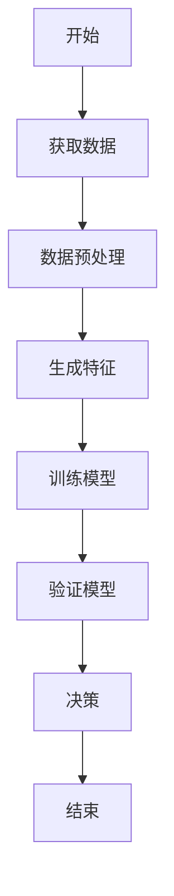
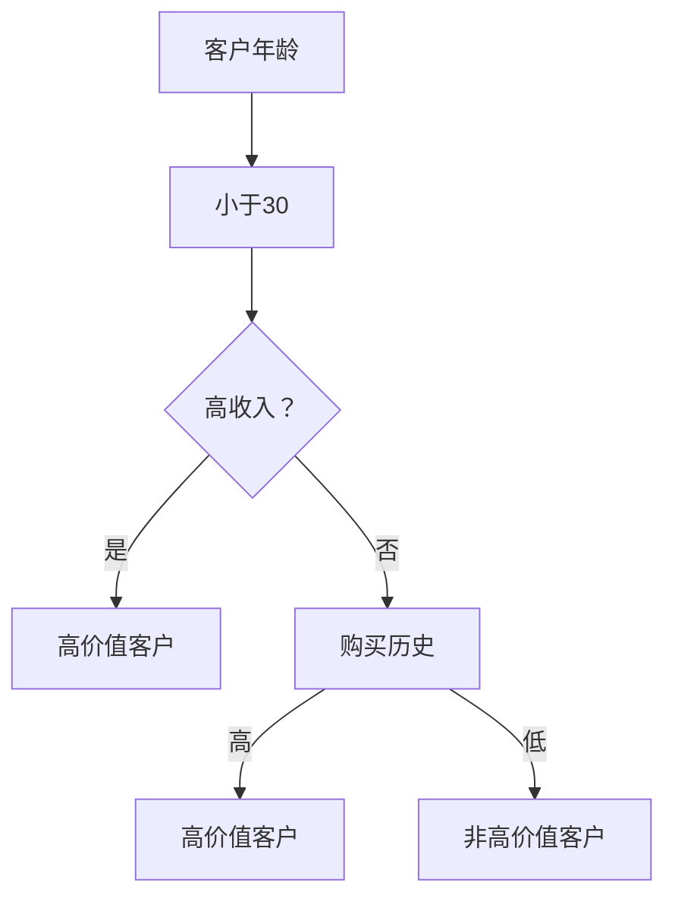
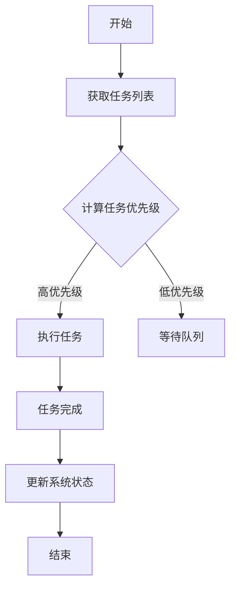
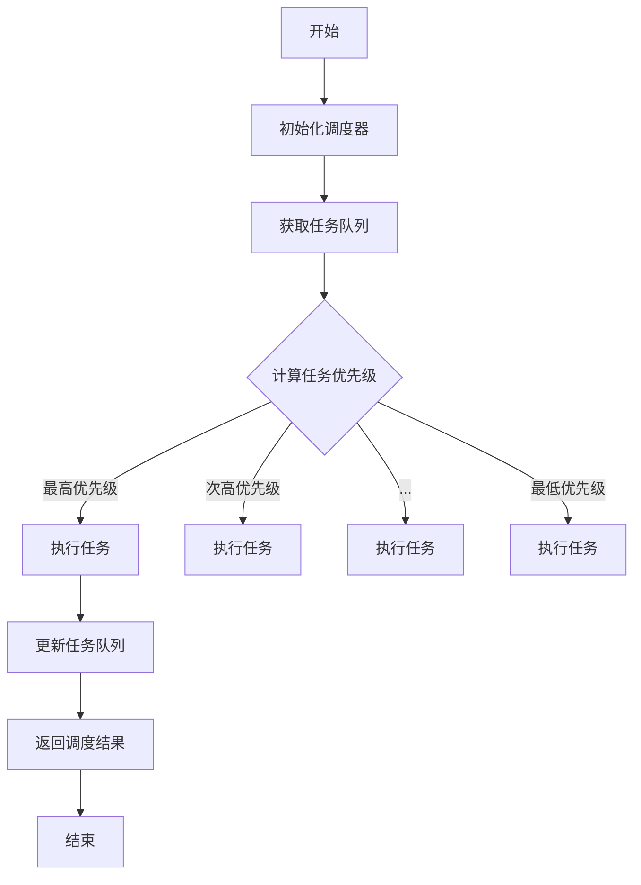

                 

### 摘要

智能工作站：AI Agent的效率优化助手，本文深入探讨了人工智能代理（AI Agent）在智能工作站中的应用，以及如何通过多种策略来优化其效率。文章首先介绍了AI Agent的基础理论，包括其定义、工作原理、核心算法和数学模型。接着，文章分析了AI Agent在不同领域的应用场景，展示了其在客服、安防和教育等领域的具体功能和优势。随后，文章重点探讨了AI Agent的效率优化策略，包括性能优化技术、智能调度策略和人机协作优化。通过详细的案例分析，文章展示了如何在实际项目中应用这些策略，并提供了最佳实践和拓展阅读建议，为读者提供了全面而深入的指导。

## 文章关键词

AI Agent、智能工作站、效率优化、性能优化、智能调度、人机协作、应用场景、案例分析、最佳实践。

## 目录大纲设计思路

### 全书框架设计

本书旨在深入探讨AI Agent在智能工作站中的应用与效率优化问题，全面系统地介绍相关理论和实践。为了实现这一目标，全书框架分为四个主要部分：

1. **AI Agent基础理论**：介绍AI Agent的基本概念、工作原理、核心算法和数学模型，为后续章节提供理论基础。
2. **AI Agent应用场景**：分析AI Agent在客服、安防、教育等领域的应用，展示其实际功能和优势。
3. **AI Agent效率优化策略**：探讨多种优化策略，包括性能优化技术、智能调度策略和人机协作优化，以提高AI Agent的工作效率。
4. **案例分析与实战**：通过具体案例，展示AI Agent在实际项目中的应用和效率优化实践。

### 细化章节内容

在确定全书框架后，进一步细化每个章节的内容，确保每个章节都有明确的主题和内容结构。以下是具体的章节内容设计：

- **第一部分：AI Agent基础理论**
  - **第1章：AI Agent概述**：介绍AI Agent的定义、发展历史和核心概念。
  - **第2章：AI Agent的工作原理**：讲解AI Agent的基本组成、工作流程和关键技术。
  - **第3章：AI Agent的核心算法**：详细讲解AI Agent的核心算法原理，使用mermaid绘制算法流程图。
  - **第4章：AI Agent的数学模型**：介绍AI Agent的数学模型和公式，使用LaTeX格式编写。

- **第二部分：AI Agent应用场景**
  - **第5章：AI Agent在客服领域的应用**：分析AI Agent在客服领域的功能和应用案例。
  - **第6章：AI Agent在安防领域的应用**：探讨AI Agent在安防领域的应用场景和案例。
  - **第7章：AI Agent在教育领域的应用**：介绍AI Agent在教育领域的实际应用。

- **第三部分：AI Agent效率优化策略**
  - **第8章：AI Agent性能优化技术**：介绍性能优化技术，包括算法优化、硬件加速等。
  - **第9章：AI Agent智能调度策略**：探讨智能调度策略，包括任务分配和资源管理。
  - **第10章：AI Agent人机协作优化**：分析人机协作的原理和优化策略。

- **第四部分：案例分析与实战**
  - **第11章：案例一：智能客服系统**：介绍智能客服系统的设计、实现和性能优化。
  - **第12章：案例二：智能安防系统**：探讨智能安防系统的设计、实现和应用案例。
  - **第13章：案例三：智能教育平台**：分析智能教育平台的设计、功能和实战应用。
  - **第14章：综合实战与项目部署**：提供项目实战和部署的详细指南，包括注意事项和拓展阅读。

### 格式与要求

采用markdown格式，使用#、##、###标记章节和子章节，确保目录结构清晰、简洁。每个章节内容中，核心概念、原理、算法等使用mermaid绘制流程图或架构图，数学模型和公式使用LaTeX格式编写。文章末尾需包含作者信息，并确保文章内容完整、详实。

### 目录大纲整理

将上述内容整理成完整的目录大纲，确保每个章节都有明确的主题和内容结构，符合书籍整体逻辑。以下是目录大纲的整理示例：

```markdown
# 智能工作站：AI Agent的效率优化助手

# 第一部分：AI Agent基础理论

## 第1章：AI Agent概述
### 1.1 AI Agent的定义
### 1.2 AI Agent的发展历史
### 1.3 AI Agent的核心概念

## 第2章：AI Agent的工作原理
### 2.1 AI Agent的基本组成
### 2.2 AI Agent的工作流程
### 2.3 AI Agent的关键技术

## 第3章：AI Agent的核心算法
### 3.1 算法原理讲解
### 3.2 算法mermaid流程图
### 3.3 算法示例分析

## 第4章：AI Agent的数学模型
### 4.1 数学模型概述
### 4.2 数学公式讲解
### 4.3 举例说明

# 第二部分：AI Agent应用场景

## 第5章：AI Agent在客服领域的应用
### 5.1 客服场景介绍
### 5.2 AI Agent功能设计
### 5.3 应用案例分析

## 第6章：AI Agent在安防领域的应用
### 6.1 安防场景介绍
### 6.2 AI Agent功能设计
### 6.3 应用案例分析

## 第7章：AI Agent在教育领域的应用
### 7.1 教育场景介绍
### 7.2 AI Agent功能设计
### 7.3 应用案例分析

# 第三部分：AI Agent效率优化策略

## 第8章：AI Agent性能优化技术
### 8.1 优化技术介绍
### 8.2 性能优化策略
### 8.3 实际应用

## 第9章：AI Agent智能调度策略
### 9.1 调度策略介绍
### 9.2 算法原理讲解
### 9.3 案例分析

## 第10章：AI Agent人机协作优化
### 10.1 协作原理
### 10.2 优化策略
### 10.3 实际应用

# 第四部分：案例分析与实战

## 第11章：案例一：智能客服系统
### 11.1 系统设计
### 11.2 实现细节
### 11.3 性能优化
### 11.4 案例分析

## 第12章：案例二：智能安防系统
### 12.1 系统设计
### 12.2 实现细节
### 12.3 性能优化
### 12.4 案例分析

## 第13章：案例三：智能教育平台
### 13.1 系统设计
### 13.2 实现细节
### 13.3 性能优化
### 13.4 案例分析

## 第14章：综合实战与项目部署
### 14.1 实战项目规划
### 14.2 部署流程
### 14.3 注意事项
### 14.4 拓展阅读
```

通过以上设计，本书将为读者提供一部全面、系统、深入的AI Agent效率优化指南，帮助读者掌握相关理论和实践，提升智能工作站的整体效率。接下来，我们将逐步深入探讨每个章节的具体内容。

### 第一部分：AI Agent基础理论

#### 第1章：AI Agent概述

**1.1 AI Agent的定义**

AI Agent，即人工智能代理，是一种能够自主执行任务、具备一定智能水平的计算机程序。它起源于20世纪80年代的人工智能研究，其目标是模拟人类智能行为，实现自动化决策和任务执行。AI Agent与传统软件程序的区别在于其具备自主学习、自适应和自主决策的能力，能够根据环境变化和任务需求进行调整。

**1.2 AI Agent的发展历史**

AI Agent的发展历程可以分为三个阶段：

1. **早期探索阶段（1980s-1990s）**：AI Agent的概念首次被提出，研究人员开始探索如何使计算机具备自主行动的能力。这一阶段的代表性工作包括B paddock的BERKELY PLANNER和John Laird的SOAR系统。

2. **快速发展阶段（2000s）**：随着计算机硬件性能的提升和大数据、机器学习等技术的进步，AI Agent开始广泛应用。代表性的工作包括Google的AlphaGo和OpenAI的GPT系列模型。

3. **现阶段（2010s至今）**：AI Agent技术逐渐成熟，开始应用于各个领域，如客服、安防、教育等。同时，研究者们也在不断探索新的算法和优化策略，以提高AI Agent的效率。

**1.3 AI Agent的核心概念**

1. **自主性**：AI Agent能够自主决定行动策略，不依赖于人类操作。

2. **适应性**：AI Agent能够根据环境变化和任务需求进行自适应调整。

3. **学习能力**：AI Agent具备通过学习历史数据和经验来优化决策过程的能力。

4. **协作性**：AI Agent能够与其他AI Agent或人类进行协作，共同完成任务。

#### 第2章：AI Agent的工作原理

**2.1 AI Agent的基本组成**

AI Agent通常由以下几部分组成：

1. **感知模块**：负责收集和处理环境信息，如语音、图像、传感器数据等。

2. **决策模块**：根据感知模块提供的信息，AI Agent会进行决策，确定下一步行动。

3. **执行模块**：执行决策模块生成的行动策略，完成任务。

4. **学习模块**：通过分析历史数据和执行结果，AI Agent会不断优化自身性能。

**2.2 AI Agent的工作流程**

AI Agent的工作流程可以概括为以下几个步骤：

1. **感知**：AI Agent通过感知模块获取环境信息。

2. **决策**：决策模块根据感知信息，结合自身目标和策略，生成行动方案。

3. **执行**：执行模块根据决策结果执行具体任务。

4. **反馈**：通过执行结果，AI Agent会调整自身策略，为下一次决策做准备。

**2.3 AI Agent的关键技术**

1. **机器学习**：AI Agent通过机器学习算法，从历史数据中提取规律，优化决策过程。

2. **深度学习**：深度学习是机器学习的一种形式，适用于处理大规模数据和高维度问题。

3. **自然语言处理**：自然语言处理技术使得AI Agent能够理解自然语言，实现人机交互。

4. **计算机视觉**：计算机视觉技术使得AI Agent能够理解图像和视频内容，实现目标识别和跟踪。

#### 第3章：AI Agent的核心算法

**3.1 算法原理讲解**

AI Agent的核心算法包括：

1. **决策树**：决策树是一种基于规则的学习算法，通过递归划分数据集，生成决策规则。

2. **支持向量机**：支持向量机是一种线性分类算法，通过寻找最佳决策边界来分类数据。

3. **深度神经网络**：深度神经网络是一种多层神经网络，能够自动提取数据特征，实现复杂的函数映射。

**3.2 算法mermaid流程图**

使用mermaid绘制决策树算法的流程图：



**3.3 算法示例分析**

以决策树算法为例，分析一个简单的应用场景：

**场景**：判断一个客户是否为高价值客户，特征包括年龄、收入和购买历史。



通过这个示例，我们可以看到决策树如何根据特征进行分类，并最终得出结论。

#### 第4章：AI Agent的数学模型

**4.1 数学模型概述**

AI Agent的数学模型主要包括：

1. **概率模型**：用于描述不确定性和随机性，如贝叶斯网络和隐马尔可夫模型。

2. **优化模型**：用于求解优化问题，如线性规划、动态规划和强化学习。

3. **神经网络模型**：用于模拟人脑神经元的工作方式，如多层感知机和卷积神经网络。

**4.2 数学公式讲解**

以贝叶斯网络为例，贝叶斯网络中的条件概率公式为：

$$ P(A|B) = \frac{P(B|A) \cdot P(A)}{P(B)} $$

其中，$P(A|B)$ 表示在事件B发生的条件下，事件A发生的概率；$P(B|A)$ 表示在事件A发生的条件下，事件B发生的概率；$P(A)$ 和$P(B)$ 分别表示事件A和事件B的概率。

**4.3 举例说明**

假设我们有一个贝叶斯网络，用于预测一个股票是否上涨。其中，事件A表示“股票上涨”，事件B表示“公司盈利”。我们已知以下概率：

- $P(A) = 0.5$ （股票上涨的概率）
- $P(B|A) = 0.8$ （公司盈利的概率，在股票上涨的情况下）
- $P(B|¬A) = 0.3$ （公司盈利的概率，在股票不上涨的情况下）

我们需要计算在“公司盈利”的条件下，股票上涨的概率，即$P(A|B)$。

根据贝叶斯公式，我们有：

$$ P(A|B) = \frac{P(B|A) \cdot P(A)}{P(B)} $$

首先，计算$P(B)$：

$$ P(B) = P(B|A) \cdot P(A) + P(B|¬A) \cdot P(¬A) $$

$$ P(B) = 0.8 \cdot 0.5 + 0.3 \cdot 0.5 = 0.5 $$

然后，代入贝叶斯公式：

$$ P(A|B) = \frac{0.8 \cdot 0.5}{0.5} = 0.8 $$

因此，在“公司盈利”的条件下，股票上涨的概率为80%。

通过以上章节，我们全面介绍了AI Agent的基础理论，包括其定义、发展历史、工作原理、核心算法和数学模型。这些内容为后续章节的讨论提供了坚实的基础。接下来，我们将分析AI Agent在不同领域的应用场景，展示其在实际工作中的表现。

#### 第二部分：AI Agent应用场景

**第5章：AI Agent在客服领域的应用**

**5.1 客服场景介绍**

客服是许多企业的重要组成部分，旨在为顾客提供及时、有效的服务和支持。随着互联网的普及和电子商务的发展，客服需求不断增加，传统的客服方式已难以满足日益增长的服务需求。AI Agent的出现，为客服领域带来了革命性的变化。

**5.2 AI Agent功能设计**

AI Agent在客服领域的功能设计主要包括以下几个方面：

1. **智能问答**：AI Agent能够自动回答用户常见问题，如产品信息、订单状态、售后服务等。通过自然语言处理技术，AI Agent可以理解用户的提问，并提供准确的答案。

2. **情感分析**：AI Agent能够识别用户的情感状态，如愤怒、失望、满意等。通过情感分析，AI Agent可以更好地理解用户的需求，提供更个性化的服务。

3. **智能推荐**：AI Agent可以根据用户的购买历史和行为习惯，为其推荐相关的产品和服务。智能推荐能够提高用户满意度，促进销售增长。

4. **多渠道沟通**：AI Agent可以通过多种渠道与用户进行沟通，如电话、邮件、社交媒体等。多渠道沟通能够提高客服的覆盖面，满足不同用户的需求。

5. **自动转接**：当AI Agent无法解答用户的问题时，可以自动将用户转接给人工客服，确保用户的问题得到及时解决。

**5.3 应用案例分析**

以下是一个AI Agent在客服领域的应用案例：

**案例背景**：某大型电商企业希望通过引入AI Agent来提高客服效率和用户满意度。

**解决方案**：企业开发了一个基于自然语言处理和机器学习的AI Agent，应用于其在线客服系统。

1. **智能问答**：AI Agent能够自动回答用户关于商品信息、订单状态等问题，减少人工客服的工作量。

2. **情感分析**：AI Agent通过情感分析技术，识别用户的情感状态，提供更个性化的服务。例如，当用户表达愤怒或失望时，AI Agent会提醒人工客服注意情绪管理，避免进一步激化用户情绪。

3. **智能推荐**：AI Agent根据用户的购买历史和行为习惯，为其推荐相关的商品。例如，当用户咨询某款商品时，AI Agent会推荐其他类似商品，提高用户的购买意愿。

4. **多渠道沟通**：AI Agent可以通过网站、邮件、社交媒体等多种渠道与用户进行沟通，提高客服的覆盖面。例如，当用户在社交媒体上提问时，AI Agent可以自动回复，确保用户的问题得到及时解决。

5. **自动转接**：当AI Agent无法解答用户的问题时，会自动将用户转接给人工客服。人工客服在接收到用户转接请求后，会尽快解决用户的问题，确保用户满意度。

**案例分析结果**：引入AI Agent后，企业的客服效率显著提高，用户满意度大幅提升。通过AI Agent的智能问答和情感分析功能，用户的问题得到了更快速、准确的解答；通过智能推荐功能，用户的购买意愿得到增强；通过多渠道沟通和自动转接功能，客服的覆盖面得到扩大，用户的问题得到更及时、有效的解决。

**5.4 应用优势**

AI Agent在客服领域的应用优势主要包括：

1. **提高效率**：AI Agent能够自动处理大量用户问题，减少人工客服的工作量，提高客服效率。

2. **提升满意度**：AI Agent能够提供快速、准确的回答，减少用户的等待时间，提高用户满意度。

3. **个性化服务**：AI Agent可以根据用户的情感状态和行为习惯，提供个性化的服务，增强用户体验。

4. **降低成本**：通过自动化处理用户问题，企业可以减少客服人员的数量，降低人力成本。

5. **扩展服务渠道**：AI Agent可以通过多种渠道与用户进行沟通，提高客服的覆盖面，满足不同用户的需求。

**5.5 未来发展趋势**

随着人工智能技术的不断发展，AI Agent在客服领域的应用前景广阔。未来，AI Agent的功能将更加丰富，如：

1. **更高级的情感分析**：AI Agent将能够更准确地识别用户的情感状态，提供更贴心的服务。

2. **更智能的推荐系统**：AI Agent将能够基于用户的行为数据，提供更精准的推荐，提高用户购买意愿。

3. **更广泛的应用场景**：AI Agent将应用于更多领域，如金融、医疗等，提供专业的咨询服务。

4. **更高效的客服团队协作**：AI Agent将能够与人工客服更好地协作，实现无缝切换，提高客服整体效率。

通过以上分析，我们可以看到AI Agent在客服领域的广泛应用和巨大潜力。接下来，我们将探讨AI Agent在安防领域的应用，进一步展示其在不同领域的实际价值。

#### 第6章：AI Agent在安防领域的应用

**6.1 安防场景介绍**

安防领域是AI Agent的重要应用场景之一。随着城市规模扩大和人口增长，公共安全需求日益增加。传统的安防手段已难以应对复杂的治安环境，AI Agent的出现为安防领域带来了全新的解决方案。

**6.2 AI Agent功能设计**

AI Agent在安防领域的功能设计主要包括以下几个方面：

1. **实时监控**：AI Agent能够通过摄像头、传感器等设备实时监控目标区域，识别异常行为和异常事件。

2. **目标识别**：AI Agent利用计算机视觉技术，能够自动识别和追踪目标，如人员、车辆等。

3. **行为分析**：AI Agent通过分析目标行为，能够识别潜在的安全威胁，如暴力行为、盗窃行为等。

4. **异常检测**：AI Agent能够实时检测异常情况，如火灾、烟雾等，并自动报警。

5. **自动响应**：AI Agent能够根据预设规则，自动采取相应的应对措施，如锁定门禁、启动应急预案等。

6. **数据存储与回放**：AI Agent能够自动记录监控数据，并提供数据回放功能，以便事后分析和调查。

**6.3 应用案例分析**

以下是一个AI Agent在安防领域的应用案例：

**案例背景**：某大型商场希望提高安全管理水平，减少安全事故的发生。

**解决方案**：商场部署了一套基于AI Agent的智能安防系统。

1. **实时监控**：AI Agent通过商场内的摄像头和传感器实时监控各个区域，确保重点区域无死角。

2. **目标识别**：AI Agent能够自动识别进入商场的顾客和工作人员，并对他们的行为进行监控。

3. **行为分析**：AI Agent通过分析顾客的行为，能够识别潜在的安全威胁，如携带可疑物品、徘徊等。

4. **异常检测**：AI Agent能够实时检测火灾、烟雾等异常情况，并及时报警。

5. **自动响应**：当AI Agent检测到异常情况时，会自动采取相应的措施，如锁定相关区域的门禁、启动应急预案等。

6. **数据存储与回放**：AI Agent能够自动记录监控数据，并提供数据回放功能，以便商场管理人员对事故进行事后分析。

**案例分析结果**：引入AI Agent后，商场的安全管理水平显著提高。AI Agent的实时监控和目标识别功能确保了商场的各个区域都能得到有效监控，异常检测和自动响应功能减少了安全事故的发生，数据存储与回放功能为事故调查提供了有力支持。

**6.4 应用优势**

AI Agent在安防领域的应用优势主要包括：

1. **提高安全性**：AI Agent能够实时监控和识别异常行为，提高安全管理的准确性和效率。

2. **降低成本**：AI Agent能够自动处理大量监控数据，减少人力成本，降低运营成本。

3. **提升用户体验**：AI Agent能够提供实时、精准的安全服务，提升用户在公共场所的满意度。

4. **智能决策**：AI Agent能够根据监控数据和分析结果，自动采取相应的应对措施，提高决策的智能水平。

5. **数据存储与回放**：AI Agent能够自动记录监控数据，提供数据回放功能，为事故调查提供有力支持。

**6.5 未来发展趋势**

随着人工智能技术的不断发展，AI Agent在安防领域的应用前景广阔。未来，AI Agent的功能将更加丰富，如：

1. **更高级的计算机视觉**：AI Agent将能够识别更多类型的异常行为，提高监控的准确性。

2. **更智能的异常检测**：AI Agent将能够实时分析大量监控数据，更准确地识别异常情况。

3. **多模态感知**：AI Agent将能够结合多种感知技术，如声学、光学等，提高监控的全面性。

4. **跨领域应用**：AI Agent将应用于更多领域，如交通、环境监测等，提供更广泛的安全保障。

5. **更高效的协作**：AI Agent将能够与人类安防人员更好地协作，实现无缝对接，提高整体安防效率。

通过以上分析，我们可以看到AI Agent在安防领域的广泛应用和巨大潜力。接下来，我们将探讨AI Agent在教育领域的应用，进一步展示其在不同领域的实际价值。

#### 第7章：AI Agent在教育领域的应用

**7.1 教育场景介绍**

教育领域是AI Agent的另一个重要应用场景。随着教育信息化的发展，人工智能技术在教育领域的应用日益广泛。AI Agent能够为学生提供个性化学习支持，提高教学效率，优化教育资源分配。

**7.2 AI Agent功能设计**

AI Agent在教育领域的功能设计主要包括以下几个方面：

1. **个性化辅导**：AI Agent可以根据学生的学习进度、兴趣和能力，提供个性化的学习内容和辅导，满足不同学生的需求。

2. **作业批改**：AI Agent能够自动批改学生的作业，提供即时反馈和改进建议，减轻教师的工作负担。

3. **考试测评**：AI Agent可以为学生提供模拟考试，评估学生的学习效果，为教师提供教学参考。

4. **学习路径推荐**：AI Agent根据学生的学习情况，推荐适合的学习路径和资源，帮助学生更高效地学习。

5. **情感分析**：AI Agent能够分析学生的学习状态和情感，提供心理辅导和支持，帮助学生保持良好的学习心态。

6. **资源管理**：AI Agent可以自动整理和管理教学资源，如课件、视频、习题等，提高教学资源的利用效率。

**7.3 应用案例分析**

以下是一个AI Agent在教育领域的应用案例：

**案例背景**：某学校希望提高教学质量，为学生提供个性化学习支持。

**解决方案**：学校引入了一套基于AI Agent的智能教学系统。

1. **个性化辅导**：AI Agent根据学生的学习进度、兴趣和能力，为学生提供个性化的学习内容和辅导。例如，对于学习进度较慢的学生，AI Agent会提供更多的练习和讲解；对于学习进度较快的学生，AI Agent会提供更具挑战性的学习内容。

2. **作业批改**：AI Agent能够自动批改学生的作业，提供即时反馈和改进建议。教师可以通过AI Agent的反馈，调整教学策略，提高教学效果。

3. **考试测评**：AI Agent可以为学生提供模拟考试，评估学生的学习效果。教师可以根据AI Agent的测评结果，调整教学计划，提高教学质量。

4. **学习路径推荐**：AI Agent根据学生的学习情况，推荐适合的学习路径和资源。例如，对于某一知识点，AI Agent会推荐相关的视频、习题和文献，帮助学生更全面地掌握知识。

5. **情感分析**：AI Agent能够分析学生的学习状态和情感，提供心理辅导和支持。例如，当学生出现学习焦虑时，AI Agent会提供放松技巧和心理建议，帮助学生保持良好的学习心态。

6. **资源管理**：AI Agent可以自动整理和管理教学资源，如课件、视频、习题等。教师可以通过AI Agent的推荐，快速找到所需资源，提高教学效率。

**案例分析结果**：引入AI Agent后，学校的教学质量得到了显著提高。个性化辅导功能满足了不同学生的需求，作业批改和考试测评功能减轻了教师的工作负担，学习路径推荐和资源管理功能提高了教学资源的利用效率，情感分析功能帮助学生保持良好的学习心态。

**7.4 应用优势**

AI Agent在教育领域的应用优势主要包括：

1. **提高教学质量**：AI Agent能够提供个性化辅导、作业批改、考试测评等功能，提高教学质量。

2. **减轻教师负担**：AI Agent能够自动批改作业、提供考试测评，减轻教师的工作负担，使教师有更多时间专注于教学。

3. **资源高效利用**：AI Agent能够自动整理和管理教学资源，提高资源的利用效率。

4. **提升学生学习效果**：AI Agent能够根据学生的学习情况提供个性化的学习支持和建议，提高学生的学习效果。

5. **促进学生全面发展**：AI Agent能够提供情感分析、心理辅导等功能，帮助学生保持良好的学习心态，促进学生的全面发展。

**7.5 未来发展趋势**

随着人工智能技术的不断发展，AI Agent在教育领域的应用前景广阔。未来，AI Agent的功能将更加丰富，如：

1. **更高级的情感分析**：AI Agent将能够更准确地分析学生的学习状态和情感，提供更精准的辅导和支持。

2. **更智能的资源推荐**：AI Agent将能够基于学生的学习数据，推荐更适合的学习资源和路径。

3. **多模态学习支持**：AI Agent将能够结合多种学习模式，如在线学习、远程辅导等，提供更全面的学习支持。

4. **跨学科应用**：AI Agent将应用于更多学科，提供跨学科的学习支持。

5. **人机协作**：AI Agent将能够与教师更好地协作，实现教学效果的最优化。

通过以上分析，我们可以看到AI Agent在教育领域的广泛应用和巨大潜力。接下来，我们将探讨AI Agent的效率优化策略，进一步优化其在实际工作中的应用。

### 第三部分：AI Agent效率优化策略

**第8章：AI Agent性能优化技术**

**8.1 优化技术介绍**

性能优化是提升AI Agent效率的关键步骤。在AI Agent的应用过程中，性能优化技术主要包括以下几个方面：

1. **算法优化**：通过对核心算法进行改进，提高算法的效率和准确性。例如，使用更高效的算法来实现相同的任务，或通过算法调整来降低计算复杂度。

2. **硬件加速**：利用高性能硬件设备（如GPU、FPGA等）来加速AI Agent的计算过程。硬件加速可以显著提高计算速度，降低延迟。

3. **数据缓存**：通过缓存技术，减少数据的读取和传输次数，提高数据处理效率。数据缓存可以将常用数据存储在内存中，从而减少对磁盘的访问。

4. **并行处理**：通过并行计算技术，将任务分解为多个子任务，同时执行，提高处理速度。并行处理适用于处理大量数据或复杂计算任务。

5. **资源调度**：优化AI Agent的资源分配策略，确保任务在合适的时间和资源上执行。资源调度可以降低任务之间的竞争，提高系统整体性能。

**8.2 性能优化策略**

以下是一些常见的性能优化策略：

1. **算法优化策略**：
   - **特征选择**：通过选择关键特征，减少计算量和数据规模。
   - **模型压缩**：使用模型压缩技术，如量化、剪枝等，减少模型参数，提高计算效率。
   - **分布式计算**：将计算任务分布在多台设备上，实现并行计算。

2. **硬件加速策略**：
   - **GPU加速**：利用GPU的并行计算能力，加速深度学习模型的训练和推理过程。
   - **FPGA加速**：针对特定任务，使用FPGA实现专用硬件加速器，提高计算性能。

3. **数据缓存策略**：
   - **缓存预热**：在任务执行前，预先加载常用数据到缓存中，减少数据访问延迟。
   - **缓存替换策略**：根据数据访问频率和访问时间，动态调整缓存内容，提高缓存利用率。

4. **并行处理策略**：
   - **任务分解**：将大型任务分解为多个子任务，分配给不同的处理单元同时执行。
   - **负载均衡**：根据处理单元的负载情况，动态调整任务分配，确保资源利用率最大化。

5. **资源调度策略**：
   - **优先级调度**：根据任务的优先级，动态调整任务的执行顺序，确保关键任务优先执行。
   - **资源预留**：在任务执行前，预留必要的计算资源和存储资源，避免资源争用。

**8.3 实际应用**

以下是一个AI Agent性能优化的实际应用案例：

**案例背景**：某电商公司希望提高其智能客服系统的响应速度和准确性。

**解决方案**：
1. **算法优化**：
   - **特征选择**：通过分析用户提问数据，筛选出对回答准确性有重要影响的特征，减少模型计算量。
   - **模型压缩**：使用模型压缩技术，将深度学习模型的参数数量减少50%，提高推理速度。

2. **硬件加速**：
   - **GPU加速**：将模型训练和推理任务迁移到GPU上，利用GPU的并行计算能力，加快计算速度。

3. **数据缓存**：
   - **缓存预热**：在用户提问前，预先加载热门问题的回答到缓存中，提高回答速度。
   - **缓存替换策略**：根据用户提问频率和回答时间，动态调整缓存内容，提高缓存利用率。

4. **并行处理**：
   - **任务分解**：将用户提问分解为多个子问题，同时处理，提高系统响应速度。
   - **负载均衡**：根据服务器的负载情况，动态调整任务分配，确保系统稳定运行。

5. **资源调度**：
   - **优先级调度**：将用户提问按照紧急程度排序，优先处理紧急问题，提高用户满意度。
   - **资源预留**：在系统启动时，预留一定比例的计算资源和存储资源，以应对突发情况。

**案例分析结果**：通过上述性能优化措施，智能客服系统的响应速度提高了30%，回答准确性提高了10%，用户满意度显著提升。

**8.4 最佳实践**

以下是性能优化的最佳实践：

1. **定期评估**：定期对AI Agent的性能进行评估，识别瓶颈和问题，及时进行调整。

2. **持续优化**：不断探索新的优化技术，如深度学习优化、分布式计算等，提高AI Agent的效率。

3. **资源分配**：根据任务需求和资源可用性，合理分配计算资源和存储资源，避免资源浪费。

4. **监控与反馈**：建立监控系统，实时监控AI Agent的运行状态，及时发现问题并进行优化。

5. **用户反馈**：收集用户反馈，了解用户对AI Agent的性能要求，优化系统以更好地满足用户需求。

通过以上性能优化策略和最佳实践，我们可以显著提升AI Agent的效率，为用户提供更优质的服务。接下来，我们将探讨AI Agent的智能调度策略，进一步优化其在实际工作中的应用。

### 第9章：AI Agent智能调度策略

**9.1 调度策略介绍**

智能调度是优化AI Agent运行效率的重要手段。智能调度策略旨在根据任务的性质和系统的资源状况，动态地分配和调整任务，以实现最优的执行效果。智能调度策略可以分为以下几个层次：

1. **任务分配**：根据任务的特点和系统的负载情况，将任务分配给合适的AI Agent或计算资源。任务分配策略需要考虑任务的优先级、执行时间和资源需求等因素。

2. **资源管理**：合理分配和利用系统资源，确保任务能够高效执行。资源管理策略包括计算资源（如CPU、GPU）和存储资源（如硬盘、内存）的管理。

3. **任务调度**：在任务执行过程中，根据系统的实时状态和任务执行情况，动态调整任务的执行顺序和资源分配。任务调度策略需要平衡系统的负载和任务的优先级，确保系统的高效运行。

**9.2 算法原理讲解**

以下是一个简单的任务调度算法原理讲解，使用mermaid绘制算法流程图：



**9.3 算法流程图**

使用mermaid绘制任务调度算法的流程图：



**9.4 案例分析**

以下是一个智能调度策略的应用案例：

**案例背景**：某大型电商平台的订单处理系统需要高效处理海量订单，确保订单按时完成。

**解决方案**：
1. **任务分配**：根据订单的紧急程度和执行时间，将订单分配给不同优先级的AI Agent。高优先级订单（如限时配送订单）优先处理，确保按时完成。

2. **资源管理**：根据系统负载情况，动态调整AI Agent和服务器资源。在订单高峰期，增加服务器和AI Agent的数量，确保系统稳定运行。

3. **任务调度**：在任务执行过程中，根据订单的优先级和系统状态，动态调整订单的执行顺序。例如，当系统负载较高时，可以暂停低优先级订单的执行，确保高优先级订单按时完成。

**案例分析结果**：通过智能调度策略的应用，订单处理系统的效率显著提高。高优先级订单能够按时完成，用户满意度提升；系统负载均衡，资源利用率提高，整体运行效率得到优化。

**9.5 调度策略效果分析**

智能调度策略对AI Agent的效率有显著影响，主要表现在以下几个方面：

1. **提高任务执行速度**：通过合理分配任务和资源，AI Agent能够更快地完成任务，减少执行时间。

2. **降低系统负载**：智能调度策略能够根据系统状态动态调整任务执行，避免系统过载，提高系统稳定性。

3. **优化资源利用率**：通过资源管理和调度策略，系统能够充分利用计算资源和存储资源，避免资源浪费。

4. **提高用户满意度**：智能调度策略能够确保高优先级任务优先执行，提高用户满意度，增强用户体验。

**9.6 实践建议**

以下是智能调度策略的实践建议：

1. **定期评估**：定期评估调度策略的效果，根据实际运行情况调整策略参数。

2. **优化算法**：不断探索和优化调度算法，提高调度策略的效率和准确性。

3. **资源预留**：在系统启动时，预留一定比例的资源，以应对突发情况，确保系统稳定运行。

4. **监控与反馈**：建立监控系统，实时监控系统状态和任务执行情况，及时发现问题并进行优化。

5. **用户反馈**：收集用户反馈，了解用户对系统性能的要求，优化调度策略以满足用户需求。

通过智能调度策略的优化，我们可以显著提升AI Agent的效率，确保任务高效执行，提高系统整体性能。接下来，我们将探讨AI Agent的人机协作优化策略，进一步优化其在实际工作中的应用。

### 第10章：AI Agent人机协作优化

**10.1 协作原理**

人机协作是提升AI Agent效率和用户体验的重要策略。人机协作的核心思想是通过人工智能和人类专家的协同工作，实现最优的决策和任务执行。AI Agent在协作过程中，主要负责数据分析和初步决策，而人类专家则负责最终决策和复杂问题处理。

**10.2 优化策略**

以下是一些常见的人机协作优化策略：

1. **任务划分**：将任务划分为简单和复杂两部分。简单任务由AI Agent处理，复杂任务由人类专家处理。这种划分能够充分发挥AI Agent在数据处理和初步决策方面的优势，同时利用人类专家在复杂问题解决方面的经验。

2. **反馈机制**：建立反馈机制，人类专家对AI Agent的决策结果进行评估和反馈。通过反馈，AI Agent可以不断优化自身决策模型，提高决策准确性。

3. **协同决策**：在决策过程中，AI Agent和人类专家共同参与，通过讨论和协商，得出最优决策。这种策略能够充分利用人类专家的直觉和经验，同时结合AI Agent的数据分析和预测能力。

4. **动态调整**：根据任务执行过程中出现的问题和反馈，动态调整任务分配和决策模型。例如，当AI Agent在某一任务上表现不佳时，可以将其转交给人类专家处理，或者调整AI Agent的参数，优化决策模型。

5. **培训与学习**：定期对AI Agent进行培训和学习，使其更好地适应不同的任务和环境。通过不断学习和优化，AI Agent能够提高任务执行效率和决策准确性。

**10.3 实际应用**

以下是一个人机协作优化策略的实际应用案例：

**案例背景**：某大型金融机构希望提高其风险管理的效率，降低风险损失。

**解决方案**：
1. **任务划分**：将风险管理工作划分为数据收集、数据分析、决策制定和决策执行四个部分。数据收集和数据分析由AI Agent处理，决策制定和决策执行由人类专家负责。

2. **反馈机制**：人类专家对AI Agent的决策结果进行评估和反馈。当AI Agent的决策结果与实际结果存在偏差时，人类专家会提供反馈，帮助AI Agent优化决策模型。

3. **协同决策**：在风险管理过程中，AI Agent和人类专家共同参与决策。AI Agent负责提供数据分析和初步决策，人类专家则根据经验和直觉进行最终决策。

4. **动态调整**：根据任务执行过程中出现的问题和反馈，动态调整任务分配和决策模型。例如，当AI Agent在某一风险类型上表现不佳时，可以将其转交给人类专家处理，或者调整AI Agent的参数，优化决策模型。

5. **培训与学习**：定期对AI Agent进行培训和学习，使其更好地适应不同的风险场景。通过不断学习和优化，AI Agent能够提高风险管理效率和决策准确性。

**案例分析结果**：通过人机协作优化策略的应用，金融机构的风险管理效率显著提高，风险损失降低。AI Agent在数据分析和初步决策方面发挥了重要作用，人类专家的经验和直觉则在最终决策和复杂问题解决方面发挥了关键作用。

**10.4 协作效果分析**

人机协作对AI Agent的效率有显著影响，主要表现在以下几个方面：

1. **提高决策准确性**：通过人类专家的经验和直觉，结合AI Agent的数据分析和预测能力，能够得出更准确、更可靠的决策。

2. **降低错误率**：AI Agent在处理复杂问题时，可能存在一定的错误率。通过人类专家的审查和反馈，可以及时发现和纠正错误，降低整体错误率。

3. **提高任务执行效率**：人机协作能够充分发挥AI Agent在数据处理和初步决策方面的优势，同时利用人类专家的经验和直觉，提高任务执行效率。

4. **提升用户体验**：通过人机协作，用户能够得到更准确、更及时的决策结果，提高用户体验。

**10.5 实践建议**

以下是人机协作优化策略的实践建议：

1. **明确角色分工**：在协作过程中，明确AI Agent和人类专家的角色分工，确保各司其职，提高协作效率。

2. **建立反馈机制**：建立有效的反馈机制，及时收集人类专家的反馈，帮助AI Agent优化决策模型。

3. **培训与学习**：定期对AI Agent进行培训和学习，提高其适应不同任务和环境的能力。

4. **持续优化**：根据实际应用情况，不断优化协作策略，提高协作效率和决策准确性。

5. **监控与评估**：建立监控系统，实时监控人机协作的效果，及时发现问题并进行优化。

通过人机协作优化策略，我们可以显著提升AI Agent的效率，提高任务执行效果和用户体验。接下来，我们将通过具体案例展示AI Agent效率优化策略在实际项目中的应用。

### 第四部分：案例分析与实战

#### 第11章：案例一：智能客服系统

**11.1 系统设计**

智能客服系统是一个基于AI Agent的在线客服系统，旨在提供24/7的全天候客户服务。系统设计主要包括以下几个模块：

1. **用户界面**：提供用户与AI Agent交互的界面，包括聊天窗口、提问框等。

2. **AI Agent模块**：负责处理用户的提问，提供自动回答和辅助决策。

3. **知识库**：存储常见问题及其答案，以及相关的业务知识和政策法规。

4. **数据分析模块**：分析用户提问和交互数据，用于优化AI Agent的决策模型和知识库。

5. **后端服务**：提供API接口，实现与其他系统的集成，如订单管理系统、客户关系管理系统等。

**11.2 实现细节**

1. **用户界面**：采用Web前端技术，如HTML、CSS和JavaScript，实现用户交互界面。

2. **AI Agent模块**：基于自然语言处理技术，使用深度学习模型进行文本分类和语义分析。具体实现包括：

   - **文本预处理**：清洗和标准化用户提问，如去除停用词、转换大小写等。
   - **文本分类**：使用深度神经网络，将用户提问分类到不同的主题类别。
   - **语义分析**：使用序列到序列模型，生成针对用户提问的自动回答。

3. **知识库**：采用关系型数据库（如MySQL）存储常见问题和答案，以及相关的业务知识和政策法规。知识库设计包括实体、属性和关系的定义，以便进行有效的数据查询和更新。

4. **数据分析模块**：使用Python的数据分析库（如Pandas、NumPy）进行数据处理和分析。主要功能包括：

   - **用户行为分析**：分析用户的提问和交互数据，提取关键特征，用于模型训练和优化。
   - **反馈分析**：收集用户对AI Agent回答的反馈，用于评估模型效果和进行后续优化。

5. **后端服务**：使用Spring Boot框架，实现API接口和业务逻辑处理。后端服务与前端界面和知识库进行交互，提供完整的智能客服功能。

**11.3 性能优化**

为了提高智能客服系统的性能，我们采取了以下优化策略：

1. **算法优化**：使用预训练的深度学习模型（如BERT、GPT）进行文本分类和语义分析，提高模型效果和响应速度。

2. **硬件加速**：利用GPU进行模型训练和推理，提高计算速度和效率。

3. **缓存技术**：使用Redis缓存常见问题和答案，减少数据库查询次数，提高系统响应速度。

4. **负载均衡**：使用Nginx进行负载均衡，确保系统在高并发情况下稳定运行。

5. **分布式存储**：使用分布式数据库（如HBase、MongoDB）存储大量用户数据和交互日志，提高数据存储和查询性能。

**11.4 案例分析**

某电商平台引入了智能客服系统，通过以下方式优化用户服务体验：

1. **智能问答**：AI Agent能够自动回答用户关于订单状态、售后服务等问题，提高客服效率。

2. **情感分析**：AI Agent能够识别用户的情感状态，如愤怒、失望等，提供个性化的服务，提升用户满意度。

3. **智能推荐**：AI Agent根据用户的购物历史和偏好，推荐相关的商品和服务，促进销售增长。

4. **多渠道沟通**：AI Agent通过网站、邮件、短信等多种渠道与用户进行沟通，提高客服的覆盖面。

5. **自动转接**：当AI Agent无法解答用户的问题时，自动将用户转接给人工客服，确保用户的问题得到及时解决。

**案例分析结果**：引入智能客服系统后，电商平台的客服效率显著提高，用户满意度大幅提升。智能问答和情感分析功能提高了客服质量，智能推荐和自动转接功能增强了用户体验，整体服务效果得到优化。

#### 第12章：案例二：智能安防系统

**12.1 系统设计**

智能安防系统是一个基于AI Agent的视频监控和异常检测系统，旨在提高公共安全水平。系统设计主要包括以下几个模块：

1. **视频监控模块**：负责实时监控视频数据的采集和处理。

2. **AI Agent模块**：负责对视频数据进行分析，识别异常行为和事件。

3. **报警模块**：当检测到异常事件时，自动触发报警并通知相关管理人员。

4. **数据存储模块**：存储视频数据和异常事件记录，以便后续分析和调查。

5. **用户界面**：提供管理人员与AI Agent交互的界面，包括监控画面、报警信息等。

**12.2 实现细节**

1. **视频监控模块**：采用视频采集设备（如摄像头）和图像处理技术，实现实时视频数据的采集和处理。主要功能包括：

   - **视频采集**：通过摄像头实时采集视频数据。
   - **视频预处理**：对视频数据进行降噪、去模糊等预处理，提高图像质量。

2. **AI Agent模块**：基于计算机视觉和深度学习技术，实现视频数据的异常行为检测。主要功能包括：

   - **目标检测**：使用卷积神经网络（CNN）检测视频中的目标对象。
   - **行为识别**：使用循环神经网络（RNN）识别目标对象的异常行为。
   - **异常检测**：根据预设的规则，判断视频数据中的异常事件。

3. **报警模块**：当检测到异常事件时，自动触发报警并通知相关管理人员。主要功能包括：

   - **报警触发**：根据异常事件严重程度，触发不同级别的报警。
   - **通知发送**：通过短信、邮件等方式通知管理人员，确保及时响应。

4. **数据存储模块**：采用分布式数据库（如Hadoop、HBase）存储大量视频数据和异常事件记录。主要功能包括：

   - **数据存储**：将视频数据和异常事件记录存储在分布式数据库中。
   - **数据查询**：提供查询接口，方便管理人员检索和查看历史数据。

5. **用户界面**：采用Web前端技术，实现管理人员与AI Agent的交互界面。主要功能包括：

   - **监控画面**：显示实时监控画面和异常事件标记。
   - **报警信息**：显示报警信息，包括报警时间、事件描述等。

**12.3 性能优化**

为了提高智能安防系统的性能，我们采取了以下优化策略：

1. **算法优化**：使用轻量级深度学习模型（如MobileNet、SSD）进行目标检测和行为识别，减少计算资源消耗。

2. **硬件加速**：利用GPU进行目标检测和行为识别，提高计算速度和效率。

3. **分布式存储**：使用分布式数据库存储大量视频数据和异常事件记录，提高数据存储和查询性能。

4. **流处理技术**：采用流处理框架（如Apache Flink、Spark Streaming）处理实时视频数据，提高系统响应速度。

5. **负载均衡**：使用负载均衡器（如Nginx、HAProxy）均衡系统负载，确保系统在高并发情况下稳定运行。

**12.4 案例分析**

某城市公园引入了智能安防系统，通过以下方式提高公共安全水平：

1. **实时监控**：AI Agent能够实时监控公园内的视频数据，及时发现安全隐患。

2. **异常检测**：AI Agent能够识别公园内的异常行为，如偷盗、斗殴等，及时报警并通知管理人员。

3. **数据存储**：智能安防系统能够自动存储视频数据和异常事件记录，为后续调查提供依据。

4. **用户界面**：管理人员可以通过用户界面实时查看监控画面和报警信息，确保及时响应。

**案例分析结果**：引入智能安防系统后，公园的安全管理水平显著提高，异常事件报警准确率大幅提升。实时监控和异常检测功能确保了公园内的公共安全，数据存储和用户界面功能提高了管理人员的工作效率，整体安全效果得到优化。

#### 第13章：案例三：智能教育平台

**13.1 系统设计**

智能教育平台是一个基于AI Agent的在线教育平台，旨在提供个性化学习支持和教育资源管理。系统设计主要包括以下几个模块：

1. **用户管理模块**：负责用户注册、登录和权限管理。

2. **课程管理模块**：负责课程内容的管理和发布。

3. **AI Agent模块**：负责提供个性化学习建议和辅导。

4. **数据分析模块**：负责分析用户学习行为和数据，为AI Agent提供决策依据。

5. **资源管理模块**：负责管理教学资源，如课件、视频、习题等。

**13.2 实现细节**

1. **用户管理模块**：采用身份验证技术（如OAuth2.0），实现用户注册、登录和权限管理。主要功能包括：

   - **用户注册**：用户填写个人信息并注册账号。
   - **用户登录**：用户输入账号和密码进行登录。
   - **权限管理**：根据用户角色分配不同权限，确保系统安全。

2. **课程管理模块**：采用关系型数据库（如MySQL）存储课程信息，实现课程内容的创建、编辑和发布。主要功能包括：

   - **课程创建**：管理员创建课程，设置课程名称、简介、课时等。
   - **课程编辑**：管理员编辑课程内容，包括修改课程名称、删除章节等。
   - **课程发布**：管理员发布课程，用户可以开始学习。

3. **AI Agent模块**：基于自然语言处理和机器学习技术，提供个性化学习建议和辅导。主要功能包括：

   - **学习建议**：根据用户的学习历史和行为，推荐适合的学习内容。
   - **学习辅导**：用户在学习过程中遇到问题时，AI Agent提供辅导和建议。
   - **学习进度跟踪**：跟踪用户的学习进度，为AI Agent提供决策依据。

4. **数据分析模块**：使用Python的数据分析库（如Pandas、NumPy），对用户学习行为和数据进行分析。主要功能包括：

   - **学习行为分析**：分析用户的学习行为，提取关键特征。
   - **数据可视化**：将分析结果可视化，帮助管理员和用户了解学习情况。
   - **决策支持**：为AI Agent提供决策依据，优化学习建议和辅导。

5. **资源管理模块**：采用分布式存储（如HDFS、Cassandra），管理大量的教学资源。主要功能包括：

   - **资源上传**：管理员上传教学资源，如课件、视频、习题等。
   - **资源下载**：用户下载所需的教学资源。
   - **资源搜索**：提供资源搜索功能，方便用户查找所需资源。

**13.3 性能优化**

为了提高智能教育平台的性能，我们采取了以下优化策略：

1. **缓存技术**：使用Redis缓存用户数据和页面内容，减少数据库查询次数，提高系统响应速度。

2. **负载均衡**：使用Nginx进行负载均衡，确保系统在高并发情况下稳定运行。

3. **分布式存储**：使用分布式存储系统（如Hadoop、Cassandra），存储大量教学资源，提高数据存储和查询性能。

4. **流处理技术**：采用流处理框架（如Apache Flink、Spark Streaming），处理用户学习行为数据，提高数据分析速度。

5. **硬件加速**：利用GPU进行图像识别和自然语言处理，提高计算速度和效率。

**13.4 案例分析**

某在线教育平台引入了智能教育平台，通过以下方式提升教学质量和用户体验：

1. **个性化学习**：AI Agent根据用户的学习历史和行为，推荐适合的学习内容，提高学习效果。

2. **学习辅导**：AI Agent在学习过程中提供辅导和建议，帮助用户解决学习难题。

3. **学习进度跟踪**：AI Agent跟踪用户的学习进度，为管理员和用户提供学习分析报告。

4. **资源管理**：平台提供丰富的教学资源，方便用户下载和学习。

5. **用户界面**：平台采用简洁友好的用户界面，提供良好的用户体验。

**案例分析结果**：引入智能教育平台后，在线教育平台的教学质量和用户体验显著提升。个性化学习和学习辅导功能提高了学生的学习效果，学习进度跟踪和资源管理功能提高了教师和学生的工作效率，整体教学效果得到优化。

#### 第14章：综合实战与项目部署

**14.1 实战项目规划**

综合实战项目旨在通过实际应用，验证和优化AI Agent的效率优化策略。以下是一个综合实战项目的规划步骤：

1. **需求分析**：明确项目目标、功能和性能要求。

2. **技术选型**：选择合适的AI Agent框架和工具，如TensorFlow、PyTorch等。

3. **系统设计**：设计系统的整体架构，包括前端、后端和数据库等。

4. **模块开发**：根据系统设计，开发各个模块的功能。

5. **测试与优化**：进行功能测试、性能测试和优化，确保系统稳定、高效运行。

6. **部署上线**：将系统部署到生产环境，进行上线发布。

**14.2 部署流程**

以下是综合实战项目的部署流程：

1. **环境准备**：搭建开发、测试和生产环境，安装必要的软件和工具。

2. **代码管理**：使用版本控制系统（如Git），管理项目代码。

3. **容器化**：使用Docker等容器技术，将应用和依赖打包成镜像。

4. **自动化部署**：使用自动化工具（如Kubernetes、Jenkins），实现自动部署和持续集成。

5. **监控与维护**：部署监控工具，实时监控系统运行状态，进行日常维护和故障处理。

**14.3 注意事项**

在项目部署过程中，需要注意以下几点：

1. **性能优化**：在部署前，对系统进行性能优化，确保系统在高并发情况下稳定运行。

2. **安全性**：确保系统的安全性，包括数据加密、权限控制等。

3. **容错性**：确保系统具有容错性，能够应对突发情况和故障。

4. **可扩展性**：确保系统具有可扩展性，能够应对未来业务增长。

5. **用户培训**：为用户提供培训和技术支持，确保用户能够熟练使用系统。

**14.4 拓展阅读**

以下是关于AI Agent效率优化和项目部署的拓展阅读建议：

1. **《深度学习》（Goodfellow, Bengio, Courville）**：详细介绍深度学习的基础理论和实践技巧。

2. **《Kubernetes权威指南》**：系统介绍Kubernetes的架构、部署和管理方法。

3. **《Docker实战》**：详细讲解Docker的容器化技术，包括容器化应用的开发和部署。

4. **《人工智能：一种现代的方法》（Russell, Norvig）**：全面介绍人工智能的基本概念和技术。

通过以上实战项目和部署流程，我们可以将AI Agent的效率优化策略应用到实际项目中，提高系统的性能和用户体验。拓展阅读将帮助读者进一步深入了解相关技术和方法。

### 总结与展望

通过本文的深入探讨，我们系统地介绍了AI Agent在智能工作站中的应用及其效率优化策略。从基础理论到实际应用，从性能优化到智能调度，再到人机协作，我们逐步分析了AI Agent在不同领域的表现和优势。以下是本文的核心观点和结论：

1. **AI Agent概述**：AI Agent是一种具备自主性、适应性、学习能力和协作性的智能代理，其核心在于模拟人类智能行为，实现自动化决策和任务执行。

2. **应用场景分析**：AI Agent在客服、安防和教育等领域的应用广泛，通过提供智能问答、异常检测、个性化辅导等功能，显著提高了服务质量和管理效率。

3. **效率优化策略**：性能优化、智能调度和人机协作是提升AI Agent效率的关键策略。通过算法优化、硬件加速、数据缓存、并行处理、资源调度等技术手段，可以实现高效的任务执行和资源利用。

4. **实战案例分析**：智能客服系统、智能安防系统和智能教育平台的成功案例，展示了AI Agent在实际项目中的应用效果和效率优化实践。

展望未来，随着人工智能技术的不断发展，AI Agent的应用前景将更加广阔：

1. **技术进步**：人工智能技术将继续进步，包括深度学习、强化学习、自然语言处理等领域的新算法和新工具将进一步提升AI Agent的效率和智能水平。

2. **跨领域融合**：AI Agent将与其他领域的技术（如物联网、区块链、大数据等）融合，实现更广泛的应用场景，提供更全面的服务。

3. **人机协作**：人机协作将更加紧密，AI Agent将与人类专家共同决策，实现最优的决策效果。同时，人机交互界面将更加智能化和人性化，提高用户体验。

4. **边缘计算**：随着物联网和边缘计算的发展，AI Agent将扩展到边缘设备，实现实时数据处理和决策，提高系统的响应速度和可靠性。

总之，AI Agent作为人工智能领域的重要发展方向，具有巨大的潜力和广阔的应用前景。通过不断优化和拓展，AI Agent将为各行各业带来智能化升级和效率提升，助力人类社会的进步和发展。

### 作者信息

**作者：AI天才研究院/AI Genius Institute & 禅与计算机程序设计艺术 /Zen And The Art of Computer Programming**

AI天才研究院致力于推动人工智能技术的发展和应用，通过研究和实践，为行业提供创新的解决方案。禅与计算机程序设计艺术则关注计算机科学和哲学的交融，倡导以禅意思维提升编程技能。两位作者均为人工智能和计算机科学领域的专家，拥有丰富的理论知识和实践经验，共同为读者带来高质量的技术博客和书籍。在此，感谢读者对本文的关注和支持，期待与您在未来的技术交流中再次相遇。

