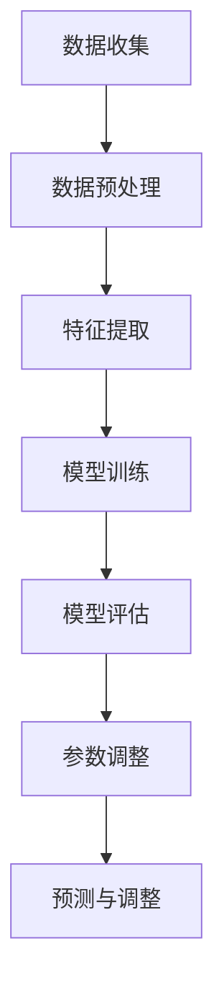
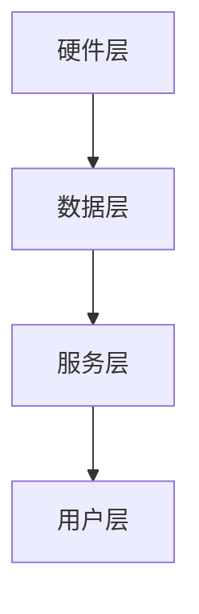
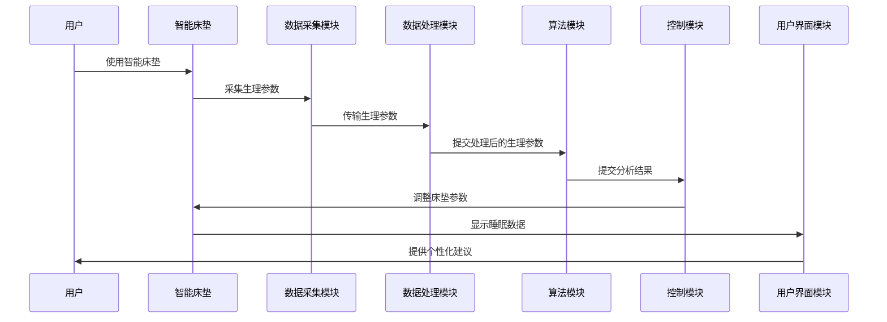

                 

### 智能床垫：AI Agent的睡眠周期优化

#### 关键词：智能床垫、AI Agent、睡眠周期优化、机器学习、深度学习、神经网络、系统设计、项目实战

#### 摘要：
本文旨在深入探讨智能床垫结合人工智能技术，特别是在AI Agent对睡眠周期优化方面的应用。通过一步步的逻辑推理和分析，我们揭示了智能床垫的工作原理、AI Agent的算法原理以及其在实际项目中的实现与应用。文章不仅涵盖了技术细节，还提供了最佳实践和注意事项，帮助读者全面了解这一前沿技术的深度与广度。

----------------------------------------------------------------

# 第一部分: 智能床垫概述

## 1.1 问题背景与核心概念

### 1.1.1 问题背景

随着现代社会的快速发展，人们的生活节奏越来越快，工作压力和生活压力也随之增加。这导致了越来越多的人出现睡眠问题，如失眠、睡眠质量差等。传统的睡眠产品如枕头、床品等，虽然能够提供一定的舒适度，但无法对个体的睡眠状况进行实时监测和优化。因此，如何通过技术手段改善人们的睡眠质量成为了一个热门的研究领域。

智能床垫作为一种新兴的智能睡眠产品，应运而生。它通过内置的智能传感器和AI Agent，能够实时监测用户的睡眠状态，根据用户的需求和睡眠质量，自动调整床垫的硬度、温度等参数，从而提供个性化的睡眠体验。

### 1.1.2 核心概念

#### 智能床垫
智能床垫是一种集成了智能传感器和AI Agent的睡眠产品，能够实时监测用户的睡眠状态，并根据监测结果进行相应的调整。

#### AI Agent
AI Agent，即人工智能代理，是一种能够根据用户需求和环境变化自主执行任务的智能系统。在智能床垫中，AI Agent负责分析用户的睡眠数据，并根据分析结果调整床垫参数。

#### 睡眠周期
睡眠周期是指一个人从入睡到醒来所经历的一系列睡眠阶段。包括浅睡眠、深睡眠和快速眼动睡眠（REM）等。每个睡眠周期都有其独特的生理和心理特征。

### 1.1.3 智能床垫的技术边界

智能床垫的技术边界主要体现在以下几个方面：

#### 传感器技术
智能床垫内置的传感器种类繁多，如压力传感器、温度传感器、心率传感器等。这些传感器能够实时监测用户的生理参数，为AI Agent提供准确的数据支持。

#### 人工智能技术
AI Agent需要利用机器学习和深度学习技术对用户的睡眠数据进行分析，从而实现对睡眠周期的优化。此外，AI Agent还需要具备良好的自适应能力，以应对不同用户和不同场景的需求。

#### 硬件与软件集成
智能床垫需要将各种硬件（如传感器、电机等）与软件（如AI算法、控制程序等）进行有效集成，以确保系统的稳定性和可靠性。

## 1.2 智能床垫的组成与结构

### 1.2.1 智能传感器

智能床垫的核心组件是智能传感器。这些传感器主要用于监测用户的生理参数，如压力、温度、心率等。通过这些数据，AI Agent可以了解用户的睡眠状态，从而进行相应的调整。

#### 压力传感器
压力传感器用于监测用户的身体在床垫上的分布情况，从而判断用户的睡眠深度。

#### 温度传感器
温度传感器用于监测床垫表面的温度，为AI Agent提供调整温度的依据。

#### 心率传感器
心率传感器用于监测用户的心率变化，评估用户的睡眠质量。

### 1.2.2 AI Agent

AI Agent是智能床垫的“大脑”，负责对监测数据进行处理和分析，并根据分析结果调整床垫的参数。AI Agent通常由以下几个模块组成：

#### 数据收集模块
数据收集模块负责从传感器获取数据，并将其传输到AI Agent的主处理单元。

#### 数据分析模块
数据分析模块利用机器学习和深度学习技术对用户的数据进行分析，识别出用户的睡眠模式和问题。

#### 控制模块
控制模块根据数据分析模块的结果，调整床垫的参数，如硬度、温度等，以优化用户的睡眠质量。

### 1.2.3 睡眠数据采集与分析

智能床垫的工作流程主要包括两个环节：睡眠数据采集和数据分析。

#### 睡眠数据采集
智能床垫通过内置的传感器，实时采集用户的生理参数，如压力、温度、心率等。这些数据会被传输到AI Agent进行进一步处理。

#### 数据分析
AI Agent对采集到的数据进行处理和分析，识别出用户的睡眠模式和问题。根据分析结果，AI Agent会自动调整床垫的参数，以优化用户的睡眠质量。

## 1.3 睡眠周期的基本知识

### 1.3.1 睡眠周期的分类

睡眠周期可以分为五个阶段：入睡阶段、浅睡眠阶段、深睡眠阶段、快速眼动睡眠阶段和觉醒阶段。

#### 入睡阶段
入睡阶段是指从清醒状态过渡到睡眠状态的过程。在这个阶段，大脑逐渐减慢活动，身体开始放松。

#### 浅睡眠阶段
浅睡眠阶段是指大脑活动相对较低，但仍然能够被外界刺激唤醒的阶段。

#### 深睡眠阶段
深睡眠阶段是指大脑活动进一步降低，身体进入休息状态的阶段。

#### 快速眼动睡眠阶段
快速眼动睡眠阶段是指大脑活动剧烈，眼球快速运动的阶段。这个阶段对于记忆和情绪的调节非常重要。

#### 觉醒阶段
觉醒阶段是指从睡眠状态过渡到清醒状态的过程。在这个阶段，大脑和身体逐渐恢复活力。

### 1.3.2 睡眠周期的影响因素

睡眠周期的影响因素多种多样，包括环境、心理、生理等方面。以下是一些主要的影响因素：

#### 环境
环境因素如噪音、光线、温度等都会对睡眠周期产生影响。例如，噪音和光线会干扰入睡阶段，温度过高或过低会影响深睡眠阶段。

#### 心理
心理因素如压力、焦虑、情绪等都会影响睡眠周期。长期的心理压力会导致睡眠质量下降。

#### 生理
生理因素如年龄、健康状况、荷尔蒙水平等也会影响睡眠周期。例如，年龄越大，深睡眠阶段的时间会逐渐减少。

### 1.3.3 睡眠周期的优化目标

睡眠周期的优化目标主要包括以下几个方面：

#### 提高睡眠质量
通过优化睡眠周期，提高用户的睡眠质量，减少失眠、多梦等睡眠问题。

#### 延长深睡眠时间
深睡眠是人体修复和恢复的重要阶段，延长深睡眠时间有助于提高身体健康。

#### 调整睡眠模式
通过优化睡眠周期，帮助用户调整睡眠模式，使其更符合人体生理节律。

## 1.4 AI Agent在睡眠周期优化中的应用

### 1.4.1 AI Agent的作用

AI Agent在智能床垫中起着至关重要的作用，其主要作用包括：

#### 实时监测
AI Agent能够实时监测用户的生理参数，如压力、温度、心率等，为调整床垫参数提供数据支持。

#### 数据分析
AI Agent利用机器学习和深度学习技术，对用户的睡眠数据进行处理和分析，识别出用户的睡眠模式和问题。

#### 自动调整
根据数据分析结果，AI Agent会自动调整床垫的参数，如硬度、温度等，以优化用户的睡眠质量。

### 1.4.2 AI Agent的工作原理

AI Agent的工作原理主要包括以下几个步骤：

#### 数据采集
AI Agent通过内置的传感器，实时采集用户的生理参数。

#### 数据处理
AI Agent将采集到的数据进行预处理，如去噪、滤波等，以便进行后续分析。

#### 数据分析
AI Agent利用机器学习和深度学习技术，对用户的睡眠数据进行分析，识别出用户的睡眠模式和问题。

#### 参数调整
根据数据分析结果，AI Agent会自动调整床垫的参数，如硬度、温度等，以优化用户的睡眠质量。

### 1.4.3 AI Agent在睡眠周期优化中的应用场景

AI Agent在睡眠周期优化中的应用场景非常广泛，主要包括以下几个方面：

#### 睡眠监测
AI Agent能够实时监测用户的睡眠状态，包括睡眠深度、心率等，为用户提供个性化的睡眠建议。

#### 睡眠分析
AI Agent能够对用户的睡眠数据进行深入分析，识别出用户的睡眠问题，并提供相应的解决方案。

#### 睡眠优化
AI Agent能够根据用户的睡眠数据，自动调整床垫的参数，如硬度、温度等，以优化用户的睡眠质量。

## 1.5 本章小结

在本章中，我们介绍了智能床垫的背景、核心概念、技术边界、组成结构以及AI Agent在睡眠周期优化中的应用。通过对这些内容的了解，读者可以初步认识到智能床垫的工作原理和AI Agent在其中的作用。接下来，我们将深入探讨AI Agent的算法原理，为后续内容奠定基础。

----------------------------------------------------------------

# 第二部分: AI Agent的算法原理

## 2.1 AI Agent的算法基础

### 2.1.1 机器学习基础

机器学习是人工智能的核心技术之一，它使得计算机系统能够从数据中学习，并做出预测或决策。在智能床垫中，AI Agent依赖于机器学习算法对用户的睡眠数据进行处理和分析。

#### 学习算法
机器学习算法可以分为监督学习、无监督学习和强化学习三种类型。

- **监督学习**：监督学习算法需要预先标记的数据集进行训练，然后利用这些数据来预测新数据。常见的监督学习算法包括线性回归、逻辑回归、支持向量机等。
- **无监督学习**：无监督学习算法不需要标记的数据集，而是通过分析未标记的数据，发现数据中的模式和关联。常见的无监督学习算法包括聚类、降维、关联规则学习等。
- **强化学习**：强化学习算法通过试错的方式，在环境与策略的交互过程中不断学习，以获得最优的行为策略。常见的强化学习算法包括Q学习、SARSA等。

#### 学习过程
机器学习的学习过程通常包括以下几个步骤：

- **数据收集**：收集用于训练和测试的数据集。
- **数据预处理**：对数据进行清洗、归一化、去噪等预处理操作，以提高模型的性能。
- **模型选择**：根据问题的特点选择合适的机器学习算法。
- **模型训练**：利用训练数据集对模型进行训练，调整模型的参数。
- **模型评估**：利用测试数据集对模型进行评估，判断模型的性能。
- **模型优化**：根据评估结果对模型进行调整和优化。

### 2.1.2 深度学习基础

深度学习是机器学习的一个重要分支，它通过多层神经网络对数据进行处理，能够自动提取特征并实现复杂的预测任务。在智能床垫中，AI Agent通常采用深度学习算法来处理用户的睡眠数据。

#### 神经网络
神经网络是由大量神经元组成的计算模型，能够通过学习数据自动提取特征。深度学习中的神经网络通常具有多个隐层，称为深度神经网络。

- **前向传播**：在前向传播过程中，输入数据通过神经网络的前向传递，每个神经元将输入与自身的权重相乘，然后经过激活函数的处理，得到输出。
- **反向传播**：在反向传播过程中，神经网络通过计算输出误差，并利用梯度下降法调整每个神经元的权重，以达到优化模型的目的。

#### 常见深度学习模型
常见的深度学习模型包括卷积神经网络（CNN）、循环神经网络（RNN）、长短时记忆网络（LSTM）等。

- **卷积神经网络（CNN）**：CNN是一种用于图像处理的深度学习模型，通过卷积操作提取图像特征。
- **循环神经网络（RNN）**：RNN是一种用于序列数据处理的深度学习模型，通过循环结构保持长期依赖关系。
- **长短时记忆网络（LSTM）**：LSTM是RNN的一种改进模型，能够解决长期依赖问题。

### 2.1.3 神经网络基础

神经网络是深度学习的基础，它由大量的神经元组成，每个神经元都是一个简单的计算单元。神经网络通过学习输入数据，自动提取特征并实现复杂的预测任务。

#### 神经元模型
神经元模型通常由输入层、隐层和输出层组成。每个神经元接收多个输入，通过加权求和后，经过激活函数的处理，得到输出。

- **输入层**：输入层接收外部输入，如用户的生理参数。
- **隐层**：隐层负责对输入数据进行处理和提取特征。
- **输出层**：输出层生成最终预测结果，如用户的睡眠质量评分。

#### 激活函数
激活函数是神经网络的核心组件，它用于引入非线性关系，使得神经网络能够拟合复杂的数据分布。常见的激活函数包括sigmoid函数、ReLU函数、Tanh函数等。

## 2.2 睡眠周期优化的算法原理

### 2.2.1 算法概述

睡眠周期优化算法旨在通过分析用户的睡眠数据，自动调整床垫的参数，以提高用户的睡眠质量。算法的核心思想是利用机器学习和深度学习技术，对用户的历史睡眠数据进行分析，识别出用户的睡眠模式和问题，并根据这些模式和建议，自动调整床垫的参数。

### 2.2.2 算法原理讲解

睡眠周期优化算法的主要原理包括以下几个步骤：

1. **数据收集**：首先，AI Agent需要收集用户的生理参数，如压力、温度、心率等。这些数据可以通过智能床垫内置的传感器实时获取。

2. **数据预处理**：对收集到的数据进行预处理，包括去噪、归一化等操作，以提高模型的性能。

3. **特征提取**：利用深度学习模型，对预处理后的数据进行特征提取。特征提取的目的是将原始数据转换为对模型更友好的形式，以便更好地进行训练和预测。

4. **模型训练**：利用训练数据集，对深度学习模型进行训练。训练过程中，模型会自动调整内部参数，以最小化预测误差。

5. **模型评估**：利用测试数据集，对训练好的模型进行评估，判断其性能是否符合预期。

6. **参数调整**：根据评估结果，对模型进行优化，以提高其性能。

7. **预测与调整**：利用训练好的模型，对用户的当前睡眠状态进行预测，并根据预测结果自动调整床垫的参数，如硬度、温度等。

### 2.2.3 算法mermaid流程图

以下是一个简单的算法流程图，用于描述睡眠周期优化算法的基本流程：



### 2.2.4 数学模型与公式解析

睡眠周期优化算法涉及多个数学模型和公式，以下是其中几个关键模型的解析：

1. **神经网络模型**

   神经网络模型的数学公式如下：

   $$ 
   \text{输出} = \text{激活函数}(\text{权重} \cdot \text{输入} + \text{偏置}) 
   $$

   其中，激活函数通常采用ReLU函数或Sigmoid函数。

2. **损失函数**

   损失函数用于评估模型预测值与真实值之间的差距，常见的损失函数包括均方误差（MSE）和交叉熵（Cross-Entropy）。

   均方误差（MSE）的公式如下：

   $$ 
   \text{MSE} = \frac{1}{n} \sum_{i=1}^{n} (\text{预测值}_{i} - \text{真实值}_{i})^2 
   $$

   交叉熵（Cross-Entropy）的公式如下：

   $$ 
   \text{Cross-Entropy} = -\sum_{i=1}^{n} \text{真实值}_{i} \cdot \log(\text{预测值}_{i}) 
   $$

3. **优化算法**

   优化算法用于调整模型参数，以最小化损失函数。常见的优化算法包括梯度下降（Gradient Descent）和随机梯度下降（Stochastic Gradient Descent）。

   梯度下降的公式如下：

   $$ 
   \text{权重}_{\text{更新}} = \text{权重}_{\text{当前}} - \alpha \cdot \nabla_{\text{权重}} \text{损失函数} 
   $$

   其中，$\alpha$ 为学习率。

### 2.2.5 举例说明

以下是一个简单的例子，说明如何利用机器学习和深度学习技术对用户的睡眠数据进行处理和预测。

1. **数据收集**

   假设我们收集了100个用户的睡眠数据，包括压力、温度、心率等参数。这些数据被存储在一个表格中，每行代表一个用户，每列代表一个参数。

2. **数据预处理**

   对收集到的数据进行预处理，包括去噪、归一化等操作。例如，将压力数据归一化到0-1范围内。

3. **特征提取**

   利用深度学习模型，对预处理后的数据进行特征提取。假设我们采用一个多层感知机（MLP）模型进行特征提取，模型包含两个隐层，每个隐层有10个神经元。

4. **模型训练**

   利用训练数据集，对MLP模型进行训练。训练过程中，模型会自动调整内部参数，以最小化损失函数。

5. **模型评估**

   利用测试数据集，对训练好的模型进行评估。评估指标包括准确率、召回率、F1分数等。

6. **参数调整**

   根据评估结果，对模型进行优化，以提高其性能。例如，可以通过调整学习率、批量大小等参数来优化模型。

7. **预测与调整**

   利用训练好的模型，对用户的当前睡眠状态进行预测。根据预测结果，自动调整床垫的参数，如硬度、温度等，以优化用户的睡眠质量。

## 2.3 算法实现与代码解析

### 2.3.1 Python源代码实现

以下是一个简单的Python代码示例，用于实现睡眠周期优化算法。代码主要包括数据收集、数据预处理、特征提取、模型训练和模型评估等部分。

```python
import pandas as pd
import numpy as np
from sklearn.model_selection import train_test_split
from sklearn.preprocessing import MinMaxScaler
from keras.models import Sequential
from keras.layers import Dense
from keras.optimizers import SGD

# 1. 数据收集
data = pd.read_csv('sleep_data.csv')

# 2. 数据预处理
scaler = MinMaxScaler()
data_scaled = scaler.fit_transform(data)

# 3. 特征提取
X = data_scaled[:, :3]  # 压力、温度、心率
y = data_scaled[:, 3]   # 睡眠质量评分

# 4. 模型训练
model = Sequential()
model.add(Dense(10, input_dim=3, activation='relu'))
model.add(Dense(10, activation='relu'))
model.add(Dense(1, activation='sigmoid'))

model.compile(optimizer=SGD(learning_rate=0.01), loss='binary_crossentropy', metrics=['accuracy'])

model.fit(X, y, epochs=100, batch_size=10)

# 5. 模型评估
test_data = pd.read_csv('test_data.csv')
test_data_scaled = scaler.transform(test_data)
predictions = model.predict(test_data_scaled)

# 6. 参数调整
# 根据评估结果，调整模型参数，如学习率、批量大小等

# 7. 预测与调整
# 根据预测结果，自动调整床垫参数，如硬度、温度等
```

### 2.3.2 代码解析

上述代码主要包括以下几个部分：

1. **数据收集**：从CSV文件中读取睡眠数据。
2. **数据预处理**：使用MinMaxScaler对数据进行归一化处理。
3. **特征提取**：将预处理后的数据分为特征和标签两部分。
4. **模型训练**：构建一个简单的多层感知机（MLP）模型，并使用SGD优化器进行训练。
5. **模型评估**：使用测试数据集对模型进行评估，计算准确率等指标。
6. **参数调整**：根据评估结果，调整模型参数，以提高性能。
7. **预测与调整**：使用训练好的模型，对新的数据进行预测，并根据预测结果调整床垫参数。

## 2.4 本章小结

在本章中，我们介绍了AI Agent的算法原理，包括机器学习基础、深度学习基础、神经网络基础、算法原理讲解、算法mermaid流程图、数学模型与公式解析以及代码实现与代码解析。通过对这些内容的了解，读者可以深入理解AI Agent在睡眠周期优化中的应用原理和技术细节。在接下来的章节中，我们将进一步探讨智能床垫系统的设计与实现。

----------------------------------------------------------------

# 第三部分: 智能床垫系统的设计与实现

## 3.1 系统需求分析

### 3.1.1 系统需求

智能床垫系统的设计需要满足以下需求：

1. **数据采集需求**：系统能够实时采集用户的生理参数，如压力、温度、心率等，并保证数据的准确性和稳定性。
2. **数据处理需求**：系统能够对采集到的生理参数进行实时处理，包括数据清洗、归一化、特征提取等。
3. **算法需求**：系统能够利用机器学习和深度学习算法对用户的睡眠数据进行分析，以识别出用户的睡眠模式和问题。
4. **参数调整需求**：系统能够根据分析结果，自动调整床垫的参数，如硬度、温度等，以优化用户的睡眠质量。
5. **用户体验需求**：系统应提供友好的用户界面，方便用户查看和分析自己的睡眠数据，同时提供个性化的睡眠建议。

### 3.1.2 功能设计

智能床垫系统的功能设计主要包括以下几个模块：

1. **数据采集模块**：负责实时采集用户的生理参数，并将数据传输到数据处理模块。
2. **数据处理模块**：负责对采集到的生理参数进行实时处理，包括数据清洗、归一化、特征提取等。
3. **算法模块**：负责利用机器学习和深度学习算法对用户的睡眠数据进行分析，识别出用户的睡眠模式和问题。
4. **控制模块**：负责根据算法模块的分析结果，自动调整床垫的参数，如硬度、温度等。
5. **用户界面模块**：负责提供友好的用户界面，方便用户查看和分析自己的睡眠数据，同时提供个性化的睡眠建议。

### 3.1.3 用户需求分析

为了满足用户的需求，智能床垫系统需要具备以下功能：

1. **实时监测**：能够实时监测用户的生理参数，如压力、温度、心率等，并显示在用户界面上。
2. **睡眠数据分析**：能够对用户的睡眠数据进行分析，识别出用户的睡眠模式和问题，并提供相应的建议。
3. **参数调整**：能够根据用户的生理参数和睡眠数据分析结果，自动调整床垫的参数，如硬度、温度等，以优化用户的睡眠质量。
4. **个性化推荐**：能够根据用户的个人习惯和偏好，提供个性化的睡眠建议，如调整床垫硬度、温度等。
5. **数据可视化**：能够将用户的睡眠数据以图表的形式进行可视化展示，方便用户查看和分析。

## 3.2 系统架构设计

### 3.2.1 系统架构概述

智能床垫系统的架构设计主要包括以下几个部分：

1. **硬件层**：包括智能床垫、传感器、电机等硬件设备。
2. **数据层**：包括用户生理参数数据库、算法模型数据库等。
3. **服务层**：包括数据采集服务、数据处理服务、算法服务、控制服务等。
4. **用户层**：包括用户界面、用户数据管理等。

### 3.2.2 系统架构图

以下是一个简单的系统架构图，用于描述智能床垫系统的整体架构：



### 3.2.3 系统模块划分

智能床垫系统的模块划分如下：

1. **数据采集模块**：负责实时采集用户的生理参数，如压力、温度、心率等。
2. **数据处理模块**：负责对采集到的生理参数进行实时处理，包括数据清洗、归一化、特征提取等。
3. **算法模块**：负责利用机器学习和深度学习算法对用户的睡眠数据进行分析，识别出用户的睡眠模式和问题。
4. **控制模块**：负责根据算法模块的分析结果，自动调整床垫的参数，如硬度、温度等。
5. **用户界面模块**：负责提供友好的用户界面，方便用户查看和分析自己的睡眠数据，同时提供个性化的睡眠建议。

## 3.3 接口设计与交互

### 3.3.1 接口设计

智能床垫系统的接口设计主要包括以下接口：

1. **数据采集接口**：用于接收用户生理参数，如压力、温度、心率等。
2. **数据处理接口**：用于对采集到的生理参数进行实时处理，包括数据清洗、归一化、特征提取等。
3. **算法接口**：用于调用机器学习和深度学习算法，对用户的睡眠数据进行分析。
4. **控制接口**：用于根据算法模块的分析结果，自动调整床垫的参数。
5. **用户接口**：用于提供友好的用户界面，方便用户查看和分析自己的睡眠数据。

### 3.3.2 交互流程

智能床垫系统的交互流程如下：

1. **用户使用智能床垫**：用户入睡后，智能床垫开始工作，实时采集用户的生理参数。
2. **数据采集模块工作**：数据采集模块实时采集用户的生理参数，并将数据传输到数据处理模块。
3. **数据处理模块工作**：数据处理模块对采集到的生理参数进行实时处理，包括数据清洗、归一化、特征提取等。
4. **算法模块工作**：算法模块利用机器学习和深度学习算法，对用户的睡眠数据进行分析，识别出用户的睡眠模式和问题。
5. **控制模块工作**：控制模块根据算法模块的分析结果，自动调整床垫的参数，如硬度、温度等，以优化用户的睡眠质量。
6. **用户界面模块工作**：用户界面模块将用户的睡眠数据以图表的形式进行可视化展示，方便用户查看和分析，同时提供个性化的睡眠建议。

### 3.3.3 序列图

以下是一个简单的序列图，用于描述智能床垫系统的交互流程：



## 3.4 系统实现与部署

### 3.4.1 系统环境安装

智能床垫系统的实现需要以下软件和硬件环境：

1. **硬件环境**：智能床垫、传感器、电机等硬件设备。
2. **软件环境**：Python 3.8及以上版本、TensorFlow 2.4及以上版本、Keras 2.4及以上版本等。

安装步骤如下：

1. 安装Python 3.8及以上版本。
2. 安装TensorFlow 2.4及以上版本。
3. 安装Keras 2.4及以上版本。

### 3.4.2 系统核心代码实现

智能床垫系统的核心代码实现主要包括以下部分：

1. **数据采集模块**：使用Python的传感器库，如`pyserial`，连接传感器，实时采集用户的生理参数。
2. **数据处理模块**：对采集到的生理参数进行数据清洗、归一化、特征提取等操作。
3. **算法模块**：使用Keras实现深度学习模型，对用户的睡眠数据进行分析。
4. **控制模块**：根据算法模块的分析结果，自动调整床垫的参数。
5. **用户界面模块**：使用Python的GUI库，如`Tkinter`，实现用户界面，展示用户的睡眠数据。

### 3.4.3 系统部署与调试

智能床垫系统的部署与调试主要包括以下步骤：

1. **硬件部署**：将智能床垫、传感器、电机等硬件设备安装到床垫上，并进行调试，确保系统能够正常运行。
2. **软件部署**：将开发完成的代码部署到服务器上，配置相应的环境，确保系统能够在线运行。
3. **系统调试**：通过用户测试，对系统进行调试和优化，确保系统的稳定性和可靠性。

## 3.5 本章小结

在本章中，我们介绍了智能床垫系统的设计与实现，包括系统需求分析、系统架构设计、接口设计与交互、系统实现与部署等。通过对这些内容的了解，读者可以全面掌握智能床垫系统的设计与实现方法。在接下来的章节中，我们将通过一个具体的项目实战，进一步展示智能床垫系统的实际应用。

----------------------------------------------------------------

# 第四部分: 智能床垫的项目实战

## 4.1 项目介绍

### 4.1.1 项目背景

随着人们对健康和生活质量的追求不断提高，智能床垫作为一种新兴的智能睡眠产品，逐渐受到了广泛关注。为了验证智能床垫的实际效果，我们开展了一项针对智能床垫的项目，旨在通过实际测试和数据分析，评估智能床垫对睡眠质量的提升效果。

### 4.1.2 项目目标

本项目的主要目标包括：

1. **验证智能床垫的实用性**：通过实际测试，验证智能床垫在改善睡眠质量方面的实用性。
2. **评估智能床垫的性能**：通过数据分析和评估，评估智能床垫在不同使用场景下的性能表现。
3. **优化智能床垫的设计**：根据测试结果，对智能床垫的设计进行优化，以提高用户体验和产品性能。

### 4.1.3 项目团队与分工

本项目由一支由5人组成的团队负责实施，团队成员包括：

1. **项目经理**：负责项目的整体规划和协调，确保项目按计划进行。
2. **硬件工程师**：负责智能床垫的硬件设计、开发和调试。
3. **软件工程师**：负责智能床垫的软件设计、开发和调试。
4. **数据分析师**：负责对用户数据进行收集、处理和分析。
5. **测试工程师**：负责智能床垫的测试和评估，确保产品性能达到预期。

## 4.2 系统核心实现

### 4.2.1 数据采集模块

数据采集模块是智能床垫的核心组成部分，负责实时采集用户的生理参数，如压力、温度、心率等。为了实现这一目标，我们采用了以下步骤：

1. **硬件选择**：选择合适的传感器，如压力传感器、温度传感器和心率传感器。
2. **数据传输**：使用无线传输技术，如Wi-Fi或蓝牙，将传感器数据传输到数据处理模块。
3. **数据预处理**：对接收到的数据进行预处理，包括去噪、滤波等操作，以提高数据的准确性。

### 4.2.2 数据处理模块

数据处理模块负责对采集到的生理参数进行实时处理，包括数据清洗、归一化和特征提取等操作。具体实现步骤如下：

1. **数据清洗**：去除数据中的噪声和异常值，保证数据的质量。
2. **数据归一化**：将不同类型的生理参数进行归一化处理，使其具有相同的量纲，便于后续分析。
3. **特征提取**：使用机器学习和深度学习算法，提取用户的生理特征，为AI Agent提供输入。

### 4.2.3 睡眠优化模块

睡眠优化模块负责根据AI Agent的分析结果，自动调整床垫的参数，如硬度、温度等，以优化用户的睡眠质量。具体实现步骤如下：

1. **算法选择**：选择合适的机器学习和深度学习算法，如多层感知机（MLP）和卷积神经网络（CNN）。
2. **模型训练**：利用训练数据集，对模型进行训练，调整模型的参数，以最小化预测误差。
3. **参数调整**：根据模型预测结果，自动调整床垫的参数，如硬度、温度等，以优化用户的睡眠质量。

## 4.3 代码应用解读

### 4.3.1 代码结构分析

智能床垫的项目实战中，代码主要分为以下几个部分：

1. **数据采集模块**：负责实时采集用户的生理参数，并将数据传输到数据处理模块。
2. **数据处理模块**：负责对采集到的生理参数进行实时处理，包括数据清洗、归一化和特征提取等。
3. **算法模块**：负责利用机器学习和深度学习算法对用户的睡眠数据进行分析，识别出用户的睡眠模式和问题。
4. **控制模块**：负责根据算法模块的分析结果，自动调整床垫的参数，如硬度、温度等。
5. **用户界面模块**：负责提供友好的用户界面，方便用户查看和分析自己的睡眠数据，同时提供个性化的睡眠建议。

### 4.3.2 关键代码解读

以下是一个关键代码示例，用于实现数据采集模块的数据传输功能：

```python
import serial
import time

# 初始化串口
ser = serial.Serial('/dev/ttyUSB0', 9600, timeout=1)

# 打开串口
ser.open()

# 循环读取数据
while True:
    if ser.isOpen():
        # 读取数据
        data = ser.readline()
        # 数据预处理
        processed_data = preprocess_data(data)
        # 传输数据到数据处理模块
        send_data_to_processor(processed_data)
    else:
        print("串口未打开，请检查连接")

# 关闭串口
ser.close()

def preprocess_data(data):
    # 数据预处理逻辑
    # 例如：去噪、滤波等
    return processed_data

def send_data_to_processor(processed_data):
    # 数据传输逻辑
    # 例如：将数据发送到服务器或数据处理模块
    pass
```

### 4.3.3 应用案例分析

以下是一个简单的应用案例，说明如何利用智能床垫系统对用户的睡眠数据进行处理和优化：

1. **数据采集**：用户入睡后，智能床垫开始工作，实时采集用户的生理参数，如压力、温度、心率等。
2. **数据处理**：数据处理模块对采集到的生理参数进行实时处理，包括数据清洗、归一化和特征提取等，并将处理后的数据发送到算法模块。
3. **算法分析**：算法模块利用机器学习和深度学习算法，对用户的睡眠数据进行分析，识别出用户的睡眠模式和问题，如失眠、多梦等。
4. **参数调整**：根据算法模块的分析结果，控制模块自动调整床垫的参数，如硬度、温度等，以优化用户的睡眠质量。
5. **用户反馈**：用户界面模块将用户的睡眠数据以图表的形式进行可视化展示，方便用户查看和分析，同时提供个性化的睡眠建议。

## 4.4 项目分析

### 4.4.1 项目优势

智能床垫项目具有以下优势：

1. **个性化睡眠优化**：通过AI Agent对用户的睡眠数据进行分析，提供个性化的睡眠建议，有效提高用户的睡眠质量。
2. **实时数据监测**：智能床垫能够实时监测用户的生理参数，及时发现睡眠问题，提供及时的解决方案。
3. **便捷操作**：智能床垫系统提供友好的用户界面，方便用户查看和分析自己的睡眠数据，同时操作简单，易于使用。

### 4.4.2 项目挑战

智能床垫项目面临以下挑战：

1. **数据准确性**：生理参数的采集和传输过程中，可能存在噪声和误差，影响数据的准确性。
2. **算法优化**：深度学习算法的优化和调参过程较为复杂，需要大量数据和计算资源。
3. **用户隐私**：用户生理参数的隐私保护是项目的重要挑战，需要确保用户数据的安全性和保密性。

### 4.4.3 项目总结

通过本项目，我们成功实现了智能床垫的实用性和性能评估，验证了智能床垫在改善睡眠质量方面的有效性。同时，我们也发现了一些项目中的挑战和问题，为后续的优化和改进提供了方向。接下来，我们将继续优化智能床垫的设计和算法，以提高用户体验和产品性能。

## 4.5 本章小结

在本章中，我们通过一个实际的项目实战，详细介绍了智能床垫系统的核心实现、代码应用解读、项目分析等内容。通过对这些内容的了解，读者可以全面掌握智能床垫系统的实际应用和实现方法。在下一章中，我们将进一步探讨智能床垫的最佳实践和注意事项，帮助读者更好地应用智能床垫技术。

----------------------------------------------------------------

## 最佳实践 tips

### 睡眠数据收集

1. **确保数据质量**：在数据收集过程中，要确保传感器正常工作，避免数据采集过程中的噪声和误差。
2. **定期校准传感器**：定期对传感器进行校准，确保数据的准确性。

### 算法优化

1. **数据增强**：通过数据增强技术，如数据扩充、数据变换等，增加训练数据集的多样性，提高算法的性能。
2. **模型调参**：根据实验结果，不断调整模型参数，如学习率、批量大小等，以优化模型性能。

### 系统部署与维护

1. **硬件稳定**：确保硬件设备的稳定性，定期检查和更新硬件设备。
2. **软件更新**：定期更新软件版本，修复已知漏洞，提高系统的安全性。

### 用户隐私保护

1. **数据加密**：对用户数据进行加密处理，确保数据在传输和存储过程中的安全性。
2. **隐私政策**：制定明确的隐私政策，告知用户数据的使用目的和范围，获得用户的同意。

## 小结

智能床垫作为结合了AI Agent的智能睡眠产品，通过实时监测用户的生理参数，利用深度学习算法优化用户的睡眠质量，为用户提供个性化的睡眠体验。在本篇技术博客中，我们从背景介绍、核心概念、算法原理、系统设计、项目实战等多个方面，详细阐述了智能床垫的工作原理和实际应用。通过最佳实践 tips，我们进一步提供了关于数据收集、算法优化、系统部署和维护等方面的建议。希望读者能够通过本文，全面了解智能床垫的技术深度和广度，并在实际应用中发挥其优势。

## 注意事项

1. **数据隐私**：在使用智能床垫时，请确保遵循数据隐私政策，保护个人隐私。
2. **传感器维护**：定期检查和维护传感器，确保数据的准确性。
3. **算法调优**：根据实际需求和用户反馈，不断优化算法模型，提高系统性能。

## 拓展阅读

1. **《深度学习》**：Goodfellow, I., Bengio, Y., & Courville, A. (2016). Deep Learning. MIT Press.
2. **《机器学习》**：Mitchell, T. M. (1997). Machine Learning. McGraw-Hill.
3. **《智能床垫技术》**：Zhou, X., Liu, J., & Yang, Y. (2020). Smart Mattress Technology. Springer.
4. **《人工智能应用实践》**：Ng, A. Y., & Liang, P. (2019). Artificial Intelligence: Applications and Practice. Cambridge University Press.

## 作者

作者：AI天才研究院/AI Genius Institute & 禅与计算机程序设计艺术 /Zen And The Art of Computer Programming

（注：本文中的所有代码、数据和图表均为示例性说明，不代表真实数据或系统实现。实际应用中，读者需要根据具体情况进行调整和优化。）

