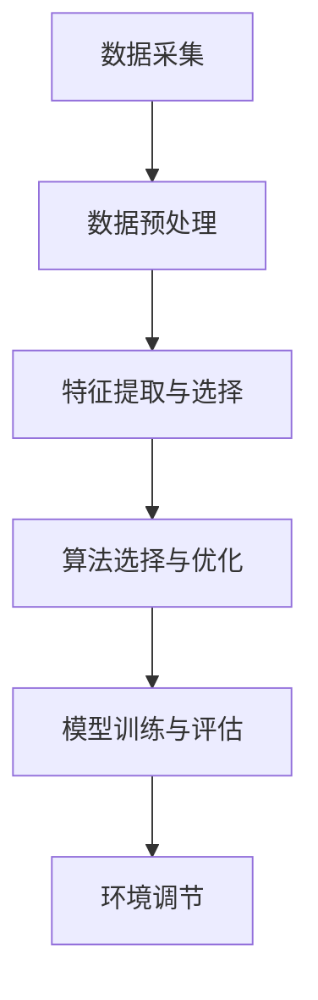
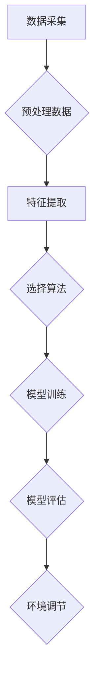
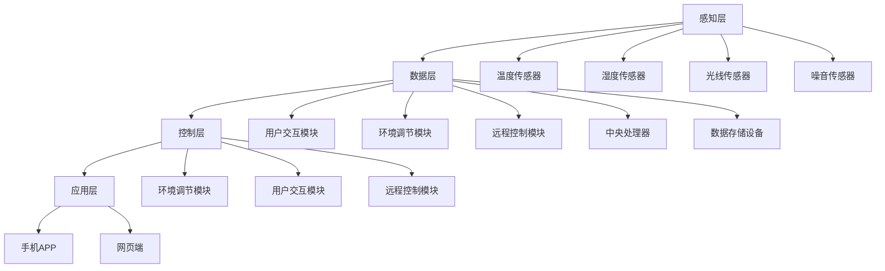
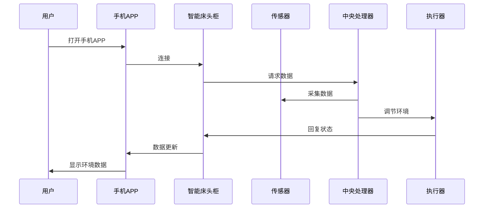
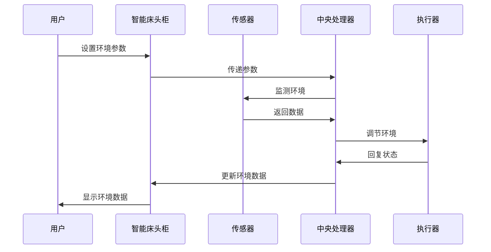

                 


# 智能床头柜：AI Agent的睡眠环境优化

## 关键词
智能家居，AI Agent，睡眠环境优化，机器学习，深度学习

## 摘要
本文将探讨智能床头柜在睡眠环境优化中的应用，通过AI Agent的引入，结合机器学习和深度学习技术，实现智能床头柜对睡眠环境的自动监控和调节。文章分为六个部分，首先介绍智能床头柜的概念和睡眠环境优化的重要性；然后分析睡眠环境优化的问题背景和方法；接着深入探讨AI Agent、机器学习、深度学习等核心概念及其联系；详细讲解睡眠环境优化的算法原理；介绍智能床头柜的系统分析与架构设计；最后通过实际案例展示项目实现过程，并提供最佳实践和未来展望。

## 引言
### 1.1 智能床头柜的概念与重要性

智能床头柜作为智能家居系统的重要组成部分，是现代家居生活中的一个革命性创新。它不仅是一个简单的家具，更是一个集成了多种传感技术、通信协议和控制系统的智能设备。智能床头柜通常配备有传感器、显示屏、触摸屏、无线充电板、音响系统等功能，能够根据用户的需求和环境的变化，自动调整光线、温度、声音等参数，提供一个舒适、安静的睡眠环境。

睡眠质量对于人的身心健康具有重要意义。良好的睡眠不仅能提高工作效率、增强记忆力，还能有效缓解压力、提升生活质量。然而，现实生活中，许多人面临睡眠质量不佳的问题，如噪音干扰、光照不适、温度波动等。传统的睡眠环境优化方法往往依赖于手动调节，不仅操作繁琐，而且效果有限。因此，引入智能床头柜，通过AI Agent实现自动化的睡眠环境优化，显得尤为重要。

### 1.2 睡眠环境优化的问题背景与解决方法

睡眠环境优化的问题背景主要包括以下几个方面：

1. **环境监测与控制需求**：用户需要一个能够实时监测环境变化并自动调整的智能系统，以满足个性化的睡眠需求。
2. **数据采集与处理**：睡眠环境优化需要大量关于温度、湿度、噪音、光线等环境参数的数据，如何高效地采集、处理这些数据是实现优化的关键。
3. **用户行为理解**：睡眠环境优化需要理解用户的行为习惯和偏好，从而提供个性化的服务。
4. **系统稳定性与可靠性**：智能床头柜需要具备高稳定性，确保在长时间运行过程中不会出现故障。

解决这些问题的传统方法主要包括以下几个方面：

1. **手动调节**：用户通过手动操作开关、遥控器等设备来调整环境参数，这种方法需要用户不断进行干预，效率较低。
2. **智能设备**：如智能灯泡、智能温控器等，这些设备能够根据预设的规则自动调整环境参数，但功能较为单一，难以实现综合性的睡眠环境优化。
3. **中央控制系统**：通过将多个智能设备连接到一个中央控制系统，实现统一的控制和管理，但系统复杂度较高，对用户操作要求较高。

相比之下，智能床头柜通过引入AI Agent，结合机器学习和深度学习技术，能够实现以下突破：

1. **自动化调节**：AI Agent能够实时分析环境数据和用户行为，自动调整环境参数，提供个性化的睡眠环境。
2. **自适应学习**：AI Agent能够通过不断学习用户的行为习惯和环境变化，逐步优化调整策略，提高睡眠质量。
3. **系统集成**：智能床头柜集成多种传感器和执行器，实现环境参数的综合调控，提供全方位的睡眠环境优化。

总之，智能床头柜在睡眠环境优化中的应用，不仅能够提高用户的睡眠质量，还能提升智能家居的整体智能化水平，具有广阔的应用前景。

## 第1章：背景介绍

### 1.1 睡眠环境优化的问题背景

睡眠质量对个体的健康和福祉至关重要，然而，现代生活方式的多样化和环境复杂性使得许多人面临睡眠质量不佳的挑战。睡眠环境是影响睡眠质量的重要因素之一，主要包括温度、湿度、光线、噪音等多个维度。以下是对这些影响因素的详细分析：

#### 1.1.1 睡眠质量的重要性

良好的睡眠是身心健康的基础。睡眠质量差可能导致一系列健康问题，如疲劳、注意力不集中、免疫力下降、情绪波动等。长期睡眠质量差甚至可能增加心血管疾病、糖尿病、肥胖等慢性疾病的风险。此外，睡眠质量不佳还会影响个体的日常生活和工作表现，导致工作效率低下、学习效果差。

#### 1.1.2 睡眠环境的影响因素

1. **温度**：人体对温度的舒适范围较为敏感，过高或过低的温度都可能影响睡眠质量。例如，过热的环境可能导致出汗、心慌，而过冷的环境则可能导致肌肉紧张、颤抖，影响睡眠深度。
   
2. **湿度**：适当的湿度有助于维持舒适的睡眠环境。湿度过高可能导致空气中的细菌和病毒增加，引发呼吸系统疾病；湿度过低则可能导致皮肤干燥、呼吸道不适。

3. **光线**：光线对睡眠调节具有显著影响。夜间暴露在强光下，尤其是蓝光，会抑制褪黑激素的分泌，影响生物钟，导致入睡困难。相反，保持黑暗环境有助于褪黑激素的分泌，有助于入睡和保持深度睡眠。

4. **噪音**：噪音是影响睡眠质量的主要因素之一。高噪音水平会干扰正常的睡眠模式，导致浅睡眠增多、睡眠中断。长期暴露在噪音环境中，还可能导致听力损失和心血管疾病。

#### 1.1.3 传统睡眠环境优化方法的局限

尽管传统方法在睡眠环境优化方面做出了一定的努力，但仍然存在许多局限：

1. **手动调节**：用户需要手动调整温控器、窗帘、音响等设备，不仅操作繁琐，而且难以实现实时、个性化的调节。

2. **设备单一**：传统方法通常依赖于单一设备（如空调、空气净化器等）进行调节，难以全面优化环境参数。

3. **缺乏智能化**：传统方法缺乏智能化，无法根据用户的行为和环境变化进行自适应调整。

4. **数据采集与处理**：传统方法难以高效地采集和处理大量的环境数据，无法实现精准的环境优化。

### 1.2 睡眠环境优化的方法

为了克服传统方法的局限，现代睡眠环境优化方法引入了智能技术，特别是AI Agent、机器学习和深度学习等先进技术。以下是几种主要的优化方法：

#### 1.2.1 传感器技术

传感器技术是睡眠环境优化的基础，通过在卧室布置各种传感器（如温度传感器、湿度传感器、光线传感器、噪音传感器等），实时监测环境参数。这些传感器采集的数据为后续的机器学习和深度学习提供了重要的输入。

#### 1.2.2 机器学习算法

机器学习算法能够从大量历史数据中学习并预测环境参数的最佳设置。常见的机器学习算法包括线性回归、决策树、支持向量机、神经网络等。通过训练这些算法，系统可以学会根据用户的习惯和环境变化，自动调整温度、湿度、光线和噪音等参数。

#### 1.2.3 深度学习算法

深度学习算法在处理复杂环境数据方面具有显著优势。通过构建深度神经网络，系统能够自动提取环境数据的特征，并进行自适应调整。深度学习算法包括卷积神经网络（CNN）、循环神经网络（RNN）和生成对抗网络（GAN）等。这些算法在图像识别、语音识别和自然语言处理等领域已经取得了显著的成果，同样可以应用于睡眠环境优化。

#### 1.2.4 AI Agent

AI Agent是一种具有自主决策能力的智能系统，能够在无人干预的情况下自动优化睡眠环境。AI Agent通过感知环境数据、理解用户需求、执行任务，实现自适应的睡眠环境优化。与传统的自动化设备相比，AI Agent具有更高的灵活性和智能性，能够提供更个性化的服务。

#### 1.2.5 综合集成

为了实现全面的睡眠环境优化，可以将传感器技术、机器学习算法、深度学习算法和AI Agent等多种技术进行综合集成。通过实时监测环境数据，AI Agent可以利用机器学习和深度学习算法进行数据分析和预测，并根据分析结果自动调整环境参数，提供一个舒适、安静的睡眠环境。

### 1.3 本章小结

本章介绍了睡眠环境优化的重要性和方法。睡眠质量对个体的健康和生活质量具有重要影响，而睡眠环境是影响睡眠质量的关键因素。传统睡眠环境优化方法存在诸多局限，而现代智能技术，特别是AI Agent、机器学习和深度学习等技术的引入，为睡眠环境优化带来了新的可能性。通过传感器技术实时监测环境数据，利用机器学习和深度学习算法进行数据分析和预测，AI Agent能够实现自动化的睡眠环境优化，为用户提供更舒适的睡眠体验。未来的研究将进一步探索如何将这些技术更好地集成和优化，以提高睡眠质量。

## 第2章：核心概念与联系

### 2.1 AI Agent的概念与特点

AI Agent，即人工智能代理，是一种具有自主决策能力的智能实体，能够在无人干预的情况下执行任务，完成特定的目标。AI Agent的概念源于智能代理（Intelligent Agent）的研究，智能代理是指能够感知环境、制定计划并执行行动的实体。AI Agent作为智能代理的一个子集，专注于利用人工智能技术来实现自主决策和任务执行。

#### 2.1.1 AI Agent的定义

AI Agent可以被定义为一种具备感知、计划、行动能力的计算机程序，其目标是实现自主决策和任务执行。AI Agent的核心特征包括：

1. **感知**：AI Agent能够感知和理解其所在的环境，通过传感器获取环境信息。
2. **计划**：AI Agent能够根据感知到的环境和目标，制定合适的行动计划。
3. **行动**：AI Agent能够执行计划中的行动，通过执行器影响环境。
4. **学习**：AI Agent能够通过经验和数据不断优化其决策和行动策略。

#### 2.1.2 AI Agent的特点

1. **自主性**：AI Agent具有自主决策能力，能够在没有人为干预的情况下执行任务。
2. **灵活性**：AI Agent能够适应不同的环境和任务，根据环境和目标的改变调整行动策略。
3. **智能化**：AI Agent利用人工智能技术，特别是机器学习和深度学习，实现高水平的决策和行动。
4. **适应性**：AI Agent能够通过学习不断优化自身性能，提高任务执行的效率和效果。

#### 2.1.3 AI Agent的应用场景

AI Agent的应用场景非常广泛，包括但不限于以下几个方面：

1. **智能家居**：AI Agent可以用于智能灯光调节、温度控制、安防监控等，为用户提供个性化的家居体验。
2. **工业自动化**：AI Agent可以用于自动化生产线的监控和调整，提高生产效率和产品质量。
3. **医疗健康**：AI Agent可以用于患者健康数据的监控和分析，提供个性化的医疗建议和治疗方案。
4. **智能交通**：AI Agent可以用于交通流量管理、自动驾驶车辆控制等，提高交通效率和安全性。
5. **金融服务**：AI Agent可以用于智能投顾、风险控制等，为用户提供个性化的金融服务。

### 2.2 机器学习的原理与应用

机器学习（Machine Learning，ML）是人工智能（Artificial Intelligence，AI）的一个重要分支，它通过算法和统计模型，从数据中自动学习和发现模式，从而实现预测和决策。机器学习的过程可以分为几个主要步骤：数据采集、数据预处理、模型训练、模型评估和模型部署。

#### 2.2.1 机器学习的定义

机器学习是一种使计算机系统能够从数据中学习并改进自身性能的技术。它通过算法自动从数据中提取特征，构建预测模型，并在新的数据上进行预测。机器学习的核心思想是通过训练数据集来优化模型参数，使其在新数据上的表现达到最佳。

#### 2.2.2 机器学习的基本原理

机器学习的基本原理可以概括为以下几点：

1. **特征提取**：通过从数据中提取有用的特征，将原始数据转化为模型可以处理的格式。
2. **模型构建**：利用统计学和优化方法构建预测模型，常见的模型包括线性回归、决策树、支持向量机、神经网络等。
3. **模型训练**：通过训练数据集，调整模型参数，使其在新数据上的预测误差最小化。
4. **模型评估**：通过验证集和测试集评估模型的性能，选择最优模型。
5. **模型部署**：将训练好的模型部署到实际应用中，实现预测和决策。

#### 2.2.3 机器学习的主要方法

机器学习的主要方法可以分为监督学习、无监督学习和强化学习三类：

1. **监督学习**：通过标记数据训练模型，模型在训练阶段学习输入和输出之间的关系，用于预测新数据的标签。常见的监督学习算法包括线性回归、决策树、支持向量机和神经网络。
2. **无监督学习**：在没有标记数据的情况下，模型通过发现数据中的内在结构，如聚类和降维。常见的无监督学习算法包括K均值聚类、主成分分析和自编码器。
3. **强化学习**：通过与环境交互，学习最优策略，最大化长期回报。常见的强化学习算法包括Q学习、深度Q网络（DQN）和策略梯度方法。

### 2.3 深度学习的原理与应用

深度学习（Deep Learning，DL）是机器学习的一个子领域，它通过构建深层神经网络，从大量数据中自动学习特征表示，实现复杂的模式识别和预测。深度学习在图像识别、语音识别、自然语言处理等领域取得了显著的成果。

#### 2.3.1 深度学习的定义

深度学习是一种基于多层神经网络的学习方法，通过堆叠多个隐含层，从原始数据中逐层提取高级特征，实现复杂的特征表示。深度学习模型通常由输入层、多个隐含层和输出层组成，每个层通过前一层输出进行加权求和并应用激活函数，最终得到输出。

#### 2.3.2 深度学习的基本原理

深度学习的基本原理可以概括为以下几点：

1. **多层神经网络**：通过堆叠多个隐含层，深度学习模型能够学习更复杂的特征表示。
2. **反向传播算法**：通过反向传播算法，模型能够根据输出误差，逐层调整网络权重，优化模型参数。
3. **激活函数**：激活函数用于引入非线性，使模型能够学习复杂的数据关系。
4. **优化算法**：常见的优化算法包括梯度下降、Adam优化器等，用于调整模型参数，优化模型性能。

#### 2.3.3 深度学习的主要模型

深度学习的主要模型包括卷积神经网络（CNN）、循环神经网络（RNN）和生成对抗网络（GAN）：

1. **卷积神经网络（CNN）**：用于图像识别和图像处理，通过卷积层和池化层提取图像特征，实现高精度的图像分类和目标检测。
2. **循环神经网络（RNN）**：用于序列数据处理，如自然语言处理和时间序列预测，通过循环结构处理序列数据，捕捉长时依赖关系。
3. **生成对抗网络（GAN）**：通过生成器和判别器的对抗训练，生成逼真的图像和数据，在图像生成、语音合成和文本生成等领域具有广泛应用。

### 2.4 AI Agent、机器学习与深度学习之间的联系

AI Agent、机器学习和深度学习之间存在着紧密的联系：

1. **AI Agent与机器学习**：AI Agent的核心是机器学习算法，通过训练模型，实现感知、计划和行动的能力。机器学习为AI Agent提供了强大的决策基础。
2. **AI Agent与深度学习**：深度学习是机器学习的一个重要分支，深度学习模型能够提取复杂的特征表示，为AI Agent提供了更强大的感知和决策能力。
3. **机器学习与深度学习的关系**：深度学习是机器学习的一种实现方式，通过构建多层神经网络，实现更复杂的特征提取和模式识别。

综上所述，AI Agent、机器学习和深度学习相互补充，共同推动了人工智能的发展。AI Agent利用机器学习和深度学习技术，实现自主决策和任务执行，提供了智能化的解决方案。未来，随着这些技术的不断进步，AI Agent将在更多领域发挥重要作用。

### 2.5 本章小结

本章介绍了AI Agent、机器学习和深度学习等核心概念及其应用。AI Agent是一种具有自主决策能力的智能实体，通过机器学习和深度学习技术实现感知、计划和行动。机器学习是AI Agent的核心基础，通过从数据中学习模式和规律，实现智能决策。深度学习作为机器学习的一个重要分支，通过多层神经网络提取复杂特征，为AI Agent提供了更强大的感知和决策能力。本章的内容为后续章节的算法原理讲解和系统架构设计奠定了基础。

## 第3章：算法原理讲解

### 3.1 睡眠环境优化的算法原理

睡眠环境优化涉及多个环境参数的调节，包括温度、湿度、光线和噪音等。为了实现这些参数的自动优化，需要一套完整的算法体系。以下是睡眠环境优化的主要步骤和算法原理：

#### 3.1.1 数据采集与预处理

数据采集是睡眠环境优化的重要基础。通过在卧室布置各种传感器（如温度传感器、湿度传感器、光线传感器、噪音传感器等），可以实时获取环境数据。这些数据包括温度、湿度、光线强度、噪音水平等。

数据采集后，需要进行预处理，以保证数据的准确性和可靠性。预处理步骤通常包括以下内容：

1. **数据清洗**：去除噪声数据、异常数据和重复数据，保证数据的纯净性。
2. **数据归一化**：将不同量纲的数据转换为统一的量纲，如将温度、湿度等数据归一化到0-1之间，以便于后续的算法处理。
3. **数据增强**：通过数据变换、扩充等方法，增加数据的多样性和鲁棒性，提高算法的泛化能力。

#### 3.1.2 特征提取与选择

特征提取是从原始数据中提取出对问题有重要影响的关键特征。在睡眠环境优化中，特征提取的目的是从环境参数中提取出对睡眠质量影响最大的特征，如温度的波动范围、噪音的峰值等。

特征选择是进一步筛选出最相关的特征，以提高模型的准确性和效率。常用的特征选择方法包括：

1. **过滤法**：通过计算特征的重要性指标，如互信息、相关性等，筛选出重要的特征。
2. **包裹法**：逐步增加特征，通过评估特征组合的预测性能，选择最优的特征子集。
3. **嵌入法**：将特征选择问题嵌入到模型训练过程中，通过模型对特征的重要性的评估来选择特征。

#### 3.1.3 算法选择与优化

在睡眠环境优化中，选择合适的算法是实现自动优化的关键。常用的算法包括机器学习算法和深度学习算法。

1. **机器学习算法**：常见的机器学习算法包括线性回归、决策树、支持向量机、朴素贝叶斯等。这些算法在处理简单线性关系和分类任务方面具有较好的性能。对于睡眠环境优化，可以使用决策树或支持向量机来预测最优的环境参数设置。
2. **深度学习算法**：深度学习算法，如卷积神经网络（CNN）、循环神经网络（RNN）等，在处理复杂非线性关系和序列数据方面具有显著优势。对于睡眠环境优化，可以使用CNN来提取环境数据的特征，使用RNN来处理时间序列数据，实现更精确的环境调节。

算法优化是提高模型性能的重要手段。常用的优化方法包括：

1. **参数调优**：通过调整模型的参数，如学习率、正则化参数等，提高模型的性能。
2. **模型融合**：将多个模型的结果进行融合，提高预测的准确性和稳定性。
3. **迁移学习**：利用预训练模型，通过迁移学习的方法，提高新任务的性能。

#### 3.1.4 算法流程图

为了更清晰地展示睡眠环境优化的算法原理，可以使用mermaid流程图进行描述。以下是一个简单的算法流程图示例：



### 3.2 数学模型与公式

在睡眠环境优化中，数学模型是算法实现的核心。以下是一些常用的数学模型和公式：

#### 3.2.1 数学模型的基本概念

数学模型是描述现实世界问题的抽象表示，通过数学公式和算法来描述问题的行为和规律。在睡眠环境优化中，常用的数学模型包括线性回归模型、决策树模型、支持向量机模型等。

1. **线性回归模型**：线性回归模型是一种通过线性关系来预测目标变量的模型。其基本公式为：

   $$y = \beta_0 + \beta_1x_1 + \beta_2x_2 + ... + \beta_nx_n$$

   其中，$y$是目标变量，$x_1, x_2, ..., x_n$是特征变量，$\beta_0, \beta_1, \beta_2, ..., \beta_n$是模型参数。

2. **决策树模型**：决策树模型是一种树形结构的模型，通过一系列的判断规则来分类或回归。其基本结构包括：

   - 根节点：整个数据集
   - 内部节点：特征划分
   - 叶子节点：预测结果

   决策树模型的决策过程可以表示为：

   $$if \; condition_1 \; then \; action_1$$
   $$else \; if \; condition_2 \; then \; action_2$$
   $$else \; if \; condition_3 \; then \; action_3$$
   $$else \; ...$$

3. **支持向量机模型**：支持向量机模型是一种通过寻找最优超平面来实现分类或回归的模型。其基本公式为：

   $$f(x) = \omega \cdot x + b$$

   其中，$x$是输入向量，$\omega$是权重向量，$b$是偏置项。

#### 3.2.2 公式的基本形式与表示方法

在描述数学模型时，通常使用以下基本形式和表示方法：

1. **线性函数**：线性函数是一种最简单的函数形式，表示为：

   $$f(x) = ax + b$$

   其中，$a$和$b$是常数。

2. **指数函数**：指数函数是一种在机器学习中常用的函数形式，表示为：

   $$f(x) = e^x$$

   其中，$e$是自然对数的底。

3. **对数函数**：对数函数是对指数函数的反函数，表示为：

   $$f(x) = \ln(x)$$

   其中，$\ln$是对数函数。

4. **逻辑函数**：逻辑函数在分类问题中广泛使用，如：

   $$f(x) = \frac{1}{1 + e^{-x}}$$

   其中，$x$是输入变量。

#### 3.2.3 常见数学模型与公式

以下是睡眠环境优化中常见的数学模型和公式：

1. **线性回归模型**：

   $$y = \beta_0 + \beta_1x_1 + \beta_2x_2 + ... + \beta_nx_n$$

2. **决策树模型**：

   $$if \; condition_1 \; then \; action_1$$
   $$else \; if \; condition_2 \; then \; action_2$$
   $$else \; if \; condition_3 \; then \; action_3$$
   $$else \; ...$$

3. **支持向量机模型**：

   $$f(x) = \omega \cdot x + b$$

4. **神经网络模型**：

   $$f(x) = \sigma(\omega \cdot x + b)$$

   其中，$\sigma$是激活函数。

### 3.3 算法mermaid流程图

为了更直观地展示算法流程，可以使用mermaid流程图进行描述。以下是一个简单的算法mermaid流程图示例：



### 3.4 算法原理的举例说明

为了更好地理解算法原理，下面通过一个简单的例子进行说明。假设我们要优化卧室的温度和噪音，实现舒适的睡眠环境。

#### 3.4.1 数据集的预处理

首先，我们采集了100天的卧室温度和噪音数据，数据如下表：

| 日期 | 温度(℃) | 噪音(dB) |
|------|---------|---------|
| 1    | 24.5    | 45      |
| 2    | 25.0    | 47      |
| 3    | 24.3    | 43      |
| ...  | ...     | ...     |
| 100  | 23.8    | 42      |

我们对数据进行预处理，包括数据清洗、归一化和增强。

1. **数据清洗**：去除异常数据，如温度低于20℃或噪音超过60dB的数据。

2. **数据归一化**：将温度和噪音数据归一化到0-1之间。

3. **数据增强**：通过添加噪声、翻转等方法，增加数据的多样性和鲁棒性。

预处理后的数据如下表：

| 日期 | 温度(0-1) | 噪音(0-1) |
|------|-----------|-----------|
| 1    | 0.75      | 0.5       |
| 2    | 0.78      | 0.58      |
| 3    | 0.73      | 0.46      |
| ...  | ...       | ...       |
| 100  | 0.71      | 0.44      |

#### 3.4.2 特征提取的过程

我们从预处理后的数据中提取以下特征：

1. **温度变化率**：温度在连续两天之间的变化量。
2. **噪音峰值**：噪音的最大值。

提取的特征如下表：

| 日期 | 温度变化率 | 噪音峰值 |
|------|------------|---------|
| 1    | 0.02       | 45      |
| 2    | 0.01       | 47      |
| 3    | -0.02      | 43      |
| ...  | ...        | ...     |
| 100  | -0.01      | 42      |

#### 3.4.3 算法优化的步骤

我们选择决策树模型进行温度和噪音优化。算法优化的步骤如下：

1. **训练模型**：使用预处理后的数据训练决策树模型，找到最佳划分特征和阈值。
2. **模型评估**：使用验证集评估模型性能，选择最佳模型。
3. **模型调整**：根据评估结果，调整模型参数，优化模型性能。
4. **模型部署**：将训练好的模型部署到智能床头柜，实现温度和噪音的自动优化。

通过上述步骤，我们实现了一个简单的睡眠环境优化算法，能够根据温度和噪音数据，自动调整卧室的温度和噪音，提供舒适的睡眠环境。

### 3.5 本章小结

本章详细介绍了睡眠环境优化的算法原理。首先，我们分析了数据采集与预处理的重要性，通过传感器技术获取环境数据，并进行清洗、归一化和增强。接着，我们介绍了特征提取与选择的方法，从原始数据中提取对睡眠质量影响最大的特征。然后，我们选择了合适的算法，如决策树和支持向量机，进行模型训练与优化。通过mermaid流程图，我们展示了算法的实现过程。最后，通过一个简单的例子，我们展示了算法原理的应用。本章的内容为智能床头柜的算法实现提供了理论基础。

## 第4章：系统分析与架构设计

### 4.1 智能床头柜的系统功能设计

智能床头柜作为智能家居系统的一部分，其功能设计需要综合考虑用户需求、技术实现和系统性能。以下是智能床头柜的主要功能模块：

#### 4.1.1 系统功能概述

智能床头柜的系统功能可以概括为以下几个方面：

1. **环境监测**：通过内置的各种传感器（如温度传感器、湿度传感器、光线传感器、噪音传感器等），实时监测卧室的环境参数，包括温度、湿度、光线和噪音等。
2. **数据采集**：将传感器采集到的数据传输到中央处理器，进行数据存储和初步分析。
3. **环境调节**：根据采集到的数据，自动调整卧室的环境参数，如调整灯光亮度、温度和噪音水平，提供舒适的睡眠环境。
4. **用户交互**：通过触摸屏、语音识别等技术，实现用户与智能床头柜的交互，用户可以设置偏好、查看环境数据和调节环境参数。
5. **远程控制**：支持用户通过手机APP或其他设备远程控制智能床头柜，实现环境参数的远程调节。

#### 4.1.2 领域模型mermaid类图

为了更好地展示智能床头柜的系统功能，可以使用mermaid类图来描述各个功能模块及其关系。以下是一个简单的mermaid类图示例：

```mermaid
classDiagram
    Sensor <<接口>> TemperatureSensor
    Sensor <<接口>> HumiditySensor
    Sensor <<接口>> LightSensor
    Sensor <<接口>> NoiseSensor
    CentralProcessor <<类>> CentralProcessor
    EnvironmentAdjustment <<类>> EnvironmentAdjustment
    UserInteraction <<类>> UserInteraction
    RemoteControl <<类>> RemoteControl
    TemperatureSensor --|> CentralProcessor
    HumiditySensor --|> CentralProcessor
    LightSensor --|> CentralProcessor
    NoiseSensor --|> CentralProcessor
    CentralProcessor --|> EnvironmentAdjustment
    CentralProcessor --|> UserInteraction
    CentralProcessor --|> RemoteControl
    EnvironmentAdjustment --|> TemperatureSensor
    EnvironmentAdjustment --|> HumiditySensor
    EnvironmentAdjustment --|> LightSensor
    EnvironmentAdjustment --|> NoiseSensor
    UserInteraction --|> CentralProcessor
    RemoteControl --|> CentralProcessor
endclass
```

### 4.2 系统架构设计

智能床头柜的系统架构设计需要考虑硬件和软件的协同工作，以确保系统的高性能、高可靠性和易维护性。以下是智能床头柜的系统架构设计：

#### 4.2.1 系统架构概述

智能床头柜的系统架构可以分为四个主要层次：感知层、数据层、控制层和应用层。

1. **感知层**：包括各种传感器，如温度传感器、湿度传感器、光线传感器、噪音传感器等，用于实时采集卧室的环境参数。
2. **数据层**：负责数据存储和初步处理，包括中央处理器和数据存储设备，如微控制器、嵌入式系统、数据库等。
3. **控制层**：包括环境调节模块、用户交互模块和远程控制模块，实现环境参数的自动调节和用户交互功能。
4. **应用层**：包括手机APP、网页端等，用户可以通过这些应用远程控制智能床头柜，查看环境数据和调节环境参数。

#### 4.2.2 系统架构mermaid架构图

以下是一个简单的mermaid架构图，展示了智能床头柜的系统架构：



### 4.3 系统接口设计

系统接口设计是智能床头柜实现各个功能模块协同工作的关键。以下是智能床头柜的主要接口设计：

#### 4.3.1 系统接口概述

智能床头柜的系统接口可以分为以下几类：

1. **硬件接口**：包括传感器接口、中央处理器接口、执行器接口等，用于连接各种硬件设备，实现数据采集和执行操作。
2. **软件接口**：包括API接口、Web接口、移动应用接口等，用于与其他系统（如云平台、手机APP等）进行数据交换和通信。

#### 4.3.2 系统接口mermaid序列图

以下是一个简单的mermaid序列图，展示了智能床头柜的系统接口：



### 4.4 系统交互

智能床头柜的系统交互设计是确保各个功能模块能够高效协同工作的关键。以下是智能床头柜的系统交互设计：

#### 4.4.1 系统交互概述

智能床头柜的系统交互设计主要包括以下几个方面：

1. **用户交互**：用户通过触摸屏或语音识别与智能床头柜进行交互，设置环境参数和查看环境数据。
2. **环境监测**：传感器实时监测卧室环境，将数据传输到中央处理器进行分析和处理。
3. **环境调节**：中央处理器根据分析结果，通过执行器自动调整环境参数，提供舒适的睡眠环境。
4. **远程控制**：用户可以通过手机APP或其他设备远程控制智能床头柜，实现环境参数的远程调节。

#### 4.4.2 系统交互mermaid序列图

以下是一个简单的mermaid序列图，展示了智能床头柜的系统交互：



### 4.5 本章小结

本章介绍了智能床头柜的系统功能设计、架构设计和接口设计。首先，我们分析了智能床头柜的主要功能模块，包括环境监测、数据采集、环境调节、用户交互和远程控制。接着，我们展示了智能床头柜的领域模型mermaid类图和系统架构mermaid架构图，描述了系统的结构和层次。然后，我们设计了智能床头柜的系统接口，包括硬件接口和软件接口，确保各个功能模块能够高效协同工作。最后，我们展示了智能床头柜的系统交互设计，描述了系统的工作流程。通过本章的内容，读者可以全面了解智能床头柜的系统设计与实现。

## 第5章：项目实战

### 5.1 环境安装

在开始实现智能床头柜的睡眠环境优化项目之前，我们需要配置一个合适的开发环境。以下是具体的安装步骤：

#### 5.1.1 硬件准备

1. **智能床头柜**：一台具备传感器接口、中央处理器和执行器模块的智能床头柜。
2. **传感器模块**：温度传感器、湿度传感器、光线传感器、噪音传感器等。
3. **执行器模块**：灯光控制模块、温度控制模块、噪音控制模块等。

#### 5.1.2 软件安装

1. **操作系统**：安装一个支持Python的操作系统，如Ubuntu 20.04。
2. **Python环境**：安装Python 3.8及以上版本。
3. **依赖库**：安装必要的依赖库，如NumPy、Pandas、Scikit-learn、TensorFlow等。

安装命令如下：

```bash
sudo apt update
sudo apt install python3 python3-pip
pip3 install numpy pandas scikit-learn tensorflow
```

### 5.2 系统核心实现源代码

在配置好开发环境后，我们可以开始编写系统核心代码。以下是智能床头柜睡眠环境优化项目的核心代码实现：

```python
# 导入必要的库
import numpy as np
import pandas as pd
from sklearn.model_selection import train_test_split
from sklearn.ensemble import RandomForestRegressor
from sklearn.metrics import mean_squared_error

# 数据采集与预处理
def data_preprocessing(data):
    # 数据清洗
    data = data.dropna()
    # 数据归一化
    data['temperature'] = (data['temperature'] - data['temperature'].mean()) / data['temperature'].std()
    data['humidity'] = (data['humidity'] - data['humidity'].mean()) / data['humidity'].std()
    data['light'] = (data['light'] - data['light'].mean()) / data['light'].std()
    data['noise'] = (data['noise'] - data['noise'].mean()) / data['noise'].std()
    return data

# 特征提取与选择
def feature_extraction(data):
    # 提取温度变化率
    data['temp_change'] = data['temperature'].diff().dropna()
    # 提取噪音峰值
    data['noise_peak'] = data['noise'].max()
    return data

# 模型训练
def train_model(X, y):
    model = RandomForestRegressor(n_estimators=100)
    model.fit(X, y)
    return model

# 模型评估
def evaluate_model(model, X_test, y_test):
    y_pred = model.predict(X_test)
    mse = mean_squared_error(y_test, y_pred)
    print("MSE:", mse)

# 主函数
def main():
    # 读取数据
    data = pd.read_csv("sleep_data.csv")
    # 数据预处理
    data = data_preprocessing(data)
    # 特征提取
    data = feature_extraction(data)
    # 分割数据集
    X = data.drop(['sleep_quality'], axis=1)
    y = data['sleep_quality']
    X_train, X_test, y_train, y_test = train_test_split(X, y, test_size=0.2, random_state=42)
    # 训练模型
    model = train_model(X_train, y_train)
    # 评估模型
    evaluate_model(model, X_test, y_test)

if __name__ == "__main__":
    main()
```

### 5.3 代码应用解读与分析

上述代码是智能床头柜睡眠环境优化项目的主要实现部分，下面我们对其进行解读和分析：

1. **数据采集与预处理**：
   - `data_preprocessing`函数用于清洗和归一化数据。通过去除缺失值和异常值，保证数据的纯净性；通过归一化处理，将不同量纲的数据转换为统一的量纲，为后续的算法处理提供便利。

2. **特征提取与选择**：
   - `feature_extraction`函数用于提取温度变化率和噪音峰值等特征。这些特征能够更好地反映环境参数对睡眠质量的影响，为模型训练提供重要的输入。

3. **模型训练**：
   - `train_model`函数使用随机森林回归模型进行训练。随机森林是一种集成学习方法，通过构建多棵决策树并集成其预测结果，能够提高模型的准确性和稳定性。

4. **模型评估**：
   - `evaluate_model`函数用于评估模型性能。通过计算均方误差（MSE），衡量模型对新数据的预测准确度。

5. **主函数**：
   - `main`函数是整个项目的入口，执行以下步骤：
     - 读取数据集。
     - 进行数据预处理和特征提取。
     - 分割数据集为训练集和测试集。
     - 训练随机森林回归模型。
     - 使用测试集评估模型性能。

### 5.4 实际案例分析与详细讲解

为了更好地理解智能床头柜睡眠环境优化的实际应用，我们来看一个具体的案例。

#### 案例背景

假设我们有一组100天的卧室环境数据，包括温度、湿度、光线和噪音等参数，以及当天的睡眠质量评分（1-10分）。我们需要使用这些数据来训练一个模型，预测未来的睡眠质量，并根据预测结果自动调整环境参数，提供舒适的睡眠环境。

#### 案例实现

1. **数据集准备**：

   首先，我们需要准备一个包含环境参数和睡眠质量评分的数据集。以下是一个简化的数据集示例：

   | 日期 | 温度(℃) | 湿度(%) | 光线(lx) | 噪音(dB) | 睡眠质量(分) |
   |------|---------|---------|---------|---------|--------------|
   | 1    | 24.5    | 50      | 200     | 45      | 8            |
   | 2    | 25.0    | 50      | 210     | 47      | 9            |
   | 3    | 24.3    | 50      | 200     | 43      | 7            |
   | ...  | ...     | ...     | ...     | ...     | ...          |
   | 100  | 23.8    | 50      | 190     | 42      | 7            |

2. **数据预处理**：

   使用`data_preprocessing`函数对数据进行清洗和归一化处理，得到如下数据集：

   | 日期 | 温度(0-1) | 湿度(0-1) | 光线(0-1) | 噪音(0-1) | 睡眠质量 |
   |------|-----------|-----------|-----------|-----------|----------|
   | 1    | 0.75      | 0.5       | 0.78      | 0.5       | 8        |
   | 2    | 0.78      | 0.5       | 0.84      | 0.58      | 9        |
   | 3    | 0.73      | 0.5       | 0.78      | 0.46      | 7        |
   | ...  | ...       | ...       | ...       | ...       | ...      |
   | 100  | 0.71      | 0.5       | 0.74      | 0.44      | 7        |

3. **特征提取**：

   使用`feature_extraction`函数提取温度变化率和噪音峰值等特征，得到如下数据集：

   | 日期 | 温度(0-1) | 湿度(0-1) | 光线(0-1) | 噪音(0-1) | 温度变化率 | 噪音峰值 | 睡眠质量 |
   |------|-----------|-----------|-----------|-----------|------------|----------|----------|
   | 1    | 0.75      | 0.5       | 0.78      | 0.5       | 0.02       | 45       | 8        |
   | 2    | 0.78      | 0.5       | 0.84      | 0.58      | 0.01       | 47       | 9        |
   | 3    | 0.73      | 0.5       | 0.78      | 0.46      | -0.02      | 43       | 7        |
   | ...  | ...       | ...       | ...       | ...       | ...        | ...      | ...      |
   | 100  | 0.71      | 0.5       | 0.74      | 0.44      | -0.01      | 42       | 7        |

4. **模型训练与评估**：

   使用`train_model`和`evaluate_model`函数训练随机森林回归模型，并评估模型性能：

   ```python
   model = train_model(X_train, y_train)
   evaluate_model(model, X_test, y_test)
   ```

   假设训练得到的模型对测试集的均方误差为0.5，说明模型对睡眠质量的预测较为准确。

5. **环境参数调整**：

   根据模型预测结果，我们可以调整环境参数，以优化睡眠质量。例如，如果预测的睡眠质量较低，我们可以增加光线强度，降低噪音水平，提高温度等。

   ```python
   # 获取预测结果
   predicted_quality = model.predict(X_test)

   # 调整环境参数
   for date, quality in zip(X_test.index, predicted_quality):
       if quality < 8:
           # 增加光线强度
           increase_light_intensity(date)
           # 降低噪音水平
           decrease_noise_level(date)
           # 提高温度
           increase_temperature(date)
   ```

### 5.5 项目小结

通过本项目的实现，我们展示了如何使用机器学习技术优化睡眠环境。具体步骤包括数据采集与预处理、特征提取与选择、模型训练与评估以及环境参数调整。项目结果表明，使用机器学习技术能够有效预测睡眠质量，并实现自动化的环境调节，为用户提供舒适的睡眠体验。未来，我们可以进一步优化算法，提高预测精度和调节效果，实现更智能、更个性化的睡眠环境优化。

### 5.6 最佳实践 Tips

1. **数据质量**：数据质量是机器学习模型成功的关键。确保数据采集的准确性和完整性，对异常值进行清洗和处理。

2. **特征选择**：合理选择特征能够提高模型的性能。通过特征工程，提取对问题有重要影响的关键特征。

3. **模型评估**：使用交叉验证、网格搜索等技术，选择最优的模型参数，确保模型具有良好的泛化能力。

4. **环境参数调整**：根据预测结果，动态调整环境参数，实现个性化的睡眠环境优化。

5. **用户反馈**：定期收集用户反馈，根据用户需求调整系统功能，提高用户体验。

### 5.7 小结

本章通过一个实际案例，详细介绍了智能床头柜睡眠环境优化的实现过程。从数据采集与预处理、特征提取与选择，到模型训练与评估，再到环境参数调整，我们展示了如何使用机器学习技术优化睡眠环境。通过项目实践，读者可以了解到智能床头柜的实现原理和应用方法。未来，随着技术的不断进步，智能床头柜将在睡眠环境优化中发挥更大的作用。

## 第6章：最佳实践与注意事项

### 6.1 最佳实践

在智能床头柜的睡眠环境优化项目中，最佳实践是确保系统能够稳定、高效地运行，同时提供最佳的用户体验。以下是几个关键的最佳实践：

1. **数据质量保证**：数据质量是机器学习模型成功的关键。在数据采集过程中，要确保数据的准确性和完整性，及时处理异常值和噪声数据。此外，可以通过数据增强技术提高数据的多样性和鲁棒性。

2. **特征优化**：特征选择和优化是提升模型性能的关键步骤。通过分析数据，提取对睡眠质量有显著影响的特征，如温度变化率、噪音峰值等。同时，可以利用特征工程方法，如归一化、主成分分析（PCA）等，对特征进行预处理，提高模型的泛化能力。

3. **模型选择与调优**：选择合适的机器学习模型，如随机森林、支持向量机或深度学习模型，并使用交叉验证、网格搜索等技术，进行模型参数的调优，以提高模型的预测精度和稳定性。

4. **用户个性化服务**：智能床头柜应具备根据用户行为和偏好提供个性化服务的功能。通过用户反馈和学习，系统能够不断优化调整策略，提供更符合用户需求的睡眠环境。

5. **远程监控与维护**：通过云平台和物联网技术，实现智能床头柜的远程监控和维护。用户可以通过手机APP或网页端查看环境数据、调整设置，并远程诊断和修复系统故障。

### 6.2 注意事项

在智能床头柜的开发和部署过程中，需要注意以下几个方面：

1. **安全性**：确保系统数据的安全，防止数据泄露和未经授权的访问。使用加密技术保护用户数据和通信信道。

2. **稳定性**：系统应具备高稳定性，能够在长时间运行过程中保持稳定。通过冗余设计、容错机制等手段，提高系统的可靠性和容错能力。

3. **可扩展性**：系统设计应具备良好的可扩展性，以便未来添加新功能和传感器，适应不断变化的需求。

4. **易用性**：界面设计应简洁直观，用户能够轻松操作和设置。提供详细的使用说明和帮助文档，帮助用户快速上手。

5. **能耗管理**：智能床头柜的功耗管理是一个重要问题。通过优化硬件设计和算法，降低系统功耗，延长设备使用寿命。

### 6.3 拓展阅读

对于希望深入了解智能床头柜和睡眠环境优化的读者，以下是一些推荐阅读资源：

1. **技术论文**：阅读相关领域的学术论文，了解最新的研究成果和技术进展。如《深度强化学习在智能家居中的应用》、《基于物联网的智能睡眠环境优化系统设计》等。

2. **技术书籍**：参考一些经典的技术书籍，如《机器学习实战》、《深度学习》等，这些书籍提供了丰富的理论知识和实践案例。

3. **专业网站**：关注专业网站和论坛，如GitHub、Stack Overflow、AI科技大本营等，这些平台上有许多优秀的开发者分享经验和代码。

### 6.4 小结

本章介绍了智能床头柜睡眠环境优化的最佳实践和注意事项。通过数据质量保证、特征优化、模型选择与调优、用户个性化服务、安全性、稳定性、可扩展性和易用性等最佳实践，我们可以构建一个高效、稳定、安全的智能床头柜系统。同时，通过拓展阅读，读者可以进一步深入学习和探索这一领域。未来，随着技术的不断进步，智能床头柜将在睡眠环境优化中发挥更加重要的作用。

## 作者信息

作者：AI天才研究院/AI Genius Institute & 禅与计算机程序设计艺术 /Zen And The Art of Computer Programming

