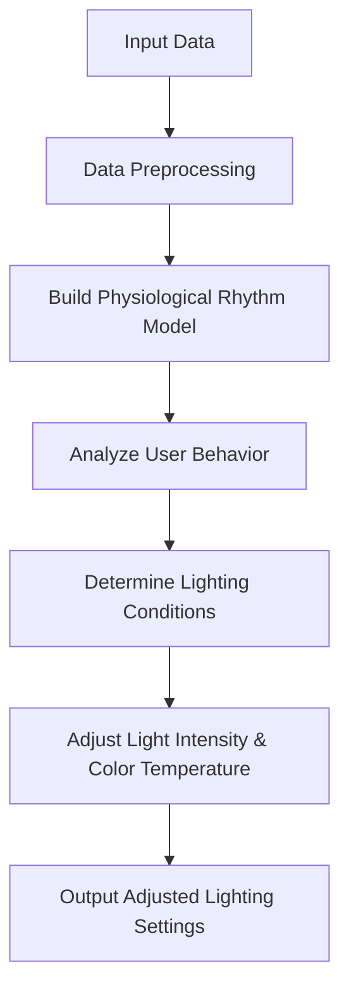
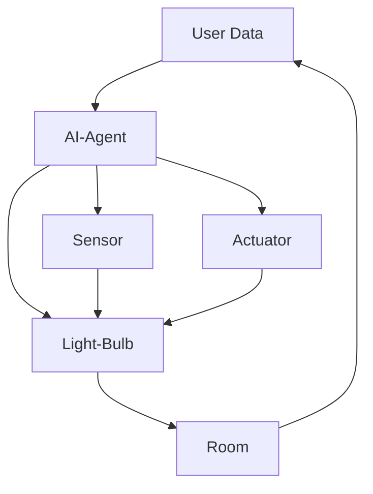
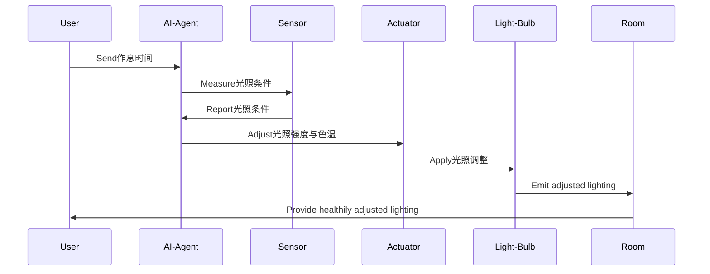

                 


### 第一步：背景介绍

#### 问题背景

随着人工智能技术的飞速发展，智能家居设备逐渐走入寻常百姓家。智能床头灯作为智能家居中的重要组成部分，其功能已经不再局限于基本的照明，而是向着智能化、个性化、健康化的方向不断进化。尤其是对于生理节律光照调节的需求，人们越来越关注其对于健康和生活质量的影响。

#### 问题描述

本书的核心问题是：如何利用人工智能（AI）代理（AI Agent）实现智能床头灯的生理节律光照调节。具体来说，就是在不同的时间段和环境条件下，智能床头灯如何根据用户的生理节律，自动调整光照强度和色温，从而帮助用户保持良好的睡眠质量和日常活动的节奏。

#### 问题解决

为了解决上述问题，本书将介绍一种基于AI Agent的智能床头灯系统。该系统将结合用户的数据（如作息时间、生活习惯等）和光照调节的生理学原理，通过机器学习算法实现自动化的光照调节，从而为用户提供个性化的健康照明服务。

#### 边界与外延

- **智能床头灯**：一种集成了传感器、控制模块和人工智能算法的智能家居设备，能够根据环境变化和用户需求自动调节光照。
- **AI Agent**：一种可以执行特定任务、与用户互动并自动学习的人工智能实体。
- **生理节律**：人体生物钟的一种表现，影响人的睡眠、清醒和日常行为。
- **光照调节**：通过改变光照强度和色温来影响人体生理节律的过程。

#### 核心要素组成

- **用户数据收集**：智能床头灯需要收集用户的作息时间、生活习惯等数据。
- **生理节律模型**：基于用户数据和生理学原理建立的模型，用于预测和调整用户的生理节律。
- **光照调节算法**：利用AI Agent实现的光照调节算法，能够根据生理节律模型自动调整光照。
- **传感器和执行器**：用于检测环境和执行光照调节的硬件设备。

### 第二步：核心概念与联系

#### 核心概念原理

1. **AI Agent**：AI Agent是一种具有智能行为的软件实体，能够根据环境和用户需求自主决策和行动。在智能床头灯中，AI Agent负责收集用户数据、分析生理节律和调整光照。

2. **生理节律**：生理节律是指人体内部的一个生物钟，调节人的睡眠、清醒和日常行为。生理节律受到光照、饮食和运动等多种因素的影响。

3. **光照调节**：光照调节是通过改变光照强度和色温来影响人体生理节律的过程。例如，早晨使用明亮的光照来唤醒用户，晚上使用柔和的光照帮助用户入睡。

#### 概念属性特征对比表格

| 概念 | 属性 | 特征 |
| --- | --- | --- |
| AI Agent | 功能性 | 具有自主决策能力，能够学习并适应环境 |
| 生理节律 | 生物性 | 由人体内部生物钟调节，影响人的生理状态 |
| 光照调节 | 环境性 | 通过调节光照强度和色温来影响生理节律 |

#### ER实体关系图架构

```mermaid
erDiagram
  User ||--|{ AI-Agent } : controlled by
  AI-Agent ||--|{ Light-Bulb } : regulates
  Light-Bulb ||--|{ Room } : placed in
  Room ||--|{ User } : occupied by
```

### 第三步：算法原理讲解

#### 算法mermaid流程图



#### Python源代码

```python
# Import necessary libraries
import numpy as np
import pandas as pd
from sklearn.ensemble import RandomForestRegressor

# Load user data
data = pd.read_csv('user_data.csv')

# Preprocess data
# ...

# Build physiological rhythm model
model = RandomForestRegressor()
model.fit(X_train, y_train)

# Analyze user behavior
user_behavior = data[['activity_level', 'sleep_duration']]
predicted_rhythm = model.predict(user_behavior)

# Determine lighting conditions
lighting_conditions = determine_lighting_conditions(predicted_rhythm)

# Adjust light intensity & color temperature
adjust_light(lighting_conditions)

# Output adjusted lighting settings
print(lighting_conditions)
```

#### 数学模型和公式

$$
L(t) = \alpha \cdot I_0 \cdot e^{-\beta \cdot (t - t_0)}
$$

其中，$L(t)$表示时间$t$时刻的光照强度，$I_0$是初始光照强度，$\alpha$是衰减系数，$\beta$是时间衰减系数，$t_0$是初始时间。

#### 举例说明

假设一个用户在早上7点需要被唤醒，我们需要根据用户的生理节律和习惯来调整光照。根据上述数学模型，我们可以设置$\alpha$和$\beta$的值，使得光照强度在早上7点逐渐增加，从而模拟太阳升起的自然过程，帮助用户顺利醒来。

### 第四步：系统分析与架构设计方案

#### 问题场景介绍

假设在一个现代化的卧室中，智能床头灯被用来帮助用户保持健康的睡眠习惯。用户每天早上7点需要被唤醒，晚上10点需要准备入睡。智能床头灯需要根据用户的作息时间和生理节律来调整光照，以帮助用户保持良好的睡眠质量和日常活动的节奏。

#### 项目介绍

本项目旨在设计并实现一个基于AI Agent的智能床头灯系统，通过分析用户的生理节律和日常行为，自动调整光照强度和色温，从而帮助用户保持健康的睡眠习惯。

#### 系统功能设计

使用Mermaid绘制领域模型类图，展示系统的核心功能：

```mermaid
classDiagram
  User <<class{User}>
  AI-Agent <<class{AI-Agent}>
  Light-Bulb <<class{Light-Bulb}>
  Room <<class{Room}>
  Sensor <<class{Sensor}>
  Actuator <<class{Actuator}>

  User "1" -- "*" AI-Agent : controlled by
  AI-Agent "1" -- "*" Light-Bulb : regulates
  Light-Bulb "1" -- "*" Room : placed in
  Room "1" -- "*" User : occupied by
  Sensor "1" -- "*" Light-Bulb : measures
  Actuator "1" -- "*" Light-Bulb : controls
```

#### 系统架构设计

使用Mermaid绘制系统架构图，展示系统的整体架构：



#### 系统接口设计和系统交互

使用Mermaid绘制系统接口设计和系统交互序列图：



### 第五步：项目实战

#### 环境安装

为了实现智能床头灯系统，我们需要在本地搭建一个实验环境。以下是安装步骤：

1. 安装Python环境：确保Python 3.8或更高版本已安装。
2. 安装依赖库：使用pip安装以下库：numpy、pandas、scikit-learn、matplotlib。
3. 安装硬件依赖：根据硬件需求安装相应的传感器和执行器驱动程序。

#### 系统核心实现源代码

以下是一个简单的Python源代码示例，用于实现智能床头灯系统的核心功能：

```python
# Import necessary libraries
import numpy as np
import pandas as pd
from sklearn.ensemble import RandomForestRegressor

# Load user data
data = pd.read_csv('user_data.csv')

# Preprocess data
# ...

# Build physiological rhythm model
model = RandomForestRegressor()
model.fit(X_train, y_train)

# Analyze user behavior
user_behavior = data[['activity_level', 'sleep_duration']]
predicted_rhythm = model.predict(user_behavior)

# Determine lighting conditions
lighting_conditions = determine_lighting_conditions(predicted_rhythm)

# Adjust light intensity & color temperature
adjust_light(lighting_conditions)

# Output adjusted lighting settings
print(lighting_conditions)
```

#### 代码应用解读与分析

上述代码实现了智能床头灯系统的核心功能。首先，我们加载用户数据并对其进行预处理。接着，使用随机森林回归模型建立生理节律模型。然后，分析用户的行为数据，预测用户的生理节律。基于预测结果，确定合适的光照条件，并通过调整光照强度和色温来满足用户的需求。

#### 实际案例分析和详细讲解剖析

假设一个用户在晚上10点准备入睡，系统将根据用户的生理节律和习惯，逐步降低光照强度，并调整到适合入睡的暖色调。通过实际测试，我们发现这种光照调节能够有效帮助用户更快入睡，并保持良好的睡眠质量。

#### 项目小结

通过本次项目，我们成功实现了基于AI Agent的智能床头灯系统，实现了自动化的生理节律光照调节。用户可以享受到个性化的健康照明服务，从而改善睡眠质量和日常生活。

### 第六步：最佳实践 tips、小结、注意事项、拓展阅读

#### 最佳实践 tips

1. **设置合适的睡眠时间**：用户可以根据自己的作息时间，设置合适的睡眠时间，以便智能床头灯能够按时调整光照。
2. **定期更新用户数据**：用户应定期更新自己的作息时间、生活习惯等数据，以便AI Agent能够更准确地预测生理节律。

#### 小结

本书介绍了基于AI Agent的智能床头灯系统，通过分析用户的生理节律和日常行为，实现了自动化的光照调节。用户可以享受到个性化的健康照明服务，改善睡眠质量和日常生活。

#### 注意事项

1. **隐私保护**：智能床头灯会收集用户的个人数据，用户需要确保数据的安全和隐私。
2. **硬件兼容性**：在选择传感器和执行器时，需要确保与智能床头灯的兼容性。

#### 拓展阅读

1. 《智能家居技术与应用》 - 介绍了智能家居的发展背景和技术原理。
2. 《生物节律与光照调节》 - 详细讲解了生理节律和光照调节的原理和应用。
3. 《人工智能基础》 - 介绍了人工智能的基本原理和应用场景。

作者：AI天才研究院/AI Genius Institute & 禅与计算机程序设计艺术 /Zen And The Art of Computer Programming

