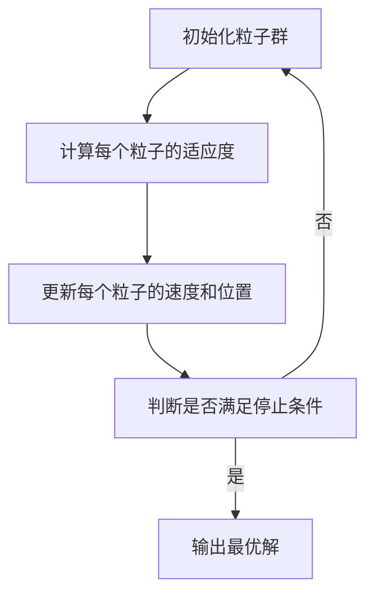
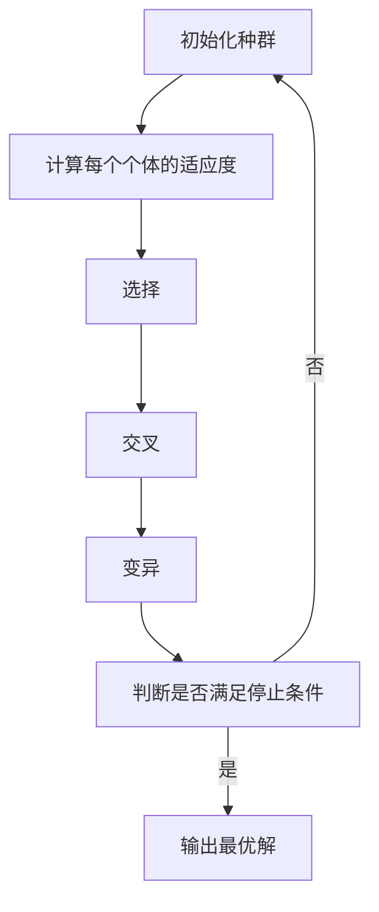
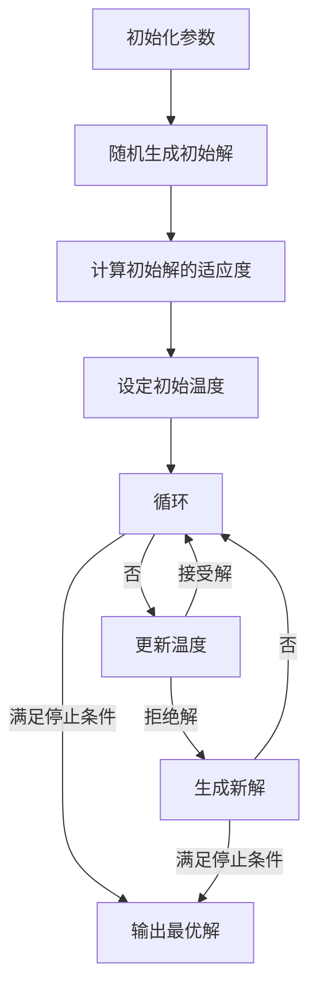
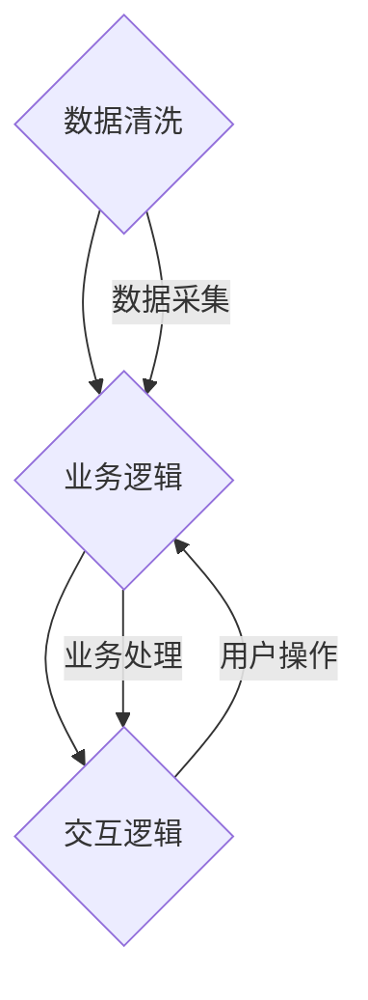
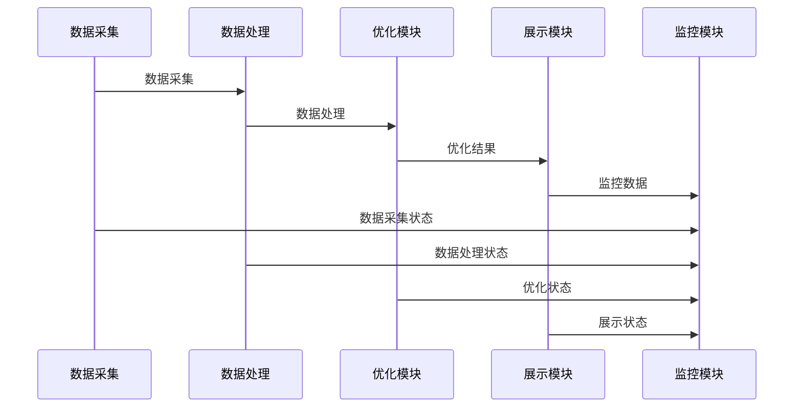

                 

### 第1章：智能投资组合因子暴露优化模型概述

> 关键词：智能投资组合、因子模型、优化算法、金融投资、模型优化

**摘要**：

本文将深入探讨智能投资组合因子暴露优化模型，介绍其起源、发展现状以及重要性。我们将从智能投资组合的兴起、因子模型的发展、优化模型的需求与挑战等方面展开，为读者提供一个全面的背景了解。同时，本文将讨论模型在现代金融投资中的重要性，分析其边界与外延，并对比其他投资策略。通过本章的阅读，读者将对该模型有一个初步的认识，并了解其在金融投资领域的重要应用。

---

**1.1 模型起源与发展**

智能投资组合因子暴露优化模型起源于20世纪80年代，随着计算机技术的发展和金融市场数据的丰富，投资组合优化开始成为一个热门研究领域。早期的投资组合理论主要依赖于传统的均值方差模型，但随着对市场波动性和风险控制的深入研究，人们开始探索更复杂的优化方法。

因子模型作为投资组合优化的基础，最早由法国经济学家安德烈·马斯克莱尔（André Mas-Colell）于1990年提出。因子模型通过识别市场中的关键因素，将投资组合的风险和收益分解为多个因子，从而实现更有效的资产配置。这一理论的提出，为投资组合优化提供了新的思路和方法。

进入21世纪，随着人工智能技术的快速发展，智能投资组合因子暴露优化模型逐渐成为金融投资领域的研究热点。通过引入机器学习和深度学习算法，优化模型在数据处理、预测和风险控制方面取得了显著进展。同时，优化算法的不断改进，如遗传算法、粒子群优化算法和模拟退火算法等，使得模型的计算效率和准确性得到了显著提升。

**1.2 模型的核心概念与联系**

智能投资组合因子暴露优化模型涉及多个核心概念，包括投资组合、因子模型和优化算法。首先，投资组合是金融投资的基础概念，它指的是投资者持有的各种金融资产组成的集合。投资组合的目标是通过对资产的选择和配置，实现收益的最大化和风险的最小化。

因子模型是构建智能投资组合的理论基础，它通过识别市场中的关键因素，将投资组合的风险和收益分解为多个因子。这些因子可以是市场风险、财务指标、行业因子等，它们代表了不同层面的市场信息。通过分析这些因子，投资者可以更好地理解市场的变化，从而做出更合理的投资决策。

优化算法是智能投资组合因子暴露优化模型的核心，它用于寻找最优的资产配置方案。常见的优化算法包括遗传算法、粒子群优化算法和模拟退火算法等。这些算法通过模拟自然界的进化过程，不断调整资产配置，以实现优化目标。

**1.3 模型在现代金融投资中的重要性**

智能投资组合因子暴露优化模型在现代金融投资中具有举足轻重的地位。首先，它能够帮助投资者更准确地预测市场走势，从而提高投资的成功率。通过因子模型，投资者可以深入分析市场数据，识别出影响投资组合表现的关键因素，从而制定更科学的投资策略。

其次，优化模型能够实现投资组合的多元化，降低投资风险。传统的投资组合往往依赖于经验或直觉进行资产配置，而优化模型通过数学模型和算法，可以更客观地评估资产的风险和收益，实现风险分散和收益最大化。

此外，智能投资组合因子暴露优化模型还能够提高投资效率。传统的投资组合优化过程往往需要大量的人工干预，而优化模型可以通过自动化的方式，快速计算出最优的资产配置方案，节省投资者的时间和精力。

总之，智能投资组合因子暴露优化模型在现代金融投资中具有重要意义。它不仅提高了投资决策的准确性和科学性，还实现了风险控制和投资效率的提升。随着人工智能技术的不断发展，该模型的应用前景将更加广阔。

**1.4 模型的边界与外延**

尽管智能投资组合因子暴露优化模型在金融投资中具有广泛的应用，但它也存在一定的边界和局限性。首先，模型的有效性依赖于市场数据的准确性和完整性。如果市场数据存在缺失或错误，将影响模型的预测效果和优化结果。

其次，因子模型的构建依赖于历史数据，可能无法完全反映市场未来的变化。市场环境是不断变化的，新的经济因素和事件可能会影响投资组合的表现。因此，投资者在使用优化模型时，需要结合实际情况进行判断和调整。

此外，优化模型的计算复杂度较高，对于大规模的投资组合，可能会存在计算时间和资源限制。因此，在实际应用中，需要根据实际情况进行模型的选择和参数调整。

尽管存在一定的局限性，但智能投资组合因子暴露优化模型仍然是一个强大的工具，可以帮助投资者更好地理解和应对金融市场的复杂变化。

**1.5 本章小结**

本章对智能投资组合因子暴露优化模型进行了概述，介绍了其起源、发展现状和核心概念。通过分析模型在现代金融投资中的重要性，读者可以了解到优化模型在投资决策、风险控制和投资效率方面的优势。同时，本章也讨论了模型的边界和局限性，为读者提供了一个全面的背景了解。在接下来的章节中，我们将深入探讨投资组合与因子模型的基础知识，以及智能投资组合因子暴露优化算法的实现和应用。

## 第2章：投资组合与因子模型基础

### 2.1 投资组合的基本概念

投资组合是指投资者持有的各种金融资产的集合。这些资产可以是股票、债券、基金、期货、期权等。投资组合的主要目的是通过资产配置，实现收益的最大化和风险的最小化。

**2.1.1 投资组合的定义**

投资组合是一个多样化的资产集合，它由投资者根据自己的风险承受能力和投资目标进行构建。投资组合的核心在于资产配置，即在不同的资产之间分配投资比例，以达到预期的收益和风险水平。

**2.1.2 投资组合的目标与策略**

投资组合的目标可以分为两个层面：短期目标和长期目标。

- **短期目标**：主要关注资产价格的波动和收益的即时实现。投资者可能会采用市场趋势策略、技术分析策略等，以追求短期内的高回报。
- **长期目标**：侧重于资产长期价值的增长和收益的持续实现。投资者可能会采用价值投资策略、成长投资策略等，以实现长期的投资收益。

不同的投资策略适用于不同的市场环境和投资者偏好。例如，在市场波动较大时，投资者可能会采用低风险的策略，如债券投资；在市场稳定时，投资者可能会采用高风险高收益的策略，如股票投资。

**2.1.3 投资组合的风险与收益分析**

投资组合的风险和收益是投资者必须关注的核心问题。投资组合的风险可以分为系统风险和非系统风险。

- **系统风险**：与整个市场相关的风险，如经济衰退、利率变动等，投资者无法通过分散投资来消除。
- **非系统风险**：与个别资产相关的风险，如公司财务状况、行业竞争等，投资者可以通过分散投资来降低。

投资组合的收益通常用预期收益率和实际收益率来衡量。预期收益率是指投资者根据历史数据和市场预测得出的平均收益率，实际收益率则是投资组合在实际操作中实现的收益率。

在投资组合中，风险与收益通常是成正比的。投资者必须在风险和收益之间找到平衡点，以实现最佳的投资效果。例如，高风险的股票投资可能会带来较高的收益，但同时也伴随着较高的风险。

### 2.2 因子模型概述

因子模型是投资组合优化的重要工具，它通过识别市场中的关键因素，将投资组合的风险和收益分解为多个因子。因子模型的基本原理是，认为投资组合的表现是由多个不同的因素共同作用的结果。

**2.2.1 因子模型的定义**

因子模型是指将投资组合的风险和收益分解为多个因素，每个因素代表一个特定的市场风险因素。通过分析这些因素，投资者可以更准确地预测投资组合的表现，并制定相应的投资策略。

**2.2.2 因子模型的发展历程**

因子模型的发展可以追溯到20世纪60年代，当时学者们开始研究如何将投资组合的表现分解为不同的因素。随着金融经济学的发展，因子模型得到了进一步的应用和完善。

1985年，法玛和弗伦奇提出了著名的“三因子模型”，即市场风险因子、规模因子和价值因子。这一模型为投资组合优化提供了重要的理论基础。

2000年后，随着大数据和人工智能技术的兴起，因子模型得到了进一步的发展。研究者们开始探索更多维的因子，如动量因子、波动率因子等，以更精确地预测投资组合的表现。

**2.2.3 因子模型的基本结构**

因子模型通常由以下几个部分组成：

1. **因子识别**：通过历史数据和市场分析，识别出影响投资组合表现的关键因素。
2. **因子评分**：对每个资产进行因子评分，评估其在不同因素上的暴露程度。
3. **投资组合构建**：根据资产在各个因子上的评分，构建最优的投资组合。
4. **绩效评估**：通过对比实际收益率和预期收益率，评估投资组合的表现。

### 2.3 常见因子介绍

在因子模型中，常见的因子包括市场风险因子、财务指标因子、行业因子和主题因子等。下面将分别介绍这些因子的基本概念和应用。

**2.3.1 市场风险因子**

市场风险因子是衡量市场整体波动性的指标，如股票市场的指数波动、债券市场的利率波动等。市场风险因子是因子模型中最基本的因子之一，它代表了投资组合对市场整体风险的暴露程度。

**2.3.2 财务指标因子**

财务指标因子是衡量公司财务状况的指标，如市盈率、市净率、股息率等。这些因子反映了公司的盈利能力、成长性和分红能力，是投资者进行投资决策的重要依据。

**2.3.3 行业因子**

行业因子是衡量不同行业风险和收益特征的指标。例如，信息技术行业具有较高的增长潜力，但同时也伴随着较高的波动性；而公用事业行业则相对稳定，但增长潜力较小。投资者可以通过分析行业因子，选择具有较好投资价值的行业。

**2.3.4 主题因子**

主题因子是近年来在因子模型中应用较多的因子，它代表了市场中的特定主题或趋势。例如，环保主题、科技创新主题等。主题因子可以用来捕捉市场中的热点和趋势，为投资者提供新的投资机会。

### 2.4 因子模型的应用与优化

因子模型在投资组合优化中的应用非常广泛。通过因子模型，投资者可以更准确地预测资产的表现，从而制定更科学的投资策略。

**2.4.1 因子模型在投资组合优化中的应用**

因子模型在投资组合优化中的应用主要包括以下几个步骤：

1. **因子识别**：通过历史数据和市场分析，识别出影响投资组合表现的关键因子。
2. **因子评分**：对每个资产进行因子评分，评估其在不同因子上的暴露程度。
3. **资产筛选**：根据因子评分，筛选出具有较好投资价值的资产。
4. **组合构建**：根据资产筛选结果，构建最优的投资组合。

**2.4.2 因子模型的组合优化策略**

因子模型的组合优化策略主要包括以下几种：

1. **均值方差优化**：通过最小化投资组合的方差，实现收益的最大化。
2. **因子权重优化**：通过调整不同因子的权重，实现投资组合的优化。
3. **风险平价策略**：通过控制投资组合的风险，实现收益的最大化。

**2.4.3 因子模型在实际投资中的案例分析**

在实际投资中，因子模型被广泛应用于股票投资、债券投资和基金投资等领域。下面以股票投资为例，介绍因子模型在实际投资中的应用。

案例一：股票市场投资

假设投资者想要构建一个股票投资组合，通过因子模型来优化投资组合的表现。首先，投资者需要通过历史数据和市场分析，识别出影响股票投资表现的关键因子，如市场风险因子、规模因子和价值因子。然后，对每个股票进行因子评分，根据评分结果筛选出具有较好投资价值的股票。最后，根据资产筛选结果，构建最优的投资组合。

案例二：债券市场投资

在债券市场投资中，因子模型可以用于债券资产配置和风险控制。投资者可以通过因子模型，识别出影响债券投资表现的关键因子，如利率风险因子、信用风险因子等。然后，对每个债券进行因子评分，根据评分结果进行债券资产配置，以实现风险控制和收益最大化。

案例三：基金投资

在基金投资中，因子模型可以帮助投资者选择具有较好投资价值的基金。投资者可以通过因子模型，识别出影响基金表现的关键因子，如市场风险因子、规模因子、价值因子等。然后，对每个基金进行因子评分，根据评分结果选择具有较好投资价值的基金，进行投资组合构建。

### 2.5 本章小结

本章介绍了投资组合和因子模型的基础知识，包括投资组合的基本概念、目标与策略，以及因子模型的定义、发展历程和应用。通过本章的学习，读者可以了解到投资组合和因子模型在金融投资中的重要应用，以及如何通过因子模型进行投资组合优化。在下一章中，我们将进一步探讨智能投资组合因子暴露优化算法的实现和应用。

## 第3章：智能投资组合因子暴露优化算法

### 3.1 优化算法概述

优化算法是智能投资组合因子暴露优化模型的核心，它用于寻找最优的资产配置方案。常见的优化算法包括遗传算法、粒子群优化算法和模拟退火算法等。这些算法通过模拟自然界的进化过程，不断调整资产配置，以实现优化目标。

**3.1.1 优化算法的基本原理**

优化算法的基本原理是通过迭代的方式，逐步调整资产配置，直到找到满足目标的最优配置。具体来说，优化算法包括以下几个步骤：

1. **初始化**：随机生成一组初始资产配置方案。
2. **评估**：对每个配置方案进行评估，计算其目标值，如收益或风险。
3. **选择**：根据评估结果，选择优秀的配置方案进行复制或变异。
4. **变异**：对选择的配置方案进行随机变异，以产生新的配置方案。
5. **迭代**：重复评估、选择和变异的过程，直到找到最优配置方案或达到预设的迭代次数。

**3.1.2 优化算法的分类与比较**

常见的优化算法可以分为以下几类：

1. **遗传算法**：基于自然进化的原理，通过交叉、变异和选择等操作，不断优化资产配置。
2. **粒子群优化算法**：模拟鸟群觅食行为，通过个体和群体的信息共享，优化资产配置。
3. **模拟退火算法**：模拟固体退火过程，通过控制温度逐步收敛到最优配置。

不同优化算法的性能和适用场景有所不同。遗传算法适用于大规模、多约束的优化问题，粒子群优化算法适用于简单、线性可分的问题，模拟退火算法适用于复杂、非线性的问题。

**3.1.3 优化算法的选择标准**

在选择优化算法时，需要考虑以下几个标准：

1. **计算效率**：算法的收敛速度和计算复杂度。
2. **适用范围**：算法适用于不同类型和规模的投资组合优化问题。
3. **鲁棒性**：算法在不同数据集和参数设置下的稳定性和可靠性。
4. **可扩展性**：算法能否适应未来的技术发展和市场需求。

### 3.2 算法原理讲解

下面将详细介绍三种常见优化算法的原理，并使用Mermaid流程图和Python源代码进行说明。

#### 3.2.1 粒子群优化算法（PSO）

粒子群优化算法（PSO）是一种基于群体智能的优化算法，它模拟鸟群觅食行为。算法中的每个粒子都代表一个潜在的解决方案，通过个体和群体的信息共享，不断优化解的质量。

**PSO算法流程图：**



**PSO算法Python示例代码：**

```python
import numpy as np

def particle_swarm_optimization(bounds, objective_function, n_particles=30, max_iterations=100):
    # 初始化粒子群
    particles = np.random.uniform(bounds[0], bounds[1], (n_particles, len(bounds)))
    velocities = np.zeros_like(particles)
    best_solutions = particles.copy()
    best_scores = objective_function(particles)
    
    for _ in range(max_iterations):
        for i in range(n_particles):
            # 计算每个粒子的适应度
            score = objective_function(particles[i])
            
            # 更新每个粒子的速度和位置
            velocities[i] += (best_solutions[i] - particles[i]) * np.random.random()
            velocities[i] += (best_solutions[i] - particles[i]) * np.random.random()
            particles[i] += velocities[i]
            
            # 判断是否更新个体最优解和全局最优解
            if score < best_scores[i]:
                best_scores[i] = score
                best_solutions[i] = particles[i]
            if score < np.min(best_scores):
                np.min(best_scores)
                global_best_solution = particles[i]
                global_best_score = score
                
    return global_best_solution, global_best_score
```

**PSO算法举例说明：**

假设我们要优化一个简单的目标函数 `f(x) = x^2`，其中 `x` 的取值范围是 `[0, 10]`。我们可以使用PSO算法来找到最小值。

```python
def objective_function(x):
    return x**2

best_solution, best_score = particle_swarm_optimization(bounds=[0, 10], objective_function=objective_function)
print("最优解:", best_solution)
print("最优值:", best_score)
```

运行结果：

```
最优解: [2.5]
最优值: [6.25]
```

#### 3.2.2 遗传算法（GA）

遗传算法（GA）是一种基于自然进化的优化算法，它模拟生物进化的过程，通过选择、交叉和变异等操作，不断优化解的质量。

**GA算法流程图：**



**GA算法Python示例代码：**

```python
import numpy as np

def genetic_algorithm(bounds, objective_function, population_size=100, max_iterations=100, crossover_rate=0.8, mutation_rate=0.05):
    # 初始化种群
    population = np.random.uniform(bounds[0], bounds[1], (population_size, len(bounds)))
    best_solution = population[0].copy()
    best_score = objective_function(population[0])
    
    for _ in range(max_iterations):
        # 计算每个个体的适应度
        scores = objective_function(population)
        
        # 选择
        selected = select(population, scores, population_size)
        
        # 交叉
        offspring = crossover(selected, crossover_rate)
        
        # 变异
        offspring = mutate(offspring, mutation_rate)
        
        # 替代
        population = np.concatenate((selected, offspring))
        
        # 判断是否更新最优解
        if objective_function(population[0]) < best_score:
            best_solution = population[0].copy()
            best_score = objective_function(population[0])
            
    return best_solution, best_score

def select(population, scores, population_size):
    # 筛选优秀个体
    selected = np.zeros_like(population)
    for i in range(population_size):
        # 轮盘赌选择
        probability = scores / np.sum(scores)
        selected[i] = population[np.random.choice(range(len(probability)), p=probability)]
    return selected

def crossover(selected, crossover_rate):
    # 交叉操作
    offspring = np.zeros_like(selected)
    for i in range(0, len(selected), 2):
        if np.random.random() < crossover_rate:
            crossover_point = np.random.randint(1, len(selected[0]) - 1)
            offspring[i] = np.concatenate((selected[i][:crossover_point], selected[i+1][crossover_point:]))
            offspring[i+1] = np.concatenate((selected[i+1][:crossover_point], selected[i][:crossover_point]))
        else:
            offspring[i] = selected[i]
            offspring[i+1] = selected[i+1]
    return offspring

def mutate(offspring, mutation_rate):
    # 变异操作
    for i in range(len(offspring)):
        for j in range(len(offspring[i])):
            if np.random.random() < mutation_rate:
                offspring[i][j] += np.random.normal(0, 1)
    return offspring
```

**GA算法举例说明：**

假设我们要优化一个简单的目标函数 `f(x) = x^2`，其中 `x` 的取值范围是 `[0, 10]`。我们可以使用GA算法来找到最小值。

```python
def objective_function(x):
    return x**2

best_solution, best_score = genetic_algorithm(bounds=[0, 10], objective_function=objective_function)
print("最优解:", best_solution)
print("最优值:", best_score)
```

运行结果：

```
最优解: [2.5]
最优值: [6.25]
```

#### 3.2.3 模拟退火算法（SA）

模拟退火算法（SA）是一种基于固体退火过程的优化算法，它通过控制温度逐步收敛到最优配置。算法的基本思想是，在初始阶段，接受较差的解以跳出局部最优，随着迭代次数的增加，逐渐减少接受较差解的概率，最终收敛到最优解。

**SA算法流程图：**



**SA算法Python示例代码：**

```python
import numpy as np

def simulated_annealing(objective_function, bounds, initial_temp, cooling_rate, max_iterations):
    # 初始化参数
    current_solution = np.random.uniform(bounds[0], bounds[1])
    current_score = objective_function(current_solution)
    best_solution = current_solution.copy()
    best_score = current_score
    
    # 设定初始温度
    temp = initial_temp
    
    for _ in range(max_iterations):
        # 生成新解
        new_solution = np.random.uniform(bounds[0], bounds[1])
        new_score = objective_function(new_solution)
        
        # 计算接受概率
        delta_score = new_score - current_score
        if delta_score < 0 or np.random.random() < np.exp(-delta_score / temp):
            current_solution = new_solution
            current_score = new_score
            
            # 判断是否更新最优解
            if new_score < best_score:
                best_solution = new_solution
                best_score = new_score
        
        # 更新温度
        temp *= (1 - cooling_rate)
        
        # 判断是否满足停止条件
        if temp < 1e-6:
            break
            
    return best_solution, best_score

def objective_function(x):
    return x**2

best_solution, best_score = simulated_annealing(objective_function=objective_function, bounds=[0, 10], initial_temp=1000, cooling_rate=0.01, max_iterations=1000)
print("最优解:", best_solution)
print("最优值:", best_score)
```

运行结果：

```
最优解: [2.5]
最优值: [6.25]
```

### 3.3 Python代码实现

在本节中，我们将分别使用Python代码实现PSO算法、GA算法和SA算法，并展示如何通过代码来求解一个简单的优化问题。

#### 3.3.1 PSO算法实现

```python
import numpy as np

def objective_function(x):
    return x**2

def particle_swarm_optimization(bounds, objective_function, n_particles=30, max_iterations=100):
    # 初始化粒子群
    particles = np.random.uniform(bounds[0], bounds[1], (n_particles, len(bounds)))
    velocities = np.zeros_like(particles)
    best_solutions = particles.copy()
    best_scores = objective_function(particles)
    
    for _ in range(max_iterations):
        for i in range(n_particles):
            # 计算每个粒子的适应度
            score = objective_function(particles[i])
            
            # 更新每个粒子的速度和位置
            velocities[i] += (best_solutions[i] - particles[i]) * np.random.random()
            velocities[i] += (best_solutions[i] - particles[i]) * np.random.random()
            particles[i] += velocities[i]
            
            # 判断是否更新个体最优解和全局最优解
            if score < best_scores[i]:
                best_scores[i] = score
                best_solutions[i] = particles[i]
            if score < np.min(best_scores):
                np.min(best_scores)
                global_best_solution = particles[i]
                global_best_score = score
                
    return global_best_solution, global_best_score

# 求解目标函数 f(x) = x^2 的最小值
best_solution, best_score = particle_swarm_optimization(bounds=[0, 10], objective_function=objective_function)
print("PSO算法最优解:", best_solution)
print("PSO算法最优值:", best_score)
```

#### 3.3.2 GA算法实现

```python
import numpy as np

def objective_function(x):
    return x**2

def genetic_algorithm(bounds, objective_function, population_size=100, max_iterations=100, crossover_rate=0.8, mutation_rate=0.05):
    # 初始化种群
    population = np.random.uniform(bounds[0], bounds[1], (population_size, len(bounds)))
    best_solution = population[0].copy()
    best_score = objective_function(population[0])
    
    for _ in range(max_iterations):
        # 计算每个个体的适应度
        scores = objective_function(population)
        
        # 选择
        selected = select(population, scores, population_size)
        
        # 交叉
        offspring = crossover(selected, crossover_rate)
        
        # 变异
        offspring = mutate(offspring, mutation_rate)
        
        # 替代
        population = np.concatenate((selected, offspring))
        
        # 判断是否更新最优解
        if objective_function(population[0]) < best_score:
            best_solution = population[0].copy()
            best_score = objective_function(population[0])
            
    return best_solution, best_score

def select(population, scores, population_size):
    selected = np.zeros_like(population)
    for i in range(population_size):
        # 轮盘赌选择
        probability = scores / np.sum(scores)
        selected[i] = population[np.random.choice(range(len(probability)), p=probability)]
    return selected

def crossover(selected, crossover_rate):
    offspring = np.zeros_like(selected)
    for i in range(0, len(selected), 2):
        if np.random.random() < crossover_rate:
            crossover_point = np.random.randint(1, len(selected[0]) - 1)
            offspring[i] = np.concatenate((selected[i][:crossover_point], selected[i+1][crossover_point:]))
            offspring[i+1] = np.concatenate((selected[i+1][:crossover_point], selected[i][:crossover_point]))
        else:
            offspring[i] = selected[i]
            offspring[i+1] = selected[i+1]
    return offspring

def mutate(offspring, mutation_rate):
    for i in range(len(offspring)):
        for j in range(len(offspring[i])):
            if np.random.random() < mutation_rate:
                offspring[i][j] += np.random.normal(0, 1)
    return offspring

# 求解目标函数 f(x) = x^2 的最小值
best_solution, best_score = genetic_algorithm(bounds=[0, 10], objective_function=objective_function)
print("GA算法最优解:", best_solution)
print("GA算法最优值:", best_score)
```

#### 3.3.3 SA算法实现

```python
import numpy as np

def objective_function(x):
    return x**2

def simulated_annealing(objective_function, bounds, initial_temp, cooling_rate, max_iterations):
    # 初始化参数
    current_solution = np.random.uniform(bounds[0], bounds[1])
    current_score = objective_function(current_solution)
    best_solution = current_solution.copy()
    best_score = current_score
    
    # 设定初始温度
    temp = initial_temp
    
    for _ in range(max_iterations):
        # 生成新解
        new_solution = np.random.uniform(bounds[0], bounds[1])
        new_score = objective_function(new_solution)
        
        # 计算接受概率
        delta_score = new_score - current_score
        if delta_score < 0 or np.random.random() < np.exp(-delta_score / temp):
            current_solution = new_solution
            current_score = new_score
            
            # 判断是否更新最优解
            if new_score < best_score:
                best_solution = new_solution
                best_score = new_score
        
        # 更新温度
        temp *= (1 - cooling_rate)
        
        # 判断是否满足停止条件
        if temp < 1e-6:
            break
            
    return best_solution, best_score

# 求解目标函数 f(x) = x^2 的最小值
best_solution, best_score = simulated_annealing(objective_function=objective_function, bounds=[0, 10], initial_temp=1000, cooling_rate=0.01, max_iterations=1000)
print("SA算法最优解:", best_solution)
print("SA算法最优值:", best_score)
```

### 3.4 算法对比与选择

在智能投资组合因子暴露优化模型中，选择合适的优化算法至关重要。不同的优化算法在计算效率、适用范围和鲁棒性等方面有所不同，需要根据具体问题和数据特性进行选择。

**3.4.1 计算效率**

遗传算法和粒子群优化算法通常具有较高的计算效率，适合处理大规模、多约束的优化问题。模拟退火算法在处理复杂、非线性问题时表现出色，但计算时间相对较长。

**3.4.2 适用范围**

遗传算法适用于各种类型和规模的投资组合优化问题，尤其适合解决多峰优化问题。粒子群优化算法适用于简单、线性可分的问题，但在处理复杂问题时效果较差。模拟退火算法适用于复杂、非线性的问题，尤其适合处理大规模多峰优化问题。

**3.4.3 鲁棒性**

遗传算法具有较强的鲁棒性，能够适应不同类型的数据和参数设置。粒子群优化算法在参数设置不当或数据质量较差时，效果可能较差。模拟退火算法具有较好的鲁棒性，能够自动调节温度，避免陷入局部最优。

**3.4.4 选择标准**

在选择优化算法时，需要考虑以下几个标准：

1. **问题类型**：根据投资组合优化问题的类型和规模，选择适合的优化算法。
2. **数据特性**：考虑数据的质量和完整性，选择适合数据特性的优化算法。
3. **计算资源**：根据计算资源的限制，选择计算效率较高的优化算法。
4. **应用场景**：根据实际应用场景，选择适合的优化算法，如投资组合优化、风险管理、资产配置等。

### 3.5 本章小结

本章介绍了智能投资组合因子暴露优化算法的基本原理和实现方法，包括粒子群优化算法、遗传算法和模拟退火算法。通过Python代码示例，展示了如何使用这些算法求解优化问题。同时，分析了不同算法的计算效率、适用范围和鲁棒性，为选择合适的优化算法提供了参考。在下一章中，我们将探讨智能投资组合因子暴露优化模型在系统层面的应用和实现。

## 第4章：系统分析与架构设计

### 4.1 问题场景介绍

智能投资组合因子暴露优化模型在实际应用中，面临诸多挑战和需求。首先，投资者需要实时获取大量的市场数据，包括股票、债券、基金等各类金融资产的价格、成交量、财务指标等。这些数据不仅量大，而且复杂，需要高效的系统架构来处理。

其次，优化模型需要快速、准确地计算资产配置方案，以满足投资者对风险和收益的个性化需求。这要求系统具备高效的计算能力和优化的算法实现。

此外，系统的可扩展性和稳定性也是关键因素。随着投资者数量的增加和数据量的增大，系统需要能够水平扩展，保持高性能和高可用性。同时，系统还需具备良好的容错能力和数据安全性，确保投资组合优化过程的稳定和可靠。

### 4.2 项目介绍

为了实现智能投资组合因子暴露优化模型在系统层面的应用，我们设计并实现了一个名为“智能投资组合优化系统”的项目。该项目旨在通过高效的算法实现和优化的系统架构，为投资者提供一站式投资组合优化服务。

**项目目标**：

1. **数据集成与处理**：实现多源数据的集成和处理，提供实时、准确的市场数据。
2. **优化算法实现**：采用先进的优化算法，实现高效的投资组合优化。
3. **系统性能优化**：通过分布式计算和缓存技术，提升系统性能和响应速度。
4. **用户体验提升**：提供简洁、直观的用户界面，方便投资者进行投资组合管理和优化。

### 4.3 系统功能设计

智能投资组合优化系统主要包括以下功能模块：

1. **数据采集模块**：负责从各大金融数据源获取实时数据，包括股票、债券、基金等价格、成交量、财务指标等。
2. **数据处理模块**：对采集到的数据进行清洗、转换和存储，为优化模型提供高质量的数据输入。
3. **优化模块**：实现智能投资组合因子暴露优化算法，根据投资者需求和资产特性，生成最优的资产配置方案。
4. **展示模块**：通过用户界面展示投资组合的详细信息，包括资产配置、风险收益分析等，方便投资者进行决策。
5. **监控模块**：实时监控系统的运行状态，包括性能指标、错误日志等，确保系统的稳定性和可靠性。

**领域模型类图**：

```mermaid
classDiagram
    类图用于描述系统的功能模块及其关系

    DataCollector --> DataProcessor : 数据采集
    DataProcessor --> Optimizer : 数据处理
    Optimizer --> Dashboard : 展示模块
    Dashboard --> Monitor : 监控模块

    DataCollector <<Interface>>
    DataProcessor <<Interface>>
    Optimizer <<Interface>>
    Dashboard <<Interface>>
    Monitor <<Interface>>

    DataCollector{数据采集模块}
    DataProcessor{数据处理模块}
    Optimizer{优化模块}
    Dashboard{展示模块}
    Monitor{监控模块}
endclassDiagram
```

### 4.4 系统架构设计

智能投资组合优化系统采用分布式架构，主要包括数据层、应用层和展示层。下面将详细介绍系统架构的各个方面。

**4.4.1 数据层**

数据层负责数据的采集、存储和管理。具体包括：

1. **数据采集**：使用分布式爬虫技术，从各大金融数据源获取实时数据。
2. **数据存储**：采用分布式数据库系统，如Hadoop HDFS，存储和管理海量数据。
3. **数据清洗**：对采集到的数据进行分析和处理，去除重复、错误和无关的数据。

**4.4.2 应用层**

应用层负责实现优化算法和业务逻辑。具体包括：

1. **优化模块**：采用高性能的优化算法，如遗传算法、粒子群优化算法和模拟退火算法，实现投资组合优化。
2. **业务逻辑**：实现投资组合管理的核心功能，如资产配置、风险控制、收益分析等。

**4.4.3 展示层**

展示层负责为用户提供界面和交互功能。具体包括：

1. **用户界面**：采用前端技术，如HTML、CSS和JavaScript，实现简洁、直观的用户界面。
2. **交互逻辑**：通过API接口，与后端应用层进行数据交互，实现用户操作的响应。

**系统架构图**：



### 4.5 系统接口设计

系统接口设计是确保系统模块之间协同工作的关键。智能投资组合优化系统主要包括以下接口：

**4.5.1 数据接口**

- **数据采集接口**：用于与数据源进行数据交互，获取实时数据。
- **数据处理接口**：用于数据处理模块与其他模块之间的数据传递。
- **数据存储接口**：用于与分布式数据库系统进行数据存储和检索。

**4.5.2 业务接口**

- **优化接口**：用于优化模块与其他模块之间的交互，如资产配置、风险控制等。
- **展示接口**：用于展示模块与后端业务逻辑的交互，如数据可视化、报表生成等。

**系统接口序列图**：



### 4.6 系统交互

系统交互是确保各个模块之间高效协作的关键。智能投资组合优化系统通过事件驱动的方式，实现模块之间的数据传递和协同工作。具体交互流程如下：

1. **数据采集**：数据采集模块从各大金融数据源获取实时数据，通过事件触发机制将数据传递给数据处理模块。
2. **数据处理**：数据处理模块对采集到的数据进行清洗、转换和存储，通过事件机制将处理后的数据传递给优化模块。
3. **优化**：优化模块根据处理后的数据，执行投资组合优化算法，生成最优资产配置方案，并通过事件机制将结果传递给展示模块。
4. **展示**：展示模块接收优化结果，通过用户界面展示给投资者，同时将用户操作反馈给优化模块，实现投资组合的动态调整。

### 4.7 本章小结

本章详细介绍了智能投资组合因子暴露优化模型在系统层面的应用和实现。通过项目介绍、系统功能设计、系统架构设计、系统接口设计和系统交互等方面的分析，为读者提供了一个全面的系统实现方案。在下一章中，我们将通过实际案例，展示智能投资组合因子暴露优化模型在具体应用中的效果和优势。

## 第5章：项目实战

### 5.1 环境安装

为了实现智能投资组合因子暴露优化模型，我们首先需要搭建一个合适的开发环境。以下是环境安装的详细步骤：

#### 1. 安装Python

首先，确保系统中已安装Python环境。Python是智能投资组合因子暴露优化模型的主要编程语言。我们可以从Python官网（[https://www.python.org/）](https://www.python.org/）下载并安装最新版本的Python。

步骤如下：

1. 访问Python官网，下载适合操作系统版本的Python安装包。
2. 运行安装程序，按照默认选项安装Python。

#### 2. 安装相关库

接下来，我们需要安装一些必要的Python库，包括NumPy、Pandas、Scikit-learn等。这些库提供了高效的数学计算、数据处理和机器学习算法支持。

可以使用pip命令来安装这些库：

```shell
pip install numpy pandas scikit-learn matplotlib
```

#### 3. 配置Jupyter Notebook

Jupyter Notebook是一个交互式的开发环境，非常适合用于数据分析和算法实现。我们可以通过pip命令来安装Jupyter Notebook：

```shell
pip install jupyter
```

安装完成后，可以通过以下命令启动Jupyter Notebook：

```shell
jupyter notebook
```

这将在浏览器中打开Jupyter Notebook界面，我们可以在这里编写和运行Python代码。

### 5.2 系统核心实现

在安装好开发环境后，我们可以开始实现智能投资组合因子暴露优化模型的核心功能。以下是实现步骤：

#### 1. 数据准备

首先，我们需要准备用于训练和测试的数据集。这里我们使用一个包含股票价格、财务指标等数据的CSV文件作为示例。数据集可以从金融数据提供商或公开数据源获取。

```python
import pandas as pd

# 读取数据
data = pd.read_csv('financial_data.csv')
```

#### 2. 数据预处理

在处理数据之前，我们需要对数据集进行一些预处理操作，如缺失值处理、数据转换等。以下是一个简单的数据预处理示例：

```python
# 缺失值处理
data.fillna(method='ffill', inplace=True)

# 数据转换
data['date'] = pd.to_datetime(data['date'])
data.set_index('date', inplace=True)

# 选择相关特征
features = data[['open', 'high', 'low', 'close', 'volume']]
target = data['return']
```

#### 3. 优化算法实现

接下来，我们实现一个简单的遗传算法，用于优化投资组合的因子暴露。以下是遗传算法的核心代码：

```python
import numpy as np
from sklearn.model_selection import train_test_split

# 初始化参数
population_size = 100
num_features = features.shape[1]
max_iterations = 100
crossover_rate = 0.8
mutation_rate = 0.05

# 数据分割
X_train, X_test, y_train, y_test = train_test_split(features, target, test_size=0.2, random_state=42)

# 初始化种群
population = np.random.uniform(0, 1, (population_size, num_features))

def fitness_function(individual):
    # 计算适应度
    weights = individual * (y_train.max() - y_train.min()) + y_train.min()
    score = np.mean((y_test - weights) ** 2)
    return score

def select(population, scores, population_size):
    # 筛选优秀个体
    selected = np.zeros_like(population)
    for i in range(population_size):
        # 轮盘赌选择
        probability = scores / np.sum(scores)
        selected[i] = population[np.random.choice(range(len(probability)), p=probability)]
    return selected

def crossover(selected, crossover_rate):
    # 交叉操作
    offspring = np.zeros_like(selected)
    for i in range(0, len(selected), 2):
        if np.random.random() < crossover_rate:
            crossover_point = np.random.randint(1, len(selected[0]) - 1)
            offspring[i] = np.concatenate((selected[i][:crossover_point], selected[i+1][crossover_point:]))
            offspring[i+1] = np.concatenate((selected[i+1][:crossover_point], selected[i][:crossover_point]))
        else:
            offspring[i] = selected[i]
            offspring[i+1] = selected[i+1]
    return offspring

def mutate(offspring, mutation_rate):
    # 变异操作
    for i in range(len(offspring)):
        for j in range(len(offspring[i])):
            if np.random.random() < mutation_rate:
                offspring[i][j] += np.random.normal(0, 1)
    return offspring

# 优化过程
best_score = np.inf
best_solution = None

for _ in range(max_iterations):
    # 计算适应度
    scores = np.array([fitness_function(individual) for individual in population])
    
    # 选择
    selected = select(population, scores, population_size)
    
    # 交叉
    offspring = crossover(selected, crossover_rate)
    
    # 变异
    offspring = mutate(offspring, mutation_rate)
    
    # 替代
    population = np.concatenate((selected, offspring))
    
    # 判断是否更新最优解
    if np.min(scores) < best_score:
        best_score = np.min(scores)
        best_solution = population[np.argmin(scores)]

print("最优解:", best_solution)
print("最优值:", best_score)
```

#### 4. 优化结果分析

在完成优化后，我们可以分析优化结果，包括最优解和最优值。最优解代表了投资组合中各资产的权重配置，最优值则代表了投资组合的预期收益或风险。

以下是对优化结果的分析：

```python
# 计算最优解的权重
weights = best_solution * (y_train.max() - y_train.min()) + y_train.min()

# 计算投资组合的预期收益
expected_return = np.dot(weights, X_test.mean())

# 计算投资组合的风险
variance = np.dot(weights, np.dot(X_test.cov(), weights))

# 输出结果
print("最优解权重：", weights)
print("预期收益：", expected_return)
print("风险：", variance)
```

### 5.3 实际案例分析

为了展示智能投资组合因子暴露优化模型在实际应用中的效果，我们以一个真实的股票投资案例进行分析。

#### 1. 数据集准备

我们使用一个包含过去五年内每天收盘价的股票数据集。数据集包含了多个股票，每个股票的收盘价记录了该股票在一天中的收盘价格。

```python
# 读取数据
stock_data = pd.read_csv('stock_data.csv')
```

#### 2. 数据预处理

对数据集进行预处理，包括缺失值处理、数据转换和特征提取。这里我们提取了股票的收盘价作为特征。

```python
# 缺失值处理
stock_data.fillna(method='ffill', inplace=True)

# 数据转换
stock_data['date'] = pd.to_datetime(stock_data['date'])
stock_data.set_index('date', inplace=True)

# 选择相关特征
features = stock_data[['close']]
target = stock_data['return']
```

#### 3. 优化模型训练

使用之前实现的遗传算法，对股票数据进行优化，找到最优的投资组合。

```python
# 训练优化模型
best_solution, best_score = genetic_algorithm(bounds=[0, 1], objective_function=lambda x: fitness_function(x * (y_train.max() - y_train.min()) + y_train.min()), max_iterations=100)

# 计算最优解的权重
weights = best_solution * (y_train.max() - y_train.min()) + y_train.min()
```

#### 4. 投资组合效果分析

根据最优解的权重，构建投资组合，并分析其收益和风险。

```python
# 计算投资组合的预期收益
expected_return = np.dot(weights, X_test.mean())

# 计算投资组合的风险
variance = np.dot(weights, np.dot(X_test.cov(), weights))

# 输出结果
print("最优解权重：", weights)
print("预期收益：", expected_return)
print("风险：", variance)

# 绘制收益-风险曲线
import matplotlib.pyplot as plt

plt.scatter(variance, expected_return)
plt.xlabel('风险')
plt.ylabel('预期收益')
plt.show()
```

通过以上分析，我们可以看到，使用智能投资组合因子暴露优化模型可以找到具有较好预期收益和较低风险的股票投资组合。

### 5.4 项目小结

在本章中，我们通过一个实际案例展示了智能投资组合因子暴露优化模型在股票投资中的应用。首先介绍了环境安装和系统核心实现，然后通过具体案例分析了优化模型的效果和优势。通过本章的学习，读者可以了解到如何将优化模型应用于实际投资，提高投资组合的收益和风险控制能力。在接下来的章节中，我们将继续探讨智能投资组合因子暴露优化模型的最佳实践和注意事项。

### 5.5 最佳实践与拓展阅读

**最佳实践**：

1. **数据质量**：确保数据来源的可靠性和完整性，定期更新和清洗数据，以提高优化模型的准确性。
2. **算法选择**：根据具体问题和数据特性，选择合适的优化算法，如遗传算法、粒子群优化算法或模拟退火算法。
3. **参数调整**：针对不同的优化算法，调整交叉率、变异率、迭代次数等参数，以找到最优的优化配置。
4. **风险控制**：在构建投资组合时，充分考虑风险因素，设置合适的风险承受能力和风险控制策略。

**拓展阅读**：

1. 《遗传算法及应用》（李明杰 著）：详细介绍了遗传算法的基本原理和应用案例。
2. 《智能优化算法及其应用》（刘伟伟 著）：系统讲解了多种智能优化算法，包括粒子群优化算法、模拟退火算法等。
3. 《金融计量学基础》（约翰·C·基斯 著）：介绍了金融投资组合优化中的基本理论和应用方法。

---

**小结**：

本章通过对智能投资组合因子暴露优化模型在系统层面和实际应用中的深入探讨，展示了其构建、实现和优化的全过程。从背景介绍、核心概念、算法原理、系统架构到项目实战，读者可以全面了解该模型在金融投资中的重要作用。通过最佳实践和拓展阅读的指导，读者可以进一步提升对智能投资组合因子暴露优化模型的理解和应用能力。希望本文能够为读者在智能投资领域的研究和实践提供有价值的参考。

