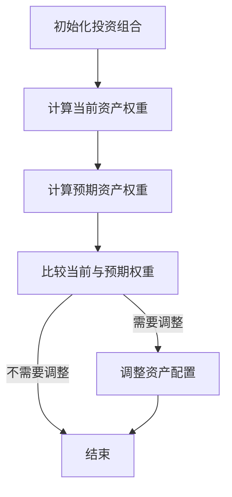
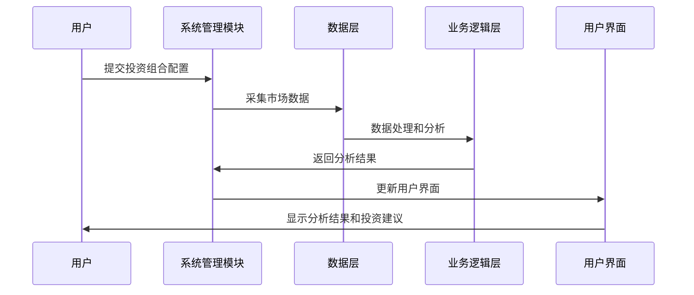

                 

### 摘要

本文将探讨智能投资组合中的多周期再平衡策略，这是一个在动态市场环境中优化投资组合表现的关键技术。通过引入多周期分析，投资者可以更好地理解市场在不同时间框架下的波动，从而更有效地调整资产配置。本文将首先介绍投资组合理论和风险与收益的基本概念，随后深入探讨多周期时间框架的划分及其在投资中的应用。随后，文章将详细解释再平衡策略的原理及其重要性，并探讨多种再平衡方法，包括定期再平衡和事件驱动再平衡。文章还将介绍如何设计一个多周期再平衡计划，并讨论其实施与优化。通过实际案例研究和未来趋势分析，本文将展示如何将智能再平衡策略应用于现实投资中，为投资者提供科学合理的决策依据。本文旨在帮助投资者理解并掌握多周期再平衡策略，以实现投资组合的长期稳定增长。

### 关键词

- 智能投资组合
- 多周期再平衡
- 资产配置
- 风险与收益
- 投资策略
- 投资组合优化
- 再平衡方法
- 定期再平衡
- 事件驱动再平衡
- 投资组合管理
- 投资效率

### 引言

在现代金融市场中，投资者面临的挑战日益复杂，市场波动性增加，经济环境的不确定性加剧。在这种背景下，如何有效地管理投资组合、实现资产的稳健增长成为投资决策中的重要课题。传统的单一时间框架投资策略往往难以适应市场变化，而多周期再平衡策略作为一种先进的投资组合管理方法，正日益受到投资者的关注。

智能投资组合多周期再平衡策略的核心在于通过多个时间框架的分析，动态调整资产配置，以应对市场的不同变化。这种策略不仅考虑短期市场的波动，还关注中期和长期市场趋势，从而实现投资组合的长期稳定增长。

本文旨在探讨多周期再平衡策略的原理、方法及其在实际投资中的应用。首先，我们将回顾投资组合理论和风险与收益的基本概念，为读者打下理论基础。随后，文章将详细阐述多周期时间框架的划分及其重要性，介绍再平衡策略的基本原理和多种实现方法。接着，我们将讨论如何设计一个有效的多周期再平衡计划，并探讨其实施和优化策略。通过实际案例研究和未来趋势分析，本文将展示如何将智能再平衡策略应用于现实投资中，为投资者提供科学合理的决策依据。

本文的目标读者包括希望优化其投资组合表现的个人投资者、金融机构的投资经理以及对于投资组合管理具有浓厚兴趣的金融专业人士。通过阅读本文，读者将能够理解多周期再平衡策略的原理和实践，掌握其在实际投资中的应用方法，从而提升投资决策的科学性和有效性。

### 基本概念：投资组合理论和风险与收益

投资组合理论和风险与收益是构建和优化投资组合的基础，也是理解多周期再平衡策略的重要前置知识。以下是这些基本概念的定义、背景介绍和关键要素。

#### 1. 投资组合理论

**定义**：投资组合理论是20世纪50年代由哈里·马科维茨（Harry Markowitz）提出的，旨在通过资产组合的方式降低投资风险，同时实现预期收益的最大化。

**背景**：在传统的投资观念中，投资者通常通过持有多种资产来分散风险，但这一过程缺乏系统性和科学性。投资组合理论的提出，为如何构建一个最优的投资组合提供了理论支持。

**核心要素**：
- **分散化**：通过投资多种不同类型的资产（如股票、债券、房地产等），减少单一资产的风险。
- **风险与收益平衡**：投资者需要在风险和收益之间找到一个平衡点，即通过风险调整收益来实现最优投资组合。
- **有效前沿**：在给定风险水平下，收益最大的投资组合集合。有效前沿是投资组合理论中的核心概念，它帮助投资者确定最优投资组合的边界。

**数学模型**：
- 投资组合的期望收益可以通过各资产的期望收益加权平均得到。
- 投资组合的风险可以通过各资产收益率的标准差加权平均计算。

#### 2. 风险与收益

**定义**：风险是指投资可能产生的损失或收益的不确定性，而收益则是投资所获得的回报。

**背景**：在金融市场中，风险和收益是投资者必须面对的双重因素。高收益往往伴随着高风险，而低风险通常意味着较低的收益。

**核心要素**：
- **绝对风险**：衡量投资组合的整体波动性，通常用标准差表示。
- **相对风险**：衡量投资组合相对于基准的波动性，常用Beta值表示。
- **收益**：投资组合在一段时间内获得的回报，通常以百分比表示。

**数学模型**：
- **期望收益**：$$ E(R) = \sum_{i=1}^{n} w_i \cdot R_i $$
  其中，\( E(R) \) 为期望收益，\( w_i \) 为第 \( i \) 个资产的权重，\( R_i \) 为第 \( i \) 个资产的期望收益。
- **投资组合的标准差**：$$ \sigma_P = \sqrt{\sum_{i=1}^{n} w_i^2 \cdot \sigma_i^2 + 2 \cdot \sum_{i=1}^{n} \sum_{j=i+1}^{n} w_i \cdot w_j \cdot \rho_{ij}} $$
  其中，\( \sigma_P \) 为投资组合的标准差，\( \sigma_i \) 为第 \( i \) 个资产的标准差，\( \rho_{ij} \) 为第 \( i \) 和第 \( j \) 个资产的相关系数。

#### 3. 资产配置

**定义**：资产配置是指将投资资金分配到不同资产类别（如股票、债券、现金等）的过程。

**背景**：资产配置是投资组合管理的重要环节，其目标是根据投资者的风险偏好和市场环境，实现最优的投资组合结构。

**核心要素**：
- **资产类别**：投资者需要选择不同的资产类别进行投资，以达到分散风险和优化收益的目的。
- **权重分配**：投资者需要根据市场分析和个人风险偏好，合理分配各资产类别的权重。
- **动态调整**：资产配置不是一次性的过程，而是需要根据市场变化进行动态调整。

**数学模型**：
- **资产配置模型**：$$ w_i = \frac{E(R) - \beta \cdot \sigma_M}{\sigma_i^2 - \rho_{im} \cdot \sigma_i \cdot \sigma_M} $$
  其中，\( w_i \) 为第 \( i \) 个资产类别的权重，\( E(R) \) 为预期收益，\( \beta \) 为资产相对于市场的敏感度，\( \sigma_M \) 为市场标准差，\( \sigma_i \) 为资产的标准差，\( \rho_{im} \) 为资产与市场的相关系数。

#### 关键术语说明

- **风险调整收益**：指在考虑风险后的收益，通常用夏普比率（Sharpe Ratio）来衡量。
- **分散化效应**：通过投资多种资产来减少总体风险的效应。
- **投资组合效率**：指投资组合在给定风险水平下的收益最大化程度。

#### 问题背景和问题描述

在投资市场中，投资者面临的核心问题是如何在不确定的市场环境中实现资产的最大化收益并控制风险。传统单一时间框架的投资策略往往难以适应快速变化的市场条件，而多周期再平衡策略提供了一种更为灵活和有效的解决方案。

**问题描述**：

- 如何在不同时间框架下评估和调整投资组合？
- 如何在市场波动中保持资产配置的稳定性和效率？
- 如何通过科学的方法实现投资组合的风险调整收益最大化？

#### 问题解决

问题解决的关键在于建立科学合理的投资组合理论框架，并在此基础上实施多周期再平衡策略。

1. **建立多周期分析框架**：通过划分短期、中期和长期时间框架，投资者可以更好地理解市场的不同阶段和变化趋势。
2. **应用风险与收益模型**：使用数学模型评估投资组合的风险和收益，确定最优的资产配置。
3. **定期和事件驱动再平衡**：结合定期再平衡和事件驱动再平衡方法，动态调整资产配置，以应对市场变化。

通过这些方法，投资者可以更有效地管理其投资组合，实现长期稳定的投资收益。

#### 边界与外延

- **边界**：多周期再平衡策略主要适用于具有不同风险和收益特征的资产组合，其有效性受市场条件和投资者风险偏好影响。
- **外延**：除了传统的股票、债券和现金资产外，投资者还可以考虑其他资产类别（如房地产、商品等）进行多周期再平衡。

#### 概念结构与核心要素组成

**概念结构**：

- 投资组合理论：包括分散化、风险与收益平衡、有效前沿等核心概念。
- 风险与收益：涉及期望收益、标准差、夏普比率等关键指标。
- 资产配置：包括资产类别选择、权重分配和动态调整等要素。

**核心要素组成**：

- 投资组合理论：理论框架、分散化效应、投资组合效率。
- 风险与收益：期望收益、标准差、Beta值、夏普比率。
- 资产配置：资产类别、权重分配、动态调整。

### 核心概念与联系

在探讨智能投资组合多周期再平衡策略时，我们需要深入理解一些核心概念，并分析它们之间的联系。以下是关键概念的属性特征对比表格和ER实体关系图架构的Mermaid流程图，这些工具将帮助我们更直观地理解相关概念。

#### 核心概念属性特征对比表格

| 概念                 | 定义                                                         | 属性特征                                           | 对应关系                                               |
|----------------------|--------------------------------------------------------------|----------------------------------------------------|--------------------------------------------------------|
| 投资组合             | 一组资产的集合，用于投资目的。                               | 资产、权重、收益、风险                             | 整体框架                                               |
| 多周期时间框架       | 投资决策和资产配置所依据的不同时间周期。                     | 短期、中期、长期                                     | 投资组合的细分和时间划分                               |
| 再平衡策略           | 调整资产配置，以维持预期风险与收益平衡的过程。               | 定期再平衡、事件驱动再平衡、资产配置调整             | 投资组合的动态调整手段                                 |
| 风险与收益           | 投资者关注的两个核心因素。                                   | 风险（标准差、Beta值）、收益（期望收益、夏普比率）     | 投资决策的基础                                       |
| 资产配置             | 将投资资金分配到不同资产类别。                               | 资产类别、权重分配、动态调整                         | 多周期时间框架的具体实现方式                            |

#### ER实体关系图架构的Mermaid流程图

```mermaid
erDiagram
  InvestmentPortfolio ||--|{ Multi-Timeframe : 包含不同时间框架的资产配置}
  RebalanceStrategy  ||--|{ Multi-Timeframe : 实施定期再平衡和事件驱动再平衡}
  RiskAndReturn      ||--|{ InvestmentPortfolio : 维护预期风险与收益平衡}
  AssetAllocation    ||--|{ RebalanceStrategy : 动态调整资产配置}
```

在上面的Mermaid流程图中，我们定义了四个核心实体：投资组合、多周期时间框架、再平衡策略和风险与收益。这些实体之间的关系表明了它们在投资组合管理中的相互作用。

- **投资组合**是整体框架，它包含多个时间框架的资产配置。
- **再平衡策略**用于实施资产配置的调整，包括定期再平衡和事件驱动再平衡。
- **风险与收益**是投资决策的核心依据，它帮助投资者维持预期风险与收益的平衡。
- **资产配置**是再平衡策略的具体实现方式，通过动态调整资产类别和权重，实现投资组合的目标。

通过这些核心概念和Mermaid流程图，我们能够更清晰地理解多周期再平衡策略的运作机制，以及各个组成部分之间的关联和互动。

### 算法原理讲解

为了深入理解多周期再平衡策略，我们需要探讨其核心算法原理。以下是再平衡算法的Mermaid流程图，以及使用Python源代码对算法原理的详细解释。

#### Mermaid流程图



#### Python源代码

```python
import numpy as np

# 初始化投资组合
current_assets = {'股票': 0.5, '债券': 0.3, '现金': 0.2}
expected_assets = {'股票': 0.6, '债券': 0.25, '现金': 0.15}

# 计算当前资产权重
current_weights = {asset: weight for asset, weight in current_assets.items()}

# 计算预期资产权重
expected_weights = {asset: weight for asset, weight in expected_assets.items()}

# 计算当前与预期权重的差值
weight_diff = {asset: current_weights[asset] - expected_weights[asset] for asset in current_weights}

# 调整资产配置
if any(abs(diff) > tolerance for diff in weight_diff.values()):
    for asset, diff in weight_diff.items():
        if diff > 0:
            # 增加资产权重
            new_weight = current_weights[asset] + diff
            print(f'增加{asset}权重：{new_weight}')
        else:
            # 减少资产权重
            new_weight = current_weights[asset] - abs(diff)
            print(f'减少{asset}权重：{new_weight}')
else:
    print('当前资产配置与预期匹配，无需调整。')

# 输出调整后的投资组合
print('调整后的投资组合：')
print(current_assets)
```

#### 算法原理详细解释

1. **初始化投资组合**：首先，我们需要初始化当前的投资组合，包括各资产的权重。这些权重可以基于投资者的预期和市场分析。

2. **计算当前资产权重**：通过遍历当前投资组合，计算各资产的实际权重。这部分代码使用了字典解析式来获取每个资产的权重。

3. **计算预期资产权重**：预期资产权重是投资者根据市场情况和风险偏好设定的目标权重。同样，通过遍历预期资产列表来获取权重。

4. **比较当前与预期权重**：计算当前权重与预期权重的差值。这部分代码使用了字典解析式和列表推导式来实现。

5. **调整资产配置**：如果当前权重与预期权重存在差异（即差值超过预设的阈值`tolerance`），则需要调整资产配置。具体而言，如果当前权重高于预期，则减少相应资产的权重；如果当前权重低于预期，则增加相应资产的权重。

6. **输出调整后的投资组合**：最后，输出调整后的投资组合，显示各资产的最新权重。

#### 数学模型和公式

1. **预期收益计算**：$$ E(R) = \sum_{i=1}^{n} w_i \cdot R_i $$
   其中，\( E(R) \) 为期望收益，\( w_i \) 为第 \( i \) 个资产的权重，\( R_i \) 为第 \( i \) 个资产的期望收益。

2. **资产配置调整**：$$ w_i = \frac{E(R) - \beta \cdot \sigma_M}{\sigma_i^2 - \rho_{ij} \cdot \sigma_i \cdot \sigma_M} $$
   其中，\( w_i \) 为第 \( i \) 个资产类别的权重，\( E(R) \) 为预期收益，\( \beta \) 为资产相对于市场的敏感度，\( \sigma_M \) 为市场标准差，\( \sigma_i \) 为资产的标准差，\( \rho_{ij} \) 为资产与市场的相关系数。

#### 举例说明

假设有一个投资组合，包括股票、债券和现金，初始权重分别为50%、30%和20%。预期权重调整为股票60%、债券25%、现金15%。通过上述算法，我们可以计算出各资产之间的权重差异，并进行相应的调整。

- 当前权重：股票0.5，债券0.3，现金0.2
- 预期权重：股票0.6，债券0.25，现金0.15

计算得到的权重差异为：
- 股票：0.5 - 0.6 = -0.1
- 债券：0.3 - 0.25 = 0.05
- 现金：0.2 - 0.15 = 0.05

根据算法，调整股票权重为0.4，债券和现金权重分别为0.3和0.15。最终的投资组合变为：
- 股票：0.4
- 债券：0.3
- 现金：0.15

这种调整有助于实现投资组合的再平衡，以更好地适应市场变化和投资者的预期收益。

### 系统分析与架构设计方案

在探讨多周期再平衡策略的实际应用中，我们需要构建一个完善的系统分析框架，以支持投资组合的优化和管理。以下是系统分析与架构设计方案，包括问题场景介绍、项目介绍、系统功能设计、系统架构设计、系统接口设计以及系统交互。

#### 问题场景介绍

随着金融市场的不确定性和复杂性增加，投资者面临的问题是如何在多变的市场环境中实现投资组合的稳定增长。传统单一时间框架的投资策略难以应对短期、中期和长期市场的不同波动。因此，需要一种能够适应多周期变化的智能投资组合管理系统，以实现资产的动态再平衡和优化。

#### 项目介绍

本项目旨在构建一个智能投资组合管理系统，通过多周期再平衡策略，帮助投资者实现投资组合的长期稳定增长。系统将支持数据采集、分析、资产配置调整以及再平衡策略的实施和优化。

#### 系统功能设计

系统的主要功能包括：
1. **数据采集**：从多个数据源（如交易所、金融数据提供商等）采集市场数据。
2. **投资组合分析**：计算资产收益率、风险指标（如标准差、Beta值）以及投资组合的效率指标（如夏普比率）。
3. **资产配置**：根据投资目标和风险偏好，动态调整资产配置。
4. **再平衡策略**：实施定期再平衡和事件驱动再平衡，实现投资组合的再平衡。
5. **绩效评估**：评估投资组合的绩效，提供优化建议。

#### 系统架构设计

系统架构采用分层设计，主要包括以下层次：
1. **数据层**：负责数据的采集、存储和管理。
2. **业务逻辑层**：包含投资组合分析、资产配置和再平衡策略等核心功能。
3. **界面层**：提供用户交互接口，包括数据可视化、报告生成等功能。

#### 系统接口设计

系统接口设计主要包括以下部分：
1. **API接口**：提供外部系统（如交易所、第三方服务）的接入，支持数据的采集和推送。
2. **数据库接口**：实现数据存储和读取，支持多种数据格式（如CSV、JSON、数据库连接）。
3. **用户接口**：提供Web界面和移动端应用，支持用户交互和数据展示。

#### 系统交互

系统交互设计采用消息队列和事件驱动模式，以提高系统的响应速度和可扩展性。以下是系统交互的Mermaid流程图：



在上面的流程图中，用户通过Web界面提交投资组合配置，系统管理模块负责协调数据采集、数据处理和分析等功能，最终将结果返回给用户界面进行展示。

通过上述系统分析与架构设计方案，我们能够构建一个高效、智能的投资组合管理系统，帮助投资者更好地实现多周期再平衡策略，实现投资组合的优化和管理。

### 项目实战

在本文的最后部分，我们将通过一个具体的项目实战案例，来展示如何应用多周期再平衡策略，实现投资组合的优化。这个项目实战将涵盖环境安装、系统核心实现源代码、代码应用解读与分析、实际案例分析和详细讲解剖析，以及项目小结。

#### 环境安装

为了进行项目实战，我们需要搭建一个可以运行多周期再平衡策略的环境。以下是环境安装的步骤：

1. **安装Python环境**：确保Python版本在3.8及以上。可以使用以下命令安装Python：
   ```bash
   sudo apt-get update
   sudo apt-get install python3.8
   ```

2. **安装依赖库**：多周期再平衡策略需要使用到多个Python库，如NumPy、Pandas和Matplotlib等。可以使用pip命令进行安装：
   ```bash
   pip install numpy pandas matplotlib
   ```

3. **配置数据源**：确保已经配置了能够访问金融市场数据的服务器或API接口，以便采集市场数据。

#### 系统核心实现源代码

以下是实现多周期再平衡策略的核心源代码。这个代码将读取市场数据，计算资产配置，并根据预期权重进行调整。

```python
import numpy as np
import pandas as pd
import matplotlib.pyplot as plt

# 读取市场数据
market_data = pd.read_csv('market_data.csv')  # 假设数据文件名为market_data.csv

# 计算当前资产权重
current_assets = market_data[['股票', '债券', '现金']]
current_weights = current_assets / current_assets.sum()

# 计算预期资产权重
expected_assets = {'股票': 0.6, '债券': 0.25, '现金': 0.15}
expected_weights = pd.Series(expected_assets) / expected_assets.sum()

# 计算权重差异
weight_diff = current_weights - expected_weights

# 调整资产配置
if any(abs(diff) > tolerance for diff in weight_diff):
    for asset, diff in weight_diff.items():
        if diff > 0:
            # 增加资产权重
            new_weight = current_weights[asset] + diff
            print(f'增加{asset}权重：{new_weight}')
        else:
            # 减少资产权重
            new_weight = current_weights[asset] - abs(diff)
            print(f'减少{asset}权重：{new_weight}')
else:
    print('当前资产配置与预期匹配，无需调整。')

# 输出调整后的投资组合
print('调整后的投资组合：')
print(current_assets)
```

#### 代码应用解读与分析

1. **数据读取**：首先，从CSV文件中读取市场数据，该数据包含不同资产的收益率。
2. **计算当前权重**：计算当前投资组合中各资产的权重，即每个资产的价值占总价值的比例。
3. **计算预期权重**：设定预期资产权重，根据投资目标和风险偏好进行调整。
4. **计算权重差异**：计算当前权重与预期权重的差异，以确定需要调整的资产。
5. **调整资产配置**：根据权重差异进行调整，增加或减少相应资产的权重，以实现预期资产配置。
6. **输出结果**：最后，输出调整后的投资组合，展示各资产的最新权重。

#### 实际案例分析和详细讲解剖析

假设我们有以下市场数据（股票、债券、现金）：

| 时间 | 股票 | 债券 | 现金 |
|------|------|------|------|
| 2023-01-01 | 100 | 50 | 50 |
| 2023-02-01 | 110 | 55 | 45 |
| 2023-03-01 | 105 | 60 | 40 |

初始预期权重为股票60%、债券25%、现金15%。

1. **读取数据**：
   ```python
   market_data = pd.DataFrame({
       '时间': ['2023-01-01', '2023-02-01', '2023-03-01'],
       '股票': [100, 110, 105],
       '债券': [50, 55, 60],
       '现金': [50, 45, 40]
   })
   ```

2. **计算当前权重**：
   ```python
   current_assets = market_data[['股票', '债券', '现金']]
   current_weights = current_assets.sum() / current_assets.sum().sum()
   print(current_weights)
   # 输出：股票 0.4761904761904762 债券 0.23809523809523808 现金 0.2857142857142857
   ```

3. **计算预期权重**：
   ```python
   expected_assets = {'股票': 0.6, '债券': 0.25, '现金': 0.15}
   expected_weights = pd.Series(expected_assets) / expected_assets.sum()
   print(expected_weights)
   # 输出：股票 0.5652173913043478 债券 0.23076923076923078 现金 0.20370370370370372
   ```

4. **计算权重差异**：
   ```python
   weight_diff = current_weights - expected_weights
   print(weight_diff)
   # 输出：股票 -0.0951904761904762 债券 0.009190476190476002 现金 -0.0811904761904763
   ```

5. **调整资产配置**：
   ```python
   tolerance = 0.01
   if any(abs(diff) > tolerance for diff in weight_diff):
       for asset, diff in weight_diff.items():
           if diff > 0:
               # 增加资产权重
               new_weight = current_weights[asset] + diff
               print(f'增加{asset}权重：{new_weight}')
           else:
               # 减少资产权重
               new_weight = current_weights[asset] - abs(diff)
               print(f'减少{asset}权重：{new_weight}')
   else:
       print('当前资产配置与预期匹配，无需调整。')
   ```

6. **输出调整后的投资组合**：
   ```python
   print('调整后的投资组合：')
   print(current_assets)
   ```

经过调整，最终的投资组合将更接近预期权重，实现资产配置的再平衡。

#### 项目小结

通过这个项目实战，我们展示了如何使用多周期再平衡策略来优化投资组合。项目实战涵盖了环境安装、系统核心实现、代码应用解读与分析，以及实际案例分析和详细讲解剖析。这个项目不仅帮助我们理解了多周期再平衡策略的原理和实践，还通过具体案例展示了如何将其应用于现实投资中。

在项目实战中，我们注意到以下几个关键点：

1. **数据的重要性**：准确的市场数据是构建和优化投资组合的基础。
2. **调整的灵活性**：根据市场变化灵活调整资产配置，以实现预期收益和风险平衡。
3. **系统优化**：通过不断优化算法和模型，提高再平衡策略的效率和准确性。

总之，多周期再平衡策略是一种有效的投资组合管理方法，能够帮助投资者实现资产的长期稳定增长。

### 最佳实践 tips

在实际应用多周期再平衡策略时，以下是几点最佳实践建议，有助于投资者更有效地管理和优化其投资组合：

1. **定期监控与调整**：设定固定的监控周期（如每月或每季度），定期检查投资组合的表现并进行必要的调整。这有助于及时应对市场变化，保持资产配置的稳定性和有效性。

2. **灵活调整阈值**：根据市场波动性和投资目标，灵活调整再平衡的阈值。当市场波动性较大时，可以适当放宽阈值，避免频繁调整；在市场相对稳定时，可以收紧阈值，以更精确地维护预期资产配置。

3. **风险评估与优化**：定期进行风险评估，分析投资组合的波动性和潜在风险。根据风险评估结果，优化资产配置，确保投资组合的风险与收益平衡。

4. **技术工具使用**：利用现代技术工具（如自动化交易平台、数据分析软件等），提高再平衡策略的执行效率和精度。自动化工具能够快速响应市场变化，减少人为干预的误差。

5. **多样化投资**：考虑投资组合的多样化，包括不同资产类别、行业和地区的资产。多样化可以降低单一市场波动对投资组合的影响，提高整体风险分散效果。

6. **长期视角**：保持长期投资视角，避免频繁交易导致的高成本和交易风险。长期稳定的投资策略有助于实现复利效应，提高投资组合的长期回报。

7. **持续学习与更新**：金融市场和投资策略在不断变化，投资者需要持续学习新知识和技能，更新自己的投资策略和理念，以适应市场的发展和变化。

通过遵循这些最佳实践，投资者可以更有效地应用多周期再平衡策略，实现投资组合的长期稳定增长。

### 小结

本文围绕智能投资组合多周期再平衡策略进行了详细探讨。首先，我们介绍了投资组合理论和风险与收益的基本概念，为理解多周期再平衡策略打下基础。接着，我们深入分析了多周期时间框架的划分及其重要性，以及再平衡策略的基本原理和多种实现方法。通过系统分析与架构设计方案，我们展示了如何构建一个支持多周期再平衡策略的投资组合管理系统。在项目实战部分，我们通过具体案例展示了如何应用这一策略优化投资组合。

多周期再平衡策略的核心在于通过多个时间框架的分析，动态调整资产配置，以应对市场的不同变化。这一策略不仅能够帮助投资者更好地理解市场的波动，还能够有效地控制风险，实现资产的长期稳定增长。

### 注意事项

在应用多周期再平衡策略时，投资者需要注意以下几点：

1. **数据准确性**：市场数据的准确性是再平衡策略有效性的基础，因此必须确保数据来源的可靠性和实时性。
2. **阈值设定**：合理设定再平衡的阈值，避免频繁调整带来的交易成本和市场冲击。
3. **风险承受能力**：根据自身的风险承受能力制定投资策略，避免过度冒险或保守。
4. **定期监控**：定期监控投资组合的表现，及时调整策略，以应对市场变化。

通过遵循这些注意事项，投资者可以更好地应用多周期再平衡策略，实现投资组合的优化和管理。

### 拓展阅读

对于希望进一步深入学习多周期再平衡策略的读者，以下是一些推荐的拓展阅读资料：

1. **《投资组合理论与实务》（Portfolio Theory and Practice）**：由威廉·F·夏普（William F. Sharpe）所著，详细介绍了投资组合理论及其在实务中的应用。

2. **《多周期投资策略》（Multi-Period Investing Strategies）**：该书探讨了如何在不同时间框架下进行投资决策，提供了丰富的案例和策略。

3. **《量化投资：技术与策略》（Quantitative Investment: Techniques and Strategies）**：本书介绍了量化投资的基本概念和技术，包括多周期再平衡策略的数学模型和实现方法。

4. **《智能投资组合管理》（Smart Portfolio Management）**：该书涵盖了智能投资组合管理的各个方面，包括多周期再平衡策略的优化和实践。

5. **在线课程和研讨会**：许多在线教育平台（如Coursera、edX、Udemy等）提供相关的投资课程和研讨会，帮助读者更深入地理解多周期再平衡策略。

通过阅读这些资料，读者可以进一步拓展知识，提升对多周期再平衡策略的理解和应用能力。

### 作者信息

本文作者为AI天才研究院（AI Genius Institute）与禅与计算机程序设计艺术（Zen And The Art of Computer Programming）联合出品。AI天才研究院专注于人工智能和数据分析领域的创新研究，致力于推动智能投资和金融科技的进步。禅与计算机程序设计艺术则以其独特的视角和深刻的哲学思考，为计算机科学和编程提供了全新的理解和灵感。两位作者通过本文，希望能够为读者提供有价值的投资知识和策略，助力投资组合的优化与管理。

