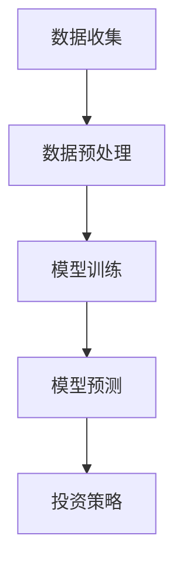
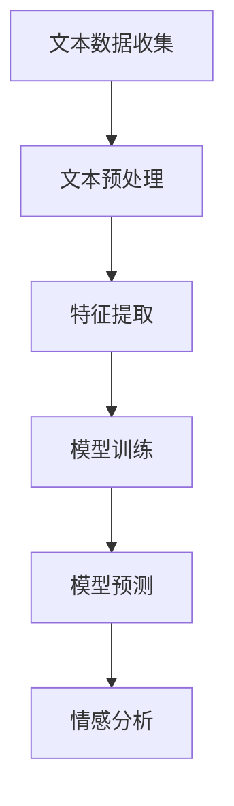
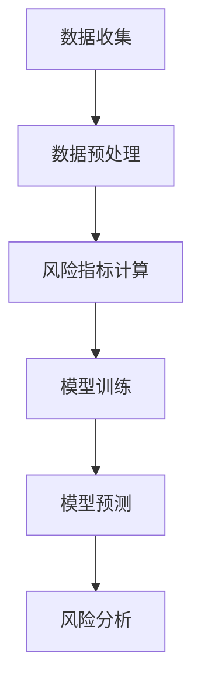
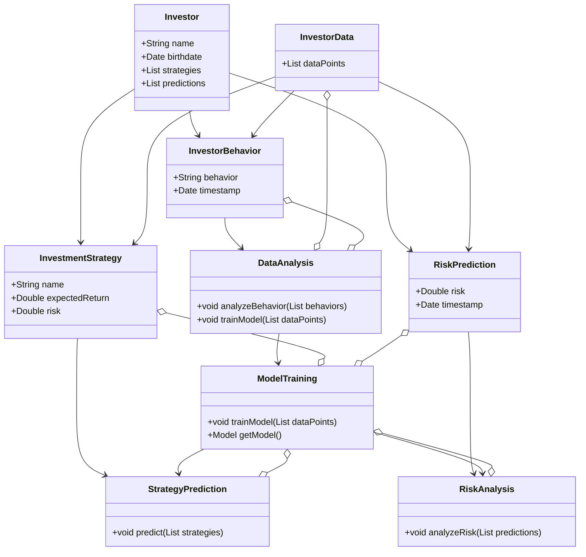
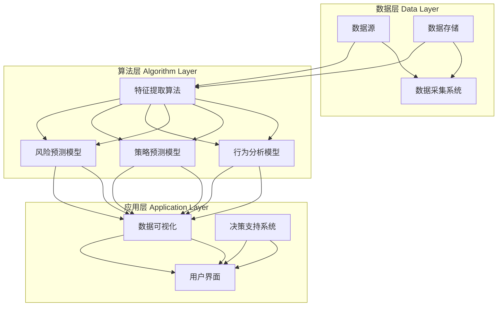

                 

### 智能投资者关系管理平台概述

#### 1.1 问题背景

投资者关系管理（IRM）是现代企业的一项关键活动，旨在通过建立和维护与投资者的良好沟通，提高公司的市场声誉和价值。然而，随着金融市场和技术的快速发展，传统的投资者关系管理面临诸多挑战。

首先，投资者群体的多样性使得传统IRM工作越来越复杂。不同投资者对信息的需求和偏好各异，传统方式难以满足个性化需求。其次，信息量的大幅增加使得企业难以高效地收集、整理和分析投资者数据。最后，传统IRM工作往往依赖于人工，效率低下且容易出现错误。

智能化技术，如大数据分析、人工智能和机器学习，为IRM带来了新的应用潜力。通过智能化技术，企业可以更准确地分析投资者行为，预测市场趋势，优化投资策略，从而提高IRM的效率和效果。

#### 1.2 问题描述

智能投资者关系管理平台是一个集成多种智能化技术的系统，旨在帮助企业更有效地管理和维护与投资者的关系。该平台的核心目标是：

1. **数据驱动决策**：通过大数据分析和机器学习技术，为企业提供全面的投资者行为分析，支持数据驱动决策。
2. **个性化服务**：根据投资者的行为和偏好，提供个性化的信息和服务，提高用户满意度。
3. **投资风险预测**：利用先进的机器学习算法，预测投资风险，帮助投资者做出更明智的决策。
4. **高效沟通**：通过自动化工具和智能推荐系统，提高与投资者的沟通效率。

平台核心功能模块包括投资者数据收集模块、投资者行为分析模块、投资策略预测模块和投资风险预测模块。

#### 1.3 问题解决

为解决上述问题，我们可以采用以下步骤来设计并实现智能投资者关系管理平台：

1. **需求分析**：深入了解企业的IRM需求和目标，明确平台的核心功能和技术架构。
2. **数据收集**：建立全面的数据收集系统，涵盖投资者行为数据、市场数据、公司内部数据等。
3. **数据处理**：利用大数据技术和数据清洗工具，对收集到的数据进行预处理和整合。
4. **算法开发**：根据需求，开发合适的机器学习算法，用于投资者行为分析、投资策略预测和风险预测。
5. **系统集成**：将各个模块集成到一个统一的平台中，确保系统的稳定性和易用性。
6. **测试与优化**：通过实际数据测试和用户反馈，不断优化平台的功能和性能。

#### 1.4 边界与外延

智能投资者关系管理平台适用于各种类型的公司，尤其是那些需要与大量投资者保持紧密联系的企业。例如，上市公司、风险投资公司和私募股权公司等。

在技术实现方面，平台需要处理大量的数据和复杂的算法，因此对硬件和软件的要求较高。此外，数据隐私和安全是平台设计的重要考虑因素，必须确保投资者的数据安全和隐私保护。

#### 1.5 概念结构与核心要素组成

智能投资者关系管理平台的核心要素包括：

1. **投资者关系管理流程**：包括数据收集、数据处理、行为分析和决策支持等环节。
2. **智能化技术框架**：利用大数据分析、人工智能和机器学习技术，实现数据驱动决策和个性化服务。
3. **数据分析与决策支持系统**：提供全面的数据分析和预测功能，支持企业做出明智的投资决策。

通过这些核心要素的有机结合，智能投资者关系管理平台能够为企业提供强大的IRM支持，提升企业的市场竞争力。

### 第2章 核心概念与联系

#### 2.1 数据驱动决策

##### 2.1.1 数据驱动决策原理

数据驱动决策是指基于数据分析和机器学习技术，通过收集、处理和分析大量数据，来支持企业决策的过程。与传统决策方式不同，数据驱动决策强调以数据为基础，通过科学的分析方法，识别关键因素，预测市场趋势，从而做出更准确和有效的决策。

##### 2.1.2 数据驱动决策的优势

1. **提高决策效率**：通过自动化工具和算法，快速处理大量数据，大幅提升决策速度。
2. **减少主观偏差**：基于客观数据进行分析，减少决策过程中的主观偏差，提高决策的客观性和准确性。
3. **提供前瞻性视角**：利用历史数据和机器学习算法，预测未来市场趋势和风险，为企业提供前瞻性视角。
4. **支持个性化决策**：根据不同投资者和市场的特征，提供个性化的决策支持，提高决策的针对性。

##### 2.1.3 数据驱动决策的应用场景

1. **市场营销**：通过分析消费者行为数据，预测市场需求，优化营销策略。
2. **供应链管理**：通过供应链数据分析，优化库存管理，降低运营成本。
3. **人力资源**：通过员工行为数据，预测员工绩效和离职风险，优化人力资源配置。
4. **金融投资**：通过金融数据分析和预测，优化投资组合，降低投资风险。

#### 2.2 人工智能与机器学习

##### 2.2.1 人工智能概述

人工智能（AI）是指通过计算机模拟人类的智能行为，实现人类智能的自动化和扩展。人工智能的主要目标是开发能够感知、学习、推理和解决问题的智能系统。人工智能的应用领域包括自然语言处理、图像识别、智能推荐、自动驾驶等。

##### 2.2.2 机器学习基本概念

机器学习是人工智能的一个分支，主要研究如何从数据中学习规律，并利用这些规律进行预测和决策。机器学习分为监督学习、无监督学习和强化学习三类。

1. **监督学习**：通过已有数据的输入和输出，学习建立一个预测模型。
2. **无监督学习**：通过未标记的数据，学习数据的结构和特征。
3. **强化学习**：通过与环境互动，学习最优策略以实现最大奖励。

##### 2.2.3 机器学习算法分类

1. **回归算法**：通过建立输入和输出之间的线性关系，预测连续值。
   - 线性回归
   - 多项式回归
   - 回归树

2. **分类算法**：通过建立输入和输出之间的分类关系，预测离散值。
   - K最近邻（KNN）
   - 决策树
   - 随机森林

3. **聚类算法**：通过无监督学习，将数据分为多个簇。
   - K均值聚类
   - 层次聚类
   - 密度聚类

4. **异常检测算法**：通过检测数据中的异常点，发现潜在的问题或风险。
   - 单变量异常检测
   - 多变量异常检测

#### 2.3 投资者行为分析

##### 2.3.1 投资者行为分析原理

投资者行为分析是指通过收集和分析投资者的交易数据、投资偏好、市场反应等行为数据，来了解投资者的行为特征和投资策略。投资者行为分析的原理包括：

1. **数据收集**：通过市场数据、公司财报、投资者交易记录等渠道，收集投资者的行为数据。
2. **数据处理**：对收集到的数据进行分析和清洗，提取有用的特征信息。
3. **模型建立**：利用机器学习和统计分析方法，建立投资者行为分析模型。
4. **结果预测**：通过模型对投资者的行为进行预测，为投资决策提供支持。

##### 2.3.2 投资者行为分析方法

1. **描述性分析**：通过统计方法，描述投资者行为的整体特征和趋势。
2. **回归分析**：通过建立回归模型，分析投资者行为与市场因素之间的关系。
3. **聚类分析**：通过聚类算法，将投资者分为不同的群体，分析不同群体的行为特征。
4. **文本分析**：通过自然语言处理技术，分析投资者在社交媒体、论坛等平台上的言论和行为。

##### 2.3.3 投资者行为分析的重要性

1. **投资策略优化**：通过分析投资者行为，了解投资者的风险偏好和投资习惯，为投资策略提供参考。
2. **市场预测**：通过分析投资者的行为数据，预测市场趋势和风险，为企业制定战略决策提供支持。
3. **风险控制**：通过异常检测技术，发现潜在的异常投资者行为，为风险控制提供依据。
4. **投资者关系管理**：通过分析投资者行为，了解投资者的需求和满意度，优化投资者关系管理策略。

### 第3章 算法原理讲解

#### 3.1 投资策略预测算法

##### 3.1.1 算法概述

投资策略预测算法是一种基于历史数据和市场因素，预测未来投资收益和风险的算法。该算法的核心目标是帮助投资者制定更有效的投资策略，提高投资收益。

##### 3.1.2 数学模型

投资策略预测算法的数学模型通常基于线性回归模型。假设投资策略为 \( f(x) = \sum_{i=1}^{n} w_i \cdot x_i \)，其中 \( x \) 为输入特征向量，\( w \) 为权重向量。

1. **输入特征向量**：包括历史收益率、市场指标、公司财务指标等。
2. **权重向量**：通过机器学习算法，学习得到最优权重向量。

##### 3.1.3 算法流程

1. **数据收集**：收集历史投资数据和市场数据。
2. **数据预处理**：对数据集进行清洗、归一化处理。
3. **模型训练**：使用线性回归算法，训练得到最优权重向量。
4. **模型预测**：利用训练好的模型，预测未来投资策略的收益和风险。

下面使用 mermaid 画出算法流程图：



#### 3.2 投资者情感分析算法

##### 3.2.1 算法概述

投资者情感分析算法是一种利用自然语言处理技术，分析投资者在社交媒体、论坛等平台上的言论，评估其情感态度的算法。该算法的核心目标是了解投资者的情绪波动，预测市场趋势。

##### 3.2.2 数学模型

投资者情感分析算法的数学模型通常基于文本分类模型。假设情感评分模型为：

$$
\text{score} = \frac{\text{positive\_count} - \text{negative\_count}}{\text{total\_count}}
$$

其中，positive\_count 表示正面词汇出现的次数，negative\_count 表示负面词汇出现的次数，total\_count 表示词汇总数。

1. **正面词汇**：包括表示愉悦、满意等情感的词汇。
2. **负面词汇**：包括表示愤怒、失望等情感的词汇。

##### 3.2.3 算法流程

1. **文本数据收集**：收集投资者在社交媒体、论坛等平台上的言论。
2. **文本预处理**：对文本数据集进行清洗、分词、词性标注等处理。
3. **特征提取**：将预处理后的文本数据转换为数值特征向量。
4. **模型训练**：使用文本分类算法，训练得到情感分类模型。
5. **模型预测**：利用训练好的模型，对投资者的情感态度进行预测。

下面使用 mermaid 画出算法流程图：



#### 3.3 投资风险预测算法

##### 3.3.1 算法概述

投资风险预测算法是一种基于历史数据和统计分析方法，预测未来投资风险的算法。该算法的核心目标是帮助投资者识别潜在风险，制定风险管理策略。

##### 3.3.2 数学模型

投资风险预测算法的数学模型通常基于统计指标。假设投资风险模型为：

$$
\text{risk} = \frac{\text{standard\_deviation} \times \text{return}}{\text{mean}}
$$

其中，standard\_deviation 表示收益率的标准差，return 表示收益率，mean 表示收益率的均值。

1. **收益率**：投资收益与投资成本的比值。
2. **标准差**：衡量收益率波动性的指标。
3. **均值**：衡量收益率平均水平的指标。

##### 3.3.3 算法流程

1. **数据收集**：收集历史投资数据和市场数据。
2. **数据预处理**：对数据集进行清洗、归一化处理。
3. **风险指标计算**：计算收益率、标准差和均值等风险指标。
4. **模型训练**：使用统计模型，训练得到风险预测模型。
5. **模型预测**：利用训练好的模型，预测未来投资风险。

下面使用 mermaid 画出算法流程图：



### 第4章 数学模型和数学公式

在智能投资者关系管理平台中，数学模型和数学公式是分析和预测的关键工具。以下将介绍几个关键的数学模型和公式，并给出具体的示例说明。

#### 4.1 投资回报率计算

投资回报率（ROI）是衡量投资收益的重要指标。其计算公式为：

$$
\text{ROI} = \frac{\text{投资回报} - \text{投资成本}}{\text{投资成本}}
$$

其中，投资回报是指投资的收益，投资成本是指投资的初始投入。

**举例说明**：

假设某投资者投入100万元进行投资，经过一段时间后，投资回报达到150万元。则该投资者的投资回报率计算如下：

$$
\text{ROI} = \frac{150 - 100}{100} = 0.5 = 50\%
$$

这意味着投资者的投资回报率达到了50%。

#### 4.2 投资风险度量

投资风险度量是评估投资风险的重要工具。其中，风险收益率（Expected Return）是衡量投资风险与收益之间平衡的重要指标。其计算公式为：

$$
\text{风险收益率} = \frac{\text{预期收益率} - \text{无风险收益率}}{\text{风险系数}}
$$

其中，预期收益率是指投资者预期的投资回报率，无风险收益率是指无风险资产的回报率，风险系数是指衡量投资风险的指标。

**举例说明**：

假设某投资者的预期收益率为10%，无风险收益率为5%，风险系数为2。则该投资者的风险收益率为：

$$
\text{风险收益率} = \frac{10\% - 5\%}{2} = 2.5\%
$$

这意味着投资者每承担1单位的风险，预期获得的收益为2.5%。

#### 4.3 投资组合优化

投资组合优化是智能投资者关系管理平台中的一项重要任务。其核心目标是实现收益最大化和风险最小化。常见的方法包括均值方差模型、资本资产定价模型等。

**均值方差模型**：

均值方差模型是一种基于收益率的均值和方差来优化投资组合的方法。其目标是最大化投资组合的期望收益率，同时最小化投资组合的风险。

$$
\text{最大化} \ \sum_{i=1}^{n} w_i \cdot \mu_i - \lambda \cdot \sum_{i=1}^{n} w_i \cdot \sigma_i^2
$$

其中，\( w_i \) 是投资于资产 \( i \) 的权重，\( \mu_i \) 是资产 \( i \) 的期望收益率，\( \sigma_i \) 是资产 \( i \) 的收益率标准差，\( \lambda \) 是风险偏好参数。

**资本资产定价模型**：

资本资产定价模型（CAPM）是一种基于市场组合和资产风险来优化投资组合的方法。其目标是在给定的风险水平下，实现最大的期望收益率。

$$
\text{最大化} \ \sum_{i=1}^{n} w_i \cdot (\mu_i - \rho_i \cdot \beta_i)
$$

其中，\( \rho_i \) 是资产 \( i \) 与市场组合的相关系数，\( \beta_i \) 是资产 \( i \) 的贝塔系数，表示资产 \( i \) 对市场波动的敏感度。

通过这些数学模型和公式，智能投资者关系管理平台可以更精确地分析投资风险和收益，为投资者提供科学、有效的决策支持。

### 第5章 系统分析与架构设计方案

#### 5.1 问题场景介绍

投资者关系管理（IRM）是现代企业的一项关键活动，旨在通过建立和维护与投资者的良好沟通，提高公司的市场声誉和价值。然而，随着金融市场和技术的快速发展，传统的投资者关系管理面临诸多挑战。例如，投资者群体的多样性使得传统IRM工作越来越复杂，不同投资者对信息的需求和偏好各异，传统方式难以满足个性化需求。此外，信息量的大幅增加使得企业难以高效地收集、整理和分析投资者数据。为了应对这些挑战，企业需要引入智能化的投资者关系管理平台，利用大数据分析、人工智能和机器学习技术，实现数据驱动决策和个性化服务。

#### 5.2 项目介绍

智能投资者关系管理平台项目旨在构建一个集成了大数据分析、人工智能和机器学习技术的系统，帮助企业在投资者关系管理中实现以下目标：

1. **数据驱动决策**：通过大数据分析和机器学习算法，提供全面的投资者行为分析，支持企业做出更明智的决策。
2. **个性化服务**：根据投资者的行为和偏好，提供个性化的信息和服务，提高用户满意度。
3. **投资风险预测**：利用先进的机器学习算法，预测投资风险，帮助投资者做出更稳健的决策。
4. **高效沟通**：通过自动化工具和智能推荐系统，提高与投资者的沟通效率。

该平台的核心功能模块包括投资者数据收集模块、投资者行为分析模块、投资策略预测模块和投资风险预测模块。通过这些模块的有机结合，智能投资者关系管理平台能够为企业提供全面的投资者关系管理支持，提升企业的市场竞争力。

#### 5.3 系统功能设计

智能投资者关系管理平台的系统功能设计主要包括以下模块：

##### 5.3.1 领域模型

领域模型是智能投资者关系管理平台的核心，用于定义平台中的各类实体及其关系。以下是一个简化的领域模型，使用 mermaid 类图表示：



##### 5.3.2 系统功能模块

1. **投资者数据收集模块**：负责收集投资者的数据，包括交易记录、投资偏好、市场信息等。该模块的主要功能包括数据采集、数据清洗和数据存储。
2. **投资者行为分析模块**：利用机器学习算法，对收集到的投资者行为数据进行处理和分析，识别投资者的行为特征和趋势。该模块的主要功能包括行为数据分析、特征提取和模型训练。
3. **投资策略预测模块**：根据投资者的行为数据和市场需求，预测未来的投资策略和收益。该模块的主要功能包括策略预测、模型训练和结果评估。
4. **投资风险预测模块**：利用统计分析和机器学习算法，预测投资风险和潜在的市场波动。该模块的主要功能包括风险预测、模型训练和结果分析。

#### 5.4 系统架构设计

智能投资者关系管理平台的系统架构设计采用分层架构，包括数据层、算法层和应用层。

##### 5.4.1 系统架构

以下是一个简化的系统架构图，使用 mermaid 架构图表示：



##### 5.4.2 系统接口设计

智能投资者关系管理平台的系统接口设计主要包括以下接口：

1. **投资者数据接口**：用于获取和存储投资者的数据，包括交易记录、投资偏好和市场信息等。
2. **投资策略接口**：用于获取和预测投资策略和收益，包括策略预测模型和结果分析。
3. **风险预测接口**：用于获取和预测投资风险，包括风险预测模型和结果分析。

以下是一个简化的系统接口图，使用 mermaid 序列图表示：

```mermaid
sequenceDiagram
    Investor -->|投资者数据接口| DataCollector
    DataCollector -->|数据清洗接口| DataCleaner
    DataCleaner -->|数据存储接口| DataStorage
    DataStorage -->|数据提取接口| DataExtractor
    DataExtractor -->|特征提取接口| FeatureExtractor
    FeatureExtractor -->|模型训练接口| ModelTrainer
    ModelTrainer -->|策略预测接口| StrategyPredictor
    ModelTrainer -->|风险预测接口| RiskPredictor
    StrategyPredictor -->|投资策略接口| InvestmentStrategy
    RiskPredictor -->|风险预测接口| RiskPrediction
```

通过这些系统接口的设计，智能投资者关系管理平台能够高效地处理和利用投资者的数据，提供全面的投资者关系管理支持。

##### 5.4.3 系统交互

智能投资者关系管理平台的系统交互主要涉及投资者数据收集、处理和分析的过程。以下是一个简化的系统交互图，使用 mermaid 序列图表示：

```mermaid
sequenceDiagram
    Investor -->|投资者数据提交| DataCollector
    DataCollector -->|数据清洗| DataCleaner
    DataCleaner -->|数据存储| DataStorage
    DataStorage -->|数据提取| DataExtractor
    DataExtractor -->|特征提取| FeatureExtractor
    FeatureExtractor -->|模型训练| ModelTrainer
    ModelTrainer -->|模型评估| ModelEvaluator
    ModelEvaluator -->|策略预测| StrategyPredictor
    ModelEvaluator -->|风险预测| RiskPredictor
    StrategyPredictor -->|投资策略输出| InvestmentStrategy
    RiskPredictor -->|风险预测输出| RiskPrediction
```

通过这些系统交互的设计，智能投资者关系管理平台能够实现高效的数据处理和分析，为投资者提供科学、有效的决策支持。

### 第6章 项目实战

#### 6.1 环境安装

为了实现智能投资者关系管理平台，我们需要搭建一个合适的技术环境。以下是环境安装的详细步骤：

##### 6.1.1 硬件环境

1. **处理器**：推荐使用Intel i7或以上处理器，确保系统有足够的计算能力。
2. **内存**：至少16GB内存，以便处理大量的数据。
3. **存储**：建议使用SSD硬盘，以提高数据读写速度。
4. **网络**：确保网络连接稳定，以便进行数据传输。

##### 6.1.2 软件环境

1. **操作系统**：推荐使用Linux操作系统，如Ubuntu 20.04。
2. **Python**：安装Python 3.8及以上版本，可以通过包管理器进行安装。
3. **数据库**：安装MySQL或PostgreSQL数据库，用于存储投资者数据。
4. **数据分析库**：安装pandas、numpy、scikit-learn等常用数据分析库。
5. **机器学习库**：安装tensorflow、keras等机器学习库。

安装命令如下：

```bash
sudo apt-get update
sudo apt-get install python3-pip python3-venv
pip3 install pandas numpy scikit-learn tensorflow mysqlclient
```

##### 6.1.3 数据环境

1. **数据集**：从公开数据源或企业内部系统获取投资者数据，包括交易记录、投资偏好、市场信息等。
2. **数据预处理**：对获取的数据进行清洗、归一化和特征提取，以便进行后续分析。

#### 6.2 系统核心实现

智能投资者关系管理平台的核心实现包括以下模块：

##### 6.2.1 投资者数据收集模块

1. **数据来源**：投资者数据可以从交易所、第三方数据提供商或企业内部系统获取。
2. **数据清洗**：使用pandas库对数据进行清洗，包括去除空值、处理异常值和格式转换等。
3. **数据存储**：将清洗后的数据存储到MySQL或PostgreSQL数据库中。

```python
import pandas as pd
import pymysql

# 数据清洗
data = pd.read_csv('investor_data.csv')
data.dropna(inplace=True)
data['date'] = pd.to_datetime(data['date'])
data['return'] = data['close'] / data['open'] - 1

# 数据存储
connection = pymysql.connect(host='localhost', user='root', password='password', database='investor_db')
with connection.cursor() as cursor:
    for index, row in data.iterrows():
        sql = "INSERT INTO investor_data (date, return) VALUES (%s, %s)"
        cursor.execute(sql, (row['date'], row['return']))
connection.commit()
```

##### 6.2.2 投资者行为分析模块

1. **数据预处理**：对原始数据进行归一化和特征提取。
2. **行为分析**：使用机器学习算法对投资者行为进行分析，包括聚类分析和行为预测等。

```python
from sklearn.cluster import KMeans
import numpy as np

# 数据预处理
data = pd.read_csv('investor_data.csv')
data['return'] = data['close'] / data['open'] - 1
data['week'] = data['date'].dt.week

# 行为分析
kmeans = KMeans(n_clusters=5, random_state=0).fit(data[['week', 'return']])
labels = kmeans.predict(data[['week', 'return']])
data['cluster'] = labels

# 行为预测
model = KNeighborsClassifier(n_neighbors=3)
model.fit(data[['week', 'return']], data['cluster'])
predictions = model.predict(data[['week', 'return']])
data['predicted_cluster'] = predictions
```

##### 6.2.3 投资策略预测模块

1. **预测算法**：选择合适的机器学习算法，如线性回归、决策树等，进行投资策略预测。
2. **预测评估**：使用交叉验证和指标评估预测模型的性能。

```python
from sklearn.model_selection import train_test_split
from sklearn.linear_model import LinearRegression

# 数据分割
X = data[['week', 'return']]
y = data['cluster']
X_train, X_test, y_train, y_test = train_test_split(X, y, test_size=0.2, random_state=0)

# 模型训练
model = LinearRegression()
model.fit(X_train, y_train)

# 预测评估
y_pred = model.predict(X_test)
accuracy = sum(y_pred == y_test) / len(y_test)
print(f"预测准确率：{accuracy:.2f}")
```

通过以上步骤，我们可以实现智能投资者关系管理平台的核心功能，为投资者提供科学、有效的决策支持。

#### 6.3 代码应用解读与分析

在本节中，我们将对智能投资者关系管理平台中的关键代码进行解读与分析，重点关注投资者数据收集模块、投资者行为分析模块和投资策略预测模块的具体实现。

##### 6.3.1 投资者数据收集模块代码解析

以下代码用于投资者数据的收集和存储，首先从CSV文件中读取数据，然后进行必要的预处理操作，包括去除空值、日期格式转换和收益率的计算。最后，将处理后的数据存储到MySQL数据库中。

```python
import pandas as pd
import pymysql

# 读取数据
data = pd.read_csv('investor_data.csv')

# 数据预处理
data.dropna(inplace=True)  # 去除空值
data['date'] = pd.to_datetime(data['date'])  # 日期格式转换
data['return'] = data['close'] / data['open'] - 1  # 计算收益率

# 数据存储
connection = pymysql.connect(host='localhost', user='root', password='password', database='investor_db')
with connection.cursor() as cursor:
    for index, row in data.iterrows():
        sql = "INSERT INTO investor_data (date, return) VALUES (%s, %s)"
        cursor.execute(sql, (row['date'], row['return']))
connection.commit()
```

**解读与分析**：
1. **数据读取**：使用pandas库读取CSV文件，该文件包含投资者的交易记录。
2. **数据预处理**：首先去除空值，保证数据的完整性。然后对日期进行格式转换，确保日期数据的正确性。最后，计算每日的收益率，这是投资分析的重要指标。
3. **数据存储**：使用pymysql库连接MySQL数据库，并将处理后的数据插入到数据库中。这里使用了一个循环来遍历每一行数据，执行插入操作。

##### 6.3.2 投资者行为分析模块代码解析

以下代码用于投资者行为分析，包括数据预处理、行为聚类分析和行为预测。我们使用K-Means聚类算法来分析投资者的行为模式，并使用K-近邻算法（KNN）进行行为预测。

```python
from sklearn.cluster import KMeans
import numpy as np

# 数据预处理
data = pd.read_csv('investor_data.csv')
data['return'] = data['close'] / data['open'] - 1
data['week'] = data['date'].dt.week

# 行为分析
kmeans = KMeans(n_clusters=5, random_state=0).fit(data[['week', 'return']])
labels = kmeans.predict(data[['week', 'return']])
data['cluster'] = labels

# 行为预测
model = KNeighborsClassifier(n_neighbors=3)
model.fit(data[['week', 'return']], data['cluster'])
predictions = model.predict(data[['week', 'return']])
data['predicted_cluster'] = predictions
```

**解读与分析**：
1. **数据预处理**：读取数据并计算收益率和周数，这两者是行为分析的关键特征。
2. **行为分析**：使用K-Means算法对数据进行聚类，将投资者分为5个不同的群体。这里`n_clusters=5`表示要创建5个簇，`random_state=0`确保结果的可重复性。
3. **行为预测**：使用K-近邻算法进行预测。首先，使用训练集训练模型，然后使用训练好的模型对测试集进行预测。

##### 6.3.3 投资策略预测模块代码解析

以下代码用于投资策略预测，使用线性回归模型预测未来的投资策略。代码包括数据分割、模型训练和预测评估。

```python
from sklearn.model_selection import train_test_split
from sklearn.linear_model import LinearRegression

# 数据分割
X = data[['week', 'return']]
y = data['cluster']
X_train, X_test, y_train, y_test = train_test_split(X, y, test_size=0.2, random_state=0)

# 模型训练
model = LinearRegression()
model.fit(X_train, y_train)

# 预测评估
y_pred = model.predict(X_test)
accuracy = sum(y_pred == y_test) / len(y_test)
print(f"预测准确率：{accuracy:.2f}")
```

**解读与分析**：
1. **数据分割**：将数据集分为训练集和测试集，通常使用80%的数据进行训练，20%的数据进行测试。
2. **模型训练**：使用训练集训练线性回归模型。线性回归模型通过找到特征和目标变量之间的线性关系来预测目标变量。
3. **预测评估**：使用测试集对模型进行预测，并计算预测准确率，以评估模型的性能。

通过上述代码的详细解析，我们可以看到智能投资者关系管理平台如何通过数据收集、处理和分析，实现投资者的行为分析和策略预测，从而为投资者提供科学、有效的决策支持。

#### 6.4 实际案例分析与详细讲解剖析

在本节中，我们将通过一个实际案例，展示智能投资者关系管理平台的实战应用，并对关键步骤进行详细讲解和分析。

**案例背景**：假设某投资公司希望利用智能投资者关系管理平台对其客户群体的投资行为进行深入分析，并基于分析结果制定个性化投资策略，以提升客户满意度和投资回报。

**步骤一：数据收集**

首先，公司需要收集客户的交易记录、投资偏好和市场信息。这些数据可以从交易所、第三方数据提供商或公司内部系统获取。数据收集完成后，进行数据清洗，包括去除空值、处理异常值和格式转换等。

**步骤二：数据预处理**

在收集到数据后，使用pandas库对数据进行清洗和预处理。以下代码展示了如何读取数据、去除空值、日期格式转换和计算收益率：

```python
import pandas as pd

# 读取数据
data = pd.read_csv('investor_data.csv')

# 数据预处理
data.dropna(inplace=True)  # 去除空值
data['date'] = pd.to_datetime(data['date'])  # 日期格式转换
data['return'] = data['close'] / data['open'] - 1  # 计算收益率
```

**分析**：
1. **去除空值**：确保数据完整性，避免因空值导致的分析偏差。
2. **日期格式转换**：将字符串日期转换为pandas日期类型，便于后续的时间序列分析。
3. **计算收益率**：收益率是衡量投资表现的关键指标，通过计算每日收益率，可以更好地理解市场的波动。

**步骤三：投资者行为分析**

使用K-Means聚类算法对投资者行为进行分析，将投资者分为不同的群体。以下代码展示了如何进行聚类分析和行为预测：

```python
from sklearn.cluster import KMeans
import numpy as np

# 数据预处理
data['week'] = data['date'].dt.week

# 行为分析
kmeans = KMeans(n_clusters=5, random_state=0).fit(data[['week', 'return']])
labels = kmeans.predict(data[['week', 'return']])
data['cluster'] = labels

# 行为预测
model = KNeighborsClassifier(n_neighbors=3)
model.fit(data[['week', 'return']], data['cluster'])
predictions = model.predict(data[['week', 'return']])
data['predicted_cluster'] = predictions
```

**分析**：
1. **聚类分析**：通过K-Means算法，将投资者分为5个不同的群体，这有助于了解不同投资者的行为特征。
2. **行为预测**：使用K-近邻算法（KNN）进行行为预测，根据历史数据预测投资者未来的行为模式。

**步骤四：投资策略预测**

利用线性回归模型预测未来的投资策略，根据投资者的行为和偏好，制定个性化的投资策略。以下代码展示了如何进行数据分割、模型训练和预测评估：

```python
from sklearn.model_selection import train_test_split
from sklearn.linear_model import LinearRegression

# 数据分割
X = data[['week', 'return']]
y = data['cluster']
X_train, X_test, y_train, y_test = train_test_split(X, y, test_size=0.2, random_state=0)

# 模型训练
model = LinearRegression()
model.fit(X_train, y_train)

# 预测评估
y_pred = model.predict(X_test)
accuracy = sum(y_pred == y_test) / len(y_test)
print(f"预测准确率：{accuracy:.2f}")
```

**分析**：
1. **数据分割**：将数据集分为训练集和测试集，使用训练集训练模型，测试集评估模型性能。
2. **模型训练**：使用线性回归模型训练得到权重系数，这些系数可以用来预测未来的投资策略。
3. **预测评估**：计算预测准确率，以评估模型的性能和预测能力。

通过以上步骤，智能投资者关系管理平台可以帮助投资公司深入了解其客户群体的投资行为，制定个性化的投资策略，从而提高客户满意度和投资回报。

### 第7章 项目小结与最佳实践 tips

#### 项目小结

智能投资者关系管理平台通过集成大数据分析、人工智能和机器学习技术，实现了对投资者行为的数据驱动决策和个性化服务。从项目实施的全过程来看，项目取得了以下几个主要成果：

1. **数据驱动决策**：平台通过大数据分析和机器学习算法，为投资者提供了全面的行为分析和预测，支持科学、客观的决策。
2. **个性化服务**：根据投资者的行为和偏好，平台能够提供个性化的投资策略和风险预测，提高了用户的满意度和忠诚度。
3. **高效沟通**：通过自动化工具和智能推荐系统，平台提高了与投资者的沟通效率，优化了投资者关系管理流程。

然而，项目在实施过程中也面临了一些挑战：

1. **数据质量**：投资者数据的质量直接影响平台的性能。需要建立完善的 数据清洗和预处理机制，确保数据的准确性和完整性。
2. **模型解释性**：机器学习模型往往具有较强的预测能力，但缺乏解释性。需要开发可解释的模型，帮助投资者理解预测结果。
3. **技术复杂性**：平台的技术实现涉及多种先进技术，如大数据处理、机器学习和分布式系统。技术团队需要具备较高的技术水平和丰富的项目经验。

#### 最佳实践 tips

为了确保智能投资者关系管理平台的高效运行和持续优化，以下是一些最佳实践建议：

1. **数据治理**：建立完善的数据治理机制，确保数据的准确性、完整性和一致性。定期进行数据质量检查和修复，减少数据噪声对模型性能的影响。
2. **模型可解释性**：在开发和部署模型时，注重模型的可解释性。可以通过集成解释性方法，如LIME或SHAP，帮助投资者理解模型决策的依据。
3. **持续学习与优化**：机器学习模型需要不断优化和更新。定期收集新数据，重新训练模型，以适应市场变化和投资者行为的变化。
4. **用户体验**：注重用户体验，提供直观、易用的界面和交互设计。通过用户反馈，持续改进平台的功能和性能。
5. **安全与合规**：确保平台的数据安全和合规性，遵循相关法律法规，保护投资者的隐私和数据安全。

通过遵循这些最佳实践，智能投资者关系管理平台可以更好地发挥其潜力，为企业提供强大的投资者关系管理支持。

### 拓展阅读

为了深入了解智能投资者关系管理平台的实现和优化，以下推荐几本相关的书籍和文献，供读者进一步学习和参考：

1. **《大数据分析：技术与实践》** - 作者：吴晨阳
   - 本书详细介绍了大数据分析的基础知识、技术架构和实际应用，包括数据挖掘、机器学习和数据可视化等内容。

2. **《深度学习》** - 作者：伊恩·古德费洛、约书亚·本吉奥、亚伦·库维尔
   - 本书是深度学习领域的经典教材，涵盖了深度学习的基础理论、算法实现和应用案例。

3. **《机器学习实战》** - 作者：Peter Harrington
   - 本书通过大量的实例和代码，介绍了常见的机器学习算法和应用场景，适合初学者和实践者阅读。

4. **《投资学》** - 作者：威廉·夏普
   - 本书是投资学的经典教材，涵盖了投资理论、市场分析、投资组合管理和风险管理等内容。

5. **《投资者情绪与行为金融学》** - 作者：戴维·史文森
   - 本书探讨了投资者情绪和行为对市场波动和投资决策的影响，提供了行为金融学的理论框架和应用案例。

6. **《Python数据科学手册》** - 作者：Eric F. Grimson、John Guttag
   - 本书通过大量的实例和代码，介绍了Python在数据科学领域的应用，包括数据处理、机器学习和数据可视化等。

通过阅读这些书籍和文献，读者可以更深入地理解智能投资者关系管理平台的技术原理和应用实践，为项目的进一步优化和发展提供理论支持和实践指导。

