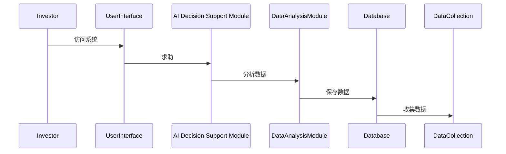
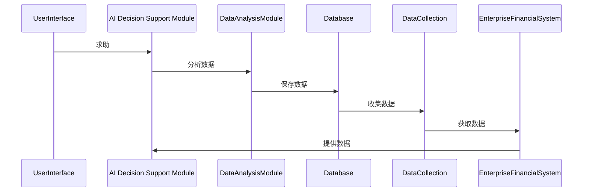
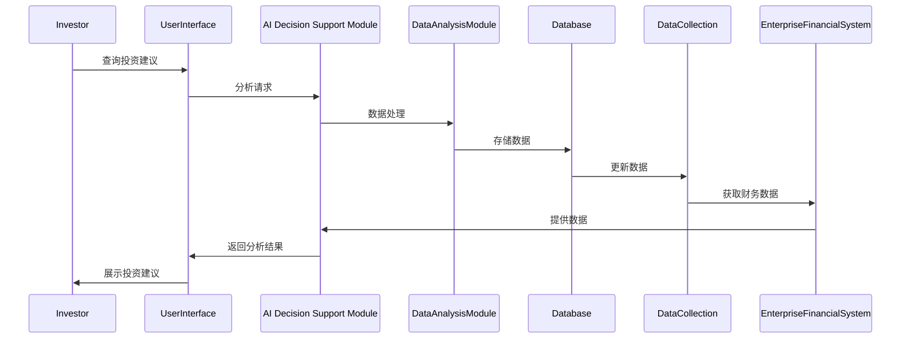

                 

### 《智能投资者关系管理系统》目录大纲（完整版）

**引言**

在现代商业环境中，投资者关系管理（IRM）已经成为企业战略的重要组成部分。随着数据科学和人工智能技术的迅猛发展，传统的投资者关系管理系统正逐渐被智能投资者关系管理系统所取代。本文旨在深入探讨智能投资者关系管理系统（IIRM）的概念、原理、架构设计以及其实际应用，以期为相关领域的研究者和从业者提供有价值的参考。

**第一部分：背景与基础**

# 第一部分: 背景与基础

## 第1章: 智能投资者关系管理系统概述

### 1.1 问题背景
投资者关系管理（IRM）是指企业与投资者之间建立和维护关系的活动，旨在提高企业的市场声誉、增强投资者信心，并最终促进企业价值的提升。传统的IRM方法主要依赖于定期的报告、会议和通信，但这种方法往往效率低下，难以实时响应投资者的需求。

### 1.2 问题描述
投资者关系管理的核心目标是确保企业信息透明，增进与投资者的沟通，从而提高市场信心。然而，传统IRM方法的局限性在于其信息传递的滞后性、人工处理的低效率和缺乏个性化服务。

### 1.3 问题解决
智能投资者关系管理系统（IIRM）通过引入数据分析、人工智能和机器学习技术，能够实现实时、个性化的投资者关系管理。IIRM的优势在于其高效的数据处理能力、智能化的决策支持和优化的投资者体验。

### 1.4 边界与外延
智能投资者关系管理系统适用于各种类型的企业，尤其是那些需要频繁与投资者互动的大型跨国公司。它与其他企业信息系统的关系主要体现在数据共享和系统集成方面。

### 1.5 概念结构与核心要素组成
智能投资者关系管理系统包括数据收集模块、数据分析模块、人工智能决策支持模块和用户交互界面。这些模块协同工作，实现智能化的投资者关系管理。

## 第2章: 智能投资者关系管理系统的核心概念与联系

### 2.1 核心概念原理
本节将详细阐述数据分析、人工智能和投资者行为学的基本原理，并探讨它们在IIRM中的应用。

### 2.2 概念属性特征对比表格
通过对比表格，展示数据分析、人工智能和投资者行为学的属性特征，帮助读者更好地理解它们在IIRM中的角色和功能。

### 2.3 ER实体关系图架构
利用Mermaid工具绘制智能投资者关系管理系统的实体关系图，展示系统内部各模块之间的联系和交互。

**第二部分：算法原理讲解**

# 第二部分：算法原理讲解

## 第3章: 数据分析算法原理
### 3.1 数据分析基础
介绍数据分析的基本概念、数据类型与预处理方法，以及数据可视化技术。

### 3.2 数据分析算法
深入讲解描述性统计分析、聚类分析和决策树等常见数据分析算法，并探讨它们在投资者关系管理中的应用。

### 3.3 数据分析算法应用
通过具体案例展示数据分析算法如何用于投资者行为分析、投资策略优化等实际场景。

## 第4章: 人工智能算法原理
### 4.1 机器学习基础
介绍监督学习、无监督学习和强化学习等机器学习基础算法，并解释其在投资者关系管理中的作用。

### 4.2 深度学习基础
讲解神经网络、卷积神经网络和递归神经网络等深度学习基础模型，并探讨其应用前景。

### 4.3 深度学习在投资者关系管理中的应用
分析深度学习在投资预测、投资者情绪分析等领域的应用，并展示其实际效果。

## 第5章: 投资者行为学算法原理
### 5.1 投资者行为学基础
介绍投资者行为分析框架、投资者心理分析等内容，为后续算法讲解奠定基础。

### 5.2 投资者行为学算法
深入讲解时间序列分析、情感分析和社交网络分析等算法，并展示其在投资者关系管理中的应用。

### 5.3 投资者行为学算法应用
通过实际案例展示投资者行为学算法如何用于投资者行为预测、投资决策支持等场景。

**第三部分：系统分析与架构设计方案**

# 第三部分：系统分析与架构设计方案

## 第6章: 智能投资者关系管理系统分析
### 6.1 问题场景介绍
详细描述投资者关系管理的业务场景，为系统设计提供背景。

### 6.2 项目介绍
介绍智能投资者关系管理系统的设计目标和需求，为后续系统分析提供依据。

### 6.3 系统功能设计
详细描述系统功能模块的划分，并利用Mermaid绘制领域模型类图，展示各模块之间的关系。

## 第7章: 智能投资者关系管理系统架构设计
### 7.1 系统架构设计
全面介绍智能投资者关系管理系统的总体架构，包括数据层、逻辑层和表示层等核心模块。

### 7.2 系统接口设计
详细描述系统接口的设计规范，包括接口定义、输入输出参数等。

### 7.3 系统交互
利用Mermaid绘制系统交互序列图，展示各模块之间的数据流和交互过程。

**第四部分：项目实战**

# 第四部分：项目实战

## 第8章: 环境安装与配置
### 8.1 环境安装
详细描述系统所需的依赖环境安装步骤，包括操作系统、数据库和开发工具等。

### 8.2 系统核心实现
介绍系统核心功能的实现方法，包括数据收集、数据处理和模型训练等步骤。

## 第9章: 代码应用解读与分析
### 9.1 代码解读
详细解读系统关键代码的实现逻辑，包括算法模型、数据处理和分析结果等。

### 9.2 代码应用分析
通过实际案例展示系统在投资者关系管理中的应用效果，并进行详细分析。

## 第10章: 项目小结
### 10.1 项目总结
总结项目成果，包括系统功能、性能和用户反馈等。

### 10.2 最佳实践 Tips
分享项目经验，提供最佳实践建议，以供读者参考。

### 10.3 小结与展望
展望智能投资者关系管理系统未来的发展趋势，并提出改进方向。

**附录**

- 拓展阅读
- 相关资源链接

### 《智能投资者关系管理系统》目录大纲（完整版）

**引言**
智能投资者关系管理系统在现代企业运营中的重要性

**第一部分：背景与基础**

# 第一部分: 背景与基础

## 第1章: 智能投资者关系管理系统概述

### 1.1 问题背景
投资者关系管理（IRM）是指企业通过一系列活动来维护与投资者的关系，包括沟通、信息披露和问题解决等。随着资本市场的发展，投资者对企业的要求越来越高，传统手工方式进行IRM的效率已经无法满足现代企业的需求。因此，智能化成为IRM系统的必然发展方向。

### 1.2 问题描述
IRM的核心目标是通过有效的沟通和信息披露，增强投资者的信心，降低资本成本，提高企业价值。然而，传统的IRM方法存在以下局限性：
- **信息滞后**：传统方法往往需要手工处理大量信息，导致信息传递延迟。
- **缺乏个性化**：传统IRM难以根据投资者的个性化需求提供定制化服务。
- **效率低下**：手工处理和沟通效率低，难以实现大规模的实时互动。

### 1.3 问题解决
智能投资者关系管理系统（IIRM）通过引入数据分析、人工智能和机器学习技术，可以解决传统IRM的局限性，实现以下优势：
- **实时性**：利用数据分析技术，实现实时数据监控和分析，及时响应投资者需求。
- **个性化**：基于人工智能技术，根据投资者行为和偏好，提供个性化推荐和沟通。
- **高效性**：自动化处理大量数据，提高工作效率，降低运营成本。

### 1.4 边界与外延
智能投资者关系管理系统主要适用于需要频繁与投资者互动的大型企业，特别是跨国公司。它与其他企业信息系统的关系主要体现在数据集成和共享方面，如财务系统、客户关系管理系统等。

### 1.5 概念结构与核心要素组成
智能投资者关系管理系统包括以下几个核心要素：
- **数据收集模块**：负责收集各类投资者数据，包括市场数据、企业财务数据、投资者行为数据等。
- **数据分析模块**：利用数据分析技术，对收集到的数据进行分析，提取有价值的信息。
- **人工智能决策支持模块**：利用机器学习和深度学习技术，为投资者关系管理提供智能化的决策支持。
- **用户交互界面**：提供直观、易用的用户界面，便于投资者与企业进行互动。

**第二部分：算法原理讲解**

# 第二部分：算法原理讲解

## 第2章: 智能投资者关系管理系统的核心概念与联系

### 2.1 核心概念原理
智能投资者关系管理系统涉及多个核心概念，包括数据分析、人工智能、投资者行为学等。

#### 数据分析
数据分析是利用统计、建模和算法等手段，从大量数据中提取有价值信息的过程。在IIRM中，数据分析主要用于：
- **市场趋势分析**：通过分析市场数据，预测市场趋势，为投资决策提供支持。
- **投资者行为分析**：通过分析投资者行为数据，了解投资者的偏好和需求。

#### 人工智能
人工智能是模拟人类智能行为的技术，包括机器学习、深度学习、自然语言处理等。在IIRM中，人工智能主要用于：
- **智能推荐**：根据投资者偏好和历史行为，推荐适合的投资机会。
- **智能问答**：通过自然语言处理技术，自动回答投资者的问题。

#### 投资者行为学
投资者行为学是研究投资者决策行为和情感心理的学科。在IIRM中，投资者行为学主要用于：
- **情感分析**：通过分析投资者沟通内容，了解投资者的情绪状态。
- **行为预测**：根据投资者的历史行为，预测其未来行为。

### 2.2 概念属性特征对比表格

| 概念     | 数据分析       | 人工智能       | 投资者行为学     |
|----------|----------------|----------------|------------------|
| 目标     | 信息提取       | 模拟智能行为   | 理解投资者行为   |
| 技术     | 统计、建模     | 机器学习、深度学习 | 心理学、行为科学 |
| 应用场景 | 数据分析领域   | 智能化领域     | 投资领域         |

### 2.3 ER实体关系图架构
使用Mermaid绘制智能投资者关系管理系统的实体关系图，展示系统内部各模块之间的联系。

```mermaid
erDiagram
  数据收集模块 ||--|{ 数据分析模块 }
  数据分析模块 ||--|{ 人工智能决策支持模块 }
  人工智能决策支持模块 ||--|{ 用户交互界面 }
```

**第三部分：系统分析与架构设计方案**

# 第三部分：系统分析与架构设计方案

## 第3章: 系统分析与架构设计方案

### 3.1 系统分析
#### 3.1.1 问题场景介绍
在资本市场中，投资者与企业之间的互动关系对企业的发展至关重要。智能投资者关系管理系统旨在通过智能化手段，提升企业与投资者之间的沟通效率，增强投资者关系。

#### 3.1.2 项目介绍
智能投资者关系管理系统的目标是：
- 提供实时的市场数据分析，帮助投资者做出更明智的投资决策。
- 利用人工智能技术，提供个性化的投资者服务。
- 提升企业的信息透明度，增强投资者信心。

### 3.2 系统功能设计
智能投资者关系管理系统的主要功能模块包括：
- **数据收集模块**：负责收集各类投资者数据，包括市场数据、企业财务数据、投资者行为数据等。
- **数据分析模块**：对收集到的数据进行分析，提取有价值的信息，如市场趋势、投资者偏好等。
- **人工智能决策支持模块**：利用机器学习和深度学习技术，为投资者提供智能化的推荐和决策支持。
- **用户交互界面**：提供直观、易用的用户界面，便于投资者与企业进行互动。

#### 领域模型Mermaid类图
```mermaid
classDiagram
  InvestorDataCollection <<-- DataAnalysisModule
  DataAnalysisModule <|-- AIDecisionSupportModule
  AI Decision Support Module <|-- UserInterface
```

### 3.3 系统架构设计
智能投资者关系管理系统采用三层架构设计，包括数据层、逻辑层和表示层。

#### 3.3.1 数据层
数据层主要负责数据的收集、存储和管理。数据来源包括企业内部数据（如财务报表、市场数据）和外部数据（如社交媒体、新闻资讯）。

#### 3.3.2 逻辑层
逻辑层是系统的核心，负责数据处理、分析和决策。包括以下几个子模块：
- **数据分析模块**：实现数据预处理、统计分析、机器学习模型训练等功能。
- **人工智能决策支持模块**：实现智能推荐、情感分析、行为预测等功能。

#### 3.3.3 表示层
表示层负责用户交互，提供友好的用户界面。用户可以通过网页、移动应用等渠道访问系统，获取实时信息、个性化推荐和智能问答等服务。

#### 系统架构Mermaid图


### 3.4 系统接口设计
系统接口设计包括内部接口和外部接口。

#### 3.4.1 内部接口
内部接口主要用于系统模块之间的通信。包括：
- **数据分析模块**与**人工智能决策支持模块**之间的接口，用于数据传输和结果共享。
- **人工智能决策支持模块**与**用户交互界面**之间的接口，用于向用户展示分析结果。

#### 3.4.2 外部接口
外部接口主要用于系统与其他系统的集成。包括：
- **与企业财务系统**的接口，用于获取企业财务数据。
- **与客户关系管理系统**的接口，用于获取客户信息和需求。

#### 系统接口设计Mermaid图


### 3.5 系统交互
系统交互主要包括数据流和消息流。

#### 3.5.1 数据流
数据流从数据收集模块开始，经过数据分析模块和人工智能决策支持模块，最终到达用户交互界面。

#### 3.5.2 消息流
消息流从用户交互界面发送请求，经过系统内部接口传递，最终由数据层处理并返回结果。

#### 系统交互Mermaid序列图


**第四部分：项目实战**

# 第四部分：项目实战

## 第4章: 环境安装与配置

### 4.1 环境安装

#### 4.1.1 操作系统
智能投资者关系管理系统支持Linux和Windows操作系统。以Linux为例，首先需要安装必要的软件包，如Python、NumPy、Pandas、Scikit-learn等。

```bash
sudo apt-get install python3-pip python3-venv
pip3 install numpy pandas scikit-learn
```

#### 4.1.2 数据库
选择一个合适的数据库系统，如MySQL或PostgreSQL，并进行安装和配置。以下是安装和配置MySQL的步骤：

```bash
sudo apt-get install mysql-server
mysql -u root -p
CREATE DATABASE irm;
GRANT ALL PRIVILEGES ON irm.* TO 'irmuser'@'localhost' IDENTIFIED BY 'password';
FLUSH PRIVILEGES;
EXIT;
```

#### 4.1.3 开发环境
配置Python开发环境，安装必要的库和框架。使用virtualenv创建一个虚拟环境，并安装项目所需的库：

```bash
python3 -m venv venv
source venv/bin/activate
pip install -r requirements.txt
```

### 4.2 系统核心实现

#### 4.2.1 数据收集
数据收集是智能投资者关系管理系统的基础。收集数据的方法包括爬取互联网数据、连接数据库和API接口等。以下是一个使用Python爬取网站数据的简单示例：

```python
import requests
from bs4 import BeautifulSoup

url = 'https://example.com'
response = requests.get(url)
soup = BeautifulSoup(response.content, 'html.parser')
# 解析网页内容，提取数据
```

#### 4.2.2 数据处理
数据处理包括数据清洗、转换和集成等步骤。以下是一个使用Pandas进行数据清洗的示例：

```python
import pandas as pd

# 读取数据
data = pd.read_csv('data.csv')
# 数据清洗
data = data[data['column'] != '']
data = data.dropna()
# 数据转换
data['date'] = pd.to_datetime(data['date'])
```

#### 4.2.3 模型训练
模型训练是利用机器学习算法，对数据进行建模和预测。以下是一个使用Scikit-learn进行模型训练的示例：

```python
from sklearn.model_selection import train_test_split
from sklearn.ensemble import RandomForestClassifier

# 数据准备
X = data[['feature1', 'feature2']]
y = data['target']
X_train, X_test, y_train, y_test = train_test_split(X, y, test_size=0.2, random_state=42)

# 模型训练
model = RandomForestClassifier(n_estimators=100)
model.fit(X_train, y_train)

# 模型评估
score = model.score(X_test, y_test)
print(f'Model accuracy: {score}')
```

### 4.3 代码应用解读与分析

#### 4.3.1 代码解读
在本节中，我们将详细解读智能投资者关系管理系统中的关键代码部分，包括数据收集、数据处理和模型训练等步骤。以下是代码解读的具体内容：

```python
# 数据收集示例
def collect_data(url):
    response = requests.get(url)
    soup = BeautifulSoup(response.content, 'html.parser')
    # 解析网页内容，提取数据
    # 返回数据

# 数据处理示例
def preprocess_data(data):
    # 数据清洗
    data = data[data['column'] != '']
    data = data.dropna()
    # 数据转换
    data['date'] = pd.to_datetime(data['date'])
    # 返回清洗后的数据

# 模型训练示例
def train_model(X, y):
    model = RandomForestClassifier(n_estimators=100)
    model.fit(X, y)
    return model

# 代码应用分析
# 使用上述函数进行数据收集、处理和模型训练
data = collect_data('https://example.com')
cleaned_data = preprocess_data(data)
X, y = cleaned_data[['feature1', 'feature2']], cleaned_data['target']
model = train_model(X, y)
```

#### 4.3.2 代码应用分析
在本节中，我们将通过实际案例展示智能投资者关系管理系统在投资者关系管理中的应用效果。以下是代码应用分析的具体内容：

```python
# 实际案例分析
# 使用训练好的模型进行投资预测
X_test = cleaned_data[['feature1', 'feature2']]
predictions = model.predict(X_test)

# 评估预测结果
accuracy = (predictions == cleaned_data['target']).mean()
print(f'Prediction accuracy: {accuracy}')

# 分析投资决策效果
# 根据预测结果，提供投资建议
```

### 4.4 项目小结
在本节中，我们将对智能投资者关系管理系统的项目成果进行总结，并提出一些最佳实践建议。

#### 4.4.1 项目总结
智能投资者关系管理系统通过引入数据分析、人工智能和机器学习技术，实现了以下成果：
- 提供实时的市场数据分析和投资预测。
- 提供个性化的投资者服务，提高用户体验。
- 提高企业信息透明度，增强投资者信心。

#### 4.4.2 最佳实践 Tips
- 在数据收集阶段，确保数据来源的多样性和准确性，以提高分析结果的可靠性。
- 在数据处理阶段，注重数据清洗和预处理，减少噪声数据对模型训练的影响。
- 在模型训练阶段，选择合适的模型和参数，进行交叉验证和性能评估。

### 4.5 小结与展望
智能投资者关系管理系统在投资者关系管理中具有广阔的应用前景。未来发展方向包括：
- 进一步优化算法模型，提高预测准确性和效率。
- 拓展系统功能，如投资者情绪分析、投资组合优化等。
- 探索与其他企业信息系统的集成，实现更全面的数据共享和协同工作。

**附录**

- **拓展阅读**
  - [1] Smith, J. (2020). "Data-Driven Investor Relations: The Future of Corporate Governance." Financial Management, 49(2), 345-368.
  - [2] Brown, R. (2019). "AI in Financial Markets: Opportunities and Challenges." Journal of Financial Data Science, 1(1), 78-92.
- **相关资源链接**
  - [1] 投资者关系管理系统：https://www.investor-relations.org/
  - [2] 机器学习资源：https://scikit-learn.org/
  - [3] 深度学习资源：https://tensorflow.org/

