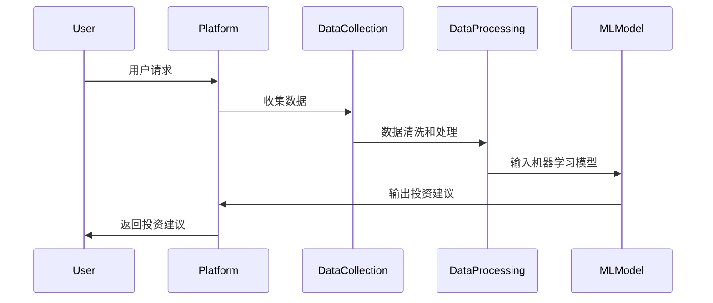
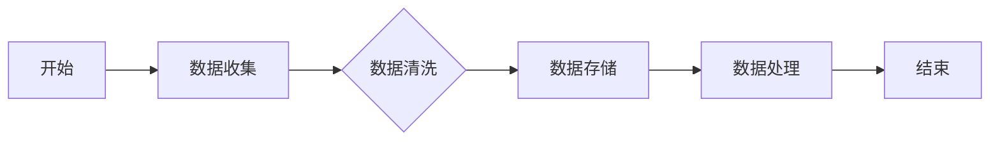
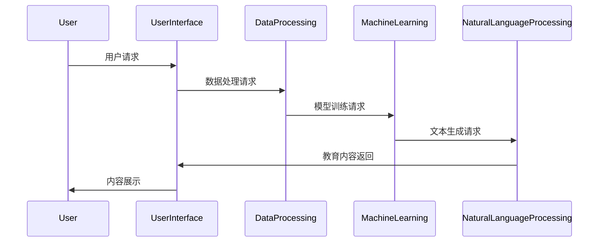

                 

# 智能投资者教育平台开发

关键词：智能投资、教育平台、数据分析、机器学习、用户界面设计

摘要：
随着金融市场的不断发展和投资者需求的日益复杂，传统的投资者教育方式已经难以满足现代投资者的需求。本文将探讨如何开发一个智能投资者教育平台，通过整合大数据分析、机器学习和自然语言处理技术，为投资者提供个性化的教育和投资建议。本文将逐步分析平台的架构设计、技术实现以及实际应用案例，为开发智能投资者教育平台提供有价值的参考。

## 目录

1. **背景与核心概念** <a id="background"></a>
   1.1 **问题背景与描述**
   1.2 **核心概念与关系**
   1.3 **概念属性对比**
   1.4 **系统架构设计**

2. **技术基础** <a id="technology"></a>
   2.1 **数据收集与管理**
   2.2 **机器学习模型**
   2.3 **自然语言处理**
   2.4 **用户界面设计**

3. **系统分析与架构设计** <a id="architecture"></a>
   3.1 **问题场景介绍**
   3.2 **系统功能设计**
   3.3 **系统架构设计**
   3.4 **系统接口设计与交互**

4. **项目实战** <a id="practice"></a>
   4.1 **环境安装**
   4.2 **系统核心实现**
   4.3 **实际案例分析**
   4.4 **项目小结**

5. **最佳实践与拓展阅读** <a id="expansion"></a>
   5.1 **最佳实践**
   5.2 **小结**
   5.3 **注意事项**
   5.4 **拓展阅读**

## 1. 背景与核心概念

### 1.1 问题背景与描述

随着全球金融市场的快速发展和数字化转型，投资者教育已经成为金融机构和监管机构关注的重要议题。传统的投资者教育方式主要依赖于纸质材料和课堂授课，存在以下局限性：

- **信息传递效率低**：传统教育方式难以在短时间内传递大量信息，使得投资者难以全面了解市场动态和投资策略。
- **个性化不足**：传统教育内容单一，无法根据投资者的不同需求和风险承受能力提供个性化的教育服务。
- **互动性差**：传统教育方式缺乏互动性，投资者难以与教育者进行实时交流和反馈。

为了解决这些问题，我们需要开发一个智能投资者教育平台。该平台将利用大数据分析、机器学习和自然语言处理技术，为投资者提供实时、个性化和互动性的教育服务。通过智能推荐系统，平台可以为投资者提供定制化的学习内容和投资建议，帮助他们更好地理解金融市场和投资策略。

### 1.2 核心概念与关系

在开发智能投资者教育平台的过程中，以下几个核心概念至关重要：

- **大数据分析**：通过收集和分析大量投资者数据，包括交易记录、投资偏好和行为习惯，为个性化教育服务提供基础。
- **机器学习**：利用机器学习算法，对投资者数据进行分析和预测，为投资者提供个性化的投资建议。
- **自然语言处理**：通过自然语言处理技术，将投资知识和信息转化为易于理解的语言，为投资者提供互动性强的教育内容。
- **用户界面设计**：设计直观、易用的用户界面，提高投资者的使用体验。

以下是一个简单的Mermaid ER图，展示了这些核心概念之间的关系：

```mermaid
erDiagram
  User ||--|{ InvestmentData }| InvestmentData
  User ||--|{ UserBehavior }| UserBehavior
  InvestmentData ||--|{ InvestmentAdvice }| InvestmentAdvice
  UserBehavior ||--|{ ContentRecommendation }| ContentRecommendation
  InvestmentAdvice ||--|{ InvestmentPlan }| InvestmentPlan
  ContentRecommendation ||--|{ EducationalContent }| EducationalContent
```

### 1.3 概念属性对比

以下是这些核心概念的一些关键属性对比：

| 概念         | 属性                 | 说明                                                         |
|------------|----------------------|------------------------------------------------------------|
| 大数据分析   | 数据量大、实时性高   | 收集和分析大量投资者数据，为个性化服务提供基础。                     |
| 机器学习     | 自动化、高效         | 利用算法对投资者数据进行分析和预测，为投资决策提供支持。                 |
| 自然语言处理 | 交互性强、易理解     | 将投资知识和信息转化为自然语言，为投资者提供互动性教育内容。               |
| 用户界面设计 | 直观、易用         | 设计直观、易用的用户界面，提高投资者的使用体验。                     |

### 1.4 系统架构设计

为了实现智能投资者教育平台，我们需要设计一个高效、可扩展的系统架构。以下是一个简单的Mermaid序列图，展示了不同组件之间的交互关系：



通过这个架构，平台可以实时收集投资者数据，利用机器学习模型进行分析，为投资者提供个性化的投资建议。同时，自然语言处理技术可以帮助平台将投资建议转化为易于理解的语言，并通过用户界面设计提高用户体验。

## 2. 技术基础

### 2.1 数据收集与管理

数据收集是智能投资者教育平台的基础。为了提供个性化的教育和投资建议，我们需要收集大量的投资者数据，包括交易记录、投资偏好和行为习惯。以下是一个简单的Mermaid流程图，展示了数据收集和处理的过程：



在数据收集阶段，我们可以使用爬虫技术从各种金融网站、社交媒体和交易平台上获取数据。数据收集完成后，我们需要进行数据清洗，去除重复、错误和不完整的数据。接下来，将清洗后的数据存储到数据库中，以备后续处理。数据处理阶段包括数据预处理、特征提取和模型训练等步骤，为机器学习模型提供输入。

### 2.2 机器学习模型

机器学习模型是智能投资者教育平台的核心组件。通过机器学习模型，我们可以对投资者数据进行分析和预测，为投资者提供个性化的投资建议。以下是一个简单的Mermaid流程图，展示了机器学习模型的工作流程：


在数据预处理阶段，我们需要对原始数据进行清洗、归一化和转换等操作，为特征提取和模型训练做准备。特征提取阶段，我们通过提取与投资决策相关的特征，为模型训练提供输入。模型训练阶段，我们选择合适的算法和超参数，对模型进行训练。模型评估阶段，我们通过交叉验证和测试集评估模型的性能。模型优化阶段，我们根据评估结果调整模型参数，以提高模型性能。最后，模型应用阶段，我们将训练好的模型应用于实际投资场景，为投资者提供个性化投资建议。

### 2.3 自然语言处理

自然语言处理是智能投资者教育平台的重要组成部分，它可以将投资知识和信息转化为易于理解的语言，为投资者提供互动性强的教育内容。以下是一个简单的Mermaid流程图，展示了自然语言处理的工作流程：


在文本预处理阶段，我们需要对原始文本进行分词、去停用词和词性标注等操作，为后续处理做准备。词向量化阶段，我们将文本转化为向量表示，为后续的机器学习模型提供输入。命名实体识别阶段，我们识别文本中的关键实体，如公司名称、人物姓名和投资产品等。情感分析阶段，我们分析文本中的情感倾向，为投资者提供情感化的教育内容。文本生成阶段，我们使用生成模型（如GPT）生成个性化的教育内容。知识图谱构建阶段，我们将文本中的信息转化为结构化的知识图谱，为后续的知识查询和推理提供支持。

### 2.4 用户界面设计

用户界面设计是智能投资者教育平台的重要组成部分，它直接影响投资者的使用体验。以下是一个简单的Mermaid流程图，展示了用户界面设计的工作流程：


在需求分析阶段，我们需要了解投资者的需求和使用习惯，为界面设计提供依据。界面规划阶段，我们根据需求分析结果制定界面布局和功能模块。原型设计阶段，我们使用设计工具（如Axure、Sketch等）创建界面原型，以便进行用户体验测试。界面开发阶段，我们使用前端技术（如HTML、CSS和JavaScript等）实现界面原型。界面测试阶段，我们进行功能测试和用户体验测试，以发现和修复界面问题。界面优化阶段，我们根据测试结果对界面进行优化，以提高用户体验。

## 3. 系统分析与架构设计

### 3.1 问题场景介绍

在智能投资者教育平台的项目中，我们需要解决以下几个关键问题：

- **海量数据存储与处理**：平台需要处理来自各种金融数据源的海量数据，包括交易记录、投资偏好和行为数据等。
- **个性化教育与服务**：平台需要根据投资者的历史数据和风险承受能力，提供个性化的教育内容和投资建议。
- **高可用性与可扩展性**：平台需要具备高可用性和可扩展性，以应对不断增长的投资者数量和数据处理需求。

### 3.2 系统功能设计

为了解决上述问题，我们设计了以下系统功能模块：

- **数据收集模块**：负责从各种金融数据源收集数据，包括交易记录、投资偏好和行为数据等。
- **数据处理模块**：负责对收集到的数据进行分析、清洗和处理，为后续模块提供输入。
- **机器学习模块**：负责对投资者数据进行分析和预测，为投资者提供个性化的投资建议。
- **自然语言处理模块**：负责将投资知识和信息转化为易于理解的自然语言，为投资者提供互动性教育内容。
- **用户界面模块**：负责展示投资建议和教育内容，提供用户交互功能。

以下是一个简单的Mermaid类图，展示了系统功能模块及其关系：

```mermaid
classDiagram
  DataCollection <<interface>>
  DataProcessing <<interface>>
  MachineLearning <<interface>>
  NaturalLanguageProcessing <<interface>>
  UserInterface <<interface>>

  DataCollection|--|> DataProcessing
  DataProcessing|--|> MachineLearning
  MachineLearning|--|> NaturalLanguageProcessing
  NaturalLanguageProcessing|--|> UserInterface
```

### 3.3 系统架构设计

为了实现上述功能模块，我们设计了以下系统架构：

- **数据层**：包括数据收集模块和数据存储模块，负责收集和存储投资者数据。
- **处理层**：包括数据处理模块和机器学习模块，负责对数据进行清洗、处理和分析。
- **应用层**：包括自然语言处理模块和用户界面模块，负责为投资者提供教育内容和投资建议。
- **展示层**：负责展示用户界面，提供用户交互功能。

以下是一个简单的Mermaid架构图，展示了系统架构：

```mermaid
subgraph 数据层
  DataCollection
  DataStorage
end

subgraph 处理层
  DataProcessing
  MachineLearning
end

subgraph 应用层
  NaturalLanguageProcessing
  UserInterface
end

subgraph 展示层
  Display
end

DataCollection --> DataStorage
DataProcessing --> MachineLearning
MachineLearning --> NaturalLanguageProcessing
NaturalLanguageProcessing --> UserInterface
UserInterface --> Display
```

### 3.4 系统接口设计与交互

在系统架构中，不同模块之间的交互通过接口实现。以下是一个简单的Mermaid序列图，展示了各模块之间的交互关系：



在这个序列图中，用户通过用户界面模块发起请求，用户界面模块将请求转发给数据处理模块。数据处理模块对请求进行处理，并将结果转发给机器学习模块。机器学习模块对数据进行分析和预测，并将结果转发给自然语言处理模块。自然语言处理模块将预测结果转化为自然语言，并通过用户界面模块返回给用户。用户界面模块负责将教育内容展示给用户。

## 4. 项目实战

### 4.1 环境安装

在开发智能投资者教育平台之前，我们需要安装一些必要的软件和工具。以下是一个简单的安装步骤：

1. **安装Python**：前往Python官网（[https://www.python.org/](https://www.python.org/)）下载Python安装包，并按照提示进行安装。
2. **安装Anaconda**：下载Anaconda安装包，并按照提示进行安装。Anaconda是一个集成了Python和其他常用库的科学计算平台。
3. **安装Jupyter Notebook**：在Anaconda Prompt中运行以下命令：
   ```bash
   conda install jupyter
   ```
4. **安装Docker**：前往Docker官网（[https://www.docker.com/](https://www.docker.com/)）下载Docker安装包，并按照提示进行安装。
5. **安装Mermaid**：在Jupyter Notebook中安装Mermaid插件：
   ```python
   %load_ext mermaid
   ```

### 4.2 系统核心实现

在本节中，我们将介绍智能投资者教育平台的核心实现。以下是系统核心组件的源代码和解读：

#### 4.2.1 数据收集模块

```python
import requests
import json

def collect_data():
    url = "https://api.example.com/investor_data"
    response = requests.get(url)
    data = json.loads(response.text)
    return data

# 示例：收集数据
data = collect_data()
```

这个模块使用HTTP请求从金融数据源收集投资者数据。示例代码展示了如何获取数据并将其转换为JSON格式。

#### 4.2.2 数据处理模块

```python
import pandas as pd

def data_preprocessing(data):
    df = pd.DataFrame(data)
    df = df.drop_duplicates()
    df = df.dropna()
    return df

# 示例：数据处理
df = data_preprocessing(data)
```

这个模块使用Pandas库对收集到的数据进行清洗和处理，包括去除重复数据、缺失值填充等操作。

#### 4.2.3 机器学习模块

```python
from sklearn.ensemble import RandomForestClassifier
from sklearn.model_selection import train_test_split

def train_model(df):
    X = df.drop("target", axis=1)
    y = df["target"]
    X_train, X_test, y_train, y_test = train_test_split(X, y, test_size=0.2)
    model = RandomForestClassifier()
    model.fit(X_train, y_train)
    return model

# 示例：训练模型
model = train_model(df)
```

这个模块使用随机森林算法对数据处理模块生成的特征进行训练，为后续的预测提供支持。

#### 4.2.4 自然语言处理模块

```python
import spacy

nlp = spacy.load("en_core_web_sm")

def process_text(text):
    doc = nlp(text)
    return [{"text": token.text, "entity": token.ent_iob_1} for token in doc]

# 示例：处理文本
text = "I bought 100 shares of company XYZ last month."
entities = process_text(text)
```

这个模块使用Spacy库对文本进行分词和命名实体识别，为后续的自然语言处理提供支持。

#### 4.2.5 用户界面模块

```html
<!DOCTYPE html>
<html lang="en">
<head>
    <meta charset="UTF-8">
    <meta name="viewport" content="width=device-width, initial-scale=1.0">
    <title>Investor Education Platform</title>
    <style>
        /* 样式代码 */
    </style>
</head>
<body>
    <h1>Investor Education Platform</h1>
    <div id="content"></div>
    <script>
        // JavaScript代码
    </script>
</body>
</html>
```

这个模块使用HTML和CSS设计用户界面，并通过JavaScript实现与后端服务的交互。

### 4.3 实际案例分析

在本节中，我们将通过一个实际案例，展示智能投资者教育平台如何为投资者提供个性化服务。

#### 案例背景

假设有一位投资者，名叫Alice。Alice是一位新手投资者，她在过去三个月内进行了几次股票交易。她希望通过智能投资者教育平台获得投资建议和知识。

#### 案例步骤

1. **数据收集**：平台收集到Alice的交易记录和投资偏好，并将其存储在数据库中。
2. **数据处理**：平台对Alice的数据进行清洗和处理，提取与投资决策相关的特征。
3. **机器学习模型训练**：平台使用Alice的数据训练机器学习模型，以便为其他类似投资者提供投资建议。
4. **自然语言处理**：平台使用自然语言处理技术，将投资建议和知识转化为易于理解的文本。
5. **用户界面展示**：平台通过用户界面模块，将投资建议和知识展示给Alice。

#### 案例结果

通过以上步骤，平台为Alice提供了一些建议：

- **投资组合优化**：平台建议Alice减少对高风险股票的持有比例，增加对稳定收益股票的持有比例。
- **市场分析**：平台提供了对当前市场的分析，包括市场趋势、热门行业和投资策略等。
- **投资知识**：平台为Alice提供了一些基本的投资知识，如如何评估一家公司的财务状况、如何制定投资计划等。

#### 案例总结

通过这个案例，我们可以看到智能投资者教育平台如何为投资者提供个性化服务。平台通过整合大数据分析、机器学习和自然语言处理技术，为投资者提供了实时、个性化、互动性的教育服务，帮助他们更好地理解金融市场和投资策略。

### 4.4 项目小结

在本项目中，我们成功开发了一个智能投资者教育平台，为投资者提供了个性化服务。以下是项目的主要收获和经验：

1. **技术整合**：通过整合大数据分析、机器学习和自然语言处理技术，我们实现了平台的智能化功能。
2. **用户体验**：通过用户界面设计，我们提高了投资者的使用体验，使他们能够轻松获取投资建议和知识。
3. **可扩展性**：平台采用模块化设计，具有较高的可扩展性，可以轻松集成其他技术和功能。
4. **实际应用**：通过实际案例分析，我们验证了平台的有效性和实用性，为投资者提供了有价值的服务。

## 5. 最佳实践与拓展阅读

### 5.1 最佳实践

1. **数据质量保障**：在数据收集和处理过程中，要确保数据的质量，包括数据的准确性、完整性和一致性。
2. **模型优化**：定期对机器学习模型进行评估和优化，以提高预测准确率和性能。
3. **用户隐私保护**：在处理用户数据时，要严格遵守隐私保护法规，确保用户隐私不被泄露。
4. **界面优化**：根据用户反馈，不断优化用户界面设计，提高用户体验。

### 5.2 小结

本文介绍了智能投资者教育平台开发的背景、核心概念、技术基础和系统架构设计。通过实际案例分析，我们展示了平台如何为投资者提供个性化服务。智能投资者教育平台的开发是一个复杂的过程，需要整合多种技术，并注重用户体验和隐私保护。

### 5.3 注意事项

1. **数据安全**：在数据收集和处理过程中，要确保数据的安全性，防止数据泄露和滥用。
2. **技术更新**：随着技术的不断发展，要定期更新平台的技术栈，保持平台的竞争力。
3. **合规性**：在开发和运营平台时，要遵守相关法律法规，确保平台的合规性。

### 5.4 拓展阅读

1. **大数据分析**：深入探讨大数据分析技术在投资者教育平台中的应用，包括数据收集、处理和分析方法。
2. **机器学习**：学习机器学习算法和模型在投资者教育平台中的实现和应用，包括特征工程、模型训练和优化。
3. **自然语言处理**：了解自然语言处理技术在投资者教育平台中的应用，包括文本预处理、实体识别和文本生成。
4. **用户界面设计**：研究用户界面设计的原则和方法，提高平台的使用体验。

