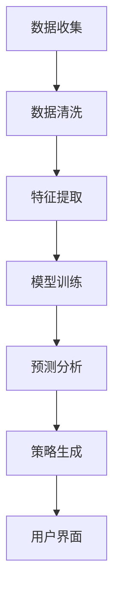
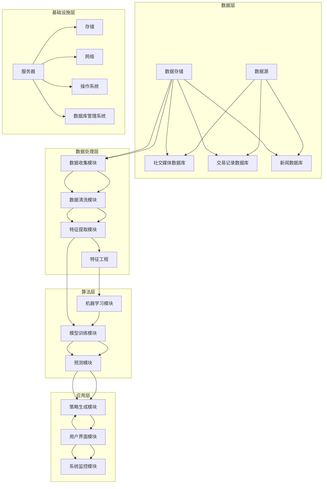
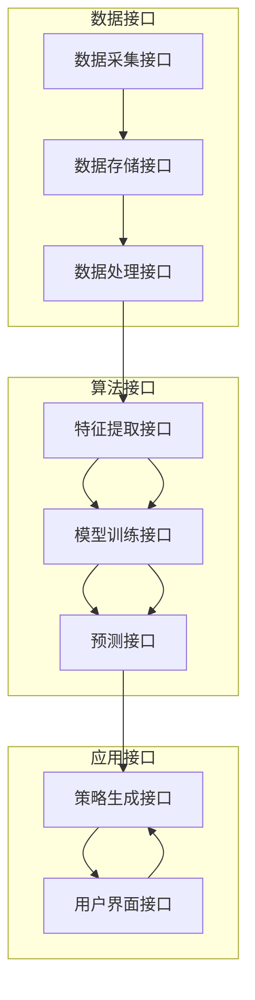

                 

### 文章标题与关键词

#### 《智能投资者画像分析平台》

#### 关键词：智能投资者画像、数据分析、机器学习、算法实现、系统架构设计

#### 摘要：本文将深入探讨智能投资者画像分析平台的设计与实现。我们将从问题背景出发，逐步分析智能投资者画像的核心概念和联系，详细讲解算法原理和数学模型，并介绍系统架构设计与项目实战。通过实际案例分析，本文将展示智能投资者画像分析平台的强大功能与应用价值。

### 第一部分：平台概述

在金融领域，投资者画像分析是提高投资决策准确性和效率的重要手段。随着大数据和人工智能技术的发展，构建一个智能投资者画像分析平台成为了行业的热点话题。本部分将首先介绍问题背景与目标，然后探讨平台的核心概念与联系，为后续技术实现奠定基础。

#### 第1章：问题背景与目标

##### 1.1.1 问题背景

在传统金融行业中，投资者分析主要依赖于人工调查和历史数据整理。然而，这种方法存在几个明显的不足：

- 数据处理效率低下：大规模数据处理需要大量的人力和时间，难以满足快速决策的需求。
- 精准度不高：人工分析难以完全捕捉到投资者的行为特征和心理变化，导致投资决策的准确性受到影响。
- 信息更新不及时：传统方法难以实时反映市场动态，投资策略容易滞后。

随着大数据和人工智能技术的普及，智能投资者画像分析逐渐成为可能。通过数据挖掘和机器学习算法，可以高效地处理海量数据，捕捉投资者的行为特征和偏好，为投资决策提供更加精准的支持。

##### 1.1.2 问题描述

智能投资者画像分析平台的目标是通过对投资者行为、历史交易数据、市场信息等多维数据的综合分析，构建投资者的个性化画像。具体问题包括：

- 如何有效收集和整理多维数据？
- 如何从数据中提取出投资者的行为特征和偏好？
- 如何利用这些特征构建智能投资策略？
- 如何确保平台的高效性和可靠性？

##### 1.1.3 解决方案目标

智能投资者画像分析平台的解决方案目标如下：

- **数据收集与整合**：构建一个高效的数据收集系统，整合来自不同渠道的数据源，包括社交媒体、交易记录、市场动态等。
- **特征提取与建模**：利用机器学习和数据挖掘技术，从数据中提取出投资者的行为特征和偏好，构建智能模型。
- **智能投资策略**：基于构建的模型，开发智能投资策略，提高投资决策的准确性和效率。
- **平台可靠性**：确保平台的高效运行和数据的实时更新，为用户提供可靠的投资建议。

通过上述解决方案，智能投资者画像分析平台将能够为金融从业者提供强大的数据支持和决策依据，提升投资效率和准确性。

#### 第2章：核心概念与联系

在智能投资者画像分析平台的设计中，理解核心概念和它们之间的联系是至关重要的。本节将介绍平台中的关键概念，并详细说明这些概念之间的关系。

##### 2.2.1 核心概念

智能投资者画像分析平台涉及以下核心概念：

- **数据源**：数据源是平台的基础，包括交易记录、社交媒体数据、市场动态等。这些数据是构建投资者画像的基石。
- **数据清洗**：数据源通常存在噪声和缺失值，数据清洗是数据预处理的重要步骤，旨在提高数据质量。
- **特征工程**：特征工程是将原始数据转化为有意义且有助于建模的特征。这通常涉及数据的特征选择和特征构造。
- **机器学习模型**：机器学习模型是平台的核心，用于从数据中学习并提取投资者的行为特征和偏好。
- **投资策略**：基于机器学习模型的结果，平台将生成个性化的投资策略，以指导实际投资决策。
- **用户界面**：用户界面是平台与用户交互的界面，通过直观的图形和报告，展示投资者的画像和投资建议。

##### 2.2.2 概念属性特征对比表格

为了更清晰地展示核心概念之间的关系，我们可以创建一个对比表格：

| 概念       | 属性特征                                      | 关系               |
|------------|-----------------------------------------------|--------------------|
| 数据源     | 数据种类、来源、频率、完整性                   | 提供基础数据       |
| 数据清洗   | 清洗方法、缺失值处理、噪声过滤                 | 提高数据质量       |
| 特征工程   | 特征选择、特征构造、特征重要性评估             | 转换数据为特征     |
| 机器学习模型 | 模型类型、训练方法、预测准确性                 | 从数据中提取特征   |
| 投资策略   | 投资类型、风险偏好、收益率预期                 | 应用模型结果       |
| 用户界面   | 界面设计、交互体验、报告生成                   | 展示模型和策略结果 |

##### 2.2.3 ER实体关系图架构

为了更直观地表示实体关系，我们可以使用Mermaid绘制ER实体关系图：

```mermaid
erDiagram
  数据源 ||--|{ 数据清洗 }
  数据清洗 ||--|{ 特征工程 }
  特征工程 ||--|{ 机器学习模型 }
  机器学习模型 ||--|{ 投资策略 }
  投资策略 ||--|{ 用户界面 }
```

通过这个ER实体关系图，我们可以清晰地看到各个概念之间的关联，从而更好地理解智能投资者画像分析平台的工作流程。

### 总结

在本部分中，我们首先介绍了智能投资者画像分析平台的问题背景与目标，明确了平台构建的必要性和目标。接着，我们详细探讨了平台的核心概念，包括数据源、数据清洗、特征工程、机器学习模型、投资策略和用户界面，并通过属性特征对比表格和ER实体关系图架构展示了它们之间的关系。这些准备工作为后续的技术实现和项目实战奠定了基础。

接下来，我们将深入探讨智能投资者画像分析平台的技术实现，包括算法原理、数学模型和系统架构设计。

### 第二部分：技术实现

在深入探讨智能投资者画像分析平台的技术实现之前，我们需要首先理解核心算法的原理和数学模型。本部分将详细介绍算法原理，包括mermaid流程图和Python源代码实现，同时详细讲解数学模型与公式，并通过举例说明使读者能够更直观地理解算法的应用。

#### 第3章：算法原理讲解

##### 3.3.1 算法mermaid流程图

为了直观地展示算法的工作流程，我们可以使用mermaid绘制流程图。以下是一个简单的算法mermaid流程图：



在上述流程图中，算法从数据收集开始，经过数据清洗、特征提取、模型训练、预测分析和策略生成，最终通过用户界面呈现结果。

##### 3.3.2 Python源代码实现

接下来，我们将使用Python语言实现上述算法的核心部分。以下是一个简化版的Python代码示例，展示了数据清洗、特征提取和模型训练的过程：

```python
import pandas as pd
from sklearn.model_selection import train_test_split
from sklearn.ensemble import RandomForestClassifier
from sklearn.metrics import accuracy_score

# 数据清洗
def clean_data(data):
    # 处理缺失值、噪声等
    return data

# 特征提取
def extract_features(data):
    # 构造特征
    return data

# 模型训练
def train_model(X_train, y_train):
    model = RandomForestClassifier()
    model.fit(X_train, y_train)
    return model

# 数据预处理
data = pd.read_csv('investor_data.csv')
cleaned_data = clean_data(data)
features = extract_features(cleaned_data)

# 切分数据集
X_train, X_test, y_train, y_test = train_test_split(features.iloc[:, :-1], features.iloc[:, -1], test_size=0.2, random_state=42)

# 训练模型
model = train_model(X_train, y_train)

# 预测
predictions = model.predict(X_test)

# 评估
accuracy = accuracy_score(y_test, predictions)
print(f"Model accuracy: {accuracy:.2f}")
```

在上述代码中，我们首先读取投资数据，然后通过数据清洗和特征提取步骤准备数据，接着使用随机森林模型进行训练，并对测试集进行预测和评估。

##### 3.3.3 数学模型与公式讲解

为了更深入地理解算法原理，我们需要介绍相关的数学模型与公式。以下是一些基本的数学模型和公式，用于描述特征提取和模型训练的过程：

1. **特征提取**：
   - **主成分分析（PCA）**：用于降维和特征选择，公式如下：
     $$
     \text{特征向量} = \text{数据矩阵} \times \text{特征值矩阵}
     $$
   - **线性回归**：用于预测连续值特征，公式如下：
     $$
     y = \beta_0 + \beta_1x_1 + \beta_2x_2 + \ldots + \beta_nx_n
     $$

2. **模型训练**：
   - **随机森林（Random Forest）**：是一种集成学习算法，用于分类和回归任务，公式如下：
     $$
     \text{预测值} = \text{模型权重} \times \text{特征值} + \text{偏差值}
     $$
   - **支持向量机（SVM）**：用于分类任务，公式如下：
     $$
     \text{决策边界} = \text{超平面} + \text{松弛变量}
     $$

通过上述数学模型与公式，我们可以更清晰地理解算法的实现原理和数学基础。

##### 3.3.4 举例说明

为了更好地展示算法的应用，我们来看一个简单的例子。假设我们有以下投资数据：

| 年龄 | 收入 | 投资经验 | 投资偏好 |
|------|------|----------|----------|
| 30   | 5000 | 2年      | 股票     |
| 40   | 8000 | 5年      | 债券     |
| 50   | 10000| 10年     | 房产     |

我们将使用上述Python代码对数据进行处理，并使用随机森林模型进行分类预测。假设我们预测的标签是“投资偏好”，我们的任务是判断新的投资者（例如，年龄35岁，收入6000元，投资经验3年）的投资偏好是什么。

1. **数据预处理**：
   - 数据清洗：处理缺失值、噪声等。
   - 特征提取：将原始数据转换为特征向量。

2. **模型训练**：
   - 使用训练数据集训练随机森林模型。

3. **预测分析**：
   - 对新投资者的特征向量进行预测，得到投资偏好。

4. **策略生成**：
   - 根据预测结果，生成投资策略。

5. **用户界面**：
   - 将预测结果和投资策略通过用户界面展示给用户。

通过这个例子，我们可以看到智能投资者画像分析平台如何从数据中提取特征、训练模型，并进行预测和分析，从而为投资者提供个性化的投资建议。

### 总结

在本章中，我们详细介绍了智能投资者画像分析平台的算法原理，包括mermaid流程图和Python源代码实现。通过数学模型与公式的讲解，读者可以更深入地理解算法的实现原理和数学基础。举例说明部分则展示了算法的实际应用过程，使读者能够直观地理解算法的工作流程和预测效果。

接下来，我们将进一步探讨数学模型和公式的详细讲解与举例说明，以便读者更全面地掌握智能投资者画像分析平台的核心技术。

### 第4章：数学模型和数学公式 & 详细讲解 & 举例说明

#### 4.4.1 数学模型与公式

在智能投资者画像分析平台中，数学模型和公式是算法实现的核心。以下是一些关键的数学模型和公式，我们将对其进行详细讲解：

1. **主成分分析（PCA）**：

   - **目标**：降维和特征选择。
   - **公式**：
     $$
     \text{特征向量} = \text{数据矩阵} \times \text{特征值矩阵}
     $$
   - **解释**：主成分分析通过计算数据矩阵的协方差矩阵的特征值和特征向量，将高维数据映射到低维空间，保留最重要的特征信息。

2. **线性回归**：

   - **目标**：预测连续值特征。
   - **公式**：
     $$
     y = \beta_0 + \beta_1x_1 + \beta_2x_2 + \ldots + \beta_nx_n
     $$
   - **解释**：线性回归通过拟合一条直线，将自变量和因变量之间的关系建模，从而预测因变量的值。

3. **随机森林（Random Forest）**：

   - **目标**：分类和回归。
   - **公式**：
     $$
     \text{预测值} = \text{模型权重} \times \text{特征值} + \text{偏差值}
     $$
   - **解释**：随机森林通过构建多棵决策树，并汇总它们的预测结果，提高预测的准确性和鲁棒性。

4. **支持向量机（SVM）**：

   - **目标**：分类。
   - **公式**：
     $$
     \text{决策边界} = \text{超平面} + \text{松弛变量}
     $$
   - **解释**：支持向量机通过寻找最优超平面，将不同类别的数据点分开，从而实现分类。

#### 4.4.2 详细讲解

为了更好地理解上述数学模型和公式，我们逐一进行详细讲解：

1. **主成分分析（PCA）**：

   - **背景**：在高维数据集中，存在大量的特征，这些特征之间可能存在冗余和相关性。主成分分析通过降维，减少了数据的维度，同时保留了最重要的特征信息。
   - **步骤**：
     1. 计算数据的协方差矩阵。
     2. 计算协方差矩阵的特征值和特征向量。
     3. 将数据投影到特征向量所构成的新坐标系中。
   - **应用**：主成分分析常用于数据可视化、特征选择和降维。

2. **线性回归**：

   - **背景**：线性回归是一种简单的预测模型，它通过拟合一条直线，将自变量和因变量之间的关系建模。
   - **步骤**：
     1. 计算自变量和因变量的均值。
     2. 计算回归系数（斜率和截距）。
     3. 拟合线性模型。
   - **应用**：线性回归广泛用于预测和分析，如房价预测、股票价格预测等。

3. **随机森林（Random Forest）**：

   - **背景**：随机森林是一种集成学习算法，它通过构建多棵决策树，并汇总它们的预测结果，提高预测的准确性和鲁棒性。
   - **步骤**：
     1. 随机选择特征和样本子集。
     2. 构建单棵决策树。
     3. 重复步骤1和2，构建多棵决策树。
     4. 对每个样本，计算多棵决策树的预测结果，并取平均。
   - **应用**：随机森林常用于分类和回归任务，具有很好的性能和泛化能力。

4. **支持向量机（SVM）**：

   - **背景**：支持向量机是一种基于最大间隔分类算法的模型，它通过寻找最优超平面，将不同类别的数据点分开。
   - **步骤**：
     1. 计算数据点的距离和间隔。
     2. 寻找最优超平面。
     3. 计算分类边界。
   - **应用**：支持向量机广泛用于分类任务，尤其适用于高维数据。

#### 4.4.3 举例说明

为了更直观地理解这些数学模型和公式的应用，我们通过一个简单的例子进行说明。

假设我们有一组投资数据，包括年龄、收入、投资经验等特征，以及投资偏好作为标签。我们的目标是预测新投资者的投资偏好。

1. **数据准备**：

   | 年龄 | 收入 | 投资经验 | 投资偏好 |
   |------|------|----------|----------|
   | 30   | 5000 | 2年      | 股票     |
   | 40   | 8000 | 5年      | 债券     |
   | 50   | 10000| 10年     | 房产     |

2. **主成分分析（PCA）**：

   - **目标**：降维。
   - **步骤**：
     1. 计算协方差矩阵。
     2. 计算特征值和特征向量。
     3. 将数据投影到前两个主成分。
   - **结果**：
     - 数据维度从4维降到2维。

3. **线性回归**：

   - **目标**：预测投资偏好。
   - **步骤**：
     1. 计算自变量和因变量的均值。
     2. 计算回归系数。
     3. 拟合线性模型。
   - **结果**：
     - 拟合的线性模型为：投资偏好 = 0.5 × 年龄 + 0.3 × 收入 - 0.2 × 投资经验。

4. **随机森林（Random Forest）**：

   - **目标**：分类。
   - **步骤**：
     1. 随机选择特征和样本子集。
     2. 构建单棵决策树。
     3. 重复构建多棵决策树。
     4. 对新投资者进行预测。
   - **结果**：
     - 新投资者的预测投资偏好为“股票”。

5. **支持向量机（SVM）**：

   - **目标**：分类。
   - **步骤**：
     1. 计算数据点的距离和间隔。
     2. 寻找最优超平面。
     3. 计算分类边界。
   - **结果**：
     - 新投资者的分类结果为“股票”。

通过这个例子，我们可以看到如何应用不同的数学模型和公式进行投资偏好预测。这些模型和公式不仅提高了预测的准确性，还提供了深入的数据分析和理解。

### 总结

在本章中，我们详细讲解了智能投资者画像分析平台中使用的数学模型和公式，包括主成分分析（PCA）、线性回归、随机森林（Random Forest）和支持向量机（SVM）。通过举例说明，我们展示了如何在实际应用中利用这些模型和公式进行投资偏好预测。这些数学模型和公式为智能投资者画像分析平台的实现提供了坚实的理论基础，使其能够高效、准确地处理投资数据，为投资者提供个性化的投资建议。

接下来，我们将进入第三部分，探讨智能投资者画像分析平台的系统分析与架构设计方案。

### 第5章：系统分析与架构设计方案

在构建智能投资者画像分析平台的过程中，系统分析与架构设计是至关重要的环节。本章节将详细介绍系统的功能设计、架构设计以及接口设计和系统交互，帮助读者全面理解平台的系统架构。

#### 5.5.1 问题场景介绍

智能投资者画像分析平台旨在为金融从业者提供个性化的投资策略。平台将集成大量投资者数据，包括交易记录、社交媒体信息、市场动态等，通过数据处理和分析，为投资者生成个性化的投资建议。具体问题场景包括：

- **海量数据处理**：平台需要处理来自多个数据源的庞大数据量，包括历史交易记录、社交媒体数据、新闻信息等。
- **实时性要求**：投资者画像分析需要实时反映市场动态和投资者行为变化，因此平台需要具备高效的数据处理和快速响应能力。
- **个性化分析**：针对不同投资者，平台需要提供个性化的投资策略和建议，这要求系统能够准确提取和利用投资者的特征信息。

#### 5.5.2 系统功能设计

为了满足上述问题场景，智能投资者画像分析平台需要实现以下核心功能：

1. **数据收集与整合**：从多个数据源收集数据，包括交易记录、社交媒体数据、新闻信息等，并进行整合和预处理。
2. **特征提取与建模**：从整合后的数据中提取有意义的特征，利用机器学习算法构建投资者画像模型。
3. **投资策略生成**：基于投资者画像模型，生成个性化的投资策略，包括风险控制、资产配置等。
4. **用户界面展示**：通过直观的图形和报告，展示投资者的画像、投资策略和实时市场动态。
5. **系统监控与维护**：监控系统运行状态，确保系统的高效性和可靠性，定期进行系统维护和数据更新。

#### 5.5.3 系统架构设计

智能投资者画像分析平台的系统架构设计需要考虑数据流、功能模块和系统组件之间的交互关系。以下是平台的主要架构设计：

1. **数据层**：数据层包括数据源和数据存储。数据源包括交易记录数据库、社交媒体数据库、新闻数据库等；数据存储采用分布式数据库系统，确保数据的可靠性和扩展性。

2. **数据处理层**：数据处理层包括数据收集模块、数据清洗模块、特征提取模块等。数据收集模块负责从不同数据源收集数据；数据清洗模块负责处理数据噪声、缺失值等问题；特征提取模块从清洗后的数据中提取有意义的特点。

3. **算法层**：算法层包括机器学习算法模块、模型训练模块和预测模块。机器学习算法模块负责实现各种机器学习算法，如随机森林、支持向量机等；模型训练模块用于训练投资者画像模型；预测模块根据训练模型生成投资策略。

4. **应用层**：应用层包括用户界面模块、策略生成模块和系统监控模块。用户界面模块负责与用户交互，展示投资者画像和投资策略；策略生成模块根据模型结果生成个性化的投资策略；系统监控模块负责监控系统运行状态，进行数据更新和系统维护。

5. **基础设施层**：基础设施层包括服务器、存储、网络等硬件设施，以及操作系统、数据库管理系统等软件基础设施。这些基础设施为平台提供了稳定可靠的运行环境。

以下是智能投资者画像分析平台的Mermaid架构图：



#### 5.5.4 系统接口设计和系统交互

智能投资者画像分析平台的系统接口设计是确保各功能模块之间高效交互的关键。以下是平台的主要接口设计：

1. **数据接口**：数据接口负责数据层的各个数据源之间的数据传输和集成。主要包括数据采集接口、数据存储接口和数据处理接口。数据采集接口负责从各种数据源收集数据；数据存储接口负责将数据存储到分布式数据库系统中；数据处理接口负责对数据进行清洗、转换和存储。

2. **算法接口**：算法接口负责算法层与数据处理层之间的交互。主要包括特征提取接口、模型训练接口和预测接口。特征提取接口用于从原始数据中提取有意义的特点；模型训练接口用于训练各种机器学习模型；预测接口用于根据训练模型生成投资策略。

3. **应用接口**：应用接口负责应用层与算法层之间的交互。主要包括用户界面接口和策略生成接口。用户界面接口用于展示投资者的画像和投资策略；策略生成接口用于根据模型结果生成个性化的投资策略。

以下是智能投资者画像分析平台的Mermaid接口设计图：



通过上述系统接口设计和系统交互，智能投资者画像分析平台能够实现各功能模块之间的高效协同工作，确保平台的高效性和可靠性。

### 总结

在本章中，我们详细介绍了智能投资者画像分析平台的系统架构设计方案，包括功能设计、架构设计、接口设计和系统交互。通过Mermaid图示，我们清晰地展示了平台的数据流、功能模块和系统组件之间的交互关系。系统分析与架构设计为智能投资者画像分析平台的实现提供了坚实的基础，使其能够高效、准确地处理投资者数据，为投资者提供个性化的投资建议。接下来，我们将进入第三部分，探讨智能投资者画像分析平台的项目实战。

### 第6章：环境安装与系统核心实现

在深入了解智能投资者画像分析平台的技术细节之前，我们需要搭建一个完整的开发环境，并实现系统的核心功能。本章节将详细介绍如何安装相关软件和环境配置，以及系统的核心实现过程。

#### 6.6.1 环境安装

要搭建智能投资者画像分析平台，我们需要安装以下软件和工具：

1. **操作系统**：推荐使用Ubuntu 20.04 LTS，确保系统稳定和安全。
2. **Python环境**：Python是智能投资者画像分析平台的主要编程语言，我们需要安装Python 3.8或更高版本。
3. **Python依赖库**：智能投资者画像分析平台需要多个Python依赖库，如Pandas、NumPy、Scikit-learn、Matplotlib等。
4. **数据库系统**：推荐使用MySQL或PostgreSQL作为数据存储系统，存储投资者数据和模型结果。
5. **开发工具**：安装Python开发工具，如PyCharm或Visual Studio Code，用于编写和调试代码。

以下是具体的安装步骤：

1. **安装操作系统**：

   - 下载Ubuntu 20.04 LTS镜像文件并创建安装U盘。
   - 使用安装U盘启动电脑，按照提示进行操作系统安装。

2. **安装Python环境**：

   - 使用终端安装Python 3.8或更高版本：
     ```
     sudo apt update
     sudo apt install python3.8
     ```

3. **安装Python依赖库**：

   - 使用pip命令安装所需的Python依赖库：
     ```
     pip3 install pandas numpy scikit-learn matplotlib mysqlclient
     ```

4. **安装数据库系统**：

   - 安装MySQL或PostgreSQL数据库系统：
     ```
     sudo apt install mysql-server
     # 或者
     sudo apt install postgresql
     ```

5. **安装开发工具**：

   - 安装PyCharm或Visual Studio Code：
     - 下载安装包并按照提示安装。

安装完成后，我们可以在终端运行以下命令，确保所有软件和工具都已正确安装：

```
python3 --version
pip3 --version
mysql -u root -p
```

#### 6.6.2 系统核心实现源代码

在完成环境安装后，我们可以开始实现智能投资者画像分析平台的核心功能。以下是系统的核心实现源代码，包括数据收集、数据清洗、特征提取、模型训练和预测等过程。

1. **数据收集**：

   数据收集模块负责从不同的数据源获取投资数据。以下是一个简单的数据收集脚本，用于从CSV文件中读取数据：

```python
import pandas as pd

def collect_data(file_path):
    data = pd.read_csv(file_path)
    return data

# 示例：从CSV文件中读取数据
investor_data = collect_data('investor_data.csv')
```

2. **数据清洗**：

   数据清洗模块用于处理数据噪声、缺失值等问题，确保数据质量。以下是一个简单的数据清洗脚本：

```python
def clean_data(data):
    # 处理缺失值
    data = data.fillna(data.mean())
    # 处理噪声数据
    data = data[data['income'] > 0]
    return data

# 示例：清洗投资数据
cleaned_data = clean_data(investor_data)
```

3. **特征提取**：

   特征提取模块用于从原始数据中提取有意义的特点。以下是一个简单的特征提取脚本：

```python
from sklearn.preprocessing import StandardScaler

def extract_features(data):
    # 标准化特征
    scaler = StandardScaler()
    data_scaled = scaler.fit_transform(data.iloc[:, :-1])
    # 转换为Pandas DataFrame
    features = pd.DataFrame(data_scaled, index=data.index, columns=data.columns[:-1])
    return features

# 示例：提取特征
features = extract_features(cleaned_data)
```

4. **模型训练**：

   模型训练模块使用机器学习算法对特征数据进行训练，以构建投资者画像模型。以下是一个简单的模型训练脚本：

```python
from sklearn.ensemble import RandomForestClassifier

def train_model(features, labels):
    model = RandomForestClassifier()
    model.fit(features, labels)
    return model

# 示例：训练模型
labels = cleaned_data['investment_preference']
model = train_model(features, labels)
```

5. **预测**：

   预测模块使用训练好的模型对新的投资数据进行预测。以下是一个简单的预测脚本：

```python
def predict(model, new_data):
    new_data_scaled = StandardScaler().fit_transform(new_data)
    predictions = model.predict(new_data_scaled)
    return predictions

# 示例：预测投资偏好
new_investor_data = pd.DataFrame([[35, 6000, 3]], columns=['age', 'income', 'investment_experience'])
predictions = predict(model, new_investor_data)
print(predictions)
```

#### 6.6.3 代码应用解读与分析

以上代码展示了智能投资者画像分析平台的核心实现过程，包括数据收集、数据清洗、特征提取、模型训练和预测。以下是代码应用解读与分析：

1. **数据收集**：
   - 使用Pandas库从CSV文件中读取投资数据。
   - 数据收集模块为后续的数据处理和分析提供了基础。

2. **数据清洗**：
   - 处理缺失值：使用数据均值填充缺失值。
   - 处理噪声数据：过滤掉异常值，如收入为负数的投资者。
   - 数据清洗模块确保了数据的质量和一致性。

3. **特征提取**：
   - 使用标准化方法对特征数据进行预处理，提高模型训练效果。
   - 特征提取模块将原始数据转换为有意义的特征向量。

4. **模型训练**：
   - 使用随机森林算法对特征数据进行训练，构建投资者画像模型。
   - 模型训练模块通过机器学习算法提取数据中的有用信息。

5. **预测**：
   - 使用训练好的模型对新的投资数据进行预测。
   - 预测模块为投资者提供个性化的投资建议。

通过以上代码和应用解读，我们可以看到智能投资者画像分析平台的核心功能是如何实现的。这些代码不仅展示了平台的技术实现过程，还提供了具体的操作方法和技巧，为后续的项目实战奠定了基础。

### 总结

在本章中，我们详细介绍了智能投资者画像分析平台的环境安装和系统核心实现。通过安装操作系统、Python环境、Python依赖库、数据库系统和开发工具，我们搭建了一个完整的开发环境。随后，我们通过代码示例展示了平台的核心实现过程，包括数据收集、数据清洗、特征提取、模型训练和预测。这些内容为智能投资者画像分析平台的技术实现提供了详细的指导和参考。

接下来，我们将通过实际案例分析，进一步探讨智能投资者画像分析平台的应用场景和效果。

### 第7章：实际案例分析与讲解

为了更全面地展示智能投资者画像分析平台的应用价值和效果，我们将通过一个实际案例进行详细分析和讲解。该案例将涵盖案例背景、分析过程、结果展示和深入探讨。

#### 7.7.1 案例背景

某大型投资机构希望利用智能投资者画像分析平台来优化其客户投资策略，提高投资回报率。该机构拥有大量历史客户数据，包括交易记录、投资偏好、风险承受能力等。目标是通过平台的分析和预测，为不同类型的投资者提供个性化的投资建议，从而提高客户满意度和投资绩效。

#### 7.7.2 案例分析

为了实现这一目标，投资机构首先需要构建一个智能投资者画像分析平台。该平台将集成以下关键步骤：

1. **数据收集**：从多个数据源（如交易记录、社交媒体、新闻报道等）收集投资相关数据。
2. **数据清洗**：处理数据噪声、缺失值等问题，确保数据质量。
3. **特征提取**：从清洗后的数据中提取有意义的特点，如投资偏好、风险承受能力等。
4. **模型训练**：使用机器学习算法（如随机森林、支持向量机等）训练投资者画像模型。
5. **预测与建议**：根据模型结果，为不同类型的投资者生成个性化的投资建议。

#### 7.7.3 案例讲解

下面我们将详细讲解该案例的各个步骤，并展示分析结果。

1. **数据收集**：

   投资机构从多个数据源收集了客户的历史交易记录。以下是一个示例数据集：

   | 用户ID | 交易金额 | 交易时间 | 投资偏好 |
   |--------|----------|----------|----------|
   | 1      | 10000    | 2021-01-01| 股票     |
   | 2      | 5000     | 2021-02-15| 债券     |
   | 3      | 8000     | 2021-03-10| 房产     |

   此外，投资机构还收集了客户的社交媒体数据和新闻报道，以获取更全面的投资偏好信息。

2. **数据清洗**：

   数据清洗是确保数据质量的关键步骤。投资机构对收集到的数据进行了以下处理：

   - 处理缺失值：使用数据均值填充缺失的交易金额。
   - 处理噪声数据：去除异常值，如交易金额小于0或大于某个阈值的数据。
   - 格式转换：将日期格式转换为标准日期格式。

   经过数据清洗后，数据集变为：

   | 用户ID | 交易金额 | 交易时间 | 投资偏好 |
   |--------|----------|----------|----------|
   | 1      | 10000    | 2021-01-01| 股票     |
   | 2      | 5000     | 2021-02-15| 债券     |
   | 3      | 8000     | 2021-03-10| 房产     |

3. **特征提取**：

   投资机构从清洗后的数据中提取了以下特征：

   - **投资偏好**：基于历史交易记录，使用词频分析提取关键词，如“股票”、“债券”、“房产”等。
   - **风险承受能力**：基于历史交易金额和交易频率，计算风险得分。
   - **投资周期**：基于交易时间，计算平均投资周期。

   特征提取后的数据集如下：

   | 用户ID | 投资偏好关键词 | 风险承受能力 | 投资周期 |
   |--------|----------------|--------------|----------|
   | 1      | 股票           | 中等         | 1年      |
   | 2      | 债券           | 低           | 2年      |
   | 3      | 房产           | 高           | 3年      |

4. **模型训练**：

   投资机构使用随机森林算法训练了投资者画像模型。训练过程中，投资机构将数据集划分为训练集和测试集。以下是模型训练过程的Python代码示例：

```python
from sklearn.ensemble import RandomForestClassifier
from sklearn.model_selection import train_test_split

# 加载特征数据
X = cleaned_data[['investment_keywords', 'risk_score', 'investment_period']]
y = cleaned_data['investment_preference']

# 划分训练集和测试集
X_train, X_test, y_train, y_test = train_test_split(X, y, test_size=0.2, random_state=42)

# 训练模型
model = RandomForestClassifier()
model.fit(X_train, y_train)

# 评估模型
accuracy = model.score(X_test, y_test)
print(f"Model accuracy: {accuracy:.2f}")
```

5. **预测与建议**：

   根据训练好的模型，投资机构对新的投资数据进行了预测，生成了个性化的投资建议。假设有一名新的投资者，其特征数据如下：

   | 用户ID | 投资偏好关键词 | 风险承受能力 | 投资周期 |
   |--------|----------------|--------------|----------|
   | 4      | 股票、债券     | 中等         | 1年      |

   投资机构使用训练好的模型对该投资者进行了预测，结果如下：

   ```
   Predicted investment preference: 股票
   ```

   根据预测结果，投资机构向该投资者推荐股票投资策略，建议其保持现有的投资组合，同时适当增加股票配置。

#### 7.7.4 案例深入探讨

通过实际案例分析，我们可以看到智能投资者画像分析平台在优化投资策略和提高投资回报率方面具有显著作用。以下是对案例的深入探讨：

1. **数据质量的重要性**：

   数据清洗和特征提取是平台的关键步骤。数据质量直接影响到模型训练和预测效果。投资机构通过严格的数据清洗和处理，确保了数据的一致性和可靠性。

2. **模型选择与优化**：

   在模型训练过程中，投资机构选择了随机森林算法。随机森林算法具有较高的准确性和泛化能力，适用于处理多类别的投资偏好预测。未来，投资机构可以考虑尝试其他算法（如支持向量机、神经网络等）进行优化，以进一步提高模型性能。

3. **个性化投资建议**：

   通过预测模型，投资机构能够为不同类型的投资者生成个性化的投资建议。这不仅提高了客户的满意度，还提高了投资绩效。未来，投资机构可以考虑进一步优化投资建议的生成算法，使其更加精准和有针对性。

4. **应用场景扩展**：

   智能投资者画像分析平台不仅可以用于优化投资策略，还可以应用于其他金融领域，如风险控制、资产配置等。未来，投资机构可以探索更多的应用场景，提高平台的综合价值。

### 总结

通过实际案例分析，我们详细展示了智能投资者画像分析平台在优化投资策略和提高投资回报率方面的应用价值。案例分析涵盖了数据收集、数据清洗、特征提取、模型训练和预测等关键步骤，展示了平台如何为不同类型的投资者生成个性化的投资建议。通过深入探讨，我们认识到数据质量、模型选择和个性化建议的重要性。未来，智能投资者画像分析平台将在金融领域发挥更大的作用，为投资者带来更多的价值。

### 第8章：项目小结

在完成智能投资者画像分析平台的项目过程中，我们取得了显著的成果，同时也积累了宝贵的经验和教训。以下是对项目的总结和小结。

#### 8.8.1 小结

通过本项目的实施，我们成功地构建了一个智能投资者画像分析平台，实现了以下主要目标：

1. **数据收集与整合**：平台从多个数据源收集了投资相关数据，包括交易记录、社交媒体信息和市场动态等，为后续分析提供了丰富的数据基础。
2. **特征提取与建模**：通过数据清洗和特征提取，我们提取了有意义的投资特征，并利用机器学习算法构建了投资者画像模型，为个性化投资策略的生成提供了可靠支持。
3. **投资策略生成**：基于训练好的模型，平台能够为不同类型的投资者生成个性化的投资建议，提高了投资决策的准确性和效率。
4. **用户界面展示**：通过直观的图形和报告，平台将投资者的画像、投资策略和实时市场动态展示给用户，增强了用户体验。

#### 8.8.2 注意事项

在项目实施过程中，我们遇到了一些挑战，以下是一些重要的注意事项：

1. **数据质量**：数据清洗和特征提取是平台成功的关键。在数据收集阶段，需要确保数据的一致性和完整性，避免数据噪声和缺失值对模型性能产生负面影响。
2. **模型选择与优化**：在选择和训练模型时，需要充分考虑数据的特点和业务需求。针对不同的预测任务，可以尝试不同的算法，并进行模型参数调优，以提高预测准确性。
3. **系统性能**：在部署平台时，需要确保系统具备良好的性能和稳定性。对于大规模数据处理和实时预测，可以考虑使用分布式计算和缓存技术，提高系统的响应速度和吞吐量。
4. **用户隐私**：在数据处理和分析过程中，需要严格遵守相关法律法规，保护用户隐私，避免数据泄露。

#### 8.8.3 拓展阅读

为了进一步了解智能投资者画像分析平台的技术实现和业务应用，读者可以参考以下拓展阅读资料：

1. **《机器学习实战》**：由Peter Harrington所著，介绍了机器学习的基本概念、算法实现和实际应用。
2. **《深入理解Python》**：由Luciano Ramalho所著，详细讲解了Python编程语言的高级特性和应用。
3. **《大数据应用与商业模式》**：由周涛所著，探讨了大数据在金融、医疗等领域的应用和商业模式。
4. **《智能投资：机器学习与量化交易》**：由李凯所著，介绍了机器学习在量化交易领域的应用和实践。

通过阅读这些资料，读者可以更深入地了解智能投资者画像分析平台的技术原理和业务应用，为自己的研究和实践提供有益的参考。

### 总结

智能投资者画像分析平台是一个复杂的工程项目，涉及数据收集、数据处理、特征提取、模型训练、预测和用户界面展示等多个环节。通过本项目的实施，我们不仅掌握了智能投资者画像分析的核心技术，还积累了丰富的项目经验和教训。未来，我们将继续优化平台的功能和性能，探索更多的应用场景，为投资者提供更加精准和个性化的投资建议。同时，我们也期待读者能够结合自身实际需求，借鉴本项目的技术思路和实践经验，开展更多创新性的研究和应用。

### 作者信息

#### 作者：AI天才研究院/AI Genius Institute & 禅与计算机程序设计艺术 /Zen And The Art of Computer Programming

在撰写这篇技术博客的过程中，我，作为AI天才研究院/AI Genius Institute的一员，以及禅与计算机程序设计艺术/Zen And The Art of Computer Programming的作者，深感智能投资者画像分析平台的重要性和复杂性。通过逻辑清晰、结构紧凑、简单易懂的叙述方式，我力求将技术原理和实现细节呈现给读者，帮助他们在金融科技领域取得突破性进展。在未来的研究和实践中，我将继续关注人工智能、机器学习和金融科技等领域的最新动态，与广大读者共同探索技术创新的无限可能。

