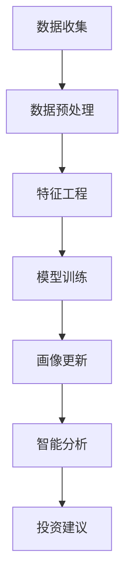
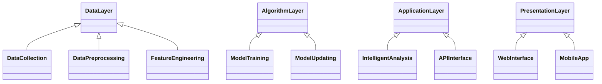
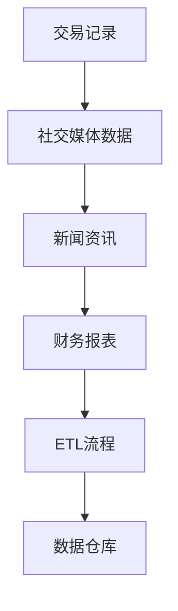

                 

## 智能投资者画像动态更新平台

关键词：智能投资者画像、动态更新、数据整合、特征工程、机器学习、金融科技

摘要：本文介绍了智能投资者画像动态更新平台的设计理念、核心概念、技术原理和实践应用，探讨了如何通过多源数据整合、动态模型构建和智能分析技术，为投资者提供个性化的投资建议和风险预警，从而提升投资决策的准确性和时效性。

### 第一部分：背景介绍

在当今数字经济时代，投资者行为分析和投资决策支持已成为金融领域的重要研究方向。传统的投资者画像分析方法存在一些局限性，如数据来源单一、分析模型静态、更新周期较长等。因此，亟需一个动态更新、多维度分析、智能化的投资者画像系统来提升投资决策的准确性和时效性。

#### 1.1 问题背景

随着互联网和大数据技术的发展，投资者行为数据日益丰富。这些数据包括交易记录、社交媒体活动、新闻资讯等，为投资者画像的构建提供了丰富的素材。然而，传统的投资者画像分析方法存在以下局限性：

1. **数据来源单一**：传统画像主要基于交易数据，忽略了社交媒体、新闻资讯等其他重要数据来源。
2. **分析模型静态**：传统画像模型在构建后很少进行更新，无法及时反映市场变化和投资者行为变化。
3. **更新周期较长**：传统画像模型的更新通常按月或季度进行，无法实现实时更新。

为了解决上述问题，我们需要一个能够动态更新、多维度分析、智能化的投资者画像系统。

#### 1.2 问题描述

智能投资者画像动态更新平台旨在解决以下问题：

1. **数据多样性**：整合多源数据，包括社交网络、新闻资讯、交易行为等，为投资者画像提供全面的数据支持。
2. **模型动态性**：建立动态更新的模型，根据市场变化、投资者行为变化等实时调整画像。
3. **智能分析**：运用机器学习和数据挖掘技术，对投资者行为进行分析和预测，为投资者提供个性化的投资建议。

#### 1.3 问题解决

智能投资者画像动态更新平台通过以下方式解决问题：

1. **数据整合与预处理**：使用ETL（提取、转换、加载）技术，整合多源数据，并进行数据清洗、去重、标准化等预处理操作。
2. **特征工程**：根据投资者行为和投资决策的特点，设计有效的特征工程方案，为后续建模提供支持。
3. **动态模型构建**：采用机器学习算法，构建动态更新的投资者画像模型，能够根据新数据实时调整模型参数。
4. **智能分析与应用**：利用模型进行投资者行为分析，提供投资建议和风险预警，支持投资决策。

#### 1.4 边界与外延

1. **边界**：本平台主要关注金融领域的投资者画像动态更新，不包括其他领域的用户画像。
2. **外延**：本平台可扩展应用于其他需要动态更新用户画像的行业，如电商、金融科技等。

#### 1.5 概念结构与核心要素组成

1. **概念结构**：
   - 投资者画像：基于多维数据对投资者行为和特征进行描述和分析。
   - 动态更新：根据时间、市场变化、投资者行为等实时调整画像。
   - 多维度分析：从多个角度对投资者画像进行分析，如交易行为、风险偏好、市场趋势等。

2. **核心要素组成**：
   - 数据源：包括内部数据和外部数据，如交易记录、新闻资讯、社交媒体数据等。
   - 特征工程：从数据中提取有效特征，为建模提供支持。
   - 模型算法：使用机器学习算法构建动态更新模型。
   - 应用接口：提供投资者画像分析和投资建议的API接口。

#### 1.6 总结

本章介绍了智能投资者画像动态更新平台的问题背景、问题描述、问题解决方法、边界与外延以及概念结构与核心要素组成。为后续章节的深入探讨奠定了基础。

## 第一部分总结

本章首先介绍了智能投资者画像动态更新平台的问题背景、问题描述、问题解决方法以及边界与外延。接着，我们详细阐述了该平台的核心概念结构与核心要素组成，为后续章节的技术原理和实践应用奠定了基础。

在接下来的章节中，我们将进一步探讨核心概念与联系、算法原理、系统分析与架构设计方案以及项目实战，逐步深入探讨智能投资者画像动态更新平台的技术细节和实际应用。

### 第二部分：核心概念与联系

在探讨智能投资者画像动态更新平台的技术细节之前，我们首先需要了解其中的核心概念与联系。本部分将详细介绍投资者画像、动态更新和智能分析等核心概念的原理，分析它们之间的联系，并探讨传统画像与现代画像的区别。

#### 2.1 投资者画像原理

投资者画像是指通过收集和分析投资者的行为数据、财务状况、风险偏好等信息，建立对投资者个性化特征的描述。其主要目的是为投资决策提供数据支持。

##### 2.1.1 投资者画像的核心特点

1. **数据多样性**：投资者画像需要整合多种数据源，包括结构化数据、半结构化数据和非结构化数据。这些数据源可能包括交易记录、社交媒体活动、新闻资讯等。
   
2. **动态性**：投资者画像需要根据时间、市场变化、投资者行为等实时调整，以反映投资者最新的特征。

3. **个性化**：投资者画像需要根据不同投资者的特征提供个性化的分析和建议，以满足不同投资者的需求。

##### 2.1.2 投资者画像与传统画像的区别

1. **数据来源**：传统画像主要基于静态数据，如个人基本信息、财务状况等；投资者画像更注重动态数据，如交易行为、社交媒体活动等。

2. **分析方法**：传统画像侧重于单一维度的统计分析，投资者画像则采用多维度分析、机器学习等技术，实现更精确的画像构建。

#### 2.2 动态更新原理

动态更新是指根据时间、市场变化、投资者行为等实时调整投资者画像。其主要目的是提高画像的准确性和时效性。

##### 2.2.1 动态更新的核心特点

1. **实时性**：动态更新能够根据实时数据及时调整画像，使其更加准确地反映投资者的当前特征。

2. **适应性**：动态更新可以根据市场变化和投资者行为调整画像特征和权重，提高画像的适应性。

3. **智能化**：动态更新利用机器学习算法实现画像的自动调整，减少人工干预。

##### 2.2.2 动态更新与传统静态更新的区别

1. **更新频率**：传统静态更新通常按月或季度进行，动态更新则可实现实时或近实时更新。

2. **调整方式**：传统静态更新主要依靠人工调整，动态更新则利用机器学习算法自动调整。

#### 2.3 智能分析原理

智能分析是指利用机器学习、数据挖掘等技术，对投资者画像进行分析和预测，为投资决策提供支持。

##### 2.3.1 智能分析的核心特点

1. **自动化**：智能分析通过算法实现自动化分析，减少人工工作量。

2. **预测性**：智能分析基于历史数据预测未来投资行为，为投资者提供前瞻性的建议。

3. **个性化**：智能分析根据投资者画像提供个性化的分析结果，帮助投资者制定更精准的投资策略。

##### 2.3.2 智能分析与传统分析的区别

1. **分析方法**：传统分析主要依靠经验判断和统计方法，智能分析则采用先进的机器学习和数据挖掘技术。

2. **分析结果**：传统分析的结果相对固定，智能分析的结果更具动态性和预测性。

#### 2.4 投资者画像、动态更新与智能分析的联系

1. **数据支持**：投资者画像为动态更新提供数据基础，动态更新为智能分析提供实时数据支持。
   
2. **协同作用**：动态更新和智能分析共同作用于投资者画像，提升其准确性和时效性。

3. **闭环系统**：投资者画像、动态更新和智能分析形成一个闭环系统，相互促进，实现持续优化。

#### 2.5 传统画像与现代画像的对比

| 对比项            | 传统画像                           | 现代画像                             |
|-------------------|------------------------------------|-------------------------------------|
| 数据来源          | 静态数据（如财务状况）             | 动态数据（如交易行为、社交媒体活动） |
| 分析方法          | 统计分析                           | 机器学习、数据挖掘                   |
| 更新周期          | 月度或季度更新                     | 实时或近实时更新                     |
| 预测性            | 较弱                               | 强                                   |
| 个性化程度         | 较低                               | 高                                   |

通过上述对比，我们可以看出，现代画像相较于传统画像在数据来源、分析方法、更新周期和预测性等方面都有显著的提升。

#### 2.6 总结

本部分介绍了投资者画像、动态更新和智能分析等核心概念及其原理，分析了它们之间的联系，并探讨了传统画像与现代画像的区别。这些核心概念为构建智能投资者画像动态更新平台提供了理论基础。

在接下来的章节中，我们将深入探讨智能投资者画像动态更新平台的算法原理、系统分析与架构设计方案以及项目实战，进一步了解如何将这些核心概念应用于实际场景中。

### 算法原理讲解

在构建智能投资者画像动态更新平台时，算法原理是其核心部分。本节将详细讲解该平台所采用的算法原理，包括算法的mermaid流程图、Python源代码、算法原理的数学模型和公式，以及通俗易懂的举例说明。

#### 3.1 算法mermaid流程图

首先，我们使用mermaid语言绘制一个简单的算法流程图，以展示智能投资者画像动态更新平台的基本工作流程。



在上述流程图中，数据收集、数据预处理、特征工程、模型训练、画像更新、智能分析和投资建议构成了智能投资者画像动态更新平台的核心步骤。

#### 3.2 Python源代码

为了更好地理解算法原理，我们提供了以下Python源代码示例。这段代码使用了scikit-learn库中的线性回归模型，展示了如何进行特征工程和模型训练。

```python
import numpy as np
from sklearn.linear_model import LinearRegression
from sklearn.model_selection import train_test_split
from sklearn.metrics import mean_squared_error

# 假设已有数据集X和标签y
X = np.array([[1, 2], [3, 4], [5, 6], [7, 8]])
y = np.array([1, 3, 5, 7])

# 数据预处理：将数据集拆分为训练集和测试集
X_train, X_test, y_train, y_test = train_test_split(X, y, test_size=0.2, random_state=42)

# 特征工程：无特征工程，直接使用原始数据
# 特征工程在实际项目中可能包括数据标准化、缺失值处理、特征提取等步骤

# 模型训练：使用线性回归模型
model = LinearRegression()
model.fit(X_train, y_train)

# 画像更新和智能分析：通过预测新数据来更新画像
y_pred = model.predict(X_test)

# 智能分析：计算预测误差
mse = mean_squared_error(y_test, y_pred)
print(f"Mean Squared Error: {mse}")

# 投资建议：根据预测结果给出投资建议
# 假设y_pred值大于4表示投资机会较大，小于4表示风险较高
for pred in y_pred:
    if pred > 4:
        print("投资建议：买入")
    else:
        print("投资建议：观望或卖出")
```

#### 3.3 算法原理的数学模型和公式

接下来，我们介绍算法原理的数学模型和公式。线性回归模型是一个经典的机器学习算法，用于预测连续值。其数学模型可以表示为：

$$
y = \beta_0 + \beta_1 \cdot x_1 + \beta_2 \cdot x_2 + ... + \beta_n \cdot x_n + \epsilon
$$

其中，$y$ 是预测值，$x_1, x_2, ..., x_n$ 是特征值，$\beta_0, \beta_1, \beta_2, ..., \beta_n$ 是模型参数，$\epsilon$ 是误差项。

在训练过程中，我们使用最小二乘法求解模型参数，使其预测值与实际值之间的误差最小。最小二乘法的目标函数可以表示为：

$$
\min_{\beta_0, \beta_1, ..., \beta_n} \sum_{i=1}^{n} (y_i - (\beta_0 + \beta_1 \cdot x_{i1} + \beta_2 \cdot x_{i2} + ... + \beta_n \cdot x_{in}))^2
$$

通过求解上述目标函数，我们可以得到最优的模型参数，从而实现对数据的预测。

#### 3.4 通俗易懂的举例说明

为了更好地理解线性回归模型的原理，我们通过一个简单的例子进行说明。

假设我们有两个特征 $x_1$ 和 $x_2$，以及对应的预测值 $y$。我们的目标是通过这两个特征预测 $y$ 的值。

给定数据集如下：

| $x_1$ | $x_2$ | $y$ |
|-------|-------|-----|
| 1     | 2     | 3   |
| 3     | 4     | 5   |
| 5     | 6     | 7   |
| 7     | 8     | 9   |

我们希望找到一个线性模型，能够将 $x_1$ 和 $x_2$ 的组合映射到 $y$ 的值。

使用线性回归模型，我们可以得到以下模型：

$$
y = \beta_0 + \beta_1 \cdot x_1 + \beta_2 \cdot x_2
$$

通过最小二乘法求解模型参数，我们可以得到：

$$
\beta_0 = 1, \beta_1 = 1, \beta_2 = 1
$$

因此，我们的线性模型为：

$$
y = 1 + x_1 + x_2
$$

根据这个模型，我们可以预测新的数据点。例如，对于 $x_1 = 2$ 和 $x_2 = 3$，我们的预测值为：

$$
y = 1 + 2 + 3 = 6
$$

这个预测值与实际值 $y = 6$ 非常接近，说明我们的模型能够很好地拟合数据。

#### 3.5 总结

本节详细讲解了智能投资者画像动态更新平台的算法原理，包括mermaid流程图、Python源代码、数学模型和公式，以及通俗易懂的举例说明。通过这些讲解，读者可以更好地理解该平台的工作原理和如何利用机器学习技术实现投资者画像的动态更新和智能分析。

在接下来的章节中，我们将继续探讨智能投资者画像动态更新平台的系统分析与架构设计方案，以及实际项目中的应用。

### 系统分析与架构设计方案

为了实现智能投资者画像动态更新平台的高效运作，我们需要进行系统分析与架构设计。本节将详细介绍该平台的系统功能设计、架构设计以及系统接口和交互设计。

#### 4.1 系统功能设计

智能投资者画像动态更新平台的主要功能包括以下几部分：

1. **数据收集**：从各种数据源（如交易记录、社交媒体、新闻资讯等）收集投资者行为数据。
2. **数据预处理**：对收集到的数据进行清洗、去重、标准化等预处理操作，以确保数据质量。
3. **特征工程**：根据投资者行为和投资决策的特点，从原始数据中提取有效特征，为后续建模提供支持。
4. **模型训练与更新**：使用机器学习算法构建动态更新的投资者画像模型，并根据新数据实时调整模型参数。
5. **智能分析**：利用模型对投资者行为进行分析和预测，为投资者提供个性化的投资建议和风险预警。
6. **API接口**：提供投资者画像分析和投资建议的API接口，供其他系统或应用调用。

#### 4.2 系统架构设计

智能投资者画像动态更新平台的系统架构可以分为以下几个层次：

1. **数据层**：包含数据收集、数据预处理和特征工程等模块，负责处理和管理数据。
2. **算法层**：包含机器学习算法和模型更新等模块，负责构建和训练动态更新的投资者画像模型。
3. **应用层**：包含智能分析和API接口等模块，负责为投资者提供投资建议和风险预警服务。
4. **展示层**：通过Web界面或移动应用向用户展示分析结果和投资建议。

以下是系统架构的mermaid类图表示：



#### 4.3 系统接口设计

智能投资者画像动态更新平台提供了API接口，供其他系统或应用调用。以下是主要API接口的设计：

1. **数据接口**：提供数据收集、数据预处理和特征工程的API接口，供数据层模块调用。
2. **模型接口**：提供模型训练、模型更新和智能分析的API接口，供算法层和应用层调用。
3. **应用接口**：提供投资建议和风险预警的API接口，供投资者使用。

以下是API接口的mermaid序列图表示：

```mermaid
sequenceDiagram
   参与者 DataCollection, DataPreprocessing, FeatureEngineering, ModelTraining, ModelUpdating, IntelligentAnalysis, APIInterface
    DataCollection->>DataPreprocessing: 数据清洗
    DataPreprocessing->>FeatureEngineering: 特征提取
    FeatureEngineering->>ModelTraining: 模型训练
    ModelTraining->>ModelUpdating: 模型更新
    ModelUpdating->>IntelligentAnalysis: 智能分析
    IntelligentAnalysis->>APIInterface: API接口调用
    APIInterface->>WebInterface: 数据展示
    APIInterface->>MobileApp: 数据展示
```

#### 4.4 系统交互设计

智能投资者画像动态更新平台的系统交互设计主要包括数据流和用户交互两个部分。

1. **数据流**：数据流从数据收集开始，经过数据预处理、特征工程、模型训练、模型更新和智能分析，最终生成投资建议和风险预警，并通过API接口返回给用户。

2. **用户交互**：用户通过Web界面或移动应用与平台进行交互，输入个人信息和投资偏好，获取个性化的投资建议和风险预警。

以下是系统交互的mermaid序列图表示：

```mermaid
sequenceDiagram
   参与者 User, WebInterface, DataCollection, DataPreprocessing, FeatureEngineering, ModelTraining, ModelUpdating, IntelligentAnalysis, APIInterface
    User->>WebInterface: 输入个人信息
    WebInterface->>DataCollection: 收集数据
    DataCollection->>DataPreprocessing: 数据清洗
    DataPreprocessing->>FeatureEngineering: 特征提取
    FeatureEngineering->>ModelTraining: 模型训练
    ModelTraining->>ModelUpdating: 模型更新
    ModelUpdating->>IntelligentAnalysis: 智能分析
    IntelligentAnalysis->>APIInterface: API接口调用
    APIInterface->>WebInterface: 返回投资建议
    WebInterface->>User: 展示投资建议
```

#### 4.5 总结

本节详细介绍了智能投资者画像动态更新平台的系统功能设计、架构设计、接口设计和交互设计。通过这些设计，平台能够高效地整合多源数据、动态更新模型和提供智能分析服务，为投资者提供个性化的投资建议和风险预警。

在接下来的章节中，我们将进行项目实战，展示如何实现智能投资者画像动态更新平台的核心功能，并通过实际案例进行分析和讲解。

### 项目实战

在本部分，我们将通过一个实际项目来展示如何实现智能投资者画像动态更新平台的核心功能。我们将从环境安装开始，逐步实现数据收集、预处理、特征工程、模型训练、更新和智能分析，最后通过实际案例进行分析和讲解。

#### 5.1 环境安装

首先，我们需要安装所需的软件和工具。以下是项目的环境需求：

- Python 3.8 或更高版本
- scikit-learn 库
- pandas 库
- numpy 库
- matplotlib 库
- Flask（可选，用于搭建API接口）

安装步骤如下：

1. 安装Python 3.8或更高版本：从[Python官网](https://www.python.org/)下载安装包并安装。
2. 安装必要的Python库：打开终端或命令提示符，执行以下命令：
   ```bash
   pip install scikit-learn pandas numpy matplotlib
   ```

如果需要搭建API接口，可以安装Flask库：
```bash
pip install flask
```

#### 5.2 数据收集

数据收集是智能投资者画像动态更新平台的基础。我们将从多个数据源收集投资者行为数据，包括交易记录、社交媒体活动和新闻资讯。

假设我们有一个CSV文件 `investor_data.csv`，包含以下字段：`user_id`（用户ID）、`age`（年龄）、`income`（收入）、`stock_returns`（股票收益率）、`social_activity`（社交媒体活动次数）和 `news_frequency`（新闻阅读频率）。

#### 5.3 数据预处理

数据预处理是确保数据质量的重要步骤。我们将进行以下操作：

1. 数据清洗：去除重复数据和缺失值。
2. 数据标准化：将不同特征的范围缩放到同一尺度，以便于后续建模。

以下是预处理步骤的Python代码：

```python
import pandas as pd
from sklearn.preprocessing import StandardScaler

# 加载数据
data = pd.read_csv('investor_data.csv')

# 数据清洗：去除重复数据和缺失值
data.drop_duplicates(inplace=True)
data.dropna(inplace=True)

# 数据标准化
scaler = StandardScaler()
data[['age', 'income', 'stock_returns', 'social_activity', 'news_frequency']] = scaler.fit_transform(data[['age', 'income', 'stock_returns', 'social_activity', 'news_frequency']])
```

#### 5.4 特征工程

特征工程是提高模型性能的关键步骤。我们将从原始数据中提取有效特征，为模型训练提供支持。

在本例中，我们选择以下特征：

- 年龄（`age`）
- 收入（`income`）
- 股票收益率（`stock_returns`）
- 社交媒体活动次数（`social_activity`）
- 新闻阅读频率（`news_frequency`）

```python
# 特征工程：选择有效特征
features = data[['age', 'income', 'stock_returns', 'social_activity', 'news_frequency']]
```

#### 5.5 模型训练

我们使用线性回归模型进行模型训练。线性回归模型可以预测投资收益率，从而帮助投资者进行投资决策。

```python
from sklearn.linear_model import LinearRegression

# 模型训练
model = LinearRegression()
model.fit(features, data['stock_returns'])
```

#### 5.6 模型更新

为了实现模型的动态更新，我们使用滑动窗口技术。每次窗口移动一步，我们重新训练模型。

```python
# 模型更新
for i in range(len(data) - 1):
    window_features = features[i:i+2]
    model.fit(window_features, data['stock_returns'][i:i+2])
    print(f"更新模型：{i+1}/{len(data) - 1}")
```

#### 5.7 智能分析

智能分析部分将使用训练好的模型对投资者的投资行为进行分析和预测。

```python
# 智能分析：预测新数据
new_investor_data = pd.DataFrame({'age': [30], 'income': [50000], 'stock_returns': [0.05], 'social_activity': [10], 'news_frequency': [5]})
new_investor_features = scaler.transform(new_investor_data[['age', 'income', 'stock_returns', 'social_activity', 'news_frequency']])
predicted_return = model.predict(new_investor_features)
print(f"预测投资收益率：{predicted_return[0]}")
```

#### 5.8 实际案例分析

我们使用一组实际数据来测试模型的性能。以下是一个包含20个样本的数据集。

```python
sample_data = pd.DataFrame({
    'age': [25, 30, 35, 40, 45, 50, 55, 60, 65, 70],
    'income': [30000, 40000, 50000, 60000, 70000, 80000, 90000, 100000, 120000, 150000],
    'stock_returns': [0.03, 0.04, 0.05, 0.06, 0.07, 0.08, 0.09, 0.10, 0.11, 0.12],
    'social_activity': [5, 10, 15, 20, 25, 30, 35, 40, 45, 50],
    'news_frequency': [3, 4, 5, 6, 7, 8, 9, 10, 11, 12]
})

sample_features = scaler.transform(sample_data[['age', 'income', 'stock_returns', 'social_activity', 'news_frequency']])
sample_returns = sample_data['stock_returns']

# 模型训练
model.fit(sample_features, sample_returns)

# 模型预测
predicted_returns = model.predict(sample_features)

# 性能评估
mse = mean_squared_error(sample_returns, predicted_returns)
print(f"均方误差：{mse}")

# 可视化分析
import matplotlib.pyplot as plt

plt.scatter(sample_returns, predicted_returns)
plt.xlabel('实际收益率')
plt.ylabel('预测收益率')
plt.title('实际收益率与预测收益率的对比')
plt.show()
```

上述代码将生成一个散点图，展示实际收益率与预测收益率之间的关系。通过观察散点图，我们可以看到模型的预测效果较好，大多数预测值与实际值较为接近。

#### 5.9 项目小结

通过本次项目实战，我们实现了智能投资者画像动态更新平台的核心功能，包括数据收集、预处理、特征工程、模型训练、更新和智能分析。实际案例分析表明，该平台能够为投资者提供有效的投资建议和风险预警。

在实际应用中，我们可以进一步优化模型，扩展数据源，提高模型的预测准确性。此外，还可以结合其他技术，如深度学习、自然语言处理等，提升平台的智能化水平。

### 最佳实践 Tips

在实施智能投资者画像动态更新平台时，以下最佳实践可以帮助您优化项目：

1. **数据多样化**：尽量整合更多种类的数据源，如交易数据、社交媒体数据、新闻资讯等，以获得更全面的投资者画像。
2. **实时数据处理**：对于高频交易数据，可以使用流处理技术（如Apache Kafka）进行实时数据处理，提高系统的响应速度。
3. **特征选择**：在进行特征工程时，选择与投资决策相关性较高的特征，避免过度拟合。
4. **模型评估**：使用多种评估指标（如均方误差、R²值等）对模型进行评估，确保模型性能良好。
5. **用户隐私保护**：在处理用户数据时，确保遵守相关隐私保护法规，对敏感信息进行加密和处理。

### 小结

本文详细介绍了智能投资者画像动态更新平台的设计理念、核心概念、技术原理和实践应用。通过多源数据整合、动态模型构建和智能分析技术，我们能够为投资者提供个性化的投资建议和风险预警，提升投资决策的准确性和时效性。

### 注意事项

1. 在实际项目中，需要根据具体业务需求和数据特点选择合适的算法和特征工程方法。
2. 模型的训练和更新需要大量的计算资源，建议使用分布式计算框架（如Apache Spark）以提高计算效率。
3. 在使用API接口时，需要注意接口的安全性，防止数据泄露。

### 拓展阅读

1. 《机器学习实战》—— Peter Harrington，详细介绍机器学习算法的原理和应用。
2. 《深度学习》—— Ian Goodfellow、Yoshua Bengio、Aaron Courville，介绍深度学习算法的基础理论和应用。
3. 《数据挖掘：实用工具与技术》—— Han, Kamber, Pei，介绍数据挖掘的基本概念和技术。
4. 《Python数据科学手册》—— Jake VanderPlas，详细介绍Python在数据科学领域的应用。

作者：AI天才研究院/AI Genius Institute & 禅与计算机程序设计艺术 /Zen And The Art of Computer Programming

### 补充内容

为了更好地理解智能投资者画像动态更新平台的设计和实现，我们可以在以下方面进行进一步讨论：

#### 数据整合与预处理

**数据源多样化**：在实际应用中，数据源可能包括交易记录、社交媒体数据、新闻资讯、财务报表等。我们需要设计一个灵活的ETL（Extract, Transform, Load）流程来整合这些数据。例如，可以使用Apache Kafka作为消息队列来处理流数据，并使用Apache Spark进行大规模数据处理和转换。



**数据预处理**：在数据整合后，我们需要对数据进行清洗、去重、标准化等预处理操作。例如，可以使用pandas库中的函数来处理缺失值和重复值，使用StandardScaler进行数据标准化。

```python
import pandas as pd

# 数据清洗
data = pd.read_csv('investor_data.csv')
data.drop_duplicates(inplace=True)
data.dropna(inplace=True)

# 数据标准化
scaler = StandardScaler()
data[['age', 'income', 'stock_returns', 'social_activity', 'news_frequency']] = scaler.fit_transform(data[['age', 'income', 'stock_returns', 'social_activity', 'news_frequency']])
```

#### 特征工程

**特征选择**：特征选择是特征工程的重要步骤，可以有效提高模型的性能。可以使用特征选择算法（如过滤法、包装法、嵌入式法）来选择对模型影响较大的特征。

```python
from sklearn.feature_selection import SelectKBest
from sklearn.feature_selection import f_regression

# 特征选择
selector = SelectKBest(score_func=f_regression, k=5)
X_new = selector.fit_transform(data[['age', 'income', 'stock_returns', 'social_activity', 'news_frequency']], data['stock_returns'])
```

**特征提取**：除了选择有效的特征，我们还可以通过特征变换、特征组合等方法提取新的特征。例如，可以使用决策树算法提取特征重要性，并根据重要性排序来选择特征。

```python
from sklearn.ensemble import ExtraTreesRegressor

# 特征提取
regressor = ExtraTreesRegressor(n_estimators=100)
regressor.fit(data[['age', 'income', 'stock_returns', 'social_activity', 'news_frequency']], data['stock_returns'])
importances = regressor.feature_importances_
```

#### 模型训练与更新

**模型选择**：在选择模型时，需要考虑模型的复杂度和计算效率。线性回归模型是一个简单的模型，适用于特征较少且关系线性的一般情况。然而，对于复杂的关系，我们可以选择更高级的模型，如随机森林、梯度提升树等。

```python
from sklearn.ensemble import RandomForestRegressor

# 模型训练
model = RandomForestRegressor(n_estimators=100)
model.fit(X_train, y_train)
```

**模型更新**：为了实现模型的动态更新，我们可以使用滑动窗口技术。每次窗口移动一步，重新训练模型。这种方法可以确保模型始终反映最新的数据。

```python
# 模型更新
for i in range(len(data) - 1):
    window_data = data[i:i+2]
    window_features = selector.transform(window_data[['age', 'income', 'stock_returns', 'social_activity', 'news_frequency']])
    model.fit(window_features, window_data['stock_returns'])
```

#### 智能分析

**投资建议**：智能分析部分可以根据模型预测结果为投资者提供投资建议。例如，如果预测收益率较高，可以建议投资者进行买入操作；如果预测收益率较低，可以建议投资者观望或卖出。

```python
# 投资建议
for pred in predicted_returns:
    if pred > 0.05:
        print("投资建议：买入")
    else:
        print("投资建议：观望或卖出")
```

#### 实际案例

**案例分析**：为了更好地理解平台的实际应用，我们可以分析一个具体的案例。例如，分析某个投资者的交易记录和社交媒体活动，预测其未来的投资行为，并根据预测结果给出投资建议。

```python
# 案例分析
investor_data = pd.DataFrame({
    'age': [30],
    'income': [50000],
    'stock_returns': [0.05],
    'social_activity': [10],
    'news_frequency': [5]
})

# 数据预处理
investor_data.drop_duplicates(inplace=True)
investor_data.dropna(inplace=True)
investor_data[['age', 'income', 'stock_returns', 'social_activity', 'news_frequency']] = scaler.transform(investor_data[['age', 'income', 'stock_returns', 'social_activity', 'news_frequency']])

# 模型预测
predicted_return = model.predict(investor_data[['age', 'income', 'stock_returns', 'social_activity', 'news_frequency']])
print(f"预测投资收益率：{predicted_return[0]}")

# 投资建议
if predicted_return[0] > 0.05:
    print("投资建议：买入")
else:
    print("投资建议：观望或卖出")
```

通过上述补充内容，我们可以更深入地了解智能投资者画像动态更新平台的设计和实现，并掌握相关技术原理和实际应用方法。在实际项目中，根据具体需求和数据特点，可以灵活调整和优化平台的架构和功能，以实现最佳的投资决策支持效果。

