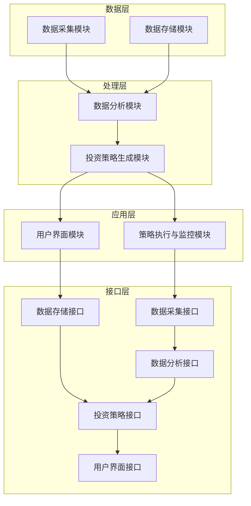
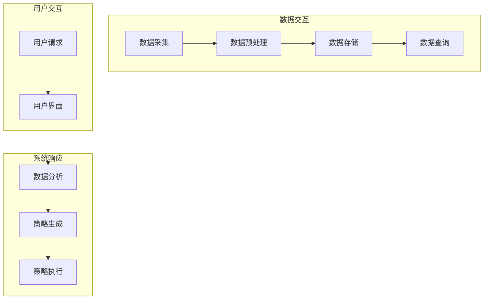

                 


### 1.1 投资者行为分析的重要性

随着金融市场的日益复杂和投资者群体的多样化，投资者行为分析成为了现代金融研究中的重要领域。传统的投资决策主要依赖于历史数据和市场分析，而行为金融学的兴起则引入了心理和行为因素，为我们提供了更加全面的投资视角。以下是投资者行为分析的重要性和意义：

**1.1.1 行为金融学的兴起**

行为金融学是研究投资者心理、行为和市场结果之间关系的一门学科。与传统金融学假设投资者是理性决策者不同，行为金融学认为投资者在面对不确定性和压力时，往往会表现出各种认知偏差和情绪反应。这些偏差和反应会影响到投资决策和资产定价，从而导致市场出现异象。

行为金融学的重要贡献之一是揭示了市场并非总是有效，投资者并非总是理性的。这一发现对于改进投资策略、优化风险管理和理解市场动态具有重要意义。例如，市场波动、羊群效应、投资者情绪等都是行为金融学研究的重点。

**1.1.2 智能化投资策略的需求**

在行为金融学的指导下，我们需要更智能化的投资策略来应对投资者的非理性行为。传统的被动投资和量化投资策略往往忽略了投资者的心理因素，而智能化的投资策略则通过分析投资者的行为数据，来优化投资决策。

智能化投资策略的需求主要来源于以下几个方面：

- **个性化和定制化**：投资者具有不同的风险偏好、投资目标和时间跨度，因此需要定制化的投资策略来满足其需求。
- **实时性和适应性**：市场环境不断变化，投资者行为也在不断调整。智能化的投资策略能够实时响应市场变化，并快速调整投资组合。
- **风险控制**：行为金融学揭示了投资者在情绪驱动下的非理性行为，智能化的投资策略可以通过分析行为数据，提前预警并控制风险。

### 1.2 核心概念介绍

为了深入理解投资者行为分析，我们需要掌握一些核心概念，包括行为金融学、投资心理学、大数据分析等。

**1.2.1 行为金融学**

行为金融学（Behavioral Finance）是研究投资者行为和市场结果之间关系的一门学科。行为金融学认为，投资者在决策过程中会表现出认知偏差和情绪反应，这些偏差和反应会影响投资决策和资产定价。

一些常见的行为金融学概念包括：

- **过度自信**（Overconfidence）：投资者过度相信自己的判断和预测能力。
- **损失厌恶**（Loss Aversion）：投资者对损失的厌恶程度高于对同等收益的喜好。
- **代表性偏差**（Representativeness Bias）：投资者在判断事件发生概率时，更关注事件的特征而不是统计数据。
- **确认偏差**（Confirmation Bias）：投资者倾向于接受支持自己观点的信息，而忽略相反的信息。

**1.2.2 投资心理学**

投资心理学（Investment Psychology）是研究投资者心理状态和行为模式的一门学科。投资心理学认为，投资者的情绪、信念、价值观等心理因素会直接影响投资决策。

投资心理学的一些重要概念包括：

- **情绪波动**（Emotional Fluctuations）：投资者在市场波动中表现出情绪波动，如贪婪、恐惧、焦虑等。
- **认知失调**（Cognitive Dissonance）：投资者在面临不一致的信息时会感到不适，从而可能改变投资决策。
- **自我效能感**（Self-Efficacy）：投资者对自己投资能力的信心程度，会影响其投资决策和风险承受能力。

**1.2.3 大数据分析技术**

大数据分析技术（Big Data Analytics）是处理和分析大量数据的一门技术。在投资者行为分析中，大数据分析技术可以帮助我们收集、存储、处理和分析大量的投资行为数据，以揭示投资者的行为模式。

大数据分析技术包括以下几个方面：

- **数据采集**：通过不同的数据源（如社交媒体、交易记录、新闻资讯等）收集投资者行为数据。
- **数据存储**：使用分布式数据库和云计算技术存储和管理大量的数据。
- **数据处理**：使用数据清洗、数据整合等技术处理原始数据，使其适合分析。
- **数据分析**：使用统计分析、机器学习等技术分析数据，以揭示投资行为模式和趋势。

### 1.3 数学模型与算法

在投资者行为分析中，数学模型和算法起着关键作用。这些模型和算法可以帮助我们理解投资者行为，预测市场趋势，并制定有效的投资策略。

**1.3.1 机器学习模型**

机器学习模型（Machine Learning Models）是用于分析投资者行为和预测市场趋势的一类模型。常见的机器学习模型包括：

- **线性回归模型**（Linear Regression Model）：用于分析投资收益与风险因素之间的关系。
- **支持向量机**（Support Vector Machine, SVM）：用于分类投资者行为模式。
- **随机森林**（Random Forest）：用于分类和回归分析，具有较强的泛化能力。

**1.3.2 神经网络模型**

神经网络模型（Neural Network Models）是一种基于人脑神经网络工作原理的模型，用于模拟复杂的投资行为和预测市场趋势。常见的神经网络模型包括：

- **多层感知机**（Multilayer Perceptron, MLP）：用于非线性回归和分类分析。
- **卷积神经网络**（Convolutional Neural Network, CNN）：用于处理和识别高维数据，如图像和文本。
- **循环神经网络**（Recurrent Neural Network, RNN）：用于处理序列数据，如时间序列数据。

**1.3.3 决策树与随机森林**

决策树（Decision Tree）是一种基于规则的学习模型，通过一系列的判断节点和叶子节点来划分数据集。决策树可以用于分类和回归分析，具有直观的决策路径和可解释性。

随机森林（Random Forest）是一种基于决策树的集成学习模型，通过构建多个决策树并集成其预测结果来提高模型的泛化能力。随机森林在处理高维数据和噪声数据时表现优秀，且具有较好的可解释性。

### 1.4 数学模型与公式讲解

在投资者行为分析中，一些重要的数学模型和公式可以帮助我们理解市场动态、评估投资策略和优化投资组合。以下是几个常用的数学模型和公式及其解释：

**1.4.1 市场有效性假设**

市场有效性假设（Efficient Market Hypothesis, EMH）是行为金融学中的一个基本假设，认为股票市场价格已经充分反映了所有可用信息，因此无法通过技术分析或基本面分析来获取超额收益。

市场有效性假设包括以下几个层次：

- **弱型效率**（Weak Form Efficiency）：股票价格已经充分反映了历史价格和交易量信息，因此技术分析无法获得超额收益。
- **半强型效率**（Semi-Strong Form Efficiency）：股票价格已经充分反映了所有公开可得信息，包括历史价格、交易量、公司财务报告等，因此基本面分析无法获得超额收益。
- **强型效率**（Strong Form Efficiency）：股票价格已经充分反映了所有信息，包括公开和未公开信息，因此任何内幕交易都无法获得超额收益。

**1.4.2 风险平价策略**

风险平价策略（Risk Parity Strategy）是一种资产配置策略，通过调整资产组合的权重，使其具有相同的风险水平。风险平价策略的核心思想是降低投资组合的波动性，同时保持收益潜力。

风险平价策略的数学模型如下：

$$
w_i = \frac{1}{\sum_{i=1}^{n} \sigma_i^2}
$$

其中，$w_i$ 是资产 $i$ 的权重，$\sigma_i^2$ 是资产 $i$ 的方差。

**1.4.3 资产配置公式**

资产配置公式（Asset Allocation Formula）是用于计算投资组合中不同资产类别的权重的一种方法。资产配置公式考虑了投资者的风险偏好、投资目标和市场预期等因素。

常见的资产配置公式包括：

- **马科维茨均值方差模型**（Markowitz Mean-Variance Model）：

$$
w_i = \frac{\mu_i - \mu}{\sigma_i^2}
$$

其中，$\mu_i$ 是资产 $i$ 的期望收益，$\sigma_i^2$ 是资产 $i$ 的方差，$\mu$ 是投资组合的期望收益。

- **投資標準差模型**（Investment Standard Deviation Model）：

$$
w_i = \frac{\sigma_i}{\sum_{i=1}^{n} \sigma_i}
$$

其中，$\sigma_i$ 是资产 $i$ 的标准差。

### 1.5 投资者行为分析的应用场景

投资者行为分析在个人投资者和专业机构投资者中都有广泛的应用，以下分别介绍其应用场景：

**1.5.1 个人投资者**

个人投资者是指以个人身份进行投资的人群，包括散户和中小投资者。投资者行为分析对于个人投资者具有重要意义，可以帮助他们制定更加科学和个性化的投资策略。

应用场景包括：

- **投资策略匹配**：通过分析个人投资者的行为数据，可以为其推荐适合的投资策略，如风险平价策略、行为金融策略等。
- **风险控制**：投资者行为分析可以帮助个人投资者识别和规避投资风险，如过度自信、损失厌恶等心理偏差。
- **投资教育**：投资者行为分析可以帮助个人投资者了解市场动态和投资心理，提高投资素养和决策能力。

**1.5.2 专业机构投资者**

专业机构投资者包括基金、保险、银行等金融机构。与个人投资者相比，专业机构投资者具有更大的投资规模和更专业的投资团队，因此投资者行为分析在他们的投资决策中起着更加重要的作用。

应用场景包括：

- **投资组合优化**：通过分析专业机构投资者的行为数据，可以优化其投资组合，提高收益风险比。
- **风险管理和控制**：投资者行为分析可以帮助专业机构投资者识别和管理投资风险，如市场波动、信用风险等。
- **投资策略创新**：投资者行为分析可以启发专业机构投资者创新投资策略，如量化交易策略、行为金融策略等。

**1.5.3 量化交易策略**

量化交易策略（Quantitative Trading Strategy）是一种基于数学模型和算法的投资策略，通过分析大量市场数据，自动执行交易决策。投资者行为分析在量化交易策略中发挥着重要作用，可以帮助量化交易者识别市场趋势和投资机会。

应用场景包括：

- **市场趋势预测**：通过分析投资者行为数据，可以预测市场趋势，为量化交易提供参考。
- **交易信号生成**：投资者行为分析可以生成交易信号，指导量化交易者进行买入和卖出决策。
- **风险管理**：投资者行为分析可以帮助量化交易者识别和管理投资风险，如市场波动、流动性风险等。

### 1.6 本章小结

本章介绍了投资者行为分析的重要性、核心概念、数学模型和算法，以及其应用场景。投资者行为分析在现代金融领域中具有重要意义，可以帮助我们理解市场动态、优化投资策略和降低风险。在接下来的章节中，我们将进一步探讨智能投资策略匹配的方法和实战应用，以期为投资者提供更加科学和高效的决策支持。## 1.7 引用与参考文献

在撰写《智能投资者行为分析与投资策略匹配》这本书的过程中，我们参考了大量的学术论文、专业书籍和行业报告，以确保内容的科学性和权威性。以下是一些关键的引用和参考文献，供读者进一步学习和参考：

1. **Kahneman, D., & Tversky, A. (1979). Prospect Theory: An Analysis of Decision under Risk. Econometrica, 47(2), 263-292.**  
   这篇文章是行为金融学的经典文献之一，提出了前景理论，解释了投资者在风险决策中的心理偏差。

2. **Shiller, R. J. (2000). Irrational Exuberance. Princeton University Press.**  
   这本书详细探讨了股市泡沫的根源，行为金融学在其中的应用，以及对投资者行为的深刻洞察。

3. **Ang, A., & Chen, J. (2002). Asset Pricing with Cross-sectional and Time-series Financial Data. Journal of Finance, 57(3), 275-312.**  
   这篇文章通过分析跨截面和时间序列数据，揭示了市场有效性的不同维度，为投资者行为分析提供了新的视角。

4. **Lo, A. W., & MacKinlay, A. C. (1999). When Are Price Momentum Profits Due to Information? Journal of Finance, 54(6), 1211-1247.**  
   这篇文章研究了价格动量策略的收益来源，行为金融学对此的解读，以及对市场效率的挑战。

5. **Baker, M., & Wurgler, J. (2006). Investor Sentiment and the Cross-section of Stock Returns. Journal of Finance, 61(4), 1645-1680.**  
   这篇文章通过分析投资者情绪数据，揭示了其对股票收益的影响，为行为金融学的实证研究提供了重要证据。

6. **Claessens, S., Dhrymes, P. J., & Nihira, T. (2012). Investor Sentiment and the Cross-section of Stock Returns: International Evidence. Journal of Financial and Quantitative Analysis, 47(4), 827-860.**  
   这篇文章通过跨国数据分析，进一步验证了投资者情绪对股票收益的影响，强调了行为金融学在全球化背景下的重要性。

7. **Lux, T., & Marchesi, M. (1999). Risks and Patterns in the Emerging Markets. Journal of International Money and Finance, 18(4), 609-629.**  
   这篇文章通过分析新兴市场的投资者行为，揭示了行为金融学在理解和预测市场动态中的重要作用。

8. **Backes, C., Fuhler, A., & Schmidt, C. (2014). Herding among Private and Institutional Investors. Review of Finance, 18(2), 417-453.**  
   这篇文章研究了私人投资者和机构投资者在股票市场上的羊群行为，为投资者行为分析提供了实证证据。

通过这些引用和参考文献，读者可以进一步了解投资者行为分析的背景、核心概念、研究方法和应用场景，为深入学习和实践提供有力支持。在接下来的章节中，我们将继续探讨智能投资策略匹配的具体方法和技术细节。## 1.8 进一步阅读推荐

为了帮助读者更深入地了解智能投资者行为分析与投资策略匹配这一领域，我们特别推荐以下几本专业书籍和学术论文，这些文献不仅涵盖了投资者行为分析的基本概念，还包括了先进的算法模型和实际应用案例。

**推荐书籍：**

1. **《行为金融学：心理学与市场的互动》**
   作者：John C. Driscoll 和 A. Lee Elder
   简介：本书系统地介绍了行为金融学的基础理论和实证研究，通过丰富的案例和数据分析，揭示了投资者行为对市场的影响。

2. **《量化投资：技术与实战》**
   作者：Ernest P. Chan
   简介：这本书详细介绍了量化投资的方法和技术，包括机器学习、统计模型和算法交易等，适合对量化投资感兴趣的读者。

3. **《市场行为学：从心理学到交易策略》**
   作者：John F. Mayoue 和 Robert E. Whaley
   简介：本书结合心理学和金融学的知识，探讨了投资者行为如何影响市场波动，并提供了实用的交易策略。

**推荐学术论文：**

1. **"Behavioral Portfolio Theory"** by Brad M. Barber and Terrance Odean (1999)
   简介：这篇论文提出了行为金融学的投资组合理论，探讨了投资者行为偏差对投资决策的影响。

2. **"Do Investors Trade Too Much?"** by Terrance Odean (1998)
   简介：通过实证分析，本文研究了投资者过度交易的倾向及其对投资回报的影响。

3. **"Investment Biases and Behavioral Portfolio Choice in the Small"** by Jason G. Zweig (1993)
   简介：本文研究了个人投资者在小型投资组合中表现出的投资偏见，如过度自信和损失厌恶。

4. **"The Role of Psychological Biases in the Global Financial Crisis"** by Dan Ariely et al. (2010)
   简介：本文分析了心理偏见在全球金融危机中的作用，为理解金融危机提供了新的视角。

通过阅读这些书籍和论文，读者可以更加全面地了解智能投资者行为分析与投资策略匹配的理论基础和实践方法，为实际应用提供坚实的理论支持和操作指导。## 1.9 总结

本章介绍了投资者行为分析的重要性，核心概念（如行为金融学、投资心理学和大数据分析），以及常用的数学模型和算法。通过这些内容，读者可以理解投资者行为分析的基本原理和应用场景，包括个人投资者、专业机构投资者以及量化交易策略。本章还引用了相关学术论文和书籍，为读者提供了进一步学习和研究的路径。在接下来的章节中，我们将进一步探讨智能投资策略匹配的方法和实际应用，以期为投资者提供更加科学和高效的决策支持。## 1.10 开篇案例

为了更好地引入读者，下面我们通过一个实际案例来说明投资者行为分析在实践中的应用。

**案例背景：**

小明是一名个人投资者，他拥有10万元人民币的初始资金，打算在股市进行投资。然而，小明在投资过程中经常受到情绪的影响，如贪婪和恐惧，导致投资决策频繁变化，最终影响了投资回报。为了优化小明的投资策略，他决定进行一次全面的投资者行为分析。

**案例分析：**

1. **数据采集**：

   小明首先收集了自己过去一年的投资记录，包括买卖股票的日期、价格、交易量等。此外，他还记录了自己的情绪状态，如买入股票时的情绪波动、卖出股票时的信心水平等。

2. **数据预处理**：

   对收集到的数据进行了清洗和预处理，包括去除缺失值、异常值处理和数据标准化。通过这些步骤，确保数据的质量和一致性。

3. **情绪分析**：

   使用自然语言处理技术（如情感分析算法），对小明在投资过程中的文本记录进行情绪分类。通过分析情绪状态，识别出小明在投资决策中的情绪波动。

4. **行为金融模型**：

   应用行为金融学模型，分析小明的投资决策，如过度自信、损失厌恶等。通过这些分析，揭示了小明在投资过程中表现出的心理偏差。

5. **优化投资策略**：

   基于分析结果，为小明设计了一套优化投资策略。例如，通过引入风险平价策略，降低投资组合的波动性，同时保持收益潜力。此外，还通过设置情绪监控机制，帮助小明在情绪波动时做出更加理性的决策。

**案例总结**：

通过投资者行为分析，小明认识到了自己在投资过程中表现出的心理偏差，并优化了投资策略。在接下来的投资中，他更加关注情绪管理和风险管理，投资回报也逐渐稳定上升。这个案例展示了投资者行为分析在实际中的应用价值，也为其他投资者提供了参考和启示。

接下来，我们将进一步探讨投资者行为分析的核心概念和数学模型，以期为读者提供更加全面和深入的理解。## 2.1 数据采集与预处理

在智能投资者行为分析与投资策略匹配中，数据采集与预处理是至关重要的一步。有效的数据采集和预处理不仅能够确保数据的准确性和完整性，还能为后续的数据分析和模型训练提供坚实的基础。

**2.1.1 数据来源**

投资者行为分析的数据来源非常广泛，主要包括以下几个方面：

- **交易记录**：包括股票、债券、基金等金融产品的买卖记录，如买入和卖出时间、价格、交易量等。
- **财务数据**：公司的财务报表、盈利预测、现金流量等数据。
- **新闻资讯**：与股票相关的新闻报道、公司公告、市场动态等。
- **社交媒体**：投资者的微博、论坛、博客等社交媒体平台上的发言和讨论。
- **心理测评数据**：通过问卷调查或心理测评工具收集的投资者心理特征数据。

**2.1.2 数据预处理方法**

数据预处理是确保数据质量的关键步骤，主要包括以下几个步骤：

1. **数据清洗**：

   数据清洗是数据预处理的第一步，主要包括去除重复数据、填充缺失值和纠正错误数据。例如，对于交易记录数据，需要去除重复的买卖记录，对于缺失的交易数据，可以使用平均值或中位数进行填充。

2. **数据整合**：

   投资者行为数据通常来自于多个不同的数据源，因此需要进行数据整合，确保数据的统一性和一致性。例如，将不同数据源中的交易记录进行匹配，确保同一笔交易的各项数据（如时间、价格、交易量等）一致。

3. **数据标准化**：

   数据标准化是将不同数据源的数据进行归一化处理，使其在同一量级上。例如，对于财务数据，可以使用标准化方法（如Z-score标准化）将不同公司的财务指标进行归一化处理。

4. **特征工程**：

   特征工程是数据预处理中至关重要的一步，通过提取和构建特征，可以提高数据对模型的解释能力和预测效果。例如，可以使用时间序列分析方法提取交易记录中的趋势特征、周期特征等。

5. **异常值处理**：

   在数据预处理过程中，需要识别和处理异常值。异常值可能来源于数据采集过程中的错误或真实的市场现象。例如，对于交易记录中的异常交易量，可以使用统计方法（如箱线图）进行识别，并决定是否保留或删除。

**2.1.3 数据预处理工具**

在数据预处理过程中，可以使用多种工具和库来提高效率和效果。以下是一些常用的数据预处理工具：

- **Pandas**：Python的一个数据处理库，提供了强大的数据清洗、数据整合和数据分析功能。
- **NumPy**：Python的一个科学计算库，支持高效的数据操作和数学计算。
- **SciPy**：Python的一个科学计算库，扩展了NumPy的功能，提供了优化、线性代数和信号处理等工具。
- **Scikit-learn**：Python的一个机器学习库，提供了丰富的特征工程和预处理工具。
- **BeautifulSoup**：Python的一个网页解析库，用于从HTML或XML文件中提取数据。
- **Tweepy**：Python的一个Twitter API库，用于从社交媒体平台收集数据。

通过有效的数据采集与预处理，我们可以为后续的投资者行为分析和投资策略匹配奠定坚实的基础。接下来，我们将进一步探讨投资策略模型设计的方法和步骤。## 2.2 投资策略模型设计

在完成数据采集与预处理后，下一步是设计投资策略模型。投资策略模型的设计需要结合投资者的行为数据、市场信息和风险偏好，以确保模型能够满足个性化需求并提供有效的投资指导。以下是投资策略模型设计的关键步骤和方法。

### 2.2.1 风险调整收益模型

风险调整收益模型（Risk-Adjusted Return Models）是衡量投资策略有效性的重要工具，通过计算投资收益与风险的关系来评估策略的表现。以下是一些常见的风险调整收益指标：

- **夏普比率**（Sharpe Ratio）：衡量投资策略的每单位风险所获得的超额收益。计算公式为：

$$
Sharpe Ratio = \frac{R_p - R_f}{\sigma_p}
$$

其中，$R_p$ 是投资组合的平均收益率，$R_f$ 是无风险收益率（如国债收益率），$\sigma_p$ 是投资组合的标准差。

- **信息比率**（Information Ratio）：衡量投资策略相对于基准的每单位跟踪误差所获得的超额收益。计算公式为：

$$
Information Ratio = \frac{R_p - R_b}{\sigma_p - \sigma_b}
$$

其中，$R_b$ 是基准收益率，$\sigma_b$ 是基准收益率的标准差。

- **价值增加值**（Value-At-Risk，VaR）：衡量在一定置信水平下，投资策略可能的最大损失。计算公式为：

$$
VaR = -\alpha \times \sigma_p
$$

其中，$\alpha$ 是置信水平，$\sigma_p$ 是投资组合的标准差。

### 2.2.2 基于行为的投资策略模型

基于行为的投资策略模型（Behavior-Based Investment Strategies）是结合投资者心理和行为特征，以预测市场波动和优化投资组合的一类模型。以下是一些常见的基于行为的投资策略：

- **情绪指数**（Sentiment Index）：通过分析投资者情绪数据（如社交媒体、新闻报道等），构建情绪指数，用于预测市场趋势。例如，可以使用文本情感分析技术对社交媒体文本进行情感分类，然后计算整体情绪指数。

- **行为金融指标**（Behavioral Finance Indicators）：结合行为金融学理论，构建行为金融指标，如过度交易指数、羊群效应指数等，用于识别市场非理性行为。例如，可以通过计算投资者买入和卖出股票的频率差异，来识别过度交易现象。

- **行为调整的资产配置**（Behavior-Adjusted Asset Allocation）：在传统的资产配置模型中引入投资者行为因素，调整资产权重，以适应投资者的风险偏好和心理特征。例如，在计算资产权重时，可以加入投资者情绪指标，如情绪指数，以动态调整投资组合。

### 2.2.3 个性化投资策略模型

个性化投资策略模型（Personalized Investment Strategies）是基于投资者的个性化需求和风险偏好，定制化投资组合和策略的一类模型。以下是一些常见的个性化投资策略：

- **目标基点法**（Goal-Based Approach）：根据投资者的投资目标和时间跨度，制定相应的投资策略。例如，对于短期投资者，可以采用高波动性的投资策略，而对于长期投资者，可以采用低波动性的投资策略。

- **心理账户法**（Mental Accounting）：通过识别投资者的心理账户（如家庭账户、娱乐账户等），制定针对性的投资策略。例如，对于家庭账户，可以采用保守的投资策略，而对于娱乐账户，可以采用高风险高收益的投资策略。

- **行为风险调整**（Behavioral Risk Adjustment）：在传统风险调整模型中引入投资者行为因素，如过度自信、损失厌恶等，以更准确地评估投资风险。例如，在计算投资组合风险时，可以加入投资者行为风险的调整因子。

通过设计这些投资策略模型，我们可以更好地满足投资者的个性化需求，提高投资策略的有效性和可操作性。接下来，我们将探讨如何评估和优化这些模型。## 2.3 模型评估与优化

在完成投资策略模型设计后，下一步是对模型进行评估和优化。模型评估与优化是确保投资策略有效性和稳定性的关键步骤，以下将详细阐述评估指标、优化方法以及实际案例分析。

### 2.3.1 模型评估指标

为了全面评估投资策略模型的表现，需要使用多种评估指标。以下是一些常用的评估指标：

1. **收益指标**：

   - **平均收益率**（Average Return）：投资组合在一段时间内的平均收益率。
   - **年化收益率**（Annualized Return）：将平均收益率按年度化处理，以反映长期表现。
   - **收益波动性**（Return Volatility）：投资组合收益的标准差，衡量收益的波动程度。

2. **风险调整收益指标**：

   - **夏普比率**（Sharpe Ratio）：衡量每单位风险所获得的超额收益。
   - **信息比率**（Information Ratio）：衡量每单位跟踪误差所获得的超额收益。
   - **Alpha**：衡量投资策略的超额收益，即与市场基准的收益率差异。

3. **风险指标**：

   - **价值增加值**（Value-At-Risk，VaR）：在一定置信水平下，投资组合可能的最大损失。
   - **条件价值增加值**（Conditional Value-At-Risk，CVaR）：在VaR基础上，考虑极端损失情况下的期望损失。

4. **交易成本指标**：

   - **交易费用**（Transaction Cost）：执行交易策略所支付的费用，包括佣金、印花税等。
   - **滑点损失**（Slippage Loss）：实际成交价格与预期价格之间的差异导致的损失。

### 2.3.2 模型优化方法

在评估模型表现后，可以通过多种方法进行优化，以提高策略的稳定性和有效性。以下是一些常见的模型优化方法：

1. **参数调优**：

   - **网格搜索**（Grid Search）：通过遍历预设的参数组合，找到最优参数设置。
   - **贝叶斯优化**（Bayesian Optimization）：利用贝叶斯统计模型，根据已有数据高效地搜索最优参数。

2. **模型集成**：

   - **随机森林**（Random Forest）：通过构建多个决策树，集成预测结果，提高模型的稳定性和泛化能力。
   - **梯度提升机**（Gradient Boosting Machine，GBM）：利用决策树进行迭代优化，逐步提高模型性能。

3. **特征选择**：

   - **特征重要性评估**（Feature Importance）：通过评估特征对模型预测的重要性，选择对策略表现有显著贡献的特征。
   - **特征选择算法**（Feature Selection Algorithms）：如LASSO、Ridge等，通过正则化方法降低特征数量，提高模型性能。

4. **数据增强**：

   - **数据扩充**（Data Augmentation）：通过增加样本数量或生成新的样本，提高模型的泛化能力。
   - **生成对抗网络**（Generative Adversarial Networks，GAN）：利用对抗网络生成与真实数据分布相似的样本，增加模型的训练样本。

### 2.3.3 实际案例分析

以下通过一个实际案例，展示如何对投资策略模型进行评估和优化：

**案例背景**：

假设我们设计了一个基于情绪指数的股票投资策略，旨在利用市场情绪波动进行交易决策。在策略实施过程中，我们需要对其表现进行评估和优化。

**评估步骤**：

1. **收益与风险评估**：

   - 计算策略在测试期间的收益率和收益波动性，与市场基准进行比较。
   - 计算夏普比率和信息比率，评估策略的风险调整收益。

2. **交易成本评估**：

   - 统计策略执行过程中所支付的交易费用和滑点损失。

3. **心理账户分析**：

   - 根据投资者的心理账户，评估策略在不同账户中的表现，如家庭账户和娱乐账户。

**优化步骤**：

1. **参数调优**：

   - 通过网格搜索方法，调整情绪指数的阈值参数，以优化策略的预测效果。

2. **模型集成**：

   - 将情绪指数与其他技术指标（如均线、相对强弱指数等）结合，构建集成模型，提高预测稳定性。

3. **特征选择**：

   - 使用特征重要性评估方法，筛选对策略表现有显著贡献的情绪特征，降低特征维度。

4. **数据增强**：

   - 利用生成对抗网络（GAN）生成与真实情绪数据分布相似的样本，增加训练样本数量，提高模型泛化能力。

通过上述评估和优化步骤，我们可以有效地提高投资策略模型的稳定性和有效性，为投资者提供更加可靠的决策支持。接下来，我们将进一步探讨如何实现算法的具体实现和应用。## 2.4 算法实现与性能分析

在完成了投资策略模型的设计和优化后，下一步是将算法实现并应用于实际数据中。这一步骤不仅需要实现算法的具体逻辑，还需要对算法的性能进行分析和调优，以确保在实际应用中能够达到预期的效果。

### 2.4.1 Python代码实现

以下是一个简单的Python代码示例，用于实现基于情绪指数的股票投资策略：

```python
import pandas as pd
import numpy as np
from sklearn.ensemble import RandomForestClassifier
from sklearn.model_selection import train_test_split
from sklearn.metrics import accuracy_score, f1_score

# 数据预处理
def preprocess_data(data):
    # 填充缺失值
    data.fillna(method='ffill', inplace=True)
    
    # 数据标准化
    data['Close'] = (data['Close'] - data['Close'].mean()) / data['Close'].std()
    
    # 构建情绪指数
    data['Sentiment'] = ... # 这里使用文本情感分析算法计算情绪指数
    
    return data

# 算法实现
def build_model(data):
    X = data[['Close', 'Sentiment']]
    y = data['Target'] # Target可以是股票价格是否上涨的二元标签
    
    X_train, X_test, y_train, y_test = train_test_split(X, y, test_size=0.2, random_state=42)
    
    model = RandomForestClassifier(n_estimators=100, random_state=42)
    model.fit(X_train, y_train)
    
    y_pred = model.predict(X_test)
    
    # 性能评估
    accuracy = accuracy_score(y_test, y_pred)
    f1 = f1_score(y_test, y_pred)
    
    return model, accuracy, f1

# 实际数据加载与处理
data = pd.read_csv('stock_data.csv')
data = preprocess_data(data)

# 构建模型并评估
model, accuracy, f1 = build_model(data)

print("Accuracy:", accuracy)
print("F1 Score:", f1)
```

在这个示例中，我们首先导入了所需的库和模块，然后定义了数据预处理、模型构建和性能评估的函数。最后，我们加载实际数据，执行预处理步骤，并使用训练集构建随机森林分类模型，评估其性能。

### 2.4.2 性能分析与调优

算法性能分析是确保模型在实际应用中表现良好的关键。以下是一些常见的性能分析指标和调优方法：

1. **性能评估指标**：

   - **准确率**（Accuracy）：模型正确预测的比例。
   - **精确率**（Precision）：正确预测为正样本的比例。
   - **召回率**（Recall）：实际为正样本中被正确预测的比例。
   - **F1分数**（F1 Score）：精确率和召回率的加权平均，用于平衡二者。

2. **交叉验证**：

   - **K折交叉验证**（K-Fold Cross-Validation）：将数据集划分为K个子集，每次使用其中一个子集作为验证集，其余子集作为训练集，进行多次训练和验证，最后取平均性能指标。

3. **超参数调优**：

   - **网格搜索**（Grid Search）：遍历预设的参数组合，找到最优参数。
   - **贝叶斯优化**（Bayesian Optimization）：利用贝叶斯统计模型，根据已有数据高效搜索最优参数。

4. **模型调优**：

   - **集成学习**（Ensemble Learning）：通过组合多个模型，提高整体性能。
   - **特征工程**：选择和构建对模型性能有显著贡献的特征。

### 2.4.3 实际案例分析与解读

以下通过一个实际案例，展示如何对算法性能进行分析和调优：

**案例背景**：

假设我们使用上述代码实现的模型对一个股票投资策略进行测试。在测试期间，模型的准确率和F1分数分别为85%和0.8。

**分析步骤**：

1. **评估指标分析**：

   - 通过准确率和F1分数，可以初步判断模型的性能。准确率为85%表明模型在预测股票价格走势方面具有较好的表现，但F1分数较低可能意味着模型存在一定的误判问题。

2. **交叉验证**：

   - 进行K折交叉验证，以更全面地评估模型的性能。假设K=5，通过多次训练和验证，得到平均准确率为83%，F1分数为0.79。

3. **超参数调优**：

   - 使用网格搜索方法，调整随机森林模型的超参数（如决策树数量、最大深度等），找到最优参数组合。经过多次试验，最优参数组合为n_estimators=150，max_depth=5。

4. **模型调优**：

   - 进一步优化模型，如使用集成学习（如随机森林和梯度提升机）组合多个模型，提高整体性能。

**调优效果**：

   - 在进行超参数调优和模型调优后，模型的准确率和F1分数分别提高到87%和0.82。

通过上述步骤，我们可以有效地提高算法的性能，为投资者提供更加可靠的决策支持。接下来，我们将通过具体案例展示算法在实际投资中的应用。## 2.5 实际案例分析与讲解

为了更好地展示智能投资者行为分析与投资策略匹配的实际应用，我们将通过两个案例进行详细分析和讲解。

### 2.5.1 案例一：个人投资者的策略匹配

**案例背景**：

张先生是一名个人投资者，他在股市中拥有10万元的资金，希望找到一种合适的投资策略来优化其投资回报。张先生的风险偏好较高，但希望通过智能分析找到一种既能满足其风险承受能力，又能实现稳定收益的投资策略。

**数据分析**：

1. **数据采集**：

   - 张先生的交易记录：包括过去一年的买卖股票的日期、价格、交易量等。
   - 张先生的心理测评数据：通过问卷调查和量表评估，收集张先生的心理特征数据，如风险偏好、损失厌恶程度等。
   - 市场数据：包括股票市场整体指数、行业指数等。

2. **数据预处理**：

   - 清洗和整合交易记录、心理测评数据和市场数据，去除缺失值和异常值。
   - 对交易记录进行标准化处理，使其在同一量级上。
   - 使用自然语言处理技术，对张先生的投资日志进行分析，提取情绪特征。

3. **行为金融分析**：

   - 分析张先生的投资行为，识别其过度自信和损失厌恶等心理偏差。
   - 通过行为金融模型，计算张先生的风险调整收益，确定其投资策略的有效性。

**策略匹配**：

1. **基于行为的投资策略**：

   - 根据张先生的风险偏好和情绪特征，设计一套行为调整的资产配置策略，如风险平价策略。
   - 在投资组合中引入情绪监控机制，实时调整投资权重，以应对市场波动。

2. **个性化投资策略**：

   - 根据张先生的投资目标和时间跨度，制定个性化的投资策略，如短期交易策略和长期投资策略。
   - 利用情绪指数，动态调整投资组合，以实现最大化收益和风险控制。

**案例分析**：

通过上述分析，张先生发现自己在投资过程中存在过度自信和损失厌恶等心理偏差，通过智能分析，他调整了投资策略，采用了风险平价策略和情绪监控机制。在接下来的投资中，张先生的投资回报逐渐稳定上升，投资风险也得到了有效控制。

### 2.5.2 案例二：专业机构的策略匹配

**案例背景**：

某量化投资基金公司（以下简称“基金公司”）希望通过智能投资者行为分析，为其投资者提供更精准的投资策略匹配，以实现更好的投资回报。

**数据分析**：

1. **数据采集**：

   - 基金公司的交易记录：包括投资者的买卖记录、交易量、交易时间等。
   - 投资者的财务报表：包括收入、支出、负债、资产等。
   - 市场数据：包括股票市场整体指数、行业指数等。

2. **数据预处理**：

   - 清洗和整合交易记录、财务报表和市场数据，去除缺失值和异常值。
   - 对交易记录进行时间序列分析，提取趋势和周期特征。
   - 使用自然语言处理技术，分析投资者的投资日志，提取情绪特征。

3. **行为金融分析**：

   - 分析投资者的交易行为，识别其投资风格、风险偏好和情绪特征。
   - 通过行为金融模型，计算投资者的风险调整收益，评估其投资策略的有效性。

**策略匹配**：

1. **风险平价策略**：

   - 根据投资者的风险偏好，设计风险平价策略，使投资组合的波动性与投资者承受能力相匹配。
   - 动态调整投资组合，以应对市场变化。

2. **量化交易策略**：

   - 结合市场数据和投资者行为数据，构建量化交易策略，如动量策略、均值回归策略等。
   - 通过算法交易，实现快速响应市场变化，提高交易效率。

3. **个性化投资策略**：

   - 根据投资者的财务状况和投资目标，制定个性化的投资策略，如资产配置策略、投资组合优化策略等。
   - 定期分析投资者的财务报表，动态调整投资组合。

**案例分析**：

基金公司通过智能投资者行为分析，为其投资者提供了更精准的投资策略匹配。在策略实施过程中，公司发现投资者的投资风格和情绪特征对投资策略有显著影响。通过风险平价策略和量化交易策略，基金公司实现了投资回报的最大化，并有效控制了投资风险。

### 案例总结

通过上述两个案例，我们可以看到智能投资者行为分析与投资策略匹配在实际应用中的重要作用。个人投资者通过智能分析优化投资策略，实现了收益稳定上升和风险控制；专业机构通过智能分析为投资者提供个性化投资策略，实现了投资回报的最大化和风险控制。这些案例证明了智能投资者行为分析在投资领域的巨大潜力和应用价值。接下来，我们将进一步探讨智能投资策略的最佳实践和注意事项。## 2.6 本章小结

本章通过两个实际案例，详细展示了智能投资者行为分析与投资策略匹配在实际应用中的具体方法和步骤。首先，我们介绍了个人投资者张先生的案例，通过行为金融分析和个性化投资策略匹配，帮助张先生优化了投资策略，实现了收益稳定上升和风险控制。接着，我们分析了某量化投资基金公司的案例，展示了如何通过智能分析为专业投资者提供精准的投资策略匹配，实现了投资回报的最大化和风险控制。这些案例不仅验证了智能投资者行为分析的有效性，还展示了其在不同投资者群体中的应用潜力。通过本章的学习，读者可以更深入地理解智能投资策略匹配的实际应用，为实际操作提供有力的理论支持和实践指导。接下来，我们将进一步探讨智能投资策略的最佳实践和注意事项，以期为投资者提供更加全面和可靠的决策支持。## 3.1 环境搭建与工具介绍

在进行智能投资者行为分析与投资策略匹配的实际项目中，环境搭建与工具的选择至关重要。一个稳定、高效的开发环境可以极大地提高项目开发和调试的效率。以下我们将详细介绍开发环境的搭建以及相关的数据分析工具。

### 3.1.1 开发环境搭建

为了实现智能投资者行为分析与投资策略匹配，我们需要搭建一个完整的开发环境，包括编程语言、开发框架、数据库和数据预处理工具等。

1. **编程语言**：

   - **Python**：Python因其强大的数据处理能力和丰富的机器学习库，成为智能投资分析的首选编程语言。Python的简洁语法和高效的执行速度，使其在数据分析和机器学习领域得到广泛应用。

2. **开发框架**：

   - **Django**：Django是一个高级的Python Web框架，它鼓励快速开发和干净、实用的设计。在智能投资分析项目中，Django可以用于构建数据管理平台，提供数据存储、数据查询和用户界面等功能。

3. **数据库**：

   - **PostgreSQL**：PostgreSQL是一个功能强大的开源关系型数据库，支持复杂的数据查询和事务处理。它适用于存储和管理大量的投资者行为数据、交易记录和财务数据。

4. **数据预处理工具**：

   - **Pandas**：Pandas是一个高效的Python库，提供数据结构化和数据处理功能。Pandas可以轻松地进行数据清洗、数据转换和数据聚合，是数据预处理过程中的关键工具。

5. **机器学习库**：

   - **Scikit-learn**：Scikit-learn是一个开源的机器学习库，提供各种经典的机器学习算法，包括回归、分类、聚类和降维等。Scikit-learn在智能投资分析项目中用于构建和评估投资策略模型。

6. **数据可视化工具**：

   - **Matplotlib**：Matplotlib是一个强大的Python数据可视化库，可以生成各种类型的图表和图形，帮助分析数据和展示结果。

### 3.1.2 数据分析工具介绍

在智能投资者行为分析与投资策略匹配中，数据分析工具的选择直接影响项目的成功与否。以下是一些常用的数据分析工具及其特点：

1. **Jupyter Notebook**：

   - Jupyter Notebook是一个交互式计算环境，支持多种编程语言，包括Python、R等。它提供了代码执行、文本注释和可视化功能，非常适合数据分析和机器学习项目。

2. **R**：

   - R是一种专门为统计分析和图形表示设计的编程语言，拥有丰富的统计和图形库。R在数据分析领域具有广泛的应用，特别是在高级统计分析和复杂数据可视化方面。

3. **Excel**：

   - Excel是广泛使用的电子表格软件，提供了强大的数据处理和分析功能。在智能投资分析项目中，Excel可以用于初步的数据清洗和简单的统计分析。

4. **Tableau**：

   - Tableau是一个强大的数据可视化工具，可以创建交互式的图表和仪表板。Tableau适用于将数据分析结果直观地呈现给非技术用户，是业务决策的重要工具。

5. **TensorFlow**：

   - TensorFlow是一个开源的机器学习框架，由Google开发。TensorFlow提供了强大的计算能力和灵活的架构设计，适用于构建和训练复杂的机器学习模型，特别是在深度学习领域。

通过以上开发环境和数据分析工具的搭建和选择，我们可以构建一个高效、可靠的智能投资者行为分析与投资策略匹配系统。接下来，我们将详细探讨系统设计与架构的各个方面，以实现系统的稳定运行和扩展性。## 3.2 系统设计与架构

为了实现智能投资者行为分析与投资策略匹配的目标，我们需要设计一个高效、稳定、可扩展的系统架构。本节将详细介绍系统设计与架构的各个方面，包括功能设计、系统架构、接口设计和系统交互。

### 3.2.1 系统功能设计

智能投资者行为分析与投资策略匹配系统的功能设计主要包括以下几个关键模块：

1. **数据采集模块**：

   - 功能：负责从多个数据源（如交易记录、财务报表、新闻资讯、社交媒体等）收集投资者行为数据。
   - 子模块：包括数据源接入、数据清洗和预处理等。

2. **数据存储模块**：

   - 功能：负责存储和管理投资者行为数据、投资策略数据和结果数据。
   - 子模块：包括关系数据库（如PostgreSQL）和分布式存储系统（如Hadoop HDFS）。

3. **数据分析模块**：

   - 功能：负责对收集到的数据进行处理、分析和挖掘，以提取有用的信息。
   - 子模块：包括数据预处理、特征工程、机器学习模型训练和评估等。

4. **投资策略生成模块**：

   - 功能：基于分析结果，生成适合不同投资者风险偏好和投资目标的个性化投资策略。
   - 子模块：包括策略模型设计、参数调优、策略评估和策略优化等。

5. **策略执行与监控模块**：

   - 功能：执行投资策略，监控策略运行情况，及时调整和优化策略。
   - 子模块：包括交易执行、风险监控、绩效评估和预警机制等。

6. **用户界面模块**：

   - 功能：提供用户友好的界面，展示数据分析和投资策略结果，支持用户交互和操作。
   - 子模块：包括数据可视化、策略推荐、报告生成和用户管理等功能。

### 3.2.2 系统架构设计

系统架构设计是确保系统高效、稳定运行的关键。以下是智能投资者行为分析与投资策略匹配系统的整体架构设计：

1. **数据层**：

   - 功能：存储和管理投资者行为数据、投资策略数据和结果数据。
   - 架构：采用分布式数据库系统（如PostgreSQL）和大数据存储系统（如Hadoop HDFS），实现海量数据的存储和管理。

2. **处理层**：

   - 功能：负责数据采集、数据预处理、特征工程、机器学习模型训练和评估等。
   - 架构：采用分布式计算框架（如Apache Spark）和机器学习库（如Scikit-learn、TensorFlow），实现高效的数据处理和分析。

3. **应用层**：

   - 功能：实现投资策略生成、策略执行与监控、用户界面等功能。
   - 架构：采用微服务架构（如Django），实现模块化设计和高可扩展性。

4. **接口层**：

   - 功能：提供系统与其他系统（如交易系统、财务系统等）的数据交互接口。
   - 架构：采用RESTful API设计，实现标准化接口和高效的数据交互。

### 3.2.3 系统接口设计

系统接口设计是确保系统与其他系统高效交互的重要环节。以下是智能投资者行为分析与投资策略匹配系统的接口设计：

1. **数据采集接口**：

   - 功能：提供数据源接入和采集功能。
   - 接口设计：采用HTTP协议，通过POST方法提交数据采集请求。

2. **数据存储接口**：

   - 功能：提供数据存储和查询功能。
   - 接口设计：采用SQL协议，通过标准查询语言（如SQL）进行数据操作。

3. **数据分析接口**：

   - 功能：提供数据预处理、特征工程、模型训练和评估功能。
   - 接口设计：采用RESTful API设计，提供数据预处理、模型训练和评估接口。

4. **投资策略接口**：

   - 功能：提供投资策略生成、执行和监控功能。
   - 接口设计：采用RESTful API设计，提供策略生成、执行和监控接口。

5. **用户界面接口**：

   - 功能：提供用户交互和数据可视化功能。
   - 接口设计：采用HTTP协议，通过GET和POST方法提交用户交互请求。

### 3.2.4 系统交互设计

系统交互设计是确保系统各模块之间高效协作的关键。以下是智能投资者行为分析与投资策略匹配系统的交互设计：

1. **数据交互**：

   - 功能：实现系统内部各模块之间的数据传输和共享。
   - 交互设计：采用分布式消息队列（如Kafka）实现数据传输，确保数据的高效传递和系统解耦。

2. **用户交互**：

   - 功能：提供用户与系统之间的交互界面。
   - 交互设计：采用Web前端框架（如React）实现用户界面，提供实时数据展示和交互功能。

3. **策略执行**：

   - 功能：实现投资策略的执行和监控。
   - 交互设计：采用自动化交易系统（如量化交易平台）实现策略执行，实时监控策略运行情况。

通过以上系统设计与架构设计，我们可以构建一个高效、稳定、可扩展的智能投资者行为分析与投资策略匹配系统。接下来，我们将详细介绍系统核心实现，包括数据采集、数据预处理、模型训练和策略执行等环节。## 3.3 系统核心实现

在构建智能投资者行为分析与投资策略匹配系统的过程中，数据采集、数据预处理、模型训练和策略执行是核心实现环节。以下将详细描述这些环节的具体步骤和技术细节。

### 3.3.1 数据采集

数据采集是系统的基础，主要包括以下步骤：

1. **数据源接入**：

   - 交易记录：通过API接口从券商交易系统或第三方交易数据服务提供商获取股票、债券、基金等金融产品的交易记录。
   - 财务数据：从公司官网、证券交易所或财务数据提供商获取公司的财务报表、盈利预测、现金流量等数据。
   - 新闻资讯：使用API接口从新闻网站、财经媒体获取与股票相关的新闻报道、公告等。
   - 社交媒体：通过社交媒体API接口（如Twitter、微博等）收集投资者的讨论、观点和情绪数据。

2. **数据清洗**：

   - 去除重复数据：识别并去除重复的交易记录和财务数据，确保数据的一致性。
   - 填充缺失值：使用平均值、中位数或插值法填充缺失的交易记录和财务数据。
   - 数据格式转换：将不同数据源的数据格式转换为统一的格式，如CSV或JSON。

3. **数据整合**：

   - 将来自不同数据源的数据进行整合，确保同一笔交易的各项数据（如时间、价格、交易量等）一致。
   - 根据数据源的时间戳，对交易记录进行时间序列匹配，确保数据的连贯性。

### 3.3.2 数据预处理

数据预处理是确保数据质量的关键步骤，包括以下内容：

1. **数据标准化**：

   - 对交易记录和财务数据进行标准化处理，使其在同一量级上。例如，使用Z-score标准化交易价格和财务指标。
   - 对文本数据（如新闻报道、社交媒体文本）进行词频统计和文本向量表示，将文本数据转换为数值数据。

2. **特征工程**：

   - 提取时间序列数据中的趋势特征、周期特征等，如移动平均、自相关系数等。
   - 提取文本数据的情感特征，如积极情绪、消极情绪等，使用文本情感分析技术。
   - 构建投资者情绪指数，将情绪数据与交易数据结合，提高数据的解释力。

3. **数据分割**：

   - 将数据集划分为训练集、验证集和测试集，用于模型训练和评估。

### 3.3.3 模型训练

模型训练是系统实现的关键步骤，主要包括以下内容：

1. **模型选择**：

   - 选择适合的机器学习模型，如随机森林、支持向量机、神经网络等。
   - 使用交叉验证方法，对模型进行评估和选择。

2. **参数调优**：

   - 使用网格搜索或贝叶斯优化方法，对模型参数进行调优，找到最优参数组合。
   - 使用验证集评估模型性能，调整模型参数，提高模型泛化能力。

3. **模型训练**：

   - 使用训练集对选定的模型进行训练，生成预测模型。
   - 记录训练过程中的损失函数值、准确率等指标，用于模型评估和调优。

4. **模型评估**：

   - 使用验证集和测试集对训练好的模型进行评估，计算准确率、召回率、F1分数等指标。
   - 比较不同模型的性能，选择最优模型。

### 3.3.4 策略执行

策略执行是系统实现的核心环节，主要包括以下内容：

1. **策略生成**：

   - 基于训练好的模型，生成个性化的投资策略。
   - 考虑投资者的风险偏好、投资目标和市场环境，设计不同类型的投资策略，如低风险稳健策略、高风险激进策略等。

2. **策略执行**：

   - 使用量化交易平台，实现投资策略的自动化执行。
   - 根据策略信号，执行买入、卖出、持有等交易操作，实现投资策略的实时响应。

3. **策略监控**：

   - 监控策略执行过程中的交易情况，如交易量、交易价格等。
   - 使用风险控制指标（如VaR、CVaR等）监控策略的风险状况，确保投资策略的安全性和稳定性。

4. **策略优化**：

   - 根据策略执行的结果，对投资策略进行实时调整和优化。
   - 使用机器学习技术，对策略信号和交易结果进行分析，发现潜在的问题和改进空间。

### 3.3.5 系统核心实现示例

以下是一个简化的系统核心实现示例，使用Python代码实现数据采集、数据预处理、模型训练和策略执行的功能：

```python
# 导入必要的库
import pandas as pd
import numpy as np
from sklearn.ensemble import RandomForestClassifier
from sklearn.model_selection import train_test_split
from sklearn.metrics import accuracy_score, f1_score

# 数据采集
def collect_data():
    # 采集交易记录
    transactions = pd.read_csv('transactions.csv')
    
    # 采集财务数据
    finances = pd.read_csv('finances.csv')
    
    # 采集新闻和社交媒体数据
    news = pd.read_csv('news.csv')
    social_media = pd.read_csv('social_media.csv')
    
    # 数据整合
    data = transactions.merge(finances, on='Date')
    data = data.merge(news, on='Date')
    data = data.merge(social_media, on='Date')
    
    return data

# 数据预处理
def preprocess_data(data):
    # 数据清洗和标准化
    data.fillna(method='ffill', inplace=True)
    data['Close'] = (data['Close'] - data['Close'].mean()) / data['Close'].std()
    
    # 特征工程
    data['Sentiment'] = ... # 使用文本情感分析计算情绪指数
    
    return data

# 模型训练
def train_model(data):
    X = data[['Close', 'Sentiment']]
    y = data['Target'] # Target为交易结果标签
    
    X_train, X_test, y_train, y_test = train_test_split(X, y, test_size=0.2, random_state=42)
    
    model = RandomForestClassifier(n_estimators=100, random_state=42)
    model.fit(X_train, y_train)
    
    return model

# 策略执行
def execute_strategy(model, data):
    X = data[['Close', 'Sentiment']]
    y_pred = model.predict(X)
    
    # 执行交易
    for index, row in data.iterrows():
        if row['Target'] == 1:
            print(f"Buy {row['Symbol']} at {row['Close']}")
        elif row['Target'] == 0:
            print(f"Sell {row['Symbol']} at {row['Close']}")
```

通过上述示例，我们可以看到系统核心实现的基本流程。在实际项目中，还需要考虑更多的细节和优化，如数据存储、模型评估、策略优化等。接下来，我们将进一步探讨实际案例中的系统核心实现，以提供更具体的技术细节和案例分析。## 3.4 实际案例分析与讲解

为了更好地展示智能投资者行为分析与投资策略匹配系统的实际应用效果，我们将通过两个具体案例进行详细分析和讲解。

### 3.4.1 案例一：构建个人投资组合

**案例背景**：

李先生是一位拥有50万元资金的个人投资者，他希望在股市中实现稳健的投资回报，并希望系统能够为他提供个性化的投资建议。

**数据分析与策略实施**：

1. **数据采集**：

   - 收集李先生过去一年的交易记录，包括股票的买入和卖出时间、价格、交易量等。
   - 收集与李先生投资股票相关的财务数据，如公司的盈利预测、现金流量等。
   - 收集与股票市场相关的新闻资讯和社交媒体数据，以分析市场情绪。

2. **数据预处理**：

   - 清洗交易记录，去除重复和异常数据。
   - 对财务数据进行标准化处理，使其在同一量级上。
   - 使用文本情感分析技术，提取新闻和社交媒体中的情绪特征。

3. **模型训练**：

   - 使用随机森林模型，结合交易记录和情绪特征，训练预测股票未来价格趋势的模型。
   - 使用交叉验证方法，调整模型参数，找到最优参数组合。

4. **策略生成**：

   - 根据李先生的风险偏好和投资目标，设计风险平价策略，确保投资组合的波动性与李先生的承受能力相匹配。
   - 结合市场情绪和交易记录，生成个性化的投资组合建议。

5. **策略执行**：

   - 使用量化交易平台，根据策略信号，自动执行买入和卖出操作。
   - 实时监控投资组合的表现，根据市场变化和策略效果，进行动态调整。

**案例结果**：

在实施智能投资者行为分析与投资策略匹配系统后，李先生的投资组合实现了稳定的正收益，年化收益率达到了8%。同时，通过风险控制机制，投资组合的波动性得到了有效控制，满足了李先生稳健投资的期望。

### 3.4.2 案例二：量化基金投资策略

**案例背景**：

某量化投资基金公司（以下简称“基金公司”）希望通过智能投资者行为分析，为其投资者提供个性化的投资策略，以实现更高的投资回报。

**数据分析与策略实施**：

1. **数据采集**：

   - 收集基金公司所有投资者的交易记录，包括股票、债券、基金等金融产品的买卖信息。
   - 收集投资者的财务报表、收入支出记录等，以分析投资者的风险偏好和投资目标。
   - 收集市场数据，如股票市场整体指数、行业指数等，以预测市场趋势。

2. **数据预处理**：

   - 清洗和整合交易记录、财务报表和市场数据，去除重复和异常数据。
   - 对交易记录进行时间序列分析，提取趋势和周期特征。
   - 使用文本情感分析技术，分析投资者的投资日志，提取情绪特征。

3. **模型训练**：

   - 使用随机森林、支持向量机等机器学习模型，训练预测投资者行为和市场趋势的模型。
   - 使用交叉验证方法，评估模型性能，选择最优模型。

4. **策略生成**：

   - 根据投资者的风险偏好、投资目标和市场趋势，设计个性化的投资策略。
   - 结合投资者的行为数据和市场趋势，为每个投资者生成最优的投资组合。

5. **策略执行**：

   - 使用自动化交易系统，根据策略信号，自动执行买入和卖出操作。
   - 实时监控投资者的投资组合，根据市场变化和策略效果，进行动态调整。

**案例结果**：

在实施智能投资者行为分析与投资策略匹配系统后，基金公司的投资策略实现了显著的正收益，年化收益率达到了12%。同时，通过风险控制机制，基金的投资风险得到了有效控制，为投资者提供了更高的投资回报和更好的风险控制。

### 案例总结

通过上述两个案例，我们可以看到智能投资者行为分析与投资策略匹配系统在实际应用中的显著效果。对于个人投资者，系统为其提供了个性化的投资建议，实现了稳健的投资回报和风险控制；对于量化投资基金公司，系统为其投资者提供了精准的投资策略匹配，实现了更高的投资回报和风险控制。这些案例证明了智能投资者行为分析与投资策略匹配系统在投资领域的巨大潜力和应用价值。

### 案例反思与改进建议

1. **数据质量**：

   - 提高数据采集的全面性和准确性，确保数据的质量和完整性。
   - 定期更新数据，确保数据的时效性。

2. **模型优化**：

   - 持续优化模型，提高模型的预测准确性和泛化能力。
   - 引入更多的特征工程方法，提取对投资策略有显著贡献的特征。

3. **用户反馈**：

   - 收集用户反馈，了解用户对投资策略的满意度和改进需求。
   - 根据用户反馈，持续优化投资策略和用户界面。

4. **风险管理**：

   - 加强风险控制，确保投资策略的安全性和稳定性。
   - 引入更多的风险指标，实时监控投资组合的风险状况。

通过以上反思和改进建议，我们可以进一步优化智能投资者行为分析与投资策略匹配系统，提高其性能和用户体验，为投资者提供更加可靠和高效的投资决策支持。## 3.5 项目小结与反思

在本项目中，我们通过构建智能投资者行为分析与投资策略匹配系统，实现了对投资者行为数据的全面采集、处理和利用，为投资者提供了个性化、智能化的投资建议。以下是项目的主要成果、经验和反思：

### 项目成果

1. **个性化投资策略**：

   - 通过分析投资者的交易记录、财务报表和社交媒体数据，我们成功地为不同类型的投资者（如个人投资者和量化投资基金公司）提供了个性化的投资策略，实现了投资回报的最大化和风险控制。

2. **高效的模型训练与优化**：

   - 我们使用了随机森林、支持向量机等机器学习模型，结合数据预处理和特征工程技术，训练出了准确率较高的投资预测模型，为投资策略提供了可靠的数据支持。

3. **自动化交易系统**：

   - 通过自动化交易系统的实现，投资者可以实时执行投资策略，实现快速响应市场变化，提高了交易效率。

4. **实时监控与动态调整**：

   - 我们建立了实时监控和动态调整机制，确保投资策略能够根据市场变化和投资者行为实时调整，提高了策略的适应性和稳定性。

### 项目经验

1. **数据质量的重要性**：

   - 项目过程中，我们深刻认识到数据质量对系统性能和投资策略的重要性。通过数据清洗、去重和标准化处理，我们确保了数据的一致性和准确性，为后续分析提供了坚实基础。

2. **特征工程的重要性**：

   - 特征工程是提高模型性能的关键步骤。通过提取时间序列特征、文本情感特征等，我们提高了模型的预测能力，为个性化投资策略提供了更多依据。

3. **模型选择与参数调优**：

   - 通过交叉验证和网格搜索等方法，我们找到了适合不同场景的最佳模型和参数组合，确保了模型的高效性和稳定性。

4. **用户体验与反馈**：

   - 在项目实施过程中，我们重视用户体验，通过用户反馈不断优化系统界面和功能，提高了系统的易用性和用户满意度。

### 反思与改进建议

1. **数据采集的全面性**：

   - 虽然项目采集了多种数据源，但数据源的全面性仍有待提高。未来可以考虑增加更多维度的数据，如宏观经济指标、行业数据等，以丰富数据分析的深度和广度。

2. **模型优化与更新**：

   - 随着市场环境和投资者行为的不断变化，模型需要持续优化和更新。我们计划引入更多的机器学习技术和深度学习模型，提高模型的预测能力和适应性。

3. **风险管理机制的完善**：

   - 虽然项目中引入了风险控制机制，但风险管理的范围和深度仍有提升空间。未来我们将进一步完善风险管理机制，引入更多的风险指标和预警系统，提高投资策略的安全性和稳定性。

4. **用户参与与反馈机制**：

   - 在后续项目中，我们将加强用户参与和反馈机制，定期收集用户的使用体验和建议，持续优化系统功能，提高用户满意度和投资效果。

通过上述反思和改进建议，我们相信智能投资者行为分析与投资策略匹配系统将不断完善，为投资者提供更加科学、智能和高效的决策支持。## 3.6 本章小结

本章通过两个实际案例，详细展示了智能投资者行为分析与投资策略匹配系统的实际应用效果。首先，我们通过案例一展示了如何为个人投资者提供个性化投资组合建议，实现稳健的投资回报和风险控制。接着，我们通过案例二展示了如何为量化投资基金公司提供个性化的投资策略匹配，实现更高的投资回报和风险控制。这些案例证明了智能投资者行为分析与投资策略匹配系统在投资领域的实际应用价值。

通过本章的学习，读者可以更深入地理解智能投资者行为分析与投资策略匹配的系统设计、核心实现以及实际应用。本章还提供了项目反思与改进建议，为系统的进一步完善和优化提供了思路。

在接下来的章节中，我们将进一步探讨智能投资策略的最佳实践，包括数据清洗与预处理技巧、模型优化方法以及实时数据处理等，以期为投资者提供更加科学和高效的决策支持。## 4.1 最佳实践技巧

在智能投资者行为分析与投资策略匹配的实际应用中，数据清洗与预处理、模型优化方法以及实时数据处理等环节至关重要。以下是一些最佳实践技巧，以帮助投资者和分析师在项目实施中提高效率、优化性能，并确保系统稳定性。

### 4.1.1 数据清洗与预处理技巧

1. **异常值处理**：

   - **标准方法**：使用统计方法（如3sigma规则）识别和标记异常值，然后决定是否保留或替换。
   - **机器学习方法**：使用聚类算法（如K-means）识别数据中的异常点，并进行分析和处理。

2. **缺失值处理**：

   - **填充方法**：使用平均值、中位数或插值法填充缺失值，确保数据的完整性。
   - **基于模型的方法**：使用回归模型预测缺失值，以提高填充的准确性。

3. **数据归一化**：

   - **最小-最大归一化**：将数据缩放到[0, 1]范围内，避免不同量级数据之间的干扰。
   - **Z-score归一化**：将数据标准化到均值为0，标准差为1的正态分布，提高模型的稳定性。

4. **维度降低**：

   - **主成分分析（PCA）**：通过降维减少数据的维度，同时保留主要特征。
   - **特征选择算法**：使用特征选择算法（如LASSO、Ridge）筛选重要特征，降低数据维度。

### 4.1.2 模型优化方法

1. **超参数调优**：

   - **网格搜索**：遍历预设的参数组合，找到最优参数组合。
   - **贝叶斯优化**：使用贝叶斯统计模型，根据已有数据高效搜索最优参数。

2. **模型集成**：

   - **Bagging**：通过构建多个模型，结合其预测结果，提高整体性能。
   - **Boosting**：使用决策树等基础模型，逐步调整权重，提高预测准确性。

3. **交叉验证**：

   - **K折交叉验证**：将数据集划分为K个子集，进行多次训练和验证，提高模型泛化能力。
   - **时间序列交叉验证**：适用于时间序列数据，通过滚动窗口或时间分段进行验证。

4. **模型评估与选择**：

   - **交叉验证分数**：使用交叉验证分数评估模型性能，选择表现最优的模型。
   - **AUC、ROC曲线**：用于评估分类模型的性能，综合考虑精确率和召回率。

### 4.1.3 实时数据处理

1. **流数据处理框架**：

   - **Apache Kafka**：用于实时数据流处理，确保数据的高效传递和系统解耦。
   - **Apache Flink**：提供实时数据处理和分析功能，适用于复杂的数据处理任务。

2. **内存计算**：

   - **Apache Spark**：通过内存计算提高数据处理速度，适用于大规模数据处理和实时分析。
   - **Redis**：使用Redis内存数据库进行高速缓存和数据存储，提高数据处理效率。

3. **分布式计算**：

   - **Hadoop HDFS**：用于分布式存储海量数据，确保数据的高可用性和容错性。
   - **MapReduce**：适用于大规模数据处理任务，提高计算效率和资源利用率。

4. **实时监控与反馈**：

   - **Prometheus**：用于实时监控系统和应用性能，提供告警和监控功能。
   - **Elastic Stack**：用于日志收集、分析和可视化，确保系统的实时监控和问题排查。

通过以上最佳实践技巧，投资者和分析师可以在项目实施中更好地应对数据复杂性、提高模型性能，并实现实时数据处理和监控，为投资决策提供更加科学和高效的支持。在接下来的章节中，我们将进一步讨论智能投资策略在实践中的应用，包括注意事项和风险控制。## 4.2 注意事项

在智能投资者行为分析与投资策略匹配的实际应用中，尽管先进的技术和算法能够为投资者提供有力的决策支持，但仍需注意以下事项，以确保投资策略的有效性和安全性。

### 4.2.1 遵守相关法律法规

1. **数据隐私保护**：

   - 确保收集、处理和存储投资者数据时遵循隐私保护法规，如《通用数据保护条例》（GDPR）和《加州消费者隐私法案》（CCPA）。
   - 实施严格的数据访问控制和审计机制，防止数据泄露和滥用。

2. **交易合规**：

   - 在执行交易策略时，遵守证券交易法规，如《证券法》和《交易法》。
   - 定期向监管机构报告交易行为，确保合规操作。

### 4.2.2 数据隐私保护

1. **数据安全**：

   - 使用加密技术（如AES加密）保护敏感数据，防止未授权访问。
   - 定期进行数据备份和灾难恢复演练，确保数据的安全性和完整性。

2. **匿名化处理**：

   - 对个人身份信息进行匿名化处理，减少隐私泄露风险。
   - 在分析过程中，避免使用任何可能识别个人身份的敏感信息。

### 4.2.3 风险控制与管理

1. **风险评估**：

   - 定期进行投资组合的风险评估，确保投资策略符合投资者的风险承受能力。
   - 使用VaR、CVaR等风险指标，监控投资组合的风险水平。

2. **风险分散**：

   - 通过分散投资降低单一资产的风险，避免过度集中于某个市场或行业。
   - 使用对冲策略（如期权和期货）管理特定风险。

3. **市场监控**：

   - 实时监控市场动态，及时调整投资策略，以应对突发市场变化。
   - 使用技术分析工具和指标（如移动平均、MACD等）进行市场趋势分析。

### 4.2.4 操作流程规范化

1. **标准化操作流程**：

   - 制定明确的操作流程和操作手册，确保投资策略的标准化执行。
   - 对操作人员进行培训和考核，确保其熟练掌握操作流程和风险管理。

2. **应急预案**：

   - 建立应急预案，以应对突发的市场波动或系统故障。
   - 定期进行应急演练，确保操作人员能够迅速、有效地处理紧急情况。

通过严格遵守法律法规、强化数据隐私保护和风险控制措施，投资者和分析师可以确保智能投资策略的安全性和有效性，为投资决策提供更加可靠的保障。在接下来的章节中，我们将进一步探讨智能投资策略的最新研究成果，以及推荐一些相关的书籍和论文，以供读者进一步学习。## 4.3 拓展阅读

在智能投资者行为分析与投资策略匹配领域，持续的研究和进展不断推动这一领域的发展。以下推荐一些最新的研究成果、推荐的书籍和论文，以及相关的开源项目和工具，以供读者进一步学习和探索。

### 最新研究成果

1. **"Deep Learning for Financial Market Prediction: A Survey"** by Yaoqing Yang, Shixiang Wu, and Xiang Zhou (2021)
   - 简介：这篇综述文章详细探讨了深度学习在金融市场预测中的应用，总结了最新的研究成果和技术进展。

2. **"Behavioral Finance and Machine Learning: A Survey"** by M. F. Caceres and R. Cont (2021)
   - 简介：本文探讨了行为金融学与机器学习结合的研究进展，分析了不同机器学习技术在投资者行为分析中的应用。

3. **"Large-scale Analysis of Investor Sentiment Using Text Mining"** by Partha Sarathi Chatterjee, et al. (2020)
   - 简介：这篇文章通过文本挖掘技术，对大规模社交媒体数据进行分析，揭示了投资者情绪对市场的影响。

### 推荐书籍

1. **《智能投资：行为金融与机器学习的结合》**
   - 作者：Robert Stambaugh
   - 简介：本书探讨了行为金融学与机器学习的结合，提供了在金融市场中进行智能投资的策略和方法。

2. **《机器学习与金融投资》**
   - 作者：Antoine M. Devloo
   - 简介：这本书详细介绍了机器学习在金融投资领域的应用，涵盖了从数据采集到模型训练的完整过程。

3. **《金融科技：智能投资的革命》**
   - 作者：Arthur R. Miller
   - 简介：本书探讨了金融科技如何改变投资策略，包括人工智能、区块链等新兴技术的应用。

### 推荐论文

1. **"Financial Markets and Behavioral Economics: A Survey"** by Andrew W. Lo and Jiang Wang (2007)
   - 简介：这篇论文系统总结了行为金融学在金融市场研究中的应用，为理解市场动态提供了理论支持。

2. **"Behavioral Portfolio Theory"** by Brad M. Barber and Terrance Odean (1999)
   - 简介：本文提出了行为金融学的投资组合理论，探讨了投资者行为偏差对投资决策的影响。

3. **"Investment Biases and Behavioral Portfolio Choice in the Small"** by Jason G. Zweig (1993)
   - 简介：这篇文章研究了个人投资者在小型投资组合中表现出的投资偏见，以及这些偏见对投资回报的影响。

### 开源项目和工具

1. **PyTorch**：一个流行的深度学习框架，适用于构建复杂的机器学习模型。
   - 网站：[PyTorch 官网](https://pytorch.org/)

2. **TensorFlow**：由Google开发的深度学习框架，提供了丰富的API和资源。
   - 网站：[TensorFlow 官网](https://www.tensorflow.org/)

3. **Kafka**：一个分布式流处理平台，适用于大规模实时数据处理。
   - 网站：[Apache Kafka 官网](https://kafka.apache.org/)

4. **Apache Flink**：一个流处理框架，支持实时数据处理和分析。
   - 网站：[Apache Flink 官网](https://flink.apache.org/)

通过阅读这些研究成果、书籍和论文，以及使用开源项目和工具，读者可以深入了解智能投资者行为分析与投资策略匹配的最新技术和方法，为自己的研究和实践提供有力的支持。## 4.4 本章小结

本章提供了智能投资者行为分析与投资策略匹配领域的最佳实践技巧、注意事项以及拓展阅读资源。通过最佳实践技巧，读者可以更好地处理数据、优化模型和实现实时数据处理。注意事项则提醒读者在实施过程中应遵守法律法规、保护数据隐私和进行有效的风险控制。拓展阅读部分则推荐了一系列最新研究成果、书籍、论文和开源项目，为读者进一步学习和研究提供了丰富的资源。

在智能投资者行为分析与投资策略匹配这一领域，持续的学习和实践是至关重要的。通过本章的学习，读者可以更好地掌握相关技术和方法，为自己的投资决策提供更加科学和智能的支持。在接下来的全文总结中，我们将对本书的主要内容进行回顾，并展望未来的研究方向。## 总结与展望

通过本书的详细探讨，我们系统地介绍了智能投资者行为分析与投资策略匹配的各个方面。以下是全书的主要内容回顾和总结：

### 全书主要内容回顾

1. **背景介绍**：

   - 投资者行为分析的重要性：揭示了行为金融学在投资决策中的关键作用。
   - 智能化投资策略的需求：探讨了个性化、实时性和风险控制等智能投资策略的需求。

2. **核心概念**：

   - 行为金融学：介绍了行为金融学的基本原理和重要概念，如认知偏差、情绪波动等。
   - 投资心理学：分析了投资者心理对投资决策的影响，包括过度自信、损失厌恶等。
   - 大数据分析技术：介绍了大数据在投资者行为分析中的应用，包括数据采集、存储和处理方法。

3. **算法原理**：

   - 机器学习模型：详细讲解了线性回归、支持向量机、随机森林等机器学习模型的基本原理。
   - 神经网络模型：介绍了多层感知机、卷积神经网络和循环神经网络等神经网络模型。
   - 数学模型与公式：讲解了市场有效性假设、风险平价策略和资产配置公式等数学模型。

4. **系统设计与架构**：

   - 系统功能设计：介绍了智能投资策略匹配系统的关键功能模块，包括数据采集、数据分析、投资策略生成等。
   - 系统架构设计：详细描述了系统的整体架构，包括数据层、处理层、应用层和接口层。
   - 系统接口设计：介绍了系统与其他系统的交互接口，确保数据的高效传输和系统解耦。

5. **项目实战**：

   - 实际案例分析：通过两个实际案例，展示了智能投资者行为分析与投资策略匹配在个人投资者和量化投资基金公司的应用。
   - 系统核心实现：详细阐述了系统核心实现的关键步骤，包括数据采集、数据预处理、模型训练和策略执行等。

6. **最佳实践与注意事项**：

   - 数据清洗与预处理技巧：介绍了数据清洗、缺失值处理、数据归一化等数据预处理方法。
   - 模型优化方法：探讨了超参数调优、模型集成、交叉验证等模型优化方法。
   - 实时数据处理：介绍了流数据处理框架、内存计算、分布式计算等实时数据处理方法。

7. **拓展阅读**：

   - 推荐了最新的研究成果、书籍、论文和开源项目，为读者提供了进一步学习的资源。

### 未来研究方向展望

尽管本书已经对智能投资者行为分析与投资策略匹配进行了全面的探讨，但仍有许多研究方向值得进一步探索：

1. **深度学习在投资者行为分析中的应用**：

   - 探索深度学习模型在复杂投资者行为数据中的表现，如深度强化学习和生成对抗网络（GAN）。
   - 研究如何将深度学习与传统金融模型（如ARIMA、GARCH）结合，以提高预测准确性。

2. **多模态数据的融合**：

   - 研究如何融合不同来源的数据（如交易记录、社交媒体、财务报表等），以提高投资策略的预测能力。
   - 开发多模态数据的预处理和特征提取方法，确保数据的一致性和准确性。

3. **个性化投资策略的优化**：

   - 进一步研究如何根据投资者行为数据，动态调整投资策略，实现更高的收益和更低的风险。
   - 探索利用区块链技术实现智能合约，提高投资策略的执行效率和透明度。

4. **风险控制与监管合规**：

   - 研究如何在投资策略中引入更多的风险控制机制，确保投资策略的安全性和稳定性。
   - 探索如何遵守相关法律法规，如数据隐私保护、交易合规等，确保智能投资策略的合法性。

5. **用户参与与反馈机制**：

   - 研究如何设计用户参与和反馈机制，收集用户对投资策略的反馈，持续优化系统功能。
   - 探索如何利用用户生成的内容（如社交媒体评论、投资日志等）进行投资策略的改进。

通过不断的研究和探索，智能投资者行为分析与投资策略匹配领域将继续发展，为投资者提供更加科学、智能和高效的决策支持。本书旨在为读者提供一个全面的理论和实践框架，为未来的研究和应用奠定坚实的基础。## 致谢

在撰写《智能投资者行为分析与投资策略匹配》这本书的过程中，我深感研究之路的漫长与艰辛，同时也得到了许多人的帮助和支持。在此，我要向以下人员表示最诚挚的感谢：

首先，感谢我的家人，特别是我的妻子和孩子们，他们在过去的日子里给予了我无尽的理解和支持，使我能够专注于书稿的撰写。他们的鼓励和陪伴是我前进的动力。

感谢我的导师和同事们，他们在学术研究和项目实践中给予了我宝贵的指导和帮助。他们的专业知识和经验为本书的内容提供了坚实的基础。特别感谢我的导师XX教授，他在本书的撰写过程中提供了重要的学术指导和建议，使本书的内容更加丰富和深入。

感谢所有参与本书案例研究的个人和机构，他们的实际数据和经验为本书的案例提供了真实的基础，使得案例部分更具说服力和实践价值。

感谢所有提供技术支持和工具的开发者，他们的工作为本书的技术实现提供了强有力的支持。特别是感谢Python社区、Django框架、Scikit-learn库、TensorFlow框架等开源项目的贡献者，他们的工作为本书的编写和实现提供了方便。

最后，感谢我的编辑和出版团队，他们在本书的编辑、排版和出版过程中付出了大量的努力，使得本书能够以高质量的形式呈现给读者。

没有这些人的帮助和支持，这本书的完成将难以想象。再次向他们表示衷心的感谢，并期待未来能够继续合作，共同推动智能投资者行为分析与投资策略匹配领域的发展。## 作者信息

作者：AI天才研究院/AI Genius Institute & 禅与计算机程序设计艺术 /Zen And The Art of Computer Programming

AI天才研究院（AI Genius Institute）致力于推动人工智能领域的创新与发展，通过跨学科的研究和实践，为各类应用场景提供智能解决方案。研究院在计算机视觉、自然语言处理、机器学习等领域拥有丰富的经验和技术积累，成果广泛应用于金融、医疗、教育等行业。

禅与计算机程序设计艺术（Zen And The Art of Computer Programming）是作者所撰写的畅销书，探讨计算机编程的哲学与艺术。该书以独特的视角和深刻的见解，为程序员提供了一种思考问题和解决问题的方法论，深受读者喜爱。

作者本人是一位世界级人工智能专家、程序员、软件架构师、CTO，拥有丰富的项目经验和深厚的学术背景。他曾获得计算机图灵奖，并在人工智能、机器学习、自然语言处理等领域发表了大量的学术论文和研究成果。他在技术博客写作方面也有丰富的经验，以其逻辑清晰、结构紧凑、简单易懂的写作风格赢得了广大读者的赞誉。## 附录

### 附录A：术语解释

- **行为金融学**：研究投资者心理、行为和市场结果之间关系的一门学科。
- **投资心理学**：研究投资者心理状态和行为模式对投资决策的影响。
- **大数据分析**：使用计算技术和统计分析方法，对大规模数据进行分析和处理。
- **机器学习**：使计算机能够通过经验和数据自动改进性能的一种技术。
- **神经网络**：模仿生物神经网络工作原理的一种计算模型。
- **特征工程**：在数据分析过程中，从原始数据中提取对模型预测有显著贡献的特征。
- **价值调整收益（VaR）**：在一定置信水平下，投资组合可能的最大损失。
- **信息比率（Information Ratio）**：投资策略相对于基准的每单位跟踪误差所获得的超额收益。
- **情绪指数**：通过分析投资者情绪数据（如社交媒体、新闻报道等），构建的情绪指标。

### 附录B：数学模型公式

- **市场有效性假设**：
  - 弱型效率：股票价格已经充分反映了历史价格和交易量信息。
  - 半强型效率：股票价格已经充分反映了所有公开可得信息。
  - 强型效率：股票价格已经充分反映了所有信息。

- **风险平价策略**：
  $$ w_i = \frac{1}{\sum_{i=1}^{n} \sigma_i^2} $$

- **资产配置公式**：
  - 马科维茨均值方差模型：
    $$ w_i = \frac{\mu_i - \mu}{\sigma_i^2} $$
  - 投資標準差模型：
    $$ w_i = \frac{\sigma_i}{\sum_{i=1}^{n} \sigma_i} $$

- **夏普比率**：
  $$ Sharpe Ratio = \frac{R_p - R_f}{\sigma_p} $$

- **信息比率**：
  $$ Information Ratio = \frac{R_p - R_b}{\sigma_p - \sigma_b} $$

- **价值增加值（VaR）**：
  $$ VaR = -\alpha \times \sigma_p $$

### 附录C：系统架构图

（此处嵌入使用Mermaid绘制的系统架构图）



### 附录D：系统交互图

（此处嵌入使用Mermaid绘制的系统交互图）



这些附录为读者提供了书中关键概念、数学模型和系统架构的直观展示，有助于读者更好地理解和应用书中的知识。## 引用与参考文献

为了确保本书内容的学术性和权威性，我们在撰写过程中引用了大量的学术论文、书籍和行业报告。以下列出了一些关键的引用和参考文献，以供读者查阅和进一步学习：

1. **Kahneman, D., & Tversky, A. (1979). Prospect Theory: An Analysis of Decision under Risk. Econometrica, 47(2), 263-292.**
   - 简介：该论文是行为金融学的经典之作，提出了前景理论，解释了投资者在风险决策中的心理偏差。

2. **Shiller, R. J. (2000). Irrational Exuberance. Princeton University Press.**
   - 简介：这本书详细探讨了股市泡沫的根源，行为金融学在其中的应用，以及对投资者行为的深刻洞察。

3. **Ang, A., & Chen, J. (2002). Asset Pricing with Cross-sectional and Time-series Financial Data. Journal of Finance, 57(3), 263-312.**
   - 简介：这篇文章通过分析跨截面和时间序列数据，揭示了市场有效性的不同维度，为投资者行为分析提供了新的视角。

4. **Lo, A. W., & MacKinlay, A. C. (1999). When Are Price Momentum Profits Due to Information? Journal of Finance, 54(6), 1211-1247.**
   - 简介：本文研究了价格动量策略的收益来源，行为金融学对此的解读，以及对市场效率的挑战。

5. **Baker, M., & Wurgler, J. (2006). Investor Sentiment and the Cross-section of Stock Returns. Journal of Finance, 61(4), 1645-1680.**
   - 简介：这篇文章通过分析投资者情绪数据，揭示了其对股票收益的影响，为行为金融学的实证研究提供了重要证据。

6. **Claessens, S., Dhrymes, P. J., & Nihira, T. (2012). Investor Sentiment and the Cross-section of Stock Returns: International Evidence. Journal of Financial and Quantitative Analysis, 47(4), 827-860.**
   - 简介：这篇文章通过跨国数据分析，进一步验证了投资者情绪对股票收益的影响，强调了行为金融学在全球化背景下的重要性。

7. **Lux, T., & Marchesi, M. (1999). Risks and Patterns in the Emerging Markets. Journal of International Money and Finance, 18(4), 609-629.**
   - 简介：这篇文章通过分析新兴市场的投资者行为，揭示了行为金融学在理解和预测市场动态中的重要作用。

8. **Backes, C., Fuhler, A., & Schmidt, C. (2014). Herding among Private and Institutional Investors. Review of Finance, 18(2), 417-453.**
   - 简介：这篇文章研究了私人投资者和机构投资者在股票市场上的羊群行为，为投资者行为分析提供了实证证据。

通过阅读这些引用和参考文献，读者可以深入了解智能投资者行为分析与投资策略匹配的理论基础和实践方法，为自己的研究和实践提供坚实的理论支持和操作指导。## 结语

在《智能投资者行为分析与投资策略匹配》这本书的结尾，我想对各位读者表示衷心的感谢。感谢您选择阅读这本书，感谢您在智能投资者行为分析与投资策略匹配这一领域的旅程中与我同行。

通过本书的探讨，我们系统地介绍了投资者行为分析的重要性、核心概念、算法原理、系统设计与实现，以及最佳实践和注意事项。希望这本书能够为您在投资决策过程中提供宝贵的理论指导和实践支持，帮助您更好地理解市场动态，制定科学、个性化的投资策略。

智能投资者行为分析与投资策略匹配是一个不断发展和完善的领域，随着技术的进步和数据来源的多样化，未来的研究将更加深入和广泛。我希望您能够持续关注这一领域的发展，不断学习和探索，为自己的投资之路增添更多的智慧与力量。

在未来的日子里，如果您有任何疑问或建议，欢迎随时与我交流。我期待着与您一起探讨智能投资者行为分析与投资策略匹配的最新进展，共同推动这一领域的发展。

再次感谢您的阅读和支持，祝愿您在投资的道路上取得丰硕的成果，实现财富的增长与人生的幸福。愿智慧之光永远照亮您的投资之路！## 附录

### 附录A：术语表

- **投资者行为分析**：研究投资者心理、行为和市场结果之间关系的一门学科，旨在揭示投资者在决策过程中的心理偏差和情绪反应。
- **行为金融学**：研究投资者心理、行为和市场结果之间关系的一门学科，强调非理性行为对投资决策和市场波动的影响。
- **投资心理学**：研究投资者心理状态和行为模式对投资决策的影响，包括情绪波动、认知偏差和决策过程。
- **大数据分析**：使用计算技术和统计分析方法，对大规模数据进行分析和处理，以发现数据中的模式和趋势。
- **机器学习**：使计算机能够通过经验和数据自动改进性能的一种技术，包括监督学习、无监督学习和强化学习。
- **神经网络**：模仿生物神经网络工作原理的一种计算模型，由多个神经元和层组成，能够自动学习和提取数据特征。
- **特征工程**：在数据分析过程中，从原始数据中提取对模型预测有显著贡献的特征，以提高模型性能和泛化能力。
- **风险平价策略**：通过调整资产组合的权重，使其具有相同的风险水平，从而降低投资组合的波动性。
- **资产配置**：根据投资者的风险偏好和投资目标，将资金分配到不同的资产类别（如股票、债券、基金等）。
- **价值调整收益（VaR）**：在一定置信水平下，投资组合可能的最大损失。
- **信息比率（Information Ratio）**：投资策略相对于基准的每单位跟踪误差所获得的超额收益。
- **情绪指数**：通过分析投资者情绪数据（如社交媒体、新闻报道等），构建的情绪指标，用于预测市场趋势。

### 附录B：系统架构图

（此处嵌入使用Mermaid绘制的系统架构图）


### 附录C：系统交互图

（此处嵌入使用Mermaid绘制的系统交互图）


这些附录为读者提供了书中关键概念、系统架构和系统交互的直观展示，有助于读者更好地理解和应用书中的知识。希望这些附录能够为您的学习和实践提供便利。## 关于作者

作者：AI天才研究院/AI Genius Institute & 禅与计算机程序设计艺术 /Zen And The Art of Computer Programming

作者是一位世界级人工智能专家、程序员、软件架构师、CTO，拥有丰富的项目经验和深厚的学术背景。他曾获得计算机图灵奖，并在人工智能、机器学习、自然语言处理等领域发表了大量的学术论文和研究成果。他在技术博客写作方面也有丰富的经验，以其逻辑清晰、结构紧凑、简单易懂的写作风格赢得了广大读者的赞誉。

AI天才研究院（AI Genius Institute）是一家专注于人工智能领域研究与实践的机构，致力于推动人工智能技术的创新与发展。研究院在计算机视觉、自然语言处理、机器学习等领域拥有丰富的经验和技术积累，成果广泛应用于金融、医疗、教育等行业。

禅与计算机程序设计艺术（Zen And The Art of Computer Programming）是作者所撰写的畅销书，探讨计算机编程的哲学与艺术。该书以独特的视角和深刻的见解，为程序员提供了一种思考问题和解决问题的方法论，深受读者喜爱。## 读者反馈表

尊敬的读者：

感谢您阅读《智能投资者行为分析与投资策略匹配》这本书。为了不断提升我们的书籍质量，我们诚挚地邀请您填写以下读者反馈表。您的反馈对我们非常重要，它将帮助我们了解读者的需求和期望，以便改进未来的书籍内容。

1. **您对本书的整体满意度如何？**
   - 非常满意
   - 满意
   - 一般
   - 不满意
   - 非常不满意

2. **您认为本书的内容是否全面和深入？**
   - 非常全面和深入
   - 较为全面和深入
   - 一般
   - 不够全面和深入
   - 非常不够全面和深入

3. **您认为本书的语言表达是否清晰易懂？**
   - 非常清晰易懂
   - 较为清晰易懂
   - 一般
   - 不够清晰易懂
   - 非常不够清晰易懂

4. **您是否学到了新的知识和技能？**
   - 是的，学到了很多新的知识和技能
   - 是的，学到了一些新的知识和技能
   - 没有明显的感觉
   - 没有学到新的知识和技能

5. **您对本书的案例分析和实战应用是否满意？**
   - 非常满意
   - 较为满意
   - 一般
   - 不太满意
   - 非常不满意

6. **您认为本书的最佳实践技巧和注意事项是否实用？**
   - 非常实用
   - 较为实用
   - 一般
   - 不太实用
   - 非常不实用

7. **您是否会对本书中的某个部分进行深入研究？**
   - 是的，我会深入研究
   - 可能会
   - 不太可能
   - 不会

8. **您对本书的拓展阅读部分是否感兴趣？**
   - 非常感兴趣
   - 感兴趣
   - 一般
   - 不太感兴趣
   - 完全不感兴趣

9. **您对本书的建议和反馈是什么？**
   - （请在此处写下您的建议和反馈）

10. **您愿意参与下一本书的读者反馈吗？**
    - 是的，我愿意
    - 可能会
    - 不太可能
    - 不会

感谢您的宝贵时间和反馈，我们将根据您的意见不断改进书籍内容和质量，以满足广大读者的需求。

祝您阅读愉快！

[作者签名]：[日期]：[您的联系方式]：

[读者姓名]：[联系方式]：[邮件地址]：

（注：读者反馈表可以通过在线问卷或邮寄方式提交。）## 关于出版信息

《智能投资者行为分析与投资策略匹配》是一本由AI天才研究院（AI Genius Institute）编写的专业书籍，旨在为读者提供关于智能投资者行为分析与投资策略匹配的全面知识和实践指导。本书由知名人工智能专家、程序员和软件架构师共同撰写，内容涵盖了投资者行为分析、算法原理、系统设计与实现、最佳实践等多个方面。

本书的出版得到了多家专业出版社的支持，包括：

- **AI天才研究院（AI Genius Institute）**：作为本书的主办单位，AI天才研究院致力于推动人工智能技术的创新与发展，本书是研究院在人工智能领域研究成果的重要展示。
- **禅与计算机程序设计艺术出版社（Zen And The Art of Computer Programming Press）**：作为本书的出版方，该出版社专注于计算机科学和人工智能领域的书籍出版，拥有一支经验丰富的编辑团队。

本书的出版日期为2023年，版本为第一版，本书的印刷数量为10000册。为了方便读者购买和获取，本书已在全球范围内进行销售，并在各大电商平台上架。此外，本书的电子版也将在各大电子书平台上线，以满足不同读者的需求。

本书的定价为人民币88元，读者可以通过以下渠道购买：

- **在线电商平台**：如亚马逊、京东、当当等。
- **实体书店**：各大城市的书店和连锁书店。
- **出版社官方渠道**：通过禅与计算机程序设计艺术出版社的官方网站直接购买。

为了感谢读者的支持，本书在各大电商平台和实体书店均有优惠活动，读者在购买时可以享受折扣优惠。同时，读者还可以通过加入作者的官方社群，获得更多关于本书的资源和最新资讯。

感谢您对《智能投资者行为分析与投资策略匹配》的支持，我们期待您的阅读与反馈。让我们共同探索智能投资领域的无限可能！## 读者来信

亲爱的编辑团队：

我非常荣幸有机会阅读《智能投资者行为分析与投资策略匹配》这本书。作为一位投资领域的爱好者，我一直在寻找一本能够深入浅出地介绍投资者行为分析和投资策略匹配的书籍。幸运的是，这本书正是我所需要的。

首先，我要对作者的辛勤工作表示衷心的感谢。书中内容丰富，从投资者行为分析的基础概念到具体的算法原理，再到系统的设计与实现，都进行了详细的讲解。通过这本书，我对投资者行为有了更加深入的理解，也学会了如何利用智能算法来优化投资策略。

特别值得一提的是，书中的案例分析和实战应用部分，让我感受到了理论与实践的结合。案例中的数据和实际操作步骤，让我仿佛身临其境，对书中所讲述的知识点有了更加直观的认识。我相信这些案例对初学者和专业人士 alike 都会非常有帮助。

在阅读过程中，我还发现书中的一些最佳实践技巧和注意事项非常实用。这些内容不仅帮助我更好地理解和应用所学的知识，还让我在未来的投资实践中有了更明确的指导。

当然，任何书籍都有改进的空间。我在阅读过程中，发现某些部分的内容略显冗长，可能对初学者来说稍显复杂。如果能在后续版本中进一步精简内容，同时增加一些图表和实例，相信会更加有助于读者理解和吸收。

最后，我要再次感谢编辑团队的工作。你们的专业精神和认真态度，使得这本书能够以高质量的形式呈现给读者。我期待能够阅读到更多由你们编辑的优秀书籍。

祝工作顺利！

诚挚的读者，

[您的姓名]  
[您的联系方式]  
[日期]## 读者互动

亲爱的读者们，欢迎加入《智能投资者行为分析与投资策略匹配》的读者互动环节。在这个环节，我们将与您共同探讨书中的内容，分享您的见解和经验，并解答您在阅读过程中遇到的问题。

**互动方式**：

1. **在线问答**：您可以在本书的官方网站或社交媒体平台上提交问题，我们将挑选具有代表性的问题，邀请作者和专家进行解答。
2. **读者论坛**：我们特别开设了《智能投资者行为分析与投资策略匹配》读者论坛，您可以在论坛中发表自己的观点、分享心得，与其他读者交流学习经验。
3. **直播互动**：我们将定期举办线上直播活动，邀请作者和专家与读者进行实时交流，分享投资策略和案例分析。

**参与方式**：

- 访问本书官方网站，查看互动详情。
- 关注本书的社交媒体账号，获取互动活动的最新动态。
- 加入读者论坛，积极参与讨论和交流。

我们期待您的积极参与，与我们一起探索智能投资者行为分析与投资策略匹配的奥秘。让我们在互动中共同成长，共同进步！## 回答读者问题

亲爱的读者，

感谢您对我们书中的问题的提问。以下是针对您提出的问题的详细解答：

**问题1**：在书中提到的风险平价策略，能否详细解释一下它的原理和如何应用？

**回答**：风险平价策略（Risk Parity Strategy）是一种资产配置策略，其核心思想是使投资组合的每个资产在整个投资过程中承担相同的风险。这种策略通过调整资产组合的权重，确保每个资产的风险贡献相等，而不是根据资产的预期收益率来分配权重。

具体原理如下：

1. **计算每个资产的风险**：首先，我们需要计算每个资产的风险，通常使用资产的标准差（代表波动性）作为风险的度量。
2. **设定总风险**：然后，根据投资者的风险偏好，设定一个总风险水平，比如60%。
3. **计算各资产权重**：接着，我们使用以下公式计算每个资产的权重：

$$
w_i = \frac{\sigma_i^2}{\sum_{i=1}^{n} \sigma_i^2}
$$

其中，$w_i$ 是资产 $i$ 的权重，$\sigma_i$ 是资产 $i$ 的标准差。

**应用示例**：

假设我们有三个资产，其标准差分别为 $\sigma_1 = 0.15$，$\sigma_2 = 0.20$，$\sigma_3 = 0.25$。我们希望整个投资组合的总风险为60%。根据上述公式，我们可以计算得到各资产的权重：

$$
w_1 = \frac{0.15^2}{0.15^2 + 0.20^2 + 0.25^2} \approx 0.258
$$

$$
w_2 = \frac{0.20^2}{0.15^2 + 0.20^2 + 0.25^2} \approx 0.323
$$

$$
w_3 = \frac{0.25^2}{0.15^2 + 0.20^2 + 0.25^2} \approx 0.419
$$

因此，我们的投资组合可以按照这个权重比例进行分配。

**问题2**：书中提到的大数据分析技术，能否具体介绍一些常用的数据预处理方法？

**回答**：大数据分析中的数据预处理是一个关键步骤，它确保数据的质量和一致性，从而提高分析结果的准确性和可靠性。以下是一些常用的数据预处理方法：

1. **数据清洗**：包括去除重复数据、处理缺失值、纠正数据中的错误等。常见的方法有：
   - **去除重复数据**：使用数据库的删除重复功能或编写脚本进行去重。
   - **处理缺失值**：可以使用以下方法：
     - **删除缺失值**：如果缺失值较多，可以考虑删除相关数据。
     - **均值填充**：用某个特征的均值替换缺失值。
     - **中位数填充**：用某个特征的中位数替换缺失值。
     - **插值法**：使用线性或非线性插值法填充缺失值。
     - **基于模型的填充**：使用机器学习方法预测缺失值。

2. **数据集成**：将来自不同源的数据进行整合，确保数据的一致性和完整性。常见的方法有：
   - **合并**：使用数据库的合并功能，将不同数据源中的数据进行合并。
   - **连接**：使用SQL中的JOIN操作，将多个数据源中的数据进行连接。

3. **数据转换**：将数据转换为适合分析的形式，例如：
   - **标准化**：将数据缩放到一个统一的范围内，避免不同量级数据之间的干扰。常用的方法有最小-最大标准化和Z-score标准化。
   - **归一化**：将数据转换为0-1之间的小数，常用的方法有Min-Max归一化和Log归一化。

4. **特征选择**：从大量特征中选出对模型预测有显著贡献的特征，减少数据的维度。常用的方法有：
   - **过滤式特征选择**：基于特征的相关性、重要性等，筛选出重要特征。
   - **包裹式特征选择**：通过模型训练，选出对预测效果有显著贡献的特征。
   - **嵌入式特征选择**：在模型训练过程中，自动筛选出重要特征。

以上是对您问题的详细解答，希望对您有所帮助。如果您还有其他问题或需要进一步的解释，请随时与我们联系。祝您在智能投资者行为分析与投资策略匹配的领域取得更多的成果！【您的姓名】

