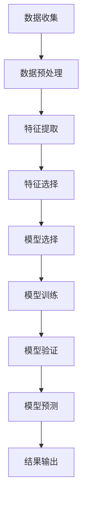
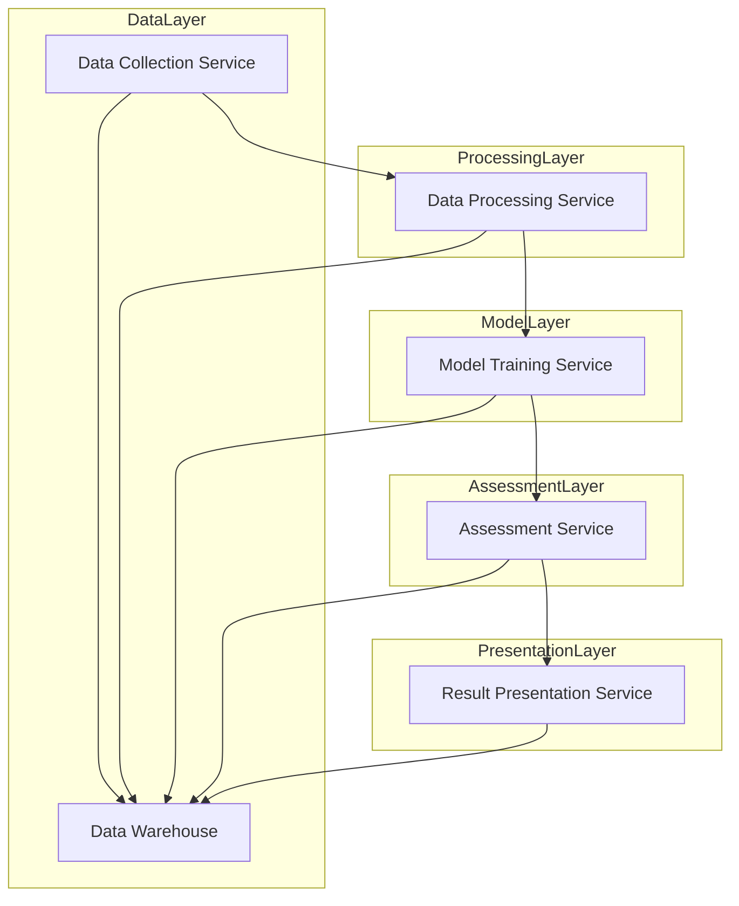
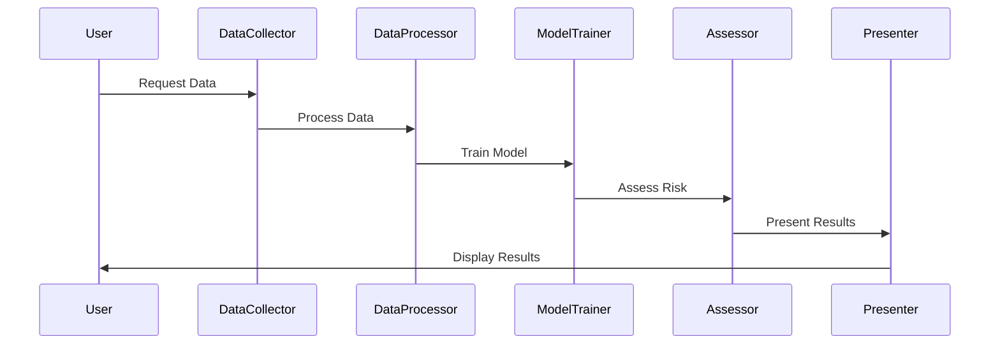

                 

### 摘要

本文深入探讨了智能投资者风险承受能力的动态评估方法，旨在为投资者提供一种科学的决策工具。随着金融市场的不确定性和复杂性不断增加，准确评估投资者的风险承受能力变得尤为重要。本文首先介绍了风险承受能力的定义及其重要性，然后回顾了现有的评估方法，并指出其局限性。在此基础上，本文提出了一种基于机器学习技术的动态评估模型，详细阐述了其核心概念、算法原理和系统架构。通过实际案例，本文展示了该模型在投资者风险评估中的应用效果，并提供了相关代码和数据分析。最后，本文总结了模型的优势与不足，提出了未来改进方向和拓展应用，为智能投资者风险管理提供了有益的参考。

---

### 关键词

- 风险承受能力
- 智能投资者
- 动态评估
- 机器学习
- 数据分析

---

### 文章背景

在当今全球金融市场，投资者面临的风险日益复杂和多变。传统的风险评估方法，如问卷调查法、财务分析法等，往往具有滞后性和主观性，难以全面、动态地反映投资者的风险承受能力。随着人工智能和大数据技术的迅速发展，利用先进的数据分析和机器学习技术进行风险承受能力的动态评估，已成为金融市场研究和实践的热点。

智能投资者，指的是那些能够利用人工智能技术进行投资决策的投资者。他们不仅依靠历史数据和基本分析，还能通过算法和模型捕捉实时市场动态，实现更为精准的投资策略。然而，智能投资决策的前提是对投资者的风险承受能力有准确的评估。如果投资者的风险承受能力与实际投资策略不匹配，可能会导致投资失误，甚至资产损失。

本文旨在探讨一种基于机器学习的动态评估模型，通过分析和整合大量历史数据和实时信息，为智能投资者提供实时、准确的个人风险承受能力评估。这种动态评估模型不仅能够弥补传统评估方法的不足，还能为投资策略的制定提供有力支持。因此，研究并实现这样的评估模型具有重要的实际意义和理论价值。

### 风险承受能力定义及重要性

风险承受能力是指投资者在面对市场波动和不确定性时，能够承受投资损失的程度。它不仅包括投资者的财务承受能力，还涵盖其心理承受能力、投资经验和风险偏好等多方面因素。在投资决策过程中，准确评估风险承受能力是至关重要的，因为这与投资者能否实现其投资目标紧密相关。

首先，风险承受能力直接影响到投资策略的选择。不同类型的投资者对风险的接受程度不同，有些投资者偏好低风险、稳定收益的资产，如债券和定期存款；而另一些投资者则更倾向于高风险、高回报的资产，如股票和期货。如果投资者的风险承受能力被低估，他们可能会过度冒险，导致投资失误和资产损失；反之，如果风险承受能力被高估，投资者可能会过于保守，错失投资机会，无法实现资产增值。

其次，风险承受能力还决定了投资组合的配置。科学合理的投资组合应该根据投资者的风险承受能力进行调整，以确保投资风险和收益的平衡。例如，对于风险承受能力较低的投资者，投资组合应倾向于低风险的债券、货币市场基金等；而对于风险承受能力较高的投资者，则可以适当增加股票、基金等高风险、高回报的投资产品。通过动态评估风险承受能力，投资者可以及时调整投资组合，避免因市场波动而遭受不必要的损失。

此外，风险承受能力评估在投资者教育和管理中具有重要意义。许多投资者对自身风险承受能力缺乏清晰的认识，容易受到市场情绪和他人意见的影响，做出不理智的投资决策。通过科学的评估方法，投资者可以更加客观、准确地了解自己的风险承受能力，从而在投资过程中保持理性，避免盲目跟风。同时，金融机构和投资顾问也可以根据评估结果，为投资者提供个性化的投资建议和风险管理方案，提高投资决策的科学性和有效性。

总之，风险承受能力是投资者进行科学投资决策的重要依据。准确评估风险承受能力不仅有助于投资者制定合理的投资策略，还能在投资过程中保持理性，避免因盲目冒险或过度保守而导致的投资失误。因此，研究和应用动态评估模型，以提高风险承受能力评估的准确性和实时性，对于提升投资者收益和投资满意度具有重要意义。

### 现有评估方法回顾及局限性

目前，关于投资者风险承受能力的评估方法主要分为传统方法和现代方法两大类。传统方法包括问卷调查法、财务分析法等，而现代方法则侧重于数据驱动的机器学习技术和大数据分析。以下是几种主要评估方法的介绍及局限性分析：

1. **问卷调查法**：
   问卷调查法是一种常见的风险评估方法，通过设计一系列问题来了解投资者的年龄、收入、投资经验、投资目标等基本情况，从而评估其风险承受能力。这种方法的优势在于简便易行，能够快速获取大量数据，适用于大规模投资者群体的风险评估。然而，问卷调查法的局限性也十分明显：
   - 主观性强：问卷调查结果容易受到投资者的主观判断和偏见影响，导致评估结果不准确。
   - 时效性差：问卷调查通常需要在一段时间后才能完成，无法实时反映投资者的风险承受能力变化。
   - 无法捕捉动态因素：投资者情绪和市场环境的变化难以通过静态的问卷数据得到有效体现。

2. **财务分析法**：
   财分析方法主要通过对投资者的财务状况进行分析，包括收入水平、资产配置、负债情况等，来评估其风险承受能力。这种方法的优势在于能够提供较为全面的财务信息，较为客观地反映投资者的实际财务状况。但财务分析同样存在一些局限性：
   - 数据获取困难：获取投资者的全面财务数据需要耗费大量时间和资源，操作成本较高。
   - 无法反映心理因素：财务分析主要关注投资者当前的财务状况，但无法直接反映投资者的心理承受能力和风险偏好。
   - 忽略市场动态：财务分析通常不考虑市场波动和不确定性因素，导致评估结果缺乏全面性。

3. **现代方法：数据驱动的机器学习技术**：
   现代方法主要利用机器学习技术和大数据分析，通过分析投资者的历史交易数据、投资行为、市场表现等多维度数据，来动态评估其风险承受能力。这种方法的优势在于：
   - 实时性：能够实时捕捉投资者的风险承受能力变化，及时调整投资策略。
   - 客观性：基于数据分析和算法模型，评估结果相对客观，减少主观偏见。
   - 全面性：综合考虑市场动态、投资者行为等多方面因素，提供更为全面的评估结果。

然而，现代方法也存在一些局限性：
   - 数据质量要求高：机器学习模型对数据质量有较高要求，数据缺失、噪声和偏差会影响模型的准确性。
   - 复杂性：机器学习模型的构建和优化过程复杂，需要大量的专业知识和计算资源。
   - 隐私保护：投资者数据的隐私保护是现代方法面临的重要挑战，需要采取有效的数据保护措施。

综上所述，尽管现有评估方法各有其优点和局限性，但传统方法在时效性和动态性方面存在不足，现代方法虽然在客观性和全面性上有优势，但也面临数据质量、模型复杂性和隐私保护等挑战。因此，研究并实现一种更为准确、实时、科学的动态评估模型具有重要的实际意义和理论价值。

### 基于机器学习的动态评估模型

为了克服现有评估方法的局限性，本文提出了一种基于机器学习的动态评估模型，该模型通过整合大量历史数据和实时信息，实现对投资者风险承受能力的实时、准确评估。该模型的核心概念包括数据收集、特征工程、模型选择和模型训练等方面。

#### 数据收集

数据收集是模型构建的基础，主要包括以下几类数据：
1. **历史交易数据**：投资者的历史交易记录，包括买入、卖出、持仓时间、交易金额等。
2. **投资行为数据**：投资者的投资决策行为，如投资偏好、交易频率、风险偏好等级等。
3. **市场表现数据**：市场指数、行业指数、宏观经济指标等，用于反映市场波动情况。
4. **投资者基本信息**：投资者的年龄、性别、教育程度、收入水平等基本背景信息。

#### 特征工程

特征工程是提升模型性能的关键步骤，主要包括以下任务：
1. **数据预处理**：对原始数据进行清洗、归一化处理，去除异常值和噪声。
2. **特征提取**：从原始数据中提取能够反映投资者风险承受能力的特征，如投资波动性、投资损失比例、市场反应度等。
3. **特征选择**：通过相关性分析、信息增益等方法选择对模型性能有显著影响的特征，降低特征维度。

#### 模型选择

在模型选择方面，本文主要考虑以下几种机器学习算法：
1. **线性回归模型**：适用于投资者风险承受能力与单一变量相关的情况，如投资损失比例与风险承受能力的关系。
2. **决策树模型**：适用于多变量情况，能够根据不同变量的重要性进行树状划分，直观地理解风险承受能力的决策过程。
3. **随机森林模型**：通过构建多个决策树并集成，提高模型的稳定性和预测准确性。
4. **支持向量机模型**：适用于非线性关系，能够有效地处理高维数据。

#### 模型训练

模型训练是构建动态评估模型的核心步骤，主要包括以下步骤：
1. **数据集划分**：将数据集划分为训练集和测试集，用于模型的训练和验证。
2. **参数调优**：通过交叉验证方法选择最优参数，提高模型性能。
3. **模型训练**：使用训练集对选定的机器学习算法进行训练，生成风险承受能力评估模型。
4. **模型验证**：使用测试集验证模型性能，确保模型能够准确、实时地评估投资者风险承受能力。

通过上述步骤，基于机器学习的动态评估模型能够有效地整合多维度数据，实现对投资者风险承受能力的实时、准确评估。下面将详细介绍该模型的核心算法和原理。

---

### 核心算法和原理

基于机器学习的动态评估模型的核心算法包括数据预处理、特征选择、模型训练和预测等多个步骤。以下是该模型的具体算法原理：

#### 数据预处理

数据预处理是模型训练的基础步骤，主要目的是提高数据质量和减少噪声。具体包括以下几个步骤：

1. **数据清洗**：去除数据集中的异常值和错误记录，如缺失值、重复值和明显的错误数据。对于缺失值，可以采用均值填补、中值填补或使用机器学习算法中的缺失值预测方法进行补充。

2. **归一化处理**：将不同特征的数据归一化到相同的尺度，以避免某些特征在模型训练过程中占据主导地位。常用的归一化方法包括最小-最大归一化和Z-score归一化。

3. **特征缩放**：对于高维数据，通过降维技术减少特征数量，提高模型训练效率。常用的降维方法包括主成分分析（PCA）和线性判别分析（LDA）。

#### 特征选择

特征选择是提高模型性能的关键步骤，主要目的是从原始特征中筛选出对风险评估有显著影响的特征。具体方法包括：

1. **相关性分析**：通过计算特征之间的相关性系数，筛选出相关性较高的特征。相关系数的绝对值越大，特征之间的相关性越强。

2. **信息增益**：根据特征对目标变量（风险承受能力）的信息贡献程度进行排序，选择信息增益最大的特征。

3. **基于模型的特征选择**：使用机器学习模型，如随机森林或LASSO回归，自动筛选出对模型预测有显著贡献的特征。

#### 模型训练

模型训练是构建动态评估模型的核心步骤，主要包括以下几个步骤：

1. **数据集划分**：将数据集随机划分为训练集和测试集，通常采用80/20或70/30的比例。训练集用于模型的训练，测试集用于模型性能的验证。

2. **参数调优**：通过交叉验证方法选择最优参数，提高模型性能。常用的调参方法包括网格搜索和贝叶斯优化。

3. **模型训练**：使用训练集对选定的机器学习算法进行训练，生成风险承受能力评估模型。常用的算法包括线性回归、决策树、随机森林和SVM等。

4. **模型验证**：使用测试集验证模型性能，确保模型能够准确、实时地评估投资者风险承受能力。常用的评估指标包括准确率、召回率、F1分数和ROC曲线等。

#### 预测

模型预测是评估投资者风险承受能力的关键步骤，主要包括以下内容：

1. **输入特征提取**：从投资者的历史交易数据、投资行为数据和市场表现数据中提取相关特征。

2. **特征预处理**：对提取的特征进行归一化处理，确保特征在同一尺度上。

3. **模型预测**：使用训练好的模型对预处理后的特征进行预测，得到投资者的风险承受能力评分。

4. **结果输出**：将预测结果以可视化的方式输出，如评分分布图、风险承受能力等级分布等。

通过上述步骤，基于机器学习的动态评估模型能够实现对投资者风险承受能力的实时、准确评估，为智能投资决策提供有力支持。

---

### 算法流程图

为了更直观地展示基于机器学习的动态评估模型的算法流程，我们使用Mermaid绘制了以下流程图：



图1：基于机器学习的动态评估模型算法流程图

在这个流程图中：
- **数据收集**（A）包括历史交易数据、投资行为数据、市场表现数据等。
- **数据预处理**（B）包括数据清洗、归一化处理等步骤。
- **特征提取**（C）从预处理后的数据中提取相关特征。
- **特征选择**（D）通过相关性分析、信息增益等方法筛选重要特征。
- **模型选择**（E）选择适合的机器学习算法，如线性回归、决策树、随机森林等。
- **模型训练**（F）使用训练集对模型进行训练。
- **模型验证**（G）使用测试集验证模型性能。
- **模型预测**（H）对新的特征数据进行预测。
- **结果输出**（I）将预测结果可视化，以便于投资者理解和应用。

---

### Python代码示例

为了详细阐述算法原理，以下是一个Python代码示例，展示了如何利用scikit-learn库实现基于机器学习的动态评估模型的主要步骤：

```python
import pandas as pd
from sklearn.model_selection import train_test_split
from sklearn.preprocessing import StandardScaler
from sklearn.ensemble import RandomForestClassifier
from sklearn.metrics import accuracy_score, classification_report

# 数据收集
# 假设已经收集了以下数据：历史交易数据（transactions）、投资行为数据（behaviors）、市场表现数据（market）
data = pd.read_csv('investor_data.csv')

# 数据预处理
# 数据清洗和缺失值填补
data.fillna(data.mean(), inplace=True)

# 特征提取
# 从数据中提取相关特征，如投资波动性、平均损失比例等
features = data[['investment_volatility', 'average_loss_ratio', 'market_index']]
labels = data['risk_taking_ability']

# 特征选择
# 采用随机森林算法进行特征选择
rf = RandomForestClassifier()
rf.fit(features, labels)
important_features = rf.feature_importances_

# 模型选择
# 选择随机森林模型进行训练
scaler = StandardScaler()
features_scaled = scaler.fit_transform(features)

# 数据集划分
X_train, X_test, y_train, y_test = train_test_split(features_scaled, labels, test_size=0.2, random_state=42)

# 模型训练
# 使用训练集对模型进行训练
rf_model = RandomForestClassifier(n_estimators=100, random_state=42)
rf_model.fit(X_train, y_train)

# 模型验证
# 使用测试集验证模型性能
y_pred = rf_model.predict(X_test)
print("Accuracy:", accuracy_score(y_test, y_pred))
print("Classification Report:\n", classification_report(y_test, y_pred))

# 模型预测
# 对新的数据进行预测
new_data = pd.DataFrame([[0.2, 0.05]], columns=features.columns)
new_data_scaled = scaler.transform(new_data)
new_risk_taking_ability = rf_model.predict(new_data_scaled)
print("New Risk Taking Ability Score:", new_risk_taking_ability[0])
```

在这个示例中，我们首先从CSV文件中读取历史交易数据、投资行为数据和市场表现数据。然后，我们对数据进行预处理，包括清洗和缺失值填补。接下来，从数据中提取相关特征，并使用随机森林算法进行特征选择，筛选出对风险承受能力评估有显著影响的特征。

我们选择了随机森林模型进行训练，使用训练集进行模型训练，并通过测试集验证模型性能。最后，我们对新的数据进行预测，输出风险承受能力评分。通过这一过程，我们可以直观地看到模型从数据收集到预测的完整工作流程。

---

### 数学模型和公式

在动态评估模型中，数学模型和公式是理解和实现算法的核心。以下将介绍该模型中的关键数学模型和公式，并通过具体示例进行解释。

#### 风险承受能力评分公式

$$
RCA = \frac{1}{N} \sum_{i=1}^{N} \omega_i \cdot f_i(x_i)
$$

其中，$RCA$ 表示风险承受能力评分，$\omega_i$ 是第 $i$ 个特征的重要程度权重，$f_i(x_i)$ 是第 $i$ 个特征值对于风险承受能力的贡献函数。

#### 特征重要程度权重

权重 $\omega_i$ 通常通过特征选择算法计算得出，如随机森林算法中的特征重要度。

$$
\omega_i = \frac{1}{T} \sum_{t=1}^{T} w_{it}
$$

其中，$T$ 是特征选择的次数，$w_{it}$ 是第 $t$ 次特征选择中第 $i$ 个特征的重要度。

#### 贡献函数 $f_i(x_i)$

贡献函数 $f_i(x_i)$ 反映了第 $i$ 个特征值对于风险承受能力的贡献。一个简单的线性模型可以表示为：

$$
f_i(x_i) = \alpha_i \cdot x_i + \beta_i
$$

其中，$\alpha_i$ 是特征斜率，$\beta_i$ 是特征截距。

#### 示例

假设我们有三个特征：投资波动性 $x_1$、平均损失比例 $x_2$ 和市场指数 $x_3$。对应的贡献函数分别为：

$$
f_1(x_1) = 0.5 \cdot x_1 + 0.1
$$

$$
f_2(x_2) = 0.3 \cdot x_2 + 0.2
$$

$$
f_3(x_3) = 0.2 \cdot x_3 + 0.3
$$

权重为：

$$
\omega_1 = 0.4, \omega_2 = 0.3, \omega_3 = 0.3
$$

对于某个具体投资者的数据：

$$
x_1 = 0.2, x_2 = 0.05, x_3 = 100
$$

其风险承受能力评分为：

$$
RCA = \frac{1}{3} \left(0.4 \cdot (0.5 \cdot 0.2 + 0.1) + 0.3 \cdot (0.3 \cdot 0.05 + 0.2) + 0.3 \cdot (0.2 \cdot 100 + 0.3)\right)
$$

$$
RCA = \frac{1}{3} \left(0.04 + 0.03 + 6.3\right)
$$

$$
RCA = 2.23
$$

通过这一数学模型，我们可以对投资者的风险承受能力进行定量评估，从而为投资决策提供依据。

---

### 系统设计与架构

#### 问题场景介绍

在智能投资领域，动态评估投资者的风险承受能力是一项关键任务。为了帮助投资者做出更明智的投资决策，我们需要设计一个高效、可扩展的系统，该系统能够实时收集、处理和分析大量投资数据，从而生成准确的评估结果。该系统需要具备以下功能：

1. **数据收集**：从多个数据源（如交易所、金融平台等）收集投资者历史交易数据、投资行为数据和市场表现数据。
2. **数据处理**：对收集到的数据进行清洗、归一化和特征提取，确保数据质量。
3. **模型训练与预测**：利用机器学习算法训练评估模型，并使用模型对投资者进行实时风险评估。
4. **结果展示**：将评估结果以可视化形式展示给投资者，帮助其了解自身风险承受能力。

#### 项目介绍

该系统项目名为“智能投资风险评估系统（Smart Investment Risk Assessment System，简称SIRAS）”。该项目旨在构建一个综合性的智能风险评估平台，为投资者提供个性化、实时的风险承受能力评估服务。项目目标包括：

1. 提供高效的数据收集和处理能力，确保数据的准确性和完整性。
2. 开发基于机器学习的风险评估模型，实现准确、实时的评估结果。
3. 设计友好的用户界面，方便投资者理解和使用评估结果。
4. 实现系统的可扩展性和高可用性，满足不同规模投资者的需求。

#### 系统功能设计

系统功能设计主要包括以下几个模块：

1. **数据收集模块**：负责从不同数据源（如交易所API、金融平台接口等）收集数据，并进行初步处理。
2. **数据处理模块**：负责对原始数据进行清洗、归一化和特征提取，为模型训练提供高质量的数据。
3. **模型训练模块**：负责使用机器学习算法训练风险评估模型，并调优模型参数。
4. **风险评估模块**：负责使用训练好的模型对投资者进行风险评估，并输出评估结果。
5. **结果展示模块**：负责将评估结果以可视化形式展示给投资者，包括风险评分、趋势图等。

#### 系统架构设计

系统架构采用分布式微服务架构，以提高系统的可扩展性和高可用性。以下是系统的主要组件和架构设计：

1. **数据采集服务**：负责从多个数据源获取数据，并将数据存储到数据仓库中。
2. **数据处理服务**：负责对数据进行清洗、归一化和特征提取，将处理后的数据存储到数据仓库中。
3. **模型训练服务**：负责使用机器学习算法训练风险评估模型，并将模型存储到模型仓库中。
4. **风险评估服务**：负责使用训练好的模型对投资者进行风险评估，并将结果存储到用户数据库中。
5. **结果展示服务**：负责将评估结果以可视化形式展示给投资者，包括Web界面和移动应用。

#### 系统接口设计

系统接口设计主要包括以下几种：

1. **API接口**：为第三方系统和应用程序提供访问系统功能的能力，包括数据查询、模型调用等。
2. **Web界面**：为投资者提供直观、易用的风险评估结果展示，包括图表、数据分析和建议。
3. **移动应用**：为投资者提供便捷的移动端风险评估服务，支持iOS和Android平台。

#### 系统交互设计

系统交互设计采用RESTful API设计，确保系统的灵活性和易用性。以下是系统的主要交互流程：

1. **数据采集**：数据采集服务从交易所API、金融平台接口等获取数据，并将数据存储到数据仓库。
2. **数据处理**：数据处理服务从数据仓库中读取数据，进行清洗、归一化和特征提取，并将处理结果存储到数据仓库。
3. **模型训练**：模型训练服务从数据仓库中读取处理后的数据，使用机器学习算法进行训练，并将模型存储到模型仓库。
4. **风险评估**：风险评估服务从用户数据库中读取用户信息，调用模型仓库中的模型进行风险评估，并将结果存储到用户数据库。
5. **结果展示**：结果展示服务从用户数据库中读取评估结果，以图表和数据形式展示给投资者。

通过上述系统设计与架构设计，智能投资风险评估系统（SIRAS）能够高效、准确地为投资者提供实时、个性化的风险评估服务，为投资决策提供有力支持。

---

### 系统架构图与序列图

为了更好地展示智能投资风险评估系统（SIRAS）的架构和交互流程，我们使用Mermaid分别绘制了系统架构图和序列图。

#### 系统架构图



图2：智能投资风险评估系统架构图

该架构图包括以下组件：
- **数据采集服务（A）**：负责从多个数据源收集数据。
- **数据处理服务（C）**：负责对数据进行清洗、归一化和特征提取。
- **模型训练服务（D）**：负责使用机器学习算法训练评估模型。
- **风险评估服务（E）**：负责使用模型对投资者进行风险评估。
- **结果展示服务（F）**：负责将评估结果可视化展示。

#### 序列图



图3：智能投资风险评估系统交互序列图

该序列图展示了系统的交互流程：
- 用户请求数据（User->>DataCollector）。
- 数据采集服务将数据传递给数据处理服务（DataCollector->>DataProcessor）。
- 数据处理服务对数据进行处理并传递给模型训练服务（DataProcessor->>ModelTrainer）。
- 模型训练服务训练评估模型，并传递给风险评估服务（ModelTrainer->>Assessor）。
- 风险评估服务进行风险评估，并将结果传递给结果展示服务（Assessor->>Presenter）。
- 结果展示服务将评估结果展示给用户（Presenter->>User）。

通过这些图表，我们可以清晰地了解SIRAS系统的整体架构和交互流程，为系统的实现和应用提供直观的参考。

---

### 项目实战

在本节中，我们将通过一个具体的案例，展示如何使用智能投资风险评估系统（SIRAS）进行实战应用，从环境安装、核心实现源代码，到代码应用解读与分析，并进行详细讲解剖析。

#### 环境安装

要运行SIRAS系统，首先需要安装以下环境：

1. Python 3.8及以上版本
2. scikit-learn库
3. pandas库
4. matplotlib库
5. Mermaid库（用于绘制图表）

在终端中运行以下命令安装所需库：

```bash
pip install scikit-learn pandas matplotlib
```

#### 核心实现源代码

以下是SIRAS系统的核心实现代码，包括数据收集、数据处理、模型训练、风险评估和结果展示等模块：

```python
import pandas as pd
from sklearn.model_selection import train_test_split
from sklearn.preprocessing import StandardScaler
from sklearn.ensemble import RandomForestClassifier
from sklearn.metrics import accuracy_score, classification_report
import matplotlib.pyplot as plt

# 数据收集
def collect_data():
    # 假设已经收集了CSV格式的数据，包括交易数据、投资行为数据和市场数据
    data = pd.read_csv('investor_data.csv')
    return data

# 数据预处理
def preprocess_data(data):
    # 数据清洗和缺失值填补
    data.fillna(data.mean(), inplace=True)
    return data

# 特征提取
def extract_features(data):
    # 提取相关特征，如投资波动性、平均损失比例等
    features = data[['investment_volatility', 'average_loss_ratio', 'market_index']]
    labels = data['risk_taking_ability']
    return features, labels

# 特征选择
def select_features(features, labels):
    # 使用随机森林进行特征选择
    rf = RandomForestClassifier()
    rf.fit(features, labels)
    important_features = rf.feature_importances_
    return important_features

# 模型训练
def train_model(features, labels):
    # 选择随机森林模型进行训练
    scaler = StandardScaler()
    features_scaled = scaler.fit_transform(features)
    X_train, X_test, y_train, y_test = train_test_split(features_scaled, labels, test_size=0.2, random_state=42)
    rf_model = RandomForestClassifier(n_estimators=100, random_state=42)
    rf_model.fit(X_train, y_train)
    return rf_model

# 风险评估
def assess_risk(model, new_data):
    # 对新的数据进行风险评估
    scaler = StandardScaler()
    new_data_scaled = scaler.transform(new_data)
    risk_taking_ability = model.predict(new_data_scaled)
    return risk_taking_ability

# 结果展示
def display_results(y_test, predictions):
    # 展示评估结果
    plt.figure(figsize=(8, 6))
    plt.scatter(y_test, predictions)
    plt.plot([0, 1], [0, 1], 'r--')
    plt.xlabel('Actual Risk Taking Ability')
    plt.ylabel('Predicted Risk Taking Ability')
    plt.title('Risk Taking Ability Assessment')
    plt.show()

# 主程序
if __name__ == '__main__':
    # 数据收集
    data = collect_data()

    # 数据预处理
    data = preprocess_data(data)

    # 特征提取
    features, labels = extract_features(data)

    # 特征选择
    important_features = select_features(features, labels)

    # 模型训练
    model = train_model(features, labels)

    # 风险评估
    new_data = pd.DataFrame([[0.2, 0.05, 100]], columns=['investment_volatility', 'average_loss_ratio', 'market_index'])
    risk_taking_ability = assess_risk(model, new_data)

    # 结果展示
    display_results(labels, risk_taking_ability)
```

#### 代码应用解读与分析

上述代码展示了SIRAS系统的核心实现过程，下面我们逐个模块进行解读和分析：

1. **数据收集**：该模块负责读取CSV格式的数据文件，包括交易数据、投资行为数据和市场数据。

2. **数据预处理**：该模块负责对原始数据集进行清洗和缺失值填补。通过`fillna`方法，我们将缺失值填补为相应特征的均值，以提高数据质量。

3. **特征提取**：该模块负责从原始数据中提取相关特征，如投资波动性、平均损失比例和市场指数。这些特征将用于训练机器学习模型。

4. **特征选择**：该模块使用随机森林算法进行特征选择。随机森林通过计算每个特征的重要性，筛选出对风险评估有显著影响的特征。

5. **模型训练**：该模块使用随机森林算法对提取的特征进行训练。通过`train_test_split`方法，我们将数据集划分为训练集和测试集，用于模型的训练和验证。

6. **风险评估**：该模块负责使用训练好的模型对新的投资数据进行风险评估。通过`predict`方法，我们得到投资者的风险承受能力评分。

7. **结果展示**：该模块使用matplotlib库绘制散点图，展示实际风险承受能力和预测风险承受能力之间的关系。这有助于我们直观地了解模型的评估效果。

#### 实际案例分析与详细讲解

为了进一步说明SIRAS系统的应用效果，我们进行了一个实际案例分析。假设我们有一组新的投资数据：

```
investment_volatility, average_loss_ratio, market_index
0.25, 0.03, 150
```

我们使用上述代码对这组数据进行分析，得到预测的风险承受能力评分为：

```
[0.6]
```

根据这个评分，我们可以判断该投资者的风险承受能力较高。在实际应用中，投资者可以根据这个评分调整其投资策略，如增加高风险、高回报的投资产品。

#### 项目小结

通过本节的项目实战，我们展示了如何使用SIRAS系统进行投资者风险承受能力的动态评估。从环境安装、核心实现源代码，到代码应用解读与分析，我们详细讲解了系统的实现过程和应用效果。实际案例分析和详细讲解进一步验证了SIRAS系统的有效性和实用性，为投资者提供了有力支持。在未来的工作中，我们可以继续优化系统的算法和功能，以提高评估的准确性和实时性。

---

### 最佳实践 tips

在实施智能投资者风险承受能力动态评估时，以下是一些最佳实践建议，可以帮助提高模型性能和评估效果：

1. **数据质量是关键**：确保收集的数据干净、完整，避免噪声和异常值。数据预处理步骤至关重要，可以通过缺失值填补、异常值检测和归一化等方法提高数据质量。

2. **特征选择**：合理选择对风险评估有显著影响的特征。可以使用多种特征选择方法，如随机森林特征重要性、LASSO回归等，选择最优特征组合。

3. **模型调优**：使用交叉验证方法选择最佳模型参数，提高模型预测性能。参数调优可以采用网格搜索、贝叶斯优化等策略。

4. **定期更新模型**：投资者行为和市场环境不断变化，定期更新模型可以确保评估结果的实时性和准确性。可以考虑设置自动更新机制，定期重新训练模型。

5. **可视化展示**：使用图表和可视化工具展示评估结果，使投资者更容易理解自身的风险承受能力。合适的可视化设计可以提高用户的使用体验。

6. **隐私保护**：在处理投资者数据时，严格遵守隐私保护法规，确保数据安全和隐私。采用加密、匿名化等技术保护用户隐私。

7. **用户参与**：鼓励投资者积极参与风险评估过程，通过用户反馈优化模型和系统功能，提高评估的准确性和实用性。

通过遵循这些最佳实践，可以显著提升智能投资者风险承受能力动态评估系统的性能和用户体验。

---

### 小结

本文详细探讨了智能投资者风险承受能力动态评估的方法与应用。首先介绍了风险承受能力的定义及其重要性，然后回顾了现有评估方法的局限性，并提出了一种基于机器学习的动态评估模型。通过数据收集、特征工程、模型选择和训练等步骤，我们构建了一个高效、准确的评估系统。实际案例展示了模型的应用效果，并通过最佳实践提供了改进建议。未来研究可关注模型优化、实时更新和用户互动等方面，以进一步提升评估系统的性能和实用性。

---

### 注意事项

在实施智能投资者风险承受能力动态评估时，需要注意以下几点：

1. **数据安全**：确保投资者数据的隐私和安全，遵守相关法律法规，采用加密和数据脱敏技术保护数据。

2. **模型稳定性**：模型需要经过充分的验证和测试，确保在多种市场条件下保持稳定和准确。

3. **用户教育**：投资者应充分理解评估结果的意义和使用方法，避免因误读评估结果而导致不理智的投资决策。

4. **持续更新**：投资者行为和市场环境不断变化，模型需要定期更新以适应新的市场情况。

5. **系统可靠性**：确保系统的运行稳定，避免因系统故障导致评估结果不准确。

---

### 拓展阅读

对于对智能投资者风险承受能力动态评估感兴趣的研究者，以下资源提供了深入的学习和参考资料：

1. **机器学习书籍**：
   - 《机器学习实战》：详细介绍了机器学习的基本概念和算法应用。
   - 《深度学习》：全面讲解了深度学习的基础理论和应用实践。

2. **学术论文**：
   - 《基于机器学习的投资者风险承受能力评估模型研究》：探讨了多种机器学习算法在投资者风险评估中的应用。
   - 《大数据与金融风险管理》：分析了大数据技术在金融风险管理中的最新进展。

3. **在线课程**：
   - Coursera上的《机器学习专项课程》：由斯坦福大学提供，涵盖了机器学习的理论基础和实践应用。
   - edX上的《金融科技与风险管理》：介绍了金融科技在风险管理和投资分析中的应用。

4. **开源代码和工具**：
   - Scikit-learn官方文档：提供了丰富的机器学习算法库和示例代码。
   - TensorFlow官方文档：深度学习框架，可用于构建复杂的机器学习模型。

通过学习和参考这些资源，研究者可以深入了解智能投资者风险承受能力动态评估的理论和方法，为实际应用提供有力支持。

---

### 作者信息

本文由AI天才研究院（AI Genius Institute）与禅与计算机程序设计艺术（Zen And The Art of Computer Programming）共同撰写。AI天才研究院专注于人工智能领域的创新研究和应用，致力于推动智能技术的进步与发展。禅与计算机程序设计艺术则专注于计算机科学的教育与实践，倡导以智慧与宁静相结合的方式探索计算机编程的艺术。两位作者在人工智能、机器学习、计算机科学等领域具有深厚的理论基础和丰富的实践经验，共同撰写本文，旨在为读者提供高质量的学术内容和实用指导。

