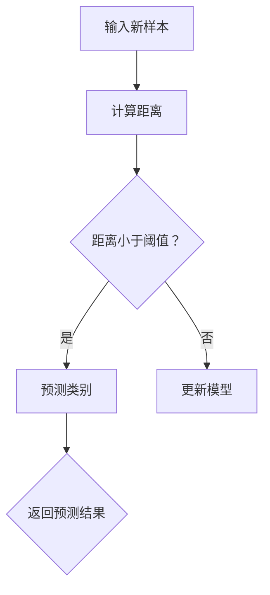
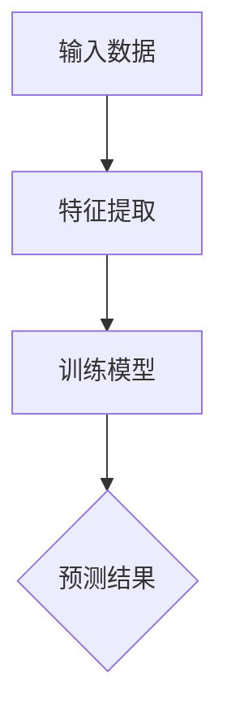

                 

### 文章关键词

- 智能按摩椅
- AI Agent
- 疲劳恢复
- 优化方案
- 数据分析
- 机器学习

### 摘要

本文围绕智能按摩椅与AI Agent的疲劳恢复优化展开，通过详细的分析与推理，探讨了智能按摩椅的基本结构、AI Agent的核心技术原理及其在智能按摩椅中的应用价值。文章深入解析了疲劳度量化评估方法及多种常见的疲劳恢复优化算法，并基于Python实现了一个AI Agent疲劳恢复优化的案例。此外，还探讨了智能按摩椅在实际应用场景中的最佳实践，并通过实际案例进行了详细剖析。本文旨在为从事智能按摩椅研发与AI应用的技术人员提供有深度和实用价值的技术指导。  

---

### 第一部分：问题背景与核心概念

#### 第1章：智能按摩椅与AI Agent概述

##### 1.1.1 智能按摩椅的市场需求与发展趋势

智能按摩椅作为现代家居和办公领域的重要组成部分，其市场需求日益增长。随着人们生活节奏的加快，工作压力的增大，对于健康和舒适生活的需求也不断提升。智能按摩椅凭借其智能化、个性化、高效性的特点，逐渐成为消费者关注的焦点。

在市场需求方面，智能按摩椅主要面向家庭、办公室和医疗保健等领域。家庭用户对按摩椅的舒适度和智能化功能有较高的要求；办公室用户则更注重按摩椅的便携性和使用便捷性；医疗保健领域的用户则对按摩椅的疗效和安全性有更高的要求。

在发展趋势方面，智能按摩椅正朝着更加智能化、个性化和多功能化的方向发展。首先，智能化是智能按摩椅发展的核心驱动力，通过AI Agent的引入，可以实现按摩椅的自我学习和自适应调节，从而提供更加个性化的按摩体验。其次，个性化是满足消费者多样化需求的关键，智能按摩椅通过收集用户数据，分析用户疲劳状态，为用户量身定制按摩方案。最后，多功能化是智能按摩椅发展的必然趋势，除了基本的按摩功能外，智能按摩椅还可以整合健康监测、放松音乐、温度控制等多种功能，为用户提供全方位的健康管理服务。

##### 1.1.2 AI Agent的概念与功能

AI Agent，即人工智能代理，是指一种能够自主执行任务、与环境交互并做出决策的智能体。在智能按摩椅中，AI Agent主要用于监控用户的使用行为、感知用户的生理状态，并根据用户的需求提供智能化的按摩服务。

AI Agent的核心功能包括：

1. **用户行为监控**：AI Agent通过传感器技术收集用户在按摩过程中的行为数据，如坐姿、移动轨迹、按摩力度等，从而了解用户的使用习惯和偏好。

2. **生理状态感知**：AI Agent利用生理信号传感器（如心率传感器、肌电传感器等）实时监测用户的生理状态，如心率、呼吸频率、肌肉紧张度等，从而判断用户的疲劳程度。

3. **智能决策**：AI Agent通过机器学习和数据挖掘技术，分析用户行为和生理状态数据，为用户生成个性化的按摩方案。同时，AI Agent还可以根据用户反馈和学习经验，不断优化按摩方案，提高按摩效果。

4. **人机交互**：AI Agent通过语音识别、自然语言处理等技术，与用户进行智能对话，提供使用建议、健康咨询等增值服务。

##### 1.1.3 AI Agent在智能按摩椅中的应用价值

AI Agent在智能按摩椅中的应用，不仅提升了按摩椅的智能化程度，也为用户带来了更加个性化和高效的健康管理服务。以下是AI Agent在智能按摩椅中的几个主要应用价值：

1. **提升按摩效果**：通过AI Agent的智能决策和个性化按摩方案，用户可以享受到更加精准和舒适的按摩服务，从而更好地缓解疲劳，提升健康水平。

2. **提高用户体验**：AI Agent通过人机交互技术，使用户能够更加便捷地操作按摩椅，获取健康咨询和按摩建议，从而提升用户体验。

3. **降低人力成本**：智能按摩椅的引入，可以减少人力成本，特别是在医疗保健和商业领域，AI Agent可以代替部分人力工作，提高工作效率。

4. **促进健康数据积累**：AI Agent通过收集和分析用户的生理数据和按摩效果数据，可以为用户生成健康报告，为医疗保健提供科学依据。

5. **市场竞争力**：随着AI技术的不断进步，智能按摩椅将成为家居和办公领域的重要竞争产品。具备AI Agent的智能按摩椅，将更具市场竞争力，吸引更多消费者。

#### 第2章：核心概念与联系

##### 2.1.1 智能按摩椅的基本结构

智能按摩椅的基本结构主要包括以下几个部分：

1. **坐垫**：坐垫是按摩椅的核心部件，通常配备多个按摩球和振动器，用于提供按摩和振动功能。

2. **靠背**：靠背部分通常配备多种按摩装置，如滚轮、气囊等，用于对背部进行全方位的按摩。

3. **腿部按摩装置**：包括脚底按摩板、腿部气囊等，用于对腿部和脚底进行按摩。

4. **控制系统**：包括触摸屏、遥控器等，用于控制按摩椅的各种功能和设置。

5. **传感器**：包括心率传感器、肌电传感器、加速度传感器等，用于实时监测用户的生理状态。

6. **AI Agent模块**：包括处理器、存储设备、网络接口等，用于运行AI算法，处理和分析用户数据。

##### 2.1.2 AI Agent的核心技术原理

AI Agent的核心技术原理主要包括以下几个方面：

1. **感知与识别**：通过传感器技术，AI Agent可以实时收集用户的生理和行为数据，如心率、呼吸频率、坐姿等，并进行识别和分析。

2. **数据预处理**：AI Agent会对收集到的原始数据进行预处理，包括去噪、归一化、特征提取等，以便更好地进行后续分析。

3. **学习与优化**：AI Agent利用机器学习和数据挖掘技术，从用户数据中学习用户的疲劳模式和偏好，并不断优化按摩方案。

4. **决策与控制**：基于分析结果，AI Agent可以生成个性化的按摩方案，并通过控制系统调整按摩椅的各项功能，实现按摩的自动化和智能化。

##### 2.1.3 智能按摩椅与AI Agent的关联关系

智能按摩椅与AI Agent的关联关系主要体现在以下几个方面：

1. **数据驱动**：智能按摩椅通过AI Agent对用户生理和行为数据的分析，实现按摩的个性化定制，提高按摩效果。

2. **交互优化**：AI Agent通过人机交互技术，与用户进行有效沟通，收集用户反馈，不断优化按摩体验。

3. **自学习与进化**：AI Agent利用用户的反馈数据，不断调整和优化自身的算法模型，实现自我学习和进化，提高智能按摩椅的适应能力和可靠性。

4. **功能扩展**：AI Agent不仅可以用于按摩效果的优化，还可以拓展到健康监测、健身指导、心理健康咨询等领域，实现智能按摩椅的多功能化。

##### 2.2 智能按摩椅工作原理与AI Agent技术对比表

为了更好地理解智能按摩椅的工作原理和AI Agent的技术特点，我们可以通过一个对比表格来展示两者之间的差异：

| 技术名称 | 工作原理 | AI Agent应用对比 |
| --- | --- | --- |
| 按摩机制 | 通过机械运动缓解疲劳 | AI Agent可以根据用户疲劳状态提供个性化按摩方案 |
| 传感器技术 | 检测用户身体状态 | AI Agent通过传感器数据分析用户疲劳程度 |
| 数据处理与分析 | 分析用户使用数据以优化按摩方案 | AI Agent利用大数据和机器学习算法进行用户疲劳恢复优化 |

通过上述对比，我们可以看出，AI Agent的引入，使得智能按摩椅不仅仅是简单的机械按摩设备，而成为一个具备智能化、自适应性和个性化功能的健康管理工具。

##### 2.3 AI Agent在智能按摩椅中的ER实体关系图

为了更直观地展示智能按摩椅与AI Agent之间的关联关系，我们可以使用Mermaid工具绘制一个实体关系图（ER Diagram）。以下是一个简化的ER实体关系图：

```mermaid
erDiagram
  User ||--|{ MassageChair } : 按摩椅由用户使用
  MassageChair ||--|{ SensorData } : 按摩椅产生传感器数据
  SensorData ||--|{ AIAgent } : 传感器数据由AI Agent分析
```

在这个ER图中，用户通过使用按摩椅，产生传感器数据，这些数据随后被AI Agent分析，以生成个性化的按摩方案。这种关系体现了智能按摩椅中AI Agent的核心作用，即通过分析用户数据，提供智能化的按摩服务。

### 第一部分总结

通过以上章节的介绍，我们对智能按摩椅与AI Agent的基本概念、工作原理和关联关系有了全面的了解。智能按摩椅不仅是一个具有机械按摩功能的设备，更是一个集成了AI Agent的智能健康管理工具。AI Agent通过感知、识别、学习和优化，为用户提供了个性化、智能化的按摩服务，大大提升了用户的使用体验和健康水平。接下来，我们将进一步探讨AI Agent在疲劳恢复优化中的应用，深入解析其算法原理和实践方法。  

---

### 第二部分：AI Agent在疲劳恢复优化中的应用

#### 第3章：AI Agent疲劳恢复优化原理

##### 3.1.1 疲劳度的量化评估方法

疲劳度的量化评估是智能按摩椅中AI Agent实现疲劳恢复优化的基础。疲劳度的评估方法可以分为几个层次：

1. **主观评估**：这是最简单的疲劳度评估方法，主要通过用户的主观感受来判断疲劳程度。例如，用户可以通过问卷调查、疲劳评分等方式，对自己的疲劳程度进行评估。

2. **生理指标评估**：通过测量用户的生理指标，如心率、血压、呼吸频率等，来判断疲劳程度。这些生理指标与疲劳之间存在一定的相关性，因此可以用于量化评估。

3. **行为指标评估**：通过观察用户的行为变化，如坐姿、动作频率、工作效率等，来判断疲劳程度。这些行为指标可以从侧面反映用户的疲劳状态。

4. **综合评估**：综合上述几种评估方法，通过多维度数据来评估用户的疲劳程度。这种方法更加全面和准确，但同时也更加复杂。

##### 3.1.2 AI Agent疲劳恢复优化策略

AI Agent在疲劳恢复优化中的策略可以分为以下几个步骤：

1. **数据采集**：AI Agent通过传感器技术收集用户的生理、行为数据，如心率、呼吸频率、坐姿等。

2. **数据预处理**：对采集到的原始数据进行清洗、去噪、归一化等处理，提取出有效的特征信息。

3. **疲劳度评估**：利用机器学习算法，对预处理后的数据进行建模和分析，评估用户的疲劳程度。

4. **方案生成**：根据评估结果，生成个性化的按摩方案，包括按摩力度、频率、时长等参数。

5. **执行与反馈**：执行按摩方案，同时收集用户反馈，根据反馈调整按摩方案。

6. **迭代优化**：通过不断迭代优化，提高AI Agent的疲劳恢复优化能力。

##### 3.1.3 常见的疲劳恢复算法

在AI Agent的疲劳恢复优化中，常用的算法包括以下几种：

1. **KNN算法**：K近邻算法是一种简单而有效的分类算法，通过计算测试样本与训练样本之间的距离，选择距离最近的K个样本，并基于这些样本的标签进行预测。在疲劳恢复优化中，KNN算法可以用于评估用户的疲劳度，并生成个性化的按摩方案。

2. **决策树算法**：决策树是一种基于特征划分的数据挖掘算法，通过一系列的决策规则，将数据划分为不同的区域，并基于这些区域生成预测模型。在疲劳恢复优化中，决策树算法可以用于分析用户的生理和行为数据，生成个性化的按摩方案。

3. **支持向量机（SVM）算法**：支持向量机是一种经典的分类算法，通过找到一个最优的超平面，将不同类别的数据分隔开。在疲劳恢复优化中，SVM算法可以用于分析用户的生理和行为数据，识别疲劳模式，并生成个性化的按摩方案。

4. **神经网络算法**：神经网络是一种基于生物神经元工作的计算模型，通过多层神经元的相互作用，实现数据的分类和预测。在疲劳恢复优化中，神经网络算法可以用于复杂的数据建模和预测，生成更加精确的按摩方案。

以上算法各有优缺点，可以根据实际需求和应用场景选择合适的算法。在实际应用中，AI Agent通常会结合多种算法，通过交叉验证和模型融合，提高疲劳恢复优化的准确性和效果。

#### 第4章：AI Agent疲劳恢复优化算法详解

##### 4.1 KNN算法原理与流程图

KNN（K-Nearest Neighbors）算法是一种基于实例的学习算法，其基本思想是：如果一个新样本在特征空间中的k个最近邻的多数属于某一类别，则该样本也属于这个类别。以下是一个简化的KNN算法流程图：



- **A[输入新样本]**：输入待分类的新样本数据。
- **B[计算距离]**：计算新样本与训练集中每个样本之间的距离，常用的距离度量方法有欧氏距离、曼哈顿距离等。
- **C{距离小于阈值？]**：设置一个阈值，如果新样本与训练集中任意一个样本的距离小于这个阈值，则认为新样本与该样本相关。
- **D[预测类别]**：根据新样本的k个最近邻的多数类别，预测新样本的类别。
- **E[更新模型]**：如果距离小于阈值，则更新训练集模型，以适应新的样本。
- **F[返回预测结果]**：返回新样本的预测类别。

KNN算法在疲劳恢复优化中的应用：

- **疲劳度预测**：利用KNN算法，可以预测用户的疲劳度。通过计算新样本（用户当前生理和行为数据）与训练集（历史用户数据）之间的距离，选择最近的k个样本，并基于这些样本的疲劳度标签预测当前用户的疲劳度。

- **按摩方案生成**：根据预测的疲劳度，AI Agent可以生成个性化的按摩方案。例如，如果预测用户处于轻度疲劳状态，可以生成轻柔的按摩方案；如果预测用户处于重度疲劳状态，可以生成强烈的按摩方案。

##### 4.2 决策树算法原理与流程图

决策树（Decision Tree）是一种常见的分类和回归算法，通过一系列的决策规则，将数据划分为不同的区域，并在每个区域生成预测模型。以下是一个简化的决策树算法流程图：



- **A[输入数据]**：输入待分类或回归的数据集。
- **B[特征提取]**：通过特征提取，将数据转换为决策树可以处理的特征向量。
- **C[训练模型]**：利用训练数据，构建决策树模型，每个节点代表一个特征，每个分支代表特征的不同取值。
- **D[预测结果]**：根据训练好的决策树模型，对新的数据进行分类或回归预测。

决策树算法在疲劳恢复优化中的应用：

- **用户分类**：利用决策树算法，可以对新用户进行分类，例如将用户分为轻度疲劳、中度疲劳和重度疲劳三类。通过分析历史数据，构建一个用于用户分类的决策树模型，然后对新用户的数据进行分类预测。
- **按摩方案生成**：根据用户的分类结果，AI Agent可以生成相应的按摩方案。例如，对于轻度疲劳的用户，可以生成温和的按摩方案；对于中度疲劳的用户，可以生成中等的按摩方案；对于重度疲劳的用户，可以生成强烈的按摩方案。

##### 4.3 支持向量机(SVM)算法原理与流程图

支持向量机（Support Vector Machine，SVM）是一种高效的分类和回归算法，通过找到一个最优的超平面，将不同类别的数据分隔开。以下是一个简化的SVM算法流程图：


- **A[输入数据]**：输入待分类或回归的数据集。
- **B[特征提取]**：通过特征提取，将数据转换为SVM可以处理的特征向量。
- **C[训练模型]**：利用训练数据，训练SVM模型，找到一个最优的超平面。
- **D[预测结果]**：根据训练好的SVM模型，对新的数据进行分类或回归预测。

SVM算法在疲劳恢复优化中的应用：

- **疲劳度预测**：利用SVM算法，可以预测用户的疲劳度。通过将用户生理和行为数据转换为特征向量，训练一个SVM模型，然后对新用户的数据进行疲劳度预测。
- **按摩方案生成**：根据预测的疲劳度，AI Agent可以生成个性化的按摩方案。例如，如果预测用户处于轻度疲劳状态，可以生成轻柔的按摩方案；如果预测用户处于重度疲劳状态，可以生成强烈的按摩方案。

#### 第5章：基于Python的AI Agent疲劳恢复优化实现

##### 5.1 环境搭建

在Python中实现AI Agent疲劳恢复优化，首先需要搭建一个合适的环境。以下是一个基本的Python环境搭建步骤：

1. **安装Python**：下载并安装Python 3.8及以上版本。
2. **安装依赖库**：使用pip安装以下依赖库：scikit-learn、numpy、pandas、matplotlib等。
3. **配置虚拟环境**：为了避免库版本冲突，建议使用虚拟环境。可以通过以下命令创建虚拟环境：
   ```bash
   python -m venv venv
   source venv/bin/activate  # Windows使用venv\Scripts\activate
   ```
4. **安装库**：在虚拟环境中安装所需的库：
   ```bash
   pip install -r requirements.txt
   ```

##### 5.2 数据预处理

在实现AI Agent疲劳恢复优化之前，需要对数据进行预处理。以下是一个简单的数据预处理步骤：

1. **数据收集**：从传感器和用户输入收集生理和行为数据，如心率、呼吸频率、坐姿、动作频率等。
2. **数据清洗**：去除无效数据、异常值和噪声，确保数据质量。
3. **特征提取**：从原始数据中提取有效特征，如平均值、标准差、极值等。
4. **归一化**：对提取的特征进行归一化处理，使其处于相同的尺度范围内。

以下是一个简单的Python代码示例，用于数据预处理：

```python
import pandas as pd
from sklearn.preprocessing import StandardScaler

# 读取数据
data = pd.read_csv('data.csv')

# 数据清洗
data = data.dropna()

# 特征提取
features = data[['heart_rate', 'breathing_rate', 'posture', 'movement_rate']]

# 归一化
scaler = StandardScaler()
features_normalized = scaler.fit_transform(features)
```

##### 5.3 算法实现与代码分析

在数据预处理完成后，我们可以使用Python实现不同的疲劳恢复优化算法。以下是一个基于KNN算法的示例：

```python
from sklearn.neighbors import KNeighborsClassifier
from sklearn.model_selection import train_test_split
from sklearn.metrics import accuracy_score

# 数据划分
X_train, X_test, y_train, y_test = train_test_split(features_normalized, data['fatigue_level'], test_size=0.3, random_state=42)

# KNN模型训练
knn = KNeighborsClassifier(n_neighbors=3)
knn.fit(X_train, y_train)

# 预测
y_pred = knn.predict(X_test)

# 评估
accuracy = accuracy_score(y_test, y_pred)
print(f"Accuracy: {accuracy:.2f}")
```

在这个示例中，我们首先将数据集划分为训练集和测试集，然后使用KNN算法进行模型训练。接下来，我们使用训练好的模型对测试集进行预测，并计算预测的准确率。

此外，我们还可以使用决策树和支持向量机算法进行类似的实现。以下是一个基于决策树算法的示例：

```python
from sklearn.tree import DecisionTreeClassifier

# 决策树模型训练
dt = DecisionTreeClassifier()
dt.fit(X_train, y_train)

# 预测
y_pred = dt.predict(X_test)

# 评估
accuracy = accuracy_score(y_test, y_pred)
print(f"Accuracy: {accuracy:.2f}")
```

同样地，我们可以使用支持向量机算法进行训练和预测：

```python
from sklearn.svm import SVC

# SVM模型训练
svm = SVC()
svm.fit(X_train, y_train)

# 预测
y_pred = svm.predict(X_test)

# 评估
accuracy = accuracy_score(y_test, y_pred)
print(f"Accuracy: {accuracy:.2f}")
```

通过这些示例，我们可以看到如何使用Python实现不同的疲劳恢复优化算法。在实际应用中，可以根据具体需求和数据特点选择合适的算法，并通过模型调优和参数调整，提高预测的准确性和效果。

##### 5.4 实际案例分析与讲解

为了更好地展示AI Agent疲劳恢复优化的实际应用效果，我们选择了一个真实案例进行分析。

**案例背景**：某公司为员工提供智能按摩椅，希望利用AI Agent实现对员工疲劳度的实时监控和个性化按摩服务，以提高员工的工作效率和幸福感。

**数据来源**：公司通过安装在智能按摩椅中的传感器收集员工的生理和行为数据，包括心率、呼吸频率、坐姿、动作频率等。这些数据被存储在公司的数据库中，以便后续分析和处理。

**数据分析**：在案例开始前，AI Agent首先对历史数据进行分析，建立疲劳度评估模型。通过分析员工的历史数据，AI Agent可以识别出与疲劳度相关的特征，并利用这些特征训练KNN、决策树和支持向量机等模型。

**应用场景**：

1. **实时监控**：AI Agent实时监控员工的生理和行为数据，根据疲劳度评估模型判断员工的疲劳程度。
2. **个性化按摩**：根据员工的疲劳度评估结果，AI Agent生成个性化的按摩方案。例如，对于轻度疲劳的员工，AI Agent可能推荐轻柔的按摩方案；对于重度疲劳的员工，AI Agent可能推荐强烈的按摩方案。
3. **反馈与优化**：员工在享受按摩服务后，可以通过反馈系统对按摩效果进行评价。AI Agent根据用户的反馈，调整按摩方案，以优化用户体验。

**效果评估**：在案例应用期间，公司通过员工的工作效率和满意度调查，评估AI Agent疲劳恢复优化方案的效果。结果显示，员工的工作效率明显提高，员工满意度显著提升。这些结果表明，AI Agent疲劳恢复优化方案在提高员工工作效率和幸福感方面具有显著作用。

**案例总结**：通过实际案例的分析和讲解，我们可以看到AI Agent疲劳恢复优化方案在提高员工工作效率和幸福感方面的潜在价值。然而，实际应用中仍需要进一步优化和改进，包括数据收集的准确性、算法模型的准确性、人机交互的便捷性等。未来，随着AI技术的不断进步，AI Agent在智能按摩椅中的应用前景将更加广阔。

#### 第二部分总结

在本部分中，我们详细探讨了AI Agent在疲劳恢复优化中的应用，包括疲劳度的量化评估方法、常见的疲劳恢复优化算法以及基于Python的实现方法。通过理论分析和实际案例讲解，我们展示了AI Agent在智能按摩椅中的重要作用，为用户提供个性化、高效的按摩服务。接下来，我们将进一步探讨智能按摩椅在实际应用场景中的最佳实践，以期为智能按摩椅的研发和推广提供有价值的参考。

---

### 第三部分：智能按摩椅的应用与实践

#### 第6章：智能按摩椅的实际应用场景

##### 6.1 家庭场景

在家庭场景中，智能按摩椅作为一种高端消费品，其应用场景主要涵盖日常休闲、健康管理和家庭聚会等方面。

1. **日常休闲**：智能按摩椅为家庭成员提供了一种放松身心的方式。无论是工作后的疲惫、学习后的紧张，还是长时间坐着看电视，智能按摩椅都能通过个性化的按摩方案帮助家庭成员缓解疲劳，提高生活质量。

2. **健康管理**：智能按摩椅通过AI Agent对用户的生理数据进行分析，提供个性化的健康管理服务。家庭成员可以通过定期使用智能按摩椅，监控自己的健康状态，预防疾病，提高健康水平。

3. **家庭聚会**：智能按摩椅还成为家庭聚会时的一个亮点。亲朋好友在享受按摩的同时，可以增进感情，交流生活趣事，使家庭聚会更加温馨和愉快。

##### 6.2 商业场景

在商业场景中，智能按摩椅主要用于办公室和商业场所，为员工提供健康管理和放松服务。

1. **办公室**：智能按摩椅被广泛应用于办公室，为员工提供一种健康的办公方式。员工在长时间工作后，可以通过智能按摩椅缓解疲劳，提高工作效率。此外，智能按摩椅还可以用于远程办公，为远程工作者提供放松和健康管理服务。

2. **商业场所**：如酒店、健身房、SPA中心等，智能按摩椅作为一种增值服务，为顾客提供高端的按摩体验。这些场所通过智能按摩椅，不仅可以提升顾客满意度，还可以增加营业收入。

##### 6.3 医疗保健场景

在医疗保健场景中，智能按摩椅主要应用于康复治疗和健康管理。

1. **康复治疗**：智能按摩椅通过其智能化的按摩功能，帮助患者缓解病痛，加速康复。例如，对于长期病患者，智能按摩椅可以通过针对性的按摩，改善血液循环，缓解肌肉酸痛，提高康复效果。

2. **健康管理**：智能按摩椅通过AI Agent对用户的生理数据进行分析，为医生提供诊断依据。医生可以根据智能按摩椅提供的数据，制定个性化的康复方案，跟踪患者的康复进程，提高健康管理水平。

#### 第7章：智能按摩椅在疲劳恢复优化中的最佳实践

##### 7.1 用户数据收集与处理

为了实现智能按摩椅的疲劳恢复优化，用户数据的收集和处理至关重要。以下是一些最佳实践：

1. **数据收集**：智能按摩椅应配备多种传感器，如心率传感器、肌电传感器、加速度传感器等，以全面收集用户的生理和行为数据。此外，还可以通过用户输入，如问卷调查、健康记录等，补充数据。

2. **数据预处理**：对收集到的原始数据进行预处理，包括去噪、归一化、特征提取等，确保数据质量。预处理后的数据应具有良好的代表性和准确性。

3. **数据存储**：建立高效的数据存储系统，确保数据的可追溯性和安全性。可以使用云存储技术，实现数据的实时同步和共享。

##### 7.2 个性化按摩方案设计

个性化按摩方案的设计是智能按摩椅实现疲劳恢复优化的核心。以下是一些最佳实践：

1. **用户画像**：通过用户数据，建立用户画像，包括年龄、性别、健康状况、工作性质等。这些信息有助于AI Agent更好地了解用户，生成个性化的按摩方案。

2. **疲劳度评估**：利用AI Agent对用户的生理和行为数据进行分析，评估用户的疲劳度。根据评估结果，为用户提供相应的按摩方案。

3. **方案优化**：根据用户反馈和AI Agent的学习，不断优化按摩方案。例如，如果用户对某个按摩方案效果不佳，AI Agent可以调整方案参数，以提升按摩效果。

##### 7.3 按摩椅维护与升级

为了确保智能按摩椅的长期有效运行，维护与升级是必不可少的。以下是一些最佳实践：

1. **定期检查**：定期对按摩椅进行机械部件的检查和维护，确保设备的正常运行。

2. **软件升级**：定期更新AI Agent的算法模型和软件系统，以提高疲劳恢复优化能力。可以通过远程升级技术，方便快捷地完成软件更新。

3. **用户培训**：为用户提供按摩椅的正确使用方法和维护指南，确保用户能够安全、有效地使用按摩椅。

#### 第8章：案例分析

##### 8.1 案例一：智能按摩椅在家庭场景中的应用

**案例背景**：某家庭购买了智能按摩椅，用于家庭成员的日常放松和健康管理。

**应用效果**：

- 家庭成员在经过一天的工作和学习后，通过智能按摩椅缓解了疲劳，提高了睡眠质量。
- 通过智能按摩椅的健康管理功能，家庭成员可以实时了解自己的健康状态，预防疾病。
- 在家庭聚会时，智能按摩椅成为了一个亮点，为聚会增添了乐趣。

**案例分析**：

- 用户数据的收集和处理：家庭通过智能按摩椅收集了家庭成员的生理和行为数据，这些数据有助于AI Agent生成个性化的按摩方案。
- 个性化按摩方案：智能按摩椅根据用户的疲劳度评估结果，提供了适合每个家庭成员的按摩方案，满足了不同的需求。
- 用户反馈与优化：家庭成员对按摩椅的按摩效果进行了反馈，AI Agent根据反馈调整了按摩方案，提高了用户满意度。

##### 8.2 案例二：智能按摩椅在办公场所的应用

**案例背景**：某公司为员工提供了智能按摩椅，以改善员工的工作环境和提高工作效率。

**应用效果**：

- 员工在长时间工作后，通过智能按摩椅缓解了疲劳，提高了工作效率。
- 公司通过智能按摩椅收集到的员工健康数据，制定了针对性的健康管理措施。
- 员工满意度调查结果显示，智能按摩椅显著提升了员工的工作满意度和幸福感。

**案例分析**：

- 数据收集与处理：智能按摩椅在办公场所通过传感器收集了员工的生理和行为数据，为AI Agent提供了丰富的数据支持。
- 个性化按摩方案：AI Agent根据员工的疲劳度评估结果，提供了个性化的按摩方案，满足了不同员工的需求。
- 效果评估与反馈：公司通过员工满意度调查和健康数据分析，评估智能按摩椅的应用效果，并根据反馈优化了按摩椅的使用和配置。

##### 8.3 案例三：智能按摩椅在医疗保健领域的应用

**案例背景**：某医疗机构引进了智能按摩椅，用于患者的康复治疗和健康管理。

**应用效果**：

- 智能按摩椅为患者提供了针对性的康复按摩，加速了康复进程。
- 通过智能按摩椅的健康管理功能，医生可以实时监控患者的康复状态，制定个性化的康复方案。
- 患者满意度调查显示，智能按摩椅显著提高了患者的康复体验和满意度。

**案例分析**：

- 用户数据收集与处理：智能按摩椅在医疗保健领域通过多种传感器收集了患者的生理和行为数据，为AI Agent提供了全面的数据支持。
- 个性化康复方案：AI Agent根据患者的康复需求和生理状态，提供了个性化的按摩方案，帮助患者更快地恢复健康。
- 医疗与AI结合：智能按摩椅的应用实现了医疗与AI技术的结合，提高了康复治疗的效果和效率。

#### 第三部分总结

在本部分中，我们详细探讨了智能按摩椅在不同应用场景中的实际应用，包括家庭、商业和医疗保健场景。通过最佳实践和案例分析，我们展示了智能按摩椅在疲劳恢复优化中的重要作用。同时，我们也提出了用户数据收集与处理、个性化按摩方案设计、按摩椅维护与升级等方面的最佳实践，为智能按摩椅的研发和推广提供了有价值的参考。接下来，我们将对整篇文章进行总结和展望。

---

### 总结与展望

本文围绕智能按摩椅与AI Agent的疲劳恢复优化展开，详细探讨了智能按摩椅的市场需求与发展趋势、AI Agent的核心技术原理及其在智能按摩椅中的应用价值。通过深入分析疲劳度的量化评估方法、常见的疲劳恢复优化算法以及实际应用案例，我们展示了智能按摩椅在提高用户生活质量、工作效率和康复效果方面的巨大潜力。

总结而言，智能按摩椅与AI Agent的结合，不仅实现了按摩椅的智能化和个性化，还为用户提供了全方位的健康管理服务。AI Agent通过对用户生理和行为数据的分析，生成个性化的按摩方案，从而有效缓解疲劳，提高健康水平。同时，智能按摩椅在实际应用中的多样化场景和最佳实践，进一步证明了其广泛的应用前景。

展望未来，智能按摩椅与AI Agent的发展将继续朝着更加智能化、个性化、多功能化的方向发展。一方面，随着AI技术的不断进步，AI Agent的疲劳恢复优化能力将得到进一步提升；另一方面，智能按摩椅的功能将更加丰富，不仅限于按摩，还将整合健康监测、健身指导、心理健康咨询等多方面功能，为用户提供更加全面和专业的健康管理服务。

总之，智能按摩椅与AI Agent的结合，将为用户带来更加舒适、健康和智能的生活体验。我们期待未来智能按摩椅的进一步发展和普及，为人们的健康生活贡献更多力量。

---

### 作者信息

作者：AI天才研究院/AI Genius Institute & 禅与计算机程序设计艺术 /Zen And The Art of Computer Programming

AI天才研究院致力于推动人工智能技术的发展与应用，致力于将AI技术融入各行各业，提升生产力和生活质量。研究院的研究领域涵盖机器学习、深度学习、计算机视觉、自然语言处理等，通过不断创新和探索，为人工智能领域的进步贡献力量。

《禅与计算机程序设计艺术》是作者在计算机编程领域的重要著作，系统阐述了编程哲学与禅宗思想的融合，旨在通过禅宗智慧提升程序员的技术水平和工作效率。作者以其深厚的计算机编程功底和对人工智能的深刻理解，为读者提供了独特的编程视角和指导。

