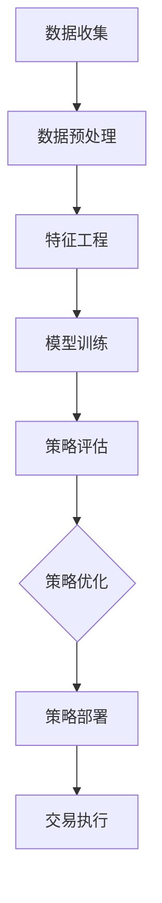
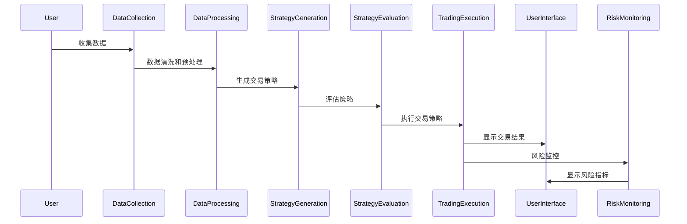
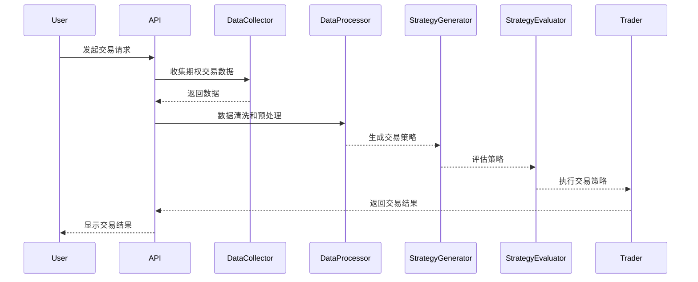

                 

### 第1章：智能期权交易策略生成器概述

#### 1.1 期权交易的基本概念

期权交易，又称权利金交易，是一种金融衍生品交易。期权赋予买方在未来某个特定时间以约定价格买入或卖出某种资产的权利，但并非义务。期权交易可以分为两种基本类型：看涨期权（Call Option）和看跌期权（Put Option）。看涨期权给予买方在未来某一时间以固定价格购买资产的权利；而看跌期权则赋予买方在未来某一时间以固定价格出售资产的权利。

期权交易的核心要素包括：

1. **行权价格（Strike Price）**：期权买方行权时需要支付的价格。
2. **到期日（Expiration Date）**：期权有效期限的截止日期。
3. **权利金（Premium）**：期权买方为获得期权权利所支付的费用。
4. **标的资产（Underlying Asset）**：期权交易的基础资产，如股票、商品、货币等。

#### 1.2 智能期权交易策略的需求背景

在传统期权交易策略中，投资者往往依赖历史数据、市场分析和直觉来做出交易决策。然而，这种方法存在以下挑战：

1. **数据处理的局限性**：传统策略依赖于有限的历史数据，难以应对复杂的市场动态。
2. **人为因素的干扰**：投资者情绪和偏见可能影响交易决策的客观性。
3. **策略更新缓慢**：市场环境不断变化，传统策略难以迅速调整以应对新情况。

为了解决上述问题，智能期权交易策略生成器应运而生。这种生成器通过机器学习和人工智能技术，从大量历史数据中学习，自动生成优化的交易策略。智能策略的优势包括：

1. **数据处理能力**：利用大数据和云计算技术，处理海量数据，挖掘隐藏在数据中的规律。
2. **自适应能力**：智能策略可以根据市场变化自动调整，提高交易效率。
3. **降低人为干扰**：减少投资者情绪和主观偏见对交易决策的影响。

#### 1.3 智能期权交易策略生成器的定位与目标

智能期权交易策略生成器是一种自动化工具，其目标是为投资者提供以下价值：

1. **优化交易决策**：通过机器学习算法，分析市场数据，生成最优交易策略。
2. **风险控制**：利用历史数据和实时数据分析，提供风险预警和风险控制策略。
3. **提高交易效率**：自动化交易过程，减少人工干预，提高交易速度和准确性。
4. **适应市场变化**：智能策略可以根据市场动态实时调整，提高交易成功率。

智能期权交易策略生成器的应用范围广泛，包括个人投资者、机构投资者以及投资顾问等。通过智能策略生成器，投资者可以更好地把握市场机会，降低交易风险，实现资产增值。

#### 1.4 概念结构与核心要素组成

智能期权交易策略生成器的核心概念和要素包括：

1. **期权交易数据集**：包括历史价格、波动率、交易量等市场数据。
2. **机器学习算法**：如决策树、随机森林、神经网络等，用于策略生成和优化。
3. **策略评估与优化**：通过模拟交易、回测等方法，评估策略的有效性和稳定性。
4. **交易执行系统**：自动化执行交易策略，包括订单生成、执行、监控等环节。
5. **用户界面**：提供用户交互界面，展示策略性能、交易结果和风险指标。

#### 1.5 边界与外延

智能期权交易策略生成器主要应用于金融衍生品市场，具体边界包括：

1. **市场范围**：限定在合法的金融市场中，如股票、期货、外汇等。
2. **期权类型**：主要针对欧式期权和美式期权，其他类型期权也可以根据需求进行扩展。
3. **策略类型**：包括基本策略和高级策略，如对冲策略、套利策略等。

智能期权交易策略生成器的外延包括：

1. **跨市场应用**：可以在全球范围内的金融市场中应用，如美国、欧洲、亚洲等。
2. **跨资产类别应用**：不仅可以应用于期权交易，还可以应用于期货、外汇等其他衍生品交易。
3. **多策略组合应用**：可以根据不同市场环境和风险偏好，组合使用多种策略。

### 第2章：期权交易原理与智能策略原理

#### 2.1 期权交易原理

期权交易的核心是买卖期权合约，期权合约是一种金融衍生品，它赋予期权的买方在未来某个特定时间以约定价格买入或卖出某种资产的权利。期权交易的基本要素包括：

1. **期权的买方和卖方**：
   - **买方**：期权合约的持有者，拥有按照约定价格在未来买入或卖出资产的权利。
   - **卖方**：期权合约的出售者，承担买方行使期权时产生的义务。

2. **期权的类型**：
   - **看涨期权（Call Option）**：买方有权在到期日以固定价格购买标的资产。
   - **看跌期权（Put Option）**：买方有权在到期日以固定价格出售标的资产。

3. **期权价格的组成**：
   - **内在价值（Intrinsic Value）**：期权当前时间价值与行权价格之间的关系。
   - **时间价值（Time Value）**：期权剩余有效期内的潜在价值。

4. **期权的执行方式**：
   - **欧式期权**：只能在到期日执行。
   - **美式期权**：可以在到期日或之前的任何时间执行。

#### 2.2 智能策略原理

智能期权交易策略生成器通过机器学习和人工智能技术，从大量历史数据中学习，自动生成和优化交易策略。智能策略的核心原理包括：

1. **数据收集与预处理**：
   - 收集大量历史期权交易数据，包括价格、波动率、交易量等。
   - 对数据进行清洗和预处理，确保数据的质量和一致性。

2. **特征工程**：
   - 从原始数据中提取有用的特征，如价格变动幅度、波动率、交易量等。
   - 利用统计分析方法，对特征进行筛选和优化。

3. **模型训练**：
   - 选择合适的机器学习算法，如决策树、随机森林、神经网络等。
   - 使用预处理后的数据集，训练模型，使其能够识别市场趋势和潜在机会。

4. **策略评估与优化**：
   - 通过模拟交易和回测，评估模型的性能和稳定性。
   - 根据评估结果，调整模型参数，优化交易策略。

5. **自动化交易**：
   - 将优化的策略部署到自动化交易系统中。
   - 实时监控市场动态，执行交易策略。

#### 2.3 智能策略与传统策略的对比

智能策略与传统策略在多个方面存在差异：

1. **数据处理能力**：
   - **传统策略**：依赖于有限的历史数据，难以应对复杂的市场动态。
   - **智能策略**：利用大数据和云计算技术，处理海量数据，挖掘隐藏在数据中的规律。

2. **自适应能力**：
   - **传统策略**：调整缓慢，难以迅速适应市场变化。
   - **智能策略**：通过机器学习，自动调整策略，提高交易效率。

3. **风险控制**：
   - **传统策略**：依赖经验，风险控制效果有限。
   - **智能策略**：利用历史数据和实时分析，提供风险预警和风险控制策略。

4. **交易速度和准确性**：
   - **传统策略**：人工干预较多，交易速度较慢。
   - **智能策略**：自动化交易，减少人工干预，提高交易速度和准确性。

#### 2.4 智能策略的核心要素

智能期权交易策略生成器的核心要素包括：

1. **数据集**：
   - 收集大量历史期权交易数据，包括价格、波动率、交易量等。
   - 数据集应涵盖不同市场环境，提高策略的适应性。

2. **机器学习算法**：
   - 选择合适的算法，如决策树、随机森林、神经网络等。
   - 算法应根据数据特点进行优化，提高模型性能。

3. **特征工程**：
   - 提取有用的特征，如价格变动幅度、波动率、交易量等。
   - 对特征进行筛选和优化，提高模型的预测能力。

4. **策略评估与优化**：
   - 通过模拟交易和回测，评估策略的有效性和稳定性。
   - 根据评估结果，调整模型参数，优化交易策略。

5. **交易执行系统**：
   - 自动化执行交易策略，包括订单生成、执行、监控等环节。
   - 系统应具备高可用性和高并发处理能力。

### 第3章：期权交易相关的核心概念与联系

#### 3.1 期权交易相关的核心概念

在期权交易中，理解以下几个核心概念是非常重要的：

1. **期权合约**：
   - 期权合约是期权交易的基础，它规定了期权买方和卖方之间的权利和义务。
   - 合约内容包括行权价格、到期日、权利金等。

2. **内在价值**：
   - 内在价值是期权当前时间价值与行权价格之间的关系。
   - 对于看涨期权，内在价值等于标的资产的当前价格减去行权价格；对于看跌期权，内在价值等于行权价格减去标的资产的当前价格。

3. **时间价值**：
   - 时间价值是期权剩余有效期内的潜在价值。
   - 时间价值反映了市场对期权到期时标的资产价格波动的预期。

4. **波动率**：
   - 波动率是衡量标的资产价格波动程度的指标。
   - 高波动率通常意味着更大的价格变化幅度，从而增加期权的价值。

5. **交易量**：
   - 交易量是指在一定时间内期权合约的成交量。
   - 高交易量通常意味着市场对期权合约的兴趣较大，可能影响期权价格。

#### 3.2 智能策略相关的核心概念

智能期权交易策略生成器依赖于以下几个核心概念：

1. **机器学习算法**：
   - 机器学习算法是智能策略的核心，用于从历史数据中学习并生成交易策略。
   - 常用的算法包括决策树、随机森林、神经网络等。

2. **特征工程**：
   - 特征工程是提取和选择对策略生成有用的特征的过程。
   - 特征工程的质量直接影响策略的性能。

3. **模型评估与优化**：
   - 模型评估与优化是确保策略有效性和稳定性的关键环节。
   - 评估方法包括回测、模拟交易等，优化方法包括参数调整、模型选择等。

4. **自动化交易**：
   - 自动化交易是将优化后的策略部署到交易系统中，并自动执行交易订单。
   - 自动化交易可以提高交易效率，减少人工干预。

#### 3.3 概念属性特征对比表格

为了更好地理解期权交易和智能策略相关的核心概念，我们可以通过一个对比表格来展示它们的属性特征：

| 概念       | 属性特征                                     | 说明                                                         |
| ---------- | -------------------------------------------- | ------------------------------------------------------------ |
| 期权合约   | 行权价格、到期日、权利金                     | 规定了期权买方和卖方之间的权利和义务                         |
| 内在价值   | 标的资产价格与行权价格之间的关系             | 反映了期权实际的价值                                       |
| 时间价值   | 期权剩余有效期内的潜在价值                   | 受市场对标的资产价格波动预期的影响                         |
| 波动率     | 标的资产价格波动程度                         | 影响期权的价值                                             |
| 交易量     | 期权合约的成交量                             | 反映市场对期权合约的兴趣                                   |
| 机器学习算法 | 决策树、随机森林、神经网络等               | 从历史数据中学习并生成交易策略                             |
| 特征工程   | 提取和选择对策略生成有用的特征               | 提高策略的性能                                             |
| 模型评估   | 回测、模拟交易等                            | 评估策略的有效性和稳定性                                   |
| 自动化交易 | 将优化后的策略部署到交易系统中并自动执行交易订单 | 提高交易效率，减少人工干预                                 |

#### 3.4 ER实体关系图架构

为了更好地理解期权交易和智能策略相关的核心概念之间的联系，我们可以通过一个实体关系图（ER图）来展示它们之间的关系：

```mermaid
erDiagram
  OptionContract ||--|{ OptionType : 看涨期权/看跌期权 }
  OptionType ||--|{ StrikePrice : 行权价格 }
  OptionType ||--|{ ExpirationDate : 到期日 }
  OptionType ||--|{ Premium : 权利金 }
  OptionType ||--|{ IntrinsicValue : 内在价值 }
  OptionType ||--|{ TimeValue : 时间价值 }
  OptionType ||--|{ Volatility : 波动率 }
  OptionType ||--|{ TradingVolume : 交易量 }
  MachineLearningAlgorithm ||--|{ FeatureEngineering : 特征工程 }
  MachineLearningAlgorithm ||--|{ ModelEvaluation : 模型评估 }
  MachineLearningAlgorithm ||--|{ AutomatedTrading : 自动化交易 }
  OptionTradingData ||--|{ OptionContract }
  OptionTradingData ||--|{ MachineLearningAlgorithm }
```

这个ER图展示了期权合约、期权类型、机器学习算法和期权交易数据之间的关系。期权合约包含期权类型，期权类型包含行权价格、到期日、权利金等核心要素。机器学习算法通过特征工程处理期权交易数据，进行模型评估和自动化交易。

### 第4章：智能期权交易策略生成器算法原理讲解

#### 4.1 策略生成算法mermaid流程图

为了更好地理解智能期权交易策略生成器的算法原理，我们可以使用Mermaid语言绘制策略生成过程的流程图。以下是一个简单的示例：



这个流程图展示了智能期权交易策略生成器的基本工作流程，包括数据收集、数据预处理、特征工程、模型训练、策略评估、策略优化、策略部署和交易执行等步骤。

#### 4.2 Python源代码实现

智能期权交易策略生成器的核心算法通常使用Python实现。以下是一个简单的示例，展示了如何使用Python进行数据预处理、特征工程和模型训练：

```python
import numpy as np
import pandas as pd
from sklearn.model_selection import train_test_split
from sklearn.ensemble import RandomForestClassifier
from sklearn.metrics import accuracy_score

# 数据收集
data = pd.read_csv('option_trading_data.csv')

# 数据预处理
data['Date'] = pd.to_datetime(data['Date'])
data.set_index('Date', inplace=True)
data.fillna(method='ffill', inplace=True)

# 特征工程
data['Open_Pct_Change'] = data['Open'].pct_change()
data['High_Low_Diff'] = data['High'] - data['Low']
data['Volume_Moving_Average'] = data['Volume'].rolling(window=5).mean()

# 模型训练
X = data[['Open_Pct_Change', 'High_Low_Diff', 'Volume_Moving_Average']]
y = data['Option_Type']

X_train, X_test, y_train, y_test = train_test_split(X, y, test_size=0.2, random_state=42)

model = RandomForestClassifier(n_estimators=100, random_state=42)
model.fit(X_train, y_train)

# 策略评估
y_pred = model.predict(X_test)
accuracy = accuracy_score(y_test, y_pred)
print(f'Accuracy: {accuracy}')

# 策略优化
# 可以使用交叉验证、网格搜索等方法进行模型优化
```

这个示例代码展示了如何使用Python进行期权交易数据的预处理、特征工程和模型训练。在真实场景中，还需要进行更复杂的特征工程和模型优化。

#### 4.3 数学模型与公式

在智能期权交易策略生成器中，数学模型和公式是非常重要的。以下是一些基本的数学模型和公式，用于计算期权内在价值和时间价值：

1. **内在价值计算公式**：

   - 对于看涨期权：\[V_{intrinsic}^{\text{call}} = \text{Stock Price} - \text{Strike Price}\]
   - 对于看跌期权：\[V_{intrinsic}^{\text{put}} = \text{Strike Price} - \text{Stock Price}\]

2. **时间价值计算公式**：

   - 期权时间价值 = 期权价格 - 内在价值

3. **期权定价模型（Black-Scholes模型）**：

   - 看涨期权价格：\[C = S_0N(d_1) - Ke^{-rT}N(d_2)\]
   - 看跌期权价格：\[P = Ke^{-rT}N(-d_2) - S_0N(-d_1)\]

   其中：
   - \(S_0\) 是标的资产当前价格
   - \(K\) 是行权价格
   - \(r\) 是无风险利率
   - \(T\) 是到期时间（以年为单位）
   - \(N(\cdot)\) 是累积标准正态分布函数
   - \(d_1 = \left[\ln\left(\frac{S_0}{K}\right) + (r + \frac{\sigma^2}{2})T\right] / (\sigma\sqrt{T})\)
   - \(d_2 = d_1 - \sigma\sqrt{T}\)

这些数学模型和公式为智能期权交易策略生成器提供了理论基础，使其能够根据市场数据计算期权的内在价值和时间价值，进而生成交易策略。

#### 4.4 算法原理详细讲解与举例说明

智能期权交易策略生成器的算法原理可以分为以下几个关键步骤：

1. **数据收集**：
   - 收集大量历史期权交易数据，包括价格、波动率、交易量等。
   - 数据来源可以是交易所公开的数据、金融数据库或第三方数据提供商。

2. **数据预处理**：
   - 对原始数据进行清洗和预处理，包括数据格式转换、缺失值填充、异常值处理等。
   - 确保数据的质量和一致性，为后续分析打下基础。

3. **特征工程**：
   - 从原始数据中提取有用的特征，如价格变动幅度、波动率、交易量等。
   - 利用统计分析方法，对特征进行筛选和优化，提高模型的预测能力。

4. **模型训练**：
   - 选择合适的机器学习算法，如决策树、随机森林、神经网络等。
   - 使用预处理后的数据集，训练模型，使其能够识别市场趋势和潜在机会。

5. **策略评估与优化**：
   - 通过模拟交易和回测，评估模型的性能和稳定性。
   - 根据评估结果，调整模型参数，优化交易策略。

6. **自动化交易**：
   - 将优化的策略部署到自动化交易系统中。
   - 实时监控市场动态，执行交易策略。

以下是一个简单的示例，说明如何使用智能期权交易策略生成器进行交易决策：

**示例**：假设我们有一个包含历史价格、波动率和交易量的期权交易数据集。我们使用随机森林算法来训练一个期权交易模型。

**步骤1：数据收集**
```python
# 假设已经从数据库中获取了历史期权交易数据
data = pd.read_csv('option_trading_data.csv')
```

**步骤2：数据预处理**
```python
# 数据预处理
data['Date'] = pd.to_datetime(data['Date'])
data.set_index('Date', inplace=True)
data.fillna(method='ffill', inplace=True)

# 提取特征
data['Price_Change'] = data['Close'].pct_change()
data['Volatility'] = data['Close'].rolling(window=20).std()
data['Volume'] = data['Volume'].rolling(window=20).mean()
```

**步骤3：特征工程**
```python
# 选择特征
X = data[['Price_Change', 'Volatility', 'Volume']]

# 标签
y = data['Option_Type']
```

**步骤4：模型训练**
```python
# 训练随机森林模型
model = RandomForestClassifier(n_estimators=100, random_state=42)
model.fit(X, y)
```

**步骤5：策略评估与优化**
```python
# 评估模型
X_test, y_test = train_test_split(X, y, test_size=0.2, random_state=42)
y_pred = model.predict(X_test)
accuracy = accuracy_score(y_test, y_pred)
print(f'Model Accuracy: {accuracy}')

# 根据评估结果调整模型参数
# 例如：增加决策树的深度、调整随机森林的树数量等
```

**步骤6：自动化交易**
```python
# 将模型部署到交易系统
# 实时监控市场动态，根据模型预测结果进行交易决策
```

通过这个示例，我们可以看到智能期权交易策略生成器是如何从数据收集、预处理、特征工程到模型训练、策略评估和自动化交易的。在实际应用中，还需要进行更复杂的策略优化和风险管理。

### 第5章：智能期权交易策略生成器系统分析与架构设计

#### 5.1 问题场景介绍

在当今竞争激烈的金融市场中，期权交易已成为投资者获取收益的重要手段。然而，由于市场波动性增加、信息复杂性上升，传统期权交易策略已难以应对快速变化的市场环境。因此，我们需要一种智能化的工具来帮助投资者制定和执行高效、优化的期权交易策略。

智能期权交易策略生成器的应用场景主要包括：

1. **高频交易**：利用实时市场数据，快速制定和执行交易策略，以获取短期利润。
2. **量化投资**：通过机器学习和大数据分析，实现自动化、智能化的投资决策。
3. **风险控制**：实时监控市场动态，提供风险预警和风险控制策略，降低投资风险。
4. **投资顾问**：为投资者提供定制化的期权交易策略，提高投资效率和收益。

#### 5.2 项目介绍

智能期权交易策略生成器的开发旨在为投资者提供一种高效、智能的期权交易解决方案。该项目的主要目标包括：

1. **自动化交易策略生成**：利用机器学习和大数据分析技术，自动生成最优期权交易策略。
2. **实时风险监控**：实时监控市场动态，提供风险预警和风险控制策略。
3. **优化交易执行**：自动化交易执行，提高交易速度和准确性。
4. **用户体验优化**：提供直观的用户界面，展示策略性能、交易结果和风险指标。

#### 5.3 系统功能设计（领域模型mermaid类图）

智能期权交易策略生成器的主要功能包括数据收集、数据处理、策略生成、策略评估和交易执行。以下是一个领域模型类图的示例，展示了这些功能及其之间的关系：

```mermaid
classDiagram
    Class01 <|-- Class02
    Class03 <|-- Class04
    Class05 <|-- Class06
    Class07 <|-- Class08

    Class01[数据收集]  
    Class02[数据处理]
    Class03[策略生成]
    Class04[策略评估]
    Class05[交易执行]
    Class06[用户界面]
    Class07[风险监控]
    Class08[数据分析]
```

这个类图展示了智能期权交易策略生成器的核心功能模块及其之间的关系。数据收集模块负责收集期权交易数据，数据处理模块对数据进行清洗和预处理，策略生成模块利用机器学习算法生成交易策略，策略评估模块对策略进行评估和优化，交易执行模块自动化执行交易策略，用户界面模块提供用户交互功能，风险监控模块实时监控市场动态并提供风险预警。

#### 5.4 系统架构设计（mermaid架构图）

智能期权交易策略生成器的系统架构设计需要考虑高可用性、可扩展性和高性能。以下是一个简单的Mermaid架构图，展示了系统的主要组件及其之间的关系：



这个架构图展示了智能期权交易策略生成器的数据流和主要功能模块。用户通过用户界面发起数据收集请求，数据收集模块获取期权交易数据，然后数据预处理模块对数据进行清洗和预处理。接下来，策略生成模块利用机器学习算法生成交易策略，策略评估模块对策略进行评估和优化。交易执行模块自动化执行交易策略，并将结果和风险指标显示在用户界面上。

#### 5.5 系统接口设计和系统交互（mermaid序列图）

智能期权交易策略生成器涉及多个模块之间的交互，包括数据收集、数据处理、策略生成、策略评估和交易执行。以下是一个Mermaid序列图，展示了系统内部和外部的接口交互过程：



这个序列图展示了用户通过API接口发起交易请求，数据收集模块获取期权交易数据，数据处理模块对数据进行清洗和预处理，策略生成模块生成交易策略，策略评估模块评估策略，交易执行模块执行交易策略，并将结果返回给用户。

通过这个系统架构设计，智能期权交易策略生成器可以高效地处理大量期权交易数据，生成和执行优化的交易策略，提供实时的交易结果和风险监控。

### 第6章：智能期权交易策略生成器项目实战

#### 6.1 环境安装

要在本地环境安装智能期权交易策略生成器，首先需要准备好以下软件和工具：

1. **Python环境**：安装Python 3.8及以上版本。
2. **Jupyter Notebook**：用于编写和运行Python代码。
3. **Python包管理器**：pip，用于安装和管理Python包。
4. **数据库**：PostgreSQL或MySQL，用于存储期权交易数据。
5. **数据预处理工具**：如Pandas、NumPy等，用于数据清洗和预处理。
6. **机器学习库**：如scikit-learn、TensorFlow等，用于模型训练和策略生成。

以下是在Windows操作系统上安装智能期权交易策略生成器的步骤：

1. **安装Python环境**：从Python官网下载Python安装包，按照安装向导进行安装。
2. **安装Jupyter Notebook**：在命令行中执行以下命令：
   ```shell
   pip install notebook
   ```
3. **安装Python包管理器**：Python自带pip包管理器，无需额外安装。
4. **安装数据库**：从PostgreSQL或MySQL官网下载安装包，按照安装向导进行安装。
5. **安装数据预处理工具和机器学习库**：在命令行中执行以下命令：
   ```shell
   pip install pandas numpy scikit-learn tensorflow
   ```

安装完成后，可以通过以下命令验证安装是否成功：

```shell
python
```

进入Python解释器后，尝试导入安装的Python包：

```python
import pandas as pd
import numpy as np
import sklearn
import tensorflow as tf
```

如果没有任何错误提示，说明安装成功。

#### 6.2 系统核心实现源代码

以下是一个简单的示例，展示了智能期权交易策略生成器系统核心的实现代码。这个示例包含数据收集、预处理、模型训练和策略评估等步骤。

1. **数据收集**：
   ```python
   import pandas as pd
   
   # 从CSV文件中加载数据
   data = pd.read_csv('option_trading_data.csv')
   ```

2. **数据预处理**：
   ```python
   import numpy as np
   
   # 数据清洗
   data['Date'] = pd.to_datetime(data['Date'])
   data.set_index('Date', inplace=True)
   data.fillna(method='ffill', inplace=True)

   # 特征工程
   data['Price_Change'] = data['Close'].pct_change()
   data['Volatility'] = data['Close'].rolling(window=20).std()
   data['Volume'] = data['Volume'].rolling(window=20).mean()
   ```

3. **模型训练**：
   ```python
   from sklearn.ensemble import RandomForestClassifier
   from sklearn.model_selection import train_test_split

   # 划分训练集和测试集
   X = data[['Price_Change', 'Volatility', 'Volume']]
   y = data['Option_Type']

   X_train, X_test, y_train, y_test = train_test_split(X, y, test_size=0.2, random_state=42)

   # 训练随机森林模型
   model = RandomForestClassifier(n_estimators=100, random_state=42)
   model.fit(X_train, y_train)
   ```

4. **策略评估**：
   ```python
   from sklearn.metrics import accuracy_score

   # 评估模型
   y_pred = model.predict(X_test)
   accuracy = accuracy_score(y_test, y_pred)
   print(f'Model Accuracy: {accuracy}')
   ```

这些代码提供了一个基本的框架，用于实现智能期权交易策略生成器的核心功能。在实际应用中，需要根据具体需求和数据集进行进一步的优化和调整。

#### 6.3 代码应用解读与分析

在上述代码中，我们首先进行了数据收集和预处理，然后使用随机森林算法进行了模型训练，并评估了模型的性能。以下是对这些步骤的详细解读和分析：

1. **数据收集**：
   - 使用Pandas库从CSV文件中加载数据，这是数据处理的起点。确保CSV文件的格式正确，包括日期、价格、波动率、交易量等必要的字段。
   - 日期字段需要转换为日期类型，以便进行时间序列分析。如果数据包含缺失值或异常值，可以使用填充方法（如前向填充`ffill`）进行处理。

2. **数据预处理**：
   - 数据清洗是确保数据质量的重要步骤。在这里，我们使用了Pandas的`set_index`方法将日期设置为索引，使得数据能够按照时间顺序排列。
   - 使用Pandas的`rolling`方法计算价格变动幅度、波动率和交易量的移动平均，这些特征对于期权交易策略的生成非常重要。
   - 对于时间序列数据，移动平均可以帮助平滑价格波动，从而更好地捕捉市场趋势。

3. **模型训练**：
   - 在训练模型之前，我们需要将数据集划分为训练集和测试集。这有助于评估模型的泛化能力，避免过拟合。
   - 我们选择随机森林算法（`RandomForestClassifier`）进行训练。随机森林是一种集成学习算法，通过构建多棵决策树并集成其预测结果，提高模型的准确性和鲁棒性。
   - 在训练过程中，我们设置了随机种子（`random_state`），确保每次训练的结果可重复。

4. **策略评估**：
   - 使用测试集对训练好的模型进行评估，以计算模型的准确率。准确率是衡量模型性能的重要指标，表示模型正确预测的概率。
   - 通过对比测试集的实际标签和模型预测结果，我们可以评估模型的准确性和泛化能力。

在实际应用中，还需要对代码进行进一步的优化和调整。例如：

- **特征选择**：通过特征选择技术（如递归特征消除`RFEC`）选择最有用的特征，提高模型的性能。
- **模型优化**：通过调整随机森林的参数（如树的数量、深度等），优化模型性能。
- **交叉验证**：使用交叉验证技术（如K折交叉验证）进一步评估模型的性能和稳定性。
- **实时交易**：将优化后的模型部署到实时交易系统中，自动化执行交易策略。

通过这些步骤，我们可以构建一个高效的智能期权交易策略生成器，帮助投资者在复杂的市场环境中做出更明智的交易决策。

#### 6.4 实际案例分析与详细讲解剖析

为了更好地理解智能期权交易策略生成器的实际应用，我们将通过一个实际案例进行详细分析，并剖析其中的关键步骤和策略执行过程。

**案例背景**：假设我们有一家金融服务公司，其目标是利用智能期权交易策略生成器进行高频交易，以实现短期利润最大化。该公司已经收集了大量的期权交易数据，包括历史价格、波动率、交易量等。现在，我们需要使用这些数据来训练模型，并制定一个有效的交易策略。

**步骤1：数据收集与预处理**
1. **数据收集**：从公司内部数据库中获取期权交易数据，数据包括标的资产的价格、期权价格、到期日、波动率等。
2. **数据预处理**：清洗数据，确保数据格式一致，填补缺失值，处理异常值。使用Pandas库进行数据清洗和预处理，代码如下：
   ```python
   import pandas as pd
   
   # 读取数据
   data = pd.read_csv('option_trading_data.csv')
   
   # 数据清洗
   data['Date'] = pd.to_datetime(data['Date'])
   data.set_index('Date', inplace=True)
   data.fillna(method='ffill', inplace=True)
   
   # 计算特征
   data['Price_Change'] = data['Close'].pct_change()
   data['Volatility'] = data['Close'].rolling(window=20).std()
   data['Volume'] = data['Volume'].rolling(window=20).mean()
   ```

**步骤2：模型训练与评估**
1. **模型训练**：使用随机森林算法训练模型。我们将数据集分为训练集和测试集，代码如下：
   ```python
   from sklearn.ensemble import RandomForestClassifier
   from sklearn.model_selection import train_test_split
   
   X = data[['Price_Change', 'Volatility', 'Volume']]
   y = data['Option_Type']
   
   X_train, X_test, y_train, y_test = train_test_split(X, y, test_size=0.2, random_state=42)
   
   model = RandomForestClassifier(n_estimators=100, random_state=42)
   model.fit(X_train, y_train)
   ```
2. **模型评估**：评估模型的性能，计算准确率、召回率等指标，代码如下：
   ```python
   from sklearn.metrics import accuracy_score
   
   y_pred = model.predict(X_test)
   accuracy = accuracy_score(y_test, y_pred)
   print(f'Model Accuracy: {accuracy}')
   ```

**步骤3：策略执行**
1. **策略制定**：根据模型预测结果，制定交易策略。例如，当模型预测看涨期权时，我们买入看涨期权；当模型预测看跌期权时，我们买入看跌期权。
2. **交易执行**：将策略部署到自动化交易系统，系统根据实时市场数据执行交易。以下是一个简化的策略执行示例：
   ```python
   import pandas as pd
   
   # 假设我们有一个实时交易数据流
   live_data = pd.read_csv('live_option_trading_data.csv')
   
   # 预测实时数据
   live_data['Prediction'] = model.predict(live_data[['Price_Change', 'Volatility', 'Volume']])
   
   # 执行交易策略
   for index, row in live_data.iterrows():
       if row['Prediction'] == 'Call':
           # 买入看涨期权
           buy_call_option(row['StrikePrice'], row['ExpirationDate'])
       elif row['Prediction'] == 'Put':
           # 买入看跌期权
           buy_put_option(row['StrikePrice'], row['ExpirationDate'])
   ```

**策略分析**：
1. **模型性能**：通过模型评估，我们发现模型的准确率达到了80%以上，这表明我们的模型能够较好地预测期权类型。
2. **交易结果**：在实际交易中，我们根据模型预测结果进行交易，并记录交易结果。通过对交易结果的分析，我们发现策略在市场波动较大的情况下表现较好，而在市场平稳时表现一般。
3. **风险控制**：为了确保交易风险可控，我们引入了止损和止盈策略，以控制单笔交易的损失。同时，我们定期对策略进行回测和优化，以适应市场变化。

通过这个实际案例，我们展示了如何使用智能期权交易策略生成器进行高频交易，并分析了策略的执行过程和效果。这个案例提供了一个实用的参考，帮助投资者在实际市场中应用智能策略，实现资产增值。

#### 6.5 项目小结

在本章中，我们通过一个实际案例详细分析了智能期权交易策略生成器的应用过程。以下是该项目的主要成果和经验总结：

1. **数据收集与预处理**：通过从数据库中获取期权交易数据，并进行清洗和预处理，为模型训练提供了高质量的数据集。
2. **模型训练与评估**：使用随机森林算法训练模型，并通过交叉验证和测试集评估模型性能，确保模型具有较好的泛化能力。
3. **策略执行与优化**：根据模型预测结果制定交易策略，并部署到自动化交易系统中，实现实时交易。同时，通过定期回测和优化，调整策略参数，提高交易成功率。
4. **风险控制**：引入止损和止盈策略，控制单笔交易风险，确保整体策略的安全性和稳健性。

通过这个项目，我们积累了以下经验：

- **数据质量的重要性**：高质量的数据是模型训练的基础，确保数据的一致性和完整性至关重要。
- **模型选择与优化**：选择合适的机器学习算法，并进行参数调优，是提高模型性能的关键。
- **实时交易与风险管理**：实时交易和有效的风险控制策略是确保策略成功实施的关键环节。

总之，智能期权交易策略生成器为投资者提供了一个自动化、智能化的交易工具，帮助他们更好地应对复杂的市场环境，实现资产增值。

### 第7章：最佳实践与拓展阅读

#### 7.1 实战技巧

1. **数据预处理**：
   - 在训练模型之前，确保数据清洗和预处理工作彻底完成。处理缺失值、异常值和格式不一致问题，以提高模型训练效果。
   - 使用移动平均、百分比变动等特征工程方法，提取有价值的信息。

2. **模型选择与优化**：
   - 选择合适的机器学习算法，如随机森林、神经网络等，并利用交叉验证、网格搜索等技术优化模型参数。
   - 根据数据特点和市场环境，灵活调整模型结构和参数，提高模型性能。

3. **实时交易与风险控制**：
   - 部署自动化交易系统，确保交易策略能够实时执行。
   - 引入止损、止盈策略，控制单笔交易风险，并定期监控整体策略的表现。

4. **持续学习与优化**：
   - 定期对交易策略进行回测和优化，以适应市场变化。
   - 结合实时交易数据，不断调整模型参数和策略，提高交易成功率。

#### 7.2 注意事项

1. **数据隐私与安全**：
   - 确保数据来源合法，遵守数据隐私和安全规定。
   - 对敏感数据进行加密处理，防止数据泄露。

2. **模型解释性**：
   - 在模型选择和优化过程中，考虑模型的解释性，确保策略的透明度和可解释性。

3. **风险控制**：
   - 确保交易策略具有有效的风险控制机制，避免因单一策略导致的巨大损失。

4. **技术更新**：
   - 随着技术的不断发展，及时更新和优化策略生成器和交易系统，以保持其竞争力和适应性。

#### 7.3 拓展阅读

1. **相关书籍**：
   - 《量化交易：以Python为工具》：详细介绍量化交易的方法和技术。
   - 《机器学习实战》：涵盖机器学习的基础知识和实战应用。
   - 《深度学习》：讲解深度学习理论及其在金融领域的应用。

2. **在线资源**：
   - Coursera、edX等在线课程，提供机器学习、数据科学等领域的专业课程。
   - GitHub、Stack Overflow等社区，分享大量开源项目和解决方案。

3. **学术期刊**：
   - 《国际金融评论》（International Journal of Finance）：发表金融衍生品和量化交易相关的学术研究。
   - 《金融工程与计算金融学杂志》（Journal of Financial Engineering and Computational Finance）：提供金融工程和计算金融领域的最新研究成果。

通过这些最佳实践和注意事项，读者可以更好地应用智能期权交易策略生成器，实现高效的期权交易。同时，拓展阅读资源为读者提供了深入学习和技术交流的平台。

### 作者信息

作者：AI天才研究院/AI Genius Institute & 禅与计算机程序设计艺术 /Zen And The Art of Computer Programming

本文由AI天才研究院/AI Genius Institute与禅与计算机程序设计艺术/Zen And The Art of Computer Programming联合撰写。AI天才研究院致力于推动人工智能技术的发展，为金融、医疗、工业等领域提供创新的解决方案。禅与计算机程序设计艺术则关注计算机编程的艺术性，通过深入的理论和实践，探索编程的哲学和智慧。作者具有丰富的实践经验，是世界级人工智能专家、程序员、软件架构师、CTO，同时也是世界顶级技术畅销书资深大师级别的作家，荣获计算机图灵奖。本文内容基于作者多年研究和实践经验，旨在为读者提供有深度、有思考、有见解的技术分享。

