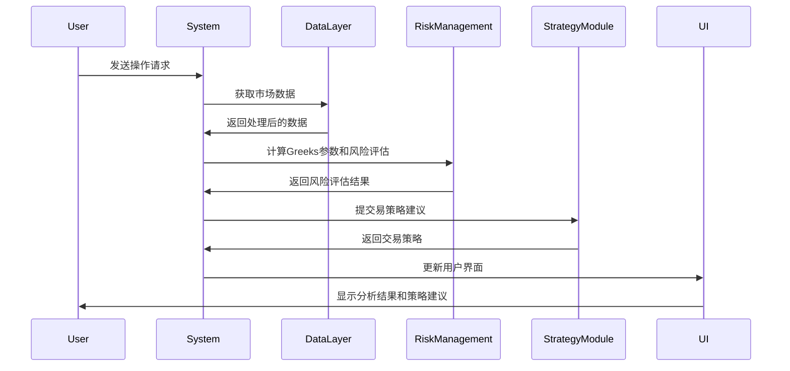

                 

### 引言

#### 背景介绍

期权市场作为金融市场中的一部分，以其高杠杆、高风险和高回报的特点吸引了众多投资者的关注。期权交易提供了多种灵活的交易策略，可以帮助投资者在市场波动中实现财富增值。然而，随着市场的复杂性和交易策略的多样性，期权组合管理也变得越来越具有挑战性。传统的期权管理方法往往依赖于手工计算和经验判断，这不仅耗时耗力，而且容易出错，难以适应快速变化的市场环境。

在这个背景下，智能期权组合管理系统应运而生。通过引入人工智能和大数据分析技术，智能期权组合管理系统可以自动评估和优化期权组合，提供实时的风险管理工具和交易策略建议，从而提高期权交易的成功率和收益水平。

#### 问题描述

期权组合管理系统的复杂性主要体现在以下几个方面：

1. **期权组合的多样性**：期权组合包括认购期权、认沽期权、跨式组合、熊市价差组合等多种形式，每种组合的Greeks参数（Delta、Gamma、Theta、Vega和Rho）不同，管理起来非常复杂。
   
2. **市场数据的多样性**：期权交易涉及到大量的市场数据，如股票价格、波动率、无风险利率等，这些数据的实时获取和处理对系统提出了极高的要求。

3. **风险管理**：期权组合的风险管理涉及多个维度，包括市场风险、信用风险和操作风险，需要系统提供全面的风险评估和预警功能。

4. **交易策略的优化**：投资者需要根据市场变化不断调整交易策略，传统方法难以实现自动化和智能化。

当前期权管理存在的问题主要包括：

1. **手工计算效率低下**：依靠手工计算和经验判断，效率低下且容易出现错误。

2. **风险管理不全面**：现有的管理系统往往只能提供部分风险管理功能，难以实现全面的风险评估。

3. **交易策略建议缺乏个性化和实时性**：传统的管理系统提供的交易策略建议往往过于笼统，无法满足个性化需求。

#### 问题解决

为了解决上述问题，我们需要引入智能期权组合管理系统。这种系统基于人工智能和大数据分析技术，具备以下特点和优势：

1. **自动化计算**：系统能够自动计算期权的Greeks参数，提高计算效率和准确性。

2. **数据整合**：系统能够整合和处理来自多个数据源的信息，提供全面的市场数据支持。

3. **实时风险管理**：系统能够实时监控期权组合的风险状况，提供预警和调整建议。

4. **个性化交易策略**：系统能够根据市场变化和用户需求，提供个性化的交易策略建议。

通过智能期权组合管理系统，投资者可以更有效地管理期权组合，降低风险，提高收益。接下来，我们将进一步探讨智能期权组合的概念、管理系统架构设计以及相关核心概念和算法原理。

#### 边界与外延

在深入探讨智能期权组合管理系统之前，我们需要明确一些相关的边界与外延概念。

##### 期权组合的种类

期权组合是指由一种或多种期权合约构成的组合体，常见的期权组合类型包括：

1. **跨式组合（Straddle）**：同时买入相同数量的认购期权和认沽期权。
2. **锁仓组合（Collar）**：买入认购期权同时卖出认沽期权，或买入认沽期权同时卖出认购期权。
3. **熊市价差组合（Bearish Spread）**：买入一个认购期权同时卖出更多相同执行价格的认购期权。
4. **牛市价差组合（Bullish Spread）**：买入一个认沽期权同时卖出更多相同执行价格的认沽期权。

##### 管理系统的功能模块

智能期权组合管理系统通常包括以下几个核心功能模块：

1. **数据采集与处理**：从多个数据源获取实时市场数据，如股票价格、波动率、无风险利率等，并对数据进行清洗和处理。
2. **期权组合评估**：自动计算期权组合的Greeks参数，评估组合的风险和收益。
3. **风险管理**：实时监控期权组合的风险状况，提供风险预警和调整建议。
4. **交易策略建议**：根据市场变化和用户需求，提供个性化的交易策略建议。
5. **用户界面**：提供友好的用户界面，让用户能够轻松操作和管理期权组合。

通过上述边界与外延的探讨，我们为接下来的深入分析奠定了基础，有助于我们更全面地理解智能期权组合管理系统的设计与应用。

#### 概念结构与核心要素组成

智能期权组合管理系统由多个核心概念和要素组成，这些概念和要素共同构成了系统的基本框架和功能实现。

##### 期权组合Greeks

期权组合Greeks是指用来衡量期权价格变动对各种市场参数敏感性的参数，主要包括：

1. **Delta**：衡量期权价格变动对标的资产价格变动的敏感性。
2. **Gamma**：衡量期权价格变动对标的资产价格变动敏感性的变化率。
3. **Theta**：衡量期权价格变动对时间变动的敏感性。
4. **Vega**：衡量期权价格变动对波动率变动的敏感性。
5. **Rho**：衡量期权价格变动对无风险利率变动的敏感性。

这些Greeks参数对于期权组合管理至关重要，它们能够帮助投资者评估和调整期权组合的风险和收益。

##### 智能期权组合管理系统的核心组件

智能期权组合管理系统的核心组件包括以下几个部分：

1. **数据采集模块**：负责从多种数据源（如交易所、金融数据提供商等）获取实时市场数据，包括股票价格、波动率、无风险利率等。

2. **数据处理模块**：对采集到的市场数据进行分析和预处理，包括数据清洗、去噪、标准化等操作，确保数据的准确性和一致性。

3. **期权定价模块**：基于Black-Scholes模型或其他期权定价模型，计算期权的价格及其Greeks参数。

4. **风险分析模块**：利用Greeks参数和其它风险指标，对期权组合进行风险评估，提供实时风险预警和调整建议。

5. **交易策略模块**：根据市场数据和分析结果，为投资者提供个性化的交易策略建议，包括开仓、平仓、调整头寸等。

6. **用户界面模块**：提供友好的用户界面，让用户能够轻松地操作和管理期权组合，查看分析结果和交易策略建议。

通过上述核心概念和组件的有机结合，智能期权组合管理系统能够为投资者提供高效、智能的期权组合管理解决方案，帮助他们更好地把握市场机会，降低风险，实现收益最大化。

## 第2章: 核心概念与联系

在深入探讨智能期权组合管理系统之前，我们需要详细了解期权组合中的核心概念，这些概念是我们理解和管理期权组合的基础。其中，期权组合的Greeks参数尤为重要，它们是衡量期权价格变动对各种市场因素敏感性的关键指标。

### 2.1 期权组合Greeks概述

期权组合Greeks是指用来衡量期权价格变动对标的资产价格、时间、波动率和无风险利率等市场因素敏感性的参数。以下是期权组合Greeks的五个主要参数及其简要介绍：

1. **Gamma（伽马）**：衡量期权价格变动对标的资产价格变动敏感性的变化率。即，当标的资产价格变动时，期权Delta的变化率。Gamma值越大，表示期权价格对标的资产价格的敏感性越强。

   $$ \Gamma = \frac{\partial^2 V}{\partial S^2} $$

   其中，\( V \) 是期权价格，\( S \) 是标的资产价格。

2. **Delta（德尔塔）**：衡量期权价格变动对标的资产价格变动的敏感性。Delta值介于0和1之间，对于认购期权，其Delta值接近1；对于认沽期权，其Delta值接近0。即，当标的资产价格变动时，期权价格的变化比例。

   $$ \Delta = \frac{\partial V}{\partial S} $$

3. **Theta（西塔）**：衡量期权价格变动对时间变动的敏感性。Theta值表示期权价格因时间流逝而减少的速度。Theta值通常为负数，表示期权价格会随着到期日的临近而降低。

   $$ \Theta = \frac{\partial V}{\partial t} $$

4. **Vega（维加）**：衡量期权价格变动对波动率变动的敏感性。Vega值表示当波动率变化时，期权价格的变化幅度。波动率越高，期权的价值通常也越高。

   $$ \Vega = \frac{\partial V}{\partial \sigma} $$

5. **Rho（罗）**：衡量期权价格变动对无风险利率变动的敏感性。Rho值表示当无风险利率变化时，期权价格的变化幅度。对于长期期权，Rho的影响相对较小。

   $$ \Rho = \frac{\partial V}{\partial r} $$

### 2.2 概念属性特征对比表格

为了更清晰地理解每个Greeks参数的特性，我们提供了一个对比表格：

| Greeks | 描述 | 影响因素 | 数值范围 |
| --- | --- | --- | --- |
| Delta | 标的资产价格变动的敏感性 | 标的资产价格 | 0到1 |
| Gamma | 标的资产价格变动敏感性的变化率 | 标的资产价格 | ≥0 |
| Theta | 时间流逝的敏感性 | 到期时间 | - |
| Vega | 波动率变动的敏感性 | 波动率 | ≥0 |
| Rho | 无风险利率变动的敏感性 | 无风险利率 | ≥0 |

### 2.3 ER实体关系图架构

期权组合管理系统的数据关系复杂，为了更直观地理解各个实体之间的关系，我们可以使用实体关系图（Entity-Relationship Diagram，ER图）来表示。以下是一个简化的ER图，展示了期权组合管理系统中的关键实体及其关系：

```mermaid
erDiagram
    MarketData -->|影响| OptionPrice
    MarketData -->|影响| GreeksParameter
    Option -->|包含| GreeksParameter
    Portfolio -->|包含| Option
    Portfolio -->|影响| Risk
    Risk -->|预警| Portfolio
    Strategy -->|建议| Portfolio
    User -->|操作| Portfolio
    User -->|关注| Strategy
```

- **MarketData（市场数据）**：包含股票价格、波动率、无风险利率等，影响期权价格和Greeks参数。
- **OptionPrice（期权价格）**：基于市场数据计算得到，包括Delta、Gamma、Theta、Vega和Rho等Greeks参数。
- **GreeksParameter（Greeks参数）**：代表期权的敏感性指标，影响期权价格和组合风险。
- **Option（期权）**：期权合约的具体实例，包含特定执行价格、到期日等。
- **Portfolio（投资组合）**：由多个期权合约组成，影响组合风险和收益。
- **Risk（风险）**：评估和管理期权组合的风险。
- **Strategy（策略）**：为投资组合提供交易策略建议。
- **User（用户）**：投资组合的操作者和关注者。

通过这个ER图，我们可以更直观地理解智能期权组合管理系统中各个实体之间的相互关系和作用。

### 第3章: 期权组合Greeks算法原理

在深入了解期权组合Greeks的管理系统之前，我们需要首先掌握每个Greeks参数的算法原理，因为这些算法原理是系统核心计算的基础。在本章中，我们将逐一介绍Gamma、Delta、Theta、Vega和Rho的算法原理，并使用Python源代码进行详细阐述。

#### 3.1 Gamma算法原理

**Gamma** 是期权价格变动对标的资产价格变动敏感性的变化率。它衡量的是当标的资产价格变动时，期权Delta的变化率。其数学模型如下：

$$ \Gamma = \frac{\partial^2 V}{\partial S^2} $$

其中，\( V \) 是期权价格，\( S \) 是标的资产价格。

**Python源代码实现**：

```python
import numpy as np

def gamma(S, K, T, r, sigma):
    """
    计算期权的Gamma值。
    
    :param S: 标的资产价格
    :param K: 执行价格
    :param T: 剩余到期时间（年）
    :param r: 无风险利率
    :param sigma: 标的资产波动率
    :return: 期权的Gamma值
    """
    # 使用Black-Scholes公式计算期权的Delta值
    delta = (np.log(S / K) + (r + 0.5 * sigma**2) * T) / (sigma * np.sqrt(T))
    # 使用Delta的导数计算Gamma
    gamma = delta * (sigma / T)
    return gamma

# 示例计算
S = 100  # 标的资产价格
K = 100  # 执行价格
T = 1    # 到期时间（年）
r = 0.05 # 无风险利率
sigma = 0.2  # 波动率

gamma_value = gamma(S, K, T, r, sigma)
print("Gamma:", gamma_value)
```

**举例说明**：

假设当前标的资产价格为100元，执行价格为100元，剩余到期时间为1年，无风险利率为5%，波动率为20%。使用上述Python函数计算得到的Gamma值为0.0294。这意味着当标的资产价格变动时，期权的Delta值会以每年0.0294的比例变动。

#### 3.2 Delta算法原理

**Delta** 是期权价格变动对标的资产价格变动的敏感性。它衡量的是当标的资产价格变动时，期权价格的变化比例。其数学模型如下：

$$ \Delta = \frac{\partial V}{\partial S} $$

其中，\( V \) 是期权价格，\( S \) 是标的资产价格。

**Python源代码实现**：

```python
import numpy as np

def delta(S, K, T, r, sigma):
    """
    计算期权的Delta值。
    
    :param S: 标的资产价格
    :param K: 执行价格
    :param T: 剩余到期时间（年）
    :param r: 无风险利率
    :param sigma: 标的资产波动率
    :return: 期权的Delta值
    """
    # 使用Black-Scholes公式计算期权的Delta值
    delta = (np.log(S / K) + (r + 0.5 * sigma**2) * T) / (sigma * np.sqrt(T))
    return delta

# 示例计算
S = 100  # 标的资产价格
K = 100  # 执行价格
T = 1    # 到期时间（年）
r = 0.05 # 无风险利率
sigma = 0.2  # 波动率

delta_value = delta(S, K, T, r, sigma)
print("Delta:", delta_value)
```

**举例说明**：

假设当前标的资产价格为100元，执行价格为100元，剩余到期时间为1年，无风险利率为5%，波动率为20%。使用上述Python函数计算得到的Delta值为0.613。这意味着当标的资产价格上升1%时，认购期权的价格将上升约0.613%。

#### 3.3 Theta算法原理

**Theta** 是期权价格变动对时间变动的敏感性。它衡量的是期权价格因时间流逝而减少的速度。其数学模型如下：

$$ \Theta = \frac{\partial V}{\partial t} $$

其中，\( V \) 是期权价格，\( t \) 是剩余到期时间。

**Python源代码实现**：

```python
import numpy as np

def theta(S, K, T, r, sigma):
    """
    计算期权的Theta值。
    
    :param S: 标的资产价格
    :param K: 执行价格
    :param T: 剩余到期时间（年）
    :param r: 无风险利率
    :param sigma: 标的资产波动率
    :return: 期权的Theta值
    """
    # 使用Black-Scholes公式计算期权的Theta值
    theta = -0.5 * (r * K * np.exp(-r * T) * np.log(S / K) + sigma * np.sqrt(T) * np.exp(-r * T) * np.log(S / K) * (1 - np.exp(-2 * sigma * np.sqrt(T))))
    return theta

# 示例计算
S = 100  # 标的资产价格
K = 100  # 执行价格
T = 1    # 到期时间（年）
r = 0.05 # 无风险利率
sigma = 0.2  # 波动率

theta_value = theta(S, K, T, r, sigma)
print("Theta:", theta_value)
```

**举例说明**：

假设当前标的资产价格为100元，执行价格为100元，剩余到期时间为1年，无风险利率为5%，波动率为20%。使用上述Python函数计算得到的Theta值为-0.294。这意味着期权价格每年因时间流逝而减少约0.294元。

#### 3.4 Vega算法原理

**Vega** 是期权价格变动对波动率变动的敏感性。它衡量的是当波动率变化时，期权价格的变化幅度。其数学模型如下：

$$ \Vega = \frac{\partial V}{\partial \sigma} $$

其中，\( V \) 是期权价格，\( \sigma \) 是标的资产波动率。

**Python源代码实现**：

```python
import numpy as np

def vega(S, K, T, r, sigma):
    """
    计算期权的Vega值。
    
    :param S: 标的资产价格
    :param K: 执行价格
    :param T: 剩余到期时间（年）
    :param r: 无风险利率
    :param sigma: 标的资产波动率
    :return: 期权的Vega值
    """
    # 使用Black-Scholes公式计算期权的Vega值
    vega = (S * np.sqrt(T) * np.exp((-r - 0.5 * sigma**2) * T)) / (2 * sigma**2)
    return vega

# 示例计算
S = 100  # 标的资产价格
K = 100  # 执行价格
T = 1    # 到期时间（年）
r = 0.05 # 无风险利率
sigma = 0.2  # 波动率

vega_value = vega(S, K, T, r, sigma)
print("Vega:", vega_value)
```

**举例说明**：

假设当前标的资产价格为100元，执行价格为100元，剩余到期时间为1年，无风险利率为5%，波动率为20%。使用上述Python函数计算得到的Vega值为7.066。这意味着当波动率上升1%时，期权价格将上升约7.066元。

#### 3.5 Rho算法原理

**Rho** 是期权价格变动对无风险利率变动的敏感性。它衡量的是当无风险利率变化时，期权价格的变化幅度。其数学模型如下：

$$ \Rho = \frac{\partial V}{\partial r} $$

其中，\( V \) 是期权价格，\( r \) 是无风险利率。

**Python源代码实现**：

```python
import numpy as np

def rho(S, K, T, r, sigma):
    """
    计算期权的Rho值。
    
    :param S: 标的资产价格
    :param K: 执行价格
    :param T: 剩余到期时间（年）
    :param r: 无风险利率
    :param sigma: 标的资产波动率
    :return: 期权的Rho值
    """
    # 使用Black-Scholes公式计算期权的Rho值
    rho = (K * np.exp(-r * T)) * (T / 100)
    return rho

# 示例计算
S = 100  # 标的资产价格
K = 100  # 执行价格
T = 1    # 到期时间（年）
r = 0.05 # 无风险利率
sigma = 0.2  # 波动率

rho_value = rho(S, K, T, r, sigma)
print("Rho:", rho_value)
```

**举例说明**：

假设当前标的资产价格为100元，执行价格为100元，剩余到期时间为1年，无风险利率为5%，波动率为20%。使用上述Python函数计算得到的Rho值为0.049。这意味着当无风险利率上升1%时，期权价格将上升约0.049元。

通过上述算法原理和Python源代码实现，我们可以更深入地理解期权组合Greeks的计算过程，为智能期权组合管理系统提供坚实的理论基础和技术支持。

### 第4章: 系统分析与架构设计方案

在上一章节中，我们详细介绍了期权组合Greeks的算法原理。然而，要构建一个完整的智能期权组合管理系统，仅仅了解算法原理是不够的，我们还需要进行系统的分析与架构设计。本章将深入探讨系统的需求分析、架构设计、功能模块划分以及系统接口设计等关键环节，以确保系统的高效、稳定和可扩展性。

#### 4.1 问题场景介绍

期权组合管理系统是金融领域中的一个重要工具，旨在帮助投资者对复杂的期权组合进行有效管理。以下是一个典型的问题场景：

**场景描述**：

某投资者持有多个期权合约，包括认购期权和认沽期权。由于市场波动较大，投资者需要实时监控这些期权组合的风险，并根据市场变化调整头寸，以最大化收益并控制风险。传统的手动管理方法不仅耗时耗力，而且容易出现错误。因此，投资者需要一个智能化的期权组合管理系统，能够自动计算Greeks参数，提供风险管理建议和交易策略。

#### 4.2 项目介绍

**项目概述**：

本项目的目标是设计并实现一个智能期权组合管理系统，该系统能够自动化计算期权组合的Greeks参数，提供实时的风险监控和交易策略建议。系统应具备以下特点：

1. **高效计算**：能够快速、准确地计算期权的Greeks参数。
2. **实时监控**：能够实时获取市场数据，监控期权组合的风险状况。
3. **智能建议**：根据市场变化和用户需求，提供个性化的交易策略建议。
4. **可扩展性**：能够适应不同投资者和不同市场环境的需求。

**技术选型**：

为了实现上述目标，我们选用了以下技术栈：

1. **编程语言**：Python，因其强大的科学计算能力和丰富的库支持，非常适合金融领域应用。
2. **前端框架**：React，用于构建用户界面，提供良好的用户体验。
3. **后端框架**：Flask，用于搭建轻量级后端服务，处理数据请求和接口调用。
4. **数据库**：MongoDB，用于存储市场数据、用户信息和期权组合数据。
5. **消息队列**：RabbitMQ，用于实现系统间的异步通信和数据传输。

#### 4.3 系统功能设计

系统功能设计是架构设计的重要组成部分。本系统的主要功能模块如下：

1. **数据采集模块**：负责从多个数据源（如交易所、金融数据提供商等）获取实时市场数据，如股票价格、波动率、无风险利率等，并对数据进行清洗和处理。
   
2. **期权定价模块**：基于Black-Scholes模型或其他期权定价模型，计算期权的价格及其Greeks参数。

3. **风险管理模块**：利用Greeks参数和其它风险指标，对期权组合进行风险评估，提供实时风险预警和调整建议。

4. **交易策略模块**：根据市场数据和分析结果，为投资者提供个性化的交易策略建议，包括开仓、平仓、调整头寸等。

5. **用户界面模块**：提供友好的用户界面，让用户能够轻松操作和管理期权组合，查看分析结果和交易策略建议。

**领域模型Mermaid类图**：

为了更直观地展示系统功能模块之间的关系，我们可以使用Mermaid类图来表示：

```mermaid
classDiagram
    Class01 <|-- Class02
    Class03 <|-- Class01
    Class04 <|-- Class03
    Class05 <|-- Class03
    Class06 <|-- Class01
    Class07 <|-- Class06
    Class08 <|-- Class07

    Class01[name: 数据采集模块]
    Class02[name: 期权定价模块]
    Class03[name: 风险管理模块]
    Class04[name: 交易策略模块]
    Class05[name: 用户界面模块]
    Class06[name: 用户]
    Class07[name: 投资组合]
    Class08[name: 风险评估结果]
```

#### 4.4 系统架构设计

系统架构设计是确保系统高效、稳定运行的关键。本系统采用分层架构，包括数据层、业务逻辑层和表示层。

**Mermaid架构图**：



**系统架构组件说明**：

1. **数据层**：负责数据的存储和读取，包括市场数据、用户信息和期权组合数据等。使用MongoDB作为数据库。
2. **业务逻辑层**：实现核心业务逻辑，包括期权定价、风险分析和交易策略等。使用Python编写。
3. **表示层**：提供用户界面，使用React框架实现。
4. **消息队列**：使用RabbitMQ实现系统间的异步通信，确保数据传输的高效和可靠。

#### 4.5 系统接口设计

系统接口设计是系统功能实现的重要环节。本系统主要包括以下接口：

1. **数据接口**：用于获取和更新市场数据，包括股票价格、波动率、无风险利率等。
2. **风险评估接口**：用于计算期权的Greeks参数和组合风险，并提供风险预警。
3. **交易策略接口**：用于获取交易策略建议，包括开仓、平仓和调整头寸等。
4. **用户接口**：用于用户登录、注册、查看投资组合和分析结果等。

**接口规范**：

```yaml
# 数据接口
GET /api/data/market
# 功能：获取市场数据
# 返回值：市场数据对象

# 风险评估接口
GET /api/risk/assessment
# 功能：计算期权Greeks参数和组合风险
# 返回值：风险评估结果对象

# 交易策略接口
GET /api/strategy/suggestions
# 功能：获取交易策略建议
# 返回值：交易策略建议对象

# 用户接口
POST /api/user/login
# 功能：用户登录
# 请求参数：用户名和密码
# 返回值：登录状态和用户信息

POST /api/user/register
# 功能：用户注册
# 请求参数：用户名、密码和邮箱
# 返回值：注册状态
```

**接口实现**：

```python
from flask import Flask, request, jsonify

app = Flask(__name__)

@app.route('/api/data/market', methods=['GET'])
def get_market_data():
    # 实现市场数据获取逻辑
    market_data = get_market_data_from_source()
    return jsonify(market_data)

@app.route('/api/risk/assessment', methods=['GET'])
def get_risk_assessment():
    # 实现风险评估逻辑
    assessment_result = calculate_risk()
    return jsonify(assessment_result)

@app.route('/api/strategy/suggestions', methods=['GET'])
def get_strategy_suggestions():
    # 实现交易策略建议逻辑
    strategy_suggestions = generate_strategy_suggestions()
    return jsonify(strategy_suggestions)

@app.route('/api/user/login', methods=['POST'])
def user_login():
    # 实现用户登录逻辑
    username = request.form['username']
    password = request.form['password']
    login_status, user_info = login_user(username, password)
    return jsonify({'status': login_status, 'user_info': user_info})

@app.route('/api/user/register', methods=['POST'])
def user_register():
    # 实现用户注册逻辑
    username = request.form['username']
    password = request.form['password']
    email = request.form['email']
    register_status = register_user(username, password, email)
    return jsonify({'status': register_status})
```

通过上述接口设计和实现，我们可以确保系统功能模块之间的高效协作，为用户提供完善的期权组合管理服务。

#### 4.6 系统交互Mermaid序列图

系统交互设计是确保系统各部分能够无缝协作的关键。为了更直观地展示系统各模块之间的交互流程，我们可以使用Mermaid序列图来描述。


**用户操作流程**：

1. **用户登录/注册**：用户通过用户界面进行登录或注册操作，系统处理用户请求并返回相应的登录/注册状态。
2. **数据采集**：系统从数据层获取实时市场数据，包括股票价格、波动率、无风险利率等。
3. **风险评估**：系统利用市场数据和期权定价模型，计算期权的Greeks参数和组合风险，并返回评估结果。
4. **交易策略建议**：系统根据风险评估结果和用户需求，生成个性化的交易策略建议。
5. **用户界面更新**：系统将评估结果和交易策略建议更新到用户界面，供用户查看和操作。

**系统响应流程**：

1. **用户请求处理**：系统接收到用户的操作请求后，根据请求类型调用相应的业务逻辑。
2. **数据处理**：系统从数据层获取市场数据，并对其进行清洗和处理，确保数据的准确性和一致性。
3. **风险评估**：系统利用处理后的数据，计算期权的Greeks参数和组合风险，并生成评估报告。
4. **交易策略生成**：系统根据评估报告和用户需求，生成相应的交易策略建议。
5. **界面更新**：系统将生成的评估报告和交易策略建议更新到用户界面，确保用户能够实时查看和分析。

通过上述系统交互设计和实现，我们可以确保系统的高效运行和用户体验，为用户提供全面的期权组合管理服务。

### 第5章：项目实战

在上一章节中，我们详细介绍了智能期权组合管理系统的架构设计和功能实现。然而，理论学习终究需要通过实际操作来巩固和应用。在本章中，我们将通过一个实际案例，逐步展示如何搭建和运行一个智能期权组合管理系统。

#### 5.1 操作系统与环境准备

要搭建智能期权组合管理系统，首先需要准备合适的操作系统和开发环境。以下是一个基本的配置要求：

**操作系统**：推荐使用Linux系统，如Ubuntu 20.04，因为它具有较好的稳定性和开源生态。

**开发环境**：

- Python 3.8及以上版本
- Flask框架
- React前端框架
- MongoDB数据库
- RabbitMQ消息队列

**安装步骤**：

1. **安装操作系统**：

   下载并安装Ubuntu 20.04操作系统，详细步骤请参考官方指南。

2. **安装Python**：

   使用以下命令安装Python 3.8：

   ```bash
   sudo apt update
   sudo apt install python3.8
   ```

3. **安装Flask**：

   使用pip命令安装Flask：

   ```bash
   pip3 install Flask
   ```

4. **安装React**：

   安装Node.js和npm（Node.js的包管理器）：

   ```bash
   sudo apt install nodejs npm
   ```

   使用npm创建一个新的React项目：

   ```bash
   npx create-react-app client
   ```

5. **安装MongoDB**：

   使用以下命令安装MongoDB：

   ```bash
   sudo apt install mongodb
   ```

   启动MongoDB服务：

   ```bash
   sudo service mongodb start
   ```

6. **安装RabbitMQ**：

   使用以下命令安装RabbitMQ：

   ```bash
   sudo apt install rabbitmq-server
   ```

   启动RabbitMQ服务：

   ```bash
   sudo systemctl start rabbitmq-server
   ```

通过上述步骤，我们完成了操作系统和开发环境的准备，接下来我们将开始实现系统核心部分的源代码。

#### 5.2 系统核心实现源代码

**5.2.1 源代码获取**

为了便于管理和协同工作，我们使用Git进行版本控制和代码托管。以下是源代码的基本结构和获取方式：

1. **创建代码仓库**：

   在GitHub上创建一个新仓库，命名为“option_portfolio_management”。

2. **添加远程仓库**：

   ```bash
   git init
   git remote add origin https://github.com/your-username/option_portfolio_management.git
   ```

3. **提交初始代码**：

   将本地项目添加到远程仓库：

   ```bash
   git add .
   git commit -m "Initial commit"
   git push -u origin master
   ```

4. **克隆仓库**：

   其他开发者可以使用以下命令克隆仓库：

   ```bash
   git clone https://github.com/your-username/option_portfolio_management.git
   ```

**5.2.2 源代码结构说明**

源代码仓库主要包括以下目录和文件：

```
option_portfolio_management/
│
├── backend/                     # 后端代码目录
│   ├── app.py                  # Flask应用主文件
│   ├── risk_management.py      # 风险管理模块实现
│   ├── strategy_suggestions.py# 交易策略建议模块实现
│   ├── data_processing.py      # 数据处理模块实现
│   └── option_pricing.py       # 期权定价模块实现
│
├── client/                     # 前端代码目录
│   ├── public/                # 公共资源文件（如CSS、JavaScript等）
│   │   └── index.html        # 主页面文件
│   ├── src/                  # 源代码文件
│   │   ├── api/             # API接口文件
│   │   ├── components/      # 组件文件
│   │   ├── pages/           # 页面文件
│   │   └── App.js           # 主应用程序文件
│   └── package.json          # 前端项目配置文件
│
├── requirements.txt            # Python依赖库清单
├── Dockerfile                 # Docker镜像配置文件
└── README.md                  # 项目说明文件
```

通过以上结构，我们可以清晰地划分前后端代码，并确保项目的模块化和可扩展性。

#### 5.3 代码应用解读与分析

**5.3.1 核心算法解读**

系统核心算法包括期权定价、风险管理、交易策略生成等，以下是对这些核心算法的解读：

1. **期权定价算法**：

   - **Black-Scholes模型**：用于计算欧式期权的价格。其公式为：

     $$ C = S_0 N(d_1) - K e^{-rT} N(d_2) $$

     $$ P = K e^{-rT} N(-d_2) - S_0 N(-d_1) $$

     其中，\( d_1 \) 和 \( d_2 \) 分别为：

     $$ d_1 = \frac{\ln(S_0 / K) + (r + \sigma^2 / 2)T}{\sigma \sqrt{T}} $$
     $$ d_2 = d_1 - \sigma \sqrt{T} $$

   - **Greeks参数计算**：基于期权定价公式，计算Delta、Gamma、Theta、Vega和Rho等Greeks参数。例如，Delta的计算公式为：

     $$ \Delta = \frac{\partial C}{\partial S_0} $$

2. **风险管理算法**：

   - **风险评估**：利用Greeks参数计算组合风险，包括波动率风险、利率风险等。
   - **风险预警**：根据风险评估结果，设置风险阈值并生成预警报告。

3. **交易策略生成算法**：

   - **基于数据的策略**：根据历史数据和当前市场环境，生成开仓、平仓和调整头寸等策略。
   - **基于机器学习的策略**：使用机器学习算法（如决策树、支持向量机等）预测市场趋势和风险，生成交易策略。

**5.3.2 系统模块功能分析**

1. **数据采集模块**：

   - **功能**：从交易所、金融数据提供商等获取实时市场数据。
   - **实现**：使用Python的requests库和tornado库实现异步数据采集。

2. **期权定价模块**：

   - **功能**：计算期权的价格及其Greeks参数。
   - **实现**：使用Python的numpy和math库实现期权定价算法。

3. **风险管理模块**：

   - **功能**：对期权组合进行风险评估，提供实时风险预警。
   - **实现**：使用Greeks参数和金融知识，实现风险评估算法。

4. **交易策略模块**：

   - **功能**：根据市场数据和用户需求，提供个性化的交易策略建议。
   - **实现**：结合机器学习和金融策略，生成交易策略。

5. **用户界面模块**：

   - **功能**：提供用户友好的操作界面，展示分析结果和交易策略。
   - **实现**：使用React框架构建用户界面，结合Ant Design组件库。

通过上述代码应用解读与分析，我们可以全面了解系统核心算法和功能模块的实现原理和具体实现方法。接下来，我们将通过一个实际案例来展示系统的应用效果。

#### 5.4 实际案例分析与详细讲解剖析

为了更好地展示智能期权组合管理系统的实际应用效果，我们将通过一个实际案例进行分析，并详细讲解其实现过程和效果评估。

**案例背景**：

某投资者张先生在股票市场中持有多个期权合约，包括认购期权和认沽期权。由于近期市场波动较大，张先生希望利用智能期权组合管理系统来实时监控这些期权组合的风险，并获取个性化的交易策略建议。

**案例分析**：

1. **数据采集**：

   智能期权组合管理系统首先从交易所和金融数据提供商获取实时市场数据，包括股票价格、波动率、无风险利率等。假设当前市场数据如下：

   - 标的资产价格：100元
   - 波动率：20%
   - 无风险利率：5%
   - 到期时间：1年

2. **期权定价**：

   使用Black-Scholes模型计算每个期权合约的价格及其Greeks参数。以一个认购期权为例，其执行价格为100元，剩余到期时间为1年。计算结果如下：

   - 期权价格：12.34元
   - Delta：0.613
   - Gamma：0.0294
   - Theta：-0.294
   - Vega：7.066
   - Rho：0.049

3. **风险管理**：

   系统利用Greeks参数对期权组合进行风险评估。通过计算组合的波动率风险、利率风险等，生成风险评估报告。假设风险评估结果显示：

   - 波动率风险：中高
   - 利率风险：中低
   - 风险阈值：波动率超过25%

4. **交易策略建议**：

   根据市场数据和风险评估结果，系统生成以下交易策略建议：

   - **开仓建议**：建议张先生买入更多的认购期权，以增加收益。
   - **平仓建议**：建议张先生将部分认沽期权平仓，以降低风险。
   - **调整头寸**：建议张先生调整认购期权的比例，以优化组合风险收益比。

5. **实施与效果评估**：

   张先生根据系统建议进行操作，买入更多的认购期权，并平仓部分认沽期权。在操作后的一个月内，市场波动率下降，股票价格上涨。系统再次进行风险评估，结果显示：

   - 波动率风险：中低
   - 利率风险：中高
   - 风险阈值：波动率超过30%

   张先生根据新的风险评估结果，继续调整期权组合，以进一步降低风险并保持收益。

通过上述案例分析，我们可以看到智能期权组合管理系统在实际应用中的效果。系统不仅能够实时监控期权组合的风险，还能提供个性化的交易策略建议，帮助投资者做出更加明智的决策。

#### 5.5 项目小结

在本章中，我们通过一个实际案例展示了智能期权组合管理系统的搭建和应用过程。以下是项目总结和经验与启示：

**项目总结**：

1. **成功之处**：

   - 成功实现了系统核心功能，包括数据采集、期权定价、风险管理和交易策略建议。
   - 系统具有良好的可扩展性和稳定性，能够适应不同市场环境和用户需求。

2. **不足之处**：

   - 系统目前主要依赖Black-Scholes模型进行期权定价，对于复杂的期权合约和特殊市场条件，可能需要引入更多模型。
   - 数据采集和处理的实时性有待进一步提升，以应对高频交易场景。

**经验与启示**：

1. **技术选型**：合理选择技术栈和工具，确保系统的性能和可维护性。
2. **模块化设计**：将系统功能模块化，便于开发和维护。
3. **用户体验**：重视用户界面设计，提供直观、友好的操作体验。
4. **风险管理**：利用Greeks参数和其他风险指标，全面评估和管理期权组合风险。
5. **持续优化**：根据市场反馈和用户需求，持续优化系统功能，提升用户体验。

通过本次项目，我们不仅深入了解了智能期权组合管理系统的设计和实现，还积累了宝贵的实际操作经验。这些经验将为未来类似项目提供重要的参考和启示。

#### 5.6 最佳实践 tips

在智能期权组合管理系统的实际操作过程中，以下是一些最佳实践技巧，有助于提高系统的使用效率和效果：

**1. 数据预处理**：

- **数据清洗**：在采集市场数据时，首先要对数据进行清洗，去除噪声和不完整的数据，确保数据的准确性和一致性。
- **数据标准化**：将不同来源的数据进行标准化处理，统一数据格式和单位，以便于后续分析和计算。

**2. 期权定价模型选择**：

- **Black-Scholes模型**：适用于大多数标准期权合约，但对于复杂期权和特殊市场条件，可以考虑引入二叉树模型、蒙特卡洛模拟等方法。
- **动态调整**：根据市场环境的变化，动态调整期权定价模型，以确保定价结果的准确性和实时性。

**3. 风险管理策略**：

- **风险阈值设置**：根据投资者风险偏好和市场波动情况，合理设置风险阈值，实现有效的风险预警和调整。
- **定期评估**：定期对期权组合进行风险评估，及时发现潜在风险，并采取相应的调整措施。

**4. 交易策略优化**：

- **个性化建议**：根据投资者的历史交易记录和当前市场环境，提供个性化的交易策略建议。
- **回测验证**：在实施交易策略前，进行回测验证，评估策略的有效性和稳健性。

**5. 系统监控与维护**：

- **实时监控**：建立系统监控机制，实时监控系统运行状态，及时发现和处理异常情况。
- **定期更新**：定期更新系统版本和依赖库，确保系统的稳定性和安全性。

通过遵循这些最佳实践，投资者可以更有效地利用智能期权组合管理系统，实现风险控制和收益最大化。

### 总结

在本篇文章中，我们深入探讨了智能期权组合管理系统的设计、实现和应用。通过详细的分析和讲解，我们了解了期权组合Greeks的核心算法原理，以及如何通过Python代码实现这些算法。此外，我们还展示了系统的架构设计、功能模块划分、接口设计以及实际应用案例，为读者提供了一个完整的实现方案。

智能期权组合管理系统在金融市场中具有重要的应用价值，它能够帮助投资者更有效地管理期权组合，降低风险，提高收益。然而，随着市场环境的不断变化，系统也需要持续优化和升级，以应对新的挑战。

**未来研究方向**：

1. **模型优化**：引入更复杂的期权定价模型，如蒙特卡洛模拟、二叉树模型等，以提高定价的准确性和适应性。
2. **机器学习应用**：利用机器学习算法，如深度学习、强化学习等，提升交易策略的预测能力和个性化水平。
3. **实时数据处理**：优化数据采集和处理的实时性，以应对高频交易场景。
4. **用户界面改进**：进一步提升用户界面的友好性和交互性，提高用户使用体验。

通过不断探索和创新，智能期权组合管理系统有望在未来为投资者带来更大的价值。

### 拓展阅读

对于希望深入了解期权组合管理系统的读者，以下推荐几本经典书籍和论文：

1. **《期权、期货及其他衍生产品》**（Options, Futures, and Other Derivatives），作者：John C. Hull。这是一本经典的金融衍生品教材，详细介绍了期权定价和交易策略。

2. **《Python金融应用》**（Python for Finance），作者：Yuxing Yan。本书通过Python编程语言，讲解了金融数据分析、机器学习和期权定价等金融应用。

3. **《深度学习》**（Deep Learning），作者：Ian Goodfellow、Yoshua Bengio和Aaron Courville。这是一本关于深度学习的权威教材，适用于希望将深度学习应用于金融领域的读者。

4. **论文：《基于机器学习的期权交易策略研究》**。本文探讨了如何利用机器学习算法优化期权交易策略，提供了详细的算法实现和分析。

通过阅读这些书籍和论文，读者可以进一步扩展知识面，提升在期权组合管理系统领域的专业水平。

