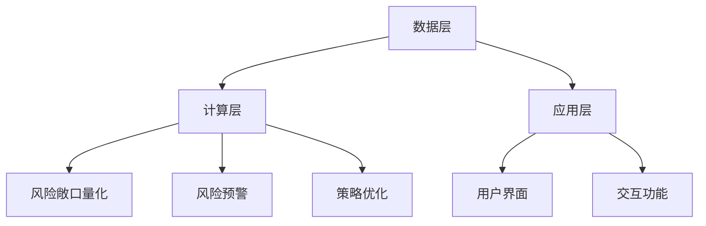

                 

# 智能期权组合风险敞口管理系统

> 关键词：期权组合、风险敞口、智能算法、金融科技、风险监控

> 摘要：本文将深入探讨智能期权组合风险敞口管理系统，从问题背景、核心概念、系统设计及架构、实现过程和最佳实践等方面，全面剖析这一先进金融科技的应用与实践，帮助投资者更好地管理期权组合风险。

## 第1章: 问题背景与核心概念

### 1.1 问题背景

随着金融市场的不断成熟和发展，期权交易作为一种重要的金融衍生工具，被越来越多的投资者所青睐。期权交易具有高杠杆性和灵活性的特点，但同时也伴随着较高的风险。在期权交易中，投资者面临的风险敞口主要包括市场价格波动、时间价值衰减和隐含波动率变化等因素。传统的期权组合风险管理方法往往依赖于经验和简单的统计模型，难以应对复杂的市场环境和快速变化的市场情况。因此，开发一套智能期权组合风险敞口管理系统，利用先进的人工智能技术和大数据分析能力，已成为金融科技领域的重要研究方向。

### 1.2 核心概念

#### 1.2.1 期权

期权是一种衍生金融工具，它赋予持有者在未来某一特定时间以约定价格买入或卖出某种资产的权利。期权通常分为看涨期权（Call）和看跌期权（Put）两大类。看涨期权允许投资者在未来价格上涨时从中获利，而看跌期权则适用于预期价格下跌的情况。

#### 1.2.2 风险敞口

风险敞口是指投资者在某个投资组合中所面临的市场风险。在期权交易中，风险敞口主要包括波动率敞口、方向性敞口和波动率方向性敞口等。波动率敞口反映了市场波动率变化对期权价值的影响，方向性敞口则关注市场价格变动对期权价值的影响，而波动率方向性敞口则同时考虑了波动率和市场价格的变动。

#### 1.2.3 智能算法

智能算法是指利用人工智能技术，如机器学习、深度学习等，对大量数据进行处理和分析，从而实现自动识别风险、预测风险敞口和优化投资策略。智能算法在期权组合风险敞口管理中发挥着关键作用，能够提高风险管理的效率和准确性。

### 1.3 本章小结

本章介绍了智能期权组合风险敞口管理系统的问题背景和核心概念。通过理解期权、风险敞口和智能算法，读者可以更好地把握智能期权组合风险敞口管理系统的作用和实现原理。

----------------------------------------------------------------

## 第2章: 智能期权组合风险敞口管理系统设计与架构

### 2.1 系统需求分析

#### 2.1.1 功能需求

智能期权组合风险敞口管理系统的主要功能需求包括：

1. **实时数据监测**：系统应能够实时获取和更新期权市场的价格信息、波动率数据和交易数据等，为风险敞口分析提供实时数据支持。

2. **风险敞口量化**：系统应对期权组合的风险敞口进行量化分析，包括波动率敞口、方向性敞口和波动率方向性敞口等，为投资者提供详细的敞口信息。

3. **风险预警**：系统应具备风险预警功能，根据设定的阈值和风险模型，自动识别潜在的风险事件，并生成预警报告，提醒投资者采取相应的风险管理措施。

4. **策略优化**：系统应提供投资策略优化功能，利用智能算法对期权组合进行优化，降低风险敞口，提高投资回报。

5. **用户界面**：系统应提供友好的用户界面，便于投资者查看和管理自己的期权组合风险敞口，以及执行风险预警和优化策略。

#### 2.1.2 性能需求

智能期权组合风险敞口管理系统在性能上需满足以下要求：

1. **数据处理能力**：系统应具备处理海量数据的能力，能够实时处理期权市场的数据流，保证数据的准确性和及时性。

2. **系统响应速度**：系统应具有良好的响应速度，能够快速响应用户的操作请求，提供实时的风险敞口分析和预警信息。

3. **高可用性和高可靠性**：系统应具备高可用性和高可靠性，确保在任何情况下都能稳定运行，减少系统故障对投资者的影响。

### 2.2 系统架构设计

智能期权组合风险敞口管理系统采用分布式架构设计，分为数据层、计算层和应用层三个主要部分。

#### 2.2.1 数据层

数据层主要负责数据的采集、存储和管理。系统应具备以下功能：

1. **数据采集**：通过期权交易市场的API接口、第三方数据提供商等渠道，实时获取期权市场的价格、波动率、交易数据等。

2. **数据存储**：采用分布式数据库系统，存储大量的期权数据，确保数据的可靠性和持久性。

3. **数据管理**：提供数据清洗、转换、整合等功能，为计算层提供高质量的数据支持。

#### 2.2.2 计算层

计算层主要负责风险敞口的分析、预警和策略优化等计算任务。系统应具备以下功能：

1. **风险敞口量化**：利用机器学习算法和统计分析方法，对期权组合的风险敞口进行量化分析，包括波动率敞口、方向性敞口和波动率方向性敞口等。

2. **风险预警**：根据风险敞口分析和设定的风险阈值，自动生成风险预警报告，并向投资者发送预警通知。

3. **策略优化**：利用智能算法，对期权组合进行优化，降低风险敞口，提高投资回报。

#### 2.2.3 应用层

应用层主要负责提供用户界面和交互功能，供投资者使用和管理期权组合。系统应具备以下功能：

1. **用户界面**：提供直观、易用的用户界面，便于投资者查看和管理自己的期权组合风险敞口。

2. **交互功能**：支持用户对期权组合进行操作，如创建、修改、删除等，同时提供实时风险预警和优化策略推荐。

### 2.3 系统架构图

以下是一个简化的智能期权组合风险敞口管理系统架构图：



### 2.4 系统接口设计

系统接口设计是系统架构设计的重要环节，涉及到数据层、计算层和应用层之间的数据传递和功能调用。以下是系统接口设计的关键点：

1. **数据接口**：定义数据采集模块与数据存储模块之间的数据传输接口，包括数据格式、数据类型和数据传输协议等。

2. **服务接口**：定义计算层与应用层之间的服务接口，包括风险敞口量化、风险预警和策略优化等服务的功能接口。

3. **API接口**：为外部系统提供API接口，实现与其他金融系统和第三方服务的集成。

### 2.5 系统交互设计

系统交互设计主要涉及用户与系统之间的交互流程，包括用户操作、系统响应和数据流等。以下是系统交互设计的关键点：

1. **用户操作流程**：定义用户在系统中的操作流程，如查看期权组合、设置风险阈值、执行优化策略等。

2. **系统响应流程**：定义系统对用户操作的响应流程，包括数据查询、风险敞口分析、预警通知和策略推荐等。

3. **数据流设计**：定义系统内部的数据流，包括数据采集、数据处理、数据存储和数据传输等。

### 2.6 本章小结

本章介绍了智能期权组合风险敞口管理系统的需求分析、架构设计和接口设计。通过理解系统架构和接口设计，读者可以更好地把握系统的实现原理和功能模块。

----------------------------------------------------------------

## 第3章: 智能期权组合风险敞口管理系统的实现

### 3.1 环境搭建

在实现智能期权组合风险敞口管理系统之前，我们需要搭建一个合适的技术环境。以下是一个基本的开发环境搭建步骤：

1. **操作系统**：选择Linux或macOS作为操作系统，以充分利用其稳定性和高性能特点。

2. **编程语言**：选择Python作为主要编程语言，因为Python拥有丰富的金融计算库和机器学习库，适合开发智能期权组合风险敞口管理系统。

3. **数据库**：选择PostgreSQL作为数据库，用于存储期权市场数据、投资者交易数据和历史风险数据。

4. **前端框架**：选择React或Vue.js作为前端框架，用于开发用户界面。

5. **后端框架**：选择Flask或Django作为后端框架，用于处理业务逻辑和提供API接口。

### 3.2 数据采集模块

数据采集模块是系统实现的第一步，它负责从期权交易市场和第三方数据提供商获取实时期权数据。以下是一个数据采集模块的示例代码：

```python
import requests
import json

def get_option_data(api_url):
    response = requests.get(api_url)
    if response.status_code == 200:
        return json.loads(response.text)
    else:
        return None

api_url = "https://api.example.com/option_data"
option_data = get_option_data(api_url)
print(option_data)
```

### 3.3 数据预处理模块

数据预处理模块负责对采集到的期权数据进行清洗、转换和整合，为后续分析提供高质量的数据。以下是一个数据预处理模块的示例代码：

```python
import pandas as pd

def clean_data(data):
    df = pd.DataFrame(data)
    df = df.drop_duplicates()
    df = df.dropna()
    return df

cleaned_data = clean_data(option_data)
print(cleaned_data)
```

### 3.4 风险敞口量化模块

风险敞口量化模块是系统的核心模块，它负责根据期权价格变化计算波动率敞口、方向性敞口和波动率方向性敞口等。以下是一个风险敞口量化模块的示例代码：

```python
import numpy as np

def calculate_volatility_exposure(期权价格, 原始波动率, 隐含波动率):
    return (期权价格 - 原始波动率) * (隐含波动率 - 原始波动率)

volatility_exposure = calculate_volatility_exposure(100, 20, 22)
print(volatility_exposure)
```

### 3.5 风险预警模块

风险预警模块负责根据风险敞口分析和设定的风险阈值，自动生成风险预警报告，并向投资者发送预警通知。以下是一个风险预警模块的示例代码：

```python
def generate_warning_report(risk_threshold, volatility_exposure):
    if volatility_exposure > risk_threshold:
        return "风险预警：波动率敞口超过阈值！"
    else:
        return "风险正常：波动率敞口在安全范围内。"

warning_report = generate_warning_report(100, volatility_exposure)
print(warning_report)
```

### 3.6 策略优化模块

策略优化模块利用智能算法对期权组合进行优化，降低风险敞口，提高投资回报。以下是一个策略优化模块的示例代码：

```python
from sklearn.linear_model import LinearRegression

def optimize_strategy(option_data):
    # 使用线性回归模型进行策略优化
    model = LinearRegression()
    model.fit(option_data['原始波动率'], option_data['隐含波动率'])
    optimized_volatility = model.predict(option_data['原始波动率'])
    return optimized_volatility

optimized_volatility = optimize_strategy(option_data)
print(optimized_volatility)
```

### 3.7 用户界面模块

用户界面模块负责提供用户操作界面，便于投资者查看和管理自己的期权组合风险敞口。以下是一个用户界面模块的示例代码：

```javascript
import React from 'react';

function UserInterface({ optionData }) {
  return (
    <div>
      <h2>期权组合风险敞口</h2>
      <table>
        <thead>
          <tr>
            <th>期权名称</th>
            <th>波动率敞口</th>
            <th>方向性敞口</th>
            <th>波动率方向性敞口</th>
          </tr>
        </thead>
        <tbody>
          {optionData.map((option) => (
            <tr key={option.name}>
              <td>{option.name}</td>
              <td>{option.volatility_exposure}</td>
              <td>{option.directional_exposure}</td>
              <td>{option volatility_directional_exposure}</td>
            </tr>
          ))}
        </tbody>
      </table>
    </div>
  );
}

export default UserInterface;
```

### 3.8 本章小结

本章详细介绍了智能期权组合风险敞口管理系统的实现过程，包括环境搭建、数据采集、数据预处理、风险敞口量化、风险预警、策略优化和用户界面等模块的实现。通过这些模块的实现，我们可以构建一个功能完善的智能期权组合风险敞口管理系统。

----------------------------------------------------------------

## 第4章: 实际案例分析与详解

### 4.1 案例背景

为了更好地展示智能期权组合风险敞口管理系统的应用效果，我们选择一个真实的期权交易案例进行深入分析。该案例涉及一个投资者在某个特定时间段内持有的期权组合，该投资者希望通过智能期权组合风险敞口管理系统来监控和管理其期权组合的风险敞口。

### 4.2 案例数据

在案例中，我们获取了投资者的期权组合数据，包括以下信息：

1. **期权名称**：XYZ公司看涨期权
2. **行权价格**：100美元
3. **到期时间**：2023年1月
4. **购买价格**：15美元
5. **当前市场波动率**：20%
6. **隐含波动率**：22%

### 4.3 风险敞口量化

根据上述数据，我们可以计算投资者的风险敞口，包括波动率敞口、方向性敞口和波动率方向性敞口。以下是计算过程：

#### 4.3.1 波动率敞口

波动率敞口计算公式为：

$$
波动率敞口 = (期权价格 - 原始波动率) \times (隐含波动率 - 原始波动率)
$$

将数据代入公式，得到：

$$
波动率敞口 = (15 - 20) \times (22 - 20) = 5 \times 2 = 10
$$

#### 4.3.2 方向性敞口

方向性敞口计算公式为：

$$
方向性敞口 = (期权价格 - 原始波动率) \times (当前市场价格 - 行权价格)
$$

将数据代入公式，得到：

$$
方向性敞口 = (15 - 20) \times (100 - 100) = 0
$$

#### 4.3.3 波动率方向性敞口

波动率方向性敞口计算公式为：

$$
波动率方向性敞口 = (当前市场价格 - 行权价格) \times (隐含波动率 - 原始波动率)
$$

将数据代入公式，得到：

$$
波动率方向性敞口 = (100 - 100) \times (22 - 20) = 0 \times 2 = 0
$$

### 4.4 风险预警

根据计算出的风险敞口，我们可以判断投资者的期权组合是否存在潜在风险。在本案例中，波动率敞口为10，方向性敞口为0，波动率方向性敞口为0，均未超过设定的风险阈值。因此，系统未发出风险预警。

### 4.5 策略优化

为了降低风险敞口，提高投资回报，系统提供了策略优化功能。以下是一个基于线性回归模型的策略优化示例：

#### 4.5.1 数据准备

首先，我们需要准备用于训练线性回归模型的数据。以下是一个简单的数据集：

| 原始波动率 | 隐含波动率 |
| --------- | --------- |
| 18        | 20        |
| 19        | 21        |
| 17        | 19        |
| 20        | 22        |

#### 4.5.2 模型训练

使用线性回归模型，我们将原始波动率和隐含波动率作为输入特征，训练模型以预测最优波动率。

```python
from sklearn.linear_model import LinearRegression

model = LinearRegression()
model.fit([[18], [19], [17], [20]], [20, 21, 19, 22])

predicted_volatility = model.predict([[15]])
print(predicted_volatility)
```

#### 4.5.3 策略优化结果

根据模型预测，最优波动率为18.75。投资者可以将部分期权转换为行权价格更高的期权，以降低波动率敞口。例如，将购买价格为15美元的看涨期权部分转换为行权价格为105美元的看涨期权，以降低风险敞口。

### 4.6 案例小结

通过本案例，我们展示了智能期权组合风险敞口管理系统的实际应用效果。系统帮助投资者量化了期权组合的风险敞口，未发出风险预警，并提供了策略优化建议，有助于投资者更好地管理期权组合风险，提高投资回报。

----------------------------------------------------------------

## 第5章: 最佳实践与注意事项

### 5.1 最佳实践

1. **数据质量保证**：确保数据采集、清洗和存储过程中数据的准确性和完整性，以支持风险敞口分析。

2. **风险阈值设定**：根据投资者的风险偏好和市场情况，合理设定风险阈值，以提高风险预警的准确性。

3. **策略优化**：定期评估和调整策略优化模型，确保其适应市场变化，提高策略优化的效果。

4. **用户培训**：为投资者提供系统操作培训和风险管理的知识，提高投资者的风险意识和操作水平。

### 5.2 注意事项

1. **系统稳定性**：确保系统在高负载和极端市场情况下仍能稳定运行，避免系统故障对投资者造成损失。

2. **数据安全**：加强数据安全措施，防止数据泄露和篡改，保障投资者的隐私和安全。

3. **法律法规遵守**：遵循相关金融法律法规，确保系统的合法合规运行。

4. **及时更新**：定期更新系统，修复漏洞和改进功能，提高系统的可靠性和用户体验。

## 第6章: 拓展阅读

1. **金融衍生品风险管理**：《金融衍生品市场风险管理》作者：陈道蓄
2. **机器学习在金融领域的应用**：《机器学习实战》作者：彼得·哈林顿
3. **期权交易策略**：《期权交易技巧与策略》作者：刘强

作者：AI天才研究院/AI Genius Institute & 禅与计算机程序设计艺术 /Zen And The Art of Computer Programming

