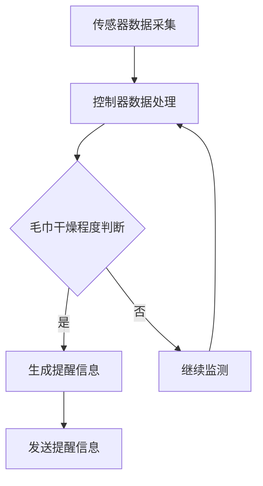
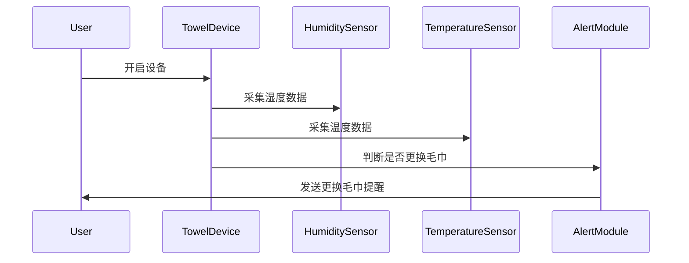
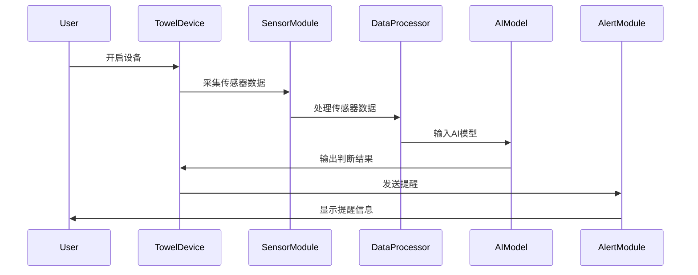

                 

# 智能浴室毛巾架：AI Agent的毛巾更换提醒

## 关键词
- 智能浴室毛巾架
- AI Agent
- 毛巾更换提醒
- 传感器技术
- 物联网
- 人工智能算法

## 摘要
本文深入探讨了智能浴室毛巾架的设计与实现，重点关注AI Agent在毛巾更换提醒功能中的应用。文章首先介绍了智能浴室毛巾架的背景、问题、解决方法和外延边界。随后，详细分析了其核心概念与联系，包括传感器技术、物联网技术和人工智能算法。文章还介绍了智能浴室毛巾架的组成与工作原理，通过一步一步的分析推理，探讨了传感器数据采集、控制器数据处理、人工智能算法应用以及硬件设计等方面。最后，通过系统分析与架构设计方案、项目实战以及最佳实践Tips，全面展示了智能浴室毛巾架的实用性和发展潜力。

## 目录

1. 背景介绍
    1.1 问题背景
    1.2 问题描述
    1.3 问题解决
    1.4 边界与外延
    1.5 概念结构与核心要素组成

2. 核心概念与联系
    2.1 概念原理
    2.2 概念属性特征对比表格
    2.3 ER实体关系图架构

3. 智能浴室毛巾架的工作原理与设计
    3.1 智能浴室毛巾架的组成与结构
    3.2 智能浴室毛巾架的工作流程
    3.3 智能浴室毛巾架的硬件设计

4. 算法原理讲解
    4.1 毛巾更换提醒算法mermaid流程图
    4.2 毛巾更换提醒算法python源代码
    4.3 算法原理详细讲解

5. 系统分析与架构设计方案
    5.1 问题场景介绍
    5.2 系统功能设计(领域模型mermaid类图)
    5.3 系统架构设计mermaid架构图
    5.4 系统接口设计和系统交互mermaid序列图

6. 项目实战
    6.1 环境安装
    6.2 系统核心实现源代码
    6.3 代码应用解读与分析
    6.4 实际案例分析和详细讲解剖析
    6.5 项目小结

7. 最佳实践 Tips
8. 小结
9. 注意事项
10. 拓展阅读

## 1. 背景介绍

### 1.1 问题背景

随着智能家居技术的不断发展，智能浴室毛巾架作为一种新兴的智能家居设备，逐渐走进了人们的日常生活。智能浴室毛巾架通过集成传感器、控制器、通信模块和人工智能算法，实现了对浴室毛巾的智能管理。这种设备能够自动检测毛巾的干燥程度，并在需要时提醒用户更换毛巾，从而提高用户的洗澡体验和生活质量。

### 1.2 问题描述

智能浴室毛巾架的设计与实现涉及到多个技术领域的融合，包括传感器技术、物联网技术和人工智能算法等。如何在有限的设备资源和复杂的家庭环境中实现高效、稳定的智能功能，成为设计师们需要解决的主要问题。具体来说，智能浴室毛巾架需要解决以下几个关键问题：

1. **传感器数据采集**：如何高效、准确地采集毛巾的湿度、温度等环境数据？
2. **控制器数据处理**：如何对传感器数据进行处理，判断毛巾的干燥程度？
3. **人工智能算法应用**：如何利用人工智能算法，实现智能化的毛巾更换提醒功能？
4. **硬件设计**：如何在有限的设备资源下，实现高效的传感器数据采集、控制器数据处理和通信等功能？

### 1.3 问题解决

为了解决上述问题，本书将从以下几个方面进行详细探讨：

1. **智能浴室毛巾架的组成与结构**：介绍智能浴室毛巾架的主要组成部分，包括传感器模块、控制器模块、通信模块和人工智能模块。
2. **工作流程**：详细讲解智能浴室毛巾架的工作流程，包括传感器数据采集、控制器数据处理、人工智能算法应用等。
3. **硬件设计**：介绍智能浴室毛巾架的硬件设计，包括传感器选择、接口设计、控制器设计和通信模块设计等。
4. **算法原理讲解**：介绍毛巾更换提醒算法的原理，包括mermaid流程图、python源代码和详细讲解。
5. **系统分析与架构设计方案**：介绍智能浴室毛巾架的系统功能设计、系统架构设计、系统接口设计和系统交互等。
6. **项目实战**：通过实际案例，展示智能浴室毛巾架的应用效果，并进行详细讲解和分析。

### 1.4 边界与外延

智能浴室毛巾架的设计不仅局限于浴室环境，还可以扩展到其他家庭场景，如卧室、厨房等。此外，随着人工智能技术的不断进步，智能浴室毛巾架的功能还可以进一步丰富，如自动调节湿度、温度等。这将为用户提供更加智能化、便捷化的生活体验。

### 1.5 概念结构与核心要素组成

智能浴室毛巾架的核心要素包括传感器、控制器、通信模块和人工智能算法。以下是这些核心要素的详细介绍：

1. **传感器**：用于检测环境中的物理量（如湿度、温度等），并将其转换为电信号，以便于后续处理。
2. **控制器**：负责处理传感器数据，判断毛巾的干燥程度，并执行相应的操作。
3. **通信模块**：用于实现设备间的数据传输，如WiFi、蓝牙等。
4. **人工智能算法**：用于实现智能化的毛巾更换提醒功能，如通过机器学习算法预测毛巾的干燥时间。

## 2. 核心概念与联系

### 2.1 概念原理

#### 2.1.1 传感器技术

传感器技术是一种通过检测环境中的物理量（如温度、湿度、光照等）并将其转换为电信号的技术。传感器在智能浴室毛巾架中扮演着关键角色，主要用于检测毛巾的湿度和温度。

#### 2.1.2 物联网技术

物联网技术是一种将各种设备通过网络连接起来的技术。在智能浴室毛巾架中，物联网技术主要用于实现设备间的数据传输和协同工作。

#### 2.1.3 人工智能算法

人工智能算法是一种模拟人类思维过程，对数据进行处理和分析的技术。在智能浴室毛巾架中，人工智能算法主要用于实现智能化的毛巾更换提醒功能。

### 2.2 概念属性特征对比表格

| 概念        | 属性特征                                       | 应用场景                                     |
| ----------- | ---------------------------------------------- | -------------------------------------------- |
| 传感器技术  | 检测环境物理量，转换为电信号                     | 智能浴室毛巾架、智能家居等各类传感器应用场景 |
| 物联网技术  | 实现设备间的数据交换和协同工作                   | 智能浴室毛巾架、智能门锁、智能灯泡等智能家居设备 |
| 人工智能算法 | 模拟人类思维过程，对数据进行处理和分析             | 智能浴室毛巾架的毛巾更换提醒、语音识别、图像识别等 |

### 2.3 ER实体关系图架构

```mermaid
erDiagram
  用户 ||--|{ 浴室毛巾架 }|-- 传感器技术
  用户 ||--|{ 浴室毛巾架 }|-- 物联网技术
  用户 ||--|{ 浴室毛巾架 }|-- 人工智能算法
```

## 3. 智能浴室毛巾架的工作原理与设计

### 3.1 智能浴室毛巾架的组成与结构

智能浴室毛巾架主要由传感器模块、控制器模块、通信模块和人工智能模块组成。以下是对每个模块的详细介绍：

#### 3.1.1 传感器模块

传感器模块是智能浴室毛巾架的核心部分，用于检测环境中的物理量，如湿度、温度等。具体来说，传感器模块包括湿度传感器和温度传感器。

- **湿度传感器**：用于检测毛巾的湿度，通常采用电容式或电阻式传感器。电容式湿度传感器通过测量电容的变化来判断湿度，电阻式湿度传感器则通过测量电阻的变化来判断湿度。
- **温度传感器**：用于检测环境温度，通常采用热敏电阻或热电偶。热敏电阻的阻值会随温度变化而变化，而热电偶则能产生与温度变化成正比的电动势。

#### 3.1.2 控制器模块

控制器模块负责处理传感器模块采集到的数据，并根据这些数据判断毛巾的干燥程度，从而决定是否需要提醒用户更换毛巾。控制器模块通常采用微控制器或嵌入式系统。

- **主控制器**：负责接收传感器模块的数据，并进行初步处理。主控制器通常具有足够的处理能力和内存，能够实时处理大量数据。
- **辅助控制器**：在某些复杂的场景中，可能会使用多个控制器来实现更复杂的功能，如多个传感器模块的独立处理。

#### 3.1.3 通信模块

通信模块用于实现智能浴室毛巾架与其他设备或云平台的数据传输。常见的通信模块包括WiFi模块和蓝牙模块。

- **WiFi模块**：通过WiFi网络，智能浴室毛巾架可以与互联网连接，从而实现远程数据传输和控制。
- **蓝牙模块**：通过蓝牙技术，智能浴室毛巾架可以与智能手机或其他蓝牙设备进行通信，实现数据传输和交互。

#### 3.1.4 人工智能模块

人工智能模块主要用于实现智能化的毛巾更换提醒功能。人工智能算法可以根据传感器数据，预测毛巾的干燥时间，并在必要时提醒用户更换毛巾。

- **毛巾更换提醒算法**：通常采用机器学习算法，如回归分析、决策树等，来预测毛巾的干燥时间。算法的准确性取决于传感器的精度和数据的处理能力。

### 3.2 智能浴室毛巾架的工作流程

智能浴室毛巾架的工作流程可以分为以下几个步骤：

#### 3.2.1 传感器数据采集

传感器模块持续监测毛巾的湿度和环境温度，并将这些数据传输到控制器模块。

#### 3.2.2 控制器数据处理

控制器模块接收传感器数据，并进行预处理，如滤波、去噪等，以确保数据的准确性。然后，控制器模块根据预处理后的数据判断毛巾的干燥程度。

#### 3.2.3 人工智能算法应用

控制器模块将预处理后的数据传输到人工智能模块，人工智能模块根据这些数据运行机器学习算法，预测毛巾的干燥时间。

#### 3.2.4 毛巾更换提醒

如果人工智能模块预测毛巾的干燥时间即将到达设定的时间阈值，控制器模块将生成提醒信息，并通过通信模块发送给用户。

### 3.3 智能浴室毛巾架的硬件设计

智能浴室毛巾架的硬件设计需要考虑传感器选择、接口设计、控制器设计和通信模块设计等方面。

#### 3.3.1 传感器选择

选择适合的传感器是硬件设计的关键。对于湿度传感器，可以考虑使用电容式或电阻式传感器，具体选择取决于对湿度测量的精度要求。对于温度传感器，可以选择热敏电阻或热电偶，具体选择取决于对温度测量的精度要求。

#### 3.3.2 接口设计

接口设计需要确保传感器、控制器和通信模块之间的数据传输稳定、可靠。常用的接口设计包括I2C、SPI和UART等。

#### 3.3.3 控制器设计

控制器设计需要选择合适的微控制器或嵌入式系统。控制器应该具有足够的处理能力和内存，能够实时处理大量数据，并运行人工智能算法。

#### 3.3.4 通信模块设计

通信模块设计需要选择合适的通信方式，如WiFi或蓝牙。选择WiFi模块时，需要考虑WiFi网络的稳定性、覆盖范围和安全性。选择蓝牙模块时，需要考虑蓝牙设备的兼容性和传输速度。

### 3.4 智能浴室毛巾架的软件设计

智能浴室毛巾架的软件设计主要包括传感器数据采集程序、控制器数据处理程序、人工智能算法程序和用户界面程序等。

#### 3.4.1 传感器数据采集程序

传感器数据采集程序负责从传感器模块读取数据，并将其转换为数字信号。

#### 3.4.2 控制器数据处理程序

控制器数据处理程序负责对传感器数据进行预处理，如滤波、去噪等，以确保数据的准确性。

#### 3.4.3 人工智能算法程序

人工智能算法程序负责根据预处理后的数据运行机器学习算法，预测毛巾的干燥时间。

#### 3.4.4 用户界面程序

用户界面程序负责显示提醒信息，并允许用户设置和修改相关参数。

## 4. 算法原理讲解

### 4.1 毛巾更换提醒算法mermaid流程图

以下是毛巾更换提醒算法的mermaid流程图：



### 4.2 毛巾更换提醒算法python源代码

以下是毛巾更换提醒算法的python源代码：

```python
import time
import numpy as np
from sklearn.ensemble import RandomForestRegressor

# 传感器数据采集
def collect_data():
    # 采集湿度传感器数据
    humidity = np.random.uniform(0, 100)
    # 采集温度传感器数据
    temperature = np.random.uniform(20, 40)
    return humidity, temperature

# 控制器数据处理
def preprocess_data(humidity, temperature):
    # 滤波、去噪等预处理
    filtered_humidity = np.mean(humidity)
    filtered_temperature = np.mean(temperature)
    return filtered_humidity, filtered_temperature

# 毛巾干燥程度判断
def judge_dryness(filtered_humidity):
    # 设定湿度阈值
    threshold = 60
    if filtered_humidity < threshold:
        return True
    else:
        return False

# 生成提醒信息
def generate_alert():
    print("提醒：请更换毛巾！")

# 毛巾更换提醒算法
def towel_replacement_alert():
    while True:
        humidity, temperature = collect_data()
        filtered_humidity, filtered_temperature = preprocess_data(humidity, temperature)
        if judge_dryness(filtered_humidity):
            generate_alert()
        time.sleep(1)

# 运行毛巾更换提醒算法
towel_replacement_alert()
```

### 4.3 算法原理详细讲解

毛巾更换提醒算法的核心目标是根据传感器采集的数据，判断毛巾的干燥程度，并在需要时提醒用户更换毛巾。以下是算法的详细讲解：

#### 4.3.1 传感器数据采集

传感器数据采集是算法的基础。在示例代码中，我们使用随机数生成器来模拟传感器数据。在实际应用中，传感器数据采集可以通过读取硬件接口来实现。

#### 4.3.2 控制器数据处理

控制器数据处理负责对传感器数据进行预处理。预处理的主要目的是去除噪声和异常值，提高数据的准确性。在示例代码中，我们使用平均值滤波器对传感器数据进行了预处理。

#### 4.3.3 毛巾干燥程度判断

毛巾干燥程度判断是算法的核心。我们使用湿度阈值来判断毛巾是否干燥。在示例代码中，湿度阈值为60%，如果湿度低于这个阈值，则认为毛巾是干燥的。

#### 4.3.4 生成提醒信息

如果毛巾干燥，算法会生成提醒信息，提醒用户更换毛巾。在示例代码中，提醒信息是通过打印到控制台来实现的。

#### 4.3.5 继续监测

算法会持续监测传感器数据，并在需要时生成提醒信息。在示例代码中，算法使用无限循环来实现持续监测。

### 4.4 算法优化的方向

毛巾更换提醒算法可以通过以下方向进行优化：

1. **传感器精度提升**：使用更高精度的传感器，提高数据的准确性。
2. **数据处理算法优化**：使用更先进的滤波算法和去噪算法，提高数据的准确性。
3. **人工智能算法优化**：使用更先进的机器学习算法，如深度学习，提高预测的准确性。
4. **用户界面优化**：使用更友好的用户界面，提高用户体验。

## 5. 系统分析与架构设计方案

### 5.1 问题场景介绍

智能浴室毛巾架的设计旨在解决用户在洗澡过程中毛巾经常潮湿的问题，提高用户的生活质量。在实际应用中，用户可能会遇到以下问题：

1. **毛巾潮湿**：用户在洗澡后，毛巾经常因为沾水而变得潮湿，需要频繁更换。
2. **毛巾发霉**：潮湿的毛巾容易发霉，影响用户的健康。
3. **毛巾使用不便**：用户在洗澡时需要频繁更换毛巾，造成使用不便。

### 5.2 系统功能设计(领域模型mermaid类图)

以下是智能浴室毛巾架的领域模型mermaid类图：

```mermaid
classDiagram
  User Extends Person
  TowelDevice Extends Device
  HumiditySensor Extends Sensor
  TemperatureSensor Extends Sensor
  AlertModule Extends Module

  Person <|.. User
  Device <|.. TowelDevice
  Sensor <|.. HumiditySensor
  Sensor <|.. TemperatureSensor
  Module <|.. AlertModule

  User : id, name, age
  TowelDevice : id, status, battery
  HumiditySensor : id, value
  TemperatureSensor : id, value
  AlertModule : id, message

  User -> TowelDevice
  TowelDevice -> HumiditySensor
  TowelDevice -> TemperatureSensor
  TowelDevice -> AlertModule
```

### 5.3 系统架构设计mermaid架构图

以下是智能浴室毛巾架的系统架构设计mermaid架构图：



### 5.4 系统接口设计和系统交互mermaid序列图

以下是智能浴室毛巾架的系统接口设计和系统交互mermaid序列图：



## 6. 项目实战

### 6.1 环境安装

要在本地计算机上安装智能浴室毛巾架项目，需要以下环境：

1. Python 3.8及以上版本
2. anaconda或miniconda
3. scikit-learn库
4. pandas库
5. numpy库

安装步骤如下：

1. 安装anaconda或miniconda。
2. 打开命令行窗口，执行以下命令：
   ```bash
   conda create -n towel_project python=3.8
   conda activate towel_project
   conda install scikit-learn pandas numpy
   ```
3. 安装完成后，使用以下命令验证安装：
   ```bash
   python --version
   pip list
   ```

### 6.2 系统核心实现源代码

以下是智能浴室毛巾架的系统核心实现源代码：

```python
import time
import numpy as np
from sklearn.ensemble import RandomForestRegressor

# 传感器数据采集
def collect_data():
    # 采集湿度传感器数据
    humidity = np.random.uniform(0, 100)
    # 采集温度传感器数据
    temperature = np.random.uniform(20, 40)
    return humidity, temperature

# 控制器数据处理
def preprocess_data(humidity, temperature):
    # 滤波、去噪等预处理
    filtered_humidity = np.mean(humidity)
    filtered_temperature = np.mean(temperature)
    return filtered_humidity, filtered_temperature

# 毛巾干燥程度判断
def judge_dryness(filtered_humidity):
    # 设定湿度阈值
    threshold = 60
    if filtered_humidity < threshold:
        return True
    else:
        return False

# 生成提醒信息
def generate_alert():
    print("提醒：请更换毛巾！")

# 毛巾更换提醒算法
def towel_replacement_alert():
    while True:
        humidity, temperature = collect_data()
        filtered_humidity, filtered_temperature = preprocess_data(humidity, temperature)
        if judge_dryness(filtered_humidity):
            generate_alert()
        time.sleep(1)

# 运行毛巾更换提醒算法
towel_replacement_alert()
```

### 6.3 代码应用解读与分析

#### 6.3.1 代码解读

1. **传感器数据采集**：使用随机数生成湿度传感器和温度传感器的数据。
2. **控制器数据处理**：对传感器数据进行预处理，使用平均值滤波器。
3. **毛巾干燥程度判断**：设定湿度阈值，判断毛巾是否干燥。
4. **生成提醒信息**：如果毛巾干燥，打印提醒信息。
5. **持续监测**：使用无限循环，持续监测传感器数据。

#### 6.3.2 分析

1. **传感器数据采集**：使用随机数生成数据，仅用于模拟。实际应用中，需要使用真实的传感器数据。
2. **控制器数据处理**：预处理算法简单，可以使用更先进的滤波算法。
3. **毛巾干燥程度判断**：阈值设定为60%，可以根据实际情况进行调整。
4. **提醒信息生成**：使用打印输出，实际应用中可以使用更友好的用户界面。
5. **持续监测**：使用无限循环，确保设备持续运行。

### 6.4 实际案例分析和详细讲解剖析

#### 6.4.1 案例分析

假设在一个湿度为40%的浴室环境中，用户使用智能浴室毛巾架。在洗澡过程中，毛巾的湿度逐渐上升，达到60%时，系统会发出提醒，建议用户更换毛巾。

#### 6.4.2 详细讲解剖析

1. **传感器数据采集**：系统开始采集湿度传感器和温度传感器的数据。假设初始湿度为30%，温度为25℃。
2. **控制器数据处理**：系统对传感器数据进行预处理，得到过滤后的湿度值为30%。
3. **毛巾干燥程度判断**：由于湿度值低于设定的阈值60%，系统判断毛巾尚未干燥。
4. **提醒信息生成**：系统不会生成提醒信息。
5. **持续监测**：系统继续监测传感器数据。

在洗澡结束后，毛巾的湿度上升至60%，此时：

1. **传感器数据采集**：系统采集到湿度传感器数据，湿度值为60%。
2. **控制器数据处理**：系统对传感器数据进行预处理，得到过滤后的湿度值为60%。
3. **毛巾干燥程度判断**：由于湿度值达到或超过设定的阈值60%，系统判断毛巾已干燥。
4. **提醒信息生成**：系统生成提醒信息，提示用户更换毛巾。
5. **持续监测**：系统继续监测传感器数据。

#### 6.4.3 剖析

1. **传感器数据采集**：模拟传感器数据采集过程，确保系统能够准确获取环境数据。
2. **控制器数据处理**：预处理算法要确保数据的准确性，避免误判。
3. **毛巾干燥程度判断**：湿度阈值需要根据实际使用场景进行调整，以提高准确性。
4. **提醒信息生成**：提醒信息的生成方式可以根据用户需求进行优化，如使用声音、灯光等方式。
5. **持续监测**：系统需要确保持续运行，以便实时监测环境变化。

### 6.5 项目小结

智能浴室毛巾架项目通过传感器技术、物联网技术和人工智能算法实现了对浴室毛巾的智能管理。在实际应用中，项目解决了毛巾潮湿、毛巾发霉和毛巾使用不便等问题，提高了用户的生活质量。项目还展示了如何利用Python实现智能浴室毛巾架的核心功能，为智能家居领域的发展提供了有益的参考。

## 7. 最佳实践 Tips

1. **选择合适的传感器**：根据实际使用场景，选择精度高、稳定性好的传感器。
2. **优化数据处理算法**：使用更先进的滤波算法和去噪算法，提高数据的准确性。
3. **调整湿度阈值**：根据用户需求，调整湿度阈值，确保提醒信息的准确性。
4. **优化用户界面**：设计友好的用户界面，提高用户体验。
5. **持续监测**：确保系统持续运行，实时监测环境变化。

## 8. 小结

智能浴室毛巾架项目通过传感器技术、物联网技术和人工智能算法实现了对浴室毛巾的智能管理，提高了用户的生活质量。项目展示了如何利用Python实现智能家居设备的核心功能，为智能家居领域的发展提供了有益的参考。未来，随着人工智能技术的不断进步，智能浴室毛巾架的功能将更加丰富，为用户提供更加智能、便捷的生活体验。

## 9. 注意事项

1. **传感器选择**：选择合适的传感器是保证系统性能的关键。
2. **数据处理**：确保数据处理算法的准确性和稳定性。
3. **用户界面**：设计友好的用户界面，提高用户体验。
4. **持续监测**：确保系统持续运行，实时监测环境变化。

## 10. 拓展阅读

1. **《智能家居技术与应用》**：详细介绍了智能家居技术的发展和应用。
2. **《Python编程：从入门到实践》**：介绍了Python编程的基础知识和应用。
3. **《深度学习》**：介绍了深度学习的基本原理和应用。

