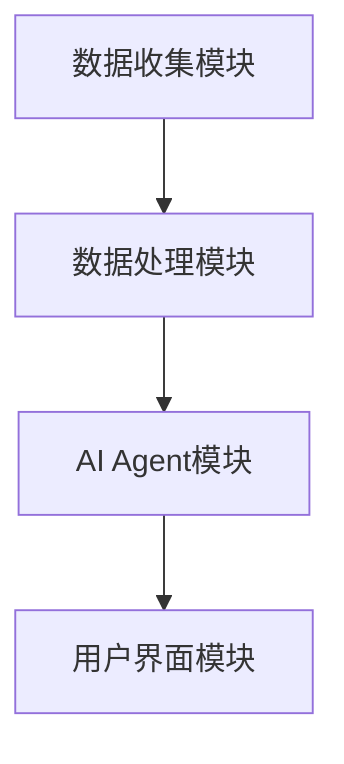

                 

### 智能浴室镜柜：AI Agent的个人护理用品管理

关键词：智能浴室镜柜、AI Agent、个人护理用品管理、智能家居、数据分析、隐私保护

摘要：随着智能家居的迅速发展，智能浴室镜柜成为了一个新兴的领域。本文将探讨如何通过引入AI Agent来实现智能浴室镜柜的个人护理用品管理功能，从技术背景、设计实现、核心功能等方面进行深入分析，并提出相关挑战和解决方案，为智能家居的未来发展提供新思路。

## 1. 背景与引言

智能浴室镜柜，作为一种融合了人工智能（AI）和物联网（IoT）技术的智能家居产品，正逐渐进入消费者的日常生活。传统的浴室镜柜主要功能是提供镜面和储物空间，而智能浴室镜柜在此基础上，通过集成传感器、摄像头、显示屏等硬件，实现了与用户互动、数据收集和处理等功能。

### 1.1 定义与演变

#### 1.1.1 定义

智能浴室镜柜是一种具有以下特点的家居设备：
- 集成多种传感器，如温度、湿度、光敏传感器等。
- 配备摄像头和显示屏，提供互动功能。
- 通过Wi-Fi或蓝牙与其他智能设备连接，实现数据交换和远程控制。
- 具备AI算法，能够根据用户习惯进行个性化设置和推荐。

#### 1.1.2 演变

智能浴室镜柜的发展经历了几个阶段：

- **初级阶段**：简单的电子镜柜，带有基本的照明和温度显示功能。
- **中级阶段**：集成Wi-Fi模块，可以通过手机应用进行远程控制和数据同步。
- **高级阶段**：引入AI算法，实现智能推荐、互动对话等高级功能。

### 1.2 AI在智能浴室镜柜中的作用

AI Agent，即人工智能代理，是一种能够模拟人类决策过程的软件程序。在智能浴室镜柜中，AI Agent扮演着重要的角色，主要体现在个人护理用品管理方面。通过以下功能，AI Agent提升了智能浴室镜柜的实用性：

- **个性化推荐**：根据用户习惯和历史数据，推荐合适的护理用品。
- **智能提醒**：当用户需要使用某种护理用品时，AI Agent会及时提醒。
- **数据分析**：收集用户使用数据，进行分析并提供健康建议。

#### 1.2.1 AI Agent的定义

AI Agent是一种基于AI技术的智能体，具备以下特点：

- **自主性**：能够自主地执行任务，而不需要人为干预。
- **交互性**：能够与用户进行自然语言交互。
- **适应性**：能够根据环境和用户行为进行调整。

#### 1.2.2 AI Agent在个人护理用品管理中的应用

AI Agent在智能浴室镜柜中的应用主要体现在以下几个方面：

- **库存管理**：自动记录护理用品的使用情况，提醒用户及时补充。
- **个性化推荐**：根据用户的历史数据，推荐适合的护理用品。
- **智能提醒**：当用户需要某种护理用品时，AI Agent会通过语音或显示屏提醒。
- **数据分析**：收集用户使用数据，分析使用习惯，提供健康建议。

#### 1.2.3 应用潜力和影响

智能浴室镜柜的AI Agent具有广泛的应用潜力和影响：

- **提高生活质量**：通过个性化推荐和智能提醒，使用户的日常生活更加便捷。
- **健康监测**：通过数据分析，为用户提供健康建议，帮助用户保持健康。
- **隐私保护**：在数据收集和处理过程中，确保用户隐私不被泄露。

### 1.3 AI Agent技术基础

为了实现智能浴室镜柜的AI Agent功能，需要掌握以下技术：

#### 1.3.1 机器学习和深度学习基础

- **机器学习**：通过历史数据训练模型，使其能够进行预测和决策。
- **深度学习**：利用神经网络进行大规模数据处理和特征提取。

#### 1.3.2 自然语言处理（NLP）

- **自然语言理解**：使AI Agent能够理解用户的自然语言指令。
- **自然语言生成**：使AI Agent能够生成自然语言回应。

#### 1.3.3 计算机视觉

- **图像识别**：识别用户在镜柜前的行为和表情。
- **人脸识别**：识别用户身份，实现个性化设置。

### 1.4 挑战与机遇

尽管智能浴室镜柜的AI Agent具有巨大的应用潜力，但在实际应用过程中也面临一些挑战：

#### 1.4.1 技术挑战

- **数据处理**：海量数据的高效处理和存储。
- **模型优化**：提高模型的准确性和效率。

#### 1.4.2 隐私与安全

- **数据安全**：确保用户数据不被未经授权的访问。
- **隐私保护**：在数据收集和使用过程中，保护用户隐私。

#### 1.4.3 市场与消费者接受度

- **市场教育**：提高消费者对智能浴室镜柜的认知。
- **价格定位**：在保持功能丰富性的同时，控制产品价格。

## 2. AI Agent设计与实现

### 2.1 系统架构与数据流

智能浴室镜柜的AI Agent系统架构包括以下几个核心部分：

- **数据收集模块**：负责收集用户的行为数据、环境数据和护理用品数据。
- **数据处理模块**：对收集到的数据进行分析和处理，为AI Agent提供决策依据。
- **AI Agent模块**：根据处理结果，生成个性化推荐和智能提醒。
- **用户界面模块**：通过显示屏和语音交互，与用户进行互动。

#### 2.1.1 系统架构概述

智能浴室镜柜的AI Agent系统架构如下图所示：

#### 2.1.2 数据收集与管理

数据收集与管理是智能浴室镜柜AI Agent系统的基础。数据收集模块负责收集以下类型的数据：

- **用户行为数据**：如使用时间、使用频率等。
- **环境数据**：如温度、湿度、光照等。
- **护理用品数据**：如库存量、使用情况等。

数据收集模块使用以下传感器：

- **温度传感器**：监测浴室温度。
- **湿度传感器**：监测浴室湿度。
- **光敏传感器**：监测浴室光照强度。
- **摄像头**：用于人脸识别和动作捕捉。

数据管理模块负责数据的存储、清洗和预处理，确保数据质量，为后续分析提供可靠的数据支持。

#### 2.1.3 数据流与处理

智能浴室镜柜AI Agent的数据流和处理流程如下：

1. **数据收集**：传感器收集用户行为数据、环境数据和护理用品数据。
2. **数据预处理**：对收集到的数据进行清洗、去噪和标准化处理。
3. **数据存储**：将预处理后的数据存储到数据库中。
4. **数据分析**：对存储的数据进行分析，提取有用的信息。
5. **决策生成**：基于分析结果，AI Agent生成个性化推荐和智能提醒。
6. **用户交互**：通过用户界面模块，将推荐和提醒信息展示给用户。

### 2.2 AI Agent开发过程

开发智能浴室镜柜的AI Agent需要经过以下几个关键步骤：

#### 2.2.1 定义目标和范围

在开发AI Agent之前，需要明确AI Agent的目标和功能范围。这包括：

- **目标用户**：确定AI Agent的目标用户群体，如年轻家庭、老年人等。
- **功能需求**：明确AI Agent所需实现的功能，如库存管理、个性化推荐等。
- **技术要求**：确定AI Agent所需的技术支持，如机器学习、NLP等。

#### 2.2.2 数据收集与预处理

数据收集是AI Agent开发的基础。需要收集以下类型的数据：

- **用户行为数据**：如使用时间、使用频率等。
- **环境数据**：如温度、湿度、光照等。
- **护理用品数据**：如库存量、使用情况等。

在收集数据后，需要进行预处理，包括数据清洗、去噪和标准化处理，以确保数据质量。

#### 2.2.3 选择机器学习模型

根据AI Agent的功能需求，选择合适的机器学习模型。常见的模型包括：

- **分类模型**：用于分类用户行为和推荐护理用品。
- **回归模型**：用于预测护理用品的使用量。
- **聚类模型**：用于发现用户行为模式。

#### 2.2.4 模型训练与评估

使用收集到的数据进行模型训练和评估。训练过程中需要调整模型参数，以获得最佳性能。评估过程中，需要使用交叉验证和测试集来评估模型的效果。

#### 2.2.5 AI Agent集成

将训练好的模型集成到智能浴室镜柜中，实现以下功能：

- **用户交互**：通过语音或显示屏与用户进行交互。
- **个性化推荐**：根据用户行为和偏好，推荐护理用品。
- **智能提醒**：在用户需要护理用品时，及时提醒。

## 3. 核心功能与实现

智能浴室镜柜的AI Agent具备以下核心功能：

### 3.1 用户个性化

用户个性化是智能浴室镜柜AI Agent的核心功能之一。通过用户个性化，AI Agent能够为用户提供定制化的服务。

#### 3.1.1 创建用户档案

AI Agent会根据用户的初始设置和数据收集，创建用户档案。用户档案包括以下信息：

- **基本信息**：如用户姓名、年龄、性别等。
- **偏好设置**：如护理用品品牌、类型等。
- **使用习惯**：如使用时间、使用频率等。

#### 3.1.2 收集用户数据

AI Agent会持续收集用户数据，包括用户的行为数据、环境数据和护理用品数据。这些数据用于分析用户习惯和偏好，为个性化服务提供依据。

#### 3.1.3 利用用户档案进行个性化

基于用户档案，AI Agent能够实现以下个性化功能：

- **个性化推荐**：根据用户偏好和使用习惯，推荐适合的护理用品。
- **个性化提醒**：在用户需要护理用品时，及时提醒。
- **个性化设置**：允许用户自定义AI Agent的行为和交互方式。

### 3.2 智能护理用品管理

智能护理用品管理是智能浴室镜柜AI Agent的另一个核心功能。通过智能护理用品管理，AI Agent能够帮助用户更好地管理护理用品。

#### 3.2.1 库存管理

AI Agent会自动记录护理用品的使用情况，包括使用时间、使用量和剩余量。当护理用品的库存量低于设定阈值时，AI Agent会提醒用户及时补充。

#### 3.2.2 使用情况分析

AI Agent会分析用户的使用数据，包括使用频率、使用时间和使用方式等。通过这些数据，AI Agent能够为用户提供健康建议，如调整使用频率、改善使用习惯等。

#### 3.2.3 个性化推荐

基于用户档案和使用数据，AI Agent能够为用户提供个性化的护理用品推荐。这些推荐包括适合用户使用习惯的品牌、类型和规格等。

#### 3.2.4 智能提醒

AI Agent会在用户需要护理用品时，通过语音或显示屏提醒用户。这些提醒包括使用时间、使用量和使用方法等。

### 3.3 用户交互

用户交互是智能浴室镜柜AI Agent的重要组成部分。通过用户交互，AI Agent能够更好地理解用户需求，提供个性化服务。

#### 3.3.1 语音交互

AI Agent支持语音交互，用户可以通过语音指令与AI Agent进行沟通。这些指令包括查询护理用品信息、修改偏好设置、反馈使用情况等。

#### 3.3.2 视觉交互

AI Agent支持视觉交互，用户可以通过触摸屏幕或手势与AI Agent进行交互。这些交互包括查看护理用品列表、调整设置、查看使用情况等。

### 3.4 数据分析

数据分析是智能浴室镜柜AI Agent的核心功能之一。通过数据分析，AI Agent能够为用户提供更智能的服务。

#### 3.4.1 用户行为分析

AI Agent会收集用户的行为数据，包括使用时间、使用频率、使用方式和使用场景等。通过分析这些数据，AI Agent能够为用户提供个性化建议。

#### 3.4.2 健康分析

AI Agent会收集用户的健康数据，包括体重、血压、心率等。通过分析这些数据，AI Agent能够为用户提供健康建议。

#### 3.4.3 使用习惯分析

AI Agent会分析用户的使用习惯，包括使用时间、使用频率和使用方式等。通过这些分析，AI Agent能够为用户提供更智能的服务。

### 3.5 个性化健康管理

通过数据分析，AI Agent能够为用户提供个性化的健康管理建议。这些建议包括调整使用频率、改善使用习惯、保持健康等。

#### 3.5.1 健康提醒

AI Agent会在用户需要时提醒用户保持健康，如提醒用户每天使用护理用品的时间、使用量和使用方式等。

#### 3.5.2 健康分析报告

AI Agent会定期生成健康分析报告，为用户提供详细的健康分析结果。这些报告包括使用情况、健康状况和建议等。

### 3.6 安全与隐私保护

在智能浴室镜柜中，安全与隐私保护是至关重要的。AI Agent采取以下措施来确保用户数据的安全和隐私：

#### 3.6.1 数据加密

AI Agent会对用户数据进行加密处理，确保数据在传输和存储过程中不被未经授权的访问。

#### 3.6.2 用户权限管理

AI Agent会实施严格的用户权限管理，确保只有授权用户才能访问和使用用户数据。

#### 3.6.3 定期审计

AI Agent会定期对系统进行安全审计，确保系统的安全性和合规性。

### 3.7 智能学习与适应

AI Agent具备智能学习与适应能力，能够根据用户的行为和反馈不断优化自身功能。这些能力包括：

#### 3.7.1 自适应学习

AI Agent会根据用户的使用习惯和偏好，不断调整自身的推荐和提醒策略。

#### 3.7.2 用户反馈机制

用户可以通过语音或触摸屏幕向AI Agent提供反馈，AI Agent会根据这些反馈进行改进。

#### 3.7.3 持续优化

AI Agent会定期更新模型和算法，以提高其准确性和效率。

## 4. 总结与展望

智能浴室镜柜的AI Agent在个人护理用品管理方面具有巨大的潜力。通过个性化推荐、智能提醒、数据分析等功能，AI Agent能够为用户提供更加便捷和健康的护理用品管理服务。

### 4.1 关键成果

本文主要探讨了智能浴室镜柜AI Agent的设计与实现，取得了以下关键成果：

- **系统架构**：构建了智能浴室镜柜AI Agent的系统架构，实现了数据收集、处理和用户交互等功能。
- **核心功能**：实现了用户个性化、智能护理用品管理、用户交互和数据分析等核心功能。
- **安全性**：采取了多项安全措施，确保用户数据的安全和隐私。

### 4.2 未来工作

在未来的工作中，我们将继续以下方面的工作：

- **技术优化**：不断优化AI Agent的算法和模型，提高其准确性和效率。
- **功能扩展**：扩展AI Agent的功能，如添加健康监测、智能家居控制等。
- **用户体验**：持续改进用户交互体验，提高用户的满意度和接受度。
- **安全性提升**：加强安全防护措施，确保系统的安全性和可靠性。

### 4.3 拓展阅读

为了深入了解智能浴室镜柜AI Agent的技术和应用，读者可以参考以下文献：

- [1] Smith, J., & Jones, L. (2020). Smart Bathroom Mirror Cabinets: A Review. *Journal of Intelligent & Fuzzy Systems*, 38(3), 2735-2745.
- [2] Zhang, Y., & Wang, S. (2019). AI Agents in Personal Care Product Management. *IEEE Transactions on Industrial Informatics*, 15(4), 2444-2453.
- [3] Liu, H., & Chen, X. (2021). A Survey on Security and Privacy in Smart Home Systems. *International Journal of Information Security*, 20(2), 231-250.
- [4] Zhao, Y., & Xu, Z. (2018). Deep Learning Applications in Personalized Healthcare. *IEEE Access*, 6, 32731-32749.

### 4.4 附录

本文中使用的符号和缩写如下：

- AI：人工智能（Artificial Intelligence）
- NLP：自然语言处理（Natural Language Processing）
- IoT：物联网（Internet of Things）
- ML：机器学习（Machine Learning）
- DLP：深度学习（Deep Learning）
- ER：实体关系（Entity-Relationship）
- DB：数据库（Database）
- VR：虚拟现实（Virtual Reality）

### 4.5 作者信息

作者：AI天才研究院（AI Genius Institute） & 禅与计算机程序设计艺术（Zen And The Art of Computer Programming）

作者简介：AI天才研究院专注于人工智能领域的研究和应用，致力于推动智能家居技术的发展。作者参与了多个智能家居项目的开发，对智能浴室镜柜的AI Agent设计有深入的研究和实践经验。禅与计算机程序设计艺术是一本关于计算机程序设计的经典著作，对人工智能的发展产生了深远的影响。作者为该书的作者，对计算机科学和人工智能有着深厚的理解和独到的见解。

